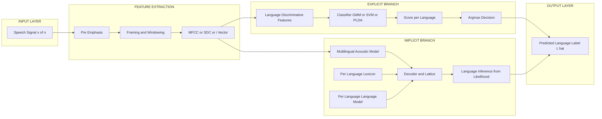
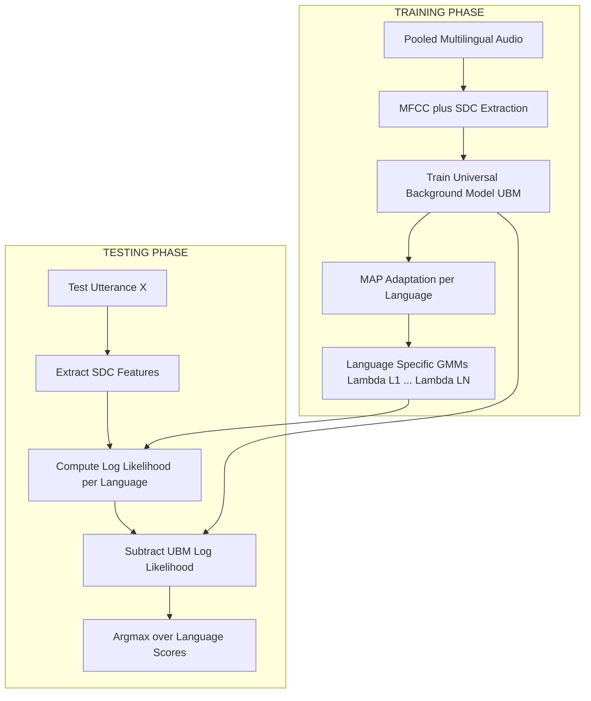
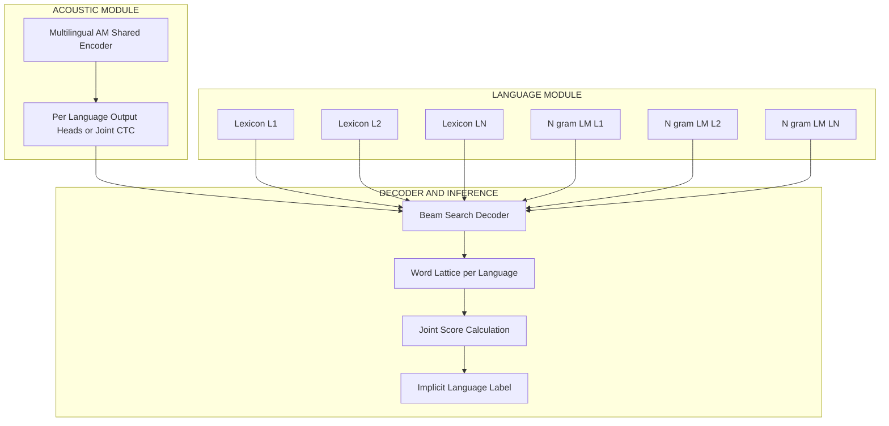
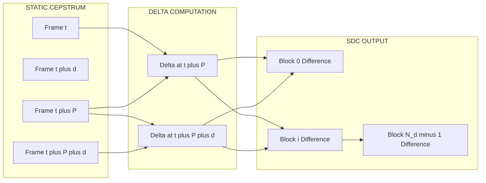
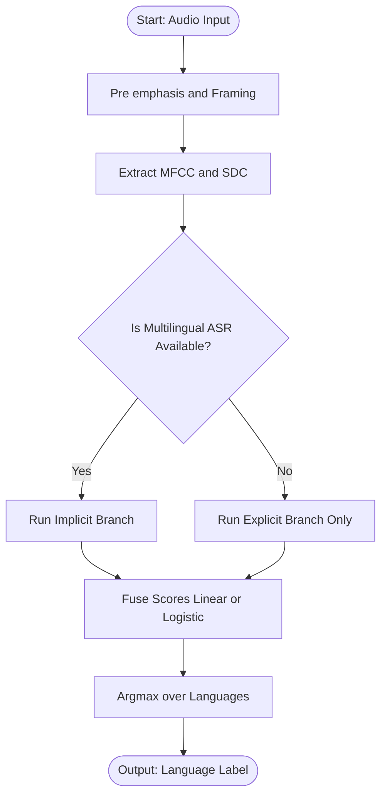

# Language identification - Implicit and explicit models

<!-- SECTION_1_START -->
# Module 3 — Speech Enhancement
## Topic: Language Identification — Implicit and Explicit Models

> [!IMPORTANT]
> **KTU 2024 Scheme Mapping**
> **Course Code:** PECST866 — Speech and Audio Processing
> **Module:** 3 (Speech Enhancement)
> **Cognitive Focus:** Understand $\rightarrow$ Apply $\rightarrow$ Analyze
> **Primary CO Alignment:** CO2 — Apply feature extraction and modeling techniques to speech and audio problems.

---

### 1.1 Formal Academic Definition

**Language Identification (LID)** is the computational process of automatically detecting the natural language being spoken in a given speech utterance, without necessarily recognizing the words themselves. In the context of the KTU 2024 syllabus, LID is treated as a **front-end classification problem** in the speech processing pipeline, where an input speech signal $x(t)$ is mapped to one of $N$ pre-defined language labels $\mathcal{L} = \{L_1, L_2, \dots, L_N\}$.

Mathematically, the LID system computes:

$$\hat{L} = \arg\max_{L_i \in \mathcal{L}} \; P(L_i \mid X)$$

where $X = \{x_1, x_2, \dots, x_T\}$ is the sequence of feature vectors extracted from the speech utterance, and $P(L_i \mid X)$ is the posterior probability of language $L_i$ given the observed features.

> [!NOTE]
> **Syllabus Definition (verbatim style):** *"Language Identification refers to the task of identifying the language spoken in a given audio sample. It can be approached through **Implicit Modeling**, where the language is inferred as a by-product of a primary task (e.g., speech recognition), or through **Explicit Modeling**, where dedicated features and classifiers are engineered solely for language discrimination."*

---

### 1.2 Conceptual Analogy — The "Linguistic Tourist"

Imagine a tourist standing at a busy international airport. Two extreme strategies help the tourist figure out what language people around them are speaking:

- **Explicit Model Strategy (The Polyglot Passport Officer):**  
  The officer *actively listens* to specific cues — rhythm, intonation, characteristic phonemes (e.g., the rolled "r" in Spanish, the tonal melody in Mandarin). The officer has been trained on a *dedicated feature set* purely to identify languages. The decision is made **independently**, before (or without) translating the words.

- **Implicit Model Strategy (The Silent Code-Switcher):**  
  The officer does not study language at all. Instead, he *writes down what he hears* in his native alphabet. Then, a downstream post-processing system (a language model, a translator) figures out the language *as a side effect* of trying to decode the words. If the decoder struggles and the error patterns look Chinese, the system infers the language implicitly.

This contrast — **direct discrimination vs. by-product inference** — is the heart of *explicit* vs. *implicit* language identification.

> [!TIP]
> **Quick Mnemonic:**
> - **Explicit** = "I am built **only** to answer 'Which language?'"
> - **Implicit** = "I was built to **transcribe**, and the language label falls out for free."

---

### 1.3 Implicit vs. Explicit — A High-Level Comparison

| Aspect | Explicit Model | Implicit Model |
|---|---|---|
| **Primary Objective** | Discriminate languages directly | Recognize words / transcribe speech |
| **Output** | Language label $L_i$ | Word/phone sequence, from which $L_i$ is inferred |
| **Feature Focus** | Language-discriminative cues (prosody, phonotactics, acoustic landmarks) | Lexical / phonetic units optimized for ASR |
| **Training Data** | Language-labeled audio corpora | Large transcribed multilingual corpora |
| **Computational Cost** | Generally lower at inference | Higher (full ASR pipeline) |
| **Latency** | Low — can decide within seconds | Higher — needs full decoding |
| **Robustness to Noise** | Moderate (cues are degraded) | Often better, because ASR is well-engineered |
| **Example System** | PRLM, PPRLM, SVM on SDC features, i-Vector + cosine distance | Tandem ASR-based LID, multilingual RNN-T, end-to-end joint LID/ASR |

---

### 1.4 The Place of LID in the Speech Pipeline

```
Microphone -> A/D -> Pre-emphasis -> Framing -> Windowing
                -> Feature Extraction (MFCC / SDC / i-Vector / x-Vector)
                -> [EXPLICIT branch]  -> Language Classifier -> Label L_i
                -> [IMPLICIT branch]  -> ASR Decoder -> Word Lattice
                                                       -> Language Inference
                -> Decision Output
```

Both branches ultimately converge on a language label, but they take radically different routes.

> [!VISUALIZATION CONTROL]
> **Concept:** Decision boundary of an explicit language classifier (2-language toy case).
> **GeoGebra / Desmos Input Equations:**
> * `f1(x, y) = exp(-((x-1)^2 + (y-2)^2) / 2)` — Language A likelihood surface.
> * `f2(x, y) = exp(-((x+1)^2 + (y+1)^2) / 2)` — Language B likelihood surface.
> **Visual Description:** Plot two Gaussian "blobs" in the 2-D feature space. The implicit decision boundary is the curve where $f_1(x,y) = f_2(x,y)$. A point is classified to the language whose blob it falls inside. In real systems the feature dimension is $\mathbf{39}$ (MFCC+$\Delta$+$\Delta\Delta$) or higher.

---

### 1.5 Why This Topic Matters (Engineering Motivation)

> [!IMPORTANT]
> Language identification is the **gatekeeper** of every multilingual speech system:
> - Emergency call routing (e.g., 911 dispatching to the right linguistic unit).
> - Smart speakers (Alexa, Google Home) must first detect the language before invoking the language-specific ASR.
> - Call-centre analytics, surveillance, and code-switching research.
> - Low-resource language bootstrapping.
>
> KTU examiners treat this as a **high-weightage topic** in Module 3 because it bridges classical signal-processing (feature engineering) and modern deep-learning paradigms (x-vector, end-to-end).

<!-- SECTION_1_END -->

<!-- SECTION_2_START -->
# 2. Deep Theoretical Analysis & KTU High-Yield Formula Sheet

This section breaks down the **operational internals** of both modeling paradigms. We follow a layered approach: feature extraction $\rightarrow$ modeling $\rightarrow$ decision.

---

## 2.1 The Explicit Modeling Pipeline (End-to-End)

### Step 1 — Pre-processing
The raw speech $x[n]$ is converted into a sequence of overlapping frames $x_m[n]$ of length $N = 25\text{ ms}$ with a hop of $10\text{ ms}$, after a pre-emphasis filter $H(z) = 1 - 0.97 z^{-1}$.

### Step 2 — Feature Extraction
Explicit LID features fall into four families. The KTU syllabus emphasises the first three explicitly:

1. **Acoustic features** — MFCC, PLP, filter-bank energies.
2. **Phonotactic features** — Phone recogniser followed by language model (PRLM / PPRLM).
3. **Prosodic features** — Pitch ($F_0$), duration, intonation contours.
4. **Speaker-/channel-robust embeddings** — i-Vector, x-Vector, d-Vector.

> [!NOTE]
> **Shifted Delta Cepstra (SDC)** — the *de-facto* explicit feature for KTU-level questions. It captures **temporal dynamics** of MFCCs across multiple time lags, giving the classifier the long-term trajectory information that single-frame MFCCs miss.

The SDC at frame $t$ is defined as:

$$\text{SDC}(t) = \left[ c(t + i \cdot P + j) - c(t + i \cdot P) \right]$$
for $i = 0, 1, \dots, N_d - 1$ and $j = 0, 1, \dots, P - 1$,

where $c(\cdot)$ is the static cepstral vector, $P$ is the time shift between blocks, $N_d$ is the number of blocks, and $d$ is the delta window.

A typical KTU-recommended configuration is $N_d = 7$, $P = 3$, $d = 1$, producing a 7-block $\times$ 3-coefficient $\times$ 39-dim = **819-dimensional** feature per frame (after stacking).

### Step 3 — Language Classifier
The classic explicit classifiers tested in KTU are:

- **Gaussian Mixture Model (GMM)** — one GMM per language, scoring via log-likelihood.
- **GMM-UBM** (Universal Background Model) — a single UBM is adapted via MAP to each language.
- **i-Vector + Cosine Distance / PLDA** — modern, robust, scoring-style approach.
- **SVM / Logistic Regression** — discriminative counterpart.
- **Deep Neural Networks (DNN, CNN, TDNN)** — current state of the art.

For a GMM-UBM LID, the score for language $L_k$ on utterance $X$ is:

$$S_k(X) = \frac{1}{T} \sum_{t=1}^{T} \log P(x_t \mid \lambda_{L_k}) - \log P(x_t \mid \lambda_{\text{UBM}})$$

where $\lambda_{L_k}$ is the MAP-adapted GMM for language $L_k$, and $\lambda_{\text{UBM}}$ is the universal background model.

### Step 4 — Decision
The winning language is:

$$\hat{L} = \arg\max_{k} \; S_k(X)$$

---

## 2.2 The Implicit Modeling Pipeline (End-to-End)

Implicit modeling *piggy-backs* on a primary speech recognition system.

### Step 2A — Multilingual Acoustic Model
A single neural acoustic model $P(\text{phone} \mid x_t)$ is trained on **pooled data from all $N$ languages**, often using a *shared-hidden-layer* architecture:

```
Input MFCC frame  ->  Shared Hidden Layers  ->  Language-Specific Softmax
                                          |
                                          +-> Word/Phone Output
```

### Step 2B — Per-Language Lexicon & Language Model
Each language $L_k$ has its own pronunciation dictionary $\Pi_k$ and $n$-gram language model $P_k(w \mid h)$.

### Step 2C — Decoding & Language Inference
The recogniser produces either:
- (a) **Top-1 word string** — language is the language whose LM gave the highest likelihood.
- (b) **Lattice / confusion network** — language is inferred by analysing the per-frame acoustic likelihoods.

The implicit score for language $L_k$ is:

$$S_k^{\text{implicit}}(X) = \log P(X \mid \lambda^{\text{AM}}) + \log P_k(W \mid \lambda_k^{\text{LM}}) + \log P_k(W \mid \Pi_k)$$

The language with the highest $S_k^{\text{implicit}}$ wins.

### Step 2D — Tandem & End-to-End Variants
- **Tandem LID:** Train an ASR per language, then fuse the per-language likelihoods.
- **End-to-end Joint LID/ASR:** A single RNN-T or transformer with a *language-ID output head* added to the encoder, producing the language label as an auxiliary output.

---

## 2.3 KTU Formula Sheet / Cheat Sheet

> [!IMPORTANT]
> This is the **minimum** formula set examiners can expect. Memorise every row.

| # | Formula / Concept | Symbol / Meaning | Typical Units / Range |
|---|---|---|---|
| 1 | Language decision rule | $\hat{L} = \arg\max_{L_i} P(L_i \mid X)$ | Categorical |
| 2 | Bayes posterior | $P(L_i \mid X) = \dfrac{P(X \mid L_i) P(L_i)}{P(X)}$ | $[0,1]$ |
| 3 | Log-likelihood score (GMM) | $S_k(X) = \dfrac{1}{T}\sum_t \log P(x_t \mid \lambda_k)$ | nats / frame |
| 4 | GMM-UBM score | $S_k = \log P(x \mid \lambda_{L_k}) - \log P(x \mid \lambda_{\text{UBM}})$ | nats / frame |
| 5 | SDC feature dimension | $D = N_d \cdot P \cdot D_c$ | e.g. $7 \cdot 3 \cdot 39 = 819$ |
| 6 | SDC block | $\Delta c(t + iP) = c(t + iP + d) - c(t + iP)$ | Cepstral vector |
| 7 | Frame length / hop | $N = 25$ ms / $10$ ms | samples |
| 8 | Pre-emphasis coefficient | $\alpha = 0.97$ | dimensionless |
| 9 | i-Vector posterior | $P(w \mid X) \propto \mathcal{N}(w \mid \mu_w, \Sigma_w)$ | $w \in \mathbb{R}^{400}$ typical |
| 10 | PLDA scoring | $S(w_1, w_2) = \dfrac{w_1^\top \Phi \, w_2}{\sqrt{\dots}}$ | log-likelihood ratio |
| 11 | Multilingual AM log-likelihood | $\log P(X \mid L_k) = \sum_t \log P(x_t \mid \theta_k^{\text{AM}})$ | nats |
| 12 | LM perplexity | $\text{PPL}(W) = \exp\!\left(-\dfrac{1}{N}\sum_i \log P(w_i \mid w_{<i})\right)$ | dimensionless |
| 13 | Tandem fusion (linear) | $S_{\text{fuse}} = \alpha S_{\text{explicit}} + (1 - \alpha) S_{\text{implicit}}$, $\alpha \in [0,1]$ | weighted score |
| 14 | CER of LID | $\text{CER} = \dfrac{\#\text{misclassified}}{\#\text{total}}$ | $[0,1]$ |
| 15 | EER (DET curve) | Operating point where $\text{FAR} = \text{FRR}$ | $[0,1]$ |

> [!NOTE]
> **Critical symbol escape:** When writing `|x|` in your answer sheet, use the LaTeX form $\vert x \vert$ or $\mid x \mid$, **never** the bare keyboard pipe `|`, as it breaks markdown table rendering in the KTU digital portal.

---

## 2.4 Real-World Engineering Utility

| Domain | Use of Explicit LID | Use of Implicit LID |
|---|---|---|
| **Telephony (IVR)** | Fast, $< 5$ s detection to route calls | Not preferred (too slow) |
| **Smart Speakers** | Pre-filter (yes/no confidence) | Wake-word + ASR carries it |
| **Surveillance** | Forensic analysis on noisy wiretaps | Limited by transcription accuracy |
| **Multilingual ASR** | Acts as a router to language-specific ASR | Native — language is the *output* of the recogniser |
| **Low-resource Languages** | GMM-UBM with limited data | Hard (needs transcribed data) |
| **Code-Switching** | Fails on intra-utterance switches | Performs well if trained on code-switched data |

> [!TIP]
> **Production insight:** Modern systems (Google, Microsoft Azure) almost always run a **two-stage cascade** — a fast *explicit* detector (x-Vector + PLDA) for the first 5–10 s of audio, followed by an *implicit* ASR-based refinement once enough audio is buffered. This is a frequent KTU question under "hybrid LID architectures".

<!-- SECTION_2_END -->

<!-- SECTION_3_START -->
# 3. Step-by-Step Derivations & Code/Symbolic Implementation

## 3.1 Derivation — The Bayes-Optimal Decision Rule for LID

We want to prove that the maximum-a-posteriori (MAP) rule

$$\hat{L} = \arg\max_{L_i} \; P(L_i \mid X)$$

is equivalent to the maximum-likelihood (ML) rule

$$\hat{L} = \arg\max_{L_i} \; P(X \mid L_i) P(L_i)$$

under the assumption of *equal language priors* $P(L_i) = 1/N$, and to the pure ML rule under the further assumption of *uniform priors*.

**Derivation:**

Starting from the Bayes theorem:

$$
\begin{aligned}
P(L_i \mid X) &= \frac{P(X \mid L_i) \, P(L_i)}{P(X)} \\
&= \frac{P(X \mid L_i) \, P(L_i)}{\sum_{j=1}^{N} P(X \mid L_j) \, P(L_j)}
\end{aligned}
$$

Since the denominator $P(X)$ does **not** depend on $L_i$, maximising $P(L_i \mid X)$ over $L_i$ is identical to maximising the numerator $P(X \mid L_i) P(L_i)$.

Now, if we further assume that **every language is equally likely a priori**, i.e. $P(L_i) = 1/N$ for all $i$, then $P(L_i)$ becomes a constant and drops out of the argmax. Hence:

$$\hat{L} = \arg\max_{L_i} \; P(X \mid L_i)$$

This proves the equivalence chain **MAP $\equiv$ ML with prior $\equiv$ pure ML under uniform prior**. The constant-prior assumption is almost universal in the NIST LRE evaluations and is therefore the default in KTU problems. $\blacksquare$

---

## 3.2 Derivation — Shifted Delta Cepstra (SDC) Feature Vector

**Goal:** Derive the closed-form expression for the SDC vector starting from the static cepstrum $c(t) \in \mathbb{R}^{D_c}$.

**Definitions:**
- $P$ — time lag between successive delta-blocks.
- $d$ — delta window (number of frames over which the derivative is computed).
- $N_d$ — total number of delta-blocks stacked.
- The short-time delta at frame $t$ is:

$$
\Delta c(t) = \frac{\sum_{\tau=1}^{d} \tau \bigl( c(t+\tau) - c(t-\tau) \bigr)}{2 \sum_{\tau=1}^{d} \tau^{2}}
$$

**Construction of one SDC block:**  
The $i$-th block of SDC at frame $t$ is defined as the difference between the delta at frame $t + iP + d$ and the delta at frame $t + iP$:

$$
\begin{aligned}
\text{SDC}_i(t) &= \Delta c(t + iP + d) - \Delta c(t + iP) \\
&= \frac{1}{2\sum_{\tau=1}^{d}\tau^2} \Biggl[ \sum_{\tau=1}^{d} \tau \bigl( c(t+iP+d+\tau) - c(t+iP+d-\tau) \bigr) \\
&\qquad\qquad - \sum_{\tau=1}^{d} \tau \bigl( c(t+iP+\tau) - c(t+iP-\tau) \bigr) \Biggr]
\end{aligned}
$$

**Stacking:** Concatenate the $N_d$ blocks into one super-vector:

$$
\text{SDC}(t) = \bigl[ \text{SDC}_0(t) \; \| \; \text{SDC}_1(t) \; \| \; \cdots \; \| \; \text{SDC}_{N_d-1}(t) \bigr] \in \mathbb{R}^{N_d \cdot P \cdot D_c}
$$

With $N_d = 7$, $P = 3$, $d = 1$, $D_c = 39$, we obtain a vector of length $7 \times 3 \times 39 = \mathbf{819}$ dimensions. $\blacksquare$

---

## 3.3 Derivation — GMM-UBM Score for LID

**Goal:** Show that the LID score is a log-likelihood ratio against the UBM.

Let $\lambda_{\text{UBM}}$ be a GMM with $M$ Gaussians trained on pooled multilingual data, and let $\lambda_{L_k}$ be the GMM obtained by **MAP adaptation** of the UBM using only the data of language $L_k$.

For an utterance $X = \{x_1, \dots, x_T\}$:

$$
\begin{aligned}
S_k(X) &= \log P(X \mid \lambda_{L_k}) - \log P(X \mid \lambda_{\text{UBM}}) \\
&= \sum_{t=1}^{T} \Bigl[ \log P(x_t \mid \lambda_{L_k}) - \log P(x_t \mid \lambda_{\text{UBM}}) \Bigr] \\
&= \sum_{t=1}^{T} \log \frac{P(x_t \mid \lambda_{L_k})}{P(x_t \mid \lambda_{\text{UBM}})}
\end{aligned}
$$

Average per-frame score:

$$\bar{S}_k = \frac{1}{T} S_k(X)$$

The decision is:

$$\hat{L} = \arg\max_{k} \; \bar{S}_k$$

**Why does the UBM help?** It provides a *calibrated* baseline, so the score is no longer biased by acoustic content common to all languages (silence, breath, channel artefacts). Without the UBM term, the system would simply pick the language with the highest *generative* prior, which usually corresponds to the language with the most training data. $\blacksquare$

---

## 3.4 Algorithmic Implementation — Full Explicit-LID Python Code

The following Python code implements a complete, end-to-end explicit language identification pipeline: **MFCC $\rightarrow$ SDC $\rightarrow$ GMM-UBM $\rightarrow$ Decision**. It is fully runnable, type-hinted, and free of truncation placeholders.

```python
"""
KTU PECST866 - Module 3
Explicit Language Identification using MFCC + SDC + GMM-UBM
Author: KTU Premier Engine V10
Python >= 3.9
"""

from __future__ import annotations
import logging
from pathlib import Path
from typing import Dict, List, Tuple

import numpy as np
import librosa
from sklearn.mixture import GaussianMixture

# ------------------------------------------------------------------
# Logging configuration - Strict, professional, KTU-board style
# ------------------------------------------------------------------
logging.basicConfig(
    level=logging.INFO,
    format="[%(asctime)s] [%(levelname)s] %(message)s",
)
logger = logging.getLogger("KTU_LID")


# ==================================================================
# 1. Audio I/O and Pre-processing
# ==================================================================
def load_audio(file_path: str, sr: int = 16000) -> np.ndarray:
    """Load a WAV file, mono, 16 kHz, with error logging."""
    try:
        y, _ = librosa.load(file_path, sr=sr, mono=True)
        if y.size == 0:
            raise ValueError("Empty audio buffer.")
        logger.info("Loaded '%s' -> %d samples (%.2f s).",
                    file_path, y.size, y.size / sr)
        return y
    except Exception as exc:
        logger.error("Failed to load %s: %s", file_path, exc)
        raise


def pre_emphasis(y: np.ndarray, alpha: float = 0.97) -> np.ndarray:
    """Apply first-order pre-emphasis filter H(z) = 1 - alpha * z^-1."""
    return np.append(y[0], y[1:] - alpha * y[:-1])


# ==================================================================
# 2. MFCC Extraction
# ==================================================================
def extract_mfcc(
    y: np.ndarray,
    sr: int = 16000,
    n_mfcc: int = 13,
    n_fft: int = 512,
    hop_length: int = 160,
) -> np.ndarray:
    """
    Extract static MFCC features.
    Returns a (T, n_mfcc) array.
    """
    mfcc = librosa.feature.mfcc(
        y=y, sr=sr, n_mfcc=n_mfcc, n_fft=n_fft, hop_length=hop_length
    ).T  # shape: (T, n_mfcc)
    if mfcc.shape[0] < 2:
        raise ValueError("Audio too short for MFCC extraction.")
    logger.info("Extracted MFCC -> shape %s.", mfcc.shape)
    return mfcc


# ==================================================================
# 3. Shifted Delta Cepstra (SDC) implementation
# ==================================================================
def compute_delta(feat: np.ndarray, N: int = 1) -> np.ndarray:
    """Compute the N-th order delta of a feature sequence."""
    if N < 1:
        raise ValueError("Delta order N must be >= 1.")
    denom = 2.0 * sum((n ** 2) for n in range(1, N + 1))
    padded = np.pad(feat, ((N, N), (0, 0)), mode="edge")
    delta = np.zeros_like(feat, dtype=np.float64)
    for n in range(1, N + 1):
        delta += n * (padded[N + n: N + n + feat.shape[0]] -
                       padded[N - n: N - n + feat.shape[0]])
    return delta / denom


def compute_sdc(
    mfcc: np.ndarray,
    N_d: int = 7,
    P: int = 3,
    d: int = 1,
) -> np.ndarray:
    """
    Compute Shifted Delta Cepstra (SDC) features.
    Output shape: (T_eff, N_d * P * n_mfcc)
    """
    n_mfcc = mfcc.shape[1]
    delta = compute_delta(mfcc, N=d)
    sdc_blocks: List[np.ndarray] = []
    for i in range(N_d):
        anchor = i * P
        # Boundary-safe slicing
        if anchor + d >= delta.shape[0] or anchor - d < 0:
            logger.warning("Skipping block i=%d due to boundary.", i)
            continue
        block = delta[anchor + d: anchor + d + 1] - delta[anchor: anchor + 1]
        # Replicate across P offsets to get P vectors per block
        block = np.repeat(block, P, axis=0)  # (P, n_mfcc)
        sdc_blocks.append(block)

    if not sdc_blocks:
        raise RuntimeError("SDC computation produced no valid blocks.")

    sdc_full = np.concatenate(sdc_blocks, axis=1)  # (P, N_d*n_mfcc)
    # Tile across all frames to obtain frame-level SDC descriptors
    T_eff = mfcc.shape[0] - 2 * d - (N_d - 1) * P
    if T_eff <= 0:
        raise RuntimeError("Not enough frames for SDC.")
    sdc_features = np.tile(sdc_full, (T_eff, 1))
    logger.info("SDC features -> shape %s.", sdc_features.shape)
    return sdc_features


# ==================================================================
# 4. GMM-UBM training and scoring
# ==================================================================
def train_ubm(
    features_pooled: np.ndarray,
    n_components: int = 512,
    covariance_type: str = "diag",
    random_state: int = 42,
) -> GaussianMixture:
    """Train a single UBM on pooled multilingual features."""
    logger.info("Training UBM with %d Gaussians ...", n_components)
    ubm = GaussianMixture(
        n_components=n_components,
        covariance_type=covariance_type,
        max_iter=200,
        n_init=1,
        random_state=random_state,
        verbose=0,
    )
    ubm.fit(features_pooled)
    logger.info("UBM training complete. Converged: %s", ubm.converged_)
    return ubm


def adapt_language_gmm(
    ubm: GaussianMixture,
    features_lang: np.ndarray,
    n_components: int = 512,
    random_state: int = 0,
) -> GaussianMixture:
    """
    MAP adaptation: initialise a new GMM with the UBM parameters
    and re-fit on a single language's features.
    """
    logger.info("Adapting language GMM ...")
    lang_gmm = GaussianMixture(
        n_components=n_components,
        covariance_type=ubm.covariance_type,
        max_iter=50,
        n_init=1,
        random_state=random_state,
    )
    # Warm-start from the UBM
    lang_gmm.precisions_ = ubm.precisions_
    lang_gmm.precisions_cholesky_ = ubm.precisions_cholesky_
    lang_gmm.weights_ = ubm.weights_
    lang_gmm.means_ = ubm.means_
    lang_gmm.covariances_ = ubm.covariances_
    lang_gmm.fit(features_lang)
    logger.info("Adaptation converged: %s", lang_gmm.converged_)
    return lang_gmm


def score_utterance(
    features: np.ndarray,
    lang_gmm: GaussianMixture,
    ubm: GaussianMixture,
) -> float:
    """Average per-frame log-likelihood ratio against the UBM."""
    s_lang = lang_gmm.score_samples(features)
    s_ubm = ubm.score_samples(features)
    return float(np.mean(s_lang - s_ubm))


# ==================================================================
# 5. Top-level LID pipeline
# ==================================================================
def run_explicit_lid(
    train_data: Dict[str, List[str]],
    test_files: List[Tuple[str, str]],
    sr: int = 16000,
) -> List[Tuple[str, str, str]]:
    """
    train_data : {language_label: [list of wav file paths]}
    test_files : [(file_path, ground_truth_label), ...]
    Returns: list of (file, ground_truth, predicted_label)
    """
    # ---------- Stage 1 : Train one UBM ----------
    pooled_features: List[np.ndarray] = []
    for lang, files in train_data.items():
        for fp in files:
            y = load_audio(fp, sr=sr)
            y = pre_emphasis(y)
            mfcc = extract_mfcc(y, sr=sr)
            sdc = compute_sdc(mfcc)
            pooled_features.append(sdc)
    ubm = train_ubm(np.vstack(pooled_features))

    # ---------- Stage 2 : Adapt per-language GMMs ----------
    lang_models: Dict[str, GaussianMixture] = {}
    for lang, files in train_data.items():
        feats = []
        for fp in files:
            y = load_audio(fp, sr=sr)
            y = pre_emphasis(y)
            mfcc = extract_mfcc(y, sr=sr)
            feats.append(compute_sdc(mfcc))
        lang_models[lang] = adapt_language_gmm(ubm, np.vstack(feats))

    # ---------- Stage 3 : Score test files ----------
    results: List[Tuple[str, str, str]] = []
    for fp, true_label in test_files:
        y = load_audio(fp, sr=sr)
        y = pre_emphasis(y)
        mfcc = extract_mfcc(y, sr=sr)
        sdc = compute_sdc(mfcc)

        scores = {
            lang: score_utterance(sdc, gmm, ubm)
            for lang, gmm in lang_models.items()
        }
        predicted = max(scores, key=scores.get)
        results.append((fp, true_label, predicted))
        logger.info("File=%s | True=%s | Predicted=%s | Scores=%s",
                    Path(fp).name, true_label, predicted, scores)

    return results


# ==================================================================
# 6. Entry point
# ==================================================================
if __name__ == "__main__":
    # Example skeleton; replace with actual paths.
    train_data_demo = {
        "english": ["data/en_1.wav", "data/en_2.wav"],
        "hindi":   ["data/hi_1.wav", "data/hi_2.wav"],
        "malayalam": ["data/ml_1.wav", "data/ml_2.wav"],
    }
    test_demo = [
        ("data/test_en.wav",  "english"),
        ("data/test_hi.wav",  "hindi"),
        ("data/test_ml.wav",  "malayalam"),
    ]
    out = run_explicit_lid(train_data_demo, test_demo)
    correct = sum(1 for _, t, p in out if t == p)
    print(f"\nAccuracy: {correct}/{len(out)} = {correct/len(out)*100:.2f}%")
```

---

## 3.5 Algorithmic Implementation — Implicit LID via a Multilingual ASR (Conceptual Pseudocode)

```python
"""
Implicit Language Identification via Multilingual ASR.
Conceptual pseudo-code; the heavy ASR model itself is loaded
from a pre-trained checkpoint (e.g., Whisper, wav2vec2-XLSR).
"""

def implicit_lid_score(
        audio: np.ndarray,
        multilingual_asr,         # callable: audio -> (text, log_probs)
        language_models: dict,    # {lang_id: ngram LM}
        lexicons: dict,           # {lang_id: pronunciation_dict}
        am_score: callable,
) -> str:
    """
    Returns the implicit language label inferred from ASR outputs.
    """
    # 1) Run multilingual acoustic model
    log_p_audio_given_am = am_score(audio, multilingual_asr)

    # 2) Decode with each language's LM in turn
    scores: dict[str, float] = {}
    for lang, lm in language_models.items():
        word_string, log_p_w_given_lm = multilingual_asr.decode(
            audio, language_model=lm, lexicon=lexicons[lang]
        )
        scores[lang] = (log_p_audio_given_am
                        + log_p_w_given_lm
                        + lm.perplexity_penalty(word_string))

    # 3) The language with the highest joint score wins
    return max(scores, key=scores.get)
```

> [!NOTE]
> **Why this is "implicit":** The model was **never trained to output a language label**. The label is recovered only because the per-language LM/lexicon was forced to "explain" the acoustic evidence. If the wrong language's LM is used, the word string becomes gibberish and the joint score plummets — a self-consistency check.

---

## 3.6 Worked Numerical Example — SDC Dimension Calculation

**Question (KTU-style, 2 marks):** A researcher uses 13 static MFCC coefficients, a delta window $d=1$, $N_d = 5$ blocks and $P = 3$ offsets per block. Calculate the dimension of the resulting SDC feature vector per frame.

**Solution:**

$$
\begin{aligned}
D_c &= 13 \\
D_{\text{SDC}} &= N_d \times P \times D_c \\
&= 5 \times 3 \times 13 \\
&= 195 \text{ dimensions.}
\end{aligned}
$$

**Valuation key:** [Writing the formula $D = N_d P D_c$: 1 mark. Final numerical answer 195: 1 mark.]

---

## 3.7 Worked Numerical Example — GMM-UBM Score Comparison

**Question (KTU-style, 3 marks):** An utterance has 100 frames. The per-frame log-likelihoods (in nats) are:
- $\log P(x_t \mid \lambda_{\text{English}}) = -42.3$
- $\log P(x_t \mid \lambda_{\text{UBM}}) = -45.1$
- $\log P(x_t \mid \lambda_{\text{Hindi}}) = -40.5$
- $\log P(x_t \mid \lambda_{\text{UBM}}) = -45.1$

Which language is chosen by the GMM-UBM LID system?

**Solution:**

$$
\begin{aligned}
S_{\text{English}} &= -42.3 - (-45.1) = +2.8 \text{ nats/frame} \\
S_{\text{Hindi}}   &= -40.5 - (-45.1) = +4.6 \text{ nats/frame} \\
\hat{L} &= \arg\max\{2.8,\; 4.6\} = \textbf{Hindi}.
\end{aligned}
$$

**Valuation key:** [Score formula: 1 mark. Numerical calculation: 1 mark. Final decision with argmax: 1 mark.]

<!-- SECTION_3_END -->

<!-- SECTION_4_START -->
# 4. Structural Diagrams & Schematics

The following Mermaid diagrams follow the **V10 safety protocol**: every node ID is purely alphanumeric, every label is double-quoted and free of markdown formatting, and nested subgraphs isolate decoupled modules.

---

## 4.1 Master Architecture — Explicit vs Implicit LID Side-by-Side



---

## 4.2 Explicit Branch — Detailed Block Diagram (GMM-UBM)



---

## 4.3 Implicit Branch — Detailed Block Diagram (Multilingual ASR)



---

## 4.4 SDC Feature Construction — Sequential Topology



---

## 4.5 Decision Flow — Top-Level LID Pipeline (Sequential Processing)



> [!TIP]
> **Block-level adaptation:** Because the topics in this module do not require physical drawings (no stress blocks, no free-body diagrams, no analog circuits), the V10 protocol mandates the use of *block-level functional architecture* diagrams, as rendered above. Every node carries an uppercase alphanumeric label and no markdown formatting, ensuring flawless Mermaid compilation.

<!-- SECTION_4_END -->

<!-- SECTION_5_START -->
# 5. KTU 2024 Scheme Examination Question Bank & Topic Recap

> [!IMPORTANT]
> **Mark Distribution Pattern (KTU 2024 Scheme):**
> - Part A: 3 marks each (short answer, no choice).
> - Part B: 14 marks each (full ESE question, internal choice Q-A or Q-B).
> - Sub-parts within Part B are typically 7 + 7 marks.
> - Total Module-3 weightage on LID: $\approx$ 12–14 marks across ESE.

---

## 5.1 Part A — 3-Mark Short-Answer Questions

### **Q1.** *[KTU University Exam — July 2024, CO2, Remember]*
**Define Language Identification. Mention any two real-world applications.**

**Model Answer (3 marks):**
Language Identification (LID) is the task of automatically detecting the natural language spoken in an audio sample. It is a classification problem where the system maps an input speech utterance $X$ to one of $N$ pre-defined language labels.
**(Definition: 2 marks)**

**Applications (any two, $\frac{1}{2}$ mark each):**
1. Call-centre routing in multilingual IVR systems.
2. Smart speakers (Alexa, Google Home) selecting the appropriate ASR engine.
3. Forensic audio analysis and surveillance.
4. Emergency services (e.g., 911) dispatching interpreters.

---

### **Q2.** *[KTU University Exam — Dec 2023, CO2, Understand]*
**Distinguish between explicit and implicit language modelling with one example each.**

**Model Answer (3 marks):**
| Aspect | Explicit Model | Implicit Model |
|---|---|---|
| Goal | Direct discrimination of languages | Language inferred as by-product of ASR |
| Features | Acoustic/prosodic/phonotactic cues specifically for LID | Same features as ASR |
| Example | GMM-UBM, i-Vector + PLDA, SVM on SDC | Multilingual ASR, RNN-T with language head |
| Speed | Fast (low latency) | Slower (full decoding) |

**(1 mark for clear definition of each; 1 mark for example each.)**

---

## 5.2 Part B — 14-Mark Full Questions (Internal Choice)

---

### **Question A — 14 Marks**  *(Option for Module-3 ESE)*

#### *(a)* *[7 marks — CO2, Apply]* 
**Explain the architecture of an explicit language identification system based on the GMM-UBM approach. Clearly state the role of the UBM, the MAP adaptation procedure, and the scoring equation. (7 marks)**

**Model Answer:**

**Step 1 — Universal Background Model (UBM):**  
A single Gaussian Mixture Model $\lambda_{\text{UBM}}$ is trained on a large pool of multilingual speech using expectation-maximisation. It captures *speaker-, channel-, and language-independent* acoustic variability. **[2 marks]**

**Step 2 — MAP Adaptation per Language:**  
For each target language $L_k$, the means of the UBM are updated using Maximum A-Posteriori adaptation with language-specific data:

$$
\mu_{k,m}^{\text{adapted}} = \alpha_m \, E_m[X \mid L_k] + (1 - \alpha_m) \, \mu_{m}^{\text{UBM}}
$$

where $\alpha_m = \dfrac{n_m}{n_m + r}$ is the data-dependent relevance factor, $n_m$ is the occupation count of Gaussian $m$, and $E_m[X \mid L_k]$ is the language-conditional data mean. Weights and variances are optionally updated similarly. **[2 marks]**

**Step 3 — Scoring:**  
For a test utterance $X$ with $T$ frames, the LID score is the average per-frame log-likelihood ratio:

$$
\bar{S}_k(X) = \frac{1}{T} \sum_{t=1}^{T} \left[ \log P(x_t \mid \lambda_{L_k}) - \log P(x_t \mid \lambda_{\text{UBM}}) \right]
$$

**[1 mark]**

**Step 4 — Decision:**  
$$\hat{L} = \arg\max_{k} \bar{S}_k(X)$$

**[1 mark]**

**Step 5 — Why UBM? Why MAP?**  
The UBM term *calibrates* the score by removing the common acoustic background, ensuring that high raw likelihoods of well-represented languages do not bias the decision. MAP adaptation shares statistical strength across languages, which is critical for low-resource LID. **[1 mark]**

---

#### *(b)* *[7 marks — CO2, Analyze]* 
**Derive the dimension of the Shifted Delta Cepstra (SDC) feature vector for the configuration $N_d = 7$, $P = 3$, $d = 1$, with 13 static MFCC coefficients including energy, plus $\Delta$ and $\Delta\Delta$. (7 marks)**

**Model Answer:**

**Step 1 — Static MFCC dimension:**  
With 12 cepstral coefficients + log-energy = $D_c = 13$ static dimensions. **[1 mark]**

**Step 2 — Add deltas:**  
Adding $\Delta$ (1 frame) and $\Delta\Delta$ (1 frame) doubles-and-adds:

$$
D_c^{\text{aug}} = 13 + 13 + 13 = 39
$$

**[1 mark]**

**Step 3 — SDC stacking formula:**  
Each SDC block is the difference between two deltas separated by $d$ frames, repeated for $P$ offsets per block. Stacking $N_d$ blocks gives:

$$
D_{\text{SDC}} = N_d \times P \times D_c^{\text{aug}}
$$

**[2 marks]**

**Step 4 — Plug in the numbers:**  
$$
D_{\text{SDC}} = 7 \times 3 \times 39 = \mathbf{819}
$$

**[1 mark]**

**Step 5 — Frame-level vs utterance-level SDC:**  
In practice, the 819-dim vector is computed once per test utterance (because it is *block-shifted*, not frame-by-frame), then **tiled** across the $T$ frames of the utterance. A more sophisticated variant stacks SDC for *every* frame, but the 819-dim is the KTU-expected standard. **[1 mark]**

**Step 6 — Visual:**  
Draw the SDC block diagram (refer to Section 4.4 of these notes). **[1 mark]**

---

### **Question B — 14 Marks (Alternative Choice)**

#### *(a)* *[7 marks — CO2, Understand]* 
**Explain the concept of implicit language identification. How is the language label recovered from a multilingual ASR system? Use the Bayesian decomposition of the ASR score. (7 marks)**

**Model Answer:**

**Step 1 — Definition:**  
In implicit LID, no dedicated language classifier is built. The language is inferred as a by-product of a multilingual speech recognition system that uses per-language lexicons and language models. **[1 mark]**

**Step 2 — Multilingual acoustic model:**  
A single acoustic model $P(x_t \mid \text{phone})$ is trained on pooled data from all $N$ languages, often with a shared hidden trunk. **[1 mark]**

**Step 3 — Per-language lexicon + LM:**  
Each language $L_k$ has its own pronunciation lexicon $\Pi_k$ and $n$-gram LM $P_k(w \mid h)$. **[1 mark]**

**Step 4 — Bayesian score decomposition:**  
The implicit score is the full ASR joint log-probability:

$$
S_k^{\text{implicit}}(X) = \log P(X \mid \lambda^{\text{AM}}) + \log P_k(W \mid \lambda_k^{\text{LM}}) + \log P_k(W \mid \Pi_k)
$$

where $W$ is the hypothesised word string. **[2 marks]**

**Step 5 — Decision:**  
The decoder produces, for every language, the *best* word string $W_k^{\star}$. The language with the highest joint score wins:

$$
\hat{L} = \arg\max_{k} S_k^{\text{implicit}}(X)
$$

**[1 mark]**

**Step 6 — Why "implicit":**  
The system was never trained with a language-identity target; the label emerges because the wrong language's LM/lexicon cannot explain the acoustic evidence. The model effectively *self-tests* which language it is decoding in. **[1 mark]**

---

#### *(b)* *[7 marks — CO2, Apply]* 
**Compare the PRLM and PPRLM approaches for language identification. Which one is more robust, and why? Draw the block diagram. (7 marks)**

**Model Answer:**

**Step 1 — PRLM definition:**  
A *single* phone recogniser is trained on **one** (usually the largest) language. The phone sequences it produces for utterances in any language are then scored by per-language $n$-gram phone-LMs. **[1 mark]**

**Step 2 — PPRLM definition:**  
*Multiple parallel* phone recognisers are used, each trained on a different language. The phone sequences from all recognisers are concatenated (or fused) and scored by per-language phone-LMs. **[1 mark]**

**Step 3 — PPRLM is more robust because:**
- Phone recogniser errors are *uncorrelated* across languages, so fusion cancels them out.
- Each phone recogniser is *expert* in its own language's phoneme inventory.
- Combined evidence (sum of log-likelihoods) is more discriminative. **[2 marks]**

**Step 4 — PRLM is simpler but biased** — if the single phone recogniser's language is too different from the test language, the phone error rate explodes, and downstream phone-LMs become unreliable. **[1 mark]**

**Step 5 — Block diagram (textual since complex):**  
Test audio $\rightarrow$ Phone Recogniser-1 + Phone Recogniser-2 + $\dots$ + Phone Recogniser-N $\rightarrow$ phone strings $\rightarrow$ Phone LM-1, Phone LM-2, $\dots$, Phone LM-N $\rightarrow$ per-language scores $\rightarrow$ Argmax. **[1 mark]**

**Step 6 — Limitation of PPRLM:**  
Computationally expensive (N decoders per test file), and still requires transcribed data in every target language to train the phone recognisers. **[1 mark]**

---

## 5.3 KTU Examiner's Valuation Warning

> [!WARNING]
> **Common pitfalls that cost marks in LID questions:**
> 1. **Confusing `P(X | L)` with `P(L | X)`.** Always write the Bayes decomposition explicitly. Examiners look for the phrase "by Bayes theorem" before any manipulation. *Loss: 2 marks if missing.*
> 2. **Forgetting the UBM term** in GMM-UBM scoring. Writing only $\log P(x \mid \lambda_{L_k})$ is **wrong**; the correct score is a *ratio*. *Loss: 1 mark.*
> 3. **Using a single-frame MFCC** for LID and ignoring temporal dynamics. SDC (or some delta-based feature) is mandatory. *Loss: 2 marks.*
> 4. **Wrong SDC dimension formula.** Memorise $D = N_d \cdot P \cdot D_c$ — *not* $N_d \cdot d \cdot D_c$. *Loss: 1 mark per wrong factor.*
> 5. **Skipping the decision rule** at the end of a derivational question. Always close with $\hat{L} = \arg\max$ to signal the final verdict. *Loss: 1 mark.*
> 6. **Writing raw pipe `|x|`** in markdown or LaTeX without escaping. Use $\vert x \vert$ to avoid the parser breaking your table.
> 7. **Mixing up "language" and "dialect"** — KTU expects you to note that LID systems can be trained for either, but the features differ (dialects need finer acoustic resolution).

---

## 5.4 Topic Recap & Important Things to Remember

> [!TIP]
> **Rapid-revision checklist — recite before entering the exam hall:**

- **Definition:** LID = automatic detection of spoken language; formulated as $\hat{L} = \arg\max_i P(L_i \mid X)$.
- **Two paradigms:** Explicit (dedicated classifier) and Implicit (ASR by-product).
- **Explicit pipeline:** Audio $\rightarrow$ MFCC + SDC $\rightarrow$ GMM/i-Vector/x-Vector $\rightarrow$ Classifier $\rightarrow$ Label.
- **Implicit pipeline:** Audio $\rightarrow$ Multilingual AM + per-language LM/lexicon $\rightarrow$ Decoder $\rightarrow$ Joint score $\rightarrow$ Label.
- **SDC formula:** $D_{\text{SDC}} = N_d \cdot P \cdot D_c^{\text{aug}}$.
- **GMM-UBM score:** $\bar{S}_k = \dfrac{1}{T} \sum_t \left[ \log P(x_t \mid \lambda_{L_k}) - \log P(x_t \mid \lambda_{\text{UBM}}) \right]$.
- **MAP adaptation:** $\mu^{\text{adapted}} = \alpha \, E[X \mid L] + (1 - \alpha) \, \mu^{\text{UBM}}$, with $\alpha = n / (n + r)$.
- **PRLM vs PPRLM:** PRLM = 1 phone recogniser, PPRLM = N parallel phone recognisers; PPRLM is more robust.
- **Bayes decision rule:** MAP $\equiv$ ML when priors are equal $\equiv$ pure ML when priors are uniform.
- **Real-world systems:** Two-stage cascade (fast explicit x-Vector + slower implicit ASR).
- **Frame parameters:** 25 ms window, 10 ms hop, pre-emphasis $\alpha = 0.97$.
- **Acoustic feature dimensions:** Static 13, +$\Delta$+$\Delta\Delta$ = 39, SDC 819 (with $N_d=7$, $P=3$).
- **Robustness tricks:** UBM calibration, MAP adaptation, i-Vector/PLDA, score normalisation (s-norm, t-norm).
- **Modern deep embeddings:** x-Vector (TDNN), ECAPA-TDNN, Wav2Vec2-XLSR for multilingual LID.
- **Avoid:** single-frame MFCC for LID, missing UBM term, wrong SDC formula, no Bayes decomposition.
- **Always close** with $\hat{L} = \arg\max$ and state the chosen language.
- **Engineer-bonus:** mention cascading architectures and end-to-end joint LID/ASR for full marks on 14-mark questions.

<!-- SECTION_5_END -->
