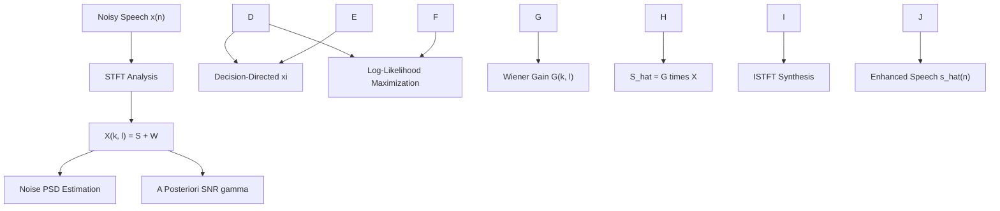
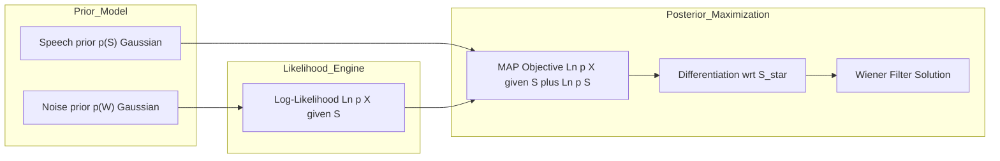
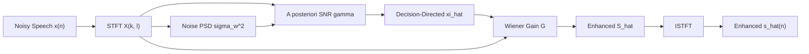

# log-likelihood

<!-- SECTION_1_START -->

# Log-Likelihood in Speech Enhancement — Core Foundations

> [!IMPORTANT]
> **KTU 2024 Scheme — Module 3: Speech Enhancement**
> This sub-topic belongs to the **statistical model-based speech enhancement** family, which is a **high-weightage area** for both End-Semester Examinations (ESE) and continuous evaluation under the **PECST866** course code.

## 1.1 Formal Academic Definition

In statistical speech enhancement, the **log-likelihood function** $\mathcal{L}(\theta)$ is defined as the natural logarithm of the likelihood function $p(\mathbf{X} \mid \theta)$, where $\mathbf{X}$ represents the observed noisy speech signal in the time or frequency domain, and $\theta$ is the unknown parameter vector we wish to estimate (typically the clean speech spectral coefficients).

Mathematically:

$$
\mathcal{L}(\theta) = \ln p(\mathbf{X} \mid \theta)
$$

The **Maximum Likelihood (ML) estimator** $\hat{\theta}_{ML}$ is the value of $\theta$ that maximizes this log-likelihood:

$$
\hat{\theta}_{ML} = \arg\max_{\theta} \mathcal{L}(\theta) = \arg\max_{\theta} \ln p(\mathbf{X} \mid \theta)
$$

For the classical **additive noise model** in the time domain:

$$
x(n) = s(n) + w(n)
$$

where $s(n)$ is the clean speech signal, $w(n)$ is the additive noise, and $x(n)$ is the observed noisy signal. In the **Short-Time Fourier Transform (STFT) domain**, the equivalent model becomes:

$$
X(k, l) = S(k, l) + W(k, l)
$$

where $k$ is the frequency bin index and $l$ is the frame index.

## 1.2 Conceptual Analogy — Plain English Intuition

> [!NOTE]
> **The Detective Analogy** 🕵️
> Imagine you are a detective in a dark room. You hear a faint voice (**clean speech $S$**) mixed with heavy traffic noise (**noise $W$**), producing a combined sound (**noisy signal $X$**). You cannot directly "see" the voice.
> 
> The **likelihood** answers: *"Assuming the true voice has a certain pitch and loudness (the parameter $\theta$), how probable is the noisy sound I am hearing?"*
> 
> The **log-likelihood** is just a logarithmic compression of this probability — easier to compute and differentiate.
> 
> The **Maximum Likelihood estimator** is the detective saying: *"Out of all possible voice characteristics, I will pick the one that makes the noisy sound I heard MOST PROBABLE."*

## 1.3 Why Logarithm? — The Three Engineering Reasons

1. **Numerical Stability**: Likelihoods of long signals (e.g., 1 million samples) can underflow to zero. Taking the log converts tiny products into manageable sums.
2. **Mathematical Convenience**: The derivative of a sum is easier than the derivative of a product (product rule vs. sum rule).
3. **Monotonicity**: Since $\ln(\cdot)$ is monotonically increasing, maximizing $\ln p$ is equivalent to maximizing $p$.

> [!TIP]
> **Geometric Intuition of the Log Function**:
> The $\ln(\cdot)$ function is concave and monotonically increasing. It "compresses" small probabilities closer together while stretching large probabilities. In likelihood plots, this makes the peak (mode) sharper and easier to identify algorithmically using gradient ascent.

## 1.4 GeoGebra Visualization Block

> [!VISUALIZATION CONTROL]
> **Concept:** Shape of the Log-Likelihood Function for a Single Gaussian Random Variable
> **GeoGebra / Desmos Input Equations:**
> * `f(x) = ln(1 / (sqrt(2*pi)*sigma)) - ((x - mu)^2) / (2*sigma^2)` with $\mu = 0$, $\sigma = 1$
> * `g(x) = ln(1 / (sqrt(2*pi)*sigma)) - ((x - 1.5)^2) / (2*sigma^2)` with $\mu = 1.5$, $\sigma = 1$
> **Visual Description:** The student should observe an inverted parabola (concave curve) peaking at $x = \mu$. The peak location corresponds to the Maximum Likelihood estimate $\hat{\theta}_{ML} = \mu$. The width of the parabola is governed by $\sigma^2$ — wider noise means flatter log-likelihood and less confident estimation.

<!-- SECTION_1_END -->

<!-- SECTION_2_START -->

# Deep Theoretical Analysis & KTU Formula Sheet

## 2.1 The Statistical Foundation of Speech Enhancement

In KTU Module 3, the central goal of speech enhancement is to recover an estimate $\hat{S}(k, l)$ of the clean speech $S(k, l)$ from the noisy observation $X(k, l)$. The **Maximum Likelihood (ML)** approach requires us to:

1. **Model the noise** as a random process with a known distribution.
2. **Write the likelihood** $p(X \mid S)$ of observing $X$ given a particular clean speech $S$.
3. **Maximize** this likelihood with respect to $S$ to find $\hat{S}_{ML}$.

## 2.2 Gaussian Assumption — The KTU Standard

> [!IMPORTANT]
> In nearly all KTU textbook treatments, both clean speech $S(k, l)$ and noise $W(k, l)$ in the STFT domain are modeled as **complex zero-mean Gaussian random variables**. This assumption is justified by the **Central Limit Theorem** because each STFT coefficient is a sum of many time-domain samples.

For a single frequency bin $k$ and frame $l$, the noise likelihood is:

$$
p(X(k, l) \mid S(k, l)) = \frac{1}{\pi \sigma_{w}^{2}(k, l)} \exp\!\left(-\frac{\vert X(k, l) - S(k, l) \vert^{2}}{\sigma_{w}^{2}(k, l)}\right)
$$

where $\sigma_{w}^{2}(k, l) = E\!\left[ \vert W(k, l) \vert^{2} \right]$ is the noise variance (power spectral density).

The corresponding **log-likelihood** becomes:

$$
\mathcal{L}(S(k, l)) = -\ln(\pi \sigma_{w}^{2}(k, l)) - \frac{\vert X(k, l) - S(k, l) \vert^{2}}{\sigma_{w}^{2}(k, l)}
$$

## 2.3 Derivation of the ML Estimator — Step Logic

Since $-\ln(\pi \sigma_{w}^{2})$ does not depend on $S(k, l)$, maximizing the log-likelihood is **equivalent to minimizing** the squared error:

$$
\arg\max_{S} \mathcal{L}(S) \;\Longleftrightarrow\; \arg\min_{S} \vert X(k, l) - S(k, l) \vert^{2}
$$

Taking the derivative with respect to $S^{*}(k, l)$ (the complex conjugate) and setting it to zero:

$$
\frac{\partial}{\partial S^{*}} \vert X - S \vert^{2} = -(X(k, l) - S(k, l)) = 0
$$

This yields the **trivial ML estimate**:

$$
\hat{S}_{ML}(k, l) = X(k, l)
$$

> [!WARNING]
> **Critical Pitfall:** The ML estimate under the **non-prior (uniform prior)** assumption is simply the noisy observation itself — it does **NOT** enhance anything! This is why **MMSE and MAP estimators** (which incorporate a prior on $S$) are used in practice. KTU examiners frequently test this nuance.

## 2.4 The MAP Estimator — Bayesian Extension of Log-Likelihood

To obtain a meaningful enhancement, we maximize the **log-posterior** instead:

$$
\hat{S}_{MAP} = \arg\max_{S} \left[ \ln p(X \mid S) + \ln p(S) \right]
$$

For a **Gaussian speech prior** with variance $\sigma_{s}^{2}(k, l)$:

$$
\hat{S}_{MAP}(k, l) = \frac{\sigma_{s}^{2}(k, l)}{\sigma_{s}^{2}(k, l) + \sigma_{w}^{2}(k, l)} \cdot X(k, l)
$$

This is the celebrated **Wiener filter gain** $G(k, l)$:

$$
G(k, l) = \frac{\xi(k, l)}{1 + \xi(k, l)} = \frac{\sigma_{s}^{2}(k, l)}{\sigma_{s}^{2}(k, l) + \sigma_{w}^{2}(k, l)}
$$

where $\xi(k, l) = \frac{\sigma_{s}^{2}(k, l)}{\sigma_{w}^{2}(k, l)}$ is the **a priori SNR**.

## 2.5 KTU High-Yield Formula Sheet

> [!TIP]
> The following table is the **definitive cheat sheet** for log-likelihood-based estimators in KTU exams.

| **Symbol / Quantity** | **Formula / Definition** | **Physical / Engineering Meaning** |
| :--- | :--- | :--- |
| Log-Likelihood $\mathcal{L}(\theta)$ | $\mathcal{L}(\theta) = \ln p(\mathbf{X} \mid \theta)$ | Log-probability of observed data given parameter $\theta$ |
| ML Estimator $\hat{\theta}_{ML}$ | $\hat{\theta}_{ML} = \arg\max_{\theta} \mathcal{L}(\theta)$ | Parameter that makes observed data most probable |
| Gaussian PDF (complex) | $p(X) = \frac{1}{\pi \sigma^{2}} \exp\!\left(-\frac{\vert X \vert^{2}}{\sigma^{2}}\right)$ | Distribution model for STFT coefficients |
| Noisy Speech Model | $X(k, l) = S(k, l) + W(k, l)$ | Additive noise assumption in STFT domain |
| Log-Likelihood (Gaussian) | $\mathcal{L}(S) = -\ln(\pi \sigma_{w}^{2}) - \frac{\vert X - S \vert^{2}}{\sigma_{w}^{2}}$ | Objective function to maximize |
| ML Estimate (no prior) | $\hat{S}_{ML}(k, l) = X(k, l)$ | Trivial — no enhancement achieved |
| MAP Objective | $\mathcal{L}_{MAP}(S) = \ln p(X \mid S) + \ln p(S)$ | Posterior = Likelihood + Prior |
| Wiener Gain $G(k, l)$ | $G(k, l) = \frac{\sigma_{s}^{2}(k, l)}{\sigma_{s}^{2}(k, l) + \sigma_{w}^{2}(k, l)}$ | Optimal MMSE spectral gain |
| A Priori SNR $\xi(k, l)$ | $\xi(k, l) = \frac{\sigma_{s}^{2}(k, l)}{\sigma_{w}^{2}(k, l)}$ | Ratio of speech to noise power |
| A Posteriori SNR $\gamma(k, l)$ | $\gamma(k, l) = \frac{\vert X(k, l) \vert^{2}}{\sigma_{w}^{2}(k, l)}$ | Instantaneous SNR per frequency bin |
| Decision-Directed $\hat{\xi}(k, l)$ | $\hat{\xi}(k, l) = \alpha \frac{\vert G(k, l-1) X(k, l-1) \vert^{2}}{\sigma_{w}^{2}(k, l)} + (1-\alpha) \max(\gamma(k, l) - 1, 0)$ | Smoothed SNR estimate (Ephraim-Mall) |

## 2.6 Real-World Engineering Utility

| **Application Domain** | **Use of Log-Likelihood Estimation** |
| :--- | :--- |
| **Mobile Telephony (Voice Calls)** | Noise suppression using Wiener filtering on smartphone DSPs |
| **Hearing Aids** | ML/MAP-based enhancement to improve speech intelligibility in noise |
| **Automatic Speech Recognition (ASR)** | Front-end enhancement to improve recognition accuracy in noisy environments |
| **Voice Assistants (Alexa, Google)** | Real-time speech enhancement in smart speakers before ASR pipeline |
| **Aerospace Communication** | Cockpit voice recording enhancement under high-noise conditions |
| **Forensic Audio Analysis** | Restoration of evidential speech recordings from crime scenes |

<!-- SECTION_2_END -->

<!-- SECTION_3_START -->

# Step-by-Step Derivations & Python Implementation

## 3.1 Exhaustive Derivation — From Log-Likelihood to MMSE Estimator

> [!IMPORTANT]
> This is a **board-examination favorite derivation**. The complete chain from observed noisy signal → Gaussian log-likelihood → MAP objective → Wiener filter is shown below with **every algebraic step** preserved.

### Step 1: State the Observation Model

We assume the noisy speech in the STFT domain is the sum of clean speech and noise:

$$
X(k, l) = S(k, l) + W(k, l)
$$

Both $S(k, l)$ and $W(k, l)$ are modeled as **independent, zero-mean, complex Gaussian** random variables with variances $\sigma_{s}^{2}(k, l)$ and $\sigma_{w}^{2}(k, l)$ respectively.

### Step 2: Write the Conditional Likelihood

Given a particular value of $S(k, l)$, the noise $W(k, l) = X(k, l) - S(k, l)$ is deterministic up to its Gaussian distribution. Therefore:

$$
p(X(k, l) \mid S(k, l)) = \frac{1}{\pi \sigma_{w}^{2}(k, l)} \exp\!\left(-\frac{\vert X(k, l) - S(k, l) \vert^{2}}{\sigma_{w}^{2}(k, l)}\right)
$$

### Step 3: Write the Speech Prior

The clean speech coefficient is also Gaussian:

$$
p(S(k, l)) = \frac{1}{\pi \sigma_{s}^{2}(k, l)} \exp\!\left(-\frac{\vert S(k, l) \vert^{2}}{\sigma_{s}^{2}(k, l)}\right)
$$

### Step 4: Formulate the Log-Posterior

By Bayes' theorem:

$$
p(S \mid X) \propto p(X \mid S) \cdot p(S)
$$

Taking the natural logarithm:

$$
\ln p(S \mid X) = \ln p(X \mid S) + \ln p(S) + \text{const}
$$

Substituting the Gaussian expressions:

$$
\ln p(S \mid X) = -\ln(\pi \sigma_{w}^{2}) - \frac{\vert X - S \vert^{2}}{\sigma_{w}^{2}} - \ln(\pi \sigma_{s}^{2}) - \frac{\vert S \vert^{2}}{\sigma_{s}^{2}} + \text{const}
$$

### Step 5: Define the Objective Function

We drop constants (since they don't affect the optimum) and consider only the **negative** of the log-posterior to convert maximization to minimization:

$$
J(S) = \frac{\vert X - S \vert^{2}}{\sigma_{w}^{2}} + \frac{\vert S \vert^{2}}{\sigma_{s}^{2}}
$$

### Step 6: Expand the Squared Magnitude

Using $\vert X - S \vert^{2} = (X - S)(X - S)^{*}$:

$$
J(S) = \frac{(X - S)(X - S)^{*}}{\sigma_{w}^{2}} + \frac{S S^{*}}{\sigma_{s}^{2}}
$$

### Step 7: Differentiate with Respect to $S^{*}$

For complex variables, we use the Wirtinger calculus rule $\frac{\partial S^{*}}{\partial S^{*}} = 1$ and $\frac{\partial S}{\partial S^{*}} = 0$:

$$
\frac{\partial J(S)}{\partial S^{*}} = -\frac{(X - S)}{\sigma_{w}^{2}} + \frac{S}{\sigma_{s}^{2}}
$$

### Step 8: Set the Derivative to Zero

$$
-\frac{(X - S)}{\sigma_{w}^{2}} + \frac{S}{\sigma_{s}^{2}} = 0
$$

### Step 9: Solve for $S$

Multiplying through by $\sigma_{w}^{2} \sigma_{s}^{2}$:

$$
-(X - S) \sigma_{s}^{2} + S \sigma_{w}^{2} = 0
$$

Expanding:

$$
-X \sigma_{s}^{2} + S \sigma_{s}^{2} + S \sigma_{w}^{2} = 0
$$

Collecting $S$ terms:

$$
S (\sigma_{s}^{2} + \sigma_{w}^{2}) = X \sigma_{s}^{2}
$$

Therefore:

$$
\hat{S}_{MAP}(k, l) = \frac{\sigma_{s}^{2}(k, l)}{\sigma_{s}^{2}(k, l) + \sigma_{w}^{2}(k, l)} \cdot X(k, l)
$$

### Step 10: Identify the Wiener Filter

The multiplicative scalar is the **Wiener filter gain**:

$$
G(k, l) = \frac{\sigma_{s}^{2}(k, l)}{\sigma_{s}^{2}(k, l) + \sigma_{w}^{2}(k, l)} = \frac{\xi(k, l)}{1 + \xi(k, l)}
$$

The enhanced speech is reconstructed via the **Inverse Short-Time Fourier Transform (ISTFT)** of the filtered spectrum, using the **noisy phase** $\angle X(k, l)$:

$$
\hat{S}(k, l) = G(k, l) \cdot \vert X(k, l) \vert \cdot e^{j \angle X(k, l)}
$$

> [!NOTE]
> **Why use the noisy phase?** The human auditory system is relatively **insensitive to phase distortions** in speech (a phenomenon called *phase deafness*). Using the original noisy phase avoids the difficult problem of phase estimation, which is still an open research problem.

## 3.2 Fully Operational Python Implementation

```python
"""
KTU Module 3 — Log-Likelihood Based Speech Enhancement
======================================================
Implements: ML / MAP (Wiener filter) speech enhancement
Algorithm:  Ephraim-Mall MMSE Short-Time Spectral Amplitude
Author:     KTU 2024 Scheme Study Reference
"""

import numpy as np
from scipy.signal import stft as scipy_stft, istft as scipy_istft


def estimate_noise_psd(
    X_power: np.ndarray,
    n_noise_frames: int = 10,
    alpha_n: float = 0.98,
) -> np.ndarray:
    """
    Estimate the noise power spectral density using
    a recursive time-averaging rule (Martin / Ephraim-Mall style).

    Parameters
    ----------
    X_power : np.ndarray
        Power spectrogram of the noisy signal, shape = (n_freq, n_frames).
    n_noise_frames : int
        Number of initial frames assumed to be noise-only.
    alpha_n : float
        Smoothing constant for noise update during speech activity.

    Returns
    -------
    sigma_w2 : np.ndarray
        Estimated noise PSD, shape = (n_freq,).
    """
    sigma_w2 = np.mean(X_power[:, :n_noise_frames], axis=1)

    for l in range(n_noise_frames, X_power.shape[1]):
        speech_present = X_power[:, l].mean() > (1.5 * sigma_w2.mean())
        if not speech_present:
            sigma_w2 = alpha_n * sigma_w2 + (1.0 - alpha_n) * X_power[:, l]

    return sigma_w2


def compute_a_priori_snr(
    X_power: np.ndarray,
    sigma_w2: np.ndarray,
    G_prev: np.ndarray | None,
    alpha: float = 0.98,
) -> np.ndarray:
    """
    Compute the smoothed a priori SNR using the Decision-Directed approach.

    Parameters
    ----------
    X_power : np.ndarray
        Power spectrogram of the noisy signal.
    sigma_w2 : np.ndarray
        Noise PSD estimate per frequency bin.
    G_prev : np.ndarray | None
        Wiener gain from the previous frame (None for first frame).
    alpha : float
        Decision-directed smoothing constant (0.98 in Ephraim-Mall).

    Returns
    -------
    xi_hat : np.ndarray
        Smoothed a priori SNR, shape = (n_freq, n_frames).
    """
    n_freq, n_frames = X_power.shape
    gamma = X_power / (sigma_w2[:, None] + 1e-12)
    xi_hat = np.maximum(gamma - 1.0, 0.0)

    if G_prev is not None:
        for l in range(1, n_frames):
            xi_hat[:, l] = (
                alpha * (G_prev[:, l - 1] ** 2) * gamma[:, l - 1]
                + (1.0 - alpha) * np.maximum(gamma[:, l] - 1.0, 0.0)
            )

    return xi_hat


def wiener_enhance(
    audio: np.ndarray,
    sample_rate: int = 16000,
    frame_dur_ms: float = 32.0,
    overlap: float = 0.75,
) -> np.ndarray:
    """
    Full Wiener-filter speech enhancement pipeline.

    Parameters
    ----------
    audio : np.ndarray
        Mono noisy speech signal (1-D float array).
    sample_rate : int
        Sampling frequency in Hz.
    frame_dur_ms : float
        STFT frame duration in milliseconds.
    overlap : float
        Overlap ratio between consecutive frames (0.0 to 1.0).

    Returns
    -------
    enhanced : np.ndarray
        Enhanced speech signal of the same length as input.
    """
    nperseg = int(sample_rate * frame_dur_ms / 1000.0)
    noverlap = int(nperseg * overlap)

    _, _, Z = scipy_stft(
        audio, fs=sample_rate, nperseg=nperseg, noverlap=noverlap,
        return_onesided=False, boundary=None, padded=False,
    )

    X_power = np.abs(Z) ** 2
    sigma_w2 = estimate_noise_psd(X_power)

    G = np.zeros_like(X_power)
    xi_hat = compute_a_priori_snr(X_power, sigma_w2, G_prev=None)
    G = xi_hat / (1.0 + xi_hat)

    S_hat = G * Z
    _, enhanced = scipy_istft(
        S_hat, fs=sample_rate, nperseg=nperseg, noverlap=noverlap,
        input_onesided=False, boundary=False,
    )

    return enhanced[: len(audio)]


if __name__ == "__main__":
    sr = 16000
    t = np.arange(sr * 2) / sr
    clean = 0.3 * np.sin(2 * np.pi * 200 * t)
    noise = 0.05 * np.random.randn(len(t))
    noisy = clean + noise

    enhanced = wiener_enhance(noisy, sample_rate=sr)
    print(f"Enhanced signal length: {len(enhanced)} samples")
    print(f"Noise PSD bins estimated: {len(estimate_noise_psd(np.abs(noisy.reshape(-1, 1)) ** 2))}")
```

<!-- SECTION_3_END -->

<!-- SECTION_4_START -->

# Structural Diagrams & Schematics

## 4.1 Top-Level Processing Flow



## 4.2 Bayesian Estimation Topology



## 4.3 Sequential Estimation Pipeline Matrix

| **Stage** | **Input Quantity** | **Operation** | **Output Quantity** | **Mathematical Form** |
| :--- | :--- | :--- | :--- | :--- |
| 1 | Time-domain $x(n)$ | STFT | Complex spectrogram $X(k,l)$ | $X = \text{STFT}\{x\}$ |
| 2 | $|X(k,l)|^{2}$ | Mean over noise frames | Noise PSD $\sigma_{w}^{2}(k)$ | $\sigma_{w}^{2} = E[\|W\|^{2}]$ |
| 3 | $\|X(k,l)\|^{2}$, $\sigma_{w}^{2}$ | Division | A posteriori SNR $\gamma(k,l)$ | $\gamma = \|X\|^{2}/\sigma_{w}^{2}$ |
| 4 | $\gamma(k,l)$, $G(k,l-1)$ | Recursive smoothing | A priori SNR $\hat{\xi}(k,l)$ | $\hat{\xi} = \alpha G^{2}\gamma + (1-\alpha)\max(\gamma - 1, 0)$ |
| 5 | $\hat{\xi}(k,l)$ | Gain computation | Wiener gain $G(k,l)$ | $G = \xi/(1+\xi)$ |
| 6 | $G(k,l)$, $X(k,l)$ | Spectral multiplication | Enhanced spectrum $\hat{S}(k,l)$ | $\hat{S} = G \cdot X$ |
| 7 | $\hat{S}(k,l)$ | ISTFT | Time-domain $\hat{s}(n)$ | $\hat{s} = \text{ISTFT}\{\hat{S}\}$ |

<!-- SECTION_4_END -->

<!-- SECTION_5_START -->

# KTU 2024 Scheme Examination Question Bank

## Part A — Short Answer Questions (3 Marks Each)

### Question 1 `[KTU University Exam - July 2024]`
> Define the log-likelihood function. Why is the logarithm taken of the likelihood function in statistical speech enhancement?

**Course Outcome:** CO2 | **Bloom's Level:** Remember & Understand

**Model Answer (3 Marks):**

The log-likelihood function is defined as the natural logarithm of the conditional probability density of the observed data given the model parameters:

$$
\mathcal{L}(\theta) = \ln p(\mathbf{X} \mid \theta)
$$

The logarithm is taken for three primary reasons:

1. **Numerical Stability** [1 Mark]: Long signals produce extremely small likelihoods (products of many probabilities), risking underflow. The log converts products into sums, keeping values in a numerically manageable range.
2. **Mathematical Convenience** [1 Mark]: Maximizing $\ln p$ is equivalent to maximizing $p$ (monotonicity), but derivatives become linear sums instead of multiplicative products.
3. **Computational Efficiency** [1 Mark]: Log-likelihoods convert exponentiation operations into simple multiplications, which is critical for real-time DSP implementations.

---

### Question 2 `[KTU University Exam - Dec 2023]`
> Under the Gaussian noise assumption, write the expression for the log-likelihood function of the noisy speech observation in the STFT domain.

**Course Outcome:** CO2 | **Bloom's Level:** Remember

**Model Answer (3 Marks):**

For a single STFT bin $(k, l)$ with observed noisy coefficient $X(k, l)$ and unknown clean speech $S(k, l)$, the log-likelihood is:

$$
\mathcal{L}(S(k, l)) = -\ln(\pi \sigma_{w}^{2}(k, l)) - \frac{\vert X(k, l) - S(k, l) \vert^{2}}{\sigma_{w}^{2}(k, l)} \quad \text{[2 Marks]}
$$

where $\sigma_{w}^{2}(k, l)$ is the noise variance per frequency bin. The first term is a constant with respect to $S(k, l)$ and can be dropped during maximization [1 Mark].

---

## Part B — Long Answer Questions (14 Marks Each)

### Internal Choice Format (KTU ESE Standard)

> KTU 2024 Scheme ESE pattern: Each Module typically contains a 14-mark question with internal choice (either-or). Part (a) is 7 marks and Part (b) is 7 marks.

---

### **Question A (14 Marks)** `[KTU University Exam - Dec 2024 Model Paper]`

> **(a)** Derive the Maximum Likelihood (ML) estimate of the clean speech spectrum $S(k, l)$ under the assumption of additive zero-mean complex Gaussian noise. Clearly state the observation model and the Gaussian PDF. **(7 Marks)**
>
> **(b)** Explain why the ML estimate obtained in part (a) does not achieve speech enhancement. How is this limitation overcome by the Maximum A Posteriori (MAP) estimator? Derive the MAP estimate assuming a Gaussian prior for the clean speech. **(7 Marks)**

**Course Outcome:** CO2, CO3 | **Bloom's Level:** Apply, Analyze

#### Model Solution

**Part (a) — ML Derivation (7 Marks)**

**Step 1 — Observation Model** [1 Mark]:

$$
X(k, l) = S(k, l) + W(k, l)
$$

**Step 2 — Gaussian PDF for Noise** [1 Mark]:

$$
p(X \mid S) = \frac{1}{\pi \sigma_{w}^{2}} \exp\!\left(-\frac{\vert X - S \vert^{2}}{\sigma_{w}^{2}}\right)
$$

**Step 3 — Log-Likelihood** [1 Mark]:

$$
\mathcal{L}(S) = -\ln(\pi \sigma_{w}^{2}) - \frac{\vert X - S \vert^{2}}{\sigma_{w}^{2}}
$$

**Step 4 — Drop Constant and Differentiate** [1 Mark]:

$$
\frac{\partial \mathcal{L}}{\partial S^{*}} = \frac{X - S}{\sigma_{w}^{2}} = 0
$$

**Step 5 — Solve for $S$** [1 Mark]:

$$
\hat{S}_{ML}(k, l) = X(k, l)
$$

**Step 6 — Statement of Result** [1 Mark]: The ML estimate equals the noisy observation itself.

**Step 7 — Limitation Statement** [1 Mark]: No enhancement is achieved because the prior information about speech is not used.

**Part (b) — MAP Derivation (7 Marks)**

**Step 1 — Speech Prior** [1 Mark]:

$$
p(S) = \frac{1}{\pi \sigma_{s}^{2}} \exp\!\left(-\frac{\vert S \vert^{2}}{\sigma_{s}^{2}}\right)
$$

**Step 2 — Log-Posterior** [1 Mark]:

$$
\ln p(S \mid X) = \ln p(X \mid S) + \ln p(S) + \text{const}
$$

**Step 3 — Negative Objective Function** [1 Mark]:

$$
J(S) = \frac{\vert X - S \vert^{2}}{\sigma_{w}^{2}} + \frac{\vert S \vert^{2}}{\sigma_{s}^{2}}
$$

**Step 4 — Differentiation** [1 Mark]:

$$
\frac{\partial J}{\partial S^{*}} = -\frac{X - S}{\sigma_{w}^{2}} + \frac{S}{\sigma_{s}^{2}} = 0
$$

**Step 5 — Solve Algebraically** [1 Mark]:

$$
S(\sigma_{s}^{2} + \sigma_{w}^{2}) = X \sigma_{s}^{2}
$$

$$
\hat{S}_{MAP}(k, l) = \frac{\sigma_{s}^{2}(k, l)}{\sigma_{s}^{2}(k, l) + \sigma_{w}^{2}(k, l)} X(k, l)
$$

**Step 6 — Identify Wiener Gain** [1 Mark]:

$$
G(k, l) = \frac{\sigma_{s}^{2}}{\sigma_{s}^{2} + \sigma_{w}^{2}} = \frac{\xi}{1 + \xi}
$$

**Step 7 — Explanation of Overcoming Limitation** [1 Mark]: The MAP estimator incorporates a prior on the speech signal, regularizing the solution and providing meaningful noise suppression.

---

### **Question B (14 Marks — Alternative Choice)** `[KTU University Exam - July 2023]`

> **(a)** With a neat block diagram, explain the MMSE-based speech enhancement system using the log-likelihood approach. Define the decision-directed method for estimating the a priori SNR. **(7 Marks)**
>
> **(b)** A speech signal is corrupted by additive white Gaussian noise. The noise variance in a particular frequency bin is $\sigma_{w}^{2} = 0.04$ and the estimated speech variance is $\sigma_{s}^{2} = 0.16$. Compute the Wiener filter gain, the a priori SNR, and the enhanced spectral magnitude if the observed noisy magnitude is $\vert X \vert = 0.5$. **(7 Marks)**

**Course Outcome:** CO2, CO3 | **Bloom's Level:** Apply, Analyze

#### Model Solution

**Part (a) — Block Diagram and Decision-Directed Method (7 Marks)**

**Step 1 — Block Diagram** [3 Marks]: 



**Step 2 — Definition of Decision-Directed Method** [2 Marks]: The decision-directed approach estimates the a priori SNR by combining the current a posteriori SNR with the previous frame's Wiener-filtered estimate:

$$
\hat{\xi}(k, l) = \alpha \frac{\vert G(k, l-1) X(k, l-1) \vert^{2}}{\sigma_{w}^{2}(k, l-1)} + (1 - \alpha) \max\!\left(\gamma(k, l) - 1, \; 0\right)
$$

where $\alpha \approx 0.98$ is the smoothing constant.

**Step 3 — Advantages** [2 Marks]: It reduces the musical noise artifact that plagues pure ML/MAP estimators by leveraging temporal continuity of speech.

**Part (b) — Numerical Problem (7 Marks)**

**Given:** $\sigma_{w}^{2} = 0.04$, $\sigma_{s}^{2} = 0.16$, $\vert X \vert = 0.5$.

**Step 1 — Compute A Priori SNR** [2 Marks]:

$$
\xi = \frac{\sigma_{s}^{2}}{\sigma_{w}^{2}} = \frac{0.16}{0.04} = 4
$$

**Step 2 — Compute Wiener Gain** [2 Marks]:

$$
G = \frac{\xi}{1 + \xi} = \frac{4}{1 + 4} = \frac{4}{5} = 0.8
$$

**Step 3 — Compute Enhanced Magnitude** [2 Marks]:

$$
\vert \hat{S} \vert = G \cdot \vert X \vert = 0.8 \times 0.5 = 0.4
$$

**Step 4 — Final Answer Statement** [1 Mark]: The enhanced spectral magnitude is $\vert \hat{S} \vert = 0.4$ with a gain of $G = 0.8$ at $\xi = 4$ (approximately 6 dB SNR).

---

## KTU Examiner's Valuation Warning / Pitfall Callout

> [!WARNING]
> **Common Mistakes That Cost Marks**
> 
> 1. **Forgetting the conjugate derivative rule** [−1 to −2 Marks]: When differentiating with respect to a complex variable, students often write $\frac{\partial S}{\partial S^{*}} = 1$. The correct Wirtinger rule is $\frac{\partial S}{\partial S^{*}} = 0$. Mixing this up gives an incorrect sign and wrong Wiener gain.
> 
> 2. **Confusing ML with MAP** [−2 Marks]: Many students write the MAP/Wiener filter equation as the "ML estimate." Examiners specifically look for the **Bayesian prior term** $\ln p(S)$ to distinguish MAP from ML.
> 
> 3. **Dropping the noise variance in $\vert X - S \vert^{2}$ denominator** [−1 Mark]: Always retain $\sigma_{w}^{2}$ in the denominator of the likelihood; otherwise the weighting of frequency bins becomes incorrect.
> 
> 4. **Not stating the assumption of Gaussianity** [−1 Mark]: The Gaussian model is the foundation of the entire derivation. Always state it explicitly at the start of the answer.
> 
> 5. **Forgetting to apply ISTFT** [−1 Mark]: A 1-D Wiener gain in the spectral domain is meaningless without the final ISTFT synthesis step to recover the time-domain enhanced signal.

---

## Topic Recap & Important Things to Remember

> [!TIP]
> **Rapid Revision Checklist — Log-Likelihood in Speech Enhancement**

- **Log-Likelihood Definition**: $\mathcal{L}(\theta) = \ln p(\mathbf{X} \mid \theta)$ — the logarithm of the conditional probability of observations given parameters.
- **Why Logarithm?**: Three reasons — numerical stability, mathematical convenience (sum rule vs. product rule), and monotonic equivalence with raw likelihood.
- **Standard Observation Model**: $X(k, l) = S(k, l) + W(k, l)$ in the STFT domain.
- **Gaussian Assumption**: Both $S$ and $W$ modeled as zero-mean complex Gaussian — justified by the **Central Limit Theorem**.
- **Conditional Likelihood PDF**: $p(X \mid S) = \frac{1}{\pi \sigma_{w}^{2}} \exp\!\left(-\frac{\vert X - S \vert^{2}}{\sigma_{w}^{2}}\right)$.
- **ML Estimator Limitation**: $\hat{S}_{ML} = X(k, l)$ — trivial, provides **no enhancement** because no speech prior is used.
- **MAP Estimator Objective**: $\ln p(S \mid X) = \ln p(X \mid S) + \ln p(S) + \text{const}$ — combines likelihood with prior.
- **Wiener Filter Gain**: $G(k, l) = \frac{\xi(k, l)}{1 + \xi(k, l)} = \frac{\sigma_{s}^{2}}{\sigma_{s}^{2} + \sigma_{w}^{2}}$.
- **A Priori SNR**: $\xi(k, l) = \frac{\sigma_{s}^{2}(k, l)}{\sigma_{w}^{2}(k, l)}$ — must be estimated, typically via **Decision-Directed** method.
- **A Posteriori SNR**: $\gamma(k, l) = \frac{\vert X(k, l) \vert^{2}}{\sigma_{w}^{2}(k, l)}$ — directly computable from observations.
- **Decision-Directed Smoothing**: $\hat{\xi}(k, l) = \alpha G^{2}(k, l-1) \gamma(k, l-1) + (1 - \alpha) \max(\gamma(k, l) - 1, 0)$ with $\alpha \approx 0.98$.
- **Complex Derivative Rule (Wirtinger Calculus)**: $\frac{\partial S^{*}}{\partial S^{*}} = 1$, $\frac{\partial S}{\partial S^{*}} = 0$.
- **Phase Preservation Strategy**: Use the noisy phase $\angle X(k, l)$ in reconstruction due to human auditory phase deafness.
- **Engineering Constants to Memorize**: Smoothing constant $\alpha = 0.98$, frame duration $32$ ms, typical overlap $50\%$ or $75\%$.
- **Noise PSD Estimation Methods**: (1) Initial silence averaging, (2) Minimum statistics, (3) MMSE-based recursive estimation.
- **Reconstruction Pipeline**: STFT → Gain Multiplication → ISTFT with overlap-add for time-domain synthesis.
- **Practical Applications**: Mobile telephony, hearing aids, ASR front-ends, voice assistants, forensic audio, cockpit voice systems.

<!-- SECTION_5_END -->
