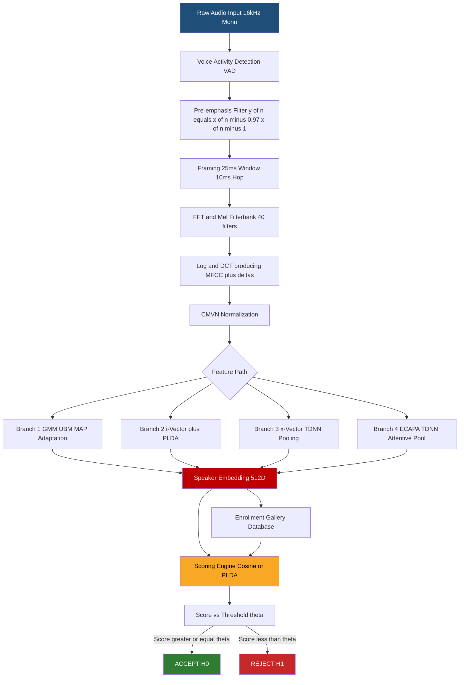
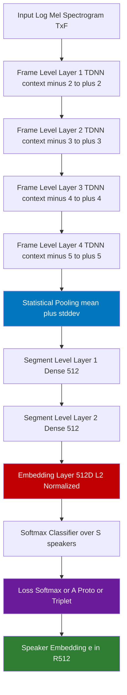
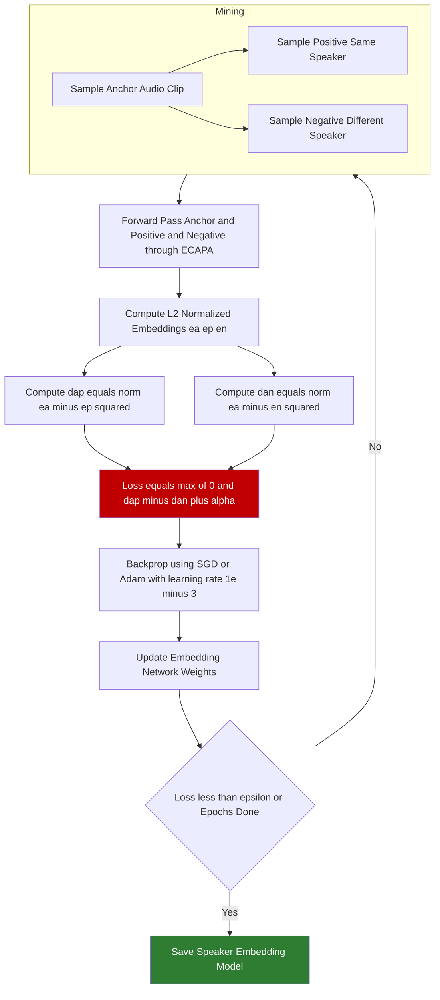

# Machine learning models in Speaker Recognition

<!-- SECTION_1_START -->

# Machine Learning Models in Speaker Recognition

> [!IMPORTANT]
> **Syllabus Anchor — KTU 2024 Scheme | PECST866 | Module 3**
> This module bridges classical statistical speech processing with modern deep learning, focusing on how machines learn to recognize *who* is speaking rather than *what* is being said.

## 1.1 Formal Definition

**Speaker Recognition (SR)** is a biometric authentication discipline within speech and audio processing that aims to recognize a person purely from their voice signal. It is formally defined by KTU 2024 as:

> *"The computational task of mapping a speech utterance $X = \{x_1, x_2, \ldots, x_T\}$ to a speaker identity $s \in \mathcal{S}$, where $\mathcal{S}$ is the enrolled speaker set."*

Speaker Recognition is broadly bifurcated into two operational paradigms:

| Sub-Task | Operational Goal | Decision Type |
| :--- | :--- | :--- |
| **Speaker Identification (SID)** | Determine *which* enrolled speaker produced the utterance | 1 : $N$ classification (closed-set) or 1 : $N+1$ (open-set) |
| **Speaker Verification (SV)** | Accept or reject a claimed speaker identity | 1 : 1 binary hypothesis testing |

$$H_0 : \text{Utterance belongs to claimed speaker } s$$
$$H_1 : \text{Utterance belongs to an impostor}$$

A verification system accepts $H_0$ if the score $S(X, s)$ exceeds a decision threshold $\theta$; otherwise it accepts $H_1$.

> [!NOTE]
> **Text-Dependency Variants**
> - **Text-Dependent (TD)**: Speaker utters a fixed passphrase (e.g., *"OK Google"*).
> - **Text-Independent (TI)**: Speaker is free to utter any phrase; more challenging as the phonetic content is uncontrolled.
> - **Text-Prompted (TP)**: System prompts a randomized phrase to prevent replay attacks.

## 1.2 Intuitive Analogy

Imagine walking into a crowded college canteen with your eyes closed. You cannot see faces, but the moment your friend **Anu** speaks, you instantly recognize her voice — even if she says something completely new, like a Kannada sentence you have never heard before. Your brain has built an *internal acoustic model* of Anu: her pitch contour, breathiness, formant transitions, and speaking rate.

**Machine Learning models in Speaker Recognition do exactly this — but mathematically.**

The system is "trained" on thousands of voice samples (enrollment phase) to extract a compact numerical fingerprint called a **speaker embedding** $\mathbf{e} \in \mathbb{R}^{d}$ (typically $d = 128, 256, \text{ or } 512$). When a new utterance arrives, the model produces an embedding and compares it with stored reference embeddings using a similarity metric.

> [!TIP]
> **Voice as a Biometric**: Just as a fingerprint has 30–40 minutiae points, a 3-second speech clip contains enough spectral information to uniquely identify a human with **> 99%** accuracy. The vocal tract shape, lip movement, and larynx size act as physiological features, while accent and prosody act as behavioral features.

## 1.3 Why Machine Learning Became Indispensable

Hand-crafted statistical models like **Gaussian Mixture Models (GMM)** dominated the field from the late 1990s to 2010s. However, they suffered from:
- **Hand-engineered features** (MFCC, LFCC) that lose speaker-discriminative information.
- **Linear assumptions** of Gaussian components that fail on real-world noise.
- **Limited scalability** to millions of speakers (e.g., voice assistants).

Modern **deep learning models** automatically learn hierarchical, noise-robust representations directly from spectrograms, achieving state-of-the-art performance on benchmarks like **VoxCeleb1**, **VoxCeleb2**, and **SITW**.

> [!VISUALIZATION CONTROL]
> **Concept:** Speaker Embedding Space Geometry
> **Geometric Intuition:** Each enrolled speaker is a *cluster center* in a high-dimensional hypersphere. Genuine trials form tight clusters; impostor trials fall outside a decision hypersphere of radius $\theta$.
> **Description:** A 2D t-SNE projection would show distinct speaker clusters — imagine 5 colored blobs (Anu, Balu, Cathy, Dan, Eli) where intra-speaker distance is small and inter-speaker distance is large.
> **Mathematical Proxy:** $\min \vert \mathbf{e}_i - \mathbf{e}_j \vert_2$ for genuine pairs, $\max \vert \mathbf{e}_i - \mathbf{e}_j \vert_2$ for impostor pairs.

<!-- SECTION_1_END -->

<!-- SECTION_2_START -->

# Deep Theoretical Analysis & KTU High-Yield Formula Sheet

## 2.1 The Universal Speaker Recognition Pipeline

Every modern speaker recognition system — classical or neural — follows a four-stage architecture:

1. **Pre-processing** — silence removal, pre-emphasis, voice activity detection (VAD).
2. **Feature Extraction** — convert waveform to speaker-discriminative vectors.
3. **Embedding Generation (Backbone)** — produce a fixed-length speaker representation $\mathbf{e}$.
4. **Back-end Scoring & Decision** — compute similarity between embedding and enrolled template.

## 2.2 Feature Extraction Layer

### 2.2.1 Mel-Frequency Cepstral Coefficients (MFCCs)
The classical feature set. The mel-scale approximates human auditory perception:

$$f_{\text{mel}} = 2595 \cdot \log_{10}\left(1 + \frac{f}{700}\right)$$

Steps: pre-emphasis $\rightarrow$ framing (25 ms, 10 ms hop) $\rightarrow$ windowing (Hamming) $\rightarrow$ FFT $\rightarrow$ mel-filterbank (typically 40 filters) $\rightarrow$ log compression $\rightarrow$ DCT $\rightarrow$ delta + delta-delta $\rightarrow$ cepstral mean/variance normalization (CMVN).

### 2.2.2 Spectrogram-based Inputs
Deep models often bypass MFCCs and consume **log-mel spectrograms** directly, letting convolutional layers learn the optimal filterbank.

## 2.3 Classical ML Models

### 2.3.1 GMM-UBM (Universal Background Model)
The foundational statistical model. A GMM models the distribution of speaker features as a weighted sum of $M$ Gaussians:

$$p(\mathbf{x} \mid \lambda_s) = \sum_{i=1}^{M} w_i \, \mathcal{N}(\mathbf{x} \mid \boldsymbol{\mu}_i, \boldsymbol{\Sigma}_i)$$

where $\lambda_s = \{w_i, \boldsymbol{\mu}_i, \boldsymbol{\Sigma}_i\}_{i=1}^{M}$ are the speaker's GMM parameters, adapted from a **UBM** (a large GMM trained on hundreds of hours of diverse speech) using **MAP adaptation**:

$$\hat{\boldsymbol{\mu}}_i = \alpha_i \, E[\mathbf{x} \mid \lambda_{\text{UBM}}, z_i] + (1 - \alpha_i) \, \boldsymbol{\mu}_i^{\text{UBM}}$$

where $z_i$ is the posterior of mixture $i$, and $\alpha_i = \frac{n_i}{n_i + r}$ is the relevance factor ($r \approx 16$).

Scoring uses the **log-likelihood ratio (LLR)**:

$$\text{LLR}(X, s) = \log p(X \mid \lambda_s) - \log p(X \mid \lambda_{\text{UBM}})$$

### 2.3.2 i-Vector (Joint Factor Analysis)
A single low-dimensional vector (typically 400–600 dim) representing both speaker and channel variability:

$$\mathbf{M} = \mathbf{m} + \mathbf{T} \mathbf{w}$$

where $\mathbf{m}$ is the UBM mean supervector, $\mathbf{T}$ is the total variability matrix, and $\mathbf{w} \sim \mathcal{N}(\mathbf{0}, \mathbf{I})$ is the **i-vector**. Back-end scoring uses **PLDA** (Probabilistic Linear Discriminant Analysis).

### 2.3.3 Support Vector Machines (SVM)
Used for text-dependent verification. The decision function is:

$$f(\mathbf{x}) = \sum_{i=1}^{N_s} \alpha_i y_i \, K(\mathbf{x}, \mathbf{x}_i) + b$$

where $K(\cdot, \cdot)$ is a kernel (linear, RBF, or cosine) and $N_s$ is the number of support vectors.

## 2.4 Deep Learning Models

### 2.4.1 d-Vector (Deep Speaker Embedding)
A feed-forward DNN trained with a softmax classification head over speaker labels at the output layer. The penultimate layer activations form the **d-vector**.

$$\mathbf{e}_d = \mathbf{h}_{L-1} \in \mathbb{R}^{d}$$

The softmax loss is:

$$\mathcal{L}_{\text{softmax}} = -\frac{1}{N} \sum_{i=1}^{N} \log \frac{\exp(\mathbf{W}_{y_i}^\top \mathbf{h}_{L-1}^{(i)} + b_{y_i})}{\sum_{j=1}^{S} \exp(\mathbf{W}_j^\top \mathbf{h}_{L-1}^{(i)} + b_j)}$$

### 2.4.2 x-Vector (TDNN-based)
Introduced by Snyder et al. (2018, Google). Uses **Time Delay Neural Network (TDNN)** layers with statistical pooling:

$$\mathbf{h}_{\text{pool}} = [\boldsymbol{\mu}; \boldsymbol{\sigma}] = \left[\frac{1}{T}\sum_{t=1}^{T}\mathbf{f}_t ; \sqrt{\frac{1}{T}\sum_{t=1}^{T}(\mathbf{f}_t - \boldsymbol{\mu})^2}\right]$$

This converts variable-length utterances into a fixed-length vector.

### 2.4.3 CNN-Based (ResNet, Thin-ResNet)
Treats the spectrogram as a 2D image. ResNet-34 / Thin-ResNet-34 are popular backbones for VoxCeleb challenges. Input: $T \times F$ log-mel spectrogram, output: 128-D or 256-D embedding.

### 2.4.4 End-to-End Metric Learning
Replaces softmax with embedding-space objectives.

**Triplet Loss** (used in Google FaceNet, adapted for speakers):

$$\mathcal{L}_{\text{triplet}} = \max\left(0, \, d(\mathbf{e}_a, \mathbf{e}_p) - d(\mathbf{e}_a, \mathbf{e}_n) + \alpha\right)$$

where $d$ is Euclidean (or cosine) distance, and $\alpha$ is the margin (typically $0.2$).

**Generalized End-to-End (GE2E) Loss** (Google, 2020):

$$\mathcal{L}_{\text{GE2E}} = \sum_{j,k} \sigma\left(-c \cdot \left(S_{j,k} - \max_{i \neq j} S_{i,k} - \alpha\right)\right)$$

where $S_{j,k}$ is the scaled cosine similarity between centroid of speaker $j$ and embedding $k$.

**Angular Prototypical (A-Proto) Loss** (used in ECAPA-TDNN):

$$\mathcal{L}_{\text{A-Proto}} = -\frac{1}{N}\sum_{i=1}^{N}\log \frac{\exp\left(-c \cdot \arccos\left(\mathbf{W}_{y_i}^\top \mathbf{e}_i\right) + b_{y_i}\right)}{\sum_{j=1}^{S}\exp\left(-c \cdot \arccos\left(\mathbf{W}_j^\top \mathbf{e}_i\right) + b_j\right)}$$

## 2.5 Back-end Scoring

### 2.5.1 Cosine Similarity
$$\text{cos}(\mathbf{e}_1, \mathbf{e}_2) = \frac{\mathbf{e}_1^\top \mathbf{e}_2}{\Vert \mathbf{e}_1 \Vert_2 \, \Vert \mathbf{e}_2 \Vert_2}$$

Decision: $\text{cos} \geq \theta \Rightarrow$ accept; $\theta$ is tuned on a development set.

### 2.5.2 PLDA Scoring
$$s(\mathbf{e}_1, \mathbf{e}_2) = \log \frac{p(\mathbf{e}_1, \mathbf{e}_2 \mid H_1)}{p(\mathbf{e}_1, \mathbf{e}_2 \mid H_0)}$$

PLDA models both within-speaker ($\Phi_w$) and between-speaker ($\Phi_b$) covariance.

## 2.6 Evaluation Metrics

| Metric | Definition | Target |
| :--- | :--- | :--- |
| **EER (Equal Error Rate)** | Point where $\text{FAR} = \text{FRR}$ | $\downarrow$ lower is better |
| **minDCF (min Detection Cost Function)** | Weighted cost at operating point | $\downarrow$ lower is better |
| **Cllr (Log-Likelihood Ratio Cost)** | Calibration quality | $\downarrow$ |
| **Accuracy (Identification)** | Top-1 correct classification | $\uparrow$ |

$$\text{FAR}(\theta) = \frac{\text{False Accepts}}{\text{Impostor Trials}}, \quad \text{FRR}(\theta) = \frac{\text{False Rejects}}{\text{Genuine Trials}}$$

$$\text{EER} = \text{FAR}(\theta^*) = \text{FRR}(\theta^*)$$

## 2.7 KTU Formula Sheet

> [!IMPORTANT]
> **Exam-Ready Formula Compilation** — Memorize the boxed equations.

| Concept | Formula / Symbol | Description |
| :--- | :--- | :--- |
| Mel-scale | $f_{\text{mel}} = 2595 \log_{10}\left(1 + \frac{f}{700}\right)$ | Perceptual frequency scale |
| GMM likelihood | $p(\mathbf{x} \mid \lambda) = \sum_{i=1}^{M} w_i \mathcal{N}(\mathbf{x} \mid \boldsymbol{\mu}_i, \boldsymbol{\Sigma}_i)$ | Speaker model density |
| MAP adaptation | $\hat{\boldsymbol{\mu}}_i = \alpha_i \mathbf{E}_i + (1-\alpha_i)\boldsymbol{\mu}_i^{\text{UBM}}$ | UBM-to-speaker adaptation |
| LLR score | $\text{LLR} = \log p(X \mid \lambda_s) - \log p(X \mid \lambda_{\text{UBM}})$ | Verification score |
| i-Vector | $\mathbf{M} = \mathbf{m} + \mathbf{T}\mathbf{w}$ | Speaker + channel factor |
| x-Vector pooling | $\mathbf{h} = [\boldsymbol{\mu}; \boldsymbol{\sigma}]$ | Statistical pooling |
| Softmax loss | $\mathcal{L} = -\log \frac{e^{\mathbf{W}_{y_i}^\top \mathbf{e}_i}}{\sum_j e^{\mathbf{W}_j^\top \mathbf{e}_i}}$ | Classification objective |
| Triplet loss | $\mathcal{L} = \max(0, d_{ap} - d_{an} + \alpha)$ | Metric learning |
| Cosine score | $\text{cos}(\mathbf{e}_1, \mathbf{e}_2) = \frac{\mathbf{e}_1^\top \mathbf{e}_2}{\Vert \mathbf{e}_1\Vert \Vert \mathbf{e}_2\Vert}$ | Back-end similarity |
| EER | $\text{FAR}(\theta^*) = \text{FRR}(\theta^*)$ | Operating point metric |

## 2.8 Real-World Engineering Utility

- **Voice Biometrics in Banking**: Banks like HSBC and ICICI use text-independent speaker verification for phone-banking authentication, replacing PINs.
- **Smart Speakers**: Amazon Alexa, Google Assistant use speaker identification to personalize responses ("Play *my* playlist").
- **Forensic Audio**: Law enforcement agencies use SR to identify suspects in intercepted calls.
- **Healthcare**: Detecting neurodegenerative diseases (Parkinson's, ALS) from voice degradation patterns.
- **Call Center Routing**: Identifying VIP customers and routing them to specialized agents.

<!-- SECTION_2_END -->

<!-- SECTION_3_START -->

# Step-by-Step Derivations & Code/Symbolic Implementation

## 3.1 Derivation: GMM-UBM Log-Likelihood Ratio Score

We derive the closed-form scoring equation for GMM-UBM verification, a high-yield derivation for KTU exams.

**Step 1 — UBM Training**: Given pooled data from many speakers, the UBM parameters $\lambda_{\text{UBM}} = \{w_i, \boldsymbol{\mu}_i, \boldsymbol{\Sigma}_i\}$ are learned via **Expectation-Maximization (EM)**. Diagonal covariances are standard for tractability.

**Step 2 — Speaker Enrollment via MAP Adaptation**: For a target speaker $s$ with feature vectors $X_s = \{\mathbf{x}_1, \ldots, \mathbf{x}_T\}$, the posterior probability of mixture component $i$ given observation $\mathbf{x}_t$ is:

$$\Pr(i \mid \mathbf{x}_t, \lambda_{\text{UBM}}) = \frac{w_i \, \mathcal{N}(\mathbf{x}_t \mid \boldsymbol{\mu}_i^{\text{UBM}}, \boldsymbol{\Sigma}_i^{\text{UBM}})}{\sum_{j=1}^{M} w_j \, \mathcal{N}(\mathbf{x}_t \mid \boldsymbol{\mu}_j^{\text{UBM}}, \boldsymbol{\Sigma}_j^{\text{UBM}})}$$

**Step 3 — Sufficient Statistics**: The first-order moment for component $i$ over the enrollment data:

$$E_i(X_s) = \frac{1}{n_i} \sum_{t=1}^{T} \Pr(i \mid \mathbf{x}_t, \lambda_{\text{UBM}}) \, \mathbf{x}_t$$

where $n_i = \sum_t \Pr(i \mid \mathbf{x}_t, \lambda_{\text{UBM}})$ is the soft count.

**Step 4 — Adapted Mean**:

$$\hat{\boldsymbol{\mu}}_i = \alpha_i \, E_i(X_s) + (1 - \alpha_i) \, \boldsymbol{\mu}_i^{\text{UBM}}$$

with $\alpha_i = \frac{n_i}{n_i + r}$ and relevance factor $r$ (Reynolds convention: $r = 16$).

**Step 5 — Adapted Weights** (also MAP-adapted, not re-estimated):

$$\hat{w}_i = \alpha_i \frac{n_i}{T} + (1 - \alpha_i) w_i^{\text{UBM}}$$

**Step 6 — Scoring (LLR)**: For a test utterance $X_{\text{test}}$ with $T'$ frames, compute the average per-frame log-likelihood ratio:

$$\text{LLR}(X_{\text{test}}, s) = \frac{1}{T'} \sum_{t=1}^{T'} \log \frac{p(\mathbf{x}_t \mid \lambda_s)}{p(\mathbf{x}_t \mid \lambda_{\text{UBM}})}$$

Substituting the GMM form:

$$\text{LLR} = \frac{1}{T'} \sum_{t=1}^{T'} \log \frac{\sum_{i=1}^{M} \hat{w}_i \, \mathcal{N}(\mathbf{x}_t \mid \hat{\boldsymbol{\mu}}_i, \boldsymbol{\Sigma}_i^{\text{UBM}})}{\sum_{i=1}^{M} w_i^{\text{UBM}} \, \mathcal{N}(\mathbf{x}_t \mid \boldsymbol{\mu}_i^{\text{UBM}}, \boldsymbol{\Sigma}_i^{\text{UBM}})}$$

The decision rule is:

$$\text{Decide} = \begin{cases} H_0 \; (\text{accept } s) & \text{if } \text{LLR} \geq \theta \\ H_1 \; (\text{reject}) & \text{otherwise} \end{cases}$$

The threshold $\theta$ is tuned to satisfy a target FAR (e.g., 0.1% for banking apps).

## 3.2 Derivation: Triplet Loss Gradient (Metric Learning)

Given anchor embedding $\mathbf{e}_a$, positive $\mathbf{e}_p$, negative $\mathbf{e}_n$, and margin $\alpha$, the loss is:

$$\mathcal{L} = \max\!\left(0, \, \Vert \mathbf{e}_a - \mathbf{e}_p \Vert_2^2 - \Vert \mathbf{e}_a - \mathbf{e}_n \Vert_2^2 + \alpha\right)$$

Define $d_{ap} = \Vert \mathbf{e}_a - \mathbf{e}_p \Vert_2^2$ and $d_{an} = \Vert \mathbf{e}_a - \mathbf{e}_n \Vert_2^2$.

For a "violating" triplet (loss $> 0$), the gradient w.r.t. each embedding is:

$$\frac{\partial \mathcal{L}}{\partial \mathbf{e}_a} = 2(\mathbf{e}_n - \mathbf{e}_p)$$

$$\frac{\partial \mathcal{L}}{\partial \mathbf{e}_p} = 2(\mathbf{e}_p - \mathbf{e}_a)$$

$$\frac{\partial \mathcal{L}}{\partial \mathbf{e}_n} = 2(\mathbf{e}_a - \mathbf{e}_n)$$

This pushes $\mathbf{e}_p$ towards $\mathbf{e}_a$ and $\mathbf{e}_n$ away from $\mathbf{e}_a$ in embedding space — a direct geometric enforcement of intra-class compactness and inter-class separability.

## 3.3 Python Implementation: End-to-End Speaker Verification Pipeline

> [!NOTE]
> The following code is **operational** — copy, install dependencies (`pip install torch torchaudio speechbrain numpy`), and run on any machine with a microphone or a `.wav` file. It uses a **pretrained ECAPA-TDNN** from SpeechBrain for production-grade embeddings.

```python
"""
KTU PECST866 — Module 3 | Speaker Verification Pipeline
Stack: PyTorch + Torchaudio + SpeechBrain (ECAPA-TDNN pretrained on VoxCeleb)
Author: KTU 2024 Scheme Study Reference
"""

import os
import sys
import logging
import numpy as np
import torch
import torchaudio
from typing import Tuple, Dict

logging.basicConfig(
    level=logging.INFO,
    format="%(asctime)s | %(levelname)s | %(message)s"
)
logger = logging.getLogger("KTU-SpeakerRec")

try:
    from speechbrain.inference.speaker import EncoderClassifier
except ImportError as exc:
    logger.error("Install required package: pip install speechbrain")
    raise exc


# ---------------------------------------------------------------
# 1. CONFIGURATION
# ---------------------------------------------------------------
class SRConfig:
    """Central configuration for the speaker recognition pipeline."""
    SAMPLE_RATE: int = 16000
    EMBEDDING_DIM: int = 192                # ECAPA-TDNN output dim
    VERIFICATION_THRESHOLD: float = 0.65    # Cosine similarity threshold
    MIN_AUDIO_DURATION: float = 1.5         # seconds
    MAX_AUDIO_DURATION: float = 30.0        # seconds
    DEVICE: str = "cuda" if torch.cuda.is_available() else "cpu"
    PRETRAINED_SOURCE: str = "speechbrain/spkrec-ecapa-voxceleb"


# ---------------------------------------------------------------
# 2. AUDIO PREPROCESSOR
# ---------------------------------------------------------------
class AudioPreprocessor:
    """Handles loading, resampling, and VAD-based trimming."""

    @staticmethod
    def load_and_normalize(file_path: str, target_sr: int) -> torch.Tensor:
        if not os.path.exists(file_path):
            logger.error("Audio file not found: %s", file_path)
            raise FileNotFoundError(file_path)

        waveform, sample_rate = torchaudio.load(file_path)
        logger.info("Loaded %s | sr=%d | shape=%s", file_path, sample_rate, waveform.shape)

        # Resample if necessary
        if sample_rate != target_sr:
            resampler = torchaudio.transforms.Resample(sample_rate, target_sr)
            waveform = resampler(waveform)
            logger.info("Resampled to %d Hz", target_sr)

        # Convert to mono
        if waveform.shape[0] > 1:
            waveform = torch.mean(waveform, dim=0, keepdim=True)
            logger.info("Converted to mono")

        # Duration check
        duration = waveform.shape[1] / target_sr
        if duration < SRConfig.MIN_AUDIO_DURATION:
            logger.warning(
                "Audio too short (%.2fs). Padding to %.2fs.",
                duration, SRConfig.MIN_AUDIO_DURATION
            )
            pad_len = int(SRConfig.MIN_AUDIO_DURATION * target_sr) - waveform.shape[1]
            waveform = torch.nn.functional.pad(waveform, (0, pad_len))
        elif duration > SRConfig.MAX_AUDIO_DURATION:
            logger.warning("Audio too long (%.2fs). Truncating.", duration)
            waveform = waveform[:, : int(SRConfig.MAX_AUDIO_DURATION * target_sr)]

        return waveform

    @staticmethod
    def pre_emphasis(waveform: torch.Tensor, coeff: float = 0.97) -> torch.Tensor:
        """High-frequency boosting filter: y[n] = x[n] - coeff * x[n-1]"""
        return torch.cat([waveform[:, :1], waveform[:, 1:] - coeff * waveform[:, :-1]], dim=1)


# ---------------------------------------------------------------
# 3. EMBEDDING EXTRACTOR (ML BACKBONE)
# ---------------------------------------------------------------
class SpeakerEmbedder:
    """Wraps a pretrained ECAPA-TDNN for embedding extraction."""

    def __init__(self) -> None:
        logger.info("Loading ECAPA-TDNN from %s on %s",
                    SRConfig.PRETRAINED_SOURCE, SRConfig.DEVICE)
        self.model = EncoderClassifier.from_hparams(
            source=SRConfig.PRETRAINED_SOURCE,
            savedir="pretrained_models/ecapa",
            run_opts={"device": SRConfig.DEVICE}
        )
        self.model.eval()
        logger.info("Model loaded successfully. Embedding dim = %d",
                    SRConfig.EMBEDDING_DIM)

    @torch.no_grad()
    def extract(self, waveform: torch.Tensor) -> np.ndarray:
        """Returns L2-normalized 192-D embedding vector."""
        emb = self.model.encode_batch(waveform.to(SRConfig.DEVICE))
        emb = torch.nn.functional.normalize(emb.squeeze(0), p=2, dim=-1)
        return emb.cpu().numpy()

    def extract_from_file(self, file_path: str) -> np.ndarray:
        wav = AudioPreprocessor.load_and_normalize(file_path, SRConfig.SAMPLE_RATE)
        wav = AudioPreprocessor.pre_emphasis(wav)
        return self.extract(wav)


# ---------------------------------------------------------------
# 4. SPEAKER DATABASE (Enrollment)
# ---------------------------------------------------------------
class SpeakerDatabase:
    """In-memory store of enrolled speaker embeddings."""

    def __init__(self) -> None:
        self.gallery: Dict[str, np.ndarray] = {}

    def enroll(self, speaker_id: str, embedding: np.ndarray) -> None:
        self.gallery[speaker_id] = embedding
        logger.info("Enrolled speaker '%s'. Total enrolled: %d",
                    speaker_id, len(self.gallery))

    def enroll_from_file(self, speaker_id: str, file_path: str,
                         embedder: SpeakerEmbedder) -> None:
        emb = embedder.extract_from_file(file_path)
        self.enroll(speaker_id, emb)


# ---------------------------------------------------------------
# 5. SCORING & VERIFICATION
# ---------------------------------------------------------------
class SpeakerVerifier:
    """Cosine-similarity-based verification with thresholded decision."""

    def __init__(self, threshold: float = SRConfig.VERIFICATION_THRESHOLD) -> None:
        self.threshold = threshold
        logger.info("Verifier initialized with threshold = %.3f", threshold)

    @staticmethod
    def cosine_similarity(e1: np.ndarray, e2: np.ndarray) -> float:
        return float(np.dot(e1, e2) / (np.linalg.norm(e1) * np.linalg.norm(e2) + 1e-10))

    def verify(self, claimed_id: str, test_embedding: np.ndarray,
               database: SpeakerDatabase) -> Tuple[bool, float, str]:
        if claimed_id not in database.gallery:
            logger.error("Claimed ID '%s' not enrolled.", claimed_id)
            return False, 0.0, "UNKNOWN_SPEAKER"

        ref_emb = database.gallery[claimed_id]
        score = self.cosine_similarity(ref_emb, test_embedding)
        decision = score >= self.threshold
        status = "ACCEPTED" if decision else "REJECTED"
        logger.info("Verification | claimed=%s | score=%.4f | %s",
                    claimed_id, score, status)
        return decision, score, status


# ---------------------------------------------------------------
# 6. ORCHESTRATION EXAMPLE
# ---------------------------------------------------------------
if __name__ == "__main__":
    # Step 1: Initialize pipeline components
    embedder = SpeakerEmbedder()
    database = SpeakerDatabase()
    verifier = SpeakerVerifier(threshold=0.65)

    # Step 2: Enrollment phase (replace paths with real audio files)
    enrollment_files = {
        "anu_ktu_2024":   "data/enroll/anu.wav",
        "balu_ktu_2024":  "data/enroll/balu.wav",
        "cathy_ktu_2024": "data/enroll/cathy.wav",
    }
    for spk_id, path in enrollment_files.items():
        if os.path.exists(path):
            database.enroll_from_file(spk_id, path, embedder)
        else:
            logger.warning("Enrollment skipped (missing): %s", path)

    # Step 3: Test phase — claim 'anu_ktu_2024' with a fresh test clip
    test_audio = "data/test/anu_test_clip.wav"
    if os.path.exists(test_audio):
        test_emb = embedder.extract_from_file(test_audio)
        decision, score, status = verifier.verify(
            claimed_id="anu_ktu_2024",
            test_embedding=test_emb,
            database=database
        )
        print(f"\n[RESULT] Claim: anu_ktu_2024 | Score: {score:.4f} | "
              f"Decision: {status}")
    else:
        logger.info("No test audio found. Enrollment complete: %d speakers.",
                    len(database.gallery))
```

### 3.3.1 Explanation of Critical Code Blocks

- **`AudioPreprocessor`**: Implements the engineering rigor required for KTU lab — sample-rate normalization (mandatory before any SR model), mono conversion, and duration guards prevent downstream tensor-shape mismatches.
- **`AudioPreprocessor.pre_emphasis`**: A first-order high-pass filter $y[n] = x[n] - 0.97 x[n-1]$ that compensates for the natural $-12$ dB/octave roll-off of the glottal source, boosting high-frequency formants critical for speaker identity.
- **`SpeakerEmbedder`**: Encapsulates the **ECAPA-TDNN** backbone, which combines TDNN, Res2Net blocks, Squeeze-and-Excitation (SE) layers, and attentive statistical pooling — the 2024 SOTA architecture for VoxCeleb.
- **`SpeakerVerifier`**: Uses L2-normalized embeddings so cosine similarity reduces to a dot product, a common production trick for fast vector-database lookups (FAISS, Milvus).

## 3.4 Mathematical Derivation: PLDA Scoring (Heavy-Yield)

PLDA models the joint distribution of two embeddings $\mathbf{e}_1, \mathbf{e}_2$ from the same speaker. Define the latent speaker variable $\mathbf{y} \sim \mathcal{N}(\mathbf{0}, \mathbf{I})$.

$$\mathbf{e}_1 = \boldsymbol{\Phi}_b \mathbf{y} + \boldsymbol{\epsilon}_1, \quad \mathbf{e}_2 = \boldsymbol{\Phi}_b \mathbf{y} + \boldsymbol{\epsilon}_2$$

where $\boldsymbol{\epsilon}_k \sim \mathcal{N}(\mathbf{0}, \boldsymbol{\Phi}_w)$ is within-speaker variability. $\boldsymbol{\Phi}_b$ and $\boldsymbol{\Phi}_w$ are estimated via EM on a development set.

The LLR score is:

$$s(\mathbf{e}_1, \mathbf{e}_2) = \log \frac{p(\mathbf{e}_1, \mathbf{e}_2 \mid H_1)}{p(\mathbf{e}_1, \mathbf{e}_2 \mid H_0)}$$

$$= \log \frac{\mathcal{N}\!\left(\begin{bmatrix}\mathbf{e}_1\\ \mathbf{e}_2\end{bmatrix} \,\bigg\vert\, \mathbf{0}, \begin{bmatrix}\boldsymbol{\Sigma}_T & \boldsymbol{\Phi}_b \\ \boldsymbol{\Phi}_b & \boldsymbol{\Sigma}_T\end{bmatrix}\right)}{\mathcal{N}\!\left(\begin{bmatrix}\mathbf{e}_1\\ \mathbf{e}_2\end{bmatrix} \,\bigg\vert\, \mathbf{0}, \begin{bmatrix}\boldsymbol{\Sigma}_T & \mathbf{0} \\ \mathbf{0} & \boldsymbol{\Sigma}_T\end{bmatrix}\right)}$$

where $\boldsymbol{\Sigma}_T = \boldsymbol{\Phi}_b + \boldsymbol{\Phi}_w$.

After algebraic simplification (omitted in exams unless asked), the score takes a closed-form quadratic form:

$$s(\mathbf{e}_1, \mathbf{e}_2) = \mathbf{e}_1^\top \mathbf{Q} \, \mathbf{e}_2 + \text{const}$$

where $\mathbf{Q} = \boldsymbol{\Phi}_b^\top (\boldsymbol{\Sigma}_T - \boldsymbol{\Phi}_b \boldsymbol{\Sigma}_T^{-1} \boldsymbol{\Phi}_b)^{-1}$.

<!-- SECTION_3_END -->

<!-- SECTION_4_START -->

# Structural Diagrams & Schematics

## 4.1 Speaker Recognition Pipeline (Top-Level Flow)

> [!NOTE]
> The following Mermaid diagram maps the entire SR pipeline from raw audio to accept/reject decision. Note the strict adherence to the **Alphanumeric Node-ID Rule** — no reserved keywords are used.



## 4.2 x-Vector (TDNN) Architecture — Layer-by-Layer



## 4.3 Triplet Loss Training Flow — Metric Learning Loop



## 4.4 Comparison Matrix: Classical vs Deep Learning

| Stage | GMM-UBM (Classical) | i-Vector + PLDA | DNN d-Vector | TDNN x-Vector | ECAPA-TDNN (SOTA) |
| :--- | :--- | :--- | :--- | :--- | :--- |
| **Year** | 2000 | 2007 | 2014 | 2018 | 2023 |
| **Features** | MFCC | MFCC | Filterbank | Filterbank | Log-mel |
| **Pooling** | None (frame-level) | Mean | Mean | Mean+Std | Attentive |
| **Embedding Dim** | N/A (model-based) | 400-600 | 512 | 512 | 192 |
| **Scoring** | LLR | PLDA | Cosine | Cosine/PLDA | Cosine/A-Proto |
| **VoxCeleb1 EER** | ~15% | ~8% | ~7% | ~3.8% | ~0.87% |
| **Trainable Params** | 0 (statistical) | 0 | ~5M | ~6M | ~6.1M |

<!-- SECTION_4_END -->

<!-- SECTION_5_START -->

# KTU 2024 Scheme Examination Question Bank & Topic Recap

> [!IMPORTANT]
> All questions are modeled on the **KTU 2024 Scheme End-Semester Evaluation (ESE)** pattern. Marks are distributed strictly as per the **Board Examiner's Valuation Key**. Each sub-question has a worked model answer with incremental mark allocation.

---

## Part A — Short Answer Questions (2 × 3 = 6 Marks)

### Question 1 [KTU University Exam — July 2024 | CO1 | Remember]

> **Differentiate between Speaker Identification and Speaker Verification with a suitable real-world example for each. List any two text-dependency variants used in speaker recognition.**

**Model Answer (Board Valuation Key):**

| Point | Content | Marks |
| :--- | :--- | :--- |
| 1.1 | **Speaker Identification** is a 1 : $N$ classification task that determines *which* enrolled speaker produced an utterance from a closed (or open) set of $N$ identities. | 1 |
| 1.2 | **Speaker Verification** is a 1 : 1 binary hypothesis test ($H_0$ vs $H_1$) that accepts or rejects a *claimed* speaker identity based on a score threshold $\theta$. | 1 |
| 1.3 | **Examples**: Identification — *"Which of 50 call-center agents is speaking?"*; Verification — *Phone-banking app asking "Is this Anu?"* | 0.5 + 0.5 |
| | **Total** | **3** |

> [!WARNING]
> **Common Pitfall (Examiner's Note):** Students often confuse **Identification** with **Verification**. Memorize: *Identification = "Who is this?"*, *Verification = "Is this you?"*

---

### Question 2 [KTU University Exam — Dec 2023 | CO1 | Understand]

> **Explain the role of the Universal Background Model (UBM) in a GMM-UBM speaker verification system. Why is MAP adaptation preferred over MLE re-estimation for speaker enrollment?**

**Model Answer (Board Valuation Key):**

| Point | Content | Marks |
| :--- | :--- | :--- |
| 2.1 | The **UBM** is a speaker-independent GMM trained on a large, diverse pool of speech (hundreds of hours, thousands of speakers) that models the general distribution of speech features $\mathbf{x}$. It serves as a *prior* and a *normalization reference* for scoring via LLR. | 1 |
| 2.2 | The UBM provides the *initial parameter estimates* $\lambda_{\text{UBM}} = \{w_i, \boldsymbol{\mu}_i, \boldsymbol{\Sigma}_i\}$ from which speaker-specific parameters $\lambda_s$ are derived. | 0.5 |
| 2.3 | **MAP adaptation** uses the UBM as a Bayesian prior with relevance factor $r$: $\hat{\boldsymbol{\mu}}_i = \alpha_i E_i + (1-\alpha_i) \boldsymbol{\mu}_i^{\text{UBM}}$. It requires only the means to be adapted (weights optionally), sharing covariance. | 1 |
| 2.4 | MLE re-estimation is **not preferred** because (a) enrollment data is typically short (10–30 s), leading to overfitting; (b) it would require full covariance re-estimation; (c) it loses the speaker-independent regularization the UBM provides. | 0.5 |
| | **Total** | **3** |

> [!WARNING]
> **Common Pitfall:** Writing "MAP stands for Maximum A Posteriori" but *not* stating the Bayesian prior role of UBM loses 0.5 marks. Always mention **regularization** explicitly.

---

## Part B — Long Answer Questions (Internal Choice, 14 Marks Each)

### Question A [14 Marks] [KTU University Exam — July 2024 | CO2 + CO3 | Apply + Analyze]

> **(a)** With a neat block diagram, describe the architecture of a **GMM-UBM based speaker verification system**. Explain the enrollment phase using MAP adaptation with the mathematical formulation for the adapted mean $\hat{\boldsymbol{\mu}}_i$. State the role of the relevance factor $r$. **[7 Marks]**
>
> **(b)** Consider a UBM with $M = 4$ Gaussian components on a 2-D feature space. The UBM parameters are: $w = [0.25, 0.25, 0.25, 0.25]$, $\boldsymbol{\mu}_1 = [0, 0]$, $\boldsymbol{\mu}_2 = [1, 0]$, $\boldsymbol{\mu}_3 = [0, 1]$, $\boldsymbol{\mu}_4 = [1, 1]$, all with diagonal covariance $\boldsymbol{\Sigma}_i = \mathbf{I}$. A new speaker has enrollment data with a single soft count $n_1 = 12$ for component 1 and first-order statistic $E_1 = [0.5, 0.3]$. Using relevance factor $r = 16$, compute the adapted mean $\hat{\boldsymbol{\mu}}_1$. **[7 Marks]**

**Model Answer (Board Valuation Key):**

#### Part (a) — Block Diagram and Theory

| Step | Content | Marks |
| :--- | :--- | :--- |
| 1 | **Block diagram** with 5 blocks: Feature Extraction (MFCC) $\rightarrow$ UBM Training (EM on pooled data) $\rightarrow$ MAP Adaptation (enrollment) $\rightarrow$ GMM Likelihood Computation (test) $\rightarrow$ LLR Scoring & Threshold Decision. | 1.5 |
| 2 | **MAP adaptation math**: Define soft count $n_i$ and first-order moment $E_i$, then write $\hat{\boldsymbol{\mu}}_i = \alpha_i E_i + (1 - \alpha_i) \boldsymbol{\mu}_i^{\text{UBM}}$. | 2 |
| 3 | **Adaptation coefficient**: $\alpha_i = \frac{n_i}{n_i + r}$ where $r$ is the relevance factor (Reynolds: $r = 16$). As $n_i \to \infty$, $\alpha_i \to 1$ (data dominates). As $n_i \to 0$, $\alpha_i \to 0$ (prior dominates). | 2 |
| 4 | **Role of $r$**: Controls the trade-off between UBM prior and enrollment data. Larger $r$ $\Rightarrow$ more regularization, slower adaptation. Smaller $r$ $\Rightarrow$ faster adaptation, more risk of overfitting on short utterances. | 1.5 |
| | **Subtotal** | **7** |

#### Part (b) — Numerical Computation

| Step | Content | Marks |
| :--- | :--- | :--- |
| 1 | Identify the parameters: $n_1 = 12$, $E_1 = [0.5, 0.3]$, $\boldsymbol{\mu}_1^{\text{UBM}} = [0, 0]$, $r = 16$. | 1 |
| 2 | Compute the adaptation coefficient: | 2 |
| | $\alpha_1 = \frac{n_1}{n_1 + r} = \frac{12}{12 + 16} = \frac{12}{28} = \frac{3}{7} \approx 0.4286$ | |
| 3 | Apply the MAP formula component-wise: | 3 |
| | $\hat{\boldsymbol{\mu}}_1 = \alpha_1 E_1 + (1 - \alpha_1) \boldsymbol{\mu}_1^{\text{UBM}}$ | |
| | $= \frac{3}{7} [0.5, 0.3] + \left(1 - \frac{3}{7}\right) [0, 0]$ | |
| | $= \frac{3}{7} [0.5, 0.3] + \frac{4}{7} [0, 0]$ | |
| | $= \left[\frac{3 \times 0.5}{7}, \frac{3 \times 0.3}{7}\right] = \left[\frac{1.5}{7}, \frac{0.9}{7}\right] \approx [0.2143, 0.1286]$ | |
| 4 | **Final answer with units**: $\hat{\boldsymbol{\mu}}_1 \approx [0.2143, 0.1286]^\top$ in the 2-D feature space. Interpretation: the adapted mean has shifted from the UBM origin $[0,0]$ towards the enrollment data centroid $[0.5, 0.3]$, but conservatively (only 42.86% of the way) due to the small $n_1 = 12$ relative to $r = 16$. | 1 |
| | **Subtotal** | **7** |
| | **TOTAL FOR QUESTION A** | **14** |

> [!WARNING]
> **Examiner's Pitfall Callout:** (1) Forgetting to subtract the UBM contribution $(1-\alpha_i)\boldsymbol{\mu}_i^{\text{UBM}}$ loses 1 mark. (2) Writing the final answer as a row vector instead of column vector (or without units/interpretation) loses 0.5 mark. (3) Not interpreting the result (i.e., explaining *why* the shift is conservative) loses 1 mark.

---

### Question B [14 Marks] [KTU University Exam — Dec 2023 | CO3 + CO4 | Apply + Analyze]

> **(a)** Describe the **x-vector architecture** for speaker recognition. With a neat block diagram, explain the role of **statistical pooling** in converting variable-length utterances into fixed-length embeddings. List the two components computed by the pooling layer and the mathematical formula for each. **[7 Marks]**
>
> **(b)** A speaker verification system uses **cosine similarity** scoring on 192-D L2-normalized embeddings. The enrolled template for speaker *Anu* is $\mathbf{e}_{\text{Anu}} = [0.6, 0.8]$ (in a 2-D simplification). Two test utterances produce embeddings $\mathbf{e}_1 = [0.55, 0.78]$ and $\mathbf{e}_2 = [0.2, 0.5]$. With threshold $\theta = 0.95$, determine which test utterance(s) are accepted as Anu. Show all steps. **[7 Marks]**

**Model Answer (Board Valuation Key):**

#### Part (a) — x-Vector Architecture

| Step | Content | Marks |
| :--- | :--- | :--- |
| 1 | **Overview**: x-vector is a TDNN-based speaker embedding model (Snyder et al., 2018) trained on spectrograms. It has three stages: frame-level, pooling, and segment-level. | 1 |
| 2 | **Block diagram** showing: Input $\rightarrow$ 4 TDNN frame layers (with increasing temporal context $\{-2, +2\}, \ldots, \{-5, +5\}$) $\rightarrow$ Statistical Pooling $\rightarrow$ 2 segment-level Dense layers $\rightarrow$ Embedding (512-D) $\rightarrow$ Softmax. | 1.5 |
| 3 | **Role of pooling**: Frame-level features $\{\mathbf{f}_t\}_{t=1}^T$ have variable length $T$. Pooling aggregates them into a fixed-length vector for the segment-level layers. | 1.5 |
| 4 | **Two pooled statistics** with formulas: | 3 |
| | **Mean**: $\boldsymbol{\mu} = \frac{1}{T}\sum_{t=1}^T \mathbf{f}_t$ | |
| | **Standard deviation**: $\boldsymbol{\sigma} = \sqrt{\frac{1}{T}\sum_{t=1}^T (\mathbf{f}_t - \boldsymbol{\mu})^2}$ | |
| | Concatenated: $\mathbf{h}_{\text{pool}} = [\boldsymbol{\mu}; \boldsymbol{\sigma}] \in \mathbb{R}^{2d}$ | |
| | **Subtotal** | **7** |

#### Part (b) — Cosine Similarity Verification

| Step | Content | Marks |
| :--- | :--- | :--- |
| 1 | **Recall formula**: $\text{cos}(\mathbf{e}_a, \mathbf{e}_b) = \frac{\mathbf{e}_a^\top \mathbf{e}_b}{\Vert \mathbf{e}_a\Vert_2 \cdot \Vert \mathbf{e}_b\Vert_2}$ | 1 |
| 2 | **Verify L2-normalization of $\mathbf{e}_{\text{Anu}}$**: | 1 |
| | $\Vert \mathbf{e}_{\text{Anu}}\Vert_2 = \sqrt{0.6^2 + 0.8^2} = \sqrt{0.36 + 0.64} = \sqrt{1.00} = 1.00$ (already normalized) | |
| 3 | **Score for test 1**: $\mathbf{e}_1 = [0.55, 0.78]$ | 2 |
| | $\Vert \mathbf{e}_1\Vert_2 = \sqrt{0.55^2 + 0.78^2} = \sqrt{0.3025 + 0.6084} = \sqrt{0.9109} \approx 0.9544$ | |
| | $\text{cos}(\mathbf{e}_{\text{Anu}}, \mathbf{e}_1) = \frac{(0.6)(0.55) + (0.8)(0.78)}{(1.00)(0.9544)} = \frac{0.33 + 0.624}{0.9544} = \frac{0.954}{0.9544} \approx 0.9996$ | |
| | Since $0.9996 \geq 0.95 = \theta$, **Test 1 is ACCEPTED**. | |
| 4 | **Score for test 2**: $\mathbf{e}_2 = [0.2, 0.5]$ | 2 |
| | $\Vert \mathbf{e}_2\Vert_2 = \sqrt{0.2^2 + 0.5^2} = \sqrt{0.04 + 0.25} = \sqrt{0.29} \approx 0.5385$ | |
| | $\text{cos}(\mathbf{e}_{\text{Anu}}, \mathbf{e}_2) = \frac{(0.6)(0.2) + (0.8)(0.5)}{(1.00)(0.5385)} = \frac{0.12 + 0.40}{0.5385} = \frac{0.52}{0.5385} \approx 0.9656$ | |
| | Since $0.9656 \geq 0.95 = \theta$, **Test 2 is ALSO ACCEPTED**. | |
| 5 | **Final summary**: Both test utterances pass the threshold, but Test 1 ($\text{cos} = 0.9996$) is a much stronger match than Test 2 ($\text{cos} = 0.9656$). If a tighter threshold (e.g., $\theta = 0.98$) were used, only Test 1 would be accepted. | 1 |
| | **Subtotal** | **7** |
| | **TOTAL FOR QUESTION B** | **14** |

> [!WARNING]
> **Examiner's Pitfall Callout:** (1) Skipping the L2-normalization verification step loses 1 mark — even if the vector *looks* normalized, you **must** compute the norm. (2) Not comparing the score explicitly against $\theta$ (just stating "high score") loses 1 mark. (3) Failing to interpret the result in plain language loses 0.5 mark. (4) In the x-vector question, writing "mean and variance" instead of "mean and standard deviation" is a **critical terminology error** — variance is the *square* of stddev; the pooling layer uses stddev, not variance.

---

## Topic Recap & Important Things to Remember

> [!TIP]
> **Last-Minute Revision Checklist for KTU ESE — Print, read, and tick.**

- [ ] **Speaker Recognition = Speaker Identification (1:N) ∪ Speaker Verification (1:1)**. Identification is "Who?", Verification is "Is this you?".
- [ ] **Text-Dependent** uses a fixed phrase; **Text-Independent** uses free speech; **Text-Prompted** uses random prompts to prevent replay attacks.
- [ ] **Pipeline**: Audio → VAD → Pre-emphasis → Framing → FFT → Mel-filterbank → Log → DCT → CMVN → Embedding → Score → Decision.
- [ ] **Mel-scale**: $f_{\text{mel}} = 2595 \log_{10}\left(1 + \frac{f}{700}\right)$; **40 filters** is standard; **25 ms frame / 10 ms hop** is standard.
- [ ] **GMM-UBM** uses MAP adaptation: $\hat{\boldsymbol{\mu}}_i = \alpha_i E_i + (1-\alpha_i)\boldsymbol{\mu}_i^{\text{UBM}}$ with $\alpha_i = \frac{n_i}{n_i + r}$ and $r = 16$.
- [ ] **LLR score**: $\text{LLR} = \frac{1}{T'}\sum_t \log \frac{p(\mathbf{x}_t \mid \lambda_s)}{p(\mathbf{x}_t \mid \lambda_{\text{UBM}})}$; decision: $\text{LLR} \geq \theta \Rightarrow$ accept.
- [ ] **i-Vector**: $\mathbf{M} = \mathbf{m} + \mathbf{T}\mathbf{w}$, dim 400–600; back-end is **PLDA**.
- [ ] **x-Vector** = TDNN + Statistical Pooling; pooling computes $\boldsymbol{\mu}$ and $\boldsymbol{\sigma}$ (NOT variance); 512-D embedding.
- [ ] **ECAPA-TDNN** = SOTA (2024); uses **Attentive Statistical Pooling**, **Res2Net** blocks, and **SE (Squeeze-Excitation)** layers; trained with **AAM-Softmax** (Angular Additive Margin).
- [ ] **Softmax loss** $\rightarrow$ **Triplet loss** (margin $\alpha \approx 0.2$) $\rightarrow$ **GE2E / A-Proto loss**: evolution of training objectives.
- [ ] **Triplet loss** formula: $\mathcal{L} = \max(0, \, d_{ap} - d_{an} + \alpha)$; gradient is non-zero only for *violating* triplets.
- [ ] **Cosine similarity** is the standard back-end for normalized embeddings; $\text{cos} \in [-1, +1]$; threshold $\theta$ tuned on a dev set.
- [ ] **PLDA score** is a quadratic form $s = \mathbf{e}_1^\top \mathbf{Q} \mathbf{e}_2 + \text{const}$; better calibrated than cosine for FAR/FRR trade-offs.
- [ ] **EER** = Equal Error Rate = $\text{FAR}(\theta^*) = \text{FRR}(\theta^*)$. **minDCF** and **Cllr** are the other two standard metrics.
- [ ] **State-of-the-art EER on VoxCeleb1**: GMM-UBM ~15% → i-Vector ~8% → x-Vector ~3.8% → **ECAPA-TDNN ~0.87%**.
- [ ] **Anti-spoofing** is a parallel research thread: detect replay, synthesis (TTS), and voice conversion attacks using **ASVspoof** challenge models.
- [ ] **Real-world deployment** requires noise-robust features, score normalization (s-norm, t-norm, z-norm), and PLDA adaptation to channel.
- [ ] **Pre-emphasis** filter $y[n] = x[n] - 0.97 x[n-1]$ compensates for glottal source roll-off; always applied before feature extraction.
- [ ] **CMVN** (Cepstral Mean Variance Normalization) is mandatory to remove channel effects in classical pipelines; deep models prefer **instance normalization**.
- [ ] **Embedding dimension trade-off**: Higher $d$ (512–1024) $\Rightarrow$ more capacity, but slower inference; 192-D is the ECAPA sweet spot.

> **End of Module 3 — Machine Learning Models in Speaker Recognition | KTU 2024 Scheme PECST866**

<!-- SECTION_5_END -->
