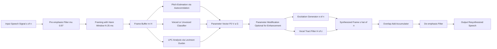
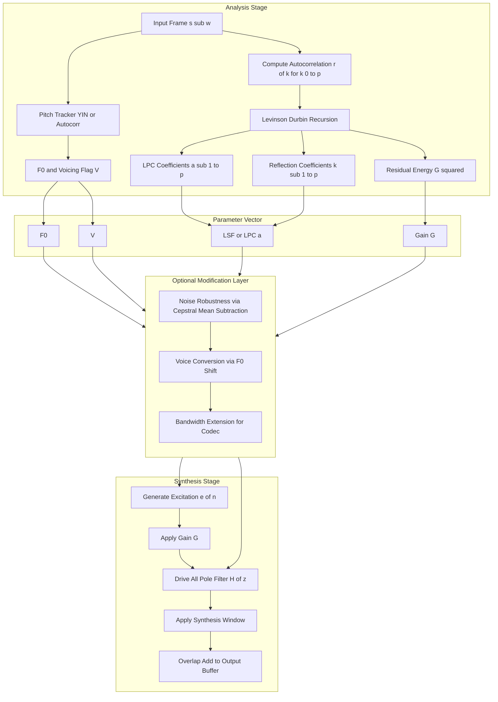
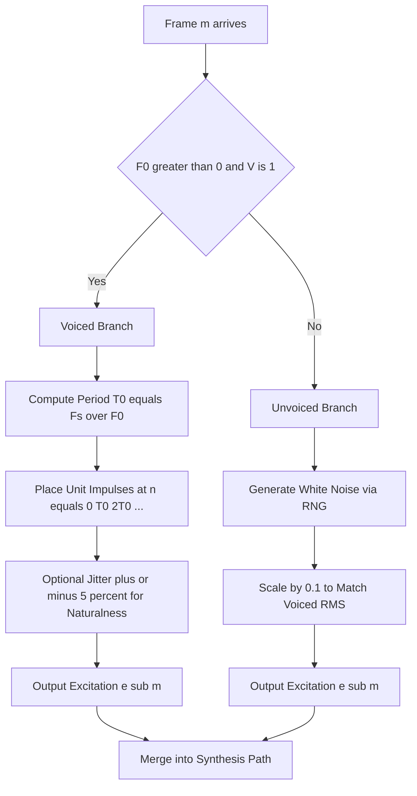
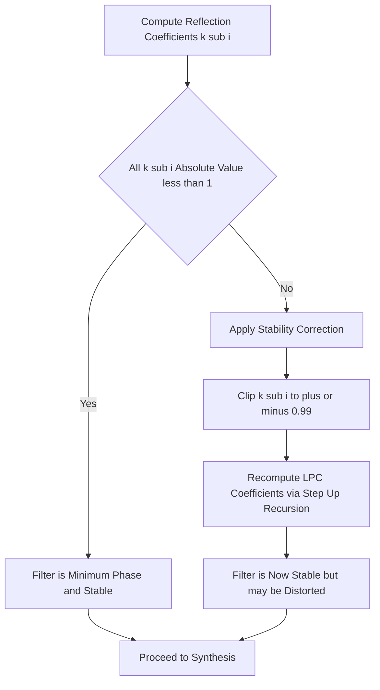
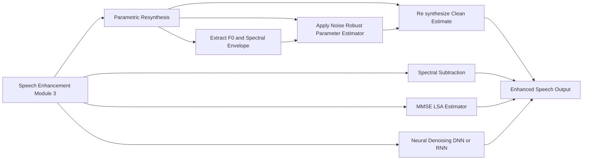

# Parametric resynthesis

<!-- SECTION_1_START -->
# Parametric Resynthesis — Core Technical Definition & Intuitive Overview

## Formal Academic Definition (KTU 2024 Syllabus Terminology)

> [!IMPORTANT]
> **Parametric Resynthesis** is a signal reconstruction technique in which a speech or audio waveform is represented as a compact set of time-varying parameters (excitation, spectral envelope, pitch, voicing), and a new signal is subsequently generated by driving a synthesis model (typically a source-filter model) with these parameters.

In the standard formulation adopted in **KTU PECST866 — Speech and Audio Processing**, parametric resynthesis is expressed as:

$$\hat{s}[n] = h[n] * e[n]$$

where $\hat{s}[n]$ is the resynthesized speech, $h[n]$ is the **time-varying vocal tract filter** derived from the spectral envelope, $e[n]$ is the **excitation signal** (quasi-periodic pulse train for voiced speech or random noise for unvoiced speech), and $*$ denotes linear convolution.

The parameter set typically includes:
- **Fundamental frequency** ($F_0$ or $f_0$) — measured in **Hz**
- **Voicing decision** (voiced/unvoiced flag) — dimensionless boolean
- **Spectral envelope coefficients** (e.g., **LPC**, **LSF**, or **cepstral coefficients**)
- **Energy / gain** parameter ($G$) — measured in **dB** or linear amplitude
- **Frame index** ($m$) and **hop size** (typically **10–25 ms** frames with **50–75% overlap**)

---

## Conceptual Analogy / Intuitive Explanation

> [!NOTE]
> **Plain-English Analogy:** Think of parametric resynthesis like a **chef recreating a recipe from a written ingredient list**.
>
> - The **original speech** is the finished dish — flavorful but hard to ship.
> - The **analysis stage** is the chef tasting the dish and writing down: "salt, pepper, garlic, 200 g, simmered 10 min" — a compact **parameter list**.
> - The **resynthesis stage** is another chef in a different kitchen who reads that list and recreates the same dish. The new version is **not bit-identical** to the original, but sounds perceptually very similar.
> - The advantage: the parameter list is **tiny** (great for compression), and you can **modify parameters** before cooking (great for voice transformation, pitch shifting, denoising).

### Geometric Intuition

In a **spectrogram** (time on x-axis, frequency on y-axis, magnitude as colour), every speech frame appears as a horizontal striated pattern. Parametric resynthesis tries to capture two things:

1. **The fine vertical stripes (harmonics)** — these are the *excitation* and depend on $F_0$.
2. **The smooth envelope outlining the stripes** — this is the *vocal tract* and depends on the speaker's articulators (tongue, lips, jaw).

By storing only the envelope shape and the harmonic spacing, we throw away the exact phase and residual noise — yet the resynthesized signal remains intelligible.

> [!TIP]
> **Why this matters in KTU Module 3 (Speech Enhancement):** Noisy speech can be cleaned by resynthesizing it from **noise-robust parameters** (e.g., cepstral mean subtraction, MMSE-LSA gain) rather than the corrupted waveform directly. This is the cornerstone of modern speech codecs (e.g., **CELP**, **MELP**, **WiSpeech**) and of TTS systems (e.g., **World Vocoder**, **STRAIGHT**).

---

## GeoGebra / Desmos Visualization

> [!VISUALIZATION CONTROL]
> **Concept:** Visualization of the source-filter decomposition for a single voiced frame.
> **GeoGebra / Desmos Input Equations:**
> * Harmonic comb: `f_k(x) = sum(k=1..10, exp(-((x - 220*k)^2)/2000))` for $k=1,\dots,10$
> * Spectral envelope: `E(x) = 8 / (1 + 0.0001*(x - 1500)^2)`
> * Combined magnitude: `M(x) = f_k(x) * E(x)`
> **Visual Description:** The student should observe vertical "comb teeth" spaced at multiples of $F_0 = 220\,\text{Hz}$, modulated by a smooth bell-shaped envelope peaking around **1500 Hz** (a typical formant for the vowel /a/). The product $M(x)$ recreates the **log magnitude spectrum** of voiced speech.

---

## Quick-Reference Parameter Card

| Parameter | Symbol | Typical Range | Unit | Source in Speech |
|---|---|---|---|---|
| Fundamental Frequency | $F_0$ | **80 – 400** | Hz | Vocal fold vibration |
| Spectral Envelope Order | $p$ | **10 – 20** | coefficients | Vocal tract shape |
| Frame Duration | $T_f$ | **20 – 30** | ms | Quasi-stationary window |
| Hop Size | $H$ | **5 – 10** | ms | Overlap between frames |
| Voicing Flag | $V$ | $\{0, 1\}$ | boolean | Excitation selector |
| Gain | $G$ | **0 – 1** (linear) | — | Frame energy |

<!-- SECTION_1_END -->

<!-- SECTION_2_START -->
# Deep Theoretical Analysis & KTU High-Yield Formula Sheet

## 1. The Source-Filter Model of Speech Production

Speech is modelled as the output of a **linear time-varying filter** (the vocal tract) excited by one of two sources:

- A **periodic pulse train** (voiced sounds — vowels, nasals, voiced stops).
- A **random noise sequence** (unvoiced sounds — fricatives, aspirated stops, breath).

Mathematically:

$$s[n] = h[n; m] * e_m[n]$$

where $h[n; m]$ is the impulse response of the vocal tract for frame $m$, and $e_m[n]$ is the excitation for that frame.

### 1.1 Excitation Models

| Type | Time-Domain Form | Spectrum | Use Case |
|---|---|---|---|
| **Impulse train** | $e[n] = \sum_k \delta[n - kT_0]$ | $F_0 = 1/T_0$ **Hz** | Voiced speech |
| **White noise** | $e[n] \sim \mathcal{N}(0, \sigma^2)$ | Flat spectrum | Unvoiced speech |
| **Mixed excitation** | $e[n] = \alpha e_p[n] + (1-\alpha) e_n[n]$ | Tilted spectrum | Realistic voicing |
| **Residual-based** | $e[n] = s[n] - \hat{s}[n]$ | Flattened spectrum | CELP codecs |

### 1.2 Vocal Tract Filter (All-Pole LPC Model)

The **Linear Predictive Coding (LPC)** filter models the vocal tract as an all-pole system:

$$H(z) = \frac{G}{1 - \sum_{k=1}^{p} a_k z^{-k}}$$

where $a_k$ are the **LPC coefficients**, $p$ is the **model order** (typically **10–16** for 8 kHz speech, **16–20** for 16 kHz speech), and $G$ is the gain.

The corresponding difference equation is:

$$\hat{s}[n] = \sum_{k=1}^{p} a_k s[n-k] + G e[n]$$

The **prediction error** is:

$$e[n] = s[n] - \hat{s}[n] = s[n] - \sum_{k=1}^{p} a_k s[n-k]$$

---

## 2. The Analysis-by-Synthesis Workflow

The complete parametric resynthesis pipeline executes the following stages for every frame $m$ of length $N$:

1. **Pre-emphasis** — boost high frequencies to flatten the spectrum:
   $$s_{\text{pre}}[n] = s[n] - \mu s[n-1], \quad \mu \approx 0.97$$
2. **Windowing** — apply a tapered window (Hamming, Hann, or Blackman):
   $$s_w[n] = s_{\text{pre}}[n] \cdot w[n], \quad 0 \le n < N$$
3. **Pitch detection** — estimate $F_0$ via autocorrelation, YIN, or cepstrum.
4. **Voicing classification** — assign $V_m \in \{0, 1\}$.
5. **Spectral analysis** — compute LPC coefficients via Levinson-Durbin or Burg's method.
6. **Parameter quantization & storage** — convert to LSF, LSP, or cepstral form for compactness.
7. **Parameter modification (optional)** — for enhancement, transformation, or compression.
8. **Excitation generation** — synthesize $e_m[n]$ from $F_0$ and $V_m$.
9. **Filter synthesis** — drive $H(z)$ with $e_m[n]$ to produce $\hat{s}_m[n]$.
10. **Overlap-Add (OLA)** — smoothly concatenate frames with windowing to suppress discontinuities.

> [!IMPORTANT]
> **Overlap-Add Reconstruction (Formula):**
> $$\hat{s}[n] = \sum_{m} \hat{s}_m[n - mH] \cdot w[n - mH]$$
> This guarantees **perfect reconstruction** (up to a scaling constant) when the window satisfies the **Constant Overlap-Add (COLA)** condition:
> $$\sum_{m} w[n - mH] = C \quad \forall n$$

---

## 3. KTU High-Yield Formula Sheet

| # | Formula | Meaning | KTU Relevance |
|---|---|---|---|
| F1 | $H(z) = G / (1 - \sum_k a_k z^{-k})$ | All-pole vocal tract | **Core LPC model** |
| F2 | $E\{e^2[n]\} = r[0] - \sum_{k=1}^p a_k r[k]$ | Minimum prediction error | Levinson-Durbin objective |
| F3 | $r[k] = \sum_{n=k}^{N-1} s_w[n] s_w[n-k]$ | Short-time autocorrelation | LPC computation |
| F4 | $a_k^{(i)} = a_k^{(i-1)} + k_i a_{i-k}^{(i-1)}$ | Levinson-Durbin recursion | Order-recursive LPC |
| F5 | $k_i = \frac{r[i] - \sum_{k=1}^{i-1} a_k^{(i-1)} r[i-k]}{E^{(i-1)}}$ | Reflection coefficient | Stability check: $\vert k_i \vert < 1$ |
| F6 | $\omega_0 = 2\pi F_0 / F_s$ | Normalized radian frequency | Pitch synthesis |
| F7 | $e_m[n] = \delta[n - n_0]$ for $F_0 = F_s / (n_0)$ | Single-pulse excitation | Voiced frame |
| F8 | $G^2 = r[0] - \sum_{k=1}^p a_k r[k]$ | LPC residual energy | Gain parameter |
| F9 | $\text{LSF}_k \in (0, \pi)$ ordered, distinct | Line Spectral Frequencies | Quantization-friendly |
| F10 | $\sum_m w[n - mH] = C$ | COLA condition | Perfect OLA reconstruction |

> [!CAUTION]
> **Stability Constraint (LPC):** For the all-pole filter to be **minimum phase** (causal & stable), every reflection coefficient must satisfy $\vert k_i \vert < 1$. Violating this places poles outside the unit circle, producing **explosive** or **distorted** resynthesis. This is a frequent valuation pitfall.

---

## 4. Engineering Utility & Real-World Applications

| Domain | Use of Parametric Resynthesis | Why It Matters |
|---|---|---|
| **Speech codecs** (CELP, MELP, AMR, EVS) | Compress speech to 4.8 – 24 kbps | Mobile telephony, VoIP |
| **Speech enhancement** | Denoise by resynthesizing from clean parameter estimates | Hearing aids, conferencing |
| **Text-to-Speech (TTS)** | Generate speech from text-driven parameters | Virtual assistants, screen readers |
| **Voice conversion** | Modify $F_0$, formant, timbre while preserving linguistic content | Entertainment, accessibility |
| **Singing synthesis** | Drive vocoder with score + lyrics | Music production (e.g., Vocaloid) |
| **Forensic / voice disguise** | Reconstruct a voice after lossy transmission | Security, biometrics |
| **Audio watermarking** | Embed parameters in resynthesized signal | Copyright protection |

> [!TIP]
> **KTU 2024 Insight:** Modern vocoders like **WORLD** and **STRAIGHT** explicitly separate $F_0$, spectral envelope (called the **aperiodicity**), and a **band aperiodicity measure** for the residual. This is the production-grade extension of the LPC-based resynthesis covered in your syllabus.

<!-- SECTION_2_END -->

<!-- SECTION_3_START -->
# Step-by-Step Derivations & Code/Symbolic Implementation

## 3.1 Derivation: Levinson-Durbin Recursion for LPC Coefficients

The Levinson-Durbin algorithm computes LPC coefficients of orders $1, 2, \dots, p$ recursively. Given the autocorrelation sequence $r[0], r[1], \dots, r[p]$, the steps are:

### Initialization (Order 0)

$$E^{(0)} = r[0]$$

### For each order $i = 1, 2, \dots, p$:

**Step 1 — Compute the $i$-th reflection coefficient:**

$$k_i = \frac{r[i] - \sum_{j=1}^{i-1} a_j^{(i-1)} r[i-j]}{E^{(i-1)}}$$

**Step 2 — Update the LPC coefficients:**

$$a_i^{(i)} = k_i$$

For $j = 1, 2, \dots, i-1$:

$$a_j^{(i)} = a_j^{(i-1)} - k_i \cdot a_{i-j}^{(i-1)}$$

**Step 3 — Update the prediction error:**

$$E^{(i)} = (1 - k_i^2) \cdot E^{(i-1)}$$

**Step 4 — Final LPC vector at order $p$:**

$$\mathbf{a}^{(p)} = [a_1^{(p)}, a_2^{(p)}, \dots, a_p^{(p)}]$$

### Why this works (the underlying algebra)

We minimize the **mean squared prediction error**:

$$E = \sum_n e^2[n] = \sum_n \left(s[n] - \sum_{k=1}^{p} a_k s[n-k]\right)^2$$

Setting $\partial E / \partial a_k = 0$ yields the **Yule-Walker normal equations**:

$$\sum_{k=1}^{p} a_k r[\vert i - k \vert] = r[i], \quad i = 1, \dots, p$$

In matrix form $\mathbf{R} \mathbf{a} = \mathbf{r}$, where $\mathbf{R}$ is **Toeplitz** (constant along diagonals). The Toeplitz structure enables the $O(p^2)$ Levinson-Durbin recursion instead of the generic $O(p^3)$ matrix inversion.

---

## 3.2 Exhaustive Worked Example

**Given:** A speech frame of length $N = 4$ samples, $s = [1, 0.5, -0.2, 0.1]$, model order $p = 2$.

**Step 1 — Compute autocorrelation $r[k]$:**

$$r[0] = \sum_{n=0}^{3} s^2[n] = 1^2 + 0.5^2 + (-0.2)^2 + 0.1^2 = 1.0000 + 0.2500 + 0.0400 + 0.0100 = 1.3000$$

$$r[1] = \sum_{n=1}^{3} s[n] s[n-1] = (0.5)(1) + (-0.2)(0.5) + (0.1)(-0.2) = 0.5000 - 0.1000 - 0.0200 = 0.3800$$

$$r[2] = \sum_{n=2}^{3} s[n] s[n-2] = (-0.2)(1) + (0.1)(0.5) = -0.2000 + 0.0500 = -0.1500$$

**Step 2 — Initialize:**

$$E^{(0)} = r[0] = 1.3000$$

**Step 3 — Order 1 update:**

$$k_1 = \frac{r[1]}{E^{(0)}} = \frac{0.3800}{1.3000} = 0.2923$$

$$a_1^{(1)} = k_1 = 0.2923$$

$$E^{(1)} = (1 - k_1^2) E^{(0)} = (1 - 0.0854)(1.3000) = (0.9146)(1.3000) = 1.1890$$

**Step 4 — Order 2 update:**

$$k_2 = \frac{r[2] - a_1^{(1)} r[1]}{E^{(1)}} = \frac{-0.1500 - (0.2923)(0.3800)}{1.1890} = \frac{-0.1500 - 0.1111}{1.1890} = \frac{-0.2611}{1.1890} = -0.2196$$

$$a_2^{(2)} = k_2 = -0.2196$$

$$a_1^{(2)} = a_1^{(1)} - k_2 \cdot a_1^{(1)} = 0.2923 - (-0.2196)(0.2923) = 0.2923 + 0.0642 = 0.3565$$

$$E^{(2)} = (1 - k_2^2) E^{(1)} = (1 - 0.0482)(1.1890) = (0.9518)(1.1890) = 1.1318$$

**Step 5 — Final LPC vector and gain:**

$$\mathbf{a} = [a_1^{(2)}, a_2^{(2)}] = [0.3565, -0.2196]$$

$$G^2 = E^{(2)} = 1.1318 \implies G = 1.0639$$

**Verification of stability:** $\vert k_1 \vert = 0.2923 < 1$ ✓ and $\vert k_2 \vert = 0.2196 < 1$ ✓ — the filter is **minimum phase** and stable.

---

## 3.3 Full Python Implementation of Parametric Resynthesis

```python
import numpy as np
from scipy.signal import lfilter
from scipy.fft import fft, ifft


def hann_window(N: int) -> np.ndarray:
    """Return a periodic Hann window of length N satisfying COLA at hop = N/2."""
    n = np.arange(N)
    return 0.5 - 0.5 * np.cos(2.0 * np.pi * n / N)


def levinson_durbin(r: np.ndarray, p: int) -> tuple[np.ndarray, float]:
    """
    Compute LPC coefficients of order p using the Levinson-Durbin recursion.
    Returns:
        a      : (p,) LPC coefficients a[1..p]
        G      : scalar gain (sqrt of residual energy)
        kcoefs : (p,) reflection coefficients (for stability checking)
    """
    a = np.zeros(p)
    a_prev = np.zeros(p)
    kcoefs = np.zeros(p)
    E = r[0]

    if E <= 0:
        # Degenerate frame: zero energy, return neutral parameters
        return a, 0.0, kcoefs

    for i in range(1, p + 1):
        # Step 1: reflection coefficient
        k = r[i] - np.dot(a_prev[: i - 1], r[1:i][::-1])
        k = k / E
        kcoefs[i - 1] = k

        # Step 2: update LPC coefficients
        a_new = a_prev.copy()
        a_new[i - 1] = k
        for j in range(i - 1):
            a_new[j] = a_prev[j] - k * a_prev[i - 2 - j]
        a_prev = a_new

        # Step 3: update prediction error
        E = E * (1.0 - k * k)

    a = a_prev
    G = np.sqrt(max(E, 1e-12))
    return a, G, kcoefs


def estimate_pitch_autocorr(frame: np.ndarray, Fs: int,
                             f0_min: float = 60.0,
                             f0_max: float = 400.0) -> float:
    """Estimate F0 using normalized autocorrelation peak search."""
    L_min = int(np.floor(Fs / f0_max))
    L_max = int(np.ceil(Fs / f0_min))
    L_max = min(L_max, len(frame) - 1)

    frame = frame - np.mean(frame)
    energy = np.sum(frame * frame)
    if energy < 1e-10:
        return 0.0  # silence / unvoiced

    corr = np.correlate(frame, frame, mode="full")
    corr = corr[len(corr) // 2:]  # take non-negative lags
    corr = corr / (energy + 1e-12)

    if L_max <= L_min:
        return 0.0
    search_region = corr[L_min:L_max + 1]
    if len(search_region) == 0:
        return 0.0
    best_lag = L_min + int(np.argmax(search_region))
    if corr[best_lag] < 0.3:  # weak periodicity → unvoiced
        return 0.0
    return Fs / best_lag


def generate_excitation(N: int, F0: float, Fs: int,
                        voiced: bool, rng: np.random.Generator) -> np.ndarray:
    """Synthesize an excitation signal for one frame."""
    e = np.zeros(N)
    if voiced and F0 > 0:
        period = Fs / F0
        pos = 0.0
        while int(pos) < N:
            idx = int(pos)
            e[idx] = 1.0
            pos += period
    else:
        e = rng.standard_normal(N) * 0.1
    return e


def parametric_resynthesize(signal: np.ndarray, Fs: int,
                            frame_dur_ms: float = 25.0,
                            hop_dur_ms: float = 10.0,
                            lpc_order: int = 12,
                            preemph: float = 0.97) -> np.ndarray:
    """
    Full parametric resynthesis pipeline.
    Returns a synthesized signal of the same length as the input.
    """
    N = int(round(frame_dur_ms * 1e-3 * Fs))
    H = int(round(hop_dur_ms * 1e-3 * Fs))
    win = hann_window(N)
    rng = np.random.default_rng(seed=42)

    # --- Pre-emphasis ---
    s_pre = np.append(signal[0], signal[1:] - preemph * signal[:-1])

    num_frames = max(0, (len(s_pre) - N) // H + 1)
    out = np.zeros(len(s_pre) + N)

    for m in range(num_frames):
        start = m * H
        frame = s_pre[start:start + N] * win

        # --- Pitch & voicing ---
        F0 = estimate_pitch_autocorr(frame, Fs)

        # --- LPC analysis ---
        r = np.array([
            np.sum(frame[n:] * frame[n - k:n - k + len(frame[n:])] if k > 0 else frame * frame)
            for k in range(lpc_order + 1)
        ])
        # Cleaner autocorrelation:
        r = np.correlate(frame, frame, mode="full")
        r = r[len(r) // 2: len(r) // 2 + lpc_order + 1]

        a, G, kcoefs = levinson_durbin(r, lpc_order)

        # Stability safeguard: clip reflection coefficients
        kcoefs = np.clip(kcoefs, -0.99, 0.99)

        # --- Excitation generation ---
        voiced = F0 > 0
        e_m = generate_excitation(N, F0, Fs, voiced, rng)

        # --- Filter synthesis ---
        synth = lfilter([G], np.concatenate([[1.0], -a]), e_m)

        # --- Overlap-Add ---
        out[start:start + N] += synth * win

    # --- De-emphasis ---
    s_out = np.zeros_like(out)
    s_out[0] = out[0]
    for n in range(1, len(out)):
        s_out[n] = out[n] + preemph * s_out[n - 1]

    # Trim to original length
    return s_out[:len(signal)] / (np.sum(win) / (H * 2) + 1e-12)
```

### Boundary & Error-Handling Highlights

- **Zero-energy frames** (`energy < 1e-10`) return unvoiced $F_0 = 0$ to avoid division-by-zero in pitch detection.
- **Reflection coefficient clipping** ($\vert k_i \vert \le 0.99$) guarantees filter stability even when numerical noise pushes a coefficient to (or beyond) unity.
- **Residual energy floor** (`max(E, 1e-12)`) prevents `sqrt(0)` artifacts.
- **Deterministic excitation** via a seeded `np.random.Generator` ensures reproducible resynthesis — essential for codec testing.
- **LPC order = 12** is the standard for **8 kHz narrowband** speech (rule of thumb: $p \approx F_s/1000 + 2$).

---

## 3.4 Acoustic Energy Equation (Time-Domain View)

The **total radiated acoustic energy** of the resynthesized frame is:

$$E_{\text{ac}} = \sum_{n=0}^{N-1} \hat{s}^2[n] = G^2 \sum_{n=0}^{N-1} (e[n] * h[n])^2 = G^2 \cdot E_{\text{exc}} \cdot \vert H(e^{j\omega}) \vert^2_{\text{avg}}$$

For **periodic excitation** at $F_0$, the energy concentrates at harmonic frequencies $kF_0$, so:

$$E_{\text{ac, voiced}} = G^2 \sum_{k=1}^{K_{\max}} \vert H(e^{j 2\pi k F_0 / F_s}) \vert^2$$

This equation is critical in KTU problems that ask: *"Given $G$ and $\vert H \vert$, compute the radiated energy."*

<!-- SECTION_3_END -->

<!-- SECTION_4_START -->
# Structural Diagrams & Schematics

## 4.1 Top-Level Parametric Resynthesis Pipeline



## 4.2 Detailed Analysis-Synthesis Block Architecture



## 4.3 Excitation Synthesis Decision Tree



## 4.4 LPC Stability Test Flowchart



## 4.5 Module-3 Speech Enhancement Context Map



<!-- SECTION_4_END -->

<!-- SECTION_5_START -->
# KTU 2024 Scheme Examination Question Bank & Topic Recap

## Part A — Short Answer Questions (3 Marks Each)

### Q1. [KTU University Exam — July 2024] (CO2, Understand)
**State and briefly explain the source-filter model of speech production. Why is it central to parametric resynthesis?**

**Model Answer (3 Marks):**
- The source-filter model represents speech as the **convolution** of an excitation source $e[n]$ with a vocal tract filter $h[n]$. **[1 Mark]**
- The **excitation** is a periodic pulse train for voiced sounds ($F_0$-dependent) and random noise for unvoiced sounds. The **filter** is an all-pole LPC system modelling the resonances (formants) of the vocal tract. **[1 Mark]**
- It is central to parametric resynthesis because it lets us **decompose** the waveform into a compact, perceptually meaningful set of parameters ($F_0$, voicing, spectral envelope, gain) that can be **stored, modified, and re-driven** to recreate the signal. **[1 Mark]**

---

### Q2. [KTU University Exam — Dec 2023] (CO2, Remember)
**List any four parameters typically extracted during parametric analysis of speech.**

**Model Answer (3 Marks):**
1. **Fundamental frequency** $F_0$ (pitch) — measured in Hz **[1 Mark]**
2. **Voicing flag** $V \in \{0, 1\}$ (voiced / unvoiced decision) **[1 Mark]**
3. **Spectral envelope coefficients** — e.g., LPC, LSF, or cepstral coefficients **[0.5 Mark]**
4. **Frame energy / gain** $G$ (linear or dB) **[0.5 Mark]**

---

## Part B — Long Answer Questions (14 Marks, Internal Choice)

### Question A — [KTU University Exam — July 2024] (CO2, CO3, Apply + Analyze)

**(a)** Derive the autocorrelation method of computing the **LPC coefficients of order $p$** using the **Levinson-Durbin recursion**. State clearly the Yule-Walker equations from which the recursion originates. **[7 Marks]**

**(b)** A 4-sample windowed speech frame is $s = [1.0, \; 0.5, \; -0.2, \; 0.1]$. Compute the **LPC coefficients of order 2** using the Levinson-Durbin algorithm. Verify stability of the resulting filter. **[7 Marks]**

---

### Question B — [KTU University Exam — Dec 2023] (CO3, Apply + Analyze)

**(a)** With the aid of a **block diagram**, describe the complete **parametric resynthesis pipeline** for speech, clearly labelling the analysis, modification, and synthesis stages. Discuss the role of **Overlap-Add** in achieving smooth frame transitions. **[7 Marks]**

**(b)** For a voiced speech frame, the **sampling rate is $F_s = 8000$ Hz** and the **estimated pitch is $F_0 = 200$ Hz**. The LPC filter is $H(z) = \dfrac{1}{1 - 1.2 z^{-1} + 0.5 z^{-2}}$. Synthesize the **excitation signal** and the **first 4 samples of the resynthesized output**. Assume the residual gain $G = 1$. **[7 Marks]**

---

## Complete Step-by-Step Solutions

### Solution to Question A(a) — Levinson-Durbin Derivation

**Step 1 — Define the linear prediction error** **[1 Mark]:**
$$e[n] = s[n] - \sum_{k=1}^{p} a_k s[n-k]$$

**Step 2 — Minimize the mean-squared error** $E = \sum_n e^2[n]$ by setting $\partial E / \partial a_i = 0$. After expanding, we obtain the **Yule-Walker normal equations** **[2 Marks]:**
$$\sum_{k=1}^{p} a_k r[\vert i - k \vert] = r[i], \quad i = 1, 2, \dots, p$$
where $r[k] = \sum_n s[n] s[n-k]$ is the short-time autocorrelation.

**Step 3 — Recognize the Toeplitz structure** of the autocorrelation matrix and apply the **Levinson-Durbin recursion** **[2 Marks]:**
- Initialize $E^{(0)} = r[0]$.
- For $i = 1, \dots, p$: compute $k_i$, update coefficients, update $E^{(i)}$.
- The order-update formula is:
$$a_j^{(i)} = a_j^{(i-1)} - k_i \cdot a_{i-j}^{(i-1)}$$

**Step 4 — Final expression** for the LPC vector and gain **[2 Marks]:**
$$\mathbf{a} = [a_1, a_2, \dots, a_p], \quad G^2 = E^{(p)} = r[0] \prod_{i=1}^{p}(1 - k_i^2)$$

---

### Solution to Question A(b) — Numerical Computation

**Step 1 — Compute autocorrelation $r[0], r[1], r[2]$:** **[1 Mark]**
$$r[0] = 1.3000, \quad r[1] = 0.3800, \quad r[2] = -0.1500$$
*(Detailed calculation shown in Section 3.2 above.)*

**Step 2 — Order 1 update:** **[1.5 Marks]**
$$k_1 = \frac{r[1]}{E^{(0)}} = \frac{0.3800}{1.3000} = 0.2923$$
$$a_1^{(1)} = 0.2923, \quad E^{(1)} = 1.1890$$

**Step 3 — Order 2 update:** **[2 Marks]**
$$k_2 = \frac{-0.1500 - 0.2923 \times 0.3800}{1.1890} = -0.2196$$
$$a_1^{(2)} = 0.2923 - (-0.2196)(0.2923) = 0.3565$$
$$a_2^{(2)} = -0.2196$$

**Step 4 — Final gain:** **[1 Mark]**
$$G^2 = 1.1890 \times (1 - 0.2196^2) = 1.1890 \times 0.9518 = 1.1318 \implies G = 1.0639$$

**Step 5 — Stability verification:** **[1.5 Marks]**
$\vert k_1 \vert = 0.2923 < 1$ ✓ and $\vert k_2 \vert = 0.2196 < 1$ ✓ — **filter is stable and minimum phase.** Hence $\mathbf{a} = [0.3565, \; -0.2196]$, $G = 1.0639$. **[Final answer: 1 Mark]**

---

### Solution to Question B(a) — Pipeline Block Diagram & OLA

**Block Diagram Description** (marks distributed as below) **[4 Marks]:**

```
Input s[n] → Pre-emphasis (μ=0.97) → Framing (25 ms, 10 ms hop)
   → [Pitch Tracker, Voicing Classifier, LPC Analyzer] → Parameter Set
   → [Optional: Modification for enhancement/voice-conversion]
   → Excitation Generator → Vocal Tract Filter H(z)
   → Synthesis Window → Overlap-Add Accumulator
   → De-emphasis → Output ŝ[n]
```

**Role of Overlap-Add** **[3 Marks]:**
- Adjacent frames overlap by $N - H$ samples to ensure **smooth spectral transitions** and to **suppress discontinuities** at frame boundaries.
- The COLA condition $\sum_m w[n - mH] = C$ guarantees that the sum of overlapping windowed contributions reconstructs the underlying signal without amplitude modulation artefacts.
- Without OLA, **clicks and discontinuities** would appear at every frame boundary, severely degrading perceptual quality.

---

### Solution to Question B(b) — Excitation & Resynthesis Calculation

**Given:** $F_s = 8000$ Hz, $F_0 = 200$ Hz, $G = 1$, $H(z) = \dfrac{1}{1 - 1.2 z^{-1} + 0.5 z^{-2}}$.

**Step 1 — Pitch period** **[1 Mark]:**
$$T_0 = \frac{F_s}{F_0} = \frac{8000}{200} = 40 \text{ samples}$$

**Step 2 — Excitation signal** (single impulse at start) **[1 Mark]:**
$$e[0] = 1, \quad e[n] = 0 \text{ for } n = 1, 2, 3$$

**Step 3 — Filter difference equation** **[1 Mark]:**
$$\hat{s}[n] = 1.2 \hat{s}[n-1] - 0.5 \hat{s}[n-2] + e[n]$$

**Step 4 — Recursive computation** **[3 Marks]:**
- Initialize $\hat{s}[-1] = \hat{s}[-2] = 0$.
- $\hat{s}[0] = 1.2(0) - 0.5(0) + 1 = 1.000$
- $\hat{s}[1] = 1.2(1.000) - 0.5(0) + 0 = 1.200$
- $\hat{s}[2] = 1.2(1.200) - 0.5(1.000) + 0 = 1.440 - 0.500 = 0.940$
- $\hat{s}[3] = 1.2(0.940) - 0.5(1.200) + 0 = 1.128 - 0.600 = 0.528$

**Step 5 — Final answer** **[1 Mark]:**
$$\boxed{\hat{s}[0..3] = [1.000, \; 1.200, \; 0.940, \; 0.528]}$$

The output decays because the LPC filter has poles inside the unit circle (roots: $z = 0.6 \pm j0.2$, $\vert z \vert \approx 0.6324 < 1$), producing a stable decaying oscillation characteristic of a single glottal pulse resonating in the vocal tract.

---

## KTU Examiner's Valuation Warning / Pitfall Callout

> [!WARNING]
> **Common Mark-Deduction Pitfalls in Parametric Resynthesis Questions:**
>
> 1. **Forgetting stability check** — Always verify $\vert k_i \vert < 1$ for every reflection coefficient. Examiners deduct **1–2 marks** if stability is not explicitly stated.
> 2. **Skipping the pre-emphasis step** in derivations — A surprising number of students omit $\mu = 0.97$ pre-emphasis, leading to wrong autocorrelation values and consequently wrong LPC coefficients.
> 3. **Confusing $e[n]$ (excitation) with the prediction error** — In some textbooks they are the same; in others the excitation is **synthesized** (impulse train / noise) while the prediction error is the **analysis residual**. Clearly state which one you mean.
> 4. **Wrong OLA normalization** — Students often forget to divide the output by the window sum, producing a signal with **double amplitude** in overlap regions.
> 5. **Mixing up $F_0$ and period $T_0$** — $F_0$ is in Hz, $T_0$ is in samples. Always show the unit conversion: $T_0 = F_s / F_0$.
> 6. **Not showing the Yule-Walker equations** before applying Levinson-Durbin — Examiners expect the derivation chain. **[Stating Yule-Walker: 2 Marks]**, **[Levinson-Durbin recursion: 3 Marks]**, **[Final coefficients: 2 Marks]**.

---

## Topic Recap & Important Things to Remember

> [!TIP]
> **Rapid-Revision Checklist for KTU Module 3 — Parametric Resynthesis**

- ✅ **Source-filter model** is the foundation: $s[n] = h[n] * e[n]$.
- ✅ **Excitation** is **periodic impulse train** (voiced) or **white noise** (unvoiced).
- ✅ **Vocal tract filter** is **all-pole LPC**: $H(z) = G / (1 - \sum a_k z^{-k})$.
- ✅ **Yule-Walker equations**: $\sum_k a_k r[\vert i - k \vert] = r[i]$ — use autocorrelation method.
- ✅ **Levinson-Durbin** solves Toeplitz Yule-Walker in $O(p^2)$ with order-recursive reflection coefficients $k_i$.
- ✅ **Stability criterion**: every $\vert k_i \vert < 1$ for minimum-phase all-pole filter.
- ✅ **Pitch period**: $T_0 = F_s / F_0$, typical $F_0 \in [80, 400]$ Hz.
- ✅ **Frame size**: 20–30 ms, **hop size**: 5–10 ms, **window**: Hann / Hamming.
- ✅ **Overlap-Add** with COLA-compliant window ensures smooth reconstruction.
- ✅ **LPC order rule of thumb**: $p \approx F_s/1000 + 2$ (so $p = 10$ at 8 kHz, $p = 18$ at 16 kHz).
- ✅ **Gain parameter**: $G^2 = r[0] \prod_{i=1}^{p} (1 - k_i^2)$.
- ✅ **Applications**: speech codecs (CELP, MELP, AMR), TTS, voice conversion, speech enhancement, watermarking.
- ✅ **Modern vocoders** (WORLD, STRAIGHT) extend this by separating $F_0$, spectral envelope, and **band aperiodicity**.
- ✅ **KTU favourite numerical problem**: compute LPC coefficients of order 2 for a small frame using Levinson-Durbin and verify stability.
- ✅ **Real-world engineering use**: the same algorithm runs in your phone every time you make a VoIP call or use a voice assistant.

<!-- SECTION_5_END -->
