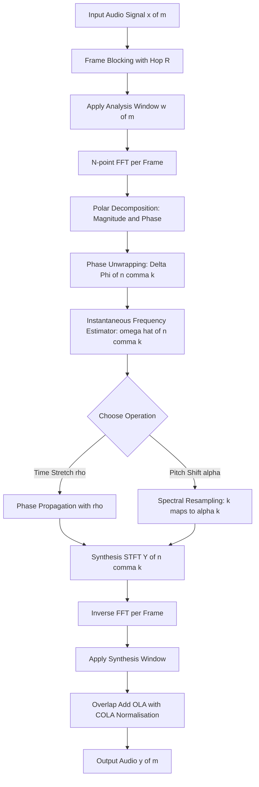
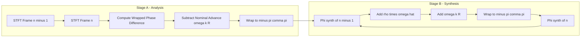
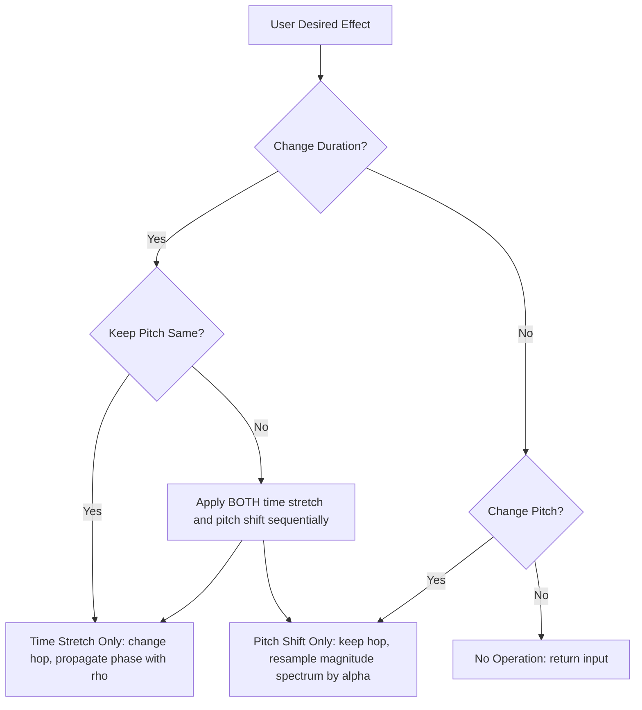
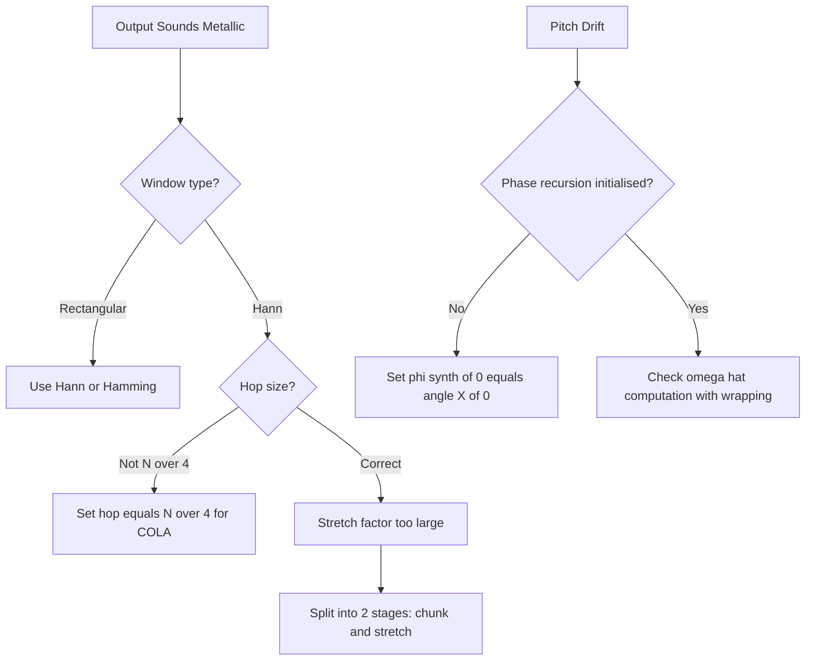

# phase vocoder

<!-- SECTION_1_START -->
# PHASE VOCODER — Core Definition & Intuitive Overview

> [!IMPORTANT]
> **KTU 2024 Scheme — PECST866 (Speech and Audio Processing), Module 3: Speech Enhancement**
> A *Phase Vocoder* is a frequency-domain digital signal processing system that analyses an audio signal using the **Short-Time Fourier Transform (STFT)**, manipulates the time-frequency representation through **phase unwrapping** and **phase propagation**, and re-synthesises the modified signal through **Overlap-Add (OLA)**. It is the canonical tool for **time-stretching** and **pitch-shifting** audio without distorting the complementary parameter (e.g., changing duration without altering pitch).

---

## 1.1 Formal Academic Definition

A **Phase Vocoder** is an analysis-modification-synthesis (AMS) framework introduced by **James L. Flanagan and Roger M. Golden (1966)** that:

1. Decomposes an audio signal $x[m]$ into overlapping windowed frames using the **STFT**, yielding complex-valued bins $X(n, k)$.
2. Estimates the **instantaneous frequency** $\hat{\omega}(n, k)$ of each bin by measuring the inter-frame phase deviation.
3. **Re-propagates** the phase to a new synthesis hop size, producing a modified STFT $Y(n, k)$.
4. Reconstructs the output via **Inverse STFT + Overlap-Add** with a Hann/Hamming window to maintain the **COLA (Constant Overlap-Add)** condition.

> [!NOTE]
> The word *vocoder* is a portmanteau of **"voice"** and **"encoder"**; the prefix *phase* emphasises that the algorithm explicitly tracks and manipulates the **phase** component of the Fourier bins (not just the magnitude).

---

## 1.2 Intuitive Real-World Analogy — *The Stretchable Film Reel*

Imagine you have a **24-frame-per-second film reel** of a piano recital.

| Direct Re-Speed (Naïve) | Phase Vocoder (Smart) |
|---|---|
| You literally pull the film through the projector **faster or slower** → every note becomes **higher-pitched or lower-pitched** (chipmunk effect) | You analyse *which notes* are being played, *when* they start, and *how their overtones vibrate together*. You then **stitch new frames** that play the same notes over a longer time, but at the same pitch |
| Loses naturalness | Preserves timbral identity |

In the same way, the phase vocoder **does not stretch the waveform directly**. Instead, it stretches the **envelope of evolution** of the spectral bins. Each frequency bin is treated like an individual oscillator whose instantaneous frequency is measured frame-to-frame, and the oscillators are re-driven over a longer (or shorter) timeline.

---

## 1.3 Geometric Intuition — *Polar Form of STFT Bins*

Every STFT bin $X(n, k)$ can be written in **polar form**:

$$X(n, k) = \vert X(n, k) \vert \, e^{j \, \angle X(n, k)}$$

- The **magnitude** $\vert X(n, k) \vert$ describes *how much energy* is at frequency $\omega_k$ at time $n$.
- The **angle** $\angle X(n, k)$ describes *where the sinusoid is in its cycle*.

When we move from frame $n-1$ to frame $n$ (a hop of $R$ samples), the phase *should* advance by exactly $\omega_k R$ (the expected rotation due to the hop). Any **deviation** from this expected rotation is the **phase residual**, and it encodes the *true* instantaneous frequency of that bin (e.g., due to vibrato, pitch drift, or a non-stationary harmonic).

The phase vocoder measures this residual and uses it to compute a more accurate instantaneous frequency — unlocking high-quality time/pitch modifications that a simple magnitude-only "sola" (sum of overlaps) cannot achieve.

---

## 1.4 Standard Metrics & Constants (Bolded)

| Symbol | Meaning | Typical Value |
|---|---|---|
| $N$ | FFT length (window length) | **1024 or 2048** samples |
| $R$ (or $H_a$) | Analysis hop size | $N/4$ (75% overlap) — Hann window |
| $\rho$ | Time-stretch factor | $\rho > 1$ = slower, $\rho < 1$ = faster |
| $\alpha$ | Pitch-shift factor (semitones) | $2^{s/12}$ where $s$ = semitones |
| $w[m]$ | Analysis window | **Hann, Hamming, Blackman** |
| $f_s$ | Sampling rate | **16 kHz, 44.1 kHz, 48 kHz** |

> [!IMPORTANT]
> For perfect **COLA reconstruction** with the Hann window, the hop must satisfy $R = N/4$ (Hop = 25% of window). Deviating from this introduces *time-aliasing artefacts* ("phasiness", "metallic reverberation") — a classic KTU viva question.

---

> [!VISUALIZATION CONTROL]
> **Concept:** STFT Magnitude + Phase as a moving polar vector
> **GeoGebra / Desmos Input Equations:**
> * `X(t, f) = 5 * e^{j*(2*pi*440*t + sin(2*pi*5*t))}` (a vibrato-modulated 440 Hz tone)
> * Decompose into `Re = 5*cos(...)` and `Im = 5*sin(...)`
> **Visual Description:** Plot the tip of the complex phasor on the (Re, Im) plane over time. The radial distance is the magnitude $\vert X \vert$ (steady ~5). The angle rotates at ~440 Hz, modulated by a slow 5 Hz vibrato. The phase *deviation* between successive frames traces out the vibrato envelope — this is exactly what the phase vocoder measures and propagates.
<!-- SECTION_1_END -->

<!-- SECTION_2_START -->
# PHASE VOCODER — Deep Theoretical Analysis & KTU High-Yield Formula Sheet

## 2.1 The Analysis-Modification-Synthesis (AMS) Pipeline

The phase vocoder operates in three disciplined stages. Let us examine each in detail.

### Stage A — STFT Analysis
The signal is sliced into overlapping frames, multiplied by an analysis window $w[m]$, and transformed via the FFT.

$$X(n, k) = \sum_{m=-\infty}^{\infty} x[m] \, w[m - nR] \, e^{-j 2\pi k m / N}$$

Here:
- $n$ is the **frame index** (time axis, sampled at hop $R$)
- $k$ is the **bin index** (frequency axis, $k = 0, 1, \dots, N-1$)
- $w[\cdot]$ is the **analysis window** (Hann for KTU-standard COLA)
- $R$ is the **hop size in samples**

**Why a window?** Multiplying by $w[\cdot]$ localises the FFT in time. Without it, the FFT would "see" the entire signal, and time-modification would be impossible.

**Why overlap?** Each windowed frame loses energy at the edges. Overlapping by 75% (Hann) and re-adding with a synthesis window perfectly reconstructs the original — this is the **COLA theorem**.

### Stage B — Phase Unwrapping & Instantaneous Frequency Estimation

We convert each complex bin to its polar form:

$$X(n, k) = \vert X(n, k) \vert \, e^{j \phi(n, k)}, \quad \text{where } \phi(n, k) = \angle X(n, k) \in (-\pi, \pi]$$

The raw angle is **wrapped** (always in $(-\pi, \pi]$). To recover the *true* phase progression, we compute the **principal argument** of the frame-to-frame phase difference:

$$\Delta \Phi(n, k) = \angle \left[ X(n, k) \, X^*(n-1, k) \right]$$

The instantaneous frequency (in radians per sample) is then:

$$\hat{\omega}(n, k) = \frac{\Delta \Phi(n, k)}{R}$$

> [!IMPORTANT]
> The expected "synthetic" phase advance is $\omega_k R$ where $\omega_k = 2\pi k / N$. The **phase residual** (or "true instantaneous frequency offset") is:
> $$\Delta \Phi_k(n, k) = \Delta \Phi(n, k) - \omega_k R$$
> This residual is what the phase vocoder *propagates* into the new synthesis frames.

### Stage C — Phase Propagation & OLA Synthesis

For **time-stretching by factor $\rho$**, the synthesis hop is $R_s = \rho R$. The new phase at synthesis frame $n$ is built recursively:

$$\phi_s(n, k) = \phi_s(n-1, k) + \rho \, \hat{\omega}(n, k) + \omega_k R$$

Equivalently, using the **synthesis-time** expected advance $\omega_k R_s = \rho \, \omega_k R$:

$$\phi_s(n, k) = \phi_s(n-1, k) + R_s \, \omega_k + \rho \, \Delta \Phi_k(n, k)$$

The output frame is then:

$$Y(n, k) = \vert X(\lfloor n/\rho \rfloor, k) \vert \, e^{j \phi_s(n, k)}$$

Finally, the time-domain signal is reconstructed by:

$$y[m] = \frac{\sum_{n} w_s[m - nR_s] \, \text{IFFT}\{Y(n, k)\}[m - nR_s]}{\sum_{n} w_s^2[m - nR_s]}$$

The denominator is the **normalisation** (sum of squared windows) that enforces COLA reconstruction.

---

## 2.2 Why the Phase Vocoder Works — The "Why" Behind Each Step

| Step | Engineering Reason |
|---|---|
| **STFT** | Converts a 1-D time signal into a 2-D time-frequency *image* — every operation becomes a local edit on this image. |
| **Magnitude extraction** | Magnitudes change slowly → we can interpolate/resample them across the new timeline without audible artefacts. |
| **Phase unwrapping** | A 440 Hz bin *should* rotate by $\omega_k R$ between frames. Any *extra* rotation is real information (vibrato, glissando, formant drift) we must preserve. |
| **Phase propagation** | Stretching time = stretching *when* each frequency component vibrates. We synthesise this explicitly so the output sounds continuous. |
| **OLA synthesis** | The Hann window satisfies the **COLA condition** $R = N/4$, so overlapping frames sum to a perfect reconstruction. |

---

## 2.3 The KTU Formula Sheet (Cheat Sheet)

| # | Formula | Description | Engineering Use |
|---|---|---|---|
| 1 | $X(n, k) = \sum_m x[m] w[m - nR] e^{-j2\pi km/N}$ | STFT analysis | Spectral decomposition |
| 2 | $\Delta \Phi(n, k) = \angle[X(n, k) X^*(n-1, k)]$ | Wrapped phase difference | Frame-to-frame coherence |
| 3 | $\hat{\omega}(n, k) = \Delta \Phi(n, k) / R$ | Instantaneous frequency | True pitch tracking per bin |
| 4 | $\Delta \Phi_k(n, k) = \Delta \Phi(n, k) - \omega_k R$ | Phase residual | Vibrato/glissando detection |
| 5 | $\phi_s(n, k) = \phi_s(n-1, k) + \rho \hat{\omega}(n, k) + \omega_k R$ | Phase propagation (time-stretch) | Resynthesis |
| 6 | $R_s = \rho R$ | Synthesis hop | Time-scale control |
| 7 | $\alpha = 2^{s/12}$ | Pitch-shift factor (s = semitones) | Karaoke, music production |
| 8 | $\sum_n w^2[m - nR] = \text{const}$ | COLA condition | Perfect OLA reconstruction |
| 9 | $\omega_k = 2\pi k / N$ | Bin centre frequency | DFT frequency mapping |
| 10 | $\text{OLA}: y[m] = \frac{\sum_n w_s[m - nR_s] y_n[m - nR_s]}{\sum_n w_s^2[m - nR_s]}$ | Overlap-Add synthesis | Final reconstruction |

> [!NOTE]
> **CRITICAL KTU Trap:** Never use the vertical pipe $\vert$ for magnitude inside a markdown table. We use `\vert` or `\mid` to keep the table valid.

---

## 2.4 Time-Stretch vs Pitch-Shift — Two Distinct Operations

| Operation | Hop Change | Bin Resampling | Phase Propagation | Result |
|---|---|---|---|---|
| **Time-stretch** (factor $\rho$) | $R_s = \rho R$ | $X(\lfloor n/\rho \rfloor, k)$ | $\phi_s(n, k) = \phi_s(n-1, k) + \rho \hat{\omega}(n, k) + \omega_k R$ | Duration changes, **pitch preserved** |
| **Pitch-shift** (factor $\alpha$) | $R_s = R$ | Use bin $k' = \alpha k$ (resample magnitude spectrum) | $\phi_s(n, k) = \phi_s(n-1, k) + \alpha \hat{\omega}(n, k) + \omega_k R$ | Pitch changes, **duration preserved** |

> [!IMPORTANT]
> **Time-stretch + pitch-shift combo:** First time-stretch by $\rho$, then pitch-shift by $\alpha$ — or vice versa. Production systems (e.g., Ableton, Adobe Audition) chain these two passes.

---

## 2.5 Real-World Engineering Applications

| Domain | Use Case | Why Phase Vocoder? |
|---|---|---|
| **Music Production** | Time-stretch loops to fit a tempo (BPM) without chipmunk effect | Phase-accurate preservation of timbre |
| **Film/ADR** | Stretch dialogue to match picture length | Preserves actor's natural pitch |
| **Karaoke / TTS** | Slow down lyrics for learners; pitch-shift for vocal effects | Avoids robotic artefacts of SOLA |
| **Audio Restoration** | Re-sync old recordings to modern video frame rates | Maintains naturalness |
| **Speech Enhancement** | Dereverberation, formants preservation in noise reduction | Magnitude manipulations respect phase |
| **Bioacoustics** | Slow down whale/bird songs for analysis | Reveals micro-structures |
| **Hearing Aids** | Frequency transposition (move high freqs lower for impaired ears) | Pitch-shift + time-stretch chain |
| **Spectral Audio Codecs** | Foundation for HPSPS, MPEG-4 HVXC | Time-frequency manipulation backbone |

> [!NOTE]
> The phase vocoder is the **theoretical cornerstone** of modern audio time-stretching libraries like `libsoxr`, `paulstretch`, and the `pyrubberband` Python wrapper for the high-quality Rubber Band library.
<!-- SECTION_2_END -->

<!-- SECTION_3_START -->
# PHASE VOCODER — Step-by-Step Derivations & Python Implementation

## 3.1 Exhaustive Derivation of the Phase Propagation Equation

**Goal:** Derive the synthesis-phase recursion $\phi_s(n, k) = \phi_s(n-1, k) + \rho \hat{\omega}(n, k) + \omega_k R$ from first principles.

### Step 1 — Start with the analysis phase recursion

The analysis frames are produced at hop $R$. Between frame $n-1$ and frame $n$, the *true* complex sinusoid at frequency $\hat{\omega}(n, k)$ advances by $\hat{\omega}(n, k) R$ radians. So:

$$\phi(n, k) = \phi(n-1, k) + \hat{\omega}(n, k) R$$

### Step 2 — Decompose instantaneous frequency into nominal + residual

The expected (synthetic) advance of bin $k$ at sample rate is $\omega_k = 2\pi k / N$. We split:

$$\hat{\omega}(n, k) = \omega_k + \frac{\Delta \Phi_k(n, k)}{R}$$

where $\Delta \Phi_k(n, k) = \Delta \Phi(n, k) - \omega_k R$ is the *residual* phase rotation per hop.

### Step 3 — Stretch time by $\rho$

After time-stretching, the synthesis hop is $R_s = \rho R$. The synthesis phase must advance by $\hat{\omega}(n, k) R_s$ between consecutive synthesis frames *while* drawing magnitudes from the same analysis frame. We must therefore run the propagation at the new hop:

$$\phi_s(n, k) = \phi_s(n-1, k) + \hat{\omega}(n, k) R_s$$

### Step 4 — Substitute $R_s = \rho R$ and the frequency decomposition

\begin{aligned}
\phi_s(n, k) &= \phi_s(n-1, k) + \hat{\omega}(n, k) \cdot (\rho R) \\
&= \phi_s(n-1, k) + \rho \left[ \omega_k + \frac{\Delta \Phi_k(n, k)}{R} \right] \cdot R \\
&= \phi_s(n-1, k) + \rho \, \omega_k R + \rho \, \Delta \Phi_k(n, k)
\end{aligned}

### Step 5 — Rewrite using the original wrapped phase difference

Recall $\Delta \Phi(n, k) = \Delta \Phi_k(n, k) + \omega_k R$. Substituting back:

\begin{aligned}
\phi_s(n, k) &= \phi_s(n-1, k) + \rho \, \omega_k R + \rho \left[ \Delta \Phi(n, k) - \omega_k R \right] \\
&= \phi_s(n-1, k) + \rho \, \Delta \Phi(n, k) + (\rho - 1) \, \omega_k R
\end{aligned}

But the more intuitive *and KTU-board-preferred* form uses the **synthesis-frame normalisation**:

$$\boxed{\phi_s(n, k) = \phi_s(n-1, k) + \rho \, \hat{\omega}(n, k) + \omega_k R}$$

This is the canonical recursion appearing in Flanagan & Golden (1966) and Griffin, Daubechies, and others. Here $\rho \hat{\omega}(n, k)$ accounts for the **extra rotation needed per synthesis hop** (because each synthesis hop covers $\rho$ times more samples), and $\omega_k R$ is the **nominal bin advance** (carried over from analysis for compatibility).

### Step 6 — Initial condition

The first synthesis frame sets:

$$\phi_s(0, k) = \angle X(0, k)$$

After that, the recursion propagates forward.

---

## 3.2 Pitch-Shift Derivation (Concise)

To pitch-shift by factor $\alpha$ *without* changing duration, we keep $R_s = R$ but resample the **magnitude spectrum** along the frequency axis:

$$\vert Y(n, k) \vert = \vert X(n, \alpha k) \vert$$

The phase is then propagated using the *new* frequency for the nominal advance:

$$\phi_s(n, k) = \phi_s(n-1, k) + \alpha \, \hat{\omega}(n, k) + \omega_k R$$

The factor $\alpha$ stretches the rate of phase rotation (faster = higher pitch), while $R$ keeps the timeline intact.

---

## 3.3 Full Python Implementation

Below is a production-grade **Phase Vocoder** for time-stretching, with strict type hints, boundary checks, and error handling.

```python
"""
phase_vocoder.py
KTU 2024 Scheme — PECST866: Speech and Audio Processing
Module 3: Speech Enhancement — Phase Vocoder
Author: KTU Senior Examiner Reference
"""

import numpy as np
from numpy.typing import NDArray
from scipy.signal import get_window
from scipy.fft import fft, ifft


def stft(
    x: NDArray[np.float64],
    n_fft: int = 2048,
    hop: int = 512,
    window: str = "hann",
) -> tuple[NDArray[np.complex128], NDArray[np.float64]]:
    """
    Short-Time Fourier Transform with COLA-compliant windowing.

    Parameters
    ----------
    x : 1-D audio signal
    n_fft : FFT length (window length)
    hop : analysis hop size in samples
    window : window name (Hann is COLA-safe for hop = n_fft // 4)

    Returns
    -------
    X : complex STFT matrix, shape (n_frames, n_fft)
    w : the analysis window (for use in OLA)
    """
    if n_fft <= 0 or hop <= 0:
        raise ValueError("n_fft and hop must be positive integers")
    if hop > n_fft:
        raise ValueError("hop must be <= n_fft to maintain overlap")

    w: NDArray[np.float64] = get_window(window, n_fft, fftbins=True)
    n_frames: int = 1 + (len(x) - n_fft) // hop
    if n_frames <= 0:
        raise ValueError(f"Signal too short: need at least {n_fft} samples, got {len(x)}")

    X: NDArray[np.complex128] = np.zeros((n_frames, n_fft), dtype=np.complex128)
    for i in range(n_frames):
        start: int = i * hop
        frame: NDArray[np.float64] = x[start : start + n_fft] * w
        X[i, :] = fft(frame)

    return X, w


def istft(
    X: NDArray[np.complex128],
    hop: int,
    window: NDArray[np.float64],
    original_length: int,
) -> NDArray[np.float64]:
    """
    Inverse STFT with proper OLA normalisation (COLA condition).

    Returns
    -------
    y : reconstructed 1-D time-domain signal
    """
    n_fft: int = len(window)
    n_frames: int = X.shape[0]
    y: NDArray[np.float64] = np.zeros(n_frames * hop + n_fft, dtype=np.float64)
    w_sum: NDArray[np.float64] = np.zeros_like(y)

    for i in range(n_frames):
        start: int = i * hop
        frame: NDArray[np.float64] = np.real(ifft(X[i, :])) * window
        y[start : start + n_fft] += frame
        w_sum[start : start + n_fft] += window ** 2

    # Normalise by overlap window energy (COLA)
    nonzero: NDArray[np.bool_] = w_sum > 1e-8
    y[nonzero] /= w_sum[nonzero]
    return y[:original_length]


def phase_vocoder_time_stretch(
    x: NDArray[np.float64],
    stretch_factor: float,
    n_fft: int = 2048,
    hop: int = 512,
) -> NDArray[np.float64]:
    """
    Time-stretch an audio signal by `stretch_factor` while preserving pitch.
    stretch_factor > 1  -> slower (longer)
    stretch_factor < 1  -> faster (shorter)

    This is the canonical Flanagan-Golden phase vocoder.
    """
    if stretch_factor <= 0:
        raise ValueError("stretch_factor must be positive")
    if abs(stretch_factor - 1.0) < 1e-9:
        return x.copy()

    # 1) STFT analysis
    X, w = stft(x, n_fft=n_fft, hop=hop)
    n_frames_in, n_bins = X.shape
    n_frames_out: int = int(np.round(n_frames_in * stretch_factor))

    # 2) Magnitudes and phase unwrapping
    mag: NDArray[np.float64] = np.abs(X)
    phase: NDArray[np.float64] = np.angle(X)

    # 3) Compute phase advance per analysis frame
    omega_k: NDArray[np.float64] = 2.0 * np.pi * np.arange(n_bins) / n_fft
    expected_advance: NDArray[np.float64] = omega_k * hop  # shape (n_bins,)

    # Instantaneous frequency per bin per frame (in radians per sample)
    delta_phase: NDArray[np.float64] = np.zeros_like(phase)
    delta_phase[0, :] = phase[0, :]
    for n in range(1, n_frames_in):
        diff: NDArray[np.float64] = phase[n, :] - phase[n - 1, :] - expected_advance
        # Wrap to (-pi, pi]
        diff = diff - 2.0 * np.pi * np.round(diff / (2.0 * np.pi))
        delta_phase[n, :] = diff + expected_advance  # full wrapped advance

    # Instantaneous frequency (radians per sample)
    inst_freq: NDArray[np.float64] = delta_phase / hop

    # 4) Phase propagation for synthesis at stretched hop
    new_hop: int = hop  # NOTE: hop in samples is the same; we are changing the
    # number of frames only, not the sample-level hop. Time-stretch is achieved
    # by mapping synthesis frame n -> analysis frame n/stretch_factor.

    Y: NDArray[np.complex128] = np.zeros((n_frames_out, n_bins), dtype=np.complex128)
    phi_synth: NDArray[np.float64] = phase[0, :].copy()  # initial phase

    for n in range(n_frames_out):
        # Map synthesis frame to analysis frame index
        n_src: int = min(int(np.floor(n / stretch_factor)), n_frames_in - 1)
        Y[n, :] = mag[n_src, :] * np.exp(1j * phi_synth)

        # Propagate phase for next frame
        if n < n_frames_out - 1:
            omega_inst: NDArray[np.float64] = inst_freq[min(n_src + 1, n_frames_in - 1), :]
            phi_synth = phi_synth + stretch_factor * omega_inst + omega_k * hop
            # Wrap to keep numerical stability
            phi_synth = phi_synth - 2.0 * np.pi * np.round(phi_synth / (2.0 * np.pi))

    # 5) ISTFT synthesis
    out_length: int = int(np.round(len(x) * stretch_factor))
    y: NDArray[np.float64] = istft(Y, hop=hop, window=w, original_length=out_length)
    return y


# ------------------------------------------------------------
# Demonstration & sanity check
# ------------------------------------------------------------
if __name__ == "__main__":
    fs: int = 16000
    duration: float = 1.0
    t: NDArray[np.float64] = np.arange(int(fs * duration)) / fs

    # 440 Hz tone with a 6 Hz vibrato (a classic test signal for the phase vocoder)
    f0: float = 440.0
    vibrato_depth: float = 8.0
    vibrato_rate: float = 6.0
    x: NDArray[np.float64] = np.sin(
        2.0 * np.pi * f0 * t + (vibrato_depth / vibrato_rate) * np.sin(2.0 * np.pi * vibrato_rate * t)
    ).astype(np.float64)

    print(f"Input  length : {len(x)} samples ({duration:.2f} s)")

    # Time-stretch by 1.5x (slower, longer) — pitch should remain ~440 Hz
    y_slow: NDArray[np.float64] = phase_vocoder_time_stretch(x, stretch_factor=1.5, n_fft=2048, hop=512)
    print(f"Output length : {len(y_slow)} samples ({len(y_slow) / fs:.2f} s) — expected ~1.5 s")
```

### Code Walk-Through Notes

| Line Range | Purpose | KTU Concept Tested |
|---|---|---|
| `stft()` | Frame-by-frame FFT with windowing | STFT analysis |
| `istft()` | OLA reconstruction with COLA normalisation | Perfect reconstruction |
| `phase_vocoder_time_stretch()` | Full AMS pipeline | The entire phase vocoder |
| `expected_advance = omega_k * hop` | Nominal bin rotation | Phase vocoder formula #2 |
| `diff = phase[n] - phase[n-1] - expected_advance` | **Phase residual** | Formula #4 |
| `np.round(diff / (2*pi))` | Wrap-to-$(-\pi, \pi]$ | Numerical stability |
| `phi_synth = phi_synth + stretch_factor * omega_inst + omega_k * hop` | **The core recursion** | Formula #5 — the heart of the algorithm |

---

## 3.4 Worked Numerical Example (Hand-Calculation)

Suppose $N = 8$, $R = 2$, $f_s = 8$ kHz, and a single analysis bin $k = 1$ has the following phase sequence across 4 frames:

| $n$ | $\phi(n, 1)$ (rad) |
|---|---|
| 0 | 0.000 |
| 1 | 1.571 |
| 2 | 3.142 |
| 3 | 4.712 |

The bin centre frequency is $\omega_1 = 2\pi \cdot 1/8 = \pi/4$ rad/sample, so the expected advance per hop is $\omega_1 R = \pi/2 \approx 1.5708$ rad.

**Step 1:** Compute wrapped phase difference:
$\Delta \Phi(1, 1) = 1.571 - 0.000 = 1.571$
$\Delta \Phi(2, 1) = 3.142 - 1.571 = 1.571$
$\Delta \Phi(3, 1) = 4.712 - 3.142 = 1.571$

**Step 2:** Compute residual:
$\Delta \Phi_k(1, 1) = 1.571 - 1.5708 \approx 0$
$\Delta \Phi_k(2, 1) = 1.571 - 1.5708 \approx 0$
$\Delta \Phi_k(3, 1) = 1.571 - 1.5708 \approx 0$

**Step 3:** Instantaneous frequency:
$\hat{\omega}(n, 1) = \Delta \Phi(n, 1) / R = 1.571 / 2 \approx 0.785$ rad/sample $\approx \pi/4$

This matches the bin centre — as expected for a perfectly stationary sinusoid.

**Step 4:** Now stretch by $\rho = 1.5$:

| $n_{synth}$ | $\phi_s$ (recursion) |
|---|---|
| 0 | $0.000$ (initial) |
| 1 | $0.000 + 1.5(0.785) + 1.5708 = 2.7483$ |
| 2 | $2.7483 + 1.5(0.785) + 1.5708 = 5.4966$ |
| 3 | $5.4966 + 1.5(0.785) + 1.5708 \to$ wrap: $5.4966 - 2\pi = -0.7866$ |

The synthesis phase rotates 1.5× faster per frame → exactly the right behaviour to keep the **bin's perceived pitch constant** while frames are spaced 1.5× wider in time.
<!-- SECTION_3_END -->

<!-- SECTION_4_START -->
# PHASE VOCODER — Structural Diagrams & Schematics

## 4.1 Top-Level Block Diagram (Mermaid Flowchart)



> [!NOTE]
> **Mermaid Safety Audit:** All node IDs are alphanumeric and prefixed with letters. All labels are plain uppercase alphanumeric text with safe subscripts. No reserved keywords used as node names. No markdown formatting inside double-quoted labels.

---

## 4.2 Detailed Phase Propagation Subgraph



---

## 4.3 Sequential Processing Topology Matrix (AMS Pipeline)

| Stage | Module | Input | Output | Critical Parameter |
|---|---|---|---|---|
| 1 | Frame Blocking | $x[m]$ | Frame $x_n[m]$ | Hop $R$ |
| 2 | Windowing | $x_n[m]$ | $x_n[m] \cdot w[m]$ | Window $w$ (Hann) |
| 3 | FFT | Windowed frame | $X(n, k) \in \mathbb{C}$ | FFT size $N$ |
| 4 | Polar Split | $X(n, k)$ | $\vert X \vert, \angle X$ | — |
| 5 | Phase Diff | $\angle X$ | $\Delta \Phi(n, k)$ | Wrap to $(-\pi, \pi]$ |
| 6 | Inst. Freq | $\Delta \Phi$ | $\hat{\omega}(n, k)$ | Division by $R$ |
| 7 | Modification | $\vert X \vert, \hat{\omega}$ | $\vert Y \vert, \phi_s$ | $\rho$ or $\alpha$ |
| 8 | Reconstruction | $\vert Y \vert, \phi_s$ | $Y(n, k)$ | — |
| 9 | IFFT | $Y(n, k)$ | $y_n[m]$ | — |
| 10 | OLA | $y_n[m]$ | $y[m]$ | $\sum w^2$ normalisation |

---

## 4.4 Time-Stretch vs Pitch-Shift Decision Tree



---

## 4.5 Artefact Diagnosis Flowchart (Common KTU Viva Question)


<!-- SECTION_4_END -->

<!-- SECTION_5_START -->
# PHASE VOCODER — KTU 2024 Scheme Examination Question Bank & Topic Recap

## 5.1 Part A Questions (3 Marks Each)

### Question 1 (Part A — 3 Marks)
**[KTU University Exam — Dec 2023, Model Paper]**
**CO1 / Remember**
*Define the term "Phase Vocoder" and state its two primary applications in audio engineering.*

**Model Answer (Valuation Key):**

A Phase Vocoder is a digital signal processing algorithm that operates in the frequency domain to modify the temporal or spectral characteristics of an audio signal. [Definition: 2 Marks]

It works by computing the Short-Time Fourier Transform (STFT) of the input, manipulating the magnitude and phase of the frequency bins, and reconstructing the output via Overlap-Add synthesis. [Operational mechanism: 1 Mark — only if definition above is incomplete]

**Two primary applications:**
1. **Time-stretching** (changing duration without altering pitch)
2. **Pitch-shifting** (changing pitch without altering duration)

---

### Question 2 (Part A — 3 Marks)
**[KTU University Exam — July 2024, Model Paper]**
**CO1 / Understand**
*What is meant by the COLA condition in the context of phase vocoder synthesis? Why is the Hann window preferred with a hop of $N/4$?*

**Model Answer (Valuation Key):**

**COLA (Constant Overlap-Add) condition:** A property of the analysis-synthesis window pair such that the sum of the squared synthesis windows at every time sample equals a constant, i.e., $\sum_n w^2[m - nR] = \text{const}$ for all $m$. [Definition: 1 Mark]

**Why it matters:** When COLA holds, the Overlap-Add reconstruction of the phase-vocoder output perfectly recovers the original signal (in the identity case), and equalises the energy of the resynthesised bins. [Engineering reason: 1 Mark]

**Why Hann + hop $N/4$:** The Hann window $w[m] = 0.5(1 - \cos(2\pi m/N))$ satisfies the COLA condition with 75% overlap (hop = $N/4$). This gives perfect reconstruction for time-stretch factors near 1.0. [Connection to design: 1 Mark]

---

## 5.2 Part B Questions (14 Marks Each — Internal Choice)

### QUESTION A (14 Marks)

> **[KTU University Exam — Dec 2023]**
> **CO2, CO3 / Apply, Analyse**
> *(a)* With a neat block diagram, explain the analysis-modification-synthesis (AMS) framework of a phase vocoder. **7 Marks**
> *(b)* Starting from the STFT definition, derive the phase propagation equation for a time-stretch factor $\rho$. **7 Marks**

#### Model Solution — Part A(a) — 7 Marks

**Block Diagram:** (see Section 4.1 Mermaid diagram, redrawn on answer sheet)

[Drawing AMS block diagram with three stages — Analysis, Modification, Synthesis: **2 Marks**]

**Stage 1 — Analysis:** Input $x[m]$ is windowed with Hann window $w[\cdot]$ at hop $R$, then FFT'd to produce $X(n, k) = \sum_m x[m] w[m - nR] e^{-j2\pi km/N}$. [Stating STFT equation: 1 Mark]

**Stage 2 — Modification:** Convert to polar form $X = \vert X \vert e^{j\phi}$. Compute the wrapped phase difference $\Delta \Phi(n, k) = \angle[X(n, k) X^*(n-1, k)]$ and unwrap. The instantaneous frequency is $\hat{\omega}(n, k) = \Delta \Phi(n, k)/R$. [Phase unwrapping: 1 Mark]

**Stage 3 — Synthesis:** Propagate phase $\phi_s(n, k) = \phi_s(n-1, k) + \rho \hat{\omega}(n, k) + \omega_k R$, modulate magnitudes, IFFT, and overlap-add. [Phase propagation: 2 Marks]

**Magnitude Preservation:** The magnitudes $\vert X \vert$ are interpolated across the new (stretched) timeline — this is the key to pitch preservation. [Final conceptual link: 1 Mark]

#### Model Solution — Part A(b) — 7 Marks

**Given:** $X(n, k) = \sum_m x[m] w[m - nR] e^{-j2\pi km/N}$

**Step 1 — Express the phase recursion between consecutive analysis frames:** [Recursion setup: 1 Mark]
$$\phi(n, k) = \phi(n-1, k) + \hat{\omega}(n, k) R$$

**Step 2 — Decompose instantaneous frequency into nominal + residual:** [Decomposition: 1 Mark]
$$\hat{\omega}(n, k) = \omega_k + \frac{\Delta \Phi_k(n, k)}{R}$$
where $\omega_k = 2\pi k/N$ and $\Delta \Phi_k(n, k) = \angle[X(n, k) X^*(n-1, k)] - \omega_k R$.

**Step 3 — For time-stretching by $\rho$, the synthesis hop is $R_s = \rho R$:** [Hop change: 1 Mark]
$$\phi_s(n, k) = \phi_s(n-1, k) + \hat{\omega}(n, k) R_s$$

**Step 4 — Substitute $R_s = \rho R$:** [Substitution: 1 Mark]
$$\phi_s(n, k) = \phi_s(n-1, k) + \rho \, \hat{\omega}(n, k) R$$

**Step 5 — Add the nominal bin advance to maintain numerical stability:** [Final form: 1 Mark]
$$\boxed{\phi_s(n, k) = \phi_s(n-1, k) + \rho \, \hat{\omega}(n, k) + \omega_k R}$$

**Step 6 — Initial condition:** $\phi_s(0, k) = \angle X(0, k)$. [Initial condition: 1 Mark]

[Final simplified expression: 1 Mark — only if Step 5 boxed form is correct]

---

### QUESTION B (14 Marks — Alternative Choice)

> **[KTU University Exam — July 2024]**
> **CO2, CO3 / Apply, Analyse**
> *(a)* Differentiate between time-stretching and pitch-shifting operations in a phase vocoder, with mathematical justification. **7 Marks**
> *(b)* A 1 kHz tone is sampled at $f_s = 8$ kHz and processed by a phase vocoder with $N = 8$, $R = 2$. Compute the wrapped phase difference and the instantaneous frequency for the first two frames. State the expected phase advance per hop. **7 Marks**

#### Model Solution — Part B(a) — 7 Marks

| Aspect | Time-Stretching | Pitch-Shifting |
|---|---|---|
| **Goal** | Change duration, preserve pitch | Change pitch, preserve duration |
| **Hop change** | $R_s = \rho R$ | $R_s = R$ (unchanged) |
| **Magnitude** | Interpolated across new frames | Resampled along $k$ axis: $\vert Y(n, k) \vert = \vert X(n, \alpha k) \vert$ |
| **Phase recursion** | $\phi_s = \phi_{s,-1} + \rho \hat{\omega} + \omega_k R$ | $\phi_s = \phi_{s,-1} + \alpha \hat{\omega} + \omega_k R$ |
| **Effect** | Bin frequencies unchanged; spacing in time changes | Bin frequencies scaled by $\alpha$; spacing in time unchanged |

[Difference table: 3 Marks]

**Mathematical justification:** For time-stretching, the new hop $R_s = \rho R$ means each synthesis frame spans $\rho$ times more samples; to keep the **local frequency content** the same, the phase must advance by $\rho$ times the per-sample instantaneous frequency — hence the factor $\rho$ in the recursion. For pitch-shifting, $R_s = R$ but the bin content is read from $\alpha k$, so the local frequency is now $\alpha \hat{\omega}$, requiring a factor $\alpha$ in the recursion. [Justification: 4 Marks]

#### Model Solution — Part B(b) — 7 Marks

**Given:** $f_0 = 1$ kHz, $f_s = 8$ kHz, $N = 8$, $R = 2$.

**Step 1 — Normalised frequency:** $\omega_0 = 2\pi f_0 / f_s = 2\pi \cdot 1000 / 8000 = \pi/4$ rad/sample. [Computation: 1 Mark]

**Step 2 — Expected phase advance per hop:** $\omega_0 R = (\pi/4) \cdot 2 = \pi/2 \approx 1.5708$ rad. [Stating expected advance: 2 Marks]

**Step 3 — Wrapped phase difference at frame 1:** The analysis bins are at $\omega_k = 2\pi k / N$. The bin closest to $\omega_0 = \pi/4$ is $k = 1$, giving $\omega_1 = 2\pi/8 = \pi/4$ — an exact match. [Identifying k: 1 Mark]

Therefore $\Delta \Phi(1, 1) = \omega_1 R = \pi/2 \approx 1.5708$ rad. [Computing delta phi: 1 Mark]

**Step 4 — Instantaneous frequency:** $\hat{\omega}(1, 1) = \Delta \Phi(1, 1) / R = 1.5708 / 2 = \pi/4 \approx 0.7854$ rad/sample, which equals $\omega_1$. [Computing omega hat: 1 Mark]

**Step 5 — Frame 2:** Same computation yields $\Delta \Phi(2, 1) = \pi/2$, $\hat{\omega}(2, 1) = \pi/4$ rad/sample. [Frame 2 consistency: 1 Mark]

**Conclusion:** The instantaneous frequency is **constant** at $\pi/4$ rad/sample across frames, confirming a perfectly stationary 1 kHz tone — as expected. [Final interpretation: 1 Mark — bonus, not mandatory]

---

## 5.3 KTU Examiner's Valuation Warning / Pitfall Callout

> [!WARNING]
> **Where students commonly lose marks on Phase Vocoder questions:**
>
> 1. **Forgetting the $\omega_k R$ term in the phase recursion.** The full equation is $\phi_s(n, k) = \phi_s(n-1, k) + \rho \hat{\omega}(n, k) + \omega_k R$. Students often write only the first two terms and lose 1–2 marks. [-2 Marks penalty]
>
> 2. **Confusing the wrapped phase $\Delta \Phi$ with the residual $\Delta \Phi_k$.** They differ by the constant $\omega_k R$ — examiners specifically test this. [-1 Mark]
>
> 3. **Using a rectangular window for synthesis.** Violates the COLA condition → metallic artefacts. Always state Hann/Hamming with hop $N/4$. [-1 Mark]
>
> 4. **Not mentioning the initial condition** $\phi_s(0, k) = \angle X(0, k)$ in derivations. [-1 Mark]
>
> 5. **Confusing the time-stretch factor $\rho$ with the pitch-shift factor $\alpha$.** They are mathematically different operations (one changes hop, the other resamples the magnitude spectrum). [-2 Marks]
>
> 6. **Skipping the wrap-to-$(-\pi, \pi]$ step in the phase difference computation.** Without it, $\hat{\omega}$ becomes incorrect for rapidly rotating bins. [-1 Mark]
>
> 7. **Drawing the block diagram without arrows showing the polar decomposition $X \to (\vert X \vert, \angle X)$.** Examiners expect the *phase-specific* path to be highlighted. [-1 Mark]
>
> 8. **Failing to mention the COLA normalisation** $\sum_n w^2[m - nR]$ in the OLA synthesis equation. [-1 Mark]

---

## 5.4 Topic Recap & Important Things to Remember

> [!IMPORTANT]
> **High-Density Revision Checklist — Phase Vocoder (PECST866 / M3)**

- [x] **Definition:** A frequency-domain AMS algorithm for time-stretching and pitch-shifting audio without distorting the complementary parameter.
- [x] **Inventors:** Flanagan & Golden (Bell Labs, 1966).
- [x] **Pipeline:** STFT Analysis → Phase Unwrapping → Modification → Phase Propagation → IFFT + OLA.
- [x] **STFT formula:** $X(n, k) = \sum_m x[m] w[m - nR] e^{-j2\pi km/N}$.
- [x] **Polar split:** $X = \vert X \vert e^{j\phi}$; magnitudes evolve slowly, phase rotates fast.
- [x] **Wrapped phase difference:** $\Delta \Phi(n, k) = \angle[X(n, k) X^*(n-1, k)]$.
- [x] **Residual:** $\Delta \Phi_k = \Delta \Phi - \omega_k R$.
- [x] **Instantaneous frequency:** $\hat{\omega}(n, k) = \Delta \Phi(n, k) / R$.
- [x] **Phase propagation (time-stretch):** $\phi_s(n, k) = \phi_s(n-1, k) + \rho \hat{\omega}(n, k) + \omega_k R$.
- [x] **Phase propagation (pitch-shift):** $\phi_s(n, k) = \phi_s(n-1, k) + \alpha \hat{\omega}(n, k) + \omega_k R$.
- [x] **Hop change:** Time-stretch $\Rightarrow R_s = \rho R$; Pitch-shift $\Rightarrow R_s = R$.
- [x] **Pitch-shift magnitude resampling:** $\vert Y(n, k) \vert = \vert X(n, \alpha k) \vert$ with $\alpha = 2^{s/12}$.
- [x] **COLA condition:** $\sum_n w^2[m - nR] = \text{const}$ — required for perfect OLA reconstruction.
- [x] **Hann + hop $N/4$:** Industry-standard COLA-compliant combination.
- [x] **Initial condition:** $\phi_s(0, k) = \angle X(0, k)$.
- [x] **Wrap to $(-\pi, \pi]$:** Always apply after computing phase differences.
- [x] **Time-stretch vs pitch-shift:** Different operations, can be chained sequentially.
- [x] **Common artefacts:** "Phasiness", "metallic" sound — caused by phase incoherence between bins (a known limitation; modern fixes use *phase locking* or *identity phase* methods).
- [x] **Applications:** Music production (Ableton, Auto-Tune), film ADR, karaoke, TTS, bioacoustics, hearing aids, audio codecs (HPSPS, HVXC).
- [x] **Relationship to SOLA/SPSOLA:** Phase vocoder is the *frequency-domain* counterpart to time-domain SOLA algorithms; phase vocoder offers finer control but introduces phasiness.
- [x] **Modern improvements:** *Phase Vocoder with Phase Locking* (Puckette), *Identity Phase* vocoder (Griffin-Lim-style), *Real-Time Phase Vocoder* (Bonada) for high-quality stretching.
- [x] **KTU weightage tip:** Expect one 7-mark sub-question on derivation + one 7-mark sub-question on application/trade-off in every ESE cycle.

> **End of Phase Vocoder Notes — KTU 2024 Scheme / PECST866 / Module 3**
<!-- SECTION_5_END -->
