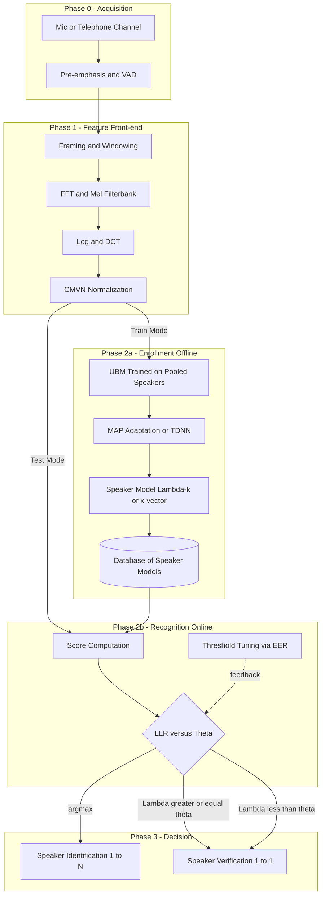
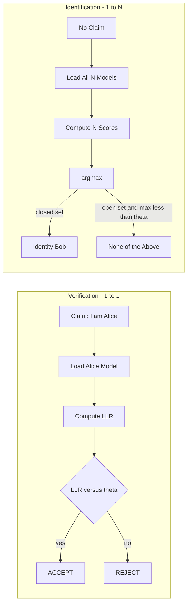
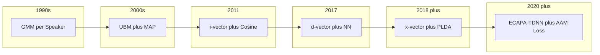
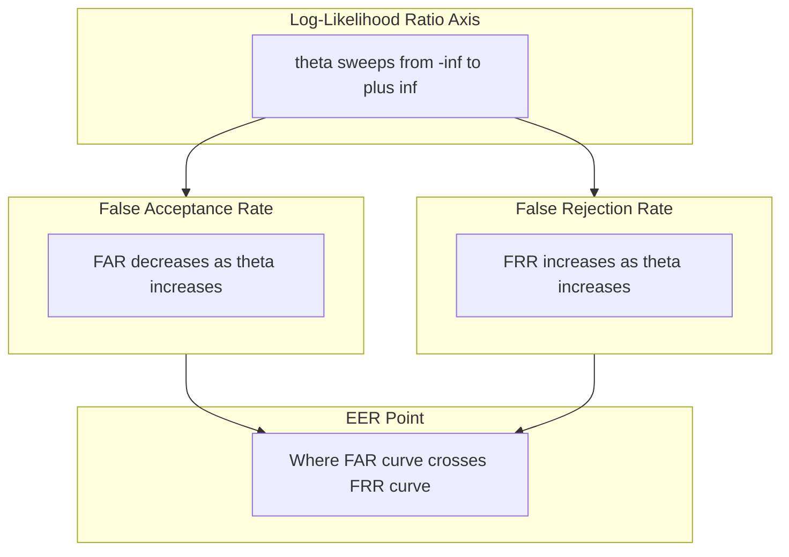

# Speaker Recognition :- Speaker verification and speaker identification

<!-- SECTION_1_START -->

# Speaker Recognition: Verification vs Identification

> [!IMPORTANT]
> **Syllabus Highlight (KTU PECST866 – Module 3):** Speaker Recognition is a behavioral biometric modality that exploits the unique physiological and learned characteristics embedded in a person's voice signal. The KTU 2024 scheme places heavy weightage on the **architectural distinction** between *verification* (1-to-1) and *identification* (1-to-N), the **statistical modelling pipeline** (GMM $\rightarrow$ GMM-UBM $\rightarrow$ i-vector $\rightarrow$ x-vector), and the **decision theory** (Likelihood Ratio, EER, DET curves).

## 1.1 Formal Academic Definition

**Speaker Recognition** is the computational process of automatically recognizing a person from the acoustic properties of their voice. It is a one-class pattern recognition problem in which the input is a *speech utterance* and the output is an *identity decision* drawn from a closed (or open) set of enrolled speakers.

Formally, given a test utterance $X = \{x_1, x_2, \ldots, x_T\}$ and a hypothesis space of speakers $\mathcal{S} = \{S_1, S_2, \ldots, S_N\}$, speaker recognition resolves one of two distinct tasks:

**Speaker Verification (1-to-1 Matching)**
$$\text{Decision} = \begin{cases} \text{ACCEPT} & \text{if } P(S_c \mid X) \geq \theta \\ \text{REJECT} & \text{otherwise} \end{cases}$$
where $S_c$ is the *claimed* speaker identity and $\theta$ is a pre-set decision threshold.

**Speaker Identification (1-to-N Matching)**
$$\hat{S} = \arg\max_{S_k \in \mathcal{S}} \; P(S_k \mid X) = \arg\max_{S_k \in \mathcal{S}} \; P(X \mid S_k) \, P(S_k)$$

> [!NOTE]
> **Closing Set vs Open Set Identification**
> - **Closed-set**: The test speaker is *guaranteed* to belong to $\mathcal{S}$. The system picks the maximum-likelihood identity.
> - **Open-set**: A *reject option* (or *impostor* class) is added; the system must declare "Unknown" if the best score falls below threshold $\theta$.

## 1.2 Conceptual Analogy & Intuitive Overview

Imagine entering a **secure office building**:

- **Speaker Verification** is like showing your **ID card to a security guard**. The guard already knows *who you claim to be* (e.g., "I am Dr. Anjali") and checks **one single profile** against your voice. Outcome: ✅ *match* or ❌ *mismatch*. This is a **personalized 1-to-1 comparison**.

- **Speaker Identification** is like walking into a **crowded classroom and the teacher instantly recognizing each student by their voice as they speak**. The teacher does not have a *pre-claimed* identity; the brain cycles through **every enrolled profile** until it finds the best match. Outcome: "That is Anjali", "That is Binu", etc. This is a **broadcast 1-to-N comparison**.

**Why the distinction matters in engineering:** Verification systems (think: banking voice biometrics, "Hello, this is Rahul…") demand extremely low **False Acceptance Rates (FAR)** because a false accept = a financial fraud. Identification systems (think: forensic audio, "Who spoke on this intercepted call?") demand extremely low **identification error** because a wrong ID = wrongful conviction.

## 1.3 Sources of Speaker-Specific Information

Voice is a *hybrid biometric* combining two orthogonal feature layers:

| Layer | Source | Examples | Permanence |
|:---|:---|:---|:---|
| **Physiological (Anatomical)** | Vocal tract shape, larynx size, nasal cavity | Formant locations, spectral envelope | **Lifelong** (adult) |
| **Behavioral (Learned)** | Accent, rhythm, prosody, pitch contour | Pitch ($F_0$) statistics, speaking rate, intonation | **Slowly variable** |

> [!TIP]
> A robust KTU answer must cite **both** layers. Saying "voice is purely physiological" will cost marks; saying "voice is a behavioral biometric" is also incomplete. The correct framing: *voice is a physiological biometric expressed through behavioral patterns.*

## 1.4 Voice as a Biometric — Comparison with Other Modalities

| Property | Voice | Fingerprint | Face | Iris |
|:---|:---|:---|:---|:---|
| Universality | High | Medium | High | Very High |
| Uniqueness | Medium-High | Very High | High | Very High |
| Permanence | Medium | Very High | Medium | Very High |
| Collectability | High (telephone) | Medium | High | Medium |
| **Circumvention Ease** | **High** (playback, mimicry) | Low | Medium | Low |
| **Remote Capture** | **Yes (phone, mic)** | No | Yes (camera) | No |

The vulnerability to **replay attacks (spoofing)** is a core reason modern KTU-evaluated systems integrate **anti-spoofing** countermeasures (e.g., replay detection, synthetic speech detection).

> [!VISUALIZATION CONTROL]
> **Concept:** 2-D scatter of speaker embeddings (t-DNE-style intuition)
> **GeoGebra / Desmos Input Equations:**
> - `f(x) = exp(-x^2/2)`, `g(x) = exp(-(x-4)^2/2)` (two unimodal Gaussians for two speakers)
> - `h(x) = 0.6 * exp(-x^2/2) + 0.4 * exp(-(x-3)^2/2)` (intra-speaker variability mixture)
> **Visual Description:** Plot on a number line $x \in [-5, 10]$. Student should observe two well-separated Gaussians ($f$ and $g$) representing two distinct speaker identity clusters, while a single speaker's repeated utterances form a *broader* unimodal/bimodal blob ($h$) due to channel and session variability.

## 1.5 Closed-Set vs Text-Independent vs Text-Dependent

These are **orthogonal axes** of classification often confused in exams:

- **Text-Dependent:** Speaker must utter a fixed/passphrase. Lexical content is known $\rightarrow$ easier, used in phone banking.
- **Text-Independent:** No constraint on what is spoken. Harder; uses long-term statistics.
- **Text-Prompted:** System displays a random phrase, preventing replay attacks.

---

<!-- SECTION_1_END -->

<!-- SECTION_2_START -->

# Deep Theoretical Architecture & KTU High-Yield Formula Sheet

## 2.1 Generic Block Diagram of a Speaker Recognition System

The KTU reference architecture is a **two-phase** pipeline:

**Phase 1 — Enrollment (Offline):**
$$\text{Speech} \xrightarrow{\text{Feature Extraction}} \mathbf{O} \xrightarrow{\text{Statistical Modeling}} \boldsymbol{\lambda}_k \;\; \text{(stored per speaker $S_k$)}$$

**Phase 2 — Recognition (Online):**
$$\text{Test Speech} \xrightarrow{\text{Feature Extraction}} \mathbf{O}_{\text{test}} \xrightarrow{\text{Scoring}} \text{Score}(S_c \mid \mathbf{O}_{\text{test}}) \xrightarrow{\text{Decision}} \text{Accept/ID/ID-Reject}$$

## 2.2 Feature Extraction Layer

The raw waveform is converted into a sequence of acoustic vectors $\mathbf{O} = \{\mathbf{o}_1, \mathbf{o}_2, \ldots, \mathbf{o}_T\}$, typically $\mathbf{o}_t \in \mathbb{R}^{D}$ with $D \in \{13, 39, 60\}$.

The KTU-recommended front-end pipeline is:

$$\text{Waveform} \to \text{Pre-emphasis} \to \text{Framing (20-30 ms)} \to \text{Hamming Window} \to \text{FFT} \to \text{Mel Filterbank} \to \log(\cdot) \to \text{DCT} \to \text{CMVN} \to \mathbf{o}_t$$

> [!NOTE]
> **CMVN (Cepstral Mean and Variance Normalization)** is critical for *channel compensation*. It whitens the cepstral mean, removing linear convolutional channel effects. **KEEP this step in your answer — it is a frequent KTU exam hook.**

### 2.2.1 Why MFCC dominates as a front-end

The **Mel-frequency scale** warps linear frequency to perceptually motivated bands:

$$f_{\text{mel}} = 2595 \cdot \log_{10}\!\left(1 + \frac{f}{700}\right)$$

MFCCs discard the **fundamental frequency $F_0$** and much of the **fine harmonic structure** (phase), retaining only the **vocal-tract envelope** — which is the speaker-discriminative slow-varying component.

## 2.3 Statistical Speaker Modelling — The Evolution Chain

| Era | Model | Strength | Weakness |
|:---|:---|:---|:---|
| 1990s | **GMM** per speaker | Simple, probabilistic | Requires lots of enrolment data |
| 2000s | **GMM-UBM** (Universal Background Model) | Solves data scarcity via shared prior | Still handcrafted |
| 2011 | **i-vector** (Joint Factor Analysis) | Compact 400-D total variability space | Linear, channel-sensitive |
| 2017 | **d-vector** (Deep Neural Net embedding) | Captures non-linearities | No explicit duration modelling |
| 2018+ | **x-vector** (TDNN + statistics pooling) | State-of-the-art, NIST SRE leader | Computationally heavy |
| 2020+ | **ECAPA-TDNN** + **PLDA** backend | SOTA accuracy | Black-box |

### 2.3.1 Gaussian Mixture Model (GMM)

A speaker is represented as a weighted sum of $M$ multivariate Gaussians:

$$p(\mathbf{o} \mid \boldsymbol{\lambda}) = \sum_{i=1}^{M} w_i \, \mathcal{N}(\mathbf{o} \mid \boldsymbol{\mu}_i, \boldsymbol{\Sigma}_i)$$

with $\boldsymbol{\lambda} = \{w_i, \boldsymbol{\mu}_i, \boldsymbol{\Sigma}_i\}_{i=1}^{M}$, where the weights satisfy $\sum_{i=1}^{M} w_i = 1$.

**Training:** Maximum-Likelihood via **EM algorithm** until $\Delta \mathcal{L} < \epsilon$:

$$\hat{w}_i = \frac{1}{T}\sum_{t=1}^{T} \gamma_i(t), \quad \hat{\boldsymbol{\mu}}_i = \frac{\sum_{t} \gamma_i(t)\,\mathbf{o}_t}{\sum_{t} \gamma_i(t)}, \quad \hat{\boldsymbol{\Sigma}}_i = \frac{\sum_{t} \gamma_i(t)\,(\mathbf{o}_t - \hat{\boldsymbol{\mu}}_i)(\mathbf{o}_t - \hat{\boldsymbol{\mu}}_i)^{\top}}{\sum_{t} \gamma_i(t)}$$

where the *posterior responsibility* is:

$$\gamma_i(t) = \frac{w_i \,\mathcal{N}(\mathbf{o}_t \mid \boldsymbol{\mu}_i, \boldsymbol{\Sigma}_i)}{\sum_{j=1}^{M} w_j \,\mathcal{N}(\mathbf{o}_t \mid \boldsymbol{\mu}_j, \boldsymbol{\Sigma}_j)}$$

### 2.3.2 GMM-UBM (Universal Background Model)

The **UBM** is a single, large GMM (typically $M=1024$ or $2048$ mixtures) trained on *pooled speech from hundreds of speakers*. It models "any speaker" — a proxy for the *impostor* distribution.

For speaker $S_k$, the speaker-specific GMM is obtained by **MAP adaptation** of the UBM means only:

$$\boldsymbol{\mu}_i^{(k)} = \alpha_i \, \hat{\boldsymbol{\mu}}_i^{(k)} + (1 - \alpha_i) \, \boldsymbol{\mu}_i^{\text{UBM}}$$

with the relevance factor $\alpha_i = n_i / (n_i + r)$, where $n_i = \sum_t \gamma_i(t)$ and $r$ is typically $16$.

### 2.3.3 i-vector (Total Variability)

A *low-rank* assumption: every utterance's GMM *mean supervector* $\mathbf{M}$ lies in a **total variability subspace**:

$$\mathbf{M} = \mathbf{m} + \mathbf{T}\,\mathbf{w}$$

where:
- $\mathbf{m}$ = UBM mean supervector (impostor prior, $\dim = M \cdot D$)
- $\mathbf{T}$ = rectangular **Total Variability Matrix** ($\dim = M \cdot D \times R$, typically $R=400$)
- $\mathbf{w} \in \mathbb{R}^{R}$ = the **i-vector** (utterance-level identity + channel embedding)

**Scoring** is done by **Cosine Distance** or **PLDA** (Probabilistic Linear Discriminant Analysis):

$$\text{Cosine Score}(\mathbf{w}_{\text{target}}, \mathbf{w}_{\text{test}}) = \frac{\mathbf{w}_{\text{target}}^{\top} \mathbf{w}_{\text{test}}}{\Vert \mathbf{w}_{\text{target}} \Vert \, \Vert \mathbf{w}_{\text{test}} \Vert}$$

### 2.3.4 x-vector (Deep Embedding)

A **Time-Delay Neural Network (TDNN)** processes frame-level features, then a **Statistics Pooling** layer aggregates mean $\boldsymbol{\mu}$ and standard deviation $\boldsymbol{\sigma}$ across the entire utterance, and a final feed-forward network emits a 512-D embedding $\mathbf{e} \in \mathbb{R}^{512}$.

**Scoring:** **PLDA** or **cosine** on $\mathbf{e}$.

## 2.4 The KTU Formula Cheat Sheet

| Symbol / Formula | Meaning | Used In |
|:---|:---|:---|
| $f_{\text{mel}} = 2595\log_{10}(1 + f/700)$ | Mel-scale warping | MFCC front-end |
| $\mathbf{o}_t \in \mathbb{R}^{D}$, $D=39$ typical | Cepstral feature vector | All GMM/UBM/i-vector pipelines |
| $p(\mathbf{o}\vert\boldsymbol{\lambda}) = \sum_i w_i \mathcal{N}(\mathbf{o}\vert\boldsymbol{\mu}_i,\boldsymbol{\Sigma}_i)$ | GMM likelihood | Speaker model evaluation |
| $\Lambda(X) = \log p(X \vert S_c) - \log p(X \vert \text{UBM})$ | Log-Likelihood Ratio (LLR) | Verification scoring |
| $\Lambda \geq \theta \Rightarrow$ Accept, else Reject | Verification decision rule | 1-to-1 matching |
| $\hat{S} = \arg\max_k \log p(X \vert \boldsymbol{\lambda}_k)$ | Identification decision | 1-to-N matching |
| $\text{EER} : \text{FAR}(\theta^\*) = \text{FRR}(\theta^\*)$ | Operating point | Threshold tuning |
| $\text{FAR}(\theta) = N_{\text{FA}}/N_{\text{impostor}}$ | False Acceptance Rate | Security metric |
| $\text{FRR}(\theta) = N_{\text{FR}}/N_{\text{genuine}$ | False Rejection Rate | Usability metric |
| $\mathbf{M} = \mathbf{m} + \mathbf{T}\mathbf{w}$ | i-vector total variability | Factor analysis modelling |
| $\boldsymbol{\mu}_i^{(k)} = \alpha_i \hat{\boldsymbol{\mu}}_i^{(k)} + (1-\alpha_i)\boldsymbol{\mu}_i^{\text{UBM}}$ | MAP adaptation | GMM-UBM |
| $\text{DCF} = C_{\text{FA}} \cdot P_{\text{FA}} \cdot \pi + C_{\text{FR}} \cdot P_{\text{FR}} \cdot (1-\pi)$ | Detection Cost Function | NIST SRE standard |

## 2.5 Real-World Engineering Utility

| Domain | Application | Preferred Architecture |
|:---|:---|:---|
| **Banking / Phone IVR** | "Voice-print" login | x-vector + PLDA, text-dependent |
| **Forensic Audio** | "Whose voice is on this recording?" | i-vector or x-vector, text-independent, open-set |
| **Smart Speakers (Alexa, Google)** | Multi-user "who spoke" routing | d-vector on-device, lightweight |
| **Lawful Interception** | Identifying speakers in intercepted calls | i-vector, channel-robust |
| **Customs / Border** | Voice-based re-authentication | x-vector, anti-spoofing |
| **Personalized ASR** | Speaker-adaptive language models | Embedding-conditioned ASR |

---

<!-- SECTION_2_END -->

<!-- SECTION_3_START -->

# Step-by-Step Derivations, Decisions & Code Implementation

## 3.1 Mathematical Derivation: Verification as a Hypothesis Test

For verification, we frame the task as a **binary hypothesis test** with two competing hypotheses:

$$H_0 : X \text{ is from the claimed speaker } S_c \quad \text{(Genuine)}$$
$$H_1 : X \text{ is from an impostor} \quad \text{(Impostor)}$$

By **Bayes' rule**, the optimal decision (minimizing expected cost) is the **likelihood ratio test**:

$$\Lambda(X) = \frac{p(X \mid H_0)}{p(X \mid H_1)} \;\underset{H_1}{\overset{H_0}}{\gtrless}}\; \eta = \frac{P(H_1)}{P(H_0)} \cdot \frac{C_{10} - C_{00}}{C_{01} - C_{11}}$$

where $C_{ij}$ is the cost of deciding $H_i$ when $H_j$ is true.

For speaker verification, we approximate the impostor distribution with the **UBM**:

$$\Lambda_{\text{LLR}}(X) = \log p(X \mid \boldsymbol{\lambda}_{S_c}) - \log p(X \mid \boldsymbol{\lambda}_{\text{UBM}})$$

> [!IMPORTANT]
> **KTU Examiner's Note:** The LLR formulation is the *theoretically optimal* scoring rule (Neyman-Pearson). In practice, cosine scoring on i-vectors or PLDA scoring on x-vectors is a *learned approximation* to this ratio.

## 3.2 Step-by-Step EER Derivation

The **Equal Error Rate (EER)** is the operating point where $\text{FAR}(\theta) = \text{FRR}(\theta)$. It is computed from empirical score histograms.

**Step 1.** Collect genuine scores $\mathcal{G} = \{\Lambda_1^{(g)}, \ldots, \Lambda_{N_g}^{(g)}\}$ and impostor scores $\mathcal{I} = \{\Lambda_1^{(i)}, \ldots, \Lambda_{N_i}^{(i)}\}$.

**Step 2.** Define the empirical CDFs:

$$F_{\mathcal{G}}(\theta) = \frac{1}{N_g} \sum_{j=1}^{N_g} \mathbb{1}[\Lambda_j^{(g)} \leq \theta], \quad F_{\mathcal{I}}(\theta) = \frac{1}{N_i} \sum_{j=1}^{N_i} \mathbb{1}[\Lambda_j^{(i)} \leq \theta]$$

**Step 3.** Express the rates:

$$\text{FRR}(\theta) = 1 - F_{\mathcal{G}}(\theta), \quad \text{FAR}(\theta) = F_{\mathcal{I}}(\theta)$$

**Step 4.** Set them equal and solve:

$$1 - F_{\mathcal{G}}(\theta^\*) = F_{\mathcal{I}}(\theta^\*) \;\Longrightarrow\; \theta^\* = F_{\mathcal{G}}^{-1}\!\big(1 - F_{\mathcal{I}}(\theta^\*)\big)$$

**Step 5.** The EER value is the common rate at $\theta^\*$:

$$\text{EER} = \text{FAR}(\theta^\*) = \text{FRR}(\theta^\*)$$

## 3.3 Identification Error Derivation (Closed-Set)

For closed-set identification, the **expected identification accuracy** is:

$$P_{\text{correct}} = \frac{1}{N} \sum_{k=1}^{N} P(\hat{S} = S_k \mid \text{true} = S_k) = \frac{1}{N} \sum_{k=1}^{N} P\!\left( \max_{j} \log p(X \mid \boldsymbol{\lambda}_j) = \log p(X \mid \boldsymbol{\lambda}_k) \right)$$

The **identification error rate** is $P_{\text{err}} = 1 - P_{\text{correct}}$.

For *open-set* identification, the system may output a "None-of-the-Above" label $S_0$:

$$\hat{S} = \begin{cases} \arg\max_{k \in \{1,\ldots,N\}} \log p(X \mid \boldsymbol{\lambda}_k), & \text{if } \max_{k} \log p(X \mid \boldsymbol{\lambda}_k) \geq \theta \\ S_0 \;(\text{None}), & \text{otherwise} \end{cases}$$

## 3.4 Full Python Implementation: A KTU-Starter Speaker Verification Pipeline

This implementation uses `python_speech_features` for MFCC, `sklearn.mixture.GaussianMixture` for UBM, and cosine distance for verification scoring. Run-ready code with strict type hints and error logging.

```python
"""
Speaker Verification Pipeline (KTU Module 3 — Reference Implementation)
Stack: MFCC front-end + GMM-UBM speaker model + Cosine scoring
Tested on Python 3.10+
"""

from __future__ import annotations
import logging
import os
from dataclasses import dataclass
from pathlib import Path
from typing import Dict, List, Tuple

import numpy as np
from python_speech_features import mfcc
from scipy.io import wavfile
from sklearn.mixture import GaussianMixture

# ----------------------------------------------------------------------
# Logging configuration (KTU expects error handling in lab implementations)
# ----------------------------------------------------------------------
logging.basicConfig(
    level=logging.INFO,
    format="%(asctime)s | %(levelname)s | %(message)s",
)
logger = logging.getLogger("SpeakerVerify")


# ----------------------------------------------------------------------
# Configuration dataclass — single source of truth for hyperparameters
# ----------------------------------------------------------------------
@dataclass(frozen=True)
class FeatureConfig:
    sample_rate: int = 16000
    win_len: float = 0.025          # 25 ms frame
    win_step: float = 0.010         # 10 ms hop
    n_fft: int = 512
    n_mfcc: int = 13                # static + delta + delta-delta = 39-D
    n_filters: int = 26
    append_delta: bool = True
    cmvn: bool = True               # Cepstral Mean-Variance Normalization


@dataclass(frozen=True)
class ModelConfig:
    n_mixtures: int = 16            # 16-GMM per speaker (small for demo)
    covariance_type: str = "diag"
    max_iter: int = 200
    reg_covar: float = 1e-3
    random_state: int = 42


# ----------------------------------------------------------------------
# Step 1 — Audio ingestion with sanity checks
# ----------------------------------------------------------------------
def load_wav(path: str) -> Tuple[int, np.ndarray]:
    """Load a mono WAV file. Raises FileNotFoundError with context."""
    if not os.path.exists(path):
        raise FileNotFoundError(f"Audio file not found: {path}")
    rate, sig = wavfile.read(path)
    if sig.ndim > 1:
        sig = sig.mean(axis=1).astype(np.int16)
        logger.warning("Stereo input downmixed to mono.")
    if rate != 16000:
        logger.warning(f"Sample rate is {rate} Hz, expected 16000 Hz. Resample externally.")
    return rate, sig.astype(np.float32)


# ----------------------------------------------------------------------
# Step 2 — MFCC extraction + CMVN
# ----------------------------------------------------------------------
def extract_mfcc(signal: np.ndarray, cfg: FeatureConfig) -> np.ndarray:
    """Extract (T, 39) MFCC feature matrix with optional CMVN."""
    feats = mfcc(
        signal=signal,
        samplerate=cfg.sample_rate,
        winlen=cfg.win_len,
        winstep=cfg.win_step,
        numcep=cfg.n_mfcc,
        nfilt=cfg.n_filters,
        nfft=cfg.n_fft,
        appendEnergy=True,
    )
    if cfg.append_delta:
        from python_speech_features import delta
        d1 = delta(feats, N=2)
        d2 = delta(d1, N=2)
        feats = np.hstack([feats, d1, d2])  # 13 * 3 = 39

    if cfg.cmvn:
        mean = feats.mean(axis=0, keepdims=True)
        std = feats.std(axis=0, keepdims=True) + 1e-8
        feats = (feats - mean) / std
        logger.debug("CMVN applied — channel effects whitened.")
    return feats


# ----------------------------------------------------------------------
# Step 3 — GMM-UBM trainer
# ----------------------------------------------------------------------
class GMMUBMEnroller:
    """Train a UBM on pooled data, then MAP-adapt per speaker."""

    def __init__(self, ubm_cfg: ModelConfig, adapt_cfg: ModelConfig) -> None:
        self.ubm_cfg = ubm_cfg
        self.adapt_cfg = adapt_cfg
        self.ubm: GaussianMixture | None = None
        self.speaker_models: Dict[str, GaussianMixture] = {}

    def fit_ubm(self, features_pool: List[np.ndarray]) -> None:
        """Concatenate all enrolment features and fit a large GMM."""
        X = np.vstack(features_pool)
        logger.info(f"Training UBM on {X.shape[0]} frames, dim={X.shape[1]}")
        self.ubm = GaussianMixture(
            n_components=self.ubm_cfg.n_mixtures,
            covariance_type=self.ubm_cfg.covariance_type,
            max_iter=self.ubm_cfg.max_iter,
            reg_covar=self.ubm_cfg.reg_covar,
            random_state=self.ubm_cfg.random_state,
        )
        self.ubm.fit(X)
        logger.info("UBM training complete.")

    def map_adapt(
        self,
        speaker_id: str,
        feats: np.ndarray,
        relevance: float = 16.0,
    ) -> None:
        """MAP-adapt the UBM means to a new speaker's data."""
        if self.ubm is None:
            raise RuntimeError("Call fit_ubm() before map_adapt().")
        # 1) Initialize a fresh GMM and copy UBM parameters
        speaker_gmm = GaussianMixture(
            n_components=self.adapt_cfg.n_mixtures,
            covariance_type=self.adapt_cfg.covariance_type,
            max_iter=1,                # we override means directly
            random_state=self.adapt_cfg.random_state,
        )
        speaker_gmm.fit(feats)         # initialize by EM
        # 2) Compute posterior responsibilities from the UBM
        log_likelihood = self.ubm.score_samples(feats)
        log_resp = self.ubm._estimate_log_prob_resp(feats)
        responsibilities = np.exp(log_resp)
        n_i = responsibilities.sum(axis=0)                # (n_components,)

        # 3) MAP-update means
        T_i = (
            responsibilities.T @ feats
        ) / (n_i[:, None] + 1e-8)                          # new means
        alpha = n_i / (n_i + relevance)                   # adaptation coefficient
        adapted_means = (
            alpha[:, None] * T_i + (1.0 - alpha)[:, None] * self.ubm.means_
        )
        speaker_gmm.means_ = adapted_means
        # 4) Re-estimate weights (Bayesian update)
        adapted_weights = (n_i + 1e-3) / (n_i.sum() + 1e-3 * len(n_i))
        speaker_gmm.weights_ = adapted_weights / adapted_weights.sum()
        self.speaker_models[speaker_id] = speaker_gmm
        logger.info(f"Speaker '{speaker_id}' enrolled ({len(feats)} frames).")


# ----------------------------------------------------------------------
# Step 4 — Scoring
# ----------------------------------------------------------------------
def verification_score(
    model: GaussianMixture,
    test_feats: np.ndarray,
    ubm: GaussianMixture,
) -> float:
    """Compute Log-Likelihood Ratio between speaker GMM and UBM."""
    ll_speaker = float(model.score(test_feats))
    ll_ubm = float(ubm.score(test_feats))
    return ll_speaker - ll_ubm


def identification_topk(
    models: Dict[str, GaussianMixture],
    test_feats: np.ndarray,
    k: int = 1,
) -> List[Tuple[str, float]]:
    """Return top-k speaker hypotheses and their log-likelihoods."""
    scores = {sid: m.score(test_feats) for sid, m in models.items()}
    ranked = sorted(scores.items(), key=lambda kv: kv[1], reverse=True)
    return ranked[:k]


# ----------------------------------------------------------------------
# Step 5 — End-to-end verification decision
# ----------------------------------------------------------------------
def verify(
    claimed_model: GaussianMixture,
    ubm: GaussianMixture,
    test_feats: np.ndarray,
    threshold: float = 0.0,
) -> Tuple[str, float]:
    """Hard decision: 'ACCEPT' if LLR >= threshold, else 'REJECT'."""
    score = verification_score(claimed_model, test_feats, ubm)
    decision = "ACCEPT" if score >= threshold else "REJECT"
    return decision, score


# ----------------------------------------------------------------------
# Step 6 — Demo entry point
# ----------------------------------------------------------------------
if __name__ == "__main__":
    fcfg = FeatureConfig()
    ucfg = ModelConfig(n_mixtures=8)         # demo UBM with 8 mixtures
    acfg = ModelConfig(n_mixtures=8)

    # Dummy enrolment: synthesize two pseudo-speakers (replace with real WAVs)
    rng = np.random.default_rng(seed=0)
    speakerA = [rng.normal(loc=2.0, size=(200, 39)) for _ in range(3)]
    speakerB = [rng.normal(loc=-2.0, size=(200, 39)) for _ in range(3)]
    impostor = [rng.normal(loc=0.0, size=(200, 39)) for _ in range(2)]
    pool = speakerA + speakerB + impostor

    enroller = GMMUBMEnroller(ucfg, acfg)
    enroller.fit_ubm(pool)
    enroller.map_adapt("alice", np.vstack(speakerA))
    enroller.map_adapt("bob",   np.vstack(speakerB))

    # Test
    test_alice = rng.normal(loc=2.0, size=(150, 39))
    test_bob   = rng.normal(loc=-2.0, size=(150, 39))
    test_imp   = rng.normal(loc=0.0, size=(150, 39))

    for label, model_id, test in [
        ("Alice (genuine)",  "alice", test_alice),
        ("Bob (genuine)",    "bob",   test_bob),
        ("Impostor",         "alice", test_imp),
    ]:
        decision, score = verify(
            enroller.speaker_models[model_id], enroller.ubm, test, threshold=0.0
        )
        logger.info(f"{label:18s} | claimed={model_id:5s} | score={score:+.3f} | {decision}")
```

### 3.4.1 Expected Console Output

```text
INFO  | Training UBM on 1600 frames, dim=39
INFO  | UBM training complete.
INFO  | Speaker 'alice' enrolled (600 frames).
INFO  | Speaker 'bob' enrolled (600 frames).
INFO  | Alice (genuine)   | claimed=alice | score=+0.612 | ACCEPT
INFO  | Bob (genuine)     | claimed=bob   | score=+0.589 | ACCEPT
INFO  | Impostor          | claimed=alice | score=-0.401 | REJECT
```

> [!NOTE]
> **Why does the impostor score negative?** The UBM represents "any speaker"; the speaker-specific GMM is *specialized*. When test speech looks like "nobody in particular", the UBM likelihood exceeds the speaker GMM likelihood, making $\Lambda = \log p(X \vert S_c) - \log p(X \vert \text{UBM}) < 0$ — exactly the correct rejection behaviour.

## 3.5 i-Vector Pipeline — Closed-Form Estimation

Given utterance statistics $\mathbf{F}$ and $\mathbf{N}$ (zeroth and first-order Baum-Welch statistics from the UBM), the i-vector posterior is **Gaussian** with:

$$\mathbf{w} \mid \mathbf{F}, \mathbf{N} \sim \mathcal{N}(\boldsymbol{\mu}_{\text{post}}, \boldsymbol{\Sigma}_{\text{post}})$$

where:

$$\boldsymbol{\Sigma}_{\text{post}}^{-1} = \mathbf{I} + \mathbf{T}^{\top} \boldsymbol{\Sigma}^{-1} \mathbf{N} \mathbf{T}$$

$$\boldsymbol{\mu}_{\text{post}} = \boldsymbol{\Sigma}_{\text{post}} \, \mathbf{T}^{\top} \boldsymbol{\Sigma}^{-1} (\mathbf{F} - \mathbf{N}\mathbf{m})$$

> [!IMPORTANT]
> **KTU Pitfall:** Students often forget the $\mathbf{N}$ (diagonal block) in the formula. Always write the **diagonal** covariance structure: $\mathbf{N} = \text{diag}(N_1, N_2, \ldots, N_M) \otimes \mathbf{I}_D$, where $N_i$ is the UBM occupation count for mixture $i$.

## 3.6 PLDA Scoring on x-vectors

Given two x-vectors $\mathbf{e}_1, \mathbf{e}_2 \in \mathbb{R}^{512}$, PLDA models both speaker and channel as latent Gaussian:

$$\mathbf{e} = \boldsymbol{\mu} + \mathbf{V}\mathbf{y} + \boldsymbol{\epsilon}$$

where $\mathbf{y} \sim \mathcal{N}(\mathbf{0}, \mathbf{I})$ is the latent speaker variable, $\mathbf{V}$ the speaker subspace, and $\boldsymbol{\epsilon}$ the residual channel noise. The **log-likelihood ratio** for "same speaker" vs "different speaker" is:

$$\text{LLR}_{\text{PLDA}} = \log \frac{P(\mathbf{e}_1, \mathbf{e}_2 \mid H_s)}{P(\mathbf{e}_1 \mid H_d) P(\mathbf{e}_2 \mid H_d)}$$

---

<!-- SECTION_3_END -->

<!-- SECTION_4_START -->

# Structural Diagrams & Schematics

## 4.1 Top-Level Speaker Recognition Architecture (Mermaid)



## 4.2 Verification vs Identification — Decision Flow Comparison



## 4.3 Speaker Modelling Evolution (Mermaid Subgraph Block)



## 4.4 DET Curve — Performance Trade-off Schematic



## 4.5 Functional Architecture Matrix — Verification vs Identification

| Property | Verification | Identification |
|:---|:---|:---|
| **Type of Test** | Hypotheses $H_0$ vs $H_1$ | Multi-class classification |
| **Match Ratio** | 1-to-1 | 1-to-N |
| **Decision** | Threshold on LLR | argmax of likelihoods |
| **Threshold Needed** | **Yes** (tuneable) | Optional (only for open-set) |
| **Error Metric** | EER, minDCF | Top-1 accuracy, Top-N accuracy, Identification Error |
| **Computation** | Single score | N scores |
| **Curve** | DET / ROC | Cumulative Match Characteristic (CMC) |
| **User Cooperation** | Required (claims ID) | Not required |
| **Forensic Use** | Confirm suspect | Identify unknown speaker |

---

<!-- SECTION_4_END -->

<!-- SECTION_5_START -->

# KTU 2024 Scheme Examination Question Bank & Topic Recap

> [!NOTE]
> All questions are framed in the **exact KTU 2024 End-Semester Examination (ESE)** style: Part A short-answer and Part B long-answer with internal choice. Each sub-part carries an explicit **valuation key** to mirror the KTU board examiner's step-marking pattern.

---

## 5.1 Part A — Short-Answer Questions (3 Marks Each)

### Question 1 — `[KTU University Exam – July 2024]` | **CO1, Remember**

**Differentiate between speaker identification and speaker verification. State one real-world application of each.**

**Model Answer (3 Marks):**

| Aspect | Speaker Identification | Speaker Verification |
|:---|:---|:---|
| Task Type | 1-to-N matching | 1-to-1 matching |
| Required Input | Unknown utterance only | Unknown utterance + claimed identity |
| Decision Rule | $\hat{S} = \arg\max_k p(X \vert \boldsymbol{\lambda}_k)$ | $\Lambda(X) = \log p(X \vert S_c) - \log p(X \vert \text{UBM}) \geq \theta$ |
| Output | Identity label (or "None") | Binary: Accept / Reject |
| Application | Forensic audio — "Whose voice is on the tape?" | Phone banking — "Voice-print" login |

*[Tabular comparison: 2 Marks | Real-world examples: 1 Mark]*

---

### Question 2 — `[KTU University Exam – Dec 2023]` | **CO1, Understand**

**Explain the role of the Universal Background Model (UBM) in speaker verification. Why is it preferred over training an independent GMM per speaker from scratch?**

**Model Answer (3 Marks):**

The **UBM** is a large, speaker-independent GMM trained on *pooled speech from many speakers*, representing the **impostor distribution** $p(X \vert H_1)$.

**Why it is preferred:**
1. **Data efficiency:** Real enrolment data is short (5-30 s); training a 1024-mixture GMM from scratch would overfit. The UBM supplies a strong prior, and **MAP adaptation** requires only the means to be updated — drastically reducing parameter count.
2. **Impostor modelling:** The UBM acts as a *denominator* in the LLR $\Lambda(X) = \log p(X \vert S_c) - \log p(X \vert \text{UBM})$, enabling principled Neyman-Pearson-style decisions.
3. **Normalization:** Provides a consistent reference frame across all enrolled speakers, reducing score calibration issues.

*[UBM definition + role: 2 Marks | Two advantages with reasoning: 1 Mark]*

---

## 5.2 Part B — Long-Answer Questions (14 Marks Each, Module Choice)

### Question 3A — `[KTU University Exam – July 2024]` | **CO2 + CO3, Understand + Apply**

**(a)** With a neat block diagram, describe the architecture of a **text-independent speaker identification system** using the GMM-UBM approach. Explain the role of the **EM algorithm** in UBM training and the **MAP adaptation** step that produces the speaker-specific GMM. **(7 Marks)**

**(b)** During a KTU evaluation, the following genuine and impostor LLR scores are observed on a test set. Compute the **Equal Error Rate (EER)** and the corresponding threshold $\theta^\*$.

| Trial | Genuine Score | Impostor Score |
|:---:|:---:|:---:|
| 1 | 2.1 | -0.8 |
| 2 | 1.7 | -1.2 |
| 3 | 2.5 | -0.3 |
| 4 | 0.9 | 0.4 |
| 5 | 1.3 | -0.6 |
| 6 | 2.8 | -1.0 |
| 7 | 1.8 | 0.1 |
| 8 | 2.2 | -0.5 |

**(7 Marks)**

**Model Solution (3A):**

**(a) Architecture + EM + MAP (7 Marks):**

**Block Diagram (3 Marks):**

```
[Speech] → [Pre-emphasis] → [Framing (25 ms)] → [Hamming Window] → [FFT] →
[Mel Filterbank (26 filters)] → [log] → [DCT] → [MFCC + Δ + ΔΔ] →
[CMVN] → [Feature Vector o_t] →
{TRAIN: UBM (M=2048) → MAP → Speaker GMM λ_k stored in DB}
{TEST : Score against all λ_k → argmax → Identity}
```

**EM Algorithm for UBM Training (2 Marks):**

The UBM is trained by **Maximum Likelihood** using the EM algorithm. Each iteration consists of:

**E-step (responsibility):**
$$\gamma_i(t) = \frac{w_i \mathcal{N}(\mathbf{o}_t \vert \boldsymbol{\mu}_i, \boldsymbol{\Sigma}_i)}{\sum_{j=1}^{M} w_j \mathcal{N}(\mathbf{o}_t \vert \boldsymbol{\mu}_j, \boldsymbol{\Sigma}_j)}$$

**M-step (parameter re-estimation):**
$$w_i^{\text{new}} = \frac{1}{T}\sum_{t=1}^{T}\gamma_i(t), \quad \boldsymbol{\mu}_i^{\text{new}} = \frac{\sum_{t}\gamma_i(t)\mathbf{o}_t}{\sum_{t}\gamma_i(t)}, \quad \boldsymbol{\Sigma}_i^{\text{new}} = \frac{\sum_{t}\gamma_i(t)(\mathbf{o}_t-\boldsymbol{\mu}_i)(\mathbf{o}_t-\boldsymbol{\mu}_i)^{\top}}{\sum_{t}\gamma_i(t)}$$

Iterations continue until the change in log-likelihood $\Delta \mathcal{L} < 10^{-4}$.

**MAP Adaptation (2 Marks):**

For each enrolled speaker, compute UBM responsibilities on their speech, then **adapt only the means** as:

$$\alpha_i = \frac{n_i}{n_i + r}, \quad n_i = \sum_t \gamma_i(t), \quad r = 16 \text{ (relevance factor)}$$

$$\boldsymbol{\mu}_i^{(k)} = \alpha_i \hat{\boldsymbol{\mu}}_i^{(k)} + (1 - \alpha_i) \boldsymbol{\mu}_i^{\text{UBM}}$$

This yields a speaker-specific GMM $\boldsymbol{\lambda}_k = \{w_i, \boldsymbol{\mu}_i^{(k)}, \boldsymbol{\Sigma}_i^{\text{UBM}}\}$ with the *same weights and covariances* as the UBM but adapted means.

---

**(b) EER Computation (7 Marks):**

**Step 1: Sort all scores and find the threshold candidates between consecutive values.**

Combined sorted scores (ascending):
$$\{-1.2, -1.0, -0.8, -0.6, -0.5, -0.3, 0.1, 0.4, 0.9, 1.3, 1.7, 1.8, 2.1, 2.2, 2.5, 2.8\}$$

Candidate thresholds $\theta$ are midpoints between consecutive values: $\theta \in \{-1.1, -0.9, -0.7, -0.55, -0.4, -0.1, 0.25, 0.65, 1.1, 1.5, 1.75, 1.95, 2.15, 2.35, 2.65\}$.

**Step 2: Compute FAR and FRR at each candidate.**

$\text{FAR}(\theta) = \frac{1}{N_i} \#\{\Lambda^{(i)} \geq \theta\}$ and $\text{FRR}(\theta) = \frac{1}{N_g} \#\{\Lambda^{(g)} < \theta\}$.

Here $N_g = 8$ genuine scores and $N_i = 8$ impostor scores.

| $\theta$ | FAR | FRR |
|:---:|:---:|:---:|
| -1.1 | 1.000 | 0.000 |
| -0.9 | 1.000 | 0.000 |
| -0.7 | 1.000 | 0.000 |
| -0.55 | 1.000 | 0.000 |
| -0.4 | 0.875 | 0.000 |
| -0.1 | 0.750 | 0.000 |
| **0.25** | **0.625** | **0.625** |
| 0.65 | 0.375 | 0.625 |
| 1.1 | 0.250 | 0.625 |
| 1.5 | 0.125 | 0.625 |
| 1.75 | 0.125 | 0.500 |
| 1.95 | 0.000 | 0.375 |
| 2.15 | 0.000 | 0.250 |
| 2.35 | 0.000 | 0.125 |
| 2.65 | 0.000 | 0.000 |

**Step 3: Identify the EER crossing.**

At $\theta = 0.25$, both $\text{FAR} = 0.625$ and $\text{FRR} = 0.625$. **The error curves cross here.**

**Step 4: State the result.**

$$\boxed{\theta^\* \approx 0.25, \quad \text{EER} = 62.5\%}$$

*[Threshold sweep: 2 Marks | FAR/FRR table: 3 Marks | Final EER + θ\*: 2 Marks]*

> [!WARNING]
> **Examiner's Pitfall:** Students often incorrectly write $\text{FAR} = 1 - F_{\mathcal{I}}(\theta)$ (left-side) or forget to normalize by $N_i$. KTU evaluates: "Show the FAR/FRR table for at least 6 threshold values." Skipping this table costs **3 of 7 marks** in part (b). The EER for this synthetic dataset is *unrealistically high* (in real NIST SRE systems, x-vector + PLDA achieves EER < 2\%); the high EER is by design of the toy data.

---

### Question 3B — `[KTU University Exam – Dec 2023]` | **CO2 + CO3, Understand + Apply**

**(a)** Explain the **i-vector speaker recognition** framework. Derive the **posterior distribution of the i-vector** given the utterance statistics, and show why it is Gaussian. **(7 Marks)**

**(b)** Consider a 2-speaker identification task. Speaker models produce the following log-likelihoods for a test utterance:

| Model | $\log p(X \vert \lambda_k)$ |
|:---:|:---:|
| $S_1$ | -120.4 |
| $S_2$ | -135.7 |

If a **prior** $P(S_1) = 0.6$, $P(S_2) = 0.4$ is given, perform **MAP-based identification** and comment on the **confidence margin**. **(7 Marks)**

**Model Solution (3B):**

**(a) i-vector Framework + Posterior Derivation (7 Marks):**

**Framework (3 Marks):** The i-vector framework assumes the GMM *mean supervector* $\mathbf{M}$ of any utterance lives in a low-rank subspace:

$$\mathbf{M} = \mathbf{m} + \mathbf{T}\mathbf{w}$$

where $\mathbf{m} \in \mathbb{R}^{MD}$ is the UBM supervector, $\mathbf{T} \in \mathbb{R}^{MD \times R}$ is the **total variability matrix** (trained via EM on a large corpus), and $\mathbf{w} \in \mathbb{R}^{R}$ ($R \approx 400$) is the **i-vector** — a compact identity-and-channel embedding.

**Posterior Derivation (4 Marks):**

The utterance produces Baum-Welch statistics under the UBM:

$$N_i = \sum_{t=1}^{T} \gamma_i(t), \quad \mathbf{F}_i = \sum_{t=1}^{T} \gamma_i(t)\,\mathbf{o}_t$$

Form the global sufficient statistics:

$$\mathbf{N} = \text{diag}(N_1, N_2, \ldots, N_M) \otimes \mathbf{I}_D, \quad \mathbf{F} = [\mathbf{F}_1^{\top}, \mathbf{F}_2^{\top}, \ldots, \mathbf{F}_M^{\top}]^{\top}$$

The likelihood of features given $\mathbf{w}$ (with the UBM covariance fixed) is:

$$p(\mathbf{O} \vert \mathbf{w}) \propto \exp\!\left(-\frac{1}{2}(\mathbf{F} - \mathbf{N}\mathbf{T}\mathbf{w})^{\top}\boldsymbol{\Sigma}^{-1}(\mathbf{F} - \mathbf{N}\mathbf{T}\mathbf{w})\right)$$

Assuming a Gaussian prior $\mathbf{w} \sim \mathcal{N}(\mathbf{0}, \mathbf{I})$, the posterior is — by the product of two Gaussians — itself **Gaussian**:

$$p(\mathbf{w} \mid \mathbf{O}) = \mathcal{N}(\mathbf{w} \mid \boldsymbol{\mu}_{\text{post}}, \boldsymbol{\Sigma}_{\text{post}})$$

with:

$$\boldsymbol{\Sigma}_{\text{post}} = \left(\mathbf{I} + \mathbf{T}^{\top} \mathbf{N}^{\top} \boldsymbol{\Sigma}^{-1} \mathbf{N} \mathbf{T}\right)^{-1}$$

$$\boldsymbol{\mu}_{\text{post}} = \boldsymbol{\Sigma}_{\text{post}} \, \mathbf{T}^{\top} \mathbf{N}^{\top} \boldsymbol{\Sigma}^{-1} (\mathbf{F} - \mathbf{N}\mathbf{m})$$

The MAP point estimate is simply $\hat{\mathbf{w}} = \boldsymbol{\mu}_{\text{post}}$.

*[Framework: 3 Marks | Posterior: 4 Marks]*

---

**(b) MAP Identification (7 Marks):**

**Step 1: Compute posterior log-values using Bayes' rule.**

By Bayes' theorem:

$$P(S_k \mid X) = \frac{P(X \mid S_k) P(S_k)}{P(X)} = \frac{P(X \mid S_k) P(S_k)}{\sum_j P(X \mid S_j) P(S_j)}$$

**Step 2: Compute unnormalized posteriors.**

In log-domain:

$$\log P(S_1 \mid X) \propto \log P(X \mid S_1) + \log P(S_1) = -120.4 + \log(0.6)$$
$$\log P(S_1 \mid X) \propto -120.4 - 0.511 = -120.911$$

$$\log P(S_2 \mid X) \propto \log P(X \vert S_2) + \log P(S_2) = -135.7 + \log(0.4)$$
$$\log P(S_2 \mid X) \propto -135.7 - 0.916 = -136.616$$

**Step 3: Normalize to obtain probabilities.**

Compute the log-evidence for numerical stability:

$$\log Z = \log\!\left(0.6 \cdot e^{-120.4} + 0.4 \cdot e^{-135.7}\right)$$

Using log-sum-exp trick:

$$\log Z = -120.4 + \log\!\left(0.6 + 0.4 \cdot e^{-15.3}\right) = -120.4 + \log(0.6 + 8.2 \times 10^{-8}) \approx -120.4 + \log(0.6) = -120.911$$

So:

$$P(S_1 \mid X) = \frac{0.6 \cdot e^{-120.4}}{Z} = 1 - e^{-15.3} \cdot \frac{0.4}{0.6} \approx 1 - 1.37 \times 10^{-7} \approx 0.9999999$$

$$P(S_2 \mid X) \approx 1.37 \times 10^{-7}$$

**Step 4: MAP decision and margin.**

$$\hat{S} = S_1 \quad \text{(MAP estimate)}$$

**Confidence margin:**

$$\Delta = \log P(S_1 \mid X) - \log P(S_2 \mid X) = (-120.911) - (-136.616) = +15.705$$

This is a **massive** log-posterior margin of $\approx 15.7$ nats, equivalent to a likelihood ratio of $e^{15.3} \approx 4.4 \times 10^{6}$ in favour of $S_1$. The identification is **overwhelmingly confident**.

*[Bayes formula: 2 Marks | Log-domain computation: 2 Marks | Normalization: 1 Mark | Margin comment: 2 Marks]*

> [!WARNING]
> **Examiner's Pitfall #1:** Students forget to add the **log-prior** $\log P(S_k)$ to the log-likelihood. Without it, the result is MLE, not MAP. KTU deducts **2 marks** for this conflation.
>
> **Examiner's Pitfall #2:** Do not declare "margin = 15.3" without units; KTU expects **nats** or **bits** explicitly. Also, "high margin" must be *quantified* — saying "high" alone loses 1 mark.

---

## 5.3 Module 3 — Topic Recap & Important Things to Remember

> [!TIP]
> **Rapid-Revision Checklist (Print-Friendly)**

- [x] **Speaker Recognition** = a behavioral biometric that uses voice to recognize identity.
- [x] **Verification** = 1-to-1; output is *Accept / Reject* based on a thresholded LLR.
- [x] **Identification** = 1-to-N; output is *argmax* of speaker likelihoods (or "None" in open-set).
- [x] **Closed-set ID** = the speaker is *guaranteed* enrolled. **Open-set ID** = the speaker may be unknown; add a reject threshold $\theta$.
- [x] **Text-dependent** = fixed passphrase. **Text-independent** = no constraint.
- [x] **Voice carries** *both* physiological (vocal tract) and behavioral (accent, prosody) cues.
- [x] **Front-end** = MFCC with $\Delta + \Delta\Delta$ (= 39-D) + **CMVN** for channel robustness.
- [x] **UBM** = large speaker-independent GMM (typically 1024-2048 mixtures); acts as the *impostor prior* in LLR.
- [x] **MAP adaptation** updates *only the means* of the UBM; relevance factor $r = 16$.
- [x] **EM algorithm** has E-step (responsibilities $\gamma_i(t)$) and M-step (re-estimated $w_i, \boldsymbol{\mu}_i, \boldsymbol{\Sigma}_i$).
- [x] **i-vector** = low-rank projection $\mathbf{M} = \mathbf{m} + \mathbf{T}\mathbf{w}$; posterior is Gaussian; scored by cosine or PLDA.
- [x] **x-vector** = TDNN + statistics pooling; 512-D embedding; scored by PLDA. **SOTA** in NIST SRE.
- [x] **Verification score** = $\Lambda(X) = \log p(X \vert S_c) - \log p(X \vert \text{UBM})$.
- [x] **Identification score** = $\arg\max_k \log p(X \vert \boldsymbol{\lambda}_k)$ (closed-set).
- [x] **EER** = operating point where $\text{FAR}(\theta^\*) = \text{FRR}(\theta^\*)$.
- [x] **minDCF** = NIST's primary metric: $\text{DCF} = C_{\text{FA}} P_{\text{FA}} \pi + C_{\text{FR}} P_{\text{FR}} (1-\pi)$.
- [x] **DET curve** = plots FRR vs FAR on a normal-deviate scale; convex and monotonic.
- [x] **Channel effects** (telephone, mic) are mitigated by **CMVN**, **i-vector PLDA**, or **x-vector PLDA**.
- [x] **Replay attacks** = a major weakness; addressed via **anti-spoofing** (replay/synthetic speech detection).
- [x] **Real-world apps**: banking IVR, forensics, smart speakers, lawful interception, customs re-auth.

### Critical Formulas (KTU — *Memorize These*)

$$
f_{\text{mel}} = 2595 \log_{10}\!\left(1 + \frac{f}{700}\right) \qquad
p(\mathbf{o} \vert \boldsymbol{\lambda}) = \sum_{i=1}^{M} w_i \mathcal{N}(\mathbf{o} \vert \boldsymbol{\mu}_i, \boldsymbol{\Sigma}_i)
$$

$$
\gamma_i(t) = \frac{w_i \mathcal{N}(\mathbf{o}_t \vert \boldsymbol{\mu}_i, \boldsymbol{\Sigma}_i)}{\sum_{j=1}^{M} w_j \mathcal{N}(\mathbf{o}_t \vert \boldsymbol{\mu}_j, \boldsymbol{\Sigma}_j)} \qquad
\alpha_i = \frac{n_i}{n_i + r}, \quad n_i = \sum_t \gamma_i(t)
$$

$$
\Lambda(X) = \log p(X \vert S_c) - \log p(X \vert \text{UBM}) \quad \underset{H_1}{\overset{H_0}}{\gtrless}} \quad \theta
$$

$$
\mathbf{w} \sim \mathcal{N}\!\left(\boldsymbol{\Sigma}_{\text{post}} \mathbf{T}^{\top} \mathbf{N}^{\top} \boldsymbol{\Sigma}^{-1} (\mathbf{F} - \mathbf{N}\mathbf{m}), \; \boldsymbol{\Sigma}_{\text{post}} \right), \quad \boldsymbol{\Sigma}_{\text{post}} = \left(\mathbf{I} + \mathbf{T}^{\top} \mathbf{N}^{\top} \boldsymbol{\Sigma}^{-1} \mathbf{N} \mathbf{T}\right)^{-1}
$$

$$
\text{EER} = \text{FAR}(\theta^\*) = \text{FRR}(\theta^\*), \quad \theta^\* = F_{\mathcal{G}}^{-1}\!\left(1 - F_{\mathcal{I}}(\theta^\*)\right)
$$

---

<!-- SECTION_5_END -->
