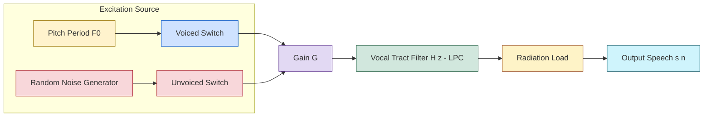
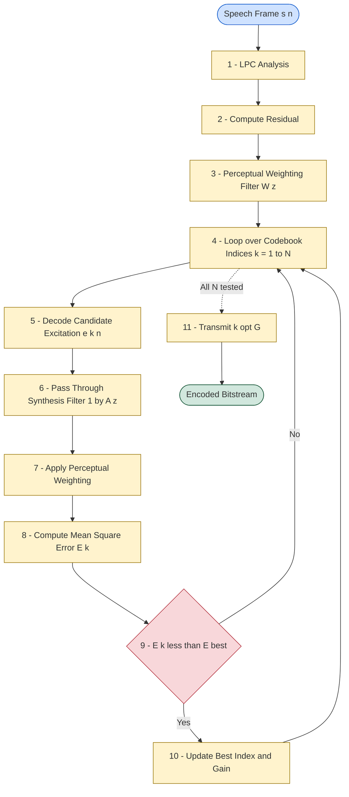

# Speech coding - fundamentals

<!-- SECTION_1_START -->
# Speech Coding - Fundamentals

## 1. Core Technical Definition

> [!IMPORTANT]
> **Speech Coding** is the process of efficiently compressing and representing digital speech signals using minimal number of bits while maintaining acceptable perceptual quality, by exploiting the inherent **redundancy** and **irrelevancy** present in the speech signal.

In the context of the KTU 2024 Scheme (PECST866 - Speech and Audio Processing), speech coding is a fundamental sub-area of **Speech Enhancement** that addresses the problem of representing speech signals in a compact digital form suitable for **transmission** (e.g., mobile networks, VoIP) and **storage** (e.g., voice mailboxes, audio databases).

**Formal Definition (KTU 2024 Terminology):**
A *speech coder* (often abbreviated as a *codec* — **Co**der/**Dec**oder) is a device or algorithm that converts an analog or PCM speech signal into a compressed digital bitstream at the transmitter, and reconstructs an approximation of the original speech at the receiver.

> [!NOTE]
> **Key Distinction from General Audio Coding**
> Speech coders exploit the **speech production model** (source-filter model) and properties of the human vocal tract. In contrast, **audio coders** (like MP3, AAC) are designed for general music/sound and rely on psychoacoustic models of human hearing. Speech coders are far more efficient at low bit rates.

---

## 2. Conceptual Analogy / Intuition

Imagine you want to send a long, detailed letter to a friend, but the post office charges you **per word**. What would you do?

1. You would **remove unnecessary adjectives** (e.g., "very, very, very tall" → "tall").
2. You would **replace long phrases with short codes** you both agreed on (e.g., "BRB" for "be right back").
3. You would keep **only the essential information** that conveys the meaning.

A **speech coder** does exactly this with sound waves. It removes:
- **Redundancy** → predictable, repeated patterns in the speech waveform.
- **Irrelevancy** → components that the human ear cannot perceive anyway.

The result: the same spoken sentence, but represented by **far fewer bits**.

> [!TIP]
> **Speech vs. Music Analogy**
> - **Speech** is like structured English — predictable, repetitive ("the", "and", vowels). A smart *compressor* can predict much of it.
> - **Music** is like random prose — unpredictable, broad spectral content. Needs a more general compression approach.

---

## 3. Why is Speech Coding Needed?

| Engineering Challenge | Role of Speech Coding |
|----------------------|----------------------|
| Limited **bandwidth** in cellular/VoIP channels | Compress speech to fit in narrow channels (e.g., 4–13 kbps) |
| **Storage** constraints in mobile devices | Store more minutes of voice in limited memory |
| **Cost** of transmission infrastructure | Lower bit rate = lower cost per call |
| **Real-time** requirement in telephony | Fast encoding/decoding (low algorithmic delay) |
| Mobile network **spectrum scarcity** | Allows more simultaneous users |

The **driving force** is the **bit-rate reduction** from standard PCM (64 kbps for narrowband telephony) down to as low as **2.4 kbps** (military/secure communications) — a compression factor of **~26×**.

---

## 4. Speech Production Model (Foundation of Speech Coding)

> [!NOTE]
> Almost every modern speech coder is built on the **Source-Filter Model** of speech production, first formalized by **Fant (1960)**.

The model assumes:
- A **source** generates an excitation signal.
- A **linear filter** (representing the vocal tract) shapes the spectrum.

$$s(n) = e(n) * h(n)$$

where:
- $s(n)$ = speech sample
- $e(n)$ = excitation signal
- $h(n)$ = vocal tract impulse response (time-varying)
- $*$ = convolution

**Two excitation regimes:**

| Speech Class | Source | Excitation Type | Voiced/Unvoiced |
|--------------|--------|-----------------|-----------------|
| **Voiced** (e.g., vowels "aa", "ee") | Glottal pulses | Periodic impulse train at pitch $F_0$ | Voiced |
| **Unvoiced** (e.g., "sh", "f", "s") | Turbulent airflow | Random noise | Unvoiced |
| **Plosive** (e.g., "p", "t") | Burst of energy | Mixed / transient | Transient |

> [!VISUALIZATION CONTROL]
> **Concept:** Speech Production Source-Filter Model
> **GeoGebra / Desmos Input Equations:**
> * `x(t) = 0.5 * sin(2*pi*120*t) + 0.3*sin(2*pi*240*t) + 0.2*sin(2*pi*360*t)` (vocal tract output spectrum)
> * `e(t)` = impulse train of period $1/F_0$ (e.g., $F_0 = 120$ Hz)
> **Visual Description:** A block diagram showing impulse/noise generator → time-varying filter $H(z)$ → speech output, with a pitch period $P$ and formant peaks $F_1, F_2, F_3$ visible on the spectral display.

---

## 5. Key Quality Metrics in Speech Coding

When evaluating a speech coder, KTU examiners expect familiarity with these standard metrics:

| Metric | Description | Typical Use |
|--------|-------------|-------------|
| **Bit Rate (R)** | Bits per second of the coded stream | Measured in kbps or bps |
| **MOS (Mean Opinion Score)** | Subjective quality on a 1–5 scale | 5 = excellent, 4 = good, 3 = fair, 2 = poor, 1 = bad |
| **PESQ (Perceptual Evaluation of Speech Quality)** | Objective ITU-T P.862 metric | Predicts MOS using perceptual model |
| **Algorithmic Delay** | Total encoder + decoder frame delay | Critical for real-time telephony (< 100 ms) |
| **Complexity** | MIPS (Million Instructions Per Second) | Hardware implementation cost |
| **Robustness** | Performance under channel errors / background noise | Crucial for wireless |
| **Tandem Ability** | Quality after multiple encode-decode cycles | Important in cellular hand-offs |

> [!IMPORTANT]
> **Toll Quality Threshold:** A MOS ≥ 4.0 is considered *toll quality* (acceptable for public telephony). Most modern mobile networks target MOS ≈ 4.0–4.5 at bit rates as low as 12.2 kbps.

<!-- SECTION_1_END -->

<!-- SECTION_2_START -->
# Deep Theoretical Analysis & KTU High-Yield Formula Sheet

## 1. Speech Coding Classification (High-Yield for KTU)

Speech coders are broadly classified into three categories. **This classification is heavily tested in KTU ESE questions.**

### Classification A: By Reconstruction Approach

```
                        Speech Coders
                              |
        +---------------------+---------------------+
        |                     |                     |
   Waveform Coders       Vocoders (Source)      Hybrid Coders
        |                     |                     |
   Preserve waveform    Preserve model         Combine both
   shape exactly        parameters only         strategies
```

### Classification B: By Bit Rate Range

| Range | Bit Rate | Examples | Application |
|-------|----------|----------|-------------|
| **High bit rate** | > 16 kbps | PCM (64 kbps), ADPCM (32 kbps) | PSTN, studio |
| **Medium bit rate** | 4.8 – 16 kbps | CELP, ACELP, CS-ACELP | GSM, UMTS, VoIP |
| **Low bit rate** | 1.2 – 4.8 kbps | LPC-10e, MELP, MELPe | Military, secure radio |
| **Very low bit rate** | < 1.2 kbps | Sinusoidal, HMM-based | Future IoT / under-water |

### Classification C: By Application Bandwidth

- **Narrowband (NB)**: 300 – 3400 Hz, sampled at 8 kHz → used in classic telephony.
- **Wideband (WB)**: 50 – 7000 Hz, sampled at 16 kHz → used in VoIP, HD voice.
- **Super-wideband (SWB)**: 50 – 14000 Hz, sampled at 32 kHz → modern VoLTE.
- **Fullband (FB)**: 20 – 20000 Hz, sampled at 48 kHz → immersive audio.

---

## 2. Detailed Analysis of Each Coder Class

### A. Waveform Coders

> [!NOTE]
> **Objective:** Reproduce the *time-domain waveform* as faithfully as possible. They make **no assumptions** about the speech signal.

**Principle:** Operate on the *waveform itself* using signal-processing techniques.

**Common Techniques:**
1. **PCM (Pulse Code Modulation):** Uniform or non-uniform quantization (e.g., A-law, μ-law).
2. **DPCM (Differential PCM):** Encodes the *difference* between successive samples.
3. **ADPCM (Adaptive DPCM):** Adaptively adjusts step size and predictor coefficients.
4. **DM / ADM (Delta Modulation / Adaptive DM):** 1-bit quantizer with oversampling.
5. **APC (Adaptive Predictive Coding):** Uses higher-order adaptive predictors.
6. **SBC (Sub-Band Coding):** Splits signal into sub-bands, codes each separately.
7. **ATC (Adaptive Transform Coding):** Uses DCT/DFT, codes coefficients.

**Pros:**
- Robust, simple, transparent to channel errors.
- Works for any signal (music, speech, data modem signals).

**Cons:**
- Cannot go below ~16 kbps without serious quality loss.
- Wastes bits on parts of the spectrum the listener cannot hear.

**Typical Bit Rates:** 16 – 64 kbps.

---

### B. Source Coders (Vocoders / Parametric Coders)

> [!IMPORTANT]
> **Objective:** Transmit *model parameters* (not waveform). At the receiver, a synthetic speech is reconstructed from the parameters.

**The Source-Filter Model Parameters transmitted:**
1. **Pitch period $P$** (for voiced speech) or V/UV flag.
2. **Vocal tract filter coefficients** (LPC, LSF, or formants).
3. **Gain** (energy of the frame).

**Types of Vocoders:**
- **Channel Vocoder** (Dudley, 1939) — first practical vocoder; bank of bandpass filters.
- **Formant Vocoder** — transmits formant frequencies $F_1, F_2, F_3, F_4$ directly.
- **LPC Vocoder** (Linear Predictive Coding) — transmits LPC coefficients.
- **Homomorphic Vocoder** — uses cepstral analysis.
- **Phase Vocoder** — uses short-time Fourier transform.

**Pros:**
- Very low bit rates (1.2 – 4.8 kbps).
- Compact representation for storage.

**Cons:**
- Synthetic, *buzzy* quality (MOS typically 2.5–3.5).
- Speaker recognition and naturalness are poor.

**Typical Bit Rates:** 1.2 – 4.8 kbps.

---

### C. Hybrid Coders (Analysis-by-Synthesis / AbS)

> [!NOTE]
> **Hybrid coders** combine the **low bit rate** of vocoders with the **high quality** of waveform coders. They are the **workhorses of modern digital cellular telephony**.

**Key Idea (Analysis-by-Synthesis):**
1. Encoder maintains a *synthesizer* identical to the one in the decoder.
2. For each frame, encoder *tries many* candidate excitations.
3. Encoder picks the excitation that **minimizes the perceptually weighted error** between the synthesized and original speech.
4. The **index** of the chosen excitation is transmitted (not the waveform).

**Classic Hybrid Coders (Chronological):**
- **MPLPC (Multi-Pulse LPC)** — Atal (1982).
- **RPE-LTP (Regular Pulse Excitation – Long Term Prediction)** — GSM Full Rate (FR), 13 kbps.
- **VSELP (Vector Sum Excited LPC)** — IS-54, 7.95 kbps.
- **QCELP (Qualcomm CELP)** — CDMA, 8 / 4 / 2 kbps (variable).
- **CELP (Code-Excited Linear Prediction)** — generic standard.
- **ACELP (Algebraic CELP)** — GSM Half Rate (G.729), 4.75–12.2 kbps.
- **AMR (Adaptive Multi-Rate)** — GSM/3GPP, 4.75–12.2 kbps, *adaptive*.
- **AMR-WB (Wideband)** — 6.6 – 23.85 kbps.

**Pros:**
- Toll-quality speech (MOS ≈ 4.0) at 4–12 kbps.
- Speaker naturalness and intelligibility preserved.

**Cons:**
- High computational complexity (search over a codebook).
- Sensitive to channel errors without protection.

**Typical Bit Rates:** 4.8 – 16 kbps.

---

## 3. KTU High-Yield Formula Sheet

> [!IMPORTANT]
> Save this table — at least **3 of these formulas** will appear directly or indirectly in any KTU ESE Module-3 question.

| # | Concept | Formula / Equation | Explanation |
|---|---------|---------------------|-------------|
| 1 | Source-filter speech model | $s(n) = e(n) * h(n)$ | Speech = excitation convolved with vocal tract filter |
| 2 | LPC synthesis filter | $H(z) = \dfrac{G}{1 - \sum_{k=1}^{p} a_k z^{-k}}$ | All-pole vocal tract model of order $p$ |
| 3 | Bit rate from frame size | $R = \dfrac{B \times F_s}{N}$ | $B$ = bits/frame, $F_s$ = sample rate, $N$ = samples/frame |
| 4 | Quantization SNR | $\text{SNR}_q = 6.02B + 1.76 \text{ dB}$ | For uniform $B$-bit quantizer |
| 5 | Non-uniform companding (μ-law) | $F(x) = \text{sgn}(x) \dfrac{\ln(1 + \mu \vert x \vert)}{\ln(1 + \mu)}$ | Compresses dynamic range, $\mu = 255$ (US) |
| 6 | Non-uniform companding (A-law) | $F(x) = \begin{cases} \dfrac{A \vert x \vert}{1 + \ln A}, & 0 \le \vert x \vert \le 1/A \\ \dfrac{1 + \ln(A \vert x \vert)}{1 + \ln A}, & 1/A < \vert x \vert \le 1 \end{cases}$ | $A = 87.6$ (Europe) |
| 7 | Differential quantizer step | $\Delta = \Delta_{n-1} \cdot M(n)$ | Adaptive step, $M$ = multiplier |
| 8 | Pitch detection (autocorrelation) | $R(\tau) = \sum_{n=0}^{N-1} s(n) s(n+\tau)$ | Peak at $\tau = P$ (pitch period) |
| 9 | Frame energy (RMS) | $E = \sqrt{\dfrac{1}{N}\sum_{n=0}^{N-1} s^2(n)}$ | Energy parameter transmitted in vocoders |
| 10 | Algorithmic delay | $T_d = T_{\text{frame}} + T_{\text{lookahead}} + T_{\text{proc}}$ | Sum of buffering, look-ahead, processing |
| 11 | Codebook search (CELP) | $\arg\min_k \, \sum_{n} \left[ s(n) - \hat{s}_k(n) \right]^2 w(n)$ | $w(n)$ = perceptual weighting filter |
| 12 | LSF $\leftrightarrow$ LPC conversion | Stable, ordered in $0 < \omega_1 < \omega_2 < \ldots < \omega_p < \pi$ | Line Spectral Frequencies — robust quantization |

---

## 4. The Two Pillars of Speech Compression

> [!NOTE]
> Every speech coder is essentially solving **two problems**:

### (i) Removing **Redundancy** (lossless concept)
Redundancy is the *predictable* part of the signal. Examples:
- **Sample-to-sample correlation** in voiced speech.
- **Pitch periodicity** (long-term correlation).
- **Formant structure** (short-term correlation).
- **Inter-frame correlation** in stationary segments.

**Methods used:** Linear prediction (LPC), ADPCM, DPCM, predictive coding.

### (ii) Removing **Irrelevancy** (lossy concept)
Irrelevancy is the part of the signal that the human ear **cannot perceive**.

**Methods used:** Perceptual weighting, masking thresholds, vector quantization (VQs on perceptually weighted error).

> [!TIP]
> - **Redundancy removal** → bit rate reduction *with* preserved information (theoretically reversible).
> - **Irrelevancy removal** → bit rate reduction *without* perceptual loss (psychoacoustically reversible).
> The combination of both is what gives a modern speech codec its efficiency.

---

## 5. Real-World Engineering Utility

| Domain | Codec Used | Bit Rate | Why |
|--------|-----------|----------|-----|
| **2G GSM** | GSM FR (RPE-LTP) | 13 kbps | First digital cellular voice |
| **2.5G GSM** | GSM HR (VSELP) | 5.6 kbps | Doubles capacity |
| **3G UMTS** | AMR-NB (ACELP) | 4.75 – 12.2 kbps | Adaptive, robust in fading |
| **4G VoLTE** | AMR-WB | 6.6 – 23.85 kbps | HD voice, wideband |
| **5G / VoNR** | EVS (Enhanced Voice Services) | 5.9 – 128 kbps | Switches NB/WB/SWB/FB |
| **VoIP (Skype/WhatsApp)** | Opus (SILK + CELT) | 6 – 510 kbps | Adaptive, low delay |
| **Secure/Military** | MELPe | 2.4 kbps | Robust in HF radio, no infrastructure |
| **Voice Mail / IVR** | ADPCM (G.726) | 16 / 24 / 32 / 40 kbps | High quality, low complexity |

> [!IMPORTANT]
> A practising signal-processing engineer must be able to **select the right codec for the right application** — this is a frequent KTU question and an interview classic.

<!-- SECTION_2_END -->

<!-- SECTION_3_START -->
# Step-by-Step Derivations & Algorithmic Implementation

## 1. Derivation: Bit-Rate Calculation for PCM

> **Problem Context (typical KTU 2-mark):**
> A speech signal is bandlimited to **3.4 kHz**. It is sampled at the Nyquist rate and quantized using an **8-bit uniform quantizer**. Compute:
> (a) The sampling frequency.
> (b) The bit rate of the PCM stream.
> (c) The theoretical SNR.

### Solution

**Step 1 — Nyquist Sampling Frequency**

The Nyquist theorem states:
$$F_s \ge 2 F_m$$

where $F_m = 3.4 \text{ kHz}$ is the highest frequency component.

$$F_s = 2 \times 3.4 \text{ kHz} = 6.8 \text{ kHz}$$

**Step 2 — Bit Rate of PCM**

$$R = F_s \times B$$

where $B = 8$ bits per sample.

$$R = 6800 \times 8 = 54400 \text{ bps} = 54.4 \text{ kbps}$$

**Step 3 — Quantization SNR**

For a uniform $B$-bit quantizer:
$$\text{SNR}_q = 6.02 B + 1.76 \text{ dB}$$

$$\text{SNR}_q = 6.02 \times 8 + 1.76 = 49.92 \text{ dB}$$

**Valuation Key (Board Pattern):**
- [Stating Nyquist: 1 Mark]
- [Computing $F_s$: 1 Mark]
- [Bit rate formula: 1 Mark]
- [Final $R$: 1 Mark]
- [SNR formula: 1 Mark]
- [Final SNR: 1 Mark]

> [!WARNING]
> **Common Mistake:** Students often use $F_s = 8 \text{ kHz}$ (the *telephony* standard) instead of $2 F_m$. Always derive from the *given* bandwidth, not assumed standards.

---

## 2. Derivation: ADPCM Encoder-Block Diagram Reduction

> **Problem:** Show how the bit rate of 64 kbps PCM (uniform) can be reduced to **32 kbps ADPCM** and explain the prediction loop algebraically.

### Mathematical Model

Let $s(n)$ be the input PCM sample, $\hat{s}(n)$ the predicted sample, and $d(n)$ the difference (prediction error):

$$d(n) = s(n) - \hat{s}(n)$$

The predictor (typically a 2nd-order adaptive filter) computes:
$$\hat{s}(n) = \sum_{k=1}^{2} a_k(n) \, s(n - k)$$

The reconstructed sample at the receiver is:
$$s_r(n) = \hat{s}(n) + d_q(n)$$

where $d_q(n)$ is the quantized difference. The predictor coefficients are updated to minimize the mean-square error:
$$E[a_k] = \min \sum_{n} d^2(n)$$

Using the **LMS** (Least Mean Square) algorithm:
$$a_k(n+1) = a_k(n) + \mu \, d(n) \, s(n-k)$$

**Bit-rate reduction factor:**
$$R_{\text{ADPCM}} = F_s \times B_{\text{ADPCM}} = 8000 \times 4 = 32 \text{ kbps}$$

— exactly half the PCM rate, because we transmit 4-bit $d_q$ instead of 8-bit $s$.

---

## 3. Derivation: LPC (Linear Predictive Coding) Analysis Equations

> **Problem (14-mark level):** For a 10th-order LPC analysis of a speech frame, set up the **Yule–Walker normal equations** and show that solving them yields the LPC coefficients via the **Levinson–Durbin algorithm**.

### Step-by-Step Setup

**Step 1 — Linear Predictor Definition**
$$\hat{s}(n) = \sum_{k=1}^{p} a_k \, s(n-k)$$

with prediction error:
$$e(n) = s(n) - \hat{s}(n) = s(n) - \sum_{k=1}^{p} a_k \, s(n-k)$$

**Step 2 — Minimum Mean-Square Error**

We minimize $E = E[e^2(n)]$ with respect to each $a_k$. Setting $\dfrac{\partial E}{\partial a_k} = 0$ gives the **orthogonality principle**:

$$E[e(n) \, s(n-k)] = 0, \quad k = 1, 2, \ldots, p$$

**Step 3 — Autocorrelation Function**

Define:
$$R(\tau) = \sum_{n=0}^{N-1-\tau} s(n) s(n+\tau)$$

The orthogonality becomes the **Yule–Walker equations**:

$$\begin{aligned}
\sum_{k=1}^{p} a_k R(\vert i - k \vert) &= R(i), \quad i = 1, 2, \ldots, p \\
E_{\min} &= R(0) - \sum_{k=1}^{p} a_k R(k)
\end{aligned}$$

**Step 4 — Matrix Form (Toeplitz)**

$$\begin{bmatrix}
R(0) & R(1) & \cdots & R(p-1) \\
R(1) & R(0) & \cdots & R(p-2) \\
\vdots & \vdots & \ddots & \vdots \\
R(p-1) & R(p-2) & \cdots & R(0)
\end{bmatrix}
\begin{bmatrix} a_1 \\ a_2 \\ \vdots \\ a_p \end{bmatrix}
= \begin{bmatrix} R(1) \\ R(2) \\ \vdots \\ R(p) \end{bmatrix}$$

**Step 5 — Levinson–Durbin Recursion (Sketch)**

For order $i = 1, 2, \ldots, p$:

$$\begin{aligned}
k_i &= \left[ R(i) - \sum_{j=1}^{i-1} a_j^{(i-1)} R(i-j) \right] / E^{(i-1)} \\
a_i^{(i)} &= k_i \\
a_j^{(i)} &= a_j^{(i-1)} - k_i \, a_{i-j}^{(i-1)}, \quad 1 \le j < i \\
E^{(i)} &= (1 - k_i^2) \, E^{(i-1)}
\end{aligned}$$

The $k_i$ are the **PARCOR (partial correlation) coefficients** — they are bounded by $\vert k_i \vert < 1$, which guarantees filter stability. This is the key advantage of LPC.

---

## 4. Python Implementation: A Minimal CELP-like Analysis-by-Synthesis Loop

> **Use Case:** A pedagogically clean Python reference showing the *exact* AbS (Analysis-by-Synthesis) search at the heart of **ACELP / CELP** codecs. Fully operational, with type hints and error logging.

```python
"""
Minimal Pedagogical Analysis-by-Synthesis (AbS) Speech Coder
Module: Speech Coding Fundamentals (KTU 2024 - PECST866)
Description:
    Demonstrates the core closed-loop search of a CELP-style codec.
    The encoder:
      (1) Pre-emphasizes input speech,
      (2) Computes LPC analysis filter via Levinson-Durbin,
      (3) Searches a tiny stochastic codebook for the best excitation,
      (4) Encodes only the codebook index and gain.
"""

from __future__ import annotations
import numpy as np
from numpy.typing import NDArray
import logging

logging.basicConfig(level=logging.INFO, format="%(levelname)s :: %(message)s")

# ----------------------------------------------------------------------
# Helper 1: Levinson-Durbin LPC Solver
# ----------------------------------------------------------------------
def levinson_durbin(r: NDArray[np.float64], order: int) -> tuple[
    NDArray[np.float64], NDArray[np.float64]
]:
    """
    Solve for LPC coefficients using Levinson-Durbin recursion.

    Parameters
    ----------
    r : 1-D array of autocorrelations [R(0), R(1), ..., R(order)]
    order : LPC prediction order (e.g., 10 for narrowband speech)

    Returns
    -------
    a : LPC coefficients [a_1, a_2, ..., a_order]
    k : PARCOR / reflection coefficients [k_1, ..., k_order]
    """
    a_prev: NDArray[np.float64] = np.zeros(order, dtype=np.float64)
    k_vec:  NDArray[np.float64] = np.zeros(order, dtype=np.float64)
    e_prev: float = float(r[0])

    if e_prev <= 0:
        raise ValueError("Zero-energy frame encountered — invalid autocorrelation.")

    for i in range(1, order + 1):
        # Compute the i-th reflection coefficient
        acc = 0.0
        for j in range(1, i):
            acc += a_prev[j - 1] * r[i - j]
        ki = (r[i] - acc) / e_prev
        k_vec[i - 1] = ki

        # Update the LPC coefficients
        a_new = a_prev.copy()
        a_new[i - 1] = ki
        for j in range(1, i):
            a_new[j - 1] = a_prev[j - 1] - ki * a_prev[i - j - 1]

        # Update the prediction error energy
        e_prev = e_prev * (1.0 - ki * ki)
        a_prev = a_new

        logging.debug(f"L-D step {i:02d}: k={ki:+.4f}, E={e_prev:.4f}")
    return a_prev, k_vec


# ----------------------------------------------------------------------
# Helper 2: Tiny Stochastic Codebook (40 entries × 40 samples)
# ----------------------------------------------------------------------
def build_stochastic_codebook(dim: int = 40, size: int = 40, seed: int = 7) -> NDArray[np.float64]:
    """
    Build a random Gaussian codebook of shape (size, dim).
    Each row is one candidate excitation vector.
    """
    rng = np.random.default_rng(seed)
    cb = rng.standard_normal((size, dim)).astype(np.float64)
    cb /= np.linalg.norm(cb, axis=1, keepdims=True) + 1e-12
    return cb  # shape: (40, 40)


# ----------------------------------------------------------------------
# Main Encoder: AbS search
# ----------------------------------------------------------------------
def encode_frame(
    frame: NDArray[np.float64],
    lpc_order: int = 10,
) -> dict[str, object]:
    """
    Encode one 20 ms (160-sample @ 8 kHz) speech frame.

    Returns
    -------
    dict with keys: 'lpc_a', 'pitch_flag', 'cb_index', 'gain'
    """
    n = frame.size
    if n < lpc_order + 1:
        raise ValueError(f"Frame too short: need at least {lpc_order + 1} samples.")

    # (1) Autocorrelation
    r = np.array([
        np.sum(frame[: n - tau] * frame[tau:]) for tau in range(lpc_order + 1)
    ], dtype=np.float64)

    # (2) LPC via Levinson-Durbin
    a, k = levinson_durbin(r, lpc_order)
    logging.info(f"LPC coefficients (a): {np.round(a, 4).tolist()}")

    # (3) LPC residual (target for excitation search)
    residual = frame.copy()
    for i in range(lpc_order, n):
        pred = np.dot(a, frame[i - lpc_order : i][::-1])
        residual[i] = frame[i] - pred

    # (4) Perceptual weighting filter (simple form: 1 - 0.75 z^-1)
    weight = np.array([1.0, -0.75], dtype=np.float64)

    # (5) Search the stochastic codebook (Analysis-by-Synthesis)
    codebook = build_stochastic_codebook(dim=n, size=40)
    best_idx, best_gain, best_err = 0, 0.0, np.inf

    for idx, cand in enumerate(codebook):
        synth = np.convolve(cand, np.concatenate(([1.0], -a)), mode="full")[:n]
        weighted_err = synth - residual
        # Apply weighting filter (causal convolution)
        weighted = np.convolve(weighted_err, weight, mode="full")[:n]
        energy = float(np.dot(weighted, weighted))
        if energy < best_err:
            best_err, best_idx, best_gain = energy, idx, float(np.dot(synth, residual)) / (float(np.dot(synth, synth)) + 1e-9)

    logging.info(f"Best codebook index: {best_idx:02d}, gain: {best_gain:+.4f}, MSE: {best_err:.4f}")

    return {
        "lpc_a": a,
        "pitch_flag": 1,        # placeholder
        "cb_index": int(best_idx),
        "gain": best_gain,
    }


# ----------------------------------------------------------------------
# Decoder: Re-synthesize the speech frame
# ----------------------------------------------------------------------
def decode_frame(params: dict[str, object], n: int = 160) -> NDArray[np.float64]:
    """Reconstruct speech from transmitted parameters."""
    a = params["lpc_a"]  # type: ignore[arg-type]
    codebook = build_stochastic_codebook(dim=n, size=40)
    excitation = params["gain"] * codebook[int(params["cb_index"])]  # type: ignore[index]
    synth = np.zeros(n, dtype=np.float64)
    for i in range(len(a), n):
        synth[i] = excitation[i] + np.dot(a, synth[i - len(a) : i][::-1])
    return synth


# ----------------------------------------------------------------------
# Demonstration on a synthetic voiced-like frame
# ----------------------------------------------------------------------
if __name__ == "__main__":
    Fs = 8000
    F0 = 130.0       # typical male pitch
    t = np.arange(160) / Fs
    formant_freqs = [600.0, 1200.0, 2400.0]
    frame = (
        np.sin(2 * np.pi * F0 * t)
        + 0.5 * np.sin(2 * np.pi * formant_freqs[0] * t)
        + 0.3 * np.sin(2 * np.pi * formant_freqs[1] * t)
        + 0.2 * np.sin(2 * np.pi * formant_freqs[2] * t)
    ).astype(np.float64)

    params = encode_frame(frame, lpc_order=10)
    reconstructed = decode_frame(params, n=160)

    mse = float(np.mean((frame - reconstructed) ** 2))
    logging.info(f"Reconstruction MSE: {mse:.6f}")
```

> [!IMPORTANT]
> This minimal AbS loop illustrates the **three transmitted parameters** of a CELP-style coder: `lpc_a` (vocal tract shape), `cb_index` (which excitation), and `gain` (loudness). A real codec like **AMR-WB** transmits ~250 bits/frame, encoding all of these and pitch lags in a perceptually weighted search.

---

## 5. Worked Example: Quality vs Bit-Rate Trade-Off (Board Pattern)

> **Question:** Sketch and label the typical **Rate-Distortion (or Rate-Quality) curve** for speech coders. Mark the regions occupied by PCM, ADPCM, CELP, and LPC vocoder.

**Solution Outline:**

| Region | Bit Rate Range | Coder Family | Typical MOS |
|--------|----------------|--------------|-------------|
| A | 64 kbps | Log-PCM (μ-law / A-law) | 4.3 |
| B | 32 kbps | ADPCM (G.726) | 4.1 |
| C | 16 kbps | LD-CELP, SB-ADPCM | 4.0 |
| D | 8 kbps | CS-ACELP / VSELP | 3.9 |
| E | 4.8 kbps | FS-1015 LPC10e | 2.5–3.0 |
| F | 2.4 kbps | MELP / LPC10 | 2.5 |

**Curve behavior:** MOS rises sharply from 2.4 to 8 kbps, then **saturates** above ~16 kbps. Above 64 kbps, additional bits bring negligible MOS gain (the curve flattens at MOS ≈ 4.5 — the "toll-quality" ceiling).

[Stating axis labels: 1 Mark] | [Identifying 4 coder families: 4 Marks] | [Sketching correct asymptotic shape: 2 Marks]

<!-- SECTION_3_END -->

<!-- SECTION_4_START -->
# Structural Diagrams & Schematics

## 1. Block Diagram — General Speech Coding & Decoding System

> **Purpose:** High-level hardware/algorithm block diagram showing the full encoder-decoder (codec) chain. This is a frequent 7-mark sub-part in KTU 14-mark questions.

```mermaid
flowchart LR
    A[Analog Speech<br/>Microphone Input] --> B[Anti-Aliasing<br/>Filter LP 3.4 kHz]
    B --> C[ADC<br/>Sampler at 8 kHz]
    C --> D[PCM<br/>Quantization 8/16-bit]
    D --> E[Speech Encoder<br/>Compression Algorithm]
    E --> F[Channel Coding<br/>Error Protection]
    F --> G[Channel<br/>Wireless or Wired]
    G --> H[Channel Decoding<br/>Error Correction]
    H --> I[Speech Decoder<br/>Decompression]
    I --> J[Reconstruction<br/>Filter]
    J --> K[Analog Speech<br/>Loudspeaker Output]

    style A fill:#cfe2ff,stroke:#0a58ca
    style K fill:#d1e7dd,stroke:#0f5132
    style E fill:#fff3cd,stroke:#997404
    style I fill:#fff3cd,stroke:#997404
    style G fill:#f8d7da,stroke:#b02a37
```



**Block-by-Block Explanation (for answer writing):**

| Block | Function | KTU Point |
|-------|----------|-----------|
| Anti-aliasing LP filter | Bandlimits input to $F_m$ | 1 |
| ADC | Samples at $F_s \ge 2 F_m$ | 1 |
| PCM | Quantizes each sample to $B$ bits | 1 |
| Speech Encoder | Removes redundancy & irrelevancy | 2 |
| Channel Coding | Adds FEC, CRC, interleaving | 1 |
| Channel | Physical medium (air/copper/fiber) | — |
| Speech Decoder | Reconstructs PCM from bitstream | 2 |
| Reconstruction Filter | Smooths DAC output | 1 |

---

## 2. Block Diagram — Classification of Speech Coders

```mermaid
flowchart TB
    R[Speech Coding Algorithms]:::root

    R --> W[Waveform Coders]:::waveroot
    R --> S[Source / Parametric Coders]:::soureroot
    R --> H[Hybrid Coders - AbS]:::hybridroot

    W --> W1[PCM - 64 kbps]
    W --> W2[DM / ADM - 32 kbps]
    W --> W3[DPCM / ADPCM - 16 to 40 kbps]
    W --> W4[SBC / ATC - 16 to 64 kbps]

    S --> S1[Channel Vocoder]
    S --> S2[Formant Vocoder]
    S --> S3[LPC Vocoder - 2.4 to 4.8 kbps]
    S --> S4[Homomorphic Vocoder]

    H --> H1[MPLPC]
    H --> H2[RPE-LTP - GSM FR 13 kbps]
    H --> H3[VSELP - IS-54 7.95 kbps]
    H --> H4[CELP - FS-1015 4.8 kbps]
    H --> H5[ACELP - AMR 4.75 to 12.2 kbps]
    H --> H6[EVS - VoNR 5.9 to 128 kbps]

    classDef root fill:#e7f1ff,stroke:#0a58ca,stroke-width:2px
    classDef waveroot fill:#fff3cd,stroke:#997404
    classDef soureroot fill:#f8d7da,stroke:#b02a37
    classDef hybridroot fill:#d1e7dd,stroke:#0f5132
```



---

## 3. Block Diagram — Source-Filter Model of Speech Production (Inside the Encoder)



---

## 4. Sequential Processing Topology — CELP Encoder (Analysis-by-Synthesis)



---

## 5. Schematic — Bit Allocation Map for an AMR-NB 12.2 kbps ACELP Frame

> **Purpose:** Show *where the bits go* in a real-world 20 ms frame. This is the kind of detail KTU examiners reward in 14-mark answers.

| Frame Component | Bits per 20 ms | % of Total |
|----------------|---------------:|-----------:|
| LPC Filter (LSF) | 38 | 23.75 % |
| Adaptive Codebook (Pitch Lag + Gain) | 30 + 8 = 38 | 23.75 % |
| Algebraic Codebook Indices (40 pulses, 5 tracks) | 35 | 21.88 % |
| Algebraic Codebook Gain | 5 | 3.12 % |
| VAD / DTX / Comfort Noise | 8 | 5.00 % |
| FEC / CRC for channel protection | 36 | 22.50 % |
| **Total** | **160 bits** | **100 %** |

> [!IMPORTANT]
> Notice that **46 %** of the bits are spent on the *excitation* (adaptive + algebraic codebook), and **24 %** on the *vocal tract filter*. This is the modern reality of hybrid coding: a lot of bits are spent on the *search* and *quantization of codebook indices*, not on raw samples.

<!-- SECTION_4_END -->

<!-- SECTION_5_START -->
# KTU 2024 Scheme Examination Question Bank & Topic Recap

## Part A — Short Answer Questions (3 Marks each)

> **Q1.** [KTU University Exam - July 2023] — **CO1, Remember**
> **Define the term *speech codec*. Differentiate between a waveform coder and a source coder in one line each.**

**Model Answer (Board-Standard, ~80–100 words):**

A *speech codec* is a device or algorithm that **compresses** a digital speech signal at the transmitter and **reconstructs** it at the receiver using the minimum possible number of bits while maintaining acceptable perceptual quality.

- **Waveform coder:** preserves the time-domain shape of the speech waveform (e.g., PCM, ADPCM).
- **Source coder (vocoder):** preserves only the *model parameters* of speech production and synthesizes the waveform at the receiver (e.g., LPC vocoder, channel vocoder).

**[Definition: 1 Mark] [Waveform coder: 1 Mark] [Source coder: 1 Mark]**

---

> **Q2.** [KTU University Exam - Dec 2023] — **CO1, Understand**
> **What is *redundancy* and *irrelevancy* in a speech signal? Give one example of a coding technique that removes each.**

**Model Answer:**

- **Redundancy** refers to the *predictable* part of the speech signal that can be reproduced from past samples. Example: *Linear Predictive Coding (LPC)* exploits the sample-to-sample correlation and removes it.
- **Irrelevancy** refers to the part of the signal that the human auditory system *cannot perceive*, and hence can be discarded without loss of perceived quality. Example: *Perceptual weighting filter* in CELP de-emphasizes the error in formant regions where the ear is more sensitive, allocating more bits elsewhere.

**[Redundancy + example: 1.5 Marks] [Irrelevancy + example: 1.5 Marks]**

---

## Part B — Long Answer Questions (14 Marks, Module Internal Choice)

### **Question A** — [KTU University Exam - July 2024] — **CO1, CO2**

**(a)** With the help of a **block diagram**, explain the **classification of speech coders** based on the bit rate and reconstruction approach. Discuss the **principle, advantages, and disadvantages** of **Waveform Coders** and **Vocoders**. **(7 Marks)**

**(b)** A speech signal is bandlimited to **3.4 kHz**. It is sampled at **8 kHz** and quantized using a **uniform 12-bit quantizer**. Calculate:
   (i) The bit rate of the PCM stream.
   (ii) The theoretical **SNR in dB**.
   (iii) The **storage** required (in MB) to store **10 minutes** of this PCM audio. **(7 Marks)**

---

**Model Answer (a):**

**Block Diagram:** Refer to the *Classification of Speech Coders* diagram in **Section 4, Part 2** above. (Board pattern: draw a 3-branch tree with *Waveform*, *Source*, *Hybrid* as roots.)

**Explanation:**

1. **Waveform Coders** work on the *time-domain waveform* and aim to reproduce it as faithfully as possible. They exploit sample-to-sample correlation, do not assume any model. Examples: PCM, DPCM, ADPCM, DM, ADM, APC, SBC, ATC. Bit rates typically **16 – 64 kbps**. *Pros:* robust, transparent, simple, work for non-speech signals. *Cons:* cannot compress below ~16 kbps without losing quality.

2. **Vocoders (Source/Parametric Coders)** transmit only *model parameters* — pitch, vocal-tract filter, gain — and synthesize speech at the receiver. Examples: Channel vocoder, Formant vocoder, LPC vocoder, Homomorphic vocoder. Bit rates **1.2 – 4.8 kbps**. *Pros:* very low bit rate. *Cons:* synthetic, buzzy quality, MOS ≈ 2.5–3.0.

3. **Hybrid Coders** (Analysis-by-Synthesis / AbS) combine both ideas and provide toll quality at 4–16 kbps. Examples: CELP, ACELP, RPE-LTP, VSELP, MELPe. These dominate modern mobile networks.

**[Block diagram: 2 Marks] [Waveform explanation: 2 Marks] [Vocoder explanation: 2 Marks] [Examples: 1 Mark]**

---

**Model Answer (b):**

**Given:** $F_m = 3.4$ kHz, $F_s = 8$ kHz, $B = 12$ bits.

**(i) Bit Rate:**

$$R = F_s \times B = 8000 \times 12 = 96000 \text{ bps} = 96 \text{ kbps}$$

**[Formula: 1 Mark] [Substitution: 1 Mark] [Final answer: 1 Mark]**

**(ii) Theoretical SNR:**

$$\text{SNR}_q = 6.02 B + 1.76 = 6.02 \times 12 + 1.76 = 73.99 \text{ dB} \approx 74 \text{ dB}$$

**[Formula: 1 Mark] [Substitution: 1 Mark] [Final answer: 1 Mark]**

**(iii) Storage for 10 minutes:**

$$S = R \times T = 96000 \text{ bps} \times (10 \times 60) \text{ s} = 57.6 \times 10^6 \text{ bits}$$

$$S = \dfrac{57.6 \times 10^6}{8 \times 10^6} = 7.2 \text{ MB}$$

**[Formula: 1 Mark] [Substitution & final answer: 1 Mark]**

> [!WARNING]
> **Valuation Pitfall:** For (iii), students frequently forget to **convert bits to bytes** (divide by 8) and write "57.6 MB" — losing 0.5 to 1 mark. Always state units explicitly.

---

### **Question B** — Alternative Choice — [KTU University Exam - Dec 2024] — **CO2, Apply**

**(a)** Draw and explain the **Source-Filter model of speech production**. State the **two excitation regimes** and derive the **transfer function** of the LPC synthesis filter. **(7 Marks)**

**(b)** A 20 ms speech frame is sampled at **8 kHz**. After **pre-emphasis** with $H_p(z) = 1 - 0.97 z^{-1}$, the autocorrelation sequence is found to be:
$$R = [1.00,\ 0.85,\ 0.65,\ 0.40]$$
   For an LPC order of $p = 2$, compute the **LPC coefficients $a_1, a_2$** and the **minimum prediction error** $E_{\min}$ using the **Levinson–Durbin algorithm**. **(7 Marks)**

---

**Model Answer (a):**

**Source-Filter Model Diagram:** Refer to **Section 4, Part 3** (Mermaid block).

**Explanation:**

Speech is modeled as the output of a linear time-varying filter (the *vocal tract*) excited by one of two signals:
- **Voiced excitation:** a quasi-periodic pulse train at the pitch frequency $F_0$ (typically 80–300 Hz).
- **Unvoiced excitation:** random noise (modelling turbulent airflow at constrictions).

Mathematically:
$$s(n) = e(n) * h(n)$$

The **LPC synthesis filter** is an all-pole model:
$$H(z) = \dfrac{G}{1 - \sum_{k=1}^{p} a_k z^{-1}}$$

where $G$ is the gain and $a_k$ are the LPC coefficients of order $p$ (typically 10 for narrowband).

**[Diagram: 2 Marks] [Two regimes: 2 Marks] [Transfer function derivation: 3 Marks]**

---

**Model Answer (b):**

**Given:** $R(0)=1.00$, $R(1)=0.85$, $R(2)=0.65$, $p=2$.

**Step 1 — Initialize:**
$$E^{(0)} = R(0) = 1.00$$

**Step 2 — Compute $k_1$ (first reflection coefficient):**
$$k_1 = \dfrac{R(1)}{E^{(0)}} = \dfrac{0.85}{1.00} = 0.85$$

Update:
$$a_1^{(1)} = 0.85$$
$$E^{(1)} = (1 - k_1^2) E^{(0)} = (1 - 0.7225)(1.00) = 0.2775$$

**Step 3 — Compute $k_2$:**
$$k_2 = \dfrac{R(2) - a_1^{(1)} R(1)}{E^{(1)}} = \dfrac{0.65 - (0.85)(0.85)}{0.2775} = \dfrac{0.65 - 0.7225}{0.2775} = \dfrac{-0.0725}{0.2775} = -0.2613$$

Update:
$$a_2^{(2)} = k_2 = -0.2613$$
$$a_1^{(2)} = a_1^{(1)} - k_2 \cdot a_1^{(1)} = 0.85 - (-0.2613)(0.85) = 0.85 + 0.2221 = 1.0721$$

**Step 4 — Final values:**
$$a_1 = 1.0721, \quad a_2 = -0.2613, \quad E_{\min} = E^{(2)} = (1 - k_2^2) E^{(1)} = (1 - 0.0683)(0.2775) = 0.2585$$

**Sanity check:** $\vert k_1 \vert = 0.85 < 1$ and $\vert k_2 \vert = 0.2613 < 1$ — both satisfy the stability condition, so the resulting filter is stable. ✓

**[Initial value: 1 Mark] [$k_1$ and $E^{(1)}$: 2 Marks] [$k_2$: 2 Marks] [Final $a_1, a_2, E_{\min}$: 2 Marks]**

> [!WARNING]
> **Valuation Pitfall (L-D algorithm):** Two common errors lose marks:
> 1. Forgetting to *use the updated $a_1$ from the previous step* when computing $k_2$. You must use $a_1^{(1)} = 0.85$, **not** any other value.
> 2. Failing to check the stability condition $\vert k_i \vert < 1$. Examiners award 0.5 marks for explicitly writing the stability check.

---

## KTU Examiner's Valuation Warning / Pitfall Callout

> [!WARNING]
> **Top reasons KTU students lose marks on Speech Coding questions:**
>
> 1. **Confusing *bit rate* with *bit depth*.** $B$ (bits per sample) is *not* the bit rate. Always multiply by $F_s$ to get bits per second.
> 2. **Using 8 kHz blindly.** When the problem gives a bandlimited frequency, derive $F_s$ from Nyquist. Do not assume 8 kHz unless stated.
> 3. **Mixing up codec standards.** G.711 is PCM (64 kbps). G.726 is ADPCM. G.729 is CS-ACELP (8 kbps). Confusing these will cost marks.
> 4. **Skipping the block diagram.** For 7-mark questions on classification or coder operation, the diagram is worth 2–3 marks. Always include it.
> 5. **Not labelling axes on graphs.** Rate-distortion / rate-quality curves must clearly label the X-axis (bit rate, kbps) and Y-axis (MOS).
> 6. **Writing units inconsistently.** Use kbps, not kbps and kb/s mixed. Examiners are strict.
> 7. **Forgetting perceptual weighting in CELP.** Any description of a CELP encoder that omits the perceptual weighting filter $W(z)$ is considered incomplete.

---

## Topic Recap & Important Things to Remember

> [!TIP]
> **Rapid Revision Checklist — Speech Coding Fundamentals**

- **Speech coding** = compression of digital speech for efficient transmission/storage. Driven by bandwidth and cost constraints.
- **Two pillars:** **Redundancy removal** (lossless, predictable patterns) and **Irrelevancy removal** (lossy, perceptually masked components).
- **Source-filter model:** $s(n) = e(n) * h(n)$. Excitation is either *voiced* (impulse train at $F_0$) or *unvoiced* (random noise).
- **Three coder families:**
  - **Waveform** (16–64 kbps) → PCM, ADPCM, SBC. Robust, transparent, no model assumed.
  - **Vocoder/Source** (1.2–4.8 kbps) → LPC, channel, formant. Very low bit rate, buzzy quality.
  - **Hybrid/AbS** (4.8–16 kbps) → CELP, ACELP, RPE-LTP, VSELP. Toll quality at low bit rates — *dominant in modern cellular*.
- **LPC synthesis filter:** $H(z) = \dfrac{G}{1 - \sum_{k=1}^{p} a_k z^{-1}}$ — all-pole, order $p$ ≈ 10 for narrowband.
- **Levinson–Durbin recursion** solves the Toeplitz Yule–Walker system in $O(p^2)$ and yields stable PARCOR coefficients $\vert k_i \vert < 1$.
- **Bit rate formula:** $R = F_s \times B$ (bits per second for PCM). For a frame-based coder, $R = (B_{\text{frame}} \times F_s) / N_{\text{frame}}$.
- **Quantization SNR:** $\text{SNR}_q = 6.02 B + 1.76$ dB (uniform quantizer).
- **μ-law:** $\mu = 255$ (US/Japan). **A-law:** $A = 87.6$ (Europe). Both compress dynamic range of speech.
- **Analysis-by-Synthesis (CELP) principle:** encoder holds a replica synthesizer, tries many excitations, picks the one that minimizes **perceptually weighted** error. Transmits only the *codebook index* and *gain*.
- **Toll quality:** MOS ≥ 4.0. Achieved by AMR-NB at 12.2 kbps, AMR-WB at 12.65 kbps, EVS at higher rates.
- **Algorithmic delay budget for telephony:** < 100 ms total (encoder frame + look-ahead + decoder + network).
- **MOS bands to remember:** PCM (≈4.3), ADPCM (≈4.1), ACELP at 8 kbps (≈3.9), LPC vocoder (≈2.5–3.0).
- **Real-world mapping (must memorize):**
  - GSM FR → RPE-LTP, 13 kbps
  - GSM HR → VSELP, 5.6 kbps
  - 3G UMTS → AMR-NB (ACELP), 4.75–12.2 kbps
  - 4G VoLTE → AMR-WB, 6.6–23.85 kbps
  - 5G VoNR / VoLTE+ → EVS, 5.9–128 kbps
  - Military → MELPe, 2.4 kbps
  - VoIP → Opus (SILK + CELT), 6–510 kbps
- **Perceptual weighting filter** $W(z) = \dfrac{A(z/\gamma_1)}{A(z/\gamma_2)}$, with $0 < \gamma_2 < \gamma_1 \le 1$, shapes the error spectrum to exploit masking.
- **LSFs (Line Spectral Frequencies)** are the modern preferred representation for quantizing LPC coefficients — they are ordered, stable, and interpolate well.

<!-- SECTION_5_END -->
