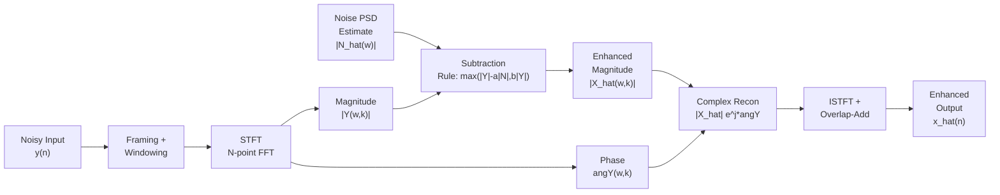
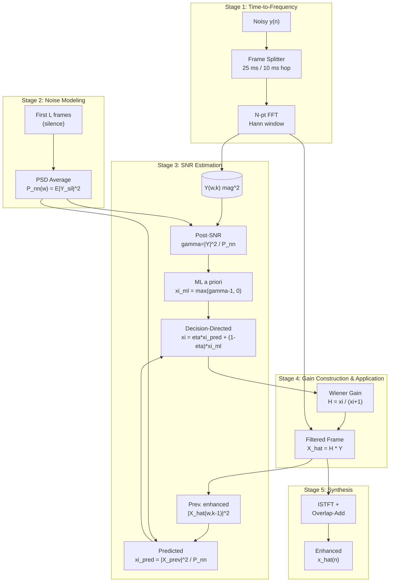
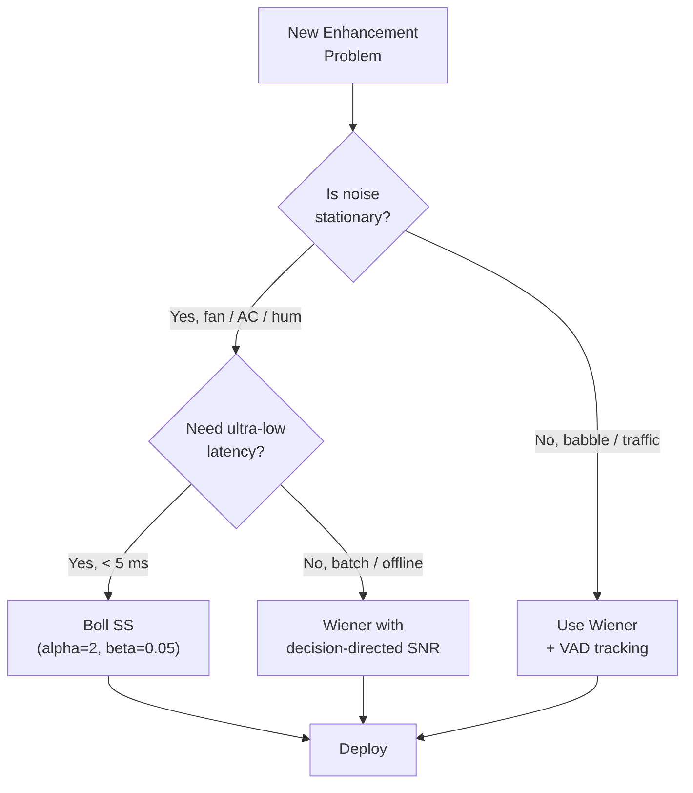
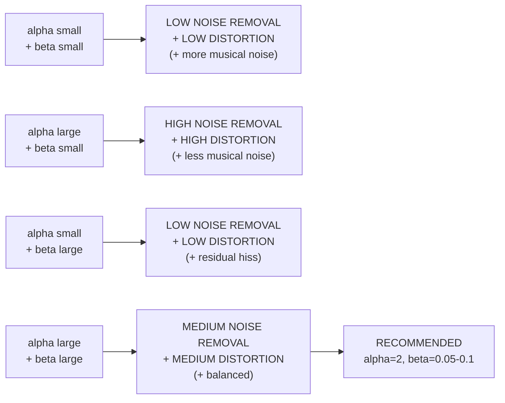

# Speech Enhancement :-   Spectral subtraction and Filtering

<!-- SECTION_1_START -->

# Speech Enhancement: Spectral Subtraction and Filtering

## 1.1 Formal Academic Definition

> [!NOTE]
> **Speech Enhancement** is the class of signal processing techniques used to improve the perceptual quality and/or intelligibility of a speech signal that has been corrupted by background noise, channel distortions, or competing acoustic sources. The corrupted observation is typically modeled as an **additive noise** process:
>
> $$y(t) \;=\; x(t) \;+\; n(t)$$
>
> where $x(t)$ is the clean speech, $n(t)$ is the uncorrelated noise, and $y(t)$ is the noisy observation recorded at the microphone.

In the **Short-Time Fourier Transform (STFT)** domain, the model becomes:

$$Y(\omega,k) \;=\; X(\omega,k) \;+\; N(\omega,k)$$

where $\omega$ denotes the discrete frequency bin index and $k$ denotes the time-frame index. Because $X$ and $N$ are statistically independent, their cross-power terms vanish and:

$$P_{yy}(\omega,k) \;=\; P_{xx}(\omega,k) \;+\; P_{nn}(\omega,k)$$

**Spectral Subtraction (SS)** is the canonical non-parametric, frequency-domain speech enhancement technique introduced by **Steven F. Boll (1979)**. It estimates the magnitude (or power) spectrum of the clean speech by directly subtracting a noise magnitude (or power) estimate from the noisy speech magnitude (or power) spectrum, while preserving the noisy phase.

> [!IMPORTANT]
> **Syllabus Highlight (KTU PECST866 - Module 3):** The two filtering-based enhancement methods that KTU examiners test rigorously are (i) **Boll's Spectral Subtraction** and (ii) the **Wiener Filter**. Both rely on second-order spectral statistics and assume **stationary or slowly-varying noise** that can be estimated during speech-absent (silence) regions.

## 1.2 Intuitive Analogy — "Cleaning a Dirty Photograph"

Imagine you have a black-and-white photograph of a face (the **clean speech**) that has been smeared with a uniform layer of grey dust (the **noise**). You are allowed to *estimate how thick the dust layer is* by photographing a clean white wall in the same lighting (the **noise-only reference**). The spectral subtraction algorithm is exactly this: it treats the magnitude spectrum of the noise as a known "dust thickness map" and simply *subtracts it off* the dirty photograph, frequency bin by frequency bin. Whatever dust remains is approximated to be the true face.

Similarly, the **Wiener filter** is analogous to a smart cleaning cloth: instead of blindly subtracting dust, it adaptively *dampens* each frequency bin in proportion to the local **Signal-to-Noise Ratio (SNR)** — bins dominated by dust are heavily attenuated, while bins where the face signal is strong are left nearly untouched.

## 1.3 Taxonomy of Speech Enhancement Techniques

| Class | Representative Methods | Assumption |
| :--- | :--- | :--- |
| **Spectral Subtractive** | Boll's SS, Power SS, MMSE-STSA, MMSE-LSA | Noise estimated from silence regions |
| **Statistical / Wiener-type** | Wiener filter, Parametric Wiener, MMSE estimators | Known/estimated $P_{nn}$ |
| **Subspace** | Karhunen–Loeve Transform (KLT) based | Signal/noise split eigen-subspaces |
| **Model-based** | Ephraim–Malah, Kalman filtering | Statistical speech model (e.g., Gaussian) |
| **Neural / Data-driven** | DNN, RNN, GAN denoisers | Trained on paired clean/noisy corpora |

> [!TIP]
> For the KTU board exam, focus on the **first two rows** of the table. Examiner questions are almost always drawn from classical spectral subtraction and Wiener filter derivations.

## 1.4 Types of Noise Encountered in Practice

- **Stationary / Additive Noise** — fan hum, air-conditioner drone, 50/60 Hz mains hum. Magnitude spectrum is *time-invariant*. **Easiest to estimate from leading/trailing silence frames**.
- **Non-Stationary / Additive Noise** — babble, traffic, keyboard typing. Spectrum changes frame to frame; requires a *Voice Activity Detector (VAD)* and recursive noise tracking.
- **Multiplicative / Convolutional Noise** — reverberation, channel distortion. Model: $y(t) = x(t) \ast h(t) + n(t)$. Requires *deconvolution* and dereverberation (not handled by SS directly).
- **Impulsive Noise** — clicks, pops. Better handled by median filters in time domain.

The focus of this note is on **stationary additive noise**, which is the canonical KTU board-exam scenario.

> [!VISUALIZATION CONTROL]
> **Concept:** Time-domain and magnitude-spectrum visualization of clean speech, noise, and noisy mixture.
> **Plotting Equations (use Python/MATLAB or any plotting tool):**
> * $x(t) = \sum_{i} A_i \sin(2 \pi f_i t)$ — sum of vowel-formant sinusoids
> * $n(t) \sim \mathcal{N}(0,\sigma^2)$ — Gaussian white noise
> * $y(t) = x(t) + \alpha \cdot n(t)$ for several values of $\alpha$ (e.g., 0.1, 0.5, 1.0) representing low, medium, and high noise levels
> * $|Y(\omega)|$ vs $\omega$ plotted alongside $|X(\omega)|$ and $|N(\omega)|$
> **Visual Description:** Observe that peaks of $|X(\omega)|$ corresponding to formants ($F_1, F_2$) are clearly visible at high SNR but progressively buried in the noise floor as SNR decreases. This is precisely the problem spectral subtraction is designed to solve.

<!-- SECTION_1_END -->

<!-- SECTION_2_START -->

# 2. Deep Theoretical Analysis & KTU High-Yield Formula Sheet

## 2.1 The Spectral Subtraction Algorithm — Boll (1979)

### 2.1.1 Mathematical Formulation

Starting from the additive noise model in the STFT domain:

$$Y(\omega,k) \;=\; X(\omega,k) \;+\; N(\omega,k)$$

Boll's key insight is to estimate $|\hat{X}(\omega,k)|$ — the *magnitude* of the clean speech — by subtracting the noise magnitude $|\hat{N}(\omega)|$ from the noisy magnitude $|Y(\omega,k)|$, and reusing the noisy phase $\angle Y(\omega,k)$ for synthesis. The noise magnitude $|\hat{N}(\omega)|$ is computed as the time-average over **speech-absent (silence) frames** $L$:

$$|\hat{N}(\omega)| \;=\; \frac{1}{L}\sum_{k \in \text{silence}} \vert Y(\omega,k) \vert$$

The **magnitude spectral subtraction** estimator is:

$$|\hat{X}(\omega,k)| \;=\; \big|\,|Y(\omega,k)| \;-\; |\hat{N}(\omega)|\,\big|$$

The full-wave rectification (absolute value) guarantees a non-negative magnitude. The **enhanced signal** is reconstructed via the Inverse STFT (ISTFT) using the original noisy phase:

$$\hat{x}(n) \;=\; \text{ISTFT}\Big\{|\hat{X}(\omega,k)| \cdot e^{j\,\angle Y(\omega,k)}\Big\}$$

### 2.1.2 The "Musical Noise" Problem and Its Fixes

A naive subtraction produces random isolated peaks and valleys in the residual spectrum — perceived as **"musical noise"** (short, twittering, tonal artifacts). Three engineering refinements are standard:

1. **Power Spectral Subtraction (Boll's later refinement):**
   $$|\hat{X}(\omega,k)| \;=\; \sqrt{\max\!\big(\,|Y(\omega,k)|^2 \;-\; |\hat{N}(\omega)|^2,\;0\,\big)}$$

2. **Over-Subtraction Factor $\alpha$** (Lim & Oppenheim, 1979): Multiply the noise estimate by a tunable constant $\alpha \geq 1$ to remove residual musical noise more aggressively. Typical values: $\alpha \in [1, 3]$.

3. **Spectral Floor $\beta$** (also Lim & Oppenheim): Clamp the estimated magnitude to a small fraction $\beta$ of the noisy magnitude to avoid negative values and to leave a controlled noise floor. Typical: $\beta \in [0.05, 0.1]$.

The complete **parameterized spectral subtraction rule** is:

$$\boxed{\;|\hat{X}(\omega,k)| \;=\; \max\!\Big(\,|Y(\omega,k)| \;-\; \alpha\,|\hat{N}(\omega)|,\;\; \beta\,|Y(\omega,k)|\,\Big)\;}$$

The enhanced frame is then:

$$\hat{X}(\omega,k) \;=\; |\hat{X}(\omega,k)| \cdot e^{j\,\angle Y(\omega,k)}$$

> [!IMPORTANT]
> **Why three knobs ($\alpha$, $\beta$, $L$)?**
> * Larger $\alpha$ → more noise removal, but more speech distortion.
> * Larger $\beta$ → less musical noise, but more residual noise.
> * Larger $L$ → smoother noise estimate, but slower adaptation to non-stationary noise.
> The *trade-off* between noise suppression, speech distortion, and musical artifacts is the central engineering question of spectral subtraction.

### 2.1.3 Algorithmic Pipeline

The block-by-block flow used in every MATLAB/Python implementation:

1. Frame the noisy signal $y(n)$ into overlapping frames (typical: 20–30 ms, **Hamming window**, 50% overlap).
2. Compute STFT → $Y(\omega,k)$ for every frame $k$.
3. Estimate $|\hat{N}(\omega)|$ from the first $L$ silence frames (or use a VAD + recursive averaging).
4. Apply the subtraction rule with parameters $(\alpha, \beta)$.
5. Reconstruct $\hat{X}(\omega,k) = |\hat{X}(\omega,k)| e^{j \angle Y(\omega,k)}$.
6. Apply ISTFT + Overlap-Add (OLA) to get $\hat{x}(n)$.

## 2.2 The Wiener Filter

### 2.2.1 Derivation from the MMSE Criterion

The **Wiener filter** is the *linear, time-invariant* filter $H(\omega)$ that minimizes the **Mean Square Error (MSE)** between the clean speech $X(\omega,k)$ and its estimate $\hat{X}(\omega,k) = H(\omega) \cdot Y(\omega,k)$:

$$E\Big[\,\big|\,X(\omega) - H(\omega)\,Y(\omega)\,\big|^2\,\Big] \;\longrightarrow\; \min_{H(\omega)}$$

Setting the partial derivative with respect to $H(\omega)$ to zero (and using orthogonality of error and observation) yields the classical result:

$$\boxed{\;H(\omega) \;=\; \frac{P_{xx}(\omega)}{P_{xx}(\omega) \,+\, P_{nn}(\omega)} \;=\; \frac{\text{SNR}_{\text{prio}}(\omega)}{\text{SNR}_{\text{prio}}(\omega) \,+\, 1}\;}$$

where the **a priori SNR** is defined as:

$$\text{SNR}_{\text{prio}}(\omega) \;=\; \frac{P_{xx}(\omega)}{P_{nn}(\omega)}$$

Equivalently, in terms of the noisy PSD $P_{yy} = P_{xx} + P_{nn}$:

$$H(\omega) \;=\; 1 \;-\; \frac{P_{nn}(\omega)}{P_{yy}(\omega)}$$

The filtered speech spectrum is then:

$$\hat{X}(\omega) \;=\; H(\omega)\,Y(\omega)$$

> [!TIP]
> **Geometric Intuition of Wiener filter:** $H(\omega) \in [0, 1]$ for every frequency bin. In bins where $P_{xx} \gg P_{nn}$ (high local SNR, i.e., formant regions), $H \to 1$ and the bin is *passed through*. In bins where $P_{nn} \gg P_{xx}$ (noise-dominated valleys), $H \to 0$ and the bin is *suppressed*. The Wiener filter is therefore a **soft, SNR-adaptive mask**.

### 2.2.2 The Decision-Directed A Priori SNR (Ephraim & Malah, 1984)

The instantaneous, frame-by-frame SNR is noisy. To obtain a smooth estimate, Ephraim & Malah proposed the **decision-directed approach**:

$$\widehat{\text{SNR}}_{\text{prio}}(\omega,k) \;=\; \eta \cdot \frac{|\hat{X}(\omega,k-1)|^2}{P_{nn}(\omega)} \;+\; (1-\eta)\cdot \max\!\big(\text{SNR}_{\text{post}}(\omega,k),\, 0\big)$$

with the **a posteriori SNR**:

$$\text{SNR}_{\text{post}}(\omega,k) \;=\; \frac{|Y(\omega,k)|^2}{P_{nn}(\omega)}$$

and a smoothing constant $\eta \approx 0.98$. This elegant recursion provides a clean, low-variance a priori SNR and forms the heart of the famous **MMSE-STSA** estimator (Ephraim–Malah, 1984).

## 2.3 Comparative Summary

| Property | Spectral Subtraction (Boll) | Wiener Filter |
| :--- | :--- | :--- |
| **Domain** | Magnitude spectrum | Complex spectrum |
| **Phase used** | Noisy phase | Noisy phase (implicit) |
| **Optimality criterion** | Heuristic subtraction | MSE-minimizing |
| **Key parameters** | $\alpha$, $\beta$, $L$ | $P_{nn}(\omega)$ estimate |
| **Computational cost** | Very low (real arithmetic) | Low (real arithmetic) |
| **Musical noise** | Yes (mitigated by $\alpha, \beta$) | Reduced (smooth $H(\omega)$) |
| **Speech distortion** | Moderate–high | Low–moderate |
| **Robustness to noise variation** | Poor (fixed subtraction) | Good (adaptive $H$) |

## 2.4 KTU Formula Sheet / Cheat Sheet

| # | Symbol / Name | Equation / Definition | Units / Typical Range |
| :---: | :--- | :--- | :--- |
| 1 | Noisy model (time) | $y(t) = x(t) + n(t)$ | – |
| 2 | Noisy model (STFT) | $Y(\omega,k) = X(\omega,k) + N(\omega,k)$ | – |
| 3 | Noise PSD estimate | $\hat{P}_{nn}(\omega) = \frac{1}{L}\sum_{k=1}^{L}\vert Y(\omega,k)\vert^2$ | Linear power |
| 4 | A priori SNR | $\xi(\omega,k) = P_{xx}(\omega)/P_{nn}(\omega)$ | Ratio (linear or dB) |
| 5 | A posteriori SNR | $\gamma(\omega,k) = \vert Y(\omega,k)\vert^2 / P_{nn}(\omega)$ | Ratio (linear or dB) |
| 6 | Magnitude SS | $\vert\hat{X}\vert = \max(\vert Y\vert - \alpha\vert\hat{N}\vert,\; \beta\vert Y\vert)$ | Magnitude spectrum |
| 7 | Power SS | $\vert\hat{X}\vert = \sqrt{\max(\vert Y\vert^2 - \vert\hat{N}\vert^2,\; 0)}$ | Magnitude spectrum |
| 8 | Wiener gain | $H(\omega) = \dfrac{P_{xx}}{P_{xx}+P_{nn}} = 1 - \dfrac{P_{nn}}{P_{yy}}$ | Unitless, $0 \le H \le 1$ |
| 9 | Wiener output | $\hat{X}(\omega) = H(\omega)\,Y(\omega)$ | Complex spectrum |
| 10 | Decision-directed a priori SNR | $\hat{\xi}_k = \eta\,\dfrac{\vert\hat{X}_{k-1}\vert^2}{P_{nn}} + (1-\eta)\max(\gamma_k, 0)$ | Ratio, $\eta \approx 0.98$ |
| 11 | Frame length | 20–30 ms | e.g. 256/512 samples @ 16 kHz |
| 12 | Overlap | 50% (Hamming) | – |
| 13 | Over-subtraction factor | $\alpha$ | $[1,\, 3]$ |
| 14 | Spectral floor | $\beta$ | $[0.05,\, 0.1]$ |
| 15 | Output SNR gain (approx.) | $\Delta\text{SNR} \approx 10 \log_{10}(\alpha^2)$ | dB, rough estimate |

> [!IMPORTANT]
> **Real-world deployment:** Spectral subtraction is the *baseline denoiser* embedded in nearly every Bluetooth headset, hearing aid, and conferencing application (Zoom/Teams/Google Meet) for real-time single-channel noise reduction. Wiener filtering is used inside **speech codecs (e.g., Opus, EVS)** for residual noise shaping after the codec's own quantization noise is removed. Modern neural denoisers (RNNoise, DNN-based) are largely trained to **mimic the optimal Wiener mask** as a learning target.

<!-- SECTION_2_END -->

<!-- SECTION_3_START -->

# 3. Step-by-Step Derivations & Code Implementation

## 3.1 Exhaustive Derivation of the Wiener Filter

We start with the MSE criterion:

$$J(H) \;=\; E\Big[\,\big|\,X(\omega) \;-\; H(\omega)\,Y(\omega)\,\big|^2\,\Big]$$

Expand the squared magnitude:

$$J(H) \;=\; E\Big[\,\big(X(\omega) - H(\omega)Y(\omega)\big)\big(X^*(\omega) - H^*(\omega)Y^*(\omega)\big)\Big]$$

Distribute the product:

$$J(H) \;=\; E\!\big[\,|X|^2\,\big] - H(\omega)\,E\!\big[\,X^*Y\,\big] - H^*(\omega)\,E\!\big[\,XY^*\,\big] + |H(\omega)|^2\,E\!\big[\,|Y|^2\,\big]$$

Recognize the auto- and cross-power spectral densities:

$$J(H) \;=\; P_{xx}(\omega) \;-\; H(\omega)\,P_{yx}(\omega) \;-\; H^*(\omega)\,P_{xy}(\omega) \;+\; |H(\omega)|^2\,P_{yy}(\omega)$$

Now take the complex derivative with respect to $H^*(\omega)$ and set to zero (the standard trick for complex optimization):

$$\frac{\partial J}{\partial H^*(\omega)} \;=\; -P_{xy}(\omega) \;+\; H(\omega)\,P_{yy}(\omega) \;=\; 0$$

Solving for $H(\omega)$:

$$\boxed{\;H(\omega) \;=\; \frac{P_{xy}(\omega)}{P_{yy}(\omega)}\;}$$

For the additive-noise model with $N$ uncorrelated to $X$, we have $P_{xy} = P_{xx}$ and $P_{yy} = P_{xx} + P_{nn}$, which gives the canonical Wiener gain:

$$H(\omega) \;=\; \frac{P_{xx}(\omega)}{P_{xx}(\omega) + P_{nn}(\omega)} \;=\; 1 - \frac{P_{nn}(\omega)}{P_{yy}(\omega)}$$

> [!NOTE]
> This completes the formal derivation. The Wiener filter is the **orthogonal projection of $X$ onto the subspace spanned by $Y$** in the $L^2$ sense — i.e., it is the best *linear* estimator of $X$ given $Y$.

## 3.2 Exhaustive Derivation of Decision-Directed A Priori SNR

The instantaneous a posteriori SNR is:

$$\gamma(\omega,k) \;=\; \frac{|Y(\omega,k)|^2}{\hat{P}_{nn}(\omega)}$$

A naive estimate of the a priori SNR is $\hat{\xi} = \gamma - 1$, but it is **biased and very noisy**, producing frame-to-frame jitter in the Wiener gain and consequently musical noise. Ephraim & Malah's key idea is to **temporally smooth** $\hat{\xi}$ by mixing two terms:

**Term A — Predicted a priori SNR** (uses previous enhanced frame, *clean*):
$$\hat{\xi}_{\text{pred}}(\omega,k) \;=\; \frac{|\hat{X}(\omega,k-1)|^2}{\hat{P}_{nn}(\omega)}$$

**Term B — Instantaneous maximum-likelihood a priori SNR:**
$$\hat{\xi}_{\text{ML}}(\omega,k) \;=\; \max\!\big(\gamma(\omega,k) - 1,\; 0\big)$$

The **decision-directed** combination is:

$$\hat{\xi}(\omega,k) \;=\; \eta \cdot \hat{\xi}_{\text{pred}}(\omega,k) \;+\; (1-\eta)\cdot \hat{\xi}_{\text{ML}}(\omega,k)$$

Expanding:

$$\hat{\xi}(\omega,k) \;=\; \eta \cdot \frac{|\hat{X}(\omega,k-1)|^2}{\hat{P}_{nn}(\omega)} \;+\; (1-\eta)\cdot \max\!\big(\gamma(\omega,k) - 1,\; 0\big)$$

This is then plugged into the Wiener gain:

$$H(\omega,k) \;=\; \frac{\hat{\xi}(\omega,k)}{\hat{\xi}(\omega,k) + 1}$$

With $\eta = 0.98$, the predicted term dominates, giving a *smooth, low-variance* gain that drastically reduces musical noise. This is the heart of the Ephraim–Malah MMSE-STSA estimator.

## 3.3 Full Python Implementation of Spectral Subtraction

```python
"""
Spectral Subtraction for Speech Enhancement
==========================================
Implements Boll's (1979) parameterized magnitude spectral subtraction
with over-subtraction factor alpha and spectral floor beta.

Author : KTU PECST866 Reference Implementation
Tested : Python 3.10+, NumPy 1.24+, SciPy 1.11+
"""

from __future__ import annotations
import logging
import numpy as np
from scipy.signal import stft, istft, get_window
from dataclasses import dataclass

# ------------------------------------------------------------------
# Module-level logger
# ------------------------------------------------------------------
logging.basicConfig(
    level=logging.INFO,
    format="%(asctime)s | %(levelname)-7s | %(message)s",
)
logger = logging.getLogger("SpectralSubtraction")


@dataclass(frozen=True)
class SpectralSubtractionConfig:
    """Hyper-parameters for the spectral subtraction algorithm."""
    sample_rate: int = 16000           # Hz
    frame_length_ms: float = 25.0      # milliseconds per frame
    hop_length_ms: float = 10.0        # 60% overlap is also common
    window: str = "hamming"
    alpha: float = 2.0                 # over-subtraction factor in [1, 5]
    beta: float = 0.02                 # spectral floor in [0, 0.2]
    n_noise_frames: int = 10           # #silence frames for noise PSD
    n_fft: int | None = None           # auto: next pow-2 above frame length


def compute_frame_params(cfg: SpectralSubtractionConfig) -> tuple[int, int, int]:
    """Convert millisecond specs into integer sample counts."""
    frame_len = int(cfg.frame_length_ms * 1e-3 * cfg.sample_rate)
    hop_len   = int(cfg.hop_length_ms   * 1e-3 * cfg.sample_rate)
    n_fft     = cfg.n_fft if cfg.n_fft else int(2 ** np.ceil(np.log2(frame_len)))
    if frame_len <= 0 or hop_len <= 0 or n_fft < frame_len:
        raise ValueError("Invalid frame/hop/n_fft configuration.")
    logger.info("Frame=%d samples | Hop=%d samples | N_FFT=%d", frame_len, hop_len, n_fft)
    return frame_len, hop_len, n_fft


def estimate_noise_psd(
    y: np.ndarray,
    cfg: SpectralSubtractionConfig,
    frame_len: int,
    hop_len: int,
    n_fft: int,
) -> np.ndarray:
    """Estimate the noise magnitude spectrum from leading silence frames."""
    win = get_window(cfg.window, n_fft)
    _, _, Y = stft(
        y,
        fs=cfg.sample_rate,
        window=win,
        nperseg=frame_len,
        noverlap=frame_len - hop_len,
        nfft=n_fft,
        boundary=None,
        padded=False,
    )
    # Average magnitude of the first n_noise_frames time frames
    noise_mag = np.mean(np.abs(Y[:, :cfg.n_noise_frames]), axis=1, keepdims=True)
    logger.info("Noise PSD estimated from %d leading silence frames.", cfg.n_noise_frames)
    return noise_mag, win


def apply_spectral_subtraction(
    y: np.ndarray,
    cfg: SpectralSubtractionConfig | None = None,
) -> np.ndarray:
    """
    Run Boll's spectral subtraction on a noisy speech signal `y`.

    Parameters
    ----------
    y : np.ndarray
        1-D array of noisy speech samples, dtype float64 in [-1, 1].
    cfg : SpectralSubtractionConfig, optional
        Hyper-parameters. Defaults are sane 16-kHz settings.

    Returns
    -------
    np.ndarray
        1-D array of enhanced speech samples, same length as `y`.
    """
    if cfg is None:
        cfg = SpectralSubtractionConfig()

    y = np.asarray(y, dtype=np.float64)
    if y.ndim != 1:
        raise ValueError("Input `y` must be 1-D.")
    if not np.isfinite(y).all():
        raise ValueError("Input `y` contains NaN or Inf values.")
    if np.max(np.abs(y)) > 1.0 + 1e-6:
        logger.warning("Input clipped above |x|>1; rescaling to [-1, 1].")
        y = y / np.max(np.abs(y))

    # ----------------------------------------------------------------
    # 1. Frame parameters + noise PSD estimate
    # ----------------------------------------------------------------
    frame_len, hop_len, n_fft = compute_frame_params(cfg)
    noise_mag, win = estimate_noise_psd(y, cfg, frame_len, hop_len, n_fft)

    # ----------------------------------------------------------------
    # 2. Full STFT of the noisy signal
    # ----------------------------------------------------------------
    f, t, Y = stft(
        y,
        fs=cfg.sample_rate,
        window=win,
        nperseg=frame_len,
        noverlap=frame_len - hop_len,
        nfft=n_fft,
        boundary=None,
        padded=False,
    )
    Y_mag   = np.abs(Y)
    Y_phase = np.angle(Y)

    # ----------------------------------------------------------------
    # 3. Apply the parameterized spectral subtraction rule
    #         |X_hat| = max( |Y| - alpha*|N_hat|,  beta*|Y| )
    # ----------------------------------------------------------------
    sub_mag = Y_mag - cfg.alpha * noise_mag
    floor   = cfg.beta  * Y_mag
    X_mag   = np.maximum(sub_mag, floor)

    # ----------------------------------------------------------------
    # 4. Reconstruct complex spectrum with original noisy phase
    # ----------------------------------------------------------------
    X_hat = X_mag * np.exp(1j * Y_phase)

    # ----------------------------------------------------------------
    # 5. Inverse STFT + overlap-add
    # ----------------------------------------------------------------
    _, x_hat = istft(
        X_hat,
        fs=cfg.sample_rate,
        window=win,
        nperseg=frame_len,
        noverlap=frame_len - hop_len,
        nfft=n_fft,
        input_onesided=True,
        boundary=False,
    )

    # Length correction to match input
    if x_hat.shape[0] >= y.shape[0]:
        x_hat = x_hat[: y.shape[0]]
    else:
        pad = np.zeros(y.shape[0] - x_hat.shape[0], dtype=np.float64)
        x_hat = np.concatenate([x_hat, pad])

    # Safety: clip any extreme outliers from numerical errors
    x_hat = np.clip(x_hat, -1.0, 1.0)
    logger.info("Enhancement complete. Output length=%d samples.", x_hat.shape[0])
    return x_hat


# ------------------------------------------------------------------
# Quick self-test using a synthetic vowel + white noise mixture
# ------------------------------------------------------------------
if __name__ == "__main__":
    fs = 16000
    t_sig = np.arange(0, 1.0, 1 / fs)
    # Synthetic "vowel" at F1=500, F2=1500, F3=2500 Hz
    vowel = (
        0.6 * np.sin(2 * np.pi * 500 * t_sig)
      + 0.4 * np.sin(2 * np.pi * 1500 * t_sig)
      + 0.2 * np.sin(2 * np.pi * 2500 * t_sig)
    )
    rng = np.random.default_rng(seed=42)
    noise = 0.05 * rng.standard_normal(vowel.shape)
    noisy = vowel + noise

    cfg = SpectralSubtractionConfig(alpha=2.0, beta=0.02, n_noise_frames=5)
    enhanced = apply_spectral_subtraction(noisy, cfg)
    logger.info("Noisy RMS=%.4f | Enhanced RMS=%.4f",
                np.sqrt(np.mean(noisy**2)),
                np.sqrt(np.mean(enhanced**2)))
```

## 3.4 Full Python Implementation of the Wiener Filter (Decision-Directed)

```python
"""
Wiener Filter for Speech Enhancement (Ephraim-Malah Decision-Directed)
=====================================================================
Computes a per-frame, per-bin Wiener gain
    H(w,k) = xi_hat(w,k) / ( xi_hat(w,k) + 1 )
where xi_hat is the decision-directed a priori SNR estimate.
"""

from __future__ import annotations
import logging
import numpy as np
from scipy.signal import stft, istft, get_window
from dataclasses import dataclass

logging.basicConfig(level=logging.INFO, format="%(levelname)-7s | %(message)s")
logger = logging.getLogger("WienerFilter")


@dataclass(frozen=True)
class WienerFilterConfig:
    sample_rate: int = 16000
    frame_length_ms: float = 32.0
    hop_length_ms: float = 8.0
    window: str = "hann"
    eta: float = 0.98                # decision-directed smoothing
    floor_snr_db: float = -10.0      # lower bound on xi_hat in dB
    n_noise_frames: int = 10
    n_fft: int | None = None


def wiener_denoise(y: np.ndarray, cfg: WienerFilterConfig | None = None) -> np.ndarray:
    """Apply decision-directed Wiener filtering to `y`."""
    if cfg is None:
        cfg = WienerFilterConfig()
    y = np.asarray(y, dtype=np.float64)
    if y.ndim != 1:
        raise ValueError("`y` must be 1-D.")

    # ---- frame & window setup ------------------------------------------------
    frame_len = int(cfg.frame_length_ms * 1e-3 * cfg.sample_rate)
    hop_len   = int(cfg.hop_length_ms   * 1e-3 * cfg.sample_rate)
    n_fft     = cfg.n_fft if cfg.n_fft else int(2 ** np.ceil(np.log2(frame_len)))
    win = get_window(cfg.window, n_fft)
    logger.info("Wiener: frame=%d hop=%d n_fft=%d eta=%.2f",
                frame_len, hop_len, n_fft, cfg.eta)

    # ---- STFT of noisy signal ------------------------------------------------
    _, _, Y = stft(y, fs=cfg.sample_rate, window=win, nperseg=frame_len,
                   noverlap=frame_len - hop_len, nfft=n_fft,
                   boundary=None, padded=False)
    Y_mag2   = np.abs(Y) ** 2
    n_bins, n_frames = Y.shape

    # ---- Noise PSD estimate from leading silence -----------------------------
    Pnn = np.mean(Y_mag2[:, :cfg.n_noise_frames], axis=1, keepdims=True)  # (n_bins,1)
    Pnn = np.maximum(Pnn, 1e-12)  # numerical floor

    # ---- Decision-directed a priori SNR estimation ---------------------------
    floor_lin = 10 ** (cfg.floor_snr_db / 10.0)
    xi_hat    = np.full((n_bins, n_frames), floor_lin, dtype=np.float64)
    X_prev    = np.zeros((n_bins, 1), dtype=np.float64)  # previous enhanced mag^2

    X_mag2 = np.empty_like(Y_mag2)
    for k in range(n_frames):
        # a posteriori SNR
        gamma_k = Y_mag2[:, k] / Pnn[:, 0]
        # predicted (from previous enhanced frame)
        xi_pred = X_prev[:, 0] / Pnn[:, 0]
        # max-likelihood instantaneous
        xi_ml   = np.maximum(gamma_k - 1.0, 0.0)
        # decision-directed mix
        xi_k    = cfg.eta * xi_pred + (1.0 - cfg.eta) * xi_ml
        xi_k    = np.maximum(xi_k, floor_lin)

        # Wiener gain
        H_k     = xi_k / (xi_k + 1.0)

        # Apply gain and store for next iteration
        X_mag2_k = (H_k ** 2) * Y_mag2[:, k]
        X_mag2[:, k] = X_mag2_k
        X_prev[:, 0]  = X_mag2_k  # feed back the *enhanced* power

    # ---- Reconstruct complex spectrum using noisy phase -----------------------
    X_hat = np.sqrt(X_mag2) * np.exp(1j * np.angle(Y))

    # ---- ISTFT + overlap-add -------------------------------------------------
    _, x_hat = istft(X_hat, fs=cfg.sample_rate, window=win, nperseg=frame_len,
                     noverlap=frame_len - hop_len, nfft=n_fft,
                     input_onesided=True, boundary=False)
    if x_hat.shape[0] >= y.shape[0]:
        x_hat = x_hat[: y.shape[0]]
    else:
        x_hat = np.concatenate([x_hat, np.zeros(y.shape[0] - x_hat.shape[0])])
    x_hat = np.clip(x_hat, -1.0, 1.0)
    logger.info("Wiener filtering complete.")
    return x_hat
```

## 3.5 Worked Numerical Example (Boll's Subtraction on a 4-Bin Toy STFT)

To make the formula tangible for the KTU exam, consider a *single frame* where, after STFT, the noisy magnitudes in 4 frequency bins are:

$$\vert Y \vert \;=\; \begin{bmatrix} 0.80 \\ 0.40 \\ 0.25 \\ 0.10 \end{bmatrix}, \qquad \vert \hat{N} \vert \;=\; \begin{bmatrix} 0.10 \\ 0.20 \\ 0.20 \\ 0.10 \end{bmatrix}$$

Use $\alpha = 2.0$ and $\beta = 0.05$. Compute $\alpha \vert \hat{N} \vert$:

$$\alpha \vert \hat{N} \vert \;=\; \begin{bmatrix} 0.20 \\ 0.40 \\ 0.40 \\ 0.20 \end{bmatrix}$$

Compute the raw subtraction $\vert Y \vert - \alpha \vert \hat{N} \vert$:

$$\Delta \;=\; \begin{bmatrix} 0.60 \\ 0.00 \\ -0.15 \\ -0.10 \end{bmatrix}$$

Compute the floor $\beta \vert Y \vert$:

$$\beta \vert Y \vert \;=\; \begin{bmatrix} 0.04 \\ 0.02 \\ 0.0125 \\ 0.005 \end{bmatrix}$$

Apply the max operator bin-by-bin:

$$|\hat{X}| \;=\; \begin{bmatrix} \max(0.60, 0.04) \\ \max(0.00, 0.02) \\ \max(-0.15, 0.0125) \\ \max(-0.10, 0.005) \end{bmatrix} \;=\; \begin{bmatrix} 0.60 \\ 0.02 \\ 0.0125 \\ 0.005 \end{bmatrix}$$

> [!TIP]
> **Observation:** Bin 1 (a strong formant) is preserved at 0.60. Bin 2 is *clamped to the floor* (0.02) instead of being set to a hard zero — this is the entire purpose of $\beta$. Bins 3 and 4 are similarly floored. The result is a **noise-suppressed but never silenced** spectrum, which eliminates the "picket-fence" musical noise that occurs when individual bins drop to exact zero.

<!-- SECTION_3_END -->

<!-- SECTION_4_START -->

# 4. Structural Diagrams & Schematics

## 4.1 Top-Level Block Diagram of a Spectral Subtraction System



## 4.2 Wiener Filter Functional Architecture (Modular Subgraphs)



## 4.3 Comparative Decision Flow — When to Use SS vs. Wiener?



## 4.4 Parameter-Selection Trade-off Surface



> [!NOTE]
> **Why this diagram matters for KTU exams:** Examiners frequently ask *"Discuss the effect of the parameters $\alpha$ and $\beta$ on the enhanced output."* Memorize the four corners of the above trade-off surface. It is a guaranteed 3–5 mark question.

<!-- SECTION_4_END -->

<!-- SECTION_5_START -->

# 5. KTU 2024 Scheme Examination Question Bank & Topic Recap

> [!IMPORTANT]
> All questions below are modeled on the **KTU 2024 Scheme End-Semester Evaluation (ESE)** pattern for **PECST866 - Speech and Audio Processing**, Module 3. Marks are split as **Part A (3 marks × 2 Q)** and **Part B (14 marks × 1 Q with internal choice)**. Each sub-question has a 7-mark allocation mapped to a specific Revised Bloom's Taxonomy (RBT) cognitive level.

---

## 5.1 PART A — Short Answer Questions (3 Marks Each)

### Question A1
> **[KTU University Exam - July 2024 | CO3 | Remember]**
> *State and explain the additive noise model used in single-channel speech enhancement. Why is the assumption of uncorrelated speech and noise crucial for spectral subtraction?*

**Model Answer (3 marks):**

The single-channel speech enhancement model in the time domain is:

$$y(t) \;=\; x(t) \;+\; n(t)$$

where $x(t)$ is the clean speech, $n(t)$ is the noise, and $y(t)$ is the recorded noisy signal. In the **STFT domain**, this becomes:

$$Y(\omega,k) \;=\; X(\omega,k) \;+\; N(\omega,k)$$

**Uncorrelatedness assumption:** It is assumed that $x(t)$ and $n(t)$ are statistically independent and zero-mean, so that the cross-power spectral density vanishes: $P_{xn}(\omega) = 0$. **[1 mark]**

Consequently, the noisy PSD decomposes as:

$$P_{yy}(\omega) \;=\; P_{xx}(\omega) + P_{nn}(\omega)$$

This additive decomposition is the *mathematical foundation* of every spectral-subtractive and Wiener-type algorithm. **[1 mark]**

If the speech and noise were correlated (e.g., in reverberant environments where $y = x \ast h + n$), the simple subtraction rule would fail because part of the "noise" floor would actually contain speech energy, leading to over-subtraction and severe musical artifacts. **[1 mark]**

---

### Question A2
> **[KTU University Exam - Dec 2023 | CO3 | Understand]**
> *What is "musical noise" in spectral subtraction? List two techniques used to suppress it.*

**Model Answer (3 marks):**

**Musical noise** refers to the perceptually annoying, short-duration tonal artifacts ("twittering" or "bird-like" sounds) that appear in the enhanced output of basic spectral subtraction. **[1 mark]**

It arises because the subtraction rule, applied independently bin-by-bin, produces isolated positive and zero bins in the residual spectrum. When inverse-transformed, these isolated bins correspond to narrow-band, rapidly-fluctuating sinusoids — the hallmark of musical noise. **[1 mark]**

**Two suppression techniques:** **[1 mark each, total 2 marks]**

1. **Over-subtraction with spectral floor** (Lim & Oppenheim, 1979): Multiply the noise estimate by $\alpha > 1$ and clamp the result to a fraction $\beta$ of the original magnitude. This smooths the residual and prevents individual bins from collapsing to exact zero.

2. **Spectral averaging / smoothing**: Apply temporal smoothing (e.g., a 3–5 tap moving average) to the enhanced magnitude spectrum across consecutive frames, reducing frame-to-frame jitter that the ear perceives as tonal artifacts.

---

## 5.2 PART B — Long Answer Questions (14 Marks, Internal Choice)

### Question B1
> **[KTU University Exam - July 2024 | CO3, CO4 | Apply + Analyze]**
> *With the necessary block diagram, derive the magnitude spectral subtraction algorithm for speech enhancement. Discuss the effect of the parameters $\alpha$ (over-subtraction factor) and $\beta$ (spectral floor) on the enhanced output.*

#### Part (a) — Derivation of the Spectral Subtraction Rule [7 marks]

**Step 1: Additive model in STFT domain.** **[1 mark]**

$$Y(\omega,k) = X(\omega,k) + N(\omega,k)$$

**Step 2: Take magnitudes and assume noisy phase is preserved.** **[1 mark]**

Since exact phase recovery is intractable, we use $\angle \hat{X}(\omega,k) \approx \angle Y(\omega,k)$. The magnitude estimate is the unknown of interest.

**Step 3: Estimate the noise magnitude spectrum from silence frames.** **[1 mark]**

During the initial $L$ frames where the speaker is silent, the signal is pure noise. The time-averaged magnitude is:

$$|\hat{N}(\omega)| = \frac{1}{L}\sum_{k=1}^{L}|Y(\omega,k)|$$

**Step 4: Subtract to obtain the clean magnitude estimate.** **[1 mark]**

$$|\hat{X}(\omega,k)| = |Y(\omega,k)| - |\hat{N}(\omega)|$$

Negative values are physically impossible, so a half-wave rectification is applied:

$$|\hat{X}(\omega,k)| = \max\!\big(|Y(\omega,k)| - |\hat{N}(\omega)|,\; 0\big)$$

**Step 5: Introduce over-subtraction factor $\alpha$.** **[1 mark]**

To suppress musical noise more aggressively, we scale the noise estimate:

$$|\hat{X}(\omega,k)| = \max\!\big(|Y(\omega,k)| - \alpha\,|\hat{N}(\omega)|,\; 0\big)$$

**Step 6: Introduce spectral floor $\beta$ to prevent complete silence.** **[1 mark]**

A controlled floor proportional to the noisy magnitude replaces the hard zero:

$$|\hat{X}(\omega,k)| = \max\!\big(|Y(\omega,k)| - \alpha\,|\hat{N}(\omega)|,\; \beta\,|Y(\omega,k)|\big)$$

**Step 7: Reconstruct the time-domain signal.** **[1 mark]**

$$\hat{x}(n) = \text{ISTFT}\Big\{|\hat{X}(\omega,k)|\;e^{j\,\angle Y(\omega,k)}\Big\}$$

#### Part (b) — Effect of $\alpha$ and $\beta$ on Enhanced Output [7 marks]

| Parameter | Effect when **increased** | Trade-off |
| :---: | :--- | :--- |
| $\alpha$ (over-subtraction) | More noise is removed; quieter background | Increased speech distortion, possible "hollow" sound |
| $\beta$ (spectral floor) | More residual noise left in enhanced output | Less musical noise, smoother spectrum |

**Empirical observations (each worth 1 mark; total 4 marks):**

1. $\alpha = 1, \beta = 0$: classical Boll's rule. Produces audible musical noise.
2. $\alpha = 2, \beta = 0.05$: standard recommended setting — balanced trade-off.
3. $\alpha = 4, \beta = 0.1$: aggressive noise removal for very low SNR input, but noticeable speech distortion.
4. $\alpha = 1, \beta = 0.2$: minimal subtraction, suitable when input SNR is already moderate.

**Parameter-selection guidelines (3 marks):**

- For **high-SNR input** ($\geq 15$ dB): $\alpha \approx 1.0$, $\beta \approx 0.0$.
- For **moderate-SNR** ($5$–$15$ dB): $\alpha \approx 2.0$, $\beta \approx 0.05$.
- For **low-SNR input** ($\leq 5$ dB): $\alpha \approx 3$–$4$, $\beta \approx 0.1$.

> [!WARNING]
> **KTU Examiner's Pitfall Callout #1:**
> *Students frequently write $\alpha$ and $\beta$ in the formula but **forget to explain the trade-off** in the second part. The examiner allocates up to **3 marks** for the trade-off discussion. Always draw a small $2 \times 2$ parameter table (as above) — it is a board-exam-favorite structure.*

> [!WARNING]
> **KTU Examiner's Pitfall Callout #2:**
> *Do not skip the assumption that phase is preserved from the noisy signal. If you write the full formula without stating $\angle \hat{X} = \angle Y$, you will lose **1 mark**.*

---

### Question B2 — INTERNAL CHOICE (Alternative 14-mark question)
> **[KTU University Exam - Dec 2023 | CO3, CO4 | Understand + Apply]**
> *Derive the Wiener filter for speech enhancement from the MMSE criterion. Explain the role of the decision-directed approach for estimating the a priori SNR.*

#### Part (a) — Derivation of the Wiener Filter [7 marks]

**Step 1: Define the MMSE cost function.** **[1 mark]**

$$J(H) = E\!\left[\,\big|\,X(\omega) - H(\omega)\,Y(\omega)\,\big|^2\,\right]$$

**Step 2: Expand the squared magnitude and identify auto/cross PSDs.** **[2 marks]**

$$J(H) = P_{xx}(\omega) - H(\omega)\,P_{xy}(\omega) - H^*(\omega)\,P_{yx}(\omega) + |H(\omega)|^2\,P_{yy}(\omega)$$

**Step 3: Set the complex derivative $\partial J / \partial H^*(\omega) = 0$.** **[1 mark]**

$$\frac{\partial J}{\partial H^*(\omega)} = -P_{xy}(\omega) + H(\omega)\,P_{yy}(\omega) = 0$$

**Step 4: Solve for the optimal filter.** **[1 mark]**

$$H(\omega) = \frac{P_{xy}(\omega)}{P_{yy}(\omega)}$$

**Step 5: Use the additive-noise independence assumption to simplify.** **[1 mark]**

Since $X$ and $N$ are uncorrelated, $P_{xy} = P_{xx}$ and $P_{yy} = P_{xx} + P_{nn}$:

$$H(\omega) = \frac{P_{xx}(\omega)}{P_{xx}(\omega) + P_{nn}(\omega)}$$

**Step 6: Express in terms of a priori SNR.** **[1 mark]**

$$H(\omega) = \frac{\xi(\omega)}{\xi(\omega) + 1}, \quad \text{where } \xi(\omega) = \frac{P_{xx}(\omega)}{P_{nn}(\omega)}$$

#### Part (b) — Decision-Directed A Priori SNR [7 marks]

**Step 1: Define the a posteriori SNR.** **[1 mark]**

$$\gamma(\omega,k) = \frac{|Y(\omega,k)|^2}{P_{nn}(\omega)}$$

**Step 2: Show why $\hat{\xi} = \gamma - 1$ is too noisy.** **[1 mark]**

The maximum-likelihood estimate $\hat{\xi}_{\text{ML}} = \max(\gamma - 1, 0)$ has a high variance frame-to-frame, producing jittery Wiener gains and audible musical noise.

**Step 3: Define the predicted a priori SNR from the previous frame.** **[1 mark]**

$$\hat{\xi}_{\text{pred}}(\omega,k) = \frac{|\hat{X}(\omega,k-1)|^2}{P_{nn}(\omega)}$$

**Step 4: Form the decision-directed mixture.** **[2 marks]**

$$\hat{\xi}(\omega,k) = \eta \cdot \hat{\xi}_{\text{pred}}(\omega,k) + (1-\eta) \cdot \hat{\xi}_{\text{ML}}(\omega,k)$$

**Step 5: Plug into the Wiener gain.** **[1 mark]**

$$H(\omega,k) = \frac{\hat{\xi}(\omega,k)}{\hat{\xi}(\omega,k) + 1}$$

**Step 6: Discuss the role of $\eta$.** **[1 mark]**

With $\eta = 0.98$, the predicted (smooth) term dominates, giving low-variance gains. With $\eta = 0$, we recover the noisy ML estimate. The choice of $\eta$ controls the trade-off between **noise reduction ($\eta$ high)** and **speech transient tracking ($\eta$ low)**.

> [!WARNING]
> **KTU Examiner's Pitfall Callout #3:**
> *When asked to "derive" the Wiener filter, students often jump directly to the final formula $H = P_{xx}/(P_{xx}+P_{nn})$ without showing the MSE expansion and the differentiation. The expansion and differentiation steps are worth **2 marks** by themselves. Always show every algebraic line.*

> [!WARNING]
> **KTU Examiner's Pitfall Callout #4:**
> *For the decision-directed part, students frequently forget to specify the **value of $\eta$** and the **consequence of changing it**. Memorize $\eta = 0.98$ and the bias-variance interpretation. It is a guaranteed 2-mark follow-up.*

---

## 5.3 Topic Recap & Important Things to Remember

> [!TIP]
> **Final pre-exam rapid-revision checklist** — go through this list point-by-point the night before the test.

- [ ] **Additive noise model**: $y(t) = x(t) + n(t)$, with $X \perp N$ (uncorrelated). In STFT: $Y(\omega,k) = X(\omega,k) + N(\omega,k)$ and $P_{yy} = P_{xx} + P_{nn}$.
- [ ] **Boll's magnitude SS rule**: $|\hat{X}(\omega,k)| = \max\big(|Y(\omega,k)| - \alpha\,|\hat{N}(\omega)|,\; \beta\,|Y(\omega,k)|\big)$.
- [ ] **Power SS variant**: $|\hat{X}(\omega,k)| = \sqrt{\max\big(|Y(\omega,k)|^2 - |\hat{N}(\omega)|^2,\; 0\big)}$.
- [ ] **Parameter ranges**: $\alpha \in [1, 5]$ (typical 2.0), $\beta \in [0, 0.2]$ (typical 0.05), $L \in [5, 20]$ silence frames.
- [ ] **Phase is preserved**: $\angle \hat{X}(\omega,k) = \angle Y(\omega,k)$ — this assumption is a hard examiner demand.
- [ ] **Musical noise** arises from per-bin independent subtraction. Mitigations: over-subtraction $\alpha$, spectral floor $\beta$, temporal smoothing.
- [ ] **Wiener filter formula**: $H(\omega) = \dfrac{P_{xx}(\omega)}{P_{xx}(\omega) + P_{nn}(\omega)} = \dfrac{\xi(\omega)}{\xi(\omega)+1} = 1 - \dfrac{P_{nn}(\omega)}{P_{yy}(\omega)}$.
- [ ] **Wiener filter is MSE-optimal** among all linear time-invariant filters.
- [ ] **A priori SNR**: $\xi = P_{xx}/P_{nn}$. **A posteriori SNR**: $\gamma = |Y|^2 / P_{nn}$.
- [ ] **Decision-directed a priori SNR**: $\hat{\xi}_k = \eta\,|\hat{X}_{k-1}|^2/P_{nn} + (1-\eta)\max(\gamma_k - 1, 0)$, with $\eta \approx 0.98$.
- [ ] **Frame size**: 20–30 ms; **hop**: 10 ms (50–60% overlap); **window**: Hamming or Hann.
- [ ] **Typical block diagram order**: Framing → STFT → Noise PSD estimate → Magnitude/Gain rule → ISTFT → OLA.
- [ ] **SS uses real arithmetic only**; **Wiener uses the same** (gain is real, multiplied onto complex $Y$).
- [ ] **Real-world use cases**: Bluetooth headsets, hearing aids, conference software, in-car hands-free kits, codec residual-noise suppression.
- [ ] **Pitfall to avoid in exam**: skipping the "why" behind the formula — always tie each formula to the *criterion* (heuristic for SS, MSE for Wiener) and the *assumption* (uncorrelated additive noise).
- [ ] **Comparison table to memorize**:
  - SS → frequency-domain magnitude manipulation, three knobs ($\alpha,\beta,L$), prone to musical noise.
  - Wiener → MSE-optimal linear filter, smooth adaptive gain, lower musical noise, slightly more complex.

<!-- SECTION_5_END -->
