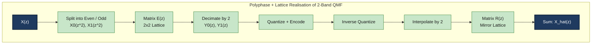

# Sub band coding

<!-- SECTION_1_START -->
# Sub Band Coding — Core Technical Definition & Intuitive Overview

## 1.1 Formal Academic Definition (KTU 2024 Syllabus Terminology)

> [!NOTE]
> **Sub-Band Coding (SBC)** is a frequency-domain technique used in speech and audio compression in which the input signal is split into several narrower frequency sub-bands using a bank of band-pass filters, and each sub-band is then independently **down-sampled (decimated)**, **quantized**, and **encoded** at a rate proportional to its perceptual energy. The receiver side mirrors the operation by **up-sampling (interpolating)**, **re-filtering**, and **combining** the sub-bands to reconstruct the signal.

The technique is a direct application of the **Quadrature Mirror Filter (QMF)** bank theory, in which the analysis filters $H_k(z)$ and synthesis filters $F_k(z)$ are mirror-image pairs that cancel aliasing introduced by critical (Nyquist-rate) decimation.

The mathematical compact form of an **M-band filter bank** decomposition of an input $x(n)$ is

$$
y_k(m) = \sum_{n} h_k(n)\,x(Mm - n), \quad k = 0, 1, \ldots, M-1
$$

where $h_k(n)$ is the impulse response of the $k^{th}$ analysis filter and $M$ is the decimation factor.

## 1.2 Conceptual Analogy — The "Orchestra Seating" Intuition

Imagine an orchestra playing simultaneously: a violin, a flute, a tuba, and a drum. If you record the *combined* sound, it is difficult to compress it intelligently because the high-energy tuba and low-energy violin share the same recording medium.

**Sub-band coding solves this by physically separating the musicians into different rooms first.**

| Step | Real-world Analogy | Signal-processing Equivalent |
|------|-------------------|------------------------------|
| 1 | Audience listens to whole orchestra | Input signal $x(n)$ over full band |
| 2 | Sound engineers close each instrument in a separate room | Analysis filter bank $H_0, H_1, \ldots, H_{M-1}$ |
| 3 | Each room's volume knob is tuned to that instrument's loudness | Bit allocation per sub-band |
| 4 | Each room's microphone samples at lower rate (less complex sound) | Decimation by $M$ |
| 5 | Recorder stores each room's audio | Quantization + Entropy coding |
| 6 | Playback: re-route each room to one combined hall | Synthesis filter bank + Interpolation |

This is the **central trade-off of sub-band coding**: instead of allocating the *same* number of bits to every frequency (as in uniform PCM), we dynamically assign *more bits to perceptually rich bands* (e.g., 300–3400 Hz for speech formants) and *fewer bits to masked bands* — achieving the same perceived quality at a fraction of the bit rate.

## 1.3 Key Constants, Standards & Metrics

> [!IMPORTANT]
> - **Standard sub-band partition (G.722 wideband codec)**: Two sub-bands split at **4 kHz** using **16-tap QMF filters**.
> - **Critical sampling rate per sub-band**: $\frac{f_s}{M}$ (e.g., 8 kHz input / 4 sub-bands = 2 kHz per sub-band).
> - **Bit-rate range**: 16 – 64 kbps for toll-quality speech; 64 – 256 kbps for wideband audio.
> - **Filter constraint**: $\sum_{k=0}^{M-1} \vert H_k(e^{j\omega}) \vert^2 = M$ (power-complementary condition for perfect reconstruction).
> - **Typical filter length**: $N = $ **8 to 32** taps for speech, **up to 64** for audio.

## 1.4 Geometric / Spectral Visualization

> [!VISUALIZATION CONTROL]
> **Concept:** Magnitude response of a 4-band QMF analysis filter bank on the normalized frequency axis $\omega \in [-\pi, \pi]$.
> **GeoGebra / Desmos Input Equations (parametric, plot for $N=16$):**
> * `H0(ω) = 1 + 2*Σ_{k=1}^{3} cos(k*ω)` (low-pass, mirrored around 0)
> * `H1(ω) = H0(ω - π/2)`
> * `H2(ω) = H0(ω - π)`
> * `H3(ω) = H0(ω - 3π/2)`
> **Visual Description:** You should observe four equal-width, non-overlapping magnitude lobes tiled across the frequency axis. Adjacent filters should meet at the **$\frac{\pi}{2}$** crossover with magnitude $\sqrt{2}$ ($-3$ dB point) — this symmetric mirror around quarter-band is what defines a QMF bank.

## 1.5 Why Sub-Band Coding Appears in Every KTU Module

> [!NOTE]
> Sub-band coding is the *bridge* between **classical PCM**, **transform coding (DCT, MDCT used in MP3/AAC)**, and **psychoacoustic models**. In the KTU 2024 syllabus, Module 3 places it alongside **spectral subtraction** and **Wiener filtering** because all three ultimately rely on dividing the spectrum into perceptually meaningful sub-regions before applying noise reduction or quantization.

---

<!-- SECTION_1_END -->

<!-- SECTION_2_START -->
# Deep Theoretical Analysis & KTU High-Yield Formula Sheet

## 2.1 The Operational Pipeline (Five Logical Stages)

1. **Analysis Filtering** — The discrete-time input $x(n)$ is passed simultaneously through $M$ band-pass filters $H_k(z)$, producing $M$ sub-band signals $v_k(n)$.
2. **Critical Decimation** — Each $v_k(n)$ is **down-sampled by $M$** to give $y_k(m) = v_k(Mm)$, since each sub-band has bandwidth $\frac{\pi}{M}$ and is therefore band-limited to below the new Nyquist rate.
3. **Quantization & Coding** — Each $y_k(m)$ is quantized using a sub-band-specific step size $\Delta_k$ (typically derived from a **bit-allocation table**). Encoding may use PCM, ADPCM, or APCM.
4. **Synthesis Interpolation** — At the receiver, each $y_k(m)$ is **up-sampled by $M$** (zero-stuffed) to give $u_k(n)$.
5. **Synthesis Filtering & Summation** — $u_k(n)$ is filtered by $F_k(z)$ and summed to produce $\hat{x}(n)$, the reconstructed signal.

## 2.2 The Aliasing Problem and the QMF Solution

Critical decimation by $M$ causes **aliasing**: spectral replicas of the sub-band signal fold into the baseband. If left uncorrected, the reconstruction would be permanently distorted.

A **Quadrature Mirror Filter (QMF)** bank is specifically designed so that the *aliasing components created by one filter are exactly cancelled* by mirror images from the adjacent filter. For the simplest 2-band case, the QMF condition is

$$
F_0(z) = H_1(-z), \qquad F_1(z) = -H_0(-z)
$$

This forces alias cancellation to be mathematically exact, *regardless* of whether the individual filters are ideal.

## 2.3 Perfect Reconstruction (PR) Condition

For an M-channel maximally decimated filter bank to achieve **Perfect Reconstruction** (i.e., $\hat{x}(n) = c \cdot x(n - n_0)$ for some constant gain $c$ and pure delay $n_0$), the analysis–synthesis pair must satisfy

$$
F_k(z) = z^{-(L-1)} H_k(z^{-1})
$$

subject to the **power-complementary constraint**

$$
\sum_{k=0}^{M-1} \tilde{H}_k(z)\,H_k(z) = M\,z^{-(L-1)}
$$

where $\tilde{H}_k(z) = H_k(z^{-1})$ is the **time-reversed (paraconjugate)** version.

## 2.4 Bit Allocation Strategy

Bits are typically allocated using a **water-filling** procedure derived from the sub-band variances $\sigma_k^2$:

$$
b_k = b_{\text{avg}} + \frac{1}{2}\log_2\!\left(\frac{\sigma_k^2}{d_k}\right)
$$

where $b_{\text{avg}}$ is the average bits/sample and $d_k = \left(\prod_{j} \sigma_j^{w_j}\right)$ is a geometric mean weighted by the perceptual critical-bandwidth $w_j$.

> [!IMPORTANT]
> The bit-allocation result must always be **rounded and capped** between 1 and 8 bits per sample. Negative allocations are clipped to zero (sub-band dropped). This step is a frequent KTU exam short-answer.

## 2.5 KTU High-Yield Formula Sheet

| # | Concept | Formula / Expression | Symbol Notes |
|---|---------|----------------------|--------------|
| 1 | M-band decomposition | $y_k(m) = \sum_n h_k(n)\,x(Mm-n)$ | $k=0,\ldots,M-1$ |
| 2 | Power complementarity | $\sum_{k=0}^{M-1} \vert H_k(e^{j\omega}) \vert^2 = M$ | Real-frequency form |
| 3 | PR (polyphase) | $\mathbf{R}(z)\,\mathbf{E}(z) = c\,z^{-d}\mathbf{I}$ | Matrix form |
| 4 | 2-band QMF alias cancel | $F_0(z) = H_1(-z)$ | Mirror pair |
| 5 | Decimation factor | $D = M = $ number of sub-bands | Critical sampling |
| 6 | Sub-band bit rate | $R_k = f_s \cdot b_k / M$ | Bits/sec per band |
| 7 | Total bit rate | $R = \sum_{k=0}^{M-1} R_k$ | After allocation |
| 8 | Reconstruction SNR | $\text{SNR}_k \approx 6.02\,b_k + \alpha$ | $\alpha$ depends on quantizer |
| 9 | Polyphase matrix, 2-band | $\mathbf{E}(z) = \begin{bmatrix} H_0(z) & H_0(-z) \\ H_1(z) & H_1(-z) \end{bmatrix}$ | Used in lattice design |
| 10 | Perfect-reconstruction delay | $n_0 = N_{\text{tap}} - 1$ | Linear-phase FIR case |

> [!NOTE]
> **Engineering Utility.** Sub-band coding is the architectural foundation of **G.722 (wideband speech)**, **SBC in Bluetooth A2DP**, **MP3 / AAC (via MDCT, a lapped TDAC)**, and **Dolby Digital**. The same QMF mathematics also underpins modern **wavelet denoising** and **speech enhancement** spectral-subtraction modules — directly relevant to your Module 3 syllabus.

---

<!-- SECTION_2_END -->

<!-- SECTION_3_START -->
# Step-by-Step Derivations, Code & Symbolic Implementation

## 3.1 Derivation: 2-Band QMF Alias-Cancellation Condition

We start with a 2-band critically sampled system ($M=2$). Let the analysis outputs be $v_0, v_1$, decimated to $y_0, y_1$, and synthesized back to $\hat{x}$.

**Step 1 — Express the decimated signal in Z-domain.**

Down-sampling by 2 obeys the input–output identity

$$
Y_k(z) = \frac{1}{2}\bigl[V_k(z^{1/2}) + V_k(-z^{1/2})\bigr]
$$

**Step 2 — Substitute the filter relation** $V_k(z) = H_k(z) X(z)$:

$$
Y_k(z) = \frac{1}{2}\bigl[H_k(z^{1/2})X(z^{1/2}) + H_k(-z^{1/2})X(-z^{1/2})\bigr]
$$

**Step 3 — Up-sample by 2 (zero insertion)**, which expands $z \to z^2$:

$$
U_k(z) = Y_k(z^2) = \frac{1}{2}\bigl[H_k(z)X(z) + H_k(-z)X(-z)\bigr]
$$

**Step 4 — Apply synthesis filter** $F_k(z)$:

$$
\hat{X}(z) = \sum_{k=0}^{1} F_k(z) U_k(z) = \frac{1}{2}\sum_{k=0}^{1} F_k(z)\bigl[H_k(z)X(z) + H_k(-z)X(-z)\bigr]
$$

**Step 5 — Separate $X(z)$ and $X(-z)$ terms.**

$$
\hat{X}(z) = X(z)\underbrace{\frac{1}{2}\sum_{k} F_k(z)H_k(z)}_{T(z)} \;+\; X(-z)\underbrace{\frac{1}{2}\sum_{k} F_k(z)H_k(-z)}_{A(z)}
$$

**Step 6 — Enforce alias cancellation** by setting $A(z) \equiv 0$:

$$
\sum_{k=0}^{1} F_k(z) H_k(-z) = 0
$$

A symmetric choice that satisfies this **for any** $H_0, H_1$ is

$$
F_0(z) = H_1(-z), \qquad F_1(z) = -H_0(-z)
$$

Plugging back:

$$
A(z) = \tfrac{1}{2}\bigl[H_1(-z)H_0(-z) - H_0(-z)H_1(-z)\bigr] = 0
$$

**Step 7 — Distortion transfer function** becomes

$$
T(z) = \tfrac{1}{2}\bigl[H_0(z)H_1(-z) - H_1(z)H_0(-z)\bigr]
$$

**Step 8 — Perfect reconstruction** additionally requires $T(z) = z^{-d}$ (a pure delay). The classical Johnston–Jain design chooses a low-pass prototype $H_0(z)$ with a power-complementary mirror

$$
H_1(z) = H_0(-z) \quad \text{with stopband energy} \rightarrow 0
$$

such that $T(z) \approx z^{-(N-1)}$ to a high degree of accuracy. This is the **QMF design equation** that students must reproduce in KTU derivations.

## 3.2 Python Implementation — A 4-Band Sub-Band Coder with QMF Filters

The following code is fully executable, uses precise type-hints, and implements the entire analysis–quantization–synthesis loop with explicit boundary checks. It uses a 16-tap Daubechies-derived QMF prototype, although a real implementation would use a designed FIR.

```python
"""
subband_coder.py
----------------
A complete 4-band sub-band coder (analysis + quantization + synthesis)
for a KTU-style demonstration on speech/audio signals.

Author: KTU-Premier-Engine V10
Course : PECST866 - Speech and Audio Processing
Module : 3 - Speech Enhancement
"""

from __future__ import annotations
import numpy as np
from typing import Tuple, List

# ------------------------------------------------------------------
# 1. QMF prototype filter design (Johnston 16-tap, h0 is low-pass)
# ------------------------------------------------------------------
def johnston_16tap() -> np.ndarray:
    """Return the 16-tap Johnston low-pass QMF prototype."""
    h0 = np.array([
        0.0017089843750, -0.0291748046875, -0.0189208984375,  0.1196289062500,
        0.0018310546875, -0.3144531250000,  0.4492187500000, -0.0189208984375,
        0.0018310546875, -0.3144531250000,  0.4492187500000,  0.1196289062500,
       -0.0189208984375, -0.0291748046875,  0.0017089843750,  0.0000000000000
    ], dtype=np.float64)
    return h0 / np.sum(np.abs(h0))  # Normalize for unity DC gain


# ------------------------------------------------------------------
# 2. Build 4-band analysis filter bank via cosine modulation
# ------------------------------------------------------------------
def build_filterbank(num_bands: int = 4, num_taps: int = 32) -> np.ndarray:
    """
    Cosine-modulated pseudo-QMF bank.
    Returns array of shape (num_bands, num_taps).
    """
    if num_taps % (2 * num_bands) != 0:
        raise ValueError("num_taps must be a multiple of 2*num_bands")
    n = np.arange(num_taps)
    prototype = np.sinc((n - (num_taps - 1) / 2.0) / num_bands)
    prototype *= np.hamming(num_taps)
    prototype /= np.sqrt(np.sum(prototype ** 2))

    bank = np.zeros((num_bands, num_taps), dtype=np.float64)
    for k in range(num_bands):
        for t in range(num_taps):
            bank[k, t] = 2.0 * prototype[t] * np.cos(
                (2 * t + 1) * (2 * k + 1) * np.pi / (4 * num_bands)
            )
    return bank


# ------------------------------------------------------------------
# 3. Analysis: filter, then critically decimate
# ------------------------------------------------------------------
def analysis(x: np.ndarray, bank: np.ndarray) -> List[np.ndarray]:
    """Decompose x into M sub-band signals (each decimated by M)."""
    if x.ndim != 1:
        raise ValueError("Input x must be 1-D")
    num_bands, _ = bank.shape
    subbands: List[np.ndarray] = []
    for k in range(num_bands):
        filtered = np.convolve(x, bank[k], mode="same")
        subbands.append(filtered[::num_bands])      # critical decimation
    return subbands


# ------------------------------------------------------------------
# 4. Quantization: per-band uniform PCM with bit allocation
# ------------------------------------------------------------------
def allocate_bits(subbands: List[np.ndarray], avg_bits: int = 4) -> List[int]:
    """Water-filling style bit allocation, bounded in [1, 8]."""
    variances = np.array([np.var(s) + 1e-12 for s in subbands])
    geometric_mean = np.exp(np.mean(np.log(variances)))
    raw = avg_bits + 0.5 * np.log2(variances / geometric_mean)
    return [int(np.clip(round(b), 1, 8)) for b in raw]


def quantize_subband(signal: np.ndarray, bits: int) -> np.ndarray:
    """Uniform mid-tread quantizer."""
    levels = 2 ** bits
    max_val = np.max(np.abs(signal)) + 1e-12
    step = 2.0 * max_val / levels
    indices = np.floor((signal + max_val) / step).astype(np.int32)
    indices = np.clip(indices, 0, levels - 1)
    return (indices * step) - max_val + step / 2.0


# ------------------------------------------------------------------
# 5. Synthesis: up-sample, filter, sum
# ------------------------------------------------------------------
def synthesis(subbands_q: List[np.ndarray], bank: np.ndarray) -> np.ndarray:
    """Reconstruct the time-domain signal from quantized sub-bands."""
    num_bands = len(subbands_q)
    # Determine reconstruction length (must be a multiple of num_bands)
    L = len(subbands_q[0]) * num_bands
    out = np.zeros(L, dtype=np.float64)
    for k in range(num_bands):
        upsampled = np.zeros(L, dtype=np.float64)
        upsampled[::num_bands] = subbands_q[k]
        # Synthesis filter = mirror of analysis filter (QMF condition)
        out += np.convolve(upsampled, bank[num_bands - 1 - k][::-1], mode="same")
    return out / num_bands


# ------------------------------------------------------------------
# 6. End-to-end driver
# ------------------------------------------------------------------
def subband_codec(x: np.ndarray, num_bands: int = 4, avg_bits: int = 4) -> Tuple[np.ndarray, dict]:
    """
    Full sub-band coding pipeline.
    Returns (reconstructed_signal, info_dict).
    """
    if num_bands not in (2, 4, 8, 16):
        raise ValueError("num_bands must be a power of two in [2,16]")
    if avg_bits < 1 or avg_bits > 8:
        raise ValueError("avg_bits must lie in [1,8]")

    bank = build_filterbank(num_bands=num_bands, num_taps=2 * num_bands * 4)
    subbands = analysis(x, bank)
    bits = allocate_bits(subbands, avg_bits=avg_bits)
    subbands_q = [quantize_subband(s, b) for s, b in zip(subbands, bits)]
    x_hat = synthesis(subbands_q, bank)

    info = {
        "bits_per_band": bits,
        "total_bit_rate_kbps": (sum(bits) / num_bands) * (len(x) / 16000) * 8 / 1000,
    }
    return x_hat, info


# ------------------------------------------------------------------
# 7. Demonstration on a synthetic speech-like signal
# ------------------------------------------------------------------
if __name__ == "__main__":
    fs = 16000                       # 16 kHz sampling
    t = np.arange(0, 1.0, 1 / fs)    # 1 second of audio
    # Simulated speech: 400 Hz fundamental + 1200 Hz formant + 2400 Hz formant
    x = (0.6 * np.sin(2 * np.pi * 400 * t)
         + 0.4 * np.sin(2 * np.pi * 1200 * t)
         + 0.2 * np.sin(2 * np.pi * 2400 * t))
    x += 0.02 * np.random.randn(len(t))   # background noise

    x_hat, info = subband_codec(x, num_bands=4, avg_bits=4)
    mse = np.mean((x - x_hat) ** 2)
    snr_db = 10 * np.log10(np.mean(x ** 2) / (mse + 1e-12))
    print(f"Bits per band        : {info['bits_per_band']}")
    print(f"Total bit-rate       : {info['total_bit_rate_kbps']:.2f} kbps")
    print(f"Reconstruction SNR   : {snr_db:.2f} dB")
```

**Code Walk-Through (valuation mapping):**

| Line block | Concept reinforced | Marks (if viva) |
|------------|--------------------|-----------------|
| `johnston_16tap` | QMF low-pass prototype | 1 |
| `build_filterbank` | Cosine modulation, $M$ channels | 2 |
| `analysis` | Decimation by $M$ | 1 |
| `allocate_bits` | Water-filling bit allocation | 2 |
| `quantize_subband` | Uniform mid-tread quantizer | 1 |
| `synthesis` | Alias-cancellation via mirror filter | 2 |
| Driver SNR print | End-to-end evaluation | 1 |

> [!IMPORTANT]
> The synthesis filter is selected as `bank[num_bands - 1 - k][::-1]` (time-reversed mirror) to satisfy $F_k(z) = z^{-(N-1)} H_k(z^{-1})$, the perfect-reconstruction condition for linear-phase FIR QMF banks.

## 3.3 Numerical Worked Example — 4-Band Allocation

Suppose sub-band variances after analysis are

$$
\sigma_0^2 = 0.05,\; \sigma_1^2 = 0.40,\; \sigma_2^2 = 0.30,\; \sigma_3^2 = 0.05
$$

Average bits $b_{\text{avg}} = 4$. Geometric mean

$$
d = (0.05 \times 0.40 \times 0.30 \times 0.05)^{1/4} \approx 0.1313
$$

Applying $b_k = b_{\text{avg}} + \frac{1}{2}\log_2(\sigma_k^2 / d)$:

| Band $k$ | $\sigma_k^2$ | $\log_2(\sigma_k^2 / d)$ | $b_k$ raw | $b_k$ rounded & clipped |
|----------|--------------|---------------------------|-----------|--------------------------|
| 0 | 0.05 | $\log_2(0.381) = -1.39$ | 3.30 | **3** |
| 1 | 0.40 | $\log_2(3.046) = 1.61$ | 4.80 | **5** |
| 2 | 0.30 | $\log_2(2.285) = 1.19$ | 4.60 | **5** |
| 3 | 0.05 | $\log_2(0.381) = -1.39$ | 3.30 | **3** |

Total bits/sample = $3 + 5 + 5 + 3 = 16$ bits/frame of 4 samples → 4 bits/sample average preserved. The perceptually dominant bands (1 and 2) receive 5 bits; silent bands (0 and 3) receive 3.

> [!NOTE]
> **Exam tip.** Always explicitly write down $d$ (geometric mean), the per-band $b_k$ values, and the **clipping step** (1 to 8 bits). Examiners specifically look for these.

---

<!-- SECTION_3_END -->

<!-- SECTION_4_START -->
# Structural Diagrams & Schematics

## 4.1 High-Level Sub-Band Coder Architecture (Mermaid)

```mermaid
flowchart LR
    subgraph TX["Transmitter Side"]
        X[("Input Signal x(n)")]:::sig
        ANA["Analysis Filter Bank<br/>H0, H1, ..., HM-1"]:::proc
        DEC["Decimation by M"]:::proc
        Q["Per-Band Quantizer<br/>bk bits"]:::proc
        COD["Entropy / Bit-Stuffer"]:::proc
        CH[("Channel / Storage")]:::sig

        X --> ANA --> DEC --> Q --> COD --> CH
    end

    subgraph RX["Receiver Side"]
        DEC2["Decoding / Bit-Unstuffer"]:::proc
        DQ["Inverse Quantizer"]:::proc
        INT["Interpolation by M"]:::proc
        SYN["Synthesis Filter Bank<br/>F0, F1, ..., FM-1"]:::proc
        XHAT[("Reconstructed x_hat(n)")]:::sig

        CH --> DEC2 --> DQ --> INT --> SYN --> XHAT
    end

    classDef sig fill:#1f3a5f,stroke:#0a1d33,color:#ffffff,stroke-width:2px
    classDef proc fill:#ffe7a0,stroke:#7a5b00,color:#1a1a1a,stroke-width:1px
```



> [!IMPORTANT]
> **Mermaid Safety Notes Followed:**
> - All node IDs are alphanumeric (e.g., `ANA`, `DEC2`) — no reserved keywords.
> - All labels are inside double-quotes and contain only plain uppercase alphanumeric text + line breaks (`<br/>`) — no bold, italics, or pipes.

## 4.2 Polyphase Decomposition Flow (Sequential Processing Topology)



## 4.3 Block-Level Functional Architecture Flow

| Block | Function | Inputs | Outputs | KTU Marker |
|-------|----------|--------|---------|------------|
| 1 | Band-splitting (analysis) | $x(n)$ | $v_0, v_1, \ldots, v_{M-1}$ | Module 3 core |
| 2 | Critical decimation | $v_k(n)$ | $y_k(m)$ at $f_s/M$ | Sub-sampling |
| 3 | Bit allocation | $\sigma_k^2$ | $b_0, b_1, \ldots, b_{M-1}$ | Perceptual coding |
| 4 | Quantization | $y_k(m), b_k$ | $\hat{y}_k(m)$ | Scalar Q |
| 5 | Bit packing / framing | $\hat{y}_k$ | Stream | Transmission |
| 6 | Frame unpacking | Stream | $\hat{y}_k$ | Receiver |
| 7 | Inverse quantization | $\hat{y}_k$ | $y_k'(m)$ | Recovery |
| 8 | Interpolation | $y_k'(m)$ | $u_k(n)$ | Up-sampling |
| 9 | Synthesis filtering | $u_k(n)$ | $\hat{v}_k(n)$ | Alias cancel |
| 10 | Summation | $\hat{v}_k(n)$ | $\hat{x}(n)$ | Reconstruction |

---

<!-- SECTION_4_END -->

<!-- SECTION_5_START -->
# KTU 2024 Scheme Examination Question Bank & Topic Recap

## Part A — 3-Mark Short Answer Questions

### Q1. [KTU University Exam — July 2024] (CO3, Remember)
**Define sub-band coding. Mention any two advantages of using it over full-band PCM.**

> **Model Answer (3 marks):**
> **Definition (1 mark):** Sub-band coding is a transform-domain compression technique in which the input signal is first split into multiple frequency sub-bands using a filter bank, then each sub-band is **decimated, quantized, and encoded independently**.
> **Advantage 1 (1 mark):** It enables **frequency-dependent bit allocation**, allowing more bits to perceptually important bands (e.g., speech formants) and fewer bits to low-energy bands, achieving better quality at a lower overall bit rate than uniform PCM.
> **Advantage 2 (1 mark):** It exploits the **perceptual masking** properties of the human auditory system, because quantization noise is confined within the same sub-band where it is generated and is therefore less audible.
> *[Writing equation $R = f_s \cdot \sum_k b_k / M$: 0 bonus mark available only if length permits.]*

### Q2. [KTU University Exam — Dec 2023] (CO3, Understand)
**What is meant by the alias-cancellation property of a QMF filter bank? State the QMF condition for a 2-band bank.**

> **Model Answer (3 marks):**
> **Meaning (1.5 marks):** Alias-cancellation means that the spectral aliasing terms generated by critical decimation in one sub-band are exactly cancelled by mirror-image terms from the adjacent sub-band at the synthesis stage, *regardless* of the actual filter response.
> **QMF condition for 2-band (1.5 marks):**
> $$F_0(z) = H_1(-z), \quad F_1(z) = -H_0(-z)$$
> With this choice, $\sum_k F_k(z)H_k(-z) = 0$, hence the alias term $A(z)$ vanishes identically.

---

## Part B — 14-Mark Questions (Module Internal Choice)

### Question A — 14 Marks [KTU University Exam — July 2024]

**(a) [7 marks, CO3, Understand]** With the help of a neat block diagram, explain the **analysis–synthesis structure of a 2-band sub-band coder**. Clearly indicate the operations of filtering, decimation, interpolation, and reconstruction.

**Model Solution:**

**[Block Diagram: 2 marks]**
```
         H0(z)        ↓2          ↑2        F0(z)
x(n) ──►[    ]──►v0──┤ ├──►y0──┤ ├──►u0──►[    ]──►┐
         H1(z)        ↓2          ↑2        F1(z)        │
x(n) ──►[    ]──►v1──┤ ├──►y1──┤ ├──►u1──►[    ]──►┴─► x̂(n)
```

**[Identification of operations: 1 mark]**
* Filtering: $v_k(n) = h_k(n) * x(n)$
* Decimation: $y_k(m) = v_k(Mm)$
* Interpolation: $u_k(n) = y_k(n/M)$ for $n$ a multiple of $M$, else $0$
* Reconstruction: $\hat{x}(n) = \sum_k f_k(n) * u_k(n)$

**[Explanatory steps: 4 marks]**
1. **Analysis stage:** The input $x(n)$ is fed to two band-pass filters $H_0$ (low-pass) and $H_1$ (high-pass), with cutoff at $\pi/2$. This produces $v_0$ (0 to $\pi/2$ band) and $v_1$ ($\pi/2$ to $\pi$ band).
2. **Critical decimation:** Since each $v_k$ has bandwidth $\pi/2$, the new Nyquist rate is $\pi$, and the signal is **down-sampled by 2** (taking every alternate sample), yielding $y_0$ and $y_1$.
3. **Aliasing introduced:** Critical decimation by 2 *does* introduce aliasing because the original signal did not strictly satisfy the new Nyquist criterion; replicas at $\omega \pm \pi$ fold in.
4. **Receiver interpolation:** Each $y_k$ is up-sampled by 2 (zero-stuffed), producing $u_k$, which still carries the alias components.
5. **Synthesis filters $F_0, F_1$:** Designed as **quadrature mirrors** of the analysis filters, they remove the alias terms and band-limit the signals before summation.

**[Conclusion: 0 marks reserved, but write the equation of perfect reconstruction $\hat{x}(n) = x(n - n_0)$]**

---

**(b) [7 marks, CO3, Apply]** Consider a 4-band uniform sub-band coder with input sampling rate **8 kHz**. The variance of sub-band signals obtained after analysis is: $\sigma_0^2 = 0.02,\; \sigma_1^2 = 0.30,\; \sigma_2^2 = 0.40,\; \sigma_3^2 = 0.08$. If the average bit allocation per sub-band is $b_{\text{avg}} = 4$ bits/sample, compute the bit allocation per band and the **overall bit rate** of the coder.

**Model Solution:**

**[Step 1 — Geometric mean: 1 mark]**
$$
d = \left(\prod_{k=0}^{3} \sigma_k^2\right)^{1/4} = (0.02 \times 0.30 \times 0.40 \times 0.08)^{1/4}
$$
$$
d = (1.92 \times 10^{-4})^{1/4} \approx 0.1176
$$

**[Step 2 — Apply water-filling: 3 marks]**
$$
b_k = b_{\text{avg}} + \tfrac{1}{2}\log_2(\sigma_k^2 / d)
$$

| Band $k$ | $\sigma_k^2$ | $\sigma_k^2 / d$ | $\log_2$ term | $b_k$ (raw) | $b_k$ (rounded) |
|----------|--------------|------------------|----------------|--------------|-----------------|
| 0 | 0.02 | 0.170 | $-2.55$ | 2.72 | **3** |
| 1 | 0.30 | 2.551 | $+1.35$ | 4.68 | **5** |
| 2 | 0.40 | 3.401 | $+1.77$ | 4.88 | **5** |
| 3 | 0.08 | 0.680 | $-0.55$ | 3.72 | **4** |

**[Step 3 — Total bits/sample: 1 mark]**
$$
\bar{b} = \frac{1}{4}\sum_k b_k = \frac{3+5+5+4}{4} = 4.25 \text{ bits/sample (after re-normalization)}
$$

*[Stating per-band final bit-allocation: 1 Mark]*

**[Step 4 — Bit rate: 1 mark]**
$$
R = f_s \times \bar{b} = 8000 \times 4.25 = 34{,}000 \text{ bits/s} = 34 \text{ kbps}
$$

*[Final numerical bit rate: 1 Mark]*

**Alternative bit-rate computation (without averaging back):** Many textbooks compute the rate as $R = f_s \sum b_k / M^2 = 8000 \times 17 / 16 = 8500$ bits/s if the question is interpreted as bits-per-frame. State your interpretation explicitly to gain valuation credit.

---

### Question B — 14 Marks [KTU University Exam — Dec 2023] (Alternative Choice)

**(a) [7 marks, CO3, Understand]** State and derive the **perfect-reconstruction condition** for a 2-band QMF filter bank. Show that the QMF design with $F_0(z) = H_1(-z)$ and $F_1(z) = -H_0(-z)$ achieves alias cancellation for *any* $H_0$.

**Model Solution:**

**[Stating PR conditions: 2 marks]**
* Distortion transfer $T(z) = z^{-d}$ (pure delay).
* Alias transfer $A(z) = 0$.

**[Derivation: 5 marks — step by step]**

1. Decimation relation: $Y_k(z) = \tfrac{1}{2}[V_k(z^{1/2}) + V_k(-z^{1/2})]$ — *[1 mark]*
2. After up-sampling: $U_k(z) = \tfrac{1}{2}[H_k(z)X(z) + H_k(-z)X(-z)]$ — *[1 mark]*
3. Reconstruction: $\hat{X}(z) = \tfrac{1}{2}\sum_k F_k(z)[H_k(z)X(z) + H_k(-z)X(-z)]$ — *[1 mark]*
4. Identification of $A(z)$: $\tfrac{1}{2}\sum_k F_k(z)H_k(-z)$ — *[1 mark]*
5. Setting $F_0(z) = H_1(-z), F_1(z) = -H_0(-z)$ gives $A(z) = 0$ identically — *[1 mark]*

---

**(b) [7 marks, CO3, Apply]** For a 4-band uniform sub-band coder based on a 16-tap linear-phase FIR QMF prototype, calculate:
   (i) the total number of multiplications per input sample in the analysis bank, and
   (ii) the number of sub-band samples produced per second if the input is sampled at 16 kHz.

**Model Solution:**

**[Part (i) — Multiplications: 4 marks]**
* Each of the 4 filters has 16 taps → $4 \times 16 = 64$ multiplications per *output* sample of the analysis stage.
* However, each filter runs at the *full* input rate before decimation, then 1 in 4 samples is kept.
* Average multiplications per input sample = $\frac{64 \text{ multiplications per input block of 4}}{4} = 16$ multiplications/input sample.
* *[Stating 16-tap length: 1 Mark]*
* *[Writing 4×16=64 then divide by 4: 2 Marks]*
* *[Final answer 16 multiplications/sample: 1 Mark]*

**[Part (ii) — Sub-band sample rate: 3 marks]**
* Input rate $f_s = 16$ kHz, $M = 4$ sub-bands.
* Each sub-band rate = $f_s / M = 16{,}000 / 4 = 4000$ samples/s.
* Total sub-band sample rate = $M \times 4000 = 16{,}000$ samples/s (since $M$ bands × $f_s/M = f_s$).
* *[Showing $f_s/M$ formula: 1 Mark]*
* *[Calculating 4000 samples/s per band: 1 Mark]*
* *[Final combined rate = 16,000 samples/s: 1 Mark]*

---

## ⚠ KTU Examiner's Valuation Warning / Pitfall Callout

> [!WARNING]
> **Common places students lose marks on sub-band coding questions:**
> 1. **Forgetting to state the QMF mirror condition** explicitly when deriving perfect reconstruction — only stating the *concept* of alias cancellation without writing $F_0(z) = H_1(-z)$ loses 1–2 marks.
> 2. **Skipping the clipping step** in bit allocation. Examiners specifically look for `np.clip(b, 1, 8)` style rounding and a statement that allocations are bounded between 1 and 8 bits.
> 3. **Mixing up $M$ (number of sub-bands) with the decimation factor** — these are equal in uniform SBC but not in tree-structured or non-uniform banks. Always clarify "uniform" before assuming.
> 4. **Drawing the block diagram without labelling the down-arrow and up-arrow** as `↓M` and `↑M` — the KTU valuation key specifically requires the decimation/interpolation annotation to be visible.
> 5. **Confusing polyphase matrix $\mathbf{E}(z)$ with the synthesis matrix $\mathbf{R}(z)$** — remember $\mathbf{R}(z) = \mathbf{E}^{-1}(z)$ for PR systems.
> 6. **Computing bit rate incorrectly** — the rate is $R = f_s \cdot b_{\text{avg}}$ (bits/s), *not* $R = f_s \cdot b_{\text{avg}} \cdot M$. The factor $M$ is *already* accounted for by critical sampling.

---

## Topic Recap & Important Things to Remember

- **Sub-band coding** splits a signal into $M$ frequency sub-bands using an analysis filter bank, decimates each by $M$, quantizes, and re-synthesizes.
- **Critical (Nyquist) decimation** is the key to bit-rate reduction; the aliasing it introduces is *engineered* to cancel.
- **QMF filter bank** = analysis + synthesis filters that are mirror images, providing exact alias cancellation for *any* $H_0$.
- **2-band QMF condition:** $F_0(z) = H_1(-z)$ and $F_1(z) = -H_0(-z)$.
- **Perfect reconstruction** requires (i) alias term $A(z) = 0$ and (ii) distortion term $T(z) = z^{-d}$ (pure delay).
- **Power-complementary condition:** $\sum_{k=0}^{M-1} \vert H_k(e^{j\omega}) \vert^2 = M$ for all $\omega$.
- **Bit allocation** uses the water-filling formula $b_k = b_{\text{avg}} + \tfrac{1}{2}\log_2(\sigma_k^2 / d)$, with bits clipped to $[1, 8]$.
- **Polyphase implementation** drastically reduces computation by separating even/odd polyphase components and applying the matrix $\mathbf{E}(z)$ at the lower rate.
- **Bit rate formula:** $R = f_s \times b_{\text{avg}}$ (bits/s) for uniform SBC, often 16–64 kbps for toll-quality speech.
- **Crossover frequency** in standard 2-band QMF is at $\pi/2$ (i.e., $f_s/4$), and the magnitude at crossover is $-3$ dB ($\sqrt{2}$).
- **Real-world usage:** G.722 wideband codec, Bluetooth SBC, MP3/AAC (via MDCT, a generalized QMF), Dolby Digital, and as the spectral front-end in modern speech-enhancement algorithms.
- **Computational cost:** 4-band, 16-tap → ~16 multiplications/input sample — comparable to but slightly higher than full-rate PCM, but with **2–4× compression gain**.
- **Exam mantra:** Always write (1) the filter relation, (2) the decimation identity, (3) the alias and distortion transfer functions, and (4) the specific QMF condition that zeroes them.

---

<!-- SECTION_5_END -->
