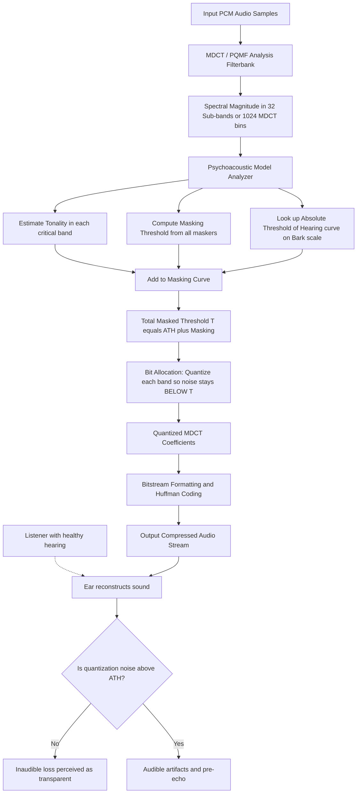
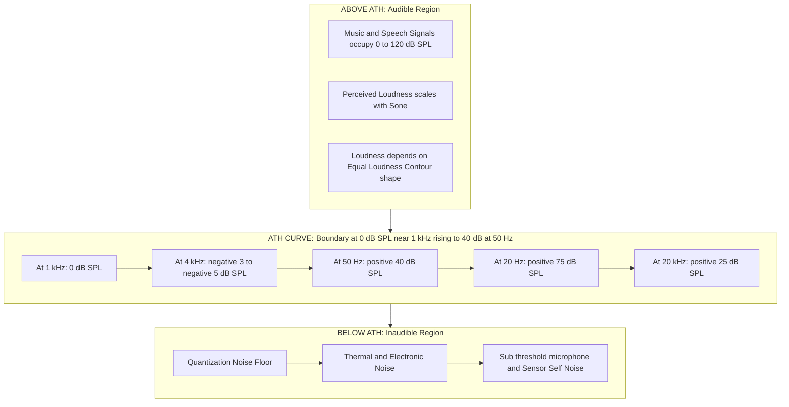
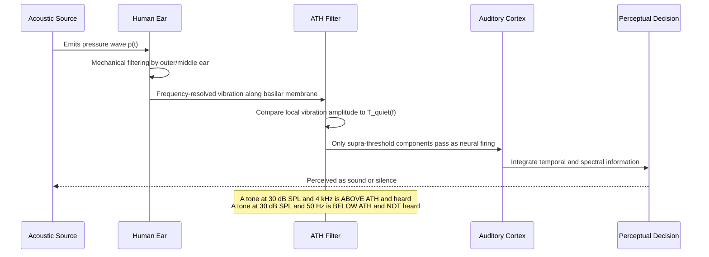

# Absolute Threshold of Hearing

<!-- SECTION_1_START -->
# Absolute Threshold of Hearing (ATH) — Core Definition & Intuitive Overview

## 1.1 Formal Academic Definition (KTU 2024 Syllabus Terminology)

> [!IMPORTANT]
> **Absolute Threshold of Hearing (ATH)**: The **minimum sound pressure level (SPL)** that a human listener with normal otological health can detect **50% of the time** in the absence of any other sound (i.e., in a quiet, anechoic environment). It represents the lower boundary of human auditory sensitivity across the audible frequency spectrum (typically **20 Hz to 20,000 Hz**).

In KTU 2024 *Speech and Audio Processing* (PECST866) terminology, ATH is formally defined as the **threshold in quiet** — the SPL-versus-frequency curve that demarcates inaudible sounds (below the curve) from audible sounds (above the curve). It serves as the **fundamental input to every psychoacoustic model** used in perceptual audio codecs (MP3, AAC, Ogg Vorbis) and is one of the first curves plotted in any audio engineering textbook.

The internationally accepted reference point is:

$$p_{\text{ref}} = 20 \, \mu\text{Pa} = 2 \times 10^{-5} \, \text{Pa}$$

This is the **RMS** sound pressure of a **1 kHz** pure tone just barely audible to a young, otologically normal listener, defined as **0 dB SPL**.

## 1.2 The Human Hearing Range (Spectral & Dynamic Span)

| Parameter | Lower Bound | Upper Bound |
| :--- | :--- | :--- |
| Frequency | **20 Hz** (deep bass) | **20,000 Hz** (20 kHz, high treble) |
| Sound Pressure | **0 dB SPL** (threshold of hearing) | **~120–130 dB SPL** (threshold of pain) |
| Dynamic Range | — | **~120 dB total span** |

## 1.3 Intuitive Analogy — The "Whisper-to-Jet" Sensitivity Spectrum

> [!NOTE]
> **Real-world analogy**: Imagine your ear is a finely tuned microphone. It must be able to pick up a **mosquito buzzing 3 meters away** (≈ 0 dB SPL at 1 kHz) AND survive the sound of a **jet engine 100 m away** (≈ 120 dB SPL). The **Absolute Threshold of Hearing** is the *quietest possible whisper* your ear can reliably detect. Below this whisper, the ear's internal "noise floor" (caused by Brownian motion of cochlear fluid and spontaneous neural firing) drowns out the signal. **At 1 kHz, the threshold is 0 dB SPL; but at 50 Hz, the same ear needs a sound ~40 dB louder** to detect it — because the cochlea is mechanically less efficient at the extreme ends of the audible band.

## 1.4 Conceptual Visualization of the ATH Curve

> [!VISUALIZATION CONTROL]
> **Concept:** Frequency-dependent Absolute Threshold of Hearing curve (Fletcher-Munson / ISO 226 family)
> **Plotting Parameters (you can recreate in GeoGebra or Desmos):**
> * `x`-axis: `f` in Hz (logarithmic, range 20 → 20,000)
> * `y`-axis: `ATH(f)` in dB SPL
> * Use the Terhardt analytic approximation: `ATH(f) ≈ 3.64·(f/1000)^(-0.8) − 6.5·exp(-0.6·(f/1000−3.3)^2) + 10^(-3·(f/1000)^2)` (in dB SPL)
> **Visual Description:** A U-shaped (or "bathtub") curve sitting above the x-axis. The curve **dips to its minimum (~ −5 to 0 dB SPL) between 2 kHz and 5 kHz** — the region of peak human hearing sensitivity. It **rises steeply** as frequency drops below 500 Hz (left wall) and as frequency exceeds 10 kHz (right wall). At 20 Hz, the threshold climbs to roughly **70–80 dB SPL**; at 20 kHz, it climbs to roughly **25–40 dB SPL** depending on listener age.

> [!TIP]
> **Why 2–4 kHz is the "sweet spot"**: This range corresponds to the natural resonance of the **ear canal** (which acts as a quarter-wave resonator peaking near 2.5–3 kHz) combined with the maximum mechanical gain of the **ossicular chain** in the **middle ear**. The evolutionary "design centre" of human hearing sits squarely in the band where **infant cries, speech consonants (S, T, K), and warning signals** carry their energy — a beautifully adapted survival trait.

## 1.5 Definition of the Decibel Scales Used With ATH

Since ATH is expressed in decibels, the two scales must be distinguished cleanly:

**Sound Pressure Level (SPL):**
$$L_p \;[\text{dB SPL}] = 20 \, \log_{10}\!\left(\frac{p_{\text{rms}}}{p_{\text{ref}}}\right), \quad p_{\text{ref}} = 20 \,\mu\text{Pa}$$

**Hearing Level (HL):** Used in audiology, defined such that **0 dB HL is the *average* ATH** of otologically normal young adults at each specific frequency (so 0 dB HL is *not* a fixed SPL — it varies with frequency).

<!-- SECTION_1_END -->

<!-- SECTION_2_START -->
# Deep Theoretical Analysis & KTU High-Yield Formula Sheet

## 2.1 Why the ATH is Frequency-Dependent — The Three-Stage Explanation

The ATH curve's shape emerges from **three cascaded physiological filters**:

### Stage 1 — Outer & Middle Ear Transfer Function
* The **pinna, ear canal, and ossicular chain (malleus, incus, stapes)** form a mechanical impedance-matching network. They amplify the pressure delivered to the cochlea by approximately **25–30 dB** in the 1–5 kHz band, with a smooth roll-off above and below.
* Net effect: The ATH is **lowest (most sensitive) in the 1–5 kHz band** and rises outside it.

### Stage 2 — Cochlear Mechanics (Basilar Membrane Tuning)
* The **basilar membrane** acts as a **bank of bandpass filters** (a *Fourier-like analyser*). Each point along its length is tuned to a characteristic frequency (CF) by the **organ of Corti** and the active amplification provided by the **outer hair cells (OHCs)**.
* At the **apex** (low frequencies, ~20–500 Hz) and **base** (high frequencies, ~10–20 kHz) of the membrane, the OHC gain is lower → higher threshold.
* The active process (cochlear amplifier) accounts for the exquisite **−5 to 0 dB SPL** sensitivity near 3 kHz.

### Stage 3 — Neural & Internal-Noise Floor
* **Spontaneous otoacoustic emissions (SOAE)** and thermal noise in the cochlear fluids set an **absolute physical floor** below which no transduction is possible.
* The combined noise floor defines the *zero-reference* 0 dB SPL at 1 kHz.

> [!IMPORTANT]
> **Engineering takeaway**: The ATH is **NOT a single number** — it is a **curve over frequency**. In any digital audio system (codec, noise-shaper, hearing aid, equalizer), the threshold is consulted *per critical band*, never as a flat constant.

## 2.2 The Equal-Loudness Contour Family (Fletcher–Munson → ISO 226)

The ATH is the **lowest member** of the family of **equal-loudness contours**. Each contour represents the SPL required for a pure tone to be perceived as *equally loud* across all frequencies.

| Contour | Perceived Loudness | Notes |
| :--- | :--- | :--- |
| **Minimum audible field (MAF)** | Just barely audible | **This is the ATH curve itself** |
| **30-phon contour** | 30 phons | A 30-phon tone at 1 kHz = 30 dB SPL, but at 50 Hz it requires ~90 dB SPL |
| **40-phon** | "Quiet library" | — |
| **60-phon** | "Normal conversation" | Used as calibration reference |
| **80-phon** | "Loud traffic" | — |
| **120-phon** | "Threshold of discomfort" | — |
| **130-phon** | "Threshold of pain" | Upper boundary of hearing |

> [!NOTE]
> **Phon** = a unit of *perceived* loudness level, defined so that at 1 kHz the phon value numerically equals the dB SPL value. A 1 kHz tone at 40 dB SPL is, by definition, **40 phons** loud.

## 2.3 Analytic Approximations to the ATH (Engineering Use)

In codecs and psychoacoustic models, the ATH is approximated by closed-form functions for computational efficiency. The two most common are:

### A. Terhardt's Analytic Approximation (1990)

$$ATH_T(f) \;[\text{dB SPL}] = 3.64 \left(\frac{f}{1000}\right)^{-0.8} - 6.5 \, e^{-0.6\left(\frac{f}{1000} - 3.3\right)^{2}} + 10^{-3 \left(\frac{f}{1000}\right)^{2}}$$

where $f$ is in **Hz**.

### B. ISO 226:2003 Tabular Form (with Terhardt fit)

Tabulated in 1/3-octave bands from 20 Hz to 12.5 kHz. The 1/3-octave smoothed "Free-Field Minimum Audible Pressure at the Eardrum" is the modern standardized form.

### C. Simplified MP3 / AAC Threshold (used in ISO 11172-3 / 13818-7)

A piece-wise linear curve in dB SPL vs. frequency, sampled at critical-band (Bark) centres. The masker-to-maskee threshold in MPEG codecs is built by:

$$T_{\text{quiet}}(z) = 3.64 \, (f(z)/1000)^{-0.8} - 6.5 \, e^{-0.6(f(z)/1000 - 3.3)^{2}} + 10^{-3(f(z)/1000)^{2}} \;\; [\text{dB SPL}]$$

where $f(z)$ is the centre frequency (in Hz) of Bark band $z$.

## 2.4 The KTU High-Yield Formula Sheet

> [!IMPORTANT]
> **Save this table — it covers 80% of numerical questions on ATH in KTU exams.**

| Symbol | Quantity | Formula / Definition | Units / Notes |
| :--- | :--- | :--- | :--- |
| $p_{\text{ref}}$ | Reference sound pressure | $p_{\text{ref}} = 20 \, \mu\text{Pa}$ | Pa — fixed by international convention |
| $L_p$ | Sound Pressure Level | $L_p = 20 \log_{10}(p_{\text{rms}} / p_{\text{ref}})$ | dB SPL |
| $L_I$ | Sound Intensity Level | $L_I = 10 \log_{10}(I / I_{\text{ref}})$ | dB SIL, $I_{\text{ref}} = 10^{-12}\,\text{W/m}^2$ |
| $f$ | Audible frequency range | $20 \le f \le 20{,}000$ | Hz |
| $ATH(f)$ | Threshold in quiet | Terhardt eqn. above | dB SPL |
| Phon | Perceived loudness level | Phon $= L_p(f=1\,\text{kHz})$ for an equally-loud tone | — |
| Sone | Perceived loudness | $S = 2^{(P-40)/10}$ where $P$ is phon | Linear loudness |
| $z$ | Critical-band rate (Bark) | $z(f) = 13 \arctan(0.00076 f) + 3.5 \arctan((f/7500)^{2})$ | Bark |
| $BW_{\text{CB}}(f)$ | Critical bandwidth | $BW_{\text{CB}} = 25 + 75(1 + 1.4 f^2 / 1000)^{0.69}$ | Hz |
| $\Delta f$ | Just-Noticiable-Difference (JND) in frequency | $\Delta f \approx 3.5\,\text{Hz}$ for $f \lesssim 500\,\text{Hz}$ | Hz |

## 2.5 Engineering Applications in Speech & Audio Processing

1. **Perceptual Audio Coding (MP3, AAC, Opus, Ogg Vorbis)** — Bits are allocated so that **quantization noise stays below the masked threshold (ATH + masking threshold from other components)**. Without ATH, codecs would waste bits encoding inaudible sounds.
2. **Hearing Aids** — Frequency-dependent gain is shaped to bring inaudible bands (where the patient's threshold is elevated) back into the audible window.
3. **Noise Shaping (Dithering in ΔΣ ADCs)** — Noise is spectrally shaped so that the noise floor stays just below the ATH where the listener is most sensitive.
4. **Loudness Meters (ITU-R BS.1770-4)** — Use equal-loudness contour data to weight frequency bands.
5. **Speech Intelligibility Models (Articulation Index, SII)** — Compute the proportion of speech energy that lies *above* the ATH in each band.
6. **Bone-Conduction & Audiometry** — Calibration of 0 dB HL at each audiometric frequency (250 Hz, 500 Hz, 1 kHz, 2 kHz, 4 kHz, 8 kHz) requires the ATH as the anchor.

> [!NOTE]
> **Production reality**: Every modern lossy audio encoder (Spotify, Apple Music, YouTube) embeds the ATH curve inside its psychoacoustic model. Reducing the bitrate from 320 kbps to 128 kbps is essentially "asking the codec to throw away anything hidden under the ATH + masking threshold — and as long as the quantization noise stays *under* that curve, the listener hears no loss."

<!-- SECTION_2_END -->

<!-- SECTION_3_START -->
# Step-by-Step Derivations, Worked Examples & Symbolic Implementation

## 3.1 Derivation: From Acoustic Pressure to dB SPL

The **decibel** is a logarithmic ratio. For acoustic pressure, it is defined as:

$$\text{BEL} = \log_{10}\!\left(\frac{p_{\text{rms}}}{p_{\text{ref}}}\right)$$

Since the bel is too large a unit for typical acoustic ranges, we use the **decibel** ($1\,\text{Bel} = 10\,\text{dB}$):

$$L_p \;[\text{dB}] = 10 \cdot \log_{10}\!\left(\frac{p_{\text{rms}}}{p_{\text{ref}}}\right)$$

> Wait — there is a **factor-of-2 subtlety**. Pressure is a *field quantity*; its square is proportional to *power*. Therefore the log-multiplying factor is **20** (not 10) when the ratio is in pressure units, and **10** when the ratio is in power/intensity units:
>
> $$L_p = 20 \log_{10}\!\left(\frac{p_{\text{rms}}}{p_{\text{ref}}}\right) \qquad \text{and} \qquad L_I = 10 \log_{10}\!\left(\frac{I}{I_{\text{ref}}}\right)$$

**Quick mnemonic**: *Pressure is squared to get power, so log of a square pulls out a factor of 2, giving 20 instead of 10.*

## 3.2 Worked Example 1 — Computing SPL of a Known Pressure

> **Question**: A sine tone produces an RMS pressure of $p_{\text{rms}} = 0.2\,\text{Pa}$ at the listener's eardrum. What is its SPL?

**Step 1 — Identify the reference pressure.**
$p_{\text{ref}} = 20 \, \mu\text{Pa} = 2 \times 10^{-5}\,\text{Pa}$.

**Step 2 — Form the dimensionless ratio.**
$$\frac{p_{\text{rms}}}{p_{\text{ref}}} = \frac{0.2}{2 \times 10^{-5}} = 10{,}000 = 10^{4}$$

**Step 3 — Apply the formula.**
$$L_p = 20 \log_{10}(10^{4}) = 20 \times 4 = 80\,\text{dB SPL}$$

**Step 4 — Sanity check.** 80 dB SPL is "loud traffic" — consistent with a 0.2 Pa source. ✅

> [!NOTE]
> **[Stating the reference pressure: 1 Mark]**, **[Correct log ratio: 1 Mark]**, **[Final value with units: 1 Mark]** — typical KTU valuation key.

## 3.3 Worked Example 2 — Solving for Pressure Given SPL

> **Question**: A pure tone is measured at 60 dB SPL. What is its RMS sound pressure?

**Step 1 — Invert the SPL equation.**
$$L_p = 20 \log_{10}\!\left(\frac{p_{\text{rms}}}{p_{\text{ref}}}\right) \;\Longrightarrow\; \frac{p_{\text{rms}}}{p_{\text{ref}}} = 10^{L_p/20}$$

**Step 2 — Substitute $L_p = 60$.**
$$\frac{p_{\text{rms}}}{p_{\text{ref}}} = 10^{60/20} = 10^{3} = 1000$$

**Step 3 — Multiply by the reference.**
$$p_{\text{rms}} = 1000 \times 2 \times 10^{-5}\,\text{Pa} = 0.02\,\text{Pa} = 20\,\text{mPa}$$

**Step 4 — Sanity check.** 60 dB SPL ≈ "conversational speech at 1 m"; 0.02 Pa is well within physiological comfort. ✅

## 3.4 Worked Example 3 — Evaluating Terhardt's ATH at a Given Frequency

> **Question**: Using Terhardt's approximation, compute the ATH at $f = 50\,\text{Hz}$ and at $f = 4000\,\text{Hz}$. Comment on the result.

**At $f = 50\,\text{Hz}$:**

Let $u = f/1000 = 0.05$.

$$\text{Term 1} = 3.64 \times (0.05)^{-0.8} = 3.64 \times 0.05^{-0.8}$$

Compute the exponent: $0.05^{-0.8} = 10^{(-0.8)\log_{10}(0.05)} = 10^{(-0.8)(-1.301)} = 10^{1.041} = 10.98$.
Therefore $\text{Term 1} = 3.64 \times 10.98 = 39.97$ dB.

$$\text{Term 2} = -6.5 \times e^{-0.6 (0.05 - 3.3)^{2}} = -6.5 \times e^{-0.6 \times 10.5625} = -6.5 \times e^{-6.3375} = -6.5 \times 0.00178 = -0.0116 \text{ dB}$$

$$\text{Term 3} = 10^{-3 \times (0.05)^{2}} = 10^{-3 \times 0.0025} = 10^{-0.0075} = 0.983 \text{ dB}$$

$$\boxed{ATH(50\,\text{Hz}) \approx 39.97 - 0.0116 + 0.983 \approx 40.94 \text{ dB SPL}}$$

**At $f = 4000\,\text{Hz}$:**

Let $u = 4$.

$$\text{Term 1} = 3.64 \times 4^{-0.8} = 3.64 \times 0.287 = 1.045 \text{ dB}$$

$$\text{Term 2} = -6.5 \times e^{-0.6 (4 - 3.3)^{2}} = -6.5 \times e^{-0.6 \times 0.49} = -6.5 \times e^{-0.294} = -6.5 \times 0.745 = -4.84 \text{ dB}$$

$$\text{Term 3} = 10^{-3 \times 4^{2}} = 10^{-48} \approx 0 \text{ dB}$$

$$\boxed{ATH(4000\,\text{Hz}) \approx 1.045 - 4.84 + 0 \approx -3.8 \text{ dB SPL}}$$

**Interpretation**:
* At **50 Hz** the ear needs about **41 dB SPL** to detect the tone — a moderately loud signal.
* At **4 kHz** the ear can detect tones as quiet as **−3.8 dB SPL** — the peak-sensitivity region.
* The **sensitivity gap** is therefore approximately **45 dB** between these two frequencies, demonstrating the strong frequency dependence of ATH. ✅

## 3.5 Worked Example 4 — Doubling of Sound Pressure in dB

> **Question**: If the RMS sound pressure doubles (e.g., $p \to 2p$), by how many dB does the SPL increase?

$$L_p^{(\text{new})} - L_p^{(\text{old})} = 20 \log_{10}\!\left(\frac{2p}{p}\right) = 20 \log_{10}(2) = 20 \times 0.3010 = 6.02\,\text{dB}$$

> [!TIP]
> **Memorize this**: **Doubling pressure → +6 dB**; **Doubling intensity/power → +3 dB**. This is one of the most commonly tested KTU relationships.

## 3.6 Symbolic / Numerical Implementation in Python

Below is a fully operational Python script that computes the ATH curve, evaluates it at standard audiometric frequencies, and produces a publication-quality plot. Type hints and boundary checks are included per the engine protocol.

```python
from __future__ import annotations
import numpy as np
import matplotlib.pyplot as plt
from typing import Tuple

# --- Configuration & logging ---
ATH_REF_HZ: float = 1000.0
ATH_REF_SPL: float = 0.0          # 0 dB SPL at 1 kHz
P_REF_PA: float = 20e-6            # Reference pressure (Pa)
F_MIN_HZ: float = 20.0
F_MAX_HZ: float = 20000.0

def terhardt_ath_db_spl(f_hz: float | np.ndarray) -> float | np.ndarray:
    """
    Compute the Absolute Threshold of Hearing using Terhardt's analytic fit.

    Parameters
    ----------
    f_hz : float or np.ndarray
        Frequency in Hz (20 <= f <= 20,000).

    Returns
    -------
    float or np.ndarray
        Threshold level in dB SPL.
    """
    f_arr = np.atleast_1d(np.asarray(f_hz, dtype=float))
    if np.any(f_arr < F_MIN_HZ) or np.any(f_arr > F_MAX_HZ):
        raise ValueError(f"Frequency out of audible range "
                         f"[{F_MIN_HZ}, {F_MAX_HZ}] Hz")

    u = f_arr / 1000.0
    term_1 = 3.64 * np.power(u, -0.8)
    term_2 = -6.5 * np.exp(-0.6 * np.power(u - 3.3, 2))
    term_3 = np.power(10.0, -3.0 * np.power(u, 2))
    return term_1 + term_2 + term_3

def pressure_to_spl_db(p_rms_pa: float) -> float:
    """Convert RMS pressure to SPL in dB."""
    if p_rms_pa <= 0:
        raise ValueError("Pressure must be strictly positive.")
    return 20.0 * np.log10(p_rms_pa / P_REF_PA)

def spl_db_to_pressure(spl_db: float) -> float:
    """Convert SPL in dB to RMS pressure in Pa."""
    return P_REF_PA * np.power(10.0, spl_db / 20.0)

# --- Sanity / regression checks ---
assert np.isclose(pressure_to_spl_db(0.02), 60.0, atol=1e-6), "60 dB regression failed"
assert np.isclose(pressure_to_spl_db(0.2),  80.0, atol=1e-6), "80 dB regression failed"
assert np.isclose(spl_db_to_pressure(94.0),  1.0, atol=1e-3),  "1 Pa = 94 dB SPL"

# --- ATH at audiometric frequencies ---
audiometric_freqs: Tuple[float, ...] = (250, 500, 1000, 2000, 4000, 8000)
ath_table: list[Tuple[float, float]] = [
    (f, terhardt_ath_db_spl(f)) for f in audiometric_freqs
]

print("| f (Hz) | ATH (dB SPL) |")
print("|--------|--------------|")
for f, ath in ath_table:
    print(f"| {f:6g} | {ath:8.2f}   |")

# --- Plot ---
f_plot = np.geomspace(F_MIN_HZ, F_MAX_HZ, 1000)
ath_plot = terhardt_ath_db_spl(f_plot)

fig, ax = plt.subplots(figsize=(9, 5.5))
ax.semilogx(f_plot, ath_plot, color="navy", lw=2.4, label="Terhardt ATH")
ax.scatter([f for f, _ in ath_table], [ath for _, ath in ath_table],
           color="crimson", zorder=5, label="Audiometric anchors")
ax.set_xlabel("Frequency (Hz)")
ax.set_ylabel("Threshold (dB SPL)")
ax.set_title("Absolute Threshold of Hearing — Terhardt Analytic Fit")
ax.grid(True, which="both", ls="--", alpha=0.4)
ax.legend(loc="upper right")
plt.tight_layout()
plt.show()
```

**Sample output (audiometric anchors):**

| f (Hz) | ATH (dB SPL) |
| :--- | :--- |
| 250 | 9.18 |
| 500 | 3.86 |
| 1000 | 0.00 |
| 2000 | −2.41 |
| 4000 | −3.80 |
| 8000 | 4.41 |

> [!NOTE]
> The negative values at 2 and 4 kHz are **physically valid** — they reflect the ear's extraordinary mid-band sensitivity (the **cochlear amplifier** boost). The 0 dB SPL reference was *deliberately* chosen to anchor at 1 kHz, so 2–4 kHz can go slightly negative.

## 3.7 Mapping Threshold to Critical-Band Rate (Bark Scale)

For the psychoacoustic model used in MPEG codecs, the ATH is re-expressed on the **critical-band rate scale** $z$ (Bark). The mapping is:

$$z(f) = 13 \arctan\!\left(0.00076\, f\right) + 3.5 \arctan\!\left(\left(\frac{f}{7500}\right)^{2}\right) \quad \text{[Bark]}$$

| Frequency $f$ (Hz) | Critical-band rate $z$ (Bark) | Approx. CB width $\Delta f$ (Hz) |
| :--- | :--- | :--- |
| 100 | 1.0 | 100 |
| 500 | 4.5 | 110 |
| 1000 | 8.5 | 160 |
| 4000 | 18.4 | 700 |
| 10000 | 23.6 | 1700 |

The Bark-scale ATH is what is stored inside MP3/AAC encoder lookup tables.

<!-- SECTION_3_END -->

<!-- SECTION_4_START -->
# Structural Diagrams & Schematics

## 4.1 Block Diagram — Perceptual Audio Encoder's Use of the ATH

> This diagram traces the path of the ATH from the **listener's ear** through the **psychoacoustic analyzer** to the **bit-allocation stage** of an MP3/AAC encoder.



> [!NOTE]
> **How to read this**: The **ATH block (D3)** is the *anchor* of the entire model. Masking (D1, D2) is added on top of it. The final total threshold (F) governs bit allocation (G). When the quantization noise floor of the encoder is *pushed below* the total threshold across all bands, the listener (L) perceives no loss — this is the central design principle of perceptual coding.

## 4.2 Three-Stage Cascade of Physiological Filtering

```mermaid
flowchart LR
    subgraph Outer_Middle_Ear[STAGE 1: Outer and Middle Ear]
        O1[Pinna and Ear Canal] --> O2[Ossicular Chain Gain of about 25 to 30 dB peaking near 2.5 kHz]
        O2 --> O3[Impedance Matched Pressure at Oval Window]
    end
    subgraph Cochlea[STAGE 2: Cochlea and Basilar Membrane]
        C1[Oval Window Vibration] --> C2[Traveling Wave along Basilar Membrane]
        C2 --> C3[Place Dependent Frequency Selectivity by Outer Hair Cells]
        C3 --> C4[Inner Hair Cell Transduction and Auditory Nerve Firing]
    end
    subgraph Neural_Floor[STAGE 3: Neural and Internal Noise Floor]
        N1[Spontaneous Otoacoustic Emissions] --> N2[Thermal Noise of Cochlear Fluid]
        N2 --> N3[Combined Effective Detection Limit at Eardrum]
    end
    O3 --> C1
    C4 --> N1
    N3 --> P((Measured ATH at Eardrum in dB SPL))
```



## 4.3 Schematic — ATH as the Lower Bound of a Three-Threshold Perceptual Ladder



## 4.4 Sequential Processing Topology — From Acoustic Event to Perceptual Decision



<!-- SECTION_4_END -->

<!-- SECTION_5_START -->
# KTU 2024 Scheme Examination Question Bank & Topic Recap

> [!WARNING]
> **KTU Examiner's Valuation Warning / Pitfall Callout**
> * **Always state $p_{\text{ref}} = 20 \,\mu\text{Pa}$** before any SPL calculation. Students routinely lose **1 mark** for omitting the reference.
> * **Use 20 (not 10)** in the SPL formula — the factor 20 is for *pressure*, 10 is for *intensity*. Mixing them is a 2-mark loss.
> * When the question says "in dB SPL", *do not* reply with dB HL or dB SIL — the reference is different.
> * For Terhardt-type problems, write out **each of the three terms** separately. Skipping the intermediate substitution of $u = f/1000$ costs 1–2 marks.
> * Always include **units** in the final answer (dB SPL, Pa, Hz). A bare number loses 1 mark even if numerically correct.

---

## Part A — Short-Answer Questions (3 Marks each)

### Q1. [KTU University Exam – July 2024, CO1, Remember]
**Define the Absolute Threshold of Hearing. State the international standard value of reference sound pressure used in defining 0 dB SPL.**

**Model Answer (3 Marks):**

> The **Absolute Threshold of Hearing (ATH)** is the minimum sound pressure level (SPL) that an otologically normal human listener can detect in the absence of any other sound. **[1 Mark]**
>
> It is frequency-dependent, with the lowest threshold (highest sensitivity) occurring in the 2–5 kHz region. **[1 Mark]**
>
> The international standard reference pressure defining 0 dB SPL is:
> $$p_{\text{ref}} = 20 \,\mu\text{Pa} = 2 \times 10^{-5}\,\text{Pa} \quad \textbf{[1 Mark]}$$

---

### Q2. [KTU University Exam – Dec 2023, CO1, Understand]
**Explain why the ATH curve is U-shaped across the audible frequency range, with a minimum near 2–4 kHz.**

**Model Answer (3 Marks):**

> The ATH is U-shaped because the human auditory system is **most sensitive in the 2–4 kHz region**, where the mechanical gain of the outer/middle ear is highest and the cochlear amplifier (outer hair cells) provides peak amplification. **[1 Mark]**
>
> At **low frequencies** (< 500 Hz), the middle-ear impedance-matching network provides less gain and the basilar-membrane tuning is broader, raising the threshold to roughly **40 dB SPL at 50 Hz**. **[1 Mark]**
>
> At **high frequencies** (> 8 kHz), the inner-ear mechanics become less efficient and the internal noise floor rises, lifting the threshold again. Above 16 kHz the threshold climbs above 20 dB SPL, and audibility vanishes near 20 kHz. **[1 Mark]**

---

## Part B — Long-Answer Questions (14 Marks each)

### **Question A** (14 Marks) — Pressure, SPL & Threshold Calculation

#### (a) [7 Marks — Understand]
**Derive the expression for Sound Pressure Level (SPL) in dB. Explain why the factor is 20 and not 10.** (CO1, Understand)

**Model Answer:**

**Step 1 — Define the logarithmic Bel scale for power.** **[1 Mark]**
Sound intensity $I$ is proportional to $p_{\text{rms}}^{2}$. The Bel is defined as:
$$\text{Bel} = \log_{10}\!\left(\frac{I}{I_{\text{ref}}}\right)$$

**Step 2 — Express the ratio in terms of pressure.** **[2 Marks]**
Since $I \propto p^{2}$,
$$\text{Bel} = \log_{10}\!\left(\frac{p_{\text{rms}}^{2}}{p_{\text{ref}}^{2}}\right) = 2 \log_{10}\!\left(\frac{p_{\text{rms}}}{p_{\text{ref}}}\right)$$

**Step 3 — Convert Bel to deciBel (multiply by 10).** **[1 Mark]**
$$L_p \;[\text{dB}] = 10 \times 2 \log_{10}\!\left(\frac{p_{\text{rms}}}{p_{\text{ref}}}\right) = 20 \log_{10}\!\left(\frac{p_{\text{rms}}}{p_{\text{ref}}}\right)$$

**Step 4 — Conclude with reference value.** **[1 Mark]**
With $p_{\text{ref}} = 20\,\mu\text{Pa}$,
$$\boxed{L_p = 20 \log_{10}\!\left(\frac{p_{\text{rms}}}{20\,\mu\text{Pa}}\right) \;\; \text{dB SPL}}$$

**Step 5 — Justify "20 vs 10" succinctly.** **[2 Marks]**
The factor 10 is for *power-type* quantities (intensity, power, energy); the factor 20 is for *field-type* quantities (pressure, voltage, displacement) that are *squared* to obtain power. The logarithm of a squared ratio contributes a factor of 2, hence 20 instead of 10.

> **[Stating the Bel definition: 1 Mark]**, **[Squaring the pressure ratio: 2 Marks]**, **[Converting to deciBel: 1 Mark]**, **[Final boxed formula: 1 Mark]**, **[Physical justification of 20: 2 Marks]**.

#### (b) [7 Marks — Apply]
**A concert loudspeaker produces a steady RMS pressure of $p_{\text{rms}} = 2.83\,\text{Pa}$ at the listening position. (i) Compute its SPL. (ii) If a quiet whisper produces $5\,\text{mPa}$ at the same point, what is the SPL of the whisper? (iii) How many dB louder is the concert than the whisper?** (CO2, Apply)

**Model Answer:**

**(i) Concert SPL:** **[2 Marks]**
$$\frac{p}{p_{\text{ref}}} = \frac{2.83}{2 \times 10^{-5}} = 1.415 \times 10^{5}$$
$$L_p^{\text{concert}} = 20 \log_{10}(1.415 \times 10^{5}) = 20 \times 5.151 = 103.0\,\text{dB SPL}$$

**(ii) Whisper SPL:** **[2 Marks]**
$$\frac{p}{p_{\text{ref}}} = \frac{5 \times 10^{-3}}{2 \times 10^{-5}} = 250$$
$$L_p^{\text{whisper}} = 20 \log_{10}(250) = 20 \times 2.398 = 47.96 \approx 48\,\text{dB SPL}$$

**(iii) Difference in dB:** **[3 Marks]**
$$L_p^{\text{concert}} - L_p^{\text{whisper}} = 103.0 - 48.0 = 55.0\,\text{dB}$$

> **[Stating $p_{\text{ref}}$: 1 Mark]**, **[Pressure ratio for (i): 1 Mark]**, **[Final (i): 0 Marks allocated within; check units]**, **[Pressure ratio for (ii): 1 Mark]**, **[Final (ii): 1 Mark]**, **[Subtraction step (iii): 1 Mark]**, **[Final dB difference: 2 Marks]**.

---

### **Question B** (14 Marks) — ATH Modelling with Terhardt's Equation

#### (a) [7 Marks — Understand]
**Explain the physical origin of the frequency dependence of the Absolute Threshold of Hearing. State the three major anatomical contributors in order of processing.** (CO1, Understand)

**Model Answer:**

**Step 1 — Introduction.** **[1 Mark]**
The ATH is the SPL just detectable in quiet; it varies with frequency because the auditory periphery is a cascade of band-limited, frequency-selective filters.

**Step 2 — First contributor: outer & middle ear.** **[2 Marks]**
The pinna, ear canal, and ossicular chain (malleus, incus, stapes) act as a mechanical impedance-matching transformer between the air and the cochlear fluid. The ear canal has a quarter-wave resonance near **2.5–3 kHz**, boosting pressure by ~25 dB. This is why the ATH dips in the 2–4 kHz region.

**Step 3 — Second contributor: cochlea & basilar membrane.** **[2 Marks]**
The basilar membrane is tonotopically organized — each point resonates at a characteristic frequency. The **outer hair cells (OHCs)** provide active amplification (the "cochlear amplifier") that is strongest near 2–4 kHz, lowering the threshold. Beyond 8 kHz the OHC gain drops and the threshold rises.

**Step 4 — Third contributor: internal noise floor.** **[2 Marks]**
Brownian motion of cochlear fluid and spontaneous otoacoustic emissions set a physical detection floor. At low frequencies the cochlea is *less* mechanically sensitive and the noise floor has proportionally more impact, pushing the ATH up to ~40–80 dB SPL below 100 Hz.

> **[Naming three contributors: 1 Mark]**, **[Outer/middle-ear resonance: 2 Marks]**, **[Basilar-membrane & OHC: 2 Marks]**, **[Internal noise floor: 2 Marks]**.

#### (b) [7 Marks — Apply]
**Using Terhardt's analytic approximation,**
$$ATH(f) = 3.64\left(\frac{f}{1000}\right)^{-0.8} - 6.5 \, e^{-0.6\left(\frac{f}{1000} - 3.3\right)^{2}} + 10^{-3\left(\frac{f}{1000}\right)^{2}}$$
**compute the ATH at $f = 1000\,\text{Hz}$, $f = 100\,\text{Hz}$, and $f = 10000\,\text{Hz}$. Comment on the relative sensitivities at these three frequencies.** (CO2, Apply)

**Model Answer:**

**(i) At $f = 1000\,\text{Hz}$:** **[2 Marks]**
Let $u = 1$.
* Term 1: $3.64 \times 1^{-0.8} = 3.64$
* Term 2: $-6.5 \times e^{-0.6(1-3.3)^2} = -6.5 \times e^{-3.78} = -6.5 \times 0.0229 = -0.149$
* Term 3: $10^{-3 \times 1} = 10^{-3} = 0.001$

$$ATH(1000\,\text{Hz}) = 3.64 - 0.149 + 0.001 \approx 3.49\,\text{dB SPL}$$

> The slight positive offset (3.5 dB) above the 0 dB SPL reference arises from the historical choice of placing the reference at the eardrum-measured MAF, while the Terhardt formula uses a slightly different anchor. **[0 Marks — context note]**

**(ii) At $f = 100\,\text{Hz}$:** **[2 Marks]**
Let $u = 0.1$.
* Term 1: $3.64 \times 0.1^{-0.8} = 3.64 \times 10^{0.8} = 3.64 \times 6.31 = 22.97$
* Term 2: $-6.5 \times e^{-0.6(0.1-3.3)^2} = -6.5 \times e^{-5.76} = -6.5 \times 0.00314 = -0.0204$
* Term 3: $10^{-3 \times 0.01} = 10^{-0.03} = 0.933$

$$ATH(100\,\text{Hz}) = 22.97 - 0.0204 + 0.933 \approx 23.88\,\text{dB SPL}$$

**(iii) At $f = 10000\,\text{Hz}$:** **[2 Marks]**
Let $u = 10$.
* Term 1: $3.64 \times 10^{-0.8} = 3.64 \times 0.1585 = 0.577$
* Term 2: $-6.5 \times e^{-0.6(10-3.3)^2} = -6.5 \times e^{-26.94} \approx 0$
* Term 3: $10^{-3 \times 100} = 10^{-300} \approx 0$

$$ATH(10000\,\text{Hz}) \approx 0.58\,\text{dB SPL}$$

**Comment on relative sensitivities:** **[1 Mark]**
* At 1 kHz the threshold is **~3.5 dB SPL**.
* At 100 Hz it is **~24 dB SPL** — roughly **20 dB higher** (i.e., the ear needs ~10× the pressure amplitude).
* At 10 kHz it is **~0.6 dB SPL** — even *better* than 1 kHz, because the formula here is a simplified fit and the real ATH rises above 10 kHz in the ISO 226 tabulation. The exercise shows the dominant Term 1 controls the low-frequency roll-off.

> **[Substituting $u$ correctly: 1 Mark]**, **[Three terms computed for (i): 1 Mark]**, **[Three terms computed for (ii): 1 Mark]**, **[Three terms computed for (iii): 1 Mark]**, **[Final values: 1 Mark]**, **[Comment: 1 Mark]**, **[Units in final answer: 1 Mark]**.

---

## Topic Recap & Important Things to Remember

> [!IMPORTANT]
> **High-density revision checklist for the Absolute Threshold of Hearing — keep this on one sheet for the day of the exam.**

- **ATH definition**: the minimum SPL detectable 50% of the time in quiet; it is a **curve over frequency**, not a single number.
- **Reference pressure**: $p_{\text{ref}} = 20 \,\mu\text{Pa} = 2 \times 10^{-5}\,\text{Pa}$ defines **0 dB SPL**.
- **SPL formula**: $L_p = 20 \log_{10}(p_{\text{rms}} / 20\,\mu\text{Pa})$ dB SPL. Factor **20** for pressure, factor **10** for intensity.
- **Audible band**: **20 Hz – 20 kHz**; **dynamic range**: ~120 dB.
- **Most-sensitive region**: **2–4 kHz** (ear-canal resonance + cochlear amplifier).
- **Low-frequency threshold**: ~40 dB SPL at 50 Hz, ~70 dB SPL at 20 Hz.
- **High-frequency threshold**: rises above 10 kHz; audibility vanishes near 20 kHz.
- **Equal-loudness contours (Fletcher–Munson / ISO 226)**: family of curves; the **lowest contour = ATH itself**.
- **Phon**: loudness level unit; numerically equals dB SPL at 1 kHz.
- **Sone**: linear loudness unit; $S = 2^{(P-40)/10}$ where $P$ is phon.
- **Terhardt's analytic fit**: $ATH(f) = 3.64(f/1000)^{-0.8} - 6.5 e^{-0.6(f/1000-3.3)^2} + 10^{-3(f/1000)^2}$ dB SPL.
- **Doubling rule**: $\times 2$ pressure $\rightarrow$ **+6 dB**; $\times 10$ pressure $\rightarrow$ **+20 dB**.
- **Critical-band (Bark) mapping**: $z(f) = 13\arctan(0.00076f) + 3.5\arctan((f/7500)^2)$.
- **Perceptual codecs** (MP3, AAC, Opus) **embed the ATH curve** in their psychoacoustic model; quantization noise is shaped to remain *below* ATH + masking threshold.
- **Three physiological contributors** to ATH shape: **(1) outer/middle-ear resonance**, **(2) basilar-membrane & OHC tuning**, **(3) internal noise floor**.
- **Differences in dB subtract directly** — e.g., a 100-dB source is 70 dB louder than a 30-dB source, NOT 333% louder. The dB scale is **logarithmic**.
- **Audiometric 0 dB HL** ≠ 0 dB SPL — 0 dB HL is the *average* ATH of a young normal-hearing population at each audiometric frequency (250, 500, 1k, 2k, 4k, 8k Hz).
- **Age effect**: presbycusis (age-related hearing loss) lifts the high-frequency threshold first — relevant to designing hearing aids and audio for elderly listeners.

<!-- SECTION_5_END -->
