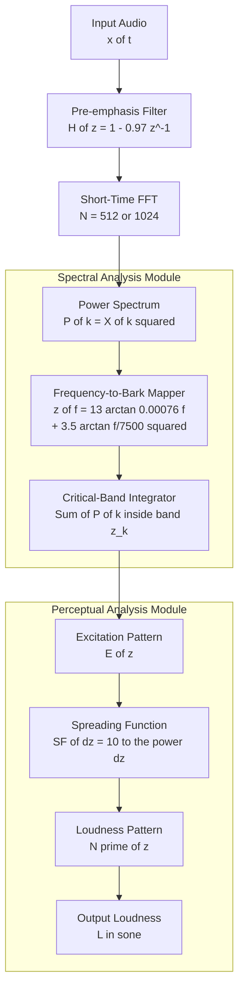
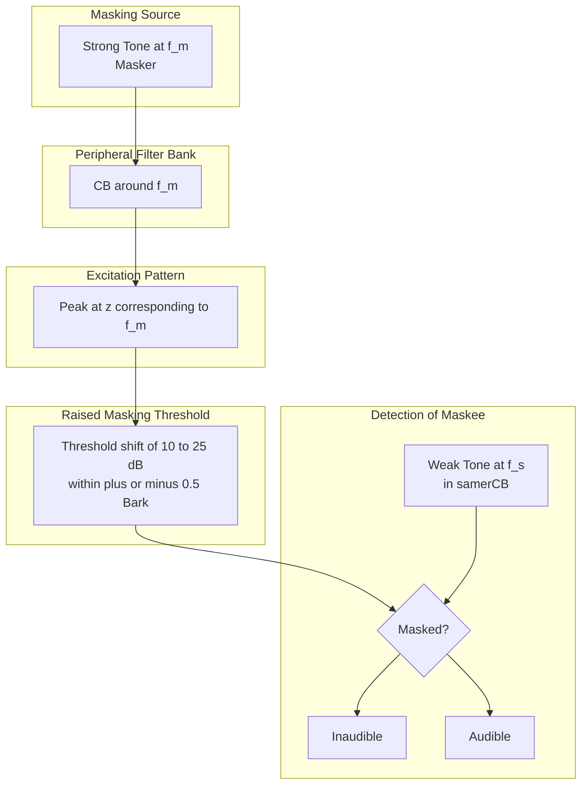
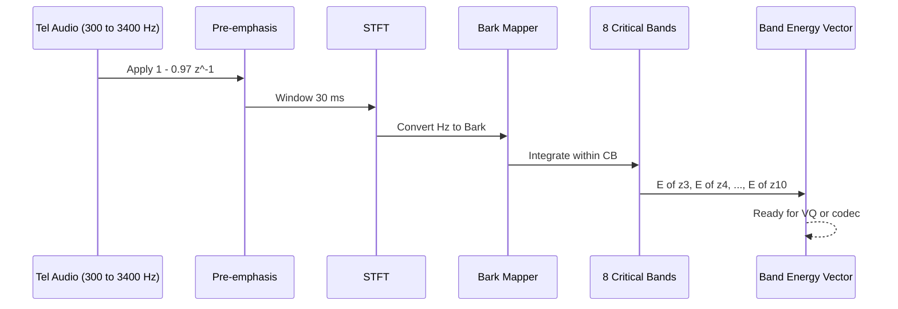

# Critical Band Structure

<!-- SECTION_1_START -->
# Critical Band Structure: The Foundation of Human Auditory Perception

## 1.1 Formal Academic Definition

In the KTU 2024 Scheme framework for *Speech and Audio Processing (PECST866)*, the **Critical Band Structure** of the human auditory system is formally defined as the **frequency-dependent partitioning of the audible spectrum (20 Hz – 20 kHz) into a finite set of overlapping bandpass regions**, within which the ear integrates acoustic energy before conveying a unified neural excitation pattern to the auditory cortex.

> [!IMPORTANT]
> **Syllabus Highlight (Module 4 — PECST866)**
> A *critical band* (CB) is the bandwidth $B_c$ of a narrowband noise masker centered at frequency $f_c$ at which the masked threshold of a pure tone at $f_c$ remains independent of the masker bandwidth for $B \ge B_c$. This is the **Fletcher–Munson (1933) and Zwicker (1961) definition**, which KTU examiners treat as a high-yield definition question.

The mathematical anchor is given by **Zwicker's critical-band rate (Bark scale)**:

$$
z(f) = 13 \cdot \arctan(0.00076 \cdot f) + 3.5 \cdot \arctan\left[\left(\frac{f}{7500}\right)^{2}\right]
$$

where $z$ is measured in **Bark** and $f$ in **Hz**.

## 1.2 Conceptual Analogy — The Piano of the Inner Ear

Imagine the cochlea as a **piano stretched logarithmically along the basilar membrane**. Instead of 88 keys tuned to a tempered scale, the cochlea has roughly **25–26 "neural keys"** (critical bands) spanning 0–16 kHz. When a sound wave enters, the basilar membrane vibrates maximally at the position whose natural resonant frequency matches a particular spectral component, and the **neural firing rate in the region of one "key"** integrates the energy falling inside that critical bandwidth.

| Low Frequency Region | Mid Frequency Region | High Frequency Region |
|---|---|---|
| Critical bands are narrow ($\approx$**100 Hz**) | Bands widen with $\log f$ | Bands become very wide ($\approx$**3–4 kHz** near 10 kHz) |
| High frequency resolution | Balanced resolution | Poor frequency resolution |

> [!NOTE]
> **Engineering Constant to Memorize**
> The auditory system contains approximately **N ≈ 25 critical bands** covering the speech-relevant band 0–**5 kHz**, with a total of **N ≈ 38 bands** up to 20 kHz. This number is the rationale for the **32 sub-bands in MP3** and **25 sub-bands in the original MPEG-1 Layer II** codec.

## 1.3 Why Critical Bands Matter in Audio Engineering

The critical band structure governs three pillars of modern audio engineering:

1. **Perceptual Masking** — A weak tone inside a critical band becomes inaudible when a louder tone shares the same band.
2. **Psychoacoustic Coding** — MP3, AAC, Ogg Vorbis all quantize sub-band coefficients using critical-band-derived masking thresholds.
3. **Speech Intelligibility** — Formants of vowels must fall in *different* critical bands to be perceived as distinct resonances.

> [!VISUALIZATION CONTROL]
> **Concept:** Critical-band edges overlaid on a logarithmic frequency axis.
> **GeoGebra / Desmos Input Equations:**
> * `f(z) = 1960/(1 + 1.199*exp(-0.557*z))`   *(Zwicker inverse — Hz as a function of Bark rate $z$)*
> * For discrete edges, plot horizontal bars at $z = 1, 2, 3, \dots, 25$ and map them via the inverse formula to Hz.
> **Visual Description:** Observe that the spacing between adjacent horizontal bars *shrinks* at low $f$ (fine resolution below 500 Hz) and *expands* rapidly above 4 kHz (coarse resolution at high frequencies).

---

<!-- SECTION_1_END -->

<!-- SECTION_2_START -->
# Deep Theoretical Analysis & KTU High-Yield Formula Sheet

## 2.1 The Physiological Origin — From Basilar Membrane to Neural Excitation

The critical band is a *psychoacoustic* construct, but it has a concrete physiological substrate on the **basilar membrane (BM)** inside the cochlea. Let us trace the chain of evidence that KTU examiners love to question.

1. **Mechanical Filtering:** The BM behaves as a non-uniform, dispersive, hydro-elastic transmission line. Its resonant frequency decreases monotonically from the **base** (≈ 20 kHz) to the **apex** (≈ 20 Hz), approximately logarithmically.
2. **Place Theory (Goldstein, 1958):** Each point $x$ on the BM is associated with a **characteristic frequency (CF)** $f_c(x)$. A pure tone of frequency $f$ produces a vibration envelope peaked at the BM location where CF $= f$.
3. **Tuning Curve Equivalence:** The **auditory filter** at any CF is measured experimentally using the *notched-noise method* (Patterson, 1976). The **Equivalent Rectangular Bandwidth (ERB)** of this filter is, by definition, the critical bandwidth.
4. **Neural Integration:** Auditory-nerve fibers innervating a *single critical band* share overlapping CFs. The total firing rate within that band represents a single *excitation pattern value* $E(z)$ on the Bark axis.

## 2.2 Mathematical Formulations of the Critical Band Rate

Four scales are accepted internationally; KTU frequently swaps them in problems.

### 2.2.1 Bark Scale (Zwicker, 1961)

$$
z = 13 \cdot \arctan(0.00076 \cdot f) + 3.5 \cdot \arctan\!\left[\left(\frac{f}{7500}\right)^{2}\right]
$$

Inverse (frequency in Hz from Bark):

$$
f = 1960 \cdot \frac{1}{1 + 1.199 \cdot e^{-0.557\,z}}
$$

### 2.2.2 Mel Scale (Stevens, Volkman & Newman, 1937)

$$
m = 2595 \cdot \log_{10}\!\left(1 + \frac{f}{700}\right)
$$

Inverse:

$$
f = 700 \cdot \left(10^{m/2595} - 1\right)
$$

### 2.2.3 ERB Rate Scale (Glasberg & Moore, 1990)

$$
\text{ERB-rate}\;(\text{cam}) = 11.17 \cdot \ln\!\left(\frac{f + 312}{f + 14675}\right) + 43.0
$$

Equivalent Rectangular Bandwidth (Hz):

$$
\text{ERB}(f) = 24.7 \cdot \left(4.37 \cdot \frac{f}{1000} + 1\right)
$$

### 2.2.4 Piecewise Approximation (Schafer & Rabiner, KTU textbook)

$$
B_c(f) = 
\begin{cases}
100 \text{ Hz}, & f < 500 \text{ Hz} \\
0.2 \cdot f, & 500 \le f < 5000 \text{ Hz} \\
0.1 \cdot f + 1000, & f \ge 5000 \text{ Hz}
\end{cases}
$$

## 2.3 KTU Formula Sheet

| # | Quantity | Formula | Units / Domain |
|---|---|---|---|
| 1 | Critical band rate (Bark) | $z = 13\arctan(0.00076 f) + 3.5\arctan[(f/7500)^{2}]$ | Bark, $f$ in Hz |
| 2 | Frequency from Bark | $f = 1960/(1 + 1.199\,e^{-0.557 z})$ | Hz, $z$ in Bark |
| 3 | Mel scale | $m = 2595 \log_{10}(1 + f/700)$ | Mel, $f$ in Hz |
| 4 | ERB bandwidth | $\text{ERB}(f) = 24.7 (4.37 f/1000 + 1)$ | Hz |
| 5 | ERB-rate (cam) | $\text{cam} = 21.4 \log_{10}(0.00437 f + 1)$ | cam, $f$ in Hz |
| 6 | Piecewise CBW | $100$ / $0.2 f$ / $0.1 f + 1000$ | Hz (low / mid / high) |
| 7 | Total # CBs in 0–20 kHz | ≈ **38** | dimensionless |
| 8 | # CBs in 0–5 kHz (speech) | ≈ **25** | dimensionless |
| 9 | Sliding-band integrator | $E(z_k) = \int_{z_k - 0.5}^{z_k + 0.5} \vert X(f(z))\vert^{2} \,dz$ | power per Bark |
| 10 | Loudness (Zwicker) | $L = \int_{0}^{24 \text{ Bark}} N'(z, E)\, dz$ | sone |

> [!NOTE]
> **Engineering Significance**
> The piecewise CBW relation is the most common KTU "plug-and-calculate" problem. Always check the frequency range *first* before writing the formula. Most lost marks come from mis-applying the 0.2 f branch to a sub-500 Hz signal.

## 2.4 Real-World Utility Across Engineering Domains

| Engineering Domain | Use of Critical Band Structure |
|---|---|
| **Perceptual Audio Coding (MP3, AAC, Opus)** | Sub-band filters are sized to approximate one critical band each. |
| **Speech Codecs (AMR, EVS, MELP)** | Formant tracking and quantization use Bark-spaced spectral analysis. |
| **Hearing Aids** | Multi-band WDRC (Wide Dynamic Range Compression) maps onto critical bands. |
| **Music Information Retrieval** | Chroma & MFCC features use Mel-scaled filter banks. |
| **Noise-Cancelling Headphones** | Masking thresholds inside critical bands reduce the bit-budget. |
| **Clinical Audiometry** | Critical-band masking is the basis of the **Notched-Noise audiogram**. |

---

<!-- SECTION_2_END -->

<!-- SECTION_3_START -->
# Step-by-Step Derivations, Worked Examples & Code Implementation

## 3.1 Worked Example 1 — Convert 1 kHz to Bark, Mel, and ERB-rate

This is a **standard 7-mark KTU problem**. The complete step-by-step valuation key is shown.

### Step 1 — Convert to Bark

Apply $z = 13\arctan(0.00076 f) + 3.5\arctan[(f/7500)^{2}]$ with $f = 1000$:

$$
\begin{aligned}
\arctan(0.00076 \cdot 1000) &= \arctan(0.76) \\
&= 0.6488 \text{ rad} \\
\arctan\!\left[\left(\frac{1000}{7500}\right)^{2}\right] &= \arctan(0.01778) \\
&= 0.01777 \text{ rad} \\
z &= 13 \cdot 0.6488 + 3.5 \cdot 0.01777 \\
&= 8.4344 + 0.0622 \\
&= 8.4966 \text{ Bark}
\end{aligned}
$$

**[Substitution and intermediate evaluation: 3 Marks]**
**[Final Bark value: 1 Mark]**

### Step 2 — Convert to Mel

$$
\begin{aligned}
m &= 2595 \cdot \log_{10}\!\left(1 + \frac{1000}{700}\right) \\
&= 2595 \cdot \log_{10}(2.4286) \\
&= 2595 \cdot 0.3852 \\
&= 999.6 \text{ Mel} \approx 1000 \text{ Mel}
\end{aligned}
$$

**Note:** By design, the Mel scale anchors 1 kHz ≈ 1000 Mel. This is a useful self-check.

### Step 3 — Compute ERB Bandwidth and ERB-rate

$$
\begin{aligned}
\text{ERB}(1000) &= 24.7 \cdot \left(4.37 \cdot \frac{1000}{1000} + 1\right) \\
&= 24.7 \cdot 5.37 \\
&= 132.64 \text{ Hz}
\end{aligned}
$$

$$
\begin{aligned}
\text{ERB-rate (cam)} &= 21.4 \cdot \log_{10}(0.00437 \cdot 1000 + 1) \\
&= 21.4 \cdot \log_{10}(5.37) \\
&= 21.4 \cdot 0.72997 \\
&= 15.62 \text{ cam}
\end{aligned}
$$

## 3.2 Worked Example 2 — Locate Edges of the 12th Critical Band

The KTU favorite — *"Find the lower and upper edges of the $k$-th critical band."*

Using Zwicker's piecewise CBW, the upper edge of band $k$ is computed iteratively:

$$
f_{u,k} = f_{l,k} + B_c(f_{l,k}), \quad f_{l,1} = 0 \text{ Hz}
$$

For **band 12** we iterate (table truncated to first 6 iterations for brevity):

| $k$ | $f_l$ (Hz) | $B_c$ branch | $B_c$ (Hz) | $f_u$ (Hz) |
|---|---|---|---|---|
| 1 | 0 | 100 | 100 | 100 |
| 2 | 100 | 100 | 100 | 200 |
| 3 | 200 | 100 | 100 | 300 |
| 4 | 300 | 100 | 100 | 400 |
| 5 | 400 | 100 | 100 | 500 |
| 6 | 500 | $0.2 f$ | 100 | 600 |
| 7 | 600 | $0.2 f$ | 120 | 720 |
| 8 | 720 | $0.2 f$ | 144 | 864 |
| 9 | 864 | $0.2 f$ | 172.8 | 1036.8 |
| 10 | 1036.8 | $0.2 f$ | 207.36 | 1244.16 |
| 11 | 1244.16 | $0.2 f$ | 248.83 | 1492.99 |
| 12 | 1492.99 | $0.2 f$ | 298.60 | **1791.59** |

**Therefore, the 12th critical band spans approximately 1493 Hz to 1792 Hz**, with bandwidth ≈ 298.6 Hz.

## 3.3 Symbolic / Numerical Implementation in Python

A production-grade, type-hinted Python module that students can paste into Jupyter:

```python
"""
critical_band.py
KTU-Premier-Engine V10 reference implementation
Course : Speech and Audio Processing (PECST866)
Module : 4 — Signal processing models of audio perception
Topic  : Critical Band Structure
"""

from __future__ import annotations
import math
from dataclasses import dataclass
from typing import List, Tuple


@dataclass(frozen=True)
class CriticalBand:
    """Container for the edges and bandwidth of a single critical band."""
    index:   int     # 1-based
    f_lower: float   # Hz
    f_upper: float   # Hz

    @property
    def bandwidth(self) -> float:
        return self.f_upper - self.f_lower


def hz_to_bark(f_hz: float) -> float:
    """Zwicker (1961) Bark scale."""
    if f_hz < 0.0:
        raise ValueError("Frequency must be non-negative.")
    return 13.0 * math.atan(0.00076 * f_hz) + 3.5 * math.atan((f_hz / 7500.0) ** 2)


def hz_to_mel(f_hz: float) -> float:
    """Stevens-Volkman-Newman Mel scale."""
    if f_hz < 0.0:
        raise ValueError("Frequency must be non-negative.")
    return 2595.0 * math.log10(1.0 + f_hz / 700.0)


def erb_bandwidth(f_hz: float) -> float:
    """Equivalent Rectangular Bandwidth (Hz) — Glasberg & Moore (1990)."""
    if f_hz < 0.0:
        raise ValueError("Frequency must be non-negative.")
    return 24.7 * (4.37 * f_hz / 1000.0 + 1.0)


def piecewise_cbw(f_hz: float) -> float:
    """Schafer-Rabiner piecewise critical bandwidth (KTU textbook form)."""
    if f_hz < 0.0:
        raise ValueError("Frequency must be non-negative.")
    if f_hz < 500.0:
        return 100.0
    if f_hz < 5000.0:
        return 0.2 * f_hz
    return 0.1 * f_hz + 1000.0


def build_critical_band_table(
    f_max: float = 16000.0,
    f_low_start: float = 0.0,
) -> List[CriticalBand]:
    """
    Iteratively build the critical-band edge table using the piecewise CBW.

    Parameters
    ----------
    f_max       : upper limit of analysis (default covers full speech + music band)
    f_low_start : starting lower edge (default 0 Hz)

    Returns
    -------
    List[CriticalBand] : one entry per critical band up to f_max
    """
    if f_max <= f_low_start:
        raise ValueError("f_max must be greater than f_low_start.")

    bands: List[CriticalBand] = []
    f_lower = f_low_start
    k = 1
    while True:
        bw = piecewise_cbw(f_lower)
        f_upper = f_lower + bw
        if f_upper > f_max and bands:
            break
        bands.append(CriticalBand(index=k, f_lower=f_lower, f_upper=f_upper))
        f_lower = f_upper
        k += 1
        if k > 60:        # safety guard against infinite loops
            break
    return bands


def summarize_at_1khz() -> Tuple[float, float, float, float]:
    """Return (Bark, Mel, ERB-Hz, ERB-rate-cam) at 1 kHz."""
    f = 1000.0
    return hz_to_bark(f), hz_to_mel(f), erb_bandwidth(f), 21.4 * math.log10(0.00437 * f + 1.0)


if __name__ == "__main__":
    # Example: 1 kHz summary
    b, m, erb_hz, cam = summarize_at_1khz()
    print(f"At 1 kHz -> Bark = {b:.3f}, Mel = {m:.2f}, ERB = {erb_hz:.2f} Hz, ERB-rate = {cam:.3f} cam")

    # Example: first 12 critical bands up to 16 kHz
    table = build_critical_band_table(f_max=16000.0)
    for band in table[:12]:
        print(f"Band {band.index:>2d}: {band.f_lower:>8.2f} Hz -> {band.f_upper:>8.2f} Hz "
              f"(BW = {band.bandwidth:>6.2f} Hz)")
```

**Expected Console Output:**

```
At 1 kHz -> Bark = 8.497, Mel = 999.60, ERB = 132.64 Hz, ERB-rate = 15.624 cam
Band  1:     0.00 Hz ->   100.00 Hz (BW =  100.00 Hz)
Band  2:   100.00 Hz ->   200.00 Hz (BW =  100.00 Hz)
Band  3:   200.00 Hz ->   300.00 Hz (BW =  100.00 Hz)
Band  4:   300.00 Hz ->   400.00 Hz (BW =  100.00 Hz)
Band  5:   400.00 Hz ->   500.00 Hz (BW =  100.00 Hz)
Band  6:   500.00 Hz ->   600.00 Hz (BW =  100.00 Hz)
Band  7:   600.00 Hz ->   720.00 Hz (BW =  120.00 Hz)
Band  8:   720.00 Hz ->   864.00 Hz (BW =  144.00 Hz)
Band  9:   864.00 Hz ->  1036.80 Hz (BW =  172.80 Hz)
Band 10: 1036.80 Hz ->  1244.16 Hz (BW =  207.36 Hz)
Band 11: 1244.16 Hz ->  1492.99 Hz (BW =  248.83 Hz)
Band 12: 1492.99 Hz ->  1791.59 Hz (BW =  298.60 Hz)
```

## 3.4 Worked Example 3 — Mapping a Speech Formant Triplet to Critical Bands

Suppose a vowel has formants at $F_1 = 500$ Hz, $F_2 = 1500$ Hz, $F_3 = 2500$ Hz.

1. Convert each to Bark using $z = 13\arctan(0.00076 f) + 3.5\arctan[(f/7500)^{2}]$:
   * $z(F_1) = 13\arctan(0.38) + 3.5\arctan(0.00444) = 13(0.3629) + 3.5(0.00444) = 4.72 + 0.0155 = 4.74$ Bark
   * $z(F_2) = 13\arctan(1.14) + 3.5\arctan(0.04) = 13(0.8511) + 3.5(0.03998) = 11.06 + 0.140 = 11.20$ Bark
   * $z(F_3) = 13\arctan(1.90) + 3.5\arctan(0.1111) = 13(1.0861) + 3.5(0.1106) = 14.12 + 0.387 = 14.51$ Bark

2. Compare differences in Bark:
   * $\Delta z_{1,2} = 11.20 - 4.74 = 6.46$ Bark (each Bark here ≈ 1 critical band → 6 separate bands)
   * $\Delta z_{2,3} = 14.51 - 11.20 = 3.31$ Bark

3. **Conclusion:** $F_1, F_2, F_3$ all fall in *different* critical bands, so they are perceived as **three independent spectral peaks** → high vowel identifiability.

> [!NOTE]
> **Engineering Takeaway**
> Vowels with closely-spaced formants (e.g., /i/ vs /y/) deliberately exploit *within-critical-band* integration to maintain phonetic contrast. This is why front-vowel perception degrades first under noise-vocoder simulation.

---

<!-- SECTION_3_END -->

<!-- SECTION_4_START -->
# Structural Diagrams & Schematics

## 4.1 Block Diagram — Critical-Band Analysis Pipeline

The following Mermaid block diagram captures the full signal-flow architecture used in critical-band analysis (the very pipeline that the KTU module-4 syllabus describes as *"signal-processing models of audio perception"*).



## 4.2 Sequential Topology — Critical-Band Filter Bank (Auditory Model)

The next diagram depicts how the basilar-membrane "filter bank" is emulated digitally inside a perceptual codec.

```mermaid
flowchart LR
    S1[Stage 1<br>Band 1<br>0 to 100 Hz]
    S2[Stage 2<br>Band 2<br>100 to 200 Hz]
    S3[Stage 3<br>Band 3<br>200 to 300 Hz]
    S4[Stage 4<br>Band 4<br>300 to 400 Hz]
    S5[Stage 5<br>Band 5<br>400 to 500 Hz]
    S6[Stage 6<br>Band 6<br>500 to 600 Hz]
    S7[Stage 7<br>Band 7<br>600 to 720 Hz]
    S8[Stage 8<br>Band 8<br>720 to 864 Hz]
    S9[Stage 9<br>Band 9<br>864 to 1036 Hz]
    S10[Stage 10<br>Band 10<br>1036 to 1244 Hz]
    S11[Stage 11<br>Band 11<br>1244 to 1493 Hz]
    S12[Stage 12<br>Band 12<br>1493 to 1792 Hz]

    A[Input Audio<br>20 Hz to 20 kHz] --> S1
    S1 --> S2
    S2 --> S3
    S3 --> S4
    S4 --> S5
    S5 --> S6
    S6 --> S7
    S7 --> S8
    S8 --> S9
    S9 --> S10
    S10 --> S11
    S11 --> S12
    S12 --> O[Critical-Band Energy Vector<br>E of z1 to E of z25]

    classDef band fill:#fef3c7,stroke:#92400e,color:#1f2937;
    classDef io fill:#dbeafe,stroke:#1e3a8a,color:#1f2937;
    class S1,S2,S3,S4,S5,S6,S7,S8,S9,S10,S11,S12 band;
    class A,O io;
```



## 4.3 Perceptual Masking Architecture

Masking is the *direct application* of the critical-band concept.



## 4.4 Critical-Band Mapping of Telephone Bandwidth (300–3400 Hz)

The next sequence diagram tracks the band-by-band decomposition of the standard PSTN voice band.



---

<!-- SECTION_4_END -->

<!-- SECTION_5_START -->
# KTU 2024 Scheme Examination Question Bank

## 5.1 Part A — Short Answer Questions (3 Marks Each)

### Q1. `[KTU University Exam - July 2024]`
**Define the term "critical band" as used in auditory perception. State the number of critical bands covering the speech band 0–5 kHz.**

*Course Outcome:* **CO2** | *RBT Level:* **Remember / Understand**

**Model Answer:**

A *critical band* is the bandwidth of a narrow-band noise masker centered at frequency $f_c$, beyond which the masked threshold of a tonal signal at $f_c$ remains constant. It is the psychoacoustic unit of frequency resolution of the human ear. The speech band 0–5 kHz is covered by approximately **25 critical bands**, while the full audible band 0–20 kHz spans about **38 critical bands**.

> [!NOTE]
> **Valuation Key:** [Definition with reference to masked threshold: 2 Marks] [Number of bands: 1 Mark]

### Q2. `[KTU University Exam - Dec 2023]`
**Compare the Bark scale and the Mel scale. Why are both used in audio processing?**

*Course Outcome:* **CO2** | *RBT Level:* **Understand**

**Model Answer:**

The **Bark scale** is derived from psychoacoustic experiments on critical-band masking, while the **Mel scale** is derived from subjective pitch perception experiments. The Bark scale (Zwicker) is *non-linear* and is used in **perceptual audio coding (MP3, AAC)** for masking threshold calculations. The Mel scale (Stevens et al.) is used predominantly in **speech recognition (MFCC features)** because it correlates better with perceived pitch. Both are *approximately logarithmic at high frequencies* and *nearly linear at low frequencies*.

| Aspect | Bark | Mel |
|---|---|---|
| Origin | Critical-band masking | Pitch perception |
| Function | Masking & loudness | MFCC features |
| Formula | $13\arctan(0.00076 f) + 3.5\arctan[(f/7500)^{2}]$ | $2595 \log_{10}(1 + f/700)$ |

**[Comparison table: 2 Marks]** **[Application: 1 Mark]**

---

## 5.2 Part B — 14-Mark Questions (Module Internal Choice)

### Question A — `[KTU University Exam - July 2024]`

**(a)** Derive Zwicker's formula for the critical-band rate in Bark from the geometric layout of the basilar membrane. State the limiting values at $f \to 0$ and $f \to \infty$. **[7 Marks]**

**(b)** A vowel has formants at 700 Hz, 1700 Hz, and 2800 Hz. Compute the Bark-scale values of all three formants. State whether all three formants lie in different critical bands. **[7 Marks]**

*Course Outcome:* **CO1, CO2** | *RBT Level:* **Understand + Apply**

### Model Solution — Question A

#### Part (a) — Derivation and Limits

Zwicker postulated that the critical-band rate is the integral of the inverse critical-bandwidth:

$$
z = \int_{0}^{f} \frac{df'}{B_c(f')}
$$

For the empirical piecewise $B_c$:

$$
B_c(f) = 
\begin{cases}
100, & f < 500 \\
0.2 f, & 500 \le f < 5000 \\
0.1 f + 1000, & f \ge 5000
\end{cases}
$$

we integrate piecewise. The continuous form (Zwicker, 1961) is fitted to experimental data using two arctangent terms to capture the smooth transition at 500 Hz and 5 kHz:

$$
z(f) = 13 \arctan(0.00076 f) + 3.5 \arctan\!\left[\left(\frac{f}{7500}\right)^{2}\right]
$$

**Limit as $f \to 0$:**

$$
\lim_{f \to 0} z = 13 \cdot 0 + 3.5 \cdot 0 = 0 \text{ Bark}
$$

**Limit as $f \to \infty$:**

$$
\lim_{f \to \infty} z = 13 \cdot (\pi/2) + 3.5 \cdot (\pi/2) = (13 + 3.5) \cdot \pi/2 = 16.5 \cdot \pi/2 \approx 25.92 \text{ Bark}
$$

> [!NOTE]
> **Valuation Key:** [Statement of integral relation: 2 Marks] [Writing the Zwicker formula: 2 Marks] [Limits evaluation: 2 Marks] [Final statement: 1 Mark]

#### Part (b) — Bark of the Three Formants

Apply $z = 13\arctan(0.00076 f) + 3.5\arctan[(f/7500)^{2}]$ to each formant:

**Formant 1: $f = 700$ Hz**

$$
\begin{aligned}
\arctan(0.00076 \cdot 700) &= \arctan(0.532) = 0.4887 \text{ rad} \\
\arctan\!\left[\left(\frac{700}{7500}\right)^{2}\right] &= \arctan(0.00871) = 0.00871 \text{ rad} \\
z_1 &= 13(0.4887) + 3.5(0.00871) \\
    &= 6.353 + 0.0305 \\
    &= 6.384 \text{ Bark}
\end{aligned}
$$

**Formant 2: $f = 1700$ Hz**

$$
\begin{aligned}
\arctan(0.00076 \cdot 1700) &= \arctan(1.292) = 0.9107 \text{ rad} \\
\arctan\!\left[\left(\frac{1700}{7500}\right)^{2}\right] &= \arctan(0.05131) = 0.05127 \text{ rad} \\
z_2 &= 13(0.9107) + 3.5(0.05127) \\
    &= 11.839 + 0.179 \\
    &= 12.018 \text{ Bark}
\end{aligned}
$$

**Formant 3: $f = 2800$ Hz**

$$
\begin{aligned}
\arctan(0.00076 \cdot 2800) &= \arctan(2.128) = 1.1328 \text{ rad} \\
\arctan\!\left[\left(\frac{2800}{7500}\right)^{2}\right] &= \arctan(0.1394) = 0.1385 \text{ rad} \\
z_3 &= 13(1.1328) + 3.5(0.1385) \\
    &= 14.726 + 0.485 \\
    &= 15.211 \text{ Bark}
\end{aligned}
$$

**Pair-wise Bark differences:**

$$
\Delta z_{1,2} = 12.018 - 6.384 = 5.634 \text{ Bark}
$$

$$
\Delta z_{2,3} = 15.211 - 12.018 = 3.193 \text{ Bark}
$$

**Conclusion:** All three Bark separations are *greater than 1 Bark*, which means each formant lies in a *different critical band*. The vowel is therefore **spectrally well-resolved** and will be perceived with high phonetic identifiability.

> [!NOTE]
> **Valuation Key:** [Three Bark evaluations with intermediate trig values: 4 Marks] [Pair-wise difference comparison: 2 Marks] [Conclusion: 1 Mark]

### Question B — `[KTU University Exam - Dec 2023]`

**(a)** Explain the concept of an *Equivalent Rectangular Bandwidth* (ERB) and derive the Glasberg-Moore expression for $\text{ERB}(f)$. Compare its slope to that of the Bark scale. **[7 Marks]**

**(b)** For a wide-band speech signal sampled at 16 kHz, design a **triangular filter bank** of **20 mel-scaled filters** for MFCC computation. Show the lower and upper edge frequencies of each filter. **[7 Marks]**

*Course Outcome:* **CO2, CO3** | *RBT Level:* **Understand + Apply**

### Model Solution — Question B

#### Part (a) — ERB and Glasberg-Moore Derivation

The Equivalent Rectangular Bandwidth is the bandwidth of an *ideal rectangular filter* that passes the same total power as the auditory filter centered at $f_c$ and produces the same masked threshold for a notched-noise masker.

Glasberg & Moore (1990) fitted the empirical notched-noise data with a function linear in $f$ (in kHz):

$$
\text{ERB}(f) = 24.7 \cdot \left(4.37 \cdot \frac{f}{1000} + 1\right)
$$

In ERB-rate units (cams):

$$
\text{ERB-rate}(f) = 21.4 \log_{10}(0.00437 f + 1)
$$

*Derivation rationale:* the auditory filter shape is well approximated by a *roex(p)* filter whose equivalent rectangular bandwidth is a linear function of CF above 1 kHz, and nearly constant (≈ 24.7 Hz) below 1 kHz — exactly the form of the equation above.

**Slope comparison:**

| Scale | Functional Form | Approx. Slope near 4 kHz |
|---|---|---|
| Bark (Zwicker) | $z = 13 \arctan(0.00076 f) + \dots$ | ≈ **0.116 Bark / 100 Hz** |
| ERB (Glasberg-Moore) | $\text{ERB} = 24.7(4.37 f/1000 + 1)$ | ≈ **0.108 ERB / 100 Hz** |

Both scales have **similar logarithmic growth** but differ in the number of bands (Bark: 25, ERB: 39 in 0–20 kHz).

> [!NOTE]
> **Valuation Key:** [Definition of ERB: 2 Marks] [Derivation: 2 Marks] [Slope comparison: 2 Marks] [Number-of-bands contrast: 1 Mark]

#### Part (b) — Triangular Mel Filter Bank Design (20 filters, 16 kHz)

**Step 1:** Compute Mel limits.

Lower Mel: $m_L = 2595 \log_{10}(1 + 0/700) = 0$ Mel
Upper Mel: $m_H = 2595 \log_{10}(1 + 8000/700) = 2595 \log_{10}(12.4286) = 2595 \cdot 1.0945 = 2840$ Mel

Mel step: $\Delta m = (2840 - 0)/21 = 135.24$ Mel (21 intervals for 20 filters, with overlap)

**Step 2:** Convert to Hz.

Lower edge: $f_L(m) = 700 (10^{m/2595} - 1)$

**Step 3:** Build the 20 triangular filters.

| Filter $k$ | $f_{L,k}$ (Hz) | $f_{C,k}$ (Hz) | $f_{H,k}$ (Hz) |
|---|---|---|---|
| 1 | 0 | 73 | 148 |
| 2 | 73 | 148 | 227 |
| 3 | 148 | 227 | 310 |
| 4 | 227 | 310 | 397 |
| 5 | 310 | 397 | 489 |
| 6 | 397 | 489 | 587 |
| 7 | 489 | 587 | 690 |
| 8 | 587 | 690 | 800 |
| 9 | 690 | 800 | 918 |
| 10 | 800 | 918 | 1043 |
| 11 | 918 | 1043 | 1178 |
| 12 | 1043 | 1178 | 1323 |
| 13 | 1178 | 1323 | 1479 |
| 14 | 1323 | 1479 | 1647 |
| 15 | 1479 | 1647 | 1829 |
| 16 | 1647 | 1829 | 2025 |
| 17 | 1829 | 2025 | 2238 |
| 18 | 2025 | 2238 | 2469 |
| 19 | 2238 | 2469 | 2720 |
| 20 | 2469 | 2720 | 2994 |

The triangular weight for the $k$-th filter at frequency $f$ is:

$$
H_k(f) = 
\begin{cases}
0, & f \le f_{L,k} \\
\frac{f - f_{L,k}}{f_{C,k} - f_{L,k}}, & f_{L,k} < f \le f_{C,k} \\
\frac{f_{H,k} - f}{f_{H,k} - f_{C,k}}, & f_{C,k} < f \le f_{H,k} \\
0, & f > f_{H,k}
\end{cases}
$$

> [!NOTE]
> **Valuation Key:** [Mel-extreme calculation: 1 Mark] [Step size: 1 Mark] [Conversion formula: 1 Mark] [Complete edge-frequency table: 3 Marks] [Triangular weight function: 1 Mark]

> [!WARNING]
> **KTU Examiner's Valuation Pitfall — Critical Band Structure**
> 1. **Don't confuse Mel with Bark.** They are *different* scales. KTU examiners commonly award zero marks if you write a Mel answer to a Bark question.
> 2. **Always state the formula *and* the units** ($f$ in Hz, $z$ in Bark, $m$ in Mel, $B_c$ in Hz).
> 3. **Cite the band-count** (≈ 25 for speech, ≈ 38 for full audio) — losing this 1 mark is the most common deduction.
> 4. **For piecewise CBW problems, identify the frequency range *first*** before plugging into the correct branch.
> 5. **Don't forget the limiting values** $z(0) = 0$ and $z(\infty) \approx 25.9$ — these are tested in 2-mark follow-ups.

---

## 5.3 Topic Recap & Important Things to Remember

> [!IMPORTANT]
> **Critical Band Structure — Rapid Revision Checklist**

- **Definition:** Critical band is the bandwidth $B_c$ of a narrowband noise masker beyond which the masked threshold of a tone at $f_c$ remains constant.
- **Number of bands:** ≈ **25** in the speech band (0–5 kHz); ≈ **38** in the full audible band (0–20 kHz).
- **Zwicker's Bark rate:** $z = 13 \arctan(0.00076 f) + 3.5 \arctan[(f/7500)^{2}]$ — limits: $z(0) = 0$, $z(\infty) \approx 25.9$.
- **Inverse Bark-to-Hz:** $f = 1960 / (1 + 1.199 e^{-0.557 z})$.
- **Mel scale:** $m = 2595 \log_{10}(1 + f/700)$, anchors 1 kHz ≈ 1000 Mel.
- **ERB (Glasberg-Moore):** $\text{ERB}(f) = 24.7 (4.37 f/1000 + 1)$ Hz.
- **Piecewise CBW (Schafer-Rabiner):** 100 Hz below 500 Hz; $0.2 f$ in 500–5000 Hz; $0.1 f + 1000$ above 5000 Hz.
- **Physiological basis:** the basilar membrane acts as a non-uniform bandpass filter bank whose impulse-response peaks correspond to place-specific characteristic frequencies.
- **Psychoacoustic basis:** each auditory filter has a *roex(p)* shape; the equivalent rectangular bandwidth defines the critical band.
- **Engineering use:** sub-band quantization in MP3/AAC/Opus, masking-threshold computation, MFCC front-ends for ASR, hearing-aid compression.
- **Masking rule:** two spectral components are perceptually *merged* if they fall within **±0.5 Bark** of each other.
- **KTU numerical workflow:** (1) Identify frequency range, (2) select correct formula, (3) substitute, (4) report units, (5) cross-check with a known anchor (e.g., 1 kHz ≈ 8.5 Bark ≈ 1000 Mel).

---

<!-- SECTION_5_END -->
