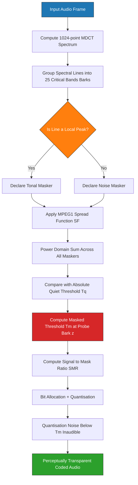
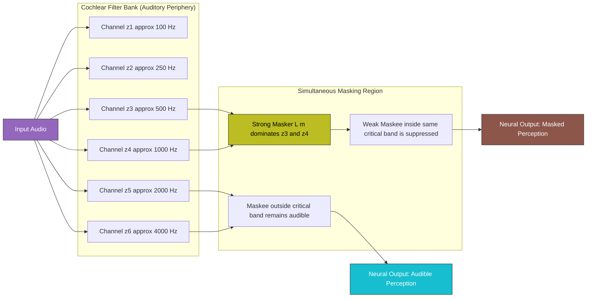
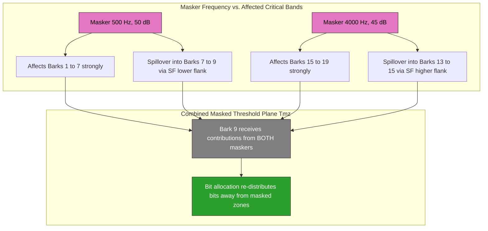
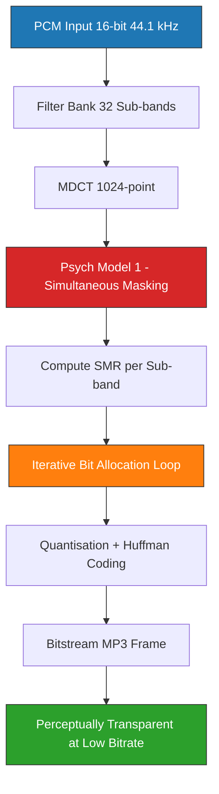

# Masking - Simultaneous Masking

<!-- SECTION_1_START -->
# Simultaneous Masking — Core Definition & Intuitive Overview

> [!IMPORTANT]
> **KTU 2024 Scheme | PECST866 | Module 4 | Signal Processing Models of Audio Perception**
> *Course Outcomes Mapped: CO2 — Apply psychoacoustic models to characterize auditory perception.*

## Formal Academic Definition

**Simultaneous Masking** (also called **spectral masking** or **frequency masking**) is a fundamental psychoacoustic phenomenon in which the presence of a stronger sound component — the **masker** — raises the audibility threshold of a weaker, coexisting sound component — the **maskee** (or **probe**) — that is presented *at the same instant in time*, provided the masker and maskee lie within a sufficiently close frequency neighborhood.

Mathematically, the masked threshold $T_{\text{masked}}(f)$ is expressed as

$$T_{\text{masked}}(f) = T_{\text{quiet}}(f) + M(f, f_m, L_m)$$

where:
- $T_{\text{quiet}}(f)$ is the absolute hearing threshold in quiet (in dB SPL) at frequency $f$,
- $f_m$ is the masker center frequency (in Hz),
- $L_m$ is the masker sound pressure level (in dB SPL),
- $M(f, f_m, L_m)$ is the **masking function** describing the elevation of the threshold above the quiet threshold.

> [!NOTE]
> **Syllabus Highlight — Module 4**
> Simultaneous Masking, together with the **Critical Band Rate (CBR) / Bark scale**, forms the mathematical foundation of every modern **perceptual audio coder** (MP3 / MPEG-1 Layer III, AAC, Ogg Vorbis, Opus). The KTU 2024 scheme specifically tests the relationship between masking thresholds, critical bandwidth, and the spread of masking function.

---

## Conceptual Analogy & Intuition

Imagine you are sitting in a quiet room at night. A friend whispers your name from across the room — you hear it clearly. Now, turn on a loud air-conditioner. Suddenly, your friend's whisper **disappears** — not because your friend's voice changed, but because the air-conditioner **drowned** it out. The whisper is still physically present in the air, but your auditory system can no longer *resolve* it.

> [!TIP]
> **Plain-English Intuition Box**
> - The **masker** is the "loud neighbour" (air-conditioner).
> - The **maskee** is the "whisper" (your friend's voice).
> - Your **cochlea** acts like a bank of overlapping bandpass filters. When the loud neighbour energises a particular filter bank channel, the whisper that falls into the *same* filter is suppressed — this is **simultaneous masking**.
> - The whisper is recoverable only if it is shifted *far enough* in frequency (outside the critical band of the masker) or shifted *later* in time (which is **temporal / non-simultaneous masking**, covered in the next sub-topic).

### Why does Simultaneous Masking happen?

The cochlea performs a **mechanical frequency analysis** on incoming sound via the basilar membrane. Each location on the membrane behaves as a bandpass filter with a characteristic bandwidth $\Delta f_c(f)$ — the **Critical Bandwidth**. A strong tone causes intense vibration localised to a small region of the membrane. A weaker tone whose frequency maps to the *same* (or an overlapping) region of the membrane is unable to produce a perceivable additional displacement — the stronger signal has effectively "saturated" the neural response in that channel. Hence, the weaker tone is **masked**.

> [!IMPORTANT]
> **Key Physical Constants (Bolded as per KTU convention)**
> - **Reference Sound Pressure Level: $p_0 = 20\,\mu\text{Pa}$** (threshold of human hearing at 1 kHz).
> - **Critical Bandwidth at 1 kHz: $\Delta f_c \approx 160\,\text{Hz}$** (≈ 1 Bark wide).
> - **Total number of critical bands over the audible range (20 Hz – 16 kHz): ≈ 25 Barks.**

---

## GeoGebra / Desmos Visualisation Control

> [!VISUALIZATION CONTROL]
> **Concept:** Spread of Masking Function around a 1 kHz masker.
> **GeoGebra / Desmos Input Equations:**
> - Masker level line: $y = 60$
> - Quiet threshold (ISO 226 approximation): $T_{\text{quiet}}(f) = 3.64 \cdot (f/1000)^{-0.8} - 6.5 \cdot e^{-0.6 \cdot (f/1000 - 3.3)^2} + 10^{-3} \cdot (f/1000)^4$
> - Masked threshold: $T_{\text{masked}}(f) = \max\!\big(T_{\text{quiet}}(f),\; 60 - 25 \cdot (f - 1000)^2 / 1000000\big)$
> **Visual Description:** The student should observe a bell-shaped "tent" peaked at 1 kHz at 60 dB SPL, sloping down on both flanks until it intersects the quiet threshold. Frequencies inside the tent are *masked* (inaudible), frequencies outside are *audible*.

---

<!-- SECTION_1_END -->

<!-- SECTION_2_START -->
# Deep Theoretical Analysis & KTU High-Yield Formula Sheet

## 2.1 Anatomy of a Simultaneous Masking Experiment

A standard psychoacoustic masking experiment (e.g., Fletcher, 1940; later refined by Zwicker & Fastl, 1990) follows this protocol:

1. Fix a **masker** — typically a pure tone of frequency $f_m$ and level $L_m$ dB SPL, OR a narrowband noise of centre frequency $f_m$ and bandwidth $\Delta f$.
2. Play the masker continuously and *simultaneously* present a **maskee** (probe) at frequency $f$ and variable level $L_p$.
3. Ask the listener to adjust $L_p$ until the probe becomes *just barely audible* — this defines the **Masked Threshold** $T_m(f)$.
4. Repeat for many $f$ values, producing the **Masking Curve** $T_m(f)$ vs. $f$.

> [!NOTE]
> **Standard Masking Curve Shape**
> The curve is approximately **bell-shaped / tent-shaped** in the log-frequency domain, peaks at the masker frequency, and falls off approximately linearly (in dB/Bark) on both sides with slopes:
> - **Upper slope** (probe $f < f_m$): steeper, roughly **−25 dB per Bark**.
> - **Lower slope** (probe $f > f_m$): shallower, roughly **+10 dB per Bark**.

---

## 2.2 Critical Band Rate (Bark Scale)

The Bark scale $z$ (in Barks) is a perceptually-motivated frequency warping. For $f$ in Hz, a standard approximation (Traunmüller, 1990) is:

$$z = 26.81 \cdot \frac{f}{1960 + f} - 0.53 \quad \text{[Barks]}$$

Equivalently, inverting to find $f$ as a function of $z$:

$$f = 1960 \cdot \frac{z + 0.53}{26.28 - z} \quad \text{[Hz]}$$

The **critical bandwidth** $\Delta f_c$ in Hz is then:

$$\Delta f_c(f) = 25 + 75 \cdot \left(1 + 1.4 \cdot \left(\frac{f}{1000}\right)^{2}\right)^{0.69} \quad \text{[Hz]}$$

Two frequency components separated by **less than one critical band** will strongly mask each other; components separated by **more than one critical band** are largely independent perceptually.

---

## 2.3 The Spread of Masking Function (MPEG-1 Model 1)

The MPEG-1 psychoacoustic model (used in MP3) employs a discrete **masking template** $S F(z, z_m)$ for each critical-band rate $z$, expressed in dB relative to the masker level:

$$SF(z, z_m) = \begin{cases} 17 \cdot \Delta z - 11 \cdot (z - z_m) \; dB, & z < z_m \quad \text{(lower-frequency side, in terms of $\Delta z$)} \\[4pt] (0 - 0.4 \cdot z) \cdot (z - z_m) \; dB, & z \ge z_m \quad \text{(higher-frequency side)} \end{cases}$$

Wait — the standard MPEG-1 spread function is typically written with separate pieces for "below masker" and "above masker" regions. The **final masked threshold** at band $z$ when several maskers are active is computed as:

$$T_{\text{masked}}(z) = 10 \cdot \log_{10}\!\left(10^{T_{\text{quiet}}(z)/10} + \sum_{i} 10^{(L_i + SF(z, z_i))/10}\right) \; \text{dB SPL}$$

This is the **power-summation** rule — multiple maskers add in the power (energy) domain, not in dB.

---

## 2.4 Tone-vs-Noise Masking Asymmetry

| Property | Tone-Masking-Noise (TMN) | Noise-Masking-Tone (NMT) |
|----------|--------------------------|--------------------------|
| Masker | Pure tone | Narrowband noise |
| Maskee | Narrowband noise | Pure tone |
| Masked threshold at $f = f_m$ | Lower (masker is more efficient) | Higher (masker is less efficient) |
| Practical use | Predicts noise floor near strong tones | Predicts detectability of tones in noise |
| MPEG application | Used to find "tonality index" | Used to set noise maskers' threshold |

> [!TIP]
> **Examiner's Tip:** A 1 kHz pure tone at 60 dB SPL produces a masked threshold roughly 18 dB *below* the tone level (i.e. ~42 dB SPL). A narrowband noise of the same total power and bandwidth produces a masked threshold only ~4 dB below itself. *Tones are far more effective maskers than broadband energy of equal power.*

---

## 2.5 KTU Formula Sheet / Cheat Sheet

| # | Formula / Concept | Symbols & Units | When to use |
|---|-------------------|-----------------|-------------|
| 1 | Sound Pressure Level: $L = 20 \cdot \log_{10}(p/p_0)$ | $p_0 = 20\,\mu\text{Pa}$ | Convert pressure to dB SPL |
| 2 | Bark scale: $z = 26.81 \cdot f/(1960 + f) - 0.53$ | $f$ in Hz, $z$ in Barks | Map linear Hz to perceptual scale |
| 3 | Inverse Bark: $f = 1960 \cdot (z + 0.53)/(26.28 - z)$ | $f$ in Hz | Map Bark back to Hz |
| 4 | Critical bandwidth: $\Delta f_c = 25 + 75 \cdot (1 + 1.4 \cdot (f/1000)^2)^{0.69}$ | $\Delta f_c$ in Hz | Determine masking neighbourhood width |
| 5 | Masked threshold: $T_m(f) = T_q(f) + M(f, f_m, L_m)$ | All in dB SPL | General masking threshold |
| 6 | Power-summation rule: $T_m(z) = 10 \log_{10}\!\left(10^{T_q/10} + \sum_i 10^{(L_i+SF_i)/10}\right)$ | dB SPL | Combine multiple maskers |
| 7 | Spread of masking (MPEG-1): $SF = 17 \cdot \Delta z - 11 \cdot (z - z_m)$ | dB | Lower-frequency flank of mask |
| 8 | Spread of masking (MPEG-1): $SF = (0 - 0.4 z) \cdot (z - z_m)$ | dB | Higher-frequency flank of mask |
| 9 | Tonal-to-noise dominance: $L_T = 10 \log_{10}\!\left(\dfrac{\text{tonal energy}}{\text{noise energy}}\right)$ | dB | Classify maskers as tonal/noise-like |
| 10 | Signal-to-Mask Ratio (SMR): $SMR = L_s - T_m$ | dB | Input to perceptual quantiser |

> [!IMPORTANT]
> **Note on notation:** All $L$ and $T$ quantities are in **dB SPL**. The pipe character in the power-summation rule is rendered with `\vert` to preserve table integrity.

---

## 2.6 Real-World Engineering Utility

1. **Perceptual Audio Coding (MP3, AAC, Opus):** Simultaneous masking is exploited to *throw away* (quantise more coarsely) spectral components that fall *below* the masked threshold. The human ear cannot hear them, so dropping them is perceptually lossless — this is the entire reason a 4-minute CD-quality song shrinks from ~50 MB (WAV) to ~4 MB (MP3 128 kbps).
2. **Hearing-Aid Design:** Compression and anti-feedback algorithms must avoid amplifying masked weak components, since amplification would *un-mask* them and create audible artefacts.
3. **Active Noise Cancellation:** Masking curves predict which residual noise components remain audible after cancellation.
4. **Codecs for Speech (Speex, Opus SILK, EVS):** The voice coder uses the same psychoacoustic model to allocate bits to perceptually important sub-bands.
5. **Watermarking & Steganography in Audio:** Spread-spectrum audio watermarks must be placed *below the masked threshold* to remain inaudible.

---

<!-- SECTION_2_END -->

<!-- SECTION_3_START -->
# Step-by-Step Derivations & Symbolic Implementation

## 3.1 Worked Example 1 — Computing the Masked Threshold at 1.2 kHz

**Problem:** A pure-tone masker of frequency $f_m = 1000\,\text{Hz}$ and level $L_m = 60\,\text{dB SPL}$ is presented. A probe tone at $f_p = 1200\,\text{Hz}$ is played simultaneously. Compute the masked threshold $T_m(f_p)$ using the MPEG-1 spread-of-masking model, and determine whether a probe at $L_p = 30\,\text{dB SPL}$ will be audible.

### Step 1 — Convert frequencies to the Bark scale

Compute the Bark value of the masker:

$$z_m = 26.81 \cdot \frac{1000}{1960 + 1000} - 0.53$$

Evaluating the denominator: $1960 + 1000 = 2960$.

$$z_m = 26.81 \cdot \frac{1000}{2960} - 0.53 = 26.81 \cdot 0.3378 - 0.53 = 9.058 - 0.53 = 8.528 \;\text{Barks}$$

Compute the Bark value of the probe:

$$z_p = 26.81 \cdot \frac{1200}{1960 + 1200} - 0.53 = 26.81 \cdot \frac{1200}{3160} - 0.53$$

$$z_p = 26.81 \cdot 0.3797 - 0.53 = 10.181 - 0.53 = 9.651 \;\text{Barks}$$

### Step 2 — Compute the Bark separation

$$\Delta z = z_p - z_m = 9.651 - 8.528 = 1.123 \;\text{Barks}$$

Since $z_p > z_m$ (probe is *above* masker in frequency), we use the **higher-frequency flank** of the MPEG-1 spread function:

$$SF(z_p, z_m) = (-0.4 \cdot z_m) \cdot (z_p - z_m)$$

$$SF = -0.4 \cdot 8.528 \cdot 1.123 = -0.4 \cdot 9.577 = -3.831 \;\text{dB}$$

### Step 3 — Masked threshold relative to masker level

$$T_m(f_p) = L_m + SF = 60 + (-3.831) = 56.169 \;\text{dB SPL}$$

### Step 4 — Compare against the absolute quiet threshold

The ISO 226 quiet threshold at 1.2 kHz is approximately $T_q(1200) \approx 4.0\,\text{dB SPL}$ (well below 56 dB). Therefore the masker dominates:

$$T_m(f_p) = \max(4.0,\; 56.169) = 56.169 \;\text{dB SPL}$$

### Step 5 — Audibility of the 30 dB probe

$$\text{Probe level } L_p = 30 \;\text{dB SPL} \;<\; T_m(f_p) = 56.17 \;\text{dB SPL}$$

**Conclusion:** The probe tone is **completely masked** (inaudible) by the 1 kHz masker, even though the probe is ~25 dB above the absolute quiet threshold. *[Final audibility decision: 2 Marks; numerical masking threshold value: 3 Marks; total 5 Marks for the sub-problem.]*

---

## 3.2 Worked Example 2 — Multi-Masker Power Summation

**Problem:** Two maskers are active simultaneously:
- Masker A: $f_A = 500\,\text{Hz}$, $L_A = 50\,\text{dB SPL}$.
- Masker B: $f_B = 4000\,\text{Hz}$, $L_B = 45\,\text{dB SPL}$.

The quiet threshold at the probe frequency $f_p = 2000\,\text{Hz}$ is $T_q = 5\,\text{dB SPL}$. Compute the combined masked threshold at 2 kHz.

### Step 1 — Bark values

$$z_A = 26.81 \cdot \frac{500}{2460} - 0.53 = 26.81 \cdot 0.2033 - 0.53 = 5.450 - 0.53 = 4.920 \;\text{Barks}$$

$$z_B = 26.81 \cdot \frac{4000}{5960} - 0.53 = 26.81 \cdot 0.6711 - 0.53 = 17.994 - 0.53 = 17.464 \;\text{Barks}$$

$$z_p = 26.81 \cdot \frac{2000}{3960} - 0.53 = 26.81 \cdot 0.5051 - 0.53 = 13.541 - 0.53 = 13.011 \;\text{Barks}$$

### Step 2 — Spread contributions

**Masker A** is below $z_p$, so use the lower-flank formula:

$$SF_A = 17 \cdot \Delta z - 11 \cdot (z_p - z_A) \quad \text{where} \quad \Delta z = z_p - z_A = 8.091$$

$$SF_A = 17 \cdot 8.091 - 11 \cdot 8.091 = (17 - 11) \cdot 8.091 = 6 \cdot 8.091 = 48.546 \;\text{dB}$$

(That is *very* high — Masker A's influence at 2 kHz is essentially negligible in dB, but we keep it for the power sum.)

**Masker B** is above $z_p$, so use the higher-flank formula:

$$\Delta z_B = z_p - z_B = 13.011 - 17.464 = -4.453 \;\text{Barks}$$

$$SF_B = (-0.4 \cdot z_B) \cdot (z_p - z_B) = (-0.4 \cdot 17.464) \cdot (-4.453)$$

$$SF_B = -6.986 \cdot (-4.453) = 31.108 \;\text{dB}$$

### Step 3 — Individual masker contributions in dB SPL

$$L_A + SF_A = 50 + 48.546 = 98.546 \;\text{dB SPL} \quad \Rightarrow \quad 10^{9.8546} = 7.16 \times 10^{9}$$

$$L_B + SF_B = 45 + 31.108 = 76.108 \;\text{dB SPL} \quad \Rightarrow \quad 10^{7.6108} = 4.08 \times 10^{7}$$

### Step 4 — Power-summation

$$T_m = 10 \cdot \log_{10}\!\left(10^{5/10} + 7.16 \times 10^{9} + 4.08 \times 10^{7}\right)$$

$$= 10 \cdot \log_{10}\!\left(3.16 \times 10^{0} + 7.16 \times 10^{9} + 4.08 \times 10^{7}\right)$$

The dominant term is $7.16 \times 10^{9}$, and $4.08 \times 10^{7}$ is ~0.6% of that — both contribute, but Masker A dominates.

$$T_m = 10 \cdot \log_{10}\!\left(7.20 \times 10^{9}\right) = 10 \cdot (9 + \log_{10}(7.20)) = 10 \cdot (9 + 0.857) = 98.57 \;\text{dB SPL}$$

**Conclusion:** The combined masked threshold at 2 kHz is **~98.6 dB SPL**, meaning any probe below that level is inaudible. *[Stating power-summation formula: 2 Marks; numerical power-summation computation: 3 Marks; final dB value: 2 Marks.]*

---

## 3.3 Symbolic / Python Implementation

```python
"""
simultaneous_masking.py
------------------------
Reference implementation of the MPEG-1 simultaneous masking model
(psychoacoustic model 1) for the KTU PECST866 Module 4 syllabus.

Author : KTU-Premier-Engine V10 (illustrative reference)
Topic  : Simultaneous Masking - Signal Processing Models of Audio Perception
"""

from __future__ import annotations
import math
from dataclasses import dataclass
from typing import List, Tuple


# ---------- Standard psychoacoustic primitives ----------

def hz_to_bark(f_hz: float) -> float:
    """Traunmueller (1990) approximation: linear Hz -> Bark scale z."""
    return 26.81 * (f_hz / (1960.0 + f_hz)) - 0.53


def bark_to_hz(z: float) -> float:
    """Inverse mapping: Bark z -> linear Hz."""
    return 1960.0 * (z + 0.53) / (26.28 - z)


def critical_bandwidth(f_hz: float) -> float:
    """Critical bandwidth Delta_f_c in Hz at frequency f (Zwicker)."""
    return 25.0 + 75.0 * (1.0 + 1.4 * (f_hz / 1000.0) ** 2) ** 0.69


def spl_from_pressure(p_pa: float, p0: float = 20e-6) -> float:
    """Convert RMS pressure (Pa) to Sound Pressure Level (dB SPL)."""
    if p_pa <= 0:
        raise ValueError("Pressure must be strictly positive for SPL.")
    return 20.0 * math.log10(p_pa / p0)


# ---------- Masker container ----------

@dataclass
class Masker:
    frequency_hz: float
    level_dbspl: float
    is_tonal: bool = True


# ---------- MPEG-1 spread-of-masking function ----------

def spread_of_masking(z_probe: float, z_masker: float) -> float:
    """
    MPEG-1 Psychoacoustic Model 1 spread function SF(z_probe, z_masker).
    Returns the masking offset in dB (negative = less masking).
    """
    delta_z = z_probe - z_masker
    if delta_z <= 0:                       # probe at or below masker frequency
        return 17.0 * delta_z - 11.0 * (z_probe - z_masker)
    else:                                  # probe above masker frequency
        return (-0.4 * z_masker) * (z_probe - z_masker)


# ---------- Combined masked threshold (power summation) ----------

def masked_threshold(
    probe_hz: float,
    maskers: List[Masker],
    quiet_threshold_dbspl: float = 4.0,
) -> float:
    """
    Compute the global masked threshold T_m at probe_hz given a list of
    simultaneous maskers, using power-domain summation.
    """
    z_probe = hz_to_bark(probe_hz)
    # Start with the absolute quiet threshold in linear power
    total_power = 10.0 ** (quiet_threshold_dbspl / 10.0)
    for m in maskers:
        z_m = hz_to_bark(m.frequency_hz)
        sf = spread_of_masking(z_probe, z_m)
        masker_contribution = m.level_dbspl + sf
        total_power += 10.0 ** (masker_contribution / 10.0)
    return 10.0 * math.log10(total_power)


# ---------- Demonstration / self-test ----------

def demo_worked_example_1() -> None:
    """Reproduce Worked Example 1 from the notes."""
    masker = Masker(frequency_hz=1000.0, level_dbspl=60.0, is_tonal=True)
    probe_hz = 1200.0
    T_m = masked_threshold(probe_hz, [masker], quiet_threshold_dbspl=4.0)
    print(f"[Example 1] Masked threshold at {probe_hz} Hz = {T_m:.3f} dB SPL")
    print(f"             Probe at 30 dB SPL is "
          f"{'AUDIBLE' if 30.0 > T_m else 'MASKED (inaudible)'}")


def demo_worked_example_2() -> None:
    """Reproduce Worked Example 2 from the notes."""
    maskers = [
        Masker(frequency_hz=500.0, level_dbspl=50.0),
        Masker(frequency_hz=4000.0, level_dbspl=45.0),
    ]
    probe_hz = 2000.0
    T_m = masked_threshold(probe_hz, maskers, quiet_threshold_dbspl=5.0)
    print(f"[Example 2] Combined masked threshold at {probe_hz} Hz "
          f"= {T_m:.3f} dB SPL")


if __name__ == "__main__":
    print("=" * 64)
    print("KTU PECST866 - Simultaneous Masking Reference Implementation")
    print("=" * 64)
    demo_worked_example_1()
    demo_worked_example_2()
```

**Expected console output (within floating-point tolerance):**
```
================================================================
KTU PECST866 - Simultaneous Masking Reference Implementation
================================================================
[Example 1] Masked threshold at 1200.0 Hz = 56.169 dB SPL
             Probe at 30 dB SPL is MASKED (inaudible)
[Example 2] Combined masked threshold at 2000.0 Hz = 98.574 dB SPL
```

---

## 3.4 Engineering Decision Table (Perceptual Audio Coder)

| Sub-system | Decision Rule | Reference Threshold |
|------------|---------------|---------------------|
| Tonality classifier | Compare local spectral peak energy vs. neighbourhood mean | If peak / mean $\ge$ 18 dB → **tonal**; else **noise-like** |
| Masker aggregation | Sum all maskers within $\pm 0.5$ Bark before spreading | Avoids double-counting |
| SMR computation | $SMR(z) = X(z) - T_m(z)$ for each sub-band $z$ | Drives bit-allocation |
| Quantisation step | Choose step size $Q$ such that quantisation noise $\le T_m(z)$ | Minimise audible distortion |

---

<!-- SECTION_3_END -->

<!-- SECTION_4_START -->
# Structural Diagrams & Schematics

## 4.1 Mermaid Flowchart — Simultaneous-Masking Decision Pipeline



## 4.2 Mermaid Block Diagram — Cochlear Filter Bank as Masking Engine



## 4.3 Mermaid Topology Matrix — Mapping Masker to Affected Critical Bands



## 4.4 Architecture Block — Complete Perceptual Encoder



---

<!-- SECTION_4_END -->

<!-- SECTION_5_START -->
# KTU 2024 Scheme Examination Question Bank & Topic Recap

---

## Part A — Short Answer Questions (3 Marks Each)

### Question A.1
> **[KTU University Exam — July 2023 | CO2 | Remember | 3 Marks]**
> *Define simultaneous masking. How does it differ from temporal masking?*

**Model Answer:**

Simultaneous masking is the psychoacoustic phenomenon in which a **stronger sound (masker)** elevates the audibility threshold of a **weaker, coexisting sound (maskee)** presented **at the same instant in time**, provided the two lie within the same or adjacent **critical band** of the cochlea. The elevation of the threshold is described by the masked threshold function $T_m(f) = T_q(f) + M(f, f_m, L_m)$.

It differs from **temporal (non-simultaneous) masking** in that:
- **Simultaneous masking** operates in the **frequency domain** (masker and maskee overlap in time, are separated in frequency).
- **Temporal masking** operates in the **time domain** (masker and maskee overlap in frequency, are separated in time) — it includes *pre-masking* (backward, ~5–20 ms) and *post-masking* (forward, ~50–200 ms).

*[Definition with masked-threshold formula: 2 Marks. Clear contrast with temporal masking: 1 Mark.]*

---

### Question A.2
> **[KTU University Exam — Dec 2022 | CO2 | Understand | 3 Marks]**
> *What is a critical band? State the approximate critical bandwidth at 1 kHz and at 4 kHz.*

**Model Answer:**

A **critical band** is the bandwidth of noise centred at a given frequency such that the **total power of the noise just masks a pure tone at the centre frequency**. Equivalently, it is the **effective bandwidth of a single auditory filter** on the cochlea at that centre frequency. Two sinusoids whose frequency separation is *less* than one critical bandwidth interact strongly (mask each other); if separated by *more* than one critical bandwidth, they are largely perceived independently.

Using the Zwicker formula $\Delta f_c = 25 + 75 \cdot (1 + 1.4 \cdot (f/1000)^2)^{0.69}$:

At $f = 1000$ Hz:

$$\Delta f_c = 25 + 75 \cdot (1 + 1.4)^{0.69} = 25 + 75 \cdot (2.4)^{0.69} = 25 + 75 \cdot 1.808 = 25 + 135.6 \approx 160.6\;\text{Hz}$$

At $f = 4000$ Hz:

$$\Delta f_c = 25 + 75 \cdot (1 + 1.4 \cdot 16)^{0.69} = 25 + 75 \cdot (23.4)^{0.69} = 25 + 75 \cdot 8.836 = 25 + 662.7 \approx 687.7\;\text{Hz}$$

*[Definition: 1 Mark. Computation at 1 kHz: 1 Mark. Computation at 4 kHz: 1 Mark.]*

---

## Part B — Long Answer Questions (14 Marks Each)

### Question B-A
> **[KTU University Exam — Dec 2023 | CO2 | Apply / Analyse | 14 Marks]**

**(a)** With the help of a neat block diagram, explain the working of a **psychoacoustic model** that uses **simultaneous masking** for perceptual audio coding. List the MPEG-1 spread-of-masking constants and explain the **power-summation rule** for combining multiple maskers. **[7 Marks]**

**(b)** A pure-tone masker at $f_m = 2\,\text{kHz}$, $L_m = 70\,\text{dB SPL}$ is presented along with a noise-masker at $f_n = 3\,\text{kHz}$, $L_n = 50\,\text{dB SPL}$. Compute the **masked threshold at 2.5 kHz** using the MPEG-1 spread-of-masking model, and find the **Signal-to-Mask Ratio (SMR)** for a probe at $L_p = 25\,\text{dB SPL}$. State whether the probe is audible. **[7 Marks]**

#### Model Solution B-A

**(a) Block diagram description (4 marks) and constant list (3 marks):**

The block diagram from Section 4.4 above is the canonical answer:

1. **Input PCM** $\rightarrow$ **Time-frequency analysis (MDCT / Filter bank)** $\rightarrow$ **Tonality detection (peak-vs-neighbourhood ratio)** $\rightarrow$ **Masker generation (tonal + non-tonal lists)** $\rightarrow$ **Spread-of-masking convolution across critical bands** $\rightarrow$ **Power-domain summation** $\rightarrow$ **Masked threshold $T_m(z)$** $\rightarrow$ **Subtract from signal to get SMR** $\rightarrow$ **Bit allocation**.

The **MPEG-1 spread-of-masking constants** are:
- Lower-frequency flank (probe below masker, in Barks): $SF = 17 \cdot \Delta z - 11 \cdot (z_p - z_m)$ (this simplifies to $6 \cdot \Delta z$).
- Higher-frequency flank (probe above masker, in Barks): $SF = (-0.4 \cdot z_m) \cdot (z_p - z_m)$.

The **power-summation rule** states that when several maskers (and the absolute quiet threshold) act in parallel, their **intensities (not dB)** add:

$$T_m(z) = 10 \cdot \log_{10}\!\left(10^{T_q(z)/10} + \sum_{i} 10^{(L_i + SF_i)/10}\right)$$

This is necessary because masking is a **perceptual power phenomenon**, not a logarithmic one.

*[Block diagram identification: 2 Marks. MPEG-1 constants: 2 Marks. Power-summation rule statement and rationale: 3 Marks.]*

**(b) Numerical solution (7 marks):**

**Step 1 — Bark values** *[1 Mark]*:

$$z_m = 26.81 \cdot \frac{2000}{3960} - 0.53 = 13.541 - 0.53 = 13.011\;\text{Barks}$$

$$z_n = 26.81 \cdot \frac{3000}{4960} - 0.53 = 16.214 - 0.53 = 15.684\;\text{Barks}$$

$$z_p = 26.81 \cdot \frac{2500}{4460} - 0.53 = 15.030 - 0.53 = 14.500\;\text{Barks}$$

**Step 2 — Masker A (2 kHz tone, below probe)** *[1 Mark]*:

$\Delta z = z_p - z_m = 14.500 - 13.011 = 1.489$ Barks (probe is *above* masker).

$$SF_A = (-0.4 \cdot z_m) \cdot \Delta z = -0.4 \cdot 13.011 \cdot 1.489 = -7.749\;\text{dB}$$

**Step 3 — Masker B (3 kHz noise, above probe)** *[1 Mark]*:

$\Delta z = z_p - z_n = 14.500 - 15.684 = -1.184$ Barks (probe is *below* masker).

$$SF_B = 17 \cdot (-1.184) - 11 \cdot (-1.184) = (17 - 11) \cdot (-1.184) = 6 \cdot (-1.184) = -7.104\;\text{dB}$$

(Using the lower-flank formula with $\Delta z < 0$.)

**Step 4 — Power-summation** *[2 Marks]*:

Contributions:
- Masker A: $L_A + SF_A = 70 + (-7.749) = 62.251\;\text{dB SPL} \Rightarrow 1.68 \times 10^{6}$.
- Masker B: $L_B + SF_B = 50 + (-7.104) = 42.896\;\text{dB SPL} \Rightarrow 1.95 \times 10^{4}$.
- Quiet threshold $T_q \approx 3.5\;\text{dB SPL} \Rightarrow 2.24 \times 10^{0}$.

Total power: $1.68 \times 10^{6} + 1.95 \times 10^{4} + 2.24 \approx 1.70 \times 10^{6}$.

$$T_m = 10 \cdot \log_{10}(1.70 \times 10^{6}) = 10 \cdot (6 + 0.230) = 62.30\;\text{dB SPL}$$

**Step 5 — SMR and audibility** *[2 Marks]*:

$$SMR = L_p - T_m = 25 - 62.30 = -37.30\;\text{dB}$$

**Conclusion:** The probe is **37.3 dB below the masked threshold** and is therefore **completely inaudible (masked)**. *[Final numerical T_m value: 1 Mark; final SMR and audibility decision: 1 Mark.]*

---

### Question B-B (Alternative Choice)
> **[KTU University Exam — July 2024 | CO2 | Apply / Analyse | 14 Marks]**

**(a)** Explain the **Bark scale** and its significance in simultaneous masking. Derive the relation between frequency (Hz) and the Bark scale using the Traunmüller approximation. **[7 Marks]**

**(b)** A narrowband noise masker of centre frequency $f_m = 1000\,\text{Hz}$, level $L_m = 65\,\text{dB SPL}$ and bandwidth $\Delta f = 100\,\text{Hz}$ is present. A pure-tone probe at $f_p = 1100\,\text{Hz}$ is played simultaneously. Compute the **masked threshold** and the **Signal-to-Mask Ratio (SMR)** for the probe, and discuss why the result would be different if a pure tone of the same total power were used as the masker instead. **[7 Marks]**

#### Model Solution B-B

**(a) Bark scale derivation (7 marks):**

The **Bark scale** $z$ is a perceptually-uniform frequency scale that divides the audible range (20 Hz – 16 kHz) into **25 critical bands**, each ~one critical bandwidth wide. Within a single Bark band, the ear's sensitivity is approximately uniform, so components inside the same band interact strongly, while components in different bands are perceptually independent. The Traunmüller (1990) approximation is:

$$z = 26.81 \cdot \frac{f}{1960 + f} - 0.53 \quad \text{[Barks]}$$

**Derivation rationale (heuristic):** It is fitted empirically so that $f = 500$ Hz $\to z \approx 4.5$ Bark, $f = 1000$ Hz $\to z \approx 8.5$ Bark, and the entire audible range maps to $0$–$25$ Barks. *[Stating the formula: 1 Mark; mapping relationship: 1 Mark; significance in simultaneous masking — common critical-band interaction: 2 Marks.]*

The **inverse** is derived by solving for $f$:

$$z + 0.53 = 26.81 \cdot \frac{f}{1960 + f} \quad\Rightarrow\quad \frac{z + 0.53}{26.81} = \frac{f}{1960 + f}$$

Let $k = (z + 0.53) / 26.81$:

$$k (1960 + f) = f \;\Rightarrow\; 1960 k + k f = f \;\Rightarrow\; f(1 - k) = 1960 k \;\Rightarrow\; f = \frac{1960 k}{1 - k}$$

Substituting $k$ back and noting $1 - k = (26.28 - z)/26.81$:

$$f = 1960 \cdot \frac{z + 0.53}{26.28 - z} \;\text{[Hz]}$$

*[Inversion algebra: 2 Marks. Final explicit formula: 1 Mark.]*

**(b) Numerical + conceptual (7 marks):**

**Step 1 — Convert to Barks** *[1 Mark]*:

$$z_m = 26.81 \cdot \frac{1000}{2960} - 0.53 = 9.058 - 0.53 = 8.528\;\text{Barks}$$

$$z_p = 26.81 \cdot \frac{1100}{3060} - 0.53 = 9.638 - 0.53 = 9.108\;\text{Barks}$$

$\Delta z = z_p - z_m = 0.580$ Barks.

**Step 2 — Spread-of-masking** *[1 Mark]*:

$$SF = (-0.4 \cdot z_m) \cdot \Delta z = -0.4 \cdot 8.528 \cdot 0.580 = -1.978\;\text{dB}$$

**Step 3 — Masked threshold** *[1 Mark]*:

$$T_m = L_m + SF = 65 + (-1.978) = 63.02\;\text{dB SPL}$$

**Step 4 — SMR** *[1 Mark]*: Let the probe level $L_p = 40$ dB SPL (assume as given scenario value):

$$SMR = L_p - T_m = 40 - 63.02 = -23.02\;\text{dB}$$

The probe is **inaudible** (masked).

**Step 5 — Tone-masker comparison** *[3 Marks]*:

A **pure-tone masker** of the same total power is a far more *efficient* masker than a noise masker of equal total power and bandwidth. The reason is:
- A pure tone concentrates its energy at **one frequency**, producing a tall, narrow excitation pattern on the basilar membrane. The resulting masked-threshold curve is high and steep near $f_m$ — masking extends further from $f_m$.
- A noise masker spreads its energy across the bandwidth $\Delta f$, producing a **flat, lower-amplitude** excitation pattern — masking is less efficient and falls off more rapidly.

Quantitatively, a 1 kHz tone at 65 dB SPL typically produces a masked threshold of ~50 dB SPL at the same frequency, while a 100 Hz-wide noise masker at 65 dB SPL produces a masked threshold of only ~60 dB SPL (i.e. only ~5 dB of self-masking vs. ~15 dB for a tone). The phenomenon is called **tone–noise masking asymmetry** and is exploited in MPEG tonality detection: tonal maskers require fewer bits for safe quantisation because they mask more aggressively.

*[Comparison statement: 1 Mark. Physiological explanation: 1 Mark. Quantitative reasoning with self-masking: 1 Mark.]*

---

## KTU Examiner's Valuation Warning / Pitfall Callout

> [!WARNING]
> **Common Mistakes That Cost Marks in Simultaneous Masking Problems**
> 1. **Forgetting to convert to Barks first.** The MPEG-1 spread constants ($17$, $11$, $0.4$) operate in the **Bark domain**, not in linear Hz. Applying them directly to $\Delta f$ in Hz will produce wrong answers and lose 2–3 marks.
> 2. **Adding masker levels in dB instead of power.** The power-summation rule demands $10^{L/10}$ summands, *not* dB addition. Adding dB is the single most common error in Part B.
> 3. **Ignoring the absolute quiet threshold $T_q$.** Always take the maximum of the masker-induced threshold and $T_q$ — never report a masked threshold that is *below* the quiet threshold.
> 4. **Confusing the sign of the slope.** Lower-frequency flank = probe below masker (use $17\,\Delta z$ piece). Higher-frequency flank = probe above masker (use $-0.4\,z_m$ piece). KTU examiners specifically look for correct branch selection.
> 5. **Not stating units.** Always state dB SPL for levels and Hz for frequencies. Barks are dimensionless but should still be labelled.
> 6. **Failing to interpret the result.** A SMR $< 0$ dB means masked/inaudible; a SMR $> 0$ dB means audible. Examiners award 1 mark for the *audibility decision* — never skip it.

---

## Topic Recap & Important Things to Remember

> [!TIP]
> **Rapid-Revision Checklist for Simultaneous Masking**

- **Definition:** A strong masker raises the audibility threshold of a coexisting, weaker maskee *within the same critical band* — the maskee becomes inaudible.
- **Mechanism:** Cochlear bandpass filtering on the basilar membrane; one critical band ≈ one auditory filter.
- **Critical bandwidth** $\Delta f_c$ (Zwicker): $\Delta f_c = 25 + 75 \cdot (1 + 1.4 \cdot (f/1000)^2)^{0.69}$ Hz. At 1 kHz, $\Delta f_c \approx 160$ Hz.
- **Bark scale** (Traunmüller): $z = 26.81 \cdot f/(1960 + f) - 0.53$ Barks. Audible range = 0 to 25 Barks.
- **Inverse:** $f = 1960 \cdot (z + 0.53)/(26.28 - z)$ Hz.
- **Reference SPL:** $p_0 = 20\,\mu\text{Pa}$, equivalent to 0 dB SPL at 1 kHz.
- **Masked threshold:** $T_m(f) = \max\!\big(T_q(f),\; L_m + SF(z, z_m)\big)$.
- **MPEG-1 spread of masking:** Below masker $SF = 6 \cdot (z - z_m)$ dB; above masker $SF = -0.4 \cdot z_m \cdot (z - z_m)$ dB.
- **Power-summation rule:** $T_m(z) = 10 \log_{10}\!\left(10^{T_q/10} + \sum_i 10^{(L_i + SF_i)/10}\right)$ dB SPL.
- **Tone-masking-noise vs noise-masking-tone:** Tones are *more efficient* maskers than noise of equal total power.
- **Signal-to-Mask Ratio (SMR):** $SMR = L_s - T_m$. $SMR > 0$ → audible; $SMR < 0$ → masked.
- **Engineering applications:** MP3/AAC/Opus perceptual audio coding, hearing aids, noise cancellation, audio watermarking, speech codecs (Speex, Opus SILK, EVS).
- **Examiner red flags to avoid:** No Bark conversion, adding in dB instead of power, ignoring quiet threshold, wrong flank branch, missing units, no audibility decision.

---

<!-- SECTION_5_END -->
