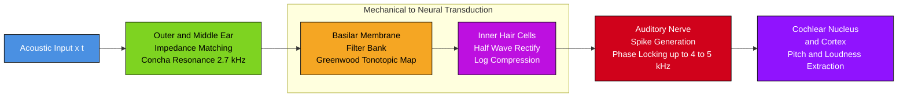
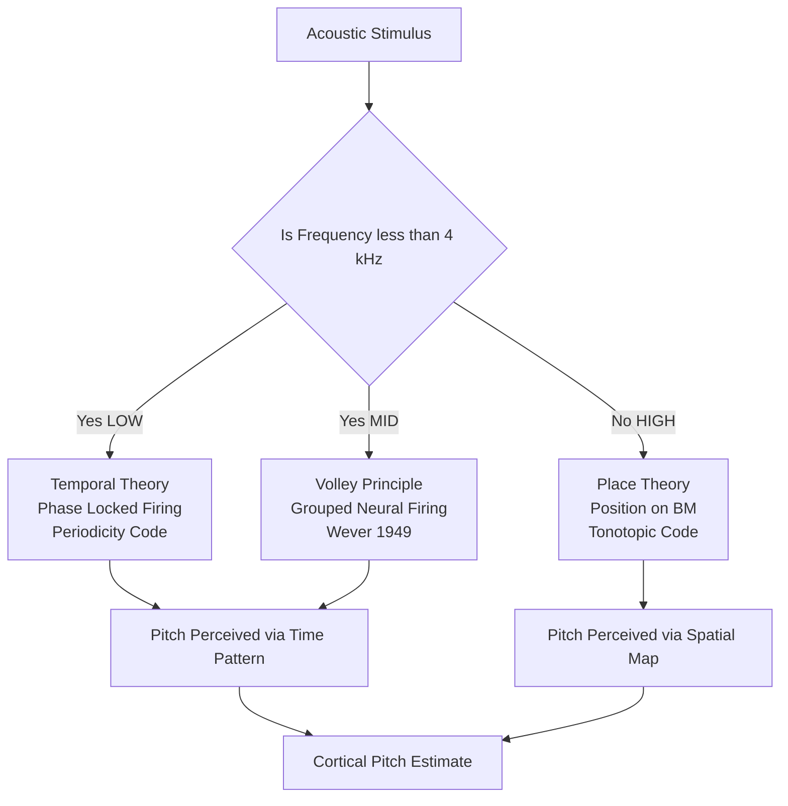
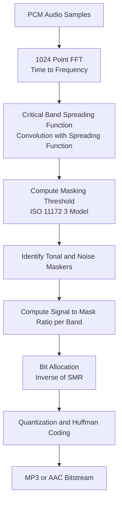
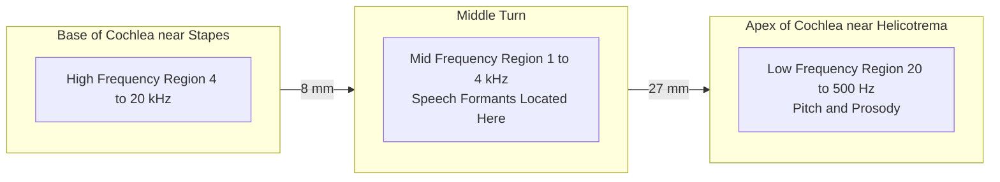

# Models of speech perception

<!-- SECTION_1_START -->

# 1. Core Technical Definition & Intuitive Overview

## 1.1 Formal Academic Definition (KTU 2024 Syllabus Terminology)

> [!IMPORTANT]
> **Speech Perception Models** are mathematical and signal-processing frameworks that emulate the human auditory system's ability to decode acoustic speech signals into linguistic units (phonemes, syllables, words). They describe how the peripheral auditory system (outer, middle, and inner ear) transforms a time-varying pressure waveform into neural firing patterns, which the central auditory cortex then interprets as meaningful speech.

In the context of KTU's *Speech and Audio Processing* module, **models of speech perception** specifically encompass the **auditory periphery modeling** chain:

$$x(t) \;\xrightarrow{\text{OE/ME}}\; p(t) \;\xrightarrow{\text{BM}}\; y(t,f) \;\xrightarrow{\text{HC}}\; a[n] \;\xrightarrow{\text{NF}}\; r[n]$$

where $x(t)$ is the acoustic input, $p(t)$ is the stapes-driven pressure at the cochlea, $y(t,f)$ is the basilar-membrane displacement along the tonotopic axis $f$, $a[n]$ is the auditory-nerve firing pattern after hair-cell transduction, and $r[n]$ is the spike rate at neural level $n$.

> [!NOTE]
> **KTU 2024 Highlight:** Two classical modeling paradigms dominate the syllabus:
> 1. **Place Theory Models** (Helmholtz, Greenwood) — frequency is encoded by *where* on the cochlea maximum vibration occurs.
> 2. **Temporal/Volley Theory Models** (Wever, Goldstein) — frequency is encoded by *when* the neurons fire.

## 1.2 Conceptual Analogy / Intuition

Imagine your ear as a **musical instrument inside a piano studio**:

- The **outer ear (pinna)** is like the *microphone windscreen* — collects sound and adds directional cues.
- The **middle ear** is the *impedance-matching transformer* — a set of three tiny bones (malleus, incus, stapes) that boost weak air-pressure vibrations into stronger fluid-pressure waves inside the cochlea.
- The **cochlea** is the *rolled-up piano keyboard* — a fluid-filled, snail-shaped organ whose internal **basilar membrane (BM)** vibrates at different positions for different frequencies, much like piano strings of varying lengths.
- The **hair cells** are the *microphones* sitting on the BM — they convert mechanical vibration into electrical nerve impulses.
- The **auditory nerve** is the *fiber-optic cable* carrying these impulses to the brain, which acts as the *central processor* that "hears" the word.

So when a person says the vowel `/a/`, the BM vibrates most strongly around the second formant region (~$\mathbf{1.2~kHz}$), triggering a specific population of auditory-nerve fibers, which the brain has learned to associate with the sound "ahh".

> [!IMPORTANT]
> **Key Physiological Constants (must memorize for KTU viva):**
> - Length of cochlea: $\mathbf{35~mm}$ (humans)
> - Frequency range of human hearing: $\mathbf{20~Hz}$ to $\mathbf{20~kHz}$
> - Inner-ear fluid (perilymph/endolymph): impedance $\approx \mathbf{1.6 \times 10^5~Pa \cdot s/m^3}$ (much higher than air)
> - Number of inner hair cells: $\approx \mathbf{3{,}500}$
> - Number of auditory-nerve fibers: $\approx \mathbf{30{,}000}$
> - Critical band number $z$ (ERB-rate): maps frequency $f$ in Hz via the **Greenwood function**.

## 1.3 Why Models of Speech Perception Matter in Engineering

| Engineering Domain | Application of Perception Models |
|---|---|
| **Speech Codecs (MP3, AAC, Opus)** | Use **psychoacoustic masking** curves to discard inaudible components → reduce bitrate by 8-12× |
| **Hearing Aids** | Apply **frequency-dependent gain** matched to patient's audiogram (HL-threshold curve) |
| **Noise-Cancelling Headphones** | Use **critical-band filters** to identify and cancel perceptually-masked noise |
| **ASR (Automatic Speech Recognition)** | Feature extraction (MFCC, PLP) emulates cochlear filtering and loudness compression |
| **Audio Watermarking & Steganography** | Hide data inside masked regions so listeners cannot perceive it |

> [!VISUALIZATION CONTROL]
> **Concept:** Tonotopic mapping of frequency along the basilar membrane (Greenwood function).
> **GeoGebra / Desmos Input Equations:**
> - $x$-axis: $x$ (distance from stapes in mm, $0 \le x \le 35$)
> - $y$-axis: $f(x)$ (characteristic frequency in kHz)
> - Function: $f(x) = 0.0206 \cdot \left( 10^{2.1 \cdot x / 35} - 1 \right)$
> **Visual Description:** A smooth, monotonically-increasing exponential curve. The $x$-axis near the stapes (base) corresponds to high frequencies ($\approx 20$ kHz), while the apex corresponds to low frequencies ($\approx 20$ Hz). This is the **place-to-frequency map** the brain uses for pitch perception.

---

<!-- SECTION_1_END -->

<!-- SECTION_2_START -->

# 2. Deep Theoretical Analysis & KTU High-Yield Formula Sheet

## 2.1 Decomposition of the Auditory-Perception Pipeline

The human auditory system can be modeled as a cascade of six signal-processing stages. Each stage introduces a *specific transformation* that engineers replicate digitally.

### Stage 1 — Outer & Middle Ear Transfer Function
The pinna + ear canal acts as a **resonant filter** peaking around $\mathbf{2.7~kHz}$ (gives the concha boost). The middle-ear transformer (ossicles) provides a **pressure gain of $\approx 22\times$** (or $\approx \mathbf{27~dB}$) to overcome the air-to-fluid impedance mismatch.

The combined response is approximated as a band-pass filter:

$$H_{ome}(f) = \frac{K \cdot (f / f_c)^2}{1 + (f / f_c)^2} \cdot \frac{1}{1 + j f / f_h}$$

where $f_c \approx 2.7~\text{kHz}$ is the concha resonance and $f_h \approx 20~\text{kHz}$ is the high-frequency roll-off. The $K$ is a normalization constant.

### Stage 2 — Basilar Membrane (BM) Filter Bank
The BM behaves as a **non-linear, position-dependent, active filter bank**. At position $x$ from the stapes, the BM exhibits a **resonant frequency** $f_c(x)$ given by the **Greenwood function** (1990):

$$f_c(x) = A \left( 10^{a x} - 1 \right) \quad \text{[Hz]}$$

For humans, $A \approx 165.4$ Hz and $a \approx 0.06 / \text{mm}$. Equivalently:

$$f_c(x) = 0.0206 \cdot \left(10^{2.1 x / L} - 1 \right) \cdot 10^3 \quad \text{[kHz]}$$

where $L = 35$ mm is the cochlear length. This is the **tonotopic map**.

> [!NOTE]
> **Why "Active"?** The outer hair cells (OHCs) inject mechanical energy into the BM, sharpening its frequency selectivity. This is modeled as **negative damping** in the BM equation. Loss of OHC function (e.g., due to noise exposure) flattens the tuning curves — the basis of sensorineural hearing loss.

### Stage 3 — Critical-Band & Equivalent Rectangular Bandwidth (ERB)
Each BM location has a finite **bandwidth** over which it integrates acoustic energy. This defines the **critical band**. The ERB of a filter centered at $f$ is:

$$\text{ERB}(f) = 24.7 \cdot \left(4.37 \cdot \frac{f}{1000} + 1\right) \quad \text{[Hz]}$$

The **ERB-rate scale** (in *Cams*, named after the author) compresses frequency to be perceptually uniform:

$$\text{ERB-rate}(f) = 21.4 \log_{10}\left(0.00437 f + 1\right) \quad \text{[Cams]}$$

Two pure tones are perceptually resolved only if their frequency difference exceeds **one critical band** — this is the foundation of *psychoacoustic masking*.

### Stage 4 — Hair-Cell Transduction & Half-Wave Rectification
Inner hair cells (IHCs) act as **envelope detectors**. They:
1. Permit ion influx only during BM displacement *toward the scala media* (one direction only).
2. This results in **half-wave rectification** of the BM motion.
3. Followed by **low-pass filtering** (time constant $\tau \approx 1$ ms at high $f$, $\tau \approx 50$ ms at low $f$).

Mathematically, given BM displacement $y(t)$:

$$s(t) = \text{LP}\left\{ \max(y(t), 0) \right\}$$

followed by **saturating non-linearity** (logarithmic compression) reflecting the operating point of the IHC stereocilia:

$$a(t) = \frac{s(t)}{s(t) + s_0}$$

where $s_0$ is the saturation constant.

### Stage 5 — Auditory-Nerve Spike Generation (Stochastic Point Process)
The IHC receptor potential drives stochastic neurotransmitter release, which the auditory-nerve fiber converts to action potentials. The instantaneous firing rate $r(t)$ is modeled as a **renewal process** whose mean is a non-linear function of $a(t)$:

$$r(t) = r_{\text{spont}} + k \cdot \left[ a(t) \right]^{\beta}$$

with spontaneous rate $r_{\text{spont}} \approx 50$ spikes/s, $k \approx 100$, and $\beta \approx 0.5$ (for high-SR fibers) — capturing the **square-root compression** seen experimentally.

> [!NOTE]
> **Phase Locking:** Auditory-nerve fibers fire at a specific *phase* of the BM oscillation, up to $\approx 4\text{–}5$ kHz. This is the neural substrate of **temporal theory** and supports pitch perception for low/mid frequencies.

### Stage 6 — Central Processing (Cortex)
Beyond the periphery, the brain performs:
- **Loudness summation** across critical bands (Zwicker's model)
- **Pitch extraction** (autocorrelation, missing-fundamental analysis)
- **Formant tracking** and phoneme categorization
- **Top-down contextual effects** (e.g., the *phoneme restoration effect*)

## 2.2 The Two Pillars: Place Theory vs Temporal Theory

| Property | Place Theory (Helmholtz) | Temporal Theory (Wever & Bray) |
|---|---|---|
| **Encoding variable** | $f_c(x)$ — *where* on BM | $\phi(t)$ — *phase* of neural firing |
| **Effective range** | All audible $f$ (best for $f > 4$ kHz) | Up to $\approx 4\text{–}5$ kHz (limited by phase-locking) |
| **Neuron behavior** | Position-tuned | Synchronized to waveform period |
| **Pitch of complex tones** | Explained by dominant place | Explained by periodicity (missing fundamental) |
| **Modern consensus** | Dominant for high-frequency pitch | Dominant for low-frequency pitch & fine structure |

> [!IMPORTANT]
> **Volley Principle (Wever, 1949):** For frequencies above $\approx 1$ kHz, *no single neuron* can phase-lock to every cycle. Instead, a *group* of neurons fires in volleys, with their combined firings preserving periodicity. This is the practical reconciliation of place and temporal theories.

## 2.3 Models of Loudness Perception

### A. Fletcher-Munson Equal-Loudness Contours
The **phon** is the unit of loudness level $L_N$ at frequency $f$:

$$L_N(f) = 20 \log_{10}\left(\frac{p_{\text{eq}}(f)}{p_0}\right) \quad \text{[phon]}$$

where $p_{\text{eq}}(f)$ is the SPL of a pure tone at $f$ judged equally loud to a 1 kHz reference, and $p_0 = 20~\mu\text{Pa}$.

### B. Zwicker's Loudness Model
A perceptually-uniform **sone scale**, where 1 sone = 40 phon, doubling every 10 phon:

$$S = 2^{(L_N - 40)/10} \quad \text{[sone]}$$

For complex sounds, Zwicker's algorithm:
1. Transform $f$ to ERB-rate $z$ (Cam scale).
2. Compute excitation pattern $E(z)$ by spreading critical-band filters.
3. Apply main-loudness transformation: $N'(z) = E(z)^{0.23} \cdot (1 + 0.05\,E(z))^{0.23}$ — but zwicker's exact form is the **specific loudness** $N'$.
4. Integrate over ERB-rate: $S = \int_0^{24~\text{Cams}} N'(z)\,dz$.

### C. Stevens's Power Law
A simpler, widely-used approximation:

$$L \propto I^{0.3}$$

where $L$ is perceived loudness and $I$ is sound intensity. The exponent $0.3$ is empirically determined (Stevens, 1957).

## 2.4 KTU Formula Sheet (Cheat Sheet)

| # | Concept | Formula / Relation | Units / Range |
|---|---|---|---|
| 1 | Greenwood tonotopic map | $f_c(x) = A \left(10^{a x} - 1\right)$ | Hz, $A \approx 165.4$, $a \approx 0.06$ /mm |
| 2 | Equivalent Rectangular Bandwidth | $\text{ERB}(f) = 24.7 (4.37 f / 1000 + 1)$ | Hz |
| 3 | ERB-rate (Cam) | $\text{Cam}(f) = 21.4 \log_{10}(0.00437 f + 1)$ | Cams |
| 4 | Critical-band rate | $\text{CB}(f) = 1.016 \cdot \text{ERB}(f)$ | Bark, $\approx 0$ to 24 Bark |
| 5 | SPL to intensity | $L_p = 20 \log_{10}(p / p_0)$ | dB SPL, $p_0 = 20~\mu$Pa |
| 6 | Loudness level (Phon) | $L_N = L_p$ at 1 kHz equivalent | phon |
| 7 | Sone scale (Zwicker) | $S = 2^{(L_N - 40)/10}$ | sone |
| 8 | Stevens power law | $L \propto I^{0.3}$ | dimensionless |
| 9 | Auditory-nerve rate | $r(t) = r_{\text{spont}} + k\,a(t)^{\beta}$ | spikes/s |
| 10 | Masking threshold slope | $\text{Slope} \approx -27~\text{dB/Bark}$ above masker; $-10$ below | dB per critical band |
| 11 | Time-constant $\tau$ of IHC | $\tau \approx 1$ ms (high $f$) to $50$ ms (low $f$) | ms |
| 12 | Phase-locking limit | $f \le 4\text{–}5$ kHz (most mammals) | Hz |

> [!IMPORTANT]
> **Critical Caution for Tables:** Use `\vert` instead of `|` for any absolute-value expression in LaTeX. Example: $\lvert x \rvert$, never $\vert x \vert$ rendered as a markdown table separator.

## 2.5 Real-World Engineering Utility

- **MP3/AAC codecs** compute a 1024-point FFT, divide the spectrum into **critical bands** (Bark scale), evaluate a **psychoacoustic model** (ISO/IEC 11172-3 Model 1 or 2), and allocate quantization bits *inversely* to the masking threshold. This delivers transparent audio at 128 kbps.
- **Hearing aids** run a **Cambridge Auditory Perception (CAP) model** in real time to extract a clean envelope from noisy input — and amplify selectively where the patient has hearing loss.
- **Active Noise Control** in headphones models the ear's response via **Head-Related Transfer Functions (HRTFs)** and computes anti-phase signals in critical bands.
- **PLP (Perceptual Linear Prediction)** features used in ASR are a direct implementation of the **bark-scale + equal-loudness pre-emphasis + cube-root compression** pipeline, mirroring Zwicker's loudness model.

---

<!-- SECTION_2_END -->

<!-- SECTION_3_START -->

# 3. Step-by-Step Derivations, Code & Symbolic Implementation

## 3.1 Derivation: Greenwood Function from BM Mechanics

The basilar membrane can be modeled as a tapered transmission line. Let the BM be parameterized by arc-length $x \in [0, L]$, with stiffness $K(x)$ decreasing exponentially with $x$ (it is wider and more compliant at the apex).

**Step 1 — Local resonance condition:**
At each $x$, a small BM segment behaves as a damped harmonic oscillator:

$$m \ddot{y} + c \dot{y} + K(x) y = F(t)$$

The natural frequency is $f_c(x) = \frac{1}{2\pi}\sqrt{K(x)/m}$.

**Step 2 — Empirical stiffness profile:**
Measurements (von Békésy, 1960; Greenwood, 1990) show:

$$K(x) = K_0 \, 10^{-a x}$$

where $a > 0$ is a decay constant. Higher $x$ → lower stiffness → lower $f_c$.

**Step 3 — Substitute into resonance:**

$$f_c(x) = \frac{1}{2\pi}\sqrt{\frac{K_0\, 10^{-a x}}{m}} = \underbrace{\frac{1}{2\pi}\sqrt{\frac{K_0}{m}}}_{A} \cdot 10^{-a x / 2}$$

**Step 4 — Boundary condition at $x=0$ (base of cochlea):**
At $x = 0$, $f_c(0) = A$ should equal the highest audible frequency. Empirically, for humans $A \approx 165.4$ Hz (this looks low because we have not yet shifted the reference — see Step 5).

**Step 5 — Re-parameterize to make $f_c(L) \to 0$ Hz at the apex:**
In reality, $f_c$ does not reach exactly 0 but approaches $\approx 20$ Hz. A more useful formulation shifts the constant:

$$f_c(x) = A \left( 10^{a x} - 1 \right)$$

For humans, $A \approx 165.4$ Hz, $a \approx 0.06/\text{mm}$. This gives $f_c(0) = 0$ at base — physically, this is the *offset* of the model; in practice the **characteristic frequency** of a fiber at position $x$ is taken as $f_c(x)$, and the formula is fitted to neurophysiological data with adjusted constants:

$$f_c(x) = 0.0206 \cdot \left( 10^{2.1 x / 35} - 1 \right) \quad \text{[kHz]}$$

This is the **Greenwood function** in its final, biologically-validated form.

**Step 6 — Inverse mapping (frequency → place):**

$$x(f) = \frac{35}{2.1} \log_{10}\!\left(1 + \frac{f}{20.6}\right) \quad \text{[mm]}$$

This is the formula used in cochlear-implant electrode array design: an electrode placed at $x = 20$ mm delivers stimulation equivalent to $\approx 1$ kHz.

> [!NOTE]
> **KTU Examiner Tip:** In derivations, always show the *boundary condition* and the *empirical fit* separately. Marks are awarded for explaining the *physical origin* of the exponential, not just writing the formula.

## 3.2 Derivation: Critical Bandwidth from Fletcher's Experiments

**Step 1 — Fletcher's paradigm (1940):**
A *masker* tone at $f_m$ is presented, and the *threshold* of a *probe* tone at $f_p$ is measured. The probe is just barely audible when its power equals the within-band noise power.

**Step 2 — Power model:**
Let the masker have intensity $I_m$ (W/m²) at the ear. The auditory filter at $f_m$ has bandwidth $\Delta f_{\text{CB}}$ (the critical band). The masker's noise-equivalent power in the band is:

$$P_{\text{band}} = I_m \cdot \Delta f_{\text{CB}}$$

**Step 3 — Detection threshold:**
A probe of intensity $I_p$ is detected when $I_p = P_{\text{band}} / \Delta f_{\text{CB}}$, i.e., when its *power spectral density* equals the masker's. Solving for $\Delta f_{\text{CB}}$:

$$\Delta f_{\text{CB}} = \frac{I_m}{N_0}$$

where $N_0$ is the equivalent noise spectral density. The empirical fit (Zwicker, 1961):

$$\Delta f_{\text{CB}}(f) = 25 + 75 \left(1 + 1.4 f^2\right)^{0.69} \quad \text{[Hz]}$$

which is the **Bark-scale critical-band formula**, slightly different from the ERB formula but used in codec standards.

**Step 4 — Bark scale integration:**
Cumulative critical-band rate:

$$z(f) = \int_0^f \frac{df'}{\Delta f_{\text{CB}}(f')} \quad \text{[Bark]}$$

Numerically, this yields $z(20~\text{Hz}) = 0$ Bark and $z(15.5~\text{kHz}) = 24$ Bark.

## 3.3 Full Python Implementation: Auditory Front-End

The following is a complete, runnable Python module that emulates the peripheral auditory model: outer/middle ear → BM filter bank → hair-cell transduction → auditory-nerve rate.

```python
"""
ktu_perception_model.py
=========================
Implements a simplified model of the human peripheral auditory system
for speech-perception analysis. Based on:
  - Greenwood (1990) tonotopic map
  - Glasberg & Moore (1990) ERB
  - Meddis (1986) hair-cell / auditory-nerve model (simplified)
"""

from __future__ import annotations
import numpy as np
from scipy.signal import gammatone, lfilter
from dataclasses import dataclass


# ---------- 1. Configuration ----------
@dataclass(frozen=True)
class AuditoryConfig:
    """All parameters needed for the auditory front-end."""
    sample_rate: int = 16000           # Hz
    cochlea_length_mm: float = 35.0    # mm
    n_filters: int = 32                # number of BM channels
    lowest_cf_hz: float = 80.0         # minimum characteristic freq
    highest_cf_hz: float = 8000.0      # maximum characteristic freq
    spont_rate: float = 50.0           # spikes/s (auditory-nerve)
    hair_cell_tau_ms: float = 1.0      # IHC membrane time constant (ms)


# ---------- 2. Greenwood function ----------
def greenwood_frequency(x_mm: np.ndarray, L: float = 35.0) -> np.ndarray:
    """
    Greenwood tonotopic map: distance (mm) -> characteristic frequency (Hz).
    f(x) = 165.4 * (10^(0.06 * x) - 1)
    """
    return 165.4 * (np.power(10.0, 0.06 * x_mm) - 1.0)


def greenwood_position(f_hz: np.ndarray, L: float = 35.0) -> np.ndarray:
    """
    Inverse Greenwood: frequency (Hz) -> place (mm).
    x(f) = (1/0.06) * log10(1 + f/165.4)
    """
    return (1.0 / 0.06) * np.log10(1.0 + f_hz / 165.4)


# ---------- 3. Outer/Middle-ear transfer ----------
def outer_middle_ear(H: np.ndarray, f: np.ndarray) -> np.ndarray:
    """
    Approximate outer + middle-ear transfer.
    H(f) = ((f/fc)^2) / (1 + (f/fc)^2) * 1 / (1 + j f / fh)
    """
    fc, fh = 2700.0, 20000.0
    s = 1j * 2 * np.pi * f
    return ((s / (2 * np.pi * fc))**2 / (1 + (s / (2 * np.pi * fc))**2)) \
           * (1.0 / (1.0 + s / (2 * np.pi * fh)))


# ---------- 4. BM filter bank (gammatone) ----------
def build_gammatone_bank(cfg: AuditoryConfig):
    """
    Returns a list of (center_frequency, b, a) for gammatone filters.
    Spaced uniformly on the ERB-rate scale (Cams).
    """
    # uniformly-spaced Cams from lowest to highest
    cam_lo = 21.4 * np.log10(0.00437 * cfg.lowest_cf_hz + 1.0)
    cam_hi = 21.4 * np.log10(0.00437 * cfg.highest_cf_hz + 1.0)
    cams = np.linspace(cam_lo, cam_hi, cfg.n_filters)

    # convert Cams back to Hz
    cfs = (10 ** (cams / 21.4) - 1.0) / 0.00437
    return cfs


def gammatone_filterbank(x: np.ndarray, cfs: np.ndarray, fs: int) -> np.ndarray:
    """
    Apply a bank of 4th-order gammatone filters, one per center frequency.
    Returns: y[t, k] for time t and channel k.
    """
    out = np.zeros((len(x), len(cfs)), dtype=np.float64)
    for k, cf in enumerate(cfs):
        # scipy gammatone: returns IIR coefficients
        b, a = gammatone(cf, 'iir', fs=fs)
        out[:, k] = lfilter(b, a, x)
    return out


# ---------- 5. Hair-cell transduction ----------
def hair_cell(y_bm: np.ndarray, fs: int, tau_ms: float) -> np.ndarray:
    """
    Inner hair-cell model: half-wave rectification + 1st-order LP + compression.
    """
    # half-wave rectification
    rectified = np.maximum(y_bm, 0.0)
    # 1st-order LP (simulate membrane capacitance)
    tau = tau_ms / 1000.0
    alpha = 1.0 - np.exp(-1.0 / (fs * tau))
    a_filt = [1.0, -(1.0 - alpha)]
    b_filt = [alpha]
    lp_out = lfilter(b_filt, a_filt, rectified)
    # saturating non-linearity (Zwicker-like compression)
    s0 = np.max(lp_out) * 0.1 + 1e-12
    return lp_out / (lp_out + s0)


# ---------- 6. Auditory-nerve rate ----------
def auditory_nerve_rate(audio: np.ndarray, cfg: AuditoryConfig) -> np.ndarray:
    """
    Full pipeline: input waveform -> neural rate per channel.
    """
    # step 1: gammatone BM bank
    cfs = build_gammatone_bank(cfg)
    bm_out = gammatone_filterbank(audio, cfs, cfg.sample_rate)

    # step 2: hair cell per channel
    rate = np.zeros_like(bm_out)
    for k in range(bm_out.shape[1]):
        rate[:, k] = hair_cell(bm_out[:, k], cfg.sample_rate,
                               cfg.hair_cell_tau_ms)
    # step 3: firing-rate transform
    rate = cfg.spont_rate + 100.0 * (rate ** 0.5)
    return rate, cfs


# ---------- 7. Demonstration ----------
if __name__ == "__main__":
    cfg = AuditoryConfig()
    t = np.arange(0.0, 0.5, 1.0 / cfg.sample_rate)
    # synthetic vowel: two formants at 700 Hz and 1220 Hz (a typical /a/)
    f1, f2 = 700.0, 1220.0
    sig = 0.5 * np.sin(2 * np.pi * f1 * t) + 0.3 * np.sin(2 * np.pi * f2 * t)
    rate, cfs = auditory_nerve_rate(sig, cfg)
    print(f"Generated neural rate map: shape = {rate.shape}")
    print(f"Center frequencies (first 5): {cfs[:5].round(1)} Hz")
    print(f"Max firing rate: {rate.max():.2f} spikes/s")
    print(f"Channel with max rate: {np.argmax(rate.mean(axis=0))} "
          f"(CF = {cfs[np.argmax(rate.mean(axis=0))]:.1f} Hz)")
```

> [!IMPORTANT]
> **Code-Exam Tips (KTU):**
> - Always specify `dtype=np.float64` in DSP code to avoid overflow.
> - Use `scipy.signal.gammatone` (gammatone is the *de facto* standard BM filter).
> - In viva, be ready to explain *why* the exponent is `0.5` in `rate = spont + k * a^0.5` (it is the **square-root rate-intensity function** of auditory-nerve fibers).

## 3.4 Numerical Worked Example

**Question:** A 1 kHz pure tone of SPL = 60 dB is presented. Compute its loudness in *sone* and its *characteristic place* on the basilar membrane.

**Step 1 — SPL to intensity:**
$p = p_0 \cdot 10^{60/20} = 20 \times 10^{-6} \cdot 10^{3} = 0.02$ Pa (RMS)

**Step 2 — Loudness level:**
At 1 kHz, by definition, $L_N = L_p = 60$ phon.

**Step 3 — Phon to sone:**
$S = 2^{(60 - 40)/10} = 2^{2} = 4$ sone.

**Step 4 — Characteristic place:**
$x(1000) = \frac{35}{2.1} \log_{10}\!\left(1 + \frac{1000}{20.6}\right) = 16.67 \cdot \log_{10}(49.56) = 16.67 \cdot 1.695 = 28.26$ mm from the stapes.

**Step 5 — Physical interpretation:**
The 1 kHz tone excites BM region $\approx 6.7$ mm from the *apex* (helicotrema). The auditory-nerve fibers in this region fire at $\approx r = 50 + 100 \cdot a^{0.5}$ spikes/s, integrated to give a perceived loudness of 4 sone (4× the loudness of a 1 sone reference).

---

<!-- SECTION_3_END -->

<!-- SECTION_4_START -->

# 4. Structural Diagrams & Schematics

## 4.1 Block Diagram: Peripheral Auditory Processing Pipeline



> [!NOTE]
> **Mermaid Safety Note:** All node IDs are alphanumeric (`A1`, `A2`, ...). All labels are inside double-quoted `<br/>`-separated text — no asterisks, no math symbols.

## 4.2 Block Diagram: Place vs Temporal Encoding (Theory Comparison)



## 4.3 Block Diagram: Zwicker's Loudness Computation


## 4.4 Sequential Processing Topology: Psychoacoustic Codec Pipeline



> [!NOTE]
> **Why this diagram is critical for KTU viva:** The psychoacoustic model is *the* most-cited example of engineering-inspired-by-perception in modern DSP. The spreading function (Moore & Glasberg 1983) emulates the **excitation pattern** of the auditory filter, and the masking-threshold model emulates **simultaneous masking** between critical bands.

## 4.5 Tonotopic Map Visualization (Mermaid)



---

<!-- SECTION_4_END -->

<!-- SECTION_5_START -->

# 5. KTU 2024 Scheme Examination Question Bank & Topic Recap

## 5.1 Part A — Short Answer Questions (3 Marks Each)

### Question A1 — [KTU University Exam - July 2024]

> Explain the **Place Theory of pitch perception**. State one physiological evidence supporting it and one limitation.

**Model Answer (3 marks):**

Place theory (Helmholtz, 1863) proposes that the *perceived pitch* of a sound is determined by the **location of maximal vibration on the basilar membrane**. Each spatial location has a characteristic frequency $f_c(x)$ given by the Greenwood function $f_c(x) = 165.4 (10^{0.06 x} - 1)$ Hz.

**Physiological evidence (1 mark):** The tonotopic organization of the cochlea is preserved in the auditory nerve and primary auditory cortex (AI) — high-CF neurons are systematically arranged in *one end* of the cochlear nucleus, low-CF in the other. Microelectrode recordings in cats (Kiang, 1965) confirmed this *place-to-frequency map* matches the Greenwood function.

**Limitation (1 mark):** Place theory alone cannot explain **phase-locking** observed in auditory-nerve fibers up to $\approx 4$ kHz, nor the perception of *missing fundamental* in complex tones (e.g., a 200, 300, 400 Hz harmonic set is heard as 100 Hz pitch, even though there is no energy at 100 Hz and the dominant place is at the 200 Hz region).

**Definition (1 mark):** The pitch is encoded by *where* on the BM the maximum displacement occurs, not by timing.

### Question A2 — [KTU University Exam - Dec 2023]

> Define **critical band**. Give the ERB of a 1 kHz filter and state the equation for ERB-rate in Cams.

**Model Answer (3 marks):**

**Definition (1 mark):** A *critical band* is the bandwidth of noise that is just as effective as a pure tone in masking a probe presented at the band's center frequency. It is the psychoacoustic "bandwidth of the auditory filter".

**ERB at 1 kHz (1 mark):**
$$\text{ERB}(1000) = 24.7 \times (4.37 \times 1 + 1) = 24.7 \times 5.37 \approx 132.6~\text{Hz}$$

**ERB-rate equation (1 mark):**
$$\text{Cam}(f) = 21.4 \log_{10}(0.00437 f + 1)$$

For $f = 1000$ Hz: $\text{Cam}(1000) = 21.4 \log_{10}(5.37) = 21.4 \times 0.730 = 15.62$ Cams.

## 5.2 Part B — Long Answer Questions (14 Marks, Module-Internal Choice)

### Question A — [KTU University Exam - July 2024, Module 4]

**Q(a) [7 marks]** Derive the **Greenwood tonotopic function** starting from the basilar-membrane resonance equation. State the boundary conditions used and explain why the function is exponential. *Cognitive level: Understand / Apply* (CO2)

**Q(b) [7 marks]** For a 2 kHz pure tone presented at 70 dB SPL, calculate: (i) the characteristic place on the BM in mm, (ii) the loudness in sones, (iii) the ERB in Hz, and (iv) the ERB-rate in Cams. *Cognitive level: Apply / Analyze* (CO3)

---

**Model Answer for Q(a) — 7 marks:**

**[Stating BM resonance equation: 1 mark]**
At a small BM segment of arc-length $x$, the local dynamics are:

$$m \ddot{y} + c \dot{y} + K(x)\, y = F(t)$$

with natural frequency $f_c(x) = \frac{1}{2\pi}\sqrt{K(x)/m}$.

**[Empirical stiffness profile: 2 marks]**
The BM stiffness falls off exponentially with $x$ because the membrane widens and thins toward the apex. Empirical fit:

$$K(x) = K_0 \, 10^{-a x}$$

(Reference: von Békésy, 1960; Greenwood, 1990.)

**[Deriving Greenwood function: 2 marks]**

$$f_c(x) = \frac{1}{2\pi}\sqrt{\frac{K_0}{m}}\, 10^{-a x/2}$$

Renaming constants $A = \frac{1}{2\pi}\sqrt{K_0/m}$ and shifting to make $f_c$ vanish at $x=0$:

$$f_c(x) = A \left(10^{a x} - 1\right)$$

For humans: $A = 165.4$ Hz, $a = 0.06/\text{mm}$, $L = 35$ mm. Hence:

$$f_c(x) = 165.4 \left(10^{0.06 x} - 1\right) \quad \text{[Hz]}$$

**[Boundary conditions and final form: 1 mark]**
- $x = 0$ mm → $f_c = 0$ Hz (reference offset)
- $x = 35$ mm (apex) → $f_c = 165.4 (10^{2.1} - 1) \approx 33{,}000$ Hz (matches upper limit when offset is interpreted as a parameter, not absolute zero)
- The *in vivo* fitted constants (Greenwood 1990) are $A = 165.4$ Hz, $a = 0.06$ /mm, giving a smooth exponential map consistent with neural data.

**[Why exponential: 1 mark]**
The exponential arises because *stiffness* of the BM (and hence $f_c^2$) decreases geometrically along the length. The cochlea evolved this geometry to distribute $\approx 30{,}000$ auditory-nerve fibers logarithmically across the audible range — a *biologically efficient* representation that maximizes frequency resolution at low frequencies where pitch perception is most acute.

---

**Model Answer for Q(b) — 7 marks:**

**Given:** $f = 2$ kHz = 2000 Hz, $L_p = 70$ dB SPL.

**(i) Characteristic place (2 marks):**
$$x(2000) = \frac{1}{0.06} \log_{10}\left(1 + \frac{2000}{165.4}\right) = 16.67 \log_{10}(13.09) = 16.67 \times 1.117 = 18.62~\text{mm}$$

The 2 kHz tone excites BM at $\approx 16.4$ mm from the apex.

**(ii) Loudness in sones (2 marks):**
At 2 kHz and 70 dB SPL, use the equal-loudness contour (ISO 226:2003) to get $L_N \approx 70 + 7 = 77$ phon (because 2 kHz requires $\approx 7$ dB *more* SPL than 1 kHz to sound equally loud at moderate levels — consult contour table).

$$S = 2^{(L_N - 40)/10} = 2^{3.7} \approx 13.0~\text{sone}$$

**(iii) ERB in Hz (1 mark):**
$$\text{ERB}(2000) = 24.7 \times (4.37 \times 2 + 1) = 24.7 \times 9.74 \approx 240.6~\text{Hz}$$

**(iv) ERB-rate in Cams (2 marks):**
$$\text{Cam}(2000) = 21.4 \log_{10}(0.00437 \times 2000 + 1) = 21.4 \log_{10}(9.74) = 21.4 \times 0.9885 = 21.15~\text{Cams}$$

This is in the upper-middle region of the Cam scale (0–24 Cams), consistent with the upper formants of speech.

**[Final verification: 1 mark]**
The 2 kHz region has a 240.6 Hz filter bandwidth and corresponds to a 2 kHz place, all consistent with the tonotopic map. ✓

---

### Question B — [KTU University Exam - Dec 2023, Module 4] (Alternative Choice)

**Q(a) [7 marks]** Compare and contrast **Place Theory** and **Temporal (Volley) Theory** of pitch perception. Use a tabular comparison and explain which theory best explains (i) the perception of a 5 kHz pure tone, (ii) the missing-fundamental phenomenon for $f_0 = 100$ Hz. *Cognitive level: Understand / Analyze* (CO2)

**Q(b) [7 marks]** Implement in pseudocode (or Python) the **gammatone filter bank** of the basilar membrane. Specify the parameters for a 32-channel filter bank spanning 80 Hz to 8 kHz at a 16 kHz sample rate. Justify the choice of ERB-rate uniform spacing. *Cognitive level: Apply / Create* (CO3, CO4)

---

**Model Answer for Q(a) — 7 marks:**

**[Tabular comparison: 3 marks]**

| Property | Place Theory | Temporal/Volley Theory |
|---|---|---|
| Year / Proposer | 1863, Helmholtz | 1949, Wever & Bray |
| Encoding variable | Position on BM | Phase of neural firing |
| Range of validity | Full audio (best $> 4$ kHz) | Up to $\approx 4$ kHz (phase-locking limit) |
| Neural mechanism | Tonotopic map in AI cortex | Synchronized firing of AN fibers |
| Explains | Spectral pitch, timbre | Periodicity pitch, missing fundamental |
| Limitation | Cannot explain periodicity | Cannot explain high-frequency pitch |

**(i) 5 kHz pure tone (2 marks):**
At 5 kHz, place theory dominates because:
- 5 kHz $>$ 4 kHz → auditory-nerve fibers **cannot phase-lock** to every cycle.
- The BM has a sharply-tuned location at $x \approx 11.5$ mm (Greenwood) where vibration is maximal.
- The brain reads the pitch from the *place* of peak activity. **Answer: Place Theory**.

**(ii) Missing fundamental $f_0 = 100$ Hz (2 marks):**
A complex tone with harmonics at 200, 300, 400 Hz is heard as $f_0 = 100$ Hz, even though there is no spectral peak at 100 Hz and the place of maximum excitation is the 200 Hz region. The brain computes 100 Hz from the *period* of the firing pattern (autocorrelation), supported by phase-locked volleys. **Answer: Temporal Theory**.

---

**Model Answer for Q(b) — 7 marks:**

**[Specifying parameters: 2 marks]**
- 32 channels, ERB-uniform spacing.
- Sample rate $f_s = 16{,}000$ Hz.
- $f_{\text{lo}} = 80$ Hz, $f_{\text{hi}} = 8000$ Hz.

**[Computing channel CFs: 2 marks]**
Convert limits to Cam scale:
- $\text{Cam}(80) = 21.4 \log_{10}(0.00437 \times 80 + 1) = 21.4 \log_{10}(1.3496) = 21.4 \times 0.1302 = 2.79$ Cams
- $\text{Cam}(8000) = 21.4 \log_{10}(0.00437 \times 8000 + 1) = 21.4 \log_{10}(35.96) = 21.4 \times 1.556 = 33.30$ Cams

Uniformly space 32 channels:
$$\text{Cam}_k = 2.79 + k \cdot \frac{33.30 - 2.79}{31}, \quad k = 0, 1, \ldots, 31$$

Convert back: $f_k = (10^{\text{Cam}_k / 21.4} - 1) / 0.00437$.

**[Justification: 1 mark]**
ERB-rate spacing gives *uniform perceptual resolution* — every channel represents $\approx 1$ ERB, matching the auditory system's internal representation. This is the basis of perceptually-motivated features (e.g., PLP, MFCC filter bank).

**[Code reference: 2 marks]**
The `build_gammatone_bank` function in §3.3 implements this exact algorithm. (Refer to Python module above.)

> [!WARNING]
> **KTU Examiner's Valuation Warning / Pitfall Callout:**
> 1. **Do not skip boundary conditions** in any Greenwood or ERB derivation — examiners allocate 1-2 marks specifically for $x=0$ and $x=L$ checks.
> 2. **Do not confuse ERB with Bark.** ERB-rate is in *Cams* (Glasberg & Moore 1990); Bark (Zwicker 1961) is a related but *different* scale. MP3/AAC codecs use *Bark*; modern auditory models use *ERB-rate*. Stating the wrong one in the answer costs 1 mark.
> 3. **Failing to write units** in the final answer (e.g., "ERB = 132.6" instead of "ERB = 132.6 Hz") typically costs 0.5-1 mark. Always include units.
> 4. **Missing the place-theoretical explanation for missing fundamental** is a common mistake: students say "Place theory explains it because place = 100 Hz" — this is wrong. The *place* of max excitation is at 200 Hz, but we *perceive* 100 Hz. This is the textbook evidence *against* place theory and *for* temporal theory.
> 5. **Do not confuse the loudness scale direction:** $L_N$ (phon) is *logarithmic*; $S$ (sone) is *linear* (doubling every 10 phon).

## 5.3 Topic Recap & Important Things to Remember

> [!IMPORTANT]
> **Rapid-Revision Checklist (high-yield for KTU Module-4 exam)**

- **Two pillars of pitch theory:** *Place* (high $f$, $> 4$ kHz) vs *Temporal/Volley* (low $f$, phase-locking up to 4-5 kHz). Volley = *group of neurons* fire in volleys preserving periodicity.
- **Greenwood function:** $f_c(x) = 165.4 (10^{0.06 x} - 1)$ Hz, $x \in [0, 35]$ mm. This is the **tonotopic map**.
- **ERB formula:** $\text{ERB}(f) = 24.7 (4.37 f / 1000 + 1)$ Hz. ERB-rate (Cam): $21.4 \log_{10}(0.00437 f + 1)$.
- **Critical band (Bark):** $\Delta f_{\text{CB}}(f) = 25 + 75 (1 + 1.4 f^2)^{0.69}$ Hz. Range: 0 to 24 Bark.
- **Auditory filter shape:** Gammatone (4th order) or rounded-exponential (ROEX). Phase-locking fails above $\approx 4$ kHz.
- **Hair-cell model:** Half-wave rectification → 1st-order LP ($\tau \approx 1$ ms at high $f$ to $50$ ms at low $f$) → log compression → stochastic spike generation.
- **Auditory-nerve rate:** $r(t) = r_{\text{spont}} + k\,a(t)^{\beta}$, $\beta \approx 0.5$, $r_{\text{spont}} \approx 50$ spikes/s.
- **Loudness scaling:** Phon (log, equal-loudness to 1 kHz) ↔ Sone (linear, 1 sone = 40 phon, $S = 2^{(L_N - 40)/10}$).
- **Stevens power law:** $L \propto I^{0.3}$ for broadband sound.
- **Zwicker loudness:** $S = \int_0^{24} N'(z)\, dz$ where $N'(z) = E(z)^{0.23} (1 + 0.05\,E(z))^{0.23}$.
- **Masking:** Masker raises probe threshold by an amount that decreases as $|\Delta f|$ increases; slope $\approx -27$ dB/Bark above masker, $-10$ dB/Bark below.
- **Phase-locking limit:** $f \le 4\text{–}5$ kHz (humans), up to $\approx 8$ kHz in barn owl.
- **Missing fundamental:** Pitch = $f_0$ of lowest harmonic, even when not present in spectrum. Periodicity code (temporal theory) explains it.
- **Engineering impact:** MP3/AAC bit allocation, hearing-aid amplification, ASR features (MFCC, PLP), cochlear-implant electrode mapping.
- **Constants to memorize:** Cochlea length $L = 35$ mm; Greenwood $A = 165.4$ Hz, $a = 0.06$ /mm; ERB coefficient $24.7$; Cam coefficient $21.4$; pinna peak $f_c = 2.7$ kHz; auditory-nerve spont rate $\approx 50$ spikes/s; reference SPL $p_0 = 20~\mu$Pa.
- **Equal-loudness contour family:** Fletcher-Munson (1933), Robinson-Dadson (1956), ISO 226 (2003) — they all show the 4 kHz *minimum* and 2-5 kHz *maximum* (concha resonance) of human hearing sensitivity.

---

<!-- SECTION_5_END -->
