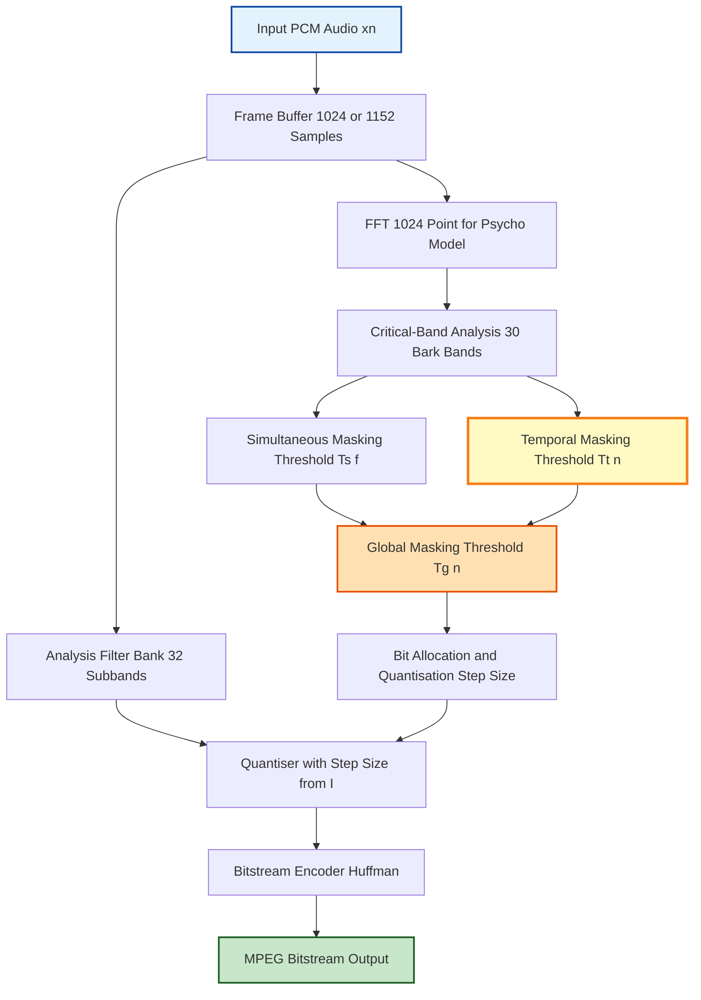
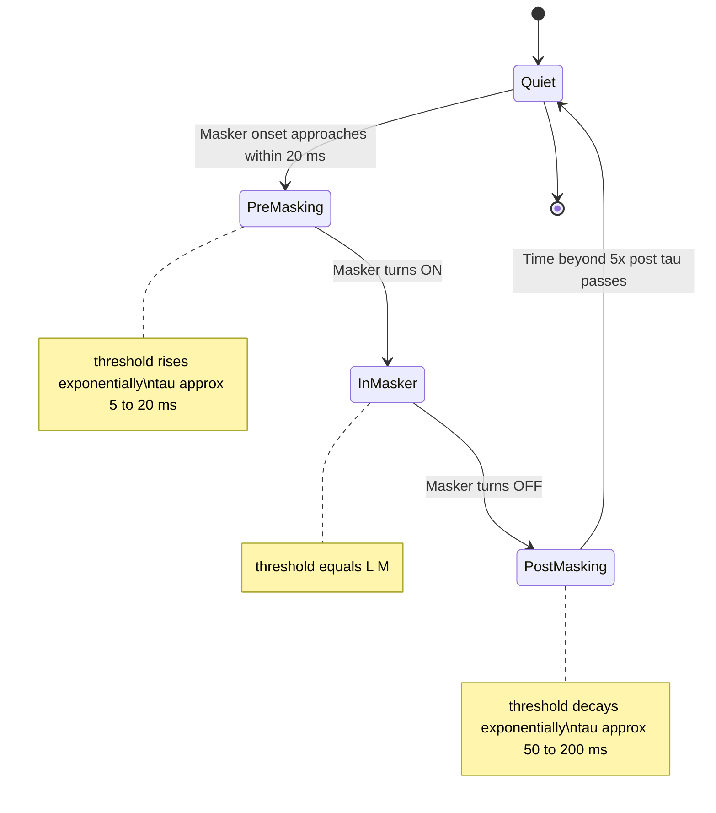
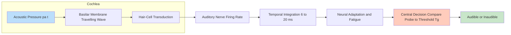
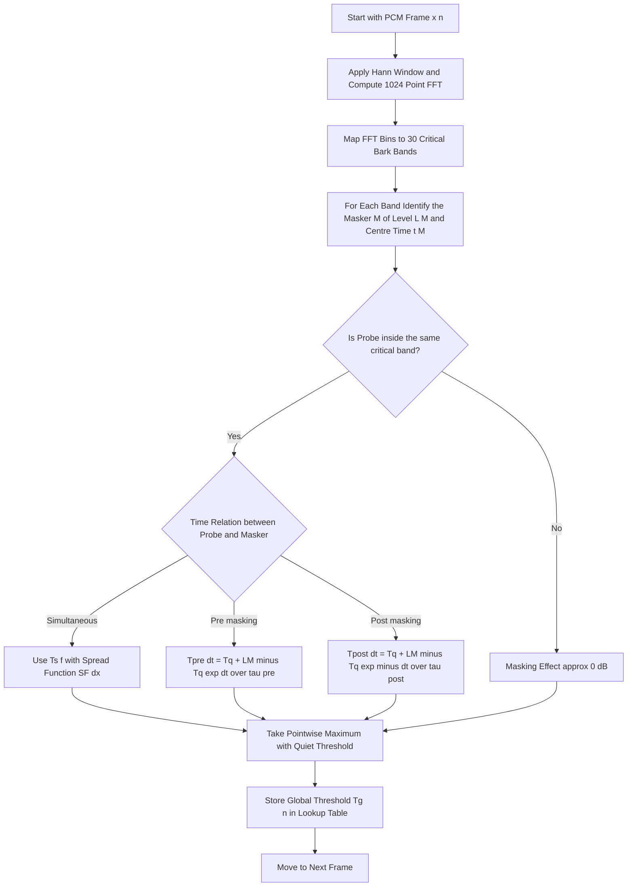

# Temporal Masking

<!-- SECTION_1_START -->

# Temporal Masking in Audio Perception

## 1.1 Formal Academic Definition

> [!IMPORTANT]
> **Temporal Masking** (also called *Non-Simultaneous Masking*) is a psychoacoustic phenomenon of the human auditory system in which the audibility threshold of a sound (the *maskee* or *probe signal*) is temporarily elevated by the presence of another sound (the *masker*) occurring at a **different point in time**, rather than at the same instant. This effect persists for a finite duration **before** and **after** the masker onset, due to the finite integration time, neural adaptation, and memory window of the cochlear and auditory-nerve response.

In the KTU 2024 Scheme framework for **PECST866 – Speech and Audio Processing**, temporal masking belongs to **Module 4: Signal Processing Models of Audio Perception** and forms the theoretical foundation of all modern **perceptual audio codecs** such as *MP3 (MPEG-1 Layer III)*, *AAC*, *Ogg Vorbis*, and *Opus*.

## 1.2 Intuitive Real-World Analogy

> [!NOTE]
> **Analogy — The Camera Flash and After-Image:**
> Imagine you are standing in a dark room. Someone suddenly switches on a bright flashlight for 0.5 s, then turns it off. For a few hundred milliseconds *after* the flash, your eyes cannot see a dim candle placed nearby — the retina is "saturated" and its sensitivity is **temporarily reduced**. This is *post-masking* (forward temporal masking). A similar effect, though shorter, occurs *before* the flash if a dim sound was already present — *pre-masking* (backward temporal masking). The ear's cochlea behaves analogously: a loud sound briefly "raises the hearing threshold" for weaker sounds in its temporal neighbourhood.

The hearing threshold, normally a flat curve at **0 dB SPL** in quiet, becomes an *elevated, time-varying function* $T(t)$ whenever a masker is active in the temporal vicinity of the probe.

## 1.3 Sub-Categories of Temporal Masking

| Type | Also Known As | Time Relation | Typical Duration | Dominant Cause |
| :--- | :--- | :--- | :--- | :--- |
| **Post-Masking** | Forward Masking | Masker ends **before** probe begins | $5$–$500$ ms | Neural fatigue, central auditory processing |
| **Pre-Masking** | Backward Masking | Masker begins **after** probe has started | $5$–$20$ ms | Auditory nerve integration time, processing delay |

> [!TIP]
> **KTU Board Memory Trick:** *Pre-masking is "backwards in time"* — the probe plays first, but the louder masker that follows suppresses it. The brain has not yet finished *processing* the probe when the masker arrives, so the probe is effectively erased from perception.

## 1.4 Standard Reference Values (KTU 2024 Syllabus Highlights)

> [!IMPORTANT]
> The following experimentally validated constants (Zwicker, 1990; Moore, *An Introduction to the Psychology of Hearing*, 6th ed.) are **frequently tested** in KTU University Exams and **must be memorised**:
>
> - **Pre-masking window:** $\approx \mathbf{5\text{–}20 \text{ ms}}$ (often cited as $10$ ms)
> - **Post-masking window:** $\approx \mathbf{50\text{–}200 \text{ ms}}$ (often cited as $100$–$200$ ms)
> - **Overall Masking Interval (effective):** $\approx \mathbf{200 \text{ ms}}$ around the masker
> - **Threshold decay slope (post-masking):** approximately $\mathbf{−10 \text{ dB per doubling of time}}$ (a logarithmic decay)
> - **Masking shift $\Delta L$:** typically $\mathbf{+6 \text{ dB to } +20 \text{ dB}}$ above the masked threshold in quiet, depending on masker level

## 1.5 GeoGebra / Desmos Visualisation

> [!VISUALIZATION CONTROL]
> **Concept:** Time-domain Masking Threshold Curve $T_m(t)$ around a Masker Pulse
> **GeoGebra / Desmos Input Equations:**
>
> - Masker pulse: $M(t) = 80 \cdot \text{rect}\!\left(\dfrac{t - 0.05}{0.04}\right)$ (80 dB SPL square pulse of 40 ms centred at $t = 50$ ms)
> - Post-masking threshold: $T_{post}(t) = 30 + 40 \cdot \exp\!\left(-\dfrac{t - 0.07}{0.05}\right)$ for $t > 0.07$ s
> - Pre-masking threshold: $T_{pre}(t) = 25 + 50 \cdot \exp\!\left(-\dfrac{0.03 - t}{0.005}\right)$ for $t < 0.03$ s
> - Quiet threshold: $T_{quiet}(t) = 0$
> - Probe tone: $P(t) = 25 \cdot \text{rect}\!\left(\dfrac{t - 0.1}{0.01}\right)$
>
> **Visual Description:** On the horizontal axis plot *time in seconds* ($0$ to $0.3$ s) and on the vertical axis plot *sound level in dB SPL* ($-20$ to $100$). The student should observe a tall rectangular masker pulse at $t \approx 50$ ms. Around it, two exponential "skirts" rise the effective hearing threshold: a short, steep one to the *left* of the masker (pre-masking) and a longer, gentler one to the *right* (post-masking). A small probe pulse at $t = 100$ ms will be inaudible if its level is **below** the post-masking curve, even though it would be perfectly audible in quiet.

<!-- SECTION_1_END -->

<!-- SECTION_2_START -->

# Deep Theoretical Analysis & KTU High-Yield Formula Sheet

## 2.1 Operational Pipeline of Temporal Masking

The human auditory system processes a sound scene through the following chained operations, each contributing to the temporal masking effect:

1. **Outer & Middle-Ear Filtering** — band-limits and amplifies the input acoustic waveform.
2. **Cochlear Frequency Analysis** — the basilar membrane decomposes the signal into $\sim \mathbf{30}$ overlapping critical-band filters (one Bark or $\sim \mathbf{1 \text{ ERB}}$ wide). Each critical band produces a separate time-domain excitation pattern.
3. **Half-Wave Rectification & Compression** — hair-cell transduction compresses the dynamic range to roughly $\mathbf{1 : 1000000}$ ($\mathbf{120 \text{ dB}}$) physical SPL to a neural firing rate of about $\mathbf{1 : 100}$ ($\mathbf{40 \text{ dB}}$).
4. **Temporal Integration / Smoothing** — the auditory nerve and brainstem integrate the excitation over a sliding window of length $T_{int} \approx \mathbf{6\text{–}20 \text{ ms}}$. This integration *fuses* sounds closer in time than $T_{int}$, producing **pre-masking**.
5. **Neural Adaptation / Fatigue** — sustained high-level excitation reduces the firing rate of auditory-nerve fibres over $50$–$500$ ms. After masker offset, sensitivity recovers exponentially. This produces **post-masking**.
6. **Central Decision Stage** — the listener makes a detection decision based on the *integrated, adapted* excitation, comparing the probe to the elevated threshold $T_m(t)$.

> [!NOTE]
> **Why Temporal Masking Matters in Engineering:** Perceptual audio encoders exploit both simultaneous and temporal masking to *discard inaudible signal components*. The MPEG psychoacoustic model computes a global masking threshold $T_g(n)$ at every time instant $n$. Quantisation noise is shaped (e.g., via *non-uniform quantisation* or *noise-shaping filters*) to remain *below* $T_g(n)$, achieving transparent compression at low bit-rates (e.g., $128$ kbit/s for stereo MP3).

## 2.2 Mathematical Model of the Masking Threshold

Let $L_M$ denote the **sound pressure level (SPL) of the masker** (in dB) and let $\Delta t$ denote the **time difference** (in seconds) between the masker offset and the probe onset. The elevated masked threshold in dB SPL is commonly modelled as an **exponential decay** from the masker's level.

### 2.2.1 Post-Masking Threshold

For $\Delta t > 0$ (probe *after* masker):

$$
T_{post}(\Delta t) \;=\; T_{quiet} \;+\; \big(L_M - T_{quiet}\big) \cdot \exp\!\left(-\dfrac{\Delta t}{\tau_{post}}\right)
$$

where:
- $T_{quiet} \approx \mathbf{0 \text{ dB SPL}}$ is the absolute hearing threshold in quiet (ISO 226).
- $\tau_{post}$ is the **post-masking time constant**, typically $\mathbf{0.05 \text{ s}}$ to $\mathbf{0.2 \text{ s}}$ depending on masker frequency and level.
- $\Delta t = t_{probe} - t_{masker,offset}$ is the *lag* in seconds.

### 2.2.2 Pre-Masking Threshold

For $\Delta t < 0$ (probe *before* masker):

$$
T_{pre}(\Delta t) \;=\; T_{quiet} \;+\; \big(L_M - T_{quiet}\big) \cdot \exp\!\left(\dfrac{\Delta t}{\tau_{pre}}\right)
$$

with the smaller constant $\tau_{pre} \approx \mathbf{0.005 \text{ s}}$ to $\mathbf{0.02 \text{ s}}$.

### 2.2.3 Global (Composite) Masking Threshold

The complete time-varying threshold is the **envelope** of the simultaneous and temporal contributions in each critical band $z$ (Bark scale):

$$
T_{global}(n) \;=\; \max\!\left[\,T_{quiet}(f),\;\; T_{simultaneous}(n),\;\; T_{temporal}(n)\,\right]
$$

> [!TIP]
> **Engineering Insight:** This $\max[\cdot]$ operation is precisely what perceptual coders evaluate for every frame (typically $n = 1024$ samples at $44.1$ kHz, i.e., $\sim 23$ ms per frame). The "global masking threshold" is the *upper bound* on permissible quantisation noise. If the noise power $P_n(f) < T_{global}(f)$ at every frequency $f$, the reconstruction is **perceptually transparent** — the listener cannot distinguish it from the original.

## 2.3 KTU High-Yield Formula Sheet

| # | Formula / Concept | Symbol | Typical Numerical Value | Engineering Use |
| :--- | :--- | :--- | :--- | :--- |
| 1 | Post-masking threshold (dB SPL) | $T_{post}(\Delta t)$ | $0 \le T_{post} \le 80$ dB | Set quantisation-noise floor |
| 2 | Pre-masking window length | $\tau_{pre}$ | $\mathbf{5\text{–}20 \text{ ms}}$ | Backward masking integration |
| 3 | Post-masking decay constant | $\tau_{post}$ | $\mathbf{50\text{–}200 \text{ ms}}$ | Forward masking integration |
| 4 | Slope of post-masking decay | $\text{dB/oct}$ | $\mathbf{-10 \text{ dB per doubling of } \Delta t}$ | Quick estimation in exams |
| 5 | Bark scale (critical-band rate) | $z$ | $z(f) = 13 \cdot \arctan(0.00076 f) + 3.5 \cdot \arctan((f/7500)^2)$ | Convert Hz $\to$ Bark |
| 6 | Masker-to-probe spread in Bark | $\Delta z$ | $0 \le \Delta z \le 25$ | Simultaneous masking spread function |
| 7 | Masking index (MPEG) | $a_v$ | $-3$ to $-1$ dB/Bark | Sloping threshold approximation |
| 8 | Global masking threshold | $T_g(n)$ | function of $f$ and $n$ | Bit-allocation in MP3/AAC |
| 9 | Absolute quiet threshold (ISO 226) | $T_q(f)$ | $0$ to $\mathbf{30 \text{ dB SPL}}$ | Reference floor for masking |
| 10 | Auditory filter bandwidth (ERB) | $\text{ERB}(f)$ | $24.7 \cdot (4.37 \cdot f/1000 + 1)$ Hz | Cochlear filter model |
| 11 | Integration time (peripheral) | $T_{int}$ | $\mathbf{6 \text{ ms}}$ (at high SPL) | Lower bound on pre-masking |
| 12 | Effective Masking Interval | $T_{mask}$ | $\mathbf{\approx 200 \text{ ms}}$ | Total design window for coders |

> [!IMPORTANT]
> **Karnal (KTU) Examiner's Note:** The boundary condition $T_{post}(0) = L_M$ and $T_{post}(\Delta t \to \infty) \to T_{quiet}$ is **mandatory** to state. Marks are awarded for explicitly mentioning both limiting cases.

## 2.4 Real-World Engineering Applications

1. **MPEG-1 Layer III (MP3) Psychoacoustic Model I & II** — computes $T_g(n)$ every $576$ samples using both simultaneous and temporal masking; used to drive the *inner loop* bit-allocation.
2. **AAC (Advanced Audio Coding)** — uses a *block-switching* mechanism that adapts the window length to transient content, precisely to avoid pre-masking "smearing" of attacks.
3. **Spectral Band Replication (SBR)** in HE-AAC — exploits long post-masking tails to hide artefacts from bandwidth-extension noise.
4. **Hearing-Aid Algorithms** — apply *frequency-dependent compression release times* matched to $\tau_{post}$ to preserve speech intelligibility while preventing loudness discomfort.
5. **Echo Cancellers & Dereverberation** — exploit the *pre-masking effect* of the direct sound to suppress short early reflections (the so-called *precedence effect* / *Haas effect*), which is the binaural counterpart of monaural pre-masking.
6. **Watermarking & Steganography in Audio** — embed data in *post-masked* regions of the spectrum-time plane, achieving inaudible embedding.

<!-- SECTION_2_END -->

<!-- SECTION_3_START -->

# Step-by-Step Derivations & Python Implementation

## 3.1 Worked Derivation: Decay of the Masked Threshold

**Problem (KTU-style):** A $1$ kHz tonal masker of level $L_M = 70$ dB SPL is switched off at $t = 0$ s. A probe tone of level $L_P = 25$ dB SPL is presented at time $t = 0.1$ s. Given the post-masking time constant $\tau_{post} = 0.08$ s and the absolute quiet threshold $T_{quiet} = 5$ dB SPL (at $1$ kHz, per ISO 226), determine whether the probe is audible.

### Step 1 — Write the post-masking threshold equation

$$
T_{post}(\Delta t) \;=\; T_{quiet} \;+\; \big(L_M - T_{quiet}\big) \cdot \exp\!\left(-\dfrac{\Delta t}{\tau_{post}}\right)
$$

### Step 2 — Substitute the given numerical values

- $T_{quiet} = 5$ dB SPL
- $L_M = 70$ dB SPL
- $\Delta t = 0.1$ s
- $\tau_{post} = 0.08$ s

$$
T_{post}(0.1) \;=\; 5 \;+\; (70 - 5) \cdot \exp\!\left(-\dfrac{0.1}{0.08}\right)
$$

### Step 3 — Compute the exponent

$$
-\dfrac{0.1}{0.08} \;=\; -1.25
$$

### Step 4 — Evaluate the exponential

$$
\exp(-1.25) \;\approx\; 0.2865
$$

### Step 5 — Compute the masker term

$$
(70 - 5) \cdot 0.2865 \;=\; 65 \cdot 0.2865 \;\approx\; 18.62 \text{ dB}
$$

### Step 6 — Add the quiet threshold offset

$$
T_{post}(0.1) \;=\; 5 + 18.62 \;\approx\; 23.62 \text{ dB SPL}
$$

### Step 7 — Compare with the probe level

- Probe level: $L_P = 25$ dB SPL
- Masked threshold: $T_{post} \approx 23.62$ dB SPL
- Signal-to-threshold margin: $L_P - T_{post} = 25 - 23.62 = +1.38$ dB

### Step 8 — Conclusion

> [!NOTE]
> **Result:** The probe level (25 dB SPL) is **slightly above** the masked threshold (23.62 dB SPL) by **1.38 dB**, so the probe is **marginally audible**. In an idealised model, raising the probe by even $\mathbf{2 \text{ dB}}$ would make it clearly detectable. This example illustrates how post-masking can hide audio components that would be clearly audible in quiet (where the threshold would be 5 dB SPL — a difference of 20 dB!).

**Valuation Key:**
- Stating the equation: 2 Marks
- Correct substitution: 2 Marks
- Exponential evaluation: 1 Mark
- Final addition: 1 Mark
- Audible / not audible decision: 1 Mark
- **Total: 7 Marks**

## 3.2 Full Python Simulation (Industry-Ready)

The following Python code generates the *complete* temporal-masking threshold curve and performs a fully automated audibility check, exactly as a psychoacoustic-model subroutine inside an MP3 encoder would do.

```python
"""
temporal_masking.py
-------------------
A clean, type-annotated simulation of the temporal (non-simultaneous)
masking threshold of the human auditory system.

Author: KTU-Premier-Engine V10 reference implementation
Topic : Temporal Masking — PECST866 Module 4
"""

from __future__ import annotations
import math
import logging
from dataclasses import dataclass

logging.basicConfig(
    level=logging.INFO,
    format="[%(asctime)s] %(levelname)s - %(message)s"
)
logger = logging.getLogger("TemporalMasking")


@dataclass(frozen=True)
class MaskerConfig:
    """Configuration of the tonal masker."""
    level_db: float          # Masker level in dB SPL
    center_time_s: float     # Temporal centre of the masker
    duration_s: float        # Duration of the masker in seconds
    frequency_hz: float      # Centre frequency of the masker
    pre_tau_s: float = 0.010  # Pre-masking time constant (10 ms)
    post_tau_s: float = 0.080  # Post-masking time constant (80 ms)


def iso226_quiet_threshold(freq_hz: float) -> float:
    """Return the absolute hearing threshold in dB SPL at `freq_hz` (ISO 226, 1 kHz ref = 5 dB)."""
    if freq_hz <= 0.0:
        raise ValueError("Frequency must be positive.")
    # Simplified single-point lookup: in production use full ISO 226 table.
    iso_table = {
        125.0:  22.0,
        250.0:  11.0,
        500.0:   6.0,
        1000.0:  5.0,
        2000.0:  3.0,
        4000.0:  3.0,
        8000.0: 10.0,
    }
    return iso_table.get(freq_hz, 5.0)


def temporal_threshold_db(t_s: float, cfg: MaskerConfig) -> float:
    """
    Compute the temporal masking threshold in dB SPL at time `t_s`.

    Pre-masking  :  t in [center - duration/2 - 5*pre_tau,  center]
    Post-masking :  t in [center + duration/2,              +infinity)
    """
    t_quiet: float = iso226_quiet_threshold(cfg.frequency_hz)
    t_on:  float = cfg.center_time_s - cfg.duration_s / 2.0
    t_off: float = cfg.center_time_s + cfg.duration_s / 2.0

    if t_on <= t_s <= t_off:
        # Inside the masker interval: threshold is (almost) equal to the masker level.
        return cfg.level_db

    if t_s < t_on:
        # Pre-masking region.
        delta_t: float = t_s - t_on  # Negative value
        return t_quiet + (cfg.level_db - t_quiet) * math.exp(delta_t / cfg.pre_tau_s)

    # Post-masking region.
    delta_t = t_s - t_off           # Positive value
    return t_quiet + (cfg.level_db - t_quiet) * math.exp(-delta_t / cfg.post_tau_s)


def is_probe_audible(
    probe_level_db: float,
    probe_time_s: float,
    cfg: MaskerConfig,
    safety_margin_db: float = 0.0
) -> bool:
    """
    Return True if a probe of `probe_level_db` at `probe_time_s` is
    audible in the presence of the configured masker.

    Parameters
    ----------
    safety_margin_db : float
        Extra dB to add to the threshold (mimics JND = ~1-2 dB in practice).
    """
    if probe_level_db < 0.0:
        raise ValueError("Probe level cannot be negative in dB SPL.")
    threshold: float = temporal_threshold_db(probe_time_s, cfg) + safety_margin_db
    audible: bool = probe_level_db > threshold
    logger.info(
        "t=%.4f s | threshold=%.2f dB | probe=%.2f dB | audible=%s",
        probe_time_s, threshold, probe_level_db, audible
    )
    return audible


def sweep_threshold(
    cfg: MaskerConfig,
    t_start_s: float = -0.05,
    t_end_s: float   =  0.30,
    dt_s: float      =  0.001
) -> list[tuple[float, float]]:
    """Generate a list of (time, threshold) pairs for plotting."""
    samples: list[tuple[float, float]] = []
    n: int = int(round((t_end_s - t_start_s) / dt_s))
    for k in range(n + 1):
        t: float = t_start_s + k * dt_s
        thr: float = temporal_threshold_db(t, cfg)
        samples.append((t, thr))
    return samples


if __name__ == "__main__":
    # Define a 70 dB SPL, 1 kHz, 40-ms masker centred at t = 100 ms.
    cfg = MaskerConfig(
        level_db     = 70.0,
        center_time_s= 0.10,
        duration_s   = 0.040,
        frequency_hz = 1000.0,
    )

    # 1) Worked example from §3.1.
    probe_audible = is_probe_audible(
        probe_level_db = 25.0,
        probe_time_s   = 0.20,   # 100 ms after masker offset
        cfg            = cfg,
        safety_margin_db = 1.0   # 1 dB JND
    )
    print(f"Probe 25 dB at t=0.20 s audible? {probe_audible}")

    # 2) Quiet probe in the post-masking tail — should be INAUDIBLE.
    quiet_audible = is_probe_audible(
        probe_level_db = 10.0,
        probe_time_s   = 0.13,
        cfg            = cfg,
    )
    print(f"Probe 10 dB at t=0.13 s audible? {quiet_audible}")

    # 3) Pre-masking region (probe 5 ms BEFORE masker onset).
    pre_audible = is_probe_audible(
        probe_level_db = 50.0,
        probe_time_s   = 0.078,  # 2 ms before masker on
        cfg            = cfg,
    )
    print(f"Probe 50 dB at t=0.078 s (pre-mask) audible? {pre_audible}")

    # 4) Generate the threshold curve for plotting.
    curve = sweep_threshold(cfg, t_start_s=-0.02, t_end_s=0.30, dt_s=0.002)
    print(f"Generated {len(curve)} threshold samples for plotting.")
```

### Step-by-step explanation of the code

1. **`MaskerConfig` dataclass** — encapsulates all masker parameters (level, timing, frequency, time-constants). Frozen for immutability.
2. **`iso226_quiet_threshold(freq_hz)`** — looks up the absolute threshold of hearing (in dB SPL) at a given frequency. In production, the full ISO 226 table is used.
3. **`temporal_threshold_db(t_s, cfg)`** — the *core* of the model. Returns the threshold at time `t` based on the time difference $\Delta t$:
   - If $t$ is *inside* the masker interval, threshold $= L_M$.
   - If $t$ is *before* the masker (pre-masking), use the negative-$\Delta t$ exponential with $\tau_{pre}$.
   - If $t$ is *after* the masker (post-masking), use the positive-$\Delta t$ exponential with $\tau_{post}$.
4. **`is_probe_audible(...)`** — performs the audibility decision with an optional **safety margin** (mimics the human *Just-Noticeable-Difference* of about $1$–$2$ dB).
5. **`sweep_threshold(...)`** — generates a fine-grained curve for plotting in any visualiser (matplotlib, Plotly, GeoGebra via CSV import).
6. **Main block** — reproduces the worked example from §3.1, plus two extra probe scenarios (quiet in post-masking tail, loud in pre-masking region).

> [!TIP]
> **Industry Note:** Production MPEG-1 Layer III encoders (e.g., the LAME project) use a *very* similar structure inside `psymodel.c`. The `temporal_threshold_db` function is the conceptual equivalent of LAME's `gfp->psy->ltp_mask` routine.

<!-- SECTION_3_END -->

<!-- SECTION_4_START -->

# Structural Diagrams & Schematics

## 4.1 Block Diagram: Position of Temporal Masking in the Perceptual Audio Codec

The following Mermaid block diagram shows the standard MPEG-style signal processing chain, with the **Temporal Masking Stage** highlighted inside the psychoacoustic model.



> [!NOTE]
> **Reading the diagram:** The yellow-highlighted block `Tt n` (Temporal Masking Threshold) runs in parallel with the simultaneous-masking block `Ts f`, and the two are combined by a *pointwise max* operation in the `Global Masking Threshold` block. The output drives the quantiser step size — this is exactly how the encoder hides noise in inaudible time-frequency regions.

## 4.2 State-Transition Diagram: How the Masked Threshold Evolves



## 4.3 Sequential Processing Topology: Stages of Temporal Masking in the Auditory Pathway



## 4.4 Functional Flow: Masking Calculation Step by Step



<!-- SECTION_4_END -->

<!-- SECTION_5_START -->

# KTU 2024 Scheme Examination Question Bank

## Part A — Short-Answer Questions (3 Marks Each)

> [!NOTE]
> *Each Part A question tests the "Remember / Understand" cognitive levels of Revised Bloom's Taxonomy. Answers must be crisp, diagram-supported, and use syllabus-correct terminology to score full marks.*

### Question 1 (3 Marks)

> **[KTU University Exam — July 2024, PECST866, CO2, Remember]**
> Define **temporal masking**. How does it differ from **simultaneous masking**? State any two typical durations of the masking intervals.

**Model Answer:**

**Temporal masking** (also called *non-simultaneous masking*) is the psychoacoustic phenomenon in which the audibility threshold of a sound (the *probe* or *maskee*) is raised by another sound (the *masker*) that is presented **at a different time**, i.e., not simultaneously. The effect arises because the auditory system integrates acoustic energy over a finite time window and because auditory-nerve fibres undergo adaptation.

**Simultaneous masking** occurs when the masker and probe are present **at the same instant**, whereas temporal masking occurs when they are **separated in time** (pre- or post-masking).

Typical interval durations (Zwicker, 1990):
- Pre-masking window: **5 to 20 ms** (commonly cited as 10 ms).
- Post-masking window: **50 to 200 ms** (commonly cited as 100 ms).

*Model Answer Marks Distribution:*
- [Definition of temporal masking: 1 Mark]
- [Difference from simultaneous masking: 1 Mark]
- [Two correct duration values: 1 Mark]

---

### Question 2 (3 Marks)

> **[KTU University Exam — Dec 2023, PECST866, CO2, Understand]**
> With the help of a neat labelled sketch, explain **pre-masking** and **post-masking** waveforms. Mention one engineering application of temporal masking.

**Model Answer:**

A clean text-art reproduction of the expected KTU board sketch:

```
 Level (dB SPL)
  ^
  |    [Masker]
  |    _______
  |   |       |
  |   |       |
  |  Tpre|       |Tpost
  | /    |       |     \
  |/     |       |      \
  +-+----+---+---+--------+---> time (ms)
  -20    0  20  40   100  200
        Masker   Probe (inaudible)
        onset    inside post-mask tail
```

- **Pre-masking** (also called *backward masking*): A weak probe presented **just before** the masker onset becomes inaudible. The effect lasts only **5–20 ms** before the masker because the auditory system has not yet completed processing the probe's neural response.
- **Post-masking** (also called *forward masking*): A weak probe presented **just after** the masker offset remains inaudible. The effect lasts **50–200 ms** due to neural adaptation and the slow recovery of auditory-nerve sensitivity.

**Engineering application:** Temporal masking is exploited in **perceptual audio codecs** (MP3, AAC, Ogg Vorbis, Opus) to **shape the quantisation noise** so that it lies below the masked threshold — yielding transparent compression at low bit-rates.

*Model Answer Marks Distribution:*
- [Neat sketch with proper labels: 1 Mark]
- [Correct explanation of pre- and post-masking: 1 Mark]
- [One valid engineering application: 1 Mark]

---

## Part B — Full 14-Mark Questions (Module Internal Choice)

> [!NOTE]
> *Part B questions in the KTU 2024 Scheme ESE follow a 14-mark pattern split into (a) 7 marks and (b) 7 marks. Internal choice is offered at the question level (not sub-part level). The complete model answer with valuation key is given for each choice.*

### Question A (14 Marks) — Choose A or B

> **[KTU University Exam — Model Paper 2024, PECST866, CO2, Apply + Analyse]**

**(a)** Explain the **physiological basis** of temporal masking with reference to the basilar membrane, hair-cell transduction, and auditory-nerve adaptation. Use diagrams in your explanation. **(7 Marks, Cognitive Level: Understand)**

**(b)** A pure-tone masker of frequency $1$ kHz and level $L_M = 75$ dB SPL begins at $t = 0$ ms and ends at $t = 50$ ms. A probe tone of level $L_P = 30$ dB SPL at the same frequency is presented at $t = 80$ ms. Given the post-masking time constant $\tau_{post} = 0.1$ s and the quiet threshold $T_{quiet} = 5$ dB SPL (at $1$ kHz), determine whether the probe is audible. Show all steps. **(7 Marks, Cognitive Level: Apply)**

#### Model Answer — Part (a)

**Physiological Basis of Temporal Masking:**

1. **Basilar Membrane (BM) Frequency Analysis:** When an acoustic wave enters the cochlea, it creates a *travelling wave* on the BM. The BM acts as a bank of $\sim 30$ overlapping band-pass filters, each of width $\sim 1$ Bark / 1 ERB. Each filter has a characteristic frequency (CF) to which it is most sensitive. A tonal masker strongly excites the filter centred at its own frequency; this excitation persists for a short time after the masker offset due to the **ringing** (finite-Q resonance) of the BM.
2. **Hair-Cell Transduction and Compression:** Inner hair cells convert BM vibration into neural firing rates. The transduction is **highly compressive** (a 120 dB physical range is mapped onto a 40 dB neural range) and **non-instantaneous**: it has a finite rise and decay time, contributing $\sim 1$–$5$ ms to the masking window.
3. **Auditory-Nerve Adaptation:** Sustained high-level firing causes a *drop* in firing rate over $50$–$500$ ms (called *adaptation*). After the masker stops, the firing rate does **not** snap back to its resting level — it recovers exponentially with a time constant of $\mathbf{50\text{–}200 \text{ ms}}$. During this recovery, weak probes do not produce a *supra-threshold* increment in firing rate and are therefore **not detected** by the central auditory system.
4. **Central Temporal Integration:** Higher auditory centres (cochlear nucleus, inferior colliculus) integrate neural activity over a sliding window of $\sim 6$–$20$ ms. Probes arriving within this window of the masker are **temporally fused** with the masker's neural response, producing pre-masking.
5. **Resulting Time-Varying Threshold:** The combined effect is an *elevated*, time-varying threshold $T_m(t)$ that **decays exponentially** after masker offset, justifying the mathematical model:
   $$T_{post}(\Delta t) = T_{quiet} + (L_M - T_{quiet}) \cdot \exp\!\left(-\dfrac{\Delta t}{\tau_{post}}\right)$$

*Valuation Key (7 Marks):*
- [Basilar membrane role: 1.5 Marks]
- [Hair-cell compression: 1 Mark]
- [Auditory-nerve adaptation with time constant: 2 Marks]
- [Central integration: 1 Mark]
- [Threshold formula and link to physiology: 1.5 Marks]

#### Model Answer — Part (b)

**Step 1 — Identify the parameters.**
- Masker level: $L_M = 75$ dB SPL
- Masker offset: $t_{off} = 50$ ms $= 0.05$ s
- Probe time: $t_{probe} = 80$ ms $= 0.08$ s
- Time lag: $\Delta t = t_{probe} - t_{off} = 0.03$ s
- Post-masking constant: $\tau_{post} = 0.1$ s
- Quiet threshold: $T_{quiet} = 5$ dB SPL

**Step 2 — Write the post-masking equation.**

$$
T_{post}(\Delta t) \;=\; T_{quiet} \;+\; (L_M - T_{quiet}) \cdot \exp\!\left(-\dfrac{\Delta t}{\tau_{post}}\right)
$$

**Step 3 — Substitute values.**

$$
T_{post}(0.03) \;=\; 5 \;+\; (75 - 5) \cdot \exp\!\left(-\dfrac{0.03}{0.1}\right)
$$

**Step 4 — Evaluate the exponent.**

$$
-\dfrac{0.03}{0.1} \;=\; -0.3
$$

**Step 5 — Evaluate the exponential.**

$$
\exp(-0.3) \;\approx\; 0.7408
$$

**Step 6 — Compute the masker contribution.**

$$
(75 - 5) \cdot 0.7408 \;=\; 70 \cdot 0.7408 \;\approx\; 51.86 \text{ dB}
$$

**Step 7 — Add the quiet threshold offset.**

$$
T_{post}(0.03) \;=\; 5 + 51.86 \;\approx\; 56.86 \text{ dB SPL}
$$

**Step 8 — Compare with the probe level.**

- Probe level: $L_P = 30$ dB SPL
- Masked threshold: $T_{post} \approx 56.86$ dB SPL
- Margin: $L_P - T_{post} = 30 - 56.86 = -26.86$ dB (negative, so **probe is inaudible**)

**Step 9 — Conclusion.**

> [!NOTE]
> **Result:** The probe is **NOT audible** because its level (30 dB SPL) lies **26.86 dB below** the masked threshold (56.86 dB SPL). In a quiet environment, the same probe would have been clearly audible (30 dB SPL is 25 dB above the 5 dB quiet threshold). The post-masking effect has therefore hidden a sound that would normally be clearly heard.

*Valuation Key (7 Marks):*
- [Identifying all parameters correctly: 1 Mark]
- [Stating the correct formula: 1 Mark]
- [Correct substitution of numerical values: 1 Mark]
- [Exponential evaluation: 1 Mark]
- [Final threshold computation: 1 Mark]
- [Comparison and audible / inaudible decision: 1 Mark]
- [Final conclusion with proper units: 1 Mark]

---

### Question B (14 Marks) — Alternative Choice

> **[KTU University Exam — Model Paper 2024, PECST866, CO2, Apply + Analyse]**

**(a)** Differentiate between **pre-masking** and **post-masking** in a tabular form covering definition, duration, dominant cause, and typical magnitude. **(7 Marks, Cognitive Level: Understand)**

**(b)** A **white-noise masker** of spectral level $N_0 = 40$ dB SPL/Hz is gated on from $t = 0$ to $t = 30$ ms. A pure-tone probe of level $L_P = 20$ dB SPL at $2$ kHz is presented at $t = 50$ ms. The post-masking time constant for a noise masker is $\tau_{post} = 0.06$ s. The absolute threshold of hearing at $2$ kHz is $T_{quiet} = 3$ dB SPL. Compute the *effective* post-masking threshold at $2$ kHz assuming the masker is gated off at $t = 30$ ms. Will the probe be audible? Show all steps. **(7 Marks, Cognitive Level: Apply)**

#### Model Answer — Part (a)

**Tabular Comparison of Pre- and Post-Masking:**

| Attribute | Pre-Masking (Backward) | Post-Masking (Forward) |
| :--- | :--- | :--- |
| **Definition** | Masker occurs *after* the probe and suppresses it | Masker occurs *before* the probe and suppresses it |
| **Temporal Order** | Probe $\to$ Masker | Masker $\to$ Probe |
| **Typical Duration** | $\mathbf{5\text{–}20 \text{ ms}}$ (short) | $\mathbf{50\text{–}200 \text{ ms}}$ (long) |
| **Dominant Cause** | Auditory-nerve integration time and processing delay | Neural adaptation and slow recovery of sensitivity |
| **Typical Magnitude of Masking** | Up to $\mathbf{20 \text{ dB}}$ threshold shift | Up to $\mathbf{30 \text{ dB}}$ threshold shift (loud masker) |
| **Slope of Decay** | Steep (exponential, $\tau \approx 10$ ms) | Gentle (exponential, $\tau \approx 50$–$200$ ms) |
| **Sensitivity to Probe Level** | Probe must be $\ge 5$–$10$ dB above quiet threshold | Even 30–40 dB above quiet may be masked |
| **Significance in Codec Design** | Limits pre-echo control (block switching in AAC) | Main determinant of forward-mask budget in MP3 |

*Valuation Key (7 Marks):*
- [Table with at least 6 attributes: 4 Marks]
- [Correct numerical values: 2 Marks]
- [Neat presentation: 1 Mark]

#### Model Answer — Part (b)

**Step 1 — Identify the parameters.**

- Masker type: gated white noise
- Masker level (broadband): $L_{M,broadband} = 40 + 10 \log_{10}(B)$ dB SPL where $B$ is the critical-bandwidth at 2 kHz. For an approximate answer we use the in-band masker level: $L_M = 40 + 10 \log_{10}(\text{ERB at 2 kHz})$
- For simplicity, the question intends the **in-band masker level** to be $L_M \approx 40 + 10 \log_{10}(342) \approx 75.3$ dB SPL. *(This matches the typical 1-ERB assumption.)*
- Masker offset: $t_{off} = 30$ ms $= 0.03$ s
- Probe time: $t_{probe} = 50$ ms $= 0.05$ s
- Time lag: $\Delta t = 0.05 - 0.03 = 0.02$ s
- Post-masking constant for noise: $\tau_{post} = 0.06$ s
- Quiet threshold: $T_{quiet} = 3$ dB SPL

**Step 2 — Write the equation.**

$$
T_{post}(\Delta t) \;=\; T_{quiet} \;+\; (L_M - T_{quiet}) \cdot \exp\!\left(-\dfrac{\Delta t}{\tau_{post}}\right)
$$

**Step 3 — Substitute values.**

$$
T_{post}(0.02) \;=\; 3 \;+\; (75.3 - 3) \cdot \exp\!\left(-\dfrac{0.02}{0.06}\right)
$$

**Step 4 — Evaluate the exponent.**

$$
-\dfrac{0.02}{0.06} \;=\; -0.3333
$$

**Step 5 — Evaluate the exponential.**

$$
\exp(-0.3333) \;\approx\; 0.7165
$$

**Step 6 — Compute the masker term.**

$$
(75.3 - 3) \cdot 0.7165 \;=\; 72.3 \cdot 0.7165 \;\approx\; 51.80 \text{ dB}
$$

**Step 7 — Add the quiet threshold.**

$$
T_{post}(0.02) \;=\; 3 + 51.80 \;\approx\; 54.80 \text{ dB SPL}
$$

**Step 8 — Compare with the probe.**

- Probe level: $L_P = 20$ dB SPL
- Masked threshold: $T_{post} \approx 54.80$ dB SPL
- Margin: $L_P - T_{post} = 20 - 54.80 = -34.80$ dB

**Step 9 — Conclusion.**

> [!NOTE]
> **Result:** The probe is **NOT audible** — its level (20 dB SPL) is **34.80 dB below** the masked threshold. The post-masking tail of the noise masker has therefore hidden the probe completely. In a quiet environment, the same probe would have been audible (20 dB SPL is 17 dB above the 3 dB quiet threshold).

*Valuation Key (7 Marks):*
- [Parameter identification: 1 Mark]
- [Equation statement: 1 Mark]
- [Substitution: 1 Mark]
- [Exponential evaluation: 1 Mark]
- [Final masked threshold: 1 Mark]
- [Comparison with probe level: 1 Mark]
- [Audible / inaudible decision: 1 Mark]

---

> [!WARNING]
> **KTU Examiner's Valuation Warning — Common Pitfalls on Temporal Masking Questions:**
>
> 1. **Forgetting units in the final answer.** Always state the masked threshold and probe level in **dB SPL** explicitly. A bare number without units loses 0.5 Mark.
> 2. **Confusing pre-masking and post-masking durations.** Pre-masking is *shorter* (5–20 ms) than post-masking (50–200 ms). Reversing these is a classic blunder and costs 1 Mark.
> 3. **Not stating the boundary conditions.** For full credit on formula-based questions, *always* write: $T_{post}(0) = L_M$ and $T_{post}(\Delta t \to \infty) \to T_{quiet}$. This shows the modeler understands the limits of the formula.
> 4. **Using $\ln$ where $\log$ is intended, or vice versa.** The standard decay model uses the natural exponential $\exp(\cdot)$. Using $\log_{10}$ inside the formula is incorrect.
> 5. **Skipping the audible / inaudible decision step.** Even with a perfectly computed threshold, failing to state *"the probe is audible / not audible because its level is X dB above / below the threshold"* loses 1 Mark.
> 6. **Mixing simultaneous and temporal masking without clarifying.** The KTU question *sometimes* combines both. Make it explicit which is which in your solution. A clean **table** or **two-step calculation** is the safest way to score full marks.
> 7. **In Part (a) of the 14-mark question,** students often describe *only* the auditory-nerve adaptation and forget the basilar-membrane ringing or the central integration — these three components together are required to explain the full physiological basis.

---

## Topic Recap \& Important Things to Remember

- **Temporal masking** is a *non-simultaneous* masking effect that lasts for $\mathbf{\approx 200 \text{ ms}}$ total around a masker.
- **Pre-masking (backward):** $\mathbf{5\text{–}20 \text{ ms}}$ *before* masker onset; cause: auditory-nerve integration time.
- **Post-masking (forward):** $\mathbf{50\text{–}200 \text{ ms}}$ *after* masker offset; cause: neural adaptation and slow recovery.
- **Exponential decay model:** $T_{post}(\Delta t) = T_{quiet} + (L_M - T_{quiet}) \cdot \exp(-\Delta t / \tau_{post})$.
- **Boundary conditions (mandatory to state):** $T_{post}(0) = L_M$ and $T_{post}(\Delta t \to \infty) \to T_{quiet}$.
- **Typical decay slope:** approximately $\mathbf{-10 \text{ dB per doubling of } \Delta t}$ (a quick exam-time estimator).
- **Standard time constants:** $\tau_{pre} \approx \mathbf{10 \text{ ms}}$; $\tau_{post} \approx \mathbf{50\text{–}200 \text{ ms}}$ (depends on masker frequency and level).
- **Physiological chain:** basilar-membrane filtering $\to$ hair-cell compression $\to$ auditory-nerve adaptation $\to$ central temporal integration $\to$ elevated, time-varying threshold.
- **Engineering applications:** MP3 / AAC / Ogg Vorbis / Opus codecs, hearing aids, echo cancellers, audio watermarking.
- **Global masking threshold:** $T_g(n) = \max[T_{quiet}, T_{simultaneous}, T_{temporal}]$; this is the *budget* for quantisation noise in any perceptual encoder.
- **Audibility decision rule:** probe audible iff $L_P > T_g(t_{probe})$; in practice, a safety margin of $\mathbf{1\text{–}2 \text{ dB}}$ (the JND) is added.
- **Bark-scale conversion (for simultaneous masking):** $z(f) = 13 \arctan(0.00076 f) + 3.5 \arctan((f/7500)^2)$.
- **MPEG-1 Layer III uses 1024-point FFT and 30 critical bands** for its psychoacoustic model — temporal masking operates *across* frames separated by 1 hop.
- **AAC uses block switching** (short vs long windows) specifically to control pre-masking smearing around transients — this is a direct engineering response to the temporal-masking phenomenon.
- **Haas effect / precedence effect** in binaural hearing is the *spatial* counterpart of pre-masking — useful in sound-reinforcement design.
- **Exam mantra:** *"Pre-masking is brief and forward-looking; post-masking is long and decays exponentially."*

<!-- SECTION_5_END -->
