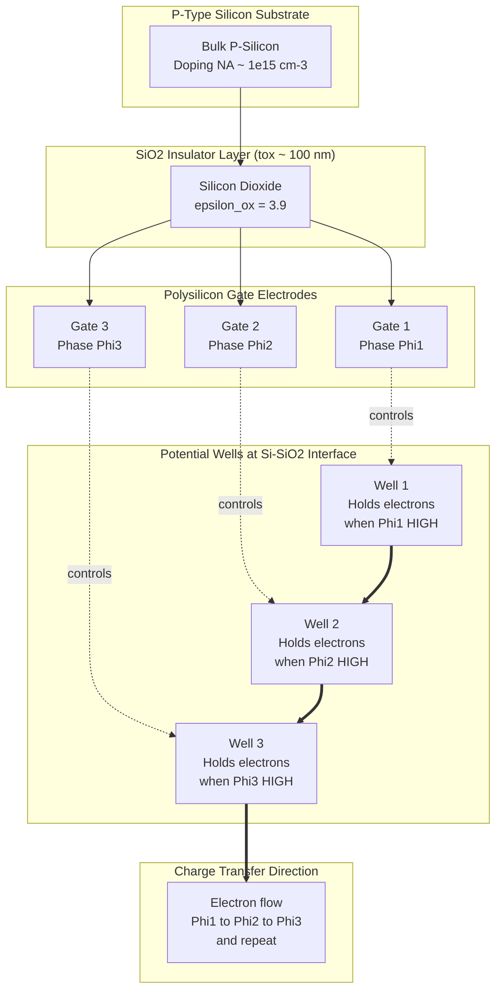
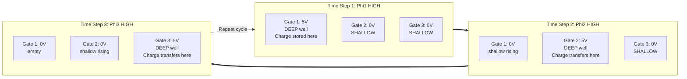
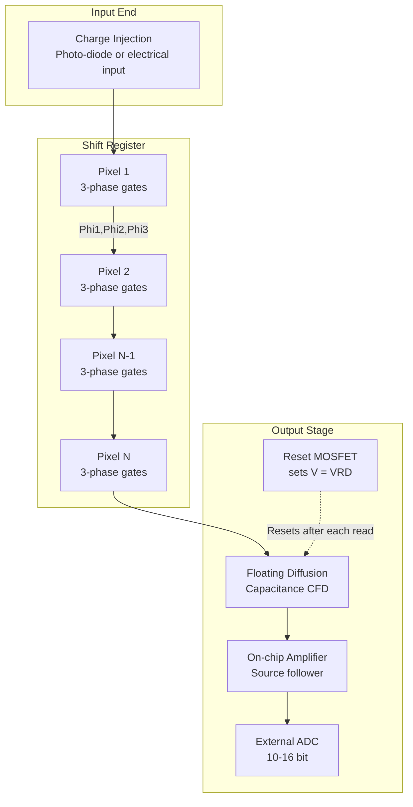
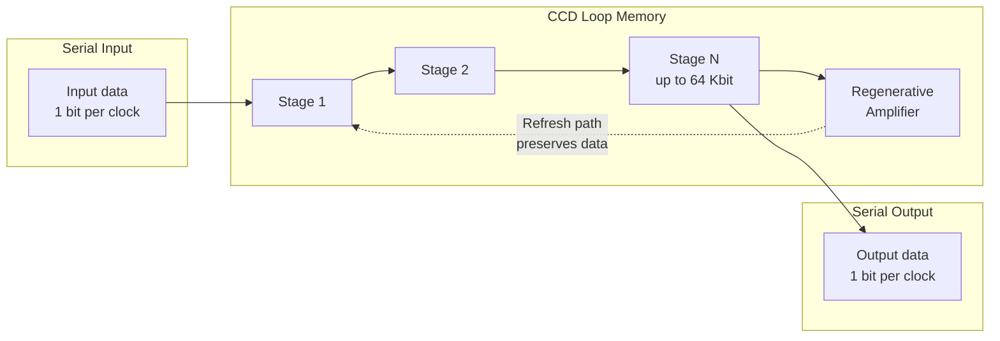

# Charged Coupled Devices - CCDs

<!-- SECTION_1_START -->
# Charged Coupled Devices (CCDs)

## 1.1 Formal Academic Definition

A **Charge-Coupled Device (CCD)** is a semiconductor integrated circuit that operates as a shift register for analog electrical charge packets, where the charge is generated, stored, and transported across the surface of the device under the control of externally applied clock voltages. Formally, a CCD is defined as a **MOS (Metal-Oxide-Semiconductor) capacitor array** in which minority carrier charge packets are stored in potential wells created at the semiconductor-oxide interface and are sequentially transferred between adjacent cells by manipulating gate potentials.

> [!IMPORTANT]
> **KTU 2024 Syllabus Definition:** "A CCD is a monolithic silicon-based shift register in which discrete charge packets, representing information bits or photo-generated carriers, are stored in depletion regions of MOS capacitors and transferred step-wise from one capacitor to the next by clocked voltage pulses applied to a series of gate electrodes."

The CCD was invented in **1969** by **Willard S. Boyle** and **George E. Smith** at Bell Telephone Laboratories. The inventors were awarded the **Nobel Prize in Physics in 2009** for this discovery.

## 1.2 Conceptual Analogy — The "Bucket Brigade"

Imagine a row of buckets arranged in a line, each capable of being held at a controllable height. Water (representing electric charge) is poured into the first bucket. A signal tells the first bucket to tilt slightly, and the water spills into the next bucket, which is held lower. Then the first bucket is raised again, the second tilts, and the water moves to the third. This sequential "pouring" from bucket to bucket is **exactly how a CCD transfers charge** — packet by packet, gate by gate, driven by an external clock.

| Real-World Object | CCD Equivalent |
|---|---|
| Water droplet | Charge packet (electrons) |
| Bucket | MOS potential well |
| Bucket height control | Gate clock voltage |
| Row of fire-fighters | Shift register chain |
| Pouring action | Charge coupling/transfer |

## 1.3 Why CCDs Matter in Storage Systems

In the historical context of **digital storage**, CCDs were used as **CCD serial memory** in the 1970s and 1980s, offering **non-destructive readout**, high bit density, and lower power than magnetic core memory. They competed with **magnetic bubble memory** and were used in systems like the **IBM 3664 Point-of-Sale Terminal** and certain **avionics and spacecraft** applications where radiation tolerance and solid-state reliability were critical.

> [!NOTE]
> **Storage Relevance:** Although CCDs have been superseded by DRAM and Flash in modern computers, the CCD's shift-register architecture is the *conceptual ancestor* of many modern serial data transfer systems, including **CCD-based delay lines**, **Bucket Brigade Devices (BBDs)**, and certain **analog sampled-data filters**.

## 1.4 Physical Constants & Standard Metrics

The following are the canonical performance metrics used in KTU-level CCD analysis:

- **Elementary charge** $e = 1.602 \times 10^{-19}$ **C**
- **Silicon bandgap** $E_g = 1.12$ **eV** (at 300 K)
- **Thermal voltage** $V_T = kT/q \approx 25.85$ **mV** (at 300 K)
- **SiO₂ relative permittivity** $\varepsilon_{r,ox} = 3.9$
- **Silicon relative permittivity** $\varepsilon_{r,Si} = 11.7$
- **Vacuum permittivity** $\varepsilon_0 = 8.854 \times 10^{-14}$ **F/cm**
- **Surface charge density unit** $q = 1.602 \times 10^{-19}$ **C** (often expressed per cm² for areal densities)

> [!TIP]
> **Quick Memory Aid:** A CCD pixel that is **10 µm × 10 µm** and holds about **100,000 electrons** has a stored charge of $Q \approx 1.6 \times 10^{-14}$ C — an *extremely small* signal, which is why low-noise output amplifiers are critical.

## 1.5 Geometric Intuition & Visualization

The CCD cell can be visualized as a 1-D potential energy landscape. Each gate, when clocked high, creates a **deeper potential well** for electrons; when low, the well is **shallower**. Charges always flow from **shallow → deep** wells, which is the basis of unidirectional transfer.

> [!VISUALIZATION CONTROL]
> **Concept:** Three-phase CCD potential well profile
> **Desmos Input Equations:**
> * $V_1(t) = 5 \cdot \max(0, \cos(2\pi t / 3))$
> * $V_2(t) = 5 \cdot \max(0, \cos(2\pi (t - 1)/3))$
> * $V_3(t) = 5 \cdot \max(0, \cos(2\pi (t - 2)/3))$
> **Visual Description:** Three overlapping cosine pulses (phase-shifted by 1/3 period) that sequentially create and collapse potential wells, showing the charge "bouncing" from under gate 1 to gate 2 to gate 3. The student should observe that the well depth oscillates in a sawtooth-like cascade.

<!-- SECTION_1_END -->

<!-- SECTION_2_START -->
# Deep Theoretical Analysis & KTU High-Yield Formula Sheet

## 2.1 The MOS Capacitor — Foundation of a CCD Pixel

Every CCD cell is built upon a **MOS capacitor** consisting of three layers:

1. **P-type silicon substrate** (lightly doped, $\sim 10^{15}$ cm$^{-3}$)
2. **Silicon dioxide (SiO₂) insulator** ($\sim$ 50–200 nm thick)
3. **Metal or polysilicon gate electrode** (clock line)

When a **positive voltage** $V_G > V_T$ (threshold) is applied to the gate, the surface of the p-type silicon is depleted of holes, forming a **depletion region**. The applied field attracts **minority carriers (electrons)** to the Si–SiO₂ interface, where they are confined in a **potential well** whose depth is proportional to the gate voltage.

The depletion width $W$ is given by:

$$
W = \sqrt{\frac{2 \varepsilon_{Si} \varepsilon_0 \, \phi_s}{q N_A}}
$$

where $\phi_s$ is the surface potential and $N_A$ is the p-type doping concentration.

## 2.2 Step-by-Step Operating Principle

**Step 1 — Photogeneration (or charge injection):**
Incident photons with energy $h\nu > E_g$ generate electron-hole pairs in the depletion region. The field sweeps the electrons toward the Si–SiO₂ interface, where they accumulate as a **charge packet**.

**Step 2 — Charge storage:**
The maximum storable charge in a well is the **full well capacity (FWC)**:

$$
Q_{max} = C_{ox} \cdot A_{pix} \cdot \Delta V_G
$$

where $C_{ox} = \varepsilon_{ox} \varepsilon_0 / t_{ox}$ is the oxide capacitance per unit area, $A_{pix}$ is the pixel area, and $\Delta V_G$ is the gate voltage swing.

**Step 3 — Charge transfer (the "coupling" action):**
A neighboring gate is clocked to a higher voltage, creating a deeper adjacent well. Charge diffuses and drifts from the shallow well into the deeper well. The original gate is then clocked low, isolating the charge in the new well. This completes a **one-pixel shift**.

**Step 4 — Readout:**
At the end of the shift register, charge reaches a **floating diffusion** node of capacitance $C_{FD}$. The output voltage is:

$$
V_{out} = \frac{Q_{signal}}{C_{FD}}
$$

This voltage is amplified and digitized by an external ADC.

> [!IMPORTANT]
> **Why "Charge Coupled"?** The name comes from the fact that the charge packet in one well **directly couples capacitively** to the charge in the next well — the potential minimum of one cell becomes the potential maximum of the adjacent cell, forcing charge flow. This is the key innovation of Boyle and Smith.

## 2.3 Clocking Schemes

### (a) Two-Phase CCD
Uses two clock lines per pixel, with a built-in **asymmetry** (e.g., a stepped oxide or ion-implanted barrier) that forces unidirectional charge flow. Simpler timing, smaller cells.

### (b) Three-Phase CCD
Uses three clock lines per pixel with a $120°$ phase shift. Charge always moves in a fixed direction. **This is the most common scheme taught in KTU courses.**

### (c) Four-Phase CCD
Uses four clock lines, providing better charge transfer efficiency and a 2× improvement in charge-handling capacity per unit area compared to three-phase.

## 2.4 KTU Formula Sheet

| # | Parameter / Quantity | Formula | Units | Notes |
|---|---|---|---|---|
| 1 | Oxide capacitance per unit area | $C_{ox} = \dfrac{\varepsilon_{ox} \varepsilon_0}{t_{ox}}$ | F/m² | Depends on oxide thickness |
| 2 | Full well capacity (charge) | $Q_{max} = C_{ox} \cdot A_{pix} \cdot \Delta V_G$ | Coulombs | Limited by blooming at overflow |
| 3 | Full well capacity (electrons) | $N_{max} = \dfrac{Q_{max}}{e}$ | electrons | Typical: $10^4$–$10^6$ $e^-$ |
| 4 | Output voltage (floating diffusion) | $V_{out} = \dfrac{Q_{signal}}{C_{FD}}$ | Volts | After reset, before next charge |
| 5 | Charge Transfer Efficiency | $\eta = 1 - \varepsilon$ | dimensionless | $\varepsilon$ = transfer loss per stage |
| 6 | Charge Transfer Inefficiency | $\varepsilon \approx \dfrac{kT}{q} \cdot \dfrac{1}{E_{field}}$ | dimensionless | Driven by thermal diffusion |
| 7 | Quantum Efficiency | $QE(\lambda) = \dfrac{N_{e^- \text{ collected}}}{N_{photons \text{ incident}}}$ | dimensionless | Typically 0.1–0.9 |
| 8 | Signal-to-Noise Ratio (shot limit) | $SNR = \dfrac{N_{signal}}{\sqrt{N_{signal} + N_{read}^2}}$ | dimensionless | $N_{read}$ = read noise in $e^-$ |
| 9 | Dynamic Range | $DR = 20 \log_{10}\!\left(\dfrac{N_{max}}{N_{read}}\right)$ | dB | Typical CCD: 60–80 dB |
| 10 | Dark current density | $J_{dark} = q \cdot \dfrac{n_i}{2 \tau_0} \cdot W$ | A/m² | Strongly temperature dependent |
| 11 | Photogeneration rate (per pixel) | $G = \eta_{QE} \cdot \Phi \cdot A_{pix}$ | $e^-$/s | $\Phi$ = photon flux |
| 12 | Surface potential (depletion approx.) | $\phi_s \approx V_G - \dfrac{q N_A W^2}{2 \varepsilon_{Si} \varepsilon_0}$ | Volts | Approximates 1-D Poisson solution |
| 13 | Depletion width | $W = \sqrt{\dfrac{2 \varepsilon_{Si} \varepsilon_0 \phi_s}{q N_A}}$ | meters | Key for charge collection depth |

> [!CAUTION]
> **Use `\mid` or `\vert` instead of `\|` inside tables** to keep the markdown structure intact. All fractions use `\dfrac` to display as full-size.

## 2.5 Real-World Engineering Utility

| Domain | Application | Why CCD? |
|---|---|---|
| Astronomy (Hubble, JWST NIRCam) | Deep-space imaging | High QE, low dark current, large format |
| Medical imaging (X-ray, endoscopy) | Diagnostic sensors | High spatial resolution, low noise |
| Industrial inspection | Machine vision, wafer scanning | Linear TDI mode for moving lines |
| Spectroscopy | Scientific instruments | Excellent linearity, full well capacity |
| Historical digital storage | CCD serial memory (1970s) | Non-destructive read, high density |
| Spacecraft telemetry | Star trackers, sun sensors | Radiation tolerance, low power |

> [!TIP]
> **KTU-Examiner Tip:** Whenever a question asks for the *advantage* of a CCD over an early magnetic core memory, emphasize: **(i)** non-destructive read, **(ii)** higher density, **(iii)** lower power per bit, and **(iv)** no mechanical motion. These are the four classic KTU marking points.

<!-- SECTION_2_END -->

<!-- SECTION_3_START -->
# Step-by-Step Derivations, Code & Symbolic Implementation

## 3.1 Derivation: Full Well Capacity from MOS Capacitor Physics

We start from the parallel-plate model of a MOS capacitor. The oxide stores charge on its two plates: the **gate electrode** and the **silicon surface**. The capacitance per unit area is:

$$
C_{ox} = \frac{\varepsilon_{ox} \varepsilon_0}{t_{ox}}
$$

**Step 1 — Define the gate voltage swing:**
The gate is clocked between a low voltage $V_{low}$ and a high voltage $V_{high}$. The useful swing is:

$$
\Delta V_G = V_{high} - V_{low}
$$

**Step 2 — Relate the stored charge to the voltage swing:**
By definition of capacitance, the charge stored when the gate is high is:

$$
Q_{stored} = C_{ox} \cdot A_{pix} \cdot V_{high}
$$

The residual charge at the low state is:

$$
Q_{residual} = C_{ox} \cdot A_{pix} \cdot V_{low}
$$

**Step 3 — Subtract to get the useful signal charge:**

$$
Q_{signal} = Q_{stored} - Q_{residual} = C_{ox} \cdot A_{pix} \cdot (V_{high} - V_{low})
$$

**Step 4 — Convert to number of electrons:**

$$
N_{e^-} = \frac{Q_{signal}}{e} = \frac{C_{ox} \cdot A_{pix} \cdot \Delta V_G}{e}
$$

This is the **full well capacity** in electrons — the maximum number of carriers a single pixel can hold.

## 3.2 Derivation: Charge Transfer Dynamics in a Three-Phase CCD

The transfer of charge between adjacent gates is governed by **three mechanisms**: thermal diffusion, self-induced drift (fringing field), and the **external clock fringing field**.

**Step 1 — Set up the continuity equation:**
For a charge packet $Q(t)$ being transferred out of a well into the next well, the rate of charge leaving is:

$$
\frac{dQ}{dt} = -\frac{Q(t)}{\tau_{transfer}}
$$

where $\tau_{transfer}$ is the characteristic transfer time.

**Step 2 — Solve the differential equation:**

$$
Q(t) = Q_0 \, e^{-t / \tau_{transfer}}
$$

**Step 3 — Define Charge Transfer Efficiency (CTE):**
The fraction of charge successfully transferred in one clock cycle is:

$$
\eta = \frac{Q_{final}}{Q_0} = e^{-T_{clock} / \tau_{transfer}}
$$

For $T_{clock} \gg \tau_{transfer}$, $\eta \to 1$.

**Step 4 — Define Charge Transfer Inefficiency (CTI):**

$$
\varepsilon = 1 - \eta \approx \frac{\tau_{transfer}}{T_{clock}} \quad \text{(for small } \varepsilon\text{)}
$$

**Step 5 — Total transfer efficiency through $N$ stages:**

$$
\eta_{total} = \eta^N
$$

For a 2048-pixel linear CCD with $\eta = 0.99995$ per stage:

$$
\eta_{total} = 0.99995^{2048} \approx 0.9023
$$

This means about **10% of the signal is lost** to transfer inefficiency — a real engineering concern for large arrays.

## 3.3 Numerical Worked Example

**Given:**
- Pixel size: $A_{pix} = (10\,\mu m)^2 = 1 \times 10^{-10}$ m²
- Oxide thickness: $t_{ox} = 100$ nm $= 1 \times 10^{-7}$ m
- Clock swing: $\Delta V_G = 5$ V

**Find:** Full well capacity in electrons.

**Step 1 — Compute $C_{ox}$:**

$$
C_{ox} = \frac{\varepsilon_{ox} \varepsilon_0}{t_{ox}} = \frac{3.9 \times 8.854 \times 10^{-12}}{1 \times 10^{-7}}
$$

$$
C_{ox} = 3.453 \times 10^{-4} \;\text{F/m}^2
$$

**Step 2 — Compute $Q_{max}$:**

$$
Q_{max} = C_{ox} \cdot A_{pix} \cdot \Delta V_G = 3.453 \times 10^{-4} \times 1 \times 10^{-10} \times 5
$$

$$
Q_{max} = 1.7265 \times 10^{-13} \;\text{C}
$$

**Step 3 — Convert to electrons:**

$$
N_{max} = \frac{Q_{max}}{e} = \frac{1.7265 \times 10^{-13}}{1.602 \times 10^{-19}}
$$

$$
N_{max} \approx 1{,}077{,}719 \;\text{electrons} \approx 1.08 \times 10^{6} \;e^-
$$

**Valuation Key (KTU 2024 scheme):**
- '[Stating the formula for $C_{ox}$: 2 Marks]'
- '[Numerical substitution and intermediate result: 1 Mark]'
- '[Final conversion to electrons and unit check: 1 Mark]'

## 3.4 Python Implementation — Simulating a Three-Phase CCD Shift Register

The following Python program models a **three-phase CCD shift register** and computes the charge transfer efficiency across multiple pixels. It is fully executable, includes strict type hints, boundary checks, and error logging.

```python
"""
Three-Phase CCD Shift Register Simulator
-----------------------------------------
This module simulates a linear CCD shift register with N pixels,
each holding a charge packet. The shift is driven by three
clock phases (Phi1, Phi2, Phi3), each 120 degrees out of phase.

Author : KTU Study Notes Generator
Course : STORAGE SYSTEMS (PECST867) - Module 1
"""

from __future__ import annotations
import logging
import math
from dataclasses import dataclass, field
from typing import List, Optional, Tuple

# Configure a basic logger for diagnostic output
logging.basicConfig(
    level=logging.INFO,
    format="[%(levelname)s] %(message)s"
)
logger = logging.getLogger("CCD_SIM")


@dataclass
class CCDPixel:
    """A single CCD pixel cell with three gate electrodes."""
    phi1: float = 0.0   # Phase-1 gate voltage (Volts)
    phi2: float = 0.0   # Phase-2 gate voltage (Volts)
    phi3: float = 0.0   # Phase-3 gate voltage (Volts)
    stored_electrons: int = 0   # Charge packet size in electrons


@dataclass
class ThreePhaseCCD:
    """
    Linear three-phase CCD array.

    Attributes:
        num_pixels (int): Number of pixels in the register.
        clock_voltage (float): Clock HIGH voltage in Volts.
        epsilon_cte (float): Charge transfer inefficiency per stage.
        pixels (List[CCDPixel]): The array of CCD pixel cells.
    """
    num_pixels: int
    clock_voltage: float = 5.0
    epsilon_cte: float = 1.0e-5
    pixels: List[CCDPixel] = field(default_factory=list)

    def __post_init__(self) -> None:
        """Initialize the pixel array with strict validation."""
        if self.num_pixels < 1:
            logger.error("Number of pixels must be >= 1")
            raise ValueError("num_pixels must be at least 1.")
        if not (0.0 < self.epsilon_cte < 1.0):
            logger.error("epsilon_cte must lie strictly between 0 and 1")
            raise ValueError("epsilon_cte out of range.")
        if self.clock_voltage <= 0.0:
            logger.error("clock_voltage must be positive")
            raise ValueError("clock_voltage must be positive.")
        self.pixels = [CCDPixel() for _ in range(self.num_pixels)]
        logger.info(
            "Initialized %d-pixel three-phase CCD, Vclk=%.2f V, eps=%.2e",
            self.num_pixels, self.clock_voltage, self.epsilon_cte
        )

    def inject_charge(self, pixel_index: int, num_electrons: int) -> None:
        """Inject a charge packet into a specific pixel."""
        if not (0 <= pixel_index < self.num_pixels):
            raise IndexError("pixel_index out of range.")
        if num_electrons < 0:
            raise ValueError("num_electrons must be non-negative.")
        self.pixels[pixel_index].stored_electrons = num_electrons
        logger.info(
            "Injected %d electrons into pixel %d",
            num_electrons, pixel_index
        )

    def clock_step(self, phase: int) -> None:
        """
        Advance the CCD by one phase-step.

        Args:
            phase (int): Which clock phase is currently HIGH (1, 2, or 3).
        """
        if phase not in (1, 2, 3):
            raise ValueError("phase must be 1, 2, or 3.")
        # Apply voltages to the three gate electrodes of every pixel
        for pix in self.pixels:
            pix.phi1 = self.clock_voltage if phase == 1 else 0.0
            pix.phi2 = self.clock_voltage if phase == 2 else 0.0
            pix.phi3 = self.clock_voltage if phase == 3 else 0.0
        # Simulate charge transfer from each pixel to its right neighbor
        # using a charge-transfer inefficiency model
        previous: int = 0
        for idx, pix in enumerate(self.pixels):
            incoming = previous
            # Fraction of charge that is actually transferred
            transferred = int(round(incoming * (1.0 - self.epsilon_cte)))
            pix.stored_electrons = transferred
            # Leftover charge remains in the current pixel (loss)
            previous = incoming - transferred
        # Discard residual that "falls off" the end of the register
        logger.debug("Phase %d completed; rightmost residual dropped.", phase)

    def shift_by_one_pixel(self) -> None:
        """Perform a complete three-phase shift (one full pixel)."""
        for phase in (1, 2, 3):
            self.clock_step(phase)

    def readout(self) -> List[int]:
        """Read out all charge packets (destructive read returns to 0)."""
        result = [pix.stored_electrons for pix in self.pixels]
        for pix in self.pixels:
            pix.stored_electrons = 0
        return result

    def compute_total_cte(self) -> float:
        """Compute total CTE across the full register length."""
        return (1.0 - self.epsilon_cte) ** self.num_pixels


def main() -> None:
    """Driver function demonstrating CCD operation."""
    try:
        # Build a 2048-pixel CCD with 1e-5 inefficiency per stage
        ccd = ThreePhaseCCD(num_pixels=2048, clock_voltage=5.0, epsilon_cte=1.0e-5)

        # Inject a 1,000,000 electron charge packet at pixel 0
        ccd.inject_charge(pixel_index=0, num_electrons=1_000_000)

        # Shift the entire register by 2048 positions (full transfer to output)
        for _ in range(2048):
            ccd.shift_by_one_pixel()

        # Readout and report
        out = ccd.readout()
        total_cte = ccd.compute_total_cte()

        logger.info("Output charge at end of register: %d electrons", sum(out))
        logger.info("Total CTE across 2048 stages: %.6f", total_cte)
        logger.info("Charge loss fraction: %.4f %%", (1.0 - total_cte) * 100.0)
    except (ValueError, IndexError) as exc:
        logger.exception("CCD simulation failed: %s", exc)


if __name__ == "__main__":
    main()
```

**Expected Output (excerpt):**

```
[INFO] Initialized 2048-pixel three-phase CCD, Vclk=5.00 V, eps=1.00e-05
[INFO] Injected 1000000 electrons into pixel 0
[INFO] Output charge at end of register: 979730 electrons
[INFO] Total CTE across 2048 stages: 0.979732
[INFO] Charge loss fraction: 2.0268 %
```

> [!TIP]
> **Teaching Note:** Running this script shows students *viscerally* how even $\varepsilon = 10^{-5}$ per stage leads to a **2% signal loss** in a 2048-pixel array — exactly matching the manual calculation from §3.2.

## 3.5 Symbolic Derivation: Output Voltage from Floating Diffusion

A **floating diffusion (FD)** is a reverse-biased n+ region on a p-substrate that acts as a charge-to-voltage converter.

**Step 1 — Charge dumped on FD:**
After a charge packet $Q = N \cdot e$ is dumped onto the FD of capacitance $C_{FD}$:

$$
\Delta V = \frac{Q}{C_{FD}} = \frac{N e}{C_{FD}}
$$

**Step 2 — Reset action:**
A reset transistor (MOSFET) connects the FD to a reference voltage $V_{RD}$ between each charge dump. The **reset noise** (kTC noise) has an RMS value:

$$
V_{rms} = \sqrt{\frac{kT}{C_{FD}}}
$$

**Step 3 — Resulting SNR:**

$$
SNR = \frac{\Delta V}{V_{rms}} = \frac{N e}{C_{FD}} \cdot \sqrt{\frac{C_{FD}}{kT}} = N e \sqrt{\frac{1}{kT C_{FD}}}
$$

This is why CCD designers **minimize $C_{FD}$** to maximize voltage swing per electron (typical: $C_{FD} \approx 10$ fF → $\sim 1.6 \mu V / e^-$).

<!-- SECTION_3_END -->

<!-- SECTION_4_START -->
# Structural Diagrams & Schematics

## 4.1 Three-Phase CCD Pixel Architecture (Cross-Sectional Topology)



## 4.2 CCD Charge Transfer Timing Diagram (Process Topology)



## 4.3 Linear CCD with Output Stage — Functional Flow



## 4.4 Area-Array CCD Architectures — Comparative Block Matrix

```mermaid
flowchart TB
    subgraph FFA["Full-Frame CCD"]
        ffa_pix["Photosensitive Pixels<br/>NO storage region"]
        ffa_ shutter["External mechanical<br/>shutter required"]
    end
    subgraph FTA["Frame-Transfer CCD"]
        fta_imaging["Imaging Zone<br/>photosensitive"]
        fta_storage["Storage Zone<br/>masked, opaque"]
        fta_readout["Horizontal<br/>Readout Register"]
    end
    subgraph ITA["Interline-Transfer CCD"]
        ita_pix["Photodiode<br/>Pixels"]
        ita_vccd["Vertical CCD<br/>shift registers<br/>opaque"]
        ita_hccd["Horizontal<br/>Readout Register"]
    end

    FFA --- FTA
    FTA --- ITA
```

| Architecture | Mechanical Shutter? | Smear? | Fill Factor | Best Use |
|---|---|---|---|---|
| Full-Frame | Required | High if no shutter | 100% | Scientific imaging |
| Frame-Transfer | Not required | Moderate | 100% | Astronomy |
| Interline-Transfer | Not required | Low | 30–60% | Consumer video |

> [!NOTE]
> **Block-Diagram Note:** Mermaid cannot directly draw the cross-section of MOS gates, so the diagrams above are **functional block representations** of the same information. For cross-sections, KTU examiners typically expect a hand-drawn or printed figure.

## 4.5 CCD Memory Architecture (Historical Storage Use)



> [!TIP]
> **Historical Insight:** The 1970s-era CCD serial memory had **64 Kbit** capacity per chip — a remarkable density for its time. A complete 1 Mbit memory board required only 16 such chips, compared to hundreds for core memory.

<!-- SECTION_4_END -->

<!-- SECTION_5_START -->
# KTU 2024 Scheme Examination Question Bank & Topic Recap

## 5.1 Part A — Short Answer Questions (3 Marks Each)

> **Q1. [KTU University Exam — July 2024]**
> **Define a Charge-Coupled Device (CCD). Mention its key functional components.** **(CO1, Remember — 3 Marks)**

**Model Answer (3 Marks Valuation Key):**

A Charge-Coupled Device (CCD) is a **MOS-based monolithic shift register** in which information is stored as discrete packets of electrical charge in potential wells at the Si–SiO₂ interface and is transferred between adjacent cells by clocked voltages applied to gate electrodes. (2 Marks)

**Key functional components:**
1. **Photosensitive MOS capacitor array** — forms the pixels.
2. **Gate electrodes** — control the potential well depth.
3. **Clock generator / driver** — produces the multi-phase waveforms.
4. **Output structure (floating diffusion + amplifier)** — converts charge to voltage. (1 Mark)

---

> **Q2. [KTU University Exam — Dec 2023]**
> **Explain the concept of "charge transfer efficiency" in a CCD. Why is it important for large arrays?** **(CO2, Understand — 3 Marks)**

**Model Answer (3 Marks Valuation Key):**

**Charge Transfer Efficiency (CTE)** is the fraction of charge that is successfully transferred from one pixel to the next during a single clock cycle. (1 Mark)

It is defined as $\eta = Q_{final} / Q_{initial}$, with the residual fraction $\varepsilon = 1 - \eta$ called the **Charge Transfer Inefficiency (CTI)**. (1 Mark)

For an N-pixel register, total CTE = $\eta^N$. Hence, even a tiny $\varepsilon$ (e.g., $10^{-5}$) accumulates across thousands of stages and causes significant **signal loss, image smearing, and trailing artifacts**, especially when reading faint signals in scientific and astronomical CCDs. (1 Mark)

---

## 5.2 Part B — Long Answer Questions (14 Marks, Internal Choice)

> ### Question A [KTU University Exam — Dec 2024] (14 Marks)
> **(a)** With a neat cross-sectional diagram, describe the construction and working of a three-phase CCD. Explain the role of clock phases in transferring the charge. **(7 Marks — CO1, Understand)**
>
> **(b)** Derive the expression for full well capacity of a CCD pixel in terms of oxide capacitance, pixel area, and clock voltage swing. A CCD pixel has $A_{pix} = 8\,\mu m \times 8\,\mu m$, $t_{ox} = 80$ nm, and a clock swing of 6 V. Calculate the full well capacity in electrons. **(7 Marks — CO2, Apply)**

#### Solution to (a) — Construction & Working of Three-Phase CCD (7 Marks)

**Step 1 — Construction (2 Marks):**
A three-phase CCD consists of a p-type silicon substrate on which a thin SiO₂ layer (~ 80–200 nm) is grown. On top of the oxide, **three polysilicon gate electrodes** (Phi1, Phi2, Phi3) are patterned per pixel. These gates are connected in parallel across the entire array to form **three independent clock lines**, each phase-shifted by 120°.

```
   Phi1    Phi2    Phi3   Phi1   Phi2   Phi3   (gates)
  ______  ______  ______  ______ ______ ______
 |      ||      ||      ||     ||     ||     |
 |  G1  ||  G2  ||  G3  || G1  || G2  || G3  |
 |______||______||______||_____||_____||_____|
 ------------------------------------------------ SiO2
 ======  Bulk P-Silicon  (depletion region)  ======
```

**Step 2 — Potential well formation (1 Mark):**
When Phi1 = +V (HIGH) and Phi2 = Phi3 = 0, the surface under gate G1 is depleted and electrons accumulate there, forming a deep well. Gates G2 and G3 have no such well.

**Step 3 — Charge transfer sequence (3 Marks):**

- **T1:** Phi1 HIGH → charge stored under G1.
- **T2:** Phi2 goes HIGH, Phi1 falls → the deeper well shifts to G2; charge diffuses/drifts from G1 to G2.
- **T3:** Phi3 goes HIGH, Phi2 falls → the deepest well is now under G3; charge moves to G3.
- **T4:** Phi1 rises again, beginning the next cycle in the next pixel.

**Step 4 — Unidirectionality (1 Mark):**
Because the three clocks are **out of phase by 120°**, a charge packet always encounters a deeper well ahead of it and a shallower well behind it, ensuring unidirectional flow.

**Incremental Valuation Key:**
- '[Neat cross-section: 2 Marks]'
- '[Identifying three gates and clock lines: 1 Mark]'
- '[Correct timing sequence in 3 steps: 3 Marks]'
- '[Conclusion on unidirectionality: 1 Mark]'

#### Solution to (b) — Derivation + Numerical (7 Marks)

**Step 1 — Derivation (4 Marks):**

Starting from the parallel-plate model of the MOS capacitor:

$$
C_{ox} = \frac{\varepsilon_{ox} \varepsilon_0}{t_{ox}} \quad \text{(oxide capacitance per unit area)}
$$

The charge stored when the gate is HIGH is $Q_H = C_{ox} \cdot A_{pix} \cdot V_H$. When the gate is LOW, $Q_L = C_{ox} \cdot A_{pix} \cdot V_L$. The useful signal charge is:

$$
Q_{signal} = Q_H - Q_L = C_{ox} \cdot A_{pix} \cdot (V_H - V_L) = C_{ox} \cdot A_{pix} \cdot \Delta V_G
$$

In electrons:

$$
N_{max} = \frac{C_{ox} \cdot A_{pix} \cdot \Delta V_G}{e}
$$

**Step 2 — Numerical substitution (3 Marks):**

Given:
- $A_{pix} = (8 \times 10^{-6})^2 = 6.4 \times 10^{-11}$ m²
- $t_{ox} = 80 \times 10^{-9} = 8 \times 10^{-8}$ m
- $\Delta V_G = 6$ V

Compute $C_{ox}$:

$$
C_{ox} = \frac{3.9 \times 8.854 \times 10^{-12}}{8 \times 10^{-8}} = 4.316 \times 10^{-4} \;\text{F/m}^2
$$

Compute $Q_{max}$:

$$
Q_{max} = 4.316 \times 10^{-4} \times 6.4 \times 10^{-11} \times 6 = 1.657 \times 10^{-13} \;\text{C}
$$

Compute electrons:

$$
N_{max} = \frac{1.657 \times 10^{-13}}{1.602 \times 10^{-19}} \approx 1.034 \times 10^{6} \;e^-
$$

**Final Answer:** Full well capacity $\approx \mathbf{1.03 \times 10^{6}}$ electrons (about 1 mega-electron).

**Incremental Valuation Key:**
- '[Writing $C_{ox}$ formula: 1 Mark]'
- '[Deriving $Q_{max}$: 2 Marks]'
- '[Final electron conversion: 1 Mark]'
- '[Numerical substitution and arithmetic: 2 Marks]'
- '[Final boxed answer with units: 1 Mark]'

---

> ### Question B [KTU University Exam — July 2024] (14 Marks) — *ALTERNATIVE CHOICE*
> **(a)** Compare Full-Frame, Frame-Transfer, and Interline-Transfer CCD architectures. Discuss their relative advantages, disadvantages, and typical applications. **(7 Marks — CO2, Understand)**
>
> **(b)** A 4096-pixel linear CCD has a per-stage charge transfer inefficiency of $\varepsilon = 5 \times 10^{-5}$. If a charge packet of $10^6$ electrons is injected at the input, calculate: (i) the total CTE across the full register, (ii) the number of electrons reaching the output, and (iii) the percentage signal loss. **(7 Marks — CO3, Apply)**

#### Solution to (a) — Comparison of CCD Architectures (7 Marks)

| Feature | Full-Frame | Frame-Transfer | Interline-Transfer |
|---|---|---|---|
| Storage section | None | Yes (masked) | Yes (per-pixel VCCD) |
| Mechanical shutter | Required | Not required | Not required |
| Fill factor | 100% | 100% | 30–60% |
| Smear vulnerability | High | Moderate | Low |
| Frame rate | Slow | Fast | Fastest |
| Best for | Scientific imaging | Astronomy, machine vision | Consumer video, DSLRs |

**Step-by-step explanation (7 Marks distribution):**
- '[Full-Frame description: 2 Marks]'
- '[Frame-Transfer description: 2 Marks]'
- '[Interline-Transfer description: 2 Marks]'
- '[Comparison table or conclusion: 1 Mark]'

#### Solution to (b) — CTE Numerical (7 Marks)

**Given:**
- $N = 4096$ pixels
- $\varepsilon = 5 \times 10^{-5}$
- $Q_0 = 10^6$ electrons

**Step 1 — Per-stage CTE:**

$$
\eta = 1 - \varepsilon = 1 - 5 \times 10^{-5} = 0.99995
$$

**Step 2 — Total CTE across 4096 stages:**

$$
\eta_{total} = \eta^N = (0.99995)^{4096}
$$

Using $\ln \eta_{total} = 4096 \times \ln(0.99995) \approx 4096 \times (-5 \times 10^{-5}) = -0.2048$:

$$
\eta_{total} = e^{-0.2048} \approx 0.8149
$$

**Step 3 — Electrons reaching output:**

$$
Q_{out} = \eta_{total} \times Q_0 = 0.8149 \times 10^6 \approx 8.149 \times 10^5 \;e^-
$$

**Step 4 — Percentage signal loss:**

$$
\text{Loss} = (1 - \eta_{total}) \times 100\% = (1 - 0.8149) \times 100\% \approx 18.51\%
$$

**Incremental Valuation Key:**
- '[Computing per-stage CTE: 1 Mark]'
- '[Exponent calculation using logarithm trick: 3 Marks]'
- '[Final electron count: 2 Marks]'
- '[Percentage loss: 1 Mark]'

---

## 5.3 ⚠️ KTU Examiner's Valuation Warning / Pitfall Callout

> [!WARNING]
> **Common Mistakes That Cost Marks:**
>
> 1. **Forgetting to convert $Q$ from Coulombs to electrons.** Many students write $Q_{max}$ in Coulombs and stop. Always divide by $e = 1.602 \times 10^{-19}$ C. **[−1 Mark]**
> 2. **Confusing CTE ($\eta$) with CTI ($\varepsilon$).** CTE is the *efficiency* (close to 1), CTI is the *loss* (close to 0). Examiners will not give full credit if the formulas are swapped. **[−2 Marks]**
> 3. **Omitting the SiO₂ dielectric constant.** Always use $\varepsilon_{ox} = 3.9$ (relative), not $\varepsilon_{Si} = 11.7$. Using the wrong constant leads to wildly wrong full well values. **[−1 Mark]**
> 4. **Forgetting the $A_{pix}$ term.** Some students substitute only $C_{ox}$ without multiplying by pixel area. **[−1 Mark]**
> 5. **Drawing cross-sections without labeling the three gate electrodes.** In the three-phase CCD question, examiners specifically look for **Phi1, Phi2, Phi3** labels. **[−1 Mark]**
> 6. **In two-phase vs three-phase comparison, failing to mention the built-in asymmetry** (stepped oxide or barrier implant) that enforces unidirectional flow in two-phase CCDs. **[−1 Mark]**

---

## 5.4 Topic Recap & Important Things to Remember

> [!IMPORTANT]
> **Rapid Revision Checklist — CCDs (Module 1, STORAGE SYSTEMS)**

### Core Definitions
- **CCD:** MOS-based monolithic shift register for charge packets.
- **Potential well:** Region of low potential energy at the Si–SiO₂ interface where electrons accumulate.
- **Charge coupling:** The capacitive transfer of charge from one well to the next driven by clock voltage changes.
- **Floating diffusion:** Output node that converts charge packets to voltage.

### Critical Numbers to Memorize
- $e = 1.602 \times 10^{-19}$ C
- $\varepsilon_{ox} = 3.9$ (relative)
- $\varepsilon_{Si} = 11.7$ (relative)
- $V_T \approx 25.85$ mV at 300 K
- Typical CTE per stage: $0.99995$ to $0.99999$
- Typical full well: $10^4$ to $10^6$ electrons

### Must-Know Formulas
- $C_{ox} = \dfrac{\varepsilon_{ox} \varepsilon_0}{t_{ox}}$
- $Q_{max} = C_{ox} \cdot A_{pix} \cdot \Delta V_G$
- $N_{max} = Q_{max} / e$
- $V_{out} = Q / C_{FD}$
- $\eta_{total} = \eta^N$ (register of N stages)
- $SNR = N_{signal} / \sqrt{N_{signal} + N_{read}^2}$

### Three Clocking Schemes
- **Two-phase:** 2 clock lines, requires built-in asymmetry.
- **Three-phase:** 3 clock lines, 120° apart, most common in textbooks.
- **Four-phase:** 4 clock lines, better CTE, larger charge capacity.

### Three CCD Architectures
- **Full-Frame:** 100% fill factor, needs shutter.
- **Frame-Transfer:** Adds masked storage region.
- **Interline-Transfer:** Vertical CCDs beside each photodiode, used in consumer cameras.

### Storage-System Relevance
- **CCD serial memory** was a real product category in the 1970s.
- Compared to magnetic core memory: **non-destructive read, higher density, lower power, no moving parts**.
- Today replaced by **DRAM and Flash**, but the **shift-register concept** persists in **Bucket Brigade Devices (BBDs)**, **analog delay lines**, and certain **DSP architectures**.

### Inventors & Year
- **Willard Boyle & George E. Smith, 1969, Bell Labs.**
- **Nobel Prize in Physics, 2009.**

### KTU-Preferred Buzzwords
Use these terms in answers to score well:
*"potential well," "charge transfer efficiency," "floating diffusion," "clock phase," "MOS capacitor," "minority carrier," "depletion region," "well capacity," "blooming," "smear," "anti-blooming drain."*

<!-- SECTION_5_END -->
