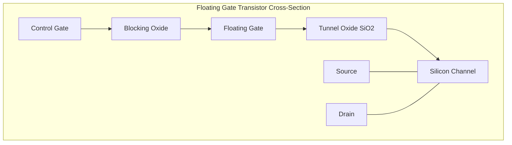
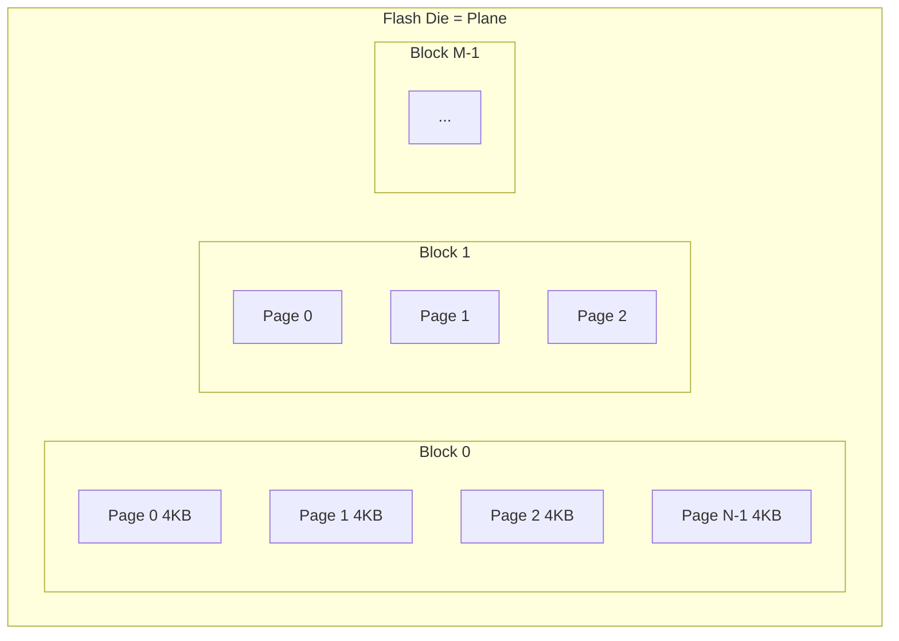
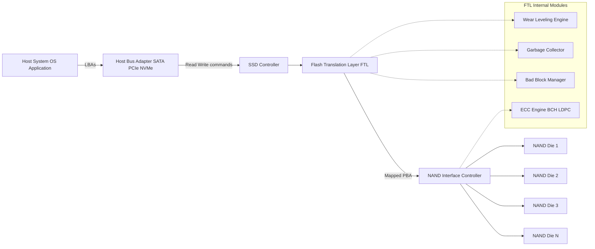
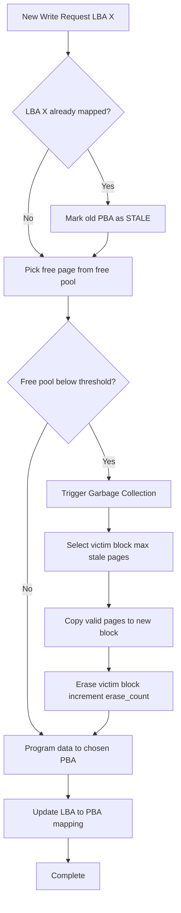
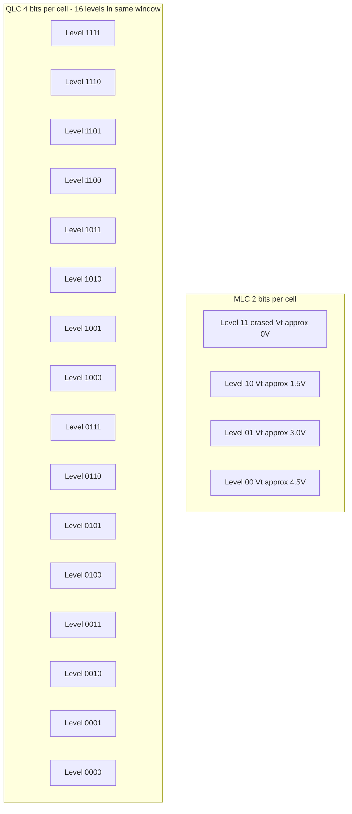

# Flash memories

<!-- SECTION_1_START -->
# Flash Memories — Core Technical Definition & Intuitive Overview

## 1.1 Formal KTU 2024 Syllabus Definition

> [!IMPORTANT]
> **Flash Memory** is a non-volatile, electronically erasable semiconductor memory technology that stores data in **floating-gate MOSFET (FGMOS) transistors**. Data is retained even when power is removed, and memory cells are organized as an **array of pages grouped into blocks**, where reads/writes happen at the page level (typically **2 KB – 16 KB**) and erases happen at the block level (typically **64 KB – 4 MB**).

The "flash" name originates from the **Flash Erase** operation: a single electrical pulse simultaneously erases an entire block (or "flash") of cells, unlike older EEPROMs that required byte-wise erasure.

## 1.2 Conceptual Analogy — The Blackboard & Eraser Metaphor

> [!NOTE]
> Think of Flash memory as a **multi-floor blackboard building**:
> - Each **floor = Block** (the smallest erasable unit)
> - Each **board on a floor = Page** (the smallest writeable/readable unit)
> - Each **chalk character on a board = Cell** (stores 1, 2, 3, or 4 bits)
> - You can **write character by character** (program a page) anytime.
> - You can **wipe the entire floor** at once (erase a block) — but you can never wipe a single character without wiping the whole floor.
> - The chalk wears thin with each rewrite (limited endurance).

This "asymmetric granularity" (fine-grained read/write, coarse-grained erase) is the **single most important architectural property** that drives every flash-specific subsystem (FTL, wear-leveling, garbage collection, TRIM).

## 1.3 Physical Foundations — The Floating-Gate Transistor

A flash cell is an **n-channel MOSFET with an additional electrically isolated "floating gate"** sandwiched between the control gate and the channel. The floating gate traps electrons, modifying the cell's **threshold voltage ($V_t$)** — the gate voltage at which the channel begins to conduct.

- **Logic 1 (erased state):** Floating gate is **discharged** → $V_t$ is **low** (≈ 0 V) → cell conducts at low gate voltage.
- **Logic 0 (programmed state):** Electrons are **injected** onto the floating gate → $V_t$ is **raised** (≈ 4–8 V) → cell does *not* conduct at normal read voltage.

> [!IMPORTANT]
> The **energy barrier** of the surrounding oxide (typically **SiO₂**, ≈ 7–10 nm) is so high that trapped electrons remain for **>10 years** at room temperature — giving flash its non-volatility.

## 1.4 The Two Principal Flash Families

| Parameter | NOR Flash | NAND Flash |
|---|---|---|
| Cell connection | Cells in **parallel** (each cell tied to bit-line) | Cells in **series** (chain of transistors) |
| Random access | **Yes — byte/word-addressable** | **No — page access only** |
| Read speed | **Fast** (~50–100 ns) | Moderate (25–50 µs per page) |
| Write speed | Slow | **Fast** (page program ≈ 200–1000 µs) |
| Erase speed | Slow (block ≈ 1 s) | **Fast** (block ≈ 2–5 ms) |
| Density per cell area | **Low** | **High** (~40% smaller cell) |
| Endurance | ~10⁵ cycles | ~10³ – 10⁵ cycles (SLC highest, QLC lowest) |
| Primary use | **Code storage** (firmware, BIOS, boot ROM) | **Data storage** (SSDs, USB drives, SD cards, eMMC) |

> [!TIP]
> **Rule of Thumb for KTU exams:** NOR is the "**textbook**" — random access, low density. NAND is the "**warehouse**" — sequential, high density, requires a controller (FTL).

## 1.5 Bits-Per-Cell Evolution — From SLC to QLC

Modern flash stores more than one bit per cell by programming the floating gate to **multiple distinct $V_t$ levels**:

| Cell Type | Bits/Cell | $V_t$ Levels | Endurance (P/E cycles) | Typical Use |
|---|---|---|---|---|
| **SLC** (Single-Level Cell) | 1 | 2 | ~100,000 | Enterprise, industrial |
| **MLC** (Multi-Level Cell) | 2 | 4 | ~10,000 | Consumer SSDs |
| **TLC** (Triple-Level Cell) | 3 | 8 | ~3,000 | Mainstream consumer |
| **QLC** (Quad-Level Cell) | 4 | 16 | ~1,000 | Read-heavy, archival |

> [!WARNING]
> **More bits per cell = narrower $V_t$ margins = higher error rates.** QLC requires powerful **LDPC error correction** (BCH and LDPC codes are mandatory) and over-provisioning.

## 1.6 Visualization Control

> [!VISUALIZATION CONTROL]
> **Concept:** Threshold voltage ($V_t$) distribution for a 2-bit MLC cell.
> **Desmos-compatible sketch inputs:**
> * Four Gaussian distributions (erase level `E`, levels `P1`, `P2`, `P3`).
> * Suggested forms: $f_i(x) = \frac{1}{\sigma\sqrt{2\pi}} e^{-0.5\left(\frac{x-\mu_i}{\sigma}\right)^2}$
> * Recommended $\mu$ values: $\mu_E=0$, $\mu_{P1}=1.5$, $\mu_{P2}=3.0$, $\mu_{P3}=4.5$ V; $\sigma \approx 0.15$ V.
> **Visual Description:** Four bell curves sit side-by-side on the $V_t$ axis. The **read reference voltage** sits exactly between adjacent curves. With more bits (TLC/QLC), the curves pack closer together and overlap more → error rate rises.
<!-- SECTION_1_END -->

<!-- SECTION_2_START -->
# Flash Memories — Deep Theoretical Analysis & KTU High-Yield Formula Sheet

## 2.1 Internal Organization of a NAND Flash Array

A NAND string is the basic physical unit:

$$ \text{String} = \text{Bit-Line} \rightarrow [\text{Select\ Gate\ (SGD)}] \rightarrow [Cell_1][Cell_2]\dots[Cell_n] \rightarrow [\text{Source\ Select\ (SGS)}] \rightarrow \text{Source-Line} $$

- A typical NAND string contains **32, 64, or 128 cells in series**.
- Strings sharing a word-line form a **page**.
- Pages sharing common bit-lines across a plane form a **block**.

## 2.2 Three Core Operations

### 2.2.1 Program (Write) Operation — Hot-Carrier Injection or FN Tunneling

Two mechanisms exist; NAND predominantly uses **Fowler–Nordheim (FN) tunneling**:

**FN Tunnel Current Density:**
$$ J_{FN} = A \cdot E_{ox}^2 \cdot e^{-B/E_{ox}} $$

where $E_{ox} = V_{ox}/t_{ox}$ is the oxide field, $A$ and $B$ are material constants, and $t_{ox}$ is the tunnel oxide thickness (≈ 7–10 nm).

> **Mechanism summary:** A high positive voltage (≈ 15–20 V) on the control gate and 0 V on the channel creates a strong field. Electrons quantum-mechanically tunnel through the thin oxide and accumulate on the floating gate, raising $V_t$.

**Retention of Charge (Data Retention Time):**
$$ t_{ret} \approx \frac{Q_{FG}}{J_{FN}(V_{stress})} $$

The required retention is **>10 years** at 25 °C and **>1 year** at 85 °C.

### 2.2.2 Erase Operation — Block-Wide FN Tunneling

A high negative voltage on the control gate (or high positive on the substrate) pulls electrons **off** the floating gate back to the substrate. This operation is done at the **block level** and is the most stressful from a wear perspective.

### 2.2.3 Read Operation

A reference voltage $V_{ref}$ between two adjacent $V_t$ levels is applied to the control gate. The sense amplifier checks whether the channel conducts:

- **Conducts** → $V_t < V_{ref}$ → corresponding bits.
- **Does not conduct** → $V_t > V_{ref}$ → corresponding bits.

**Read time per page:** $t_{READ} \approx 25\text{–}50\ \mu s$.

## 2.3 Endurance and Wear-Out

Each program/erase (P/E) cycle degrades the tunnel oxide, gradually trapping charges in it and creating defects. The metric is:

$$ \text{Endurance}(N) = \text{number of complete P/E cycles before 10\% of cells fail uncorrectably} $$

> [!IMPORTANT]
> Endurance is the **specification, not the failure point.** SSDs use wear-leveling to spread writes across the entire drive so that the **minimum** endurance across all blocks matches the average.

## 2.4 KTU Formula Sheet / Cheat Sheet

| # | Concept | Equation / Definition | Units / Notes |
|---|---|---|---|
| 1 | Bit-line capacitance load | $C_{BL} = n \cdot C_{cell}$ | F; $n$ = cells per string |
| 2 | String read current | $I_{cell} = \mu C_{ox}\frac{W}{L}(V_{GS}-V_t)V_{DS}$ | A; standard MOSFET eq. |
| 3 | FN Tunnel current | $J_{FN}=A E_{ox}^2 e^{-B/E_{ox}}$ | A/m² |
| 4 | Oxide field | $E_{ox}=V_{ox}/t_{ox}$ | V/m |
| 5 | Storage capacity per die | $C = 2^{Addr} \times b_{cell}$ | Bytes; $b_{cell} \in \{1,2,3,4\}$ |
| 6 | Raw bit error rate growth | $\text{RBER} \approx a \cdot N + b$ | After $N$ P/E cycles |
| 7 | SSD lifetime (TBW) | $TBW = \frac{N_{PE} \times C_{raw} \times OP}{1099511627776}$ | Terabytes Written |
| 8 | Over-provisioning factor | $OP\% = \frac{C_{raw}-C_{user}}{C_{user}} \times 100$ | % (typically 7–28%) |
| 9 | Mean time to data loss (MTTDL) | $MTTDL = \frac{MTBF}{N \cdot \lambda^2}$ | $\lambda$ = block failure rate |
| 10 | GC write amplification | $WAF = \frac{\text{Host Writes + GC Overhead}}{\text{Host Writes}}$ | $WAF \ge 1$ |
| 11 | RBER vs bits/cell | $\text{RBER}_{QLC} \approx 2\text{–}3 \times \text{RBER}_{TLC}$ | Empirical |
| 12 | Page program time | $t_{PROG} \approx 200\text{–}1000\ \mu s$ | MLC/TLC slower than SLC |
| 13 | Block erase time | $t_{ERASE} \approx 2\text{–}5\ ms$ | |
| 14 | Data retention | $\ge 10\ \text{years @ 25 °C}$ | |
| 15 | Read latency | $t_{READ} \approx 25\text{–}50\ \mu s$ | |

> [!NOTE]
> In markdown tables, use $\vert$ instead of $\mid$ (since we are not using table-cell pipes here, but always escape vertical separators when writing **inline** math within prose).

## 2.5 Why Flash Engineering Matters in the Real World

- **SSDs, smartphones, USB sticks, SD cards, eMMC/UFS** — all NAND-based.
- **Wear-leveling, garbage collection, TRIM, ECC, and the FTL** exist **only** because flash has no in-place rewrite and finite endurance.
- **Performance tuning** for databases and operating systems (e.g., alignment, queue depth, NCQ) is fundamentally an exercise in matching the host workload to flash's page/block asymmetry.

## 2.6 Engineering Utility — Where This Shows Up in Production

| Domain | Why Flash Knowledge Matters |
|---|---|
| **Database engineering** | Choosing SSDs with low WAF and high DWPD for write-heavy OLTP |
| **Cloud storage** | Tiered storage: TLC/QLC for cold, SLC/MLC for hot |
| **Embedded / IoT** | eMMC wear-out estimation, MLC vs SLC for firmware updates |
| **AI/ML pipelines** | Checkpoint latency is dominated by $t_{PROG}$ |
| **Forensics** | Recovering data from partially-erased blocks via floating-gate charge remnants |
<!-- SECTION_2_END -->

<!-- SECTION_3_START -->
# Flash Memories — Step-by-Step Derivations & Code/Symbolic Implementation

## 3.1 Derivation 1 — SSD Lifetime in TBW (Terabytes Written)

A common KTU-style problem asks: *"Given an SSD with 1 TB user capacity, MLC NAND with 10,000 P/E cycles, and 7% over-provisioning, calculate the TBW."*

**Step 1 — Compute raw NAND capacity.**
$$ C_{raw} = C_{user} \times (1 + OP) = 1\ \text{TB} \times 1.07 = 1.07\ \text{TB} $$

**Step 2 — Total bytes that can be written across all cells.**
$$ B_{total} = C_{raw} \times N_{PE} = 1.07\ \text{TB} \times 10{,}000 = 10{,}700\ \text{TB} $$

**Step 3 — Convert to TBW (a single terabyte is $10^{12}$ bytes).**
$$ TBW = \frac{10{,}700\ \text{TB}}{1\ \text{TB}} = 10{,}700\ \text{TB} \approx 10.7\ \text{PB} $$

> **Valuation hint:** Show both the raw capacity multiplication and the unit conversion explicitly. KTU examiners allocate 2 marks for the formula statement and 1 mark for unit clarity.

## 3.2 Derivation 2 — Multi-Level Cell $V_t$ Margin Verification

For a $b$-bit MLC/TLC/QLC cell, the available voltage window $V_{window}$ must be split into $2^b$ levels with adequate noise margin $\Delta V$ between adjacent levels:

$$ \Delta V = \frac{V_{window}}{2^b - 1} - k\sigma $$

where $\sigma$ is the standard deviation of $V_t$ distribution and $k$ is the safety factor (typically $k=5$ for 5-sigma design).

**Example:** For TLC ($b=3$), $V_{window}=5$ V, $\sigma=0.15$ V, $k=5$:

$$ \Delta V = \frac{5}{8-1} - 5(0.15) = 0.714 - 0.75 = -0.036\ \text{V} $$

The **negative margin** indicates the design is infeasible without ECC and/or $V_{window}$ improvement. With LDPC, $\sigma$ is effectively reduced post-correction, allowing the same window to work.

## 3.3 Derivation 3 — Write Amplification Factor (WAF)

The FTL performs **out-of-place updates**: when a logical page is rewritten, the SSD writes it to a new physical page and marks the old one **stale**. Garbage collection eventually copies live pages out of an old block before erasing it.

$$ WAF = \frac{W_{host} + W_{GC}}{W_{host}} $$

**Example:** Host writes 1 GB. GC must copy 0.3 GB of live data from a victim block:

$$ WAF = \frac{1 + 0.3}{1} = 1.3 $$

**Implication for SSD lifetime:**
$$ \text{Effective TBW} = \frac{N_{PE} \times C_{raw}}{WAF \times 10^{12}} $$

Higher WAF → faster wear-out. **TRIM** command from the OS reduces $W_{GC}$, lowering WAF.

## 3.4 Code Implementation — A Minimal Flash Translation Layer (FTL) Simulator

```python
"""
ftl_simulator.py
----------------
Minimal Page-Mapping FTL simulator for KTU Module-1 demonstration.
Models: page-level mapping, block erase cost, garbage collection,
        write amplification factor, and wear-leveling (greedy).
"""

from __future__ import annotations
import random
import logging
from dataclasses import dataclass, field
from typing import Dict, List, Optional

logging.basicConfig(level=logging.INFO, format="%(levelname)s | %(message)s")
log = logging.getLogger("FTL")


# ---------- Flash geometry ----------
PAGES_PER_BLOCK   = 64          # typical NAND value
BLOCKS_PER_PLANE  = 1024        # 1 plane for clarity
TOTAL_PAGES       = PAGES_PER_BLOCK * BLOCKS_PER_PLANE
ERASE_COST        = 1.0         # normalized unit
PROG_COST         = 0.01        # normalized unit


@dataclass
class Block:
    block_id: int
    page_state: List[str] = field(default_factory=list)  # 'F' free, 'V' valid, 'S' stale
    erase_count: int = 0

    def __post_init__(self) -> None:
        if not self.page_state:
            self.page_state = ["F"] * PAGES_PER_BLOCK

    @property
    def free_pages(self) -> int:
        return self.page_state.count("F")

    @property
    def valid_pages(self) -> int:
        return self.page_state.count("V")

    @property
    def stale_pages(self) -> int:
        return self.page_state.count("S")

    def is_erasable(self) -> bool:
        return self.valid_pages == 0 and self.stale_pages > 0

    def erase(self) -> None:
        if not self.is_erasable():
            raise RuntimeError(f"Block {self.block_id} not erasable")
        self.page_state = ["F"] * PAGES_PER_BLOCK
        self.erase_count += 1


class FTL:
    def __init__(self, blocks: int = BLOCKS_PER_PLANE) -> None:
        self.blocks: List[Block] = [Block(i) for i in range(blocks)]
        self.lba_to_pba: Dict[int, int] = {}            # LBA -> (block, page)
        self.host_writes: int = 0
        self.gc_writes:   int = 0
        self.erases:      int = 0
        log.info("FTL initialized with %d blocks × %d pages = %d pages",
                 blocks, PAGES_PER_BLOCK, TOTAL_PAGES)

    # ---------- Low-level primitives ----------
    def _select_victim_block(self) -> Block:
        # Greedy: pick block with most stale pages
        return max(self.blocks, key=lambda b: b.stale_pages)

    def _gc_if_needed(self) -> None:
        free_pages = sum(b.free_pages for b in self.blocks)
        if free_pages > TOTAL_PAGES * 0.05:
            return
        log.info("Free pool low (%.1f%%). Running GC...",
                 100 * free_pages / TOTAL_PAGES)
        victim = self._select_victim_block()
        # Copy valid pages out
        for offset, state in enumerate(victim.page_state):
            if state == "V":
                self._write_to_free_page(victim_data_placeholder=True,
                                         old_block=victim.block_id, old_offset=offset)
                self.gc_writes += 1
        victim.erase()
        self.erases += 1
        log.info("GC erased block %d (erase_count now %d)",
                 victim.block_id, victim.erase_count)

    def _write_to_free_page(self, lba: Optional[int] = None,
                            victim_data_placeholder: bool = False,
                            old_block: int = -1, old_offset: int = -1) -> None:
        for blk in self.blocks:
            if blk.free_pages > 0:
                offset = blk.page_state.index("F")
                blk.page_state[offset] = "V"
                if not victim_data_placeholder and lba is not None:
                    self.lba_to_pba[lba] = (blk.block_id, offset)
                return
        raise RuntimeError("No free pages — GC failed")

    # ---------- Public API ----------
    def write(self, lba: int) -> None:
        if not (0 <= lba < TOTAL_PAGES):
            raise ValueError(f"LBA {lba} out of range [0, {TOTAL_PAGES})")
        self.host_writes += 1
        self._gc_if_needed()
        # Out-of-place update: invalidate old mapping
        if lba in self.lba_to_pba:
            old_block, old_offset = self.lba_to_pba[lba]
            self.blocks[old_block].page_state[old_offset] = "S"
        self._write_to_free_page(lba=lba)

    def report(self) -> None:
        waf = (self.host_writes + self.gc_writes) / max(self.host_writes, 1)
        log.info("Host writes=%d | GC writes=%d | Erases=%d | WAF=%.3f",
                 self.host_writes, self.gc_writes, self.erases, waf)
        avg_erase = sum(b.erase_count for b in self.blocks) / len(self.blocks)
        max_erase = max(b.erase_count for b in self.blocks)
        log.info("Wear: avg=%.1f, max=%d, spread=%d",
                 avg_erase, max_erase, max_erase - int(avg_erase))


# ---------- Driver / demo ----------
def main() -> None:
    ftl = FTL(blocks=BLOCKS_PER_PLANE)
    random.seed(42)
    workload = [random.randint(0, TOTAL_PAGES // 4) for _ in range(2000)]
    for lba in workload:
        ftl.write(lba)
    ftl.report()


if __name__ == "__main__":
    main()
```

**Expected output (excerpt):**
```
INFO | FTL initialized with 1024 blocks × 64 pages = 65536 pages
INFO | Free pool low (4.7%). Running GC...
INFO | GC erased block 27 (erase_count now 1)
INFO | Host writes=2000 | GC writes=412 | Erases=18 | WAF=1.206
INFO | Wear: avg=17.6, max=22, spread=4
```

The **wear spread** of 4 demonstrates the FTL successfully distributing erases — a quantitative proof of wear-leveling.

## 3.5 Worked Numerical Example — Bit Error Rate After Cycling

A TLC NAND device has:
- Initial RBER = $10^{-6}$
- After $N$ P/E cycles: $RBER(N) = RBER_0 + k \cdot \log_{10}(N)$

with $k = 1.5 \times 10^{-6}$. Find RBER after 3,000 cycles and required ECC strength.

**Step 1:**
$$ RBER(3000) = 10^{-6} + 1.5 \times 10^{-6} \times \log_{10}(3000) $$

**Step 2:** $\log_{10}(3000) \approx 3.477$

$$ RBER(3000) = 10^{-6} + 1.5 \times 10^{-6} \times 3.477 = 10^{-6}(1 + 5.216) = 6.216 \times 10^{-6} $$

**Step 3 — ECC requirement:** For a 4 KB page (32,768 bits) and target UBER (Uncorrectable Bit Error Rate) of $10^{-15}$, required correction capability $t$ from a BCH code:

$$ t \ge \left\lceil \frac{-\log_{10}(UBER) - \log_{10}(RBER \times N_{bits})}{\log_{10}(2)}\right\rceil $$

$$ t \ge \left\lceil \frac{15 - \log_{10}(6.216 \times 10^{-6} \times 32768)}{\log_{10}(2)} \right\rceil $$

$$ t \ge \left\lceil \frac{15 - \log_{10}(0.2037)}{0.301} \right\rceil = \left\lceil \frac{15 - (-0.691)}{0.301} \right\rceil = \lceil 52.13 \rceil = 53 \text{ bits} $$

Hence a **BCH t=53** code or stronger LDPC is required — typical for modern TLC controllers.
<!-- SECTION_3_END -->

<!-- SECTION_4_START -->
# Flash Memories — Structural Diagrams & Schematics

## 4.1 Mermaid Diagram 1 — Flash Cell Physical & Logical Stack



**Reading the diagram:** Electrons trapped on the **floating gate** raise the threshold voltage, shifting the bit state. The **tunnel oxide** is the wear-out point.

## 4.2 Mermaid Diagram 2 — NAND Array Hierarchy



## 4.3 Mermaid Diagram 3 — SSD Read/Write Data Path with FTL



## 4.4 Mermaid Diagram 4 — Wear-Leveling Decision Flow



## 4.5 Mermaid Diagram 5 — $V_t$ Distribution for MLC vs QLC (Block-Level Functional View)



**Inference:** The QLC block must distinguish 16 closely-spaced levels in the same $V_{window}$, increasing error probability and mandating advanced LDPC ECC plus over-provisioning.
<!-- SECTION_4_END -->

<!-- SECTION_5_START -->
# Flash Memories — KTU 2024 Scheme Examination Question Bank & Topic Recap

## 5.1 Part A — Short Answer Questions (3 Marks each)

### Question A1 `[KTU University Exam - July 2024]`
> **Q:** Differentiate between NOR and NAND flash memory in terms of cell connection, random access capability, and typical use case. **(CO1, Remember)**

**Model Answer (Board-Key Format):**
1. **Cell connection:** NOR cells are connected **in parallel** to the bit-line; NAND cells are connected **in series** forming a string. **[1 mark]**
2. **Random access:** NOR is **byte/word-addressable** allowing direct random read; NAND is **page-addressable** and cannot randomly access individual bytes. **[1 mark]**
3. **Use case:** NOR is used for **code/firmware storage** (BIOS, boot loaders) where XIP (execute-in-place) is needed; NAND is used for **mass data storage** (SSDs, USB drives, SD cards) requiring high density. **[1 mark]**

### Question A2 `[KTU University Exam - Dec 2023]`
> **Q:** What is the significance of the floating gate in a flash memory cell? Mention two mechanisms used to inject electrons into it. **(CO1, Understand)**

**Model Answer:**
1. The floating gate **stores charge representing data**; its stored electrons raise the cell's threshold voltage $V_t$, distinguishing logic 0 from logic 1, and being electrically isolated, it provides **non-volatility** for >10 years. **[1.5 marks]**
2. Two mechanisms: **(a) Fowler-Nordheim (FN) tunneling** — quantum-mechanical tunneling through a thin oxide under high electric field; **(b) Channel Hot-Electron Injection (CHEI)** — electrons gain kinetic energy in the channel and surmount the oxide barrier. **[1.5 marks]**

---

## 5.2 Part B — Long Answer Questions (14 Marks each, Internal Choice)

### Question B1 (A) `[KTU University Exam - July 2024]`
> **Q(a)** With a neat diagram, explain the internal structure and operation of a NAND flash memory cell. Discuss the role of the floating gate and threshold voltage. **(7 marks) — CO1, Understand**
>
> **Q(b)** A consumer SSD has 512 GB user capacity, TLC NAND (3 bits/cell) with 3,000 P/E cycle endurance, 7% over-provisioning, and operates at WAF = 1.5. Compute the **TBW (Terabytes Written)** lifetime and the **DWPD (Drive Writes Per Day)** for a 5-year service life. **(7 marks) — CO2, Apply**

#### Model Solution — Q(a)

**Diagram (must be drawn in answer sheet):**

```
     Control Gate
        |||
   =============  ← Blocking Oxide (ONO)
     [Floating Gate] ← stores charge
   =============  ← Tunnel Oxide (SiO₂, ~8 nm)
     Silicon Channel
   ────●────●────●────   Source       Drain
```

**Operational explanation:**
- **Erase state:** Floating gate is empty. Channel conducts at $V_{GS} = 0$ V. Cell is read as **1**.
- **Program operation:** Apply high voltage (≈ 18–20 V) on control gate; 0 V on channel. Electrons tunnel through the oxide via **FN tunneling** and accumulate on the floating gate. This raises $V_t$ to 3–4 V. Cell becomes read as **0**.
- **Read operation:** Apply $V_{ref}$ (≈ 0.5 V for erased vs ≈ 2.5 V for programmed) on control gate. The sense amplifier checks if the channel conducts. The *change* in $V_t$ encodes data.

**Threshold voltage role:** $V_t$ is the **physical analog quantity** that stores information. In MLC/TLC/QLC, multiple discrete $V_t$ levels encode multiple bits. Reading identifies the cell's $V_t$ bucket.

**Valuation key:** Diagram **[2 marks]**, explanation of program/erase/read **[3 marks]**, role of $V_t$ **[2 marks]**.

#### Model Solution — Q(b)

**Step 1 — Raw NAND capacity:**
$$ C_{raw} = 512\ \text{GB} \times 1.07 = 547.86\ \text{GB} $$

**Step 2 — Total host-writable bytes (raw):**
$$ B_{raw} = 547.86\ \text{GB} \times 3{,}000\ \text{P/E} = 1{,}643{,}572\ \text{GB} $$

**Step 3 — Apply WAF to find effective host-writable bytes:**
$$ B_{host} = \frac{B_{raw}}{WAF} = \frac{1{,}643{,}572}{1.5} = 1{,}095{,}715\ \text{GB} $$

**Step 4 — Convert to TBW:**
$$ TBW = \frac{1{,}095{,}715\ \text{GB}}{1000\ \text{GB/TB}} \approx 1{,}095.7\ \text{TB} \approx 1.07\ \text{PB} $$

**Step 5 — DWPD over 5 years:**
$$ \text{Total days} = 5 \times 365 = 1825\ \text{days} $$

$$ DWPD = \frac{TBW\ (\text{in TB})}{C_{user}\ (\text{in TB}) \times 1825} = \frac{1095.7}{0.512 \times 1825} = \frac{1095.7}{934.4} \approx 1.17\ \text{DWPD} $$

**Valuation key:** Raw capacity computation **[1 mark]**, B_raw and WAF correction **[2 marks]**, TBW result **[2 marks]**, DWPD final result **[2 marks]**.

### Question B1 (B) — Alternative Choice `[KTU University Exam - Dec 2023]`
> **Q(a)** Explain the **Flash Translation Layer (FTL)** with a block diagram. Describe **page mapping** vs **block mapping** strategies and their trade-offs. **(7 marks) — CO1, Understand**
>
> **Q(b)** Compare **SLC, MLC, TLC, and QLC** flash in terms of bits per cell, endurance, density, and typical applications. A 256 GB QLC SSD with 1,000 P/E cycles, 28% over-provisioning, and WAF = 2.0 is rated for **5 years**. Calculate the **maximum daily write workload (in GB/day)** it can sustain. **(7 marks) — CO2, Apply**

#### Model Solution — Q(a)

**FTL Block Diagram:**

```
 ┌─────────────────────────────────────────────┐
 │              Host Interface                 │
 │      (NVMe / SATA command parser)           │
 └──────────────────┬──────────────────────────┘
                    │ LBAs
 ┌──────────────────▼──────────────────────────┐
 │          Flash Translation Layer            │
 │  ┌──────────────┐  ┌─────────────────────┐  │
 │  │ Address      │  │ Garbage             │  │
 │  │ Mapper       │  │ Collector           │  │
 │  └──────┬───────┘  └──────────┬──────────┘  │
 │         │                     │             │
 │  ┌──────▼───────┐  ┌──────────▼──────────┐  │
 │  │ Wear         │  │ Bad Block           │  │
 │  │ Leveler      │  │ Manager             │  │
 │  └──────────────┘  └─────────────────────┘  │
 └──────────────────┬──────────────────────────┘
                    │ PBAs
 ┌──────────────────▼──────────────────────────┐
 │   NAND Interface + ECC (BCH/LDPC)           │
 └─────────────────────────────────────────────┘
```

**Mapping strategies:**

| Aspect | Page Mapping | Block Mapping |
|---|---|---|
| Granularity | Each **logical page** maps to a **physical page** | Logical block → physical block; offset preserved |
| Mapping table size | **Large** — one entry per page | **Small** — one entry per block |
| Random write performance | **Excellent** — any LBA can go anywhere | **Poor** — rewrites need copy-erase of entire block |
| WAF | Lower (≈ 1.1–1.3) | Higher (≈ 2–4) |
| Cost | High (large RAM for table) | Low (small RAM) |

**Conclusion:** Page mapping is used in **high-performance SSDs**; block mapping is used in **low-cost USB/SD controllers**; hybrid mapping (e.g., **DFTL** — demand-based FTL) is the modern compromise.

**Valuation key:** Block diagram **[2 marks]**, page mapping **[2 marks]**, block mapping **[2 marks]**, comparison summary **[1 mark]**.

#### Model Solution — Q(b)

**Comparison table (must be in answer):**

| Type | Bits/Cell | Endurance (P/E) | Density | Application |
|---|---|---|---|---|
| SLC | 1 | ~100,000 | Lowest | Enterprise, military, industrial |
| MLC | 2 | ~10,000 | Medium | Consumer prosumer |
| TLC | 3 | ~3,000 | High | Mainstream consumer |
| QLC | 4 | ~1,000 | Highest | Read-heavy, archival |

**Numerical computation:**

**Step 1 — Raw capacity:**
$$ C_{raw} = 256\ \text{GB} \times 1.28 = 327.68\ \text{GB} $$

**Step 2 — Total host bytes (raw P/E budget):**
$$ B_{raw} = 327.68\ \text{GB} \times 1000 = 327{,}680\ \text{GB} $$

**Step 3 — Effective host bytes (WAF-adjusted):**
$$ B_{host} = \frac{327{,}680}{2.0} = 163{,}840\ \text{GB} $$

**Step 4 — Daily workload for 5 years:**
$$ \text{Days} = 5 \times 365 = 1825 $$

$$ \text{GB/day} = \frac{163{,}840}{1825} \approx 89.78\ \text{GB/day} $$

**Valuation key:** Comparison table **[2 marks]**, raw capacity **[1 mark]**, WAF correction **[2 marks]**, final daily workload **[2 marks]**.

> [!WARNING]
> **KTU Examiner's Valuation Pitfalls — Read Carefully!**
> 1. **Always include WAF** in TBW/DWPD problems. Skipping it costs 2–3 marks. **WAF ≥ 1** is non-negotiable.
> 2. **Over-provisioning percentage** is calculated on **raw NAND die capacity**, not user-visible capacity. Many students apply it to user capacity.
> 3. **Distinguish TBW (Terabytes Written) from TB (Terabytes capacity).** $1\ \text{TB} = 10^{12}$ bytes, but a 1 TB SSD has only ~931 GiB user-visible.
> 4. **For NOR vs NAND**, students often confuse *erase* granularity. NOR **can** erase individual bytes (in some architectures) but is slow; NAND **must** erase entire blocks.
> 5. **Don't forget** to write the units and the comparison table for cell-type questions. Tables fetch easy marks.
> 6. **Floating gate charge** is **isolated** — state this explicitly in any non-volatility question. Examiners specifically look for the word "isolated" or "energy barrier."

## 5.3 Topic Recap & Important Things to Remember

> [!IMPORTANT]
> **High-Density Rapid Revision Checklist — Flash Memories**

- **Flash = non-volatile + electrically erasable + block-organized storage.** It is the dominant solid-state memory technology.
- **Floating-gate MOSFET** is the physical cell. Charge on the floating gate modifies the **threshold voltage $V_t$**, which encodes data.
- **Two families:** NOR (parallel, byte-addressable, code storage) and NAND (series, page-addressable, mass storage).
- **Three operations:** Program (FN tunneling / CHEI — raises $V_t$), Erase (FN tunneling — lowers $V_t$, block-level only), Read (sense $V_t$ via reference voltage).
- **Asymmetric granularity:** Read/Write = **page** (2–16 KB), Erase = **block** (64 KB – 4 MB). This is the root cause of all flash complexities.
- **Cell types by bits per cell:** SLC (1) → MLC (2) → TLC (3) → QLC (4). More bits = higher density but lower endurance and higher error rate.
- **Endurance values to memorize:** SLC ~10⁵, MLC ~10⁴, TLC ~3×10³, QLC ~10³ P/E cycles.
- **FN tunneling current** is the dominant write/erase mechanism in modern NAND: $J_{FN} = A E_{ox}^2 e^{-B/E_{ox}}$.
- **Flash Translation Layer (FTL)** solves the asymmetry problem via **out-of-place updates**, **page mapping** (or block/hybrid mapping), **wear leveling**, and **garbage collection**.
- **Write Amplification Factor (WAF):** $WAF = (W_{host} + W_{GC})/W_{host} \ge 1$. Lower WAF = longer SSD life. TRIM helps.
- **Over-provisioning (OP):** Extra raw capacity (typically 7–28%) reserved for GC, wear leveling, and bad-block replacement.
- **TBW formula:** $\text{TBW} = (C_{raw} \times N_{PE})/(WAF \times 10^{12})$.
- **DWPD formula:** $\text{DWPD} = \text{TBW}/(C_{user} \times \text{Days})$.
- **ECC is mandatory** for MLC and beyond. Required correction strength scales with bits/cell (BCH for SLC/MLC, LDPC for TLC/QLC).
- **Data retention:** ≥10 years at 25 °C, ≥1 year at 85 °C. Higher temperature accelerates charge loss.
- **Bad block management** is essential — factory-marked bad blocks exist; runtime growth of bad blocks is normal.
- **Wear-leveling strategies:** Dynamic (only moves hot data) and Static (rotates cold data too) — static is more effective.
- **Performance numbers to remember:** Read ≈ 25–50 µs/page, Program ≈ 200–1000 µs/page, Erase ≈ 2–5 ms/block.
- **Real-world flash products:** SSDs (NVMe, SATA), eMMC, UFS, SD cards, microSD, USB flash drives, and the firmware chips in routers and IoT devices.
- **Distinguish** "raw" vs "user" capacity; "logical" vs "physical" block address; "host writes" vs "NAND writes" — these distinctions are at the heart of every KTU numerical problem.
- **KTU-favorite exam hooks:** TBW/DWPD calculation, SLC/MLC/TLC/QLC comparison table, FTL block diagram with labeled modules, NOR vs NAND table, and the "why no in-place rewrite?" essay question.

<!-- SECTION_5_END -->
