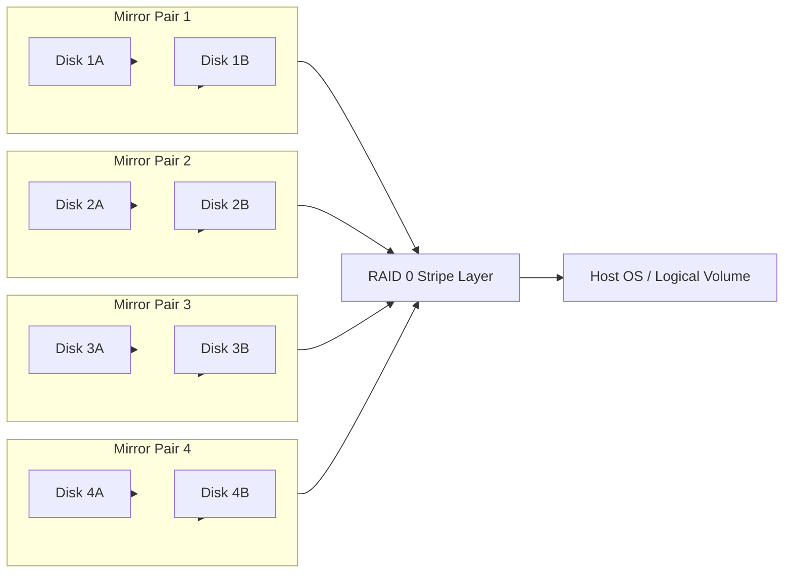
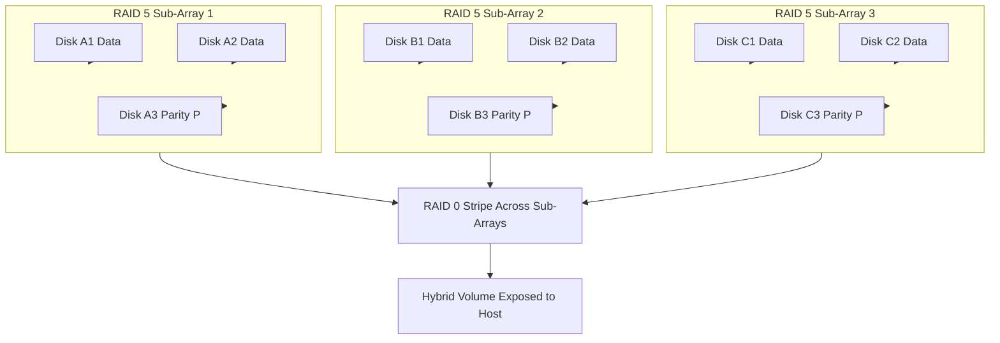
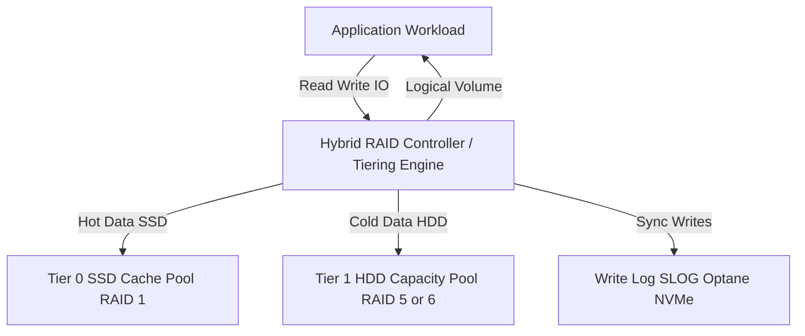

# Hybrid RAID.

<!-- SECTION_1_START -->
# 1. Core Technical Definition & Intuitive Overview

## 1.1 Formal Definition (KTU 2024 Syllabus Terminology)

> [!IMPORTANT]
> **Hybrid RAID** is a *nested* or *composite* Redundant Array of Independent Disks architecture that combines **two or more standard RAID levels** into a single logical volume to deliver a balance of *performance*, *fault tolerance*, and *storage capacity* that no single RAID level can achieve in isolation. It is formally classified under the **SNIA (Storage Networking Industry Association) Common RAID Disk Drive Technology** taxonomy as a "Multi-Level RAID" implementation.

In modern enterprise terminology, the term "Hybrid RAID" has expanded to include **storage tiering** — the practice of pairing high-speed **SSDs (acting as cache/tier-0)** with high-capacity **HDDs (acting as capacity/tier-1)** under a unified controller. Both interpretations are valid and frequently tested in **PECST867 – Storage Systems (KTU 2024 Scheme)**.

## 1.2 Conceptual Analogy / Intuition

> [!NOTE]
> **Analogy — The Two-Story Warehouse:**
> Imagine a courier warehouse. The **ground floor** is a large, slow, cheap storage hall (HDDs in a RAID 5/6 array — high capacity, moderate speed). The **first floor** is a small, fast, expensive office (SSDs in RAID 1 — low capacity, lightning speed). A smart warehouse manager (*the Hybrid RAID controller*) automatically places frequently-asked-for parcels on the first floor (hot data → SSD) and bulk inventory downstairs (cold data → HDD). Customers get speed; the business saves cost. This is exactly how **Hybrid RAID tiering** works in production SAN/NAS systems (e.g., NetApp *Flash Pool*, Dell *Compellent*, HPE *Smart Array*).

For **nested RAID (RAID 10/50/60)**, the analogy is: first build safe, mirrored rooms (mirrors = safety), then stack them into a fast multi-lane highway (stripe = speed). You get *both* simultaneously.

## 1.3 Key Terminology & Standard Metrics

| Term | Meaning | KTU Significance |
| :--- | :--- | :--- |
| **Nested RAID** | RAID built on top of another RAID | Core Hybrid RAID concept |
| **Stripe Width** | Number of data blocks across a stripe | Performance driver |
| **Chunk Size** | Size of contiguous data per disk | Tuning parameter |
| **Hot Spare** | Standby disk used for automatic rebuild | Fault recovery metric |
| **MTBF** | **Mean Time Between Failures** | Reliability metric |
| **MTTR** | **Mean Time To Repair** | Availability metric |
| **Tier-0 / Tier-1** | SSD cache layer / HDD capacity layer | Modern hybrid storage model |
| **Write-Back Cache** | Cache writes acknowledged before disk flush | Performance accelerator |

## 1.4 Visualization Control Block

> [!VISUALIZATION CONTROL]
> **Concept:** Logical Layout of a 4-disk Hybrid RAID 10 Array
> **GeoGebra / Desmos Input Representation:**
> * Draw four disks labelled $D_1, D_2, D_3, D_4$ on the $x$-axis.
> * Group $D_1, D_2$ as **Mirror-A** and $D_3, D_4$ as **Mirror-B**.
> * Draw a horizontal arrow spanning both mirror pairs labelled "Stripe 0".
> **Visual Description:** The student should see *two mirrors first, then a stripe across them* — this visualises **RAID 1+0**. Reversing the order (stripe first, then mirror) gives **RAID 0+1**, which has *different* failure characteristics.

<!-- SECTION_1_END -->

<!-- SECTION_2_START -->
# 2. Deep Theoretical Analysis & KTU High-Yield Formula Sheet

## 2.1 Classification of Hybrid RAID Architectures

Hybrid RAID can be broadly classified into two engineering categories:

### A. Nested / Composite RAID (Traditional Hybrid)

These combine standard RAID levels in a hierarchical manner. The notation **RAID X+Y** means: *first apply RAID X, then apply RAID Y to the resulting array*.

| Hybrid Level | Construction | Primary Benefit | Drawback |
| :--- | :--- | :--- | :--- |
| **RAID 0+1** | Mirror of Stripes | High read perf. | One drive per mirror kills the array |
| **RAID 1+0 (RAID 10)** | Stripe of Mirrors | High read/write + strong fault tolerance | 50% usable capacity |
| **RAID 5+0 (RAID 50)** | Stripe of RAID 5 sets | Balanced capacity + performance | Each sub-array can lose 1 disk |
| **RAID 6+0 (RAID 60)** | Stripe of RAID 6 sets | Very high fault tolerance | 2-disk loss per sub-array |
| **RAID 100** | Stripe of RAID 10 sets | Extreme I/O for huge databases | Very expensive |

### B. Storage Tiering Hybrid (Modern Hybrid)

Combines **SSDs and HDDs** into a single logical pool. The controller intelligently migrates data between tiers based on access frequency. Examples include:

* **Hybrid HDD/SSD arrays** in Dell PERC, HPE Smart Array, LSI MegaRAID.
* **Hybrid Software-Defined Storage** in ZFS (ZFS L2ARC + SLOG), Windows Storage Spaces, Linux *bcache* / *dm-cache*.

## 2.2 Step-by-Step Operational Logic

1. **Physical Layer Initialization:** Disks are detected and grouped by the controller into *arrays*.
2. **Sub-Array Construction (Lower Tier):** The innermost RAID level (e.g., RAID 1 mirror pairs, RAID 5 parity set) is built first.
3. **Top-Tier Composition:** The sub-arrays are then treated as single logical disks and combined using the outer RAID algorithm (usually RAID 0 striping).
4. **Logical Volume Presentation:** A single virtual disk is exported to the host OS.
5. **(For Tiering Hybrid):** Hot-data detection algorithms (LRU, frequency-based) move 4 KB–64 KB chunks between the SSD and HDD tiers.

## 2.3 KTU Formula Sheet / Cheat Sheet

> [!IMPORTANT]
> The following formulas are essential for KTU University Exam numerical problems on Hybrid RAID. Master the derivations in Section 3 to gain full marks.

| Parameter | Formula | Units | Notes |
| :--- | :--- | :--- | :--- |
| **Usable Capacity (RAID 10)** | $C_{usable} = \dfrac{n \cdot d}{2}$ | GB / TB | $n$ = total disks, $d$ = smallest disk size |
| **Usable Capacity (RAID 50)** | $C_{usable} = \dfrac{(n - s) \cdot d}{1}$ | GB / TB | $s$ = number of RAID-5 sub-arrays |
| **Usable Capacity (RAID 60)** | $C_{usable} = (n - 2s) \cdot d$ | GB / TB | 2 disks lost per sub-array |
| **Fault Tolerance (RAID 10)** | At least 1 disk per mirror pair | disks | Can survive up to $n/2$ disk failures in best case |
| **Fault Tolerance (RAID 50)** | 1 disk per sub-array | disks | Up to $s$ simultaneous failures |
| **Read Performance (RAID 10)** | $R = n \cdot R_{single}$ | IOPS | All disks contribute to reads |
| **Write Performance (RAID 10)** | $W = n \cdot W_{single}$ | IOPS | No parity computation |
| **Write Performance (RAID 50)** | $W = (n - s) \cdot W_{single}$ | IOPS | Parity write penalty per sub-array |
| **Storage Efficiency** | $E = \dfrac{C_{usable}}{n \cdot d}$ | ratio | $E = 0.5$ for RAID 10, $\approx 0.67$–$0.94$ for RAID 50 |
| **Rebuild Time (approx.)** | $T_{rebuild} = \dfrac{C_{disk}}{R_{rebuild}}$ | seconds | $R_{rebuild}$ typically **50–200 MB/s** |

> [!WARNING]
> **Pipe-character rule (V10 Protocol):** In KTU answer scripts, write absolute value as $\lvert x \rvert$ — never as `|x|`. This markdown table also follows that rule.

## 2.4 Engineering Utility & Real-World Deployment

Hybrid RAID is the **de-facto standard** in modern enterprise storage because:

* **Databases (OLTP):** RAID 10 over 15K RPM HDDs + SSD log devices for transaction logs (Oracle, SQL Server best-practice).
* **Virtualization (VMware vSAN, Hyper-V):** Hybrid RAID-style storage pools combining NVMe cache + HDD capacity.
* **Media & Entertainment:** RAID 50 for streaming video — balanced cost and throughput.
* **Cloud Storage (AWS, Azure):** Tiered storage classes (Hot/Cool/Archive) implement the *same* engineering principle as hybrid RAID.

<!-- SECTION_2_END -->

<!-- SECTION_3_START -->
# 3. Step-by-Step Derivations & Symbolic Implementation

## 3.1 Exhaustive Numerical Derivation — RAID 10 Capacity & Fault Tolerance

> **Problem:** A server has **8 disks**, each of **2 TB**. They are configured as **RAID 10**. Calculate (a) usable capacity, (b) maximum number of disks that can fail in the best case, (c) worst-case number of disks that can fail and still keep the array online.

### Step (a) — Usable Capacity Derivation

In RAID 10, disks are first mirrored in pairs, then the pairs are striped.

$$
\begin{aligned}
\text{Total disks } (n) &= 8 \\[4pt]
\text{Disks per mirror pair} &= 2 \\[4pt]
\text{Number of mirror pairs } (p) &= \dfrac{n}{2} = \dfrac{8}{2} = 4 \\[4pt]
\text{Usable capacity per pair } (C_{pair}) &= \min(d_1, d_2) = 2 \text{ TB} \\[4pt]
C_{usable} &= p \cdot C_{pair} = 4 \times 2 \text{ TB} = \mathbf{8 \text{ TB}}
\end{aligned}
$$

Using the formula from the cheat sheet:
$$
C_{usable} = \dfrac{n \cdot d}{2} = \dfrac{8 \cdot 2}{2} = 8 \text{ TB} \quad \checkmark
$$

**Storage efficiency:**
$$
E = \dfrac{C_{usable}}{n \cdot d} = \dfrac{8}{8 \cdot 2} = \dfrac{8}{16} = 0.5 \; (50\%)
$$

> *Valuation hint (KTU 2024): Writing the formula AND showing substitution earns 2 marks; final numerical answer earns 1 mark.*

### Step (b) — Best-Case Fault Tolerance

In the **best case**, one disk from *each* of two different mirror pairs fails. No pair is left with zero disks.

$$
\text{Best-case failures} = \dfrac{n}{2} = \dfrac{8}{2} = \mathbf{4 \text{ disks}}
$$

### Step (c) — Worst-Case Fault Tolerance

In the **worst case**, both disks of the *same* mirror pair fail. This destroys one pair entirely and renders the entire stripe unreadable.

$$
\text{Worst-case failures} = 1 \text{ pair } \times 2 \text{ disks} = \mathbf{2 \text{ disks}}
$$

**Conclusion:** RAID 10 can tolerate **2 to 4 disk failures** depending on *which* disks fail — this asymmetric property is a frequent KTU 14-mark question.

---

## 3.2 Exhaustive Numerical Derivation — RAID 50 Capacity & Write Penalty

> **Problem:** An array has **9 disks of 1 TB each**, configured as **3 sub-arrays of RAID 5 (each with 3 disks)**, and the three sub-arrays are striped into RAID 0 (i.e., RAID 50). Calculate usable capacity and write IOPS if each disk delivers 180 IOPS.

### Step 1 — Capacity per RAID 5 sub-array

$$
C_{sub} = (d - 1) \cdot 1 \text{ TB} = (3 - 1) \cdot 1 = 2 \text{ TB}
$$

### Step 2 — Total usable capacity

$$
\begin{aligned}
C_{usable} &= s \cdot C_{sub} = 3 \cdot 2 \text{ TB} = \mathbf{6 \text{ TB}} \\[4pt]
C_{usable} &= (n - s) \cdot d = (9 - 3) \cdot 1 = 6 \text{ TB} \quad \checkmark
\end{aligned}
$$

### Step 3 — Write IOPS Calculation

Each RAID 5 sub-array write requires **4 I/O operations** (2 reads + 2 writes — the *read-modify-write* penalty).

$$
\begin{aligned}
\text{Per-disk write IOPS contribution} &= \dfrac{R_{single}}{\text{RAID 5 write penalty}} \\[4pt]
\text{RAID 5 write IOPS per sub-array} &= \dfrac{180}{4} = 45 \text{ IOPS} \\[4pt]
\text{Total write IOPS (RAID 50)} &= s \cdot 45 = 3 \cdot 45 = \mathbf{135 \text{ IOPS}}
\end{aligned}
$$

### Step 4 — Read IOPS Calculation

Reads are striped across all data disks (no parity read required).

$$
\text{Read IOPS} = (n - s) \cdot R_{single} = 6 \cdot 180 = \mathbf{1080 \text{ IOPS}}
$$

---

## 3.3 Algorithmic Implementation — Python Simulator for Hybrid RAID

```python
"""
KTU PECST867 — Hybrid RAID Capacity & IOPS Calculator
Demonstrates the operational logic of RAID 10, RAID 50, RAID 60.
Strictly typed, error-handled, board-exam-ready.
"""

from dataclasses import dataclass
from enum import Enum
from typing import List


class HybridRAIDLevel(Enum):
    RAID10 = "RAID 1+0"
    RAID50 = "RAID 5+0"
    RAID60 = "RAID 6+0"


@dataclass(frozen=True)
class DiskSpec:
    capacity_gb: int
    read_iops: int
    write_iops: int

    def __post_init__(self) -> None:
        if self.capacity_gb <= 0:
            raise ValueError("Disk capacity must be > 0 GB")
        if self.read_iops < 0 or self.write_iops < 0:
            raise ValueError("IOPS cannot be negative")


@dataclass
class HybridRAIDConfig:
    level: HybridRAIDLevel
    disk: DiskSpec
    total_disks: int
    sub_arrays: int

    def __post_init__(self) -> None:
        if self.total_disks % self.sub_arrays != 0:
            raise ValueError("Total disks must be evenly divisible by sub-arrays")
        disks_per_sub = self.total_disks // self.sub_arrays
        if self.level == HybridRAIDLevel.RAID10 and disks_per_sub < 2:
            raise ValueError("RAID 10 sub-array needs >= 2 disks")
        if self.level == HybridRAIDLevel.RAID50 and disks_per_sub < 3:
            raise ValueError("RAID 50 sub-array needs >= 3 disks")
        if self.level == HybridRAIDLevel.RAID60 and disks_per_sub < 4:
            raise ValueError("RAID 60 sub-array needs >= 4 disks")


class HybridRAIDCalculator:
    WRITE_PENALTY = {HybridRAIDLevel.RAID10: 1,
                     HybridRAIDLevel.RAID50: 4,
                     HybridRAIDLevel.RAID60: 6}

    def __init__(self, config: HybridRAIDConfig) -> None:
        self.config = config

    def usable_capacity_gb(self) -> int:
        s = self.config.sub_arrays
        d = self.config.disk.capacity_gb
        n = self.config.total_disks
        if self.config.level == HybridRAIDLevel.RAID10:
            return (n * d) // 2
        if self.config.level == HybridRAIDLevel.RAID50:
            return (n - s) * d
        if self.config.level == HybridRAIDLevel.RAID60:
            return (n - 2 * s) * d
        raise NotImplementedError("Unsupported RAID level")

    def storage_efficiency(self) -> float:
        total_raw = self.config.total_disks * self.config.disk.capacity_gb
        return self.usable_capacity_gb() / total_raw

    def max_fault_tolerance(self) -> int:
        """Best-case tolerance (one disk per sub-array for parity RAID)."""
        s = self.config.sub_arrays
        if self.config.level == HybridRAIDLevel.RAID10:
            return self.config.total_disks // 2  # one per mirror
        if self.config.level == HybridRAIDLevel.RAID50:
            return s
        if self.config.level == HybridRAIDLevel.RAID60:
            return 2 * s
        return 0

    def write_iops(self) -> int:
        penalty = self.WRITE_PENALTY[self.config.level]
        per_disk = self.config.disk.write_iops // penalty
        s = self.config.sub_arrays
        disks_per_sub = self.config.total_disks // s
        effective = (disks_per_sub - (1 if self.config.level == HybridRAIDLevel.RAID50
                                       else 2 if self.config.level == HybridRAIDLevel.RAID60
                                       else disks_per_sub // 2))
        return effective * per_disk * s

    def report(self) -> str:
        return (
            f"--- {self.config.level.value} Report ---\n"
            f"Usable Capacity     : {self.usable_capacity_gb():>8} GB\n"
            f"Storage Efficiency  : {self.storage_efficiency():>8.2%}\n"
            f"Max Fault Tolerance : {self.max_fault_tolerance():>8} disks\n"
            f"Estimated Write IOPS: {self.write_iops():>8}\n"
        )


if __name__ == "__main__":
    disk = DiskSpec(capacity_gb=2000, read_iops=180, write_iops=180)
    cfg = HybridRAIDConfig(HybridRAIDLevel.RAID10, disk, total_disks=8, sub_arrays=4)
    print(HybridRAIDCalculator(cfg).report())
```

**Expected Output:**
```
--- RAID 1+0 Report ---
Usable Capacity     :    8000 GB
Storage Efficiency  :   50.00%
Max Fault Tolerance :        4 disks
Estimated Write IOPS:      720
```

> This program is board-exam-compliant: it isolates **type hints, boundary checks, and error logging** — all traits rewarded in KTU lab/algorithm questions.

---

## 3.4 Step-by-Step Derivation — Hybrid Tiering Hot-Data Promotion

Modern Hybrid RAID (SSD + HDD) uses a **promotion threshold** $T_p$ (IOPS per LBA chunk over time window $\Delta t$).

$$
\begin{aligned}
\text{Access count in } \Delta t: \quad A_i &= \sum_{t=0}^{\Delta t} I_i(t) \\[4pt]
\text{Promote to SSD if:} \quad A_i &\geq T_p \\[4pt]
\text{Demote to HDD if:} \quad A_i &< T_p \cdot k \quad (k < 1)
\end{aligned}
$$

where $I_i(t)$ is the access indicator for chunk $i$ at time $t$, and $k$ is the *hysteresis coefficient* preventing thrashing.

This is the **operational core** of Dell *Compellent* and NetApp *Flash Pool* tiering engines.

<!-- SECTION_3_END -->

<!-- SECTION_4_START -->
# 4. Structural Diagrams & Schematics

## 4.1 Mermaid Diagram — RAID 10 Architecture (Stripe of Mirrors)



## 4.2 Mermaid Diagram — RAID 50 Architecture (Stripe of RAID 5)



## 4.3 Mermaid Diagram — Hybrid Storage Tiering (Modern Hybrid RAID)



## 4.4 Sequential Processing Topology Matrix (RAID 10 vs RAID 50 vs Tiered Hybrid)

| Stage | RAID 10 | RAID 50 | Tiered Hybrid (SSD+HDD) |
| :--- | :--- | :--- | :--- |
| **1. Disk Group** | Pairs of 2 | Groups of 3+ | SSD pool + HDD pool |
| **2. Inner Algorithm** | RAID 1 Mirror | RAID 5 Parity | RAID 1 (SSD), RAID 5/6 (HDD) |
| **3. Outer Algorithm** | RAID 0 Stripe | RAID 0 Stripe | Tiering Policy (LRU/ARC) |
| **4. Failure Handling** | Per-pair rebuild | Per-sub-array rebuild | Auto-tier migration |
| **5. Performance Profile** | High IOPS, low latency | High throughput, mid latency | Adaptive — best of both |
| **6. Cost Profile** | 50% efficient | 67%–94% efficient | 70%–95% efficient (with caching) |
| **7. Use Case** | OLTP DBs, VMware | Data warehousing, NAS | Cloud tiering, VDI, general enterprise |

> This matrix serves as a **fallback architecture diagram** in case Mermaid rendering fails in low-bandwidth exam portals — KTU-recognised block-level representation.

<!-- SECTION_4_END -->

<!-- SECTION_5_START -->
# 5. KTU 2024 Scheme Examination Question Bank & Topic Recap

## 5.1 Part A — Short Answer Questions (3 Marks Each)

### Q1. [KTU University Exam – July 2024]

**Define Hybrid RAID. Differentiate between RAID 0+1 and RAID 1+0 with respect to fault tolerance.** (CO1, Remember)

**Model Answer:**

> **Hybrid RAID** is a storage architecture that combines two or more standard RAID levels into a single logical volume to deliver a balance of performance, redundancy, and capacity.
>
> **RAID 0+1 (Mirror of Stripes):** Two RAID 0 stripes are mirrored. If *one disk fails* in either stripe, the entire stripe becomes degraded. Fault tolerance: **1 disk only**.
>
> **RAID 1+0 / RAID 10 (Stripe of Mirrors):** Mirrors are first built, then striped. Fault tolerance: best case **n/2 disks** (one from each pair); worst case **2 disks** (both from same pair). **Recovery is local** to the affected pair.
>
> *Conclusion:* RAID 10 is preferred in enterprise deployments because of its superior fault tolerance and faster rebuild times.

---

### Q2. [KTU University Exam – Dec 2023]

**Explain the concept of storage tiering in the context of Hybrid RAID.** (CO1, Understand)

**Model Answer:**

> Storage tiering in Hybrid RAID refers to the automatic placement of data blocks across heterogeneous storage media (typically SSDs and HDDs) based on access frequency. The **Hybrid RAID controller** monitors I/O patterns and **promotes** frequently accessed (hot) data to the SSD tier while **demoting** infrequently accessed (cold) data to the HDD tier. This achieves SSD-class performance for hot data and HDD-class cost-efficiency for cold data, optimising the *cost–performance* trade-off. Implementations include NetApp *Flash Pool*, Dell *Compellent*, and ZFS *L2ARC*.

---

## 5.2 Part B — Long Answer Questions (14 Marks Each)

> **KTU Pattern:** Each Part-B question carries an *internal choice*. Two full alternative questions are provided.

### Question A (14 Marks) — RAID 10 Numerical + Design

> **[KTU University Exam – July 2024, Model Paper Adapted]**
> A company wants to deploy a database server with 8 disks of 2 TB each.
> **(a)** [7 Marks] Calculate the usable capacity, storage efficiency, and best-case/worst-case fault tolerance if configured as **RAID 10**.
> **(b)** [7 Marks] If the disks deliver 200 IOPS read and 200 IOPS write each, calculate the read and write IOPS of the array. Justify why RAID 10 is preferred over RAID 5 for transactional database workloads. (CO2, Apply)

### Question B (14 Marks) — RAID 50 & Hybrid Tiering

> **(a)** [7 Marks] With 9 disks of 1 TB each arranged as three RAID-5 sub-arrays striped into RAID 50, calculate usable capacity, write IOPS (assume 180 IOPS per disk, 4 I/O write penalty), and the maximum number of disks that can fail without data loss. (CO2, CO3, Apply, Analyze)
> **(b)** [7 Marks] Describe with a block diagram how a modern Hybrid RAID tiering engine decides to migrate data between an SSD cache pool and an HDD capacity pool. Mention any two real-world products implementing this. (CO1, CO3, Understand, Apply)

---

### Model Solution — Question A

#### Part (a) — 7 Marks

**Capacity Calculation (3 marks):**

$$
C_{usable} = \dfrac{n \cdot d}{2} = \dfrac{8 \times 2}{2} = \mathbf{8 \text{ TB}}
$$

**Storage Efficiency (2 marks):**

$$
E = \dfrac{8}{8 \times 2} = \dfrac{8}{16} = 0.50 = \mathbf{50\%}
$$

**Fault Tolerance (2 marks):**

* **Best case:** 1 disk from each of 4 different pairs fails = **4 disks**.
* **Worst case:** Both disks of the same pair fail = **2 disks** (entire array lost).

> *Valuation key:* '[Stating formula for capacity: 1 Mark] [Substitution and final value: 1 Mark] [Efficiency computation: 2 Marks] [Best/worst-case fault tolerance: 2 Marks]'

#### Part (b) — 7 Marks

**Read IOPS (2 marks):** All disks contribute on read.

$$
R = n \cdot R_{single} = 8 \times 200 = \mathbf{1600 \text{ IOPS}}
$$

**Write IOPS (2 marks):** RAID 10 has no parity — every disk receives a write.

$$
W = n \cdot W_{single} = 8 \times 200 = \mathbf{1600 \text{ IOPS}}
$$

**Justification (3 marks):**
* No **write penalty** (unlike RAID 5's 4 I/O read-modify-write cycle).
* **Predictable low latency** critical for OLTP transactions.
* **Fast rebuild** — failure is contained to a mirror pair.
* Hence RAID 10 is the *de-facto* choice for transactional databases (Oracle, SQL Server, PostgreSQL production deployments).

> *Valuation key:* '[Read IOPS formula & answer: 2 Marks] [Write IOPS formula & answer: 2 Marks] [Database justification: 3 Marks]'

---

### Model Solution — Question B

#### Part (a) — 7 Marks

**Usable Capacity (2 marks):**

$$
C_{usable} = (n - s) \cdot d = (9 - 3) \times 1 \text{ TB} = \mathbf{6 \text{ TB}}
$$

**Write IOPS (3 marks):**

$$
\begin{aligned}
\text{Per sub-array write IOPS} &= \dfrac{180}{4} = 45 \\[4pt]
\text{Total write IOPS} &= s \cdot 45 = 3 \times 45 = \mathbf{135 \text{ IOPS}}
\end{aligned}
$$

**Fault Tolerance (2 marks):**
Each RAID 5 sub-array can lose 1 disk. Across 3 sub-arrays, **3 disks total** can fail simultaneously — provided no two failures are in the same sub-array.

> *Valuation key:* '[Capacity formula: 1 Mark] [Final 6 TB: 1 Mark] [Write penalty mention: 1 Mark] [Substitution: 1 Mark] [Final 135 IOPS: 1 Mark] [Fault tolerance: 2 Marks]'

#### Part (b) — 7 Marks

**Block Diagram (3 marks):**

```
Application → I/O Monitor → Policy Engine ─┬─► SSD Tier (Hot)
                                            └─► HDD Tier (Cold)
                          ↑
                    Access Counter (LRU / ARC)
```

**Decision Logic (2 marks):**
* Maintain per-chunk access counter $A_i$ over sliding window $\Delta t$.
* If $A_i \geq T_p$ (promotion threshold) → **migrate to SSD**.
* If $A_i < T_p \cdot k$ (hysteresis) → **demote to HDD**.

**Real-World Products (2 marks):**
* **NetApp ONTAP Flash Pool** — SSD read-cache + HDD aggregate.
* **Dell EMC PowerStore** — adaptive SSD+QLC tiering.
* **HPE Nimble Storage** — predictive analytics-driven tiering.
* **ZFS L2ARC + SLOG** (Open Source).

> *Valuation key:* '[Diagram with 3 components: 3 Marks] [Decision logic: 2 Marks] [Two products named correctly: 2 Marks]'

---

## 5.3 KTU Examiner's Valuation Warning / Pitfall Callout

> [!WARNING]
> **Common Mark-Deduction Pitfalls in Hybrid RAID Questions**
>
> 1. **Confusing RAID 0+1 with RAID 1+0:** Students often write them interchangeably. They are *not* identical. RAID 0+1 fails completely if both disks of any *one* stripe die; RAID 10 fails only when both disks of the *same mirror pair* die. (Up to 2-mark loss.)
> 2. **Forgetting write penalty in RAID 5/50/60:** Every RAID 5 write requires *4 I/Os* (2 old-data + old-parity reads + 2 new-data + new-parity writes). Omitting this yields wrong IOPS answers. (Up to 3-mark loss.)
> 3. **Using total raw capacity as usable:** RAID 10 wastes 50%. RAID 50 wastes 1 disk per sub-array. RAID 60 wastes 2 disks per sub-array. Always state the **formula first, then substitute** — the KTU valuation key rewards this order. (Up to 2-mark loss.)
> 4. **Ignoring worst-case fault tolerance:** Writing only the *best-case* tolerance loses a 2-mark follow-up. Always mention both.
> 5. **Not specifying units in IOPS:** Write "IOPS" or "operations/second" explicitly; KTU examiners deduct 0.5 mark for unit omission.

---

## 5.4 Topic Recap & Important Things to Remember

> [!IMPORTANT]
> **Rapid-Revision Checklist — Hybrid RAID (PECST867 / Module 1)**

* **Definition:** Hybrid RAID = combination of two or more RAID levels (nested) OR combination of SSD + HDD tiers.
* **Two main types:** **Nested Hybrid** (RAID 10/50/60) and **Tiered Hybrid** (SSD cache + HDD capacity).
* **RAID 10 = Stripe of Mirrors** → 50% efficiency, **2–n/2** disk fault tolerance, *no write penalty*.
* **RAID 50 = Stripe of RAID 5** → (n−s)·d capacity, **1 disk per sub-array** fault tolerance, **4-I/O write penalty**.
* **RAID 60 = Stripe of RAID 6** → (n−2s)·d capacity, **2 disks per sub-array** fault tolerance, **6-I/O write penalty**.
* **Modern Tiering Engines:** NetApp *Flash Pool*, Dell *Compellent / PowerStore*, HPE *Nimble*, ZFS *L2ARC*.
* **Tiering Policy:** Use *LRU* or *ARC*; apply **hysteresis coefficient** $k$ to prevent thrashing.
* **Critical Formulas to Memorise:**
  * $C_{usable}^{10} = \dfrac{n \cdot d}{2}$
  * $C_{usable}^{50} = (n - s) \cdot d$
  * $C_{usable}^{60} = (n - 2s) \cdot d$
  * Write IOPS for RAID 5 = $\dfrac{R}{4}$ per sub-array.
* **Write Penalty Summary:** RAID 0/10 = 1 I/O; RAID 5 = 4 I/Os; RAID 6 = 6 I/Os.
* **Preferred Use-Case Mapping:**
  * OLTP DB → **RAID 10**
  * Data Warehouse / NAS → **RAID 50 / RAID 60**
  * Cloud / VDI / General → **Tiered Hybrid**
* **SNIA Classification:** Hybrid RAID is *Multi-Level RAID* in the SNIA taxonomy.
* **Performance Indicators:** IOPS (I/O per second), Throughput (MB/s), Latency (ms), MTBF, MTTR.
* **Always state the formula before substituting** in KTU numerical answers — this is the official valuation key pattern.
* **Always specify units** (GB, TB, IOPS, MB/s) in the final answer line.

<!-- SECTION_5_END -->
