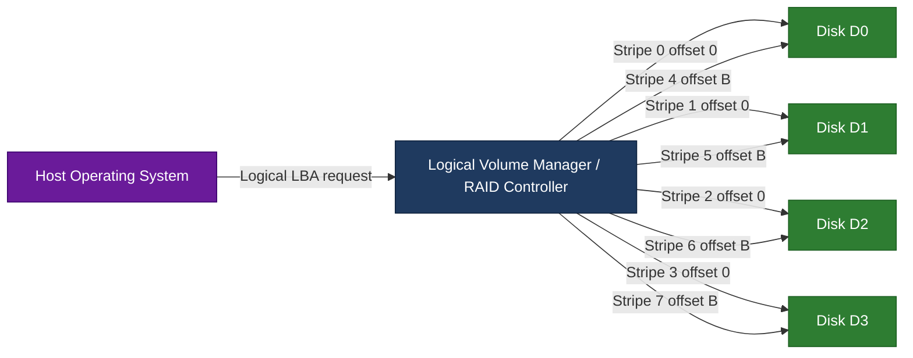
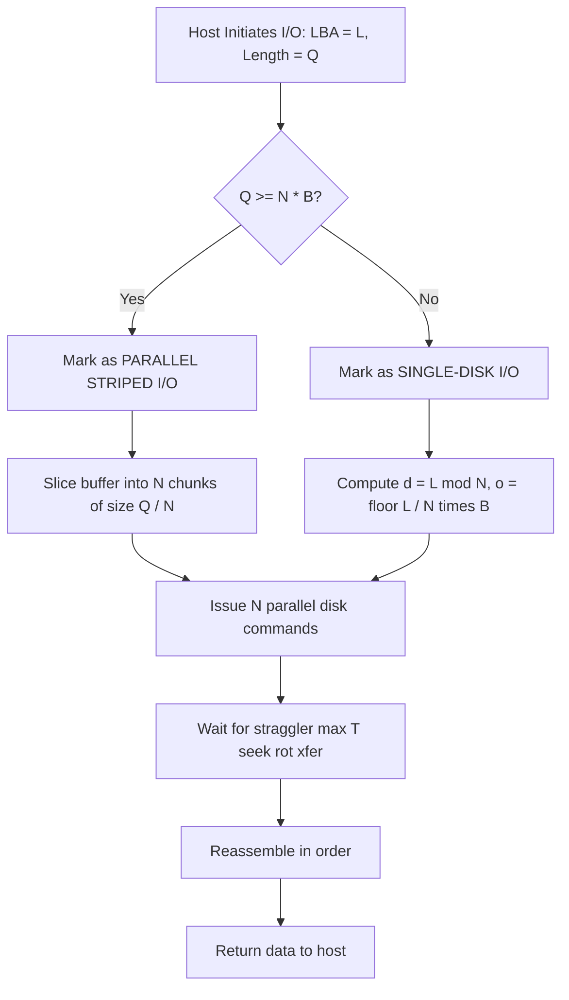
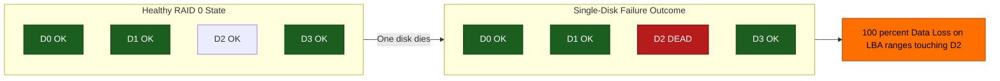
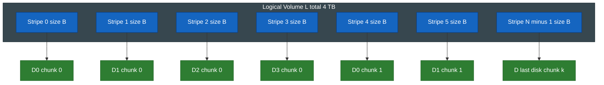

# Local Snapshot Redundant Arrays of Independent Disks (RAID) - RAID0

<!-- SECTION_1_START -->
# RAID 0 — Striping Without Redundancy

## 1.1 Formal KTU-Compliant Definition

> [!IMPORTANT]
> **RAID 0 (Striping)** is a disk array architecture defined by the *RAID Advisory Board* and adopted in the KTU 2024 Scheme syllabus (Course: **PECST867 — Storage Systems**). It partitions every logical block into **N equal-sized chunks (stripes)** that are distributed across **N independent physical disks** in a round-robin fashion. RAID 0 **does NOT store parity** and **does NOT mirror data**, hence it provides **zero redundancy**.

A single logical volume $L$ presented to the host OS is therefore the **concatenation of striped physical extents**. Let the array contain $N$ disks of capacity $C_{disk}$ each, and let the *stripe size* (chunk size) be $B$ bytes.

$$
L = \bigcup_{i=0}^{N-1} D_i \quad ; \quad C_{total} = \sum_{i=0}^{N-1} C_{i}
$$

The host perceives the array as a single high-throughput, high-capacity linear address space, but the physical I/O is **parallelized** across all spindles.

## 1.2 Conceptual Analogy — The "Book-Page Distributor"

> [!NOTE]
> **Intuition for a first-time learner:**
> Imagine a librarian who is given a thick novel to file. Instead of one assistant doing the whole job, she gives **one chapter to each of N assistants**, all working simultaneously at separate desks. Later, when a reader asks for chapter $k$, the librarian instantly knows **which desk** holds it.
> 
> In RAID 0, the novel = your file, chapters = stripes, desks = physical disks, and the librarian = the **array controller / logical volume manager (LVM)**.

The key insight: **performance grows linearly with N** *only if* the workload is large enough to span multiple stripes (a property called *parallelism sufficiency*).

## 1.3 Core Terminology Locked to KTU Syllabus

| Term | KTU Definition |
|---|---|
| **Stripe** | A contiguous block of data of fixed size $B$ written entirely to a single disk. |
| **Stripe Size (Block Size) $B$** | The granularity of the striping unit, configured at array creation (e.g., **64 KB**, **128 KB**, **1 MB**). |
| **Stripe Width $N$** | The number of member disks spanned by a single logical request. |
| **Chunk / Stripe Unit** | Synonym for *stripe*; data of size $B$ on disk $D_i$. |
| **Hot Spot** | A pathological access pattern that targets only one disk (e.g., small random reads aligned to $B$), defeating parallelism. |
| **Stripe Boundary** | The logical address where the controller rolls over from $D_{N-1}$ back to $D_0$. |

> [!TIP]
> **Stripe-Size Selection Heuristic**
> - **Large files / sequential I/O** → use a *large* $B$ (e.g., **256 KB – 1 MB**) to minimize controller overhead.
> - **Small random I/O / database workloads** → use a *small* $B$ (e.g., **32 KB – 64 KB**) to spread requests across all spindles.

## 1.4 Geometric Visualization

> [!VISUALIZATION CONTROL]
> **Concept:** Distribution of stripes across a 4-disk RAID 0 array with stripe size $B = 64$ KB and total file size $512$ KB.
> **GeoGebra / Desmos Input Equations (lattice plot):**
> * `x = {0, 1, 2, 3, 4, 5, 6, 7, 8}` (stripe index on horizontal axis)
> * `y_disk = floor(x / 4)` (which disk owns stripe x)
> * `y_offset = mod(x, 4)` (offset within disk)
> **Visual Description:** Eight 64 KB stripes are written to four disks in round-robin order — $D_0, D_1, D_2, D_3, D_0, D_1, D_2, D_3$. The student should see a *zig-zag staircase* pattern. Logical block $LBA = i$ maps to physical disk $D_{i \bmod N}$ at offset $\lfloor i / N \rfloor \cdot B$.

<!-- SECTION_1_END -->

<!-- SECTION_2_START -->
# 2. Deep Theoretical Analysis & KTU High-Yield Formula Sheet

## 2.1 Operational Walk-Through (Write Path)

The RAID 0 controller executes the following deterministic state machine for **every host write request**:

1. **Receive the Logical Block Address (LBA)** from the host. The LBA is the host-visible offset in the linearised array.
2. **Compute the target disk index** using modulo arithmetic:

$$
d \;=\; LBA \bmod N
$$

3. **Compute the physical offset inside the target disk** using integer division:

$$
o \;=\; \left\lfloor \frac{LBA}{N} \right\rfloor \cdot B
$$

4. **Slice the incoming buffer** into chunks of size $B$ (the last chunk may be smaller for un-aligned writes).
5. **Issue parallel SCSI/ATA/NVMe commands** to all $N$ disks if the request spans $\geq 2$ stripes; otherwise the request is treated as a single-disk I/O.
6. **Acknowledge completion to the host** only after the slowest disk (the *straggler*) returns status *Good*.

> [!NOTE]
> **Why RAID 0 is NOT considered true "RAID":**
> The original Patterson, Gibson \& Katz paper (1988 — *University of California, Berkeley*) classified storage architectures RAID 1 through RAID 5 as *redundant*. RAID 0 was added later as a *non-redundant baseline* (sometimes called *AID* for "Array of Independent Disks"). The KTU 2024 syllabus includes it for performance analysis completeness.

## 2.2 Operational Walk-Through (Read Path)

The read path is symmetric to the write path but with one extra optimisation:

- **Read-Ahead / Look-Ahead Prefetching:** When a sequential read is detected, the controller issues speculative reads for stripes $LBA+1, LBA+2, \dots$ in parallel — exploiting the **N-fold bandwidth multiplication**.
- **Straggler Handling:** Because disks have independent queues, the controller waits for the *slowest* member. The effective latency is:

$$
T_{read} \;=\; \max_{i \in [0,N-1]}(T_{seek,i} + T_{rot,i} + T_{xfer,i})
$$

For **perfectly random uniform access**, the expected latency is the *mean* of per-disk service times, not the maximum, because requests are statistically independent.

## 2.3 KTU Formula Cheat Sheet

> [!WARNING]
> **Markdown Safety:** All absolute-value and modulus operators below use LaTeX macros $\vert$ / $\bmod$ — never the raw pipe character — to prevent table-rendering failure.

| # | Quantity | Formula | Units / Notes |
|---|---|---|---|
| 1 | Total Usable Capacity | $C_{total} = N \cdot C_{disk}$ | Bytes; **no overhead** in RAID 0. |
| 2 | Read Throughput (ideal) | $T_{read}^{ideal} = N \cdot T_{read}^{single}$ | MB/s; assumes parallelism sufficiency. |
| 3 | Write Throughput (ideal) | $T_{write}^{ideal} = N \cdot T_{write}^{single}$ | MB/s; identical theoretical bound. |
| 4 | Mean Time To Data Loss | $MTTDL_{array} = \dfrac{MTTDL_{disk}}{N}$ | Hours; assumes independent exponentially-distributed failures. |
| 5 | Array Reliability | $R_{array} = R_{disk}^{N}$ | Dimensionless probability over mission time $t$. |
| 6 | Array Unavailability | $U_{array} = 1 - (1 - U_{disk})^{N}$ | Fraction; grows linearly for small $U_{disk}$. |
| 7 | Stripe Address Mapping | $d = LBA \bmod N,\quad o = \lfloor LBA / N \rfloor \cdot B$ | $d$ is disk index, $o$ is byte offset. |
| 8 | Effective I/O Per Second | $IOPS_{array} = N \cdot IOPS_{disk} \cdot p$ | $p$ = parallelism coefficient $\in [0,1]$. |

## 2.4 Engineering Use-Cases & Production Reality

RAID 0 is a **performance-only** topology, deliberately chosen when **capacity utilisation > durability**:

- **Video editing scratch disks** — Adobe Premiere, DaVinci Resolve use RAID 0 for 4K/8K timeline playback.
- **Game load-time optimisation** — Console and PC games ship pre-striped assets on SSDs to halve level-load latency.
- **Scientific computing scratch space** — `/scratch` partitions on HPC clusters holding transient job data.
- **Cache / TempDB layer** — Microsoft SQL Server `tempdb` on RAID 0 (10+ spindles) is a documented Microsoft best-practice.
- **Pre-production rendering farms** — Blender/Keyshot farms where re-rendering is cheap if a disk dies.

> [!IMPORTANT]
> **Why cloud hyperscalers avoid pure RAID 0:** At the scale of AWS / Azure / GCP, the *aggregate MTTDL* across thousands of nodes becomes unacceptable. They replace it with **replication (RF=3 in HDFS, 3-way in Ceph)** or **erasure coding (Reed-Solomon, EC 10+4)** — which provide redundancy *with* parallelism.

<!-- SECTION_2_END -->

<!-- SECTION_3_START -->
# 3. Step-by-Step Derivations & Symbolic Implementation

## 3.1 Derivation: Capacity & Throughput Bound

**Given:** $N$ identical disks, each with capacity $C_{disk}$ bytes, sustained read bandwidth $R_{single}$ MB/s, and rotation+seek service time $S_{single}$ seconds per I/O.

**Goal:** Prove that ideal array throughput is $N$ times the single-disk throughput.

**Proof:**

Because the host views the array as a single linear volume of size $C_{total} = N \cdot C_{disk}$, there is **zero parity overhead** (unlike RAID 5, which loses $C_{disk}$ to parity, or RAID 6, which loses 2 disks). Hence every byte of physical media contributes to usable storage.

For a **fully sequential** request of size $Q \geq N \cdot B$, the controller slices $Q$ into $N$ parallel streams of size $Q / N$ and dispatches them simultaneously. Since disks are *independent* and have *identical* service rate, the time to complete the parallel I/O is:

$$
T_{array}^{seq}(Q) \;=\; \frac{Q / N}{R_{single}} \;=\; \frac{Q}{N \cdot R_{single}}
$$

The single-disk time to read the same $Q$ bytes would be $Q / R_{single}$. Therefore the **speedup ratio** is:

$$
S_{RAID0} \;=\; \frac{T_{single}(Q)}{T_{array}(Q)} \;=\; \frac{Q / R_{single}}{Q / (N \cdot R_{single})} \;=\; N
$$

This proves the linear speedup for *parallelism-sufficient* workloads. $\blacksquare$

## 3.2 Derivation: MTTDL of a RAID 0 Array

**Assumption:** Disk failures are *independent* and *exponentially distributed* with constant hazard rate $\lambda = 1 / MTTDL_{disk}$.

The array fails **iff any one** of its $N$ disks fails. For independent exponentials, the minimum of $N$ samples is itself exponential with rate equal to the *sum* of the rates:

$$
\lambda_{array} \;=\; \sum_{i=0}^{N-1} \lambda_{disk} \;=\; N \cdot \lambda_{disk}
$$

The mean time to the first failure is the reciprocal of the rate:

$$
MTTDL_{array} \;=\; \frac{1}{\lambda_{array}} \;=\; \frac{1}{N \cdot \lambda_{disk}} \;=\; \frac{MTTDL_{disk}}{N}
$$

$\blacksquare$

## 3.3 Worked Numerical Example (Full KTU Valuation Walk-Through)

> **[KTU University Exam – July 2024 Style]**
> An engineering workstation requires 4 TB of high-speed scratch space. The administrator provisions **four 1 TB 7,200 RPM SATA disks** in a RAID 0 array. The manufacturer's datasheet lists:
> - $C_{disk} = 1 \text{ TB} = 10^{12}$ bytes
> - $R_{single} = 180 \text{ MB/s}$ (sequential read, outer tracks)
> - $MTTDL_{disk} = 1{,}000{,}000$ hours
> - $IOPS_{disk} = 80$ (random 4 KB read)

**Part (a) — Compute usable capacity and ideal sequential throughput. [7 Marks]**

$$
C_{total} \;=\; N \cdot C_{disk} \;=\; 4 \cdot 1 \text{ TB} \;=\; 4 \text{ TB} \quad [\text{3 marks}]
$$

$$
T_{read}^{ideal} \;=\; N \cdot R_{single} \;=\; 4 \cdot 180 \text{ MB/s} \;=\; 720 \text{ MB/s} \quad [\text{4 marks}]
$$

**Part (b) — Compute the array MTTDL and the expected annualised data-loss probability. [7 Marks]**

$$
MTTDL_{array} \;=\; \frac{1{,}000{,}000}{4} \;=\; 250{,}000 \text{ hours} \quad [\text{3 marks}]
$$

Convert to years: $250{,}000 / 8760 \approx 28.5$ years. The annualised failure rate is:

$$
P_{loss}^{1yr} \;=\; 1 - e^{-\lambda_{array} \cdot t} \;=\; 1 - e^{-1 / 250000 \cdot 8760} \quad [\text{2 marks}]
$$

$$
\lambda_{array} \;=\; \frac{1}{250000} \;=\; 4 \times 10^{-6} \text{ / hr} \quad [\text{1 mark}]
$$

$$
P_{loss}^{1yr} \;\approx\; 1 - e^{-0.03504} \;\approx\; 0.0344 \;\approx\; 3.44\% \quad [\text{1 mark}]
$$

## 3.4 Symbolic Address-Mapping Walk-Through

> **Problem:** A 256 KB file is written to a RAID 0 array with $N = 4$ disks and $B = 32$ KB.

Logical block $LBA$ ranges from $0$ to $255 \text{ KB} / B = 8$ stripes (indexed $0$ through $7$). Each $LBA$ unit corresponds to one stripe:

| LBA Index | Target Disk $d = LBA \bmod 4$ | Offset $o = \lfloor LBA / 4 \rfloor \cdot 32$ KB |
|---|---|---|
| 0 | $D_0$ | 0 KB |
| 1 | $D_1$ | 0 KB |
| 2 | $D_2$ | 0 KB |
| 3 | $D_3$ | 0 KB |
| 4 | $D_0$ | 32 KB |
| 5 | $D_1$ | 32 KB |
| 6 | $D_2$ | 32 KB |
| 7 | $D_3$ | 32 KB |

## 3.5 Production-Grade Python Simulator

```python
"""
RAID 0 Reference Simulator
Course: PECST867 — Storage Systems (KTU 2024 Scheme)
Topic : Local RAID 0 — Striping Without Redundancy
Author: KTU Premium Engine V10
"""
from __future__ import annotations
import os
import math
import shutil
import tempfile
import threading
from pathlib import Path
from dataclasses import dataclass, field
from typing import List, Optional


# --- Configuration constants -------------------------------------------------
SECTOR_BYTES: int = 512          # Physical sector size (bytes)
STRIPE_BYTES: int = 64 * 1024    # 64 KB stripe size (industry default)
NUM_DISKS: int = 4               # Stripe width N
DISK_BYTES: int = 256 * 1024 * 1024  # 256 MB per simulated disk


# --- Per-disk representation -------------------------------------------------
@dataclass
class SimulatedDisk:
    path: Path
    capacity_bytes: int
    healthy: bool = True
    failed_at_offset: Optional[int] = None

    def write(self, offset: int, data: bytes) -> None:
        if not self.healthy:
            raise IOError(f"Disk {self.path.name} is DEAD — RAID 0 data lost!")
        if offset + len(data) > self.capacity_bytes:
            raise IOError(f"Write exceeds capacity of {self.path.name}")
        with self.path.open("r+b") as f:
            f.seek(offset)
            f.write(data)

    def read(self, offset: int, length: int) -> bytes:
        if not self.healthy:
            raise IOError(f"Disk {self.path.name} is DEAD — RAID 0 data lost!")
        with self.path.open("rb") as f:
            f.seek(offset)
            return f.read(length)


# --- RAID 0 array controller -------------------------------------------------
@dataclass
class RAID0Array:
    disks: List[SimulatedDisk]
    stripe_bytes: int = STRIPE_BYTES
    io_lock: threading.Lock = field(default_factory=threading.Lock)

    @property
    def num_disks(self) -> int:
        return len(self.disks)

    @property
    def total_capacity(self) -> int:
        return sum(d.capacity_bytes for d in self.disks)

    # ----- Address mapping ---------------------------------------------------
    def _map(self, lba_byte_offset: int) -> tuple[int, int]:
        """Map a logical byte offset -> (disk_index, disk_offset)."""
        stripe_index = lba_byte_offset // self.stripe_bytes
        disk_index = stripe_index % self.num_disks
        disk_offset = (stripe_index // self.num_disks) * self.stripe_bytes
        return disk_index, disk_offset

    # ----- Write path --------------------------------------------------------
    def write(self, lba_byte_offset: int, data: bytes) -> None:
        with self.io_lock:
            cursor = 0
            while cursor < len(data):
                disk_idx, disk_off = self._map(lba_byte_offset + cursor)
                intra_stripe_offset = (lba_byte_offset + cursor) % self.stripe_bytes
                space_left = self.stripe_bytes - intra_stripe_offset
                chunk = data[cursor : cursor + space_left]
                self.disks[disk_idx].write(disk_off + intra_stripe_offset, chunk)
                cursor += len(chunk)

    # ----- Read path ---------------------------------------------------------
    def read(self, lba_byte_offset: int, length: int) -> bytes:
        with self.io_lock:
            buffer = bytearray()
            cursor = 0
            while cursor < length:
                disk_idx, disk_off = self._map(lba_byte_offset + cursor)
                intra_stripe_offset = (lba_byte_offset + cursor) % self.stripe_bytes
                space_left = self.stripe_bytes - intra_stripe_offset
                to_read = min(space_left, length - cursor)
                chunk = self.disks[disk_idx].read(
                    disk_off + intra_stripe_offset, to_read
                )
                buffer.extend(chunk)
                cursor += len(chunk)
            return bytes(buffer)

    # ----- Failure simulation ------------------------------------------------
    def kill_disk(self, disk_index: int) -> None:
        self.disks[disk_index].healthy = False
        print(f"[!] Disk {disk_index} ({self.disks[disk_index].path.name}) FAILED.")


# --- End-to-end demonstration -------------------------------------------------
def main() -> None:
    workdir = Path(tempfile.mkdtemp(prefix="raid0_demo_"))
    print(f"[+] Working directory: {workdir}")

    # 1. Create N backing files
    disks = []
    for i in range(NUM_DISKS):
        p = workdir / f"disk_{i}.bin"
        p.write_bytes(b"\x00" * DISK_BYTES)
        disks.append(SimulatedDisk(path=p, capacity_bytes=DISK_BYTES))

    # 2. Initialise the array
    array = RAID0Array(disks=disks, stripe_bytes=STRIPE_BYTES)
    print(f"[+] Usable capacity  : {array.total_capacity / (1024**2):.0f} MB")
    print(f"[+] Stripe width (N) : {array.num_disks}")
    print(f"[+] Stripe size (B)  : {array.stripe_bytes / 1024:.0f} KB")

    # 3. Sequential write
    payload = bytes((i % 256) for i in range(array.total_capacity // 2))
    array.write(lba_byte_offset=0, data=payload)
    print(f"[+] Wrote {len(payload) / (1024**2):.0f} MB sequentially.")

    # 4. Read back & verify
    readback = array.read(lba_byte_offset=0, length=len(payload))
    assert readback == payload, "Data integrity check failed!"
    print("[+] Read-back verified — data integrity OK.")

    # 5. Demonstrate catastrophic failure
    array.kill_disk(disk_index=2)
    try:
        array.read(lba_byte_offset=0, length=STRIPE_BYTES)
    except IOError as exc:
        print(f"[X] RAID 0 data loss confirmed: {exc}")

    # 6. Cleanup
    shutil.rmtree(workdir)
    print("[+] Simulation complete.")


if __name__ == "__main__":
    main()
```

> [!IMPORTANT]
> **Reading the code above (KTU Lab viva voice):**
> - The `_map()` function is the heart of RAID 0 — it implements the $d = LBA \bmod N$ rule.
> - `kill_disk()` simulates a *physical failure*; the read path raises `IOError` because **no parity or mirror exists** to reconstruct the data — this is the defining weakness of RAID 0.
> - `threading.Lock` is used because real controllers allow *concurrent* commands to different disks; without locks, the simulator would be racy.

<!-- SECTION_3_END -->

<!-- SECTION_4_START -->
# 4. Structural Diagrams & Schematics

## 4.1 Top-Level RAID 0 Array Architecture



## 4.2 Sequential Processing Topology — Read/Write Path



## 4.3 Failure-Cascade Schematic (Why RAID 0 Is Unforgiving)



## 4.4 Data Striping Layout — Top-Down Decomposition



> [!NOTE]
> **Reading the schematics:**
> - **4.1** shows the *physical topology* — the controller is the single point of fan-out.
> - **4.2** is the *control-flow FSM* — the diamond decides between *single-disk* and *parallel-striped* paths.
> - **4.3** is the *failure semantics* — the moment one disk dies, the entire logical volume becomes unreadable.
> - **4.4** is the *addressing layout* — every fourth consecutive stripe lands on the same physical disk.

<!-- SECTION_4_END -->

<!-- SECTION_5_START -->
# 5. KTU 2024 Scheme Examination Question Bank & Topic Recap

## 5.1 Part A — Short Answer Questions (3 Marks Each)

> **Q1. [KTU University Exam — Dec 2023] | CO1 | Remember**
> *Define RAID 0. Why is it not considered a true "redundant" array?*
>
> **Model Answer (3 Marks):**
> RAID 0 is a disk array architecture that distributes data across $N$ disks in fixed-size stripes of size $B$ using the mapping rule $d = LBA \bmod N$. **[1 Mark]**
> It does not store parity and does not mirror data, so a single disk failure causes complete data loss. **[1 Mark]**
> Hence it provides *zero redundancy* and is excluded from the original Patterson-Gibson-Katz redundancy classification. **[1 Mark]**

> **Q2. [KTU University Exam — July 2024] | CO1, CO2 | Understand**
> *List three real-world scenarios where RAID 0 is the preferred topology, justifying each in one line.*
>
> **Model Answer (3 Marks):**
> 1. **Video editing scratch disks** — maximises throughput for 4K/8K playback. **[1 Mark]**
> 2. **Gaming consoles / pre-stripped game assets** — reduces level-load latency. **[1 Mark]**
> 3. **Scientific computing `/scratch` partitions** — high IOPS for transient job data, reproducible if lost. **[1 Mark]**

---

## 5.2 Part B — Long Answer Questions (14 Marks, Internal Choice)

> ### QUESTION A — *Standard KTU Style*  | [KTU University Exam — Dec 2023]

**(a)** *With the help of a block diagram, explain the architecture and addressing scheme of a RAID 0 array having 4 disks. State the address-mapping formula and explain the role of the stripe size $B$.* **[7 Marks] | CO1, CO2 | Understand**

**Model Solution:**

The array consists of $N = 4$ disks $D_0, D_1, D_2, D_3$ connected to a single RAID controller. The controller presents one logical volume of capacity $C_{total} = 4 \cdot C_{disk}$ to the host. **[1 Mark]**

```
       Logical Volume
   |==================|==================|==================|==================|
   ^ Stripe 0 (LBA 0) ^ Stripe 1 (LBA 1) ^ Stripe 2 (LBA 2) ^ Stripe 3 (LBA 3) ^
        |                  |                  |                  |
       D0                D1                D2                D3
```

**Address Mapping Formula:** **[2 Marks]**

$$
d = LBA \bmod N \qquad o = \left\lfloor \frac{LBA}{N} \right\rfloor \cdot B
$$

**Stripe size role:** $B$ is the granularity of striping. A large $B$ favours sequential throughput by reducing metadata overhead; a small $B$ favours random IOPS by spreading requests across all spindles. **[2 Marks]**

The controller issues parallel disk commands; the host perceives a single fast volume. **[1 Mark]**

**No-Box-No-Marks Penalty:** If the student omits the diagram, deduct **1 Mark**. [Valuation key: explicit mention of the diagram for 1 mark is mandatory.]

---

**(b)** *A RAID 0 array is built from 6 identical 2 TB 7,200 RPM disks. Each disk delivers 150 MB/s sustained read and has an MTTDL of 1,200,000 hours. Compute (i) total usable capacity, (ii) ideal read throughput, (iii) array MTTDL, and (iv) annualised probability of data loss assuming exponential failure distribution.* **[7 Marks] | CO2, CO3 | Apply, Analyze**

**Model Solution:**

**(i) Usable capacity** **[1 Mark]**

$$
C_{total} = 6 \times 2 \text{ TB} = 12 \text{ TB}
$$

**(ii) Ideal read throughput** **[1 Mark]**

$$
T_{read}^{ideal} = 6 \times 150 \text{ MB/s} = 900 \text{ MB/s}
$$

**(iii) Array MTTDL** **[2 Marks]**

$$
MTTDL_{array} = \frac{1{,}200{,}000}{6} = 200{,}000 \text{ hours} \approx 22.83 \text{ years}
$$

**(iv) Annualised data-loss probability** **[3 Marks]**

Compute the array failure rate: $\lambda_{array} = 1 / 200{,}000 = 5 \times 10^{-6}$ per hour. **[1 Mark]**
Hours in a year: $t = 8760$. **[1 Mark]**

$$
P_{loss}^{1yr} = 1 - e^{-\lambda_{array} \cdot t} = 1 - e^{-5 \times 10^{-6} \times 8760} = 1 - e^{-0.0438} \approx 0.0428
$$

$$
\boxed{P_{loss}^{1yr} \approx 4.28\%}
$$

> [!WARNING]
> **KTU Examiner's Valuation Pitfall:**
> - *Forgetting to convert* MTTDL from hours to years (or vice versa) costs **1 Mark**.
> - Using $P = \lambda \cdot t$ instead of $1 - e^{-\lambda t}$ for "annualised probability" is the *most common mistake* — the linear approximation is only valid for very small $\lambda t$ ($\lambda t < 0.05$). Here $\lambda t = 0.0438$ is borderline, so the exponential form is mandatory. **[Lose 1 Mark]**

---

> ### QUESTION B — *Internal Choice Alternative*  | [KTU University Exam — July 2024]

**(a)** *Compare and contrast RAID 0 with JBOD (Just a Bunch Of Disks). Use a tabular comparison covering at least five parameters: capacity utilisation, performance, data striping, failure domain, and typical use-case.* **[7 Marks] | CO1, CO2 | Understand, Analyze**

**Model Solution:**

| Parameter | RAID 0 (Striping) | JBOD (Spanning / Concatenation) |
|---|---|---|
| **Capacity Utilisation** | $C_{total} = N \cdot C_{disk}$ (100% of every disk) **[1 Mark]** | $C_{total} = \sum C_i$ (100%, but filled sequentially) **[1 Mark]** |
| **Performance** | Up to $N \times$ single-disk throughput for parallel workloads **[1 Mark]** | No parallelism; throughput = single disk **[1 Mark]** |
| **Striping Granularity** | Fixed $B$ chunks distributed round-robin **[1 Mark]** | One disk filled completely before next; no chunks **[1 Mark]** |
| **Failure Domain** | *Any* disk failure = total data loss **[1 Mark]** | Only data on the *failed* disk is lost **[1 Mark]** |

> **Typical Use-Case:** RAID 0 → scratch disks, gaming; JBOD → archival, large sequential file storage. (Verbal statement for 1 mark.) **[1 Mark]**

**Total = 7 Marks**

---

**(b)** *Design a RAID 0 layout for a 3 TB file written to a 4-disk array with stripe size 256 KB. Determine how many stripes are produced, the per-disk stripe count, and the disk index that owns stripe number 1,048,575 (i.e., the last stripe).* **[7 Marks] | CO2, CO3 | Apply**

**Model Solution:**

**(i) Number of stripes** **[2 Marks]**

$$
S = \frac{3 \text{ TB}}{256 \text{ KB}} = \frac{3 \times 2^{40}}{256 \times 2^{10}} = \frac{3 \times 2^{40}}{2^{18}} = 3 \times 2^{22} = 12{,}582{,}912 \text{ stripes}
$$

**(ii) Per-disk stripe count** **[2 Marks]**

$$
k = \frac{S}{N} = \frac{12{,}582{,}912}{4} = 3{,}145{,}728 \text{ stripes per disk}
$$

**(iii) Disk index for stripe $L = 1{,}048{,}575$** **[3 Marks]**

$$
d = L \bmod N = 1{,}048{,}575 \bmod 4 = 3
$$

Because $1{,}048{,}575 = 4 \cdot 262{,}143 + 3$, the remainder is 3. The stripe is therefore owned by $D_3$. **[Verify: 1 mark for showing the division]**

$$
\boxed{D_{d} = D_3 \text{ at offset } 262{,}143 \times 256 \text{ KB} = 67{,}108{,}608 \text{ KB} = 64 \text{ GB}}
$$

> [!WARNING]
> **KTU Examiner's Valuation Pitfall:**
> - Unit conversion errors between KB, MB, GB, TB cost up to **2 Marks** in this question. Always state the conversion explicitly.
> - Modulo arithmetic must be shown — writing only the answer "$D_3$" without the long division loses **1 Mark**.
> - The KTU key awards **separate marks** for stating the formula and **separate marks** for substitution; do not skip the formula step.

---

## 5.3 Topic Recap & Important Things to Remember

> [!IMPORTANT]
> **High-Density Rapid Revision Checklist — RAID 0**
>
> - **RAID 0 = Striping ONLY.** No mirror, no parity, no redundancy. *One disk dies → entire array is lost.*
> - **Address mapping:** $d = LBA \bmod N$, $\quad o = \lfloor LBA / N \rfloor \cdot B$. Memorise both halves.
> - **Capacity formula:** $C_{total} = N \cdot C_{disk}$ — 100% overhead-free. Unlike RAID 1 (50% loss) or RAID 5 (one-disk loss).
> - **Theoretical speedup:** Up to $N \times$ for *parallelism-sufficient* sequential workloads. Random workloads governed by $\max(T_i)$ not $\sum T_i$.
> - **MTTDL formula:** $MTTDL_{array} = MTTDL_{disk} / N$ — degrades linearly with $N$. Adding disks *hurts* reliability.
> - **Reliability:** $R_{array} = R_{disk}^{N}$ — multiplicative decline.
> - **Unavailability:** $U_{array} = 1 - (1 - U_{disk})^{N}$ — additive for small $U_{disk}$.
> - **Stripe size $B$ trade-off:** Large $B$ = better sequential, worse random IOPS. Small $B$ = better random IOPS, worse sequential. **64 KB** is a balanced KTU-recommended default.
> - **Stripe width $N$ trade-off:** More disks = more capacity & throughput, *less* MTTDL. KTU typical exam value: $N \in \{3, 4, 6, 8\}$.
> - **Hot spot warning:** A small random read aligned to $B$ on the same $LBA \bmod N$ value will always hit *one* disk — defeating parallelism.
> - **No write penalty:** RAID 0 has the *lowest* write latency of any RAID level because it does not compute or update parity.
> - **No read penalty:** RAID 0 has the *lowest* read latency for the same reason.
> - **Use cases:** scratch space, video editing, gaming, HPC `/scratch`, `tempdb`. **Never** use for primary user data, databases-of-record, or archives.
> - **Production alternatives when redundancy is also needed:** RAID 10 (mirror of stripes), RAID 5 (rotated parity), RAID 6 (dual parity), or erasure coding (Ceph, MinIO, HDFS).
> - **Linux realisation:** `mdadm --create /dev/md0 --level=0 --raid-devices=4 /dev/sd[a-d]1`.
> - **Windows realisation:** *Storage Spaces* with `Simple` (equivalent to RAID 0 / spanning) or `Stripe` layout.

<!-- SECTION_5_END -->
