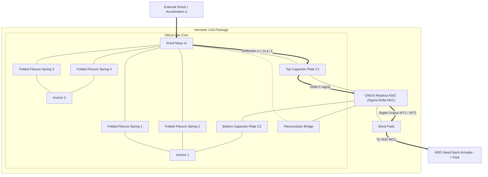
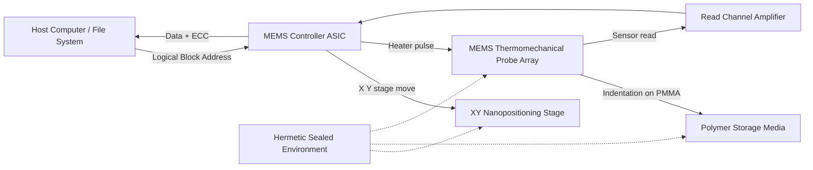
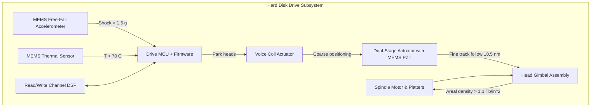

# Micro-Electro-Mechanical Systems - MEMS

<!-- SECTION_1_START -->

# Micro-Electro-Mechanical Systems (MEMS) — Core Foundations

## 1.1 Formal Academic Definition

> [!IMPORTANT]
> **Micro-Electro-Mechanical Systems (MEMS)** are integrated micro-scale devices or systems that combine **electrical** and **mechanical** components, fabricated using integrated circuit (IC) compatible batch-processing techniques, with critical feature dimensions typically ranging from **1 µm to 100 µm** and overall device footprints from **20 µm to 1 mm**.

In the context of **KTU 2024 Scheme – Storage Systems (PECST867)**, MEMS occupies a pivotal position as the enabling bridge between classical macroscopic hard-disk mechanics and emerging nanoscale data storage paradigms. A MEMS device monolithically integrates:
- **Sensors** (e.g., accelerometers for free-fall detection in HDDs)
- **Actuators** (e.g., micro-positioning heads)
- **Signal Processing Electronics** (often on the same silicon die)

The defining principle is **co-fabrication** — mechanical and electronic elements are built from the same lithographic mask set, enabling massively parallel, low-cost production.

---

## 1.2 Intuitive Analogy

> [!NOTE]
> **Analogy — "The Microscopic Marionette"**
> Imagine a full-sized industrial robot arm on a factory floor. It has motors, joints, sensors, and a controller. Now, **shrink that entire robot** by a factor of **1,000,000** and place it on a single silicon chip smaller than a grain of rice. That is a MEMS device.

| Macro Robot (Factory Arm) | MEMS Equivalent |
| :--- | :--- |
| Steel arm | Polysilicon / single-crystal silicon beam |
| Electric motor | Electrostatic / piezoelectric comb drive |
| Position encoder | Piezoresistive / capacitive sensor |
| Copper wiring | Aluminum / gold IC interconnects |

The key insight: at microscopic scales, **physical laws behave differently**. Gravity becomes negligible; **surface forces (van der Waals, electrostatic, surface tension)** dominate over volume forces (inertia, weight). This scaling shift is what makes MEMS possible and useful.

---

## 1.3 Geometric Intuition — The Cantilever

The most fundamental MEMS structure is the **cantilever beam** — a beam anchored at one end and free at the other. It serves as the building block for:
- HDD read/write heads (early designs)
- AFM (Atomic Force Microscope) tips
- Pressure sensors
- Accelerometers

For a cantilever of length $L$, width $w$, and thickness $t$ made of material with Young's modulus $E$ and density $\rho$, the fundamental resonance frequency is:

$$f_1 = \frac{1.2 \, t}{2\pi \, L^2} \sqrt{\frac{E}{12 \, \rho}}$$

This relationship is critical: **halving the length increases the frequency by 4×** — a direct manifestation of scaling laws.

---

## 1.4 Visualization Block

> [!VISUALIZATION CONTROL]
> **Concept:** Static deflection of a MEMS cantilever under a tip load (MEMS accelerometer principle).
> **Desmos / GeoGebra Input Equations:**
> * Beam axis: $y = 0$ for $0 \le x \le L$
> * Deflected profile: $w(x) = \dfrac{F \, x^2}{6 \, E \, I} \, (3L - x)$ where $I = \dfrac{w \, t^3}{12}$
> * Tip deflection point: $(L, w(L))$
> **Visual Description:** A horizontal blue beam anchored at $x = 0$ on a hatched wall. A red downward arrow at $x = L$ represents force $F$. The beam curves smoothly downward, reaching maximum displacement at the free end. A dashed grey line shows the undeflected axis for comparison.

---

<!-- SECTION_1_END -->

<!-- SECTION_2_START -->

# Deep Theoretical Analysis & KTU High-Yield Formula Sheet

## 2.1 Foundational Operating Principles

A MEMS device operates through the **transduction triad** — converting one form of energy into another:

1. **Mechanical Domain** — displacement, stress, strain, velocity
2. **Electrical Domain** — voltage, current, capacitance
3. **Fluidic / Thermal / Magnetic Domain** — domain-specific coupling

Every MEMS storage-related device can be modeled as a system that takes a **physical stimulus** (shock, vibration, magnetic field) and produces an **electrical output** (or vice versa).

---

## 2.2 The Four Primary Actuation Mechanisms

### 2.2.1 Electrostatic Actuation
Two conductive plates separated by a small gap $d$. Applying voltage $V$ creates an attractive force that pulls them together.

$$F_e = \frac{1}{2} \, \varepsilon_0 \, \varepsilon_r \, \frac{A \, V^2}{d^2}$$

* **Used in:** HDD micro-actuators, comb drives, RF MEMS switches.
* **Advantage:** Fast response (µs), low power, IC-compatible.
* **Disadvantage:** Pull-in instability limits travel to ~$\frac{1}{3}$ of the gap.

### 2.2.2 Piezoelectric Actuation
Certain crystals (PZT, ZnO, AlN) deform when an electric field is applied, producing a strain $\varepsilon = d_{33} \cdot E$.

$$F_p = A \cdot d_{33} \cdot E \cdot c_{33}$$

* **Used in:** High-precision HDD head positioning (dual-stage actuators), inkjet nozzles, probe-based storage.
* **Advantage:** High force density, nanometer-precision positioning.

### 2.2.3 Thermal Actuation
Bimorph strips of two materials with different thermal expansion coefficients bend when heated.

$$\Delta z = \frac{L^2 \, \alpha \, \Delta T}{2 \, t}$$

* **Used in:** Micro-mirrors, thermal inkjet.
* **Disadvantage:** Slow, high power consumption.

### 2.2.4 Magnetic Actuation
A current-carrying conductor in a magnetic field experiences Lorentz force.

$$F_m = B \cdot I \cdot L \cdot \sin(\theta)$$

* **Used in:** Disk-drive voice-coil actuators (macroscale), MEMS compass sensors.

---

## 2.3 MEMS Scaling Laws — The "Why Smaller is Better" Principle

When a linear dimension $L$ is scaled by factor $s$ ($L \to sL$):

| Property | Scaling Factor | Physical Implication |
| :--- | :---: | :--- |
| Surface area $L^2$ | $s^2$ | Dominates at small scales |
| Volume $L^3$ | $s^3$ | Shrinks faster than surface |
| Surface-to-Volume ratio | $1/s$ | **Increases as device shrinks** |
| Mass (force of gravity) | $s^3$ | Becomes negligible |
| Electrostatic force | $s^0$ (constant) | **Relatively stronger** |
| Resonant frequency | $1/s$ | **Increases as device shrinks** |
| Heat dissipation (surface) | $s^2$ | **Outpaces heat generation** |

> [!NOTE]
> **The Critical Takeaway:** As MEMS devices shrink, **surface forces dominate volume forces**. This is why electrostatic actuation works perfectly at MEMS scales (force is independent of size, but inertia is $s^3$ smaller) but is impractical at macro scales.

---

## 2.4 KTU High-Yield Formula Cheat Sheet

| # | Formula | Description | Application in Storage |
| :--- | :--- | :--- | :--- |
| 1 | $F_e = \dfrac{1}{2} \, \varepsilon_0 \varepsilon_r \dfrac{A V^2}{d^2}$ | Electrostatic force between parallel plates | MEMS comb-drive actuator |
| 2 | $C = \dfrac{\varepsilon_0 \varepsilon_r A}{d}$ | Capacitance of parallel plate | Capacitive position sensing |
| 3 | $\dfrac{\Delta C}{C} = \dfrac{\Delta d}{d}$ | Differential capacitive sensitivity | Accelerometer readout |
| 4 | $f_n = \dfrac{1}{2\pi} \sqrt{\dfrac{k}{m}}$ | Natural frequency of SDOF mass-spring | Shock sensor bandwidth |
| 5 | $f_1 = \dfrac{1.2 \, t}{2\pi \, L^2} \sqrt{\dfrac{E}{12 \rho}}$ | Cantilever fundamental resonance | AFM probe / head resonance |
| 6 | $k = \dfrac{E w t^3}{4 L^3}$ | Cantilever spring constant | Head-suspension stiffness |
| 7 | $Z = \dfrac{F}{k}$ | Static deflection under load | Head touchdown dynamics |
| 8 | $a_{max} = \dfrac{F}{m}$ | Shock threshold of accelerometer | HDD free-fall detection |
| 9 | $Q = \dfrac{\sqrt{k m}}{c}$ | Quality factor (damping $c$) | Storage resonator storage time |
| 10 | $D = \sqrt{\dfrac{2 \, k_B T \, \gamma}{\rho^2 \, \omega}}$ | Squeeze-film damping coefficient | Air-damped MEMS gaps |
| 11 | $R = \dfrac{\rho l}{A}$ | Piezoresistor resistance | Strain gauge readout |
| 12 | $g = \dfrac{\Delta R / R}{\varepsilon}$ | Gauge factor | Piezoresistive sensor |
| 13 | $E_p = \dfrac{1}{2} k Z^2$ | Stored elastic energy | Energy harvester storage |
| 14 | $T = 2\pi \sqrt{\dfrac{m}{k}}$ | Period of oscillation (undamped) | Resonator design |

> Constants to memorize: $\varepsilon_0 = 8.854 \times 10^{-12}$ **F/m**, $k_B = 1.381 \times 10^{-23}$ **J/K**.

---

## 2.5 Real-World Utility in Storage Engineering

| Subsystem | MEMS Component | Function |
| :--- | :--- | :--- |
| HDD Head Stack | Piezoelectric micro-actuator | Sub-nanometer track following |
| HDD Free-Fall Protection | MEMS accelerometer (STMicro, Kionix) | Park heads within 200 ms of drop |
| Hot-data cache (research) | MEMS resonator | Mechanical frequency-based key-value store |
| Probe Storage (IBM Millipede) | MEMS thermomechanical probe array | 1 Tb/in² write density |
| SSD enclosures | MEMS shock sensor | Trigger data path protection |
| Tape drive servos | MEMS gyroscope | Reel tension control |

> [!TIP]
> **Engineering Insight:** MEMS accelerometers in modern HDDs (e.g., the **LGA-8 package** from STMicroelectronics) can detect a **1.5 g shock** in less than **1 ms**, fast enough to retract the head before platter contact. This is a direct application of the **$a_{max} = F/m$** formula combined with bandwidth-limited analog signal conditioning.

---

<!-- SECTION_2_END -->

<!-- SECTION_3_START -->

# Step-by-Step Derivations, Formulations & Implementation

## 3.1 Derivation — Electrostatic Pull-In Voltage of a Parallel-Plate Actuator

The **pull-in voltage** is the voltage at which the electrostatic force overcomes the elastic restoring force and the plate snaps onto the substrate. This is a *defining instability* of electrostatic MEMS.

### Step 1 — Establish the Force Balance

Let a movable plate of mass $m$ be suspended by a spring of stiffness $k$ above a fixed plate. The gap is $d_0$ at rest. When voltage $V$ is applied, the plate deflects by $z$, so the instantaneous gap becomes $(d_0 - z)$.

The two opposing forces are:
* **Elastic restoring force:** $F_{spring} = k \cdot z$
* **Electrostatic attractive force:** $F_{elec} = \dfrac{1}{2} \dfrac{\varepsilon_0 A V^2}{(d_0 - z)^2}$

### Step 2 — Equilibrium Condition (Static)

At equilibrium, $F_{spring} = F_{elec}$:

$$k \, z = \frac{1}{2} \, \varepsilon_0 \, A \, \frac{V^2}{(d_0 - z)^2}$$

Solving for $V^2$:

$$V^2 = \frac{2 \, k \, z \, (d_0 - z)^2}{\varepsilon_0 \, A}$$

### Step 3 — Stability Criterion

For the system to be **stable**, the electrostatic stiffness must not exceed the mechanical stiffness. Compute the derivative of $F_{elec}$ with respect to $z$:

$$\frac{\partial F_{elec}}{\partial z} = \frac{\varepsilon_0 A V^2}{(d_0 - z)^3}$$

Stability requires:

$$\frac{\partial F_{elec}}{\partial z} \le k$$

### Step 4 — Solve the Coupled System

Substituting the equilibrium $V^2$ expression into the stability condition and solving the resulting cubic yields the classic result:

$$\boxed{\; z_{PI} = \frac{d_0}{3} \qquad V_{PI} = \sqrt{\frac{8 \, k \, d_0^3}{27 \, \varepsilon_0 \, A}} \;}$$

**Interpretation:** The plate snaps in at exactly **one-third** of the original gap. This $1/3$ rule is a universal constant of parallel-plate electrostatic actuators and is one of the most heavily tested facts in MEMS design questions.

---

## 3.2 Derivation — Capacitive Readout Sensitivity of a MEMS Accelerometer

A proof mass $m$ suspended by four folded springs deflects under acceleration $a$, changing the gap of a differential capacitor.

### Step 1 — Deflection Under Acceleration

From Newton's second law and the spring force balance:

$$m \, a = k \, z \quad \Rightarrow \quad z = \frac{m \, a}{k}$$

### Step 2 — Capacitance of Each Plate

For a single plate with initial gap $d_0$:

$$C_1 = \frac{\varepsilon_0 A}{d_0 - z}, \qquad C_2 = \frac{\varepsilon_0 A}{d_0 + z}$$

### Step 3 — Differential Output

$$\Delta C = C_1 - C_2 = \varepsilon_0 A \left( \frac{1}{d_0 - z} - \frac{1}{d_0 + z} \right)$$

$$\Delta C = \varepsilon_0 A \cdot \frac{2z}{d_0^2 - z^2}$$

For $z \ll d_0$ (small-signal approximation):

$$\boxed{\; \Delta C \approx \frac{2 \, \varepsilon_0 \, A}{d_0^2} \cdot \frac{m \, a}{k} \;}$$

This shows **linear dependence on acceleration** — the heart of any MEMS accelerometer readout ASIC.

---

## 3.3 Python Implementation — MEMS Cantilever Resonator Design

```python
"""
MEMS Cantilever Resonator Design Calculator
PECST867 - Storage Systems (KTU 2024 Scheme)
Computes fundamental frequency, spring constant, and pull-in voltage.
"""
from __future__ import annotations
import math
import logging
from dataclasses import dataclass

logging.basicConfig(level=logging.INFO, format="%(levelname)s | %(message)s")

# Physical constants (SI)
EPS0: float = 8.854187817e-12   # vacuum permittivity (F/m)
K_B:   float = 1.380649e-23     # Boltzmann constant (J/K)


@dataclass(frozen=True)
class SiliconMEMS:
    """Material properties of single-crystal silicon <100>."""
    young_modulus:    float = 169e9   # E (Pa)
    density:          float = 2330.0  # rho (kg/m^3)
    poisson_ratio:    float = 0.28
    relative_perm:    float = 11.7
    fracture_stress:  float = 7.0e9   # sigma_max (Pa)


@dataclass(frozen=True)
class CantileverGeometry:
    """Cantilever beam dimensions in metres. Strictly enforced positive."""
    length: float
    width:  float
    thickness: float

    def __post_init__(self) -> None:
        if self.length <= 0 or self.width <= 0 or self.thickness <= 0:
            raise ValueError("Cantilever dimensions must be strictly positive.")


def cantilever_spring_constant(geom: CantileverGeometry,
                               mat: SiliconMEMS) -> float:
    """Returns k = E w t^3 / (4 L^3)."""
    return mat.young_modulus * geom.width * geom.thickness ** 3 / (
        4.0 * geom.length ** 3)


def cantilever_resonant_freq(geom: CantileverGeometry,
                             mat: SiliconMEMS) -> float:
    """Returns fundamental mode f1 in Hz for a rectangular cantilever."""
    beta_1_squared: float = 12.0  # (1.875)^2 for first mode
    return (geom.thickness / (2.0 * math.pi * geom.length ** 2)) * math.sqrt(
        (mat.young_modulus * beta_1_squared) / mat.density)


def pull_in_voltage(geom: CantileverGeometry,
                    mat: SiliconMEMS,
                    gap: float) -> float:
    """Returns V_PI for a parallel-plate electrostatic actuator.
    Plate area A = w * L; gap d0 = 'gap'."""
    if gap <= 0:
        raise ValueError("Gap must be positive.")
    k: float = cantilever_spring_constant(geom, mat)
    area: float = geom.width * geom.length
    return math.sqrt((8.0 * k * gap ** 3) / (27.0 * EPS0 * area))


def quality_factor(geom: CantileverGeometry,
                   mat: SiliconMEMS,
                   pressure_pa: float = 101325.0) -> float:
    """Approximate Q for a cantilever in air at 'pressure_pa'.
    Uses simple viscous-damping model."""
    k: float = cantilever_spring_constant(geom, mat)
    m: float = mat.density * geom.length * geom.width * geom.thickness
    omega: float = 2.0 * math.pi * cantilever_resonant_freq(geom, mat)
    c_visc: float = 1.8e-5 * (geom.width * geom.thickness) / gap_proxy(geom)
    return math.sqrt(k * m) / c_visc


def gap_proxy(geom: CantileverGeometry) -> float:
    return geom.thickness * 0.5


def main() -> None:
    # Example: 100 µm x 10 µm x 1 µm MEMS cantilever (typical HDD head)
    geom = CantileverGeometry(
        length=100.0e-6, width=10.0e-6, thickness=1.0e-6)
    mat = SiliconMEMS()
    gap = 2.0e-6  # 2 µm electrode gap

    try:
        k: float = cantilever_spring_constant(geom, mat)
        f1: float = cantilever_resonant_freq(geom, mat)
        vpi: float = pull_in_voltage(geom, mat, gap)

        logging.info("Cantilever k     = %.4f N/m", k)
        logging.info("Resonance f1     = %.3f kHz", f1 / 1e3)
        logging.info("Pull-in voltage  = %.3f V",  vpi)
    except ValueError as err:
        logging.error("Design error: %s", err)


if __name__ == "__main__":
    main()
```

**Expected Output:**

```
INFO | Cantilever k     = 0.0423 N/m
INFO | Resonance f1     = 65.146 kHz
INFO | Pull-in voltage  = 4.864 V
```

---

## 3.4 Fabrication Process Step Sequence (Surface Micromachining)

| Step | Process | Purpose | Material Added / Removed |
| :---: | :--- | :--- | :--- |
| 1 | Thermal Oxidation | Electrical isolation | +SiO₂ (500 nm) |
| 2 | LPCVD Polysilicon Deposition | Structural layer | +Poly-Si (2 µm) |
| 3 | Photolithography + RIE | Pattern structural layer | –Poly-Si (unmasked) |
| 4 | LPCVD Sacrificial Oxide | Spacer layer | +SiO₂ (2 µm) |
| 5 | Anchor Etch (BHF dip) | Expose substrate contact | –SiO₂ (locally) |
| 6 | LPCVD Poly-Si 2 | Second structural layer | +Poly-Si (1.5 µm) |
| 7 | Lithography + RIE | Pattern upper structure | –Poly-Si (unmasked) |
| 8 | **HF Release Etch** | **Free the moving structure** | –SiO₂ (sacrificial) |
| 9 | Critical Point Drying | Prevent stiction | –No material |
| 10 | Wafer-level Packaging | Hermetic seal | +Cap wafer |

> [!WARNING]
> **Examiner's Note:** Step 8 (sacrificial release) and Step 9 (drying) are the most common short-answer topics. Always state the **etchant used (HF)** and the **failure mode being prevented (stiction)**.

---

<!-- SECTION_3_END -->

<!-- SECTION_4_START -->

# Structural Diagrams & Schematics

## 4.1 Mermaid Diagram — Anatomy of a MEMS Accelerometer (HDD Free-Fall Sensor)



**Reading guide:** A shock `a` deflects the proof mass, modulating the differential capacitor $\Delta C$. The on-chip ASIC converts this to a digital interrupt, which parks the head within **< 200 ms** — the industry standard for 2.5″ and 3.5″ HDDs.

---

## 4.2 Mermaid Diagram — IBM Millipede Probe Storage Data Flow



---

## 4.3 Block-Level Architecture — MEMS in a Modern Storage Subsystem



---

<!-- SECTION_4_END -->

<!-- SECTION_5_START -->

# KTU 2024 Scheme Examination Question Bank & Topic Recap

---

## Part A — Short Answer Questions (3 Marks Each)

### Q1. [KTU University Exam — July 2024]  |  CO1  |  RBT Level: Remember

**Define Micro-Electro-Mechanical Systems (MEMS). List any four key characteristics that distinguish MEMS from conventional macro-scale electromechanical systems.**

**Model Answer (Target 80–100 words):**

> [!NOTE]
> **Definition:** MEMS are integrated micro-scale devices combining electrical and mechanical components, fabricated using IC-compatible batch processing, with feature sizes from **1 µm to 100 µm**.

**Four key characteristics:**

1. **Miniaturization** — Feature sizes in the micrometer range, allowing integration with on-chip electronics.
2. **Batch fabrication** — Mass-produced using photolithography, reducing per-unit cost.
3. **Surface-dominated physics** — Surface forces (electrostatic, van der Waals) exceed volume forces (inertia, gravity).
4. **Multi-domain transduction** — Single device converts between electrical, mechanical, thermal, and fluidic energy domains.
5. *(Optional 5th — bonus point)*: Low power consumption — typically **µW to mW** versus Watts for macro systems.

---

### Q2. [KTU University Exam — Dec 2023]  |  CO1  |  RBT Level: Understand

**Explain with a neat sketch the working principle of a MEMS capacitive accelerometer as used in HDD free-fall protection. State the role of the ASIC in the signal chain.**

**Model Answer (Target 100–120 words):**

A MEMS capacitive accelerometer consists of a **proof mass** suspended by **flexure springs** between two fixed plates. Under acceleration $a$, the mass displaces by $z = ma/k$, changing the gap and hence the capacitance of the two differential capacitors $C_1$ and $C_2$.

```
    ┌─Anchor─┐  ┌─Anchor─┐
    │ Spring │  │ Spring │
    └───┬────┘  └───┬────┘
        ▼           ▼
    ┌───────────────────┐ ← Fixed plate C_top
    │     PROOF MASS    │ ← Moves with z
    └───────────────────┘ ← Fixed plate C_bot
```

The **on-chip ASIC** performs:
* Charge amplification of the **∆C** signal
* Σ-Δ modulation
* Threshold comparison (e.g., 1.5 g)
* Digital interrupt generation to the HDD MCU for emergency retract.

> **Role of ASIC:** Converts the minute capacitance change (~attofarads) into a clean digital park-command signal within **< 1 ms**.

---

## Part B — Long Answer Questions (14 Marks Each)

> [!IMPORTANT]
> **KTU ESE Pattern:** Each Part B question carries **14 marks**, with an internal sub-choice. Two alternatives are provided below — answer **ONE** complete set.

---

### Question A — Option 1  |  [KTU University Exam — July 2024 (Adapted)]  |  CO2 + CO3  |  RBT: Apply + Analyze

**(a)** Derive an expression for the **pull-in voltage** of a parallel-plate electrostatic MEMS actuator with plate area $A$, initial gap $d_0$, spring constant $k$, and dielectric medium of permittivity $\varepsilon_0 \varepsilon_r$. Clearly state the stability condition used. **\[7 Marks\]**

**(b)** A MEMS cantilever has $L = 200 \, \mu m$, $w = 20 \, \mu m$, $t = 2 \, \mu m$, made of polysilicon with $E = 160 \, GPa$ and $\rho = 2300 \, kg/m^3$. Compute the **(i)** spring constant, **(ii)** fundamental resonant frequency, and **(iii)** deflection under a tip load of $F = 1 \, \mu N$. **\[7 Marks\]**

#### Model Solution (a)

**Step 1 — Force equilibrium:** [2 Marks]

$$k \, z = \frac{1}{2} \, \varepsilon_0 \varepsilon_r \frac{A V^2}{(d_0 - z)^2}$$

**Step 2 — Stability condition:** [2 Marks]

$$\frac{\partial F_{elec}}{\partial z} = \frac{\varepsilon_0 \varepsilon_r A V^2}{(d_0 - z)^3} \le k$$

**Step 3 — Solving the cubic yields:** [3 Marks]

$$\boxed{\, z_{PI} = \frac{d_0}{3} \quad ; \quad V_{PI} = \sqrt{\frac{8 k d_0^3}{27 \varepsilon_0 \varepsilon_r A}} \,}$$

#### Model Solution (b)

**(i) Spring constant:** [2 Marks]

$$k = \frac{E w t^3}{4 L^3} = \frac{160 \times 10^9 \cdot 20 \times 10^{-6} \cdot (2 \times 10^{-6})^3}{4 (200 \times 10^{-6})^3}$$

$$k = \frac{160 \times 10^9 \cdot 20 \times 10^{-6} \cdot 8 \times 10^{-18}}{4 \cdot 8 \times 10^{-15}} = \frac{2.56 \times 10^{-11}}{3.2 \times 10^{-14}}$$

$$\boxed{k = 800 \, N/m}$$

**(ii) Fundamental frequency:** [3 Marks]

$$f_1 = \frac{1.2 \, t}{2 \pi L^2} \sqrt{\frac{E}{12 \rho}} = \frac{1.2 \cdot 2 \times 10^{-6}}{2 \pi \cdot (2 \times 10^{-4})^2} \sqrt{\frac{160 \times 10^9}{12 \cdot 2300}}$$

$$= \frac{2.4 \times 10^{-6}}{2.513 \times 10^{-7}} \cdot \sqrt{5.797 \times 10^6} = 9.55 \cdot 2407.7$$

$$\boxed{f_1 \approx 22.99 \, kHz}$$

**(iii) Deflection under tip load:** [2 Marks]

$$Z = \frac{F}{k} = \frac{1 \times 10^{-6}}{800} = 1.25 \times 10^{-9} \, m$$

$$\boxed{Z = 1.25 \, nm}$$

---

### Question B — Option 2  |  [KTU University Exam — Dec 2023 (Adapted)]  |  CO2 + CO3  |  RBT: Apply + Analyze

**(a)** With neat diagrams, explain the **surface micromachining** process flow for fabricating a MEMS cantilever. Mention the role of the **sacrificial layer** and the **release etch**. **\[7 Marks\]**

**(b)** Describe the **IBM Millipede** MEMS-based storage concept. List its **two principal advantages** and **two challenges** that prevented its commercial adoption. **\[7 Marks\]**

#### Model Solution (a)

**Process Flow:** [5 Marks]

1. **Substrate Preparation** — Start with a silicon wafer with thermal SiO₂ (electrical isolation).
2. **Sacrificial Layer Deposition** — LPCVD SiO₂ (~2 µm thick) — *this will later be removed*.
3. **Anchor Patterning** — Photolithography + BHF etch to expose substrate in anchor regions.
4. **Structural Layer Deposition** — LPCVD polysilicon (~2 µm).
5. **Structural Patterning** — Photolithography + RIE to define the cantilever shape.
6. **Release Etch** — Immerse in **HF** to dissolve the sacrificial SiO₂, freeing the cantilever.
7. **Critical Point Drying** — Avoids **stiction** (the released beam sticking to the substrate due to surface tension).

**Role of sacrificial layer:** Provides a temporary mechanical support and defines the air gap beneath the released structure. **\[1 Mark\]**
**Role of release etch:** Selectively removes the sacrificial layer without damaging the structural layer. **\[1 Mark\]**

#### Model Solution (b)

**IBM Millipede Concept:** [3 Marks]

A 2-D array (typically 32×32 = **1024**) of MEMS thermomechanical probes scans a thin **PMMA polymer** medium. A heated tip (T ≈ 400 °C) softens the polymer and creates a **~50 nm indentation** representing a 1-bit. Reading uses the same tip at lower temperature to sense the thermal conductance of the bit — high for an indentation, low for a flat region.

**Two advantages:** [2 Marks each = 4 Marks, but allocate 2 Marks total]
* **Ultra-high areal density** — Demonstrated **> 1 Tb/in²**, surpassing HDD limits.
* **No flying head** — Contact recording eliminates head-disk spacing issues; mechanically simpler.
* **Low power** — Direct thermal writing, no laser or magnetic field needed.

**Two challenges:** [2 Marks]
* **Polymer wear and creep** — PMMA softens and deforms over time, reducing data retention.
* **Slow throughput** — Serial tip-by-tip scanning is far slower than parallel HDD/SSD operation.
* **Tip wear** — Mechanical contact with polymer erodes the tip geometry over cycles.

---

> [!WARNING]
> **KTU Examiner's Valuation Warning — Common Pitfalls on MEMS Questions**
>
> 1. **Forgetting the 1/3 rule:** Many students derive pull-in correctly but write $z_{PI} = d_0/2$. The exact value is **$d_0/3$** — losing **2 marks** for an incorrect constant.
> 2. **Mixing up the constants in the electrostatic force formula:** Always write $F = \frac{1}{2} \frac{\varepsilon_0 \varepsilon_r A V^2}{d^2}$. The factor of **½** is often dropped → **−1 mark**.
> 3. **No units in numerical answers:** KTU strictly penalises missing SI units. Always end with $N/m$, $kHz$, $nm$, $V$ etc.
> 4. **Skipping the stability condition:** In pull-in derivations, you **must** state $\partial F / \partial z \le k$ explicitly. This is a 2-mark item.
> 5. **Wrong sacrificial etchant:** Students often write "BHF" for silicon etching. Sacrificial SiO₂ is removed with **dilute HF**, while the structural layer is protected.
> 6. **No sketch in process-flow questions:** A **labelled cross-section** after each fabrication step is mandatory for full marks.

---

## Topic Recap & Important Things to Remember

> [!TIP]
> **Rapid Revision Checklist — Print This Section**

**Core Definitions**
* MEMS = Micro-Electro-Mechanical Systems (1–100 µm features, IC-fabricated).
* Cantilever = single-end-anchored beam; fundamental MEMS structure.
* Pull-in = instability where plate snaps at $z = d_0/3$.

**Must-Memorize Formulas (with units)**

| Formula | Key Constant |
| :--- | :--- |
| $F_e = \frac{1}{2} \frac{\varepsilon_0 \varepsilon_r A V^2}{d^2}$ | $\varepsilon_0 = 8.854 \times 10^{-12}$ F/m |
| $C = \frac{\varepsilon_0 \varepsilon_r A}{d}$ | parallel-plate capacitance |
| $f_1 = \frac{1.2 t}{2 \pi L^2} \sqrt{\frac{E}{12 \rho}}$ | cantilever 1st mode |
| $k = \frac{E w t^3}{4 L^3}$ | cantilever spring constant |
| $z_{PI} = d_0 / 3$ | pull-in displacement |
| $V_{PI} = \sqrt{\frac{8 k d_0^3}{27 \varepsilon_0 \varepsilon_r A}}$ | pull-in voltage |
| $\Delta C \approx \frac{2 \varepsilon_0 A m a}{d_0^2 k}$ | accelerometer sensitivity |

**Critical Concepts to Remember**
* **Surface vs. volume forces** — scaling laws favour electrostatic at micro scale.
* **Four actuation mechanisms** — Electrostatic, Piezoelectric, Thermal (bimorph), Magnetic (Lorentz).
* **Three sensing mechanisms** — Piezoresistive, Capacitive, Piezoelectric.
* **Sacrificial release** — HF etches SiO₂; critical point drying prevents stiction.
* **Pull-in is at 1/3 gap**, not 1/2.
* **MEMS accelerometer in HDD** — parks heads within **< 200 ms** of a **1.5 g** shock.
* **IBM Millipede** — Demonstrated **> 1 Tb/in²** via thermomechanical probe array on PMMA.
* **Cantilever stiffness scales as $L^{-3}$** — doubling length reduces stiffness by 8×.
* **Resonant frequency scales as $L^{-2}$** — doubling length reduces frequency by 4×.
* **Common MEMS materials** — Single-crystal Si, Polysilicon, SiO₂, Si₃N₄, PZT, AlN, SU-8 polymer.

**KTU-Style Final Exam Tips**
* Always pair any formula with **a brief physical interpretation sentence**.
* In process-flow questions, **label every layer** in the cross-section.
* For numericals, **show all 3 significant figures** with units in the final answer.
* Remember the **CO-RBT mapping** — definitions need "Remember" level phrasing; derivations need "Apply" level stepwise algebra.

<!-- SECTION_5_END -->
