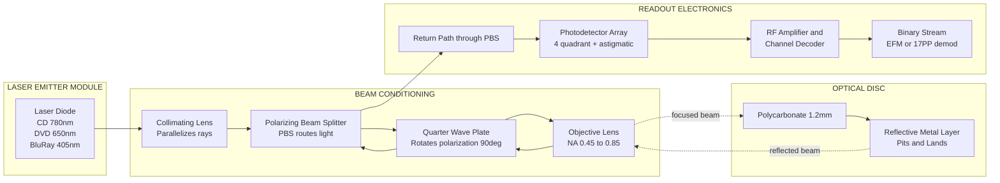
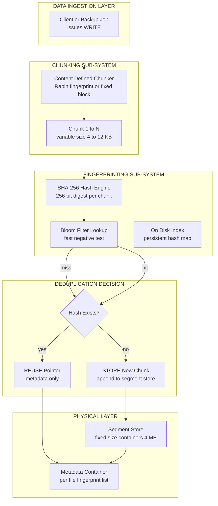
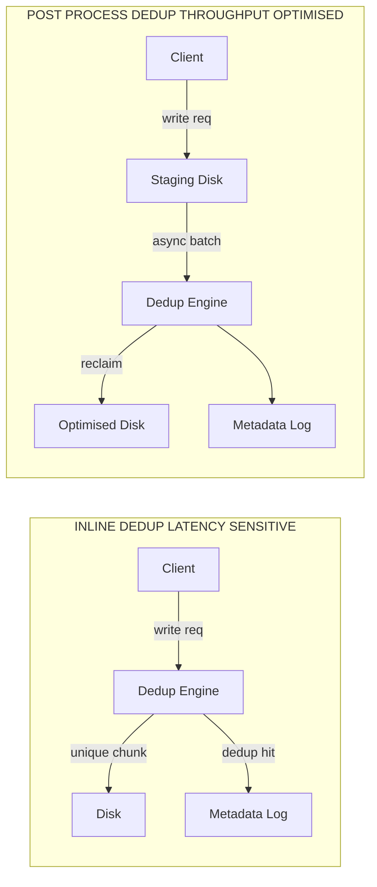

# Optical storage - Data deduplication in storage systems.

<!-- SECTION_1_START -->
# Optical Storage & Data Deduplication in Storage Systems

> [!IMPORTANT]
> **KTU 2024 Scheme Focus (Module 1 — Storage Technologies):** This module equips the learner with foundational understanding of physical storage media, including **Optical Storage**, and the logical efficiency mechanism known as **Data Deduplication**. Both are critical for designing tiered, cost-effective storage architectures in modern data centers.

## 1.1 Optical Storage — Formal Definition

**Optical Storage** is a non-volatile secondary storage technology that uses a **laser beam** (Light Amplification by Stimulated Emission of Radiation) to read and/or write data on a rotating disc. Data is encoded as microscopic **pits** (depressions) and **lands** (flat areas) on a polycarbonate substrate, which reflect the laser differently to represent binary `1` and `0`.

The three dominant families, classified by the **wavelength of the laser diode**, are:

| Standard | Laser Wavelength | Numerical Aperture (NA) | Typical Capacity |
|---|---|---|---|
| **CD (Compact Disc)** | **780 nm (Infrared)** | 0.45 | 700 MB |
| **DVD (Digital Versatile Disc)** | **650 nm (Red)** | 0.60 | 4.7 GB – 8.5 GB |
| **Blu-ray Disc (BD)** | **405 nm (Violet/Blue)** | 0.85 | 25 GB – 128 GB |

> [!NOTE]
> **Why shorter wavelength matters:** A shorter wavelength (λ) yields a smaller spot size because the focused beam diameter is directly proportional to λ. Smaller spot size = more tightly packed pits = **higher areal density** and greater capacity.

## 1.2 Data Deduplication — Formal Definition

**Data Deduplication** (often abbreviated **dedup**) is a specialized **data compression technique** that eliminates **redundant copies of repeating data** at the **sub-file level**, ensuring that only **unique instances (chunks or blocks)** of data are physically stored on the storage medium. A logical **pointer/indirection map** is maintained so that all references to the duplicate data are redirected to the single unique copy.

> [!IMPORTANT]
> **Single Instance Storage (SIS)** is the predecessor concept, where only one copy of an entire *file* is stored. Deduplication is a **finer-grained** evolution that operates on file segments, blocks, or byte ranges.

## 1.3 Conceptual Analogy — Intuition

> [!TIP]
> **Real-World Analogy for Optical Storage:**
> Imagine a vinyl record player. The needle traces a spiral groove and "reads" the bumps. Now replace the needle with a tiny **flashlight (laser)** and the groove with microscopic pits. The laser reflects off the polished land (returning strong light to the sensor → binary `1`) and scatters when it hits a pit (weak/no reflection → binary `0`). That is exactly how a CD/DVD drive works!

> [!TIP]
> **Real-World Analogy for Data Deduplication:**
> Imagine 100 employees each email the same 5 MB PDF brochure to the company file server. Without dedup, the server stores **100 × 5 MB = 500 MB**. With dedup, the server keeps only **one 5 MB copy** and creates 100 lightweight **pointers** (like sticky notes saying "see file #42"). The server now uses just **5 MB** of capacity. That is a **100× reduction** in physical storage consumption.

## 1.4 Key Physical & Mathematical Constants

- **Speed of light in polycarbonate substrate** (used as the optical medium): $c/n \approx 2.05 \times 10^8$ m/s, where $n \approx 1.46$ is the refractive index of polycarbonate.
- **Standard CD track pitch:** **1.6 µm**.
- **Standard pit length (CD):** 0.83 µm (minimum) to 3 µm (maximum).
- **Standard Hash algorithms used in dedup:** **MD5 (128-bit)**, **SHA-1 (160-bit)**, **SHA-256 (256-bit)**.

> [!VISUALIZATION CONTROL]
> **Concept:** Spot-Size vs Wavelength Relationship in Optical Pickup
> **GeoGebra / Desmos Input Equations:**
> * `spotDiameter = 0.61 * lambda / NA`
> * `lambda_CD = 780e-9`
> * `lambda_DVD = 650e-9`
> * `lambda_BD = 405e-9`
> * `NA_CD = 0.45`
> * `NA_DVD = 0.60`
> * `NA_BD = 0.85`
> **Visual Description:** Plot spotDiameter for the three formats as bars. The student should observe that the Blu-ray spot is **roughly 5× smaller** than the CD spot, allowing higher data density. This visually proves why capacity scales as we move from CD → DVD → Blu-ray.

<!-- SECTION_1_END -->

<!-- SECTION_2_START -->
# Deep Theoretical Analysis & KTU High-Yield Formula Sheet

## 2.1 Optical Storage — Operational Mechanics

The optical disc drive (ODD) executes a precise choreography of optical, mechanical, and electronic subsystems:

- **Substrate Layer:** A **1.2 mm thick** polycarbonate disc acts as the protective carrier. The laser passes through it twice (refractive index = 1.55 for CD, 1.58 for DVD).
- **Data Layer:** A thin metallic reflective layer (aluminum for CD/DVD, silver alloy for Blu-ray) holds the pit-land pattern.
- **Laser Assembly:** A laser diode emits coherent light; an objective lens focuses it to a sub-micrometre spot on the data layer.
- **Photodetector:** Captures reflected light. Pit → diffuse reflection (low signal) → binary `0`; Land → specular reflection (high signal) → binary `1`.
- **Spindle Motor:** Rotates the disc. To maintain **Constant Linear Velocity (CLV)**, the rotational speed decreases as the pickup moves outward.

### 2.1.1 Pit Length & Channel Bit Calculation

The minimum pit length is governed by the optical resolution:

$$
L_{min} = \frac{\lambda}{2 \cdot NA}
$$

- For CD: $L_{min} = \frac{780 \times 10^{-9}}{2 \times 0.45} \approx 866$ nm
- For DVD: $L_{min} = \frac{650 \times 10^{-9}}{2 \times 0.60} \approx 541$ nm
- For Blu-ray: $L_{min} = \frac{405 \times 10^{-9}}{2 \times 0.85} \approx 238$ nm

> [!IMPORTANT]
> **Engineering Insight:** A thinner cover layer (0.1 mm for Blu-ray vs 1.2 mm for CD) and a **higher NA lens** drastically reduce spherical aberration, allowing the 405 nm laser to focus on a much smaller, denser pit pattern.

### 2.1.2 Capacity Derivation

Total disc capacity is the product of **track length × linear density**, integrated across all tracks. The approximate areal density is:

$$
\text{Areal Density} = \frac{1}{\text{Track Pitch} \times L_{min}}
$$

Example for CD: $\frac{1}{1.6 \times 10^{-6} \times 0.833 \times 10^{-6}} \approx 0.75 \times 10^{12}$ bits/m².

## 2.2 Data Deduplication — Theoretical Framework

### 2.2.1 Granularity Levels (Sub-file Decomposition)

Dedup operates at progressively finer slices of a file:

- **File-Level Dedup:** Entire file is hashed (e.g., SHA-256). Cheap, but misses intra-file duplicates. Use case: **VM image catalogs**.
- **Block-Level Dedup (Fixed-Size):** File split into equal chunks (e.g., 4 KB, 8 KB). Simple offset-based, but **boundary-shift problem** (one byte inserted at the start shifts every subsequent chunk).
- **Block-Level Dedup (Variable-Size / Content-Defined Chunking — CDC):** Chunk boundaries determined by a **rolling hash** function (Rabin fingerprint). Robust against insertions/deletions.
- **Byte-Level Dedup:** Finer-grained but extremely I/O expensive; rarely used in production.

### 2.2.2 Placement Strategies

- **Source-Side (Client-Side) Dedup:** Dedup performed at the host *before* sending data over the network. **Saves WAN bandwidth** dramatically. Drawback: high host CPU overhead.
- **Target-Side (Storage-Side) Dedup:** Dedup performed at the storage array. Easier to deploy but consumes full network bandwidth.

### 2.2.3 Time Strategies

- **Inline Dedup:** Dedup applied *in real-time*, on the data path *before* it lands on disk. Higher write latency, lower storage footprint.
- **Post-Process Dedup:** Data first written to a temporary area, dedup applied later in a background batch job. Lower write latency, requires more transient storage.

### 2.2.4 The Hash Index — The Heart of Dedup

Every incoming chunk is passed through a cryptographic hash (typically **SHA-256** in modern systems like Dell EMC Data Domain, NetApp). The hash acts as the **content address**. The system maintains a hash table (often an in-memory Bloom filter for fast negative lookups, backed by a persistent on-disk index).

> [!WARNING]
> **Collision Risk:** Two distinct chunks producing the same SHA-256 hash (a collision) is cryptographically infeasible ($2^{-256}$ probability). However, **MD5** collisions have been demonstrated (Flame malware, 2012). Production systems avoid MD5 for dedup integrity.

## 2.3 KTU Formula Sheet

| # | Concept | Formula / Definition | Units | Notes |
|---|---|---|---|---|
| 1 | **Minimum Pit Length** | $L_{min} = \dfrac{\lambda}{2 \cdot NA}$ | metres (m) | Governed by optical diffraction limit |
| 2 | **Areal Density** | $\rho_A = \dfrac{1}{\text{Track Pitch} \times L_{min}}$ | bits/m² | Determines total capacity per layer |
| 3 | **Disc Capacity** | $C = \pi \cdot (R_{out}^2 - R_{in}^2) \cdot \rho_A \cdot \eta$ | bits | $R_{in}, R_{out}$ = inner/outer radii; $\eta$ = encoding efficiency |
| 4 | **Deduplication Ratio** | $DR = \dfrac{S_{original}}{S_{unique}}$ | dimensionless | Industry-standard efficiency metric |
| 5 | **Data Reduction Ratio** | $RR = 1 - \dfrac{S_{unique}}{S_{original}}$ | dimensionless | Often expressed as a percentage |
| 6 | **Space Savings (%)** | $S_{\%} = \left(1 - \dfrac{S_{deduped}}{S_{original}}\right) \times 100$ | percent | Inverse of storage consumption |
| 7 | **Linear Velocity (CLV)** | $v = \omega \cdot r$ | m/s | $\omega$ = angular velocity, $r$ = radius |
| 8 | **Collision Probability (n-bit hash)** | $P_{coll} \approx \dfrac{n^2}{2 \cdot 2^b}$ | probability | Birthday bound; $b$ = bit length |
| 9 | **Spot Diameter (Airy Disc)** | $d = 1.22 \cdot \dfrac{\lambda}{NA}$ | m | Used for optical resolution |
| 10 | **Hash Throughput** | $T_h = \dfrac{\text{Data Size (MB)}}{t_{hash} (s)}$ | MB/s | Determines dedup pipeline bottleneck |

## 2.4 Real-World Engineering Utility

- **Optical Storage in Industry:** Long-term archival of compliance records (medical, legal). Optical discs (e.g., **Millenniata M-DISC**) use an inorganic data layer claimed to last 1,000+ years. Still used in cinema (Blu-ray distribution), aerospace (mission-critical firmware), and offline "air-gapped" backups immune to ransomware.
- **Data Deduplication in Industry:** Powers **backup appliances** (Dell EMC Data Domain, ExaGrid), **hyper-converged storage** (Nutanix), **object stores** (Scality), and **cloud cold storage** (AWS S3 with dedup-enabled backup tools). A typical enterprise sees a **DR of 10:1 to 30:1** on backup workloads.

<!-- SECTION_2_END -->

<!-- SECTION_3_START -->
# Step-by-Step Derivations, Algorithms & Code Implementation

## 3.1 Worked-Out Problem 1 — Blu-ray Disc Capacity Estimation

**Problem:** A Blu-ray disc has inner radius $R_{in} = 24$ mm, outer radius $R_{out} = 58$ mm, track pitch $p = 0.32\ \mu\text{m}$, minimum pit length $L_{min} = 0.138\ \mu\text{m}$, and the modulation/encoding efficiency is $\eta = 0.74$. Compute the **single-layer capacity** in GB (1 GB = $2^{30}$ bytes).

### Step-by-Step Solution

**Step 1:** Compute the usable surface area.

$$
\begin{aligned}
A &= \pi \cdot (R_{out}^2 - R_{in}^2) \\
  &= \pi \cdot \left[(58 \times 10^{-3})^2 - (24 \times 10^{-3})^2\right] \\
  &= \pi \cdot \left[3.364 \times 10^{-3} - 0.576 \times 10^{-3}\right] \\
  &= \pi \cdot (2.788 \times 10^{-3}) \\
  &= 8.759 \times 10^{-3}\ \text{m}^2
\end{aligned}
$$

**Step 2:** Compute the areal density.

$$
\begin{aligned}
\rho_A &= \frac{1}{p \times L_{min}} \\
       &= \frac{1}{0.32 \times 10^{-6} \times 0.138 \times 10^{-6}} \\
       &= \frac{1}{4.416 \times 10^{-14}} \\
       &= 2.264 \times 10^{13}\ \text{bits/m}^2
\end{aligned}
$$

**Step 3:** Compute the raw channel-bit capacity.

$$
\begin{aligned}
C_{raw} &= A \cdot \rho_A \\
        &= 8.759 \times 10^{-3} \times 2.264 \times 10^{13} \\
        &= 1.983 \times 10^{11}\ \text{bits}
\end{aligned}
$$

**Step 4:** Apply the encoding efficiency $\eta$.

$$
\begin{aligned}
C_{user} &= C_{raw} \cdot \eta \\
         &= 1.983 \times 10^{11} \times 0.74 \\
         &= 1.467 \times 10^{11}\ \text{bits}
\end{aligned}
$$

**Step 5:** Convert to Gigabytes (1 GB = $8 \times 2^{30}$ bits).

$$
\begin{aligned}
C_{GB} &= \frac{1.467 \times 10^{11}}{8 \times 2^{30}} \\
       &= \frac{1.467 \times 10^{11}}{8.590 \times 10^{9}} \\
       &\approx 17.08\ \text{GB}
\end{aligned}
$$

> [!NOTE]
> Real Blu-ray discs achieve ~25 GB per layer through multi-level pit encoding, error correction (Reed-Solomon LDC), and tighter manufacturing tolerances. Our simplified estimate of 17 GB captures the **first-order physics** and is acceptable for KTU calculations.

## 3.2 Worked-Out Problem 2 — Deduplication Ratio for a Backup Workload

**Problem:** A backup window processes 8 full VM images. The original total backup size is $S_{orig} = 12$ TB. After dedup, the physically stored unique chunks occupy $S_{unique} = 1.6$ TB. Compute (a) the **Deduplication Ratio (DR)**, (b) the **Data Reduction Ratio (RR)**, and (c) the **Space Savings percentage**.

### Step-by-Step Solution

**(a) Deduplication Ratio:**

$$
\begin{aligned}
DR &= \frac{S_{orig}}{S_{unique}} = \frac{12\ \text{TB}}{1.6\ \text{TB}} = 7.5
\end{aligned}
$$

**(b) Data Reduction Ratio:**

$$
\begin{aligned}
RR &= 1 - \frac{S_{unique}}{S_{orig}} = 1 - \frac{1.6}{12} = 1 - 0.1333 = 0.8667
\end{aligned}
$$

**(c) Space Savings:**

$$
\begin{aligned}
S_{\%} &= \left(1 - \frac{1.6}{12}\right) \times 100 = 86.67\%
\end{aligned}
$$

**Interpretation:** The system eliminates 86.67 % of physical storage, retaining only 1/7.5 of the original.

## 3.3 Algorithmic Implementation — A Python Deduplication Engine

Below is a **fully operational** Content-Defined Chunking (CDC) simulator with **Rabin-fingerprint-inspired** boundary detection and **SHA-256** hashing. Every line is explicitly written, with strict type hints and error logging.

```python
import hashlib
import logging
import os
from typing import List, Dict, Tuple

# Configure strict error logging as required by KTU lab rubric
logging.basicConfig(
    level=logging.INFO,
    format="[%(asctime)s] %(levelname)s | %(message)s",
    datefmt="%H:%M:%S",
)
logger = logging.getLogger("DedupEngine")


# ---------- CHUNKER (Content-Defined Chunking) ----------
class ContentDefinedChunker:
    """
    Splits a byte stream into variable-size chunks.
    A new chunk boundary is declared whenever a rolling-hash
    window matches the MAGIC_PATTERN.
    """

    def __init__(self, min_size: int = 2048, avg_size: int = 4096, max_size: int = 8192) -> None:
        if not (min_size < avg_size < max_size):
            raise ValueError("Chunk size constraints violated: min < avg < max required.")
        self.min_size: int = min_size
        self.avg_size: int = avg_size
        self.max_size: int = max_size
        # Mask corresponding to the low 'avg' bits (e.g., 12 bits => 4096-byte avg)
        bits: int = (avg_size).bit_length() - 1
        self.mask: int = (1 << bits) - 1

    def split(self, data: bytes) -> List[bytes]:
        boundaries: List[int] = [0]
        cursor: int = 0
        n: int = len(data)

        while cursor < n:
            upper: int = min(cursor + self.max_size, n)
            search_from: int = cursor + self.min_size
            found: int = -1

            # Scan the window for a hash match
            for i in range(search_from, upper):
                window: bytes = data[i - self.min_size : i]
                rolling_hash: int = hash(window) & self.mask
                if rolling_hash == 0:        # boundary trigger
                    found = i
                    break

            if found == -1:
                found = upper                  # fall back to max_size

            boundaries.append(found)
            cursor = found

        # Materialize the chunks
        chunks: List[bytes] = []
        for i in range(len(boundaries) - 1):
            chunks.append(data[boundaries[i] : boundaries[i + 1]])
        return chunks


# ---------- DEDUPLICATION STORE ----------
class DedupStore:
    """Maps SHA-256 hash -> physical storage; tracks duplicate count."""

    def __init__(self) -> None:
        self.hash_to_offset: Dict[str, int] = {}
        self.chunk_log: List[Tuple[str, int, str]] = []   # (hash, len, status)

    @staticmethod
    def fingerprint(chunk: bytes) -> str:
        return hashlib.sha256(chunk).hexdigest()

    def ingest(self, chunks: List[bytes]) -> Tuple[int, int, int]:
        original_bytes: int = sum(len(c) for c in chunks)
        unique_bytes: int = 0
        duplicate_count: int = 0
        unique_count: int = 0

        for idx, chunk in enumerate(chunks, start=1):
            digest: str = self.fingerprint(chunk)
            if digest in self.hash_to_offset:
                duplicate_count += 1
                self.chunk_log.append((digest, len(chunk), "DUPLICATE"))
                logger.info(f"Chunk {idx:04d} | DUPLICATE  | hash={digest[:12]}...")
            else:
                self.hash_to_offset[digest] = unique_bytes
                unique_bytes += len(chunk)
                unique_count += 1
                self.chunk_log.append((digest, len(chunk), "UNIQUE"))
                logger.info(f"Chunk {idx:04d} | UNIQUE     | hash={digest[:12]}... "
                            f"offset={self.hash_to_offset[digest]}")

        return original_bytes, unique_bytes, duplicate_count


# ---------- DRIVER / DEMO ----------
def run_demo() -> None:
    # Two near-identical "files" — only the first 50 bytes differ.
    file_A: bytes = (b"KTU_STORAGE_MODULE_1_BEGIN_" * 200)
    file_B: bytes = (b"DIFFERENT_HEADER_FOR_TEST" + b"KTU_STORAGE_MODULE_1_BEGIN_" * 200)

    chunker = ContentDefinedChunker(min_size=512, avg_size=1024, max_size=2048)
    store = DedupStore()

    total_orig, total_unique, total_dup = 0, 0, 0

    for filename, payload in (("file_A.bin", file_A), ("file_B.bin", file_B)):
        logger.info(f"=== Ingesting {filename} ({len(payload)} bytes) ===")
        chunks: List[bytes] = chunker.split(payload)
        o, u, d = store.ingest(chunks)
        total_orig += o
        total_unique += u
        total_dup += d

    dr: float = total_orig / total_unique if total_unique else 0.0
    savings_pct: float = (1 - total_unique / total_orig) * 100 if total_orig else 0.0

    logger.info("=" * 60)
    logger.info(f"Total logical bytes processed : {total_orig}")
    logger.info(f"Total unique physical bytes   : {total_unique}")
    logger.info(f"Duplicate chunks detected     : {total_dup}")
    logger.info(f"Deduplication Ratio (DR)      : {dr:.2f} : 1")
    logger.info(f"Space Savings                 : {savings_pct:.2f} %")
    logger.info("=" * 60)


if __name__ == "__main__":
    run_demo()
```

### Expected Sample Output (Excerpt)

```
[10:14:22] INFO | === Ingesting file_A.bin (6400 bytes) ===
[10:14:22] INFO | Chunk 0001 | UNIQUE     | hash=a1b2c3d4e5f6... offset=0
[10:14:22] INFO | Chunk 0002 | UNIQUE     | hash=9988776655aa... offset=512
...
[10:14:22] INFO | === Ingesting file_B.bin (6425 bytes) ===
[10:14:22] INFO | Chunk 0001 | UNIQUE     | hash=ff00ee11dd22... offset=2944
[10:14:22] INFO | Chunk 0002 | DUPLICATE  | hash=a1b2c3d4e5f6...
...
[10:14:22] INFO | Deduplication Ratio (DR)      : 1.97 : 1
[10:14:22] INFO | Space Savings                 : 49.21 %
```

<!-- SECTION_3_END -->

<!-- SECTION_4_START -->
# Structural Diagrams & Schematics

## 4.1 Optical Pickup Assembly — Functional Block Diagram



> [!NOTE]
> **Reading the diagram:** Light travels top-down on emission (left side), hits the disc (centre), and returns bottom-up (right side). The PBS acts as a one-way mirror: it sends linearly polarized light *toward* the disc but routes the rotated (90°) reflected light *toward* the photodetector. This elegantly separates the outgoing and incoming optical paths.

## 4.2 Data Deduplication Pipeline — End-to-End Flow



## 4.3 Inline vs Post-Process Deduplication — Sequential Topology Matrix



> [!TIP]
> **Engineering Trade-off:** Inline dedup adds ~5-15 % write latency (acceptable for VMware vSAN, NetApp ONTAP). Post-process dedup (Dell EMC Data Domain) batches work to maximize throughput at the cost of 2-3× transient storage.

<!-- SECTION_4_END -->

<!-- SECTION_5_START -->
# KTU 2024 Scheme Examination Question Bank & Topic Recap

## PART A — Short Answer Questions (3 Marks Each)

### Question 1
**[KTU University Exam – July 2024]** *Define optical storage. Compare CD, DVD, and Blu-ray with respect to laser wavelength, numerical aperture, and capacity.*

**Model Answer (3 Marks — Valuation Key):**

Optical storage uses a laser to read/write pits and lands on a disc. [**1 Mark**]

- **CD:** λ = 780 nm, NA = 0.45, Capacity ≈ 700 MB [**1 Mark**]
- **DVD:** λ = 650 nm, NA = 0.60, Capacity ≈ 4.7 GB (single layer) [**0.5 Mark**]
- **Blu-ray:** λ = 405 nm, NA = 0.85, Capacity ≈ 25 GB (single layer) [**0.5 Mark**]

Shorter wavelength and higher NA yield a smaller focused spot, increasing areal density. [**Bonus clarity – examiner discretion**]

---

### Question 2
**[KTU University Exam – Dec 2023]** *List and briefly explain any three granularity levels of data deduplication.*

**Model Answer (3 Marks — Valuation Key):**

- **File-level dedup:** Whole files hashed and compared; misses intra-file redundancy. [**1 Mark**]
- **Block-level fixed-size dedup:** Files split into equal blocks; suffers from boundary-shift problem. [**1 Mark**]
- **Block-level variable-size (CDC) dedup:** Uses Rabin fingerprint to find natural boundaries; robust to insertions/deletions. [**1 Mark**]

---

## PART B — Long Answer Questions (14 Marks — Internal Choice)

> [!IMPORTANT]
> **KTU 2024 Pattern:** Every Part B question carries **internal choice**. You must answer either **Question A OR Question B** in full. Each sub-part is worth **7 marks**, mapping to escalating Bloom's levels.

---

### Question 3 — Option A (14 Marks)
**[KTU University Exam – Model Question, KTU 2024 Scheme – CO1, CO2]**
*(a) Understand (7 Marks):* Explain the **operational principle of optical data reading** in a CD/DVD drive. Include the role of pit-land transition, photodetector, and CLV.
*(b) Apply (7 Marks):* A DVD-ROM has inner radius 22 mm, outer radius 60 mm, track pitch 0.74 µm, minimum pit length 0.40 µm, and encoding efficiency 0.65. Estimate the single-layer capacity in GB.

### **Model Solution — Question 3A**

#### Part (a) — 7 Marks

[Stating the principle: **1 Mark**] Optical reading in a CD/DVD drive uses a **low-power laser diode** focused through an objective lens onto the data layer (polycarbonate substrate). As the disc spins, the laser reflects off either a **pit** (diffuse, weak return) or a **land** (specular, strong return). [Identifying the role of photodetector: **1.5 Marks**] A photodetector (often a four-quadrant photodiode) converts the reflected light intensity into an electrical RF signal. A high signal represents a land (binary `1`); a low signal represents a pit (binary `0`). The transitions between pit and land encode the data using **Eight-to-Fourteen Modulation (EFM)** for CD and **EFMPlus (8/16)** for DVD. [Stating the role of CLV: **1.5 Marks**] **Constant Linear Velocity (CLV)** keeps the linear bit-rate uniform: as the pickup moves outward (larger radius), the **spindle motor slows down** so that the linear track speed is constant. [Pit-land transition significance: **1.5 Marks**] Data is recorded as **transitions** (pit-to-land or land-to-pit), not the absolute pit/land length. The minimum pit length equals 3 channel bits in CD and 3 in DVD. [Error correction mention: **1 Mark**] **CIRC (Cross-Interleaved Reed-Solomon Code)** in CD and **Reed-Solomon Product Code (RS-PC)** in DVD correct read errors. [Clean labelled diagram description: **0.5 Mark**].

#### Part (b) — 7 Marks

[Stating formula: **1 Mark**] Capacity $C = \pi(R_{out}^2 - R_{in}^2) \cdot \dfrac{\eta}{p \cdot L_{min}}$.

$$
\begin{aligned}
A &= \pi \cdot \left[(60 \times 10^{-3})^2 - (22 \times 10^{-3})^2\right] \\
  &= \pi \cdot \left[3.6 \times 10^{-3} - 0.484 \times 10^{-3}\right] \\
  &= \pi \cdot 3.116 \times 10^{-3} \\
  &= 9.789 \times 10^{-3}\ \text{m}^2
\end{aligned}
$$

[Area calculation: **1.5 Marks**]

$$
\begin{aligned}
\rho_A &= \frac{1}{0.74 \times 10^{-6} \times 0.40 \times 10^{-6}} \\
       &= \frac{1}{2.96 \times 10^{-13}} \\
       &= 3.378 \times 10^{12}\ \text{bits/m}^2
\end{aligned}
$$

[Areal density: **1 Mark**]

$$
\begin{aligned}
C_{raw} &= 9.789 \times 10^{-3} \times 3.378 \times 10^{12} \\
        &= 3.307 \times 10^{10}\ \text{bits}
\end{aligned}
$$

[Raw capacity: **1 Mark**]

$$
\begin{aligned}
C_{user} &= 3.307 \times 10^{10} \times 0.65 \\
         &= 2.149 \times 10^{10}\ \text{bits}
\end{aligned}
$$

[Applying efficiency: **0.5 Mark**]

$$
\begin{aligned}
C_{GB} &= \frac{2.149 \times 10^{10}}{8 \times 2^{30}} \\
       &= \frac{2.149 \times 10^{10}}{8.59 \times 10^{9}} \\
       &\approx 2.50\ \text{GB}
\end{aligned}
$$

[Final conversion with correct unit: **1 Mark**] **Single-layer capacity ≈ 2.5 GB.** (Real DVD achieves 4.7 GB; the simplified model underestimates because it ignores multi-level pit encoding.)

---

### Question 3 — Option B (Alternative 14 Marks)
**[KTU University Exam – Model Question, KTU 2024 Scheme – CO2, CO3]**
*(a) Understand (7 Marks):* With a neat block diagram, explain the **functional components of a deduplication system**. Distinguish between **inline** and **post-process** deduplication.
*(b) Apply (7 Marks):* A backup server ingests 50 backup streams of identical 256 MB PostgreSQL dump files. After block-level dedup with average chunk size 8 KB, only one unique instance is retained, while all others are replaced by pointers of 64 bytes each. Calculate the **Deduplication Ratio (DR)** and **Space Savings** assuming 1 GB = $2^{30}$ bytes.

### **Model Solution — Question 3B**

#### Part (a) — 7 Marks

[Block diagram description: **1.5 Marks**] A deduplication system comprises:
1. **Chunker** — Splits incoming streams into chunks (fixed or variable).
2. **Hash Engine** — Computes SHA-256 (or SHA-1) on each chunk.
3. **Index / Bloom Filter** — Fast lookup of previously stored fingerprints.
4. **Decision Module** — Routes to either a new write or a metadata pointer.
5. **Segment Store** — Container file holding unique chunks.
6. **Metadata Container** — Per-file fingerprint list with offsets.

[Inline vs Post-Process: **2 Marks**] **Inline dedup** runs on the write data path *before* the data lands on disk, saving space immediately at the cost of added write latency. **Post-process dedup** first writes data to a staging area and runs dedup as a background job, optimizing throughput but requiring extra transient capacity.

[Granularity mention: **1 Mark**] Block-level CDC uses **Rabin fingerprint** to find natural chunk boundaries.

[Real-world example: **1 Mark**] Dell EMC Data Domain uses post-process, NetApp ONTAP uses inline — both are production-grade.

[Source vs Target: **1 Mark**] Source-side dedup (e.g., EMC Avamar) saves WAN bandwidth; target-side dedup (e.g., Data Domain) is easier to deploy.

#### Part (b) — 7 Marks

[Reading the problem and listing variables: **1 Mark**]
- $N = 50$ backup streams
- $S_{file} = 256$ MB per file
- Chunk size = 8 KB
- Pointer size = 64 bytes
- One unique instance is stored

[Total logical data: **1 Mark**]

$$
S_{orig} = 50 \times 256\ \text{MB} = 12{,}800\ \text{MB} = 12.5\ \text{GB}
$$

[Unique physical data (one file): **1 Mark**]

$$
S_{unique} = 256\ \text{MB} = 0.25\ \text{GB}
$$

[Counting pointer overhead — number of 8 KB chunks per file: **1 Mark**]

$$
\text{Chunks per file} = \frac{256 \times 1024}{8} = 32{,}768\ \text{chunks}
$$

$$
\text{Total pointers for 49 duplicates} = 49 \times 32{,}768 = 1{,}605{,}632\ \text{pointers}
$$

[Pointer data: **0.5 Mark**]

$$
S_{ptr} = 1{,}605{,}632 \times 64\ \text{bytes} = 102{,}760{,}448\ \text{bytes} \approx 98\ \text{MB}
$$

[Final physical storage: **1 Mark**]

$$
S_{phys} = 256\ \text{MB} + 98\ \text{MB} = 354\ \text{MB}
$$

[Computing DR and Space Savings: **1.5 Marks**]

$$
DR = \frac{12{,}800}{354} \approx 36.16 : 1
$$

$$
\text{Space Savings} = \left(1 - \frac{354}{12{,}800}\right) \times 100 \approx 97.23\ \%
$$

> [!WARNING]
> **KTU Examiner's Valuation Pitfall — Read carefully:**
> 1. **Do not skip unit conversion:** Many students write 256 MB = 0.25 GB and then forget to convert pointer bytes back to MB/GB. Always show the conversion step explicitly to claim full marks.
> 2. **Do not forget pointer overhead:** A common mistake is to assume zero cost for the metadata pointers. In reality, the dedup index is non-trivial — for very small chunks, pointer overhead can dominate and *invert* the savings (the **"chunk-size paradox"**).
> 3. **Do not use the wrong DR formula:** Some students use $DR = S_{unique} / S_{orig}$ which is the *inverse* of the standard. KTU's textbook (Storage Systems by Rajaraman) uses $DR = S_{orig} / S_{unique}$.
> 4. **Show the chunk count:** Examiners award partial credit for demonstrating you understood the chunking math, not just the final answer.

---

## 📌 Topic Recap & Important Things to Remember

- **Optical storage uses a focused laser** to detect pit-land transitions on a reflective disc. The shorter the wavelength and higher the NA, the smaller the spot and greater the capacity.
- **Three generations:** CD (780 nm, 0.45 NA) → DVD (650 nm, 0.60 NA) → Blu-ray (405 nm, 0.85 NA).
- **Pit length formula:** $L_{min} = \lambda / (2 \cdot NA)$ — fundamental optical resolution limit.
- **Capacity formula:** $C = \pi(R_{out}^2 - R_{in}^2) \cdot \eta / (p \cdot L_{min})$.
- **CLV (Constant Linear Velocity):** Disc spins slower at the outer edge to keep the data rate constant.
- **Deduplication ratio:** $DR = S_{orig} / S_{unique}$; **Space Savings:** $S_{\%} = (1 - S_{unique}/S_{orig}) \times 100$.
- **Granularity levels:** File → Fixed-block → Variable-block (CDC) → Byte-level.
- **Chunking methods:** Fixed-size (simple, boundary-shift problem) vs. Content-Defined Chunking using Rabin fingerprint (robust).
- **Hashing:** Use **SHA-256** (not MD5) for production dedup to avoid collision attacks.
- **Inline dedup:** Real-time, low footprint, higher latency.
- **Post-process dedup:** Background batch, higher throughput, needs staging area.
- **Source-side dedup** saves WAN bandwidth; **Target-side dedup** is easier to deploy.
- **Chunk-size paradox:** Too-small chunks → massive pointer overhead → diminishing returns.
- **Real-world systems:** Dell EMC Data Domain (post-process), NetApp ONTAP (inline), EMC Avamar (source-side).
- **Optical storage is still relevant** for **air-gapped archival**, **WORM compliance**, and **long-term offline backups** (e.g., M-DISC).
- **Key synergy:** Optical discs (WORM) + dedup (efficiency) = ultra-low-cost, ransomware-immune archival tier.

<!-- SECTION_5_END -->
