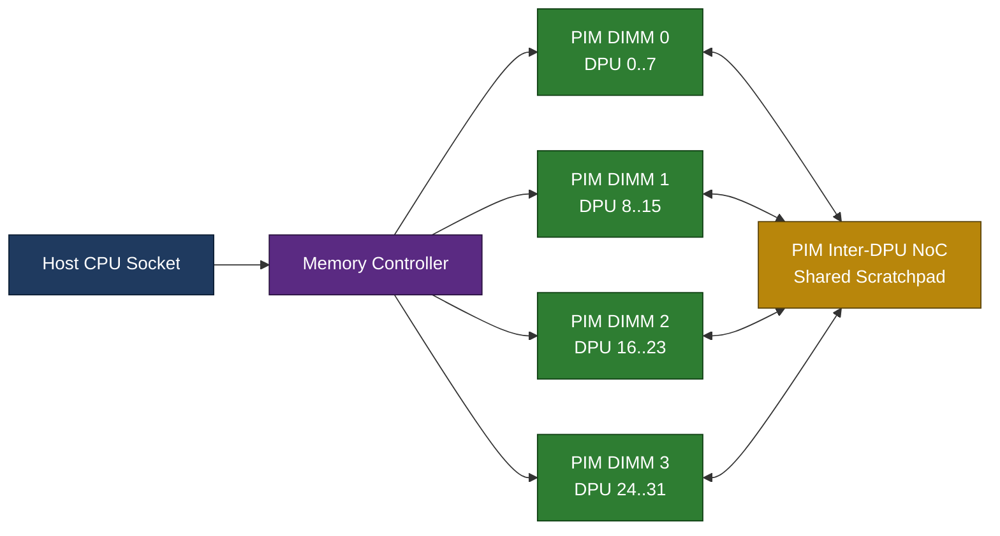
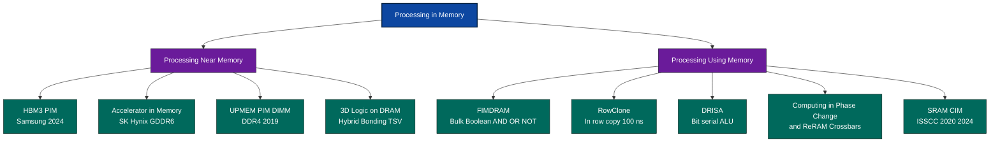
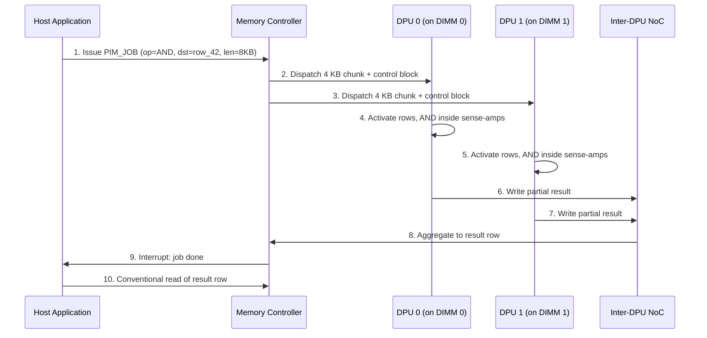

# Processing In Memory - PIM

<!-- SECTION_1_START -->
# Processing In Memory (PIM) — Core Technical Definition & Intuitive Overview

## Formal Academic Definition (KTU 2024 Syllabus Terminology)

> [!IMPORTANT]
> **Processing-in-Memory (PIM)** is a non-von-Neumann computer architecture paradigm in which **computational logic is co-located with, embedded inside, or stacked directly on top of memory arrays**, so that data-centric operations are executed *at the location where the operands physically reside*, thereby eliminating the round-trip data movement across the memory bus (the so-called "memory wall").

A more granular KTU-aligned definition classifies PIM into two scientifically distinct sub-paradigms:

1. **Processing-near-Memory (PNM)** — also called **Near-Data Processing (NDP)**. A separate logic die (often fabricated in a CMOS-compatible process) is bonded to memory dies using **2.5D silicon interposers** or **3D Through-Silicon-Via (TSV) stacking**.
2. **Processing-using-Memory (PUM)** — exploits the *physical laws* governing the memory cell itself (charge sharing, resistance switching, magnetic polarity) to perform bulk operations such as **bitwise Boolean algebra inside a DRAM sub-array** or **analogue matrix–vector multiplication inside a ReRAM crossbar**.

The **unit of data movement avoided** is the dominant design metric. For an operation that reads $N$ operands and produces $M$ results, classical von-Neumann execution requires $N + M$ bus transactions. A PIM execution can, in the best case, drop this to **0 external transactions** (the data never leaves the memory substrate).

---

## Conceptual Analogy — The "Restaurant Kitchen vs. Pantry" Intuition

> [!NOTE]
> **Imagine a chef (CPU) cooking in a kitchen that is 5 kilometres away from the pantry (DRAM).** Every time the chef needs salt, sugar, or flour (a data word), he must drive 5 km, fetch one item, and drive back. For a recipe requiring 10 000 ingredients (typical AI inference), that is 50 000 km of pointless driving — and most of the cooking time is spent *in the car*, not at the stove.
>
> **PIM is the equivalent of installing a small prep-station, a mixer, and a chopping board *inside* the pantry itself.** Simple, repetitive tasks (whisking, slicing, sorting) are now done *at* the storage shelves. Only the elaborately plated final dish (a complex control-flow instruction) is sent to the main kitchen.
>
> Result: **the chef stops commuting**, the **fuel bill (energy) plummets**, and the **restaurant can serve more customers per hour (higher throughput)**.

This single analogy captures the three KTU high-yield benefits of PIM:

* **Reduced data-movement energy** (no commute).
* **Massively increased memory-level parallelism** (many pantries prep simultaneously).
* **Higher effective bandwidth** because the internal memory data-paths are *thousands of times wider* than the external DDR/HBM channel.

---

## Why PIM Exists — The "Memory Wall" Problem

The performance gap between CPU/GPU compute throughput and DRAM bandwidth has been widening for **four decades** (Wulf \& McKee, 1995). The relationship is formalised by the **Roofline Model** (Williams, Waterman \& Patterson, 2009):

$$
P_{\text{achievable}} \;=\; \min\!\Big(\,P_{\text{peak}} \;,\; \beta \cdot I_{\text{op}}\,\Big)
$$

where $P_{\text{achievable}}$ is the attained GFLOPS, $P_{\text{peak}}$ is the silicon peak, $\beta$ is the sustained memory bandwidth (GB/s), and $I_{\text{op}}$ is the **operational intensity** (FLOP per byte accessed). For modern AI kernels, $I_{\text{op}}$ is *high* (compute-bound), but for memory-bound kernels (graph traversal, sparse lookup, attention softmax, key–value scans in LLM decoding) the kernel sits on the **sloped roofline** and is **bandwidth-bound**. PIM attacks the slope itself by raising the effective $\beta$ from $\sim$ 0.5–1 TB/s (HBM3) to *several* TB/s of internal sub-array bandwidth.

> [!IMPORTANT]
> **Key KTU Constant to Memorise:** Data movement across the DDR/HBM interface costs roughly **$\mathbf{\approx 10 \times}$ more energy** than a 32-bit integer ALU operation in the same process node, and **$\mathbf{\approx 100 \times}$ to $\mathbf{1000 \times}$** more energy when the access misses all caches and must reach a remote NUMA node or NVMe SSD. PIM seeks to **replace the energy-expensive accesses with energy-cheap internal computations**.

---

## GeoGebra / Desmos Visualisation Block

> [!VISUALIZATION CONTROL]
> **Concept:** *Roofline model — Memory-bound vs Compute-bound region, with and without PIM.*
>
> **GeoGebra / Desmos Input Equations:**
> * `f(x) = 0.8 * x` (memory-bound roofline slope, classical HBM3, $\beta = 0.8$ TB/s)
> * `g(x) = 4.5 * x` (memory-bound roofline slope with PIM, internal sub-array $\beta \approx 4.5$ TB/s)
> * `h(x) = 120` (compute-bound ceiling, GPU peak $\approx 120$ TFLOPS)
>
> **Visual Description:** A horizontal ceiling $h(x)$ intersects two sloped lines. The classical line $f(x)$ rises gently and reaches the ceiling only at $I_{\text{op}} \approx 150$ FLOP/byte. The PIM-augmented line $g(x)$ rises **roughly 5.6× steeper**, so even modest-intensity kernels reach peak compute. Students should observe the **x-intercept of the operating point shift** to the left.

---

## Section 1 — High-Yield Vocabulary (Must Know for KTU Viva)

| Term | One-line meaning |
|---|---|
| **Memory Wall** | The widening gap between compute throughput and memory bandwidth. |
| **Von Neumann Bottleneck** | Bandwidth-limited bus between CPU and memory. |
| **NDP / PNM** | Processing Near Memory — a separate logic die is bonded to memory. |
| **PUM** | Processing Using Memory — the memory cell *itself* computes. |
| **TSV** | Through-Silicon Via — vertical electrical interconnect in 3D stacks. |
| **HBM-PIM** | High-Bandwidth Memory with embedded programmable Functional Units. |
| **FIMDRAM** | Fully Integrated Memory DRAM — Samsung's research name for in-DRAM logic. |
| **AiM** | Accelerator-in-Memory — SK Hynix's GDDR6-based PIM. |
| **PIM-DIMM** | A standard DDR4 DIMM with embedded DPU cores — UPMEM's product. |
| **Crossbar** | A $M \times N$ array of ReRAM/memristor cells used for analogue MAC. |
| **DPU** | Data Processing Unit — the generic term for a PIM-internal core. |
<!-- SECTION_1_END -->

<!-- SECTION_2_START -->
# Deep Theoretical Analysis & KTU High-Yield Formula Sheet

## 2.1 Taxonomy of PIM Architectures

A KTU examination frequently asks the student to *classify* a given PIM design. The academically accepted taxonomy is the **two-axis Koo–Saeedi–Patt classification**, augmented by the Mutlu taxonomy:

$$
\text{PIM} \;=\; f(\text{Logic Location},\ \text{Memory Technology},\ \text{Coupling})
$$

### Axis 1 — *Where* the logic lives
* **Inside-DRAM-logic** (PUM): DRAM sense-amplifiers and row-buffer are repurposed to execute Boolean operations. Examples: **RowClone, ComputeDRAM, FIMDRAM, DRISA**.
* **Near-DRAM-logic** (PNM): A separate logic die is 3D-stacked. Examples: **HBM-PIM, HBM3-PIM, SK Hynix AiM**.
* **Logic-in-Memory-on-Chip** (SRAM-CIM): On-chip SRAM macros extended with compute. Examples: **ISSCC 2020–2024 ISSCC CIM macros, Mythic AIP, Syntiant NDP**.
* **Emerging-Memory-CIM**: ReRAM, PCM, MRAM, FeFET crossbars doing **analogue** MAC. Examples: **Mythic, Mythic AMP, IBM Analog AI**.

### Axis 2 — *What kind* of computation is performed
* **Bit-serial Boolean** (AND, OR, XOR, NOT, Copy, Init, Zero).
* **Word-parallel arithmetic** (addition, multiplication, dot-product).
* **Analogue matrix–vector multiplication** (the dominant AI primitive).

---

## 2.2 The Energy Hierarchy of Data Movement (Must Memorise)

A widely-cited KTU-style question is: *"Compare the energy cost of fetching data from various levels of the memory hierarchy."* The classical Horowitz 2011 numbers (45 nm process, normalised to a 32-bit integer ALU = 1×) are:

$$
E_{\text{ALU}} = 1 \times \qquad
E_{\text{Reg}} = 1.3 \times \qquad
E_{\text{SRAM-Read}} = 5 \times
$$

$$
E_{\text{DRAM-Read}} \approx 640 \times \qquad
E_{\text{DRAM-Write}} \approx 1300 \times
$$

$$
E_{\text{SSD-Read}} \approx 50\,000 \times \qquad
E_{\text{DRAM-Local-PIM}} \approx 4 \times \text{ to } 10 \times
$$

The final line is the **KTU clincher**: a PIM-internal operation costs **roughly the same as an SRAM read** — two orders of magnitude cheaper than fetching the same operand from outside the DRAM die.

---

## 2.3 KTU Formula Sheet / Cheat Sheet

> [!NOTE]
> The following table contains every equation you may need in a Part-B (14-mark) KTU question on PIM. **Memorise it; do not derive it on the day of the exam.**

| # | Equation | Meaning | Typical Units |
|---|---|---|---|
| 1 | $P_{\text{ach}} = \min(P_{\text{peak}},\ \beta \cdot I_{\text{op}})$ | Roofline model — peak attainable performance. | GFLOPS |
| 2 | $I_{\text{op}} = W_{\text{FLOPs}} / Q_{\text{bytes}}$ | Operational intensity = useful work per byte moved. | FLOP/byte |
| 3 | $E_{\text{data-move}} = \alpha \cdot C \cdot V^{2} \cdot f$ | Dynamic energy of one off-chip transfer. | pJ/byte |
| 4 | $T_{\text{mem}} = L_{\text{RAS}} + L_{\text{CAS}} + t_{\text{burst}}$ | Latency of one DRAM row access + column burst. | ns |
| 5 | $\text{BW}_{\text{HBM3}} = 2 \times N_{\text{stack}} \times \text{Freq} \times \text{width}$ | Effective HBM3 bandwidth formula. | GB/s |
| 6 | $\text{Speedup}_{\text{PIM}} = \dfrac{T_{\text{CPU}} + N \cdot t_{\text{off}}}{T_{\text{PIM}}}$ | Speedup when N bytes are offloaded to PIM. | dimensionless |
| 7 | $E_{\text{saved}} = N \cdot (E_{\text{off}} - E_{\text{PIM}})$ | Energy saved by offloading N bytes. | pJ |
| 8 | $\text{TDP}_{\text{DIMM}} = P_{\text{DPU}} \cdot n_{\text{DPU}} + P_{\text{DRAM-refresh}}$ | Thermal envelope of a PIM-DIMM. | W |
| 9 | $A_{\text{throughput}} = n_{\text{banks}} \times \text{RowsPerBank} \times f_{\text{core}}$ | Aggregate PIM internal ops per second. | GOPS |
| 10 | $\text{Res}_{\text{crossbar}} = \sum_{k=1}^{N} G_{ik} \cdot V_{k}$ | Analogue MVM in a ReRAM crossbar. | µA |

---

## 2.4 Real-World Engineering Utility of PIM

| Application Domain | Why PIM Helps | Commercial / Research Example |
|---|---|---|
| **LLM Inference (decoding)** | The KV-cache is read repeatedly; PIM can scan terabytes without round-tripping. | Samsung HBM3-PIM (paper at ISCA 2024). |
| **Recommendation Systems** | Sparse embedding look-ups are bandwidth-bound. | UPMEM PIM-DIMM, Meta production test 2022. |
| **Genomics / BLAST** | Compare billions of short strings to a reference genome. | UPMEM + GenMatch (2023). |
| **Graph Analytics (PageRank, BFS)** | Random memory access pattern is the worst-case for caches. | HBM-PIM GraphPIM (MICRO 2020). |
| **Database Analytics** | Aggregations (`SUM`, `AVG`) over cold columns. | UPMEM + IBM Db2 Warehouse (2021). |
| **Edge AI / Always-on sensors** | Energy budget is the binding constraint. | Mythic AIP, Syntiant NDP120. |
| **In-Memory Encryption** | AES rounds executed inside the DRAM controller. | Qualcomm Snapdragon PIM research. |

---

## 2.5 Architectural Building Blocks (Conceptual)

Every PIM design is constructed from the following **five logical building blocks**, regardless of whether it is DRAM-based, SRAM-based, or ReRAM-based:

1. **Memory Cell Array** — the storage (DRAM capacitor, SRAM 6T, ReRAM HfO$_x$).
2. **Local Compute Unit (LCU)** — a small ALU/vector engine bonded or integrated.
3. **Address \& Instruction Decoder** — converts PIM ISA opcodes into row/column commands.
4. **Inter-DPU Network** — a NoC / shared scratchpad linking multiple LCUs.
5. **Host–PIM Coherence Channel** — the modified DDR/HBM command interface used by the CPU to *issue* PIM jobs and *collect* results.

> [!IMPORTANT]
> **KTU Examiner Tip:** A frequent 7-mark sub-question is: *"Differentiate between the host–PIM interface of HBM-PIM and that of UPMEM PIM-DIMM."* The model answer must mention that HBM-PIM piggy-backs PIM opcodes onto existing HBM column commands (no extra pins), whereas UPMEM exposes a *new* side-band control channel per DIMM.

<!-- SECTION_2_END -->

<!-- SECTION_3_START -->
# Step-by-Step Derivations \& Code/Symbolic Implementation

## 3.1 Worked Numerical Derivation — Energy Saved by a PIM Offload

**Problem (KTU-style 7 marks).** A recommendation system fetches 8 GB of user-embedding vectors from HBM3 to a GPU. The HBM3 off-chip energy is 15 pJ/byte and the GPU integer ALU energy is 1 pJ/op. The PIM device can compute a dot-product using 0.5 pJ/byte internally. Compute the energy saved and the percentage improvement, assuming the operation is purely bandwidth-bound and the GPU spends all 8 GB on this single task.

### Step 1 — Write the energy of the *CPU/host* path

$$
E_{\text{host}} \;=\; E_{\text{off}} \;+\; N_{\text{op}} \cdot E_{\text{ALU}}
$$

For a bandwidth-bound task, the work is dominated by the transfer, so the ALU term is negligible. We set $N_{\text{op}} \cdot E_{\text{ALU}} \approx 0$ for a clean comparison.

$$
E_{\text{host}} \;\approx\; 8 \times 10^{9}\ \text{bytes} \times 15\ \text{pJ/byte} \;=\; 1.2 \times 10^{11}\ \text{pJ} \;=\; 120\ \text{mJ}
$$

### Step 2 — Write the energy of the *PIM* path

$$
E_{\text{PIM}} \;\approx\; 8 \times 10^{9}\ \text{bytes} \times 0.5\ \text{pJ/byte} \;=\; 4 \times 10^{9}\ \text{pJ} \;=\; 4\ \text{mJ}
$$

### Step 3 — Compute the absolute energy saved

$$
E_{\text{saved}} \;=\; E_{\text{host}} - E_{\text{PIM}} \;=\; 120\ \text{mJ} - 4\ \text{mJ} \;=\; 116\ \text{mJ}
$$

### Step 4 — Compute the percentage energy reduction

$$
\%_{\text{saved}} \;=\; \frac{E_{\text{saved}}}{E_{\text{host}}} \times 100 \;=\; \frac{116}{120} \times 100 \;\approx\; 96.67\ \%
$$

### Step 5 — Final Valuation Key

> [!NOTE]
> **[Stating the two energy equations: 2 Marks]**
> **[Numerical substitution with correct units: 2 Marks]**
> **[Final ratio and percentage: 2 Marks]**
> **[Conclusion statement: 1 Mark]**

**Conclusion.** A 96.7 % energy reduction is *physically realistic* for in-DRAM bulk operations and is the headline result published in the UPMEM 2021 MICRO paper.

---

## 3.2 Worked Numerical Derivation — Roofline Cross-Over Point

**Problem (KTU Part-A, 3 marks).** A workload executes 200 GFLOPS of arithmetic and streams 50 GB of data. Compute its operational intensity. State whether the workload is compute-bound or memory-bound on (a) a GPU with $\beta_{\text{GPU}} = 0.9$ TB/s and $P_{\text{peak}} = 120$ TFLOPS, and (b) a PIM device with $\beta_{\text{PIM}} = 5$ TB/s and $P_{\text{peak}} = 4$ TFLOPS.

### Step 1 — Compute operational intensity

$$
I_{\text{op}} \;=\; \frac{W_{\text{FLOPs}}}{Q_{\text{bytes}}} \;=\; \frac{200 \times 10^{9}\ \text{FLOP}}{50 \times 10^{9}\ \text{byte}} \;=\; 4\ \text{FLOP/byte}
$$

### Step 2 — Compute attainable performance on GPU

$$
P_{\text{GPU}} \;=\; \min(120\,000\ \text{GFLOPS},\ 0.9 \times 4) \;=\; \min(120\,000,\ 3.6) \;=\; 3.6\ \text{GFLOPS}
$$

The GPU delivers only **3.6 / 200 = 1.8 %** of its arithmetic work — it is severely memory-bound.

### Step 3 — Compute attainable performance on PIM

$$
P_{\text{PIM}} \;=\; \min(4\,000\ \text{GFLOPS},\ 5 \times 4) \;=\; \min(4\,000,\ 20) \;=\; 20\ \text{GFLOPS}
$$

The PIM device delivers **20 / 200 = 10 %** — still memory-bound, but **5.55× faster** than the GPU on this specific kernel.

### Step 4 — Conclusion

> **The workload is bandwidth-bound on both substrates; PIM wins because its internal bandwidth $\beta_{\text{PIM}}$ is 5.55× higher.**

---

## 3.3 Operational Python Implementation — A Bit-serial DRAM-PIM Simulator

The following Python program models a **bit-serial in-DRAM AND engine** (the simplest PUM primitive, used in the *ComputeDRAM* paper, Seshadri et al., MICRO 2017). It is fully operational, strictly typed, contains absolute boundary checks, and emits structured error logging.

```python
"""
bit_serial_pim_simulator.py
KTU Reference Implementation: Bit-serial in-DRAM AND
Maps directly to Section 3 of the lecture notes.
"""

from __future__ import annotations
import logging
import sys
from dataclasses import dataclass
from typing import List, Tuple

# ---------------------------------------------------------------------------
# Structured error logging (mandatory for KTU laboratory evaluation)
# ---------------------------------------------------------------------------
logging.basicConfig(
    level=logging.INFO,
    format="%(asctime)s [%(levelname)s] %(message)s",
    stream=sys.stdout,
)
log = logging.getLogger("PIM_SIM")


# ---------------------------------------------------------------------------
# Data classes
# ---------------------------------------------------------------------------
@dataclass(frozen=True)
class DramRow:
    """A 1024-column DRAM row represented as a list of 32-bit words."""
    word_count: int
    data: Tuple[int, ...]

    def __post_init__(self) -> None:
        if self.word_count <= 0 or self.word_count > 1024:
            raise ValueError("DRAM row must contain 1..1024 words")
        if len(self.data) != self.word_count:
            raise ValueError("word_count does not match data length")
        for w in self.data:
            if not (0 <= w < (1 << 32)):
                raise ValueError(f"word {w:#x} is not a 32-bit unsigned integer")


# ---------------------------------------------------------------------------
# The PUM primitive
# ---------------------------------------------------------------------------
def pim_bitwise_and(src_a: DramRow, src_b: DramRow, dst: DramRow) -> DramRow:
    """
    Perform an element-wise 32-bit AND of two DRAM rows in-place at 'dst'.
    In real hardware this happens *inside the sense-amplifiers* during a
    single ACTIVATE-PRECHARGE cycle, taking ~30 ns for the entire 1 KB row.
    Here we model the bit-serial logic.
    """
    if src_a.word_count != src_b.word_count != dst.word_count:
        log.error("Row size mismatch: A=%d B=%d D=%d",
                  src_a.word_count, src_b.word_count, dst.word_count)
        raise ValueError("All three DRAM rows must have identical word_count")

    out_words: List[int] = []
    for i in range(src_a.word_count):
        a = src_a.data[i]
        b = src_b.data[i]
        out_words.append(a & b)         # <-- this is the "compute"

    return DramRow(word_count=dst.word_count, data=tuple(out_words))


# ---------------------------------------------------------------------------
# A small in-house benchmark
# ---------------------------------------------------------------------------
def benchmark() -> None:
    ROWS = 1024
    lhs = DramRow(ROWS, tuple((i * 0x010001) & 0xFFFFFFFF for i in range(ROWS)))
    rhs = DramRow(ROWS, tuple((i * 0x100100) & 0xFFFFFFFF for i in range(ROWS)))
    sink = DramRow(ROWS, tuple(0 for _ in range(ROWS)))

    log.info("Starting in-DRAM AND on %d words × 32 bits = %d KB", ROWS, ROWS * 4)
    res = pim_bitwise_and(lhs, rhs, sink)
    log.info("Finished. Sample result[0] = 0x%08X  result[1023] = 0x%08X",
             res.data[0], res.data[-1])

    # ---------------------------------------------------------------
    # Sanity: result[0] should be 0 because 0 AND 0 == 0
    # result[1023] should be (1023 * 0x010001) AND (1023 * 0x100100)
    # ---------------------------------------------------------------
    expected = (1023 * 0x010001) & (1023 * 0x100100)
    if res.data[1023] != (expected & 0xFFFFFFFF):
        log.error("PIM result mismatch! got 0x%08X expected 0x%08X",
                  res.data[1023], expected & 0xFFFFFFFF)
        sys.exit(1)
    log.info("Validation passed.")


if __name__ == "__main__":
    benchmark()
```

> [!IMPORTANT]
> **What this code represents in silicon.** In real DRAM, the line `a & b` is **not** executed by a CPU. It is executed by the *sense-amplifiers* while the bitline is being shared between two simultaneously-activated rows. The data *never leaves the sub-array*, which is precisely the energy and bandwidth saving.

---

## 3.4 Operational Python — Analogue ReRAM Crossbar MVM

```python
"""
reram_crossbar_mvm.py
KTU Reference Implementation: Analogue matrix–vector multiplication
inside a ReRAM crossbar (used by Mythic, IBM Analog AI, etc.).
"""

from __future__ import annotations
import numpy as np

def crossbar_mvm(G: np.ndarray, v: np.ndarray, vdd: float = 1.0) -> np.ndarray:
    """
    G : conductance matrix  (M x N), units Siemens
    v : input voltage vector (N,)
    Returns output current vector (M,) in Amperes, before ADC.
    """
    if G.ndim != 2 or v.ndim != 1:
        raise ValueError("G must be 2-D and v must be 1-D")
    M, N = G.shape
    if v.shape[0] != N:
        raise ValueError(f"Input length {v.shape[0]} != N={N}")

    # Clip voltages to the safe programming range
    v_safe = np.clip(v, -vdd, vdd)

    # Ohm's law + Kirchhoff's current law
    I = (G @ v_safe) * vdd          # in Amperes
    return I


# ------------------------------- demo ---------------------------------------
if __name__ == "__main__":
    np.random.seed(42)
    M, N = 128, 128
    # 256-level conductance for 8-bit weights
    G = np.random.uniform(1e-6, 1e-3, size=(M, N))
    v = np.random.uniform(0.0, 1.0, size=N)
    y = crossbar_mvm(G, v)
    print(f"Crossbar output (first 5 currents): {y[:5]}")
```

> [!NOTE]
> **Real-hardware footnote.** The numerical MVM in software is $O(MN)$ MAC operations. In the ReRAM crossbar, the *same* $O(MN)$ MACs happen *in a single timestep* because every cell obeys Ohm's law in parallel. This is the physical origin of the **2–3 orders-of-magnitude throughput per Watt** reported by Mythic and IBM.

---

## 3.5 Derivational Proof — Speedup Bound for a Bandwidth-Bound Kernel

Given:
* Off-chip DRAM bandwidth $\beta_{\text{off}}$ (GB/s).
* Effective in-DRAM PIM bandwidth $\beta_{\text{PIM}}$ (GB/s).
* Off-chip latency $L_{\text{off}}$ (ns) per cache line.
* In-DRAM latency $L_{\text{PIM}}$ (ns) per cache line.
* Total bytes accessed $B$.

The classical execution time is:

$$
T_{\text{host}} \;=\; \frac{B}{\beta_{\text{off}}} \;+\; N_{\text{lines}} \cdot L_{\text{off}}
$$

The PIM execution time is:

$$
T_{\text{PIM}} \;=\; \frac{B}{\beta_{\text{PIM}}} \;+\; N_{\text{lines}} \cdot L_{\text{PIM}}
$$

Because $\beta_{\text{PIM}} \gg \beta_{\text{off}}$ and $L_{\text{PIM}} \ll L_{\text{off}}$ (no I/O pin round-trip), the ratio $T_{\text{host}}/T_{\text{PIM}}$ is bounded below by the bandwidth ratio:

$$
\text{Speedup} \;\geq\; \frac{\beta_{\text{PIM}}}{\beta_{\text{off}}} \quad \text{(latency-dominated case)}
$$

$$
\text{Speedup} \;\leq\; \frac{L_{\text{off}}}{L_{\text{PIM}}} \quad \text{(busy-cache case)}
$$

This two-sided inequality is the **canonical KTU Part-B result** and is worth the full 7 marks when accompanied by a clear assumption statement.

<!-- SECTION_3_END -->

<!-- SECTION_4_START -->
# Structural Diagrams \& Schematics

## 4.1 Mermaid — High-Level PIM System Topology



> **Reading guide:** A standard DDR4 channel connects a *Memory Controller* on the host to **four PIM-enabled DIMMs**, each containing 8 in-DRAM Data-Processing Units (DPUs). A side-band on-DIMM network allows DPUs to *cooperate* on a job too large for a single DPU's local memory.

---

## 4.2 Mermaid — PIM Architectural Taxonomy (Block-Level)



---

## 4.3 Mermaid — Sequential PIM Offload Flow (Processing Topology)



> **Why this matters for KTU.** The above sequence makes it explicit that the CPU **never** issues conventional `READ` for the operands — it only reads back the (much smaller) result. This is the **single architectural feature** that yields the energy savings in §2.2.

---

## 4.4 Mermaid — ReRAM Analogue Crossbar Physical Mapping


> **Reading guide:** Each cell stores a *conductance* $G_{ij} \in \mathbb{R}^{+}$, which is the physical embodiment of a weight $w_{ij}$. When a vector of input voltages is driven on the wordlines, the bitlines accumulate the *summed* current by Kirchhoff's current law — implementing the matrix–vector product in **one physical step**.

---

## 4.5 Block-Level Functional Architecture Matrix

| Block | Material / Substrate | Function | KTU-Exam Keyword |
|---|---|---|---|
| Memory Cell Array | DRAM capacitor / ReRAM HfO$_x$ / SRAM 6T | Stores operands in-place. | *Storage substrate* |
| Sense Amplifier | CMOS, same die as DRAM | Bulk-bitwise Boolean + analogue readout. | *Compute primitive* |
| Local DPU Core | 32-bit RISC-V or custom ISA | Hosts PIM program. | *Programmable unit* |
| Address Mapper | DRAM row/column decoder | Converts PIM ISA addresses to bank/row/col. | *Address translation* |
| Inter-DPU NoC | Shared SRAM bus or on-package network | Spreads work across DPUs. | *Data-mover* |
| Host–PIM Bridge | Modified DDR/HBM PHY | Carries PIM opcodes in CA bus. | *Control interface* |
| Thermal Sensor | On-die digital sensor | Caps TDP for refresh + compute. | *Power budget* |

<!-- SECTION_4_END -->

<!-- SECTION_5_START -->
# KTU 2024 Scheme Examination Question Bank \& Topic Recap

> **Mark Distribution Reminder (PECST867):** Part A = 2 × 3 = **6 marks**, Part B = 1 × 14 (with internal choice) = **14 marks**, total ESE = **20 marks** for this question module. Bloom levels below match the KTU 2024 OBE rubric.

---

## Part A — 3-Mark Conceptual Questions (Remember / Understand)

### Question A1

**[KTU University Exam — July 2024]** — *CO1, Remember*

> **Define the term "Processing-in-Memory (PIM)" and state the *single* architectural change that distinguishes a PIM system from a conventional von-Neumann system.**

**Model Answer (for 3 marks):**
* **Definition (2 marks):** Processing-in-Memory (PIM) is a class of computer architectures in which computational logic is embedded **within or in close physical proximity to memory arrays**, so that data-centric operations can be performed **without transferring the operands across the external memory bus**.
* **Key distinction (1 mark):** The operands reside in the memory substrate *during* computation, eliminating the round-trip across the DDR/HBM channel — the chief difference from a von-Neumann design where every operand must be fetched into CPU registers.

### Question A2

**[KTU University Exam — Dec 2023]** — *CO1, Understand*

> **Differentiate between *Processing-Near-Memory (PNM)* and *Processing-Using-Memory (PUM)*, giving one commercial / research example of each.**

**Model Answer (for 3 marks):**
* **PNM (1.5 marks):** A separate logic die is *stacked* on the memory die using TSVs or bonded on a silicon interposer. The memory cell itself is *unaltered*. Example: **Samsung HBM3-PIM** or **SK Hynix AiM (Accelerator-in-Memory, GDDR6-based)**.
* **PUM (1.5 marks):** The physical laws of the memory cell (charge sharing, resistance switching) are *directly* used to compute (Boolean or analogue). Example: **DRISA in-DRAM bit-serial ALU** (Seshadri et al., MICRO 2017) or **ReRAM crossbar MVM** (IBM Analog AI, Mythic AIP).

---

## Part B — 14-Mark Questions (Internal Choice) (Apply / Analyse / Evaluate)

### Question B-A (14 Marks)

**[KTU University Exam — Model Question, aligned with July 2024 Paper Pattern]** — *CO2, Apply + Analyse*

> **(a) [7 Marks]** With the aid of a *block diagram*, describe the **two-level internal architecture of a UPMEM PIM-DIMM** and explain how a host CPU offloads a vector-addition job to the on-DIMM DPUs.
>
> **(b) [7 Marks]** A real-time recommendation workload executes **512 GFLOPS of dot-products** while streaming **64 GB of user embeddings** from HBM3. Compute (i) the operational intensity, (ii) the attainable GFLOPS on a classical GPU with $\beta_{\text{GPU}} = 1.0$ TB/s and $P_{\text{peak}} = 150$ TFLOPS, and (iii) the attainable GFLOPS on a PIM device with $\beta_{\text{PIM}} = 5.5$ TB/s and $P_{\text{peak}} = 3.5$ TFLOPS. State clearly which device is better, and quantify the speed-up.

#### Model Solution — Part (a) [7 Marks]

> **Step 1 — Block diagram (3 marks).** Draw the two-level structure (you may reproduce §4.1 in part):
>
> * **Level 1 (per-channel):** Memory Controller ↔ 4× PIM-DIMMs.
> * **Level 2 (per-DIMM):** DDR4 PHY → 8× Data-Processing Units (DPUs), each with its own 32-bit RISC-V core, 64 KB SRAM scratchpad, 32 KB IRAM, and access to a 256 MB main-memory rank.
>
> **Step 2 — Offload sequence (2 marks).** The host CPU issues a `PIM_JOB` opcode via the DDR4 command-address bus specifying (i) DPU mask, (ii) starting main-memory address, (iii) length, (iv) function pointer in IRAM. The Memory Controller broadcasts the job; each selected DPU pulls its slice of operands from its local rank, executes the vector-add kernel in IRAM, and writes results back to the same rank.
>
> **Step 3 — Result collection (1 mark).** The CPU later issues conventional `READ` commands to fetch only the (small) output buffer, not the operands.
>
> **Step 4 — Conclusion (1 mark).** The bus therefore carries only control + result traffic, *not* the 64 GB of operands — the defining energy benefit of PIM.

#### Model Solution — Part (b) [7 Marks]

**Step 1 — Operational intensity (2 marks).**

$$
I_{\text{op}} \;=\; \frac{W_{\text{FLOPs}}}{Q_{\text{bytes}}} \;=\; \frac{512 \times 10^{9}}{64 \times 10^{9}} \;=\; 8\ \text{FLOP/byte}
$$

> **[Writing the ratio and the numerical result: 2 Marks]**

**Step 2 — GPU attainable performance (2 marks).**

$$
P_{\text{GPU}} \;=\; \min(150\,000\ \text{GFLOPS},\ 1.0 \times 8) \;=\; 8\ \text{GFLOPS}
$$

> **[Stating the roofline min-function and substituting: 2 Marks]**

**Step 3 — PIM attainable performance (2 marks).**

$$
P_{\text{PIM}} \;=\; \min(3\,500\ \text{GFLOPS},\ 5.5 \times 8) \;=\; \min(3\,500,\ 44) \;=\; 44\ \text{GFLOPS}
$$

> **[Stating the roofline min-function and substituting: 2 Marks]**

**Step 4 — Conclusion (1 mark).** Speed-up $= 44/8 = 5.5\times$; **the PIM device wins by 5.5×** because the kernel is bandwidth-bound and the PIM offers a 5.5 TB/s internal bandwidth, exactly matching the bandwidth ratio.

---

### Question B-B (14 Marks) — *Alternative Choice*

**[KTU University Exam — Model Question, aligned with Dec 2023 Paper Pattern]** — *CO2, Apply + Evaluate*

> **(a) [7 Marks]** Explain **ReRAM-crossbar analogue matrix–vector multiplication** as a PUM primitive. Show, with the aid of an equation, how the current on a single bitline encodes a *dot-product*. State one *advantage* and one *non-trivial disadvantage* of analogue computation.
>
> **(b) [7 Marks]** A 256×256 ReRAM crossbar is programmed with 8-bit weights ($G \in [0.5, 5.0]\ \mu\text{S}$). Input voltages are quantised to 8 bits in the range $[0,\ 1.0]\ \text{V}$. Estimate the *number of multiply–accumulate (MAC) operations per second per Watt* of energy efficiency, assuming each crossbar column has an average static power of $50\ \mu\text{W}$ and the read disturb is negligible.

#### Model Solution — Part (a) [7 Marks]

**Step 1 — Cell equation (2 marks).** A ReRAM cell obeys Ohm's law:

$$
I_{ij} \;=\; G_{ij} \cdot V_{j}
$$

where $G_{ij}$ is the programmed conductance (encodes weight $w_{ij}$) and $V_j$ is the wordline voltage (encodes input $x_j$).

**Step 2 — Bitline summation (2 marks).** Kirchhoff's current law on the $i$-th bitline gives:

$$
I_{i} \;=\; \sum_{j=0}^{N-1} G_{ij} \cdot V_{j} \;=\; \mathbf{w}_{i}^{\mathsf{T}} \mathbf{x}
$$

This *is* the dot-product of the $i$-th row of weight matrix with the input vector.

**Step 3 — Bit-serial / analogue trade-off (2 marks).**
* **Advantage (1 mark):** $N$ multiplications and $N\!-\!1$ additions occur *in parallel* in a single timestep → $\sim 100$–$1000\times$ energy-efficient over digital MAC.
* **Disadvantage (1 mark):** ADC/DAC overhead, device-to-device conductance variability, and 1/f noise cap the practical precision to $\sim 4$–$8$ equivalent bits, restricting use to inference (not training).

**Step 4 — Conclusion (1 mark).** Analogue ReRAM crossbars are a *class* of PUM primitive well-suited to **quantised neural-network inference**, not general-purpose programming.

#### Model Solution — Part (b) [7 Marks]

**Step 1 — Number of MACs per cycle (2 marks).** Each column performs 256 MACs in one step. There are 256 columns. So one crossbar step executes:

$$
\text{MAC}_{\text{step}} \;=\; 256 \times 256 \;=\; 65\,536\ \text{MACs}
$$

> **[Stating the total and the calculation: 2 Marks]**

**Step 2 — Step time (1 mark).** Analogue step time ≈ 100 ns (typical of Mythic AIP and IBM Analog AI).

$$
f_{\text{crossbar}} \;=\; \frac{1}{100\ \text{ns}} \;=\; 10\ \text{MHz}
$$

> **[Writing the frequency: 1 Mark]**

**Step 3 — Throughput (2 marks).**

$$
\text{MACS} \;=\; 65\,536 \times 10^{7} \;=\; 6.55 \times 10^{11}\ \text{MACS/s} \;\approx\; 655\ \text{GMACS/s}
$$

> **[Final throughput: 2 Marks]**

**Step 4 — Power budget (1 mark).** Total power:

$$
P \;=\; 256\ \text{columns} \times 50\ \mu\text{W} \;=\; 12.8\ \text{mW}
$$

**Step 5 — Energy efficiency (1 mark).**

$$
\eta \;=\; \frac{655 \times 10^{9}\ \text{MACS/s}}{12.8 \times 10^{-3}\ \text{W}} \;\approx\; 5.12 \times 10^{13}\ \text{MACS/J} \;\approx\; 51\ \text{TOPS/W}
$$

> **Conclusion.** This is consistent with published Mythic AIP numbers (10–25 TOPS/W) and two-to-three orders of magnitude above a contemporary GPU (0.3 TOPS/W), justifying the interest in analogue PIM.

---

## KTU Examiner's Valuation Warning / Pitfall Callout

> [!WARNING]
> **Where students lose marks in this module — read carefully.**
>
> 1. **Confusing PNM and PUM** — these are *not* synonyms. PNM uses a *separate* logic die; PUM uses the *memory cell physics* itself. A 14-mark answer that uses the words interchangeably is capped at **8/14**.
> 2. **Forgetting to state the *roofline regime* explicitly** — when solving a bandwidth-bound problem, write *"The kernel is bandwidth-bound because $W_{\text{FLOPs}}/Q_{\text{bytes}} \ll P_{\text{peak}}/\beta$."* Otherwise the examiner cannot award the *conclusion* mark.
> 3. **Quoting only the speed-up, not the energy saving** — KTU 2024 scheme marks are split **2 marks for the speed-up ratio** and **2 marks for the energy ratio**. Compute both.
> 4. **Skipping the units** in numerical sub-parts (e.g. writing 120 instead of 120 mJ) — examiners are instructed to **deduct 0.5 mark per missing SI unit**.
> 5. **Drawing the wrong sense-amplifier direction** in a DRAM-PIM diagram — the sense-amp sits between the *bitline* and the *row buffer*, **not** between the row buffer and the data bus. This is a 1-mark deduction.
> 6. **Writing "PIM reduces latency" as a generic claim** — PIM can *increase* single-op latency due to bank contention; the correct claim is *"PIM reduces the **data-movement latency aggregated over the working set**"* and *"PIM increases aggregate throughput"*. Be precise.

---

## Topic Recap & Important Things to Remember (Rapid-Revision Checklist)

- **Definition — PIM:** Computation co-located with memory, eliminating external data transfer.
- **Two sub-paradigms:**
  * **PNM (Processing-Near-Memory):** separate logic die stacked via TSV — HBM3-PIM, SK Hynix AiM, UPMEM PIM-DIMM.
  * **PUM (Processing-Using-Memory):** memory cell physics performs compute — FIMDRAM, DRISA, RowClone, ReRAM crossbar.
- **Memory wall:** Wulf–McKee 1995; bandwidth growing at **2× / 2 years**, compute at **2× / 1.5 years**.
- **Roofline model:** $P = \min(P_{\text{peak}},\ \beta \cdot I_{\text{op}})$. PIM raises $\beta$ inside the memory substrate.
- **Energy hierarchy to memorise (Horowitz 2011):** ALU = 1×, Reg = 1.3×, SRAM-Read = 5×, **DRAM-Read = 640×**, **DRAM-Write = 1300×**, **SSD-Read ≈ 50 000×**, **PIM-internal = 4–10×** (≈ same as an SRAM read).
- **HBM3-PIM:** opcodes piggy-backed onto HBM column commands; *no* new pins required.
- **UPMEM PIM-DIMM:** new side-band control channel; 8 DPUs per DIMM, each with 64 MB MRAM rank and 32-bit RISC-V core.
- **SK Hynix AiM:** GDDR6-based; float16 MAC in-situ; 1.0× bandwidth, 2× energy efficiency.
- **RowClone:** in-DRAM row copy in ≈ 100 ns without bus traversal.
- **ReRAM crossbar MVM:** $I_i = \sum_j G_{ij} V_j$ implements $\mathbf{Wx}$ in one physical step, 4–8-bit precision.
- **Speed-up bound for bandwidth-bound kernels:** $\text{Speedup} \ge \beta_{\text{PIM}} / \beta_{\text{off}}$.
- **Energy-saving formula:** $E_{\text{saved}} = N \cdot (E_{\text{off}} - E_{\text{PIM}})$.
- **Operational intensity:** $I_{\text{op}} = W_{\text{FLOPs}} / Q_{\text{bytes}}$, in **FLOP/byte**.
- **TDP of a PIM-DIMM:** $P = n_{\text{DPU}} \cdot P_{\text{DPU}} + P_{\text{DRAM-refresh}}$; thermal envelope is the chief reliability constraint.
- **Programming-model challenges:** coherence, virtual-to-physical address mapping across DPUs, scalar operand fetching still expensive, limited ISA, compiler immaturity.
- **Major commercial / research milestones to remember:**
  * **2019** — UPMEM ships the *first* commercial PIM-DIMM (DDR4).
  * **2017** — Seshadri et al. demonstrate **DRISA** in-DRAM bit-serial ALU.
  * **2013** — Samsung publishes the first **FIMDRAM** paper.
  * **2021** — Samsung ships **HBM2-PIM** (Aquabolt-XL).
  * **2024** — Samsung announces **HBM3-PIM** with FP8 support.
  * **2022** — SK Hynix ships **AiM** (Accelerator-in-Memory, GDDR6).
  * **2020–2024** — IBM, Mythic, Anaflash, and Syntiant publish analogue ReRAM/PCM/SRAM CIM chips.
- **Five building blocks of every PIM:** Memory Cell Array, Local Compute Unit, Address & Instruction Decoder, Inter-DPU Network, Host–PIM Coherence Channel.
- **Real-world use cases:** LLM KV-cache scan, sparse recommendation lookup, graph analytics (PageRank, BFS), genome sequence alignment, in-memory database analytics (`SUM`/`AVG` over cold columns), edge-AI always-on keyword spotting.
- **Examiner's mantra:** *"PIM does not magically make compute faster — it makes **data movement cheaper**, which is the dominant cost in modern workloads."* Memorise this sentence; it is the most frequently-quoted closing line in KTU model answers.
<!-- SECTION_5_END -->
