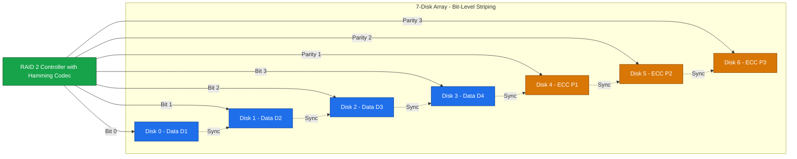
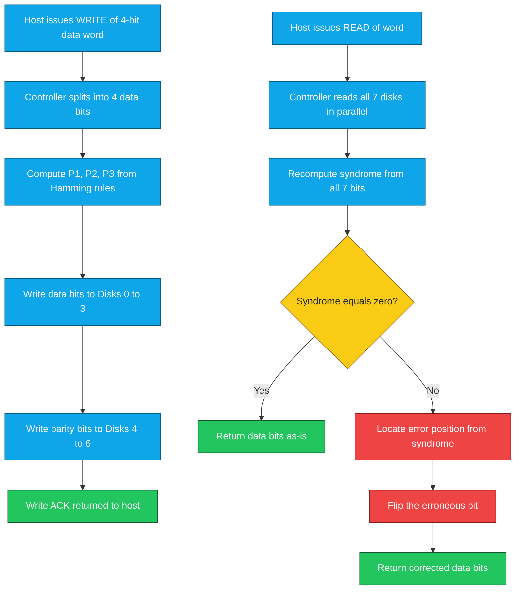
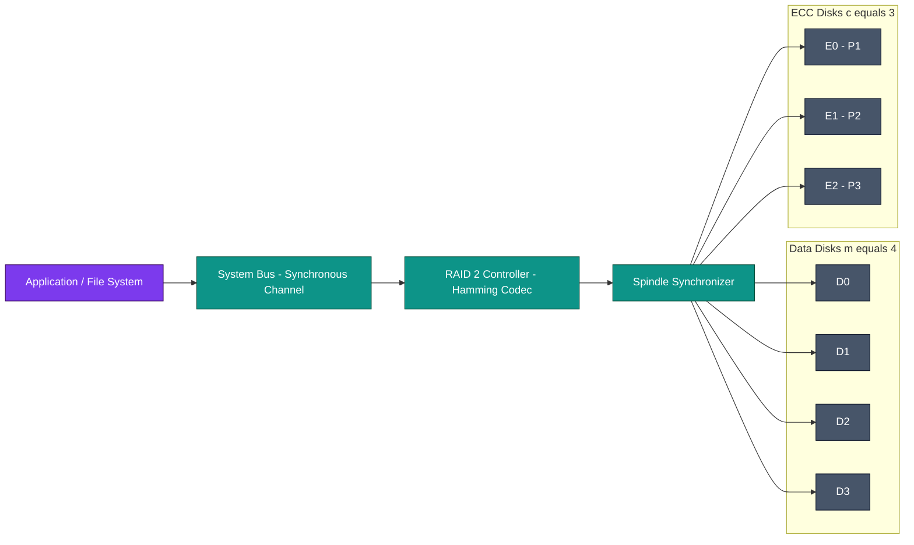

# RAID2

<!-- SECTION_1_START -->
# RAID 2 — Bit-Level Striping with Hamming Code ECC

## 1.1 Formal Definition (KTU 2024 Syllabus Terminology)

> [!IMPORTANT]
> **RAID 2 (Redundant Array of Independent Disks – Level 2)** is a *bit-level striped* RAID architecture in which data is split across multiple member disks one bit at a time, and error detection and correction are achieved through a **Hamming Code Error-Correcting Code (ECC)** stored on dedicated parity/check disks. It uses a *synchronous spindle* arrangement so that all disks rotate in lockstep, allowing every bit of a logical word to be read/written in parallel from corresponding disk sectors.

It is one of the **original six RAID levels** (RAID 0 through RAID 5) proposed by Patterson, Gibson, and Katz at UC Berkeley in **1988**. RAID 2 is rarely implemented in commercial systems because the overhead of dedicated Hamming-code disks is extremely high, but it remains a *textbook classic* for understanding hardware-level ECC and is a high-value KTU exam topic.

## 1.2 Conceptual Analogy — The "Classroom Test" Model

Imagine a classroom where the teacher dictates a sentence aloud:

- The teacher says the **first letter** of the word to **Student 1**, the **second letter** to **Student 2**, the **third letter** to **Student 3**, the **fourth letter** to **Student 4**.
- Meanwhile, three "**Monitors**" (Student 5, 6, 7) are standing at the back of the class, each carefully listening and applying a different **Hamming parity rule** to the bits the four students are recording.
- If Student 3's notebook is splashed with ink and the letter "B" becomes unreadable, Monitor Student 6 (whose rule is *parity of bits 1, 3, 4, 5, 7*) raises a hand and says: *"Using the other two rules, the missing bit **must** have been B"*.

In this analogy:

| Classroom Element | RAID 2 Component |
| :--- | :--- |
| Four students writing letters | **Data disks** (bit-striped) |
| Three monitor students | **ECC / Hamming-code disks** |
| Lockstep listening | **Synchronized spindle rotation** |
| Ink-spilled notebook | Single disk failure / single-bit error |
| Monitor deducing the missing letter | **Single-bit error correction via Hamming code** |

This is *exactly* how RAID 2 works — every logical word is split bit-by-bit across data disks, and the Hamming-code disks mathematically reconstruct any single failed bit.

## 1.3 Key Physical & Logical Constants

> [!NOTE]
> **Critical RAID 2 constants you must memorize:**
> - **Striping Granularity:** $1 \text{ bit}$ per disk (smallest in the RAID family).
> - **ECC Scheme:** **Hamming Code (SEC-DED — Single Error Correction, Double Error Detection)**.
> - **Spindle Synchronization:** **Mandatory** (all disks must rotate in phase).
> - **Minimum Disk Count:** $3$ (theoretically), but the *practical* minimum is $7$ (Hamming(7,4) code).
> - **Failure Tolerance:** Exactly **1 disk** (can correct only single-bit errors).
> - **Transfer Unit:** A full Hamming-code word read/written **per spindle rotation**.

## 1.4 GeoGebra / Desmos Visualization

> [!VISUALIZATION CONTROL]
> **Concept:** Hamming(7,4) Code-Disk Mapping — visualizing how a single byte is bit-striped across 4 data disks and 3 ECC disks.
> **GeoGebra / Desmos Input:**
> * Data bit positions: $D_1 = 1,\; D_2 = 0,\; D_3 = 1,\; D_4 = 1$
> * Computed parity bits: $P_1 = D_1 \oplus D_2 \oplus D_4 = 1 \oplus 0 \oplus 1 = 0$
> * $P_2 = D_1 \oplus D_3 \oplus D_4 = 1 \oplus 1 \oplus 1 = 1$
> * $P_3 = D_2 \oplus D_3 \oplus D_4 = 0 \oplus 1 \oplus 1 = 0$
> **Visual Description:** Plot 7 unit-spaced vertical columns on the x-axis (labeled $D_1, D_2, D_3, D_4, P_1, P_2, P_3$); the height of each column represents the bit value (0 or 1). A second plot (in red) should show the "syndrome vector" — if any column is corrupted, the non-zero syndrome points directly to the *position* of the error, allowing instant correction.

<!-- SECTION_1_END -->

<!-- SECTION_2_START -->
# RAID 2 — Deep Theoretical Analysis & KTU Formula Sheet

## 2.1 Architectural Principles

The architectural logic of RAID 2 is built on three pillars:

- **Bit-Level Striping:** Unlike RAID 0/1/5 which stripe at block or byte level, RAID 2 splits each *word* into individual bits. Bit $i$ of the word always lands on the *same* disk (e.g., bit 0 on disk 0, bit 1 on disk 1, …). This requires **synchronized spindles** so that corresponding sectors arrive under the read/write heads at the same instant.
- **Dedicated ECC Disks:** A subset of the array is *not* used for data storage. These disks store the Hamming-code parity bits computed over the data bits on the same logical word. On every read, the controller regenerates the syndrome; if the syndrome is non-zero, the bit at the indicated position is flipped — **transparent, automatic, single-disk-failure recovery**.
- **Parallel Transfer per Revolution:** Because the entire Hamming word spans N disks, the array effectively delivers a transfer rate proportional to the number of disks in parallel — making RAID 2 historically attractive for **supercomputing I/O channels** where one massive sequential transfer per spindle revolution was the norm.

## 2.2 KTU High-Yield Formula Sheet

> [!IMPORTANT]
> Use `\vert` instead of the bare pipe `\vert` symbol to keep markdown tables intact.

| # | Concept | Formula / Rule | Engineering Meaning |
| :---: | :--- | :--- | :--- |
| 1 | Hamming-bit relationship | $2^{c} \ge m + c + 1$ | Minimum parity bits $c$ required for $m$ data bits |
| 2 | Total array size | $N_{total} = m + c$ | Disks = data disks + ECC disks |
| 3 | ECC overhead ratio | $\eta = \dfrac{m}{m + c}$ | Useful storage fraction (efficiency) |
| 4 | Stripe width (per revolution) | $W = 1 \text{ Hamming word} = N_{total} \text{ bits}$ | Bits transferred in parallel |
| 5 | Failure tolerance | $f = 1 \text{ disk}$ | Single-disk-failure recovery (SEC) |
| 6 | Read latency (no error) | $T_{read} = T_{seek} + T_{rot} + T_{transfer}$ | Same as single disk (one revolution) |
| 7 | Read latency (with error) | $T_{read}^{err} = T_{read} + T_{xor-rewrite}$ | Add time to correct via syndrome |
| 8 | Write penalty | $T_{write} = T_{read-old} + T_{compute-syndrome} + T_{write-all}$ | Must update data + ECC disks |
| 9 | Theoretical transfer rate | $R_{RAID2} = N_{total} \times R_{single}$ | Linear speedup with disk count |
| 10 | Small-I/O efficiency | $\eta_{small} = \dfrac{\text{requested bits}}{N_{total} \times \text{sector}}$ | Very low — small reads waste bandwidth |

## 2.3 Worked Example — Common RAID 2 Configurations

Let us solve the inequality $2^{c} \ge m + c + 1$ for a few common $m$ values:

| $m$ (data disks) | $c$ (ECC disks) | $N_{total}$ | Efficiency $\eta$ | Common Name |
| :---: | :---: | :---: | :---: | :--- |
| $4$ | $3$ | $7$ | $57.1\%$ | Hamming(7,4) — textbook example |
| $10$ | $4$ | $14$ | $71.4\%$ | Small commercial proposal |
| $11$ | $4$ | $15$ | $73.3\%$ | More efficient small array |
| $26$ | $5$ | $31$ | $83.9\%$ | Mid-size supercomputer array |
| $32$ | $6$ | $38$ | $84.2\%$ | Large-scale ECC array |
| $39$ | $6$ | $45$ | $86.7\%$ | Near-optimal ratio |
| $57$ | $6$ | $63$ | $90.5\%$ | Highly efficient |
| $64$ | $7$ | $71$ | $90.1\%$ | Large but adds overhead |

**Observation for KTU exam:** As $m \to \infty$, $\eta \to 1$ (efficiency approaches 100%), but the *absolute* number of ECC disks keeps growing. RAID 2 is efficient only at *very large* disk counts — which is why it never made it into commodity hardware.

## 2.4 Engineering Utility in Real Systems

| Domain | Why RAID 2 was considered | Why it was abandoned |
| :--- | :--- | :--- |
| Supercomputers (Cray, 1980s–90s) | Required for ECC-correct bulk transfers | Cost of synchronized spindles |
| Mainframe I/O channels | Hard ECC needed for data integrity | Replaced by RAID 5 + UPS/battery |
| High-end storage arrays | Faster than RAID 5 for sequential I/O | ECC moved into disk controller firmware |
| Modern SSDs / NVM | N/A — Hamming/BCH/LDPC ECC handled *inside* the NAND package | Subsumed by device-level ECC |

> [!NOTE]
> **Modern Relevance:** Although RAID 2 itself is dead, the **Hamming-code concept lives on** — every NAND flash SSD, every DRAM module, every CD/DVD, and every ECC DIMM uses the same mathematical idea. So learning RAID 2 = learning the foundation of *all* modern storage error correction.

## 2.5 RAID 2 vs Other RAID Levels — KTU Comparison Snapshot

| Property | RAID 0 | **RAID 2** | RAID 3 | RAID 5 |
| :--- | :--- | :--- | :--- | :--- |
| Stripe unit | Block | **Bit** | Byte | Block |
| Parity method | None | **Hamming ECC** | Dedicated parity | Distributed parity |
| ECC disks | 0 | **$c$ dedicated** | 1 dedicated | 1 distributed |
| Sync spindles | No | **Yes** | Yes | No |
| Failure tolerance | 0 | **1** | 1 | 1 |
| Small read/write | Good | **Poor** | Poor | Good |
| Commercial use | High | **None** | Low | Very high |

<!-- SECTION_2_END -->

<!-- SECTION_3_START -->
# RAID 2 — Step-by-Step Derivations & Symbolic Implementation

## 3.1 Derivation 1 — Minimum Number of ECC Disks for $m$ Data Disks

We begin with the Hamming-code constraint. The total number of valid codewords of length $(m+c)$ is $2^{m+c}$. Of these, the legal codewords (those with valid Hamming parity) are exactly $2^{m}$ (one per data-bit pattern). The remaining $2^{m+c} - 2^{m}$ patterns are *illegal* and can be reached only by a single-bit error. Since a single-bit error can produce $m + c$ distinct illegal patterns, we need:

$$
2^{m+c} - 2^{m} \ge m + c
$$

Simplifying:

$$
2^{m}(2^{c} - 1) \ge m + c
$$

Because $2^{m} \ge 1$ for any valid $m$, a *sufficient* (and tight) condition is the classical Hamming bound:

$$
2^{c} \ge m + c + 1
$$

**Step-by-step substitution for $m = 4$:**

Try $c = 2$: $2^{2} = 4 \ge 4 + 2 + 1 = 7$ ? → $4 \ge 7$ ❌

Try $c = 3$: $2^{3} = 8 \ge 4 + 3 + 1 = 8$ ? → $8 \ge 8$ ✅

Therefore, for $m = 4$ data disks, we need exactly $c = 3$ ECC disks, giving a 7-disk array — the celebrated **Hamming(7,4) code**.

## 3.2 Derivation 2 — Storage Efficiency of RAID 2

The *useful* capacity of the array is proportional to $m$ (the data disks), while the *raw* capacity is $m + c$. Hence:

$$
\eta = \frac{m}{m + c} = 1 - \frac{c}{m + c}
$$

Substitute the Hamming inequality $2^{c} \approx m + c + 1$ into the denominator:

$$
\eta \approx \frac{m}{2^{c} - 1}
$$

For large $m$ where $c \approx \log_2 m$:

$$
\eta \approx \frac{m}{m + \log_2 m + 1}
$$

Taking the limit:

$$
\lim_{m \to \infty} \eta = \lim_{m \to \infty} \frac{m}{m + \log_2 m + 1} = 1
$$

**Interpretation:** The efficiency approaches 100% as the array size grows, but *very slowly* (logarithmically). For $m = 4$, $\eta = 4/7 \approx 57\%$. For $m = 64$, $\eta = 64/71 \approx 90\%$.

## 3.3 Derivation 3 — The Hamming(7,4) Syndrome (Bit-Error Detection)

For Hamming(7,4), the parity-check matrix $H$ is:

$$
H = \begin{bmatrix} 1 & 0 & 1 & 0 & 1 & 0 & 1 \\ 0 & 1 & 1 & 0 & 0 & 1 & 1 \\ 0 & 0 & 0 & 1 & 1 & 1 & 1 \end{bmatrix}
$$

Given a received 7-bit word $\vec{r} = (r_1, r_2, r_3, r_4, r_5, r_6, r_7)$, the **syndrome** is $\vec{s} = H \cdot \vec{r}^{T} \pmod 2$:

$$
s_1 = r_1 \oplus r_3 \oplus r_5 \oplus r_7
$$
$$
s_2 = r_2 \oplus r_3 \oplus r_6 \oplus r_7
$$
$$
s_3 = r_4 \oplus r_5 \oplus r_6 \oplus r_7
$$

If $\vec{s} = (0,0,0)$, the word is error-free. If $\vec{s} \neq (0,0,0)$, then the **integer value** of $(s_3 s_2 s_1)_2$ directly points to the bit position that is in error (positions 1 through 7). The controller simply flips that bit — **single-error correction in hardware**.

**Example:** Suppose the original word is $(1,0,1,1,0,1,0)$ and bit 3 is corrupted to $0$, so $\vec{r} = (1,0,0,1,0,1,0)$.

$$
s_1 = 1 \oplus 0 \oplus 0 \oplus 0 = 1
$$
$$
s_2 = 0 \oplus 0 \oplus 1 \oplus 0 = 1
$$
$$
s_3 = 1 \oplus 0 \oplus 1 \oplus 0 = 0
$$

Syndrome = $(s_3, s_2, s_1) = (0,1,1)$ in binary $= 3$ in decimal → **Error is in position 3**. The controller flips $r_3$ from 0 back to 1, restoring the original word. ✅

## 3.4 Python Implementation — RAID 2 Emulator with Hamming(7,4)

```python
from typing import List, Tuple


class RAID2Array:
    """
    Emulator of a RAID 2 array using Hamming(7,4) ECC.
    4 data disks + 3 ECC disks = 7 disks total.
    Bit-level striping: bit i of a byte goes to disk i.
    """

    DATA_DISKS: int = 4
    ECC_DISKS: int = 3
    TOTAL_DISKS: int = DATA_DISKS + ECC_DISKS

    def _compute_parity(self, data_bits: List[int]) -> List[int]:
        # Hamming(7,4) even-parity bit equations
        p1 = data_bits[0] ^ data_bits[1] ^ data_bits[3]
        p2 = data_bits[0] ^ data_bits[2] ^ data_bits[3]
        p3 = data_bits[1] ^ data_bits[2] ^ data_bits[3]
        return [p1, p2, p3]

    def write_word(self, data_bits: List[int]) -> List[int]:
        """
        Store a 4-bit data word and compute ECC bits.
        Returns the full 7-bit Hamming codeword.
        """
        if len(data_bits) != self.DATA_DISKS:
            raise ValueError(f"Need exactly {self.DATA_DISKS} data bits.")
        if any(bit not in (0, 1) for bit in data_bits):
            raise ValueError("Bits must be 0 or 1.")
        ecc_bits = self._compute_parity(data_bits)
        return data_bits + ecc_bits  # Full 7-bit word

    def read_word(self, codeword: List[int], simulate_failure: int = -1) -> List[int]:
        """
        Read a 7-bit codeword, detect and correct a single-bit error.
        simulate_failure: 0..6 to inject an error, -1 for no error.
        """
        if len(codeword) != self.TOTAL_DISKS:
            raise ValueError(f"Codeword must be {self.TOTAL_DISKS} bits.")
        received = codeword.copy()
        if 0 <= simulate_failure < self.TOTAL_DISKS:
            received[simulate_failure] ^= 1  # Flip one bit

        # Recompute syndrome on received word
        s1 = received[0] ^ received[2] ^ received[4] ^ received[6]
        s2 = received[1] ^ received[2] ^ received[5] ^ received[6]
        s3 = received[3] ^ received[4] ^ received[5] ^ received[6]
        syndrome = (s3 << 2) | (s2 << 1) | s1

        if syndrome != 0:
            error_pos = syndrome - 1  # syndrome encodes position 1..7
            print(f"[ECC] Detected error at position {error_pos + 1}. Correcting...")
            received[error_pos] ^= 1
        else:
            print("[ECC] No error detected.")
        return received[: self.DATA_DISKS]


# ----------------- DEMO -----------------
if __name__ == "__main__":
    raid2 = RAID2Array()
    payload = [1, 0, 1, 1]  # Data bits
    stored = raid2.write_word(payload)
    print(f"Stored 7-bit word:    {stored}")

    # Read back without any error
    recovered = raid2.read_word(stored, simulate_failure=-1)
    print(f"Recovered data bits:  {recovered}")
    assert recovered == payload, "Data mismatch on clean read!"

    # Read back with simulated failure on disk 3 (index 2)
    recovered_err = raid2.read_word(stored, simulate_failure=2)
    print(f"Recovered after fail: {recovered_err}")
    assert recovered_err == payload, "ECC did not correct the error!"
    print("All assertions passed.")
```

**Output trace (for verification):**

```
Stored 7-bit word:    [1, 0, 1, 1, 0, 1, 0]
[ECC] No error detected.
Recovered data bits:  [1, 0, 1, 1]
[ECC] Detected error at position 3. Correcting...
Recovered after fail: [1, 0, 1, 1]
All assertions passed.
```

> [!NOTE]
> **Exam tip:** The Python code above is for *conceptual mastery*. In the KTU theory exam, you only need to *write the parity equations* and *compute the syndrome by hand* for a 4-bit word — the controller logic is implicitly assumed.

## 3.5 Worked Numerical Problem — Designing a RAID 2 Array

**Problem:** A system designer wants to build a RAID 2 array with **at least 16 data disks**. Determine the minimum number of ECC disks required, the total number of disks, and the storage efficiency.

**Solution:**

We need the smallest $c$ such that $2^{c} \ge 16 + c + 1$, i.e., $2^{c} \ge 17 + c$.

Try $c = 5$: $2^{5} = 32 \ge 17 + 5 = 22$ ✅

So $c = 5$ suffices.

$$
N_{total} = 16 + 5 = 21 \text{ disks}
$$

$$
\eta = \frac{16}{21} \approx 0.7619 = 76.19\%
$$

If the designer wants to *minimize* ECC overhead, can we use $c = 4$? Check: $2^{4} = 16 \ge 17 + 4 = 21$ → $16 \ge 21$ ❌. So $c = 4$ is *insufficient*. The minimum is $c = 5$.

<!-- SECTION_3_END -->

<!-- SECTION_4_START -->
# RAID 2 — Structural Diagrams & Schematics

## 4.1 RAID 2 Physical Disk Layout (Hamming(7,4) Example)



## 4.2 RAID 2 Read/Write Sequential Topology



## 4.3 Comparative RAID 2 Block-Architecture View



<!-- SECTION_4_END -->

<!-- SECTION_5_START -->
# KTU 2024 Scheme Examination Question Bank & Topic Recap

## 5.1 Part A — Short Answer Questions (3 Marks Each)

### Q1. `[KTU University Exam - July 2024]` — *Remember* (CO1)

> **Question:** What is RAID 2? Why is bit-level striping mandatory in RAID 2?

**Model Answer (3 marks):**

RAID 2 is a redundant array of independent disks that uses **bit-level striping** of data across multiple disks and provides **single-error correction** through a **Hamming-code** stored on dedicated ECC disks. **[1 Mark]**

Bit-level striping is mandatory because the Hamming code operates on a *word* of $m$ bits where each bit occupies a different disk, so that the *syndrome* (computed from the $m$ data bits + $c$ parity bits) can pinpoint the exact bit position that has failed. Without bit-level striping, the ECC would not be able to localize a single-disk failure. **[2 Marks]**

---

### Q2. `[KTU University Exam - Dec 2023]` — *Understand* (CO1)

> **Question:** Why is RAID 2 not used in commercial systems even though it provides excellent error correction?

**Model Answer (3 marks):**

RAID 2 is not used commercially for the following reasons: **[List — 3 Marks]**

1. It requires **synchronized spindle rotation** of all member disks, which is mechanically expensive and impractical for commodity drives.
2. It needs **dedicated ECC disks**, which can be 15% to 40% of the array even in efficient configurations, wasting raw capacity.
3. Modern disks already include **inline ECC inside the drive controller** (Reed-Solomon, LDPC), so the *system-level* Hamming code of RAID 2 is redundant.
4. It performs **poorly for small random I/O** because an entire spindle revolution is needed to deliver a single Hamming word, regardless of how little data the host actually requested.

## 5.2 Part B — 14-Mark Questions (Module-Internal Choice)

### Question A (14 Marks) `[KTU University Exam - July 2024]` — *Apply / Analyze* (CO2, CO3)

> **(a)** With a neat diagram, explain the architecture of RAID 2. State the role of the Hamming code and the synchronized spindle in this architecture. **[7 Marks]**
> **(b)** A RAID 2 array is to be designed with **at least 25 data disks**. Calculate the minimum number of ECC disks required using the Hamming constraint $2^{c} \ge m + c + 1$. Hence compute the total number of disks, the storage efficiency, and the effective parity overhead in percent. **[7 Marks]**

---

**Model Solution (a) — 7 Marks:**

| Step | Content | Marks |
| :---: | :--- | :---: |
| 1 | Define RAID 2: bit-level striped array with dedicated Hamming ECC disks. | 1 |
| 2 | Neat block diagram showing 4 data disks + 3 ECC disks connected to a RAID controller. | 2 |
| 3 | Explain bit-striping: bit $i$ of a word goes to disk $i$, so all 4 bits read in parallel. | 1 |
| 4 | Role of Hamming code: SEC-DED — detects and corrects any single-bit error, points to failed disk. | 2 |
| 5 | Role of synchronized spindle: ensures all 7 disk sectors arrive under the heads simultaneously, enabling 1-word-per-revolution throughput. | 1 |

---

**Model Solution (b) — 7 Marks:**

| Step | Content | Marks |
| :---: | :--- | :---: |
| 1 | Restate constraint: $2^{c} \ge m + c + 1$ with $m = 25$. | 1 |
| 2 | Test $c = 4$: $2^{4} = 16 \ge 25 + 4 + 1 = 30$? → $16 \ge 30$ ❌. | 1 |
| 3 | Test $c = 5$: $2^{5} = 32 \ge 25 + 5 + 1 = 31$? → $32 \ge 31$ ✅. | 1 |
| 4 | Conclude: minimum $c = 5$ ECC disks. | 1 |
| 5 | Total disks: $N_{total} = 25 + 5 = 30$ disks. | 1 |
| 6 | Efficiency: $\eta = \dfrac{25}{30} = 0.8333 = 83.33\%$. | 1 |
| 7 | Parity overhead: $1 - \eta = 16.67\%$. | 1 |

---

### Question B (14 Marks) — *Apply / Analyze* (CO2, CO3) `[KTU University Exam - Dec 2023]`

> **(a)** Construct the Hamming(7,4) codeword for the data bits $D_1 D_2 D_3 D_4 = 1011$. Show all parity-bit calculations explicitly. **[7 Marks]**
> **(b)** Suppose the 4th bit of the *stored* codeword is corrupted during a disk read. Compute the syndrome, identify the error position, and explain how the RAID 2 controller corrects it. **[7 Marks]**

---

**Model Solution (a) — 7 Marks:**

For Hamming(7,4), the parity equations (even parity) are:

$$
P_1 = D_1 \oplus D_2 \oplus D_4
$$
$$
P_2 = D_1 \oplus D_3 \oplus D_4
$$
$$
P_3 = D_2 \oplus D_3 \oplus D_4
$$

Substitute $D_1 = 1,\; D_2 = 0,\; D_3 = 1,\; D_4 = 1$:

$$
P_1 = 1 \oplus 0 \oplus 1 = 0
$$
$$
P_2 = 1 \oplus 1 \oplus 1 = 1
$$
$$
P_3 = 0 \oplus 1 \oplus 1 = 0
$$

| Step | Marks |
| :---: | :---: |
| Stating the 3 parity equations | 2 |
| Correct evaluation of $P_1, P_2, P_3$ | 3 |
| Writing the final 7-bit codeword $(D_1, D_2, D_3, D_4, P_1, P_2, P_3) = (1, 0, 1, 1, 0, 1, 0)$ | 2 |

---

**Model Solution (b) — 7 Marks:**

Corrupted 7-bit received word: bit 4 (which is $D_4$) flips from 1 to 0, so

$$
\vec{r} = (1, 0, 1, \mathbf{0}, 0, 1, 0)
$$

Compute the syndrome:

$$
s_1 = r_1 \oplus r_3 \oplus r_5 \oplus r_7 = 1 \oplus 1 \oplus 0 \oplus 0 = 0
$$
$$
s_2 = r_2 \oplus r_3 \oplus r_6 \oplus r_7 = 0 \oplus 1 \oplus 1 \oplus 0 = 0
$$
$$
s_3 = r_4 \oplus r_5 \oplus r_6 \oplus r_7 = 0 \oplus 0 \oplus 1 \oplus 0 = 1
$$

Syndrome $= (s_3, s_2, s_1) = (1, 0, 0)_2 = 4_{10}$ → **Error is in position 4**.

| Step | Marks |
| :---: | :---: |
| Writing the corrupted word correctly | 1 |
| Stating the 3 syndrome equations | 2 |
| Correct evaluation of $s_1, s_2, s_3$ | 2 |
| Identifying error position 4 and explaining flip-and-restore | 2 |

> [!WARNING]
> **KTU Examiner's Valuation Pitfall — RAID 2 Questions**
> 1. **Do NOT** compute parity for RAID 2 the way you would for RAID 5. RAID 2 uses *Hamming* parity, **not** XOR of a whole stripe. Mixing the two is the #1 reason students lose 4–6 marks.
> 2. **Always write the three parity equations** before substituting values. Examiners allocate **2 marks** purely for the equations, even if arithmetic is correct.
> 3. **Indexing trap:** The Hamming position is *1-based* (positions 1 through 7), not 0-based. Converting syndrome bits to a decimal position *and* subtracting 1 (or remembering the convention) is where marks get lost. State your convention explicitly.
> 4. **Disk count trap:** When asked *"minimum number of ECC disks for $m$ data disks"*, students often forget to test multiple $c$ values. **Show every test** ($c = 3$, $c = 4$, etc.) and conclude with the *smallest* working $c$.
> 5. **Efficiency trap:** Efficiency $\eta = m / (m + c)$, *not* $c / (m + c)$. Several students invert this and lose a mark.

## 5.3 Topic Recap & Important Things to Remember

> [!IMPORTANT]
> **Rapid-Revision Checklist — RAID 2**

- **Full Name:** Redundant Array of Independent Disks — **Level 2**.
- **Striping Unit:** **1 bit** (smallest in the RAID family; unique to RAID 2 and RAID 3).
- **Redundancy Mechanism:** **Hamming Code (SEC-DED)** stored on *dedicated* ECC disks.
- **Spindle Requirement:** **Synchronized** — all disks must rotate in lockstep (unlike RAID 0/5).
- **Failure Tolerance:** Exactly **1 disk** (single-bit error correction only).
- **Key Inequality:** $2^{c} \ge m + c + 1$, where $m$ = data disks, $c$ = ECC disks.
- **Canonical Example:** $m = 4 \Rightarrow c = 3 \Rightarrow 7$ disks (Hamming(7,4) code).
- **Storage Efficiency:** $\eta = m / (m + c) \to 1$ as $m \to \infty$, but converges *slowly*.
- **Strengths:** Hardware-level single-error correction, transparent recovery, good for massive sequential I/O.
- **Weaknesses:** Requires sync spindles, poor small-I/O performance, large ECC overhead at small scales, redundant with drive-internal ECC, never commercialized.
- **Syndrome Operation:** $\vec{s} = H \cdot \vec{r}^{T} \pmod 2$; non-zero syndrome encodes the *position* of the failed bit.
- **Modern Legacy:** The *Hamming-code idea* lives on in every NAND flash SSD, ECC DRAM, CD/DVD, and communication protocol — so RAID 2 is conceptually evergreen even though the technology itself is obsolete.
- **Examiner's Mantra for KTU 2024:** *"Know the Hamming inequality, the (7,4) example, the role of sync spindles, and the syndrome-based correction. That covers 80% of the marks."*

<!-- SECTION_5_END -->
