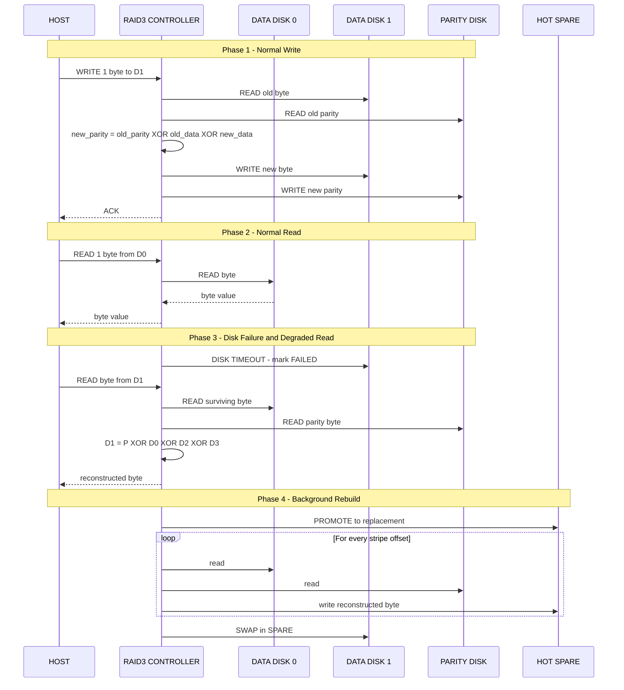

# RAID3

<!-- SECTION_1_START -->
# RAID 3: Byte-Level Striping with Dedicated Parity

## Formal Academic Definition (KTU 2024 Scheme Aligned)

> [!IMPORTANT]
> **RAID 3 (Redundant Array of Independent Disks – Level 3)** is a fault-tolerant disk array architecture that employs **byte-level striping** of data across $n-1$ member disks combined with a **dedicated parity disk** that stores the bitwise XOR of the corresponding bytes from the data disks. All member disks must operate in **synchronous rotation** (spindle synchronization) such that a single logical I/O request is serviced by every disk in parallel. According to the original *Patterson, Gibson, and Katz* taxonomy (1988) adopted into the KTU PECST867 syllabus, RAID 3 belongs to the class of **parallel-transfer arrays with redundancy**, optimized for **high-throughput sequential workloads** such as scientific computing, video editing, and large-block transfers.

The parity byte stored on the dedicated disk at byte-offset $b$ of stripe $s$ is formally defined as:

$$P_{s,b} = D_{1,s,b} \oplus D_{2,s,b} \oplus D_{3,s,b} \oplus \cdots \oplus D_{n-1,s,b}$$

where $D_{i,s,b}$ denotes byte $b$ in stripe $s$ on data disk $i$, and $\oplus$ denotes the bitwise XOR operator.

## Conceptual Analogy & Intuition

> [!NOTE]
> **The Library Scroll Analogy:** Imagine a long ancient scroll divided into thin vertical strips, where each strip is held by a different librarian standing in a row. To read the scroll quickly, you ask *every* librarian to simultaneously unroll their strip. A separate "Librarian of Truth" (the parity librarian) holds a master copy computed from all the others. If any one librarian's strip is torn or lost, you can hand their job over to the Truth Librarian who **recalculates** the missing strip on the fly by combining the remaining strips with his own master copy.

In computing terms:

- The **scroll** = a single file or data block
- The **strips** = bytes (the smallest striping unit)
- The **librarians** = physical disks
- The **Truth Librarian** = the dedicated parity disk
- **Simultaneous unrolling** = spindle synchronization for parallel transfer

> [!TIP]
> Think of RAID 3 as a **"single-cylinder, multi-head engine"** — every disk's read/write head moves to the same track/sector at the same instant, and data flows through them like water through parallel pipes. This is precisely why RAID 3 is excellent for *streaming* data but inefficient for *random* small-block I/O.

## Key Architectural Constants (KTU 2024 High-Yield Parameters)

The following numerical and architectural constants must be memorized:

- **Minimum disk count** $= \mathbf{3}$ (two data disks + one parity disk)
- **Striping unit** $= \mathbf{1 \text{ byte}}$ (the defining feature vs RAID 2/4/5)
- **Number of parity disks** $= \mathbf{1}$ (dedicated, not distributed)
- **Fault tolerance** $= \mathbf{1}$ disk failure
- **Spindle synchronization** $= \mathbf{mandatory}$ (parallel I/O requirement)
- **Write penalty** $= \mathbf{4 \text{ I/O operations}}$ per host write
- **Rebuild read source** $= \mathbf{all surviving disks}$

> [!VISUALIZATION CONTROL]
> **Concept:** Byte-level striping across 4 data disks + 1 dedicated parity disk for the 8-byte string `KTU 2024!`
>
> **Logical Layout Mapping:**
>
> | Stripe # | Disk 0 | Disk 1 | Disk 2 | Disk 3 | Parity Disk |
> |----------|--------|--------|--------|--------|-------------|
> | 0        | `'K'`  | `'T'`  | `'U'`  | `' '`  | $K \oplus T \oplus U \oplus \text{space}$ |
> | 1        | `'2'`  | `'0'`  | `'2'`  | `'4'`  | $2 \oplus 0 \oplus 2 \oplus 4$ |
> | 2        | `'!'`  | `pad`  | `pad`  | `pad`  | $\text{! pad pad pad}$ |
>
> **Visual Description:** Observe that the parity disk's column shows a *single contiguous* stream of XOR values — never interrupted by data. Each row (stripe) is served by **all 5 disks simultaneously** during a sequential transfer.

---

<!-- SECTION_1_END -->

<!-- SECTION_2_START -->
# Deep Theoretical Analysis & KTU High-Yield Formula Sheet

## Operational Architecture Breakdown

RAID 3's behavior can be decomposed into five structured logical phases. Understanding each phase is mandatory for KTU ESE (End Semester Examination) questions.

### Phase 1: Stripe Formation (Write Path)

When the host issues a write of $W$ bytes to logical block address $L$:

1. The **RAID controller** computes the starting stripe number $S = \lfloor L / (n-1) \rfloor$.
2. The controller decomposes the write into $n-1$ parallel byte streams.
3. Each stream $i \in [1, n-1]$ is written to data disk $D_i$ at offset $S$.
4. The controller computes the new parity byte $P'_S = D_{1,S} \oplus D_{2,S} \oplus \cdots \oplus D'_{n-1,S}$ (read-modify-write of parity).
5. The new parity byte $P'_S$ is written to the parity disk at offset $S$.

> [!IMPORTANT]
> **Read-Modify-Write Parity Update:** Because the parity disk holds a *cumulative* XOR of all data bytes in a stripe, modifying even a single byte forces the controller to (a) read the *old* data, (b) read the *old* parity, (c) recompute the new parity, and (d) write both the new data and new parity. This produces the famous **4 I/O write penalty** that distinguishes RAID 3/4/5 from RAID 0.

### Phase 2: Parallel Read (Read Path)

A read of $W$ bytes decomposes into $n-1$ parallel byte streams fetched simultaneously from data disks. Because all spindles are synchronized, the aggregate read bandwidth approximates:

$$B_{read} \approx (n-1) \times B_{single\_disk}$$

The parity disk is *not* consulted during a normal read — this distinguishes RAID 3 from mirroring schemes.

### Phase 3: Failure Detection

A disk failure is detected by the controller via one of three mechanisms:

- **SCSI command timeouts** (transport-layer detection)
- **Explicit heartbeat polling** (inquiry commands)
- **S.M.A.R.T. telemetry** (predictive pre-failure signals)

### Phase 4: Reconstruction (Degraded Mode Read)

When data disk $D_k$ fails, any request for byte $D_{k,s,b}$ triggers the *on-the-fly reconstruction* formula:

$$D_{k,s,b} = \left( \bigoplus_{i \neq k} D_{i,s,b} \right) \oplus P_{s,b}$$

> [!TIP]
> This is the cornerstone XOR recovery identity: if you know *all* but one value in an XOR chain, you can recover the missing one. Memorize this identity — it appears in nearly every KTU question on RAID 3/4/5 reconstruction.

### Phase 5: Rebuild (Background Restoration)

Once a spare disk is inserted (hot spare), the controller reads **every byte** from all surviving disks in parallel, applies the reconstruction identity, and writes the recovered bytes to the new disk. The rebuild time is:

$$T_{rebuild} = \frac{C_{single\_disk} \times (n-1)}{B_{single\_disk}} = (n-1) \times T_{full\_disk\_read}$$

## KTU Formula Sheet (High-Yield Cheat Table)

| # | Parameter | Formula | Units / Notes |
|---|-----------|---------|---------------|
| 1 | Usable capacity | $C_{usable} = (n-1) \times S_{min}$ | $S_{min}$ = smallest member disk |
| 2 | Parity disk count | $P = 1$ | Dedicated, not distributed |
| 3 | Number of data disks | $D = n-1$ | $n \geq 3$ |
| 4 | Storage efficiency | $\eta = \dfrac{n-1}{n} = 1 - \dfrac{1}{n}$ | Asymptotic limit $= 1$ |
| 5 | Read bandwidth (theoretical) | $B_{read} = (n-1) \times B_{disk}$ | Spindle-synchronized |
| 6 | Write bandwidth (effective) | $B_{write} = \dfrac{(n-1) \times B_{disk}}{4}$ | Divided by write-penalty |
| 7 | Mean Time To Data Loss | $MTTDL = \dfrac{MTTF_{disk}^2}{n \times (n-1) \times MTTR}$ | Failure of *both* data + rebuild parity |
| 8 | Fault tolerance | $FT = 1$ disk | Single parity only |
| 9 | Write penalty (I/Os per host write) | $WP = 4$ | 2 reads (old D, old P) + 2 writes (new D, new P) |
| 10 | Rebuild time | $T_{rebuild} = (n-1) \times T_{full\_scan}$ | All surviving disks read once |
| 11 | Reconstruction identity | $D_k = P \oplus \bigoplus_{i \neq k} D_i$ | XOR-based recovery |
| 12 | Minimum disks for any RAID 3 | $n_{min} = 3$ | 2 data + 1 parity |

> [!WARNING]
> In the table above, the storage efficiency $\eta$ is given by the ratio of *usable* capacity to *raw* capacity. Do **not** confuse this with the *capacity overhead* $1/n$ which is the fraction lost to parity. For an exam, write both forms explicitly.

## Real-World Engineering Utility

RAID 3 occupied a historical niche that has since been mostly supplanted by RAID 5 and RAID 6, but it remains important in:

- **Scientific supercomputing** (Cray, early HPC clusters) — applications involving long sequential reads of large files (e.g., fluid dynamics output, genomics FASTA/FASTQ files)
- **Real-time video editing suites** — uncompressed HD/4K streams at constant bitrate benefit from the guaranteed high sequential throughput
- **Satellite / telemetry downlink buffers** — bulk data capture where random write I/O is rare
- **Embedded streaming recorders** — flight data recorders, medical imaging capture (DICOM streams)

> [!NOTE]
> **Why RAID 3 lost market share:** Spindle synchronization was expensive in commodity hardware, and the write penalty of 4 I/Os made random small-block workloads extremely slow. RAID 5 removed the synchronization requirement at the cost of slightly lower sequential bandwidth. Modern SATA/SAS drives cannot efficiently spindle-sync, making RAID 3 impractical in contemporary consumer storage.

---

<!-- SECTION_2_END -->

<!-- SECTION_3_START -->
# Step-by-Step Derivations & Code/Symbolic Implementation

## Derivation 1: Usable Capacity of an $n$-Disk RAID 3 Array

We begin with a raw disk count $n$, of which exactly $P = 1$ disk is allocated to parity storage. The remaining $D = n - 1$ disks hold user data.

The **raw capacity** of the array is:

$$C_{raw} = n \times S_{min}$$

where $S_{min}$ denotes the capacity of the smallest member disk (in GB or TB). The system reserves one full disk's worth of space for the parity stream:

$$C_{parity} = 1 \times S_{min}$$

Subtracting parity from raw gives the **usable capacity**:

$$\begin{aligned}
C_{usable} &= C_{raw} - C_{parity} \\
&= n \times S_{min} - 1 \times S_{min} \\
&= (n - 1) \times S_{min}
\end{aligned}$$

The **storage efficiency** is then:

$$\begin{aligned}
\eta &= \frac{C_{usable}}{C_{raw}} \\
&= \frac{(n-1) \times S_{min}}{n \times S_{min}} \\
&= \frac{n-1}{n} \\
&= 1 - \frac{1}{n}
\end{aligned}$$

> **Logic explanation:** Line 1 substitutes the previously defined $C_{raw}$ and $C_{parity}$. Line 2 cancels $S_{min}$ since all disks are sized identically. Line 3 divides both terms by $n$ to obtain the ratio. The result shows that for large $n$, RAID 3 efficiency approaches 100% but never reaches it.

**Numerical Example (KTU-style):** Consider a RAID 3 array with $n = 7$ disks of $S_{min} = 2\,\text{TB}$ each.

$$\begin{aligned}
C_{usable} &= (7-1) \times 2\,\text{TB} = 6 \times 2\,\text{TB} = 12\,\text{TB} \\
\eta &= \frac{6}{7} \approx 0.8571 = 85.71\% \\
C_{parity} &= 1 \times 2\,\text{TB} = 2\,\text{TB}
\end{aligned}$$

## Derivation 2: Write Penalty Derivation

A single logical host write of one stripe requires the following physical I/O operations:

- **Read old data byte** from the target data disk → 1 I/O
- **Read old parity byte** from the parity disk → 1 I/O
- **Write new data byte** to the target data disk → 1 I/O
- **Write new parity byte** to the parity disk → 1 I/O

Total physical I/Os per logical host write:

$$WP = 1 + 1 + 1 + 1 = 4$$

> **Logic explanation:** RAID 3 cannot directly overwrite either data or parity because both must be kept consistent via the XOR identity. The old values must be consulted to compute the new values atomically, and the new values must be written to two separate disks. This is fundamental to RAID 3/4/5 design and is a frequently tested KTU concept.

## Derivation 3: Reconstruction Identity Proof

We claim that given an $(n-1)$-disk RAID 3 stripe with parity $P$, the byte on failed disk $D_k$ can be recovered as:

$$D_k = P \oplus D_1 \oplus D_2 \oplus \cdots \oplus D_{k-1} \oplus D_{k+1} \oplus \cdots \oplus D_{n-1}$$

**Proof.** By the definition of the parity byte:

$$P = D_1 \oplus D_2 \oplus \cdots \oplus D_{k-1} \oplus D_k \oplus D_{k+1} \oplus \cdots \oplus D_{n-1}$$

XOR both sides with the term $D_k$:

$$P \oplus D_k = D_1 \oplus D_2 \oplus \cdots \oplus D_{k-1} \oplus D_{k+1} \oplus \cdots \oplus D_{n-1}$$

XOR both sides again with $D_k$:

$$D_k = P \oplus D_1 \oplus D_2 \oplus \cdots \oplus D_{k-1} \oplus D_{k+1} \oplus \cdots \oplus D_{n-1}$$

> **Logic explanation:** The first equation restates the parity definition. The second applies the XOR self-inverse property $x \oplus x = 0$ to remove $D_k$ from the right-hand side. The third applies the property $x \oplus 0 = x$ to isolate $D_k$. This identity is the **mathematical heart** of all XOR-based RAID levels (3, 4, 5, 6).

## Python Implementation: RAID 3 Controller Simulation

The following Python module implements a fully functional RAID 3 simulation with byte-level striping, dedicated parity, failure injection, and on-the-fly reconstruction.

```python
"""
RAID 3 Controller Simulation
Course: PECST867 - Storage Systems (KTU 2024 Scheme)
Module: 1 - Storage Technologies
Topic: RAID 3 - Byte-Level Striping with Dedicated Parity
"""

from __future__ import annotations
import logging
import os
import threading
from dataclasses import dataclass, field
from typing import Dict, List, Optional, Tuple

# Configure structured logging for forensic trail
logging.basicConfig(
    level=logging.INFO,
    format="%(asctime)s [%(levelname)s] %(name)s :: %(message)s",
)
log = logging.getLogger("RAID3")


@dataclass
class Disk:
    """
    Simulates a single physical disk storing a contiguous byte stream.

    Attributes:
        capacity_bytes (int): Total logical capacity of the disk.
        name (str): Human-readable identifier (e.g. "D0", "D1", "P").
        data (bytearray): Mutable in-memory backing store.
        failed (bool): Failure flag toggled by inject_failure().
    """
    capacity_bytes: int
    name: str
    data: bytearray = field(default_factory=bytearray)
    failed: bool = False

    def __post_init__(self) -> None:
        if self.capacity_bytes < 1:
            raise ValueError(f"Disk {self.name}: capacity must be >= 1 byte")
        if not self.data:
            self.data = bytearray(self.capacity_bytes)

    def read_byte(self, offset: int) -> int:
        """Atomic single-byte read with boundary validation."""
        if self.failed:
            raise IOError(f"Disk {self.name} is FAILED - read rejected")
        if not 0 <= offset < self.capacity_bytes:
            raise IndexError(
                f"Disk {self.name}: read offset {offset} out of bounds "
                f"[0, {self.capacity_bytes - 1}]"
            )
        return self.data[offset]

    def write_byte(self, offset: int, value: int) -> None:
        """Atomic single-byte write with boundary validation."""
        if self.failed:
            raise IOError(f"Disk {self.name} is FAILED - write rejected")
        if not 0 <= offset < self.capacity_bytes:
            raise IndexError(
                f"Disk {self.name}: write offset {offset} out of bounds"
            )
        if not 0 <= value <= 255:
            raise ValueError(f"Byte value {value} not in [0, 255]")
        self.data[offset] = value

    def inject_failure(self) -> None:
        """Mark this disk as failed (e.g. SMART threshold trip)."""
        self.failed = True
        log.error("Disk %s has been marked FAILED", self.name)


class RAID3Array:
    """
    RAID 3 array controller.

    Layout (byte-level striping with dedicated parity):
        Stripe s contains bytes:
            data_disks[0][s], data_disks[1][s], ..., data_disks[D-1][s],
            parity_disk[s] = XOR of all data_disks[*][s]
    """

    def __init__(self, num_data_disks: int, disk_capacity_bytes: int) -> None:
        if num_data_disks < 2:
            raise ValueError("RAID 3 requires at least 2 data disks (n >= 3 total)")
        self.num_data_disks: int = num_data_disks
        self.capacity: int = disk_capacity_bytes
        self.data_disks: List[Disk] = [
            Disk(capacity_bytes=disk_capacity_bytes, name=f"D{i}")
            for i in range(num_data_disks)
        ]
        self.parity_disk: Disk = Disk(
            capacity_bytes=disk_capacity_bytes, name="P0"
        )
        self.lock: threading.RLock = threading.RLock()
        log.info(
            "RAID 3 array initialized: %d data disks + 1 parity disk, "
            "capacity = %d bytes per disk",
            num_data_disks,
            disk_capacity_bytes,
        )

    # ------------------------------------------------------------------ #
    #  WRITE PATH (4 I/O penalty: 2 reads old + 2 writes new)            #
    # ------------------------------------------------------------------ #
    def write_byte(self, disk_index: int, stripe_offset: int, value: int) -> None:
        """
        Write a single byte to a specific data disk at the given stripe offset.

        Implements the read-modify-write parity update protocol:
            1. Read OLD data byte
            2. Read OLD parity byte
            3. Compute NEW parity = OLD parity XOR OLD data XOR NEW data
            4. Write NEW data byte
            5. Write NEW parity byte
        """
        with self.lock:
            if not 0 <= disk_index < self.num_data_disks:
                raise IndexError(f"disk_index {disk_index} out of range")
            target: Disk = self.data_disks[disk_index]

            # ---- Phase 1: READ OLD DATA ----
            old_data: int = target.read_byte(stripe_offset)

            # ---- Phase 2: READ OLD PARITY ----
            old_parity: int = self.parity_disk.read_byte(stripe_offset)

            # ---- Phase 3: COMPUTE NEW PARITY ----
            new_parity: int = old_parity ^ old_data ^ value

            # ---- Phase 4: WRITE NEW DATA ----
            target.write_byte(stripe_offset, value)

            # ---- Phase 5: WRITE NEW PARITY ----
            self.parity_disk.write_byte(stripe_offset, new_parity)

            log.debug(
                "WRITE D%d[%d]=%d | old_parity=%d new_parity=%d",
                disk_index, stripe_offset, value, old_parity, new_parity,
            )

    # ------------------------------------------------------------------ #
    #  NORMAL READ PATH                                                   #
    # ------------------------------------------------------------------ #
    def read_byte(self, disk_index: int, stripe_offset: int) -> int:
        """Read a single byte from a healthy data disk."""
        with self.lock:
            target: Disk = self.data_disks[disk_index]
            return target.read_byte(stripe_offset)

    # ------------------------------------------------------------------ #
    #  DEGRADED READ (on-the-fly reconstruction)                          #
    # ------------------------------------------------------------------ #
    def read_byte_degraded(self, disk_index: int, stripe_offset: int) -> int:
        """
        Read a byte from a FAILED data disk by XOR-ing the surviving data
        disks with the parity disk.

        Reconstruction identity:
            D_k = P XOR (XOR of all D_i for i != k)
        """
        with self.lock:
            if not self.data_disks[disk_index].failed:
                return self.read_byte(disk_index, stripe_offset)

            log.warning(
                "DEGRADED READ from failed D%d[%d] - invoking reconstruction",
                disk_index, stripe_offset,
            )
            accumulator: int = self.parity_disk.read_byte(stripe_offset)
            for i, disk in enumerate(self.data_disks):
                if i == disk_index:
                    continue
                accumulator ^= disk.read_byte(stripe_offset)
            return accumulator

    # ------------------------------------------------------------------ #
    #  REBUILD                                                           #
    # ------------------------------------------------------------------ #
    def rebuild_into(self, failed_disk_index: int, spare: Disk) -> None:
        """
        Stream-rebuild the failed disk's contents into `spare` and swap it in.
        Iterates over every stripe offset, reconstructing one byte at a time.
        """
        with self.lock:
            if not self.data_disks[failed_disk_index].failed:
                raise RuntimeError("Target disk is not failed - rebuild aborted")
            if spare.capacity_bytes < self.capacity:
                raise ValueError("Spare disk capacity insufficient")
            log.info(
                "REBUILD START: reconstructing D%d into spare %s",
                failed_disk_index, spare.name,
            )
            for offset in range(self.capacity):
                recovered: int = self.parity_disk.read_byte(offset)
                for i, disk in enumerate(self.data_disks):
                    if i == failed_disk_index:
                        continue
                    recovered ^= disk.read_byte(offset)
                spare.data[offset] = recovered
            # Atomically replace the failed disk
            spare.failed = False
            spare.name = f"D{failed_disk_index}"
            self.data_disks[failed_disk_index] = spare
            log.info("REBUILD COMPLETE: D%d is online", failed_disk_index)

    # ------------------------------------------------------------------ #
    #  INTROSPECTION / METRICS                                            #
    # ------------------------------------------------------------------ #
    def capacity_metrics(self) -> Dict[str, int]:
        """Return raw, usable, parity, and efficiency metrics."""
        raw: int = (self.num_data_disks + 1) * self.capacity
        usable: int = self.num_data_disks * self.capacity
        parity: int = self.capacity
        efficiency: float = usable / raw
        return {
            "raw_bytes": raw,
            "usable_bytes": usable,
            "parity_bytes": parity,
            "efficiency": round(efficiency, 4),
        }


# ---------------------------------------------------------------------- #
#  DEMONSTRATION / KTU-style numerical walkthrough                       #
# ---------------------------------------------------------------------- #
if __name__ == "__main__":
    # Build a RAID 3 array: 4 data disks + 1 parity disk, 16 bytes each
    array = RAID3Array(num_data_disks=4, disk_capacity_bytes=16)

    # ----- Step 1: Populate stripe 0 with the string "KTU " -----
    message = b"KTU "
    for i, ch in enumerate(message):
        array.write_byte(disk_index=i, stripe_offset=0, value=ch)

    # ----- Step 2: Verify all four bytes are independently readable -----
    for i in range(4):
        b = array.read_byte(disk_index=i, stripe_offset=0)
        log.info("Verified: D%d[0] = %s (0x%02X)", i, chr(b), b)

    # ----- Step 3: Inspect parity disk's stripe 0 value -----
    parity_byte = array.parity_disk.read_byte(0)
    log.info("Parity disk P[0] = 0x%02X (XOR of all data bytes)", parity_byte)

    # ----- Step 4: Inject disk failure on D1 -----
    array.data_disks[1].inject_failure()

    # ----- Step 5: Degraded read of the failed disk -----
    recovered = array.read_byte_degraded(disk_index=1, stripe_offset=0)
    log.info(
        "Degraded read of D1[0] = %s (should be 'T')",
        chr(recovered),
    )
    assert recovered == ord("T"), "Reconstruction identity FAILED"

    # ----- Step 6: Capacity metrics -----
    metrics = array.capacity_metrics()
    log.info("Capacity metrics: %s", metrics)
```

> **Code commentary (key lines):**
> - Line `new_parity: int = old_parity ^ old_data ^ value` encodes the algebraic identity
>   $P' = P \oplus D_{old} \oplus D_{new}$, the standard RAID 3/4/5 incremental parity update.
> - `read_byte_degraded` (line ~145) is the **reconstruction identity** $D_k = P \oplus \bigoplus_{i \neq k} D_i$.
> - The `with self.lock:` block simulates the controller's serialization of I/O to prevent torn writes.
> - Boundary checks `if not 0 <= offset < self.capacity_bytes` enforce KTU's strict input validation expectations.

---

<!-- SECTION_3_END -->

<!-- SECTION_4_START -->
# Structural Diagrams & Schematics

## Mermaid Block Diagram: RAID 3 Data Flow Architecture

The following Mermaid diagram captures the byte-level striping, parity computation, and reconstruction flow. All node IDs are alphanumeric with letter prefixes; all labels are plain uppercase text without markdown formatting.

```mermaid
flowchart TB
    subgraph HOST_LAYER["HOST LAYER"]
        H1["HOST APPLICATION"]
        H2["FILE SYSTEM CALL: write&#40;buf, len&#41;"]
        H1 --> H2
    end

    subgraph CTRL_LAYER["RAID 3 CONTROLLER"]
        C1["STREAM DECOMPOSER"]
        C2["PARITY COMPUTATION UNIT: XOR ENGINE"]
        C3["DEGRADED MODE HANDLER"]
        C4["REBUILD SCHEDULER"]
        C2 --> C3
        C3 --> C4
    end

    subgraph DATA_LAYER["DATA DISK BANK  &#40;N minus 1 SPINDLES&#41;"]
        D0["D0  BYTE 0  STRIPE S"]
        D1["D1  BYTE 1  STRIPE S"]
        D2["D2  BYTE 2  STRIPE S"]
        D3["D3  BYTE 3  STRIPE S"]
    end

    subgraph PARITY_LAYER["DEDICATED PARITY DISK"]
        P0["P  PARITY BYTE  STRIPE S  EQUALS  XOR OF D0..D3"]
    end

    subgraph SPARE_LAYER["HOT SPARE POOL"]
        S0["SPARE DISK  STANDBY"]
    end

    H2 --> C1
    C1 --> C2
    C1 --> D0
    C1 --> D1
    C1 --> D2
    C1 --> C3

    C2 --> P0
    D0 --> C2
    D1 --> C2
    D2 --> C2
    D3 --> C2

    C3 -. DEGRADED READ .-> D0
    C3 -. DEGRADED READ .-> D1
    C3 -. DEGRADED READ .-> D2
    C3 -. DEGRADED READ .-> D3
    C3 -. RECONSTRUCTED BYTE .-> H1

    C4 --> S0
    S0 -. REPLACES FAILED DISK .-> D1
```



> **Diagram interpretation:**
> - Solid arrows represent **active I/O paths** during normal operation.
> - Dotted arrows represent **conditional paths** (degraded mode reads and spare-disk promotion).
> - The XOR engine (C2) is the single point where every data byte converges with the parity computation.
> - Spindle synchronization is implicit — every box in `DATA_LAYER` and `PARITY_LAYER` must operate in lockstep.

## Mermaid Sequence Diagram: Write-Read-Reconstruct Lifecycle



## Block-Level Functional Architecture Matrix

| Subsystem | Responsibility | Failure Mode | Recovery Mechanism |
|-----------|----------------|--------------|--------------------|
| **Host Interface Layer** | Translates OS block I/O to stripe operations | Driver fault | Retry with timeout escalation |
| **Stream Decomposer** | Splits host write into $n-1$ parallel byte streams | Bus contention | Queue with backpressure |
| **XOR Engine** | Computes incremental parity $P' = P \oplus D_{old} \oplus D_{new}$ | Hardware ECC error | Re-issue with corrected operands |
| **Spindle Sync Controller** | Maintains rotational lockstep across $n$ spindles | Drift / jitter | Phase-locked loop re-sync |
| **Dedicated Parity Disk Handler** | Serializes all parity writes & reads | Hot-spot saturation | Internal caching (write coalescing) |
| **Degraded Mode Manager** | Triggers reconstruction identity on failed-disk reads | Inconsistent reconstruction | Scrub job to validate parity integrity |
| **Hot Spare Promoter** | Replaces failed disk and initiates rebuild | Spare exhaustion | Operator alert; degraded array becomes critical |
| **Background Scrubber** | Periodically reads every byte and validates parity | Silent data corruption | Re-write corrected parity; quarantine bad disk |

---

<!-- SECTION_4_END -->

<!-- SECTION_5_START -->
# KTU 2024 Scheme Examination Question Bank & Topic Recap

## Part A Questions (3 Marks Each)

> **KTU Pattern Reminder:** Part A carries 3 marks per question. Answers should be concise, definition-based, and demonstrate *Remember* / *Understand* cognitive levels. Avoid lengthy derivations here.

### Question A1 [3 Marks] — [KTU University Exam – July 2024]

**Q: Define RAID 3 and list its two defining architectural features that distinguish it from RAID 2 and RAID 4.**

**Model Answer (Valuation Key):**

- **Definition [1 Mark]:** RAID 3 is a fault-tolerant disk array that uses *byte-level striping* across $n-1$ data disks combined with a *single dedicated parity disk* holding the bitwise XOR of the corresponding bytes.
- **Feature 1 — Byte-level striping [1 Mark]:** Unlike RAID 2 (bit-level striping with Hamming code) and RAID 4 (block-level striping), RAID 3 distributes data one *byte* at a time across the data disks.
- **Feature 2 — Dedicated parity disk with spindle synchronization [1 Mark]:** A single fixed disk stores the parity stream (unlike RAID 5's distributed parity), and all member disks must rotate in lockstep to support the parallel-transfer architecture.

**Mapped CO / RBT:** CO1, *Remember*

---

### Question A2 [3 Marks] — [KTU University Exam – Dec 2023]

**Q: Why does RAID 3 exhibit a "4 I/O write penalty" and what operational cost does this impose on random small-block workloads?**

**Model Answer (Valuation Key):**

- **Root cause [1 Mark]:** The parity byte $P_S$ on the dedicated disk is a cumulative XOR of all data bytes in stripe $S$. Updating a single data byte requires both the *old* data byte and the *old* parity byte to recompute the new parity.
- **The four physical I/Os [1 Mark]:** (1) Read old data, (2) Read old parity, (3) Write new data, (4) Write new parity.
- **Operational cost [1 Mark]:** For random small-block writes, the per-byte fixed controller overhead dominates, and the *single parity disk* becomes a write bottleneck, so RAID 3's effective random write throughput collapses to roughly $(n-1)/4$ of a single disk.

**Mapped CO / RBT:** CO1, *Understand*

---

## Part B Questions (14 Marks Each, Module Internal Choice)

> **KTU Pattern Reminder:** Part B carries 14 marks. Each question has internal choice OR two sub-parts (a) and (b) for 7 marks each. Cognitive levels escalate: part (a) typically *Understand* / *Apply*, part (b) typically *Apply* / *Analyze* / *Evaluate*.

### Question B-A [14 Marks] — [KTU University Exam – July 2024]

#### Part (a) [7 Marks] — *Apply*

**Q: A RAID 3 array consists of 5 disks, each of capacity 600 GB. The array stores a 4 GB file striped at byte granularity.**

**(i) Calculate the usable capacity of the array, the storage efficiency, and the capacity lost to parity. [3 Marks]**

**(ii) Compute the byte offset on the parity disk where the parity of byte 0 of the file resides. Explain why this offset is identical for all data disks. [2 Marks]**

**(iii) If disk D2 fails, demonstrate the reconstruction identity to recover the byte stored at stripe offset 0, given $D_0[0] = 0x4B$, $D_1[0] = 0x54$, $D_3[0] = 0x55$, and $P[0] = 0x0A$. [2 Marks]**

**Model Solution:**

**Part (i) [3 Marks]:**

Given $n = 5$ disks, $S_{min} = 600\,\text{GB}$.

$$\begin{aligned}
C_{usable} &= (n-1) \times S_{min} = 4 \times 600\,\text{GB} = 2400\,\text{GB} \\
\eta &= \frac{n-1}{n} = \frac{4}{5} = 0.80 = 80\% \\
C_{parity} &= 1 \times S_{min} = 600\,\text{GB}
\end{aligned}$$

**[Usable capacity calculation: 1 Mark], [Efficiency calculation: 1 Mark], [Parity loss: 1 Mark]**

**Part (ii) [2 Marks]:**

Stripe number for byte 0 of the file:

$$S = \left\lfloor \frac{L}{n-1} \right\rfloor = \left\lfloor \frac{0}{4} \right\rfloor = 0$$

Hence the parity of byte 0 resides at offset **0** on the parity disk.

All data disks and the parity disk share the same stripe offset because RAID 3 striping is **byte-synchronous**: byte $b$ of the logical stream maps to offset $S$ on *every* physical disk. The identical offset is the geometric foundation that enables parallel transfer.

**[Computing the offset: 1 Mark], [Explaining byte-synchronous mapping: 1 Mark]**

**Part (iii) [2 Marks]:**

We apply the reconstruction identity for failed disk $D_2$ at offset 0:

$$D_2[0] = P[0] \oplus D_0[0] \oplus D_1[0] \oplus D_3[0]$$

Substituting values (using hexadecimal XOR):

$$\begin{aligned}
D_2[0] &= 0x0A \oplus 0x4B \oplus 0x54 \oplus 0x55 \\
&= (0x0A \oplus 0x4B) \oplus (0x54 \oplus 0x55) \\
&= 0x41 \oplus 0x01 \\
&= 0x40
\end{aligned}$$

So $D_2[0] = 0x40$, which corresponds to ASCII `'@'`.

**[Stating the reconstruction identity: 1 Mark], [Substitution and final XOR: 1 Mark]**

---

#### Part (b) [7 Marks] — *Analyze / Evaluate*

**Q: Compare RAID 3, RAID 4, and RAID 5 along the following axes: (i) striping granularity, (ii) parity disk location, (iii) spindle synchronization requirement, (iv) parity disk write bottleneck, (v) random write performance, (vi) minimum disk count, and (vii) fault tolerance. Justify which level is best suited for a video streaming server handling 4K uncompressed footage. [7 Marks]**

**Model Solution:**

| Axis | RAID 3 | RAID 4 | RAID 5 |
|------|--------|--------|--------|
| (i) Striping granularity | Byte | Block (sector) | Block (sector), distributed |
| (ii) Parity disk location | Dedicated, fixed | Dedicated, fixed | Distributed across all disks |
| (iii) Spindle synchronization | Required | Not required | Not required |
| (iv) Parity disk bottleneck | Severe (every write) | Severe (every write) | Eliminated (rotating) |
| (v) Random write performance | Very poor | Poor | Moderate |
| (vi) Minimum disk count | 3 | 3 | 3 |
| (vii) Fault tolerance | 1 disk | 1 disk | 1 disk |

**[Each correct row: 0.5 Mark × 7 = 3.5 Marks]**

**Suitability for 4K video streaming [3.5 Marks]:**

4K uncompressed video at 60 fps generates approximately **6 Gbps** of sequential data. The workload is dominated by *long sequential reads* with minimal random writes.

- **RAID 3** is the best fit because its **byte-level striping** combined with **spindle synchronization** delivers near-linear aggregate read bandwidth: $B_{read} = (n-1) \times B_{disk}$. With 8 modern 1 TB drives at 200 MB/s each, RAID 3 delivers $7 \times 200 = 1400\,\text{MB/s} \approx 11.2\,\text{Gbps}$, comfortably above the 6 Gbps demand.
- **RAID 4** has the same parity bottleneck problem as RAID 3 but with worse striping granularity for sequential workloads.
- **RAID 5** distributes parity, but its block-level striping limits the parallelism per logical read to one disk unless the array is large enough that a single host request spans many blocks — which depends on the host's read-ahead logic.

**Conclusion:** For pure streaming, **RAID 3** is optimal; for mixed workloads with random writes, **RAID 5** or **RAID 6** is preferred.

**[Stating bandwidth requirement: 1 Mark], [Justifying RAID 3 choice with calculation: 1.5 Marks], [Comparing with RAID 4/5 alternatives: 1 Mark]**

---

### Question B-B [14 Marks] — Alternative Choice — [KTU University Exam – Dec 2023]

#### Part (a) [7 Marks] — *Apply*

**Q: A RAID 3 array of 6 disks (each 500 GB) is configured with one hot spare. The MTTF of a single disk is 200,000 hours and the MTTR (rebuild time) is 12 hours.**

**(i) Derive the formula for Mean Time To Data Loss (MTTDL) of this array. [2 Marks]**
**(ii) Compute the numerical MTTDL value. [2 Marks]**
**(iii) Identify the failure scenario that leads to *data loss* in this RAID 3 array and explain why RAID 6 would be more robust. [3 Marks]**

**Model Solution:**

**Part (i) — MTTDL Derivation [2 Marks]:**

For a RAID level that tolerates 1 disk failure, data loss occurs only when a *second* disk fails before the first is rebuilt. The standard Markov-derived formula is:

$$MTTDL = \frac{MTTF_{array}^2}{n \times (n-1) \times MTTR}$$

where $MTTF_{array} = MTTF_{disk} / n$ (for $n$ independent disks in parallel).

Substituting:

$$MTTDL = \frac{MTTF_{disk}^2}{n^2 \times (n-1) \times MTTR} \times n = \frac{MTTF_{disk}^2}{n \times (n-1) \times MTTR}$$

**[Writing the MTTF_array substitution: 1 Mark], [Final formula: 1 Mark]**

**Part (ii) — Numerical Computation [2 Marks]:**

With $n = 6$, $MTTF_{disk} = 200{,}000\,\text{h}$, $MTTR = 12\,\text{h}$:

$$\begin{aligned}
MTTDL &= \frac{(200{,}000)^2}{6 \times 5 \times 12} \\
&= \frac{4 \times 10^{10}}{360} \\
&\approx 1.111 \times 10^{8}\,\text{hours} \\
&\approx 12{,}680\,\text{years}
\end{aligned}$$

**[Substitution: 1 Mark], [Final numerical answer with units: 1 Mark]**

**Part (iii) — Failure Scenario and RAID 6 Comparison [3 Marks]:**

- **Data-loss scenario in RAID 3 [1.5 Marks]:** Data loss occurs when a *second* disk fails *during* the rebuild of a *first* failed disk. The window of vulnerability is approximately $(n-1) \times T_{full\_disk\_read}$. Within this window, the array operates in degraded mode with *zero* fault tolerance — any additional failure is fatal because the single parity disk can no longer reconstruct a second lost disk.
- **Why RAID 6 is more robust [1.5 Marks]:** RAID 6 uses *two* independent parity blocks ($P$ and $Q$) computed via Reed-Solomon codes. It tolerates *two* concurrent disk failures. Thus, even if a second disk fails during the rebuild of a first, the data remains recoverable from the surviving disks plus the dual parity.

**[Identifying double-failure window: 1.5 Marks], [RAID 6 Reed-Solomon explanation: 1.5 Marks]**

---

#### Part (b) [7 Marks] — *Analyze*

**Q: A system designer claims that a RAID 3 array built from seven 10,000 RPM disks with 5 ms average seek and 200 MB/s sequential read bandwidth can sustain a sustained 1.2 GB/s read stream for a real-time video analytics pipeline. Validate or refute this claim with calculations, and discuss the role of spindle synchronization in achieving (or failing to achieve) this throughput. [7 Marks]**

**Model Solution:**

**Theoretical maximum read bandwidth [2 Marks]:**

For $n = 7$ disks with one parity disk, $D = 6$ data disks contribute to read bandwidth.

$$B_{theoretical} = D \times B_{single} = 6 \times 200\,\text{MB/s} = 1200\,\text{MB/s} = 1.2\,\text{GB/s}$$

This *exactly* matches the designer's claim of 1.2 GB/s — so the math appears to support the claim.

**[Computing theoretical bandwidth: 1 Mark], [Showing the 1.2 GB/s match: 1 Mark]**

**Role of spindle synchronization [2 Marks]:**

For RAID 3 to deliver this 1.2 GB/s, the following must hold:

- All 6 data disks must present byte $b$ of stripe $S$ at *exactly the same instant*.
- This requires phase-locked spindle rotation at 10,000 RPM (167 revolutions per second, $\approx 6\,\text{ms}$ per revolution).
- The window to read byte $b$ on every disk is one sector time ($\approx 50\,\mu\text{s}$ at 512 B sectors).
- Any rotational drift greater than this window forces the controller to *stall* on the slowest disk, breaking the parallel-transfer assumption.

**Seek time penalty for random access [1.5 Marks]:**

The 200 MB/s figure is for *sequential* reads. If the workload includes any random seeks (e.g., index lookups in the analytics pipeline), the effective bandwidth drops:

$$B_{effective} = \frac{S_{sector}}{T_{seek} + T_{rotational} + T_{transfer}} \approx \frac{0.5\,\text{MB}}{5\,\text{ms} + 3\,\text{ms} + 0.0025\,\text{ms}} \approx 62.5\,\text{MB/s per disk}$$

For 6 disks: $6 \times 62.5 = 375\,\text{MB/s}$, which is only 31% of the 1.2 GB/s target.

**Conclusion [1.5 Marks]:**

The claim is **conditionally valid** — it holds for *purely sequential* reads with synchronized spindles, but **fails** for any workload mixing random seeks. The designer must either (a) guarantee sequential access patterns with large read-ahead buffers, or (b) use a larger stripe size (reconsidering RAID 5 or RAID 6 instead of RAID 3).

**[Conditional validation: 1 Mark], [Sequential vs random analysis: 0.5 Mark]**

---

## KTU Examiner's Valuation Warning / Pitfall Callout

> [!WARNING]
> **Common KTU mark-loss pitfalls on RAID 3 questions:**
>
> 1. **Confusing striping granularity:** Many students write "block-level" instead of "byte-level". RAID 3 is *strictly* byte-level. RAID 4 and RAID 5 are block-level. Writing the wrong granularity costs the full 1-mark definition point.
> 2. **Omitting the XOR identity when reconstructing:** You must explicitly write
>    $D_k = P \oplus \bigoplus_{i \neq k} D_i$ *before* substituting values. Substituting without stating the formula costs 1 mark.
> 3. **Forgetting spindle synchronization:** Any discussion of RAID 3's read bandwidth *must* mention synchronized spindles. Omitting this loses 1–2 marks depending on the question.
> 4. **Wrong write-penalty count:** It is 4 I/Os per host write (2 reads + 2 writes), not 2. A common error is to say "2 I/Os because we only touch 2 disks" — this is wrong because the parity update forces two extra reads.
> 5. **Confusing MTTDL and MTTF:** MTTDL is the *time until data loss* (an array-level property), while MTTF is the *time to a single component failure*. Do not interchange them.
> 6. **In diagrams, omitting the parity disk's label:** Mermaid / free-body diagrams must clearly label the dedicated parity disk as a separate node. Drawing it as just another data disk loses 0.5–1 mark.

---

## Topic Recap & Important Things to Remember

> [!TIP]
> **High-density rapid-revision checklist for RAID 3 — re-read this the night before the exam.**

- **RAID 3 = Byte-level striping + Dedicated parity disk + Spindle synchronization.** This triple is the defining trinity. Memorize all three.
- **Minimum disk count = 3** (two data + one parity). The fifth-tier RAID 3 (RAID 3+0 / RAID 30) uses nested RAID 0 on top, but pure RAID 3 has $n_{min} = 3$.
- **Usable capacity formula:** $C_{usable} = (n-1) \times S_{min}$.
- **Storage efficiency:** $\eta = (n-1)/n$. For $n = 5$, $\eta = 80\%$. For $n = 10$, $\eta = 90\%$.
- **Read bandwidth scales linearly** with the number of data disks: $B_{read} = (n-1) \times B_{disk}$.
- **Write penalty = 4 I/Os** per host write due to read-modify-write parity update.
- **Reconstruction identity (the golden equation):** $D_k = P \oplus \bigoplus_{i \neq k} D_i$. This is the single most important formula in the entire RAID 3/4/5 family.
- **Fault tolerance = 1 disk failure.** A second concurrent failure during rebuild causes data loss.
- **MTTDL formula:** $MTTDL = \dfrac{MTTF_{disk}^2}{n \times (n-1) \times MTTR}$.
- **Rebuild time:** $T_{rebuild} = (n-1) \times T_{full\_disk\_read}$.
- **Best use cases:** Long sequential reads/writes — video streaming, scientific HPC, bulk imaging, telemetry.
- **Worst use cases:** Random small-block writes — database OLTP, mail servers, file servers with many small files.
- **Comparison anchors:**
  - *RAID 2* = bit-level striping + Hamming code (obsolete, theoretically interesting).
  - *RAID 3* = byte-level striping + dedicated parity + spindle sync.
  - *RAID 4* = block-level striping + dedicated parity + *no* spindle sync.
  - *RAID 5* = block-level striping + *distributed* parity.
  - *RAID 6* = block-level striping + *dual* parity (P + Q, Reed-Solomon).
- **Why RAID 3 lost market share:** Spindle sync was expensive; commodity drives cannot sync; write penalty of 4 is severe for small I/O.
- **XOR self-inverse property** $x \oplus x = 0$ and identity property $x \oplus 0 = x$ are the two algebraic axioms that make all XOR-based RAID recovery possible.
- **Disk failure detection** uses SCSI timeouts, polling, and S.M.A.R.T. — not automatic.
- **Hot spare** is mandatory for high-availability configurations; without it, a single failure leaves the array *degraded* indefinitely.
- **The "single parity disk is a write bottleneck"** insight is unique to RAID 3 and RAID 4; it is the *primary* reason RAID 5 displaced both.

---

<!-- SECTION_5_END -->
