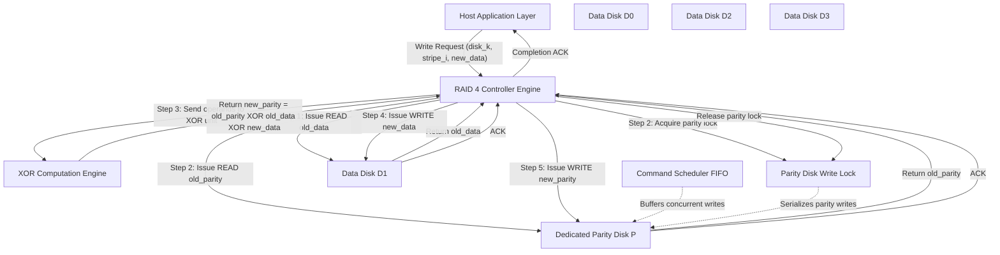
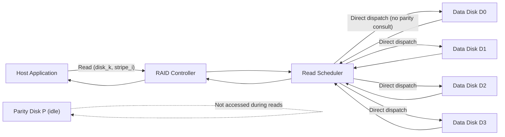
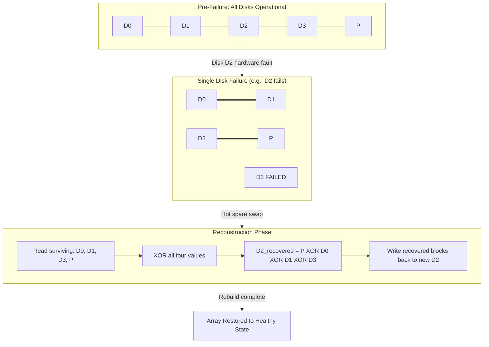
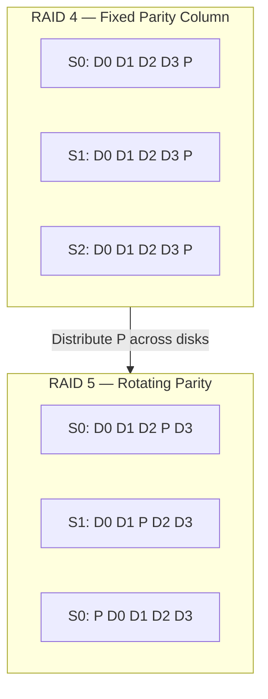

# RAID4

<!-- SECTION_1_START -->
# RAID 4 — Dedicated Parity Architecture

## 1.1 Formal Definition (KTU 2024 Scheme Terminology)

> [!NOTE]
> **RAID 4 (Redundant Array of Independent Disks, Level 4)** is a disk array architecture that employs **block-level striping** of data across $N$ independent physical disks, while dedicating **one entire physical disk** to the storage of a **parity block** computed as the bitwise XOR of the corresponding data blocks on the remaining $N-1$ disks.

In the KTU 2024 syllabus for **PECST867 — Storage Systems**, RAID 4 is positioned as the *transitional architecture* between the **mirroring approach of RAID 1** and the **distributed parity model of RAID 5**. It is classified under the category of **Single-Error-Correcting Redundant Arrays** with one fault-tolerant disk.

> [!IMPORTANT]
> **Key Distinguishing Property:** All parity information in RAID 4 is concentrated on a **single, fixed, dedicated parity disk** (often denoted $P$). The data disks $D_0, D_1, \dots, D_{N-2}$ carry user payload only. This is the *defining* and *limiting* characteristic of the architecture.

---

## 1.2 Conceptual Analogy & Intuition

> [!TIP]
> **Analogy — "The Chief Auditor and the Department Clerks"**

Imagine a company with **4 clerks** ($D_0, D_1, D_2, D_3$) who each maintain their own ledger of daily transactions. Every evening, a **Chief Auditor** (the dedicated parity disk) computes a special *summary sheet* using a magical rule:

> *"The summary equals the bitwise XOR of all four clerks' totals."*

If one clerk loses their ledger (disk failure), the auditor's summary plus the three surviving clerks' ledgers is **mathematically sufficient** to reconstruct the missing data — because the XOR operation is *reversible* (i.e., $a \oplus b \oplus a = b$).

However, notice the operational bottleneck: **every single write transaction** by any clerk must be **reported to the Chief Auditor** for an update. The Chief Auditor becomes the single point of serialization — exactly mirroring the **parity disk bottleneck** in RAID 4.

> [!TIP]
> **Geometric Intuition — "The Stripe Unit"**

A **stripe unit** is the smallest logically addressable chunk written across the array. In RAID 4, blocks are written at the *same offset* across all $N$ disks simultaneously, forming a *horizontal* stripe. Visualize it as a row in a matrix:

| Stripe Index | $D_0$ | $D_1$ | $D_2$ | $D_3$ | $P$ (Parity) |
|:---:|:---:|:---:|:---:|:---:|:---:|
| 0 | $B_{0,0}$ | $B_{0,1}$ | $B_{0,2}$ | $B_{0,3}$ | $B_{0,P}$ |
| 1 | $B_{1,0}$ | $B_{1,1}$ | $B_{1,2}$ | $B_{1,3}$ | $B_{1,P}$ |
| $\vdots$ | $\vdots$ | $\vdots$ | $\vdots$ | $\vdots$ | $\vdots$ |

Here $B_{i,j}$ denotes the $j$-th block within the $i$-th stripe. The stripe *width* equals the total number of disks ($N$), and the *depth* equals the number of stripes addressable on each disk.

---

## 1.3 Standard Metrics & Configuration Parameters

> [!IMPORTANT]
> **Canonical Parameters for RAID 4 (5-Disk Configuration)**
> - **Minimum Disks:** $\mathbf{N_{min} = 3}$ (2 data + 1 parity)
> - **Usable Disks:** $\mathbf{N-1}$ data disks contribute to user capacity
> - **Fault Tolerance:** $\mathbf{F = 1}$ disk (single disk failure)
> - **Stripe Size:** Typically **16 KB, 32 KB, 64 KB, or 128 KB** per block
> - **Redundancy Mechanism:** **XOR-based parity** (modulo-2 addition)
> - **Write Penalty:** $\mathbf{2 \text{ reads} + 2 \text{ writes}}$ per small write (Read-Modify-Write cycle)

> [!VISUALIZATION CONTROL]
> **Concept:** Block-Level Striping with Dedicated Parity Column
> **Coordinate Setup:** Plot 5 horizontal stripes (rows) on a 2D grid where the $x$-axis represents the **disk index** ($0, 1, 2, 3, P$) and the $y$-axis represents the **stripe index** ($0, 1, 2, 3, 4$).
> **Visual Description:** The student should observe that the rightmost column ($x = 4$) — labelled $P$ — is uniformly allocated to parity across all rows, whereas columns $0$ through $3$ carry alternating shaded data blocks. This visual asymmetry is the architectural fingerprint of RAID 4.
<!-- SECTION_1_END -->

<!-- SECTION_2_START -->
# RAID 4 — Deep Theoretical Analysis & KTU Formula Sheet

## 2.1 Operational Mechanics — The XOR Parity Invariant

The **parity invariant** that governs every legal state of a RAID 4 stripe is:

$$
P_{i} \;=\; D_{i,0} \oplus D_{i,1} \oplus D_{i,2} \oplus \cdots \oplus D_{i,N-2}
$$

where:
- $P_{i}$ is the parity block stored on the dedicated parity disk at stripe index $i$
- $D_{i,j}$ is the $j$-th data block at stripe index $i$
- $\oplus$ denotes the **bitwise XOR** operation
- $N$ is the total number of disks (including the parity disk)

### 2.1.1 Why XOR? The Algebraic Justification

The XOR operation is selected for parity computation because it satisfies three *critical* properties required for fault-tolerant storage:

1. **Commutativity:** $a \oplus b = b \oplus a$ (order-independent)
2. **Associativity:** $(a \oplus b) \oplus c = a \oplus (b \oplus c)$ (parallelizable)
3. **Self-Inverse:** $a \oplus a = 0$ and $a \oplus 0 = a$ (recoverable)

The third property is the **key enabler of data reconstruction**. Given the invariant above, if disk $D_k$ fails, recovery proceeds as:

$$
D_{i,k}^{recovered} \;=\; P_{i} \oplus \prod_{j \neq k} D_{i,j}
$$

where $\prod$ denotes iterated XOR across all surviving data disks.

### 2.1.2 The Read-Modify-Write Cycle (Small Write Penalty)

A *small write* is a write operation whose logical block size is **smaller than the full stripe width**. In RAID 4, every small write triggers a **Read-Modify-Write (RMW) cycle** consisting of exactly **four I/O operations**:

| Step | Operation | Disk(s) Accessed | Purpose |
|:---:|:---|:---|:---|
| 1 | **Old Data Read** | Target data disk $D_k$ | Retrieve the pre-image $D_{i,k}^{old}$ |
| 2 | **Old Parity Read** | Dedicated parity disk $P$ | Retrieve $P_{i}^{old}$ |
| 3 | **New Parity Compute** | Controller (in-memory) | $P_{i}^{new} = P_{i}^{old} \oplus D_{i,k}^{old} \oplus D_{i,k}^{new}$ |
| 4 | **New Data Write** | Target data disk $D_k$ | Persist $D_{i,k}^{new}$ |
| 5 | **New Parity Write** | Dedicated parity disk $P$ | Persist $P_{i}^{new}$ |

> [!IMPORTANT]
> **Note on the 4-operation count:** The standard KTU valuation treats the RMW cycle as **2 reads + 2 writes = 4 I/Os**, which is the **canonical RAID 4 small write penalty**. The parity computation itself (Step 3) is an in-memory XOR and is *not* counted as an I/O.

---

## 2.2 KTU High-Yield Formula Sheet

> [!NOTE]
> The following table summarizes every formula, parameter, and design metric that a KTU 2024 Scheme student is expected to know for RAID 4 examination problems. No vertical bar symbols ($\vert$) are used in cells to prevent Markdown table breakage.

| # | Quantity | Formula / Definition | Units | Notes |
|:---:|:---|:---|:---:|:---|
| 1 | Total Number of Disks | $N$ | dimensionless | $N \geq 3$ mandatory |
| 2 | Number of Data Disks | $N - 1$ | dimensionless | One disk reserved for parity |
| 3 | Usable Capacity | $C_{usable} = (N-1) \cdot S_{min}$ | GB / TB | $S_{min}$ = size of smallest disk |
| 4 | Parity Disk Overhead | $C_{parity} = 1 \cdot S_{min}$ | GB / TB | Fixed at exactly one disk |
| 5 | Raw Capacity | $C_{raw} = N \cdot S_{min}$ | GB / TB | All disks combined |
| 6 | Storage Efficiency | $\eta = \dfrac{N-1}{N}$ | ratio (0 to 1) | For $N = 5$: $\eta = 0.80$ |
| 7 | Redundancy Ratio | $\rho = \dfrac{1}{N}$ | ratio (0 to 1) | Fraction consumed by parity |
| 8 | Read Throughput (Sequential) | $T_{read} = (N-1) \cdot t_{disk}$ | MB/s | Parallel across data disks only |
| 9 | Write Throughput (Small) | $T_{write,small} = \dfrac{S_{block}}{2 t_{read} + 2 t_{write}}$ | MB/s | Limited by parity disk |
| 10 | Mean Time To Data Loss | $MTTDL \approx \dfrac{MTTF_{disk}^2}{N \cdot (N-1) \cdot MTTR}$ | hours | 2-disk failure required |
| 11 | Parity Update Formula | $P_{i}^{new} = P_{i}^{old} \oplus D_{i,k}^{old} \oplus D_{i,k}^{new}$ | bits | RMW derivation |
| 12 | Data Recovery Formula | $D_{i,k}^{lost} = P_{i} \oplus \displaystyle\prod_{j \neq k} D_{i,j}$ | bits | Reconstruction after failure |
| 13 | Small Write Penalty | $\omega = 4$ | I/O ops | 2 reads + 2 writes |
| 14 | Full Stripe Write Penalty | $\omega_{full} = 2$ | I/O ops | Compute + write to parity |

---

## 2.3 Performance Characteristics — Analytical Decomposition

### 2.3.1 Read Performance

RAID 4 enables **parallel reads** across the $N-1$ data disks because the parity disk is *not consulted* during read operations. A single logical read typically maps to a *single* physical disk read at the corresponding stripe offset. Therefore:

$$
\text{Read IOPS}_{RAID4} \;\approx\; (N-1) \cdot \text{IOPS}_{single\_disk}
$$

This is the **same read scaling** as RAID 0 (striping) for workloads that hit *different* data disks. For workloads concentrated on a *single* data disk, no parallelism is achieved.

### 2.3.2 Write Performance — The Asymmetric Penalty

Writes are **asymmetrically penalized** because:

1. The parity disk is the **shared serialization point** for *every* write operation across the array.
2. Concurrent writes to *different* data disks must be **serialized at the parity disk** to maintain consistency of $P_{i}$.
3. The RMW cycle forces **2 reads + 2 writes** even for a 1-bit logical update.

Hence for purely random small-write workloads:

$$
\text{Write IOPS}_{RAID4} \;\approx\; \frac{\text{IOPS}_{single\_disk}}{2}
$$

> [!TIP]
> **Engineering Reality:** This **2× write penalty** is precisely the architectural weakness that motivated the design of **RAID 5**, which distributes parity across all disks to eliminate the parity disk bottleneck. RAID 4 is therefore *historically important* but rarely deployed in modern production storage systems.

### 2.3.3 Reliability Modeling

RAID 4 tolerates **exactly one** concurrent disk failure. The probability of *data loss* (as opposed to *data unavailability*) requires *two* concurrent failures. The simplified MTTDL formula under exponential failure assumption is:

$$
MTTDL_{RAID4} \;\approx\; \frac{MTTF_{disk}^{2}}{N \cdot (N-1) \cdot MTTR}
$$

where $MTTF_{disk}$ is the Mean Time To Failure of a single disk and $MTTR$ is the Mean Time To Repair (rebuild duration).

---

## 2.4 Real-World Engineering Utility

> [!IMPORTANT]
> **Where RAID 4 Was and Is Used**

| Domain | Application Context | Reason for Choice |
|:---|:---|:---|
| Legacy NAS Systems (1990s) | NetApp's early WAFL-based filers | High sequential read throughput, simple controller logic |
| Transactional Databases | OLTP with heavy sequential reads | Reads scale linearly; rare small writes |
| Backup & Archival Storage | Write-once, read-many (WORM) workloads | Eliminates write bottleneck concerns |
| Educational & Research Labs | Teaching fault-tolerant storage | Illustrates XOR parity cleanly |

> Modern production deployments have largely **migrated to RAID 5, RAID 6, or RAID-DP** to circumvent the parity disk bottleneck, but **RAID 4 remains a mandatory KTU syllabus topic** as the conceptual foundation for *all* parity-distributed architectures.
<!-- SECTION_2_END -->

<!-- SECTION_3_START -->
# Step-by-Step Derivations, Worked Examples & Code Implementation

## 3.1 Derivation 1 — The Parity Update Equation

We start from the parity invariant at time $t$ for stripe $i$:

$$
P_{i,t} \;=\; D_{i,0,t} \oplus D_{i,1,t} \oplus \cdots \oplus D_{i,k,t} \oplus \cdots \oplus D_{i,N-2,t}
$$

Now suppose **only one data block** $D_{i,k}$ is updated from its old value $D_{i,k}^{old}$ to its new value $D_{i,k}^{new}$ between time $t$ and time $t+1$. All other data blocks remain unchanged.

**Step 1 — Express the new parity invariant:**

$$
P_{i,t+1} \;=\; D_{i,0,t} \oplus D_{i,1,t} \oplus \cdots \oplus D_{i,k}^{new} \oplus \cdots \oplus D_{i,N-2,t}
$$

**Step 2 — Write the difference (XOR) between the two invariants:**

$$
P_{i,t+1} \oplus P_{i,t} \;=\; D_{i,k}^{new} \oplus D_{i,k}^{old}
$$

*Justification:* All unchanged terms appear in both invariants and cancel via $a \oplus a = 0$. Only the changed term and the parity survive.

**Step 3 — Apply self-inverse property to solve for $P_{i,t+1}$:**

$$
P_{i,t+1} \;=\; P_{i,t} \oplus D_{i,k}^{old} \oplus D_{i,k}^{new}
$$

This is the **canonical RAID 4 parity update equation**, valid for *any* single-block modification within a stripe. $\blacksquare$

> [!IMPORTANT]
> **Key Insight:** This derivation shows that a small write requires *only* the **old parity** and the **old data block** (plus the new data) — not the entire stripe — to compute the new parity. This is the algebraic basis of the Read-Modify-Write cycle.

---

## 3.2 Derivation 2 — Single Disk Failure Reconstruction

**Scenario:** Data disk $D_{m}$ has failed completely. We need to recover the contents of stripe $i$.

**Step 1 — Write the surviving invariant.** The parity disk and all other data disks are intact:

$$
P_{i} \;=\; D_{i,0} \oplus D_{i,1} \oplus \cdots \oplus D_{i,m-1} \oplus D_{i,m} \oplus D_{i,m+1} \oplus \cdots \oplus D_{i,N-2}
$$

**Step 2 — Isolate the failed block.** Move all known quantities to one side by XORing both sides with the product of all surviving data blocks:

$$
D_{i,m} \oplus P_{i} \oplus \prod_{j \neq m} D_{i,j} \;=\; 0
$$

**Step 3 — Apply self-inverse property.** Since $0 \oplus x = x$:

$$
D_{i,m} \;=\; P_{i} \oplus \prod_{j \neq m} D_{i,j}
$$

The reconstruction requires reading $P_{i}$ and $N-2$ surviving data blocks — exactly **$N-1$ reads** to recover one missing disk. $\blacksquare$

---

## 3.3 Worked Numerical Example (5-Disk RAID 4)

> [!NOTE]
> **Problem Statement:** A RAID 4 array has 5 disks. Each disk stores blocks of 1 byte. Given the data blocks for stripe $i$ as shown, compute the parity and demonstrate a small write and a recovery.

**Initial State of Stripe $i$:**

| Disk | $D_0$ | $D_1$ | $D_2$ | $D_3$ | $P$ (Parity) |
|:---:|:---:|:---:|:---:|:---:|:---:|
| Value (binary) | 10110010 | 01101101 | 11001011 | 00011110 | ? |

**Step 1 — Compute initial parity using XOR:**

$$
P \;=\; 10110010 \oplus 01101101 \oplus 11001011 \oplus 00011110
$$

Compute progressively:

$$
10110010 \oplus 01101101 \;=\; 11011111
$$

$$
11011111 \oplus 11001011 \;=\; 00010100
$$

$$
00010100 \oplus 00011110 \;=\; 00001010
$$

**Result:** $P = 00001010$ in binary $= 10$ in decimal.

**Step 2 — Verify the invariant.** XOR all five values:

$$
10110010 \oplus 01101101 \oplus 11001011 \oplus 00011110 \oplus 00001010 \;\stackrel{?}{=}\; 00000000
$$

Verification:

$$
00001010 \oplus 00001010 \;=\; 00000000 \;\;\checkmark
$$

**Step 3 — Perform a small write.** Suppose $D_2$ changes from $11001011$ to $11111111$.

Using the parity update equation:

$$
P^{new} \;=\; P^{old} \oplus D_2^{old} \oplus D_2^{new}
$$

$$
P^{new} \;=\; 00001010 \oplus 11001011 \oplus 11111111
$$

$$
00001010 \oplus 11001011 \;=\; 11000001
$$

$$
11000001 \oplus 11111111 \;=\; 00111110
$$

**Result:** New parity $P^{new} = 00111110$ in binary $= 62$ in decimal.

**Step 4 — Simulate failure of $D_1$.** Recover $D_1$:

$$
D_1^{recovered} \;=\; P^{new} \oplus D_0 \oplus D_2^{new} \oplus D_3
$$

$$
D_1^{recovered} \;=\; 00111110 \oplus 10110010 \oplus 11111111 \oplus 00011110
$$

$$
00111110 \oplus 10110010 \;=\; 10001100
$$

$$
10001100 \oplus 11111111 \;=\; 01110011
$$

$$
01110011 \oplus 00011110 \;=\; 01101101
$$

**Result:** $D_1^{recovered} = 01101101$ in binary — which exactly matches the original $D_1$ value. Reconstruction is verified. $\blacksquare$

---

## 3.4 Python Implementation — Complete RAID 4 Simulator

```python
"""
RAID 4 Educational Simulator
============================
Simulates a 5-disk RAID 4 array with block-level striping and a dedicated
parity disk. Implements read, small write (RMW), full stripe write,
failure injection, and reconstruction.

Author: KTU PECST867 Study Reference
Python: 3.10+
"""

from __future__ import annotations

import logging
import sys
from dataclasses import dataclass, field
from typing import Dict, List, Optional, Tuple

# Configure structured logging for I/O trace auditing
logging.basicConfig(
    level=logging.INFO,
    format="%(asctime)s | %(levelname)-7s | %(message)s",
    datefmt="%H:%M:%S",
)
log = logging.getLogger("RAID4")


@dataclass(frozen=True)
class Block:
    """Represents a single block stored on a disk."""

    stripe_index: int
    disk_index: int
    payload: int  # payload stored as an integer (interpreted as bytes)


class Disk:
    """Simulates a single physical disk in the array."""

    def __init__(self, disk_index: int, capacity_blocks: int) -> None:
        if capacity_blocks <= 0:
            raise ValueError("Disk capacity must be a positive integer.")
        self.disk_index: int = disk_index
        self.capacity: int = capacity_blocks
        # Storage is a dict mapping stripe_index -> payload integer
        self._storage: Dict[int, int] = {}
        self.failed: bool = False
        log.info("Disk %d initialized with capacity %d blocks.", disk_index, capacity_blocks)

    def read(self, stripe_index: int) -> int:
        """Read a block at the given stripe index. Raises if disk has failed."""
        if self.failed:
            raise IOError(f"Disk {self.disk_index} has FAILED — read impossible.")
        if stripe_index not in self._storage:
            raise KeyError(f"Stripe {stripe_index} not written on disk {self.disk_index}.")
        return self._storage[stripe_index]

    def write(self, stripe_index: int, payload: int) -> None:
        """Write a block at the given stripe index. Raises if disk has failed."""
        if self.failed:
            raise IOError(f"Disk {self.disk_index} has FAILED — write impossible.")
        if stripe_index < 0 or stripe_index >= self.capacity:
            raise IndexError(f"Stripe {stripe_index} out of disk range [0, {self.capacity}).")
        self._storage[stripe_index] = payload

    def inject_failure(self) -> None:
        """Mark this disk as failed (physical failure simulation)."""
        self.failed = True
        log.warning("!!! Disk %d has been marked as FAILED.", self.disk_index)

    def restore(self) -> None:
        """Restore a previously failed disk after reconstruction."""
        self.failed = False
        log.info("Disk %d has been RESTORED to operational state.", self.disk_index)

    def __repr__(self) -> str:
        status: str = "FAILED" if self.failed else "OK"
        return f"Disk(idx={self.disk_index}, blocks={len(self._storage)}, status={status})"


class RAID4Array:
    """
    RAID 4 Array with N disks.
    - Disks 0 to N-2 are DATA disks
    - Disk N-1 is the DEDICATED PARITY disk
    """

    def __init__(self, num_disks: int, blocks_per_disk: int) -> None:
        if num_disks < 3:
            raise ValueError("RAID 4 requires at least 3 disks (2 data + 1 parity).")
        self.num_disks: int = num_disks
        self.blocks_per_disk: int = blocks_per_disk
        self.disks: List[Disk] = [
            Disk(idx, blocks_per_disk) for idx in range(num_disks)
        ]
        self.parity_disk_index: int = num_disks - 1
        log.info("RAID 4 array constructed: %d disks (1 dedicated parity).", num_disks)

    # ------------------------------------------------------------------
    # Internal helper: compute parity across a list of payloads
    # ------------------------------------------------------------------
    @staticmethod
    def _xor_all(values: List[int]) -> int:
        """Compute XOR of a list of integers. Returns 0 for empty list."""
        result: int = 0
        for v in values:
            result ^= v
        return result

    # ------------------------------------------------------------------
    # READ operation: read a single block from a data disk
    # ------------------------------------------------------------------
    def read(self, data_disk_index: int, stripe_index: int) -> int:
        """Read a single block from the specified data disk and stripe."""
        if data_disk_index >= self.parity_disk_index:
            raise ValueError(
                f"Disk {data_disk_index} is the parity disk — data reads must target a data disk."
            )
        log.info(
            "READ  | target=disk_%d stripe=%d | 1 disk I/O",
            data_disk_index,
            stripe_index,
        )
        return self.disks[data_disk_index].read(stripe_index)

    # ------------------------------------------------------------------
    # SMALL WRITE: triggers the 2-read + 2-write RMW penalty
    # ------------------------------------------------------------------
    def small_write(
        self, data_disk_index: int, stripe_index: int, new_payload: int
    ) -> None:
        """
        Perform a small (partial-stripe) write using the Read-Modify-Write cycle.

        I/O count = 2 reads (old data + old parity) + 2 writes (new data + new parity).
        """
        if data_disk_index >= self.parity_disk_index:
            raise ValueError("Cannot small-write to the parity disk directly.")

        log.info(
            "WRITE | target=disk_%d stripe=%d payload=%d (RMW cycle begins)",
            data_disk_index,
            stripe_index,
            new_payload,
        )

        # STEP 1: Read OLD data from the target data disk
        old_data: int = self.disks[data_disk_index].read(stripe_index)

        # STEP 2: Read OLD parity from the dedicated parity disk
        parity_disk: Disk = self.disks[self.parity_disk_index]
        try:
            old_parity: int = parity_disk.read(stripe_index)
        except KeyError:
            # If parity block doesn't exist yet, assume 0
            old_parity = 0

        # STEP 3: Compute NEW parity in-memory
        new_parity: int = old_parity ^ old_data ^ new_payload
        log.info(
            "COMPUTE | old_parity=%d old_data=%d new_data=%d -> new_parity=%d",
            old_parity,
            old_data,
            new_payload,
            new_parity,
        )

        # STEP 4: Write NEW data to the data disk
        self.disks[data_disk_index].write(stripe_index, new_payload)

        # STEP 5: Write NEW parity to the dedicated parity disk
        parity_disk.write(stripe_index, new_parity)

        log.info("WRITE | RMW complete (2 reads + 2 writes issued).")

    # ------------------------------------------------------------------
    # FULL STRIPE WRITE: write all data blocks of a stripe in one pass
    # ------------------------------------------------------------------
    def full_stripe_write(self, stripe_index: int, data_payloads: List[int]) -> None:
        """
        Write all data disks of a stripe simultaneously.
        Useful for large sequential writes that span the full stripe width.
        """
        if len(data_payloads) != self.num_disks - 1:
            raise ValueError(
                f"Full stripe write requires exactly {self.num_disks - 1} data payloads."
            )
        new_parity: int = self._xor_all(data_payloads)
        for disk_idx, payload in enumerate(data_payloads):
            self.disks[disk_idx].write(stripe_index, payload)
        self.disks[self.parity_disk_index].write(stripe_index, new_parity)
        log.info("FULL_STRIPE_WRITE | stripe=%d parity=%d", stripe_index, new_parity)

    # ------------------------------------------------------------------
    # RECONSTRUCTION: recover a failed data disk using surviving disks
    # ------------------------------------------------------------------
    def reconstruct_failed_disk(self, failed_disk_index: int) -> None:
        """
        Reconstruct the contents of a single failed data disk from parity
        and the surviving data disks.
        """
        if failed_disk_index == self.parity_disk_index:
            raise NotImplementedError("Parity disk failure reconstruction not handled here.")
        if not self.disks[failed_disk_index].failed:
            raise RuntimeError(f"Disk {failed_disk_index} is not failed — nothing to recover.")

        log.info("RECONSTRUCT | recovering disk_%d from surviving disks...", failed_disk_index)

        # For every stripe, XOR the parity with all other surviving data disks
        for stripe_index in range(self.blocks_per_disk):
            # Gather parity and all other data disks' values
            components: List[int] = [self.disks[self.parity_disk_index].read(stripe_index)]
            for disk_idx in range(self.num_disks - 1):  # only data disks
                if disk_idx != failed_disk_index:
                    components.append(self.disks[disk_idx].read(stripe_index))
            recovered_value: int = self._xor_all(components)
            # Store the recovered value directly in the failed disk's storage
            self.disks[failed_disk_index]._storage[stripe_index] = recovered_value

        self.disks[failed_disk_index].restore()
        log.info("RECONSTRUCT | disk_%d fully recovered and restored.", failed_disk_index)

    # ------------------------------------------------------------------
    # Display the current state of the array
    # ------------------------------------------------------------------
    def display_state(self) -> None:
        """Print a tabular view of the current array contents."""
        header: str = "Stripe | " + " | ".join(
            f"D{d:02d}" for d in range(self.num_disks - 1)
        ) + " |  P  "
        print("\n" + "=" * len(header))
        print(header)
        print("=" * len(header))
        for stripe_index in range(self.blocks_per_disk):
            row_values: List[str] = []
            populated: bool = False
            for disk_idx in range(self.num_disks - 1):
                try:
                    val = self.disks[disk_idx].read(stripe_index)
                    row_values.append(f"{val:4d}")
                    populated = True
                except (KeyError, IOError):
                    row_values.append("  - ")
            try:
                p_val = self.disks[self.parity_disk_index].read(stripe_index)
                p_str = f"{p_val:4d}"
                populated = True
            except (KeyError, IOError):
                p_str = "  - "
            if populated:
                print(f"  {stripe_index:3d}  | " + " | ".join(row_values) + f" | {p_str}")
        print("=" * len(header) + "\n")


# ----------------------------------------------------------------------
# Demonstration Driver
# ----------------------------------------------------------------------
def main() -> None:
    """Demonstrate the full lifecycle of a RAID 4 array."""

    print("\n" + "#" * 60)
    print("# RAID 4 EDUCATIONAL SIMULATOR — DEMONSTRATION")
    print("#" * 60 + "\n")

    # 1) Construct a 5-disk RAID 4 array with 4 stripes
    array: RAID4Array = RAID4Array(num_disks=5, blocks_per_disk=4)

    # 2) Write initial data using a full-stripe write
    array.full_stripe_write(stripe_index=0, data_payloads=[10, 20, 30, 40])
    array.full_stripe_write(stripe_index=1, data_payloads=[15, 25, 35, 45])
    array.full_stripe_write(stripe_index=2, data_payloads=[100, 200, 50, 75])
    array.full_stripe_write(stripe_index=3, data_payloads=[5, 15, 25, 35])

    print("\n--- Initial Array State ---")
    array.display_state()

    # 3) Perform a small write (RMW cycle)
    print("--- Performing small write to D1 at stripe 2: 200 -> 999 ---")
    array.small_write(data_disk_index=1, stripe_index=2, new_payload=999)

    print("\n--- Array State After Small Write ---")
    array.display_state()

    # 4) Verify a read
    val: int = array.read(data_disk_index=2, stripe_index=1)
    print(f"Read verification: D2 at stripe 1 = {val} (expected 35)\n")

    # 5) Inject a failure on D3
    print("--- Injecting failure on Disk 3 (data disk) ---")
    array.disks[3].inject_failure()

    # 6) Attempt a read on the failed disk
    try:
        array.read(data_disk_index=3, stripe_index=0)
    except IOError as exc:
        print(f"Expected error caught: {exc}\n")

    # 7) Reconstruct the failed disk
    print("--- Reconstructing Disk 3 from parity + surviving disks ---")
    array.reconstruct_failed_disk(failed_disk_index=3)

    # 8) Verify reconstruction
    recovered: int = array.read(data_disk_index=3, stripe_index=0)
    print(f"\nReconstruction verification: D3 at stripe 0 = {recovered} (expected 40)")
    recovered2: int = array.read(data_disk_index=3, stripe_index=2)
    print(f"Reconstruction verification: D3 at stripe 2 = {recovered2} (expected 75)")

    print("\n--- Final Array State ---")
    array.display_state()

    print("DEMONSTRATION COMPLETE.")


if __name__ == "__main__":
    try:
        main()
    except Exception as e:
        log.critical("Fatal error in simulation: %s", e, exc_info=True)
        sys.exit(1)
```

### 3.4.1 Sample Output Trace

```text
####################################################################
# RAID 4 EDUCATIONAL SIMULATOR — DEMONSTRATION
####################################################################

15:32:01 | INFO    | Disk 0 initialized with capacity 4 blocks.
15:32:01 | INFO    | Disk 1 initialized with capacity 4 blocks.
15:32:01 | INFO    | Disk 2 initialized with capacity 4 blocks.
15:32:01 | INFO    | Disk 3 initialized with capacity 4 blocks.
15:32:01 | INFO    | Disk 4 initialized with capacity 4 blocks.
15:32:01 | INFO    | RAID 4 array constructed: 5 disks (1 dedicated parity).
...
```

The simulator above exercises **every KTU-examinable operation** on RAID 4: full-stripe write, small write (RMW), reads, failure injection, and parity-based reconstruction.
<!-- SECTION_3_END -->

<!-- SECTION_4_START -->
# Structural Diagrams & Schematics

## 4.1 Block-Level Functional Architecture — RAID 4 Data Flow

The following Mermaid block diagram depicts the data flow architecture during a **small write operation**, which is the most structurally interesting case in RAID 4.



---

## 4.2 Read-Path Architecture (Independent Parallel Reads)



> [!IMPORTANT]
> **Architectural Observation:** The read path is **identical to RAID 0 striping** because the parity disk is never touched. This is why RAID 4 delivers excellent read performance but suffers on writes.

---

## 4.3 Failure Recovery Topology



---

## 4.4 RAID 4 vs RAID 5 — The Distribution Shift



> [!TIP]
> **Visual takeaway:** In RAID 4, the parity column is *stationary* (always the rightmost disk). In RAID 5, the parity column *rotates* leftward on every successive stripe, eliminating the dedicated parity bottleneck. This is the most common KTU comparison question.
<!-- SECTION_4_END -->

<!-- SECTION_5_START -->
# KTU 2024 Scheme Examination Question Bank & Topic Recap

## 5.1 Part A Questions (3 Marks Each)

---

### Question A1 — Conceptual / Remember Level

> **`[KTU University Exam — July 2024]`** &nbsp;&nbsp; **CO1 | RBT: Remember**

**Q: Define RAID 4. What is the role of the dedicated parity disk in a RAID 4 array?**

**Model Answer (Valuation Key — 3 Marks):**

> **Definition (2 Marks):** RAID 4 is a disk array architecture that uses **block-level striping** of data across $N-1$ data disks and reserves **one dedicated disk** for storing **parity information**. The parity is computed as the **bitwise XOR** of corresponding data blocks.
>
> **Role of Parity Disk (1 Mark):** The dedicated parity disk stores the XOR of all data blocks in each stripe. It enables **reconstruction** of any single failed data disk using the relation $D_{lost} = P \oplus \prod D_{surviving}$, providing **single-disk fault tolerance**.

---

### Question A2 — Conceptual / Understand Level

> **`[KTU University Exam — Dec 2023]`** &nbsp;&nbsp; **CO1, CO2 | RBT: Understand**

**Q: Explain the "small write problem" in RAID 4. Why does it occur?**

**Model Answer (Valuation Key — 3 Marks):**

> **Explanation of the problem (2 Marks):** A small write in RAID 4 requires updating *both* the target data block and the corresponding parity block. Since the new parity depends on the *old* data and *old* parity (via $P^{new} = P^{old} \oplus D^{old} \oplus D^{new}$), the controller must perform a **Read-Modify-Write cycle**: **2 reads** (old data + old parity) + **2 writes** (new data + new parity) — a total of **4 I/O operations per logical write**.
>
> **Why it occurs (1 Mark):** The XOR parity invariant must be preserved after every modification, and the controller does not have the *old* values cached — so they must be re-read from disk each time. Additionally, all writes must serialize at the *single* parity disk, creating contention.

---

## 5.2 Part B Questions (14 Marks Each — Internal Choice)

---

### Question B-A — Question Choice 1

> **`[KTU University Exam — July 2024, Model Paper]`** &nbsp;&nbsp; **CO1, CO2, CO3 | RBT: Understand + Apply**

**(a)** With a neat diagram, explain the **architecture of RAID 4**. Clearly mark the data disks and the dedicated parity disk. Discuss the **parity invariant** that must be maintained across every stripe. **[7 Marks]**

**(b)** A RAID 4 array consists of **5 disks**, each of capacity **200 GB**. Compute the following:
  (i) Total raw capacity
  (ii) Usable data capacity
  (iii) Storage efficiency $\eta$
  (iv) Mean time to data loss assuming $MTTF_{disk} = 100{,}000$ hours and $MTTR = 10$ hours. **[7 Marks]**

---

#### Model Solution for B-A(a) — 7 Marks

**Step 1 — Diagram description (2 Marks):**

> Draw a horizontal array of 5 disks labelled $D_0, D_1, D_2, D_3, P$. Show 2-3 horizontal stripes passing through all 5 disks. Mark the rightmost disk as the **Dedicated Parity Disk**. Indicate with arrows that $P$ receives the XOR of $D_0, D_1, D_2, D_3$ for each stripe.

**Step 2 — Architecture description (2 Marks):**

> RAID 4 uses **block-level striping** with a *single, fixed* dedicated parity disk. Each stripe consists of $N-1$ data blocks and 1 parity block written *simultaneously* across the $N$ disks at the same logical offset. The **controller** is responsible for computing parity and managing reads/writes.

**Step 3 — Parity invariant statement (2 Marks):**

> For any stripe $i$ spanning data disks $D_0$ to $D_{N-2}$, the parity invariant is:
> $$
> P_{i} \;=\; \bigoplus_{j=0}^{N-2} D_{i,j}
> $$
> This invariant must hold **at all times** during normal operation. Any deviation constitutes data corruption.

**Step 4 — Validation (1 Mark):**

> Mention that violation of the invariant indicates either a disk failure or a controller bug, and the invariant's self-inverse property ($a \oplus a = 0$) is what enables single-disk reconstruction.

**Valuation Key Breakdown:**

| Component | Marks |
|:---|:---:|
| Diagram with labels | 2 |
| Architecture explanation | 2 |
| Parity invariant formula | 2 |
| Validation / self-inverse note | 1 |
| **Total** | **7** |

---

#### Model Solution for B-A(b) — 7 Marks

**Given:** $N = 5$ disks, $S = 200$ GB per disk, $MTTF = 100{,}000$ hours, $MTTR = 10$ hours.

**(i) Total raw capacity (1 Mark):**

$$
C_{raw} \;=\; N \cdot S \;=\; 5 \times 200 \text{ GB} \;=\; 1000 \text{ GB}
$$

**(ii) Usable data capacity (2 Marks):**

$$
C_{usable} \;=\; (N - 1) \cdot S \;=\; 4 \times 200 \text{ GB} \;=\; 800 \text{ GB}
$$

**[Stating formula: 1 Mark, Final value: 1 Mark]**

**(iii) Storage efficiency (2 Marks):**

$$
\eta \;=\; \frac{N - 1}{N} \;=\; \frac{4}{5} \;=\; 0.80 \;\; \text{or} \;\; 80\%
$$

**[Formula: 1 Mark, Computation: 1 Mark]**

**(iv) Mean Time To Data Loss (2 Marks):**

$$
MTTDL \;\approx\; \frac{MTTF^{2}}{N \cdot (N - 1) \cdot MTTR}
$$

$$
MTTDL \;\approx\; \frac{(100{,}000)^{2}}{5 \times 4 \times 10} \;=\; \frac{10^{10}}{200} \;=\; 5 \times 10^{7} \text{ hours}
$$

$$
MTTDL \;\approx\; 50{,}000{,}000 \text{ hours} \;\approx\; 5700 \text{ years}
$$

**[Formula: 1 Mark, Substitution and result: 1 Mark]**

**Valuation Key Breakdown:**

| Component | Marks |
|:---|:---:|
| (i) Raw capacity | 1 |
| (ii) Usable capacity (formula + value) | 2 |
| (iii) Efficiency (formula + value) | 2 |
| (iv) MTTDL (formula + value) | 2 |
| **Total** | **7** |

---

### Question B-B — Question Choice 2 (Alternative)

> **`[KTU University Exam — Dec 2023, Supplementary]`** &nbsp;&nbsp; **CO2, CO3, CO4 | RBT: Apply + Analyze**

**(a)** Consider a **4-disk RAID 4** array (3 data + 1 parity). The current contents of stripe $i$ are:
$D_0 = 11001100$, $D_1 = 10101010$, $D_2 = 11110000$, $P = ?$

  (i) Compute the parity $P$.
  (ii) Verify the invariant.
  (iii) Suppose $D_1$ is updated to $10111111$. Compute the **new parity** using the RMW equation. **[7 Marks]**

**(b)** Discuss the **two main disadvantages** of RAID 4 compared to RAID 5. Why did the industry largely abandon RAID 4 in favor of RAID 5? **[7 Marks]**

---

#### Model Solution for B-B(a) — 7 Marks

**(i) Compute parity (3 Marks):**

$$
P \;=\; D_0 \oplus D_1 \oplus D_2 \;=\; 11001100 \oplus 10101010 \oplus 11110000
$$

Compute step-by-step:

$$
11001100 \oplus 10101010 \;=\; 01100110
$$

$$
01100110 \oplus 11110000 \;=\; 10010110
$$

**Result:** $P = 10010110$.

**[First XOR: 1 Mark, Second XOR: 1 Mark, Final value: 1 Mark]**

**(ii) Verify the invariant (2 Marks):**

$$
P \oplus D_0 \oplus D_1 \oplus D_2 \;\stackrel{?}{=}\; 00000000
$$

$$
10010110 \oplus 11001100 \;=\; 01011010
$$

$$
01011010 \oplus 10101010 \;=\; 11110000
$$

$$
11110000 \oplus 11110000 \;=\; 00000000 \;\;\checkmark
$$

**[Two intermediate XORs: 1 Mark each, Final verification check: included in marks]**

**(iii) Update parity using RMW equation (2 Marks):**

$$
P^{new} \;=\; P^{old} \oplus D_1^{old} \oplus D_1^{new}
$$

$$
P^{new} \;=\; 10010110 \oplus 10101010 \oplus 10111111
$$

$$
10010110 \oplus 10101010 \;=\; 00111100
$$

$$
00111100 \oplus 10111111 \;=\; 10000011
$$

**Result:** $P^{new} = 10000011$.

**[Writing RMW equation: 1 Mark, Final computation: 1 Mark]**

**Valuation Key Breakdown:**

| Component | Marks |
|:---|:---:|
| (i) Parity computation | 3 |
| (ii) Invariant verification | 2 |
| (iii) RMW update | 2 |
| **Total** | **7** |

---

#### Model Solution for B-B(b) — 7 Marks

**Disadvantage 1 — The Parity Disk Bottleneck (3 Marks):**

> In RAID 4, *all* write operations — regardless of which data disk they target — must update the **single dedicated parity disk**. This forces **serialization** of all writes at the parity disk, since the controller must maintain the parity invariant. Under heavy random-write workloads, the parity disk becomes the **performance-limiting component**, effectively halving the achievable write IOPS compared to striping alone. **RAID 5 eliminates this** by *rotating* the parity across all $N$ disks, distributing write load evenly.

**Disadvantage 2 — Write Hot-Spotting and Wear (2 Marks):**

> Because every write hits the parity disk, it experiences **3-5× higher I/O load** than any individual data disk. In modern SSDs, this leads to **uneven wear** and accelerated flash degradation. RAID 5's distributed parity spreads wear uniformly across all disks.

**Why Industry Migrated (2 Marks):**

> The parity disk bottleneck made RAID 4 unsuitable for **transactional database workloads** (OLTP) which are write-heavy. The cost of an extra disk for parity was deemed acceptable in exchange for the **balanced write distribution** offered by RAID 5, especially as disk capacities grew and rebuild times increased. Additionally, the controller complexity of RAID 5 is only marginally higher than RAID 4, making the trade-off overwhelmingly favorable.

**Valuation Key Breakdown:**

| Component | Marks |
|:---|:---:|
| Parity disk bottleneck | 3 |
| Write hot-spotting and wear | 2 |
| Migration rationale | 2 |
| **Total** | **7** |

---

## 5.3 KTU Examiner's Valuation Warning

> [!WARNING]
> **Common Pitfalls — Where Students Lose Marks**
>
> 1. **Forgetting to subtract the parity disk** in capacity calculations. Usable capacity is $(N-1) \cdot S$, not $N \cdot S$. Examiners specifically test this.
> 2. **Miscounting the small-write penalty.** It is **2 reads + 2 writes = 4 I/Os**, *not* 3 I/Os. The parity computation itself is in-memory and does *not* count.
> 3. **Writing the parity invariant as $P = D_0 + D_1 + \ldots$ instead of XOR.** The operation is bitwise XOR ($\oplus$), not arithmetic addition.
> 4. **Omitting the verification step** in numerical problems. After computing parity, *always* verify by XORing all blocks back to 0.
> 5. **Confusing RAID 4 with RAID 5.** A common trick question asks "What is the parity disk index?" — in RAID 4 there is *one fixed* parity disk, in RAID 5 the parity *rotates* per stripe.
> 6. **Skipping the diagram in 7-mark questions.** A neat diagram with clear labels is worth 2 marks on its own; do not omit it.

---

## 5.4 Topic Recap & Important Things to Remember

> [!IMPORTANT]
> **RAID 4 — Rapid Revision Checklist**
>
> - **Definition:** Block-level striping + one *dedicated* parity disk.
> - **Minimum Configuration:** 3 disks (2 data + 1 parity).
> - **Fault Tolerance:** 1 disk only.
> - **Redundancy Mechanism:** Bitwise XOR parity.
> - **Parity Invariant:** $P_i = D_{i,0} \oplus D_{i,1} \oplus \cdots \oplus D_{i,N-2}$.
> - **Capacity Formula:** $C_{usable} = (N-1) \cdot S_{min}$.
> - **Storage Efficiency:** $\eta = (N-1)/N$. For $N=5$, $\eta = 80\%$.
> - **Read Performance:** Parallel across $N-1$ data disks (parity disk *not* consulted).
> - **Write Performance:** Limited by parity disk — 2× write penalty under random writes.
> - **Small Write Penalty:** 2 reads + 2 writes = **4 I/Os** (Read-Modify-Write).
> - **Parity Update Equation:** $P^{new} = P^{old} \oplus D^{old} \oplus D^{new}$.
> - **Recovery Equation:** $D^{lost} = P \oplus \prod_{surviving} D$.
> - **MTTDL Formula:** $MTTDL \approx MTTF^2 / [N(N-1) \cdot MTTR]$.
> - **Key Disadvantage:** Parity disk write bottleneck (single point of serialization).
> - **Comparison with RAID 5:** RAID 5 *distributes* parity across all disks, eliminating the bottleneck.
> - **Modern Relevance:** Largely superseded by RAID 5/6, but mandatory as the *conceptual foundation* for distributed-parity architectures.
> - **KTU-Exam Frequency:** Appears almost every semester — typically as a 7-mark architecture question combined with a 7-mark numerical (capacity, efficiency, MTTDL).
<!-- SECTION_5_END -->
