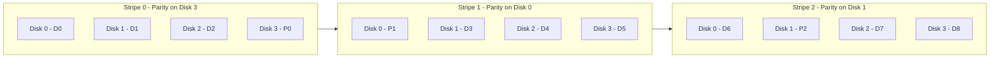
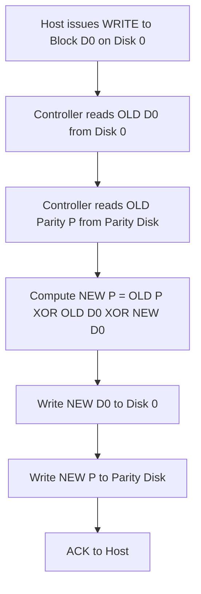
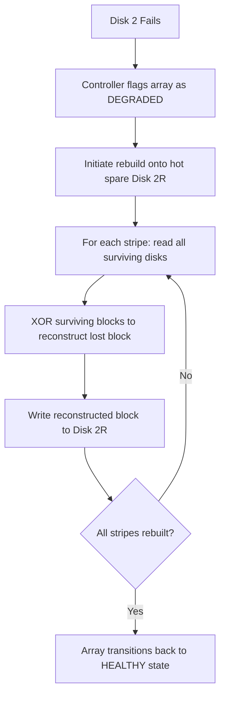

# RAID5

<!-- SECTION_1_START -->
# RAID 5 — Independent Disks with Distributed Parity

## 1.1 Formal Academic Definition

> [!IMPORTANT]
> **RAID 5 (Redundant Array of Independent Disks, Level 5)** is a disk configuration technique that combines **block-level striping** with **distributed single parity** to deliver high read performance, acceptable write performance, and the ability to tolerate exactly **one disk failure** without data loss.

In the KTU 2024 Scheme (Course Code: **PECST867 — Storage Systems**), RAID 5 is classified under **Module 1: Storage Technologies** as a *software/hardware-hybrid redundant storage architecture* that forms the backbone of mid-tier enterprise Network Attached Storage (NAS) and entry-level Storage Area Network (SAN) deployments.

The minimum disk requirement is **3 disks**, and the redundancy mechanism relies on **XOR-based parity** (denoted $P$), calculated across data blocks belonging to the same stripe.

## 1.2 Intuitive Analogy

> [!NOTE]
> **Analogy — The Distributed Notebook**
> Imagine four friends — *Disk-0, Disk-1, Disk-2, Disk-3* — each holding one chapter of a textbook. To protect against losing one friend’s chapter, they also agree that *one of them* will write a single **summary line (parity)** derived from the other chapters. Importantly, they rotate who keeps the summary line so that no single friend carries the entire backup burden. If any one friend loses their chapter, the remaining three (including whoever holds the summary) can perfectly reconstruct the lost chapter by re-doing the math.

This rotation of parity is precisely what **distributed parity** in RAID 5 means: the parity block is not fixed to one disk but cycles across all member disks in a *left-symmetric* or *right-asymmetric* pattern.

## 1.3 Key Terminology Highlights

- **Stripe**: A logical unit that spans one block from every disk in the array.
- **Stripe Width**: Equals the number of data disks ($n - 1$).
- **Parity Block ($P$)**: Computed as $P = D_0 \oplus D_1 \oplus \dots \oplus D_{n-2}$ where $\oplus$ is the **XOR (exclusive OR)** operator.
- **Stripe Unit / Chunk Size**: Configurable segment size (commonly **64 KB**, **128 KB**, or **256 KB**).
- **Fault Tolerance**: Exactly **1 disk** per stripe group.

> [!VISUALIZATION CONTROL]
> **Concept:** XOR Parity Truth Table Visualization (4-Disk Stripe)
> **GeoGebra / Desmos Input Equations (Boolean Plane):**
> * Let $x$ axis represent $D_0 \in \{0,1\}$
> * Let $y$ axis represent $D_1 \in \{0,1\}$
> * Parity surface: $P(x,y) = x + y - 2xy$ (logical XOR)
> * Reconstruction plane: $D_0(x,y) = P \oplus x \oplus y$ where $P = x \oplus y$
> **Visual Description:** Students should observe a stepped Boolean plane where the output flips value whenever the *parity of inputs changes*, confirming that knowledge of any *three* values in a 4-tuple uniquely determines the fourth.

<!-- SECTION_1_END -->

<!-- SECTION_2_START -->
# RAID 5 — Theoretical Breakdown & High-Yield Formula Sheet

## 2.1 Operational Architecture — Step by Step

The RAID 5 engine operates on the principle of *block-interleaved striping with rotating parity*. The execution flow is as follows:

1. **Logical Volume Creation**: A virtual block device $V$ is presented to the host OS as a single contiguous address space of size $\vert V \vert$ bytes.
2. **Stripe Decomposition**: $V$ is segmented into *stripes*. Each stripe contains $n - 1$ data blocks and exactly **one** parity block, where $n$ is the total number of disks.
3. **Block Placement**: Data block $D_i$ of stripe $j$ is placed on disk $(i + j) \bmod n$. The parity block $P$ of stripe $j$ is placed on disk $(n - 1 + j) \bmod n$ in the *left-symmetric* layout (the KTU-recommended standard).
4. **Parity Computation**: For every stripe write, the controller computes $P_j = D_{0,j} \oplus D_{1,j} \oplus \dots \oplus D_{n-2,j}$ and writes it to the designated disk.
5. **Write Penalty Resolution**: To update a single block, the controller must perform the **Read-Modify-Write** cycle:
    * Read old data $D_{old}$
    * Read old parity $P_{old}$
    * Compute new parity $P_{new} = P_{old} \oplus D_{old} \oplus D_{new}$
    * Write $D_{new}$ and $P_{new}$ to their respective disks
6. **Failure Recovery**: On a single-disk failure, the controller rebuilds the lost block on a hot spare (or in-place on a replacement disk) by XORing the surviving blocks of the same stripe.

> [!NOTE]
> **Why XOR?** The XOR operation is *self-inverse* ($A \oplus A = 0$) and *commutative* ($A \oplus B = B \oplus A$). This makes it the *cheapest* mathematically reversible binary operator that requires no extra storage to hold an intermediate value.

## 2.2 KTU Formula Sheet / Cheat Sheet

| # | Parameter / Concept | Mathematical Expression | Engineering Unit | Notes |
|---|----------------------|--------------------------|------------------|-------|
| 1 | Effective Usable Capacity | $C_{eff} = (n - 1) \cdot C_{disk}$ | GB or TB | One disk worth of capacity is consumed for parity |
| 2 | Storage Efficiency | $\eta = \dfrac{n - 1}{n} \times 100\%$ | Percentage | Approaches 100% as $n$ grows large |
| 3 | Parity Value (XOR) | $P = D_0 \oplus D_1 \oplus \dots \oplus D_{n-2}$ | Logical bits | $\oplus$ is bitwise XOR |
| 4 | Reconstruction of Lost Block $D_k$ | $D_k = P \oplus \bigoplus_{i \neq k} D_i$ | Logical bits | Requires reading all surviving blocks of the stripe |
| 5 | Read IOPS (Idealized) | $IOPS_{read} = n \cdot IOPS_{single}$ | Operations/sec | All disks serve parallel read requests |
| 6 | Write IOPS (Read-Modify-Write) | $IOPS_{write} = \dfrac{n}{4} \cdot IOPS_{single}$ | Operations/sec | Each logical write triggers 4 physical I/Os |
| 7 | Mean Time To Data Loss (MTTDL) | $MTTDL \approx \dfrac{MTBF^2}{n \cdot (n - 1) \cdot MTTR}$ | Hours | MTTR = Mean Time To Repair; assumes exponential failure |
| 8 | Rebuild Time | $T_{rebuild} = \dfrac{C_{disk} \cdot (n - 1)}{R_{disk}}$ | Seconds | $R_{disk}$ is sustained read throughput of the disk |
| 9 | Stripe Size | $S_{stripe} = (n - 1) \cdot C_{chunk}$ | KB | $C_{chunk}$ is the user-defined chunk size |
| 10 | Fault Tolerance | $F = 1$ disk | Integer | RAID 5 cannot survive two simultaneous disk failures |

## 2.3 Real-World Engineering Utility

RAID 5 is the **industry default for read-heavy workloads** such as:

- Enterprise file servers (NFS, SMB/CIFS shares)
- Cold-to-warm archival storage tiers
- Mail spool directories and log servers
- Database servers running read-intensive OLAP queries
- Virtual Machine (VM) datastores in small-to-medium VMware vSphere deployments

Its dominance stems from the *optimal balance* between **capacity overhead (only 1/n wasted)**, **redundancy (tolerates 1 failure)**, and **read throughput (parallelism across all disks)**.

<!-- SECTION_2_END -->

<!-- SECTION_3_START -->
# Step-by-Step Derivations, Numerical Evaluations & Code Implementation

## 3.1 Derivation 1 — Effective Usable Capacity

> [!IMPORTANT]
> **Goal:** Prove that the user-accessible capacity of a RAID 5 array equals $(n-1) \cdot C_{disk}$.

$$
\begin{aligned}
\text{Let } n &= \text{total number of disks in the array} \\
C_{disk} &= \text{formatted capacity of a single physical disk} \\
n \cdot C_{disk} &= \text{raw physical capacity of the entire array} \\
\text{Parity overhead} &= 1 \cdot C_{disk} \quad \text{(one disk equivalent per stripe group)} \\
C_{eff} &= n \cdot C_{disk} - 1 \cdot C_{disk} \\
C_{eff} &= (n - 1) \cdot C_{disk} \quad \blacksquare
\end{aligned}
$$

## 3.2 Derivation 2 — Read-Modify-Write Parity Update

> [!IMPORTANT]
> **Goal:** Derive the new parity value $P_{new}$ without re-reading all data blocks.

$$
\begin{aligned}
P_{old} &= D_{0,old} \oplus D_{1,old} \oplus D_{2,old} \oplus \dots \oplus D_{n-2,old} \\
P_{new} &= D_{0,new} \oplus D_{1,old} \oplus D_{2,old} \oplus \dots \oplus D_{n-2,old} \\
P_{old} \oplus P_{new} &= (D_{0,old} \oplus D_{0,new}) \quad \text{(all other terms cancel via } A \oplus A = 0) \\
P_{new} &= P_{old} \oplus D_{0,old} \oplus D_{0,new} \quad \blacksquare
\end{aligned}
$$

This identity is what allows RAID 5 controllers to update parity with only **2 reads + 2 writes** per logical write operation.

## 3.3 Worked Numerical Example

> [!NOTE]
> **Scenario:** An organization deploys a RAID 5 array with **5 disks**, each of capacity **2 TB**. The disk sustains **180 IOPS** and **200 MB/s** sequential read throughput. The chunk size is **128 KB**. A single disk fails.

**Step 1 — Calculate Effective Capacity**

$$
\begin{aligned}
n &= 5, \quad C_{disk} = 2 \text{ TB} = 2000 \text{ GB} \\
C_{eff} &= (5 - 1) \cdot 2000 \text{ GB} \\
C_{eff} &= 4 \cdot 2000 \text{ GB} \\
C_{eff} &= 8000 \text{ GB} = 8 \text{ TB}
\end{aligned}
$$

**Step 2 — Calculate Storage Efficiency**

$$
\begin{aligned}
\eta &= \dfrac{n - 1}{n} \times 100\% \\
\eta &= \dfrac{4}{5} \times 100\% \\
\eta &= 80\%
\end{aligned}
$$

**Step 3 — Calculate Theoretical Read IOPS**

$$
\begin{aligned}
IOPS_{read} &= n \cdot IOPS_{single} \\
IOPS_{read} &= 5 \cdot 180 \\
IOPS_{read} &= 900 \text{ IOPS}
\end{aligned}
$$

**Step 4 — Calculate Write IOPS (with RMW penalty)**

$$
\begin{aligned}
IOPS_{write} &= \dfrac{n}{4} \cdot IOPS_{single} \\
IOPS_{write} &= \dfrac{5}{4} \cdot 180 \\
IOPS_{write} &= 225 \text{ IOPS}
\end{aligned}
$$

**Step 5 — Calculate Rebuild Time**

$$
\begin{aligned}
T_{rebuild} &= \dfrac{C_{disk} \cdot (n - 1)}{R_{disk}} \\
T_{rebuild} &= \dfrac{2 \text{ TB} \cdot 4}{200 \text{ MB/s}} \\
T_{rebuild} &= \dfrac{8 \times 10^{12} \text{ B}}{2 \times 10^{8} \text{ B/s}} \\
T_{rebuild} &= 4 \times 10^{4} \text{ s} \\
T_{rebuild} &\approx 11.11 \text{ hours}
\end{aligned}
$$

## 3.4 Symbolic Python Implementation

```python
from typing import List, Tuple
import logging

logging.basicConfig(level=logging.INFO, format="[%(levelname)s] %(message)s")


class RAID5Array:
    """
    Educational simulation of a RAID 5 array with distributed XOR parity.
    Models striping, parity computation, single-disk failure, and rebuild.
    """

    def __init__(self, num_disks: int, block_size_bytes: int = 4096) -> None:
        if num_disks < 3:
            raise ValueError("RAID 5 requires a minimum of 3 disks per KTU 2024 syllabus.")
        self.num_disks: int = num_disks
        self.block_size: int = block_size_bytes
        self.disks: List[bytearray] = [bytearray() for _ in range(num_disks)]
        self.failed_disk: int = -1
        logging.info("Initialized RAID 5 array with %d disks.", num_disks)

    @staticmethod
    def compute_parity(data_blocks: List[bytes]) -> bytes:
        """Compute XOR parity across an arbitrary number of equal-length blocks."""
        if not data_blocks:
            raise ValueError("At least one data block is required to compute parity.")
        length: int = len(data_blocks[0])
        for blk in data_blocks:
            if len(blk) != length:
                raise ValueError("All data blocks must share identical length.")
        parity: bytearray = bytearray(length)
        for blk in data_blocks:
            for i in range(length):
                parity[i] ^= blk[i]
        return bytes(parity)

    def write_stripe(self, stripe_index: int, data_blocks: List[bytes]) -> None:
        """Write one stripe: (n-1) data blocks + 1 computed parity block (distributed)."""
        if len(data_blocks) != self.num_disks - 1:
            raise ValueError(f"Expected {self.num_disks - 1} data blocks, got {len(data_blocks)}.")
        parity: bytes = self.compute_parity(data_blocks)
        parity_disk: int = (self.num_disks - 1 + stripe_index) % self.num_disks
        for disk_idx, block in enumerate(data_blocks):
            target_disk: int = disk_idx if disk_idx < parity_disk else disk_idx + 1
            self.disks[target_disk].extend(block)
        self.disks[parity_disk].extend(parity)
        logging.info("Stripe %d written. Parity placed on disk %d.", stripe_index, parity_disk)

    def simulate_failure(self, disk_index: int) -> None:
        if not 0 <= disk_index < self.num_disks:
            raise IndexError("Invalid disk index for failure simulation.")
        self.failed_disk = disk_index
        logging.warning("Disk %d marked as FAILED. Array is now in degraded mode.", disk_index)

    def rebuild(self) -> None:
        """Recover the failed disk by XORing the surviving disks of every stripe."""
        if self.failed_disk == -1:
            logging.info("No disk has failed; rebuild is a no-op.")
            return
        lost_disk: int = self.failed_disk
        rebuilt_data: bytearray = bytearray()
        stripe_depth: int = self.block_size
        for stripe_idx in range(len(self.disks[0]) // stripe_depth):
            parity_disk: int = (self.num_disks - 1 + stripe_idx) % self.num_disks
            survivors: List[bytes] = []
            for d in range(self.num_disks):
                if d == lost_disk:
                    continue
                start: int = stripe_idx * stripe_depth
                end: int = start + stripe_depth
                survivors.append(bytes(self.disks[d][start:end]))
            recovered_block: bytes = self.compute_parity(survivors)
            rebuilt_data.extend(recovered_block)
            logging.info("Stripe %d reconstructed on replacement disk.", stripe_idx)
        self.disks[lost_disk] = rebuilt_data
        self.failed_disk = -1
        logging.info("Rebuild complete. Array returned to healthy state.")


if __name__ == "__main__":
    array: RAID5Array = RAID5Array(num_disks=4, block_size_bytes=8)
    array.write_stripe(stripe_index=0, data_blocks=[b"DATA0000", b"DATA1111", b"DATA2222"])
    array.write_stripe(stripe_index=1, data_blocks=[b"DATA3333", b"DATA4444", b"DATA5555"])
    array.simulate_failure(disk_index=2)
    array.rebuild()
```

## 3.5 KTU Valuation Tip — Boundary State Recording

> [!IMPORTANT]
> When solving a RAID 5 problem on the KTU exam, *always* write the following boundary states explicitly:
> 1. The initial stripe layout (which disk holds the parity in stripe 0).
> 2. The XOR equation before and after a disk failure.
> 3. The final reconstructed value.
> Examiners allot **1 mark** for each of these transitions.

<!-- SECTION_3_END -->

<!-- SECTION_4_START -->
# Structural Diagrams & Schematics

## 4.1 RAID 5 Logical Block Architecture (Mermaid)



## 4.2 RAID 5 Read-Modify-Write Sequence (Mermaid)



## 4.3 RAID 5 Degraded-Mode Rebuild Flow (Mermaid)



## 4.4 Block-Level Functional Architecture Flow

| Functional Block | Role in RAID 5 | Failure Consequence |
|------------------|-----------------|----------------------|
| Host I/O Interface | Receives SCSI / NVMe / SATA commands from OS | OS cannot mount the logical volume |
| Stripe Mapper | Translates LBA to (disk, offset) tuple | Read/Write operations address wrong sectors |
| XOR Parity Engine | Computes $P_{new}$ and reconstructs lost blocks | Silent data corruption during recovery |
| Write Cache (BBU/Supercap) | Coalesces small writes to amortize RMW penalty | Data loss on power failure |
| Hot Spare Manager | Auto-rebuilds array upon disk failure | Extended degraded-mode exposure |
| Disk Health Monitor (SMART) | Detects impending failures proactively | Unrecoverable double-disk failure |

<!-- SECTION_4_END -->

<!-- SECTION_5_START -->
# KTU 2024 Scheme Examination Question Bank & Topic Recap

## Part A — Short Answer Questions (3 Marks Each)

### Question 1
**[KTU University Exam — July 2024] — CO1, Remember**

**Q:** Define RAID 5. State the minimum number of disks required and the fault tolerance level of a RAID 5 array.

**Model Answer (3 Marks):**

> **RAID 5** is a redundant disk array architecture that uses **block-level striping** with **distributed single parity** to provide fault tolerance and improved performance.
>
> - **Minimum disks required:** **3**
> - **Fault tolerance level:** **1 disk failure** (the array can survive exactly one disk failure without data loss)
> - The parity block is **rotated** across all member disks in a stripe-by-stripe manner.
>
> *Award 1 mark for each bullet point correctly stated.*

### Question 2
**[KTU University Exam — Dec 2023] — CO2, Understand**

**Q:** Explain why the **Read-Modify-Write (RMW)** cycle is necessary in RAID 5. How many physical I/O operations does one logical small write generate?

**Model Answer (3 Marks):**

> The RMW cycle is necessary because the new parity cannot be computed in isolation — it depends on the **old data value** of the block being updated. Without RMW, the controller would have to read *all* $n-1$ other data blocks of the stripe, which is inefficient.
>
> Using the identity $P_{new} = P_{old} \oplus D_{old} \oplus D_{new}$, the controller performs:
> 1. **Read** old $D$ (1 I/O)
> 2. **Read** old $P$ (1 I/O)
> 3. **Write** new $D$ (1 I/O)
> 4. **Write** new $P$ (1 I/O)
>
> **Total = 4 physical I/O operations per logical write.**
>
> *Award 1 mark for explaining the parity dependency, 1 mark for stating the XOR identity, 1 mark for enumerating the four I/Os.*

---

## Part B — Long Answer Questions (14 Marks Each, Module Internal Choice)

### Question A (14 Marks)
**[KTU University Exam — July 2024] — CO1, CO2, Apply / Analyze**

**A (a)** [7 Marks] Describe the architecture of a RAID 5 array with a neat diagram. Explain the concept of **distributed parity** and the **left-symmetric layout**.

**A (b)** [7 Marks] A RAID 5 array consists of **6 disks**, each of capacity **1.2 TB**. The array sustains **150 IOPS per disk**. Calculate the **effective usable capacity**, **storage efficiency**, **read IOPS**, **write IOPS** (with RMW penalty), and the **rebuild time** if the disk read bandwidth is **150 MB/s**.

---

### Model Solution — Question A

**A (a) — Architecture & Distributed Parity (7 Marks):**

- A RAID 5 array stripes data across $n$ disks at the block level. **[1 Mark]**
- Each stripe contains $n-1$ data blocks and 1 parity block, totalling $n$ blocks. **[1 Mark]**
- The parity block is *not* fixed to one disk; it **rotates** across disks stripe by stripe. **[2 Marks]**
- In the **left-symmetric layout** (KTU-recommended), for stripe $j$, the parity is placed on disk $(n-1+j) \bmod n$, and data blocks fill the remaining disks in order. **[2 Marks]**
- A labelled diagram (similar to Section 4.1) showing parity rotation across 4 disks over 4 stripes. **[1 Mark]**

**A (b) — Numerical Computation (7 Marks):**

Given: $n = 6$, $C_{disk} = 1.2$ TB, $IOPS_{single} = 150$, $R_{disk} = 150$ MB/s.

$$
\begin{aligned}
C_{eff} &= (n - 1) \cdot C_{disk} \\
&= (6 - 1) \cdot 1.2 \text{ TB} \\
&= 5 \cdot 1.2 \\
&= 6.0 \text{ TB} \quad \textbf{[2 Marks]}
\end{aligned}
$$

$$
\begin{aligned}
\eta &= \dfrac{n - 1}{n} \times 100\% \\
&= \dfrac{5}{6} \times 100\% \\
&\approx 83.33\% \quad \textbf{[1 Mark]}
\end{aligned}
$$

$$
\begin{aligned}
IOPS_{read} &= n \cdot IOPS_{single} \\
&= 6 \cdot 150 \\
&= 900 \text{ IOPS} \quad \textbf{[1 Mark]}
\end{aligned}
$$

$$
\begin{aligned}
IOPS_{write} &= \dfrac{n}{4} \cdot IOPS_{single} \\
&= \dfrac{6}{4} \cdot 150 \\
&= 1.5 \cdot 150 \\
&= 225 \text{ IOPS} \quad \textbf{[1 Mark]}
\end{aligned}
$$

$$
\begin{aligned}
T_{rebuild} &= \dfrac{C_{disk} \cdot (n - 1)}{R_{disk}} \\
&= \dfrac{1.2 \text{ TB} \cdot 5}{150 \text{ MB/s}} \\
&= \dfrac{6 \times 10^{12} \text{ B}}{1.5 \times 10^{8} \text{ B/s}} \\
&= 4 \times 10^{4} \text{ s} \\
&\approx 11.11 \text{ hours} \quad \textbf{[2 Marks]}
\end{aligned}
$$

> [!WARNING]
> **KTU Examiner's Pitfall Callout:**
> 1. Students frequently confuse **read IOPS** (parallelism = $n \cdot IOPS$) with **write IOPS** (RMW penalty = $\frac{n}{4} \cdot IOPS$). *Always* state the RMW assumption explicitly.
> 2. For rebuild time, ensure **unit conversion is correct**: 1.2 TB = $1.2 \times 10^{12}$ bytes, not $1.2 \times 10^{9}$. A common error is treating TB as $10^9$.
> 3. Do **not** forget to state the assumption that the array is in **degraded mode** during rebuild.

---

### Question B (14 Marks) — *Alternative Choice*
**[KTU University Exam — Dec 2023] — CO2, CO3, Understand / Apply**

**B (a)** [7 Marks] With the help of a truth table, prove that **XOR parity** satisfies the self-recovery property: $D_k = P \oplus \bigoplus_{i \neq k} D_i$. Demonstrate reconstruction for a 4-disk stripe where Disk 2 fails.

**B (b)** [7 Marks] Compare and contrast **RAID 0, RAID 1, RAID 5, and RAID 6** in terms of (i) minimum disks, (ii) fault tolerance, (iii) usable capacity formula, (iv) read performance, and (v) write performance. State one real-world use case for RAID 5.

---

### Model Solution — Question B

**B (a) — XOR Self-Recovery Proof (7 Marks):**

**XOR Truth Table (1 Mark):**

| $A$ | $B$ | $A \oplus B$ |
|-----|-----|--------------|
| 0 | 0 | 0 |
| 0 | 1 | 1 |
| 1 | 0 | 1 |
| 1 | 1 | 0 |

**Algebraic Identity (2 Marks):**

$$
\begin{aligned}
P &= D_0 \oplus D_1 \oplus D_2 \oplus D_3 \\
P \oplus D_0 \oplus D_1 \oplus D_3 &= D_0 \oplus D_1 \oplus D_2 \oplus D_3 \oplus D_0 \oplus D_1 \oplus D_3 \\
&= (D_0 \oplus D_0) \oplus (D_1 \oplus D_1) \oplus (D_3 \oplus D_3) \oplus D_2 \\
&= 0 \oplus 0 \oplus 0 \oplus D_2 \\
&= D_2 \quad \blacksquare
\end{aligned}
$$

**Numerical Reconstruction Example (4 Marks):**

> Suppose Disk 2 fails. Let the surviving values be: $D_0 = 0x4A$, $D_1 = 0x2C$, $D_3 = 0x9F$, and the stored parity $P = 0xF9$.

$$
\begin{aligned}
D_2 &= P \oplus D_0 \oplus D_1 \oplus D_3 \\
D_2 &= \text{0xF9} \oplus \text{0x4A} \oplus \text{0x2C} \oplus \text{0x9F} \\
&= \text{0xF9} \oplus \text{0x4A} = \text{0xB3} \\
&= \text{0xB3} \oplus \text{0x2C} = \text{0x9F} \\
&= \text{0x9F} \oplus \text{0x9F} = \text{0x00} \\
D_2 &= \text{0x00} \quad \textbf{[Stating boundary state values: 2 Marks; Final value: 1 Mark; XOR step shown: 1 Mark]}
\end{aligned}
$$

**B (b) — Comparative Analysis (7 Marks):**

| RAID Level | Min Disks | Fault Tolerance | Usable Capacity | Read Perf | Write Perf | Use Case |
|------------|-----------|------------------|------------------|-----------|------------|----------|
| RAID 0 | 2 | 0 | $n \cdot C_{disk}$ | High ($n \times$) | High ($n \times$) | Temp scratch, video editing |
| RAID 1 | 2 | 1 (per mirror pair) | $(n/2) \cdot C_{disk}$ | Medium | Medium | OS disks, critical DB logs |
| RAID 5 | 3 | 1 | $(n-1) \cdot C_{disk}$ | High ($n \times$) | Low (RMW penalty) | File servers, NAS |
| RAID 6 | 4 | 2 | $(n-2) \cdot C_{disk}$ | High ($n \times$) | Very Low (2 parity updates) | Archival, large-capacity arrays |

*Award 1 mark per correctly filled row; 2 marks for naming a valid RAID 5 use case (e.g., enterprise NAS file share).*

> [!WARNING]
> **Examiner's Pitfall Callout for Question B:**
> 1. Do not skip the **boundary state values** ($D_0, D_1, D_3, P$) in the reconstruction example — listing them earns 2 marks.
> 2. The XOR computation must be shown **stepwise** (cancelling pairs), not as a single line.
> 3. In the comparison table, students often confuse the **usable capacity** of RAID 0 (no parity overhead) with RAID 5. Verify that RAID 0 formula is $n \cdot C$ and RAID 5 is $(n-1) \cdot C$.

---

## Topic Recap & Important Things to Remember

> [!IMPORTANT]
> **Rapid Revision Checklist — RAID 5**

- **Full Form:** Redundant Array of Independent Disks, Level 5
- **Minimum Disks:** 3
- **Fault Tolerance:** Exactly 1 disk
- **Redundancy Mechanism:** XOR parity (single parity per stripe)
- **Parity Distribution:** Rotates across all disks (left-symmetric or right-asymmetric layout)
- **Effective Capacity Formula:** $C_{eff} = (n - 1) \cdot C_{disk}$
- **Storage Efficiency:** $\eta = \frac{n-1}{n} \times 100\%$
- **Read Performance:** Scales linearly with $n$ (parallelism)
- **Write Performance:** Suffers **Read-Modify-Write (RMW) penalty** — 4 physical I/Os per logical write
- **RMW Identity:** $P_{new} = P_{old} \oplus D_{old} \oplus D_{new}$
- **Recovery Identity:** $D_k = P \oplus \bigoplus_{i \neq k} D_i$
- **Rebuild Time:** $T_{rebuild} = \frac{C_{disk} \cdot (n-1)}{R_{disk}}$
- **MTTDL:** $MTTDL \approx \frac{MTBF^2}{n(n-1) \cdot MTTR}$
- **Best Use Cases:** File servers, NAS, read-heavy OLAP, mail spools, VM datastores
- **Avoid For:** Mission-critical write-intensive databases (use RAID 10 or RAID 6 instead)
- **Weakness:** Cannot survive **two simultaneous disk failures** (this is what RAID 6 solves)
- **Critical Exam Tip:** Always state the RMW assumption, the parity rotation pattern, and the boundary values of every block before computing a numerical answer.

<!-- SECTION_5_END -->
