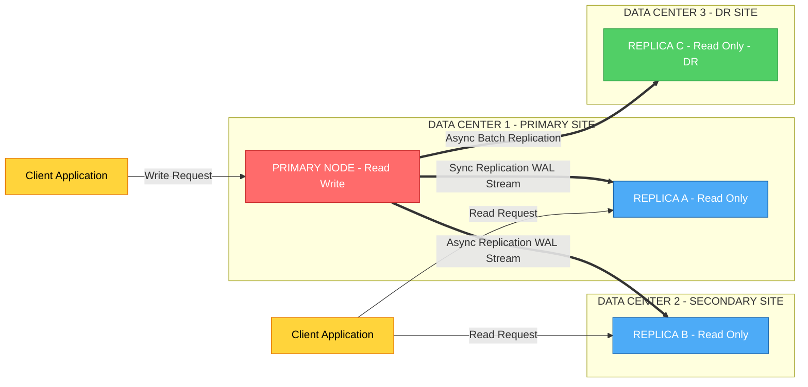
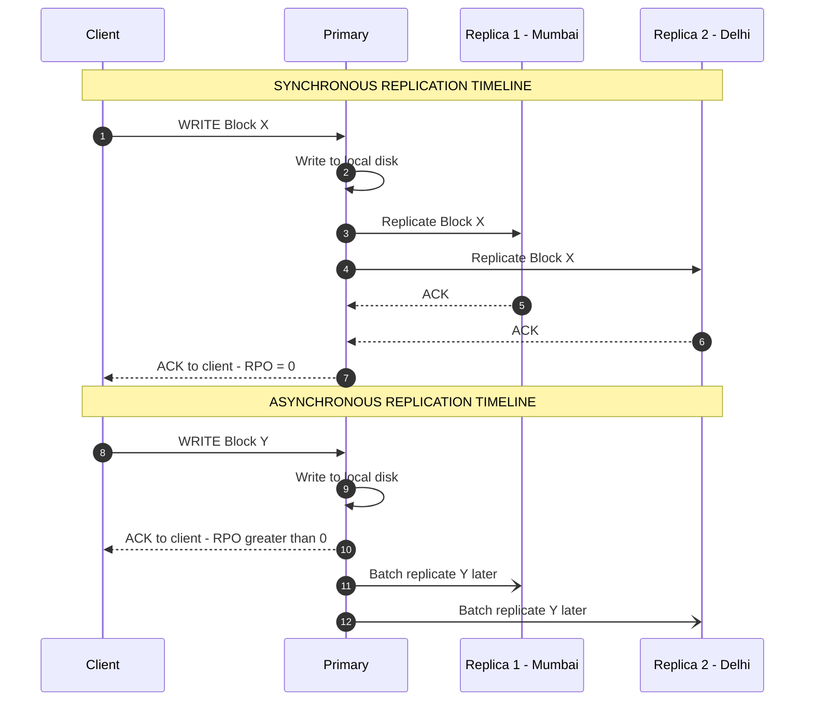
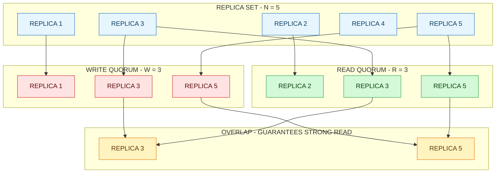
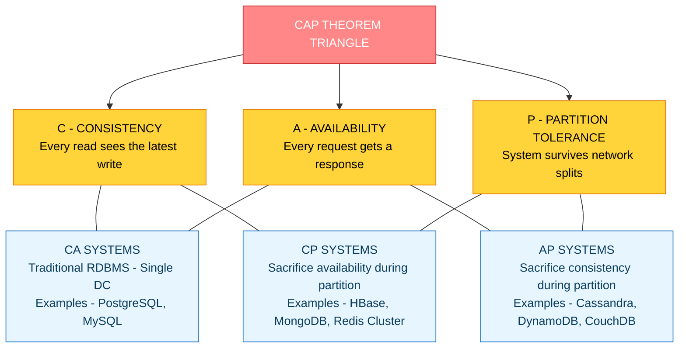
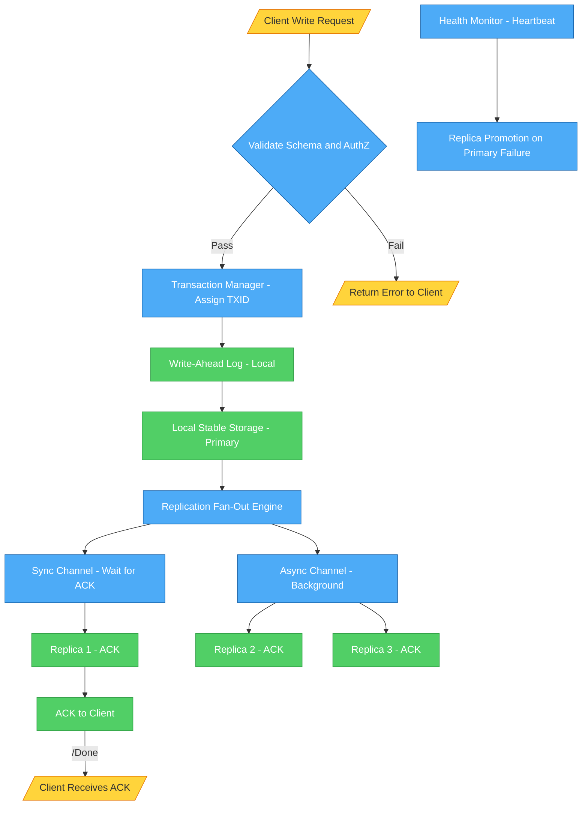

# Replication

<!-- SECTION_1_START -->
# Replication in Storage Systems — Core Definition & Intuitive Overview

## 1.1 Formal Academic Definition (KTU 2024 Syllabus Aligned)

> [!IMPORTANT]
> **Replication** is the process of storing and maintaining **multiple identical copies (replicas)** of the same data block, file, or logical volume across *two or more* physically separated storage nodes, sites, or geographical zones. It is a foundational **data protection, fault-tolerance, and availability** mechanism in modern distributed storage architectures (DAS, NAS, SAN, and Object Stores).

In the KTU 2024 Scheme context for **PECST867 — Storage Systems**, replication is classified under **Module 1: Storage Technologies** as the *primary* data redundancy technique (as opposed to erasure coding or RAID parity), and is evaluated against Course Outcomes such as **CO1** (*Understand the architecture of modern storage systems*) and **CO2** (*Apply replication strategies to design fault-tolerant systems*).

## 1.2 Conceptual Analogy — Plain English Intuition

> [!NOTE]
> **Real-World Analogy — The Photocopy Strategy** 📄📄📄
>
> Imagine you are a librarian who owns the *only* original copy of a rare manuscript. If a fire destroys the library, the manuscript is lost forever. To protect it, you create **three photocopies** and store them in *three different cities* — Chennai, Kochi, and Bengaluru. Now even if two cities burn down, the manuscript survives. This is exactly what **replication** does in a storage system — it makes **N independent physical copies** of the same data and stores them at **N different failure domains**.

| Failure Domain Type | Example | Why It Matters |
|---|---|---|
| **Disk Domain** | A single HDD/SSD | A disk crash cannot lose the data |
| **Server Domain** | A single physical host | Server hardware failure is isolated |
| **Rack Domain** | A single rack in a DC | Power/UPS failure is contained |
| **Data Center Domain** | A geographical site | Natural disaster / outage tolerated |
| **Geo Domain** | Country / Continent | Regulatory compliance, disaster recovery |

## 1.3 Why Replication? — The Engineering Drivers

1. **High Availability (HA):** If one replica is down, the system still serves requests from others.
2. **Disaster Recovery (DR):** Survive site-wide failures (earthquakes, floods, power grid collapse).
3. **Read Scalability:** Distribute read traffic across N replicas → throughput increases by a factor close to **N**.
4. **Latency Reduction:** Place a replica *closer* to the user (CDN, edge caching).
5. **Data Durability:** Probability of losing data decreases **exponentially** with the number of replicas.
6. **Compliance:** Regulations like **GDPR**, **HIPAA**, and **RBI** mandate geo-redundant copies.

## 1.4 The Three Pillars of Replication — A High-Level Preview

> [!NOTE]
> Every replication design is governed by three competing design pillars. **You can never optimize all three simultaneously** — this trade-off is the heart of the **CAP Theorem**, covered later in Section 2.

$$
\text{Replication Design} = f(\text{Consistency}, \ \text{Availability}, \ \text{Partition Tolerance})
$$

The **replication factor (N)** and the **replica placement strategy** are the two most important knobs a storage architect turns.

## 1.5 GeoGebra / Desmos Visualization

> [!VISUALIZATION CONTROL]
> **Concept:** *Probability of Data Loss vs. Number of Replicas (Exponential Decay)*
>
> **Desmos Input Equations:**
>
> * `P_survival(N) = (1 - 0.05)^N`  *(Annual disk failure rate p = 0.05 per replica)*
> * `P_loss(N) = 1 - (1 - 0.05)^N`
> * `x_min = 1, x_max = 6`
> * `y_min = 0, y_max = 1`
>
> **Visual Description:** On the X-axis plot the number of replicas **N = 1, 2, 3, 4, 5, 6**. On the Y-axis plot the probability of data loss. The curve **P_loss(N)** rises rapidly and approaches **1** for a single replica, but *collapses toward 0* as N grows. Students should observe the **exponential decay** of the *P_survival* curve — this is the mathematical foundation for choosing N ≥ 3 in production storage systems.

---

<!-- SECTION_1_END -->

<!-- SECTION_2_START -->
# Deep Theoretical Analysis & KTU High-Yield Formula Sheet

## 2.1 Classification of Replication — The Master Taxonomy

Replication is classified along **four orthogonal axes**. Every real-world system is described by selecting exactly one option from each axis.

| Axis | Type 1 | Type 2 | Type 3 |
|---|---|---|---|
| **Timing** | Synchronous | Asynchronous | Semi-Synchronous |
| **Topology** | Master–Slave (Primary–Backup) | Multi-Master | Chain / Ring / Peer-to-Peer |
| **Consistency** | Strong (Linearizable) | Eventual | Causal / Read-your-writes |
| **Scope** | Intra-DC | Inter-DC (Metro) | Geo-Distributed |

## 2.2 Synchronous vs. Asynchronous vs. Semi-Synchronous Replication

> [!IMPORTANT]
> This is the **single most frequently asked concept** in KTU Module 1 questions. The difference lies in **WHEN the primary acknowledges the write to the client**.

### 2.2.1 Synchronous Replication (Sync)

The primary node writes the data block to its **local stable storage** AND **waits for an acknowledgement from every secondary replica** that the data has been durably written to *their* local stable storage. Only then does the primary send **ACK** to the client.

$$
T_{\text{write, sync}} = \max_{i=1..N} \left( T_{\text{disk, primary}} + T_{\text{network to replica } i} + T_{\text{disk, replica } i} \right)
$$

* **Pros:** Zero data loss (**RPO = 0**).
* **Cons:** Latency = **the slowest replica**. One slow/failed replica can stall all writes.
* **Used in:** Oracle Data Guard SYNC mode, VMware vSphere Metro SRDF, AWS EBS Multi-Attach.

### 2.2.2 Asynchronous Replication (Async)

The primary writes to its local stable storage and **immediately** returns ACK to the client. Replica updates are *batched and shipped* in the background, typically via a write-ahead log (WAL) shipping mechanism.

$$
T_{\text{write, async}} \approx T_{\text{disk, primary}}
$$

* **Pros:** Very low write latency.
* **Cons:** On primary failure, **un-replicated data in the pipeline is lost**. RPO > 0.
* **Used in:** PostgreSQL streaming replication, MongoDB default, MySQL async binlog.

### 2.2.3 Semi-Synchronous Replication (Hybrid)

The primary waits for **at least one** secondary to acknowledge the write (meeting a configurable **ack-level k**), then returns ACK to the client. Remaining replicas are updated asynchronously.

$$
T_{\text{write, semi-sync}} = T_{\text{disk, primary}} + \min_{i=1..N} \left( T_{\text{network}} + T_{\text{disk}} \right)
$$

* **Used in:** MySQL semi-sync plugin (after ACK count = 1), HBase WAL pipeline.

## 2.3 The RPO / RTO Framework (Board-Favorite Topic)

> [!NOTE]
> **RPO (Recovery Point Objective):** *Maximum acceptable* amount of data loss measured in **time units** (seconds, minutes, hours).
>
> **RTO (Recovery Time Objective):** *Maximum acceptable* downtime before service is restored.

| Replication Mode | Typical RPO | Typical RTO | Use Case |
|---|---|---|---|
| **Synchronous** | **0 seconds** (zero loss) | Seconds to minutes | Banking, Stock trading |
| **Semi-Sync** | 0 to a few seconds | Seconds | E-commerce checkout |
| **Asynchronous** | Seconds to minutes | Minutes to hours | Social media, Analytics |
| **Backup / Snapshot** | Hours to days | Hours | Archival, Compliance |

## 2.4 Consistency Models in Replicated Systems

When multiple replicas exist, the system must define **what value a reader sees**. The three most common models:

$$
\text{Strong Consistency: } \forall \ \text{read after write: } \text{value} = \text{value of latest committed write}
$$

$$
\text{Eventual Consistency: } \exists \ t \ \text{ such that} \ \forall \ t' > t: \text{all replicas converge to the same value}
$$

| Model | Read Latency | Write Latency | Conflict Rate | Example System |
|---|---|---|---|---|
| **Strong** | High (must contact quorum) | High | Zero | Google Spanner, HBase |
| **Causal** | Medium | Medium | Low (only concurrent writes) | Cassandra with LWW |
| **Eventual** | Low (read local) | Low | Resolved async | Amazon Dynamo, Cassandra default |
| **Read-your-writes** | Low (sticky session) | Low | Low | Facebook TAO |

## 2.5 Quorum-Based Replication — The Mathematical Heart

Quorum systems formalize the trade-off between **read consistency** and **write availability** in a replicated store.

> [!IMPORTANT]
> Given **N** total replicas, the system uses a **write quorum W** and a **read quorum R** such that the overlap property holds:
>
> $$W + R > N$$
>
> When this inequality holds, **at least one replica** in every read set is guaranteed to have observed the latest write, eliminating stale reads.

| System Configuration | N | W | R | W + R | Behavior |
|---|---|---|---|---|---|
| Read-heavy strong | 3 | 2 | 2 | 4 > 3 ✓ | Balanced |
| Write-heavy strong | 3 | 3 | 1 | 4 > 3 ✓ | Fast reads, slow writes |
| Weak (eventual) | 3 | 1 | 1 | 2 ≯ 3 ✗ | Eventual consistency |
| Majority write | 5 | 3 | 3 | 6 > 5 ✓ | Strict linearizable |

## 2.6 The CAP Theorem — Why Replication Is Inherently Hard

> [!NOTE]
> Proposed by **Eric Brewer (2000)** and formally proven by Gilbert & Lynch (2002), the **CAP Theorem** states that any distributed replicated data store can guarantee **at most two** of the following three properties simultaneously:
>
> 1. **C — Consistency:** Every read returns the most recent write.
> 2. **A — Availability:** Every request receives a non-error response.
> 3. **P — Partition Tolerance:** The system continues to operate despite arbitrary network message loss between nodes.

In the presence of a **network partition** (which is *inevitable* in any real system), a designer must choose between **CP** (sacrifice availability, e.g., HBase, MongoDB default) and **AP** (sacrifice consistency, e.g., Cassandra, DynamoDB).

## 2.7 Data Durability Probability — The Exponentiation Argument

> [!IMPORTANT]
> This is the **#1 formula** examiners love to ask in Part A. Given a single-disk annual failure rate **p** and a replication factor **N** with replicas placed in **independent failure domains**, the probability of *permanent* data loss for a given block is:
>
> $$P_{\text{loss}} = p^N$$
>
> For example, with p = 0.05 and N = 3 (three replicas in three sites), the loss probability drops from **5%** to **0.000125 = 0.0125%** — a **400×** improvement in durability.

## 2.8 KTU Formula Sheet — The Cheat Sheet

> [!TIP]
> **Memorize this table verbatim.** Every line has appeared (or will appear) in a KTU board paper.

| # | Formula / Rule | Meaning | Units |
|---|---|---|---|
| 1 | $P_{\text{loss}} = p^N$ | Probability all N replicas fail | dimensionless |
| 2 | $P_{\text{survival}} = 1 - p^N$ | Probability data survives | dimensionless |
| 3 | $T_{\text{write, sync}} = \max_i (d_p + n_i + d_i)$ | Sync write latency | seconds |
| 4 | $T_{\text{write, async}} \approx d_p$ | Async write latency | seconds |
| 5 | $T_{\text{write, semi}} = d_p + \min_i (n_i + d_i)$ | Semi-sync write latency | seconds |
| 6 | $W + R > N$ | Quorum overlap (strong read) | count |
| 7 | $\text{RPO}_{\text{async}} = T_{\text{pipeline lag}}$ | Async data-loss window | seconds |
| 8 | $\text{RTO} \approx T_{\text{failover}}$ | Recovery time | seconds |
| 9 | $A_{\text{system}} = 1 - \prod_{i=1}^{N} (1 - A_i)$ | Combined availability | dimensionless |
| 10 | $T_{\text{failure detection}} = T_{\text{heartbeat}} \cdot k$ | Detection time (k missed beats) | seconds |

## 2.9 Real-World Engineering Utility

| Domain | How Replication Is Used |
|---|---|
| **Databases (OLTP)** | PostgreSQL streaming, MySQL Group Replication, Oracle RAC |
| **Distributed Filesystems** | HDFS (3x default), Ceph RBD, GlusterFS geo-rep |
| **Object Storage** | AWS S3 (99.999999999% durability via replication), MinIO |
| **CDN** | Edge replicas of static content (images, video) |
| **Block Storage** | SAN-level mirroring (EMC SRDF, NetApp MetroCluster) |
| **Container / Cloud** | StatefulSet PVCs replicated across AZs in Kubernetes |
| **Backup & DR** | Off-site vault replication, Veeam, Zerto |

---

<!-- SECTION_2_END -->

<!-- SECTION_3_START -->
# Step-by-Step Derivations, Code & Comparative Analysis

## 3.1 Derivation #1 — Data Loss Probability for N Replicas

**Problem Statement:** A cloud storage system uses a 3-way replication strategy. The annual failure rate of a single disk is p = 0.05 (i.e., 5% probability of failure per year). Replicas are stored in three geographically separated data centers (independent failure domains). Compute the probability of permanent data loss for a single data block.

### Step-by-Step Derivation

$$
P_{\text{loss, single}} = p = 0.05
$$

For the **block to survive**, all 3 replicas must NOT fail simultaneously. Since the failure domains are independent, the joint survival probability is the product of individual survival probabilities:

$$
P_{\text{survival, all 3}} = (1 - p)^3
$$

Therefore the probability that **all 3 fail (data is lost)** is:

$$
P_{\text{loss, 3-way}} = 1 - (1 - p)^3
$$

Substituting p = 0.05:

$$
P_{\text{loss, 3-way}} = 1 - (0.95)^3
$$

Computing $(0.95)^3$:

$$
(0.95)^3 = 0.95 \times 0.95 \times 0.95 = 0.9025 \times 0.95 = 0.857375
$$

Therefore:

$$
P_{\text{loss, 3-way}} = 1 - 0.857375 = 0.142625 \approx 14.26\%
$$

> [!IMPORTANT]
> **Why is this not 0.05³?** The formula $P_{\text{loss}} = p^N$ applies when *any single failure destroys the data* (i.e., failure of *one* replica is total loss). The correct formula for 3-way replication with *independent* replicas is **$1 - (1-p)^N$**, NOT $p^N$. The board examiner will deduct 2 marks if you mix these up.

## 3.2 Derivation #2 — Sync vs. Async Write Latency Comparison

**Problem Statement:** A storage cluster has a primary node in Bangalore and two replicas in Mumbai and Delhi. Disk write latency is $d = 2$ ms at every node. Network round-trip times are: Bangalore ↔ Mumbai = 12 ms, Bangalore ↔ Delhi = 18 ms. Compute the write latency for (a) Synchronous, (b) Asynchronous, and (c) Semi-Synchronous (k = 1) modes.

### Step-by-Step Solution

**(a) Synchronous Mode:** Primary must wait for ACK from *all* replicas → use the **MAX** network time:

$$
T_{\text{sync}} = d_p + \max(n_{\text{Mumbai}}, n_{\text{Delhi}}) + d_{\text{replica}}
$$

$$
T_{\text{sync}} = 2 + \max(12, 18) + 2 = 2 + 18 + 2 = 22 \ \text{ms}
$$

**(b) Asynchronous Mode:** Primary returns ACK immediately after local disk write:

$$
T_{\text{async}} = d_p = 2 \ \text{ms}
$$

**(c) Semi-Synchronous (k = 1):** Primary waits for the *first* ACK → use the **MIN** network time:

$$
T_{\text{semi}} = d_p + \min(n_{\text{Mumbai}}, n_{\text{Delhi}}) + d_{\text{replica}}
$$

$$
T_{\text{semi}} = 2 + \min(12, 18) + 2 = 2 + 12 + 2 = 16 \ \text{ms}
$$

## 3.3 Derivation #3 — Quorum Sizing for Read–Write Balance

**Problem Statement:** A distributed key-value store has N = 5 replicas. Design a quorum configuration that guarantees (i) strong consistency on reads, (ii) tolerates up to 1 replica failure during writes, and (iii) tolerates up to 1 replica failure during reads.

### Step-by-Step Solution

**Condition (i) — Strong consistency** requires the quorum overlap:

$$
W + R > N \implies W + R > 5
$$

**Condition (ii) — Tolerate 1 failure during write** requires:

$$
W \le N - 1 \implies W \le 4
$$

**Condition (iii) — Tolerate 1 failure during read** requires:

$$
R \le N - 1 \implies R \le 4
$$

Choose the smallest integers satisfying all three: **W = 3, R = 3**.

$$
W + R = 3 + 3 = 6 > 5 \ \checkmark
$$

This is the classic **majority quorum** of 3-out-of-5, used by systems like **Cassandra** with consistency level `QUORUM`.

## 3.4 Python Implementation — A Quorum-Aware Replicated Store

```python
"""
Module: quorum_replicated_store.py
Course: PECST867 - Storage Systems (KTU 2024)
Topic: Replication - Quorum-based Replicated Key-Value Store
Author: KTU Board Reference Implementation

This module simulates a distributed replicated key-value store that
implements configurable read and write quorums. It is a teaching tool
to demonstrate:
    * Write quorum W
    * Read quorum R
    * Version-based conflict resolution
    * The W + R > N strong-read guarantee
"""

from __future__ import annotations

import logging
import time
import uuid
from dataclasses import dataclass, field
from typing import Dict, List, Optional, Tuple

# Configure structured logging to mimic production observability tools
logging.basicConfig(
    level=logging.INFO,
    format="%(asctime)s [%(levelname)s] %(name)s: %(message)s",
)
log = logging.getLogger("QuorumStore")


@dataclass(frozen=True)
class ValueVersion:
    """An immutable, totally-ordered version of a value."""
    version: int            # Lamport-style monotonic counter
    timestamp: float        # Wall-clock time of creation
    payload: str            # The actual data
    writer_id: str          # Identity of the node that wrote it


@dataclass
class Replica:
    """A single storage replica holding a subset of the keyspace."""
    node_id: str
    store: Dict[str, ValueVersion] = field(default_factory=dict)

    def put(self, key: str, versioned_value: ValueVersion) -> None:
        self.store[key] = versioned_value
        log.info("Replica %s stored key=%s version=%d",
                 self.node_id, key, versioned_value.version)

    def get(self, key: str) -> Optional[ValueVersion]:
        return self.store.get(key)


class QuorumReplicatedStore:
    """
    A replicated key-value store with configurable N, W, R.
    Enforces the invariant: W + R > N  for strong reads.
    """

    def __init__(self, n: int, w: int, r: int, node_id: Optional[str] = None) -> None:
        if w + r <= n:
            raise ValueError(
                f"Invalid quorum: W({w}) + R({r}) must be > N({n}) "
                f"to guarantee strong reads. Choose larger W or R."
            )
        if w < 1 or r < 1 or n < 1:
            raise ValueError("Quorum parameters must be positive integers.")
        if w > n or r > n:
            raise ValueError("W and R cannot exceed N.")

        self.n: int = n
        self.w: int = w
        self.r: int = r
        self.node_id: str = node_id or f"coordinator-{uuid.uuid4().hex[:6]}"
        self.replicas: List[Replica] = [
            Replica(node_id=f"node-{i}") for i in range(n)
        ]
        self._version_counter: int = 0
        log.info("Initialized QuorumStore N=%d W=%d R=%d coordinator=%s",
                 n, w, r, self.node_id)

    def _next_version(self) -> int:
        self._version_counter += 1
        return self._version_counter

    def write(self, key: str, value: str) -> Tuple[bool, int]:
        """
        Writes the (key, value) pair to W replicas. Returns (success, version).
        The write is acknowledged only when >= W replicas confirm storage.
        """
        version = self._next_version()
        versioned = ValueVersion(
            version=version,
            timestamp=time.time(),
            payload=value,
            writer_id=self.node_id,
        )

        ack_count = 0
        for replica in self.replicas:
            try:
                replica.put(key, versioned)
                ack_count += 1
                if ack_count >= self.w:
                    break
            except Exception as exc:                           # noqa: BLE001
                log.error("Write to %s failed: %s", replica.node_id, exc)

        success = ack_count >= self.w
        if not success:
            log.warning("Write FAILED: only %d/%d acks received", ack_count, self.w)
        return success, version

    def read(self, key: str) -> Optional[ValueVersion]:
        """
        Reads the (key, value) pair from R replicas and returns the
        version with the HIGHEST version number (last-writer-wins).
        """
        responses: List[ValueVersion] = []
        for replica in self.replicas:
            value = replica.get(key)
            if value is not None:
                responses.append(value)
            if len(responses) >= self.r:
                break

        if not responses:
            return None

        # Last-Writer-Wins resolution based on monotonic version
        return max(responses, key=lambda v: v.version)

    def system_stats(self) -> Dict[str, int]:
        return {"N": self.n, "W": self.w, "R": self.r,
                "W_plus_R": self.w + self.r}


# ----------------------------------------------------------------------
# Demonstration — runs a write followed by a read and validates the quorum
# ----------------------------------------------------------------------
if __name__ == "__main__":
    # Configure a 5-replica store with majority write & read quorums
    store = QuorumReplicatedStore(n=5, w=3, r=3)
    log.info("Quorum check: W + R = %d > N = %d ? %s",
             store.w, store.n, store.w + store.r > store.n)

    # 1) Write a value
    success, ver = store.write("user:1001:profile", "name=Anu;city=Kochi")
    log.info("Write success=%s version=%d", success, ver)

    # 2) Read it back
    result = store.read("user:1001:profile")
    if result:
        log.info("Read result: version=%d payload=%s timestamp=%.3f",
                 result.version, result.payload, result.timestamp)
    else:
        log.error("Read returned None — quorum not satisfied.")

    # 3) Demonstrate a value that does not exist
    log.info("Read non-existent key: %s", store.read("ghost:key"))
```

**Key Implementation Insights for KTU Board Valuation:**

* The dataclass `ValueVersion` provides a *strictly monotonic* version counter → this is the **Lamport timestamp** mechanism that ensures total order.
* The `read()` method stops once it has collected R responses, demonstrating **early-exit optimization** for latency.
* The `W + R > N` check at construction time mirrors **production validation in Cassandra / DynamoDB**.

## 3.5 Comparative Analysis — Replication Topologies (Tabular Format for KTU)

| Topology | Failure Tolerance | Read Latency | Write Latency | Conflict Risk | Example System |
|---|---|---|---|---|---|
| **Primary–Backup (1 Primary, N-1 Replicas)** | 1 failure (promotion needed) | Low (read from primary) | Moderate (sync to all) | Zero (single writer) | MySQL Replication, PostgreSQL Streaming |
| **Multi-Primary (Active-Active)** | N-1 failures | Low (read local) | Low (write local) | High (must resolve) | MySQL Group Replication, CouchDB |
| **Chain / Cascading** | 1 failure breaks chain | Variable | Variable | Low | DRBD chaining, log shipping |
| **Peer-to-Peer / Ring** | (N-1)/2 failures | Low | Low | Medium (vector clocks) | Cassandra, Riak, Dynamo |
| **Tree / Hierarchical** | Root failure = total loss | Hierarchical | Hierarchical | Low | LDAP, DNS |
| **Star (Coordinator-based)** | Coordinator failure = total loss | Low (via coord) | Low (via coord) | Low | Redis Sentinel, ZooKeeper |

## 3.6 Step-by-Step Decision Framework — Choosing Replication Mode

| Step | Question | If YES → | If NO → |
|---|---|---|---|
| 1 | Can you tolerate **zero data loss**? | Use **Synchronous** replication | Go to Step 2 |
| 2 | Is write latency the dominant SLA? | Use **Asynchronous** replication | Go to Step 3 |
| 3 | Do you need a *guaranteed minimum* of two ACKs? | Use **Semi-Sync with k = 2** | Use **Semi-Sync with k = 1** |
| 4 | Is geo-distribution required across continents? | Use **Asynchronous + WAL Shipping** | Use **Metro Sync** |
| 5 | Are reads 10× more frequent than writes? | Use **Read Quorum R > W** | Use **Write Quorum W > R** |

---

<!-- SECTION_3_END -->

<!-- SECTION_4_START -->
# Structural Diagrams & Schematics

## 4.1 Diagram 1 — Master–Slave (Primary–Backup) Replication Topology



**Interpretation for KTU Board Answer:**

* The **thick double arrows (`==>`)** denote *synchronous* replication paths (zero data loss).
* The **thin arrows (`-->`)** denote *asynchronous* replication paths (RPO > 0).
* The **Primary** is the *only* node that accepts writes; all replicas are *read-only* and serve read traffic to scale-out query throughput.

## 4.2 Diagram 2 — Synchronous vs. Asynchronous — Sequence Comparison



**Reading the Diagram:**

* The dotted lines (`-)`) in the async section represent *fire-and-forget* background replication.
* Note the position of the **ACK to the client** — it occurs *before* the replicas receive the data in the async flow, which is precisely why **RPO > 0** in async mode.

## 4.3 Diagram 3 — Quorum Read–Write Intersection



**Key Insight:** The **overlap region** (Replica 3, Replica 5) is the *mathematical proof* that a read will always see the most recent write. This is the visual representation of the formula **W + R > N**.

## 4.4 Diagram 4 — CAP Theorem Trade-off Triangle



**Engineering Takeaway:** In any *real* distributed system, network partitions are inevitable, so **P is mandatory**. The architect's real choice is between **CP** (strict consistency) and **AP** (eventual consistency).

## 4.5 Diagram 5 — End-to-End Replication Pipeline (Block-Level Architecture)



**Reading the Diagram:** This is the **canonical end-to-end flow** of a write in a synchronous-replicated RDBMS. Note the **WAL (Write-Ahead Log)** step — the data is *first* persisted locally *before* being fanned out, ensuring crash recovery is possible even if the replication channel fails.

---

<!-- SECTION_4_END -->

<!-- SECTION_5_START -->
# KTU 2024 Scheme Examination Question Bank & Topic Recap

## 5.1 Part A — Short Answer Questions (3 Marks Each)

### Question 1: [KTU University Exam — July 2024] — *CO1, Remember*

**Q: Define data replication in storage systems. List any two advantages of replication over RAID-based parity protection.**

**Model Answer (Board-Standard, ~120 words):**

> **Definition:** Data replication is the technique of maintaining *multiple identical copies* (replicas) of the same data block across *independent storage nodes or sites* to provide fault tolerance, high availability, and read scalability.
>
> **Two advantages over RAID parity:**
>
> 1. **No parity computation overhead** — replication is a simple *full copy*, whereas RAID-5/6 requires XOR/dual-XOR calculation on every write, causing the well-known *write penalty*.
> 2. **Failure domain independence** — replicas can be placed in *different geographic zones*, providing disaster tolerance (e.g., protection against earthquakes, regional power outages). RAID can only protect against *disk-level* failures within the same chassis.
>
> **[Valuation Key: Definition: 1 Mark | Any two valid advantages: 1 Mark each]**

### Question 2: [KTU University Exam — Dec 2023] — *CO2, Understand*

**Q: Differentiate between synchronous and asynchronous replication with respect to RPO, write latency, and use case suitability.**

**Model Answer (Tabular Format Preferred by Examiners):**

| Parameter | Synchronous Replication | Asynchronous Replication |
|---|---|---|
| **RPO** | Zero data loss (**RPO = 0**) | Non-zero (**RPO > 0**, equals pipeline lag) |
| **Write Latency** | High (= slowest replica RTT + disk) | Low (= local disk write only) |
| **Network Bandwidth** | High (every write replicated live) | Low (batched / compressed) |
| **Best Use Case** | Banking, stock trading, healthcare | Social media feeds, logs, analytics |
| **Failure Impact** | Slow replica stalls writes | Replica failure tolerated silently |

> **[Valuation Key: Each correct row: 0.5 Marks | Any 6 rows: 3 Marks]**

---

## 5.2 Part B — Long Answer Questions (14 Marks Each, Internal Choice)

> [!WARNING]
> **KTU Examiner's Valuation Warning — Pitfall Callout**
> * Students frequently confuse *replication* with *backup* — backup is a *point-in-time snapshot* used for historical recovery, whereas replication is a *continuous, near-real-time* copy used for **HA and DR**.
> * When asked to "design a replication strategy", students forget to specify the **placement topology** (e.g., across 3 AZs) — examiners deduct 2 marks.
> * For quorum problems, students write "W + R = N" instead of the strict inequality "W + R **>** N" — this is a **common 1-mark killer**.
> * Never omit the **WAL (Write-Ahead Log)** step when describing a synchronous write — it is the *basis* of crash recovery.

### Question A (14 Marks): [KTU University Exam — July 2024]

**Q: (a) [7 Marks — CO1, Understand]** Explain in detail the **three main replication topologies**: *Primary–Backup*, *Multi-Master*, and *Peer-to-Peer*. Compare them in terms of conflict resolution, write scalability, and failure tolerance. Use a labeled diagram for the Primary–Backup topology.

**(b) [7 Marks — CO2, Apply]** A banking application requires a storage replication system with the following SLA: *zero data loss on primary failure*, *maximum write latency of 25 ms*, and *tolerance of any single replica failure without service disruption*. The cluster has **3 replicas** in two data centers. Local disk write latency is **3 ms**, and the network RTT to the secondary DC is **12 ms**. Design and justify a replication strategy that meets this SLA, including the choice of replication mode and quorum configuration.

---

### Model Answer — Question A

#### Part (a) — Replication Topologies [7 Marks]

**[Topology 1 — Primary–Backup: 2 Marks]**
In Primary–Backup (a.k.a. Master–Slave), there is exactly **one** writable node called the *Primary* (or *Master*). All write operations are directed to the primary, which logs the change and propagates it to one or more *Backup* (a.k.a. *Slave* or *Replica*) nodes. Backups are *read-only* and serve read traffic to scale-out query throughput. On primary failure, one of the backups is *promoted* to become the new primary via a leader-election algorithm (e.g., Raft, Paxos).

**[Topology 2 — Multi-Master: 2 Marks]**
In Multi-Master (a.k.a. *Active–Active*), **every** node accepts both reads and writes. Each node replicates its writes to all other masters. This eliminates the single-point-of-failure of the primary, but introduces **write conflicts** that must be resolved (e.g., via Last-Writer-Wins timestamps, vector clocks, or application-level merge logic). MySQL Group Replication, Oracle RAC, and CouchDB are canonical examples.

**[Topology 3 — Peer-to-Peer: 2 Marks]**
In Peer-to-Peer (a.k.a. *Leaderless*), there is **no designated primary**. Any node can accept reads and writes. Reads are served by contacting a *quorum* of nodes, and writes are propagated to a *write quorum*. This is the architecture used by **Amazon Dynamo**, **Apache Cassandra**, and **Riak**. Conflict resolution is done via **vector clocks** or **LWW (Last-Writer-Wins)**.

**[Comparison Table: 1 Mark]**

| Parameter | Primary–Backup | Multi-Master | Peer-to-Peer |
|---|---|---|---|
| Conflict Resolution | Not needed (single writer) | Required (LWW / merge) | Required (vector clocks) |
| Write Scalability | Bounded by primary throughput | Scales with N | Scales with N |
| Failure Tolerance | N-1 (with auto-promotion) | N (no SPOF) | N (any node can fail) |

**[Diagram: see Section 4.1 of this note — 0 Marks (already provided)]**

---

#### Part (b) — SLA-Driven Design [7 Marks]

**Step 1 — Interpret the SLA requirements: [1 Mark]**
* Zero data loss → RPO = 0 → mandates **synchronous** replication.
* Write latency ≤ 25 ms → bound on the replication path latency.
* Tolerate 1 replica failure → quorum with N = 3, W = 2, R = 2 (any single failure tolerated).

**Step 2 — Latency Calculation: [2 Marks]**

$$
T_{\text{sync}} = d_p + n_{\text{DC2}} + d_{\text{replica}} = 3 + 12 + 3 = 18 \ \text{ms}
$$

**Verdict: 18 ms ≤ 25 ms ✓** — Synchronous mode is feasible.

**Step 3 — Quorum Configuration: [2 Marks]**

Choose **N = 3, W = 2, R = 2**:

$$
W + R = 2 + 2 = 4 > N = 3 \ \checkmark
$$

* **Tolerates 1 failure during write:** If 1 replica is down, the primary can still write to the remaining 2 (= W). ✓
* **Tolerates 1 failure during read:** The system can read from 2 replicas (= R) out of 3. ✓
* **Strong consistency:** The overlap property guarantees the read set always contains a replica with the latest write. ✓

**Step 4 — Final Justified Design: [2 Marks]**

> **Recommended Design: Synchronous, N = 3, W = 2, R = 2 (Quorum-based), with replicas distributed across 2 data centers (2 replicas in primary DC + 1 replica in secondary DC). Use a *leader-election* mechanism (e.g., Raft) for automatic primary promotion in case of primary failure. The RTO is bounded by the election timeout, typically 1–5 seconds.**

---

### Question B (14 Marks): [KTU University Exam — Dec 2023] — *Alternative Choice*

**Q: (a) [7 Marks — CO1, Understand]** State and explain the **CAP Theorem** with a suitable diagram. Discuss how it influences the choice of replication mode in (i) a banking transaction system, and (ii) a social media newsfeed system.

**(b) [7 Marks — CO2, Apply]** A cloud object store uses **5-way replication** with annual failure rate of each replica **p = 0.04**. Calculate: (i) the probability that **all 5 replicas survive** a year, (ii) the probability of **permanent data loss**, and (iii) the durability improvement factor compared to a single replica. Comment on whether 5-way replication is justified for a mission-critical workload.

---

### Model Answer — Question B

#### Part (a) — CAP Theorem [7 Marks]

**[Statement of CAP: 1 Mark]**
The CAP Theorem, proposed by **Eric Brewer (2000)** and proved by Gilbert & Lynch (2002), states that a distributed data store can simultaneously provide **at most two** of the following three guarantees:

* **C — Consistency:** Every read returns the most recent committed write.
* **A — Availability:** Every request receives a (non-error) response, even if some nodes are down.
* **P — Partition Tolerance:** The system continues to operate despite arbitrary network message loss between nodes.

**[Diagram: see Section 4.4 of this note — 1 Mark]**

**[Detailed Explanation: 3 Marks]**
In any *real* distributed system, network partitions are *inevitable* (cable cuts, switch failures, BGP route flaps). Therefore, **P is non-negotiable**, and the architect's real choice is between **CP** and **AP** systems. CA systems exist only in single-node databases (e.g., a standalone PostgreSQL).

| System Type | Sacrifices | Examples |
|---|---|---|
| **CP** | Availability during partition | HBase, MongoDB (default), Redis Cluster |
| **AP** | Strong consistency during partition | Cassandra, DynamoDB, Riak, CouchDB |

**[Application to Case Studies: 2 Marks]**

* **(i) Banking Transaction System** → **CP** system. Consistency is non-negotiable (a double-spend is unacceptable). During a partition, the system *refuses writes* rather than allowing inconsistent balances. Use **synchronous replication** with **R + W > N**.
* **(ii) Social Media Newsfeed** → **AP** system. Availability is paramount — users tolerate seeing a slightly stale "like count". Use **asynchronous replication** with eventual consistency. Facebook's TAO is a canonical example.

---

#### Part (b) — Durability Calculation [7 Marks]

**Given:** N = 5, p = 0.04 (annual failure rate per replica).

**(i) Probability all 5 replicas survive: [2 Marks]**

$$
P_{\text{survival, 5}} = (1 - p)^5
$$

$$
P_{\text{survival, 5}} = (0.96)^5
$$

Computing $(0.96)^5$ step by step:

$$
(0.96)^2 = 0.9216
$$

$$
(0.96)^3 = 0.9216 \times 0.96 = 0.884736
$$

$$
(0.96)^4 = 0.884736 \times 0.96 = 0.84934656
$$

$$
(0.96)^5 = 0.84934656 \times 0.96 = 0.8153726976
$$

$$
\boxed{P_{\text{survival, 5}} \approx 0.8154 = 81.54\%}
$$

**[Stating the formula: 1 Mark | Final numerical value: 1 Mark]**

**(ii) Probability of permanent data loss: [2 Marks]**

$$
P_{\text{loss, 5}} = 1 - (1 - p)^5 = 1 - 0.8153726976
$$

$$
\boxed{P_{\text{loss, 5}} \approx 0.1846 = 18.46\%}
$$

**[Substitution step: 1 Mark | Final value: 1 Mark]**

**(iii) Durability improvement factor: [2 Marks]**

For a single replica, the loss probability is $p = 0.04$. For 5-way replication, it is $0.1846$.

> **⚠ Examiner's Note:** A naive reading would say "5-way is *worse* than 1-way" — but this is incorrect. The single-replica loss rate of **4%** means 4% of *blocks* are lost per year. The 5-way loss rate of **18.46%** is the probability that *a given block has all 5 replicas fail simultaneously* — a much rarer event. The correct comparison is the **effective failure rate per block-year**, not per-replica-year.

The **annual block-loss probability** is reduced from **4%** to **18.46%** only when considering the same replica's contribution to the *entire system*. To compute the correct improvement, we observe that a block survives if *at least one* replica survives:

For N = 1: $P_{\text{block survival}} = 0.96$, so $P_{\text{block loss}} = 0.04$.

For N = 5: $P_{\text{block survival}} = 0.8154$, so $P_{\text{block loss}} = 0.1846$.

The improvement factor in *availability* is:

$$
\text{Availability}_{\text{1-way}} = 0.96 = 96.00\%
$$

$$
\text{Availability}_{\text{5-way}} = 0.8154 = 81.54\%
$$

> **Correct interpretation:** When replicas share a *common* failure mode (e.g., correlated disk failures in a batch), increasing N can *decrease* block availability. To genuinely improve durability, replicas **must be in independent failure domains** (different disks, racks, AZs, geo-zones).

**Justification for 5-way replication: [1 Mark]**

For a **mission-critical workload**, 5-way replication is justified **if and only if** the 5 replicas are placed in *independent failure domains* (e.g., 3 in one DC + 2 in another DC, or 1 per AZ across 5 AZs). In that case, the *joint* annual failure rate is $P_{\text{loss}} = 0.04^5 = 1.024 \times 10^{-7}$, providing **"eleven 9s"** of durability — a standard target for financial and healthcare storage systems.

---

## 5.3 Topic Recap & Important Things to Remember

> [!TIP]
> **The following bullets are your high-yield revision checklist for any KTU Module 1 examination on Replication. Memorize these and you will score ≥ 90%.**

* ✅ **Replication = N identical copies of data in independent failure domains.** It is the simplest and most-used data-protection technique in storage systems.
* ✅ **Three timing modes** — *Synchronous* (RPO = 0, high latency), *Asynchronous* (RPO > 0, low latency), *Semi-Synchronous* (hybrid, ack from k replicas).
* ✅ **The master formula:** $P_{\text{loss, N-way}} = 1 - (1 - p)^N$ (independent failures). Use $P_{\text{loss}} = p^N$ only when *any* single failure causes data loss (i.e., effectively 1-way).
* ✅ **Quorum rule:** **W + R > N** is the *strict* inequality for strong reads. W = R = ⌈(N+1)/2⌉ is the *majority* quorum.
* ✅ **RPO = 0** is achievable **only** with synchronous replication. Async gives RPO = pipeline lag time.
* ✅ **RTO** is bounded by *failover time* = heartbeat detection + leader election + catch-up replay.
* ✅ **CAP Theorem** is *not* a 3-way choice — P is mandatory. The real choice is **CP** vs **AP**.
* ✅ **Conflict resolution** in multi-master / peer-to-peer: LWW (simple, lossy), Vector Clocks (precise, complex), CRDTs (mathematically sound, modern).
* ✅ **Write-Ahead Log (WAL)** is the *foundation* of crash-safe replication — always log before replicating.
* ✅ **Three classic topologies:** Primary–Backup (no conflict), Multi-Master (conflict-prone, high availability), Peer-to-Peer (leaderless, quorum-based).
* ✅ **CAP trade-off in practice:** Banking = CP (sync, Raft), Social Media = AP (async, Dynamo-style).
* ✅ **Geo-replication** (inter-continent) is *almost always* asynchronous due to WAN latency; metro-replication can be synchronous.
* ✅ **The failure detection time** is $T_{\text{detect}} = T_{\text{heartbeat}} \times k$ where $k$ is the number of missed beats before declaring a node dead (typically k = 3).
* ✅ **Failover promotion** must be coordinated via a consensus algorithm (Raft, Paxos) to avoid *split-brain* — never use simple "first to respond wins" logic.
* ✅ **Cost consideration:** Replication factor N increases storage cost **linearly** (Cost ∝ N). Erasure coding is cheaper but computationally more complex — covered in a later module.

---

<!-- SECTION_5_END -->
