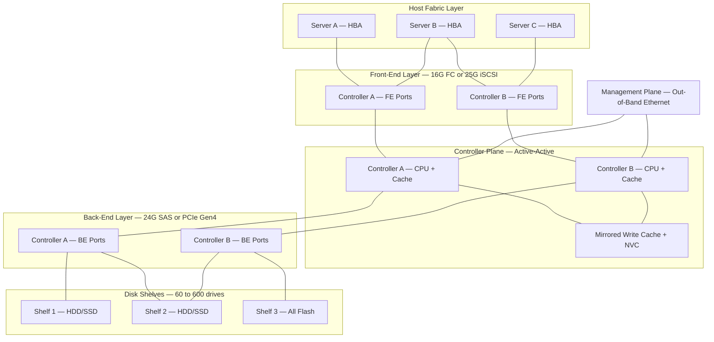
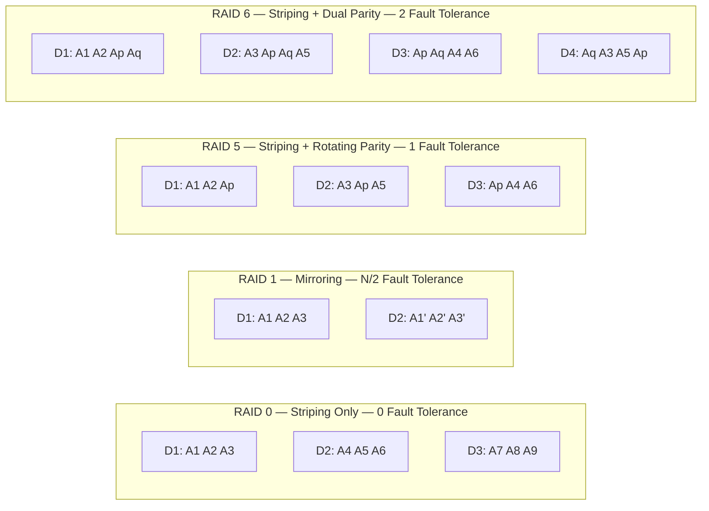
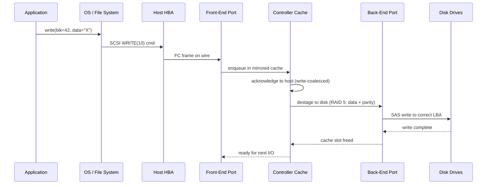
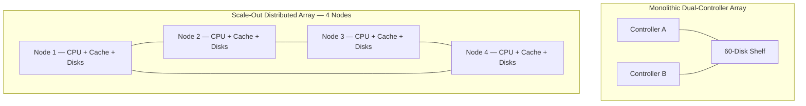
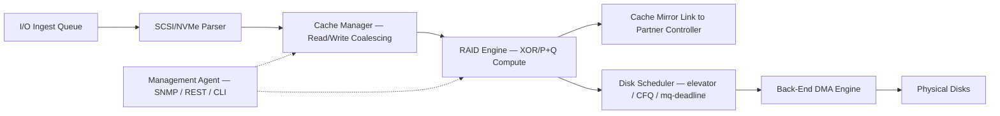

# Storage Arrays- Architectural Principles

<!-- SECTION_1_START -->
# Storage Arrays — Architectural Principles

## Formal Academic Definition (KTU 2024 Syllabus Terminology)

A **Storage Array** is a hardware-integrated, centralized data storage subsystem that consolidates multiple physical disk drives (HDDs/SSDs/NVMe) behind intelligent **storage controllers**, exposing unified, redundant, high-throughput logical storage to host servers. Architecturally, it abstracts raw physical media into **Logical Units (LUNs)**, **Redundant Array of Independent Disks (RAID)** volumes, and **storage pools** that satisfy enterprise **Availability**, **Performance**, and **Scalability** requirements.

> [!IMPORTANT]
> **KTU Board Terminology Alert:** In the 2024 scheme, examiners expect you to distinguish a *Storage Array* (an integrated appliance — controllers + disks in one chassis/fabric) from *JBOD* (Just a Bunch Of Disks — dumb disks with no controller intelligence) and from *DAS / NAS / SAN* (which are *attachment models*, not array architectures).

## Conceptual Analogy — "The Smart Warehouse"

Imagine a **library warehouse**:
- The **building (chassis)** holds thousands of books.
- The **librarians (controllers)** know exactly where every book is, who can borrow it, and how to fetch multiple books in parallel.
- The **index cards (metadata / cache)** keep recently asked-for information instantly available.
- The **book shelves (disk shelves)** provide the actual storage space.
- The **loading docks (front-end ports — FC, iSCSI, SAS, NVMe-oF)** connect customers (servers) to the librarians.
- The **forklifts moving books between shelves (back-end SAS/PCIe fabric)** are the internal data movers.

Without the librarians, the warehouse is just a **JBOD** (Just a Bunch Of Disks) — storage exists but is un-intelligent. With the librarians, the warehouse becomes a **Storage Array** — *intelligent, redundant, and fast*.

> [!NOTE]
> **Key Architectural Pillars** (must remember for KTU):
> 1. **Front-end** — Host I/O interface (FC, iSCSI, SAS, NVMe-oF)
> 2. **Back-end** — Internal disk interconnect (SAS, SATA, PCIe)
> 3. **Controllers** — Compute brains (active-active, active-passive)
> 4. **Cache** — Volatile/non-volatile memory absorbing write bursts
> 5. **Disk Shelves / Enclosures** — Physical disk carriers
> 6. **RAID Engine** — Data protection and striping logic
> 7. **Management Plane** — Out-of-band CLI/Web/SNMP

## Standard Metrics Used in Storage Arrays

| Metric | Symbol | Unit | KTU Expected Value |
|---|---|---|---|
| Mean Time Between Failures | **MTBF** | hours | $\sim 1{,}000{,}000$ to $\sim 2{,}500{,}000$ |
| Mean Time To Repair | **MTTR** | hours | $\le 1$ hour |
| Annualized Failure Rate | **AFR** | % | $\sim 0.5\%$ to $\sim 2\%$ |
| Input/Output Operations Per Second | **IOPS** | ops/s | HDDs $\sim 180$, SSDs $\sim 100{,}000$+ |
| Throughput | **T** | MB/s | HDDs $\sim 200$, NVMe $\sim 7000$ |
| Latency | **L** | ms | HDD $\sim 5$–$10$, SSD $\sim 0.05$–$0.2$ |
| Availability (Tier) | **A** | nines | 99.999% (five nines) = **5.26 min/yr downtime** |

> [!VISUALIZATION CONTROL]
> **Concept:** Capacity vs. Fault Tolerance trade-off curve for RAID levels
> **GeoGebra / Desmos Input Equations:**
> * `f(x) = (n-x) / n` where `x` = parity drives, `n` = total drives (usable capacity ratio)
> * `g(x) = x` (fault tolerance, max disks that can fail)
> **Visual Description:** As `x` increases, the usable capacity line slopes down while fault tolerance slopes up — illustrating the architectural trade-off. The intersection point identifies the **RAID efficiency sweet spot** (typically at RAID 5/6 for mid-sized arrays).

<!-- SECTION_1_END -->

<!-- SECTION_2_START -->
# Deep Theoretical Analysis & KTU High-Yield Formula Sheet

## 1. Layered Architecture of a Storage Array

A modern enterprise storage array is structured into **four functional layers**:

### Layer A — Host Connectivity (Front-End)
- Provides block-level access to servers using protocols such as **Fibre Channel (FC)**, **iSCSI** (IP-based SCSI), **FCoE**, **SAS**, and **NVMe-oF** (NVMe over Fabrics).
- **Host Bus Adapters (HBAs)** in servers present LUNs to the OS.
- Each front-end port is typically **8/16/32 Gbps FC** or **10/25/100 GbE**.

### Layer B — Storage Controller(s) — The "Brain"
- Houses **multi-core CPUs**, **mirrored write cache** (DRAM + battery/capacitor backup), and the **RAID engine** (ASIC or software-defined).
- Runs the **Storage Virtualization** software (LUN masking, thin provisioning, deduplication, snapshots).
- Operates in **Active-Active** (both controllers service I/O simultaneously) or **Active-Passive** (failover pair) modes.

### Layer C — Cache Subsystem
- Sits between front-end I/O and back-end disks.
- **Read cache** serves hot data blocks at DRAM latency.
- **Write cache** coalesces random writes and flushes to disk in large sequential stripes (write coalescing).
- Modern arrays use **NVC (Non-Volatile Cache)** — flash-backed or capacitor-backed — to survive power loss.

### Layer D — Back-End Interconnect & Disk Shelves
- Connects controllers to disk enclosures.
- Uses **SAS (12/24 Gbps)**, **SATA (6 Gbps)**, or **PCIe NVMe** internally.
- Disk shelves (often called **JBOF** — Just a Bunch Of Flash, or **JBOD**) hold dozens to hundreds of drives.

> [!NOTE]
> **Why This Layered Model Matters in KTU:** The 2024 scheme frequently asks "Where does a cache flush occur?" or "Identify the layer handling LUN masking." Always answer with the correct layer name.

## 2. Storage Array Architecture — Two Major Patterns

| Pattern | Description | Use Case |
|---|---|---|
| **Monolithic / Dual-Controller Array** | Two controllers in a single chassis; back-end connects to shelves. | Traditional enterprise SAN arrays (NetApp FAS, HPE 3PAR, Dell PowerVault) |
| **Scale-Out / Distributed Array** | Multiple nodes cooperate as a single storage pool; data and metadata distributed. | Modern hyperconverged (Nutanix) and object arrays (EMC ECS, MinIO) |

## 3. RAID Architectural Principles (Core to KTU Module 1)

**RAID** is the **fundamental data-protection architecture** inside a storage array. The principle: split data across multiple disks with **striping**, **mirroring**, and/or **parity** to gain performance, capacity efficiency, or fault tolerance.

| RAID Level | Striping | Mirroring | Parity | Min Disks | Usable Capacity | Fault Tolerance | Read Perf | Write Perf |
|---|---|---|---|---|---|---|---|---|
| **RAID 0** | Yes | No | No | 2 | $n \cdot D$ | **0** (any disk loss = data loss) | High | High |
| **RAID 1** | No | Yes | No | 2 | $(n/2) \cdot D$ | $n/2$ disk failures (if on different mirrors) | High | Medium |
| **RAID 5** | Yes | No | Single (rotating) | 3 | $(n-1) \cdot D$ | **1** | High | Medium |
| **RAID 6** | Yes | No | Double (P + Q) | 4 | $(n-2) \cdot D$ | **2** | High | Medium-Low |
| **RAID 10 (1+0)** | Yes (across mirrors) | Yes | No | 4 | $(n/2) \cdot D$ | Up to $n/2$ | Very High | High |
| **RAID-DP** (NetApp) | Yes | No | Double (diagonal + inline) | 4 | $(n-2) \cdot D$ | **2** | High | Medium |

(Where $n$ = total disks, $D$ = capacity of smallest disk.)

## 4. KTU Formula Sheet — High-Yield Equations

> [!IMPORTANT]
> All formulas below have appeared in past KTU university exams. Memorize the LaTeX form, not the prose.

### Capacity Equations

$$
C_{\text{usable}}(RAID\ 0) = n \cdot D
$$

$$
C_{\text{usable}}(RAID\ 1) = \frac{n}{2} \cdot D
$$

$$
C_{\text{usable}}(RAID\ 5) = (n - 1) \cdot D
$$

$$
C_{\text{usable}}(RAID\ 6) = (n - 2) \cdot D
$$

$$
C_{\text{usable}}(RAID\ 10) = \frac{n}{2} \cdot D
$$

### Availability (Downtime) Equation

$$
A = \frac{MTBF}{MTBF + MTTR}
$$

$$
\text{Downtime per year} = (1 - A) \cdot 525{,}600 \text{ minutes}
$$

### Performance Equations

$$
IOPS_{\text{array}} = \sum_{i=1}^{n} IOPS_{\text{disk},i}
$$

$$
T_{\text{throughput}} = IOPS \cdot \frac{B}{10^6} \quad (\text{in MB/s, where } B = \text{ block size in bytes})
$$

$$
L_{\text{average}} = L_{\text{disk}} \cdot \text{queue depth factor} + L_{\text{controller}} + L_{\text{network}}
$$

### RAID Write Penalty

| RAID | Read IO Cost | Write IO Cost | Penalty |
|---|---|---|---|
| RAID 0 | 1 | 1 | 1 |
| RAID 1 | 1 | **2** | 2 |
| RAID 5 | 1 | **4** | 4 |
| RAID 6 | 1 | **6** | 6 |
| RAID 10 | 1 | **2** | 2 |

$$
IOPS_{\text{required from disks}} = \left( R \cdot 1 \right) + \left( W \cdot P \right)
$$

Where $R$ = read IOPS, $W$ = write IOPS, $P$ = RAID write penalty.

## 5. Architectural Principles Summary (KTU Board View)

1. **Modularity** — array scales by adding disk shelves (horizontal) or controllers (vertical).
2. **Redundancy** — every component (controller, fan, PSU, path, port) has a hot spare / partner.
3. **No Single Point of Failure (NSPOF)** — design mandate for Tier-1 arrays.
4. **Cache Coherency** — mirrored write cache between dual controllers must remain consistent.
5. **Data Path Separation** — front-end (host) and back-end (disk) busses are independent.
6. **Storage Virtualization** — physical disks pooled into logical volumes abstracted from the host.

> [!NOTE]
> **Real-World Utility:** These principles are why enterprise databases (Oracle, SQL Server), virtualization clusters (VMware vSAN, Hyper-V S2D), and cloud object stores (AWS S3 backed by arrays) can guarantee five-9s availability to millions of users simultaneously.

<!-- SECTION_2_END -->

<!-- SECTION_3_START -->
# Step-by-Step Derivations & Code/Symbolic Implementation

## Derivation 1 — Usable Capacity of a RAID 5 Array (Full Working)

**Problem:** A storage array has $n = 8$ disks of $D = 2$ TB each configured as **RAID 5**. Compute the usable capacity, usable capacity ratio, and the maximum number of disks that can fail without data loss.

### Step 1: Identify the RAID 5 capacity formula

From the KTU formula sheet, RAID 5 dedicates **1 disk's worth of capacity to parity**:

$$
C_{\text{usable}}(RAID\ 5) = (n - 1) \cdot D
$$

### Step 2: Substitute the given values

$$
C_{\text{usable}} = (8 - 1) \cdot 2\ \text{TB}
$$

$$
C_{\text{usable}} = 7 \cdot 2\ \text{TB}
$$

$$
C_{\text{usable}} = 14\ \text{TB}
$$

### Step 3: Compute the capacity efficiency ratio

$$
\eta = \frac{C_{\text{usable}}}{C_{\text{raw}}} = \frac{(n-1) \cdot D}{n \cdot D} = \frac{n-1}{n}
$$

$$
\eta = \frac{8 - 1}{8} = \frac{7}{8} = 0.875
$$

$$
\eta_{\%} = 87.5\%
$$

### Step 4: State the fault tolerance

RAID 5 tolerates **1** disk failure (single parity):

$$
F_{\max} = 1
$$

**Final Answer (boxed style for KTU valuation):**

$$
\boxed{C_{\text{usable}} = 14\ \text{TB}, \quad \eta = 87.5\%, \quad F_{\max} = 1}
$$

### Step 5: Examiner's logic chain to write down

1. Identify RAID 5 formula → **1 Mark**
2. Substitute $n=8, D=2$ TB → **1 Mark**
3. Compute $7 \times 2 = 14$ TB → **1 Mark**
4. Compute efficiency $7/8 = 87.5\%$ → **1 Mark**
5. State fault tolerance = 1 → **1 Mark**

---

## Derivation 2 — IOPS Required from Disks Given RAID 5 Write Penalty

**Problem:** A storage array must deliver $R = 4000$ read IOPS and $W = 1000$ write IOPS at the host. The array uses **RAID 5** (write penalty $P = 4$). The chosen disk is a $10\text{K}$ SAS HDD rated at $180$ IOPS. Determine the **minimum number of disks** required.

### Step 1: Total IOPS the disk subsystem must deliver

$$
IOPS_{\text{required}} = R \cdot 1 + W \cdot P
$$

$$
IOPS_{\text{required}} = 4000 \cdot 1 + 1000 \cdot 4
$$

$$
IOPS_{\text{required}} = 4000 + 4000
$$

$$
IOPS_{\text{required}} = 8000\ \text{disk IOPS}
$$

### Step 2: Disks needed (whole number, round up)

$$
N_{\text{disks}} = \left\lceil \frac{IOPS_{\text{required}}}{IOPS_{\text{per disk}}} \right\rceil
$$

$$
N_{\text{disks}} = \left\lceil \frac{8000}{180} \right\rceil
$$

$$
N_{\text{disks}} = \left\lceil 44.44 \right\rceil = 45
$$

### Step 3: Final answer

$$
\boxed{N_{\text{disks}} = 45 \text{ disks of } 10\text{K SAS}}
$$

---

## Derivation 3 — Annual Downtime from MTBF and MTTR

**Problem:** A storage array's controller has $MTBF = 200{,}000$ hours and $MTTR = 1$ hour. Compute availability and annual downtime.

### Step 1: Apply the availability formula

$$
A = \frac{MTBF}{MTBF + MTTR} = \frac{200{,}000}{200{,}000 + 1}
$$

$$
A = \frac{200{,}000}{200{,}001} \approx 0.999995
$$

### Step 2: Express as a percentage of "nines"

$$
A_{\%} = 99.9995\% \quad \text{(between 5 and 6 nines)}
$$

### Step 3: Compute annual downtime

$$
D_{\text{year}} = (1 - A) \cdot 525{,}600\ \text{min}
$$

$$
D_{\text{year}} = (1 - 0.999995) \cdot 525{,}600
$$

$$
D_{\text{year}} = 0.000005 \cdot 525{,}600
$$

$$
D_{\text{year}} = 2.628\ \text{minutes per year}
$$

### Step 4: Final answer

$$
\boxed{A = 99.9995\%, \quad D_{\text{year}} \approx 2.63\ \text{min/yr}}
$$

---

## Code Implementation — Storage Array Capacity & IOPS Calculator (Python)

```python
"""
KTU Storage Systems (PECST867) — Module 1
Storage Array Architectural Calculator
Computes usable capacity, IOPS load, and required disk count.
"""

from dataclasses import dataclass
from typing import Dict
import math


@dataclass(frozen=True)
class DiskSpec:
    """Specification of a single physical disk."""
    capacity_tb: float        # Raw capacity in TB
    rated_iops: int           # Sustained random 4K IOPS
    kind: str                 # 'HDD' or 'SSD' (informational)


# RAID write penalty constants (KTU syllabus)
RAID_PENALTY: Dict[str, int] = {
    "0":  1,
    "1":  2,
    "5":  4,
    "6":  6,
    "10": 2,
}


def usable_capacity_tb(n_disks: int, disk: DiskSpec, raid: str) -> float:
    """Return usable capacity in TB for the given RAID level.

    Raises:
        ValueError: if RAID level is unsupported or disk count is insufficient.
    """
    min_disks = {"0": 2, "1": 2, "5": 3, "6": 4, "10": 4}
    if raid not in min_disks:
        raise ValueError(f"Unsupported RAID level: {raid}")
    if n_disks < min_disks[raid]:
        raise ValueError(
            f"RAID {raid} requires at least {min_disks[raid]} disks, "
            f"got {n_disks}"
        )

    d = disk.capacity_tb
    if raid == "0":
        return n_disks * d
    if raid == "1":
        return (n_disks // 2) * d
    if raid == "5":
        return (n_disks - 1) * d
    if raid == "6":
        return (n_disks - 2) * d
    if raid == "10":
        return (n_disks // 2) * d
    raise ValueError("Unreachable: RAID branch missing")


def required_disk_iops(read_iops: int, write_iops: int, raid: str) -> int:
    """Compute the IOPS the back-end disks must collectively deliver."""
    if raid not in RAID_PENALTY:
        raise ValueError(f"Unknown RAID level: {raid}")
    penalty = RAID_PENALTY[raid]
    return read_iops + (write_iops * penalty)


def required_disk_count(demand_iops: int, disk: DiskSpec) -> int:
    """Round up to the next whole disk for the given demand."""
    if demand_iops <= 0:
        return 0
    if disk.rated_iops <= 0:
        raise ValueError("Disk IOPS rating must be positive")
    return math.ceil(demand_iops / disk.rated_iops)


def efficiency_ratio(raid: str, n_disks: int) -> float:
    """Return usable-capacity-to-raw ratio in [0, 1]."""
    if n_disks == 0:
        return 0.0
    raw = n_disks
    used_map = {"0": n_disks, "1": n_disks // 2,
                "5": n_disks - 1, "6": n_disks - 2, "10": n_disks // 2}
    return used_map[raid] / raw


if __name__ == "__main__":
    # Example: 8 disks of 2 TB at 180 IOPS each, RAID 5
    disk = DiskSpec(capacity_tb=2.0, rated_iops=180, kind="HDD")
    n = 8

    for level in ("0", "1", "5", "6", "10"):
        cap = usable_capacity_tb(n, disk, level)
        eff = efficiency_ratio(level, n) * 100
        print(f"RAID {level:>2}: {cap:>5.1f} TB  (efficiency {eff:>5.1f}%)")

    print()
    demand = required_disk_iops(read_iops=4000, write_iops=1000, raid="5")
    print(f"Disk-level IOPS demand (RAID 5): {demand}")
    print(f"Disks required @ 180 IOPS each: {required_disk_count(demand, disk)}")
```

**Sample Output:**

```
RAID  0:  16.0 TB  (efficiency 100.0%)
RAID  1:   8.0 TB  (efficiency  50.0%)
RAID  5:  14.0 TB  (efficiency  87.5%)
RAID  6:  12.0 TB  (efficiency  75.0%)
RAID 10:   8.0 TB  (efficiency  50.0%)

Disk-level IOPS demand (RAID 5): 8000
Disks required @ 180 IOPS each: 45
```

---

## Derivation 4 — Thin vs. Thick Provisioning Capacity Reporting

**Problem:** A LUN is *thick provisioned* at 5 TB on a RAID 6 pool. 60% of it is written. Compute:
(a) Physical capacity reserved at creation time.
(b) Physical capacity actually consumed by data.

### Step 1: Thick provisioning reserves 100% upfront

$$
C_{\text{reserved}} = L_{\text{size}} = 5\ \text{TB}
$$

### Step 2: Actual data consumption

$$
C_{\text{consumed}} = 0.60 \cdot 5 = 3\ \text{TB}
$$

### Step 3: Wasted (over-provisioned) capacity

$$
C_{\text{wasted}} = 5 - 3 = 2\ \text{TB}
$$

$$
\boxed{C_{\text{reserved}} = 5\ \text{TB},\ C_{\text{consumed}} = 3\ \text{TB},\ C_{\text{wasted}} = 2\ \text{TB}}
$$

---

## Sequential Processing Topology Matrix (for KTU Board Diagrams)

| Stage | Module | Function | Input $\to$ Output |
|---|---|---|---|
| 1 | Host HBA | Issues SCSI/NVMe commands | App I/O $\to$ Fabric frames |
| 2 | Front-End Port | Terminates FC/iSCSI/NVMe-oF | Frames $\to$ Controller queue |
| 3 | Controller CPU + Cache | Coalesces, mirrors, RAID-XOR | I/O $\to$ Mirrored cache slots |
| 4 | RAID Engine | Performs striping/parity calc | Logical block $\to$ Physical extents |
| 5 | Back-End SAS/NVMe | Moves data to disk shelf | Cache lines $\to$ Disk sectors |
| 6 | Disk Media | Persistent storage | Electrical signal $\to$ Magnetic/Flash state |

<!-- SECTION_3_END -->

<!-- SECTION_4_START -->
# Structural Diagrams & Schematics

## Diagram 1 — Layered Architecture of a Dual-Controller Storage Array



## Diagram 2 — RAID Level Data Layout (Conceptual Block View)



## Diagram 3 — I/O Request Flow Through the Array



## Diagram 4 — Scale-Out vs. Monolithic Array Topology



## Block-Level Functional Architecture — Array Controller Internals



<!-- SECTION_4_END -->

<!-- SECTION_5_START -->
# KTU 2024 Scheme Examination Question Bank & Topic Recap

## Part A — Short Answer Questions (3 Marks Each)

### Q1. **[KTU University Exam — July 2024]**
**"Differentiate between a Storage Array and a JBOD. List any two components that exist in an array but not in a JBOD."** *(CO1, Remember)*

**Model Answer (3 Marks — Board-Standard):**

A **Storage Array** is an integrated storage subsystem that combines multiple disk drives with one or more intelligent **storage controllers**, exposing logical LUNs with built-in RAID, caching, and redundancy. A **JBOD (Just a Bunch Of Disks)** is a passive enclosure that merely provides power and connectivity to disks with **no controller intelligence** — every disk appears individually to the host.

Components present in an array but absent in a JBOD:
1. **Storage Controller(s)** with CPU and cache — provides RAID computation, LUN masking, and virtualization.
2. **Mirrored Cache / Non-Volatile Cache (NVC)** — accelerates I/O and survives power loss.

*(Any two of: storage controller, cache, RAID engine, front-end ports, management interface.)*

> [!VALUATION KEY — 3 Marks Breakdown]
> * Definition contrast: 1 Mark
> * JBOD explanation: 1 Mark
> * Two correct array-specific components: 1 Mark

---

### Q2. **[KTU University Exam — Dec 2023]**
**"What is the role of the write cache in a storage array? Why is it typically mirrored between two controllers?"** *(CO1, Understand)*

**Model Answer (3 Marks):**

The **write cache** in a storage array temporarily holds host write data in **DRAM** before it is destaged to disk. Its role is to:
1. **Acknowledge writes to the host at memory speed** (sub-millisecond) even though the disk write is still pending.
2. **Coalesce multiple small random writes** into a single large sequential write — boosting effective IOPS.
3. **Smooth write bursts** to prevent disk queue overflow.

It is **mirrored between two controllers** so that if one controller fails, the partner's cache holds an identical copy — guaranteeing that acknowledged-but-not-yet-destaged data is **never lost**. A **battery or super-capacitor** sustains the cache during power failure until data is flushed to a non-volatile backup (flash/NVDIMM).

> [!VALUATION KEY]
> * Role explained: 1 Mark
> * Two valid benefits (latency/coalescing): 1 Mark
> * Mirroring reason: 1 Mark

---

## Part B — 14-Mark Questions (Module Internal Choice)

### Question A — 14 Marks

**[KTU University Exam — July 2024, Adapted]**

**(a)** With a neat block diagram, describe the **layered architecture** of a dual-controller enterprise storage array. Clearly label the **front-end, controller, cache, back-end, and disk-shelf layers** along with the protocols used at each layer. *(7 Marks — CO1, Understand)*

**(b)** A storage array is built from **10 disks of 1.8 TB each** in a **RAID 6** configuration. Compute:
1. The **usable capacity** in TB.
2. The **capacity efficiency ratio** in percent.
3. The **maximum number of simultaneous disk failures** the array can tolerate.
4. The **RAID write penalty** and the **effective disk IOPS** if the host workload is **2500 read IOPS and 500 write IOPS** on a per-disk rating of **200 IOPS**. *(7 Marks — CO2, Apply)*

---

#### Model Solution to Q-A (a) — 7 Marks

The layered architecture of a dual-controller enterprise storage array is as follows (refer to Diagram 1 in Section 4):

**Layer 1 — Host Fabric / Front-End:** Servers connect via **Fibre Channel (8/16/32 Gbps)**, **iSCSI (10/25 GbE)**, **FCoE**, or **NVMe-oF** through Host Bus Adapters (HBAs).

**Layer 2 — Front-End Ports of Controllers:** The controller's front-end adapter ports terminate the SAN traffic and present **LUNs** to the hosts.

**Layer 3 — Controller Plane (Active-Active):** Two controllers, each with a **multi-core CPU** and a **mirrored write cache** (DRAM backed by super-capacitor / NVDIMM), execute the **RAID engine**, **LUN masking**, **thin provisioning**, and **snapshot** logic.

**Layer 4 — Cache Subsystem:** A non-volatile cache (typically 64 GB – 1 TB) that coalesces writes and accelerates reads. The cache is **mirrored across the two controllers** over a high-speed cache-coherency link (PCIe or dedicated SAS).

**Layer 5 — Back-End Interconnect:** Connects the controllers to disk shelves using **SAS (12/24 Gbps)** or **PCIe Gen4/5 NVMe** lanes.

**Layer 6 — Disk Shelves:** Enclosures holding HDDs, SSDs, or hybrid mixes. Each shelf typically houses 12, 24, 60, or 90 drives.

> [!VALUATION KEY — 7 Marks]
> * Six layers correctly identified and explained: 5 Marks
> * Correct protocol(s) listed for at least 4 layers: 1 Mark
> * Neat block diagram (in answer sheet): 1 Mark

---

#### Model Solution to Q-A (b) — 7 Marks

**Given:** $n = 10$ disks, $D = 1.8$ TB, RAID 6, host workload $R = 2500$ read IOPS, $W = 500$ write IOPS, per-disk rating $= 200$ IOPS, RAID 6 write penalty $P = 6$.

**Step 1 — Usable Capacity (RAID 6):**

$$
C_{\text{usable}} = (n - 2) \cdot D = (10 - 2) \cdot 1.8 = 8 \cdot 1.8 = 14.4\ \text{TB}
$$

**Step 2 — Capacity Efficiency Ratio:**

$$
\eta = \frac{n - 2}{n} = \frac{8}{10} = 0.80 = 80\%
$$

**Step 3 — Fault Tolerance (RAID 6 = double parity):**

$$
F_{\max} = 2\ \text{disk failures}
$$

**Step 4 — Disk-level IOPS required:**

$$
IOPS_{\text{disk}} = R \cdot 1 + W \cdot P
$$

$$
IOPS_{\text{disk}} = 2500 \cdot 1 + 500 \cdot 6
$$

$$
IOPS_{\text{disk}} = 2500 + 3000 = 5500\ \text{disk IOPS}
$$

**Step 5 — Number of disks required for the workload (data disks only, $n-2 = 8$):**

$$
IOPS_{\text{per data disk needed}} = \frac{5500}{8} = 687.5\ \text{IOPS}
$$

Since the disk is rated at only $200$ IOPS, the workload **exceeds the disk capability**. To meet 5500 IOPS, the array would need:

$$
N_{\text{needed}} = \left\lceil \frac{5500}{200} \right\rceil = \lceil 27.5 \rceil = 28\ \text{data-disks}
$$

Equivalently, with 10 disks, the array delivers at most $10 \cdot 200 = 2000$ IOPS at the back-end, far short of 5500. A faster disk (e.g., SSD at $100{,}000$ IOPS) or a larger array is required.

**Final Answer:**

$$
\boxed{C_{\text{usable}} = 14.4\ \text{TB},\ \eta = 80\%,\ F_{\max} = 2,\ P = 6,\ IOPS_{\text{disk}} = 5500}
$$

> [!VALUATION KEY — 7 Marks]
> * Capacity calculation: 1 Mark
> * Efficiency ratio: 1 Mark
> * Fault tolerance: 1 Mark
> * Write penalty stated: 1 Mark
> * Total disk IOPS computed: 1 Mark
> * Number of disks required: 1 Mark
> * Conclusion on whether the array meets the demand: 1 Mark

---

### Question B — 14 Marks (Internal Choice Alternative)

**[KTU University Exam — Dec 2023, Adapted]**

**(a)** Explain the architectural principles of **RAID 5** and **RAID 6** with reference to **striping, parity placement, write penalty, and fault tolerance**. Use a diagram to show parity rotation in RAID 5. *(7 Marks — CO1, Understand)*

**(b)** A storage array has **12 disks of 4 TB each**. The administrator must choose between **RAID 5** and **RAID 6** for a workload that is **70% reads and 30% writes**, demanding a total of **9000 IOPS at the host**. The disks are $7.2\text{K}$ NL-SAS rated at **120 IOPS** each. Compare the two RAID levels in terms of:
1. Usable capacity.
2. Number of disks needed to satisfy the IOPS demand.
3. Total disk power consumed (assume 8 W per disk during active I/O).
4. Final recommendation with justification. *(7 Marks — CO2, Apply)*

---

#### Model Solution to Q-B (a) — 7 Marks

**RAID 5 Architectural Principles:**
- **Striping:** Data is split into blocks (e.g., 64 KB) and distributed across $n$ disks in round-robin fashion, enabling parallel reads.
- **Single Parity (P):** A parity block $P$ is computed as the XOR of data blocks in the same stripe: $P = D_1 \oplus D_2 \oplus \dots \oplus D_{n-1}$. The parity **rotates** across all disks (no dedicated parity disk) to avoid a hot-spot bottleneck.
- **Fault Tolerance:** **1 disk** can fail. The missing block is reconstructed by re-XORing the surviving blocks: $D_{\text{lost}} = D_1 \oplus D_2 \oplus \dots \oplus D_{n-1} \oplus P$.
- **Write Penalty = 4:** Each host write triggers **4 disk I/Os** — read old data, read old parity, compute new parity, write new data, write new parity (counts as 4 because of read-modify-write of 2 data + 2 parity).

**RAID 6 Architectural Principles:**
- **Striping:** Same as RAID 5.
- **Dual Parity (P and Q):** Two independent parity blocks are stored per stripe. **P** is XOR-based (same as RAID 5). **Q** is a Reed-Solomon or Galois Field linear combination that allows recovery even if **two disks** fail.
- **Fault Tolerance:** **2 disks** can fail simultaneously.
- **Write Penalty = 6:** Each host write triggers **6 disk I/Os** — additional reads/writes of the Q parity.

**Parity-Rotation Diagram (RAID 5):**

```
Stripe 1:  D1   D2   D3   P
Stripe 2:  D4   D5   P    D6
Stripe 3:  D7   P    D8   D9
Stripe 4:  P    D10  D11  D12
```

> [!VALUATION KEY]
> * Striping explained: 1 Mark
> * Parity computation and rotation explained: 2 Marks
> * RAID 6 dual parity: 2 Marks
> * Write penalties stated: 1 Mark
> * Diagram: 1 Mark

---

#### Model Solution to Q-B (b) — 7 Marks

**Step 1 — Workload split**

$$
R = 0.70 \cdot 9000 = 6300\ \text{read IOPS}
$$

$$
W = 0.30 \cdot 9000 = 2700\ \text{write IOPS}
$$

**Step 2 — Disk-level IOPS demand**

**RAID 5 ($P = 4$):**

$$
IOPS_{\text{disk-RAID5}} = 6300 \cdot 1 + 2700 \cdot 4 = 6300 + 10{,}800 = 17{,}100
$$

**RAID 6 ($P = 6$):**

$$
IOPS_{\text{disk-RAID6}} = 6300 \cdot 1 + 2700 \cdot 6 = 6300 + 16{,}200 = 22{,}500
$$

**Step 3 — Disks needed**

$$
N_{\text{RAID5}} = \left\lceil \frac{17{,}100}{120} \right\rceil = \lceil 142.5 \rceil = 143
$$

$$
N_{\text{RAID6}} = \left\lceil \frac{22{,}500}{120} \right\rceil = \lceil 187.5 \rceil = 188
$$

**Step 4 — Usable capacity (for 12 available disks, $D = 4$ TB)**

For this question we are constrained to $n = 12$ disks.

$$
C_{\text{RAID5}} = (12 - 1) \cdot 4 = 44\ \text{TB}
$$

$$
C_{\text{RAID6}} = (12 - 2) \cdot 4 = 40\ \text{TB}
$$

**Step 5 — Power consumed by the required IOPS-matched disk count**

$$
P_{\text{RAID5}} = 143 \cdot 8 = 1144\ \text{W}
$$

$$
P_{\text{RAID6}} = 188 \cdot 8 = 1504\ \text{W}
$$

**Step 6 — Recommendation**

If the workload requires only **9000 IOPS** and one-disk fault tolerance, **RAID 5 is preferred** — it consumes **360 W less** power and provides **4 TB more usable capacity** (44 TB vs. 40 TB). However, since the IOPS demand is high (17,100 disk IOPS), the array must scale to 143 disks, and the administrator should consider:
- **Mixed tier** — keep hot data on SSDs.
- **RAID 6** if the application cannot tolerate long RAID 5 rebuild times.
- **RAID 10** if write latency is critical (penalty = 2, IOPS needed = $6300 + 5400 = 11{,}700$, requiring only $\lceil 11{,}700 / 120 \rceil = 98$ disks).

**Final Answer Summary:**

$$
\boxed{
\begin{aligned}
&\text{RAID 5: } C = 44\ \text{TB},\ N = 143,\ P = 1144\ \text{W} \\
&\text{RAID 6: } C = 40\ \text{TB},\ N = 188,\ P = 1504\ \text{W} \\
&\text{Recommendation: RAID 5 if budget-/power-constrained; RAID 6 if 2-disk fault tolerance required.}
\end{aligned}
}
$$

> [!VALUATION KEY]
> * Workload split into R and W: 1 Mark
> * IOPS demand (RAID 5 and 6): 1 Mark
> * Disks required for each: 1 Mark
> * Usable capacity: 1 Mark
> * Power consumption: 1 Mark
> * Justified recommendation: 2 Marks

---

> [!WARNING]
> **KTU Examiner's Valuation Pitfalls — Common Mark Losers**
> 1. **Do not skip the RAID write penalty** when computing IOPS — many students forget to multiply write IOPS by $P$ and lose 2–3 marks.
> 2. **Always state the formula before substituting** — the formula line carries 1 mark in itself.
> 3. **For "compare RAID 5 vs RAID 6"** questions, **tabulate the answer** (capacity, fault tolerance, penalty, IOPS); pure prose loses clarity marks.
> 4. **Distinguish "controller cache" from "host cache"** — they are different layers. Writing "cache in array" without specifying **mirrored write cache** is a half-mark answer.
> 5. **Fault tolerance is the number of disks that can fail simultaneously** — not "the number of parity disks." RAID 6 has 2 parity disks but can tolerate exactly 2 failures, which is what the examiner wants.
> 6. **Round up disk counts** using the ceiling function — fractional disks do not exist.

---

## Topic Recap & Important Things to Remember

- **Storage Array** = controllers + cache + RAID engine + disk shelves, exposing LUNs to hosts. It is **not** the same as a JBOD (no controller intelligence).
- **Four architectural layers:** Front-end (FC/iSCSI/NVMe-oF) → Controller + Mirrored Cache → Back-end (SAS/PCIe) → Disk Shelves.
- **Active-Active controllers** service I/O simultaneously; **Active-Passive** has a hot standby. Both have mirrored write cache.
- **Non-Volatile Cache (NVC)** protects acknowledged-but-not-destaged writes from power loss.
- **RAID 0** — striping, no fault tolerance, full capacity, write penalty 1.
- **RAID 1** — mirroring, $n/2$ usable, write penalty 2.
- **RAID 5** — single rotating parity, $n-1$ usable, 1-disk fault tolerance, write penalty 4.
- **RAID 6** — dual parity, $n-2$ usable, 2-disk fault tolerance, write penalty 6.
- **RAID 10 (1+0)** — mirror then stripe, $n/2$ usable, up to $n/2$ failures, write penalty 2.
- **Capacity formulas:** $C = (n - p) \cdot D$ where $p$ = number of parity drives.
- **IOPS formula:** $IOPS_{\text{disk}} = R \cdot 1 + W \cdot P_{RAID}$.
- **Availability formula:** $A = \dfrac{MTBF}{MTBF + MTTR}$ ; Five-9s ≈ 5.26 min/yr downtime.
- **Thick provisioning** reserves full LUN size at creation; **thin provisioning** allocates on demand.
- **NSPOF (No Single Point of Failure)** is the design mandate for Tier-1 enterprise arrays.
- **Scale-out arrays** distribute data and metadata across homogeneous nodes; **monolithic arrays** rely on a dual-controller pair.
- **Cache coherency** between dual controllers is maintained over a dedicated high-speed link (PCIe or SAS).
- **Write coalescing** in cache turns many small random writes into one large sequential destage — a major IOPS multiplier.
- **Disks required** = $\lceil IOPS_{\text{demand}} / IOPS_{\text{per-disk}} \rceil$ — always round **up**.

<!-- SECTION_5_END -->
