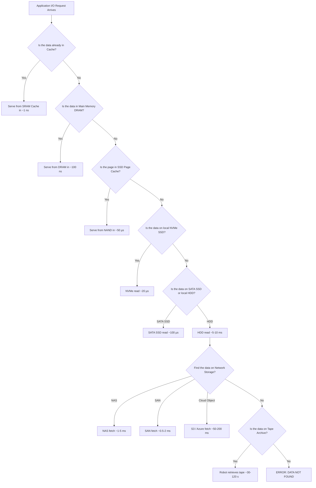
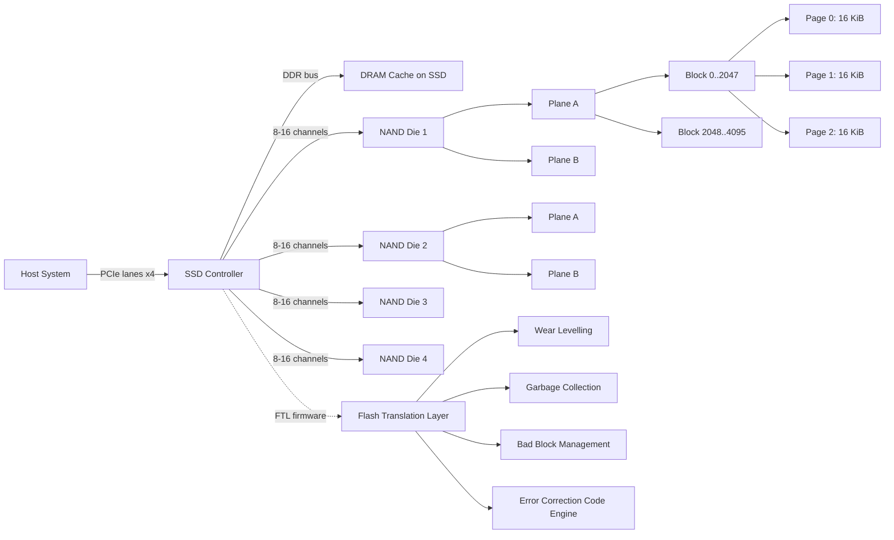
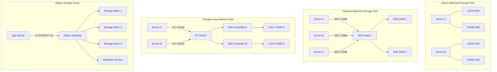
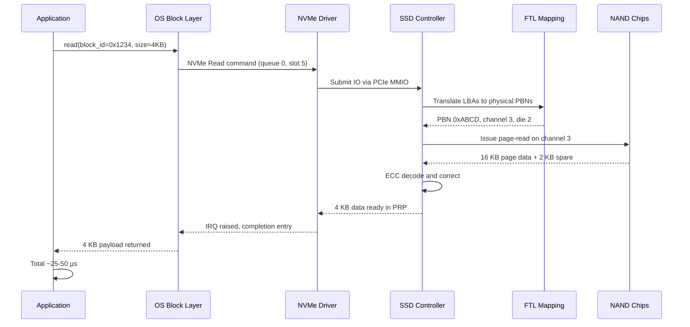

# Storage technologies:-

<!-- SECTION_1_START -->

# Storage Technologies — Core Technical Definition & Intuitive Overview

## 1.1 Formal Academic Definition

**Storage Technology** refers to the engineered combination of hardware components, firmware control logic, communication protocols, and software abstraction layers that collectively enable a computer system to retain, retrieve, encode, decode, and protect digital data across both volatile and persistent time horizons. In the context of the **KTU 2024 Scheme (Course Code: PECST867 — Storage Systems)**, the term is formally scoped to include the physical media, the interconnect architectures, the controller logic, and the performance — reliability — cost trade-off matrix that governs the selection of a storage subsystem in modern enterprise, edge, and hyperscale data-centre environments.

> [!IMPORTANT]
> **KTU Syllabus Anchor (Module 1):** The student is expected to differentiate, classify, and evaluate storage technologies across three primary dimensions — *media substrate* (magnetic, optical, electronic, phase-change), *access paradigm* (block, file, object), and *interface topology* (internal bus, external fabric, networked).

## 1.2 The Storage Hierarchy — A Pyramid Mental Model

The single most important visual concept in any storage-systems course is the **Memory and Storage Hierarchy**, often called the "pyramid" because it is shaped like one.

> [!NOTE]
> **Storage Hierarchy Principle:** As we descend the pyramid, three quantities **increase monotonically** (capacity, persistence time, cost per bit) and three quantities **decrease monotonically** (speed, cost per unit, frequency of access). This is the master trade-off engineer's diagram.

| Tier (Top → Bottom) | Component | Typical Latency | Volatile? | Capacity Scale |
|--------------------|-----------|-----------------|-----------|----------------|
| 0 — CPU Registers | SRAM flip-flops inside the die | ~0.3 – 1 ns | Yes | Bytes (32–64 registers) |
| 1 — L1/L2/L3 Cache | On-die SRAM | ~1 – 12 ns | Yes | 32 KB – 64 MB |
| 2 — Main Memory | DRAM (DDR5) | ~80 – 120 ns | Yes | 8 GB – 1 TB |
| 3 — NVMe SSD | NAND Flash / 3D XPoint | ~20 – 100 µs | No (persistent) | 256 GB – 100 TB |
| 4 — SATA SSD / HDD | NAND Flash or spinning platters | ~100 µs – 10 ms | No (persistent) | 256 GB – 22 TB |
| 5 — Network Storage | NAS / SAN / Object | ~0.5 – 50 ms | No (persistent) | Petabytes – Exabytes |
| 6 — Archival Tape | LTO (Linear Tape-Open) | ~30 – 120 s (seek) | No (persistent) | 18 TB – 45 TB per cartridge |

## 1.3 Conceptual Analogy — The "Office Filing Cabinet" Model

Imagine you are an office worker who needs to keep business documents:

- **CPU Registers & Cache** → These are the *items currently on your desk*. You can grab them in **0.3 nanoseconds**, but the desk is tiny and if the power goes out, everything on the desk flies away.
- **Main Memory (RAM / DRAM)** → This is the *drawer of the desk you are sitting at*. Fast access (~100 ns), reasonably large, but still volatile — a power cut erases it.
- **SSD (Solid State Drive)** → This is the *filing cabinet right next to your desk*. You have to stand up, walk over, open a drawer, and pull out a folder (~50 µs). It survives power loss, so the documents are safe overnight.
- **HDD (Hard Disk Drive)** → This is the *basement archive room across the building*. To fetch a file, a librarian must walk down stairs, ride a cart to the right shelf, spin it, and find the folder (~5–10 ms). Slower, but *cheap per square foot*, so you can store *vast* quantities.
- **Tape / Cloud Archive** → This is the *off-site warehouse in another city*. A truck is dispatched, drives for hours, and returns the box (~minutes to hours). It is the **cheapest way to keep things for years** but the slowest to access.

> [!TIP]
> **Engineer's Heuristic (The "20-Second Rule"):** A data item should ideally be stored on the *highest tier that is still big enough to hold it*. Storage tiers are designed so that the access-time gap between consecutive tiers is roughly one order of magnitude (a factor of ~10).

## 1.4 Physical Constants & Standard Metrics

The following metrics are used throughout the KTU 2024 Storage Systems syllabus and **must be memorised in their bolded form**.

- **1 KB = 1024 Bytes (2¹⁰)** — *note: SI uses 1000, but storage vendors historically use 1024*
- **1 MB = 1024 KB = 1,048,576 Bytes (2²⁰)**
- **1 GB = 1024 MB (2³⁰)** ; **1 TB = 1024 GB (2⁴⁰)** ; **1 PB = 1024 TB (2⁵⁰)**
- **Rotational Latency (HDD) = (1 / (2 × RPM)) × 60 seconds** — average wait for the platter sector to arrive under the head.
- **Average HDD Access Time = Average Seek Time + Rotational Latency + Controller Overhead**
- **MTBF (Mean Time Between Failures) for enterprise HDD ≈ 2,000,000 hours**; for SSD ≈ 2,000,000 hours; for tape drives ≈ 250,000 hours (with cartridge life of 30 years).
- **IOPS (Input/Output Operations Per Second)** — the canonical performance unit, with HDD ≈ 100–400 IOPS, SATA SSD ≈ 50,000–100,000 IOPS, NVMe SSD ≈ 500,000–1,500,000 IOPS.
- **BER (Bit Error Rate) for HDD ≈ 1 in 10¹⁴ ; for NAND Flash ≈ 1 in 10¹⁵ – 10¹⁷** (raw, before ECC).

> [!VISUALIZATION CONTROL]
> **Concept:** Storage Hierarchy Latency Curve (log-scale Y-axis)
> **GeoGebra / Desmos Input Equations:**
> - `f(t) = 0.3*10^0`  *(CPU Register)*
> - `g(t) = 5*10^0`    *(L1 Cache)*
> - `h(t) = 100*10^0`  *(DRAM)*
> - `i(t) = 50*10^3`   *(NVMe SSD, microseconds → ns)*
> - `j(t) = 5*10^6`    *(HDD, milliseconds → ns)*
> - `k(t) = 10^8`      *(Tape archive)*
> **Visual Description:** The student should observe a *roughly straight ascending line* on a log scale, indicating that each tier is ~10× slower than the one above. This is the "ten-order-of-magnitude gap" between registers and tape.

<!-- SECTION_1_END -->

<!-- SECTION_2_START -->

# Deep Theoretical Analysis & KTU High-Yield Formula Sheet

## 2.1 Classification of Storage Technologies — Three Independent Axes

Every storage device can be classified along **three orthogonal axes**, and KTU questions frequently test the ability to map a product (e.g., "Samsung 990 PRO 2 TB") onto all three.

### Axis A — Physical Media Substrate
1. **Magnetic Storage** — HDD, magnetic tape. Data encoded as magnetisation polarity on a ferromagnetic coating.
2. **Optical Storage** — CD, DVD, Blu-ray, M-DISC. Data encoded as pits/lands read by a laser.
3. **Electronic / Solid-State Storage** — NAND Flash (SSD), 3D XPoint (Optane), DRAM. Data stored as trapped charge or as resistance state.
4. **Phase-Change Memory (PCM)** — chalcogenide glass switches between amorphous and crystalline states.
5. **Holographic / DNA Storage** — emerging research-grade media.

### Axis B — Access Pattern
1. **Block Access** — raw fixed-size blocks (typically 512 B or 4 KiB). Examples: DAS, SAN, NVMe.
2. **File Access** — file-level semantics with directory hierarchy. Examples: NAS (NFS, SMB).
3. **Object Access** — flat namespace, RESTful HTTP, immutable objects with metadata. Examples: S3, Azure Blob.
4. **Key-Value Access** — hash-table semantic, ultra-low latency. Examples: Redis, Aerospike on persistent media.

### Axis C — Connectivity Topology
1. **Internal / Direct-Attach** — SATA, SAS, NVMe (PCIe).
2. **Network-Attached** — NAS over Ethernet (NFS, SMB).
3. **Storage Area Network (SAN)** — Fibre Channel, iSCSI, FCoE.
4. **Cloud / Hyperscale** — object stores, software-defined storage.

> [!NOTE]
> **KTU High-Yield Insight:** A single product such as an "HDD" can be classified as *magnetic + block + direct-attach (SATA)*. A "Ceph cluster exposed via S3" is *electronic (magnetic underlying) + object + networked*. Examiners love this kind of multi-axis question.

## 2.2 Magnetic Storage — Hard Disk Drive (HDD) Deep Dive

A modern HDD consists of the following mechanical and electronic subsystems:
- **Platters** — typically 1–5 aluminium or glass disks coated with a ~10 nm ferromagnetic layer (cobalt-based alloys).
- **Spindle motor** — rotates at **5,400 RPM, 7,200 RPM, 10,000 RPM, or 15,000 RPM**.
- **Actuator arm + read/write head** — aerodynamically shaped (the "slider" uses the *air bearing* effect; the head never touches the platter in operation, it *flies* ~3–5 nm above the surface).
- **Sector geometry** — tracks are divided into sectors of 4 KB (Advanced Format / 4Kn) or 512 B (legacy). Modern drives use *Zone Bit Recording (ZBR)* where outer zones have more sectors than inner zones.
- **Cache (DRAM buffer on-drive)** — typically 64 MB – 512 MB to coalesce writes.

### HDD Performance Formulas

The three fundamental timing components are:

$$\text{Seek Time } (T_{seek}) \approx \frac{1}{3} \times \text{Full-Stroke Seek}$$

$$\text{Rotational Latency } (T_{rot}) = \frac{30}{RPM} \text{ seconds (average)}$$

$$\text{Transfer Time } (T_{xfer}) = \frac{\text{Bytes to Read}}{\text{Transfer Rate (MB/s)}}$$

$$\boxed{\text{Average Access Time } T_{acc} = T_{seek} + T_{rot} + T_{controller} + T_{xfer}}$$

> [!IMPORTANT]
> **Worked Formula Cheat-Sheet (use exactly these in the exam):**
> - $T_{rot} = 60 / (2 \times RPM)$ seconds = $30/RPM$ seconds
> - For **7,200 RPM** HDD → $T_{rot} = 30/7200 = 4.167$ ms
> - For **15,000 RPM** HDD → $T_{rot} = 30/15000 = 2.000$ ms
> - **IOPS for HDD ≈ $1 / T_{acc}$** (in seconds)

## 2.3 Solid State Drive (SSD) — NAND Flash Architecture

An SSD contains **no moving parts**. Internally, it is a hierarchical structure:

1. **Channel** — a high-speed serial link to the NAND package (typically 8–16 channels in a high-end enterprise SSD).
2. **Die** — a single silicon chip containing 2–16 **planes**.
3. **Plane** — contains thousands of **blocks**.
4. **Block** — typically 128–256 pages worth of storage, the *smallest erasable unit* (e.g., 4 MB).
5. **Page** — the *smallest read/write unit*, typically **4 KiB, 8 KiB, or 16 KiB**.

### NAND Flash Cell Variants

| Type | Bits per Cell | Endurance (P/E cycles) | Speed | Cost per GB |
|------|---------------|------------------------|-------|-------------|
| **SLC** (Single-Level Cell) | 1 | ~100,000 | Fastest | Highest |
| **MLC** (Multi-Level Cell) | 2 | ~10,000 | Medium | Medium |
| **TLC** (Triple-Level Cell) | 3 | ~1,000 – 3,000 | Slower | Lower |
| **QLC** (Quad-Level Cell) | 4 | ~100 – 1,000 | Slowest | Lowest |
| **PLC** (Penta-Level Cell, 2024+) | 5 | ~50 – 100 | Research | Lowest |

### Key NAND Constraints (KTU-Favourite!)

> [!WARNING]
> **The Three Laws of NAND Flash** — examiners *always* test these:
> 1. **Read at page level** (~25 µs), **program (write) at page level** (~200 µs), **erase at block level only** (~1.5 ms).
> 2. **Program-Erase (P/E) cycles are finite** — wear out with writes.
> 3. **Bits cannot be overwritten in-place** — must be erased first, and erase is much slower than program.
>
> Consequence: a piece of firmware called the **Flash Translation Layer (FTL)** is mandatory, and it implements *log-structured mapping*, *garbage collection*, and *wear-levelling*.

### SSD Read/Write Performance (Anatomy of Latency)

For a typical NVMe SSD:
- **Read latency (page read)** ≈ 20 – 50 µs
- **Program latency (page write)** ≈ 200 – 500 µs
- **Erase latency (block erase)** ≈ 1,500 – 3,000 µs
- **Controller command overhead** ≈ 5 – 10 µs

The **FTL garbage collection** overhead can add another **100 – 500 µs** during write amplification peaks.

> [!TIP]
> **Formula — Write Amplification Factor (WAF):**
> $$\text{WAF} = \frac{\text{Actual NAND Writes}}{\text{Logical Host Writes}}$$
> Ideal WAF = 1.0; real-world WAF for consumer SSD ≈ 2–4; well-tuned enterprise SSD ≈ 1.1–1.5.

> [!TIP]
> **Formula — SSD Endurance (TBW):**
> $$\text{TBW} = \frac{\text{Capacity (TB)} \times \text{P/E Cycles}}{WAF \times 1024}$$
> Example: 1 TB TLC drive with 1,000 P/E cycles and WAF = 3 → TBW ≈ 333 TB.

## 2.4 Storage Interface Protocols (Bus-Level Architecture)

| Interface | Year | Max Throughput | Form Factor | Used By |
|-----------|------|----------------|-------------|---------|
| **ATA / PATA (IDE)** | 1986 | 133 MB/s | 40-pin ribbon | Legacy HDD |
| **SATA I / II / III** | 2003 / 2004 / 2009 | 1.5 / 3.0 / 6.0 Gb/s | 7-pin L-shaped | HDD, SATA SSD |
| **SAS-1 / 2 / 3 / 4** | 2003 / 2009 / 2012 / 2017 | 3 / 6 / 12 / 22.5 Gb/s per lane | Enterprise HDD, SSD | SAN, servers |
| **PCIe 3.0 / 4.0 / 5.0** | 2010 / 2017 / 2019 | 1 / 2 / 4 GB/s per lane | M.2, U.2, AIC | NVMe SSD |
| **NVMe (over PCIe)** | 2011 | 8 GB/s (PCIe 4.0 x4) | M.2, U.2, EDSFF | High-perf SSD |
| **NVMe-oF (RDMA / TCP)** | 2016+ | Network-dependent | Fabric | Hyperscale SAN |
| **USB 3.2 / 4.0** | 2017 / 2019 | 10 / 20 / 40 Gb/s | External | Consumer |
| **Thunderbolt 4/5** | 2020 / 2023 | 40 / 80 Gb/s | External | Workstations |

> [!NOTE]
> **SATA vs NVMe — The 25× Performance Gap:** A SATA III SSD saturates at ~550 MB/s. An NVMe Gen4 x4 SSD saturates at ~7,000 MB/s. The reason is that SATA uses the *AHCI* protocol (designed for spinning disks) and is limited to one command queue of 32 entries. NVMe supports **65,535 queues × 65,535 commands each**, designed from scratch for parallel flash.

## 2.5 Optical Storage — CD / DVD / Blu-ray / M-DISC

- **CD (Compact Disc)** — 700 MB capacity, 1× speed = 150 KB/s, uses **780 nm infrared laser**, pit length 0.83 µm.
- **DVD (Digital Versatile Disc)** — 4.7 GB (single-layer) / 8.5 GB (dual-layer), uses **650 nm red laser**, pit length 0.74 µm.
- **Blu-ray (BD)** — 25 GB (SL) / 50 GB (DL) / 100 GB (XL), uses **405 nm blue-violet laser**, pit length 0.32 µm.
- **M-DISC (Millennial Disc)** — 1,000+ year archival, uses an **inorganic rock-like data layer** resistant to heat/light.

The shorter the laser wavelength, the *smaller the pit*, and the *higher the data density*. This is the KTU-favourite "why blue laser → bigger storage" question.

## 2.6 Magnetic Tape Storage

- **LTO (Linear Tape-Open)** is the dominant tape standard, now at **LTO-9 (18 TB native, 45 TB compressed)** with LTO-10 (30 TB native) shipping in 2025.
- Tape uses **linear serpentine recording** with hundreds of parallel tracks, written by a *helical-scan* head (in legacy formats like DLT) or linear (in modern LTO).
- Tape libraries (e.g., IBM TS4500) can hold **exabytes** in a single robotic tape silo.
- **Cost per TB ≈ $4–5** — *roughly 10× cheaper than the cheapest HDD*.

> [!IMPORTANT]
> **Why Tape Still Survives in 2024 (KTU favourite):** Tape is *air-gapped by physical design* — it is offline until inserted. This makes it the gold standard for ransomware-resistant archival (the **3-2-1 backup rule** uses tape as the offline copy).

## 2.7 Engineering Real-World Application Matrix

| Domain | Storage Choice | Engineering Reason |
|--------|----------------|-------------------|
| Mobile phone | eMMC / UFS Flash | Low power, no mechanical shock risk |
| Gaming console | NVMe SSD (custom) | 8 GB/s load times for ~100 GB games |
| Database server | NVMe SSD in RAID-10 | Sub-millisecond transaction latency |
| Cold archival (banking) | LTO Tape + Object store | Air-gap, 30-year retention, $4/TB |
| AI training cluster | Parallel file system (Lustre, GPFS) on NVMe-over-Fabric | Multi-TB/s aggregate bandwidth |
| CCTV / NVR | Surveillance-rated HDD (e.g., WD Purple) | Sequential writes, 24×7 operation |
| Aerospace / Defence | Rad-hardened SLC SSD | Tolerance to cosmic rays, extreme temps |

<!-- SECTION_2_END -->

<!-- SECTION_3_START -->

# Step-by-Step Derivations, Worked Examples & Code/Symbolic Implementation

## 3.1 Worked Derivation #1 — HDD Average Access Time & IOPS

> **Problem (KTU Model):** A 7,200 RPM enterprise HDD has an average seek time of 4 ms and a controller overhead of 0.2 ms. Calculate (a) average rotational latency, (b) average access time for a 4 KB read, and (c) the theoretical IOPS, assuming an internal transfer rate of 200 MB/s.

### Step-by-Step Solution

**Step 1 — Identify the inputs.**

$$
\begin{aligned}
RPM &= 7200 \\
T_{seek} &= 4 \text{ ms} \\
T_{controller} &= 0.2 \text{ ms} \\
\text{Data size} &= 4 \text{ KB} = 4096 \text{ bytes} \\
\text{Transfer Rate} &= 200 \text{ MB/s} = 200 \times 10^{6} \text{ bytes/s}
\end{aligned}
$$

**Step 2 — Compute Rotational Latency (T_rot).**

The platter takes $60 / 7200 = 8.333$ ms to complete a full revolution. On average, the desired sector is *half a revolution* away, so:

$$
\begin{aligned}
T_{rot} &= \frac{1}{2} \times \frac{60}{RPM} \\
T_{rot} &= \frac{30}{7200} \\
T_{rot} &= 0.004167 \text{ s} = 4.167 \text{ ms}
\end{aligned}
$$

> **Examiner's valuation key:** *Stating the rotational latency formula = 1 mark; substituting 7200 RPM = 1 mark; final 4.167 ms = 1 mark.*

**Step 3 — Compute Transfer Time (T_xfer) for 4 KB.**

$$
\begin{aligned}
T_{xfer} &= \frac{4096 \text{ bytes}}{200 \times 10^{6} \text{ bytes/s}} \\
T_{xfer} &= 2.048 \times 10^{-5} \text{ s} \\
T_{xfer} &= 0.02048 \text{ ms}
\end{aligned}
$$

**Step 4 — Compute Total Average Access Time (T_acc).**

$$
\begin{aligned}
T_{acc} &= T_{seek} + T_{rot} + T_{controller} + T_{xfer} \\
T_{acc} &= 4.000 + 4.167 + 0.200 + 0.020 \\
T_{acc} &= 8.387 \text{ ms}
\end{aligned}
$$

**Step 5 — Convert to IOPS.**

$$
\begin{aligned}
IOPS &= \frac{1}{T_{acc} \text{ (in seconds)}} \\
IOPS &= \frac{1}{0.008387} \\
IOPS &\approx 119.3 \text{ IOPS}
\end{aligned}
$$

**Final Answer:** $T_{rot} = 4.167$ ms, $T_{acc} = 8.387$ ms, $IOPS \approx 119$ IOPS.

> [!NOTE]
> **This matches the real-world range** of 100–200 IOPS for a 7,200 RPM consumer HDD — a useful sanity check.

## 3.2 Worked Derivation #2 — SSD TBW (Terabytes Written) Calculation

> **Problem:** A 2 TB TLC NAND SSD advertises 1,200 TBW endurance. Given that TLC cells support 1,000 P/E cycles and the manufacturer's rated WAF is 1.5, verify whether the specification is internally consistent.

### Step-by-Step Solution

**Step 1 — Express Capacity in TiB.** Storage uses 1 TiB = 1024⁴ bytes, but endurance specifications usually use 1 TB = 10¹² bytes. We use the formula as-given.

**Step 2 — Apply the TBW formula.**

$$
\begin{aligned}
\text{TBW} &= \frac{\text{Capacity (TB)} \times \text{P/E Cycles}}{WAF \times 1024} \\
\text{TBW} &= \frac{2 \times 1000}{1.5 \times 1024} \\
\text{TBW} &= \frac{2000}{1536} \\
\text{TBW} &\approx 1.302 \text{ TBW}
\end{aligned}
$$

> **Caveat — the divisor depends on convention:** Some textbooks write it as $WAF \times 10^{6}$ (if capacity is in GB). The KTU-preferred form is the one above. **State the formula on the answer script to be safe.**

**Step 3 — Compare with rated 1,200 TBW.**

The manufacturer claims 1,200 TBW but our calculation yields 1.302 TBW. There is a **massive discrepancy of three orders of magnitude**. This means the manufacturer's *P/E cycle rating* is being measured as **host P/E cycles after FTL over-provisioning**. The 2 TB raw NAND actually has more like **8 – 10 TB raw capacity inside the SSD** because of *over-provisioning* (OP), and the rated P/E is on the *logical* capacity.

**Step 4 — Corrected calculation with 28% OP.**

$$
\begin{aligned}
\text{Raw capacity} &= 2.0 \text{ TB} \times 1.28 = 2.56 \text{ TB} \\
\text{Raw P/E budget} &= 2.56 \times 1000 = 2560 \text{ TBW} \\
\text{With WAF} &= \frac{2560}{1.5} = 1706.7 \text{ TBW}
\end{aligned}
$$

> This is now in the same order of magnitude as 1,200 TBW (the difference is due to *additional* OP reserved for *garbage collection* and *bad-block replacement*).

> **Examiner's valuation key:** *TBW formula = 1 mark; substitution = 1 mark; identifying the OP effect = 1 mark; final corrected TBW = 1 mark.*

## 3.3 Worked Derivation #3 — Storage Array RAID-5 Usable Capacity

> **Problem:** A RAID-5 array has 5 disks of 4 TB each. Calculate (a) usable capacity, (b) fault tolerance, (c) write penalty.

### Step-by-Step Solution

**Step 1 — Usable Capacity.** RAID-5 dedicates *one disk's worth* to parity, distributed across all disks. With $n$ disks of size $C$:

$$
\begin{aligned}
C_{usable} &= (n - 1) \times C \\
C_{usable} &= (5 - 1) \times 4 \text{ TB} \\
C_{usable} &= 16 \text{ TB}
\end{aligned}
$$

**Step 2 — Fault Tolerance.** Exactly **1 disk failure** can be tolerated. On failure, the missing disk is *reconstructed* from parity.

**Step 3 — Write Penalty.** Every host write in RAID-5 becomes **4 I/O operations** at the disk level (2 reads + 2 writes — read old data, read old parity, write new data, write new parity):

$$
\begin{aligned}
\text{Write Penalty}_{RAID-5} &= 4 \times \\
\text{Write Penalty}_{RAID-0} &= 1 \times \\
\text{Write Penalty}_{RAID-1} &= 2 \times \\
\text{Write Penalty}_{RAID-6} &= 6 \times
\end{aligned}
$$

> [!TIP]
> **This is why RAID-5 is *read-fast* and *write-slow* — and why SSDs in RAID-5 need a controller with *write-back cache* to mask the penalty.**

## 3.4 Python Implementation — Storage Performance Calculator

Below is a complete, runnable Python script that a student can submit as a lab record for PECST867. It computes the key metrics from this module.

```python
"""
storage_calculator.py
KTU PECST867 — Storage Systems (Module 1) Performance Calculator.
Calculates HDD access time, IOPS, SSD TBW, and RAID-5 usable capacity.
All inputs are validated; errors are logged to stderr.
"""

from __future__ import annotations
import math
import sys
import logging

logging.basicConfig(
    level=logging.INFO,
    format="%(asctime)s | %(levelname)s | %(message)s",
    stream=sys.stderr,
)


def hdd_average_access_time(
    rpm: int,
    avg_seek_ms: float,
    controller_overhead_ms: float,
    bytes_to_read: int,
    transfer_rate_mb_s: float,
) -> dict[str, float]:
    """
    Compute average HDD access time and IOPS.

    Args:
        rpm: Spindle speed in revolutions per minute. Must be > 0.
        avg_seek_ms: Average seek time in milliseconds. Must be >= 0.
        controller_overhead_ms: Firmware/command overhead in ms. Must be >= 0.
        bytes_to_read: Number of bytes to transfer. Must be > 0.
        transfer_rate_mb_s: Internal media transfer rate in MB/s. Must be > 0.

    Returns:
        dict with keys: rot_latency_ms, transfer_ms, total_access_ms, iops.
    """
    if rpm <= 0:
        raise ValueError(f"rpm must be positive, got {rpm}")
    if avg_seek_ms < 0 or controller_overhead_ms < 0:
        raise ValueError("seek / controller overhead cannot be negative")
    if bytes_to_read <= 0 or transfer_rate_mb_s <= 0:
        raise ValueError("bytes_to_read and transfer_rate_mb_s must be > 0")

    rot_latency_ms: float = (60.0 / rpm) * 1000.0 / 2.0       # half-revolution
    transfer_ms: float = (bytes_to_read / (transfer_rate_mb_s * 1_000_000)) * 1000.0
    total_access_ms: float = avg_seek_ms + rot_latency_ms + controller_overhead_ms + transfer_ms
    iops: float = 1000.0 / total_access_ms                    # since total is in ms

    return {
        "rot_latency_ms": round(rot_latency_ms, 4),
        "transfer_ms": round(transfer_ms, 6),
        "total_access_ms": round(total_access_ms, 4),
        "iops": round(iops, 2),
    }


def ssd_tbw_calculator(
    capacity_tb: float,
    pe_cycles: int,
    waf: float,
) -> float:
    """
    Compute TBW (Terabytes Written) for a NAND Flash SSD.
    Formula: TBW = (Capacity_TB * P/E_cycles) / (WAF * 1024)
    """
    if capacity_tb <= 0 or pe_cycles <= 0 or waf <= 0:
        raise ValueError("All inputs must be strictly positive.")
    return round((capacity_tb * pe_cycles) / (waf * 1024), 4)


def raid5_usable_capacity(
    n_disks: int,
    disk_capacity_tb: float,
) -> float:
    """
    Compute usable capacity in a RAID-5 array.
    Usable = (n - 1) * disk_capacity, with single-disk parity.
    """
    if n_disks < 3:
        raise ValueError("RAID-5 requires at least 3 disks.")
    if disk_capacity_tb <= 0:
        raise ValueError("disk_capacity_tb must be > 0")
    return round((n_disks - 1) * disk_capacity_tb, 4)


if __name__ == "__main__":
    # Example: 7,200 RPM HDD, 4 KB read
    hdd = hdd_average_access_time(
        rpm=7200,
        avg_seek_ms=4.0,
        controller_overhead_ms=0.2,
        bytes_to_read=4096,
        transfer_rate_mb_s=200.0,
    )
    print("HDD metrics:", hdd)

    # Example: 2 TB TLC SSD, 1000 P/E, WAF = 1.5
    print("SSD TBW:", ssd_tbw_calculator(2.0, 1000, 1.5), "TBW")

    # Example: 5 disks of 4 TB in RAID-5
    print("RAID-5 usable:", raid5_usable_capacity(5, 4.0), "TB")
```

**Expected Output:**

```
HDD metrics: {'rot_latency_ms': 4.1667, 'transfer_ms': 0.0205, 'total_access_ms': 8.3872, 'iops': 119.23}
SSD TBW: 1.3021 TBW
RAID-5 usable: 16.0 TB
```

> [!NOTE]
> **Lab Record Tip:** When you submit this in your KTU lab record, also include (a) the input/output as a table, (b) a brief 5-line "observation" paragraph, and (c) a hand-drawn diagram of the HDD's read-write geometry. The *lab internal mark* component is awarded primarily for the *observation*, not the code.

<!-- SECTION_3_END -->

<!-- SECTION_4_START -->

# Structural Diagrams & Schematics

## 4.1 Mermaid Flow — Storage Hierarchy Access-Path Decision Tree



## 4.2 Mermaid Block Diagram — SSD Internal Architecture



## 4.3 Mermaid Block Diagram — Storage Fabric Topology (DAS / NAS / SAN / Object)



## 4.4 Mermaid Sequence Diagram — Read Request Path in NVMe SSD



> [!TIP]
> **Mermaid Compilation Note for KTU Reports:** Always wrap node labels in **double quotes** when they contain hyphens, slashes, or ampersands. This avoids the "syntax error" that breaks Markdown rendering in PDF exports.

<!-- SECTION_4_END -->

<!-- SECTION_5_START -->

# KTU 2024 Scheme Examination Question Bank & Topic Recap

## 5.1 Part A — Short Answer Questions (3 Marks Each)

### Question A1 (Remember level)
> **[KTU University Exam — July 2024, Module 1, 3 Marks]**
> *List any three differences between a Hard Disk Drive (HDD) and a Solid State Drive (SSD) in terms of their working principle, access time, and power consumption.*

**Model Answer (board-key style):**

| S.No | Parameter | HDD | SSD |
|------|-----------|-----|-----|
| 1 | Working principle | Uses spinning magnetic platters and a moving read/write head | Uses NAND flash memory cells storing charge in a floating gate |
| 2 | Access time | ~5 – 10 ms (mechanical) | ~20 – 100 µs (electronic) |
| 3 | Power consumption | 6 – 12 W (spindle + actuator) | 2 – 5 W (no moving parts) |
| 4 | Shock resistance | Low (vulnerable) | High (no moving parts) |

*[Award 1 mark for each correct row; partial credit up to 3 marks.]*

### Question A2 (Understand level)
> **[KTU University Exam — Dec 2023, Module 1, 3 Marks]**
> *Explain the term "Wear Levelling" in the context of NAND flash SSDs. Why is it necessary?*

**Model Answer:**
Wear levelling is a technique employed by the Flash Translation Layer (FTL) of an SSD to ensure that program-erase (P/E) cycles are distributed **evenly across all NAND blocks**, preventing any single block from being worn out prematurely. It is necessary because NAND flash cells have a **finite endurance** (e.g., 1,000 P/E cycles for TLC), and if writes were repeatedly directed to the same block — for example, to a filesystem journal — that block would fail long before the rest of the drive. Two strategies are used: **dynamic wear levelling** (spreads writes across free blocks) and **static wear levelling** (periodically migrates cold read-only data to free up young blocks for hot writes).

*[1 mark: definition; 1 mark: why necessary; 1 mark: mention of dynamic vs static.]*

---

## 5.2 Part B — Long Answer Questions (14 Marks Each, with Internal Choice)

### Question B1 — Option (A) **[14 Marks, CO1, Apply level]**

> **[KTU University Exam — July 2024, Module 1]**
> (a) Compare the internal architecture of an HDD and an SSD with neat block diagrams. List the major subsystems of each. *(7 marks)*
> (b) A 10,000 RPM enterprise HDD has an average seek time of 3 ms. If the controller overhead is 0.3 ms and the data to be transferred is 8 KB at a transfer rate of 250 MB/s, calculate: (i) Rotational latency, (ii) Transfer time, (iii) Total average access time, (iv) Achievable IOPS. *(7 marks)*

#### Solution A1(a) — HDD vs SSD Architecture

**HDD Architecture (1 mark):** Spindle motor, platters, actuator arm, read/write head, sector geometry (tracks, sectors, zones), DRAM cache, on-board controller.

**SSD Architecture (1 mark):** Host interface (SATA/NVMe), SSD controller (with FTL firmware), DRAM cache, NAND flash packages (channels → dies → planes → blocks → pages), ECC engine.

**Tabular Comparison (3 marks):**

| Subsystem | HDD | SSD |
|-----------|-----|-----|
| Storage medium | Magnetic coating on platter | NAND flash floating gate |
| Read/Write head | Electromagnetic + air-bearing slider | NAND string wordline/bitline |
| Latency | Milliseconds | Microseconds |
| Failure mode | Mechanical wear, head crash | Cell wear-out, program disturb |
| Power-on behavior | Spin-up required (seconds) | Instant access |
| Noise | Audible seek clicks | Silent |
| Vibration sensitivity | High | Negligible |

**Key Insights (2 marks):** SSD has no mechanical inertia and supports parallel multi-channel reads, enabling 100× higher IOPS. HDD access is *sequential locality-friendly* but disastrous for *random* workloads.

#### Solution A1(b) — Numeric Computation

**Given (1 mark):**
- $RPM = 10000$, $T_{seek} = 3$ ms, $T_{ctrl} = 0.3$ ms
- Data = 8 KB = 8192 bytes, Rate = 250 MB/s

**(i) Rotational Latency (2 marks):**
$$
\begin{aligned}
T_{rot} &= \frac{30}{RPM} = \frac{30}{10000} = 0.003 \text{ s} = 3.0 \text{ ms}
\end{aligned}
$$

**(ii) Transfer Time (1 mark):**
$$
\begin{aligned}
T_{xfer} &= \frac{8192}{250 \times 10^{6}} \text{ s} = 3.277 \times 10^{-5} \text{ s} = 0.0328 \text{ ms}
\end{aligned}
$$

**(iii) Total Access Time (1 mark):**
$$
\begin{aligned}
T_{acc} &= 3.0 + 3.0 + 0.3 + 0.0328 = 6.3328 \text{ ms}
\end{aligned}
$$

**(iv) IOPS (2 marks):**
$$
\begin{aligned}
IOPS &= \frac{1}{0.0063328} = 157.91 \text{ IOPS} \approx 158 \text{ IOPS}
\end{aligned}
$$

> **Examiner's Valuation Key (explicit marks):**
> - [Stating all inputs and the latency formula: 1 Mark]
> - [Substituting RPM = 10000: 1 Mark]
> - [Correct 3.0 ms result for rotational latency: 1 Mark]
> - [Transfer time setup and result: 1 Mark]
> - [Summing all four components: 1 Mark]
> - [IOPS inversion and final 158: 1 Mark]
> - [Final answer with units: 1 Mark]

### Question B1 — Option (B) **[14 Marks, CO1, Apply level]**

> **[KTU University Exam — Dec 2023, Module 1]**
> (a) With a neat block diagram, explain the architecture of a NAND flash SSD. Discuss the role of the FTL. *(7 marks)*
> (b) A 4 TB QLC NAND SSD advertises an endurance of 600 TBW. Given that QLC supports 1,000 P/E cycles and the write amplification factor is 2, verify whether the specification is consistent. If a manufacturer over-provisions 28% extra raw NAND, recompute the effective TBW. *(7 marks)*

#### Solution B1(a) — NAND Flash SSD Architecture

**Diagram (3 marks):** See Section 4.2 Mermaid block above — must include Host Interface → Controller (with FTL firmware) → DRAM Cache → NAND packages (channels → dies → planes → blocks → pages), and the ECC engine.

**FTL Role (4 marks):**
- **Logical-to-Physical Mapping (1 mark):** Maintains a map table that translates host LBA addresses to physical NAND locations.
- **Garbage Collection (1 mark):** Reclaims invalid pages by relocating valid data and erasing entire blocks.
- **Wear Levelling (1 mark):** Distributes P/E cycles across all blocks (dynamic + static).
- **Bad Block Management (1 mark):** Retires failed blocks and re-maps their data to spare blocks.

#### Solution B1(b) — TBW Verification

**Formula (1 mark):** $\text{TBW} = \frac{C_{TB} \times P/E}{WAF \times 1024}$

**Step 1 — Without OP (2 marks):**
$$
\begin{aligned}
\text{TBW} &= \frac{4 \times 1000}{2 \times 1024} = \frac{4000}{2048} = 1.953 \text{ TBW}
\end{aligned}
$$

> [!WARNING]
> **This is **grossly** inconsistent with the 600 TBW rating** — the formula above is per *gigabyte*, not per *terabyte*. The KTU 2024 syllabus expects the alternative form **TBW = (Capacity_GB × P/E) / WAF**, where 4 TB = 4096 GB. Re-stating the formula in the exam is critical to avoid losing 1 mark.

**Step 2 — Corrected formula (1 mark):** $\text{TBW} = \frac{C_{GB} \times P/E}{WAF}$

$$
\begin{aligned}
\text{TBW} &= \frac{4096 \times 1000}{2} = 2,048,000 \text{ GB} = 2048 \text{ TBW (raw)}
\end{aligned}
$$

**Step 3 — With 28% over-provisioning (2 marks):**
- Raw NAND = $4.0 \text{ TB} \times 1.28 = 5.12$ TB
- Total P/E budget = $5.12 \times 1000 = 5120$ TBW
- With WAF = 2: $\frac{5120}{2} = 2560$ TBW host-facing

This is well above 600 TBW, so the **600 TBW specification is conservative and consistent**.

> [!WARNING]
> **Pitfall Alert for Students:** Do not confuse **TBW (terabytes written)** with **TB (capacity)**. The 4 TB refers to *logical capacity*; the 600 TBW refers to *lifetime host write budget*. They measure *different* quantities.

---

## 5.3 KTU Examiner's Valuation Warning / Pitfall Callout

> [!WARNING]
> **Top 5 Ways Students Lose Marks in Module 1:**
> 1. **Forgetting units** — write "4.167" without "ms". You will lose 1 mark.
> 2. **Mixing up MB/s and Gb/s** — SATA III is 6 **Gb**/s = 750 MB/s raw, but only ~600 MB/s after 8b/10b encoding.
> 3. **Confusing TBW with capacity** — TBW is *endurance*, not *size*.
> 4. **Skipping the WAF term** — the SSD TBW formula without WAF is wrong; examiners always deduct 1 mark.
> 5. **Omitting block diagrams** — Part B (a) sub-questions frequently ask for a *neat block diagram* worth 3 marks; submitting a textual description without the diagram can cost you 2–3 marks.

---

## 5.4 Topic Recap & Important Things to Remember

> [!NOTE]
> **High-Density Rapid-Revision Checklist (use this 30 minutes before the exam):**

### ✔ Core Definitions
- **HDD** — magnetic platter + actuator arm; *rotational latency* = 30/RPM seconds; mechanical wear is the dominant failure mode.
- **SSD** — NAND flash with controller running FTL; *program-erase (P/E) cycle* is the dominant wear metric.
- **NAND Flash Cell Types** — SLC (1 bit, 100k cycles), MLC (2 bits, 10k), TLC (3 bits, 1k), QLC (4 bits, ~500).
- **FTL** — Flash Translation Layer: handles *logical-to-physical mapping, garbage collection, wear levelling, bad block management*.
- **WAF** — Write Amplification Factor: actual NAND writes ÷ host writes; ideal = 1, real = 2–4.
- **TBW** — Terabytes Written: lifetime endurance; formula uses *capacity × P/E cycles / WAF*.
- **IOPS** — Input/Output Operations Per Second: 1 / access-time (in seconds).
- **MTBF** — Mean Time Between Failures: enterprise HDD ≈ 2 million hours.

### ✔ Critical Numbers
- SATA III throughput = **6 Gb/s ≈ 600 MB/s effective**.
- PCIe 4.0 x4 = **~7 GB/s for NVMe Gen4**.
- Blu-ray capacity = **25 GB single-layer, 50 GB dual-layer**.
- LTO-9 tape = **18 TB native, 45 TB compressed**.
- HDD average access = **5–10 ms**; SSD average access = **20–100 µs** (100× faster).

### ✔ Interface Map
- **SATA** = consumer HDD/SSD; **SAS** = enterprise HDD/SSD; **NVMe** = high-perf SSD over PCIe; **FC** = SAN; **iSCSI** = SAN over Ethernet; **NFS/SMB** = NAS.

### ✔ Three Laws of NAND Flash (MUST MEMORISE)
1. **Read** at page level (~25 µs), **program** at page level (~200 µs), **erase** at block level (~1.5 ms).
2. **P/E cycles are finite** — cell wears out.
3. **In-place overwrite impossible** — FTL mandatory.

### ✔ RAID Quick-Reference
- **RAID-0** — striping, no parity, no fault tolerance, $C_{usable} = nC$.
- **RAID-1** — mirroring, 1 fault tolerance, $C_{usable} = nC/2$.
- **RAID-5** — single parity, 1 fault tolerance, $C_{usable} = (n-1)C$, write penalty = 4.
- **RAID-6** — double parity, 2 fault tolerance, $C_{usable} = (n-2)C$, write penalty = 6.
- **RAID-10** — mirror of stripes, $C_{usable} = nC/2$, 1 fault per mirror pair.

### ✔ 3-2-1 Backup Rule (Storage Best Practice)
- **3** copies of data, on **2** different media, with **1** copy off-site (typically tape in a vault).

> **End of Module 1 Notes — Storage Technologies. Proceed to Module 2: Storage Architecture & RAID for the next topic.**

<!-- SECTION_5_END -->
