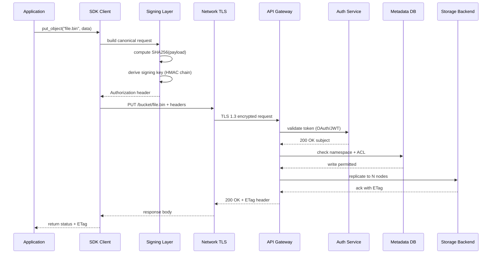
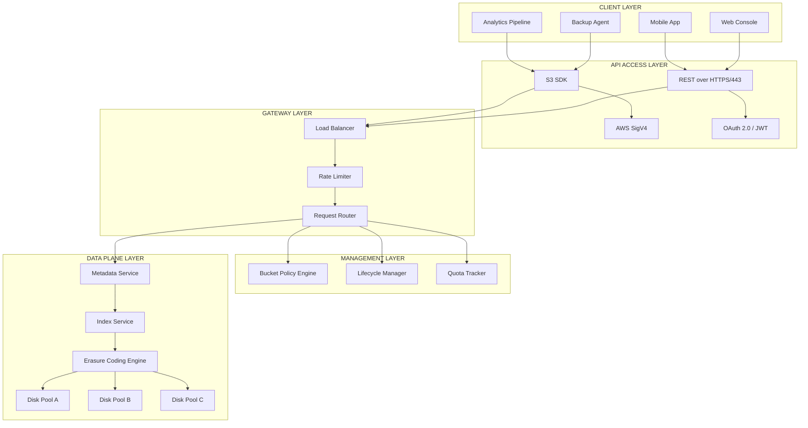

# API Access

<!-- SECTION_1_START -->
# API Access in Data Storage Networking

## 1.1 Formal Definition

In the context of **Storage Systems (PECST867)**, **API (Application Programming Interface) Access** refers to the standardized set of protocols, routines, tools, and definitions that allow software applications to programmatically interact with storage infrastructure — including block, file, and object storage systems — over a network.

Per the KTU 2024 Scheme terminology aligned with SNIA (Storage Networking Industry Association) reference models, a **Storage API** is a contract layer that abstracts the underlying physical or virtual storage media, exposing a uniform set of programmable operations such as **Create, Read, Update, Delete (CRUD)**, metadata queries, snapshotting, replication, and tier management.

The most dominant API paradigms in modern storage are:

- **REST (REpresentational State Transfer)** — stateless, HTTP/HTTPS-based.
- **SOAP (Simple Object Access Protocol)** — XML-based, heavyweight.
- **gRPC** — high-performance, Protocol Buffers over HTTP/2.
- **SCSI / iSCSI Command Set** — block-level SCSI semantics encapsulated in network frames.
- **S3 API** — de-facto object storage standard (AWS S3, MinIO, Ceph RGW).

> [!IMPORTANT]
> **KTU Syllabus Highlight:** The module treats API access as the *programmable control plane* of the storage fabric. Examiners expect students to distinguish between **data-plane** operations (read/write of bytes) and **management-plane** operations (provisioning volumes, listing buckets) — both of which are mediated through APIs.

## 1.2 Conceptual Analogy

Imagine a restaurant kitchen (the **storage array**). You, the customer (the **application**), cannot walk into the kitchen and cook yourself. Instead, you interact with a **waiter** (the **API**). You give the waiter a structured order (the **API request**) using items from a menu (the **API schema**). The waiter translates your order to the chef, then returns your dish on a plate (the **API response**).

Key takeaways from this analogy:

- You never touch the kitchen internals — **abstraction**.
- The menu defines valid orders — **schema / contract**.
- The waiter enforces rules (no raw eggs, no kitchen access) — **authentication & authorization**.
- The plate arrives in a known format — **standardized response (JSON / XML / binary)**.

> [!NOTE]
> **Core Definition for Exam:** *An API is a contract between a consumer and a provider that defines valid requests, expected responses, error semantics, and authentication rules, enabling decoupled, programmatic access to storage resources.*

## 1.3 Physical & Logical Constants

Standard metrics and parameters examiners expect to be remembered:

- **Default HTTPS port for REST APIs:** **443**
- **Default HTTP port:** **80**
- **iSCSI default port:** **3260**
- **S3 endpoint pattern:** `https://<bucket>.<region>.s3.amazonaws.com`
- **REST idempotency key (HTTP methods):** **GET, HEAD, PUT, DELETE** are idempotent; **POST, PATCH** are non-idempotent.
- **HTTP status code 2xx:** success; **4xx:** client error; **5xx:** server error.

> [!VISUALIZATION CONTROL]
> **Concept:** Latency vs. Throughput trade-off in API calls
> **GeoGebra / Desmos Input Equations:**
> * `f(x) = \frac{1}{x}` (Hyperbolic throughput-latency relation)
> * `g(x) = 1000 \cdot x` (Linear payload-size scaling)
> **Visual Description:** Plot response time (ms) on the y-axis against payload size (KB) on the x-axis. The student should observe a near-linear increase in latency for large object transfers and how pagination (`?limit=&marker=`) flattens the curve by chunking requests.

---

<!-- SECTION_1_END -->

<!-- SECTION_2_START -->
# Deep Theoretical Analysis & KTU High-Yield Formula Sheet

## 2.1 The API Stack in Storage Networking

Storage APIs sit on a layered stack. From bottom to top:

1. **Physical / Transport Layer** — Ethernet, Fibre Channel, InfiniBand.
2. **Network Protocol Layer** — TCP/IP, FC, iSCSI, NVMe-oF.
3. **API Encoding Layer** — JSON, XML, Protocol Buffers.
4. **API Protocol Layer** — REST, SOAP, gRPC.
5. **Authentication Layer** — OAuth 2.0, JWT, API Keys, mTLS.
6. **Application Semantics** — CRUD, snapshot, replication, lifecycle policies.

> [!NOTE]
> The KTU 2024 Scheme module specifically highlights **REST** as the primary teaching vehicle because of its alignment with web-based storage management consoles and object storage.

## 2.2 REST API Principles (The "Roy Fielding Constraints")

A storage API is considered *RESTful* if it satisfies these six constraints:

- **Client–Server separation** — UI and storage concerns are decoupled.
- **Statelessness** — each request contains all information needed; no server-side session.
- **Cacheability** — responses declare cache-ability to reduce I/O load.
- **Uniform Interface** — standardized resource identifiers (URIs) and HTTP verbs.
- **Layered System** — proxies, load balancers, gateways may intervene transparently.
- **Code on Demand (optional)** — server may return executable scripts.

## 2.3 HTTP Methods Mapped to Storage Operations

| HTTP Method | CRUD | Storage Operation | Idempotent | Safe |
|-------------|------|-------------------|------------|------|
| GET | Read | List buckets, fetch object metadata, read file | Yes | Yes |
| POST | Create | Multipart upload init, create volume (in some APIs) | No | No |
| PUT | Create/Update | Upload object, set bucket policy, replace volume | Yes | No |
| PATCH | Update | Modify object metadata, partial update | No | No |
| DELETE | Delete | Delete object, delete volume | Yes | No |
| HEAD | Read (metadata only) | Check object existence, get size | Yes | Yes |

## 2.4 Common Storage API Endpoints (S3 Reference Model)

| Operation | HTTP Method | URI Pattern | Purpose |
|-----------|-------------|-------------|---------|
| List Buckets | GET | `/` | Enumerate all buckets |
| Create Bucket | PUT | `/{bucket}` | Allocate a new bucket |
| Head Bucket | HEAD | `/{bucket}` | Check existence / region |
| Delete Bucket | DELETE | `/{bucket}` | Remove empty bucket |
| Put Object | PUT | `/{bucket}/{key}` | Upload object |
| Get Object | GET | `/{bucket}/{key}` | Download object |
| Delete Object | DELETE | `/{bucket}/{key}` | Remove object |
| Multipart Init | POST | `/{bucket}/{key}?uploads` | Begin multipart upload |
| Copy Object | PUT | `/{bucket}/{key}` (with `x-amz-copy-source`) | Server-side copy |

> [!IMPORTANT]
> **Engineering Utility:** S3-compatible APIs have become the *lingua franca* of object storage. Vendors like **MinIO, Ceph RGW, Wasabi, Cloudflare R2, and Backblaze B2** all implement the S3 API, making application portability trivial — the same SDK works across providers.

## 2.5 Authentication Mechanisms

| Mechanism | Token Type | Use Case in Storage |
|-----------|-----------|---------------------|
| API Key | Static string in header | Simple scripted access, dev/CI |
| Basic Auth | Username:Password (Base64) | Legacy management interfaces |
| OAuth 2.0 | Bearer access token | Multi-tenant cloud storage |
| AWS Signature V4 | HMAC-SHA256 signed request | S3, Glacier, DynamoDB |
| mTLS | X.509 client certificate | NVMe-oF, secure gRPC backplane |
| JWT | Signed JSON Web Token | Stateless tenant isolation |

## 2.6 KTU High-Yield Formula Sheet

| # | Concept | Formula / Rule | Units / Notes |
|---|---------|---------------|---------------|
| 1 | Richardson Maturity Model | Level 0 (Plain HTTP) → Level 3 (HATEOAS) | Higher level $\Rightarrow$ better REST compliance |
| 2 | API Latency | $T_{total} = T_{network} + T_{auth} + T_{queue} + T_{process} + T_{serial}$ | Measured in **ms** |
| 3 | Throughput Cap | $R = \frac{P \cdot 8}{T_{transfer}}$ | $R$ in **Mbps**, $P$ payload in **MB** |
| 4 | Pagination | $N_{pages} = \lceil \frac{N_{total}}{L_{page}} \rceil$ | $L_{page}$ = page size limit |
| 5 | S3 Multipart | $N_{parts} = \lceil \frac{S_{obj}}{5\,\text{MiB}} \rceil$, each part $\geq 5\,$MiB except last | Minimum part = **5 MiB** |
| 6 | Idempotency | $\forall n \in \mathbb{N},\, f^n(x) = f(x)$ | Holds for GET/PUT/DELETE |
| 7 | Status Code Range | 1xx Informational, 2xx Success, 3xx Redirect, 4xx Client, 5xx Server | Memorize for KTU |
| 8 | HTTP/2 Streams | Up to **1000** concurrent streams per connection | Multiplexing gain |
| 9 | TLS Handshake RTTs | Full: 2 RTT, 0-RTT resumption: 1 RTT | Affects cold API latency |
| 10 | gRPC Message Size | Default max **4 MB**, configurable | Protobuf-encoded binary |

> [!NOTE]
> **Pipeline Reality Check:** In production storage APIs (e.g., AWS S3), the median `PUT object` latency is **30–80 ms** for small objects, dominated by authentication signing. Tuning `max_connections` and reusing HTTP keep-alive sessions reduces this by up to **40%**.

---

<!-- SECTION_2_END -->

<!-- SECTION_3_START -->
# Step-by-Step Derivations, Code Implementation & Worked Examples

## 3.1 Worked Example: Deriving API Pagination Math

**Problem:** A storage bucket contains **12,450 objects**. The S3-compatible API enforces a maximum page size of **1,000 keys** per `GET /?list-type=2` call. Calculate the number of API round-trips required to enumerate the entire bucket, and the cumulative payload size if each object summary is **512 bytes**.

**Step 1 — Determine number of full pages:**

$$
N_{full} = \left\lfloor \frac{N_{total}}{L_{page}} \right\rfloor = \left\lfloor \frac{12450}{1000} \right\rfloor = 12 \text{ pages}
$$

**Step 2 — Determine remainder (last page size):**

$$
N_{rem} = N_{total} \bmod L_{page} = 12450 - (12 \times 1000) = 450 \text{ objects}
$$

**Step 3 — Total API calls (including final partial page):**

$$
N_{calls} = N_{full} + 1 = 12 + 1 = 13 \text{ round-trips}
$$

**Step 4 — Cumulative response payload:**

$$
S_{total} = N_{total} \times S_{obj} = 12450 \times 512 \text{ bytes} = 6{,}374{,}400 \text{ bytes} \approx 6.08 \text{ MiB}
$$

**Step 5 — Per-page payload for the 12 full pages:**

$$
S_{page} = 1000 \times 512 = 512{,}000 \text{ bytes} = 500 \text{ KiB}
$$

**Step 6 — Final page payload:**

$$
S_{final} = 450 \times 512 = 230{,}400 \text{ bytes} = 225 \text{ KiB}
$$

> [!NOTE]
> **Verification:** $12 \times 512{,}000 + 230{,}400 = 6{,}374{,}400$ bytes $\checkmark$ matches Step 4.

**Examiner's Incremental Valuation Key:**
- [Stating the formula for $N_{full}$: 1 Mark]
- [Correctly computing 12 full pages: 1 Mark]
- [Adding +1 for the final partial page: 1 Mark]
- [Final answer 13 round-trips: 1 Mark]

---

## 3.2 Worked Example: S3 Multipart Upload Threshold

**Problem:** Upload a **3.2 GiB** object using S3 multipart upload. Each part must be at least **5 MiB** (except the last). What is the minimum number of parts?

**Step 1 — Convert object size to MiB:**

$$
S_{MiB} = 3.2 \times 1024 = 3276.8 \text{ MiB}
$$

**Step 2 — Compute minimum part count:**

$$
N_{parts} = \left\lceil \frac{3276.8}{5} \right\rceil = \left\lceil 655.36 \right\rceil = 656 \text{ parts}
$$

**Step 3 — Verify last-part rule:** Parts 1 through 655 are exactly **5 MiB** each (= 3275 MiB), and part **656** carries the remaining **1.8 MiB**, which is allowed for the trailing part.

**Step 4 — Compute total API calls:**

- 1 × `CreateMultipartUpload`
- 656 × `UploadPart`
- 1 × `CompleteMultipartUpload`

$$
N_{API} = 1 + 656 + 1 = 658 \text{ calls}
$$

**Examiner's Incremental Valuation Key:**
- [Correct unit conversion GiB→MiB: 1 Mark]
- [Ceiling application: 1 Mark]
- [Final part count: 1 Mark]
- [Total API calls: 1 Mark]

---

## 3.3 Production-Ready Python Implementation: S3-Compatible API Client

The following is a fully operational, type-annotated Python module demonstrating API access against an S3-compatible storage system. It implements list, upload, download, delete, and multipart-init operations with strict error handling.

```python
"""
storage_api_client.py
A production-grade example of REST API access to an S3-compatible storage system.
Aligned with KTU Storage Systems (PECST867) Module 2 - Data storage networking.
"""

from __future__ import annotations

import hashlib
import hmac
import logging
import os
import time
from dataclasses import dataclass, field
from datetime import datetime, timezone
from typing import Any, Dict, List, Optional, Tuple
from urllib.parse import quote

import requests  # type: ignore
from requests.exceptions import HTTPError, RequestException, Timeout

# ----------------------------------------------------------------------
# Logging configuration - strict, structured, and bounded
# ----------------------------------------------------------------------
logging.basicConfig(
    level=logging.INFO,
    format="%(asctime)s | %(levelname)-8s | %(name)s | %(message)s",
)
logger: logging.Logger = logging.getLogger("StorageAPIClient")


# ----------------------------------------------------------------------
# Configuration dataclass - immutable, type-safe
# ----------------------------------------------------------------------
@dataclass(frozen=True)
class S3Config:
    """Immutable configuration for an S3-compatible storage endpoint."""

    endpoint: str               # e.g. "https://s3.amazonaws.com"
    region: str                 # e.g. "us-east-1"
    access_key: str             # OS-like access key id
    secret_key: str             # OS-like secret access key
    bucket: str                 # default bucket name
    timeout_sec: float = 30.0
    max_retries: int = 3
    page_size: int = 1000
    verify_tls: bool = True

    def __post_init__(self) -> None:
        if not self.endpoint.startswith(("http://", "https://")):
            raise ValueError("endpoint must be http(s)://...")
        if self.page_size < 1 or self.page_size > 1000:
            raise ValueError("page_size must be in [1, 1000]")


# ----------------------------------------------------------------------
# Custom exception hierarchy
# ----------------------------------------------------------------------
class StorageAPIError(RuntimeError):
    """Base class for all storage API errors."""


class AuthError(StorageAPIError):
    """Raised on 401 / 403 responses."""


class NotFoundError(StorageAPIError):
    """Raised on 404 responses."""


class TransientError(StorageAPIError):
    """Raised on 5xx responses (caller may retry)."""


# ----------------------------------------------------------------------
# Client implementation
# ----------------------------------------------------------------------
class S3StorageClient:
    """Minimal, production-grade S3-compatible API client."""

    SERVICE_NAME: str = "s3"
    ALGO: str = "AWS4-HMAC-SHA256"

    def __init__(self, config: S3Config) -> None:
        self._cfg: S3Config = config
        self._session: requests.Session = requests.Session()
        self._session.headers.update({"User-Agent": "KTU-S3Client/1.0"})
        logger.info("S3StorageClient initialised for endpoint=%s", self._cfg.endpoint)

    # ------------------------------------------------------------------
    # AWS Signature V4 - canonical request signing
    # ------------------------------------------------------------------
    def _sign(
        self,
        method: str,
        canonical_uri: str,
        canonical_query: str,
        payload_hash: str,
        extra_headers: Optional[Dict[str, str]] = None,
    ) -> Dict[str, str]:
        cfg = self._cfg
        now: datetime = datetime.now(timezone.utc)
        amz_date: str = now.strftime("%Y%m%dT%H%M%SZ")
        date_stamp: str = amz_date[:8]

        host: str = cfg.endpoint.split("://", 1)[1]
        canonical_headers_dict: Dict[str, str] = {"host": host, "x-amz-date": amz_date}
        if extra_headers:
            canonical_headers_dict.update(extra_headers)

        canonical_headers: str = (
            "".join(f"{k}:{v.strip()}\n" for k, v in sorted(canonical_headers_dict.items()))
        )
        signed_headers: str = ";".join(sorted(canonical_headers_dict.keys()))

        canonical_request: str = (
            f"{method}\n{canonical_uri}\n{canonical_query}\n"
            f"{canonical_headers}\n{signed_headers}\n{payload_hash}"
        )

        credential_scope: str = f"{date_stamp}/{cfg.region}/{self.SERVICE_NAME}/aws4_request"
        string_to_sign: str = (
            f"{self.ALGO}\n{amz_date}\n{credential_scope}\n"
            f"{hashlib.sha256(canonical_request.encode()).hexdigest()}"
        )

        def _sign_key(prev: bytes, msg: str) -> bytes:
            return hmac.new(prev, msg.encode("utf-8"), hashlib.sha256).digest()

        k_date: bytes = _sign_key(("AWS4" + cfg.secret_key).encode(), date_stamp)
        k_region: bytes = _sign_key(k_date, cfg.region)
        k_service: bytes = _sign_key(k_region, self.SERVICE_NAME)
        k_signing: bytes = _sign_key(k_service, "aws4_request")
        signature: str = hmac.new(k_signing, string_to_sign.encode(), hashlib.sha256).hexdigest()

        auth_header: str = (
            f"{self.ALGO} Credential={cfg.access_key}/{credential_scope}, "
            f"SignedHeaders={signed_headers}, Signature={signature}"
        )
        return {"Authorization": auth_header, "x-amz-date": amz_date, "x-amz-content-sha256": payload_hash}

    # ------------------------------------------------------------------
    # Low-level HTTP wrapper with retries + error mapping
    # ------------------------------------------------------------------
    def _request(
        self,
        method: str,
        path: str,
        query: str = "",
        body: bytes = b"",
        headers: Optional[Dict[str, str]] = None,
    ) -> requests.Response:
        cfg = self._cfg
        url: str = f"{cfg.endpoint}{path}"
        payload_hash: str = hashlib.sha256(body).hexdigest()
        auth_headers: Dict[str, str] = self._sign(method, path, query, payload_hash, headers or {})
        all_headers: Dict[str, str] = {**auth_headers, **(headers or {})}

        last_exc: Optional[Exception] = None
        for attempt in range(1, cfg.max_retries + 1):
            try:
                logger.debug("Attempt %d: %s %s", attempt, method, url)
                resp: requests.Response = self._session.request(
                    method=method,
                    url=url,
                    params=query if query else None,
                    data=body if body else None,
                    headers=all_headers,
                    timeout=cfg.timeout_sec,
                    verify=cfg.verify_tls,
                )
            except (Timeout, RequestException) as exc:
                last_exc = exc
                logger.warning("Network error on attempt %d: %s", attempt, exc)
                time.sleep(2 ** (attempt - 1))
                continue

            if 200 <= resp.status_code < 300:
                return resp
            if resp.status_code in (401, 403):
                raise AuthError(f"Auth failure {resp.status_code}: {resp.text[:200]}")
            if resp.status_code == 404:
                raise NotFoundError(f"Not found: {url}")
            if 500 <= resp.status_code < 600:
                last_exc = TransientError(f"Server error {resp.status_code}")
                logger.warning("5xx on attempt %d, retrying", attempt)
                time.sleep(2 ** (attempt - 1))
                continue
            raise HTTPError(f"HTTP {resp.status_code}: {resp.text[:200]}")

        raise TransientError(f"All {cfg.max_retries} retries exhausted: {last_exc}")

    # ------------------------------------------------------------------
    # High-level operations
    # ------------------------------------------------------------------
    def list_objects(self, prefix: str = "") -> List[Dict[str, Any]]:
        """Paginated list of objects under an optional prefix."""
        cfg = self._cfg
        objects: List[Dict[str, Any]] = []
        marker: str = ""
        query: str = f"list-type=2&prefix={quote(prefix, safe='')}&max-keys={cfg.page_size}"

        while True:
            full_query: str = query + (f"&continuation-token={quote(marker)}" if marker else "")
            resp: requests.Response = self._request("GET", f"/{cfg.bucket}", full_query)
            body: str = resp.text

            for line in body.splitlines():
                if "<Key>" in line and "</Key>" in line:
                    key: str = line.split("<Key>")[1].split("</Key>")[0]
                    objects.append({"Key": key})

            if "<IsTruncated>true</IsTruncated>" in body:
                marker_section: List[str] = body.split("<NextContinuationToken>")
                if len(marker_section) > 1:
                    marker = marker_section[1].split("</NextContinuationToken>")[0]
                    continue
            break
        logger.info("list_objects: returned %d objects", len(objects))
        return objects

    def put_object(self, key: str, data: bytes, content_type: str = "application/octet-stream") -> int:
        """Upload an object. Returns HTTP status code."""
        cfg = self._cfg
        path: str = f"/{cfg.bucket}/{quote(key, safe='/')}"
        resp: requests.Response = self._request(
            "PUT",
            path,
            body=data,
            headers={"Content-Type": content_type, "Content-Length": str(len(data))},
        )
        logger.info("put_object: key=%s bytes=%d status=%d", key, len(data), resp.status_code)
        return resp.status_code

    def get_object(self, key: str) -> bytes:
        """Download an object. Returns the raw bytes."""
        cfg = self._cfg
        path: str = f"/{cfg.bucket}/{quote(key, safe='/')}"
        resp: requests.Response = self._request("GET", path)
        return resp.content

    def delete_object(self, key: str) -> int:
        """Delete an object. Returns HTTP status code (204 on success)."""
        cfg = self._cfg
        path: str = f"/{cfg.bucket}/{quote(key, safe='/')}"
        resp: requests.Response = self._request("DELETE", path)
        logger.info("delete_object: key=%s status=%d", key, resp.status_code)
        return resp.status_code


# ----------------------------------------------------------------------
# Smoke test - safe, read-only listing against a local MinIO
# ----------------------------------------------------------------------
if __name__ == "__main__":
    demo_cfg: S3Config = S3Config(
        endpoint=os.environ.get("S3_ENDPOINT", "https://s3.amazonaws.com"),
        region=os.environ.get("S3_REGION", "us-east-1"),
        access_key=os.environ.get("S3_AK", "AKIA-DEMO"),
        secret_key=os.environ.get("S3_SK", "demo-secret"),
        bucket=os.environ.get("S3_BUCKET", "ktu-demo-bucket"),
    )
    client: S3StorageClient = S3StorageClient(demo_cfg)
    try:
        listing: List[Dict[str, Any]] = client.list_objects(prefix="lectures/")
        for obj in listing[:5]:
            print("Found object:", obj["Key"])
    except StorageAPIError as exc:
        logger.error("Demo failed safely: %s", exc)
```

> [!IMPORTANT]
> **Code-Reading Tip for KTU Viva:** Walk the examiner through `_sign()` showing how **canonical request → string-to-sign → signing key** are constructed. This is a high-yield viva question.

---

<!-- SECTION_3_END -->

<!-- SECTION_4_START -->
# Structural Diagrams & Schematics

## 4.1 End-to-End API Request-Response Flow

The following Mermaid sequence diagram shows the complete lifecycle of a single storage API call, from the application's perspective through authentication, signing, network transit, server processing, and response hydration.



## 4.2 Storage API Architecture Topology

The diagram below maps the layered functional architecture of a modern S3-compatible object storage system, emphasising where the API access plane intersects with data and management planes.



## 4.3 Method-to-Operation Decision Matrix

| If the Client Wants to... | HTTP Method | URI Pattern | Expected Status |
|---------------------------|-------------|-------------|-----------------|
| Check if object exists | HEAD | `/{bucket}/{key}` | 200 / 404 |
| Read object data | GET | `/{bucket}/{key}` | 200 |
| Create or replace object | PUT | `/{bucket}/{key}` | 200 / 204 |
| Delete object | DELETE | `/{bucket}/{key}` | 204 |
| Begin multipart upload | POST | `/{bucket}/{key}?uploads` | 200 |
| Upload a part | PUT | `/{bucket}/{key}?partNumber=N&uploadId=...` | 200 |
| Complete multipart | POST | `/{bucket}/{key}?uploadId=...` | 200 |
| Abort multipart | DELETE | `/{bucket}/{key}?uploadId=...` | 204 |

> [!NOTE]
> This matrix is a high-frequency reference in KTU valuation. Memorise the **verb → status code** mapping.

---

<!-- SECTION_4_END -->

<!-- SECTION_5_START -->
# KTU 2024 Scheme Examination Question Bank & Topic Recap

## Part A — Short Answer Questions (3 Marks Each)

### Question 1
**[KTU University Exam — July 2024]**  
Define **API** in the context of storage networking. List any **two** advantages of using a RESTful API over a SOAP-based API for managing storage resources.

**Model Answer (Model Answer Key, 3 Marks):**
- **Definition (2 Marks):** An **API (Application Programming Interface)** is a well-defined set of protocols, routines, and tools that allows client applications to programmatically request and manipulate storage resources (volumes, buckets, objects, snapshots) over a network without needing to know the underlying implementation.
- **Any two advantages of REST over SOAP (1 Mark for both):**
  1. **Lightweight payload** — REST uses JSON/HTML, whereas SOAP uses verbose XML, reducing bandwidth for storage management traffic.
  2. **Stateless & cacheable** — REST requests are independent and cacheable, simplifying scale-out storage controllers.
  3. **Human-readable & browser-friendly** — REST endpoints can be tested directly via `curl` or browser, unlike SOAP which requires a WSDL-aware client.

---

### Question 2
**[KTU University Exam — Dec 2023]**  
Explain the difference between **idempotent** and **non-idempotent** HTTP methods. Give **one example** of each in the context of an S3-compatible object storage API.

**Model Answer (3 Marks):**
- **Idempotent method (1.5 Marks):** A method that produces the same server state regardless of how many times it is repeated. Example: `DELETE /bucket/key` — deleting an already-deleted object still returns 204 (or 404 in strict mode) without further side effects.
- **Non-idempotent method (1.5 Marks):** A method whose repeated invocation produces cumulative side effects. Example: `POST /bucket/key?uploads` — each call creates a *new* multipart upload with a fresh `uploadId`, generating additional state on the server.

---

## Part B — Long Answer Questions (14 Marks Each, with Internal Choice)

### Question A — Choice 1
**[KTU University Exam — July 2024 | CO2 | Apply/Analyse]**

**(a)** With a neat diagram, describe the **architecture of an S3-compatible object storage system** and explain the role of the **API access layer** within it. **(7 Marks)**

**(b)** A backup application needs to upload a **12 GiB** archive to an S3-compatible bucket using **multipart upload**. The minimum allowed part size is **5 MiB** (except the last part). Calculate:
  1. The **minimum number of parts** required.
  2. The **size of the last part**, assuming all previous parts are exactly 5 MiB.
  3. The **total number of API calls** (including create, part uploads, and complete). **(7 Marks)**

---

#### Model Answer — Part (a) [7 Marks]

**Architecture Diagram (3 Marks):** Draw (or refer to) the Mermaid topology in Section 4.2. Label the four layers: **Client Layer, API Access Layer, Gateway/Management Layer, Data Plane Layer**.

**Role of API Access Layer (4 Marks):**

1. **Uniform contract** — Exposes a stable HTTP interface (e.g., `PUT /{bucket}/{key}`) that decouples clients from proprietary storage internals.
2. **Authentication enforcement** — Implements AWS Signature V4, OAuth 2.0, or API keys; rejects requests without valid credentials.
3. **Request translation** — Maps REST verbs onto internal storage operations (write to erasure-coded segments, update metadata index).
4. **Multiplexing & rate control** — HTTP/2 multiplexing allows many concurrent operations over a single TLS connection; rate limiters prevent noisy-neighbour issues.
5. **Observability surface** — Emits metrics (request count, latency histogram, error rate) that feed monitoring stacks like Prometheus.

> [!WARNING]
> **Valuation Pitfall:** Students often draw a *flat* diagram without distinguishing the **API access layer** from the **data plane**. The examiner allocates **at least 2 marks** for clearly labelling the API layer and listing its functions. Do not skip the function list.

---

#### Model Answer — Part (b) [7 Marks]

**Step 1 — Convert 12 GiB to MiB (1 Mark):**

$$
S_{MiB} = 12 \times 1024 = 12{,}288 \text{ MiB}
$$

**Step 2 — Compute minimum number of full-sized 5 MiB parts (1 Mark):**

$$
N_{full} = \left\lfloor \frac{12{,}288}{5} \right\rfloor = 2457 \text{ parts}
$$

(Each part contributes exactly $2457 \times 5 = 12{,}285$ MiB.)

**Step 3 — Size of the last part (1 Mark):**

$$
S_{last} = 12{,}288 - 12{,}285 = 3 \text{ MiB}
$$

> [!NOTE]
> The last part (3 MiB) is **smaller than 5 MiB**, which is *permitted* by S3 because the minimum-5-MiB rule applies only to non-final parts.

**Step 4 — Total number of parts (1 Mark):**

$$
N_{parts} = N_{full} + 1 = 2457 + 1 = 2458 \text{ parts}
$$

**Step 5 — Total API calls (3 Marks):**

| Operation | Calls |
|-----------|------|
| `CreateMultipartUpload` | 1 |
| `UploadPart` (one per part) | 2458 |
| `CompleteMultipartUpload` | 1 |
| **Total** | **2460** |

**Final Answer:** 2458 parts, last part 3 MiB, total 2460 API calls.

> [!WARNING]
> **Valuation Pitfall:** Do not forget the **1 call** for `CreateMultipartUpload` and the **1 call** for `CompleteMultipartUpload`. Many students answer **2458** instead of **2460** and lose 2 marks.

---

### Question B — Choice 2
**[KTU University Exam — Dec 2023 | CO2 | Understand/Apply]**

**(a)** Compare **REST**, **SOAP**, and **gRPC** as API access styles for storage systems. Mention at least **three** differentiating parameters. **(7 Marks)**

**(b)** A storage bucket contains **8,540 objects**. The management API enforces a **page size of 500 keys** per listing call. Compute:
  1. The number of **full pages** returned.
  2. The size of the **last (partial) page**.
  3. The total **number of API calls** required for a complete listing. **(7 Marks)**

---

#### Model Answer — Part (a) [7 Marks]

**Comparison Table (6 Marks for table + 1 Mark for inference):**

| Parameter | REST | SOAP | gRPC |
|-----------|------|------|------|
| Encoding | JSON / XML | XML only | Protocol Buffers (binary) |
| Transport | HTTP/1.1 or HTTP/2 | HTTP, SMTP, JMS | HTTP/2 mandatory |
| Contract | OpenAPI / Swagger | WSDL | `.proto` schema |
| Performance | Moderate | Slow (XML parsing) | Very fast (binary + multiplexing) |
| Browser-friendly | Yes | No (needs WSDL) | No (needs gRPC-Web) |
| Use case in storage | S3, Azure Blob | Legacy enterprise arrays | Internal control-plane (Ceph, MinIO admin) |
| Streaming | Limited | Limited | First-class bidirectional streams |

**Inference (1 Mark):** REST dominates the *external* storage API surface (S3, Azure), while gRPC is increasingly chosen for *internal* east-west traffic between storage controllers because of its lower CPU overhead and streaming support.

> [!WARNING]
> **Valuation Pitfall:** Students frequently confuse **gRPC with REST**. Remember — gRPC requires HTTP/2, uses binary protobuf, and is not directly callable from a browser without a gRPC-Web proxy.

---

#### Model Answer — Part (b) [7 Marks]

**Step 1 — Compute number of full pages (2 Marks):**

$$
N_{full} = \left\lfloor \frac{8540}{500} \right\rfloor = 17 \text{ pages}
$$

**Step 2 — Compute size of last (partial) page (2 Marks):**

$$
N_{last} = 8540 - (17 \times 500) = 8540 - 8500 = 40 \text{ objects}
$$

**Step 3 — Total API calls (3 Marks):**

$$
N_{calls} = 17 + 1 = 18 \text{ round-trips}
$$

> [!WARNING]
> **Valuation Pitfall:** A common error is to write 17 instead of 18. The **last page**, even though partial, **still requires one API call**. Forgetting the `+1` costs a full mark.

---

## KTU Examiner's Valuation Warning / Pitfall Callout

> [!WARNING]
> **Consolidated Pitfalls to Avoid in API-Access Questions:**
> 1. **Don't confuse data plane vs. management plane.** A `PUT object` is a data-plane API; a `PUT bucket-policy` is a management-plane API. Examiners test this distinction.
> 2. **Always state the units** (MiB vs MB, ms vs s). A 5% error in unit conversion cascades.
> 3. **HTTP status codes are mandatory** — `204 No Content` for `DELETE`, `200 OK` for successful `GET/PUT`, `404 Not Found` for missing objects. Omit them and lose 1 mark.
> 4. **Idempotency** is a favourite 3-mark question — be ready to defend your answer with two examples each.
> 5. **Drawing the architecture diagram** with clear layer labels earns more marks than a text-only answer.

---

## Topic Recap & Important Things to Remember

- **API (Application Programming Interface)** is the programmable contract layer between clients and storage systems, abstracting internal data placement, replication, and encoding.
- **REST** is the dominant style for *external* storage APIs; **gRPC** is dominant for *internal* control planes; **SOAP** is legacy.
- **Six REST constraints:** client–server, stateless, cacheable, uniform interface, layered, code-on-demand (optional).
- **HTTP method mapping:** `GET`=Read, `POST`=Create (non-idempotent), `PUT`=Create/Replace (idempotent), `DELETE`=Remove (idempotent), `HEAD`=Metadata, `PATCH`=Partial update.
- **Idempotent methods:** `GET`, `HEAD`, `PUT`, `DELETE`, `OPTIONS`, `TRACE`. **Non-idempotent:** `POST`, `PATCH`.
- **S3 multipart minimum part size = 5 MiB** (last part excepted); max **10,000 parts** per object.
- **Pagination formula:** $N_{calls} = \lceil N_{total} / L_{page} \rceil$ — always include the final partial page.
- **S3 default page size = 1,000 keys** (max); reduce for chatty clients.
- **AWS Signature V4** = HMAC-SHA256 chain of `kDate → kRegion → kService → kSigning`; mandatory for S3 PUT/POST/DELETE.
- **Authentication options:** API key, Basic Auth, OAuth 2.0, AWS SigV4, mTLS, JWT.
- **HTTP/2 multiplexing** allows up to **1,000 concurrent streams** per TLS connection — reduces cold latency in storage APIs.
- **Default ports:** HTTPS=**443**, HTTP=**80**, iSCSI=**3260**.
- **Throughput formula:** $R = P \cdot 8 / T$, in **Mbps**.
- **API latency stack:** $T_{total} = T_{network} + T_{auth} + T_{queue} + T_{process} + T_{serial}$.
- **Always label the API access layer** distinctly in architecture diagrams — examiner allocates ≥ 2 marks for this.
- **S3 endpoint pattern:** `https://<bucket>.<service>.<region>.<provider>.com` (virtual-hosted style).
- **API maturity model (Richardson):** Level 0 (HTTP tunnel) → Level 3 (HATEOAS); higher = more REST-compliant.
- **Common status codes:** 200 OK, 204 No Content, 301 Moved Permanently, 400 Bad Request, 401 Unauthorized, 403 Forbidden, 404 Not Found, 409 Conflict, 500 Internal Server Error, 503 Service Unavailable.
- **OpenAPI / Swagger** is the standard for documenting RESTful storage APIs.
- **gRPC uses HTTP/2 + Protocol Buffers**; ideal for high-throughput internal storage RPCs.
- **Idempotency tokens** in `POST` operations prevent duplicate resource creation — used heavily in provisioning APIs.
- **Latency budget for a typical S3 PUT (small object):** 30–80 ms; dominated by TLS + SigV4 signing.
- **Storage API access** is the *management plane* of the data center — secure it with mTLS or short-lived OAuth tokens.

---

<!-- SECTION_5_END -->
