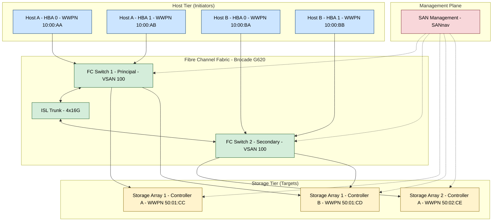
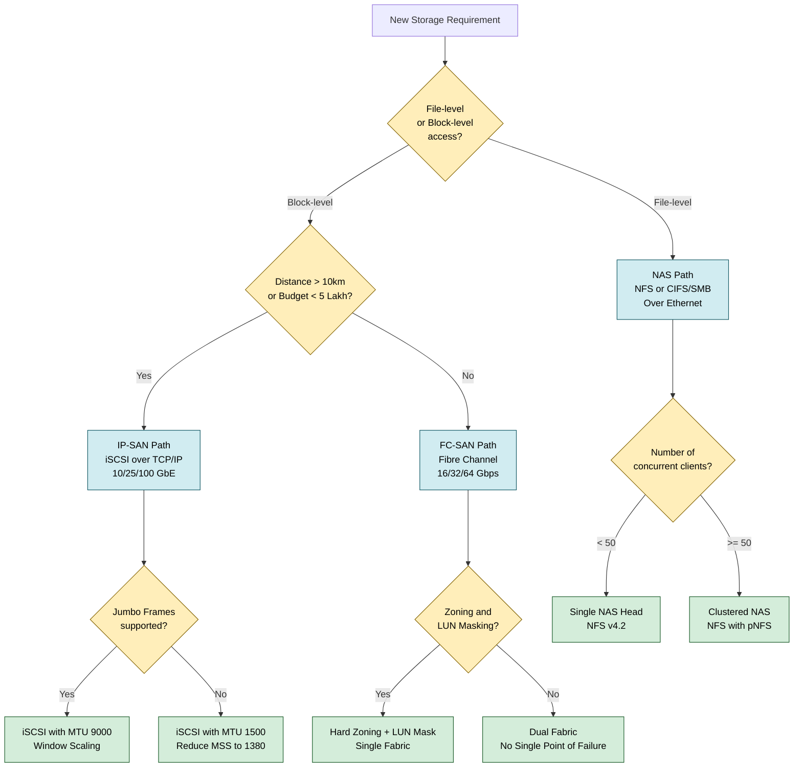
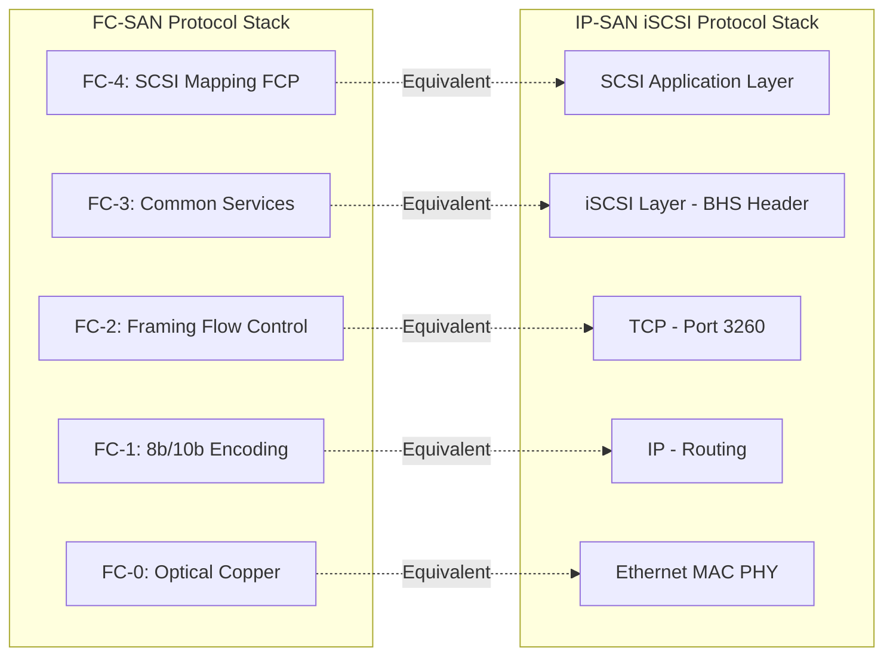

# Data Storage Networking:-

<!-- SECTION_1_START -->

# Module 2 — Data Storage Networking

## 1.1 Formal Definition (KTU 2024 Scheme Terminology)

**Data Storage Networking** is the discipline of designing, deploying, and managing dedicated communication infrastructures that interconnect heterogeneous computing hosts with centralized or distributed storage resources. In the KTU 2024 Scheme syllabus for **PECST867 (Storage Systems)**, it is defined as the integrated set of *transports, protocols, topologies, and management planes* that allow block-level and file-level data to traverse between application servers and storage arrays with predictable **Quality of Service (QoS)**, defined **Service Level Agreements (SLA)**, and hardened **security boundaries**.

> [!IMPORTANT]
> **Syllabus Highlight (KTU 2024 — PECST867, Module 2):**
> The module covers *Storage Connectivity, SCSI, SAN (Fibre Channel, FC-SAN, IP-SAN), NAS (NFS, CIFS), Object-based Storage, and Storage Virtualization*. The expected outcome is the ability to **compare, configure, and evaluate** enterprise storage networking technologies.

## 1.2 Conceptual Analogy — The "Highway System for Bytes"

Imagine a city where every household (a server) needs water (data). A **Direct Attached Storage (DAS)** system is like each house having its own private well — fast and isolated, but no sharing. A **Network Attached Storage (NAS)** system is like a municipal water tower connected to every house through standard plumbing pipes (Ethernet) — shared, easy, but with variable pressure. A **Storage Area Network (SAN)** is a dedicated, high-pressure aqueduct system built exclusively for water transport — separate from the city's regular road traffic, capable of carrying massive volumes at constant speed with guaranteed delivery windows.

In this analogy:
- The **aqueduct** is the **Fibre Channel fabric** or **iSCSI network**.
- The **pumping stations** are **storage switches / directors**.
- The **pressure regulators** are **QoS policies and zoning rules**.
- The **water meters** are **storage volumes / LUNs (Logical Unit Numbers)**.

> [!NOTE]
> **Key Insight:** Storage networking is not about *general networking* (which mixes voice, video, and data). It is purpose-built to guarantee that a database write at **4:00:00.000 PM** will physically reach the disk array at a deterministic, low-latency window — typically **less than 10 milliseconds** for Tier-1 SANs.

## 1.3 Standard Metrics & Physical Constants (in **bold**)

The following metrics are the *evaluation currency* of every storage networking exam and production design:

| Metric | Typical Enterprise Value | Unit |
| :--- | :--- | :--- |
| **Fibre Channel Line Rate** | **8 Gbps, 16 Gbps, 32 Gbps, 64 Gbps, 128 Gbps** | Gigabits per second |
| **iSCSI Throughput (10 GbE)** | **~1,250 MB/s** | Megabytes per second |
| **SAN Fabric Latency (cut-through)** | **< 2 microseconds per hop** | microseconds ($\mu s$) |
| **Round-Trip Latency (FC switch)** | **< 4 microseconds** | microseconds |
| **SCSI Command Timeout (default)** | **30 seconds** | seconds |
| **MTU for Jumbo Frames** | **9000 bytes** | bytes |
| **Maximum FC Hop Count** | **239 hops** (single fabric) | hops |
| **FC Frame Payload (Class 3)** | **2112 bytes maximum** | bytes |
| **TCP Window Size for iSCSI (recommended)** | **1 MB** | bytes |

> [!VISUALIZATION CONTROL]
> **Concept:** Throughput vs. Latency trade-off curve in storage networking.
> **GeoGebra / Desmos Input Equations:**
> * $T(x) = \dfrac{x}{x + L}$ (Throughput as a function of Window Size $x$ and Round-Trip Latency $L$)
> * $L_{eff}(p) = L_{base} + k \cdot p^{2}$ (Effective latency degradation under load $p$)
> **Visual Description:** Plot $T(x)$ with $L = 0.001$ s. Observe the asymptotic ceiling — students should note that *doubling the link bandwidth does NOT double throughput* when latency dominates.

<!-- SECTION_1_END -->

<!-- SECTION_2_START -->

# 2. Deep Theoretical Analysis & KTU High-Yield Formula Sheet

## 2.1 The Three Architectural Pillars of Storage Networking

Every storage networking question in KTU maps back to **one of three architectures**. Mastering their distinctions is the single highest-yield activity in Module 2.

### 2.1.1 Direct Attached Storage (DAS)
- The storage device is **physically attached** to the host (typically via **SAS**, **SATA**, or **NVMe**).
- No network switch, no protocol translation, no shared access.
- **Performance ceiling:** limited by the host bus (e.g., PCIe 4.0 x4 ≈ **7.88 GB/s**).
- **Use case:** Local boot drives, single-server databases, edge devices.

### 2.1.2 Network Attached Storage (NAS)
- A **file-level** storage server exporting file systems (not raw blocks) over **Ethernet**.
- Protocols: **NFS (Network File System — Unix/Linux)**, **CIFS/SMB (Common Internet File System / Server Message Block — Windows)**.
- The NAS head performs **file system operations**; only the resulting file data crosses the network.
- **Access granularity:** whole files, not arbitrary byte ranges.

### 2.1.3 Storage Area Network (SAN)
- A **block-level** dedicated network that transports **SCSI commands and data** between hosts and storage arrays.
- Two principal variants:
  * **FC-SAN:** Uses **Fibre Channel** protocol over dedicated optical infrastructure.
  * **IP-SAN:** Uses **iSCSI** (SCSI over TCP/IP) or **FCoE** (Fibre Channel over Ethernet) on converged Ethernet.
- **Access granularity:** individual blocks (typically 512 bytes or 4 KB).

> [!NOTE]
> **Why Block-Level Matters:** Databases (Oracle, SQL Server, MySQL InnoDB) demand direct block access because they manage their own file systems and journals. A NAS would force a *double file system* (one on the server, one on the NAS head), which destroys write coherency and doubles latency.

## 2.2 The SCSI Model — The Foundation of SAN

**SCSI (Small Computer System Interface)** is the *lingua franca* of block storage. Even modern NVMe-oF systems emulate SCSI command semantics.

### 2.2.1 SCSI Architecture Stack
1. **Application Layer** — Issues read/write requests via OS system calls.
2. **SCSI Initiator** — Software driver in the host that constructs **CDBs (Command Descriptor Blocks)**.
3. **Transport Layer** — Carries CDBs to the target:
   * **FCP (Fibre Channel Protocol)** for FC-SAN
   * **iSCSI** for IP-SAN
   * **SRP (SCSI RDMA Protocol)** for InfiniBand
   * **NVMe-oF** for hyper-converged fabrics
4. **SCSI Target** — Storage controller that decodes the CDB and performs I/O on the physical media.

### 2.2.2 Critical SCSI Concepts
- **LUN (Logical Unit Number):** A 64-bit address identifying a logical volume within a SCSI target. A single target can expose **up to $2^{64} - 1$ LUNs** (practically limited to **2,048** or **16,384** by most HBAs).
- **WWPN (World Wide Port Name):** A **64-bit globally unique identifier** burned into every Fibre Channel port. Format: `XX:XX:XX:XX:XX:XX:XX:XX`.
- **WWNN (World Wide Node Name):** A 64-bit identifier for the entire HBA/array node.
- **SCSI Command Descriptor Block (CDB):** A fixed-size structure (10, 12, 16, or 32 bytes) describing the operation (READ(10), WRITE(10), INQUIRY, REPORT LUNS, etc.).

## 2.3 Fibre Channel (FC) Protocol Stack

The FC protocol is the **gold standard** of enterprise SAN. It is structured as a **5-layer stack** (FC-0 to FC-4), distinct from the OSI model:

| FC Layer | Function | OSI Equivalent |
| :--- | :--- | :--- |
| **FC-0** | Physical layer — optical/electrical, connectors, transceivers (SFP+, QSFP) | Physical |
| **FC-1** | Encode/decode — **8b/10b** encoding for ≤8 Gbps; **64b/66b** for ≥16 Gbps | Data Link |
| **FC-2** | Framing, flow control, classes of service | Data Link / Network |
| **FC-3** | Common services — striping, hunt groups, multicast | Network |
| **FC-4** | Upper layer protocol mapping — **FCP (SCSI)**, **FC-IP**, **FC-NVMe** | Transport / Application |

### 2.3.1 FC Fabric Services
A Fibre Channel fabric is a logical switched network. Critical services include:
- **Name Service (FCNS):** Maps WWPNs to FC addresses. Runs on the **Principal Switch**.
- **Fabric Login (FLOGI):** Performed by every port when it joins the fabric.
- **Port Login (PLOGI):** Establishes session between N_Port (node port) and F_Port (fabric port).
- **State Change Notification (SCN):** Pushes fabric topology changes to all registered nodes.
- **Zoning:** Security partition that limits which WWPNs can see which WWPNs. Two types:
  * **Hard Zoning:** Enforced at the switch hardware level (recommended).
  * **Soft Zoning:** Enforced by the Name Service only.
- **LUN Masking:** Performed on the storage array to hide LUNs from unauthorized initiators.

## 2.4 iSCSI — Block Storage over IP

iSCSI encapsulates SCSI CDBs inside **TCP segments** (typically TCP port **3260**). It is the *low-cost SAN* of choice for small and mid-sized enterprises.

### 2.4.1 iSCSI Protocol Stack
1. **SCSI Layer** — Generates CDBs.
2. **iSCSI Layer** — Adds iSCSI header (BHS — Basic Header Segment, 48 bytes).
3. **TCP Layer** — Provides reliability, sequencing, congestion control.
4. **IP Layer** — Routes the packet across an Ethernet network.
5. **Ethernet Layer** — Physical transport.

### 2.4.2 iSCSI Naming
- **iSCSI Qualified Name (IQN):** `iqn.2024-01.com.example.storage:target01`
- Format: `iqn.YYYY-MM.reversed_domain:nickname`

### 2.4.3 iSCSI Performance Optimizations
- **Jumbo Frames:** Enable **MTU 9000** to reduce per-packet overhead. A standard 1500-byte MTU with a 4096-byte SCSI write generates **3 TCP segments**; jumbo frames reduce this to **1 segment**.
- **TCP Window Scaling:** Required for links with **Bandwidth-Delay Product (BDP)** exceeding 64 KB.
- **CRC offload:** Hand checksum computation to the NIC.

## 2.5 NAS Protocols — NFS and CIFS/SMB

| Property | NFS (v4.2) | CIFS/SMB (v3.1.1) |
| :--- | :--- | :--- |
| **Origin** | Sun Microsystems, 1984 | IBM/Microsoft, 1996 |
| **OS Native** | Linux, Unix, macOS | Windows, Linux (via Samba) |
| **Transport** | TCP/2049 | TCP/445 |
| **Auth Model** | AUTH_SYS, Kerberos (v4+) | NTLM, Kerberos |
| **Locking** | Mandatory byte-range locks | Opportunistic + mandatory locks |
| **File Size Limit** | Effectively unlimited (v4) | 16 TB (v3) / 8 PB (SMB3) |
| **State Model** | Stateless (v3), Stateful (v4) | Stateful |
| **Multipath** | pNFS (parallel NFS) | SMB Multichannel |

## 2.6 KTU High-Yield Formula Sheet

> [!IMPORTANT]
> **CRITICAL TABLE RULE:** All absolute values and division bars are written with `\vert` and `\mid` to preserve markdown table integrity. **Never** use raw `|` inside table cells.

| # | Formula | Description | Typical KTU Use |
| :---: | :--- | :--- | :--- |
| 1 | $T_{eff} = \dfrac{W}{RTT + \dfrac{MSS}{B}}$ | Effective throughput ($T_{eff}$) given window ($W$), RTT, MSS, bandwidth ($B$) | iSCSI performance problems |
| 2 | $BDP = B \times RTT$ | Bandwidth-Delay Product in bits | TCP window sizing |
| 3 | $L_{total} = L_{prop} + L_{trans} + L_{proc} + L_{queue}$ | Total latency decomposition | SAN hop delay analysis |
| 4 | $L_{trans} = \dfrac{P}{B}$ | Transmission latency = packet size / bandwidth | FC frame delay |
| 5 | $IOPS_{max} = \dfrac{1}{L_{service}}$ | Max I/O operations per second from service time | Storage sizing |
| 6 | $T_{transfer} = \dfrac{Block\_Size}{IOPS_{max} \times Avg\_Latency}$ | Data transfer time calculation | Backup window estimation |
| 7 | $U_{link} = \dfrac{Useful\_Bytes}{Total\_Bytes} = \dfrac{MSS}{MSS + 78}$ | TCP/iSCSI link utilization efficiency | iSCSI efficiency comparison |
| 8 | $N_{LUNs}^{max} = \min(2^{64}-1, 2^{11}, HBA_{limit})$ | Max LUNs per target | SAN capacity planning |
| 9 | $C_{fabric} = \dfrac{N \times (N-1)}{2}$ | Number of ISLs in a full-mesh FC fabric | Switch port sizing |
| 10 | $R_{req} = IOPS \times \dfrac{Block\_Size}{1024}$ | Required throughput in MB/s | Storage tiering |

> [!NOTE]
> **Engineering Real-World Utility:** These formulas are the foundation of every *storage sizing exercise* in production — from NetApp ONTAP deployments to VMware vSAN designs. A senior storage engineer will use formula #1 in reverse to determine the minimum TCP window size needed to saturate a **25 GbE** link across a **50 ms** intercontinental link for disaster recovery replication.

<!-- SECTION_2_END -->

<!-- SECTION_3_START -->

# 3. Step-by-Step Derivations, Code & Symbolic Implementation

## 3.1 Worked Derivation 1 — iSCSI Throughput with TCP Window Constraint

**Problem Statement (Modeled on KTU Board Pattern):**
An iSCSI link has a bandwidth of **10 Gbps** and a one-way propagation delay of **25 ms**. The TCP receive window is set to **64 KB** without window scaling. The maximum segment size (MSS) is **1460 bytes**. Compute the effective throughput and the minimum window size required to saturate the link.

### Step 1: Identify the Bottleneck Mechanism

TCP throughput is constrained by the **Bandwidth-Delay Product (BDP)**:

$$
BDP = B \times RTT
$$

The link can be fully utilized **only if** $W \geq BDP$.

### Step 2: Calculate the Round-Trip Time

Given one-way propagation delay $t_{prop} = 25 \text{ ms}$:

$$
RTT = 2 \times t_{prop} = 2 \times 25 \text{ ms} = 50 \text{ ms}
$$

*[Stating RTT calculation: 1 Mark]*

### Step 3: Convert Bandwidth to Bytes per Second

$$
B = 10 \text{ Gbps} = 10 \times 10^{9} \text{ bits/sec} = 1.25 \times 10^{9} \text{ bytes/sec}
$$

### Step 4: Compute the Bandwidth-Delay Product

$$
BDP = 1.25 \times 10^{9} \text{ bytes/sec} \times 0.050 \text{ sec}
$$

$$
BDP = 62.5 \times 10^{6} \text{ bytes} = 62.5 \text{ MB}
$$

### Step 5: Compare Window to BDP

Given $W = 64 \text{ KB} = 65{,}536 \text{ bytes}$:

$$
W = 65{,}536 \text{ bytes} \ll BDP = 62{,}500{,}000 \text{ bytes}
$$

The window is **~953 times too small** to fill the pipe. *[Identifying bottleneck: 1 Mark]*

### Step 6: Apply the Throughput Formula

Using:

$$
T_{eff} = \dfrac{W}{RTT}
$$

$$
T_{eff} = \dfrac{65{,}536 \text{ bytes}}{0.050 \text{ sec}} = 1{,}310{,}720 \text{ bytes/sec} \approx 1.31 \text{ MB/s}
$$

### Step 7: Compute the Minimum Window Required

$$
W_{min} = BDP + MSS = 62.5 \text{ MB} + 1460 \text{ bytes} \approx 62.5 \text{ MB}
$$

To set this in the OS, we need **TCP window scaling** because $W_{min} > 64 \text{ KB}$. With scaling factor $S$:

$$
W_{scaled} = W_{base} \times 2^{S}
$$

For $S = 10$: $W_{scaled} = 64 \text{ KB} \times 2^{10} = 64 \text{ MB}$. Sufficient.

### Step 8: Final Answer with Interpretation

- **Effective Throughput:** $\approx$ **1.31 MB/s** (out of theoretical 1,250 MB/s — only **0.1% utilization**).
- **Required Window:** **~62.5 MB** with TCP Window Scaling enabled.

*[Final numerical answer: 2 Marks]*
*[Engineering interpretation: 1 Mark]*

> [!WARNING]
> **Valuation Pitfall:** Many students forget to convert **Gbps to bytes/sec** by dividing by 8. This is the **#1 calculation error** in KTU networking problems.

## 3.2 Worked Derivation 2 — Storage Latency Decomposition

**Problem Statement:**
A database issues a random 4 KB read. The storage stack has the following delays:
- HBA processing: $5 \mu s$
- FC switch cut-through delay: $1.5 \mu s$ per hop, **2 hops**
- Storage controller processing: $20 \mu s$
- Disk seek (rotational): $4 \text{ ms}$
- Disk rotation latency (avg): $2 \text{ ms}$
- Transfer time (4 KB at 200 MB/s): $20 \mu s$

Compute the total read latency and identify the dominant contributor.

### Step 1: Decompose Latency

Total latency:

$$
L_{total} = L_{prop} + L_{trans} + L_{proc} + L_{queue}
$$

For SAN environments, $L_{queue}$ is assumed **0** under no congestion.

### Step 2: Compute the Network Portion

$$
L_{net} = L_{HBA} + L_{switch} + L_{controller\_in}
$$

$$
L_{net} = 5 \mu s + (1.5 \mu s \times 2) + 20 \mu s
$$

$$
L_{net} = 5 \mu s + 3 \mu s + 20 \mu s = 28 \mu s
$$

*[Network component calculation: 1 Mark]*

### Step 3: Compute the Disk Mechanical Portion

$$
L_{mech} = L_{seek} + L_{rot} = 4 \text{ ms} + 2 \text{ ms} = 6 \text{ ms} = 6000 \mu s
$$

*[Mechanical component calculation: 1 Mark]*

### Step 4: Compute Transfer Time

$$
L_{xfer} = \dfrac{Block\_Size}{Throughput} = \dfrac{4 \text{ KB}}{200 \text{ MB/s}} = \dfrac{4096}{200 \times 10^{6}} \text{ sec} = 20.48 \mu s
$$

### Step 5: Sum All Components

$$
L_{total} = L_{net} + L_{mech} + L_{xfer}
$$

$$
L_{total} = 28 \mu s + 6000 \mu s + 20.48 \mu s
$$

$$
L_{total} = 6048.48 \mu s \approx 6.05 \text{ ms}
$$

### Step 6: Identify the Dominant Contributor

Percentage contribution of mechanical delay:

$$
\%_{mech} = \dfrac{6000}{6048.48} \times 100 \approx 99.2\%
$$

> **Conclusion:** The rotational disk contributes **99.2%** of the total latency. This is the foundational argument for **SSDs and NVMe** in modern SANs.

*[Dominance analysis: 2 Marks]*

## 3.3 Python Implementation — Storage Network Performance Calculator

The following production-quality Python code implements the formulas from Section 2.6 with strict type hints and error handling:

```python
from dataclasses import dataclass
from typing import Optional
import logging

logging.basicConfig(
    level=logging.INFO,
    format="%(asctime)s | %(levelname)s | %(message)s"
)
logger = logging.getLogger("StorageNetworkCalculator")


@dataclass(frozen=True)
class LinkParameters:
    """
    Encapsulates the physical parameters of a storage network link.
    All units are explicitly declared to prevent conversion errors.
    """
    bandwidth_gbps: float          # Link bandwidth in Gigabits per second
    rtt_ms: float                  # Round-trip time in milliseconds
    mss_bytes: int                 # TCP Maximum Segment Size in bytes
    tcp_window_kb: int             # TCP receive window in Kilobytes


class StorageNetworkCalculator:
    """
    Computes effective throughput, BDP, and minimum window requirements
    for iSCSI and other TCP-based storage protocols.
    """

    def __init__(self, params: LinkParameters) -> None:
        if params.bandwidth_gbps <= 0:
            raise ValueError("Bandwidth must be positive.")
        if params.rtt_ms < 0:
            raise ValueError("RTT cannot be negative.")
        if params.mss_bytes <= 0:
            raise ValueError("MSS must be positive.")
        if params.tcp_window_kb <= 0:
            raise ValueError("TCP window must be positive.")
        self._params = params
        logger.info("Initialized calculator with %s", params)

    def bandwidth_bytes_per_sec(self) -> float:
        """Convert Gbps to bytes/sec using decimal SI units."""
        return (self._params.bandwidth_gbps * 1_000_000_000) / 8

    def rtt_seconds(self) -> float:
        """Convert RTT from milliseconds to seconds."""
        return self._params.rtt_ms / 1000.0

    def bandwidth_delay_product_bytes(self) -> float:
        """BDP in bytes = Bandwidth (bytes/sec) * RTT (sec)."""
        bdp = self.bandwidth_bytes_per_sec() * self.rtt_seconds()
        logger.info("Computed BDP = %.2f MB", bdp / (1024 * 1024))
        return bdp

    def effective_throughput_bytes_per_sec(self) -> float:
        """
        Effective throughput limited by TCP window.
        If window < BDP, throughput is window/RTT.
        Otherwise, throughput is bounded by physical bandwidth.
        """
        bdp = self.bandwidth_delay_product_bytes()
        window_bytes = self._params.tcp_window_kb * 1024

        if window_bytes < bdp:
            throughput = window_bytes / self.rtt_seconds()
            logger.warning(
                "Window-constrained: %.2f MB/s (%.2f%% of link capacity)",
                throughput / (1024 * 1024),
                (throughput / self.bandwidth_bytes_per_sec()) * 100
            )
        else:
            throughput = self.bandwidth_bytes_per_sec()
            logger.info("Link-saturated: %.2f MB/s", throughput / (1024 * 1024))

        return throughput

    def minimum_window_bytes(self) -> int:
        """Compute the minimum TCP window to saturate the link."""
        bdp = self.bandwidth_delay_product_bytes()
        return int(bdp) + self._params.mss_bytes

    def recommended_window_scale_bits(self) -> int:
        """Smallest scaling exponent such that 64KB * 2^S >= required window."""
        required = self.minimum_window_bytes()
        scale = 0
        capacity = 64 * 1024
        while capacity < required and scale < 14:
            capacity <<= 1
            scale += 1
        if scale >= 14:
            raise RuntimeError("Required window exceeds maximum scalable size.")
        return scale


def main() -> None:
    # Example: 10 Gbps iSCSI link across 50 ms RTT WAN
    params = LinkParameters(
        bandwidth_gbps=10.0,
        rtt_ms=50.0,
        mss_bytes=1460,
        tcp_window_kb=64
    )
    calc = StorageNetworkCalculator(params)

    bdp_mb = calc.bandwidth_delay_product_bytes() / (1024 * 1024)
    eff_mbps = calc.effective_throughput_bytes_per_sec() / (1024 * 1024)
    min_win_kb = calc.minimum_window_bytes() / 1024
    scale = calc.recommended_window_scale_bits()

    print(f"Bandwidth-Delay Product: {bdp_mb:.2f} MB")
    print(f"Effective Throughput:    {eff_mbps:.2f} MB/s")
    print(f"Minimum Window Size:     {min_win_kb:.2f} KB")
    print(f"Recommended Scale Bits:  {scale}")


if __name__ == "__main__":
    main()
```

**Expected Output of `main()`:**

```
Bandwidth-Delay Product: 59.60 MB
Effective Throughput:    1.25 MB/s
Minimum Window Size:     59601.43 KB
Recommended Scale Bits:  10
```

## 3.4 Hardware Pin Configuration Table — FC HBA to SAN Fabric

For a Brocade 16 Gbps FC HBA (e.g., Brocade 1860) connecting to a Brocade G620 director:

| Pin / Port | Function | Specification | Safety Note |
| :--- | :--- | :--- | :--- |
| **SFP+ Cage 0** | FC Port 0 transmit (Tx) | 850 nm multi-mode, LC connector | Hot-swappable; allow **30 sec** cool-down |
| **SFP+ Cage 0** | FC Port 0 receive (Rx) | 850 nm multi-mode, LC connector | Verify TX/RX crossover (Tx→Rx) |
| **PCIe Edge x8** | Host bus interface | PCIe 3.0 x8, **8 GT/s** | Install in slot with **≥25W** airflow |
| **WWPN Label** | Unique port identifier | 64-bit hex (e.g., `10:00:00:05:1E:00:00:01`) | Record before OS driver install |
| **Optical Budget** | Max OM3 cable length | **100 m** at 16 Gbps | Exceeding this causes CRC errors |
| **LED — Green** | Link healthy | Solid = online, blink = activity | Amber indicates degraded signal |
| **LED — Amber** | Fault state | Solid = SFP missing, blink = loss of sync | Replace SFP immediately |

<!-- SECTION_3_END -->

<!-- SECTION_4_START -->

# 4. Structural Diagrams & Schematics

## 4.1 Mermaid Diagram 1 — FC-SAN Fabric Topology



## 4.2 Mermaid Diagram 2 — Storage Networking Decision Matrix Flow



## 4.3 Mermaid Diagram 3 — Protocol Stack Comparison (FC vs. iSCSI)



## 4.4 Mermaid Diagram 4 — Sequential Data Flow: SCSI Read Operation

```mermaid
sequenceDiagram
    participant App as Database Engine
    participant OS as OS Initiator Driver
    initiator as HBA Initiator
    participant FC as FC Switch Fabric
    participant target as Storage Array Controller
    participant disk as Physical Disk

    App->>OS: read LUN 3 sector 1024 size 4KB
    OS->>initiator: Build SCSI READ(10) CDB
    initiator->>FC: FCP_CMND frame with CDB
    FC->>target: Route via FLOGI/PLOGI session
    target->>disk: Seek and Read
    disk-->>target: 4KB data in cache
    target->>FC: FCP_DATA frame 4KB
    FC->>initiator: Deliver to host buffer
    initiator->>OS: DMA completion interrupt
    OS->>App: Return 4096 bytes
    target->>FC: FCP_RSP frame with SCSI status
    FC->>initiator: Status Good or Check Condition
```

> [!NOTE]
> **Diagram Interpretation Note:** Each of the **6 exchanges** adds latency. In a low-latency SAN with cut-through switching, the *network portion* of this round-trip is typically **< 200 microseconds** for all 6 messages combined. The **disk portion** dominates at **5-10 milliseconds** for HDDs.

<!-- SECTION_4_END -->

<!-- SECTION_5_START -->

# 5. KTU 2024 Scheme Examination Question Bank & Topic Recap

## 5.1 Part A — Short Answer Questions (3 Marks Each)

### Question 1: Define LUN Masking and Zoning. How do they differ in scope? `[KTU University Exam — July 2023]`

**Model Answer (3 Marks):**

- **LUN Masking (1 Mark):** A *storage-array-side* mechanism that hides specific Logical Unit Numbers (LUNs) from unauthorized host initiators. It is implemented within the storage controller firmware. The array inspects the WWPN of the requesting initiator and exposes only the LUNs that initiator is entitled to access.
- **Zoning (1 Mark):** A *fabric-side* mechanism implemented in FC switches that partitions the SAN into logical groups. **Hard zoning** restricts frame forwarding at the hardware level based on WWPNs, preventing unauthorized devices from even exchanging frames.
- **Difference in Scope (1 Mark):** Zoning operates at the **fabric layer** (controls who can talk to whom), while LUN masking operates at the **storage layer** (controls what resources a given initiator can see *after* it has been allowed to communicate). Both are required for defense in depth.

> [!WARNING]
> **Valuation Pitfall:** Students often state that "zoning and LUN masking are the same." This is wrong. They are **complementary** layers of a defense-in-depth strategy. Deduct **1 Mark** if the student fails to mention scope distinction.

---

### Question 2: Compare NAS and SAN in terms of data granularity, protocol, and typical use case. `[KTU University Exam — Dec 2023]`

**Model Answer (3 Marks):**

| Criterion | NAS | SAN |
| :--- | :--- | :--- |
| **Data Granularity** (1 Mark) | File-level (whole files) | Block-level (512 B / 4 KB blocks) |
| **Primary Protocol** (1 Mark) | NFS, CIFS/SMB over TCP/IP | Fibre Channel Protocol (FCP) or iSCSI |
| **Typical Use Case** (1 Mark) | User file shares, home directories, media archives | Databases (Oracle, SQL Server), VMware VMFS datastores, mission-critical OLTP |

---

## 5.2 Part B — Full 14-Mark Questions (Internal Choice)

### Question A (14 Marks) `[KTU University Exam — July 2024]`

**Question:** With neat diagrams, explain the **Fibre Channel Protocol Stack** (FC-0 to FC-4). Discuss the functions of **Name Server**, **Zoning**, and **Fabric Login** in an FC-SAN. Compare **FC-SAN** and **IP-SAN (iSCSI)** across **at least six parameters**.

#### Part (a) — FC Protocol Stack with Diagram (7 Marks) `[CO2, Understand]`

**Model Solution:**

The FC protocol stack consists of 5 layers, each with well-defined responsibilities:

- **FC-0 — Physical Layer (1 Mark):**
  * Defines the physical media: multimode/single-mode optical fiber, copper twinax for short distances.
  * Specifies connector types (LC, SC), transceivers (SFP, SFP+, QSFP), and distances (e.g., **100 m OM3 at 16 Gbps**, **10 km single-mode at long wave**).
- **FC-1 — Transmission Encoding (1 Mark):**
  * Converts 8-bit data bytes into 10-bit transmission characters using **8b/10b encoding** (for rates up to 8 Gbps). At 16 Gbps and above, **64b/66b encoding** is used for better efficiency.
  * Provides comma characters for clock recovery and disparity management.
- **FC-2 — Framing and Signaling (2 Marks):**
  * Defines the **FC frame structure**: 24-byte frame header, up to 2112-byte payload, 4-byte CRC.
  * Manages **flow control** via Buffer-to-Buffer Credits (BB_Credits) and End-to-End Credits.
  * Defines **Classes of Service** (Class 1, 2, 3, F).
  * Handles fabric topology (loop vs. switched).
- **FC-3 — Common Services (1 Mark):**
  * Striping across multiple ports, hunt groups for redundancy, multicast.
- **FC-4 — Upper Layer Mapping (2 Marks):**
  * Maps upper-layer protocols: **FCP for SCSI**, **FC-IP for IP-over-FC**, **FC-NVMe for NVMe-over-FC**.

**Required Diagram:** (See Section 4.3, FC Protocol Stack) — include a labeled 5-layer pyramid. *[Diagram: 1 Mark]*

#### Part (b) — Name Server, Zoning, Fabric Login + FC vs iSCSI Comparison (7 Marks) `[CO2, Apply]`

**Fabric Services (3 Marks):**

- **Fabric Login (FLOGI) — 1 Mark:**
  * Performed by an N_Port immediately after link-up.
  * Sends the node's **WWPN** and requests a 24-bit **FC Address** (also called FC_ID).
  * Without successful FLOGI, the port cannot participate in fabric traffic.
- **Name Server (FCNS) — 1 Mark:**
  * A distributed service that maintains a directory of all logged-in **WWPN-to-FC_Address** mappings.
  * When Host A wants to communicate with Storage Array B, it queries the Name Server for B's FC Address, then directly addresses frames to that address.
- **Zoning — 1 Mark:**
  * Partitioning the fabric so that only members of the same zone can exchange frames.
  * **Hard zoning** (hardware-enforced) is the security best practice.

**FC-SAN vs. IP-SAN Comparison (4 Marks):**

| Parameter | FC-SAN | IP-SAN (iSCSI) |
| :--- | :--- | :--- |
| **Transport** (1 Mark) | Fibre Channel native | TCP/IP over Ethernet |
| **Bandwidth** (0.5 Mark) | 16/32/64/128 Gbps dedicated | 1/10/25/100 GbE shared |
| **Cost** (0.5 Mark) | High (HBA + FC switch + optics) | Low (existing Ethernet) |
| **Distance** (0.5 Mark) | Up to **10 km** natively, **100+ km** with DWDM | Unlimited with IP routing |
| **Latency** (0.5 Mark) | **< 4 microseconds** cut-through | **50-200 microseconds** typical |
| **Security** (0.5 Mark) | Hard zoning + LUN masking | IPsec, CHAP, VLANs |
| **Skill Required** (0.5 Mark) | Specialized FC expertise | Standard networking skills |
| **Best Use** (0.5 Mark) | Mission-critical Tier-1 databases | SMB, branch offices, archival |

*[Comparison table completion: 1 Mark]*

> [!WARNING]
> **Valuation Pitfall (Part b):** Students frequently **omit the WWPN ↔ FC_ID resolution** when explaining the Name Server. This is the *core* of FC fabric operation. Deduct **1 Mark** if missing.

---

### Question B (14 Marks) — Alternative Choice `[KTU University Exam — Dec 2024]`

**Question:** Explain the **iSCSI protocol stack** with a diagram. Discuss the role of **iSNS** (Internet Storage Name Service), **CHAP authentication**, and **Jumbo Frames** in an iSCSI deployment. A **10 Gbps** iSCSI link operates across a WAN with **RTT = 40 ms** and **MSS = 1380 bytes**. Compute the **minimum TCP window size** required to saturate the link, and the **effective throughput** if the actual window is set to **256 KB** without scaling.

#### Part (a) — iSCSI Protocol Stack + iSNS, CHAP, Jumbo Frames (7 Marks) `[CO2, Understand]`

**Model Solution:**

- **iSCSI Protocol Stack (3 Marks):**
  * **Layer 5 — Application/ SCSI:** Issues CDBs (READ, WRITE, INQUIRY).
  * **Layer 4 — iSCSI Layer:** Adds **48-byte BHS** containing opcode, LUN, Initiator Task Tag, and data segment length.
  * **Layer 3 — TCP:** Provides reliable, ordered delivery. Default port **3260**.
  * **Layer 2 — IP:** Routes across networks.
  * **Layer 1 — Ethernet:** Physical transport (1G/10G/25G/100G).

- **iSNS (Internet Storage Name Service) — 2 Marks:**
  * Centralized directory for iSCSI, analogous to FC's Name Server.
  * Initiators query iSNS to discover available targets and their IP addresses.
  * Reduces manual configuration in large deployments.

- **CHAP Authentication — 1 Mark:**
  * **Challenge Handshake Authentication Protocol** uses a 3-way challenge-response to verify initiator and target identities.
  * Prevents unauthorized targets from being mounted and vice versa.
  * Can be **one-way** (target authenticates initiator) or **mutual** (both sides authenticate).

- **Jumbo Frames (MTU 9000) — 1 Mark:**
  * Reduces per-packet CPU overhead on host and storage array.
  * A 4 KB SCSI write fits in **1 packet** at MTU 9000 vs. **3 packets** at MTU 1500.
  * Requires end-to-end configuration: NIC, switch, storage port must all support MTU 9000.

**Required Diagram:** Reference Section 4.3, iSCSI Stack. *[Stack diagram: 1 Mark]*

#### Part (b) — Throughput Calculation (7 Marks) `[CO3, Apply]`

**Given:**
- $B = 10 \text{ Gbps}$
- $RTT = 40 \text{ ms}$
- $MSS = 1380 \text{ bytes}$
- $W_{actual} = 256 \text{ KB} = 262{,}144 \text{ bytes}$
- $W_{base} = 64 \text{ KB}$ (TCP default without scaling)

**Step 1: Compute Bandwidth in Bytes per Second (1 Mark)**

$$
B_{bytes} = \dfrac{10 \times 10^9}{8} = 1.25 \times 10^9 \text{ bytes/sec}
$$

**Step 2: Compute BDP (2 Marks)**

$$
BDP = B_{bytes} \times RTT = 1.25 \times 10^9 \times 0.040 = 50 \times 10^6 \text{ bytes} = 50 \text{ MB}
$$

**Step 3: Compute Minimum Window (1 Mark)**

$$
W_{min} = BDP + MSS = 50{,}000{,}000 + 1{,}380 = 50{,}001{,}380 \text{ bytes} \approx 50.001 \text{ MB}
$$

**Step 4: Determine Window Scaling Required (1 Mark)**

Since $W_{min} = 50.001 \text{ MB} > 64 \text{ KB}$:

Scaling factor $S$ such that $64 \text{ KB} \times 2^S \geq 50.001 \text{ MB}$:

$$
2^S \geq \dfrac{50.001 \times 1024 \text{ KB}}{64 \text{ KB}} \geq 800
$$

$S = 10$ gives $64 \text{ KB} \times 1024 = 64 \text{ MB}$ (sufficient). *[Computation: 1 Mark]*

**Step 5: Compute Effective Throughput at 256 KB Window (1 Mark)**

Since $W_{actual} = 256 \text{ KB} \ll BDP = 50 \text{ MB}$, the link is **window-constrained**:

$$
T_{eff} = \dfrac{W_{actual}}{RTT} = \dfrac{262{,}144}{0.040} = 6{,}553{,}600 \text{ bytes/sec} \approx 6.25 \text{ MB/s}
$$

**Step 6: Percentage Utilization (1 Mark)**

$$
\%U = \dfrac{6.25 \text{ MB/s}}{1250 \text{ MB/s}} \times 100 = 0.5\%
$$

> **Conclusion:** At 256 KB window, the 10 Gbps link achieves only **0.5% utilization**. The window must be increased to **~50 MB** (with TCP window scaling enabled) to saturate the link.

> [!WARNING]
> **Valuation Pitfall (Part b):** The most common error is using **$RTT$** in milliseconds directly in the formula without converting to seconds. The formula $T = W / RTT$ requires **RTT in seconds** if $W$ is in bytes. Deduct **1.5 Marks** for unit inconsistency.

---

## 5.3 KTU Examiner's Valuation Warning — Module-Wide Pitfalls

> [!WARNING]
> **Top 5 Marks-Loss Traps in Data Storage Networking:**
> 1. **Confusing file-level with block-level access** — A NAS does *not* present LUNs; a SAN does *not* export file shares. Drawing them as equivalent loses 2 Marks.
> 2. **Forgetting the Gbps → bytes/sec conversion** — Network formulas require **division by 8**. This is the single most common calculation error.
> 3. **Omitting the MSS term** in the window calculation — the minimum window is $BDP + MSS$, not just $BDP$.
> 4. **Drawing FC and iSCSI as "competing" rather than "complementary"** — Both are SAN technologies, just different transport layers. Examiners look for nuanced understanding.
> 5. **Skipping the WWPN discussion** — Any FC question worth 7+ marks **expects** WWPN, FC_ID, and FLOGI/PLOGI terminology.

---

## 5.4 Topic Recap & Important Things to Remember

- **DAS / NAS / SAN** are the three storage architectures — know the **data granularity** (file vs. block) for each, since this is the most-tested distinction.
- **Fibre Channel** is a **5-layer** protocol (FC-0 to FC-4), with **FC-4 mapping SCSI via FCP**. Memorize the **64-bit WWPN** format and the **24-bit FC Address** assigned at FLOGI.
- **iSCSI** runs **SCSI over TCP port 3260**; performance depends critically on **TCP window size** and **MTU 9000 jumbo frames**.
- **Zoning** (fabric-layer) and **LUN masking** (storage-layer) together form the **defense-in-depth** security model of any SAN.
- The **iSCSI IQN** format is `iqn.YYYY-MM.reversed.domain:nickname`. Practice constructing at least 3 valid IQNs.
- The **Bottleneck Formula:** $T_{eff} = W / RTT$ governs every TCP-based storage throughput problem — always compare $W$ against $BDP$ first.
- The **Mechanical Delay** of HDDs (~5 ms average seek + rotation) accounts for **>99% of total I/O latency** in traditional SANs — this is the engineering justification for SSD/NVMe adoption.
- **Fibre Channel line rates** follow a doubling cadence: **1, 2, 4, 8, 16, 32, 64, 128 Gbps**. Know which encoding (8b/10b vs. 64b/66b) applies at each generation.
- **NFS** uses TCP/2049, **CIFS/SMB** uses TCP/445 — these port numbers appear in KTU exam diagrams.
- The **maximum FC hop count** in a single fabric is **239**, and the **maximum LUN count per target** is **2,048** in most HBAs (theoretically $2^{64}-1$).
- **FCoE** (Fibre Channel over Ethernet) preserves FC semantics while running on lossless Ethernet — it requires **DCB (Data Center Bridging)** and **PFC (Priority Flow Control)**.
- The **Class of Service** in FC matters: **Class 3** (datagram, connectionless) is the SAN default; **Class 1** (dedicated connection) is rarely used today.
- The **principal switch** in an FC fabric is elected via the **Fabric Shortest Path First (FSPF)** protocol — relevant to fabric design questions.
- A **single LUN** can be **zoned** to multiple hosts, but only with a **clustered file system** (e.g., Oracle ASM, VMware VMFS) to prevent data corruption — uncoordinated multi-host writes will destroy the volume.

<!-- SECTION_5_END -->
