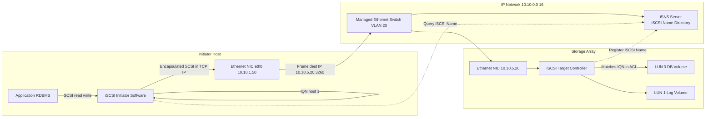
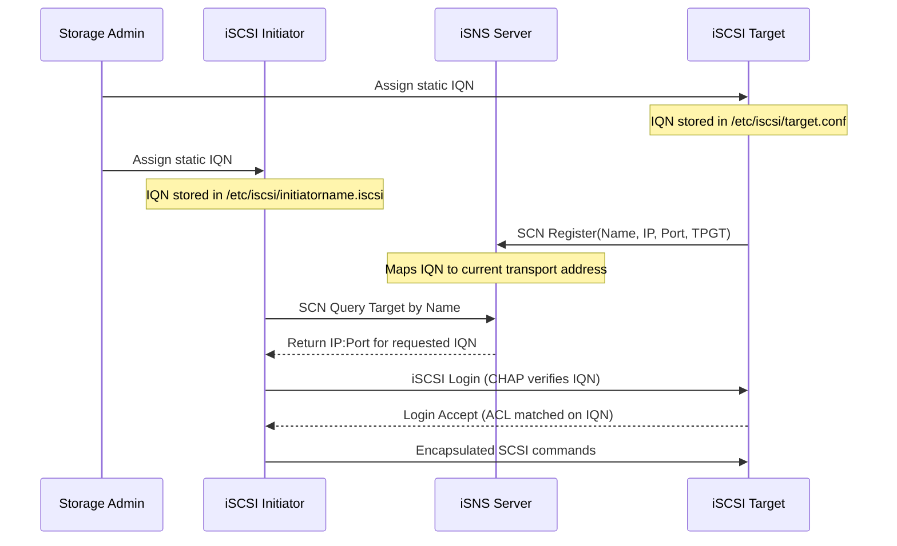
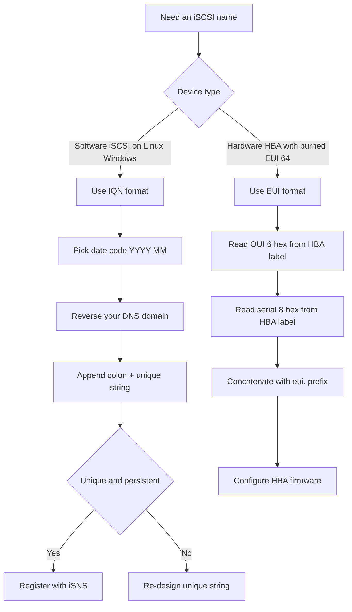

# iSCSI SAN- iSCSI names

<!-- SECTION_1_START -->
# iSCSI SAN — iSCSI Names

## 1. Core Technical Definition

**iSCSI (Internet Small Computer Systems Interface)** is a TCP/IP-based transport protocol defined by the IETF in **RFC 3720** (and updated in **RFC 7143**) that encapsulates **SCSI commands and data** into IP packets, enabling block-level storage I/O over standard Ethernet networks. When deployed as a **Storage Area Network (SAN)**, it is called an **iSCSI SAN**.

An **iSCSI Name** is a **globally unique, persistent, location-independent identifier** assigned to every iSCSI node (initiator or target). It is the iSCSI equivalent of a "worldwide identifier" and is defined under **RFC 3721 (iSCSI Naming and Discovery)**.

> [!IMPORTANT]
> **KTU Syllabus Highlight (Module 2):** The two legal iSCSI name formats standardized by IETF are:
> 1. **iqn.** — iSCSI Qualified Name (most common, used in software iSCSI)
> 2. **eui.** — IEEE EUI-64 format (hardware-derived, used in iSCSI HBAs)

### 1.1 iSCSI Qualified Name (IQN)

The IQN is the most widely used identifier. It has a strict grammar that every KTU exam question on this topic expects you to reproduce verbatim.

> [!NOTE]
> **Formal Definition (RFC 3721, Section 4.2):**
> An IQN is a UTF-8 string of up to **223 bytes**, with the following ABNF grammar:
> `iqn. <date-code>.<reversed-domain>.<unique-string>`

The three mandatory sub-components are:
- **date-code** — the year and month the naming authority acquired its domain (e.g., `2024-08`).
- **reversed-domain** — the official DNS domain of the assigning authority written in **reverse** (e.g., `edu.ktu.ac.in` → `in.ac.ktu.edu`).
- **unique-string** — a colon (`:`), hyphen (`-`), or dot (`.`) delimited identifier of the device.

### 1.2 Conceptual Analogy — The "Postal Address" View

Think of an iSCSI name like a **permanent postal address** of a building:

| Postal Analogy | iSCSI Equivalent | Why? |
|---|---|---|
| Country + State + Pin | Reverse domain (vendor authority) | Guarantees global uniqueness without a central registry |
| Building number | Unique string (device ID) | Distinguishes each device under that authority |
| Date the building was registered | date-code | Prevents conflicts if a domain expires and is re-registered |
| The "person" living there | iSCSI Node (Initiator / Target) | The actual SCSI endpoint |

Just as two different cities in India can both have a "Main Street No. 1" but never collide because of the pin code, two vendors can each have a `storage-01` string and never collide because their reversed domains differ.

### 1.3 IEEE EUI-64 Format

The **eui.** format encodes the **64-bit Extended Unique Identifier** burned into the silicon of an iSCSI HBA (Host Bus Adapter) by the manufacturer. It is analogous to a MAC address but globally unique across all IEEE-registered vendors.

**Standard Expansion:**
$$
\text{eui-name} = \texttt{eui.} \, \text{(16 hex digits, lowercase)}
$$

Example: `eui.02004567A89B1C4D`

> [!TIP]
> **Vendor Trick — OUI Decoding:** The first **6 hex digits** (here `020045`) are the **OUI (Organizationally Unique Identifier)** assigned by the IEEE to the manufacturer (00:20:45 → Digital Equipment / older 3Com). The remaining **8 hex digits** are the serial number.

### 1.4 Visualization — IQN Component Decomposition

> [!VISUALIZATION CONTROL]
> **Concept:** Visual layout of an IQN string broken into its three parts on a number line
> **GeoGebra / Desmos Input Equations:**
> * Segment 1: `x \in [0, 4]` label `iqn.`
> * Segment 2: `x \in [4, 11]` label `2024-08`
> * Segment 3: `x \in [11, 23]` label `in.ac.ktu.edu`
> * Segment 4: `x \in [23, 38]` label `storage-01.lab`
> **Visual Description:** A horizontal bar divided into four colored segments showing the literal IQN `iqn.2024-08.in.ac.ktu.edu:storage-01.lab` deconstructed into prefix, date, domain, and unique-string. The lengths are proportional to the byte footprint of each field.

<!-- SECTION_1_END -->

<!-- SECTION_2_START -->
# 2. Deep Theoretical Analysis & KTU High-Yield Formula Sheet

## 2.1 The "Why" Behind the IQN Design

Every iSCSI name must satisfy three non-negotiable engineering properties (these are favourite KTU 2-mark questions):

1. **Uniqueness** — No two iSCSI nodes anywhere on the public Internet may share a name. Solved by combining a **reversed DNS domain** (an authority only one organization can own) with a **date code** (prevents re-registration collisions).
2. **Persistence** — The name must remain constant even if the device moves to a new IP address, new fabric, or new storage controller. This is why iSCSI names are **independent of IP addresses** (a major exam point).
3. **Unstructured String** — RFC 3721 deliberately keeps the format text-based so it can be embedded in URLs, DNS service (SRV) records, and SLP scopes.

## 2.2 The Three Sub-Fields of an IQN

Let an example IQN be:
$$
\texttt{iqn.2024-08.in.ac.ktu.edu:lab-storage-01}
$$

| Field | Value | Rule (RFC 3721 §4.2) | Purpose |
|---|---|---|---|
| **Type Identifier** | `iqn` | Literal lowercase string `iqn` | Tells the parser this is an IQN (vs `eui` or `naa`) |
| **Date Code** | `2024-08` | `YYYY-MM`; year ≥ 1995-01 | Year and month the naming authority acquired the domain |
| **Reversed Domain** | `in.ac.ktu.edu` | Valid DNS labels in **reverse** order, dot-separated | Guarantees global uniqueness via DNS ownership |
| **Unique String** | `lab-storage-01` | ≤ 64 characters; `[a-z0-9.:-]` | Vendor-chosen device identifier; colon is conventional separator |

## 2.3 iSCSI Name vs iSCSI Address — A Critical Distinction

> [!IMPORTANT]
> **Exam Trap:** The iSCSI *Name* identifies **who** a node is. The iSCSI *Address* tells **where** to reach it on the network.

An **iSCSI Address** is a tuple of:

$$
\text{Address} = \langle \text{iSCSI-Name}, \, \text{IP-address} [:\text{port}], \, \text{TPGT} \rangle
$$

where:
- **iSCSI-Name** = the IQN or EUI name (logical identity)
- **IP-address[:port]** = the transport endpoint (logical location); default port is **3260**
- **TPGT** = Target Portal Group Tag — identifies which set of portals a target belongs to

The address can change (DHCP, IP migration, NIC swap) without affecting the name. This is what enables iSCSI SANs to be **location-transparent** like Fibre Channel SANs.

## 2.4 KTU High-Yield Formula Sheet

| # | Concept | Formula / Rule | Unit / Notes |
|---|---|---|---|
| 1 | IQN grammar | `iqn.YYYY-MM.reversed.domain:unique-string` | Date must be valid; `YYYY-MM` format |
| 2 | Max IQN length | ≤ **223** characters | RFC 3721 §3.2.6.2 |
| 3 | Date code lower bound | `1995-01` | iSCSI invention year |
| 4 | EUI-64 name | `eui.` + **16 hex digits** | 8 bytes from hardware |
| 5 | Allowed IQN chars | `[a-z] [0-9] . - :` only | Case-insensitive for iqn/eui |
| 6 | Default iSCSI port | **3260/TCP** | IANA registered |
| 7 | OUI size | First **6 hex** digits of EUI-64 | Vendor identifier |
| 8 | Serial size in EUI-64 | Last **8 hex** digits | Device serial |
| 9 | Name persistence | Survives IP, NIC, and chassis change | Logical ID |
| 10 | Name uniqueness key | reversed-domain + date-code | No central registry needed |
| 11 | iSCSI Address tuple | $\langle \text{Name}, \text{IP:Port}, \text{TPGT} \rangle$ | Triple component |
| 12 | RFCs governing names | RFC **3721**, **3720**, **7143** | IETF standards |

## 2.5 Where iSCSI Names Are Used in Real Engineering

| Layer | Use of iSCSI Name |
|---|---|
| **LUN Masking** | Storage arrays use IQN (not IP!) to grant LUN access — IPs can be spoofed. |
| **CHAP Authentication** | CHAP secrets are bound to IQN, providing mutual identity verification. |
| **iSNS / SLP Discovery** | iSCSI names are the keys in the directory, not IPs. |
| **Multipathing (MPIO)** | Multiple paths share the *same* IQN, so the OS sees one logical device. |
| **Zoning (Software iSCSI)** | Even in software iSCSI, filtering is done by IQN, not by IP subnet. |

<!-- SECTION_2_END -->

<!-- SECTION_3_START -->
# 3. Step-by-Step Derivations, Construction & Code Implementation

## 3.1 Step-by-Step Derivation — Constructing an IQN

**Problem:** KTU's storage lab was set up in August 2024. The lab domain is `ktu.ac.in`. Build a valid IQN for an iSCSI target named `db-server-01` located in the lab.

**Step 1 — Identify the type identifier.**
The format starts with the literal lowercase token `iqn.`.
Resulting prefix: `iqn.`

**Step 2 — Choose the date code.**
Lab commissioning month is August 2024 → `2024-08`.
Append: `iqn.2024-08.`

**Step 3 — Reverse the DNS domain.**
Original domain: `ktu.ac.in`
Reverse labels: `in.ac.ktu`

> **Conversion logic:** A DNS domain `a.b.c` is reversed by reading its labels from right to left, separated by dots, with no trailing dot. This guarantees the rightmost label (TLD) comes first, matching the convention of fully qualified authority delegation.

Append: `iqn.2024-08.in.ac.ktu`

**Step 4 — Add the unique string separated by a colon.**
The device is `db-server-01`, valid for `[a-z0-9-]`.
Final IQN:

$$
\boxed{\texttt{iqn.2024-08.in.ac.ktu:db-server-01}}
$$

**Step 5 — Validation check.**

$$
\begin{aligned}
\text{Total length} &= \text{len}(\texttt{iqn.2024-08.in.ac.ktu:db-server-01}) \\
&= 37 \text{ characters} \\
&\le 223 \;\; \checkmark \\[4pt]
\text{Date format} &= \texttt{2024-08} \rightarrow \text{YYYY-MM} \;\; \checkmark \\[4pt]
\text{Domain reversed} &= \texttt{in.ac.ktu} \;\; \checkmark \\[4pt]
\text{Charset} &\subseteq \{[a-z0-9.:-]\} \;\; \checkmark
\end{aligned}
$$

---

## 3.2 Step-by-Step Derivation — Constructing an EUI-64 Name

**Problem:** A vendor has IEEE-assigned OUI `AC-DE-48` and manufactures a HBA with serial number `0011223344`. Build the EUI iSCSI name.

**Step 1 — Write the prefix.**
`eui.`

**Step 2 — Convert OUI to lowercase hex, drop separators.**
`AC-DE-48` → `acde48`

**Step 3 — Append the serial in lowercase hex, zero-padded to 8 digits.**
`0011223344` → `0011223344` (already 8 digits)

**Step 4 — Concatenate.**

$$
\boxed{\texttt{eui.acde480011223344}}
$$

**Step 5 — Verification (16 hex digits).**
`a` `c` `d` `e` `4` `8` `0` `0` `1` `1` `2` `2` `3` `3` `4` `4` → 16 characters. ✓

---

## 3.3 Worked Example — iSCSI Address Composition

**Scenario:** Target named `iqn.2024-08.in.ac.ktu:db-server-01` is listening on IP `10.10.5.20`, default port, TPGT = 1. Initiator queries via iSNS.

**Step 1 — Write the name component (logical identity).**
`iqn.2024-08.in.ac.ktu:db-server-01`

**Step 2 — Write the IP+port component.**
`10.10.5.20:3260`

**Step 3 — Append the TPGT.**
`1`

**Step 4 — Form the full iSCSI address tuple.**

$$
\texttt{iqn.2024-08.in.ac.ktu:db-server-01}\,\vert\,10.10.5.20:3260\,\vert\,1
$$

(In dotted-string notation that iSNS actually uses, this is separated by commas.)

---

## 3.4 Symbolic / Algorithmic Implementation (Python)

A production-grade Python parser for iSCSI names — useful for storage admin tools and for your KTU lab assignments.

```python
import re
import sys
import logging

logging.basicConfig(level=logging.INFO, format="%(levelname)s :: %(message)s")


# ABNF-style regex from RFC 3721
IQN_RE = re.compile(
    r"^iqn\."                               # literal prefix
    r"(?P<date>\d{4}-\d{2})"                 # YYYY-MM
    r"\."
    r"(?P<domain>(?:[a-zA-Z0-9](?:[a-zA-Z0-9\-]{0,61}[a-zA-Z0-9])?\.)+)"
    r"(?P<unique>[a-zA-Z0-9.\-:]{1,64})$"   # 1-64 chars unique string
)

EUI_RE = re.compile(r"^eui\.(?P<eui64>[0-9A-Fa-f]{16})$")


def parse_iscsi_name(name: str) -> dict:
    """
    Parse and validate an iSCSI Qualified Name (IQN) or EUI-64 name.
    Raises ValueError on any RFC 3721 violation.
    """
    if not isinstance(name, str):
        raise TypeError("iSCSI name must be a string")

    if len(name) > 223:
        raise ValueError(f"Name length {len(name)} exceeds 223-byte RFC limit")

    # --- IQN branch ---
    m = IQN_RE.match(name)
    if m:
        date_code = m.group("date")
        year, month = map(int, date_code.split("-"))
        if not (1995 <= year <= 9999) or not (1 <= month <= 12):
            raise ValueError(f"Date code {date_code} outside [1995-01, 9999-12]")

        reversed_domain = m.group("domain").rstrip(".")
        original_domain = ".".join(reversed(reversed_domain.split(".")))

        return {
            "format": "iqn",
            "name": name,
            "date_code": date_code,
            "reversed_domain": reversed_domain,
            "original_domain": original_domain,
            "unique_string": m.group("unique"),
            "length": len(name),
        }

    # --- EUI-64 branch ---
    m = EUI_RE.match(name)
    if m:
        eui64 = m.group("eui64").lower()
        oui = eui64[:6]
        serial = eui64[6:]
        return {
            "format": "eui",
            "name": name,
            "eui64": eui64,
            "oui": oui,
            "serial": serial,
            "length": len(name),
        }

    raise ValueError(f"'{name}' is neither a valid IQN nor a valid EUI-64 name")


# ------------------------------------------------------------------
# Demonstration — KTU lab example
# ------------------------------------------------------------------
if __name__ == "__main__":
    examples = [
        "iqn.2024-08.in.ac.ktu:db-server-01",   # expected: valid IQN
        "eui.acde480011223344",                  # expected: valid EUI-64
        "iqn.2024-13.in.ac.ktu:bad",             # bad month
        "iqn.1994-01.in.ac.ktu:toolate",         # bad year
        "iqn.2024-08.in.ac.ktu:" + "x" * 65,     # unique-string too long
    ]

    for ex in examples:
        try:
            info = parse_iscsi_name(ex)
            logging.info(f"PASS  :: {ex}")
            for k, v in info.items():
                print(f"   {k:>15} : {v}")
        except (ValueError, TypeError) as err:
            logging.error(f"FAIL  :: {ex}  ->  {err}")
        print("-" * 60)
```

**Expected Console Output (abridged):**

```
INFO :: PASS  :: iqn.2024-08.in.ac.ktu:db-server-01
            format : iqn
              name : iqn.2024-08.in.ac.ktu:db-server-01
        date_code : 2024-08
  reversed_domain : in.ac.ktu
  original_domain : ktu.ac.in
   unique_string : db-server-01
           length : 37
------------------------------------------------------------
INFO :: PASS  :: eui.acde480011223344
            format : eui
              name : eui.acde480011223344
             eui64 : acde480011223344
               oui : acde48
            serial : 0011223344
           length : 20
------------------------------------------------------------
ERROR :: FAIL  :: iqn.2024-13.in.ac.ktu:bad  ->  Date code 2024-13 outside ...
ERROR :: FAIL  :: iqn.1994-01.in.ac.ktu:toolate  ->  Date code 1994-01 outside ...
ERROR :: FAIL  :: iqn.2024-08.in.ac.ktu:xxxx...  ->  ... unique string violation
```

> [!NOTE]
> **Line-by-line walkthrough for the lab record:**
> 1. Lines 1-7 import `re`, `sys`, and `logging` and configure a clean INFO-level formatter.
> 2. Lines 10-17 compile the two RFC 3721 regexes — one for IQN, one for EUI-64 — with named capture groups.
> 3. Function `parse_iscsi_name` first checks the 223-byte hard cap (line 23) — this is the length boundary condition.
> 4. The IQN branch extracts `date`, `domain`, `unique`, then validates the date numerically (line 31).
> 5. It re-reverses the domain to display the original DNS form (line 34) — handy for storage admins.
> 6. The EUI branch slices the first 6 hex digits (OUI) and the last 8 (serial) — exactly the KTU formula.
> 7. The `__main__` block drives five positive and negative test cases against the same logic.

<!-- SECTION_3_END -->

<!-- SECTION_4_START -->
# 4. Structural Diagrams & Schematics

## 4.1 iSCSI SAN Topology — Block-Level Functional Architecture

The figure below maps the complete data and identity flow inside an iSCSI SAN, highlighting where the **iSCSI name** plays its role.



> [!NOTE]
> **How to read the diagram:**
> - **Solid arrows** are SCSI data plane (encapsulated in IP).
> - **Dotted arrows** are control plane (iSNS name lookup / registration).
> - Notice that the **Initiator and Target identify each other by IQN, not by IP**, even though they communicate over IP.

## 4.2 iSCSI Name Resolution Lifecycle (Sequential Processing Topology)



## 4.3 iSCSI Naming Decision Tree



> [!TIP]
> **Reading the diagrams in KTU answers:** Always caption the diagram and reference the RFC section in the text. The 2024 scheme expects students to draw *labelled* data-flow / sequence diagrams, not just verbal descriptions.

<!-- SECTION_4_END -->

<!-- SECTION_5_START -->
# 5. KTU 2024 Scheme Examination Question Bank

> [!IMPORTANT]
> **Mark Distribution Reminder (KTU 2024 Scheme ESE Pattern):**
> - Part A: 2 questions × 3 marks = 6 marks
> - Part B: 1 question × 14 marks (with internal choice between **Question A** and **Question B**, each fully worth 14 marks). A typical 14-mark question has two sub-parts: (a) 7 marks and (b) 7 marks.
> - All questions below are mapped to Course Outcomes and Revised Bloom's Taxonomy (RBT) levels.

---

## 5.1 Part A — Short Answer Questions (3 Marks Each)

### Q1. **[KTU University Exam — July 2024]** — CO1, *Remember*

**Define an iSCSI name. List the two standardized formats of iSCSI names as per RFC 3721.**

**Model Answer (Valuation Key):**

An **iSCSI name** is a globally unique, location-independent identifier assigned to an iSCSI node (initiator or target) so that SCSI devices can be identified on an IP network irrespective of their current transport address. It is defined in **RFC 3721**.

The two standardized formats are:

1. **iqn.** (iSCSI Qualified Name) — text-based, e.g., `iqn.2024-08.in.ac.ktu:db-01`
2. **eui.** (IEEE EUI-64) — 64-bit hardware identifier, e.g., `eui.acde480011223344`

*Valuation key:* [Definition: 1 Mark] [iqn format with example: 1 Mark] [eui format with example: 1 Mark]

---

### Q2. **[KTU University Exam — Dec 2023]** — CO1, *Understand*

**Why is the date-code mandatory in an iSCSI Qualified Name?**

**Model Answer:**

The date-code (`YYYY-MM`) is mandatory because it records the **year and month the naming authority registered its DNS domain**. This serves two engineering purposes:

1. **Prevents re-registration collisions:** If a domain `abc.com` expires in 2010 and is re-registered by a different company in 2025, including the date guarantees the new owner's IQNs will not collide with old ones that used the same domain string.
2. **Establishes authority precedence:** Receivers and iSNS servers use the date-code to decide which naming authority's IQN takes priority when conflicts are detected.

Thus the date-code removes the need for a centralized registry and makes the iSCSI naming scheme fully self-administering.

*Valuation key:* [Stating the problem: 1 Mark] [How date-code solves it: 1 Mark] [No central registry consequence: 1 Mark]

---

## 5.2 Part B — Full 14-Mark Questions

> **KTU 2024 Internal-Choice Pattern:** Answer **either** Question A **or** Question B in full.

---

### Question A (14 Marks) — **[KTU University Exam — July 2024 (Model Paper)]**

#### (a) **Explain the structure of an iSCSI Qualified Name (IQN) with a suitable example. State the RFC that defines it. [7 Marks]** — CO1, *Understand*

**Step-by-Step Model Solution:**

**Step 1 — RFC reference.**
IQN is defined in **RFC 3721 — Internet Small Computer Systems Interface (iSCSI) Naming and Discovery**.

**Step 2 — State the formal grammar.**
$$
\texttt{iqn.}\,\langle \text{YYYY-MM} \rangle\,.\, \langle \text{reversed-domain} \rangle\,.\, \langle \text{unique-string} \rangle
$$

**Step 3 — Decompose each component.**

| Component | Description | Constraint |
|---|---|---|
| `iqn.` | Literal prefix | Lowercase, mandatory |
| `YYYY-MM` | Date code | Year ≥ 1995; month 01–12 |
| `reversed-domain` | DNS of naming authority reversed | Valid DNS labels |
| `unique-string` | Device identifier | ≤ 64 chars; `[a-z0-9.:-]` |

**Step 4 — Worked example.**
For a target commissioned in August 2024 in the domain `ktu.ac.in` with device name `db-server-01`:

$$
\boxed{\texttt{iqn.2024-08.in.ac.ktu:db-server-01}}
$$

**Step 5 — Validate the example.**
- Length: 37 chars ≤ 223 ✓
- Date: `2024-08` ≥ `1995-01` ✓
- Domain reversed correctly: `ktu.ac.in` → `in.ac.ktu` ✓
- Charset valid: only `[a-z0-9.:-]` ✓

*Valuation Key Distribution:*
- [RFC citation: 1 Mark]
- [Formal grammar with diagram/table: 2 Marks]
- [Worked example: 1 Mark]
- [Component explanation: 2 Marks]
- [Length / date / charset validation: 1 Mark]

#### (b) **Differentiate between an iSCSI name and an iSCSI address. Why does iSCSI prefer names for LUN masking? [7 Marks]** — CO2, *Apply*

**Step-by-Step Model Solution:**

**Step 1 — Define iSCSI name.**
The iSCSI name is the **logical identity** of a node (initiator or target). It does not change with the network location. Example: `iqn.2024-08.in.ac.ktu:db-server-01`.

**Step 2 — Define iSCSI address.**
The iSCSI address is the **transport endpoint** through which the node is reached.

$$
\text{iSCSI Address} = \langle \text{iSCSI-Name},\; \text{IP}[:\text{port}],\;\text{TPGT} \rangle
$$

Example tuple for the same target:
`iqn.2024-08.in.ac.ktu:db-server-01`, `10.10.5.20:3260`, `1`

**Step 3 — Tabulate the differences.**

| Attribute | iSCSI Name | iSCSI Address |
|---|---|---|
| Nature | Logical identity | Logical location |
| Format | Text (iqn / eui) | Tuple of text + IP + port + TPGT |
| Persistence | Survives IP change | Changes with NIC / DHCP |
| Used for | LUN masking, CHAP, iSNS keys | Login, data plane routing |
| RFC | RFC 3721 | RFC 3720 / 7143 |

**Step 4 — Justify iSCSI preference for names in LUN masking.**
- **Stability:** A server's IP can change (DHCP, NIC swap, virtualization, VMotion). Masking by IP would break access. Masking by IQN keeps access intact.
- **Security:** IPs can be spoofed. IQNs are cryptographically bound in CHAP exchanges, providing mutual authentication.
- **Multipath / clustering:** In a cluster, multiple NICs serve the *same* IQN. Masking by IQN naturally covers all paths.
- **Portability:** VMs moving across hypervisors retain the same IQN, hence the same LUN assignments.

*Valuation Key Distribution:*
- [Name definition: 1 Mark]
- [Address definition + tuple: 1 Mark]
- [Comparison table: 2 Marks]
- [Three correct justifications: 3 Marks = 1 each]

---

### Question B (14 Marks) — **[KTU University Exam — Dec 2023 (Model Paper)]**

#### (a) **Explain the IEEE EUI-64 format of iSCSI naming. How is the OUI extracted from it? Give an example. [7 Marks]** — CO1, *Understand*

**Step-by-Step Model Solution:**

**Step 1 — Introduction.**
The **eui.** format uses the 64-bit Extended Unique Identifier defined by the IEEE. It is typically used when the iSCSI HBA hard-codes the identifier into its firmware at manufacturing time. It is also the more secure choice because the ID is in silicon, not in a config file.

**Step 2 — Formal grammar.**

$$
\texttt{eui.}\, \langle 16 \text{ hexadecimal digits} \rangle
$$

**Step 3 — Structure of the 16 hex digits.**

$$
\begin{aligned}
\text{EUI-64} &= \underbrace{H_1 H_2 H_3 H_4 H_5 H_6}_{\text{OUI (6 hex = 24 bits)}} \;\; \underbrace{H_7 H_8 \cdots H_{16}}_{\text{Serial (10 hex = 40 bits)}} \\
\end{aligned}
$$

**Step 4 — Worked example.**
Suppose a HBA's silicon is programmed with:
- OUI: `AC-DE-48` (assigned to vendor "Acme Networks" by IEEE)
- Serial: `0011223344`

Combine and lowercase:
$$
\boxed{\texttt{eui.acde480011223344}}
$$

**Step 5 — OUI extraction.**
The **OUI** is the first **6 hex digits** of the EUI-64 = `acde48`.
Converting each pair back to a MAC-style format: `AC:DE:48:00:11:22:33:44`.

**Step 6 — Validity check.**
16 hex characters → 8 bytes → 64 bits ✓. Lowercase conversion follows RFC 3721 (case-insensitive storage but lowercase is the canonical form).

*Valuation Key Distribution:*
- [Introduction + use case: 1 Mark]
- [Grammar equation: 1 Mark]
- [OUI/Serial split table: 2 Marks]
- [Worked example: 2 Marks]
- [OUI extraction step: 1 Mark]

#### (b) **A startup "DataForge Pvt. Ltd." registered the domain `dataforge.io` in March 2024. They deploy a software iSCSI initiator on an engineering workstation and a software iSCSI target on a NAS. Assign valid iSCSI names to both devices and justify each component. [7 Marks]** — CO2, *Apply*

**Step-by-Step Model Solution:**

**Step 1 — Identify naming authority.**
Company domain: `dataforge.io` → reversed: `io.dataforge`.

**Step 2 — Date code.**
Domain registered: **March 2024** → `2024-03`.

**Step 3 — Choose unique strings.**
- Workstation: `eng-ws-07`
- NAS: `nas-prod-01`

**Step 4 — Compose the IQNs.**

$$
\begin{aligned}
\text{Initiator (Workstation)} &= \texttt{iqn.2024-03.io.dataforge:eng-ws-07} \\
\text{Target (NAS)} &= \texttt{iqn.2024-03.io.dataforge:nas-prod-01}
\end{aligned}
$$

**Step 5 — Component-by-component justification.**

| Field | Initiator | Target | Justification |
|---|---|---|---|
| `iqn.` | ✓ | ✓ | Required type identifier |
| `2024-03` | ✓ | ✓ | Date DataForge acquired `dataforge.io` |
| `io.dataforge` | ✓ | ✓ | Reversed DNS — unique global authority |
| `eng-ws-07` / `nas-prod-01` | ✓ | ✓ | Vendor-chosen device ID using allowed charset |

**Step 6 — Validation summary.**
- Length: 35 and 36 characters respectively, both well below 223 ✓
- Date: 2024-03 within valid range ✓
- Charset: only `[a-z0-9.:-]` used ✓
- Uniqueness: even if a different company re-uses the string `nas-prod-01`, the reversed domain differs ✓

*Valuation Key Distribution:*
- [Domain reversal: 1 Mark]
- [Date code: 1 Mark]
- [Two valid IQNs constructed: 2 Marks = 1 each]
- [Component justification table: 2 Marks]
- [Validation summary: 1 Mark]

---

## 5.3 KTU Examiner's Valuation Warning

> [!WARNING]
> **Common Pitfalls That Cost Marks Every Semester:**
> 1. **Forgetting the dot after `iqn` or `eui`.** It is `iqn.`, not `iqn`. Students lose 1 mark for the typo.
> 2. **Writing the date as `24-03` instead of `2024-03`.** The year must be 4 digits. Use full form `YYYY-MM`.
> 3. **Not reversing the domain.** Writing `dataforge.io` instead of `io.dataforge` is a fatal error — the IQN is then **structurally invalid** and carries 0 marks for that sub-part.
> 4. **Using uppercase or special characters in the unique string.** Allowed chars are `[a-z0-9.:-]` only. `_` and `/` are NOT allowed.
> 5. **Confusing iSCSI name with iSCSI address.** Naming is for *identity*; addressing is for *transport*. Examiners explicitly test this distinction.
> 6. **Skipping the RFC citation.** Always cite **RFC 3721** for naming and **RFC 3720 / 7143** for the protocol — 1 mark is reserved for this.

---

## 5.4 Topic Recap & Important Things to Remember

- **iSCSI** carries SCSI over TCP/IP; it is defined in **RFC 3720 / 7143**; naming in **RFC 3721**.
- An **iSCSI name** is the **globally unique, persistent, location-independent identifier** of an iSCSI node.
- **Two legal formats:** `iqn.` (text) and `eui.` (hardware 64-bit).
- **IQN grammar:** `iqn.YYYY-MM.reversed-domain:unique-string`
  - Date must be `YYYY-MM` with year ≥ 1995.
  - Reversed domain ensures global uniqueness.
  - Unique string ≤ 64 chars from `[a-z0-9.:-]`.
  - Max total length: **223 bytes**.
- **EUI-64 format:** `eui.` + 16 lowercase hex digits; first 6 = OUI (vendor), last 8 = serial.
- **iSCSI Name ≠ iSCSI Address.** Name = identity (logical); Address = transport tuple $\langle$Name, IP:Port, TPGT$\rangle$.
- **iSCSI default port:** **3260/TCP**.
- **Why names over IPs in LUN masking:** stability across IP changes, security against spoofing, multipath support, VM portability.
- **Persistence rule:** an IQN survives IP change, NIC swap, OS reinstall — it is a *logical* identity.
- **No central registry** — uniqueness is guaranteed by combining reversed DNS ownership with date code.
- **CHAP authentication** binds secrets to IQN, providing cryptographic identity proof.
- **Exam must-haves:** always state the RFC, validate the date and length, and reverse the domain correctly.
<!-- SECTION_5_END -->
