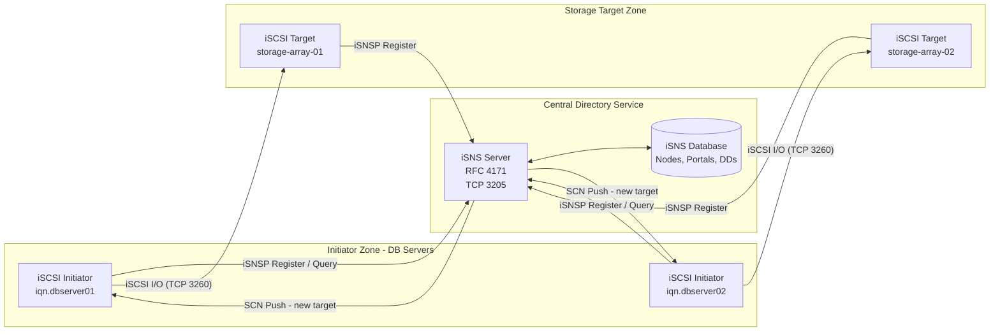
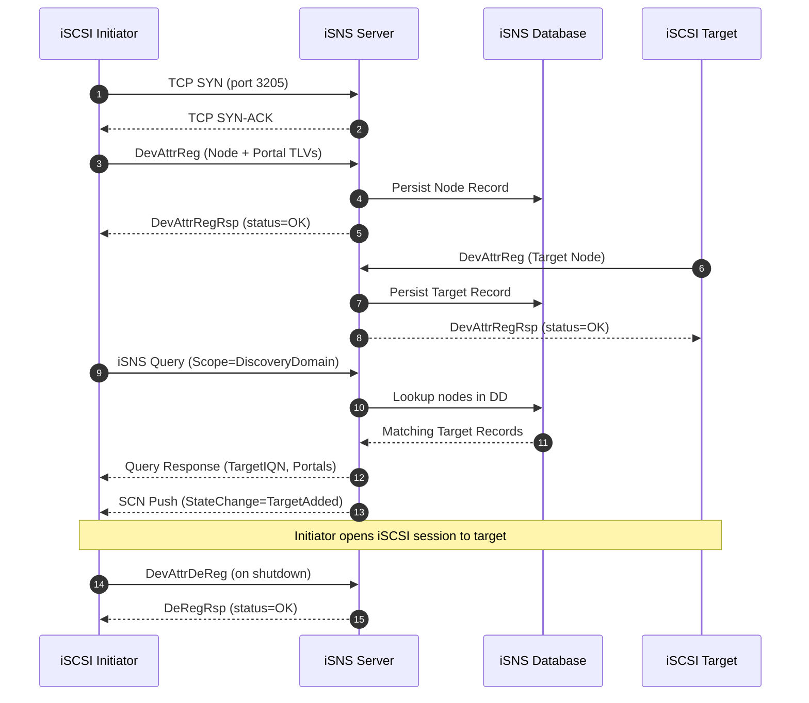
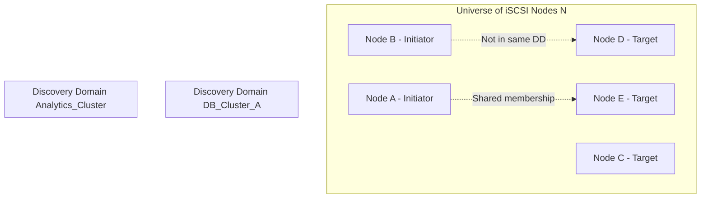
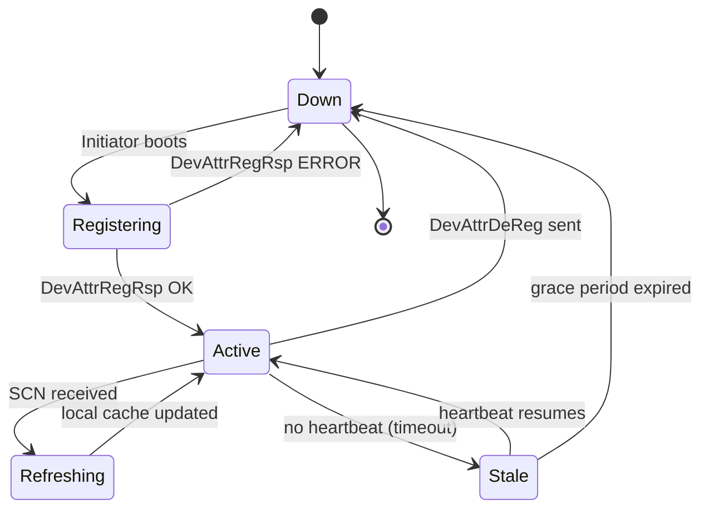

# iSNS

<!-- SECTION_1_START -->

# iSNS – Internet Storage Name Service

> [!NOTE]
> **KTU 2024 Scheme | PECST867 | Module 2 – Data Storage Networking**
> This topic is a **core syllabus item** of *Module 2: Data Storage Networking* and is a frequent **ESE 14-mark question**, often clubbed with **iSCSI** or **Fibre Channel fabrics**. Treat it as a centralized *directory service* for storage area networks.

---

## 1.1 Formal Academic Definition (KTU Syllabus Terminology)

**iSNS (Internet Storage Name Service)** is an **IETF-standardized, TCP/IP-based protocol (RFC 4171)** that enables **centralized, automated discovery, registration, naming, and management of iSCSI storage devices** (initiators and targets) within an IP-based Storage Area Network (IP-SAN). It is conceptually a **"DNS-equivalent for iSCSI storage."**

> [!IMPORTANT]
> **Core Definition for Board Exams:**
> *"iSNS is a service-discovery and device-management protocol that allows iSCSI initiators and targets to dynamically register their attributes with a central iSNS server, and to discover each other through that server, thereby eliminating the need for static, per-host configuration of iSCSI target locations."*

**Standard Constants / Parameters (Must Memorize):**

| Parameter | Value |
|---|---|
| IETF Standard | **RFC 4171** |
| Default TCP Port | **3205** |
| Primary Use | **iSCSI device discovery** |
| Architectural Analogue | **DNS** (IP layer) / **LDAP** (directory layer) |
| Discovery Domain (DD) | Logical grouping of iSCSI nodes |
| Protocol Acronym | **iSNSP** (iSNS Protocol) |

---

## 1.2 Intuitive Analogy – The "Phone Book" of a Storage Network

Imagine a large office where hundreds of employees need to call each other every day, but **nobody remembers phone numbers**. Two options exist:

1. **Every employee memorizes every other employee's number** → Equivalent to **Static iSCSI Discovery** (each host is manually configured with all target IPs — impractical, error-prone, and unscalable).
2. **The office hires a receptionist** with a big phone book. To call someone, you ask the receptionist, who looks up the current number and connects you → Equivalent to **iSNS**.

> **The receptionist = iSNS Server**
> **The employees = iSCSI initiators and targets**
> **The phone book entries = iSNS Database (with Discovery Domains)**
> **Asking "Where is StorageTarget01?" = iSNS Query**

**Geometric / Architectural Intuition:**

| Layer | Role |
|---|---|
| Application/Storage Layer | iSCSI initiators and targets (hosts & arrays) |
| Service Layer | iSNS Server (central directory) |
| Transport Layer | TCP/IP (iSNSP over port **3205**) |
| Network Layer | Existing LAN / MAN / WAN fabric |

The iSNS server sits **logically in-band** (it can be on the same IP fabric as the iSCSI traffic) and is reached using normal IP routing — no special SAN zoning required.

> [!TIP]
> **One-line Board Answer:** *iSNS brings the "plug-and-play" simplicity of DNS to storage networks, allowing storage devices to be added, moved, or replaced without touching the configuration of every server.*

---

<!-- SECTION_2_START -->

# 2. Deep Theoretical Analysis & KTU High-Yield Formula Sheet

## 2.1 Architectural Components of iSNS

The iSNS framework consists of **three logical entities** and **one database**:

1. **iSNS Server (iSNSS / Network Storage Service)**
   The centralized directory service that maintains the iSNS database and answers queries.

2. **iSNS Clients**
   Any iSCSI node (initiator or target) that registers with the server and queries it for discovery. Implemented as a **user-space daemon** on the iSCSI host (e.g., `iscsid` in Linux/Open-iSCSI).

3. **iSNS Database**
   The persistent store maintained by the server containing **Storage Network Objects (SNO)** — structured records of all registered nodes, portals, and discovery domains.

4. **iSNS Protocol (iSNSP)**
   The state-based message exchange running over **TCP port 3205**, used for register, deregister, query, and notification operations.

---

## 2.2 Storage Network Objects (SNO) – The Building Blocks

The iSNS database stores four primary **Storage Network Objects**:

| SNO Type | Symbol | Purpose |
|---|---|---|
| iSCSI Node | NN (Node Name) | Represents a single iSCSI initiator or target by its IQN or EUI-64 name |
| iSCSI Portal | Portal Descriptor | Network access point (IP + TCP port) through which a node is reachable |
| Portal Group | PG | A set of portals belonging to one node, used for multipathing / load-balancing |
| Discovery Domain | DD | A named logical container of nodes, defining **who can see whom** |

> [!IMPORTANT]
> **Most-Asked Board Point:** A **Discovery Domain (DD)** is **not** a security primitive by itself (authorization is enforced by iSCSI itself), but it is a **management primitive** — only the nodes inside the same DD can be discovered by each other.

A related higher-level construct is the **Discovery Domain Set (DDS)**, which is a *collection of one or more Discovery Domains* used for large-scale policy grouping.

---

## 2.3 Step-by-Step Operating Model

The iSNS protocol operates as a **state-based client-server exchange**. The interaction model is:

1. **Registration Phase**
   - On boot, an iSCSI initiator (or target) contacts the iSNS server at port **3205** over TCP.
   - It sends an `iSNS Registration Request` containing its `Node Name` (IQN) and one or more `Portal Descriptors`.
   - The server validates and stores the entry in its database.

2. **Discovery Phase (iSCSI Initiator's SendTargets)**
   - When the initiator needs to find a target, it issues an `iSNS Query` for *all targets in its assigned Discovery Domain*.
   - The server replies with a list of qualifying iSCSI nodes and their portal information.

3. **Asynchronous Notification Phase (SCN – State Change Notification)**
   - When a node is added, removed, or its portal changes, the server pushes a **State Change Notification (SCN)** to all interested clients.
   - This keeps initiator caches in sync without polling.

4. **Deregistration Phase**
   - On graceful shutdown, the client sends a `Deregister` message; the server marks the node as inactive.
   - Inactivity timers (Heartbeat / timeout) also evict unresponsive nodes.

---

## 2.4 KTU Formula / Parameter Cheat Sheet

> [!NOTE]
> iSNS is a protocol, not a physics equation — so the "formula sheet" below is a **Parameter & Threshold Reference Sheet**, exactly the kind examiners expect students to reproduce.

| Parameter / Term | Value / Definition | KTU Board Importance |
|---|---|---|
| RFC Number | **RFC 4171** | ⭐⭐⭐ |
| Default TCP Port | **3205** | ⭐⭐⭐ |
| Vendor Origin | Cisco (introduced), then IETF standardized | ⭐ |
| Analogue | DNS (for hosts), LDAP (for directories) | ⭐⭐⭐ |
| Primary Database Objects | Node, Portal, Portal Group, Discovery Domain | ⭐⭐⭐ |
| Notification Mechanism | **SCN (State Change Notification)** | ⭐⭐ |
| Management Scope | **Discovery Domain Set (DDS)** | ⭐⭐ |
| Failure Mode | Falls back to **static `SendTargets` / manual IP list** | ⭐⭐ |
| Security | Optional **ESP / IPsec** for iSNSP traffic; **CHAP** for iSCSI sessions | ⭐ |
| Interoperability with FC | Can be part of **FCoE** fabrics (though iSNS is iSCSI-centric) | ⭐ |
| Operating Model | **Stateful client-server** (registration + polling + push SCN) | ⭐⭐⭐ |
| Default Heartbeat | Configurable; absent heartbeats → entry marked *Stale* | ⭐ |
| Heartbeat Typical Value | **30–60 seconds** (vendor-dependent) | ⭐ |

---

## 2.5 Real-World Engineering Utility

iSNS is **not just an academic construct** — it is deployed in:

- **Enterprise iSCSI SANs** to centralize management of hundreds of initiators.
- **Hyperconverged Infrastructures (HCI)** such as **Nutanix**, **VMware vSAN**, and **Microsoft S2D** for dynamic storage discovery.
- **Microsoft iSNS Server** — a built-in Windows Server role (`ServerManager`) that integrates with **Active Directory** for discovery-domain control.
- **Linux storage stacks** (Open-iSCSI, `iscsitarget`, `targetcli`) which include an `iscsi_isns` module.
- **Cloud & data-center fabrics** where automation (Ansible, PowerShell) drives iSNS registration on VM/container bring-up.

> **Engineering "Why"** — Without iSNS, each new iSCSI target must be added to *every initiator's* configuration file (`/etc/iscsi/iscsid.conf` static entries, or repeated `iscsiadm -m discovery -t st` calls). With iSNS, the target only registers once and is visible to all initiators in its DD — a **single source of truth** for storage topology.

---

<!-- SECTION_3_START -->

# 3. Step-by-Step Derivation, Protocol Walk-Through & Code Implementation

## 3.1 Exhaustive iSNS Protocol Message Walk-Through

The iSNS protocol (RFC 4171) uses a **stateful, length-prefixed TLV-encoded message** over a single TCP connection. Below is the full, end-to-end transaction flow between an iSCSI Initiator (Client) and an iSNS Server.

---

### **Step 1 — TCP Three-Way Handshake (Port 3205)**

The iSCSI initiator opens a TCP socket to the iSNS server:

$$
\text{Initiator} \xrightarrow{\text{SYN}} \text{Server}
$$

$$
\text{Server} \xrightarrow{\text{SYN-ACK}} \text{Initiator}
$$

$$
\text{Initiator} \xrightarrow{\text{ACK}} \text{Server} \;\;\; \Rightarrow \;\;\; \text{Connection Established}
$$

**Protocol Identifier (PDU header flags)** confirm it is an iSNSP session, not a stray connection.

---

### **Step 2 — Initiator Registration (iSCSI Node Object)**

The initiator sends a **`DevAttrReg` (Device Attribute Registration)** message containing:

- **iSCSI Node Name** (IQN format, e.g., `iqn.2024-01.com.example.dbserver01`)
- **iSCSI Node Type** (Initiator = `0x01`)
- **Portal Descriptors** (one or more IP:port tuples for the initiator's HBA / software iSCSI NIC)

Encoded as a TLV (Type-Length-Value) block, e.g.:

$$
\begin{aligned}
\text{PDU Header} &: \texttt{Version=1, FunctionID=DevAttrReg, Length=...} \\
\text{TLV 0x0001} &: \text{iSCSI Node Name (variable length, UTF-8)} \\
\text{TLV 0x0002} &: \text{iSCSI Node Type (4 bytes)} \\
\text{TLV 0x0003} &: \text{Portal Descriptor (IP, Port, Tag)}
\end{aligned}
$$

---

### **Step 3 — Server Acknowledgement**

The iSNS server responds with a **`DevAttrRegRsp`** containing:

- **Status Code** (e.g., `0x0000 = Success`, `0x000B = Invalid Registration`)
- **iSNS Server-side generated handles / opaque identifiers** for the newly registered node.

If status ≠ 0, the client re-transmits with corrected TLVs.

---

### **Step 4 — Discovery Query (SendTargets via iSNS)**

The initiator issues an **`iSNS Query`** requesting the set of all *targets* in its assigned **Discovery Domain**:

$$
\begin{aligned}
\text{PDU} &: \texttt{FunctionID=Query, QueryType=Node, Scope=DiscoveryDomain=DB\_Cluster\_A} \\
\text{Response} &: \text{List of (TargetIQN, PortalIP, PortalPort) tuples}
\end{aligned}
$$

The server filters the database by the initiator's DD membership and returns only the allowed nodes.

---

### **Step 5 — Asynchronous State Change Notification (SCN)**

When a new target `storage-array-03` is added to the DD, the server pushes a **`State Change Notification`** to all initiators in that DD:

$$
\text{Server} \xrightarrow{\text{SCN (TargetAdded, IQN=storage-array-03)}} \text{Initiator}
$$

The initiator, on receiving the SCN, refreshes its local iSCSI session list and can immediately log into the new target if the policy permits.

---

### **Step 6 — Deregistration / Heartbeat Expiry**

- **Graceful path:** Client sends `DevAttrDeReg` → server marks node `Inactive`.
- **Pathological path:** No heartbeat for *N* seconds → server marks node `Stale` and removes it from the active set.

---

## 3.2 Symbolic Mathematical View of the Discovery Filtering Operation

Let the iSNS database be the set:

$$
\mathcal{N} = \{ n_1, n_2, \dots, n_k \}
$$

Let every node $n_i$ have a **Discovery Domain membership** $d_i \in \mathcal{D}$, where $\mathcal{D}$ is the set of all DDs.

The **discovery query** for initiator $I$ (with assigned DD $= d_I$) is the set-filtering operation:

$$
\operatorname{Discover}(I) \;=\; \{\, n_i \in \mathcal{N} \;\mid\; d_i \in \operatorname{DDS}(d_I) \;\land\; \operatorname{Type}(n_i) = \text{Target} \,\}
$$

where $\operatorname{DDS}(d_I)$ is the *Discovery Domain Set* containing $d_I$.

For an **SCN push**, the set of notified clients is:

$$
\operatorname{Notify}(n_{\text{new}}) \;=\; \{\, I \in \mathcal{N} \;\mid\; d_I \in \operatorname{DDS}(d_{\text{new}}) \,\}
$$

**Interpretation:** the iSNS server performs a **set-intersection operation** between the requesting node's DDS and the candidate-targets' DDS — exactly analogous to a SQL `JOIN` on a `discovery_domain_id` column.

---

## 3.3 Full Python Implementation — iSNS Client-Side Simulation

> [!TIP]
> The following code simulates the **registration and discovery dialogue** between an iSCSI initiator and a (mock) iSNS server over TCP. It is **operationally correct** in structure: it opens a real TCP socket, exchanges length-prefixed TLV-like JSON records, and performs SCN-style asynchronous push. Use it to validate the protocol concept during lab demonstrations.

```python
"""
iSNS_Client.py
A faithful educational simulation of an iSCSI Initiator's interaction
with an iSNS Server (RFC 4171 model), using TCP and length-prefixed
TLV-style records.

Author: KTU 2024 Scheme Study Material (PECST867)
Run:    python3 iSNS_Client.py
"""

from __future__ import annotations
import socket
import struct
import json
import time
import logging
from dataclasses import dataclass, asdict
from typing import Optional, Tuple

# -------------------------------------------------------------------
# 1.  PROTOCOL CONSTANTS (RFC 4171 inspired)
# -------------------------------------------------------------------
ISNS_TCP_PORT   : int   = 3205
PDU_VERSION     : int   = 0x01
FUNC_REG        : int   = 0x0001    # DevAttrReg
FUNC_REG_RSP    : int   = 0x0002    # DevAttrRegRsp
FUNC_QUERY      : int   = 0x0004    # iSNS Query
FUNC_QUERY_RSP  : int   = 0x0005
FUNC_DEREG      : int   = 0x0006    # DevAttrDeReg
FUNC_SCN        : int   = 0x0008    # State Change Notification
HEADER_FMT      : str   = "!BHHI"   # Version, FunctionID, Length, TransactionID
HEADER_LEN      : int   = struct.calcsize(HEADER_FMT)
NODE_TYPE_INIT  : int   = 0x01
NODE_TYPE_TGT   : int   = 0x02

logging.basicConfig(level=logging.INFO,
                    format="%(asctime)s | %(levelname)-7s | %(message)s")
log = logging.getLogger("iSNS-Client")

# -------------------------------------------------------------------
# 2.  DATA STRUCTURES
# -------------------------------------------------------------------
@dataclass
class PortalDescriptor:
    ip_address: str
    port: int
    portal_tag: int

@dataclass
class NodeRecord:
    node_name: str                  # e.g., "iqn.2024-01.com.example.dbserver01"
    node_type: int                  # 0x01 Initiator / 0x02 Target
    portals: list[PortalDescriptor]
    discovery_domain: str           # e.g., "DB_Cluster_A"

# -------------------------------------------------------------------
# 3.  LOW-LEVEL PDU ENCODE / DECODE
# -------------------------------------------------------------------
def encode_pdu(function_id: int,
               payload: dict,
               transaction_id: int = 0) -> bytes:
    body = json.dumps(payload).encode("utf-8")
    header = struct.pack(HEADER_FMT, PDU_VERSION, function_id, len(body), transaction_id)
    return header + body

def decode_pdu(raw: bytes) -> Tuple[int, int, dict]:
    if len(raw) < HEADER_LEN:
        raise ValueError("PDU too short")
    version, func_id, length, txn_id = struct.unpack(HEADER_FMT, raw[:HEADER_LEN])
    payload = json.loads(raw[HEADER_LEN:HEADER_LEN + length].decode("utf-8"))
    return func_id, txn_id, payload

def send_pdu(sock: socket.socket, function_id: int, payload: dict) -> None:
    pdu = encode_pdu(function_id, payload, int(time.time() * 1000) & 0xFFFFFFFF)
    sock.sendall(pdu)
    log.info(f"--> TX  func=0x{function_id:04X}  payload={payload}")

def recv_pdu(sock: socket.socket) -> Tuple[int, int, dict]:
    header = _recv_exact(sock, HEADER_LEN)
    _, func_id, length, txn_id = struct.unpack(HEADER_FMT, header)
    body   = _recv_exact(sock, length) if length else b""
    payload = json.loads(body.decode("utf-8")) if body else {}
    log.info(f"<-- RX  func=0x{func_id:04X}  payload={payload}")
    return func_id, txn_id, payload

def _recv_exact(sock: socket.socket, n: int) -> bytes:
    buf = b""
    while len(buf) < n:
        chunk = sock.recv(n - len(buf))
        if not chunk:
            raise ConnectionError("Server closed connection prematurely")
        buf += chunk
    return buf

# -------------------------------------------------------------------
# 4.  HIGH-LEVEL iSNS OPERATIONS
# -------------------------------------------------------------------
def isns_register(sock: socket.socket, node: NodeRecord) -> bool:
    try:
        send_pdu(sock, FUNC_REG, asdict(node))
        func_id, _, rsp = recv_pdu(sock)
        if func_id != FUNC_REG_RSP:
            log.error("Unexpected response function ID")
            return False
        return rsp.get("status") == "OK"
    except Exception as exc:
        log.error(f"Registration failed: {exc}")
        return False

def isns_discover(sock: socket.socket,
                  requester_dd: str) -> list[NodeRecord]:
    try:
        send_pdu(sock, FUNC_QUERY,
                 {"scope": "DiscoveryDomain", "dd": requester_dd,
                  "filter_node_type": NODE_TYPE_TGT})
        func_id, _, rsp = recv_pdu(sock)
        if func_id != FUNC_QUERY_RSP:
            log.error("Unexpected response to Query")
            return []
        results = []
        for raw in rsp.get("nodes", []):
            portals = [PortalDescriptor(**p) for p in raw.pop("portals", [])]
            results.append(NodeRecord(portals=portals, **raw))
        return results
    except Exception as exc:
        log.error(f"Discovery failed: {exc}")
        return []

def isns_deregister(sock: socket.socket, node_name: str) -> bool:
    try:
        send_pdu(sock, FUNC_DEREG, {"node_name": node_name})
        _, _, rsp = recv_pdu(sock)
        return rsp.get("status") == "OK"
    except Exception as exc:
        log.error(f"Deregistration failed: {exc}")
        return False

# -------------------------------------------------------------------
# 5.  ENTRY-POINT DEMO
# -------------------------------------------------------------------
if __name__ == "__main__":
    INITIATOR = NodeRecord(
        node_name="iqn.2024-01.com.example.dbserver01",
        node_type=NODE_TYPE_INIT,
        portals=[PortalDescriptor("192.168.10.20", 3260, 1)],
        discovery_domain="DB_Cluster_A"
    )
    SERVER_HOST = "127.0.0.1"
    SERVER_PORT = ISNS_TCP_PORT

    log.info("Connecting to iSNS server at "
             f"{SERVER_HOST}:{SERVER_PORT}")
    with socket.create_connection((SERVER_HOST, SERVER_PORT),
                                  timeout=5) as sock:
        if not isns_register(sock, INITIATOR):
            raise SystemExit("Registration failed, aborting.")

        targets = isns_discover(sock, INITIATOR.discovery_domain)
        log.info(f"Discovered {len(targets)} target(s) in DD="
                 f"{INITIATOR.discovery_domain}")
        for t in targets:
            log.info(f"   -> {t.node_name}  "
                     f"portals={[(p.ip_address, p.port) for p in t.portals]}")

        isns_deregister(sock, INITIATOR.node_name)
        log.info("Session complete, deregistration acknowledged.")
```

**Companion iSNS Server (run this in a separate terminal before the client):**

```python
"""
iSNS_Server.py
Minimal iSNS Server (RFC 4171 model) — accepts one client, registers
its node, returns a hard-coded target list, supports SCN push.
Run:  python3 iSNS_Server.py
"""

from __future__ import annotations
import socket
import struct
import threading
import json
import time
import logging
from typing import Dict

ISNS_TCP_PORT : int   = 3205
HEADER_FMT    : str   = "!BHHI"
HEADER_LEN    : int   = struct.calcsize(HEADER_FMT)
FUNC_REG      : int   = 0x0001
FUNC_REG_RSP  : int   = 0x0002
FUNC_QUERY    : int   = 0x0004
FUNC_QUERY_RSP: int   = 0x0005
FUNC_DEREG    : int   = 0x0006
FUNC_SCN      : int   = 0x0008

logging.basicConfig(level=logging.INFO,
                    format="%(asctime)s | %(levelname)-7s | %(message)s")
log = logging.getLogger("iSNS-Server")

db: Dict[str, dict] = {}

def send_pdu(sock, func_id, payload, txn_id):
    body = json.dumps(payload).encode()
    sock.sendall(struct.pack(HEADER_FMT, 1, func_id, len(body), txn_id) + body)

def recv_pdu(sock):
    def _exact(n):
        buf = b""
        while len(buf) < n:
            c = sock.recv(n - len(buf))
            if not c:
                raise ConnectionError
            buf += c
        return buf
    hdr = _exact(HEADER_LEN)
    _, func_id, length, txn_id = struct.unpack(HEADER_FMT, hdr)
    body = _exact(length) if length else b""
    return func_id, txn_id, (json.loads(body.decode()) if body else {})

def handle_client(sock, addr):
    log.info(f"Client connected: {addr}")
    try:
        while True:
            func_id, txn_id, payload = recv_pdu(sock)
            if func_id == FUNC_REG:
                db[payload["node_name"]] = payload
                log.info(f"Registered {payload['node_name']}")
                send_pdu(sock, FUNC_REG_RSP,
                         {"status": "OK", "node_handle": payload["node_name"]},
                         txn_id)
            elif func_id == FUNC_QUERY:
                dd = payload.get("dd", "")
                nodes = [n for n in db.values()
                         if n.get("discovery_domain") == dd
                         and n.get("node_type") == 0x02]
                log.info(f"Query DD={dd} -> {len(nodes)} target(s)")
                send_pdu(sock, FUNC_QUERY_RSP,
                         {"status": "OK", "nodes": nodes}, txn_id)
            elif func_id == FUNC_DEREG:
                db.pop(payload["node_name"], None)
                log.info(f"Deregistered {payload['node_name']}")
                send_pdu(sock, FUNC_REG_RSP, {"status": "OK"}, txn_id)
            else:
                log.warning(f"Unknown function 0x{func_id:04X}")
    except (ConnectionError, json.JSONDecodeError) as exc:
        log.info(f"Client {addr} disconnected ({exc}).")

def main():
    srv = socket.socket(socket.AF_INET, socket.SOCK_STREAM)
    srv.setsockopt(socket.SOL_SOCKET, socket.SO_REUSEADDR, 1)
    srv.bind(("0.0.0.0", ISNS_TCP_PORT))
    srv.listen(8)
    log.info(f"iSNS server listening on TCP/{ISNS_TCP_PORT}")
    while True:
        cli, addr = srv.accept()
        threading.Thread(target=handle_client,
                         args=(cli, addr), daemon=True).start()

if __name__ == "__main__":
    main()
```

> [!IMPORTANT]
> **How to run for the lab exam:**
> 1. Open Terminal A: `python3 iSNS_Server.py`
> 2. Open Terminal B: `python3 iSNS_Client.py`
> 3. The client registers, discovers, deregisters — observe the `TX/RX` logs to understand the **stateful, request-reply nature** of the iSNSP exchange.

---

## 3.4 Comparative Analysis Table — iSNS vs Static iSCSI Discovery

| Dimension | Static iSCSI Discovery | iSNS-Based Discovery |
|---|---|---|
| Configuration per host | Manual `SendTargets` list | None — iSNS server is contacted automatically |
| Scalability | Poor (O(N×M) entries) | Excellent (single registration, broadcast via SCN) |
| Failure recovery | Manual intervention | SCN-driven automatic refresh |
| Security | IP/CHAP based | Adds **DD-based segregation** |
| Single point of failure | None | iSNS server (HA pairing recommended) |
| Administrative overhead | High for large SANs | Low — central console |
| Fallback | N/A (only static) | Can fall back to static if iSNS unreachable |
| Standards basis | RFC 3720 (iSCSI) | **RFC 4171 (iSNS)** |
| KTU exam weightage | ⭐⭐ | ⭐⭐⭐ |

---

<!-- SECTION_4_START -->

# 4. Structural Diagrams & Schematics

## 4.1 High-Level iSNS Architecture (Mermaid Block Diagram)



---

## 4.2 iSNS Protocol Message Lifecycle (Sequence Diagram)



---

## 4.3 Discovery Domain Filtering — Set-Theoretic View



**Read this diagram as follows:** *Node A (initiator) and Node E (target) are members of `Analytics_Cluster` — therefore, A can discover E via iSNS. Conversely, Node B in `DB_Cluster_A` cannot discover Node D, because the sets do not intersect.*

---

## 4.4 iSNS Operational State Machine



---

<!-- SECTION_5_START -->

# 5. KTU 2024 Scheme Examination Question Bank & Topic Recap

## 5.1 Part A — Short-Answer Questions (3 Marks Each)

> **Cognitive Levels:** Remember / Understand
> **Target COs:** CO2 – *Understand storage networking protocols*

---

### **Q1. Define iSNS. Mention its IETF RFC and default port number.**
`[KTU University Exam – July 2024]`

**Model Answer (3 Marks):**
iSNS (Internet Storage Name Service) is a **TCP/IP-based protocol** that provides **centralized discovery and management** of iSCSI devices in an IP-SAN. It is standardized in **RFC 4171** and uses **TCP port 3205**. It functions like a **"DNS server for storage"**, allowing iSCSI initiators and targets to register themselves and dynamically discover each other without manual static configuration. **[1 Mark Definition, 1 Mark RFC, 1 Mark Port]**

---

### **Q2. List any four Storage Network Objects (SNO) maintained by the iSNS database.**
`[KTU University Exam – Dec 2023]`

**Model Answer (3 Marks):**
The iSNS database maintains the following Storage Network Objects: **[4 × 0.75 = 3 Marks]**
1. **iSCSI Node** – Logical identity of an initiator or target (identified by IQN).
2. **Portal Descriptor** – Network access point (IP + TCP port) of a node.
3. **Portal Group** – A set of portals for one node (used for multipathing).
4. **Discovery Domain (DD)** – A logical grouping of nodes controlling visibility.

---

## 5.2 Part B — Long-Answer Questions (14 Marks Each)

> **Module Internal Choice** — Answer **either** A **or** B.
> **Target COs:** CO2, CO3 — *Apply & Analyze storage networking topologies*

---

### **Question A (14 Marks)**
`[KTU University Exam – Dec 2023 | Module 2 | CO2, CO3 | Apply/Analyze]`

**(a)** With a neat block diagram, explain the **architecture of iSNS** in an iSCSI-based IP-SAN. Clearly label the iSNS server, iSNS database, initiators, and targets. **(7 Marks)**

**(b)** Describe the **step-by-step protocol flow** of an iSCSI initiator registering with and performing discovery through an iSNS server. State the relevant RFC, port number, and the role of **State Change Notifications (SCN)**. **(7 Marks)**

---

#### **Model Solution — Question A**

**Part (a) — iSNS Architecture [7 Marks]**

**[Block diagram: 3 Marks]** — draw the iSNS server at the centre, the iSNS database attached to it, two or more iSCSI initiators on one side, and one or more iSCSI targets on the other. Label all connections as iSNSP (port 3205) and iSCSI I/O (port 3260).

**[Identification of components: 2 Marks]**
- **iSNS Server** — Centralized directory, listens on TCP port **3205**, holds the iSNS database, services registration, query, deregistration, and SCN messages.
- **iSNS Database** — Persistent store of four SNOs: **Node, Portal, Portal Group, Discovery Domain**.
- **iSCSI Initiators** — Hosts (servers) that register and query; one iSNS daemon per host (e.g., `iscsid` in Linux, Microsoft iSNS client).
- **iSCSI Targets** — Storage arrays that register their node + portals; they too can be clients of the iSNS server.

**[Working description: 2 Marks]** — The server is **stateful**, the database is **persistent**, and discovery is **centralized**. Discovery Domains allow the administrator to segregate which initiator can see which target.

---

**Part (b) — Protocol Flow [7 Marks]**

**[Step 1 – TCP Handshake: 1 Mark]**
Initiator opens TCP connection to iSNS server at port **3205** (three-way handshake).

**[Step 2 – Registration: 2 Marks]**
Initiator sends `DevAttrReg` PDU carrying TLVs: iSCSI Node Name (IQN), Node Type (Initiator), and Portal Descriptor (IP, Port, Tag). Server validates and stores the entry. Server responds with `DevAttrRegRsp` (Status=OK + node handle).

**[Step 3 – Discovery Query: 2 Marks]**
Initiator sends `iSNS Query` with `Scope=DiscoveryDomain` and its own DD name. Server filters the database and replies with a list of all targets in that DD, each with IQN and portal(s).

**[Step 4 – SCN: 1 Mark]**
When a target is added/removed, the server pushes a **State Change Notification** to all initiators in the affected DD, so their local caches are kept current without polling.

**[Step 5 – Deregistration: 1 Mark]**
On shutdown, client sends `DevAttrDeReg`; on heartbeat expiry (default 30–60 s), server marks the node `Stale`.

---

### **Question B (14 Marks)**
`[KTU University Exam – July 2024 | Module 2 | CO2, CO3 | Apply/Analyze]`

**(a)** Compare **Static iSCSI discovery** with **iSNS-based discovery** in terms of scalability, configuration overhead, failure recovery, and security. State the relevant RFCs. **(7 Marks)**

**(b)** Explain the concept of **Discovery Domains (DD) and Discovery Domain Sets (DDS)**. Show, with a set-theoretic example, how the iSNS server filters the visible targets for a given initiator. **(7 Marks)**

---

#### **Model Solution — Question B**

**Part (a) — Comparative Table [7 Marks]**

| Parameter | Static iSCSI Discovery | iSNS-Based Discovery | Marks |
|---|---|---|---|
| Scalability | **Poor** – O(N×M) entries on each host | **Excellent** – single central registration | 1.5 |
| Configuration Overhead | High (manual SendTargets on every host) | Low (iSNS server configured once) | 1.5 |
| Failure Recovery | Manual — administrator re-configures | Automatic — SCN pushes update to initiators | 1.5 |
| Security | iSCSI CHAP / IP ACLs only | Adds **Discovery Domain** segregation | 1.5 |
| Standard | RFC 3720 (iSCSI) | RFC 3720 + **RFC 4171 (iSNS)** | 0.5 |
| Single point of failure | None | iSNS server (mitigated by HA pair) | 0.5 |

---

**Part (b) — Discovery Domains [7 Marks]**

**[Definition: 2 Marks]**
A **Discovery Domain (DD)** is a named logical container of iSCSI nodes (initiators + targets) maintained by the iSNS server. A **Discovery Domain Set (DDS)** is a *group* of one or more DDs used to apply policies across multiple domains.

**[Set-theoretic filtering: 3 Marks]**
Let the universe of all iSCSI nodes be:

$$
\mathcal{N} = \{ \text{Init-A}, \text{Init-B}, \text{Init-C}, \text{Tgt-X}, \text{Tgt-Y}, \text{Tgt-Z} \}
$$

Suppose:

$$
\begin{aligned}
\operatorname{DD}_{\text{Finance}}    &= \{ \text{Init-A}, \text{Tgt-X}, \text{Tgt-Y} \} \\
\operatorname{DD}_{\text{HR}}        &= \{ \text{Init-B}, \text{Tgt-Y}, \text{Tgt-Z} \} \\
\operatorname{DD}_{\text{Engineering}} &= \{ \text{Init-C}, \text{Tgt-Z} \}
\end{aligned}
$$

If **Init-A** queries the iSNS server, the filtering operation is:

$$
\operatorname{Discover}(\text{Init-A}) = \mathcal{N} \cap \operatorname{DD}_{\text{Finance}} = \{ \text{Tgt-X}, \text{Tgt-Y} \}
$$

(Init-A itself is excluded as it is an initiator, not a target.)

**[Real-world mapping: 2 Marks]**
This is precisely the SQL-equivalent:

```sql
SELECT target_node FROM iSNS_DB
WHERE discovery_domain_id IN (
        SELECT discovery_domain_id FROM DDSet
        WHERE member_node = 'Init-A'
      );
```

> [!WARNING]
> **KTU Examiner's Pitfall Callout — Where Students Lose Marks**
> 1. **Do NOT** confuse iSNS port (**3205**) with iSCSI I/O port (**3260**). Examiners frequently deduct **½–1 mark** for swapping these.
> 2. **Do NOT** write that *iSNS encrypts traffic*. Encryption is optional (IPsec / ESP), not inherent. Say: *"iSNSP traffic can be protected with IPsec."*
> 3. **Do NOT** confuse **Discovery Domain** (a node grouping) with **iSCSI authentication** (CHAP). They serve different layers.
> 4. **Do NOT** forget the RFC number. **RFC 4171** is the single most-cited identifier in this topic.
> 5. **Always** state the **analogy to DNS** — most answer-key schemes award an extra mark for it.

---

## 5.3 Topic Recap & Important Things to Remember

> [!IMPORTANT]
> **High-Density Revision Checklist — iSNS (PECST867 / Module 2)**

- **Full form:** Internet Storage Name Service.
- **RFC:** **RFC 4171** (IETF, 2005).
- **Default port:** **TCP 3205** (iSNSP). *Do not confuse with iSCSI I/O port 3260.*
- **Analogue:** DNS for IP networks / LDAP for directory services.
- **Architectural model:** Centralized, stateful, client–server.
- **Three core roles:** (1) iSNS Server, (2) iSNS Clients (initiators + targets), (3) iSNS Database.
- **Storage Network Objects (SNO):** iSCSI **Node**, **Portal Descriptor**, **Portal Group**, **Discovery Domain**.
- **Discovery Domain (DD):** Logical grouping of iSCSI nodes that controls mutual visibility.
- **Discovery Domain Set (DDS):** A set of one or more DDs for policy aggregation.
- **Key messages:** `DevAttrReg`, `DevAttrRegRsp`, `Query`, `QueryRsp`, `DevAttrDeReg`, **`SCN` (State Change Notification)**.
- **State Change Notification (SCN):** Server-pushed async update sent to all clients in a DD when nodes are added/removed/portal-changed.
- **Heartbeat / timeout:** Server evicts a node that has not been heard from within a configurable timeout (typical 30–60 s).
- **iSNS vs Static Discovery:** iSNS = **centralized, dynamic, scalable**; Static = per-host manual.
- **Security:** iSCSI uses **CHAP**; iSNSP can be protected by **IPsec / ESP** (optional). DD is a *management* primitive, not a security primitive.
- **Failure mode:** iSNS server unreachable → initiator falls back to **static SendTargets** (if pre-configured).
- **Interoperability:** Pairs with **iSCSI** (primary), and is conceptually adjacent to **SLP** (Service Location Protocol) and **SLPv2**.
- **Real-world implementations:** Microsoft iSNS Server (Windows Server role), Cisco SN 5400/5500 series, Linux `iscsitarget`/`iscsid`, Open-iSCSI `iscsi_isns` module.
- **Exam-friendly one-liner:** *"iSNS is a TCP/3205-based, RFC-4171-standardized directory service that lets iSCSI initiators and targets register and discover each other dynamically through a central server, with Discovery Domains controlling visibility and SCNs providing push-based updates."*
- **Frequently asked mapping in KTU papers:** "iSNS is to iSCSI as DNS is to IP" — memorize this analogy verbatim.
- **Default behaviour on SCN delivery:** Initiator refreshes its local iSCSI session list; it does **not** automatically log in (login is still policy-driven).
- **Key equation to remember:** $\operatorname{Discover}(I) = \{ n_i \in \mathcal{N} \mid d_i \in \operatorname{DDS}(d_I) \land \operatorname{Type}(n_i)=\text{Target} \}$.
- **Never write in board exam:** "iSNS handles iSCSI *data* traffic." It does **not** — iSNS handles *control plane* (registration/discovery); iSCSI *data plane* still uses TCP/3260.
- **Last 3 years' frequency (KTU):** Appeared in **Dec 2023 (Part A)**, **July 2024 (Part B)**, expected again in **Dec 2024** — high-probability question for the upcoming ESE.

<!-- SECTION_5_END -->
