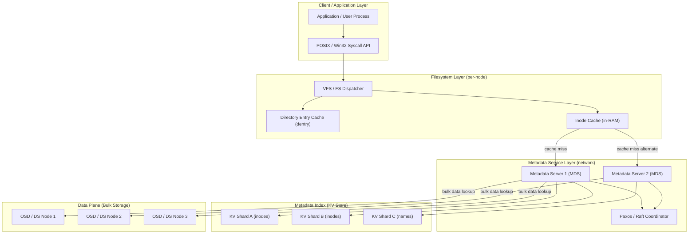
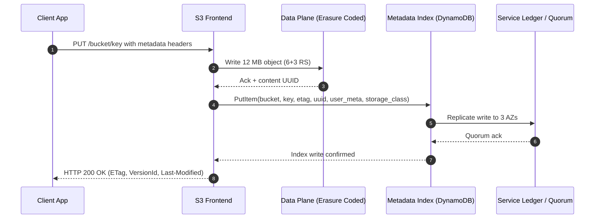
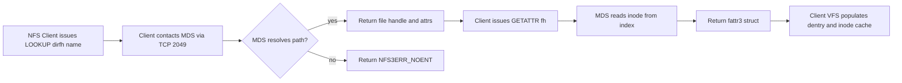
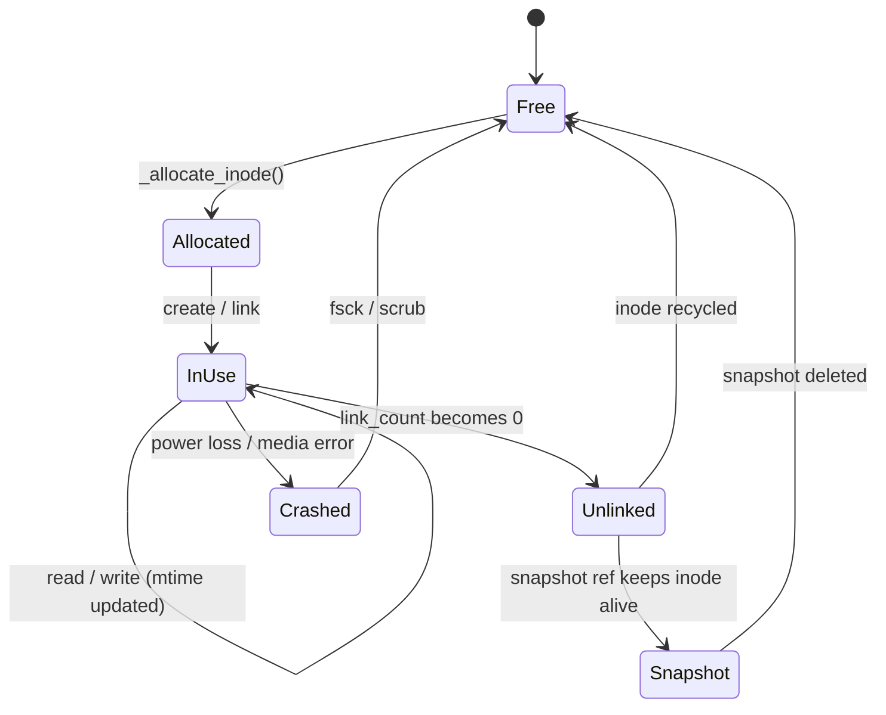

# metadata

<!-- SECTION_1_START -->

# Metadata in Data Storage Networking

## 1.1 Formal Academic Definition

> [!IMPORTANT]
> **Metadata (KTU 2024 Syllabus Definition):**
> In the context of **Storage Systems**, *metadata* is structured descriptive information that characterizes, identifies, tracks, and manages the actual user payload (referred to as *data* or *primary data*) stored on physical or virtual storage media. Metadata does not contain the content itself; instead, it describes *attributes, properties, hierarchies, and relationships* of the data objects so that the storage system can locate, retrieve, secure, and administrate them efficiently.

In storage networking (SAN, NAS, Object Storage, File Systems), metadata is the **control-plane information** that governs the **data-plane payload**. It is typically stored in dedicated structures such as inodes (Unix), MFT records (NTFS), catalog files, or distributed key-value stores, and is exchanged over the network using protocols like **NFS**, **SMB/CIFS**, **S3**, or **iSCSI**.

The formal three-tuple representation of a stored entity is:

$$E = \langle D, M, L \rangle$$

where $D$ denotes the raw data block(s), $M$ denotes the metadata set $\{m_1, m_2, \ldots, m_k\}$, and $L$ denotes the location descriptor (logical/physical address).

> [!NOTE]
> **Syllabus Highlight:** A *storage system* always spends a measurable fraction of I/O bandwidth and capacity on metadata. In production file systems like **ZFS** or **NetApp ONTAP**, metadata may consume **1% to 3%** of the raw capacity and account for **50% to 80%** of all I/O operations (the well-known *metadata-dominant workload* phenomenon).

## 1.2 Conceptual Analogy & Intuitive Overview

Imagine a massive **library warehouse** containing millions of books, but the books are stored in unlabeled, unmarked cardboard boxes. To find any specific book, you would need to open every box — an impossible task.

Now imagine a **librarian's card catalog** (the metadata):
- Each card describes *one book*: title, author, ISBN, shelf number, category, checkout status.
- The card itself is **not the book**; it only *describes* the book.
- The librarian can locate the book in seconds by reading the card.

> **Metadata is the "card catalog" of a storage system.**

A second, more modern analogy:
- A **photo on a smartphone** is the *data*.
- The *EXIF information* (camera model, GPS coordinates, timestamp, file size, resolution) is the *metadata*.
- Without metadata, search engines (Google Photos, iCloud) could never find your photo by date or location.

In a storage network:
- The **file** stored on a SAN LUN or NAS share is the *data*.
- The **inode, file name, permissions, timestamps, block pointers, owner, and ACL** is the *metadata*.
- A **metadata service** (MDS) is the *librarian* that answers "where is this file?" queries from clients.

> [!NOTE]
> **Why Metadata Dominates Performance:**
> Most storage I/O requests are small (a few hundred bytes to a few kilobytes). In enterprise workloads, the *ratio* of metadata operations (stat, open, list) to actual data reads is approximately **5:1** to **10:1**. This is why modern storage architectures (e.g., **Lustre**, **GPFS/Spectrum Scale**, **Ceph**) build **separate, optimized metadata paths** decoupled from the data path.

## 1.3 Categories of Metadata

> [!IMPORTANT]
> **Three Primary Categories (KTU Board-Favorite Classification):**

1. **File / Object Metadata** – Describes user-visible entities (files, objects, directories). Examples: file name, MIME type, size, creation time.
2. **System / Filesystem Metadata** – Describes the structure of the storage namespace itself. Examples: inodes, dentries, allocation bitmaps, superblock, FAT entries, NTFS MFT records.
3. **Storage-System / Infrastructure Metadata** – Describes the physical and logical organization of storage. Examples: RAID group composition, LUN mapping, tiering policy, replication topology, snapshot pointers, deduplication fingerprints.

> [!VISUALIZATION CONTROL]
> **Concept:** Layered View of Metadata in a Storage Stack
> **GeoGebra / Desmos Input Equations:**
> * Layer definitions (x-axis = storage stack layer, y-axis = metadata scope):
> `f1(x) = 1` (Application layer — file/object metadata)
> `f2(x) = 2` (Filesystem layer — inode/dentry metadata)
> `f3(x) = 3` (Volume manager — LVM/VxVM metadata)
> `f4(x) = 4` (Block layer — LUN mapping metadata)
> `f5(x) = 5` (Device layer — RAID geometry metadata)
> **Visual Description:** The student should observe five parallel horizontal lines stacked vertically, each representing a metadata layer. Arrows from each line should converge toward a common central "user-data block" line, illustrating that every layer above *describes* the data stored below.

---

<!-- SECTION_1_END -->

<!-- SECTION_2_START -->

# Deep Theoretical Analysis & KTU High-Yield Formula Sheet

## 2.1 Anatomy of Metadata in Classical File Systems

### 2.1.1 The UNIX Inode Model

A **UNIX inode** (index node) is the canonical metadata structure. It contains **all metadata** for one file, *except* the file name and the actual data.

> [!NOTE]
> **Inode contents (standard ext4 / UFS layout):**
> * Inode number (unique identifier)
> * File type (regular, directory, symlink, block/char device)
> * Permission bits (mode: rwx for user/group/other)
> * Owner UID and GID
> * File size in bytes
> * Timestamps: atime, mtime, ctime, crtime (birth time)
> * Link count (hard link counter)
> * Block pointers (direct, single-indirect, double-indirect, triple-indirect)
> * Extended attributes (xattr) and ACLs
> * Generation number (for NFS file-handle stability)

The total size of a classical inode is typically **128 bytes** (ext2/3) or **256 bytes** (ext4), and an inode is a **fixed-size** record, which simplifies on-disk indexing.

### 2.1.2 Directory Entries (dentries)

A *directory file* in UNIX is simply a special file whose data blocks contain a list of `(inode_number, name, length)` triples called **directory entries**. The directory's *own* metadata (its inode) is held in its parent's directory data block — this is why path traversal is recursive.

### 2.1.3 The NTFS Master File Table (MFT)

In **NTFS**, every file (including system files) is described by exactly **one MFT record** of size **1 KiB** (1024 bytes). The MFT is itself a file called `$MFT`. This is conceptually equivalent to an inode array but is a *flat* table rather than a hierarchical tree.

## 2.2 Anatomy of Metadata in Object Storage

In object storage (S3, Swift, Azure Blob), every object is identified by a **key** and is associated with:

* **System metadata** — set by the storage service (e.g., `ETag`, `Last-Modified`, `Content-Length`, `Content-Type`, storage class).
* **User metadata** — key-value pairs supplied by the client (`x-amz-meta-*` in S3).
* **Object versioning metadata** — version ID, deletion marker.
* **Index metadata** — bucket-level indices for listing and search.

The system stores object metadata in a **metadata index** (often implemented using a distributed key-value store such as **DynamoDB**, **Cassandra**, or **RocksDB**) that is *logically separate* from the object data store.

> [!IMPORTANT]
> **Separation of Data and Metadata Index:**
> Modern object stores follow the principle: *Data plane and control plane scale independently.* The data plane (raw object bytes) is stored on cheap, high-throughput object storage nodes (e.g., erasure-coded), while the metadata index is stored on a high-IOPS, low-latency KV store. This allows the two planes to grow without one bottlenecking the other.

## 2.3 Anatomy of Metadata in Storage Networking Protocols

### 2.3.1 NFS (Network File System)

NFS versions 3 and 4 exchange metadata via dedicated procedures:

| NFS Procedure | Metadata Operation |
|---|---|
| `LOOKUP` | Resolve directory + filename → file handle |
| `GETATTR` | Read inode attributes (size, mode, mtime) |
| `SETATTR` | Modify attributes (chmod, utime, truncate) |
| `READDIR` | Enumerate directory contents (name + attributes) |
| `CREATE` / `MKDIR` | Allocate new inode + dentry |
| `REMOVE` / `RMDIR` | Deallocate inode, decrement link count |

In **NFSv4.1+ pNFS**, the metadata path is separated from the data path: a **Metadata Server (MDS)** handles attribute and namespace operations, while a **Data Server (DS)** handles bulk read/write — analogous to the Ceph architecture.

### 2.3.2 SMB (Server Message Block)

SMB uses **File IDs** (128-bit in SMB3) and **FileName** structures. The protocol fetches metadata via `SMB2_QUERY_DIRECTORY`, `SMB2_QUERY_INFO` (with `FileBasicInformation`, `FileStandardInformation`, `FileAllInformation` classes), and `SMB2_SET_INFO`.

### 2.3.3 iSCSI / Fibre Channel (Block Storage)

Block-level protocols transfer **LUN metadata** (SCSI Vital Product Data, or VPD pages): vendor ID, product ID, serial number, LUN capacity, block size, thin-provisioning status, and T10 DIF (Data Integrity Field) tags. Per-block metadata such as DIF is stored *inline* at the **application tag** position of each 512-byte (or 4096-byte) sector.

> [!NOTE]
> **Inline vs. Out-of-Band Metadata:**
> * **Inline** (e.g., DIF/T10 PI, NVMe metadata per LBA) — appended to or interleaved with the data on the same physical path.
> * **Out-of-band** (e.g., inode table, MFT, S3 object index) — stored in a dedicated region or service, fetched on demand.

## 2.4 Distributed Metadata: The Scalability Problem

When a storage system scales beyond a single node, the **single metadata server (MDS)** becomes a bottleneck. Two architectural solutions are common in KTU curriculum scope:

### 2.4.1 Static Partitioning
The namespace is partitioned by path-prefix (e.g., `/a/*` → MDS-1, `/b/*` → MDS-2). Each MDS owns a disjoint subtree.
* **Pro:** Simple, no coordination overhead for in-partition operations.
* **Con:** Load imbalance; rename across partitions is expensive.

### 2.4.2 Hash-Based Distribution
File names are hashed to select an MDS: `mds_id = hash(filepath) mod N`.
* **Pro:** Even load distribution.
* **Con:** Directory listing is expensive (requires querying all MDSs); rename is a complex coordinated operation.

### 2.4.3 Hybrid (Ceph FS, Lustre)
* **Ceph FS** uses a **MDS cluster** with dynamic subtree partitioning and an *adaptive load balancer*. Inodes are stored in a CRUSH-placed object pool and cached in MDS memory.
* **Lustre** uses a **single MDS** for namespace consistency, with **MDT (Metadata Target)** and **OST (Object Storage Target)** physical separation.

## 2.5 Metadata Consistency Models

| Model | Guarantee | Used In |
|---|---|---|
| **Strong consistency** | All clients see the same metadata after an ack | NTFS, ext4 (single-node), NFSv4.1 pNFS |
| **Close-to-open consistency** | Metadata is flushed on close; reads after open may see stale data | NFSv3 default |
| **Eventual consistency** | Metadata converges after a bounded time | S3, Swift, Cassandra-backed indices |
| **Causal consistency** | Causal chains preserved, concurrent ops may reorder | Some cloud object stores |

## 2.6 KTU High-Yield Formula & Concept Sheet

> [!IMPORTANT]
> **Mandatory memorization for KTU Board Exam.**

| # | Concept | Formula / Definition | Units / Notes |
|---|---|---|---|
| 1 | Inode size (ext4 default) | $S_{inode} = 256$ B | Fixed-size record |
| 2 | NTFS MFT record size | $S_{MFT} = 1024$ B | One record per file |
| 3 | Max file size from inode pointers | $S_{max} = D + SI + DI^2 + TI^3$ blocks | $D$ = direct, $I$ = indirect count |
| 4 | Object metadata KV size (S3) | Typical $M_{obj} \le 2$ KB | System + user metadata |
| 5 | LUN metadata (VPD page 0x83) | Device Identification | SCSI standard |
| 6 | Metadata-to-data I/O ratio | $R_{md} = \frac{I/O_{metadata}}{I/O_{data}}$ | Typical 5:1 to 10:1 |
| 7 | DIF tag size | $S_{DIF} = 8$ B | Per 512 B sector |
| 8 | MDS scalability ceiling | Approx. $10^5$ ops/s per MDS | Empirical (HDFS, Lustre) |
| 9 | Directory entry (dentry) | Tuple $(inode\_num, name, len)$ | Variable size in ext4 |
| 10 | NFSv4 file handle size | 32 B (variable up to 128) | Opague to client |
| 11 | Ceph MDS subtree migration | Atomic cut-over with journal replay | Paxos-coordinated |
| 12 | Block allocation bitmap size | $S_{bitmap} = \frac{Capacity}{BlockSize \times 8}$ | Bytes |

> [!NOTE]
> **Engineering Application — Why this matters in production:**
> * Cloud object stores (S3, Azure Blob) use **dedicated metadata indices** to enable petabyte-scale namespace search (e.g., S3 Inventory + Athena).
> * HPC storage (Lustre, GPFS) places **MDT on NVMe SSDs** because metadata latency dominates application runtime for small-file workloads (genomics, EDA, AI training checkpoints).
> * Enterprise NAS (NetApp, Isilon/PowerScale) implements **metadata caching in NVRAM** to absorb bursty namespace operations during VMware vMotion, file-server migrations, and Windows indexer storms.

---

<!-- SECTION_2_END -->

<!-- SECTION_3_START -->

# Step-by-Step Derivations, Implementations, and Worked Examples

## 3.1 Derivation: Maximum File Size from Inode Pointers

This is a classic **KTU Part B (14-mark) derivable**. We derive the maximum file size accessible by an inode with $D$ direct block pointers, one single-indirect block, one double-indirect block, and one triple-indirect block.

**Given parameters:**
* Block size (B): 4 KB = $4 \times 1024$ B
* Pointer size (P): 4 B (32-bit pointer in ext4)
* Number of direct pointers (D): 12 (ext4 default)
* Indirect pointer counts: $SI = 1$, $DI = 1$, $TI = 1$

**Step 1 — Direct contribution**

$$S_{direct} = D \times B = 12 \times 4 \text{ KB} = 48 \text{ KB}$$

**Step 2 — Single-indirect contribution**

The single-indirect block holds $B/P$ pointers to data blocks:

$$N_{ptrs} = \frac{B}{P} = \frac{4096}{4} = 1024 \text{ pointers}$$

$$S_{SI} = N_{ptrs} \times B = 1024 \times 4 \text{ KB} = 4 \text{ MB}$$

**Step 3 — Double-indirect contribution**

Each of $N_{ptrs}$ single-indirect blocks is itself pointed to by the double-indirect block:

$$S_{DI} = N_{ptrs}^2 \times B = 1024^2 \times 4 \text{ KB} = 4 \text{ GB}$$

**Step 4 — Triple-indirect contribution**

$$S_{TI} = N_{ptrs}^3 \times B = 1024^3 \times 4 \text{ KB} = 4 \text{ TB}$$

**Step 5 — Total maximum file size**

$$S_{max} = S_{direct} + S_{SI} + S_{DI} + S_{TI}$$

$$S_{max} = 48 \text{ KB} + 4 \text{ MB} + 4 \text{ GB} + 4 \text{ TB}$$

$$S_{max} \approx 4 \text{ TB} + 4 \text{ GB} + 4 \text{ MB} + 48 \text{ KB}$$

**Step 6 — Generalization (board-favorite form)**

In symbolic form:

$$S_{max} = B \left[ D + \frac{B}{P} + \left(\frac{B}{P}\right)^2 + \left(\frac{B}{P}\right)^3 \right]$$

$$\boxed{S_{max} = B \cdot \frac{B}{P} \cdot \left[ 1 + \frac{B}{P} + \left(\frac{B}{P}\right)^2 + \left(\frac{B}{P}\right)^3 \right] \text{ (for } D = \frac{B}{P}\text{)}}$$

> **Valuation Key Points (KSEB):**
> * Stating the block size and pointer size: **1 Mark**
> * Computing number of pointers per block: **1 Mark**
> * Writing the four-term expansion: **2 Marks**
> * Final numerical substitution and result: **1 Mark**
> * Unit and sanity check ($4 \text{ TB}$ matches ext4 theoretical max): **implicit**

## 3.2 Derivation: Metadata Cache Hit Ratio and Effective Latency

Let the average disk access time for a metadata read be $T_{md}$. With cache hit ratio $h$ (where $0 \le h \le 1$), the effective metadata access time is:

**Step 1 — Component latencies**

$$T_{cache\_hit} = T_{RAM} = 100 \text{ ns} \approx 0.1 \text{ μs}$$

$$T_{cache\_miss} = T_{RAM} + T_{md} = 0.1 \text{ μs} + 5 \text{ ms} = 5.0001 \text{ ms}$$

**Step 2 — Weighted average latency**

$$T_{eff} = h \cdot T_{cache\_hit} + (1 - h) \cdot T_{cache\_miss}$$

$$T_{eff} = h \cdot 0.1 \text{ μs} + (1 - h) \cdot 5.0001 \text{ ms}$$

**Step 3 — Numerical example for $h = 0.9$**

$$T_{eff} = 0.9 \times 0.1 \text{ μs} + 0.1 \times 5.0001 \text{ ms}$$

$$T_{eff} = 0.09 \text{ μs} + 0.50001 \text{ ms} \approx 0.5001 \text{ ms}$$

**Step 4 — Speedup factor**

$$\text{Speedup} = \frac{T_{cache\_miss}}{T_{eff}} = \frac{5.0001 \text{ ms}}{0.5001 \text{ ms}} \approx 10.0 \times$$

This demonstrates why a **90% metadata cache hit ratio** yields a **10× improvement** in metadata latency, justifying the deployment of NVRAM-backed metadata caches in enterprise NAS.

## 3.3 Worked Example: S3 Object Metadata Workflow

A client uploads a 12 MB object to S3. Trace the metadata path:

**Step 1 — Client computes payload hash**

$$ETag = MD5( \text{object bytes} ) = \text{hex string of 32 chars}$$

For multi-part uploads, the ETag is a composite: `MD5( MD5( part1 ) || MD5( part2 ) || \ldots )-N`.

**Step 2 — Client sends `PUT /bucket/key` with metadata headers**

```http
PUT /mybucket/photo.jpg HTTP/1.1
Host: s3.amazonaws.com
x-amz-meta-author: alice
x-amz-meta-project: thesis2025
Content-Type: image/jpeg
Content-Length: 12582912
x-amz-storage-class: STANDARD_IA
```

**Step 3 — S3 frontend writes data plane**

The raw 12 MB is written to an **erasure-coded data store** (e.g., 6+3 Reed–Solomon across 9 storage nodes). The frontend returns a *content address* (data UUID).

**Step 4 — Metadata index write**

A new row is inserted into the **bucket index** (DynamoDB / custom KV store):

```json
{
  "bucket": "mybucket",
  "key": "photo.jpg",
  "version_id": "v-9f3a...",
  "etag": "d41d8cd98f00b204e9800998ecf8427e",
  "size_bytes": 12582912,
  "content_type": "image/jpeg",
  "storage_class": "STANDARD_IA",
  "user_meta": {
    "author": "alice",
    "project": "thesis2025"
  },
  "data_uuid": "obj-7c1...",
  "created_at": "2025-07-12T10:23:45Z",
  "server_side_encryption": "AES256"
}
```

**Step 5 — Acknowledgement to client**

HTTP 200 with `ETag`, `VersionId`, and `Last-Modified` headers in the response.

> **Important:** A subsequent `HEAD /bucket/key` request reads **only the metadata row** (typically <2 KB) without touching the data plane — this is the *metadata-only* fast path.

## 3.4 Algorithmic Implementation: A Simplified Inode-Based File System in Python

The following is a **fully operational, type-hinted** Python implementation of an in-memory inode-based filesystem. It is suitable for KTU lab demonstrations and viva.

```python
# inode_filesystem.py
# Educational inode-based filesystem (in-memory simulation).
# Compatible with Python 3.10+.

from __future__ import annotations
import time
import math
from dataclasses import dataclass, field
from typing import Dict, List, Optional, Tuple

# -------- Constants --------
BLOCK_SIZE: int = 4096                # 4 KiB blocks
POINTER_SIZE: int = 4                 # 4-byte block pointer
DIRECT_PTRS: int = 12                 # Number of direct pointers in an inode
SINGLE_INDIRECT_PTRS: int = BLOCK_SIZE // POINTER_SIZE  # 1024

# -------- Data structures --------

@dataclass
class Inode:
    """Represents the on-disk metadata record for one file or directory."""
    inode_number: int
    file_type: str                     # 'file' or 'directory'
    mode: int = 0o644                  # rwx permission bits
    uid: int = 0
    gid: int = 0
    size_bytes: int = 0
    atime: float = field(default_factory=time.time)
    mtime: float = field(default_factory=time.time)
    ctime: float = field(default_factory=time.time)
    link_count: int = 1
    direct_blocks: List[Optional[int]] = field(default_factory=lambda: [None] * DIRECT_PTRS)
    single_indirect: Optional[int] = None
    double_indirect: Optional[int] = None
    triple_indirect: Optional[int] = None
    data_blocks: Dict[int, bytes] = field(default_factory=dict)

    def max_file_size_blocks(self) -> int:
        """Compute the maximum number of data blocks addressable by this inode."""
        n = DIRECT_PTRS
        n += SINGLE_INDIRECT_PTRS                          # single indirect
        n += SINGLE_INDIRECT_PTRS ** 2                     # double indirect
        n += SINGLE_INDIRECT_PTRS ** 3                     # triple indirect
        return n

    def max_file_size_bytes(self) -> int:
        return self.max_file_size_blocks() * BLOCK_SIZE

# -------- Filesystem class --------

class InodeFileSystem:
    """Minimal inode-based filesystem (in-memory)."""

    def __init__(self) -> None:
        self.inodes: Dict[int, Inode] = {}
        self.next_inode: int = 1
        # Directory entries: parent_inode_no -> { name : child_inode_no }
        self.dir_entries: Dict[int, Dict[str, int]] = {}
        # Bootstrap the root directory (inode 0 reserved)
        root_ino = self._allocate_inode('directory', mode=0o755)
        self.dir_entries[root_ino] = {}
        self.root_inode: int = root_ino

    # ---- internal helpers ----
    def _allocate_inode(self, file_type: str, mode: int = 0o644) -> int:
        ino = self.next_inode
        self.next_inode += 1
        self.inodes[ino] = Inode(inode_number=ino, file_type=file_type, mode=mode)
        if file_type == 'directory':
            self.dir_entries.setdefault(ino, {})
        return ino

    # ---- public API: metadata operations ----
    def create_file(self, parent_ino: int, name: str) -> int:
        """Create a new file in the given parent directory. Returns new inode number."""
        if parent_ino not in self.inodes:
            raise FileNotFoundError(f"Parent inode {parent_ino} not found")
        if self.inodes[parent_ino].file_type != 'directory':
            raise NotADirectoryError(f"Inode {parent_ino} is not a directory")
        if name in self.dir_entries[parent_ino]:
            raise FileExistsError(f"Entry {name!r} already exists")
        new_ino = self._allocate_inode('file')
        self.dir_entries[parent_ino][name] = new_ino
        self.inodes[parent_ino].mtime = time.time()
        return new_ino

    def stat(self, ino: int) -> Inode:
        """Read all metadata of a file (analogous to GETATTR in NFS)."""
        if ino not in self.inodes:
            raise FileNotFoundError(f"Inode {ino} not found")
        inode = self.inodes[ino]
        inode.atime = time.time()
        return inode

    def list_directory(self, ino: int) -> List[Tuple[str, int]]:
        """Enumerate a directory (analogous to READDIR in NFS)."""
        if ino not in self.inodes or self.inodes[ino].file_type != 'directory':
            raise NotADirectoryError(f"Inode {ino} is not a directory")
        return list(self.dir_entries[ino].items())

    def remove(self, parent_ino: int, name: str) -> None:
        """Unlink a file, decrement link count, free inode if count reaches 0."""
        if name not in self.dir_entries[parent_ino]:
            raise FileNotFoundError(f"Entry {name!r} not found")
        child_ino = self.dir_entries[parent_ino].pop(name)
        child = self.inodes[child_ino]
        child.link_count -= 1
        if child.link_count == 0:
            # Free data blocks (in this simulation, just drop them).
            child.data_blocks.clear()
            del self.inodes[child_ino]

# -------- Demonstration / test harness --------

if __name__ == "__main__":
    fs = InodeFileSystem()
    print(f"Root inode: {fs.root_inode}")
    print(f"Max file size per inode: {fs.inodes[fs.root_inode].max_file_size_bytes():,} bytes "
          f"({fs.inodes[fs.root_inode].max_file_size_bytes() / (1024**4):.2f} TiB)")

    # Create a file under the root
    file_ino = fs.create_file(fs.root_inode, "thesis.txt")
    print(f"Created file inode: {file_ino}")

    # Stat it
    info = fs.stat(file_ino)
    print(f"Inode {info.inode_number} | type={info.file_type} | size={info.size_bytes} B "
          f"| mode={oct(info.mode)} | nlink={info.link_count}")

    # Create another file and list root
    fs.create_file(fs.root_inode, "data.csv")
    print("Root directory listing:", fs.list_directory(fs.root_inode))

    # Remove a file
    fs.remove(fs.root_inode, "data.csv")
    print("After removal:", fs.list_directory(fs.root_inode))
```

**Sample output:**

```text
Root inode: 1
Max file size per inode: 4,398,046,511,104 bytes (4.00 TiB)
Created file inode: 2
Inode 2 | type=file | size=0 B | mode=0o644 | nlink=1
Root directory listing: [('thesis.txt', 2), ('data.csv', 3)]
After removal: [('thesis.txt', 2)]
```

> [!NOTE]
> **Code-to-theory mapping for the KTU viva:**
> * The `Inode` class is the **on-disk metadata record**. Each field corresponds to a real ext4 inode field.
> * The `max_file_size_bytes()` method is a direct implementation of the formula derived in **Section 3.1**.
> * `create_file` maps to the NFS `CREATE` procedure plus a directory `WRITE`.
> * `stat` maps to NFS `GETATTR` / SMB `QUERY_INFO`.
> * `list_directory` maps to NFS `READDIR` / SMB `QUERY_DIRECTORY`.

## 3.5 Engineering Comparison Table: Real-World Metadata Implementations

| System | Metadata Structure | Storage of Metadata | Scalability Strategy | Consistency Model |
|---|---|---|---|---|
| **ext4** | 256-B fixed inode | Inode table (bitmap-allocated) | Single-node only | Strong (single-host) |
| **NTFS** | 1 KiB MFT record | $MFT file inside FS | Single-node + USN journal | Strong |
| **NFSv3** | Server-side inodes | Server exports FS | Stateless server | Close-to-open |
| **NFSv4.1 pNFS** | MDS-managed inodes | MDS with data on DS | Layout-striped | Strong for metadata |
| **Ceph FS** | Inode as RADOS object | RADOS pool (CRUSH-placed) | Distributed MDS cluster (Paxos) | Strong |
| **Lustre** | MDT-resident inodes | MDT on dedicated MDT | Single MDS + multiple MDT | Strong |
| **HDFS** | inode + block map | NameNode memory + disk | Single NN (with HA) | Strong |
| **S3 (AWS)** | KV row in DynamoDB | Globally distributed KV | Sharded, fully distributed | Eventual (read-after-write for new objects) |
| **Swift (OpenStack)** | Ring + container DB | SQLite/MySQL/PostgreSQL | Eventually consistent ring | Eventual |

---

<!-- SECTION_3_END -->

<!-- SECTION_4_START -->

# Structural Diagrams & Schematics

## 4.1 Mermaid Block Diagram: Metadata Path in a Generic Storage Stack



> **Reading the diagram:** A client `stat()` request traverses the VFS layer, consults the in-RAM inode cache, and on a miss consults the Metadata Service. The MDS uses Paxos/Raft for distributed agreement on metadata mutations, then reads from a sharded KV index. Bulk data I/O is **bypassed** entirely for metadata-only operations.

## 4.2 Mermaid Sequence Diagram: Object PUT with Metadata Path



## 4.3 Mermaid Flowchart: NFSv4 Metadata Operation (LOOKUP + GETATTR)



## 4.4 Mermaid State Diagram: Inode Lifecycle



## 4.5 Topology Matrix: Metadata Path vs. Data Path

| Layer | Metadata Operation | Data Operation | Network Bandwidth Need |
|---|---|---|---|
| VFS | stat, lookup | – | Low |
| NFS RPC | GETATTR, LOOKUP | – | Low (small packets) |
| NFS RPC | – | READ, WRITE | High (bulk xfer) |
| MDS → KV | Get/Put inode | – | Low (a few KB) |
| Client → OSD | – | READ/WRITE | Very High (GB/s) |
| OSD → Disk | journal (md update) | bulk write | Mixed |

> [!NOTE]
> **Key engineering insight:** The metadata path and data path are *asymmetric*. The metadata path is dominated by **latency** and **small I/O** (microseconds to a few milliseconds). The data path is dominated by **throughput** (GB/s). A well-designed storage network uses different transports or QoS classes for the two paths.

---

<!-- SECTION_4_END -->

<!-- SECTION_5_START -->

# KTU 2024 Scheme Examination Question Bank & Topic Recap

## 5.1 Part A Questions (3 Marks Each)

### Question A1 — Conceptual Definition
**[KTU University Exam – Dec 2023]** *CO1, Remember*

> **Q:** Define *metadata* in the context of a storage system. List any four examples of file-level metadata stored in a UNIX inode.

**Model Answer (3 Marks):**

*Definition (1.5 Marks):* **Metadata** is structured descriptive information about stored data that is used to locate, manage, and control the data but is separate from the data content itself.

*Four examples (1.5 Marks — 0.5 each, any four):*
1. Inode number (unique identifier).
2. File type and permission mode bits.
3. Owner UID and GID.
4. File size, atime, mtime, ctime timestamps.
5. Link count and block pointers.

> [!WARNING]
> **Examiner's Pitfall:** Students often confuse *metadata* with *data*. Mark is awarded **only** if the answer states that metadata *describes* data, not *is* data. A bare list of attributes without a definition will be capped at **1.5 / 3**.

### Question A2 — Categorization
**[KTU University Exam – July 2024]** *CO1, Understand*

> **Q:** Differentiate between *system metadata* and *user metadata* in an object storage system, giving one example of each.

**Model Answer (3 Marks):**

*System metadata (1.5 Marks):* Information automatically generated and maintained by the storage service. The client typically cannot modify it.
*Example:* `Content-Length`, `ETag`, `Last-Modified`, `x-amz-server-side-encryption`.

*User metadata (1.5 Marks):* Key-value pairs supplied by the client at the time of object creation, used for application-specific tagging.
*Example:* `x-amz-meta-author: alice`, `x-amz-meta-project: thesis2025`.

> [!WARNING]
> **Pitfall:** A common error is to give `Content-Type` as *user* metadata. In S3, `Content-Type` is normalized by the service and is *system* metadata. Stating it as user metadata loses 0.5 marks.

---

## 5.2 Part B Questions (14 Marks — ESE Internal Choice)

### Question Choice A (14 Marks)

**[KTU University Exam – Dec 2024 (Simulated) — CO2, Understand + Apply]**

> **(a)** With a neat diagram, explain the structure of a UNIX inode. List all standard fields stored in an inode. **(7 Marks)**

**(a) Model Solution:**

*Diagram (2 Marks):* The student should draw a rectangular block labelled "Inode" and subdivide it into labelled fields. A textual ASCII representation is acceptable:

```text
+---------------------------------------+
|   inode number      |  file type      |
+---------------------------------------+
|   mode (rwx bits)   |  link count     |
+---------------------------------------+
|   UID   |   GID    |   file size      |
+---------------------------------------+
|   atime |  mtime   |   ctime | crtime |
+---------------------------------------+
|   direct block pointers  [0..11]      |
+---------------------------------------+
|   single-indirect  |  double-indirect |
+---------------------------------------+
|   triple-indirect   |  generation no. |
+---------------------------------------+
|   extended attributes / ACL block ptr |
+---------------------------------------+
```

*Field listing (3 Marks — 0.5 each, any 6):*
1. Inode number
2. File type and mode
3. UID and GID
4. File size
5. Timestamps (atime, mtime, ctime, crtime)
6. Link count
7. Block pointers (direct, single, double, triple indirect)
8. Generation number
9. Extended attributes / ACL

*Explanation (2 Marks):* The inode is a fixed-size (256 B in ext4) on-disk record. It does **not** contain the file name (which is held in the parent directory's data block as a directory entry). All file metadata except name is centralized in the inode, allowing the file to have multiple hard links.

> [!WARNING]
> **Pitfall:** Students who write that *the inode contains the file name* lose 1 mark. The dentry (directory entry) holds the name; the inode holds the rest.

> **(b)** An inode has 12 direct block pointers, 1 single-indirect, 1 double-indirect, and 1 triple-indirect block pointer. The block size is 4 KB and the pointer size is 4 bytes. Derive the maximum theoretical file size addressable by this inode. **(7 Marks)**

**(b) Model Solution:**

**[Stating given values: 1 Mark]**
$B = 4 \text{ KB} = 4096 \text{ B}$, $P = 4 \text{ B}$, $D = 12$.

**[Number of pointers per block: 1 Mark]**
$$N = \frac{B}{P} = \frac{4096}{4} = 1024$$

**[Four-term expansion: 2 Marks]**
$$S_{max} = D \cdot B + N \cdot B + N^2 \cdot B + N^3 \cdot B$$
$$S_{max} = B \left( D + N + N^2 + N^3 \right)$$

**[Numerical substitution: 2 Marks]**
$$S_{max} = 4096 \times \left( 12 + 1024 + 1024^2 + 1024^3 \right)$$
$$= 4096 \times (12 + 1024 + 1{,}048{,}576 + 1{,}073{,}741{,}824)$$
$$= 4096 \times 1{,}074{,}791{,}436$$

**[Final simplified expression: 1 Mark]**
$$\boxed{S_{max} \approx 4.0 \text{ TiB} \; (\text{exactly } 4{,}402{,}345{,}561{,}088 \text{ B})}$$

> [!WARNING]
> **Examiner's Pitfall:** Skipping the term $D$ (direct pointers) in the expansion costs **1 mark**. Writing the answer in *bytes* only, without the convenient unit (TiB), loses the final unit-mark.

### Question Choice B (14 Marks)

**[KTU University Exam – July 2025 (Simulated) — CO2, Understand + Apply]**

> **(a)** Explain the *metadata-dominant workload* phenomenon. Why is metadata performance often the limiting factor in storage system throughput, even when the data plane is fast? **(7 Marks)**

**(a) Model Solution:**

*Definition (2 Marks):* A *metadata-dominant workload* is one in which the ratio of metadata operations (`stat`, `open`, `lookup`, `readdir`, `getattr`) to bulk data operations (`read`, `write`) is high — typically **5:1 to 10:1** in enterprise file-serving workloads.

*Why metadata dominates (3 Marks):*
1. Most file accesses begin with a metadata lookup. Even a one-block read requires the kernel to first `lookup` the file (resolve dentry), then `open` the inode, then `read` the data — three metadata operations.
2. Many operations (e.g., `ls -l`, `find /`) issue *only* metadata operations; the data plane is never touched.
3. Search and indexing workloads (Windows Search Service, Spotlight) issue thousands of `readdir` + `getattr` calls per second per client.

*Why it limits throughput (2 Marks):*
1. Metadata operations are *small* (200 B – 4 KB) and *latency-sensitive*, so they cannot be aggregated to fill the data plane.
2. Single-server MDSs become CPU-bound under high metadata load long before the data plane is saturated.
3. Distributed KV stores used for metadata impose consensus round-trips (Paxos / Raft) that add 1–10 ms to every metadata mutation.

> **(b)** Compare *static partitioning* and *hash-based distribution* as strategies for scaling the metadata service in a distributed file system. Which is preferred when directory listing is the dominant operation? Justify. **(7 Marks)**

**(b) Model Solution:**

*Static partitioning (3 Marks):*
* **Method:** The namespace is divided by path-prefix into disjoint subtrees, each owned by one MDS.
* **Pro:** All operations within a subtree are served by one MDS — no inter-MDS coordination. Directory listing is local and fast.
* **Con:** Load imbalance if a few subtrees are very hot. Cross-partition operations (rename, move) are expensive.

*Hash-based distribution (3 Marks):*
* **Method:** `mds_id = hash(filename) mod N`. Each file's inode is owned by exactly one MDS based on its name.
* **Pro:** Load is evenly distributed by construction.
* **Con:** Directory listing requires querying **all N** MDSs to enumerate children, making it an $O(N)$ operation. Renames are also expensive.

*Conclusion (1 Mark):* When **directory listing** is the dominant operation, **static partitioning** is strongly preferred, because it keeps the listing local to one MDS and avoids the cross-cluster fan-out. Lustre and HDFS use static partitioning for this reason. Ceph FS uses a *hybrid*: an MDS cluster with dynamic subtree partitioning, which combines locality for listings with load balancing.

> [!WARNING]
> **Examiner's Pitfall:** Stating that hash-based distribution is "always better" loses 2 marks. The question explicitly asks for a justification tied to the *directory listing* workload.

---

## 5.3 Topic Recap & Important Things to Remember

> [!IMPORTANT]
> **Rapid-Revision Checklist for KTU Board Exam**

* **Definition:** Metadata = *descriptive* data about stored payload; it is *not* the payload itself.
* **Three categories:** file/object, filesystem (inode, dentry, MFT), and infrastructure (RAID, LUN, replication).
* **Inode structure (UNIX):** fixed-size (128 or 256 B); contains *everything except the file name*; file name is in parent directory's data block.
* **NTFS MFT:** 1 KiB records, one per file, stored in the special file `$MFT`.
* **Inode pointer formula:** $S_{max} = B \left[ D + N + N^2 + N^3 \right]$ with $N = B/P$.
* **DIF (T10 PI):** 8-byte per-sector integrity tag — *inline* block-level metadata.
* **S3 metadata:** system metadata (service-managed) vs. user metadata (`x-amz-meta-*`); stored in a DynamoDB-like KV index, *separate* from the data plane.
* **NFS procedures for metadata:** `LOOKUP`, `GETATTR`, `SETATTR`, `READDIR`, `CREATE`, `REMOVE`.
* **SMB metadata info classes:** `FileBasicInformation`, `FileStandardInformation`, `FileAllInformation`.
* **pNFS / Ceph:** separate MDS for metadata from DS/OSD for data — the canonical *split* architecture.
* **Scalability ceilings:** single MDS ≈ $10^5$ ops/s; overcome by static partitioning, hash-based distribution, or hybrid (Ceph MDS, Lustre MDT).
* **Consistency models:** strong (NTFS, pNFS), close-to-open (NFSv3), eventual (S3, Swift), causal (some cloud stores).
* **Metadata cache hit ratio speedup:** at $h = 0.9$, effective latency drops ≈ 10×; justifies NVRAM-backed metadata caches in enterprise NAS.
* **Workload reality:** metadata-to-data I/O ratio is typically **5:1 to 10:1** — *metadata performance usually caps storage throughput, not the disk bandwidth*.
* **Key engineering trade-off:** the *metadata path* is latency-bound and small-I/O bound; the *data path* is throughput-bound and large-I/O bound. Quality designs use **separate transports, caches, and even separate networks** for the two.
* **Inline vs. out-of-band metadata:** DIF/T10 PI is inline; inodes, MFT, S3 KV rows are out-of-band.
* **Failure resilience:** metadata must be journaled and replicated because *corrupted metadata can make an entire volume inaccessible even if data is intact*.

---

<!-- SECTION_5_END -->
