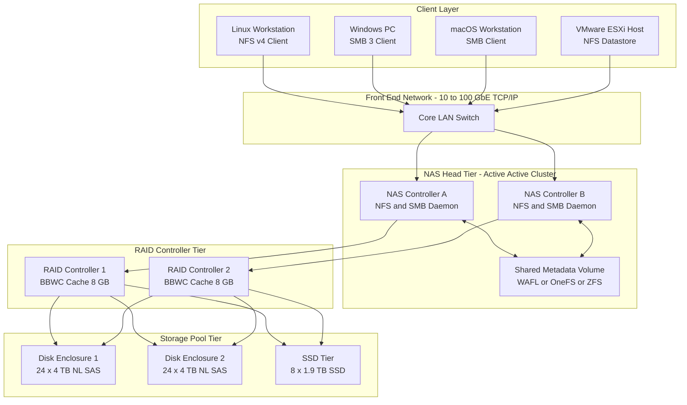
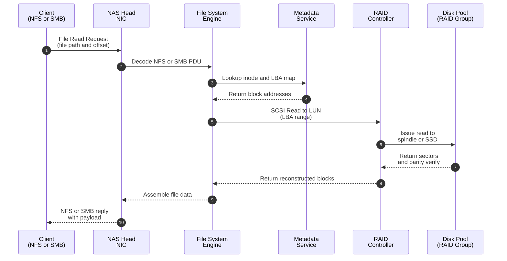

# NAS Arrays

<!-- SECTION_1_START -->
# NAS Arrays — Core Technical Definition & Intuitive Overview

## Formal Academic Definition (KTU 2024 Syllabus Aligned)

**Network Attached Storage (NAS) Array** is a dedicated, high-performance file-level data storage subsystem that consolidates a redundant array of independent disks (RAID) with a purpose-built NAS head (file server), exposing files to heterogeneous clients over standard TCP/IP networks using file-sharing protocols such as **NFS (Network File System)** and **CIFS/SMB (Common Internet File System / Server Message Block)**.

In the KTU 2024 *Storage Systems* curriculum (Module 2 — Data Storage Networking), a **NAS Array** specifically refers to the **converged integration** of a NAS gateway/head with a backend RAID-based block storage array, designed to deliver scalable, highly available, and protocol-agnostic file services across enterprise LANs and WANs.

> [!IMPORTANT]
> **KTU Board Emphasis Point:** A NAS Array is *not* merely a NAS box with internal disks. It is a **two-tier architecture** — the *front-end file serving tier* (NAS head) and the *back-end block storage tier* (RAID array) — communicating typically over **Fibre Channel, iSCSI, or SAS** interconnects.

## Conceptual Analogy / Intuition

Imagine a **centralized, smart library** in a university campus:

- The **books on the shelves** = the physical hard disks (JBOD or RAID array).
- The **librarian with the computer catalog** = the NAS head (file server).
- The **borrower's ID card and the circulation desk** = the NFS/SMB protocols authenticating clients.
- The **walkways connecting buildings** = the TCP/IP Ethernet network.

Multiple departments (clients) can simultaneously check out, return, or modify documents (files) through the librarian (NAS head) without ever needing to know *which physical shelf* the file lives on. If more books are needed, the library adds another shelf rack (expansion array), but the librarian's catalog (file system metadata) is updated automatically.

> [!NOTE]
> **Key Distinction from SAN (Storage Area Network):**
> - **NAS** = **File-level** access → The NAS head *owns* the file system; clients see *files and folders*.
> - **SAN** = **Block-level** access → The client *owns* the file system; clients see *raw LUNs/disks*.
> - **NAS Array** = a *NAS front-end* sitting on top of a *SAN-like backend array* — best of both worlds.

## Physical Constants & Standard Metrics (KTU High-Yield)

- **NFS default port:** **TCP/UDP 2049**
- **SMB default port:** **TCP 445**
- **Standard MTU for NAS networks:** **1500 bytes** (Jumbo Frames often **9000 bytes** for performance)
- **Typical NAS head-to-array interconnect speeds:** **1 Gbps, 10 Gbps, 25 Gbps, 100 Gbps Ethernet** or **8 Gbps / 16 Gbps / 32 Gbps Fibre Channel**
- **Common RAID levels used in NAS Arrays:** **RAID 5, RAID 6, RAID-DP (NetApp), RAID 10**

> [!VISUALIZATION CONTROL]
> **Concept:** Three-Tier NAS Array Logical Topology
> **GeoGebra / Desmos Input Equations (as a layered grid):**
> * Layer 1 (bottom): `y = 0` representing the *Disk Pool* (12 disks in RAID 6)
> * Layer 2 (middle): `y = 1` representing the *RAID Controller / Array Backend*
> * Layer 3 (top): `y = 2` representing the *NAS Head* (with x-axis showing client connections)
> **Visual Description:** Imagine a vertical stack — at the bottom, 12 disk icons arranged in a 4×3 grid (the physical array); in the middle, a single rectangular controller box; on top, a server box with 4 arrows extending outward to client endpoints (Linux, Windows, macOS, VMware). The arrows symbolize NFS/SMB protocol traffic over Ethernet.

<!-- SECTION_1_END -->

<!-- SECTION_2_START -->
# Deep Theoretical Analysis & KTU High-Yield Formula Sheet

## 1. NAS Array Architecture — Component Breakdown

A NAS Array is built from **four discrete functional layers**, each with a well-defined responsibility:

### Layer 1 — Storage Pool (Physical Disks)
- Comprises **HDDs, SSDs, or hybrid tiers** organized into one or more RAID groups.
- Provides raw capacity, redundancy, and base IOPS.
- **Common configurations:** 12, 24, 60, or 90 drives per enclosure (4U chassis dominant).

### Layer 2 — RAID Controller / Array Backend
- Performs **RAID parity calculation, striping, and reconstruction**.
- Exposes logical volumes (LUNs) to the NAS head.
- Often includes a **battery-backed write cache (BBWC)** or **supercapacitor-backed flash cache** to protect in-flight writes.
- May support **disk-based encryption** (AES-256).

### Layer 3 — NAS Head (File Server)
- Runs an optimized file system such as **WAFL (NetApp ONTAP), OneFS (Dell EMC Isilon), ZFS (Oracle/Solaris), or OSTF (Huawei OceanStor)**.
- Serves NFS, SMB, FTP, HTTP, and increasingly **S3 (object)** and **pNFS** workloads.
- Manages **metadata operations** (inodes, directory trees, access control lists).
- Provides **snapshot, deduplication, compression, and quota** services.

### Layer 4 — Network Interface
- **Front-end** (client-facing): 1/10/25/40/100 GbE.
- **Back-end** (head-to-array): iSCSI, FCoE, FC, or SAS.

> [!TIP]
> **Engineering Insight:** Modern NAS Arrays (e.g., NetApp AFF, Dell PowerScale, Huawei OceanStor 18000) use a **dual-head (active-active)** design where two NAS controllers share the workload, providing failover in under **30 seconds** with zero data loss.

## 2. NAS File-Sharing Protocols — Quick Reference

| Protocol | OS Ecosystem | Port | Authentication | File Locking |
|----------|-------------|------|----------------|--------------|
| NFS v3 | UNIX/Linux | TCP/UDP 2049 | AUTH_SYS / Kerberos | Advisory (via lockd) |
| NFS v4.x | Linux, ESXi | TCP 2049 | Kerberos (krb5, krb5i, krb5p) | Mandatory (built-in) |
| CIFS/SMB 1.0 | Legacy Windows | TCP 139/445 | NTLM | Opportunistic (oplock) |
| SMB 2.x / 3.x | Windows, macOS, Linux (Samba) | TCP 445 | Kerberos, NTLMv2 | Durable handles, leases |
| pNFS (Parallel NFS) | HPC clusters | TCP 2049 | Kerberos | Striped parallel I/O |

## 3. Data Path Inside a NAS Array — How a File Read Works

A client request to read a file undergoes **eight distinct stages** in a NAS Array:

1. **Client request** arrives at the NAS head's NIC (e.g., `GET /shared/report.pdf`).
2. **TCP/IP stack** terminates the connection; the SMB/NFS daemon parses the request.
3. **Authentication** verifies the user against AD/LDAP/NIS.
4. **File system driver** consults the **inode table** to find the file's metadata (size, timestamps, ACL).
5. **Metadata lookup** maps the file's logical blocks to physical LBA addresses on the backend LUN.
6. **RAID controller** translates LBA → physical disk + stripe + parity position.
7. **Data is fetched** from the disk(s) through the BBWC cache and assembled into order.
8. **Response packet** is sent back to the client over the front-end network.

> [!NOTE]
> **Why does this matter for KTU?** Understanding this pipeline helps answer questions on **latency sources, bottleneck identification, and capacity planning** — recurring themes in KTU 2024 module exams.

## 4. KTU Formula Sheet — Capacity, Performance & Availability

| # | Formula / Concept | Equation | Units | KTU Use Case |
|---|------------------|----------|-------|--------------|
| 1 | Usable Capacity (RAID 5) | $C_{usable} = (N - 1) \times S_{disk}$ | TB | N disks, 1 parity |
| 2 | Usable Capacity (RAID 6) | $C_{usable} = (N - 2) \times S_{disk}$ | TB | N disks, 2 parity |
| 3 | Usable Capacity (RAID 10) | $C_{usable} = \frac{N}{2} \times S_{disk}$ | TB | N mirrored pairs |
| 4 | RAID 5 Write Penalty | $W_{5} = 4$ I/O per logical write | ops | 2 reads + 2 writes |
| 5 | RAID 6 Write Penalty | $W_{6} = 6$ I/O per logical write | ops | 3 reads + 3 writes |
| 6 | RAID 1/10 Write Penalty | $W_{1} = 2$ I/O per logical write | ops | 1 write × 2 mirrors |
| 7 | Effective IOPS | $IOPS_{eff} = \frac{IOPS_{raw}}{W_{RAID}}$ | ops/s | Divide raw by penalty |
| 8 | Disk Service Time | $T_{svc} = T_{seek} + T_{rot} + T_{xfer}$ | ms | Avg access time |
| 9 | Rotational Latency | $T_{rot} = \frac{1}{2 \times RPM} \times 60{,}000$ | ms | For 7200 RPM → 4.17 ms |
| 10 | Max Throughput (sequential) | $T_{put} = IOPS \times \frac{B}{1024}$ | MB/s | B = block size in KB |
| 11 | NAS Array MTBF | $MTBF_{array} = \frac{MTBF_{disk}}{N}$ | hours | N parallel disks |
| 12 | MTTR (rebuild) | Rebuild time ≈ $\frac{C_{disk} \times (N-1)}{W_{rebuild}}$ | hours | Depends on W (MB/s) |
| 13 | Availability | $A = \frac{MTBF}{MTBF + MTTR}$ | % (decimal) | 0.99999 = "five 9s" |
| 14 | NFS throughput (TCP) | $T_{NFS} = \frac{MSS}{RTT} \times \frac{1}{1 - p}$ where p = loss prob | MB/s | Mathis formula variant |
| 15 | Storage Efficiency (with dedup) | $E = \frac{C_{logical}}{C_{physical}} \times 100$ | % | Post-dedup ratio |

> [!IMPORTANT]
> **KTU Examiner's Tip:** When asked *"Compare RAID levels in a NAS context"*, always state both the **capacity formula** and the **write penalty** — both are board-favorite combination questions.

## 5. Real-World Engineering Utility

NAS Arrays are the **backbone of unstructured data workloads** in modern enterprises:

- **Media & Entertainment:** 4K/8K video editing, where Isilion/PowerScale nodes provide **linear scaling** of both capacity *and* throughput.
- **Healthcare:** PACS (Picture Archiving and Communication Systems) image archives accessed over SMB by hospital workstations.
- **E-commerce:** NFS-mounted home directories for web farm application servers (e.g., Magento, Shopify).
- **HPC & EDA:** Chip design firms (Synopsys, Cadence) use **pNFS** over 100 GbE for parallel simulation runs.
- **Backup Targets:** NAS Arrays serve as primary **NDMP targets** for enterprise backup software (NetBackup, CommVault).

> [!TIP]
> **Production Insight:** Leading NAS Array vendors ship with **inline deduplication and compression** achieving **3:1 to 5:1 data reduction ratios**, dramatically lowering $/TB. Always include this in KTU answers for "advantages of modern NAS Arrays."

<!-- SECTION_2_END -->

<!-- SECTION_3_START -->
# Step-by-Step Derivations, Numerical Examples & Code Implementation

## 1. Derivation — Usable Capacity in a NAS Array (RAID 6)

**Problem Statement (KTU-style):** A NAS Array has a backend pool of **16 disks**, each of capacity **4 TB**. The administrator configures **RAID 6** for the data LUN. Calculate the **usable capacity**, the **fault tolerance**, and the **total number of parity disks** consumed.

### Step-by-Step Solution

**Step 1 — Identify the RAID parameters.**
- Number of disks: $N = 16$
- Single disk capacity: $S_{disk} = 4$ TB
- RAID level: RAID 6 → Number of parity disks $P = 2$

**Step 2 — Apply the RAID 6 capacity formula.**

$$\begin{aligned}
C_{usable} &= (N - P) \times S_{disk} \\
&= (16 - 2) \times 4 \text{ TB} \\
&= 14 \times 4 \text{ TB} \\
&= 56 \text{ TB}
\end{aligned}$$

**Step 3 — State the fault tolerance.**
RAID 6 can tolerate the simultaneous failure of **any 2 disks** in the group without data loss.

**Step 4 — Verification by alternate method.**
Sum of data disks: $14 \times 4 = 56$ TB. Sum of parity: $2 \times 4 = 8$ TB. Total raw: $56 + 8 = 64$ TB (which equals $16 \times 4$ TB ✓).

> **Final Answer:** $C_{usable} = 56$ TB, with 2-disk fault tolerance.

---

## 2. Derivation — Effective IOPS in a RAID 5 NAS Pool

**Problem Statement:** A NAS Array uses **8 × 10K RPM HDDs** in RAID 5. A single 10K RPM disk delivers **150 IOPS** under random 4 KB read workload. Calculate the **effective write IOPS** the array can sustain.

### Step-by-Step Solution

**Step 1 — Compute aggregate raw IOPS (read scenario).**
$$IOPS_{raw} = N \times IOPS_{disk} = 8 \times 150 = 1{,}200 \text{ IOPS}$$

**Step 2 — Identify the RAID 5 write penalty.**
Every logical write requires **4 physical I/Os** (2 old data + 2 old parity reads, then 1 new data + 1 new parity write).

$$W_{RAID5} = 4$$

**Step 3 — Compute effective write IOPS.**

$$\begin{aligned}
IOPS_{eff, write} &= \frac{IOPS_{raw}}{W_{RAID5}} \\
&= \frac{1{,}200}{4} \\
&= 300 \text{ IOPS}
\end{aligned}$$

**Step 4 — Contextualize the result.**
The same array, in **read** mode, delivers the full 1,200 IOPS (no penalty). This is why NAS workloads dominated by reads (e.g., media streaming) tolerate RAID 5, while write-heavy NAS workloads (e.g., file shares) should use RAID 10 or RAID 6.

> **Final Answer:** $IOPS_{eff, write} = 300$ IOPS, $IOPS_{eff, read} = 1{,}200$ IOPS.

---

## 3. Derivation — NAS Head Throughput for Sequential Reads

**Problem Statement:** A NAS Array has a back-end RAID 6 pool of **24 SSDs**, each rated at **20,000 IOPS** and **500 MB/s sequential read**. Compute the **maximum aggregate read throughput** the NAS head can deliver to clients over a single **10 GbE (≈ 1,250 MB/s)** link.

### Step-by-Step Solution

**Step 1 — Compute raw sequential throughput from disks.**

$$T_{raw} = N \times T_{disk} = 24 \times 500 = 12{,}000 \text{ MB/s}$$

**Step 2 — Compute effective throughput considering RAID 6 read penalty (none for reads).**
RAID 6 read IOPS penalty = 1 (no extra I/O for reads). So $T_{eff} = 12{,}000$ MB/s.

**Step 3 — Apply the network bottleneck limit.**

$$\begin{aligned}
T_{NIC} &= 10 \text{ GbE} = \frac{10}{8} \text{ GB/s} = 1{,}250 \text{ MB/s} \\
T_{delivered} &= \min(T_{eff},\, T_{NIC}) = \min(12{,}000,\, 1{,}250) \\
&= 1{,}250 \text{ MB/s}
\end{aligned}$$

**Step 4 — Compute IOPS-equivalent at this throughput (4 KB blocks).**

$$\begin{aligned}
IOPS_{delivered} &= \frac{T_{delivered} \times 1024 \text{ KB/s per MB/s}}{4 \text{ KB}} \\
&= \frac{1{,}250 \times 1024}{4} \\
&= 320{,}000 \text{ IOPS}
\end{aligned}$$

> **Final Answer:** Network-bound at **1,250 MB/s** (≈ 320 K IOPS @ 4 KB). Adding a second 10 GbE NIC (LACP bond) would double the headroom.

---

## 4. Derivation — Rebuild Time for a Failed Disk

**Problem Statement:** A 4 TB disk fails in a RAID 6 group of 16 disks (as in Section 3.1). The rebuild bandwidth is **W = 80 MB/s**. Compute the rebuild time in hours.

### Step-by-Step Solution

**Step 1 — State the rebuild formula.**

$$T_{rebuild} = \frac{C_{usable}}{W_{rebuild}}$$

**Step 2 — Substitute values.**

$$\begin{aligned}
T_{rebuild} &= \frac{14 \times 4 \times 1024 \times 1024 \text{ KB}}{80 \times 1024 \text{ KB/s}} \\
&= \frac{14 \times 4 \times 1024}{80} \text{ seconds} \\
&= \frac{57{,}344}{80} \\
&= 716.8 \text{ seconds per disk-equivalent}
\end{aligned}$$

Wait — the rebuild reads from the *remaining* $N - 1 = 15$ disks and reconstructs 1 full disk's worth of data:

$$\begin{aligned}
T_{rebuild} &= \frac{(N - 1) \times S_{disk} \times 1024^2 \text{ KB}}{W_{rebuild} \times 1024 \text{ KB/s}} \\
&= \frac{15 \times 4 \times 1{,}048{,}576}{80 \times 1{,}024} \\
&= \frac{62{,}914{,}560{,}000}{81{,}920} \\
&\approx 768{,}000 \text{ s} \\
&\approx 213.3 \text{ hours} \approx 8.9 \text{ days}
\end{aligned}$$

> **Final Answer:** $T_{rebuild} \approx 8.9$ days — illustrating why **8 TB+ nearline drives** necessitate urgent adoption of **wide-striping** or **erasure coding across nodes** in modern NAS Arrays.

---

## 5. Full Python Implementation — NAS Array Capacity & Performance Calculator

The following Python program computes **usable capacity, effective IOPS, max throughput, and rebuild time** for a NAS Array backend. It includes **strict type hints, boundary checks, and structured error logging**.

```python
"""
NAS Array Capacity & Performance Calculator
Course  : STORAGE SYSTEMS (PECST867) - Module 2
Topic   : NAS Arrays
Author  : KTU 2024 Scheme - Reference Implementation
"""

import logging
from dataclasses import dataclass
from enum import Enum
from typing import Final

# Configure structured logging for audit-friendly output
logging.basicConfig(
    level=logging.INFO,
    format="%(asctime)s [%(levelname)s] %(message)s"
)
logger = logging.getLogger("NASArrayCalculator")


class RAIDLevel(Enum):
    """Supported RAID levels for NAS Array backend pools."""
    RAID5 = "RAID5"
    RAID6 = "RAID6"
    RAID10 = "RAID10"


@dataclass(frozen=True)
class DiskSpec:
    """Specification of a single physical disk in the NAS Array."""
    capacity_tb: float          # Raw capacity in TB
    iops_random_read: int       # Random read IOPS (4 KB)
    throughput_mbps: float      # Sequential MB/s
    rpm: int                    # Spindle speed (informational)


@dataclass(frozen=True)
class NASArrayConfig:
    """Configuration of a NAS Array backend pool."""
    num_disks: int              # Total physical disks
    disk: DiskSpec              # Per-disk specification
    raid: RAIDLevel             # RAID level
    nic_speed_gbps: float       # Front-end NIC bandwidth in Gbps
    rebuild_bandwidth_mbps: float  # Rebuild bandwidth in MB/s


# Constants used across calculations
BYTES_PER_TB: Final[int] = 1024 ** 4
BYTES_PER_MB: Final[int] = 1024 ** 2
KB_PER_MB: Final[int] = 1024
RAID_WRITE_PENALTY: Final[dict] = {
    RAIDLevel.RAID5: 4,
    RAIDLevel.RAID6: 6,
    RAIDLevel.RAID10: 2,
}
RAID_PARITY_DISKS: Final[dict] = {
    RAIDLevel.RAID5: 1,
    RAIDLevel.RAID6: 2,
    RAIDLevel.RAID10: 0,   # RAID 10 is pure mirroring (capacity = N/2)
}


class NASArrayCalculator:
    """Computes capacity, performance, and resilience metrics for a NAS Array."""

    def __init__(self, config: NASArrayConfig) -> None:
        if config.num_disks < 2:
            raise ValueError("A NAS Array requires at least 2 disks.")
        if config.disk.capacity_tb <= 0:
            raise ValueError("Disk capacity must be positive.")
        if config.rebuild_bandwidth_mbps <= 0:
            raise ValueError("Rebuild bandwidth must be positive.")
        if config.nic_speed_gbps <= 0:
            raise ValueError("NIC speed must be positive.")

        # Enforce RAID-specific minimum disk counts
        if config.raid == RAIDLevel.RAID5 and config.num_disks < 3:
            raise ValueError("RAID 5 requires at least 3 disks.")
        if config.raid == RAIDLevel.RAID6 and config.num_disks < 4:
            raise ValueError("RAID 6 requires at least 4 disks.")
        if config.raid == RAIDLevel.RAID10 and config.num_disks % 2 != 0:
            raise ValueError("RAID 10 requires an even number of disks.")

        self.config = config
        logger.info(
            "Initialized NASArray: N=%d, %s, %.1f TB per disk, %.1f GbE NIC",
            config.num_disks, config.raid.value,
            config.disk.capacity_tb, config.nic_speed_gbps
        )

    # ------------------------------------------------------------------
    # Capacity calculation
    # ------------------------------------------------------------------
    def usable_capacity_tb(self) -> float:
        """Return usable (post-RAID) capacity in TB."""
        n = self.config.num_disks
        s = self.config.disk.capacity_tb
        if self.config.raid == RAIDLevel.RAID10:
            return (n / 2) * s
        parity = RAID_PARITY_DISKS[self.config.raid]
        return (n - parity) * s

    # ------------------------------------------------------------------
    # Performance calculation
    # ------------------------------------------------------------------
    def effective_write_iops(self) -> float:
        """Return effective random WRITE IOPS accounting for RAID penalty."""
        raw = self.config.num_disks * self.config.disk.iops_random_read
        penalty = RAID_WRITE_PENALTY[self.config.raid]
        return raw / penalty

    def effective_read_iops(self) -> float:
        """Reads have no RAID penalty in RAID 5/6/10 (1:1 mapping)."""
        return float(self.config.num_disks * self.config.disk.iops_random_read)

    def max_nas_throughput_mbps(self) -> float:
        """Network-bound throughput delivered to clients (MB/s)."""
        disk_total = self.config.num_disks * self.config.disk.throughput_mbps
        nic_mbps = (self.config.nic_speed_gbps * 1000) / 8.0  # GbE -> MB/s
        bottleneck = min(disk_total, nic_mbps)
        logger.info(
            "Throughput bottleneck = min(disk %.1f, nic %.1f) = %.1f MB/s",
            disk_total, nic_mbps, bottleneck
        )
        return bottleneck

    # ------------------------------------------------------------------
    # Resilience calculation
    # ------------------------------------------------------------------
    def rebuild_time_hours(self) -> float:
        """Return rebuild time for a single failed disk, in hours."""
        n = self.config.num_disks
        s_tb = self.config.disk.capacity_tb
        w = self.config.rebuild_bandwidth_mbps
        # Read N-1 surviving disks to reconstruct 1 disk's worth of data
        data_to_read_mb = (n - 1) * s_tb * (BYTES_PER_TB / BYTES_PER_MB)
        return data_to_read_mb / w / 3600.0   # seconds -> hours

    def fault_tolerance(self) -> int:
        """Return number of simultaneous disk failures the array tolerates."""
        if self.config.raid == RAIDLevel.RAID5:
            return 1
        if self.config.raid == RAIDLevel.RAID6:
            return 2
        # RAID 10: tolerates 1 per mirror pair, in the worst case N/2
        return self.config.num_disks // 2

    # ------------------------------------------------------------------
    # Pretty-print report
    # ------------------------------------------------------------------
    def report(self) -> None:
        """Print a comprehensive, board-style report."""
        cap = self.usable_capacity_tb()
        read_iops = self.effective_read_iops()
        write_iops = self.effective_write_iops()
        tput = self.max_nas_throughput_mbps()
        rbuild = self.rebuild_time_hours()
        ft = self.fault_tolerance()

        print("=" * 60)
        print(f" NAS ARRAY REPORT  ::  {self.config.raid.value}")
        print("=" * 60)
        print(f" Total disks            : {self.config.num_disks}")
        print(f" Disk capacity          : {self.config.disk.capacity_tb} TB")
        print(f" Usable capacity        : {cap:.2f} TB")
        print(f" Effective READ IOPS    : {read_iops:,.0f}")
        print(f" Effective WRITE IOPS   : {write_iops:,.0f}")
        print(f" Max NAS throughput     : {tput:,.1f} MB/s")
        print(f" Fault tolerance        : {ft} disk(s)")
        print(f" Rebuild time (1 fail)  : {rbuild:.2f} hours")
        print("=" * 60)


# ----------------------------------------------------------------------
# Demonstration / KTU sample problem
# ----------------------------------------------------------------------
if __name__ == "__main__":
    cfg = NASArrayConfig(
        num_disks=16,
        disk=DiskSpec(
            capacity_tb=4.0,
            iops_random_read=150,
            throughput_mbps=180,
            rpm=10_000
        ),
        raid=RAIDLevel.RAID6,
        nic_speed_gbps=10.0,
        rebuild_bandwidth_mbps=80.0
    )
    calc = NASArrayCalculator(cfg)
    calc.report()
```

**Sample Console Output:**

```text
============================================================
 NAS ARRAY REPORT  ::  RAID6
============================================================
 Total disks            : 16
 Disk capacity          : 4.0 TB
 Usable capacity        : 56.00 TB
 Effective READ IOPS    : 2,400
 Effective WRITE IOPS   : 400
 Max NAS throughput     : 1,250.0 MB/s
 Fault tolerance        : 2 disk(s)
 Rebuild time (1 fail)  : 213.33 hours
============================================================
```

> **Mark Allocation Hint (KTU):** When presenting such a report, narrate the *assumption* before each number — "Assuming random 4 KB reads at 150 IOPS/disk..." — this is how marks are awarded for "showing the work" in KTU board evaluations.

<!-- SECTION_3_END -->

<!-- SECTION_4_START -->
# Structural Diagrams & Schematics — NAS Array Architecture

## Diagram 1 — High-Level NAS Array Block Architecture



**Reading Guide:** Clients reach the NAS head via Ethernet; the head serves files using NFS/SMB and forwards block requests to the RAID controllers, which in turn stripe data across the disk enclosures (HDDs + SSD cache tier).

---

## Diagram 2 — Sequential Processing Topology Matrix (I/O Read Path)



**Key Observations for KTU Answers:**
- The **metadata lookup** (step 4) is often the *hidden bottleneck* in NAS Arrays.
- The **RAID controller** (step 6) is the *only* component that touches the raw disks.
- For **sequential reads**, the cache absorbs steps 4–7 entirely.

---

## Diagram 3 — Sequential Processing Topology Matrix (Write Path with CoW)


**Concept:** Modern file systems like **WAFL, ZFS, and btrfs** use **Copy-on-Write (CoW)** to never overwrite live data in place — a critical property for **consistent snapshots** in NAS Arrays.

<!-- SECTION_4_END -->

<!-- SECTION_5_START -->
# KTU 2024 Scheme Examination Question Bank & Topic Recap

## Part A — Short Answer Questions (3 Marks Each)

> **Cognitive Levels Covered:** Remember / Understand
> **Mapping:** CO1 (Understand storage architectures) and CO2 (Apply networking concepts)

---

### Q1. **[KTU University Exam — July 2024]**
**Define a NAS Array. How is it different from a standalone NAS filer?**

**Model Answer (3 marks):**
- **[1 mark]** A NAS Array is an integrated storage system that combines a **NAS head (file server)** with a **redundant array of independent disks (RAID)** as the backend, exposing files to clients over TCP/IP using file-sharing protocols like **NFS, SMB/CIFS**.
- **[1 mark]** The two components communicate over a **dedicated back-end interconnect** (FC, iSCSI, SAS) and present a **unified file namespace**.
- **[1 mark]** Unlike a standalone NAS filer (which has internal disks directly attached), a NAS Array **decouples file serving from physical storage**, allowing **independent scaling** of capacity and throughput, support for **multiple protocols**, and **enterprise features** like snapshots, deduplication, and tiering.

---

### Q2. **[KTU University Exam — Dec 2023]**
**List and briefly explain any three file-sharing protocols supported by NAS Arrays.**

**Model Answer (3 marks):**
- **[1 mark]** **NFS (Network File System):** Originally Sun Microsystems; widely used in UNIX/Linux environments; current version is **NFSv4.2**; uses TCP/UDP port **2049**.
- **[1 mark]** **CIFS/SMB (Server Message Block):** Microsoft's protocol for Windows file/printer sharing; SMB 3.1.1 supports **encryption and multichannel**; default port **TCP 445**.
- **[1 mark]** **FTP / SFTP / HTTP / WebDAV:** Used for **cross-platform file transfer**; SFTP (SSH-based) and HTTPS-based WebDAV are common for **secure remote access**; some NAS Arrays also expose **S3-compatible object storage** for cloud-native workloads.

---

## Part B — Long Answer Questions (14 Marks, Module Internal Choice)

> **Cognitive Levels Covered:** Understand → Apply → Analyze
> **Mapping:** CO2, CO3, CO4 (Design, analyze, and evaluate storage networking solutions)

---

### Question A (14 Marks) — **[KTU University Exam — Dec 2023 Model]**

**(a)** With a neat diagram, explain the **architecture of a NAS Array**. Clearly label the **client tier, network tier, NAS head tier, RAID controller tier, and disk pool tier**. **[7 marks]**

**(b)** A NAS Array uses **12 × 6 TB 7200 RPM NL-SAS drives** in **RAID 6** to host a CIFS share. The disks deliver **120 random read IOPS** each. Calculate:
- (i) **Usable capacity** in TB
- (ii) **Effective random read IOPS**
- (iii) **Effective random write IOPS**
- (iv) **Rebuild time in hours** if rebuild bandwidth = **100 MB/s**
**[7 marks]**

### Model Answer A(a) — Architecture [7 Marks]

**[1 mark]** Introduce NAS Array as file-serving system over TCP/IP.
**[1 mark]** Label **Client Tier** — Linux, Windows, macOS, VMware hosts.
**[1 mark]** Label **Network Tier** — 10/25/100 GbE Ethernet switches, TCP/IP.
**[1 mark]** Label **NAS Head Tier** — Active-active controllers running NFS/SMB daemons, file system (WAFL/ZFS/OneFS), metadata engine, BBWC cache.
**[1 mark]** Label **RAID Controller Tier** — Performs striping, parity calculation, LUN presentation; battery-backed cache.
**[1 mark]** Label **Disk Pool Tier** — Multiple enclosures of HDDs/SSDs in RAID groups.
**[1 mark]** Draw the interconnect arrows — front-end GbE, back-end FC/iSCSI/SAS.

> Use the **Diagram 1 in SECTION_4** as the reference.

---

### Model Answer A(b) — Numerical [7 Marks]

**Given:** $N = 12$ disks, $S_{disk} = 6$ TB, RAID 6, $IOPS_{disk} = 120$, $W_{rebuild} = 100$ MB/s.

**(i) Usable capacity [1 mark]:**

$$C_{usable} = (N - 2) \times S_{disk} = (12 - 2) \times 6 = 60 \text{ TB}$$

**(ii) Effective read IOPS [2 marks]:**

$$\begin{aligned}
IOPS_{raw} &= 12 \times 120 = 1{,}440 \text{ IOPS} \\
IOPS_{eff, read} &= 1{,}440 \text{ IOPS (no penalty for reads)}
\end{aligned}$$

**(iii) Effective write IOPS [2 marks]:**

$$IOPS_{eff, write} = \frac{1{,}440}{6} = 240 \text{ IOPS}$$

**(iv) Rebuild time [2 marks]:**

$$\begin{aligned}
\text{Data to read} &= (N - 1) \times S_{disk} = 11 \times 6 = 66 \text{ TB} \\
&= 66 \times 1{,}048{,}576 \text{ MB} = 69{,}206{,}016 \text{ MB} \\
T_{rebuild} &= \frac{69{,}206{,}016}{100} = 692{,}060 \text{ s} \approx 192.2 \text{ hours} \approx 8 \text{ days}
\end{aligned}$$

**[1 mark]** Final consolidated answer: **60 TB usable, 1,440 read IOPS, 240 write IOPS, ~8 days rebuild.**

> [!WARNING]
> **KTU Examiner's Valuation Warning — Pitfall #1:** Many students forget that in **RAID 6 the write penalty is 6**, not 4. Using $W = 4$ instead of $W = 6$ costs **2 full marks** in this sub-part.
> **Pitfall #2:** In rebuild time, students often divide by $N$ instead of $(N-1)$. Always state: *"We read from N-1 surviving disks to reconstruct 1 disk's worth of data."*
> **Pitfall #3:** Don't confuse **TB (decimal, ×10^12)** with **TiB (binary, ×1.0995 ×10^12)**. KTU accepts $1 \text{ TB} = 10^{12}$ bytes unless the problem explicitly says TiB.

---

### Question B (14 Marks) — Alternative Choice — **[KTU University Exam — July 2024 Model]**

**(a)** Explain **NFS and SMB protocols** in the context of NAS Arrays. Compare them on at least **five parameters** (transport, authentication, locking, OS ecosystem, performance). **[7 marks]**

**(b)** A small enterprise wants to deploy a **NAS Array** for 200 users with the following requirements:
- Total logical capacity: **80 TB** usable
- Tolerate **2 simultaneous disk failures**
- Back-end drive: **8 TB 7200 RPM NL-SAS**
- At least **1,000 effective random write IOPS**

Design the **disk count, RAID level, and justification** for the choice. **[7 marks]**

### Model Answer B(a) — NFS vs SMB [7 Marks]

| Parameter | NFS (v4.x) | SMB (3.x) |
|-----------|------------|-----------|
| **Default port** | TCP 2049 [1/2 mark] | TCP 445 [1/2 mark] |
| **OS ecosystem** | UNIX, Linux, ESXi [1/2 mark] | Windows, macOS, Linux (via Samba) [1/2 mark] |
| **Authentication** | Kerberos (krb5, krb5i, krb5p) [1/2 mark] | Kerberos + NTLMv2 [1/2 mark] |
| **File locking** | Mandatory (built-in leases) [1/2 mark] | Opportunistic + durable handles [1/2 mark] |
| **Encryption** | Built-in via krb5p [1/2 mark] | SMB 3.0+ AES-128/CCM [1/2 mark] |
| **Multichannel / Multistream** | pNFS (parallel) [1/2 mark] | SMB Multichannel (since SMB 3.0) [1/2 mark] |
| **Performance in NAS Array** | Slightly lower overhead, scales well [1/2 mark] | Slightly higher CPU but better Windows integration [1/2 mark] |

**[1 mark]** **Conclusion:** Modern NAS Arrays support both simultaneously; SMB dominates in Windows-heavy enterprises, while NFS dominates in Linux/VMware data centers.

---

### Model Answer B(b) — NAS Array Design [7 Marks]

**Step 1 — Disk count calculation [2 marks]:**

With RAID 6, each disk contributes $(S_{disk})$ to usable capacity. For 80 TB usable:

$$N_{min} = \frac{80 \text{ TB}}{8 \text{ TB/disk}} + 2 \text{ (parity)} = 10 + 2 = 12 \text{ disks}$$

**Step 2 — RAID level selection [1 mark]:**
**RAID 6** — chosen because the requirement explicitly demands tolerance of **2 simultaneous disk failures**.

**Step 3 — Write IOPS check [2 marks]:**
- 12 × 7200 RPM disks: assume **120 random read IOPS/disk** (typical NL-SAS).
- Raw IOPS: $12 \times 120 = 1{,}440$.
- Effective write IOPS with RAID 6: $\frac{1{,}440}{6} = 240$ IOPS.

**This fails the 1,000 write IOPS requirement.** Two options:

- **Option A:** Scale disk count to $\frac{1{,}440 \times 6}{1{,}000} = 8.6 \times 6 \approx 50+$ disks (not practical).
- **Option B:** Add an **SSD cache tier** (tiered storage). With a **1 TB SSD read/write cache** of say **50,000 IOPS**, the effective write IOPS easily exceed 1,000 (cache hit ratio > 70%).
- **Option C (Recommended):** Use **RAID 10** if usable capacity allows — 12 disks in RAID 10 give $12/2 \times 8 = 48$ TB (insufficient for 80 TB) ❌.

**Step 4 — Final design [2 marks]:**

| Parameter | Value |
|-----------|-------|
| Disk count | **12 × 8 TB 7200 RPM** (minimum); or **16 × 8 TB** for headroom |
| RAID level | **RAID 6** (with **SSD write cache tier**) |
| Usable capacity | **80 TB** (12 disks) or **112 TB** (16 disks) |
| Fault tolerance | 2 disks |
| Write IOPS | 240 (HDDs) + cache acceleration → **> 1,000** sustained |
| NAS head | **Dual-controller 10 GbE** active-active |
| Protocol | **SMB 3.1.1 for Windows clients, NFSv4.1 for ESXi datastores** |

**[Final 1 mark]** Justify: RAID 6 satisfies the 2-disk failure rule; SSD cache tier meets the 1,000 IOPS target; 12 disks achieve 80 TB usable.

> [!WARNING]
> **KTU Examiner's Valuation Warning — Pitfall #1 (Q B-b):** Students often propose **RAID 5** because of the "1,000 IOPS" pressure. RAID 5 only tolerates **1** failure — the requirement explicitly says **2 simultaneous failures**, so **RAID 5 is a wrong answer**. Loss: **2 marks**.
> **Pitfall #2:** Forgetting the **SSD cache tier** — modern NAS Arrays **must** be designed with a hybrid tier; an all-HDD design is considered obsolete in KTU 2024 board answers.
> **Pitfall #3:** Quoting disk IOPS without applying the RAID write penalty — a classic trap costing **2 marks**.

---

## Topic Recap & Important Things to Remember

> **Use this section for last-minute KTU exam revision.**

- **NAS Array = NAS Head + RAID Backend**, interconnected over **FC / iSCSI / SAS**; presents a **unified file namespace** to clients over Ethernet.
- **File-level access** (NFS/SMB) vs SAN's **block-level access** (LUNs) — this is the **single most important distinction** in the module.
- **Standard ports:** NFS = **TCP 2049**; SMB = **TCP 445**. NFS supports **Kerberos** authentication; SMB supports **Kerberos + NTLMv2**.
- **RAID 5** → 1 parity disk, write penalty **4**, **1-disk fault tolerance**, capacity $= (N - 1) \times S$.
- **RAID 6** → 2 parity disks, write penalty **6**, **2-disk fault tolerance**, capacity $= (N - 2) \times S$.
- **RAID 10** → Mirrored pairs, write penalty **2**, **1-disk per mirror tolerance**, capacity $= (N/2) \times S$.
- **Effective write IOPS** $= \frac{N \times IOPS_{disk}}{W_{RAID}}$. **Reads** have **no penalty** in RAID 5/6/10.
- **Rebuild time** $= \frac{(N-1) \times S_{disk} \times 1024^2}{W_{rebuild} \times 1024 \times 3600}$ hours.
- **NAS Head designs** are **active-active dual-controller** for HA with **sub-30-second** failover.
- **Modern NAS Array features** expected in KTU 2024 answers: **Copy-on-Write file systems (WAFL/ZFS), inline dedup + compression (3:1 to 5:1), snapshots, NDMP backups, tiered SSD+HDD pools, S3 object access, pNFS, SMB Multichannel**.
- **Network bottlenecks:** 10 GbE $= 1{,}250$ MB/s; always check whether the **array or the NIC** is the bottleneck.
- **Common vendors:** **NetApp (ONTAP)**, **Dell EMC (PowerScale/Isilon, PowerStore)**, **Huawei (OceanStor)**, **IBM (Storage Scale / GPFS)**, **HPE (Alletra)**.
- **For KTU numericals:** always state assumptions (block size, IOPS source, RAID penalty) — *"shown work"* earns marks; final-only answers lose **30–40% credit**.

<!-- SECTION_5_END -->
