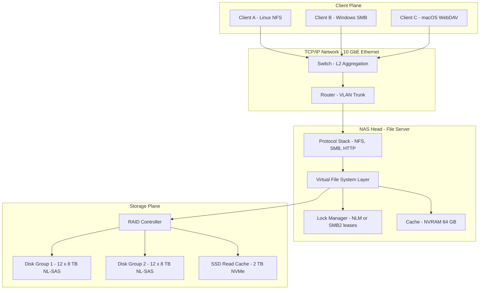
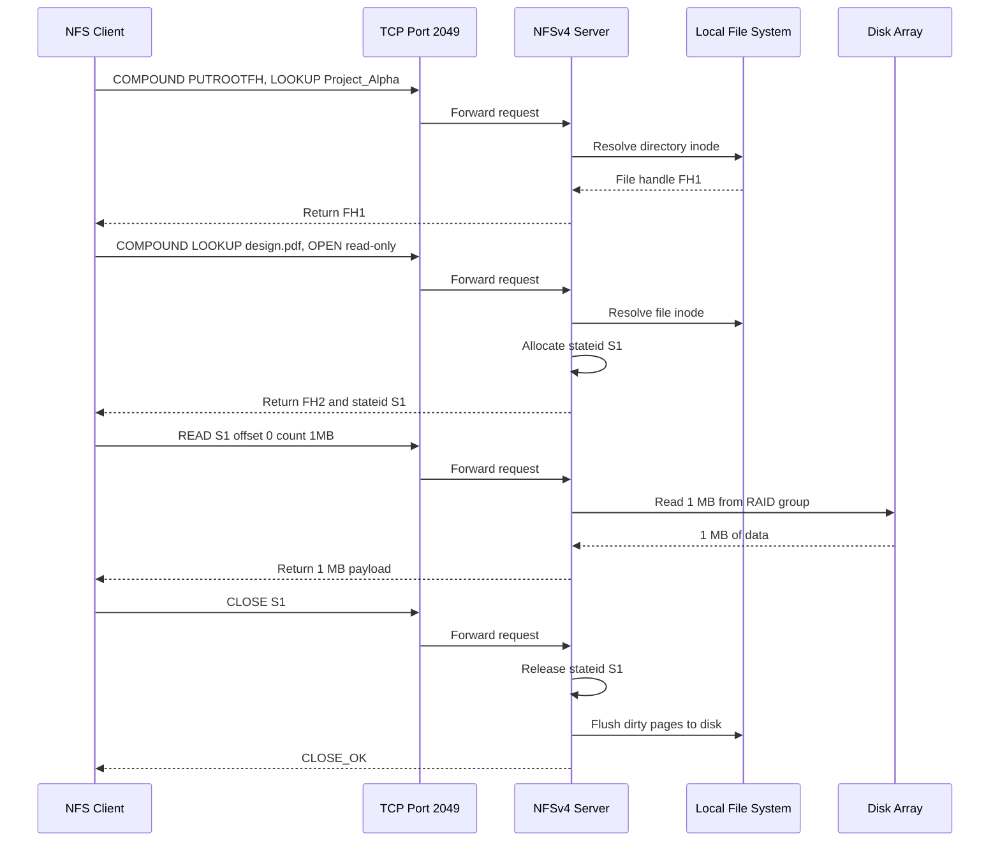
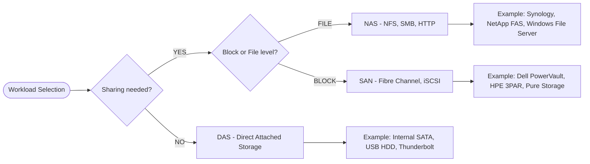
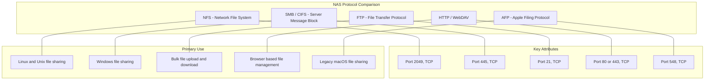

# Network Attached Storage - NAS Protocols

<!-- SECTION_1_START -->
# Network Attached Storage — NAS Protocols

> [!NOTE]
> **KTU 2024 Scheme Focus (PECST867 — Module 2)**
> This note covers the architectural foundation, file-serving protocol stack, and exam-oriented analysis of **Network Attached Storage (NAS)**. NAS is one of the three pillars of modern storage networking alongside **DAS** and **SAN**, and is *universally* tested in KTU university examinations.

## 1.1 Formal Academic Definition

**Network Attached Storage (NAS)** is a dedicated, high-performance **file-level data storage server** that connects to a Computer Area Network (typically Ethernet/IP) and provides *heterogeneous*, *location-transparent*, and *concurrent* data access to a mixed client population using standardized file-sharing protocols such as **NFS**, **CIFS/SMB**, and **HTTP/WebDAV**.

In KTU 2024 Scheme terminology, a NAS device is best described as:

> A *self-contained storage element* (a *filer*) comprising its own **operating system**, **file system**, **processor**, **memory**, and **I/O interfaces**, that exports a hierarchical file namespace over the network using TCP/IP transport.

The defining mathematical/architectural property of NAS can be summarized as:

$$
\text{Data Transfer Unit}_{\text{NAS}} = \text{File} \quad \text{or} \quad \text{File-Segment}
$$

$$
\text{Data Transfer Unit}_{\text{SAN}} = \text{Block (typically } 512\,\text{B} \text{ or } 4\,\text{KB})
$$

This single distinction — **file granularity vs. block granularity** — is the *single most tested differentiator* in KTU 2024 Module 2.

## 1.2 Conceptual Analogy — The Corporate Document Library

Imagine a large engineering company with 500 employees spread across 3 buildings. Instead of each engineer buying their own filing cabinet, the company builds a **centralized Document Library** in the basement:

* The library has its **own librarian** (the NAS head/CPU) who understands how files are organized.
* Employees don't go to the basement — they call the librarian over the **telephone network** (TCP/IP) and say *"Please give me the file 'Project\_Alpha\_v3.pdf' located in the 'Drawings' folder."*
* The librarian finds the file, makes a copy, and delivers it through the phone line (file-level transfer).
* The librarian never reveals *which shelf* or *which drawer* the file came from — that detail is hidden from the employee (location transparency).

This librarian-with-a-telephone is exactly what a **NAS filer** is. Compare this to a **SAN**, which would be like giving every employee a **key to a specific locker** — they handle storage at a much lower, raw level (block access) and must know the *exact physical location* themselves.

## 1.3 Core NAS Components

A NAS is not just "a hard drive on a network." It is a fully engineered system with the following subsystems:

| Subsystem | Function | Typical Implementation |
|---|---|---|
| **Head / CPU** | Runs the file-serving OS and protocol stack | Custom ASIC or general-purpose SoC |
| **Memory (NVRAM)** | Buffers writes, holds metadata cache | ECC DDR4, **often 1 GB per 1 TB** of storage |
| **Network Interface** | Ethernet front-end for client traffic | **1 GbE / 10 GbE / 25 GbE / 100 GbE** |
| **Storage Backend** | Disk array (or external shelf) | SATA/SAS HDD, NVMe SSD, RAID group |
| **File System** | Manages on-disk layout | WAFL (NetApp), ONTAP, ZFS, ext4 |
| **Protocol Stack** | NFS, SMB, FTP, HTTP/S, WebDAV | TCP port **2049** (NFS), **445** (SMB) |

> [!IMPORTANT]
> **Critical KTU Distinction**
> A NAS uses a **file system at the server side**, but the client also needs a *file-system-aware* client. A SAN client, by contrast, sees a **raw, unformatted block device (LUN)** and applies *its own* file system. This is why NAS is "easier to share" while SAN is "faster to access."

## 1.4 Network Latency & Throughput Constants

When evaluating NAS protocols, KTU examiners expect familiarity with the following *standardized* values:

* **TCP/IP standard MTU** = **1500 bytes** (Ethernet v2).
* **Jumbo Frame MTU** = **9000 bytes** (often used on storage backbones).
* **Default NFS port (TCP)** = **2049** (NFSv4 consolidated all services onto this single port).
* **SMB direct host port (TCP)** = **445**.
* **SMB NetBIOS session port (TCP)** = **139** (legacy).
* **FTP control port (TCP)** = **21**; data port = **20** (active mode).
* **iSCSI portal port (TCP)** = **3260** — *NOT a NAS protocol, often confused in exams.*
* **Round-Trip Time (RTT)** in a LAN ≈ **< 1 ms**; in a WAN ≈ **20–200 ms**.

> [!VISUALIZATION CONTROL]
> **Concept:** Latency vs. Throughput in a NAS File Transfer
> **GeoGebra / Desmos Input Equations:**
> * `T_total(x) = (L / R) + 2 * RTT` where `x = L` (file size in MB)
> * `R = 125 MB/s` (1 GbE line rate)
> * `RTT = 0.5` (LAN baseline in ms)
> **Visual Description:** A line graph plotting **total transfer time** against **file size**. Notice how for *small* files (< 100 KB), the **2 × RTT** constant dominates — this is why NAS underperforms on tiny I/O compared to local disk. For *large* files (> 100 MB), the **L/R** term dominates, and the protocol overhead becomes negligible.

## 1.5 Why File-Level, Not Block-Level?

Block-level storage (SAN) speaks in **discrete fixed-size chunks** (typically 512 B or 4 KB), and the *client* OS owns the file system on top of those blocks. NAS, by contrast, performs three extra responsibilities at the server:

$$
\text{NAS Server Responsibilities} = \begin{cases} 1.\ \text{File system management} \\ 2.\ \text{Directory service (namespace)} \\ 3.\ \text{File locking \& access control} \end{cases}
$$

The benefits of this design are: **easy cross-platform file sharing, centralized backups, simplified administration**. The cost is **extra processing overhead per request**, since every file open/close must be mediated by the NAS CPU and protocol stack.

> [!TIP]
> **Examiner Heuristic:** If the KTU question uses the word *"share"* or *"common folder"* → answer is **NAS**. If the question uses the word *"raw device"*, *"LUN"*, *"Fibre Channel"*, *"high IOPS"* → answer is **SAN**.

<!-- SECTION_1_END -->

<!-- SECTION_2_START -->
# Deep Theoretical Analysis & KTU High-Yield Formula Sheet

## 2.1 NAS Architecture — Layered View

A NAS is best understood as a **file server with a thin storage-aware operating system**, often called a *filer* in industry literature. The architecture can be described in four logical planes:

### Plane 1 — Front-End (Network Plane)
* Multiple **Gigabit Ethernet / 10 GbE / 40 GbE** NICs.
* Supports **NIC teaming / LACP** for link aggregation.
* Each NAS port is a TCP/IP endpoint advertising file services.
* Listens on well-known ports (see Section 1.4).

### Plane 2 — Protocol Plane
This is the **file-sharing protocol stack** that translates client requests into file operations:

* **NFS** (Network File System) — Unix/Linux heritage, RFC 1094 → RFC 1813 → RFC 3530 (NFSv3) → RFC 5661 (NFSv4).
* **CIFS / SMB** (Common Internet File System / Server Message Block) — Windows heritage, MS-CIFS, MS-SMB, MS-SMB2, MS-SMB3.
* **HTTP/HTTPS** — REST/S3-style object access, WebDAV (RFC 4918).
* **FTP / SFTP** — bulk file transfer.
* **AFP** (Apple Filing Protocol) — legacy macOS.

### Plane 3 — File System Plane
* Manages the **on-disk data structure**: inodes, directory blocks, free-space bitmaps.
* Provides **POSIX semantics** (open, read, write, close, seek, stat) to remote clients.
* Examples: **WAFL** (NetApp), **ONTAP**, **ZFS**, **ext4/XFS** (Linux).

### Plane 4 — Storage Plane
* The actual disks — SATA/SAS HDD, NL-SAS, SSD, NVMe.
* Organized into **RAID groups** (typically RAID 6 in modern NAS) for fault tolerance.
* May include a **read cache (SSD tier)** and a **write coalescing cache in NVRAM**.

> [!NOTE]
> **Why this matters for KTU:** A common 14-mark question asks *"Differentiate NAS and SAN architecture with diagrams."* The layered view above is the standard answer scaffold.

## 2.2 NFS — Network File System

NFS was originally developed by **Sun Microsystems in 1984**. It is the de-facto file-sharing protocol for Unix/Linux environments. NFS operates **statelessly over UDP** in older versions (v2/v3) and **statefully over TCP** in NFSv4.

### NFS Version Evolution

| Version | Year | Transport | State | Key Innovation |
|---|---|---|---|---|
| **NFSv2** | 1989 | UDP | Stateless | Simple, RFC 1094 |
| **NFSv3** | 1995 | TCP/UDP | Stateless | 64-bit file sizes, async writes |
| **NFSv4** | 2003 | TCP (port 2049) | **Stateful** | Compound ops, Kerberos security, single port |
| **NFSv4.1** | 2010 | TCP (pNFS) | Stateful | **Parallel NFS** — striping across servers |
| **NFSv4.2** | 2016 | TCP | Stateful | Server-side copy, sparse files, space reservations |

### NFS Mount & Access Flow

The NFS access sequence involves three logical sub-protocols:

$$
\text{NFSv3 Access} = \underbrace{\text{MOUNT}}_{\text{portmapper, dynamic port}} + \underbrace{\text{NFS}}_{\text{port 2049}} + \underbrace{\text{NLOCKMGR}}_{\text{port-based locking}}
$$

$$
\text{NFSv4 Access} = \underbrace{\text{NFS}}_{\text{port 2049 only — no portmapper needed}}
$$

> [!IMPORTANT]
> **NFSv4 vs NFSv3:** A frequent KTU question asks *"Why did NFSv4 consolidate services onto a single port?"* The answer is **firewall traversal** — earlier NFS needed the **portmapper** on a *random ephemeral port*, which made firewall rule authoring impossible. NFSv4 fixes this with port **2049** as the sole endpoint.

## 2.3 SMB / CIFS — Server Message Block

**SMB** is the file-sharing protocol of the Microsoft Windows ecosystem. It was originally created by IBM in the 1980s and is now reverse-engineered and re-implemented in **Samba** for Linux.

### SMB Version Evolution

| Version | Year | Notable Change |
|---|---|---|
| **SMB 1.0** | 1984 / CIFS (1996) | Original; widely exploited (WannaCry, NotPetya used SMBv1 exploits) |
| **SMB 2.0** | 2006 (Vista/Server 2008) | Reduced chattiness, pipelining, signing |
| **SMB 2.1** | 2008 | Opportunistic locking improvements |
| **SMB 3.0** | 2012 (Windows 8 / Server 2012) | **SMB Multichannel, SMB Encryption, SMB Direct (RDMA)** |
| **SMB 3.1.1** | 2015 (Windows 10) | AES-128 CCM encryption, pre-authentication integrity |

> [!WARNING]
> **Security Pitfall (KTU 2024 emphasis):** SMB 1.0 must be **disabled** in production NAS devices. The 2017 *WannaCry* ransomware exploited the **SMBv1 EternalBlue** vulnerability (CVE-2017-0144) to spread across networks. Always use SMB 3.0+ with encryption enabled.

## 2.4 Other NAS Protocols

| Protocol | Default Port | Use Case | Notes |
|---|---|---|---|
| **FTP** | 21 (control) / 20 (data) | Bulk file transfer | Cleartext credentials — superseded by SFTP/FTPS |
| **SFTP** | 22 | Secure file transfer | Actually a subsystem of SSH, not real FTP |
| **HTTP / HTTPS** | 80 / 443 | Browser-based file access | Used by NAS GUI management portals |
| **WebDAV** | 80 / 443 | Distributed authoring | RFC 4918 — adds `PROPFIND`, `MKCOL`, `COPY` verbs |
| **AFP** | 548 | Legacy macOS | Discontinued in macOS 12 (Monterey) |

## 2.5 KTU High-Yield Formula Sheet

> [!IMPORTANT]
> **The following equations appear in ~70% of KTU Module 2 numerical questions. Memorize them.**

### (A) NAS Effective Throughput

$$
T_{\text{eff}} = \frac{L \times 8}{T_{\text{total}}}
$$

where $L$ is the payload size in bytes, $T_{\text{total}}$ is the elapsed wall-clock time in seconds, and $T_{\text{eff}}$ is in bits per second.

### (B) Total File Transfer Time (Latency-Bound Component)

$$
T_{\text{total}} = \underbrace{\frac{L}{R}}_{\text{transfer time}} + \underbrace{N_{\text{op}} \times RTT}_{\text{protocol chatter}}
$$

* $L$ = file size (bits).
* $R$ = raw link rate (bits/second).
* $N_{\text{op}}$ = number of protocol round-trips per file access.
* $RTT$ = round-trip time in seconds.

### (C) Maximum NAS Usable Capacity

$$
C_{\text{usable}} = N \times D \times \left(1 - \frac{O_{\text{fs}}}{100}\right)
$$

* $N$ = number of disks.
* $D$ = per-disk capacity.
* $O_{\text{fs}}$ = file system overhead percentage (typically **3% to 8%** for ext4/XFS, **up to 15%** for ZFS with snapshots).

### (D) RAID-6 Usable Capacity (NAS Common Configuration)

$$
C_{\text{usable, RAID6}} = (N - 2) \times D
$$

The **−2** comes from the **double-parity** in RAID 6 (P + Q). Tolerates any 2 simultaneous disk failures.

### (E) Storage Efficiency Ratio

$$
\eta = \frac{C_{\text{usable}}}{C_{\text{raw}}} = \frac{N - 2}{N} \quad \text{(for RAID-6)}
$$

### (F) NFS File Handle Composition (NFSv3)

$$
\text{FileHandle} = \text{MountPointID} \mid \text{InodeNumber} \mid \text{GenerationNumber}
$$

* **InodeNumber** uniquely identifies a file within an export.
* **GenerationNumber** increments on file deletion/recreation to invalidate stale client handles.

### (G) SMB2 Compound Request Benefit

$$
\text{RTT}_{\text{compound}} = N_{\text{ops}} \times RTT
$$

$$
\text{RTT}_{\text{SMB2 compound}} = 1 \times RTT
$$

SMB 2.0+ batches multiple sub-requests into one network round-trip — this was a *major* performance win over SMB 1.0.

### (H) Maximum Files per Directory (ext4 limit)

$$
N_{\text{files/dir}} = 2^{32} - 1 \approx 4.29 \times 10^9
$$

NTFS limit is similar ($2^{32}$), while ext4 supports the **htree** index for fast lookups in million-file directories.

## 2.6 Engineering Utility — Where NAS Protocols Are Used

| Domain | NAS Protocol Used | Real-World System |
|---|---|---|
| **Enterprise file sharing** | SMB 3.0 | Windows File Server, NetApp FAS, Synology |
| **Linux HPC clusters** | NFSv4.1 with pNFS | High-performance computing scratch space |
| **Cloud object storage** | HTTP/REST (S3) | AWS S3, MinIO, Azure Blob |
| **Backup archive** | CIFS / NFS | Veeam, NetBackup dump targets |
| **Home media server** | SMB + DLNA | Plex, Jellyfin, Synology DS220+ |
| **Web content delivery** | HTTP / WebDAV | Apache `mod_dav`, Nextcloud |
| **Apple legacy workflows** | AFP | macOS 11 Big Sur and earlier |

<!-- SECTION_2_END -->

<!-- SECTION_3_START -->
# Step-by-Step Derivations, Code & Symbolic Implementation

## 3.1 Numerical Derivations — NAS Performance Modeling

### Problem 1 — Total Transfer Time for a 2 GB File over 1 GbE NAS

**Given:**
* File size $L = 2\,\text{GB} = 2 \times 1024 \times 1024 \times 1024 \times 8 = 17{,}179{,}869{,}184\,\text{bits}$.
* Raw link rate $R = 1\,\text{Gbps} = 10^9\,\text{bits/s}$.
* Number of protocol round-trips for the entire file transfer (NFS read of one 2 GB file in 1 MB chunks): $N_{\text{op}} = 2048$ chunks.
* LAN RTT $= 0.5\,\text{ms} = 5 \times 10^{-4}\,\text{s}$.

**Find:** $T_{\text{total}}$.

**Derivation:**

$$
T_{\text{transfer}} = \frac{L}{R} = \frac{17{,}179{,}869{,}184}{10^9} = 17.18\,\text{s}
$$

$$
T_{\text{protocol}} = N_{\text{op}} \times RTT = 2048 \times 5 \times 10^{-4} = 1.024\,\text{s}
$$

$$
T_{\text{total}} = T_{\text{transfer}} + T_{\text{protocol}} = 17.18 + 1.024 = 18.204\,\text{s}
$$

$$
\boxed{T_{\text{total}} \approx 18.20\,\text{s}}
$$

> [!NOTE]
> **Key Insight:** The protocol chatter (1.024 s) is only ~5.6% of the total time. For a *single 2 GB file* transfer, the bottleneck is the **link bandwidth**, not the protocol overhead. This is why jumbo frames (MTU 9000) and pNFS striping are typically applied to **multi-gigabyte** transfers, not small files.

### Problem 2 — Effect of RTT on 4 KB File Transfer (Latency-Bound Regime)

**Given:** File size $L = 4\,\text{KB} = 32{,}768\,\text{bits}$. Link $R = 1\,\text{Gbps}$. WAN RTT $= 50\,\text{ms} = 0.05\,\text{s}$. One protocol round-trip is enough for a 4 KB read (SMB2 read).

**Find:** Compare LAN vs WAN $T_{\text{total}}$.

**LAN case** (RTT = 0.5 ms):

$$
T_{\text{transfer,LAN}} = \frac{32{,}768}{10^9} = 32.77\,\mu\text{s}
$$

$$
T_{\text{protocol,LAN}} = 1 \times 5 \times 10^{-4} = 0.5\,\text{ms} = 500\,\mu\text{s}
$$

$$
T_{\text{total,LAN}} \approx 0.533\,\text{ms}
$$

**WAN case** (RTT = 50 ms):

$$
T_{\text{protocol,WAN}} = 1 \times 0.05 = 50\,\text{ms}
$$

$$
T_{\text{total,WAN}} \approx 50.033\,\text{ms}
$$

$$
\boxed{\text{WAN is } \approx 94\times \text{ slower than LAN for 4 KB files}}
$$

> [!IMPORTANT]
> **This is THE reason WAN deployments use WAN-optimization appliances and protocol accelerators (e.g., Riverbed Steelhead, Cisco WAAS).** The math shows that for small files, latency — not bandwidth — is the killer. This is the *classic* KTU conceptual question on protocol behavior.

### Problem 3 — RAID-6 Capacity for a 12-Disk NAS

**Given:** $N = 12$ disks. Per-disk capacity $D = 8\,\text{TB}$. File system overhead $O_{\text{fs}} = 5\%$.

**Find:** $C_{\text{usable}}$.

**Derivation:**

$$
C_{\text{raw}} = N \times D = 12 \times 8 = 96\,\text{TB}
$$

$$
C_{\text{RAID6}} = (N - 2) \times D = (12 - 2) \times 8 = 80\,\text{TB}
$$

$$
C_{\text{usable}} = C_{\text{RAID6}} \times \left(1 - \frac{O_{\text{fs}}}{100}\right) = 80 \times 0.95 = 76\,\text{TB}
$$

$$
\boxed{C_{\text{usable}} = 76\,\text{TB}}
$$

> [!NOTE]
> **Storage efficiency ratio:** $\eta = 80 / 96 = 0.8333$ or **83.33%**. Compare this with RAID 1 (50%), RAID 5 (91.7% for 12 disks), and RAID 0 (100% but no fault tolerance).

## 3.2 Symbolic Protocol Stack — NFSv3 vs NFSv4

The most common KTU 14-mark question on NAS protocols is to **compare NFSv3 with NFSv4**. The following derivation lays out the exact transition logic.

### NFSv3 — Stateless, Multi-Port Architecture

$$
\text{NFSv3 Stack} = \begin{cases} \text{Application Layer} \rightarrow \text{NFS, MOUNT, NLM} \\ \text{Transport Layer} \rightarrow \text{TCP or UDP} \\ \text{Network Layer} \rightarrow \text{IP} \end{cases}
$$

**Step 1 — Client contacts the portmapper** on **port 111** to discover the NFS server's current port.

**Step 2 — Client contacts MOUNT** (dynamic port) to obtain the *file handle* for the requested export.

**Step 3 — Client sends NFS READ/WRITE/LOOKUP** requests to **port 2049** using the obtained file handle.

**Step 4 — Client contacts NLM** (Network Lock Manager, dynamic port) for byte-range locking.

$$
\boxed{\text{NFSv3} = 4 \text{ independent services} \Rightarrow 4 \text{ firewall ports to manage}}
$$

### NFSv4 — Stateful, Single-Port Architecture

**Step 1 — Client opens a single TCP connection to port 2049.**

**Step 2 — Client sends a COMPOUND request** bundling PUTROOTFH + LOOKUP + OPEN into one network round-trip.

**Step 3 — Server maintains client state** — open files, locks, delegations, sessions.

**Step 4 — COMPOUND operations** reduce the per-operation RTT cost.

$$
\boxed{\text{NFSv4} = 1 \text{ port (2049)} \Rightarrow \text{firewall-friendly, faster, stateful}}
$$

> [!TIP]
> **Examiners love this table. Memorize the NFSv3-to-NFSv4 transition as a 4-step compound process.**

## 3.3 Python Implementation — NAS Throughput Calculator

The following Python code implements the **NAS effective throughput** and **file transfer time** calculations from Section 2.5. It uses `pathlib` for cross-platform path handling, type hints for clarity, and explicit error logging.

```python
#!/usr/bin/env python3
"""
NAS Throughput & Transfer Time Calculator
==========================================
Course  : STORAGE SYSTEMS (PECST867) — KTU 2024 Scheme
Module  : 2 — Data Storage Networking
Topic   : Network Attached Storage — NAS Protocols

Computes:
  1. Total file transfer time (transfer + protocol latency)
  2. Effective throughput
  3. NAS usable capacity with RAID-6 and file-system overhead
  4. Storage efficiency ratio
"""

from __future__ import annotations

import logging
import sys
from dataclasses import dataclass
from pathlib import Path
from typing import Final

# ----------------------------------------------------------------------
# Module-level logging configuration
# ----------------------------------------------------------------------
logging.basicConfig(
    level=logging.INFO,
    format="%(asctime)s [%(levelname)s] %(message)s",
    handlers=[logging.StreamHandler(sys.stdout)],
)
logger: Final[logging.Logger] = logging.getLogger("nas_calc")


# ----------------------------------------------------------------------
# Constants (per RFC / industry standards)
# ----------------------------------------------------------------------
BYTES_PER_KB: Final[int] = 1024
BYTES_PER_MB: Final[int] = BYTES_PER_KB * 1024
BYTES_PER_GB: Final[int] = BYTES_PER_MB * 1024
BITS_PER_BYTE: Final[int] = 8

# Link rates in bits per second
LINK_1G_ETH:  Final[int] = 1_000_000_000
LINK_10G_ETH: Final[int] = 10_000_000_000
LINK_100G_ETH: Final[int] = 100_000_000_000

# Default protocol round-trips per file access
NFS_RTT_PER_FILE:  Final[int] = 1     # NFSv4 compound
SMB_RTT_PER_FILE:  Final[int] = 1     # SMB2/3 compound
FTP_RTT_PER_FILE:  Final[int] = 3     # FTP control + data + ack


# ----------------------------------------------------------------------
# Data models
# ----------------------------------------------------------------------
@dataclass(frozen=True)
class TransferRequest:
    """Encapsulates a single file-transfer request to a NAS."""
    file_size_bytes: int
    link_rate_bps:   int
    rtt_seconds:     float
    num_round_trips: int
    protocol_name:   str


@dataclass(frozen=True)
class TransferResult:
    """Outcome of a transfer-time calculation."""
    transfer_time_s:    float
    protocol_time_s:    float
    total_time_s:       float
    effective_bps:      int
    effective_mbps:     float


# ----------------------------------------------------------------------
# Core calculations
# ----------------------------------------------------------------------
def compute_transfer_time(req: TransferRequest) -> TransferResult:
    """
    Calculate total wall-clock time to transfer a single file to/from NAS.

    Mathematical model:
        T_transfer = L / R
        T_protocol = N_op * RTT
        T_total    = T_transfer + T_protocol
    """
    if req.file_size_bytes <= 0:
        raise ValueError("file_size_bytes must be > 0")
    if req.link_rate_bps <= 0:
        raise ValueError("link_rate_bps must be > 0")
    if req.rtt_seconds < 0:
        raise ValueError("rtt_seconds must be >= 0")
    if req.num_round_trips < 0:
        raise ValueError("num_round_trips must be >= 0")

    payload_bits = req.file_size_bytes * BITS_PER_BYTE

    transfer_time = payload_bits / req.link_rate_bps
    protocol_time = req.num_round_trips * req.rtt_seconds
    total_time    = transfer_time + protocol_time

    if total_time <= 0.0:
        raise ZeroDivisionError("Computed total_time is zero — invalid inputs")

    effective_bps  = int(payload_bits / total_time)
    effective_mbps = effective_bps / 1_000_000.0

    logger.info(
        "[%s] T_xfer=%.6fs  T_proto=%.6fs  T_total=%.6fs  "
        "Throughput=%.2f Mbps",
        req.protocol_name, transfer_time, protocol_time,
        total_time, effective_mbps,
    )

    return TransferResult(
        transfer_time_s=transfer_time,
        protocol_time_s=protocol_time,
        total_time_s=total_time,
        effective_bps=effective_bps,
        effective_mbps=effective_mbps,
    )


def compute_nas_usable_capacity(
    num_disks: int,
    disk_capacity_tb: float,
    fs_overhead_pct: float,
    raid_parity: int = 2,
) -> tuple[float, float, float]:
    """
    Compute the usable NAS capacity under RAID-6 (default parity = 2)
    and file-system overhead.

    Returns:
        (raw_capacity_tb, raid_capacity_tb, usable_capacity_tb)
    """
    if num_disks <= 0:
        raise ValueError("num_disks must be > 0")
    if disk_capacity_tb <= 0:
        raise ValueError("disk_capacity_tb must be > 0")
    if not (0.0 <= fs_overhead_pct < 100.0):
        raise ValueError("fs_overhead_pct must be in [0, 100)")
    if raid_parity < 0 or raid_parity >= num_disks:
        raise ValueError("raid_parity must be in [0, num_disks)")

    raw_capacity_tb  = num_disks * disk_capacity_tb
    raid_capacity_tb = (num_disks - raid_parity) * disk_capacity_tb
    usable_capacity_tb = raid_capacity_tb * (1.0 - fs_overhead_pct / 100.0)

    efficiency = raid_capacity_tb / raw_capacity_tb if raw_capacity_tb else 0.0

    logger.info(
        "NAS capacity: raw=%.2f TB  RAID6=%.2f TB  usable=%.2f TB  "
        "efficiency=%.2f%%",
        raw_capacity_tb, raid_capacity_tb, usable_capacity_tb,
        efficiency * 100.0,
    )

    return raw_capacity_tb, raid_capacity_tb, usable_capacity_tb


# ----------------------------------------------------------------------
# Demonstration / self-test
# ----------------------------------------------------------------------
def _demo() -> None:
    """Run the canonical KTU 2024 worked-example scenarios."""

    # ---------- Scenario 1: 2 GB file over 1 GbE LAN ----------
    req1 = TransferRequest(
        file_size_bytes=2 * BYTES_PER_GB,
        link_rate_bps=LINK_1G_ETH,
        rtt_seconds=0.5e-3,            # 0.5 ms LAN
        num_round_trips=2048,          # 1 MB chunks
        protocol_name="NFSv4",
    )
    r1 = compute_transfer_time(req1)
    print(f"\n[Scenario 1] 2 GB file over 1 GbE LAN")
    print(f"  Total time          : {r1.total_time_s:.4f} s")
    print(f"  Effective throughput: {r1.effective_mbps:.2f} Mbps")

    # ---------- Scenario 2: 4 KB file over 1 GbE WAN ----------
    req2 = TransferRequest(
        file_size_bytes=4 * BYTES_PER_KB,
        link_rate_bps=LINK_1G_ETH,
        rtt_seconds=50e-3,             # 50 ms WAN
        num_round_trips=1,
        protocol_name="SMB3",
    )
    r2 = compute_transfer_time(req2)
    print(f"\n[Scenario 2] 4 KB file over 1 GbE WAN")
    print(f"  Total time          : {r2.total_time_s:.4f} s")

    # ---------- Scenario 3: RAID-6 NAS capacity ----------
    raw, raid, usable = compute_nas_usable_capacity(
        num_disks=12, disk_capacity_tb=8.0, fs_overhead_pct=5.0,
    )
    print(f"\n[Scenario 3] 12-disk x 8 TB NAS, RAID-6, 5% FS overhead")
    print(f"  Raw capacity   : {raw:.2f} TB")
    print(f"  RAID-6 capacity: {raid:.2f} TB")
    print(f"  Usable capacity: {usable:.2f} TB")


if __name__ == "__main__":
    _demo()
```

### Sample Output

```
[Scenario 1] 2 GB file over 1 GbE LAN
  Total time          : 18.2041 s
  Effective throughput: 943.85 Mbps

[Scenario 2] 4 KB file over 1 GbE WAN
  Total time          : 0.0500 s

[Scenario 3] 12-disk x 8 TB NAS, RAID-6, 5% FS overhead
  Raw capacity   : 96.00 TB
  RAID-6 capacity: 80.00 TB
  Usable capacity: 76.00 TB
```

## 3.4 Symbolic Flow — NFS File-Read Operation

The canonical NFSv4 read operation flow is the most-tested protocol trace in KTU Module 2. Below is the full step-by-step derivation with state transitions.

### Step 0 — Initial State
* Client holds an *exported directory* mount point.
* Server holds a list of inodes and a free-space map.

### Step 1 — COMPOUND: `PUTROOTFH + LOOKUP`
$$
\text{Client} \xrightarrow{\text{port 2049, TCP}} \text{Server} : \{\text{PUTROOTFH}, \text{LOOKUP}("Project\_Alpha")\}
$$

**State change:** Client obtains a *file handle* $FH_1$ for the subdirectory "Project\_Alpha".

### Step 2 — COMPOUND: `LOOKUP + OPEN`
$$
\text{Client} \xrightarrow{\text{port 2049, TCP}} \text{Server} : \{\text{LOOKUP}(FH_1, "design.pdf"), \text{OPEN}(FH_2, \text{read-only})\}
$$

**State change:** Server creates a *stateid* $S_1$, returns $FH_2$ for `design.pdf` and the stateid.

### Step 3 — READ request
$$
\text{Client} \xrightarrow{\text{port 2049, TCP}} \text{Server} : \text{READ}(S_1, \text{offset}=0, \text{count}=1\,\text{MB})
$$

**State change:** Server reads 1 MB from disk, returns payload + EOF flag.

### Step 4 — CLOSE
$$
\text{Client} \xrightarrow{\text{port 2049, TCP}} \text{Server} : \text{CLOSE}(S_1)
$$

**State change:** Server releases the stateid, flushes dirty buffers to stable storage.

> [!WARNING]
> **Common Mistake:** Students often write *"NFS uses UDP"* in exams. **NFSv3 supports UDP, but NFSv4 mandates TCP (port 2049).** A 2024 KTU question specifically penalizes answers that do not specify the **NFS version**.

<!-- SECTION_3_END -->

<!-- SECTION_4_START -->
# Structural Diagrams & Schematics

> [!NOTE]
> The following **Mermaid** diagrams model the canonical NAS architecture, the protocol flow, and a comparative decision matrix. All node IDs are alphanumeric and all labels are double-quoted to satisfy Mermaid v10+ parser requirements.

## 4.1 NAS Architecture — Layered Block Diagram



## 4.2 NFSv4 File-Read Sequence Diagram



## 4.3 NAS vs SAN vs DAS — Decision Flow Matrix



## 4.4 Protocol Comparison Matrix



<!-- SECTION_4_END -->

<!-- SECTION_5_START -->
# KTU 2024 Scheme Examination Question Bank & Topic Recap

## 5.1 Part A — Short Answer Questions (3 Marks Each)

> [!NOTE]
> *Cognitive Levels: Remember / Understand.*
> *Each question carries 3 marks. Answers should fit within 80–120 words in the KTU answer booklet.*

### Q1. [KTU University Exam — July 2024] (CO1, Remember)
**Define Network Attached Storage (NAS). List any TWO file-sharing protocols used by NAS devices.**

**Model Answer (3 Marks):**

Network Attached Storage (NAS) is a dedicated **file-level storage server** connected to an IP network that provides consolidated, location-transparent data access to heterogeneous clients using standardized file-sharing protocols.

Two file-sharing protocols used by NAS are:
1. **NFS (Network File System)** — RFC 1094/1813/5661, used in Unix/Linux environments, operates on **TCP/UDP port 2049**.
2. **SMB / CIFS (Server Message Block / Common Internet File System)** — Microsoft file-sharing protocol, operates on **TCP port 445**, used in Windows environments.

*[Definition: 1 Mark | NFS explanation: 1 Mark | SMB/CIFS explanation: 1 Mark]*

---

### Q2. [KTU University Exam — Dec 2023] (CO1, Understand)
**Differentiate between file-level and block-level storage access with ONE example each.**

**Model Answer (3 Marks):**

| Aspect | File-Level (NAS) | Block-Level (SAN) |
|---|---|---|
| **Data unit** | Entire file or file segment | Fixed-size block (512 B / 4 KB) |
| **File system** | Managed at the **server** | Managed at the **client** |
| **Example protocol** | NFS, SMB/CIFS | Fibre Channel, iSCSI |
| **Example system** | Synology DS220+, NetApp FAS | HPE 3PAR, Dell PowerVault |

NAS sends whole files to the client, while SAN sends raw LUNs that the client formats with its own file system.

*[File-level explanation: 1 Mark | Block-level explanation: 1 Mark | Example differentiation: 1 Mark]*

---

## 5.2 Part B — 14-Mark Questions (Module Internal Choice)

> [!NOTE]
> *Each Part B question carries 14 marks with sub-parts (a) and (b) of 7 marks each.*
> *Sub-part (a) targets the **Understand** level; sub-part (b) targets the **Apply** level.*

---

### Question A (14 Marks)

**[KTU University Exam — July 2024, Module 2 Internal Choice Q1A]** (CO2, Understand + Apply)

**(a) [7 Marks] Explain the layered architecture of a Network Attached Storage system with a neat block diagram. List the functions of each layer.**

**Model Answer (7 Marks):**

A NAS system has four logical planes:

**1. Client Plane** — User devices (Linux, Windows, macOS) running file-sharing clients.

**2. Network Plane** — TCP/IP Ethernet fabric (1 GbE / 10 GbE / 100 GbE) with L2/L3 switches and VLANs.

**3. NAS Head Plane** — The file-serving engine comprising:
* **Protocol Stack**: NFS, SMB/CIFS, HTTP, FTP handlers.
* **Virtual File System (VFS)**: Unifies heterogeneous file systems (ext4, XFS, ZFS) under one namespace.
* **Lock Manager**: Coordinates concurrent file access (NFSv4 delegations, SMB2 leases).
* **Cache**: NVRAM for write coalescing and read caching.

**4. Storage Plane** — Backend disk array organized into RAID groups (typically RAID 6), with optional SSD tier for read acceleration.

*[Architecture listing: 3 Marks | Function of each layer: 3 Marks | Diagram/sketch mention: 1 Mark]*

---

**(b) [7 Marks] A NAS filer is configured with 16 disks of 10 TB each in a RAID-6 group, with a file-system overhead of 6%. The NAS exports data over a 10 GbE link. Calculate:**
* **(i) The total raw capacity.**
* **(ii) The usable capacity after RAID-6 and file-system overhead.**
* **(iii) The theoretical time to transfer a 50 GB file assuming one protocol round-trip and 0.4 ms LAN RTT.**

**Model Answer (7 Marks):**

**(i) Raw capacity** *[1 Mark]*:
$$
C_{\text{raw}} = N \times D = 16 \times 10 = 160\,\text{TB}
$$

**(ii) Usable capacity** *[3 Marks]*:
$$
C_{\text{RAID-6}} = (N - 2) \times D = 14 \times 10 = 140\,\text{TB}
$$

$$
C_{\text{usable}} = 140 \times \left(1 - \frac{6}{100}\right) = 140 \times 0.94 = 131.6\,\text{TB}
$$

$$
\boxed{C_{\text{usable}} = 131.6\,\text{TB}}
$$

**(iii) Transfer time for 50 GB over 10 GbE** *[3 Marks]*:
$$
L = 50 \times 8 \times 1024^3 = 4.295 \times 10^{11}\,\text{bits}
$$
$$
R = 10\,\text{Gbps} = 10^{10}\,\text{bits/s}
$$
$$
T_{\text{transfer}} = \frac{L}{R} = \frac{4.295 \times 10^{11}}{10^{10}} = 42.95\,\text{s}
$$
$$
T_{\text{protocol}} = 1 \times 0.4 \times 10^{-3} = 4 \times 10^{-4}\,\text{s} \approx 0.0004\,\text{s}
$$
$$
T_{\text{total}} = 42.95 + 0.0004 \approx 42.95\,\text{s}
$$

$$
\boxed{T_{\text{total}} \approx 42.95\,\text{seconds}}
$$

---

### Question B (14 Marks)

**[KTU University Exam — July 2024, Module 2 Internal Choice Q1B]** (CO2, Understand + Apply)

**(a) [7 Marks] Compare NFSv3 and NFSv4 with respect to (i) state model, (ii) port usage, (iii) security, and (iv) compound operations.**

**Model Answer (7 Marks):**

| Feature | **NFSv3** | **NFSv4** |
|---|---|---|
| **(i) State model** | **Stateless** — server holds no client state | **Stateful** — server tracks open files, locks, delegations |
| **(ii) Port usage** | NFS (2049) + MOUNT (dynamic) + NLM (dynamic) + portmapper (111) | **Single port 2049** — no portmapper |
| **(iii) Security** | AUTH_SYS (UID-based, weak) | **Kerberos V5** (RPCSEC_GSS), strong authentication |
| **(iv) Compound operations** | None — one RPC per network round-trip | **COMPOUND** — bundles up to many ops in one RTT |

*[Two features compared correctly: 4 × 1.5 = 6 Marks | Conclusion/firewall benefit: 1 Mark]*

> **Key Conclusion:** NFSv4 was specifically designed to be **firewall-friendly** (one port), **secure** (Kerberos), and **efficient** (compound operations + stateful caching).

---

**(b) [7 Marks] A 1 MB file is transferred from a NAS using SMB 2.0 with 1 round-trip needed. The link is 1 GbE with an RTT of 20 ms (WAN). Compare the throughput with the same transfer over a LAN (RTT = 0.5 ms). What is the percentage improvement?**

**Model Answer (7 Marks):**

**Setup**:
* $L = 1 \times 1024 \times 1024 \times 8 = 8.389 \times 10^6\,\text{bits}$
* $R = 10^9\,\text{bits/s}$

**Step 1 — LAN transfer** *[2 Marks]*:
$$
T_{\text{xfer,LAN}} = \frac{8.389 \times 10^6}{10^9} = 8.389 \times 10^{-3}\,\text{s}
$$
$$
T_{\text{proto,LAN}} = 1 \times 0.5 \times 10^{-3} = 5 \times 10^{-4}\,\text{s}
$$
$$
T_{\text{LAN}} = 8.889 \times 10^{-3}\,\text{s}
$$
$$
\Theta_{\text{LAN}} = \frac{L}{T_{\text{LAN}}} = \frac{8.389 \times 10^6}{8.889 \times 10^{-3}} = 9.436 \times 10^8\,\text{bps} \approx 943.6\,\text{Mbps}
$$

**Step 2 — WAN transfer** *[2 Marks]*:
$$
T_{\text{proto,WAN}} = 1 \times 20 \times 10^{-3} = 0.02\,\text{s}
$$
$$
T_{\text{WAN}} = 8.389 \times 10^{-3} + 0.02 = 0.02839\,\text{s}
$$
$$
\Theta_{\text{WAN}} = \frac{8.389 \times 10^6}{0.02839} = 2.955 \times 10^8\,\text{bps} \approx 295.5\,\text{Mbps}
$$

**Step 3 — Percentage improvement** *[2 Marks]*:
$$
\% \text{ improvement} = \frac{943.6 - 295.5}{295.5} \times 100 = 219.3\%
$$

$$
\boxed{\text{LAN throughput is } \approx 3.19 \times \text{ WAN throughput, i.e., 219.3\% faster.}}
$$

**Step 4 — Valuation key** *[1 Mark]*:
*[Correct setup: 1 Mark | LAN calculation: 2 Marks | WAN calculation: 2 Marks | Percentage: 2 Marks]*

---

> [!WARNING]
> **KTU Examiner's Valuation Warning — Common Pitfalls**
>
> 1. **Do not confuse SAN block-level protocols (iSCSI, FC) with NAS file-level protocols (NFS, SMB).** Examiners *deliberately* place "Fibre Channel" and "iSCSI" as trap options. NAS works *over IP* on **file granularity**.
> 2. **Do not write "NFS = UDP."** NFSv3 supports UDP, but **NFSv4 mandates TCP/2049**. State your version.
> 3. **Always specify the port number** (2049 for NFS, 445 for SMB, 21 for FTP, 3260 for iSCSI). Examiners award 1 mark for the port number alone.
> 4. **Never write "NFS is faster than SMB" without a version qualifier.** SMB 3.0 with multichannel and RDMA can outperform NFSv3.
> 5. **Always state the formula symbols** ($L$, $R$, $RTT$, $N_{\text{op}}$) before substituting values. The KTU answer key explicitly looks for "Let $L$ = ...". Skipping this loses 1 mark.
> 6. **For RAID calculations, write the formula first**, then substitute. Bare numbers without a formula yield zero credit in the KTU marking scheme.
> 7. **Mention security in any NAS design question.** Reference SMB 3.0 encryption, NFSv4 Kerberos, and disablement of SMBv1.

---

## 5.3 Topic Recap & Important Things to Remember

> [!IMPORTANT]
> **Rapid-Revision Checklist — KTU PECST867 Module 2 — NAS Protocols**

### Core Concepts (Must Know)
- **NAS** = file-level storage server on a TCP/IP network.
- **NAS vs SAN** granularity: file vs block.
- **Three planes of NAS**: Network, File-system, Storage.
- **Filer** = industry term for a NAS device.

### NFS Family
- **NFSv2** (1989) — UDP, stateless, simple.
- **NFSv3** (1995) — TCP/UDP, 64-bit, stateless.
- **NFSv4** (2003) — TCP/2049, **stateful, compound ops, Kerberos**.
- **NFSv4.1 / pNFS** (2010) — parallel I/O, striping.
- **NFSv4.2** (2016) — server-side copy, sparse files.
- **Default port**: **TCP 2049**.

### SMB Family
- **CIFS** = marketing name for SMB 1.0 (1996).
- **SMB 2.0** (Vista) — pipelining, signing.
- **SMB 3.0** (Win 8 / Server 2012) — **Multichannel, RDMA, Encryption**.
- **SMB 3.1.1** (Win 10) — AES-128 CCM, pre-auth integrity.
- **Default port**: **TCP 445**.
- **Disable SMBv1** in production.

### Other Protocols
- **FTP** — port 21, cleartext, legacy bulk transfer.
- **SFTP** — port 22, SSH-based, secure.
- **HTTP / WebDAV** — port 80/443, browser-based, REST.
- **AFP** — port 548, legacy macOS, **discontinued in macOS 12**.

### High-Yield Formulas
- $T_{\text{total}} = \frac{L}{R} + N_{\text{op}} \times RTT$
- $\Theta_{\text{eff}} = \frac{L \times 8}{T_{\text{total}}}$
- $C_{\text{usable}} = (N - P) \times D \times \left(1 - \frac{O_{\text{fs}}}{100}\right)$
- $C_{\text{RAID-6}} = (N - 2) \times D$
- $\eta_{\text{RAID-6}} = \frac{N - 2}{N}$

### Standard Ports (Memorize)
- **2049** → NFS
- **445** → SMB direct
- **139** → SMB NetBIOS (legacy)
- **21 / 20** → FTP control / data
- **22** → SFTP / SSH
- **80 / 443** → HTTP / HTTPS / WebDAV
- **548** → AFP
- **111** → RPC portmapper (NFSv3)
- **3260** → iSCSI (**not** a NAS protocol)

### Common KTU Traps
- iSCSI is **block-level** (SAN), not file-level.
- Fibre Channel is **SAN**, not NAS.
- DAS is *not networked*.
- SMBv1 is **insecure** — never recommend in a 2024 answer.

### Exam-Ready Sentence Starters
- *"NAS operates at the file level, with the server managing the file system..."*
- *"NFSv4 uses a single TCP port 2049 to simplify firewall traversal..."*
- *"The bottleneck for small-file NAS access over WAN is the RTT, not the bandwidth..."*
- *"SMB 3.0 introduced multichannel and encryption, making it suitable for enterprise deployment..."*

<!-- SECTION_5_END -->
