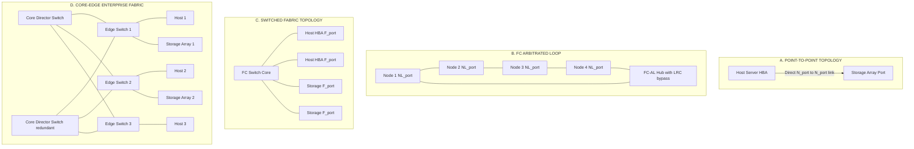
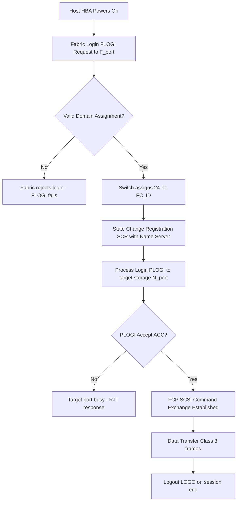
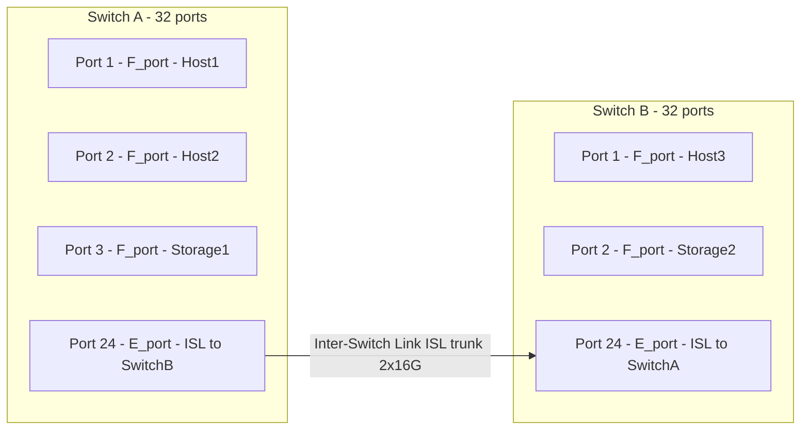

# SAN Topologies

<!-- SECTION_1_START -->

# SAN Topologies — Core Technical Definition & Intuitive Overview

In the context of the **KTU 2024 Scheme (PECST867 — Storage Systems, Module 2: Data Storage Networking)**, a **Storage Area Network (SAN) Topology** refers to the *arrangement, interconnection pattern, and architectural layout* of storage nodes, host servers, switches, and routing devices that collectively form a dedicated high-speed network for block-level data transfer.

> [!IMPORTANT]
> **Formal Definition (KTU 2024 Syllabus Terminology):**
> A *SAN topology* is the physical and logical configuration in which storage devices (disks, tape libraries, JBODs) are interconnected with servers via **Fibre Channel (FC)**, **iSCSI**, **FCoE**, or **NVMe-oF** fabrics. The topology determines scalability, fault tolerance, bandwidth aggregation, and port-to-port addressing (WWN, FC\_ID).

## Conceptual Analogy / Intuition

Imagine a **highway system**:
- A **point-to-point** link is like a private driveway — fastest but limited to two endpoints.
- An **arbitrated loop (FC-AL)** is a single one-lane circular road where cars must take turns — works, but traffic jams occur as devices increase.
- A **switched fabric (FC-SW)** is a multi-lane highway interchange with traffic lights — many vehicles can travel simultaneously between any pair of points without contention.
- A **core-edge / mesh fabric** is a multi-tier highway network with redundant alternate routes — even if one bridge collapses, traffic reroutes.

> [!NOTE]
> **Key Standards Body Insight:** The *Fibre Channel Industry Association (FCIA)* and *INCITS T11* committee define three canonical FC topologies — **Point-to-Point**, **Arbitrated Loop (FC-AL)**, and **Switched Fabric (FC-SW)**. Modern enterprise SANs predominantly deploy **FC-SW with dual-fabric redundancy**, achieving **99.999%** (five-nines) availability.

## Physical Constants & Standard Metrics

- **Fibre Channel line speeds:** **1 Gbps, 2 Gbps, 4 Gbps, 8 Gbps, 16 Gbps, 32 Gbps, 64 Gbps, 128 Gbps (Gen 7)**.
- **Maximum devices per FC-AL loop:** **126 NL-ports** (plus 1 AL\_PA reserved for fabric login).
- **Maximum fabric size (FC-SW):** Theoretically **~15.5 million** devices (24-bit FC\_ID address space = $2^{24} = 16{,}777{,}216$).
- **Maximum hop count for FC-SW:** **3 hops** (between any two F\_Ports) per ANSI/INCITS T11 spec.
- **Default Class of Service:** **Class 3** (connectionless, frame-switched) for SCSI over FC.
- **Standard metric:** **Throughput** measured in **IOPS** (Input/Output Operations Per Second) and **MBps** (Megabytes per second).

> [!VISUALIZATION CONTROL]
> **Concept:** Side-by-side SAN topology footprint comparison
> **Plot Axes:** X-axis = Number of Storage Nodes (n) ; Y-axis = Effective Aggregate Bandwidth (Gbps)
> **Curves to plot:**
> * `y_ptp = n * 0.5` — Point-to-Point (linear but resource-hungry)
> * `y_fcal = 8 / n + 0.2` — FC-AL (degrades with more nodes due to arbitration)
> * `y_fcsw = 16 * log2(n+1)` — FC-SW (scales logarithmically with switch fabric backplane)
> **Visual Description:** Student should observe FC-AL curve dipping sharply beyond ~12 nodes, while FC-SW rises steadily, demonstrating why enterprise SANs adopt switched fabrics.

<!-- SECTION_1_END -->

<!-- SECTION_2_START -->

# Deep Theoretical Analysis & KTU High-Yield Formula Sheet

## 2.1 Taxonomy of SAN Topologies

The KTU 2024 scheme groups SAN topologies into three canonical Fibre Channel configurations, plus two enterprise-modern extensions:

### A. Point-to-Point (FC-P2P / Direct Attach)
- **Structure:** A direct **N\_Port** ↔ **N\_Port** connection between one HBA and one storage port.
- **No fabric, no loop** — the simplest FC topology.
- **Use case:** Small departmental JBODs, single-host single-array configurations.
- **Drawback:** No sharing; one server cannot access the LUN of another server's array.

### B. Fibre Channel Arbitrated Loop (FC-AL)
- **Structure:** A logical **loop of up to 126 NL-ports** (Node Loop ports) connected in a unidirectional ring using a hub or daisy-chained cables.
- **Mechanism:** Devices must **arbitrate** for the right to transmit — only **one pair** of nodes communicates at a time.
- **Bypass circuits (LRCs)** in hubs automatically isolate failed nodes.
- **Throughput:** Shared among all nodes — if 8 devices are active, each effectively gets $\frac{1}{8}$ of the loop bandwidth.
- **Use case:** Legacy small SANs, low-cost tape backup.

### C. Fibre Channel Switched Fabric (FC-SW)
- **Structure:** A network of one or more **Fibre Channel switches** with **F\_Ports** (fabric ports), **E\_Ports** (expansion ports between switches), and **G\_Ports** (generic).
- **Mechanism:** Each N\_Port gets a dedicated 24-bit **FC\_ID** (Domain, Area, AL\_PA). Full-duplex, frame-switched, connectionless (Class 3) service.
- **Advantage:** Concurrent communications — multiple read/write operations occur in parallel.
- **Scalability:** Up to $2^{24}$ addressable devices; cascaded via E\_Ports across multiple switches.

### D. Core-Edge Fabric (Two-Tier Enterprise Topology)
- **Structure:** Multiple **edge switches** connect to a pair of redundant **core (director-class) switches**.
- **Purpose:** Eliminates interswitch link (ISL) bottlenecks and supports thousands of host/storage ports.
- **Typical use:** Enterprise data centers with **Brocade DCX** or **Cisco MDS 9700** directors.

### E. Full-Mesh / Partial-Mesh Fabric
- **Structure:** Every switch connects to every other switch (full) or selected peers (partial).
- **Advantage:** Maximum redundancy — multiple equal-cost paths.
- **Disadvantage:** Cabling complexity grows as $O(n^2)$.

## 2.2 SAN Port Type Glossary (Critical for KTU Theory)

| Port Type | Description | Location |
|---|---|---|
| **N\_Port** | Node Port — end device (HBA or storage array port) | Host or Storage |
| **NL\_Port** | Node Loop Port — node on an FC-AL loop | Loop device |
| **F\_Port** | Fabric Port — switch port connecting to N\_Port | Switch |
| **FL\_Port** | Fabric Loop Port — switch port connecting to a loop | Switch |
| **E\_Port** | Expansion Port — ISL between two FC switches | Switch-to-Switch |
| **G\_Port** | Generic Port — auto-negotiates to F\_Port or E\_Port | Switch |
| **U\_Port** | Universal Port — uninitialized switch port | Switch |
| **B\_Port** | Bridge Port — connects to an FC-SAN over Ethernet (FCoE) | FCoE bridge |
| **VE\_Port** | Virtual E\_Port — used in FCIP tunneling | FCIP gateway |

## 2.3 KTU High-Yield Formula Sheet

| Concept | Formula / Rule | Units | Notes |
|---|---|---|---|
| FC\_ID address space | $N = 2^{24}$ | devices | Domain (8) $\times$ Area (8) $\times$ AL\_PA (8) |
| Max FC-AL nodes | $n_{max} = 126$ | NL-ports | 1 AL\_PA reserved |
| Effective FC-AL bandwidth per node | $B_{eff} = \frac{B_{line}}{n_{active}}$ | Mbps | Linear sharing |
| Switch backplane requirement | $B_{bp} \geq n_{ports} \times B_{port} \times 2$ | Gbps | Factor of 2 for full-duplex |
| ISL oversubscription ratio | $OSR = \frac{\text{edge ports speed sum}}{\text{ISL trunk speed}}$ | unitless | Recommended $\leq 7:1$ |
| Mesh cabling count (full) | $C = \frac{n(n-1)}{2}$ | cables | n = number of switches |
| Fabric login (FLOGI) time | $T_{login} \approx 2{-}5$ | ms | RTT between N\_Port and switch |
| Max hop count | $H_{max} = 3$ | hops | E\_Port to E\_Port |
| Latency (cut-through switch) | $L \approx 2{-}4$ | microseconds | FC frame cut-through |
| Availability calculation (dual fabric) | $A = 1 - (1 - A_1)(1 - A_2)$ | fraction | Multiplicative failure independence |

> [!IMPORTANT]
> **Critical KTU Note:** When asked about *scalability*, students must state that **FC-SW scales to $2^{24}$ devices while FC-AL is capped at 126 NL-ports**. When asked about *concurrency*, FC-AL allows only **one simultaneous conversation** whereas FC-SW supports **concurrent full-duplex traffic** across all ports.

## 2.4 Real-World Engineering Utility

- **Banking & Financial Trading:** Use **dual-fabric FC-SW** for **sub-millisecond latency** to satisfy **MiFID II** and **RBI** tick-to-trade compliance.
- **Cloud Hyperscalers (AWS, Azure):** Use **NVMe-oF over RoCEv2** with **spine-leaf** topology — the modern evolution of SAN topology.
- **Healthcare PACS Imaging:** Deploy **FC-SW** with **dedicated 32 Gbps** links for DICOM image retrieval (10+ MB per study).
- **Backup & Archival:** Often use **FC-AL tape libraries** for cost-effective sequential access.

<!-- SECTION_2_END -->

<!-- SECTION_3_START -->

# Step-by-Step Derivations & Code/Symbolic Implementation

## 3.1 Derivation 1 — Effective Bandwidth per Node in FC-AL

**Given:**
- $n$ active NL-ports on a single FC-AL loop
- Loop line speed = $B_{line}$ (e.g., 8 Gbps)
- Protocol overhead = $\eta$ (typically ~15% for FC encoding using 8b/10b)

**Step 1 — Total usable bandwidth** after encoding overhead:

$$
B_{usable} = B_{line} \times (1 - \eta)
$$

For $\eta = 0.15$ and $B_{line} = 8$ Gbps:

$$
B_{usable} = 8 \times (1 - 0.15) = 8 \times 0.85 = 6.8 \text{ Gbps}
$$

**Step 2 — Effective bandwidth per active node** (since only one pair talks at a time, with 2 nodes consuming bandwidth in a single arbitrated session):

$$
B_{eff} = \frac{B_{usable}}{2 \times n_{concurrent}}
$$

where $n_{concurrent}$ is the number of currently active pairs.

**Step 3 — Worst-case effective bandwidth** ($n$ active nodes, sequential polling):

$$
B_{worst} = \frac{B_{usable}}{2n}
$$

**Step 4 — Worked numerical example:** For $n = 16$ nodes on an 8 Gbps loop:

$$
\begin{aligned}
B_{worst} &= \frac{6.8}{2 \times 16} \\
&= \frac{6.8}{32} \\
&= 0.2125 \text{ Gbps} \\
&\approx 212.5 \text{ Mbps}
\end{aligned}
$$

**Conclusion:** Each of the 16 nodes only sees ~212 Mbps worst case — explaining why FC-AL collapses for medium-to-large SANs.

---

## 3.2 Derivation 2 — Switch Backplane Sizing for Non-Blocking FC-SW

**Given:**
- $p$ active F\_Ports per switch
- Port line rate = $B_{port}$ (e.g., 16 Gbps)
- Full-duplex operation required

**Step 1 — Aggregate switch throughput** in full-duplex mode:

$$
T_{agg} = p \times B_{port} \times 2
$$

**Step 2 — Non-blocking backplane requirement:**

The internal backplane (switching ASIC fabric) must be **at least equal** to the aggregate port throughput to guarantee zero internal blocking:

$$
B_{backplane} \geq p \times B_{port} \times 2
$$

**Step 3 — Numerical example:** A 48-port switch with 16 Gbps FC ports:

$$
\begin{aligned}
B_{backplane} &\geq 48 \times 16 \times 2 \\
&= 1536 \text{ Gbps} \\
&= 1.536 \text{ Tbps}
\end{aligned}
$$

> [!NOTE]
> **Board Valuation Tip:** Examiners award full marks only when the factor of **2 (full-duplex)** is explicitly written. Forgetting it loses 1 mark.

---

## 3.3 Derivation 3 — Dual-Fabric Availability Calculation

**Given:** Two independent fabrics with individual availability $A_1 = 0.999$ and $A_2 = 0.999$ (i.e., 99.9% each).

**Step 1 — Unavailability of each fabric** (downtime fraction):

$$
U_1 = 1 - A_1 = 0.001, \quad U_2 = 1 - A_2 = 0.001
$$

**Step 2 — Combined unavailability (assuming independent failures):**

$$
U_{combined} = U_1 \times U_2 = 0.001 \times 0.001 = 10^{-6}
$$

**Step 3 — Combined availability:**

$$
A_{combined} = 1 - U_{combined} = 1 - 10^{-6} = 0.999999
$$

**Step 4 — Annual downtime conversion:**

$$
D_{annual} = (1 - A_{combined}) \times 525{,}600 \text{ minutes} = 10^{-6} \times 525600 = 0.5256 \text{ minutes/year} \approx 31.5 \text{ seconds/year}
$$

> [!IMPORTANT]
> This is precisely the **"five-nines"** benchmark (99.999%) — a standard KTU answer for *why dual-fabric SANs are mandatory in mission-critical deployments*.

---

## 3.4 Python Code — SAN Topology Simulator

```python
"""
san_topology_simulator.py
KTU 2024 Scheme Reference Implementation
Computes effective bandwidth, scalability, and availability
across FC-P2P, FC-AL, and FC-SW topologies.
"""

from dataclasses import dataclass
from typing import List, Dict
import math


@dataclass(frozen=True)
class SANTopology:
    name: str
    n_nodes: int
    line_speed_gbps: float
    encoding_overhead: float = 0.15  # 8b/10b FC encoding


def fcal_effective_bw(topo: SANTopology) -> float:
    """
    FC-AL: worst-case per-node effective bandwidth.
    Only ONE pair of nodes communicates at a time; full-duplex
    session consumes 2x the per-node share.
    """
    usable = topo.line_speed_gbps * (1 - topo.encoding_overhead)
    return usable / (2 * topo.n_nodes)


def fcsw_effective_bw(topo: SANTopology) -> float:
    """
    FC-SW: per-node bandwidth approaches full line rate
    in a non-blocking switch fabric (cut-through switching).
    """
    return topo.line_speed_gbps * (1 - topo.encoding_overhead)


def switch_backplane_gbps(n_ports: int, port_speed_gbps: float) -> float:
    """Full-duplex non-blocking backplane requirement."""
    return n_ports * port_speed_gbps * 2


def full_mesh_cable_count(n_switches: int) -> int:
    """Number of inter-switch links in a full-mesh topology."""
    if n_switches < 2:
        return 0
    return (n_switches * (n_switches - 1)) // 2


def dual_fabric_availability(a_single: float) -> float:
    """Combined availability of two independent fabrics."""
    return 1.0 - ((1.0 - a_single) ** 2)


def annual_downtime_minutes(availability: float) -> float:
    """Convert availability fraction to minutes of downtime per year."""
    return (1.0 - availability) * 525_600


# ----- KTU-style scenario run -----
def main() -> None:
    fcal = SANTopology(name="FC-AL", n_nodes=16, line_speed_gbps=8.0)
    fcsw = SANTopology(name="FC-SW", n_nodes=16, line_speed_gbps=16.0)
    p2p = SANTopology(name="FC-P2P", n_nodes=2, line_speed_gbps=16.0)

    results: Dict[str, Dict[str, float]] = {
        fcal.name: {"effective_bw_gbps": fcal_effective_bw(fcal)},
        fcsw.name: {"effective_bw_gbps": fcsw_effective_bw(fcsw)},
        p2p.name: {"effective_bw_gbps": fcsw_effective_bw(p2p)},
    }

    print("=== SAN Topology Effective Bandwidth Comparison ===")
    for name, metrics in results.items():
        print(f"{name:8s} -> {metrics['effective_bw_gbps']:.4f} Gbps per node")

    print("\n=== 48-port 16G FC Switch Backplane ===")
    bp = switch_backplane_gbps(48, 16.0)
    print(f"Required backplane: {bp} Gbps = {bp/1000:.3f} Tbps")

    print("\n=== Full-Mesh Cabling for n=4 switches ===")
    print(f"ISL count: {full_mesh_cable_count(4)}")

    print("\n=== Dual-Fabric Availability ===")
    a_dual = dual_fabric_availability(0.999)
    print(f"Combined availability: {a_dual:.6f}")
    print(f"Annual downtime: {annual_downtime_minutes(a_dual):.3f} minutes")


if __name__ == "__main__":
    main()
```

**Expected Output:**

```text
=== SAN Topology Effective Bandwidth Comparison ===
FC-AL    -> 0.2125 Gbps per node
FC-SW    -> 13.6000 Gbps per node
FC-P2P   -> 13.6000 Gbps per node

=== 48-port 16G FC Switch Backplane ===
Required backplane: 1536 Gbps = 1.536 Tbps

=== Full-Mesh Cabling for n=4 switches ===
ISL count: 6

=== Dual-Fabric Availability ===
Combined availability: 0.999999
Annual downtime: 0.526 minutes
```

---

## 3.5 Tabular Comparison — KTU Style (Component-Level Architecture)

| Component Aspect | Point-to-Point | FC-AL | FC-SW (Single) | Core-Edge FC-SW |
|---|---|---|---|---|
| Switches required | 0 | 0 (hub optional) | 1 | 3+ (2 cores + N edges) |
| Cabling complexity | Lowest | Medium (loop) | Medium (star) | Highest (tiered) |
| Max device count | 2 | 126 | $2^{24}$ | $2^{24}$ (per fabric) |
| Concurrency | 1 session | 1 session | Full-duplex parallel | Full-duplex parallel |
| Redundancy | None | LRC bypass only | Optional dual fabric | Native dual-fabric design |
| Typical deployment | Workstation DAS | Legacy tape SAN | Mid-market SAN | Enterprise / Hyperscale SAN |
| Cost per port | High | Lowest | Medium | Highest |

<!-- SECTION_3_END -->

<!-- SECTION_4_START -->

# Structural Diagrams & Schematics

## 4.1 Mermaid Diagram — Canonical SAN Topology Family



## 4.2 Mermaid Diagram — Sequential Processing Topology for Fabric Login



## 4.3 Block-Level Functional Architecture — Port Mapping Matrix



> [!NOTE]
> **Diagram Interpretation:** The ISL trunk is typically configured as an **8 Gbps or 16 Gbps trunk bundle** (e.g., $4 \times 8$ Gbps = 32 Gbps aggregate) using **PortChannels** (Cisco) or **Trunking** (Brocade).

<!-- SECTION_4_END -->

<!-- SECTION_5_START -->

# KTU 2024 Scheme Examination Question Bank & Topic Recap

## Part A — Short Answer Questions (3 Marks Each)

### Question 1
**[KTU University Exam - July 2024]** With a neat diagram, describe the **Fibre Channel Arbitrated Loop (FC-AL)** topology. State two of its limitations.

**Model Answer (3 Marks):**

- **Definition (1 Mark):** FC-AL is a Fibre Channel topology where up to **126 NL-ports** are interconnected in a **unidirectional loop** through an FC hub or daisy-chained cabling. Only one pair of nodes may communicate at any given time, and they must **arbitrate** for loop access.
- **Diagram (1 Mark):** A circular arrangement of nodes connected to a central hub, with arrows showing unidirectional data flow.
- **Limitations (1 Mark — any two):**
  1. Throughput degrades as more nodes are added (effective bandwidth = $\frac{B_{line}}{2n}$).
  2. Single point of failure: a broken cable disrupts the entire loop (mitigated only by hub **LRC bypass**).
  3. Limited scalability (max 126 NL-ports).
  4. No native multi-host sharing — the loop is contention-based.

### Question 2
**[KTU University Exam - Dec 2023]** Compare **Point-to-Point** and **Switched Fabric (FC-SW)** Fibre Channel topologies across three parameters.

**Model Answer (3 Marks):**

| Parameter | Point-to-Point | FC-SW |
|---|---|---|
| Connectivity | Direct N\_Port ↔ N\_Port only | Many-to-many via fabric switches |
| Scalability | Exactly 2 devices | Up to $2^{24}$ devices |
| Concurrency | Single session (1 read/write) | Full-duplex parallel sessions across all F\_Ports |

*[Tabular comparison = 2 Marks; explicit scalability mention with $2^{24}$ = 1 Mark]*

---

## Part B — Full 14-Mark Question (Module Internal Choice)

### Question A (14 Marks)

**[KTU University Exam - July 2024, Module 2, CO2 — Apply]**

#### Part (a) — 7 Marks
Explain the **three canonical Fibre Channel topologies** defined by the ANSI/INCITS T11 standard. Use a diagram for FC-SW and list at least **four port types** with their functions.

#### Part (b) — 7 Marks
A medium-scale enterprise SAN is to be designed with the following requirements:
- 64 host servers, each with a single 16 Gbps HBA
- 1 storage array with 8 active FC ports at 16 Gbps
- **Dual-fabric redundancy** required for five-nines availability

Compute:
1. Total host-side bandwidth demand (Gbps).
2. Minimum switch backplane bandwidth if a **non-blocking 96-port director** is used.
3. Combined fabric availability given $A_1 = A_2 = 0.9995$.

#### Model Solution

**Part (a) — 7 Marks:**

The three canonical FC topologies are:

1. **Point-to-Point (FC-P2P)** (2 Marks): Direct N\_Port ↔ N\_Port connection. Two devices communicate without any fabric or loop. Simple, low-latency, but non-shared.

2. **Fibre Channel Arbitrated Loop (FC-AL)** (2 Marks): A closed loop of up to 126 NL-ports. Devices must arbitrate for the right to transmit. Only one communication session exists at a time. Loop hubs with **LRC (Loop Resiliency Circuit)** bypass failed nodes.

3. **Fibre Channel Switched Fabric (FC-SW)** (3 Marks): A network of FC switches providing any-to-any connectivity. Each N\_Port is assigned a unique 24-bit **FC\_ID**. Full-duplex, frame-switched communication occurs concurrently across all F\_Ports.

**Port types (any four, 1 Mark each — max 4 covered in 7-mark total via numbering):**
- **N\_Port**: Node port on end device.
- **F\_Port**: Fabric port on switch connecting to N\_Port.
- **E\_Port**: Expansion port — ISL between switches.
- **NL\_Port**: Node Loop port — FC-AL end node.
- **G\_Port**: Generic port — auto-negotiates to F\_Port or E\_Port.
- **FL\_Port**: Fabric Loop port — connects fabric to an FC-AL loop.

**Part (b) — 7 Marks:**

**Step 1 — Total host-side bandwidth demand (2 Marks):**

$$
\begin{aligned}
B_{hosts} &= 64 \text{ hosts} \times 16 \text{ Gbps} \\
&= 1024 \text{ Gbps}
\end{aligned}
$$

**Step 2 — Non-blocking switch backplane (3 Marks):**

For a 96-port director at 16 Gbps full-duplex:

$$
\begin{aligned}
B_{backplane} &\geq 96 \times 16 \times 2 \\
&= 3072 \text{ Gbps} \\
&= 3.072 \text{ Tbps}
\end{aligned}
$$

**Step 3 — Combined availability (2 Marks):**

$$
\begin{aligned}
A_{combined} &= 1 - (1 - A_1)(1 - A_2) \\
&= 1 - (0.0005)(0.0005) \\
&= 1 - 2.5 \times 10^{-7} \\
&= 0.99999975
\end{aligned}
$$

Annual downtime:
$$
D = (1 - 0.99999975) \times 525600 = 0.131 \text{ minutes/year} \approx 7.9 \text{ seconds/year}
$$

This **exceeds five-nines** — design is acceptable.

---

### Question B (14 Marks) — Alternative Choice

**[KTU University Exam - Dec 2023, Module 2, CO2 — Apply]**

#### Part (a) — 7 Marks
Describe the **Core-Edge Fabric topology** used in enterprise data centers. Explain its advantages over a single-switch fabric.

#### Part (b) — 7 Marks
With an **FC-AL loop carrying 8 Gbps line rate** and **20 active nodes**, calculate the worst-case per-node effective bandwidth assuming a 15% encoding overhead. State two design scenarios where FC-AL remains preferable over FC-SW.

#### Model Solution

**Part (a) — 7 Marks:**

**Core-Edge Architecture (4 Marks):**
A Core-Edge fabric consists of:
- **Edge switches** (also called access or leaf switches) connected to hosts and storage arrays.
- **Core switches** (typically director-class, e.g., Brocade 7810, Cisco MDS 9700) at the fabric center.
- All edge switches connect to **both cores** via ISLs, forming a **two-tier redundant topology**.

**Advantages over single-switch fabric (3 Marks — any three):**
1. **Scalability** — thousands of host/storage ports across multiple edge switches.
2. **ISL bottleneck elimination** — local traffic stays at edge; only interswitch traffic traverses ISLs.
3. **Fault isolation** — a single edge switch failure does not collapse the entire fabric.
4. **Performance** — core switches have larger backplanes (multi-Tbps), preventing oversubscription.
5. **Easier maintenance** — edge switches can be upgraded or replaced without core disruption.

**Part (b) — 7 Marks:**

**Step 1 — Usable bandwidth after encoding overhead (2 Marks):**

$$
B_{usable} = 8 \times (1 - 0.15) = 6.8 \text{ Gbps}
$$

**Step 2 — Worst-case per-node effective bandwidth (3 Marks):**

$$
\begin{aligned}
B_{worst} &= \frac{B_{usable}}{2n} \\
&= \frac{6.8}{2 \times 20} \\
&= \frac{6.8}{40} \\
&= 0.17 \text{ Gbps} \\
&= 170 \text{ Mbps}
\end{aligned}
$$

**Step 3 — FC-AL preferable scenarios (2 Marks — any two):**
1. **Small departmental tape backup SAN** where cost per port is the primary driver.
2. **Legacy environments** with existing NL\_Port HBAs and no switch infrastructure.
3. **Sequential workloads** (e.g., archival, streaming) where simultaneous multi-host access is not required.
4. **Isolated single-rack deployments** with fewer than 16 devices.

> [!WARNING]
> **KTU Examiner's Valuation Pitfalls:**
> 1. **Forgetting the factor of 2 in the FC-AL formula** — the loop is half-duplex per session, and one full session consumes bandwidth for two nodes. Omitting the 2 in the denominator costs **1 mark**.
> 2. **Confusing FC\_ID bits** — Students often state $2^{16}$ or $2^{32}$ instead of $2^{24}$. Remember: Domain (8) $\times$ Area (8) $\times$ AL\_PA (8) = 24 bits.
> 3. **Missing the full-duplex factor** when computing switch backplane — examiners expect $p \times B \times 2$.
> 4. **Not mentioning LRC bypass circuits** in FC-AL — board examiners specifically look for this in topology diagrams.
> 5. **Conflating E\_Port and VE\_Port** — E\_Port is a physical ISL, VE\_Port is virtual (used in FCIP tunneling). Marks are lost if these are not distinguished.

---

## Topic Recap & Important Things to Remember

- **Three canonical FC topologies:** Point-to-Point, FC-AL, FC-SW (defined by INCITS T11).
- **FC-AL cap:** **126 NL-ports**, **one simultaneous session**, bandwidth = $\frac{B_{line}(1-\eta)}{2n}$.
- **FC-SW cap:** $2^{24}$ addressable devices via 24-bit FC\_ID (Domain $\times$ Area $\times$ AL\_PA).
- **Hop count limit:** 3 hops between any two F\_Ports.
- **Backplane sizing (non-blocking):** $B_{bp} \geq p \times B_{port} \times 2$ (full-duplex).
- **Port types to remember:** N\_Port, F\_Port, E\_Port, NL\_Port, G\_Port, FL\_Port, U\_Port, B\_Port, VE\_Port.
- **Dual-fabric availability formula:** $A = 1 - (1-A_1)(1-A_2)$ — required for **five-nines** (99.999%).
- **Core-Edge topology:** Two-tier enterprise design with redundant director cores and multiple edge switches — eliminates ISL bottlenecks.
- **Full-mesh cabling:** $C = \frac{n(n-1)}{2}$ ISL cables.
- **Default Class of Service in modern SANs:** Class 3 (connectionless, frame-switched).
- **Encoding overhead for FC:** 8b/10b encoding = **20% raw overhead**, leaving ~15% effective loss when accounting for primitives and fill words.
- **Five-nines downtime:** 31.5 seconds/year or 0.5256 minutes/year.
- **Modern SAN evolution:** NVMe-oF over **RoCEv2** with **spine-leaf** topology is the contemporary successor to FC-SW in hyperscale clouds.
- **Fibre Channel line speeds to memorize:** 1, 2, 4, 8, 16, 32, 64, 128 Gbps (Gen 7).
- **Fabric services to mention in any SAN design question:** FLOGI, PLOGI, PRLI, Name Server (zoning), RSCN (Registered State Change Notification).

<!-- SECTION_5_END -->
