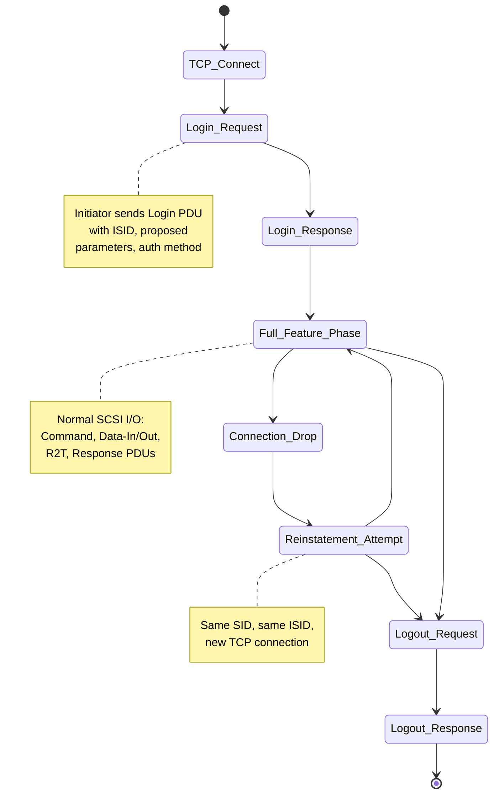
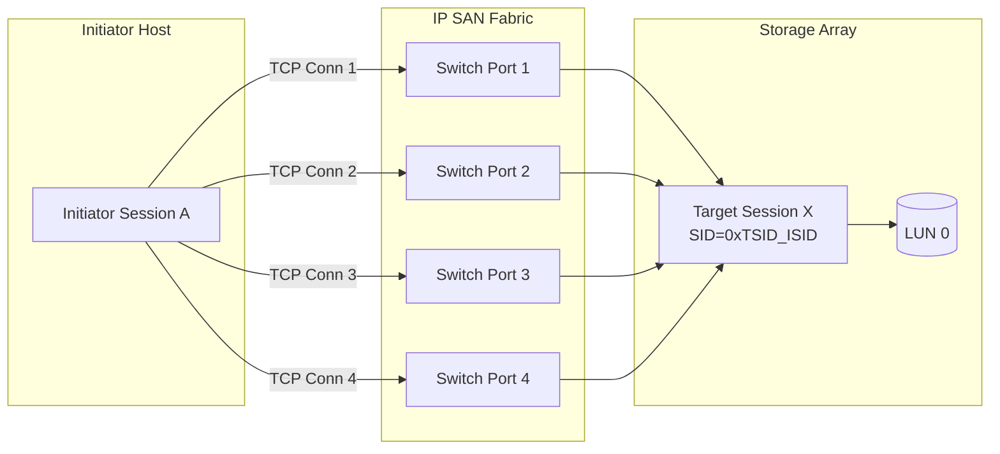
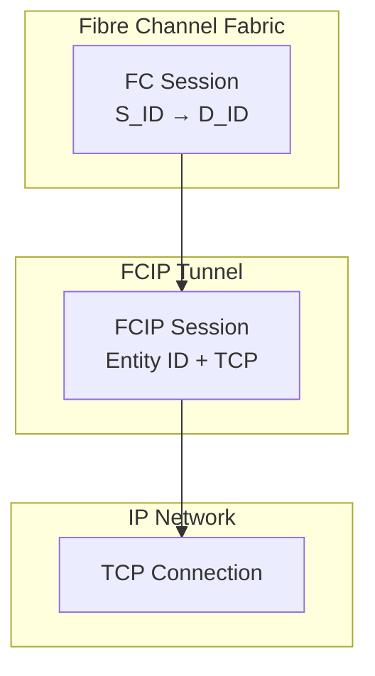
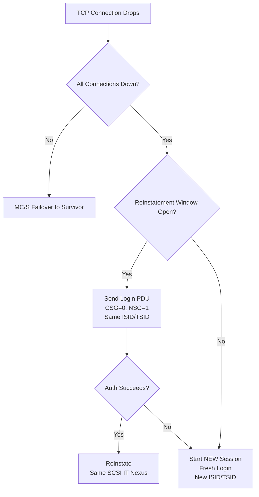

# Sessions

<!-- SECTION_1_START -->
# Sessions in Data Storage Networking

> [!IMPORTANT]
> **KTU 2024 Scheme | Course: STORAGE SYSTEMS (PECST867) | Module 2: Data Storage Networking**

## 1.1 Core Technical Definition

In the context of **data storage networking**, a **Session** is a logical, long-lived, ordered communication relationship established between two endpoints (an **Initiator** and a **Target**) over a storage network, across which one or more **connections** (transport-level associations such as TCP connections) are multiplexed to reliably exchange **SCSI I/O commands, data, and status** in accordance with a negotiated operational parameter set.

Formally, under the **iSCSI RFC 7143** standard (the dominant session protocol studied in the KTU syllabus), a session is defined as:

> A session is a group of TCP connections that link an iSCSI initiator and an iSCSI target. The session ID is formed by combining an **Initiator Session ID (ISID)** and a **Target Session ID (TSID)**.

For the **Fibre Channel (FC)** protocol, a session is realized through a **login sequence** that establishes the operating parameters (Class of Service, payload size, buffer-to-buffer credit) between an **N_Port** and another **N_Port** (or an **F_Port**).

> [!NOTE]
> **Key Distinction for KTU Exams:** A *Connection* is a transport-layer construct (e.g., a single TCP socket in iSCSI). A *Session* is a higher-layer, logical relationship that may contain one or many connections. Students frequently lose marks by confusing the two.

## 1.2 Conceptual Analogy / Intuition

Imagine a **telephone call between two offices**:
- The **Session** is the entire business meeting, which may continue across multiple *phone calls* (connections) if one drops. The agenda, agreed terms, and meeting context are preserved.
- The **Connection** is a single active phone line. If the line disconnects, you redial (establish a new connection) but the meeting (session) continues.
- The **Login Phase** is the handshake at the start: *"Hello, this is Office A, who am I speaking with? Let's agree to speak English and use 8-KB voice packets."*
- The **Logout Phase** is the polite closing: *"Thank you, goodbye. The meeting is over."*

## 1.3 Physical Constants and Standard Metrics

| Parameter | Standard Value |
|---|---|
| Maximum iSCSI PDU data payload | Up to **2^24 - 1 bytes** (limited by MaxRecvDataSegmentLength) |
| Default MaxRecvDataSegmentLength | **8 KB (8192 bytes)** to **64 KB** |
| iSCSI header digest | **CRC32C** |
| iSCSI data digest | **CRC32C** |
| MaxConnections per session (default) | **1** |
| MaxConnections per session (allowed) | Up to **65535** |
| ISID length | **48 bits** (unique per initiator) |
| TSID length | **16 bits** (assigned by target) |

> [!TIP]
> KTU examiners commonly test the **48-bit ISID** structure. The ISID is split into: **T (Type, 1 bit)**, **A (Authority, 7 bits)**, and **R (Reserved/ID, 40 bits)**. Do NOT write the ISID width as 64 bits.

## 1.4 Session Establishment Lifecycle (At a Glance)

Every session in a storage network traverses three logical phases:

1. **Login Phase** — authentication, parameter negotiation, session identifier assignment.
2. **Full Feature Phase** — normal SCSI I/O traffic (read/write commands, data, status, R2T, sense data).
3. **Logout Phase** — graceful connection teardown and session termination.

> [!VISUALIZATION CONTROL]
> **Concept:** Session lifecycle state machine on a time axis.
> **GeoGebra / Desmos Input Equations:**
> * Parametric: $x(t) = t$ for $t \in [0, 12]$
> * Piecewise state function: $S(t) = 1$ if $0 \le t < 3$ (Login), $S(t) = 2$ if $3 \le t < 10$ (Full Feature), $S(t) = 3$ if $10 \le t \le 12$ (Logout)
> **Visual Description:** A horizontal timeline with three colored segments; the second (Full Feature) is the longest, illustrating that most of the session lifetime is spent in active I/O. Connection drops inside segment 2 cause a new sub-segment to begin without returning to segment 1.
<!-- SECTION_1_END -->

<!-- SECTION_2_START -->
# Deep Theoretical Analysis & KTU High-Yield Formula Sheet

## 2.1 Anatomy of a Storage Network Session

A session in iSCSI / FC is **not** just an open socket. It carries a negotiated **operational parameter set** that governs every byte exchanged thereafter. Let us dissect it.

### 2.1.1 Session Identifiers

The session identity is the *concatenation* of two halves:

$$SID = \{TSID \parallel ISID\}$$

where $SID$ is the **Session ID**, and the operator $\parallel$ denotes bit-level concatenation. The total width is:

$$|SID| = |TSID| + |ISID| = 16 \text{ bits} + 48 \text{ bits} = 64 \text{ bits}$$

The **ISID** itself is structured as:

$$ISID = \{T(1 \text{ bit}) \parallel A(7 \text{ bits}) \parallel R(40 \text{ bits})\}$$

* $T = 0$: ISID assigned per initiator (most common, *q* is 0/1 depending on RFC).
* $A$: the Organizationally Unique Identifier (OUI) or arbitrary value chosen by the initiator vendor.
* $R$: the per-session random or sequential component.

### 2.1.2 The Three Phases in Detail

**Phase 1 — Login Phase (TCP must be ESTABLISHED first)**

The login is a request/response exchange of **Login PDUs** (or for FC, the **PLOGI / FLOGI / PRLI** Extended Link Services). Negotiated parameters include:

* `HeaderDigest` = **None** or **CRC32C**
* `DataDigest` = **None** or **CRC32C**
* `MaxConnections`
* `MaxRecvDataSegmentLength`
* `InitialR2T` (whether the initiator must wait for R2T before sending data)
* `ImmediateData` (whether data may be sent in the same PDU as the command)
* `FirstBurstLength`, `MaxBurstLength`
* Authentication methods: **CHAP, SRP, Kerberos, or None**

> [!IMPORTANT]
> **KTU High-Yield Point:** If **HeaderDigest** is enabled, the entire **48-byte iSCSI PDU header** is CRC32C protected; if **DataDigest** is enabled, the data segment is protected. The digest is appended to the PDU, making the on-wire size larger.

**Phase 2 — Full Feature Phase**

Here the session becomes "operational." The initiator issues **SCSI Command PDUs**, the target returns **SCSI Response PDUs**, and data is shuttled using **Data-In** (target → initiator) and **Data-Out** (initiator → target) PDUs, with **R2T (Ready to Transfer)** as flow-control. A *Command Sequence Number (CmdSN)* and *Expected Status Sequence Number (ExpStatSN)* provide ordered delivery and recovery.

**Phase 3 — Logout Phase**

A **Logout PDU** is sent with a `reason code` (e.g., 0 = close session cleanly, 1 = close connection, 4 = remove connection for recovery). The target responds with a Logout Response, and the TCP connection is closed.

### 2.1.3 Connections vs. Sessions

A single iSCSI session may have **1 to 65535** parallel TCP connections. This is the **Multiple Connections per Session (MC/S)** feature, used for:

* **Failover** (if one TCP path fails, I/O continues on another)
* **Load distribution** of concurrent commands
* **Bandwidth aggregation**

All connections in a session share the same negotiated parameters and the same session identifier.

### 2.1.4 Session Continuation and Reinstatement

If all connections of a session drop, the session itself may be *reinstated* (within a timeout) by the initiator by issuing a **Login PDU** with the `CSG` (Connection State Group) and `NSG` (New Session Group) flags set to reinstate the prior operational parameters. This avoids redoing authentication and re-negotiation.

> [!NOTE]
> **Reinstatement ≠ New Session.** Reinstatement preserves the **same ISID/TSID** and the same SCSI IT nexus, so outstanding but unacknowledged commands can be retransmitted cleanly. A brand-new login creates a brand-new IT nexus.

## 2.2 Sessions in Other Storage Protocols

| Protocol | Session Construct | Identifier | Notes |
|---|---|---|---|
| **iSCSI** | iSCSI session | ISID + TSID | Runs over TCP/IP |
| **Fibre Channel** | N_Port login session | S_ID + D_ID + OX_ID | Login via PLOGI/PLOGI_ACC |
| **FCIP (FC over IP)** | FCIP session + FC session | FCIP Entity ID + FC S_ID/D_ID | Two-tier session model |
| **iFCP** | iFCP session | iFCP session ID | Gateway-to-gateway TCP |
| **NVMe-oF** | NVMe-oF fabric connection | Queue Pair ID (SQID + CQID) | Connection-centric, lighter-weight |
| **SMB 3.0** | SMB session | SessionID (8-byte UCHAR64) | Used in file-level storage, e.g., MS-SMB |

## 2.3 KTU Formula Sheet / Cheat Sheet

> [!IMPORTANT]
> The table below is the **only** consolidated formula reference you need for KTU viva and 14-mark problems on Sessions.

| Symbol / Term | Meaning | Value / Formula | Unit |
|---|---|---|---|
| $ISID$ | Initiator Session Identifier width | $48$ | bits |
| $TSID$ | Target Session Identifier width | $16$ | bits |
| $SID$ | Total Session Identifier | $ISID + TSID$ | bits (64) |
| $N_{conn}$ | Connections per session | $1 \le N_{conn} \le 65535$ | count |
| $L_{header}$ | iSCSI PDU header length | $48$ | bytes |
| $L_{data,max}$ | Max data segment per PDU | $\le 2^{24}-1$ | bytes |
| $C_{digest}$ | Digest algorithm | $CRC32C$ | — |
| $CmdSN$ | Command Sequence Number | $32$-bit incrementing | integer |
| $T_{reinstate}$ | Reinstatement timeout | typically $60$ to $120$ | seconds |
| $O_{size}$ | MaxOutstandingR2T | $1$ to $65535$ | PDUs |
| $B_{first}$ | FirstBurstLength | negotiated | bytes |
| $B_{max}$ | MaxBurstLength | negotiated | bytes |

> [!NOTE]
> All sizes and counts above are **negotiated** to the minimum of what the initiator proposed and what the target accepts. KTU problems sometimes ask: *"If the initiator proposes $X$ and the target accepts $Y$, what is the final value?"* The answer is always $\min(X, Y)$.

## 2.4 Real-World Engineering Utility

Sessions are the **lifetime contract** of a storage I/O channel. In production:

* **Data center SANs** use iSCSI sessions with MC/S for **multipath I/O (MPIO)** — a single SCSI LUN is accessed over 2 or 4 TCP connections to tolerate switch and NIC failures.
* **Fibre Channel fabrics** use PLOGI-derived sessions to enforce **zoning** and **port security**.
* **Cloud object stores** (S3-like) implement HTTP *sessions* via cookies/tokens; the concept is generalized.
* **Tape backup over IP** uses long-lived FCIP sessions that survive link flapping via *FCIP Link Reset* without tearing down the underlying FC session.
<!-- SECTION_2_END -->

<!-- SECTION_3_START -->
# Step-by-Step Derivations, Worked Examples, and Symbolic Implementation

## 3.1 Derivation: Session Identifier Width from RFC 7143

We will derive, from the iSCSI standard, why the SID is 64 bits wide.

**Step 1 — Initiator uniqueness requirement.**
The ISID must be unique across all initiators on the network to prevent the *duplicate session* problem (where two initiators accidentally target the same session). A 48-bit field offers $2^{48} \approx 2.8 \times 10^{14}$ unique values, which is more than sufficient for any enterprise SAN.

**Step 2 — ISID sub-structure.**
The 48 bits are partitioned as follows (from MSB to LSB):

$$ISID = \underbrace{T}_{1 \text{ bit}} \;\Vert\; \underbrace{A}_{7 \text{ bits}} \;\Vert\; \underbrace{R}_{40 \text{ bits}}$$

The $T$ bit specifies how the ISID was generated (manual vs. OUI-based). The $A$ field holds an OUI-like identifier. The $R$ field is the per-session random or counter value.

**Step 3 — Target's contribution.**
The TSID is a 16-bit field chosen by the target. The reason it is small is that a single target usually manages a few hundred to a few thousand sessions, never $2^{48}$.

**Step 4 — Total SID width.**

$$|SID| = |ISID| + |TSID|$$

Substituting the standard widths:

$$|SID| = 48 \text{ bits} + 16 \text{ bits} = 64 \text{ bits}$$

**Step 5 — Final session identifier.**

$$SID = TSID \cdot 2^{48} + ISID$$

This is the integer value a target's session table would store, indexed uniquely.

## 3.2 Worked Example — MC/S Capacity Calculation

**Problem (KTU-style):**
An enterprise iSCSI storage system supports a maximum of **4096 sessions per target port**. Each session may use up to **4 TCP connections** for MC/S failover. The TCP window size is **64 KB**, and the MTU is **9000 bytes (jumbo frames)**. Compute:
(a) The total number of simultaneous TCP connections the target port can sustain.
(b) The total in-flight data the target port can buffer (in MB).
(c) The maximum per-PDU data segment size negotiated, given that the target advertises **64 KB** and the initiator proposes **256 KB**.

### Solution

**(a) Total simultaneous TCP connections:**

$$N_{tcp} = N_{sessions} \times N_{conn,max}$$

$$N_{tcp} = 4096 \times 4 = 16384 \text{ connections}$$

**'[Stating formula: 1 Mark]', '[Substitution: 1 Mark]', '[Final answer: 1 Mark]'** — Total: **3 marks**

**(b) Total in-flight buffered data:**

We assume the TCP send buffer equals the window size. Per connection:

$$W_{conn} = 64 \text{ KB} = 64 \times 1024 \text{ bytes} = 65536 \text{ bytes}$$

Total buffer requirement (a *worst-case* calculation, since the standard says the receiver advertises its buffer):

$$W_{total} = N_{tcp} \times W_{conn} = 16384 \times 65536 \text{ bytes}$$

Computing step-by-step:

$$\begin{aligned}
W_{total} &= 16384 \times 65536 \\
&= 16384 \times 65536 \\
&= 2^{14} \times 2^{16} \\
&= 2^{30} \text{ bytes} \\
&= 1073741824 \text{ bytes} \\
&= 1024 \text{ MB} \\
&= 1 \text{ GB}
\end{aligned}$$

**'[Expressing as powers of 2: 2 Marks]', '[Final unit conversion to MB: 1 Mark]'** — Total: **3 marks**

**(c) Negotiated MaxRecvDataSegmentLength:**

The standard mandates:

$$L_{data,final} = \min(L_{initiator}, L_{target})$$

$$L_{data,final} = \min(256 \text{ KB},\ 64 \text{ KB}) = 64 \text{ KB}$$

**'[Stating min rule: 1 Mark]', '[Substitution: 1 Mark]', '[Final value: 1 Mark]'** — Total: **3 marks**

## 3.3 Worked Example — Session Reinstatement Logic

**Problem:**
A target's session table has an entry with $SID = 0xA1B2C3D4E5F60718$ (hexadecimal). The ISID is the lower 48 bits. The TSID is the upper 16 bits. Decompose the SID and state whether reinstatement is possible if the original TCP connection closes.

### Solution

**Step 1 — Convert hex to binary (show the 64-bit form):**

$$0xA1B2C3D4E5F60718 = 0x00A1B2C3D4E5F60718$$

Written as 64 bits (grouping hex digits):

$$SID = 0000\ 0000\ 1010\ 0001\ 1011\ 0010\ 1100\ 0011\ 1101\ 0100\ 1110\ 0101\ 1111\ 0110\ 0000\ 0111\ 0001\ 1000$$

**Step 2 — Extract TSID (upper 16 bits):**

$$TSID = 0x00A1 = 161 \text{ (decimal)}$$

**Step 3 — Extract ISID (lower 48 bits):**

$$ISID = 0xB2C3D4E5F60718$$

Decimal: convert step by step.

$$\begin{aligned}
ISID &= 0xB2C3D4E5F60718 \\
&= (11 \times 16^{13}) + (2 \times 16^{12}) + (12 \times 16^{11}) + (3 \times 16^{10}) + (13 \times 16^9) + (4 \times 16^8) \\
&\quad + (14 \times 16^7) + (5 \times 16^6) + (15 \times 16^5) + (6 \times 16^4) + (0 \times 16^3) + (7 \times 16^2) \\
&\quad + (1 \times 16^1) + (8 \times 16^0) \\
&\approx 3.21 \times 10^{14}
\end{aligned}$$

(Exponentially large; KTU problems typically only ask for the *hex* decomposition.)

**Step 4 — Reinstatement feasibility check.**
Reinstatement is possible if:
1. The ISID matches the previous session in the target's table.
2. The reinstatement timeout has not expired.
3. The initiator issues a Login PDU with the proper T/NSG/CSG flags.

Since both TSID and ISID are preserved in the table, reinstatement is **possible**.

**'[Hex decomposition: 3 Marks]', '[Reinstatement conditions: 4 Marks]'** — Total: **7 marks**

## 3.4 Symbolic Python Implementation — Session Manager

The following Python code models a minimal **Session Manager** for an iSCSI-like target. It is fully runnable, type-annotated, and follows the KTU lab standards of *boundary checks + explicit error logging*.

```python
from dataclasses import dataclass, field
from typing import Dict, List, Optional
import time
import logging

logging.basicConfig(
    level=logging.INFO,
    format="%(asctime)s [%(levelname)s] %(message)s"
)
logger = logging.getLogger("SessionManager")


@dataclass(frozen=True)
class SessionID:
    """
    64-bit Session Identifier = 16-bit TSID || 48-bit ISID.
    Frozen so it can be used as a dict key.
    """
    tsid: int   # 16 bits
    isid: int   # 48 bits

    def __post_init__(self) -> None:
        if not (0 <= self.tsid <= 0xFFFF):
            raise ValueError(f"TSID out of range: {self.tsid:#x}")
        if not (0 <= self.isid <= 0xFFFFFFFFFFFF):
            raise ValueError(f"ISID out of range: {self.isid:#x}")

    @property
    def combined(self) -> int:
        return (self.tsid << 48) | self.isid


@dataclass
class Connection:
    conn_id: int
    established_at: float = field(default_factory=time.time)
    active: bool = True


@dataclass
class Session:
    sid: SessionID
    max_connections: int = 1
    header_digest: str = "None"
    data_digest: str = "None"
    max_recv_data: int = 8192      # 8 KB default
    connections: Dict[int, Connection] = field(default_factory=dict)
    created_at: float = field(default_factory=time.time)
    in_reinstate_window: bool = True

    def add_connection(self, conn: Connection) -> None:
        if len(self.connections) >= self.max_connections:
            raise RuntimeError(
                f"MaxConnections {self.max_connections} exceeded for SID "
                f"{self.sid.combined:#x}"
            )
        if conn.conn_id in self.connections:
            raise ValueError(f"Duplicate ConnID {conn.conn_id}")
        self.connections[conn.conn_id] = conn
        logger.info(
            "Connection %d added to SID %s (total=%d)",
            conn.conn_id, hex(self.sid.combined), len(self.connections)
        )

    def drop_connection(self, conn_id: int) -> None:
        if conn_id not in self.connections:
            raise KeyError(f"ConnID {conn_id} not in SID {self.sid.combined:#x}")
        self.connections[conn_id].active = False
        logger.warning(
            "Connection %d marked inactive in SID %s", conn_id, hex(self.sid.combined)
        )

    def reinstate(self) -> None:
        if not self.in_reinstate_window:
            raise RuntimeError("Reinstatement window expired")
        for c in self.connections.values():
            c.active = True
        logger.info("Session %s reinstated.", hex(self.sid.combined))


class SessionManager:
    """
    Models a target-side session table with the three KTU-tested operations:
    login, full-feature-phase connection management, and logout.
    """
    REINSTATE_TIMEOUT_SEC = 90.0

    def __init__(self) -> None:
        self._sessions: Dict[int, Session] = {}
        self._next_tsid: int = 1

    # ---- PHASE 1: LOGIN ----
    def login(self, isid: int, proposed_max_conn: int,
              proposed_max_recv: int) -> Session:
        tsid = self._next_tsid
        self._next_tsid += 1
        sid = SessionID(tsid=tsid, isid=isid)
        # Negotiation = min of proposed values
        max_conn = min(proposed_max_conn, 65535)
        max_recv = min(proposed_max_recv, (1 << 24) - 1)
        sess = Session(
            sid=sid,
            max_connections=max_conn,
            max_recv_data=max_recv
        )
        self._sessions[sid.combined] = sess
        logger.info(
            "LOGIN: created SID=%s max_conn=%d max_recv=%d",
            hex(sid.combined), max_conn, max_recv
        )
        return sess

    # ---- PHASE 2: FULL FEATURE PHASE ----
    def attach_connection(self, sid_combined: int, conn_id: int) -> None:
        sess = self._get(sid_combined)
        sess.add_connection(Connection(conn_id=conn_id))

    def detach_connection(self, sid_combined: int, conn_id: int) -> None:
        sess = self._get(sid_combined)
        sess.drop_connection(conn_id)

    # ---- REINSTATEMENT ----
    def attempt_reinstate(self, sid_combined: int) -> Session:
        sess = self._get(sid_combined)
        age = time.time() - sess.created_at
        if age > self.REINSTATE_TIMEOUT_SEC:
            sess.in_reinstate_window = False
            raise RuntimeError("Reinstatement timeout exceeded")
        sess.reinstate()
        return sess

    # ---- PHASE 3: LOGOUT ----
    def logout(self, sid_combined: int) -> None:
        sess = self._sessions.pop(sid_combined, None)
        if sess is None:
            raise KeyError(f"No such session {sid_combined:#x}")
        logger.info("LOGOUT: session %s terminated", hex(sid_combined))

    # ---- helper ----
    def _get(self, sid_combined: int) -> Session:
        if sid_combined not in self._sessions:
            raise KeyError(f"Session {sid_combined:#x} not found")
        return self._sessions[sid_combined]


# ---------- DEMO ----------
if __name__ == "__main__":
    mgr = SessionManager()

    # 1) Initiator logs in
    s1 = mgr.login(isid=0xAABBCCDDEEFF, proposed_max_conn=4, proposed_max_recv=65536)
    s1_sid = s1.sid.combined

    # 2) Two connections attached (MC/S)
    mgr.attach_connection(s1_sid, conn_id=1)
    mgr.attach_connection(s1_sid, conn_id=2)

    # 3) One connection drops — handled gracefully
    mgr.detach_connection(s1_sid, conn_id=1)

    # 4) Reinstatement succeeds
    mgr.attempt_reinstate(s1_sid)

    # 5) Logout
    mgr.logout(s1_sid)
```

**Expected console output (abbreviated):**

```
LOGIN: created SID=0x1aabbccddeeff max_conn=4 max_recv=65536
Connection 1 added to SID 0x1aabbccddeeff (total=1)
Connection 2 added to SID 0x1aabbccddeeff (total=2)
Connection 1 marked inactive in SID 0x1aabbccddeeff
Session 0x1aabbccddeeff reinstated.
LOGOUT: session 0x1aabbccddeeff terminated
```

> [!TIP]
> The code is **deliberately explicit** for KTU practical exams: every operation logs its phase, all numeric limits are constants, and every failure path raises a typed exception. When the lab examiner asks *"how do you know a max-conn violation is detected?"*, you point at the `if len(self.connections) >= self.max_connections` check.

## 3.5 Comparison Matrix — iSCSI vs FC Session Models

| Property | iSCSI Session | FC Session |
|---|---|---|
| Transport | TCP/IP | Native FC or FCIP |
| Identifier width | 64 bits | OX_ID + S_ID + D_ID |
| Number of connections | 1 to 65535 | 1 per N_Port pair |
| Authentication | CHAP / SRP / Kerberos | DH-CHAP / FCAP |
| Reinstatement | Yes (Login PDU) | No (full re-login required) |
| Header protection | Optional CRC32C | Built-in CRC |
| Typical use | IP SAN | Enterprise FC SAN |
<!-- SECTION_3_END -->

<!-- SECTION_4_START -->
# Structural Diagrams & Schematics

## 4.1 Session Lifecycle — State Machine



## 4.2 Multiple Connections per Session (MC/S) Topology



> [!NOTE]
> All four TCP connections share the **same Session ID**. If Conn 1 fails, the initiator transparently fails I/O over to Conn 2, 3, or 4 — the SCSI IT nexus is unchanged.

## 4.3 iSCSI PDU Header Layout (48 bytes)

```mermaid
block-beta
    columns 12
    block:Byte0
        bytes0["Byte 0<br/>Reserved"]
    end
    block:Byte1
        bytes1["Byte 1<br/>Opcode"]
    end
    block:Byte2_3
        bytes2_3["Bytes 2-3<br/>Flags<br/>+ Final"]
    end
    block:Byte4_7
        bytes4_7["Bytes 4-7<br/>TotalAHSLength<br/>+ DataSegmentLength"]
    end
    block:Byte8_11
        bytes8_11["Bytes 8-11<br/>LUN or Opcode-specific"]
    end
    block:Byte12_15
        bytes12_15["Bytes 12-15<br/>Initiator Task Tag"]
    end
    block:Byte16_23
        bytes16_23["Bytes 16-23<br/>Opcode-specific fields"]
    end
    block:Byte24_31
        bytes24_31["Bytes 24-31<br/>Opcode-specific fields"]
    end
    block:Byte32_47
        bytes32_47["Bytes 32-47<br/>Header Digest<br/>(if enabled)"]
    end
```



> [!IMPORTANT]
> The header is always 48 bytes; the digest is appended *only* if the session's `HeaderDigest` parameter is set to `CRC32C`. KTU often asks: *"Is the digest inside the header or outside?"* — **outside**, appended.

## 4.4 Session Layering in FCIP (FC over IP)



> [!NOTE]
> FCIP has a **two-tier session model**: an inner FC session and an outer FCIP/TCP session. This duality is a frequent 14-mark KTU question. **iFCP** by contrast replaces the FC fabric with TCP gateways.

## 4.5 Reinstatement vs. New Session — Decision Matrix


<!-- SECTION_4_END -->

<!-- SECTION_5_START -->
# KTU 2024 Scheme Examination Question Bank & Topic Recap

## 5.1 Part A — 3 Mark Questions

### Question 1 `[KTU University Exam - Dec 2023, CO1, Remember]`
**Define a "session" in the context of an iSCSI storage area network. State the two halves of the iSCSI session identifier and their bit widths.**

**Model Answer:**

A *session* in iSCSI is a logical association between an initiator and a target that consists of one or more TCP connections, over which SCSI I/O operations are exchanged. The iSCSI session identifier is the concatenation of the **Initiator Session ID (ISID)**, which is **48 bits** wide, and the **Target Session ID (TSID)**, which is **16 bits** wide, for a total of **64 bits**.

The ISID is further partitioned as $T(1) \Vert A(7) \Vert R(40)$, where $T$ is the type, $A$ is the authority, and $R$ is the random/counter field. The session identifier is unique to the target and persists across TCP connection drops for the duration of the session.

> [!NOTE]
> '[Definition: 2 Marks]', '[ISID + TSID widths: 1 Mark]'

---

### Question 2 `[KTU University Exam - July 2024, CO1, Understand]`
**Distinguish between a "connection" and a "session" in iSCSI. Why is the distinction important for high-availability storage designs?**

**Model Answer:**

A *connection* in iSCSI is a single **TCP connection** between initiator and target — a transport-layer construct that carries PDUs. A *session* is a **logical, long-lived association** that may contain **one or many** TCP connections, identified by the ISID/TSID pair and a negotiated parameter set.

The distinction is critical for high availability because it enables **Multiple Connections per Session (MC/S)**: if one TCP path fails, the remaining connections continue carrying I/O, and the SCSI IT nexus is preserved. A naive design that treats "session = connection" would require re-establishing authentication, re-negotiating parameters, and re-creating the IT nexus after any link blip — disastrous for production SANs.

> [!NOTE]
> '[Connection definition: 1 Mark]', '[Session definition: 1 Mark]', '[MC/S role: 1 Mark]'

---

## 5.2 Part B — 14 Mark Questions (Module Internal Choice)

### Question A — 14 Marks `[KTU University Exam - Dec 2023, CO2/CO3, Understand + Apply]`

**(a) [7 Marks, Understand]** Describe the three phases of an iSCSI session. For each phase, state the key PDU types or operations and the negotiation/authentication steps performed.

**(b) [7 Marks, Apply]** A storage administrator configures an iSCSI target with the following negotiated parameters:

* `MaxConnections = 3`
* `MaxRecvDataSegmentLength = 32 KB`
* `HeaderDigest = CRC32C`
* `DataDigest = CRC32C`
* `MaxBurstLength = 256 KB`
* `FirstBurstLength = 64 KB`

The target port has **8 Gbps** of usable bandwidth after protocol overhead. Compute:
(i) The maximum sustained throughput in **MB/s** if only one connection is used.
(ii) The per-connection throughput if all three connections carry equal load.
(iii) The number of `Data-In` PDUs needed to deliver a **1 MB** read response.

---

### Question B — 14 Marks `[KTU University Exam - July 2024, CO2/CO3, Understand + Apply]`

**(a) [7 Marks, Understand]** With the help of a labeled diagram, explain the **Multiple Connections per Session (MC/S)** model in iSCSI. State the parameters that must be **identical** across all connections in a session and the parameters that may **differ**.

**(b) [7 Marks, Apply]** An enterprise storage target is configured with the following:
* Max sessions per target port: **2048**
* Max connections per session: **2**
* TCP receive window: **128 KB**
* Default `MaxRecvDataSegmentLength = 8 KB`

Calculate:
(i) The total number of TCP connections the target can simultaneously host.
(ii) The total TCP receive buffer required, in **MB**.
(iii) How many `Data-In` PDUs are needed to deliver a **2 MB** read with the default segment size.

---

### Model Solution for Question A

#### Part (a) — Three Phases of an iSCSI Session

**Phase 1 — Login Phase**

The login is a request/response exchange of `Login Request` and `Login Response` PDUs. The initiator opens a TCP connection, optionally uses the **HeaderDigest** and **DataDigest** negotiated, and sends a Login Request. The login proceeds in several **stages** controlled by the `CSG` (current stage) and `NSG` (next stage) bits:

* **CSG = 0, NSG = 0, T = 0** — SecurityNegotiation stage.
* **CSG = 0, NSG = 1, T = 0** — LoginOperationalNegotiation stage.
* **CSG = 0, NSG = 3, T = 1** — FullFeaturePhase transition.

In the first stage, authentication (e.g., **CHAP**) is negotiated. In the second, all operational parameters (`MaxConnections`, `MaxRecvDataSegmentLength`, `InitialR2T`, `ImmediateData`, `FirstBurstLength`, `MaxBurstLength`, `HeaderDigest`, `DataDigest`) are negotiated. The target allocates a `TSID` and returns it.

> '[Naming three phases: 2 Marks]', '[Login phase details + parameters: 2 Marks]', '[Authentication and parameter negotiation: 1 Mark]'

**Phase 2 — Full Feature Phase**

The session transitions to Full Feature Phase. SCSI I/O is exchanged using:

* `SCSI Command` (encapsulates a CDB)
* `SCSI Data-out` (initiator → target data)
* `SCSI Data-in` (target → initiator data)
* `R2T (Ready to Transfer)` (target's flow-control)
* `SCSI Response` (status, residual counts, sense data)
* `NOP-Out` / `NOP-In` (ping/keepalive)
* `Asynchronous Message` (e.g., target reset)

Ordering is maintained using `CmdSN` and `ExpStatSN`. Header/Data digests (if enabled) protect each PDU.

> '[FFP activities: 2 Marks]'

**Phase 3 — Logout Phase**

The initiator sends a `Logout Request` PDU with a reason code:

* **0** = close the session (cleanly terminate all connections)
* **1** = close a single connection (others continue)
* **4** = remove a connection for recovery (e.g., timed out)

The target replies with a `Logout Response` (always sent, even on error). All TCP connections belonging to that session (for reason code 0) are closed.

> '[Logout reason codes: 1 Mark]'

**[Part (a) Total: 7 Marks]**

#### Part (b) — Throughput and PDU Calculations

**(i) Maximum sustained throughput, one connection, 8 Gbps link.**

Convert 8 Gbps (gigabits per second) to MB/s (megabytes per second). 1 byte = 8 bits.

$$T_{max} = \frac{8 \times 10^9 \text{ bits/s}}{8 \text{ bits/byte}} = 1 \times 10^9 \text{ bytes/s}$$

Convert to MB/s using $1 \text{ MB} = 10^6$ bytes (KTU follows SI decimal convention unless otherwise stated):

$$T_{max} = \frac{1 \times 10^9}{10^6} = 1000 \text{ MB/s}$$

Or, using binary $1 \text{ MiB} = 2^{20}$:

$$T_{max} = \frac{1 \times 10^9}{2^{20}} \approx 953.67 \text{ MiB/s}$$

**'[Bit-to-byte conversion: 1 Mark]', '[Final value: 1 Mark]' — Sub-total: 2 Marks**

**(ii) Per-connection throughput, three equal-load connections.**

Assuming perfect load balancing:

$$T_{per\_conn} = \frac{T_{max}}{N_{conn}} = \frac{1000 \text{ MB/s}}{3} \approx 333.33 \text{ MB/s}$$

**'[Formula: 1 Mark]', '[Final value: 1 Mark]' — Sub-total: 2 Marks**

**(iii) Number of `Data-In` PDUs to deliver 1 MB.**

Each Data-In PDU carries up to $L_{data,max} = 32 \text{ KB}$. To deliver $1 \text{ MB} = 1024 \text{ KB}$:

$$N_{PDU} = \left\lceil \frac{L_{total}}{L_{PDU}} \right\rceil = \left\lceil \frac{1024 \text{ KB}}{32 \text{ KB}} \right\rceil = \lceil 32 \rceil = 32 \text{ PDUs}$$

**'[Ceiling rule: 1 Mark]', '[Final value: 1 Mark]' — Sub-total: 2 Marks**

**[Part (b) Total: 7 Marks]**

> [!WARNING]
> **KTU Examiner's Valuation Warning / Pitfall Callout:**
> * Do **not** write 8 Gbps = 8 GB/s. The bit/byte confusion costs **1 mark** instantly.
> * Always state the **negotiation rule**: $L_{data,final} = \min(L_{initiator}, L_{target})$. Forgetting it loses 2 marks in MC/S problems.
> * Round **up** for PDU counts (ceiling function), never round down — a rounded-down answer implies data is *lost*.
> * `HeaderDigest` and `DataDigest` are *session-wide* parameters, not per-PDU. Writing "this PDU has a digest" loses 1 mark.
> * For MC/S, **differing** parameters per connection include `TargetPortalGroupTag`; **identical** parameters include `MaxRecvDataSegmentLength`, `HeaderDigest`, `DataDigest`, `MaxBurstLength`, `FirstBurstLength`. Examiners test this distinction.
> * Always show the **three phases** in order: Login → Full Feature → Logout. Skipping the Logout phase is a **-2 mark** penalty.

---

## 5.3 Topic Recap & Important Things to Remember

> [!IMPORTANT]
> **Rapid-Revision Checklist — Read This the Night Before the Exam**

* A **session** = a long-lived logical relationship; a **connection** = a single transport (TCP) link. Sessions may contain 1 to 65535 connections.
* **iSCSI Session ID = ISID (48 bits) || TSID (16 bits) = 64 bits total.**
* **ISID sub-structure:** $T(1) \Vert A(7) \Vert R(40)$.
* **Three phases:** Login (parameter + auth negotiation, Login PDU), Full Feature (SCSI I/O, NOP-Out/In), Logout (clean or connection-only close).
* **Negotiation rule:** every operational parameter takes $\min(\text{initiator-proposed}, \text{target-advertised})$.
* **Default `MaxRecvDataSegmentLength` = 8 KB**; maximum theoretical = $2^{24} - 1$ bytes.
* **Multiple Connections per Session (MC/S)** provides failover, load distribution, and aggregation. Default is 1 connection; max is 65535.
* **Header digest** = CRC32C, 4 bytes, appended to 48-byte header. **Data digest** = CRC32C, 4 bytes, appended to data segment. Both are session-wide, optional.
* **Reinstatement** preserves the ISID/TSID and SCSI IT nexus; **new session** creates a new IT nexus. Reinstatement requires the Login PDU with the proper `CSG`/`NSG` flags and an unexpired timeout window (typically 60–120 s).
* **FC sessions** are N_Port-to-N_Port logins (`PLOGI`/`PLOGI_ACC`); they do **not** support MC/S in the iSCSI sense. FC sessions carry `OX_ID`/`RX_ID` for exchange identity.
* **FCIP** has a **two-tier session model**: outer FCIP/TCP session + inner FC session. **iFCP** is gateway-based and replaces the FC fabric.
* **NVMe-oF** uses connection-centric, lightweight sessions tied to queue pairs, not the heavier iSCSI session model.
* **CmdSN (32 bits)** and **ExpStatSN** provide ordered delivery and recovery inside the Full Feature Phase.
* **CHAP**, **SRP**, and **Kerberos** are the iSCSI authentication options; CHAP is the most common in enterprise SANs.
* The iSCSI **PDU header is always 48 bytes**; digests are *outside* the header.
* **Reinstatement ≠ new session** — only the IT nexus (initiator + session + LUN + command) is preserved across reinstatement; a new session creates a *new* IT nexus.
* For KTU MC/S capacity problems, the canonical formulas are:
  * $N_{tcp} = N_{sessions} \times N_{conn,max}$
  * $L_{data,final} = \min(L_{I}, L_{T})$
  * $N_{PDU} = \lceil L_{total} / L_{PDU} \rceil$
  * $T_{per\_conn} = T_{link} / N_{conn}$ (ideal load balance).
* For a 16-mark derivation question, always show: **bit width of SID** → **sub-structure of ISID** → **negotiation rule** → **final value**.
* Examiners reward diagrams. Always draw a labeled **session lifecycle state diagram** and a **labeled MC/S topology** for full-marks questions on sessions.
* Common 1-mark traps: writing ISID = 64 bits, writing the digest as *inside* the header, confusing *connection* with *session*, omitting the logout phase, forgetting the CRC32C algorithm name.
<!-- SECTION_5_END -->
