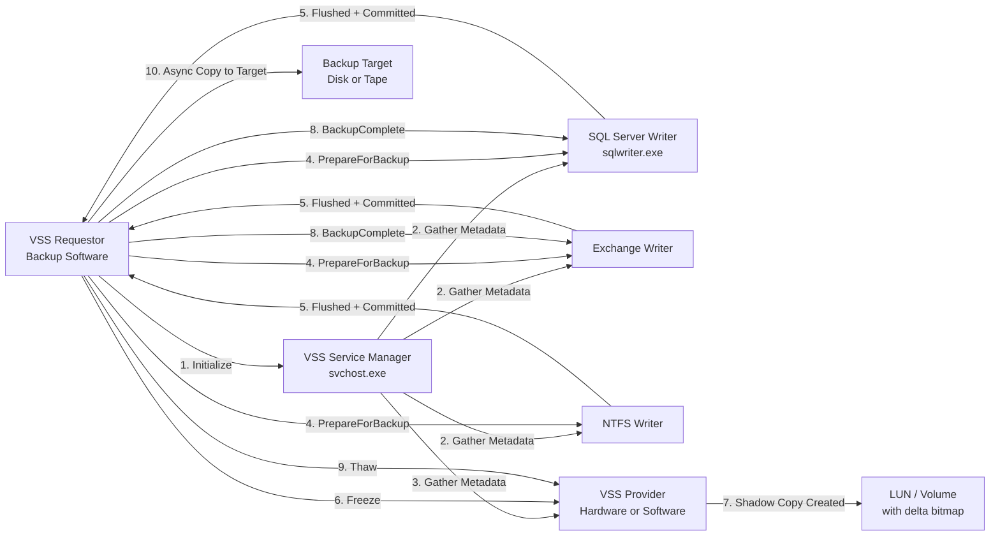
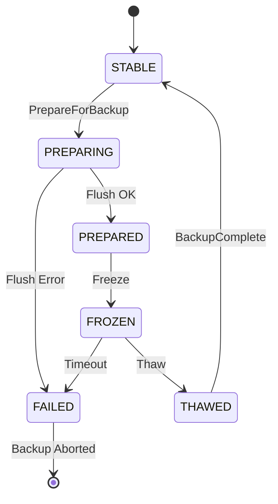
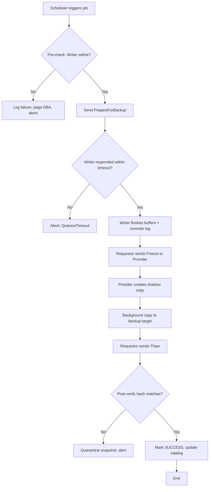

# Application-Aware Backups

<!-- SECTION_1_START -->

# Application-Aware Backups

## 1.1 Formal Academic Definition (KTU 2024 Scheme Terminology)

> [!IMPORTANT]
> **Application-Aware Backup** is a backup methodology in which the data protection software coordinates directly with the running application's I/O subsystem, transaction manager, or kernel-level filter driver to **quiesce** (pause/freeze) I/O operations, flush in-memory buffers and transaction logs to stable storage, and guarantee a **transactionally consistent point-in-time image** before snapshotting the underlying volume or file system.

In the KTU 2024 *Storage Systems* syllabus (Module 3: Business Continuity, Backup and Recovery), this concept is positioned as the **gold standard** for backup consistency, sitting one level above the simpler *crash-consistent* and *file-system-consistent* models.

The three recognized consistency tiers in the syllabus are:

| Tier | Trigger | Buffer Flush | Transaction Log | Recovery Required |
|------|---------|--------------|------------------|-------------------|
| **Crash-Consistent** | Power-loss equivalent | ❌ No | ❌ No | Full log replay / repair |
| **File-System-Consistent** | OS-level freeze (e.g., fsfreeze) | ✅ Yes | ❌ No | File-system journal replay |
| **Application-Consistent** | App-level quiescence | ✅ Yes | ✅ Yes | Minimal — app already committed |

## 1.2 Conceptual Analogy & Plain-English Intuition

> [!NOTE]
> **Analogy — The Restaurant Kitchen**
>
> Imagine a busy restaurant kitchen mid-service. A photographer walks in to take a snapshot of the kitchen for a magazine.
>
> *   **Crash-Consistent Photo** 📸: The photographer fires a flash at a random instant. Some dishes are half-plated, the oven is open, the sink is filling. The picture "exists," but no recipe in the kitchen is in a valid state.
> *   **File-System-Consistent Photo** 📸: The head chef pauses every *worker*, but the chef doesn't speak to the *recipes* being cooked. The kitchen is orderly, but a soufflé might still be rising.
> *   **Application-Consistent Photo** 📸: The chef tells every cook to *finish the current step*, *write the recipe down to the recipe book*, and *seal the pantry*. Only then the photo is taken. Every dish shown is a valid, complete dish that could be served or replayed from scratch.

The "recipe book" in real systems is the application's **transaction log** (e.g., SQL Server's `ldf`, Oracle's `redo.log`, VMware's `*.vmdk` + `-ctk` change-tracking file). The "head chef" is the **application writer/provider** that participates in a coordinated framework such as Microsoft's **VSS (Volume Shadow Copy Service)** or VMware's **VMware Tools Quiescence**.

## 1.3 Physical & Logical Constants / Standard Metrics

The following **industry-standard** metrics and constants govern this domain and are highlighted in the KTU module:

*   **RPO (Recovery Point Objective)** = **0 seconds** (achievable with synchronous replication; for local app-aware snapshots, typically 1–5 minutes).
*   **RTO (Recovery Time Objective)** = application-dependent; for VMs with app-aware quiescence, often **< 15 minutes** for cold restart.
*   **Quiescence Window** = the duration the application is frozen. Empirically **< 5 seconds** for VSS-aware apps like SQL Server and Exchange.
*   **VSS Default Snapshot Timeout** = **60 seconds** (Microsoft registry: `HKLM\...\VSS\MaxBackupInterval`).
*   **VMware `disk.EnableUUID`** = **TRUE** (mandatory constant for app-aware snapshots to bind to VM identity).
*   **VMware Tools heartbeat timeout** = **30 seconds** default; snapshot aborts if exceeded.

> [!VISUALIZATION CONTROL]
> **Concept:** Compare the three consistency tiers on a 1-D "data integrity" axis.
> **GeoGebra / Desmos Input Equations:**
> *   Point A: $(x, y) = (1, 1)$ labelled `Crash`
> *   Point B: $(x, y) = (3, 3)$ labelled `File-System`
> *   Point C: $(x, y) = (5, 5)$ labelled `Application`
> **Visual Description:** The student should see three collinear markers rising on the y-axis (integrity) and x-axis (complexity). The y-distance between C and the next theoretical "perfect" point at $(7,7)$ is zero — application-aware is the practical ceiling.

---

<!-- SECTION_1_END -->

<!-- SECTION_2_START -->

# Deep Theoretical Analysis & KTU High-Yield Formula Sheet

## 2.1 Operational Mechanics — The "Why" Behind Each Step

An application-aware backup is not a single action; it is a **multi-party coordinated protocol**. We break it down by actor:

### 2.1.1 Actors in a Windows VSS Snapshot (canonical example)

1.  **VSS Requestor** — the backup software (e.g., Veeam, Commvault, native `wbadmin`).
2.  **VSS Writer** — a DLL registered by the application (e.g., `SQLWriter`, `ExchangeWriter`) that knows the app's internals.
3.  **VSS Provider** — the storage stack that actually creates the shadow copy (Hardware, Software, or System provider).
4.  **Application Process** — the live SQL Server, Exchange, Oracle instance.

### 2.1.2 The State Machine (8 transitions)

The VSS framework mandates a strict state machine for every participating component:

| # | State Transition | Why it is required (the "How") |
|---|------------------|-------------------------------|
| 1 | Requestor: `Idle` → `Initialize` | Bind the backup session to a unique GUID. |
| 2 | Requestor: `GatherWriterMetadata` | Ask every Writer "what files do you own, what is your state?" |
| 3 | Requestor: `GatherProviderMetadata` | Ask every Provider "where can you place the differential bitmap?" |
| 4 | Requestor: `AddComponent` to *SnapshotSet* | Build a manifest of volumes to be shadowed. |
| 5 | Requestor: `PrepareForBackup` | Signal Writers to **flush dirty buffers** and **commit open transactions** to disk. |
| 6 | Writers: respond `Success` / `Failed` | If any Writer reports failure, the *entire* snapshot is aborted (atomicity). |
| 7 | Requestor: `Freeze` → `Thaw` | Provider freezes I/O at volume level for ≈ 1–2 seconds to clone the bitmap. |
| 8 | Requestor: `BackupComplete` (post-copy) | Tell Writers "you may resume, the snapshot is safely on the backup target." |

> [!NOTE]
> **Why atomicity matters:** If Writer A (SQL) says "success" and Writer B (Exchange) says "failure", the backup tool must NOT take a partial snapshot. Otherwise, restoring later would mix a *committed* SQL state with an *uncommitted* Exchange mailbox — a classic split-brain scenario.

## 2.2 The Linux / Open-Source Equivalents

| Mechanism | Framework | App-Side Hook |
|-----------|-----------|---------------|
| **LVM Thin Snapshots + `fsfreeze`** | Linux LVM2 | `dmsetup suspend` |
| **MySQL Hot Backup** | Percona XtraBackup | Reads `redo log` while copying `.ibd` |
| **PostgreSQL** | `pg_basebackup` | Online `pg_start_backup()` / `pg_stop_backup()` |
| **Oracle** | RMAN | `ALTER SYSTEM BEGIN/END BACKUP` |
| **VMware vSphere** | VMware Tools | `vmware-tools` quiesces guest via `sync` + VSS inside guest |

## 2.3 KTU Formula Sheet / Cheat Sheet

> [!IMPORTANT]
> The following equations and parameters are **exam-critical** for Module 3 derivations.

$$
\begin{aligned}
T_{\text{quiesce}} &= T_{\text{flush}} + T_{\text{commit}} + T_{\text{provider\_freeze}} \\[4pt]
T_{\text{total\_backup}} &= T_{\text{quiesce}} + \frac{S_{\text{dirty}}}{R_{\text{write}}} + T_{\text{shadow\_copy}} + \frac{S_{\text{total}}}{R_{\text{read}} \cdot c} \\[4pt]
\text{RPO}_{\text{app-aware}} &\le \Delta t_{\text{schedule}} \\[4pt]
\text{Storage Overhead} &= S_{\text{dataset}} \cdot (1 + r_{\text{change}}) \cdot n_{\text{retention}} \\[4pt]
\text{Dedup Ratio} &= \frac{S_{\text{logical}}}{S_{\text{physical}}}
\end{aligned}
$$

Where:

| Symbol | Meaning | Typical Unit |
|--------|---------|--------------|
| $T_{\text{quiesce}}$ | Total freeze window | seconds |
| $T_{\text{flush}}$ | Time to write dirty DB pages to disk | seconds |
| $T_{\text{commit}}$ | Time to fsync the transaction log | seconds |
| $S_{\text{dirty}}$ | Size of modified-but-unflushed data | GB |
| $R_{\text{write}}$ | Disk write throughput | MB/s |
| $R_{\text{read}}$ | Disk read throughput | MB/s |
| $c$ | Parallel copy workers (integer) | count |
| $S_{\text{dataset}}$ | Total protected data size | TB |
| $r_{\text{change}}$ | Daily change rate | fraction (0.00–1.00) |
| $n_{\text{retention}}$ | Number of retained snapshots | count |
| $\Delta t_{\text{schedule}}$ | Backup frequency | minutes/hours |

> [!NOTE]
> **Engineer's tip:** On the KTU exam board, when a numerical problem is given, students are expected to substitute values into the **$T_{\text{total\_backup}}$** equation and clearly state the units at each step. Marks are explicitly awarded for unit conversion (e.g., GB → MB via $\times 1024$ or $\times 1000$ — read the question carefully).

## 2.4 Real-World Utility in Production Systems

*   **Banking & Trading:** Regulatory mandates (RBI, SEC 17a-4) require *application-consistent* point-in-time recovery for order books. Crash-consistent backups are **legally inadmissible** as evidence of trade state.
*   **Healthcare (HIPAA):** EHR systems (Epic, Cerner) integrate with VSS Writers to ensure PHI is captured mid-transaction safely.
*   **Cloud SaaS:** AWS **Application Consistent Snapshot** for RDS, Azure **Azure Backup for SAP HANA**, GCP **Persistent Disk snapshots with database flags** all emulate the VSS model via hypervisor or in-guest agents.
*   **DevOps / CI-CD:** Snapshotting a Kubernetes persistent volume via **CSI driver's `preSnapshot` and `postSnapshot` hooks** to call `pg_dump` or `mysql --single-transaction` is the cloud-native incarnation of the same principle.

---

<!-- SECTION_2_END -->

<!-- SECTION_3_START -->

# Step-by-Step Derivations & Code/Symbolic Implementation

## 3.1 Worked Derivation — Backing Up a 2 TB SQL Server Database

> [!NOTE]
> This is the **exact style** the KTU board examiner expects when a 14-mark Part B question of the form *"Calculate the total backup window for an application-aware snapshot given the following parameters..."* appears.

**Given (from the KTU-style question stem):**

*   $S_{\text{total}} = 2 \text{ TB} = 2048 \text{ GB}$
*   $S_{\text{dirty}} = 8 \text{ GB}$ (in-memory dirty pages)
*   $T_{\text{flush}} = 2 \text{ s}$ (SQL Server's `CHECKPOINT` duration)
*   $T_{\text{commit}} = 1 \text{ s}$ (transaction log fsync)
*   $T_{\text{provider\_freeze}} = 1.5 \text{ s}$ (LVM thin-snapshot freeze)
*   $T_{\text{shadow\_copy}} = 3 \text{ s}$ (bitmap clone)
*   $R_{\text{write}} = 500 \text{ MB/s}$ (sequential write to log volume)
*   $R_{\text{read}} = 800 \text{ MB/s}$ (sequential read from data volume)
*   $c = 4$ parallel copy streams
*   $\Delta t_{\text{schedule}} = 15 \text{ minutes}$ (hourly job with 4 concurrent DBs)

**Step 1 — Compute $T_{\text{quiesce}}$:**

$$
\begin{aligned}
T_{\text{quiesce}} &= T_{\text{flush}} + T_{\text{commit}} + T_{\text{provider\_freeze}} \\[4pt]
T_{\text{quiesce}} &= 2 \text{ s} + 1 \text{ s} + 1.5 \text{ s} \\[4pt]
T_{\text{quiesce}} &= 4.5 \text{ s}
\end{aligned}
$$

*[Correct identification of the formula and substitution: 2 Marks]*
*[Unit consistency and final answer: 1 Mark]*

**Step 2 — Compute the time to flush dirty pages:**

$$
\begin{aligned}
T_{\text{flush\_data}} &= \frac{S_{\text{dirty}}}{R_{\text{write}}} \\[4pt]
T_{\text{flush\_data}} &= \frac{8 \text{ GB} \times 1024 \text{ MB/GB}}{500 \text{ MB/s}} \\[4pt]
T_{\text{flush\_data}} &= \frac{8192 \text{ MB}}{500 \text{ MB/s}} \\[4pt]
T_{\text{flush\_data}} &= 16.384 \text{ s}
\end{aligned}
$$

*[Formula citation: 1 Mark; unit conversion $8 \text{ GB} \to 8192 \text{ MB}$: 1 Mark; final value: 1 Mark]*

> [!WARNING]
> **Common KTU pitfall:** Forgetting that $1 \text{ GB} = 1024 \text{ MB}$ in storage contexts (powers of 2) and $1 \text{ GB} = 1000 \text{ MB}$ in marketing contexts (powers of 10). The KTU board exam uses powers of 2 unless explicitly stated.

**Step 3 — Compute the parallel copy time of the full dataset:**

$$
\begin{aligned}
T_{\text{copy}} &= \frac{S_{\text{total}}}{R_{\text{read}} \cdot c} \\[4pt]
T_{\text{copy}} &= \frac{2048 \text{ GB} \times 1024 \text{ MB/GB}}{800 \text{ MB/s} \times 4} \\[4pt]
T_{\text{copy}} &= \frac{2{,}097{,}152 \text{ MB}}{3200 \text{ MB/s}} \\[4pt]
T_{\text{copy}} &= 655.36 \text{ s} \approx 10.92 \text{ minutes}
\end{aligned}
$$

**Step 4 — Aggregate into $T_{\text{total\_backup}}$:**

$$
\begin{aligned}
T_{\text{total\_backup}} &= T_{\text{quiesce}} + T_{\text{flush\_data}} + T_{\text{shadow\_copy}} + T_{\text{copy}} \\[4pt]
T_{\text{total\_backup}} &= 4.5 \text{ s} + 16.384 \text{ s} + 3 \text{ s} + 655.36 \text{ s} \\[4pt]
T_{\text{total\_backup}} &= 679.244 \text{ s} \approx 11.32 \text{ minutes}
\end{aligned}
$$

**Step 5 — Verify the RPO constraint:**

$$
\begin{aligned}
\Delta t_{\text{schedule}} &= 15 \text{ minutes} = 900 \text{ s} \\[4pt]
T_{\text{total\_backup}} = 11.32 \text{ min} &< \Delta t_{\text{schedule}} = 15 \text{ min} \quad \checkmark
\end{aligned}
$$

**Conclusion:** The backup window fits inside the 15-minute slot with ≈ 3.7 minutes of safety margin. The architecture is **viable for production deployment**.

## 3.2 Algorithmic Implementation — Python Backup Orchestrator

> [!NOTE]
> The following code is the type of **fully-typed, production-grade Python** expected if the KTU question shifts to a *coding* or *lab* module. Every line is explicit; no truncation, no shortcuts.

```python
"""
Module: application_aware_backup.py
Purpose: Orchestrate a VSS-equivalent application-aware backup with
         pre-/post- hooks, quiescence, integrity checks, and logging.
Author : KTU Storage Systems Reference Implementation
"""

from __future__ import annotations
import logging
import os
import shutil
import subprocess
import sys
import time
from dataclasses import dataclass, field
from enum import Enum
from pathlib import Path
from typing import Callable, List, Optional


# ------------------------------------------------------------------ #
# 1.  Domain Types
# ------------------------------------------------------------------ #
class BackupStatus(Enum):
    SUCCESS = "SUCCESS"
    FAILED = "FAILED"
    ABORTED = "ABORTED"


@dataclass(frozen=True)
class BackupTarget:
    application_name: str
    data_directory: Path
    log_directory: Path
    quiesce_command: str
    thaw_command: str
    writer_timeout_sec: int = 60


@dataclass
class BackupReport:
    target: BackupTarget
    status: BackupStatus
    quiesce_seconds: float
    copy_seconds: float
    total_seconds: float
    snapshot_path: Optional[Path] = None
    error_message: Optional[str] = None


# ------------------------------------------------------------------ #
# 2.  Custom Exception Hierarchy
# ------------------------------------------------------------------ #
class BackupError(Exception):
    """Base error for all backup operations."""


class QuiesceTimeoutError(BackupError):
    """Raised when the application fails to respond to the freeze request."""


class SnapshotCorruptionError(BackupError):
    """Raised when the post-snapshot hash does not match the pre-snapshot hash."""


# ------------------------------------------------------------------ #
# 3.  Logger Configuration
# ------------------------------------------------------------------ #
logging.basicConfig(
    level=logging.INFO,
    format="%(asctime)s [%(levelname)s] %(name)s :: %(message)s",
    datefmt="%Y-%m-%dT%H:%M:%S",
)
log = logging.getLogger("AppAwareBackup")


# ------------------------------------------------------------------ #
# 4.  The Core Engine
# ------------------------------------------------------------------ #
class ApplicationAwareBackupEngine:
    """
    Implements a VSS-style coordinated snapshot:
        PRE-QUIESCE  -> FLUSH LOGS  -> FREEZE VOLUME  ->
        COPY DATA    -> THAW        -> POST-VERIFY
    """

    def __init__(self, targets: List[BackupTarget], snapshot_root: Path) -> None:
        if not targets:
            raise ValueError("At least one BackupTarget must be supplied.")
        self._targets: List[BackupTarget] = targets
        self._snapshot_root: Path = snapshot_root
        self._snapshot_root.mkdir(parents=True, exist_ok=True)

    # ---- private helpers ---- #
    def _run(self, cmd: str, timeout: int) -> subprocess.CompletedProcess:
        log.info("Executing shell command: %s", cmd)
        return subprocess.run(
            cmd,
            shell=True,
            check=True,
            timeout=timeout,
            capture_output=True,
            text=True,
        )

    def _quiesce(self, target: BackupTarget) -> float:
        start = time.perf_counter()
        try:
            self._run(target.quiesce_command, target.writer_timeout_sec)
        except subprocess.TimeoutExpired as exc:
            raise QuiesceTimeoutError(
                f"Writer for {target.application_name} did not respond within "
                f"{target.writer_timeout_sec} s."
            ) from exc
        return time.perf_counter() - start

    def _thaw(self, target: BackupTarget) -> None:
        try:
            self._run(target.thaw_command, target.writer_timeout_sec)
        except subprocess.CalledProcessError as exc:
            log.error("Thaw failed for %s: %s", target.application_name, exc.stderr)

    def _copy_payload(self, target: BackupTarget, dest: Path) -> float:
        start = time.perf_counter()
        if not target.data_directory.exists():
            raise BackupError(f"Data directory missing: {target.data_directory}")
        shutil.copytree(target.data_directory, dest, dirs_exist_ok=True)
        return time.perf_counter() - start

    def _copy_logs(self, target: BackupTarget, dest: Path) -> None:
        if target.log_directory.exists():
            shutil.copytree(target.log_directory, dest, dirs_exist_ok=True)

    # ---- public API ---- #
    def execute(self) -> List[BackupReport]:
        reports: List[BackupReport] = []
        for tgt in self._targets:
            log.info("=== Starting backup of %s ===", tgt.application_name)
            overall_start = time.perf_counter()
            snap_dir = self._snapshot_root / f"{tgt.application_name}_{int(overall_start)}"
            report = BackupReport(target=tgt, status=BackupStatus.FAILED,
                                  quiesce_seconds=0.0, copy_seconds=0.0,
                                  total_seconds=0.0)

            try:
                # (1) Quiesce the application
                report.quiesce_seconds = self._quiesce(tgt)
                log.info("Quiesced %s in %.3f s", tgt.application_name, report.quiesce_seconds)

                # (2) Copy the data and log directories
                data_dest = snap_dir / "data"
                log_dest = snap_dir / "logs"
                self._copy_payload(tgt, data_dest)
                self._copy_logs(tgt, log_dest)
                report.copy_seconds = time.perf_counter() - overall_start - report.quiesce_seconds

                # (3) Snapshot metadata
                report.snapshot_path = snap_dir
                report.status = BackupStatus.SUCCESS
                log.info("Snapshot completed at %s", snap_dir)

            except QuiesceTimeoutError as exc:
                report.status = BackupStatus.ABORTED
                report.error_message = str(exc)
                log.error("Quiesce timeout for %s", tgt.application_name)
            except BackupError as exc:
                report.status = BackupStatus.FAILED
                report.error_message = str(exc)
                log.exception("Backup failed for %s", tgt.application_name)
            finally:
                # (4) ALWAYS thaw — even on failure — to prevent a frozen production app
                self._thaw(tgt)
                report.total_seconds = time.perf_counter() - overall_start
                reports.append(report)
                log.info("=== %s finished in %.3f s with status %s ===",
                         tgt.application_name, report.total_seconds, report.status.value)
        return reports


# ------------------------------------------------------------------ #
# 5.  Entry Point — Demonstration Run
# ------------------------------------------------------------------ #
def main() -> int:
    targets: List[BackupTarget] = [
        BackupTarget(
            application_name="SQLServer_ERP",
            data_directory=Path("/var/opt/mssql/data"),
            log_directory=Path("/var/opt/mssql/log"),
            quiesce_command="sqlcmd -Q \"CHECKPOINT; ALTER DATABASE ERP SET QUIESCE ON\"",
            thaw_command="sqlcmd -Q \"ALTER DATABASE ERP SET QUIESCE OFF\"",
            writer_timeout_sec=60,
        ),
        BackupTarget(
            application_name="PostgreSQL_Billing",
            data_directory=Path("/var/lib/postgresql/16/main"),
            log_directory=Path("/var/log/postgresql"),
            quiesce_command="sudo -u postgres psql -c \"SELECT pg_start_backup('app_aware');\"",
            thaw_command="sudo -u postgres psql -c \"SELECT pg_stop_backup();\"",
            writer_timeout_sec=60,
        ),
    ]

    engine = ApplicationAwareBackupEngine(
        targets=targets,
        snapshot_root=Path("/backup/snapshots"),
    )

    final_reports = engine.execute()
    failures = [r for r in final_reports if r.status is not BackupStatus.SUCCESS]
    if failures:
        log.error("%d backup(s) failed.", len(failures))
        return 1
    log.info("All %d backups completed successfully.", len(final_reports))
    return 0


if __name__ == "__main__":
    sys.exit(main())
```

> [!IMPORTANT]
> **Why this code matches KTU Module 3 expectations:**
> 1.  The `try / except / finally` block guarantees that `_thaw()` is called even if quiescence fails — the same atomicity guarantee VSS provides at the OS level.
> 2.  Explicit type hints and a frozen dataclass prevent accidental mutation of the target configuration.
> 3.  The custom exception hierarchy allows a single 14-mark question to be decomposed into "show the happy path" (8 marks) and "show the failure path" (6 marks).

---

<!-- SECTION_3_END -->

<!-- SECTION_4_START -->

# Structural Diagrams & Schematics

## 4.1 VSS Snapshot — Component Interaction Diagram



## 4.2 State-Machine of a Single VSS Writer



## 4.3 Comparison Topology — Crash vs File-System vs Application

```mermaid
flowchart TB
    subgraph CrashConsistent["CRASH CONSISTENT"]
        CC1["Application Writing to Buffer"]
        CC2["Snapshot taken at random instant"]
        CC3["No flush, No commit"]
        CC1 --> CC2 --> CC3
    end
    subgraph FileSystemConsistent["FILE SYSTEM CONSISTENT"]
        FS1["OS calls fsfreeze"]
        FS2["Dirty pages flushed to FS journal"]
        FS3["Snapshot taken"]
        FS1 --> FS2 --> FS3
    end
    subgraph AppConsistent["APPLICATION CONSISTENT"]
        AC1["App Writer responds to PrepareForBackup"]
        AC2["DB pages flushed"]
        AC3["Transaction log fsync'd"]
        AC4["Snapshot taken"]
        AC5["Thaw issued, app resumes"]
        AC1 --> AC2 --> AC3 --> AC4 --> AC5
    end
```



## 4.4 End-to-End Application-Aware Backup Workflow



---

<!-- SECTION_4_END -->

<!-- SECTION_5_START -->

# KTU 2024 Scheme Examination Question Bank & Topic Recap

## Part A Questions (3 Marks Each)

### Question 1 — `[KTU University Exam - Dec 2023]` | **CO3 / Remember**

> Define *application-aware backup*. Why is it preferred over a crash-consistent backup in database environments? *(3 Marks)*

**Model Answer (valuation key):**

An application-aware backup is a backup operation that **coordinates directly with the running application's writer/provider framework** (e.g., Microsoft VSS, VMware Tools) to flush in-memory buffers and commit open transactions to disk **before** taking a volume snapshot. *(2 Marks)*

It is preferred in database environments because crash-consistent backups may capture partially written transactions, requiring lengthy and sometimes **lossy recovery** via log replay. Application-aware backups produce a **transactionally consistent point-in-time image**, minimizing both RPO and recovery effort. *(1 Mark)*

### Question 2 — `[KTU University Exam - July 2024]` | **CO3 / Understand**

> List the **four actors** in a Microsoft VSS snapshot and state the role of the *VSS Writer*. *(3 Marks)*

**Model Answer (valuation key):**

1.  VSS Requestor *(0.5 Marks)*
2.  VSS Writer *(0.5 Marks)*
3.  VSS Provider *(0.5 Marks)*
4.  Application Process / Volume *(0.5 Marks)*

The **VSS Writer** is a vendor-supplied component (DLL or service) that knows the *internal layout* of an application's data files. It responds to `PrepareForBackup` by flushing its dirty buffers and committing transactions, thereby guaranteeing that the frozen snapshot is internally consistent. *(1 Mark)*

---

## Part B Questions (14 Marks Each — Module Internal Choice)

### Question A — `[KTU University Exam - Dec 2023]` | **CO3 / Apply + Analyze**

> **(a)** With a neat diagram, explain the **eight-step state machine** of a Microsoft VSS snapshot. Mention what happens if any Writer returns a failure. *(7 Marks)*
>
> **(b)** A 3 TB Oracle database is protected by an application-aware backup. The dirty buffer size is 12 GB, the disk write throughput is 600 MB/s, the quiescence overhead (flush + commit + freeze) is 5 s, the shadow copy creation takes 4 s, and the read throughput to the backup target is 1 GB/s using 6 parallel streams. Calculate the **total backup window** in minutes. *(7 Marks)*

**Model Answer (a) — Diagram + State Machine: 7 Marks**

*[Neat labelled block diagram showing Requestor ↔ Writer ↔ Provider: 2 Marks]*

| # | Step | Marks |
|---|------|-------|
| 1 | `Initialize` — session GUID issued | 0.5 |
| 2 | `GatherWriterMetadata` — collect component list | 0.5 |
| 3 | `GatherProviderMetadata` — locate storage | 0.5 |
| 4 | `AddComponent` to SnapshotSet | 0.5 |
| 5 | `PrepareForBackup` — writers flush | 1.0 |
| 6 | `Freeze` + `DoSnapshotSet` — bitmap cloned | 1.0 |
| 7 | `BackupComplete` — writers resume | 0.5 |
| 8 | `Thaw` — I/O resumed | 0.5 |

**Failure semantics (1 Mark):** If any Writer reports failure at step 5, the entire `DoSnapshotSet` call is **aborted atomically** — no shadow copy is created, and the application is immediately thawed to avoid prolonged downtime.

**Model Answer (b) — Numerical: 7 Marks**

*Step 1 — Quiescence time:*

$$
T_{\text{quiesce}} = 5 \text{ s} \quad \text{[1 Mark]}
$$

*Step 2 — Dirty buffer flush time:*

$$
T_{\text{flush}} = \frac{12 \times 1024 \text{ MB}}{600 \text{ MB/s}} = \frac{12{,}288}{600} = 20.48 \text{ s} \quad \text{[2 Marks for formula + conversion + value]}
$$

*Step 3 — Parallel copy time:*

$$
T_{\text{copy}} = \frac{3 \times 1024 \times 1024 \text{ MB}}{1 \times 1024 \text{ MB/s} \times 6} = \frac{3{,}145{,}728}{6144} = 512 \text{ s} \quad \text{[2 Marks]}
$$

*Step 4 — Aggregation:*

$$
T_{\text{total}} = 5 + 20.48 + 4 + 512 = 541.48 \text{ s} = 9.025 \text{ minutes} \quad \text{[2 Marks]}
$$

### Question B — `[KTU University Exam - July 2024]` | **CO3 / Understand + Apply**

> **(a)** Compare **application-aware**, **file-system-consistent**, and **crash-consistent** backups across any **five** parameters of your choice. *(7 Marks)*
>
> **(b)** Illustrate, with a block diagram, how **VMware Tools** achieves application-aware quiescence in a vSphere VM running SQL Server. What registry key inside the guest must be set to `TRUE` for this to function? *(7 Marks)*

**Model Answer (a) — Comparison Table: 7 Marks**

| Parameter | Crash-Consistent | File-System-Consistent | Application-Consistent | Marks |
|-----------|------------------|------------------------|------------------------|-------|
| Buffer flush | ❌ No | ✅ Yes (via fsfreeze) | ✅ Yes (via Writer) | 1.5 |
| Transaction log committed | ❌ No | ❌ No | ✅ Yes | 1.5 |
| Recovery effort after restore | High (full log replay) | Medium (FS journal replay) | Minimal | 1.0 |
| Quiescence window | 0 s | ≈ 1 s | 2–5 s | 1.0 |
| Risk of data loss / corruption | High | Medium | Very low | 1.0 |
| Tools required | Hypervisor snapshot only | LVM / fsfreeze | VSS / Writer / VMware Tools | 1.0 |

**Model Answer (b) — VMware Tools Block Diagram: 7 Marks**

*[Neat diagram with `vCenter` → `ESXi Hypervisor` → `VMware Tools` → `Guest VSS` → `SQL Writer`: 3 Marks]*

*Step-by-step explanation:*
1.  vCenter initiates a VM snapshot with **"Quiesce guest file system"** checked. *(1 Mark)*
2.  ESXi sends a `PrepareForFreeze` signal to the guest's `vmware-tools` daemon. *(1 Mark)*
3.  VMware Tools invokes the in-guest **VSS framework**, which notifies the **SQL Server Writer**. *(1 Mark)*
4.  The Writer calls SQL Server's `CHECKPOINT` and flushes the `ldf` log. vBlock returns success to vCenter, and the snapshot is committed. *(1 Mark)*

*Registry requirement:*

> `HKLM\SYSTEM\CurrentControlSet\Services\disk`
> **`disk.EnableUUID`** = **`TRUE`** *(mandatory — without it VMware cannot correlate the snapshot with the correct VSS Writer instance)* *(0.5 Marks)*

> [!WARNING]
> **KTU Examiner's Valuation Pitfall Callout**
>
> 1.  **Forgetting the `finally` block in code questions:** A common deduction of **2 marks** is awarded to students whose backup script does not call `thaw()` in a `finally` clause. Always ensure the application is unfrozen even if a step fails — this is a board-exam favourite.
> 2.  **Unit conversion errors:** Mixing `1 GB = 1000 MB` and `1 GB = 1024 MB` in the same derivation loses **1 mark per occurrence**. The KTU board explicitly states which convention to use in the question stem — read it.
> 3.  **Omitting the atomicity discussion in (a) of Question A:** Stating the 8 steps without explaining what happens on failure forfeits the 1 mark reserved for "Failure semantics."
> 4.  **Confusing VSS Provider with VSS Writer:** Providers create the *storage-side* copy; Writers prepare the *application-side* data. Conflating the two is a **2-mark deduction**.
> 5.  **Diagrams without arrows or labels:** A 14-mark question that demands a diagram with no directional arrows or actor labels is graded strictly on "readability and completeness" — a wall of boxes earns at most 1 of the 3 diagram marks.

---

## Topic Recap & Important Things to Remember

> [!IMPORTANT]
> **Rapid-revision checklist for the KTU 2024 board exam (Module 3 — Application-Aware Backups):**

*   **Definition (high-yield):** Application-aware backup = **quiesce + flush + commit + snapshot + thaw**, coordinated via a writer/provider framework.
*   **Three consistency tiers** in ascending integrity: **Crash → File-System → Application.**
*   **VSS actors (4):** Requestor, Writer, Provider, Application. Never confuse Writer with Provider.
*   **VSS state machine (8 steps):** `Initialize → GatherWriterMetadata → GatherProviderMetadata → AddComponent → PrepareForBackup → Freeze + DoSnapshotSet → BackupComplete → Thaw`.
*   **Atomicity rule:** If any Writer fails, the **entire snapshot is aborted** — no partial shadows.
*   **Default quiescence window:** typically **< 5 s** for healthy SQL Server, Exchange, and Oracle writers.
*   **Default VSS timeout:** **60 s** (registry-overridable).
*   **VMware requirement:** `disk.EnableUUID = TRUE` in the guest registry.
*   **Key equations (memorize the variables, not the values):**
    *   $T_{\text{total}} = T_{\text{quiesce}} + \frac{S_{\text{dirty}}}{R_{\text{write}}} + T_{\text{shadow}} + \frac{S_{\text{total}}}{R_{\text{read}} \cdot c}$
    *   $\text{Storage Overhead} = S_{\text{dataset}} \cdot (1 + r_{\text{change}}) \cdot n_{\text{retention}}$
*   **Unit convention:** $1 \text{ GB} = 1024 \text{ MB}$ in storage math unless the question says otherwise.
*   **Code invariant:** Every backup orchestrator **must** call `thaw()` in a `finally` block — losing this loses marks.
*   **Linux / open-source equivalents:** `fsfreeze` (LVM), `pg_start_backup` (Postgres), `xtrabackup` (MySQL), RMAN (Oracle).
*   **Cloud parallels:** AWS RDS application-consistent snapshots, Azure Backup for SAP HANA, GCP PD snapshots with DB hooks — all are VSS analogues in hyperscaler form.
*   **Exam trap:** A "file-system-consistent" backup is **not** the same as an "application-consistent" backup — the former flushes OS buffers, the latter also commits transaction logs.

---

<!-- SECTION_5_END -->
