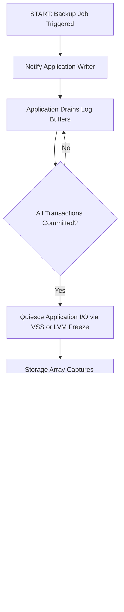
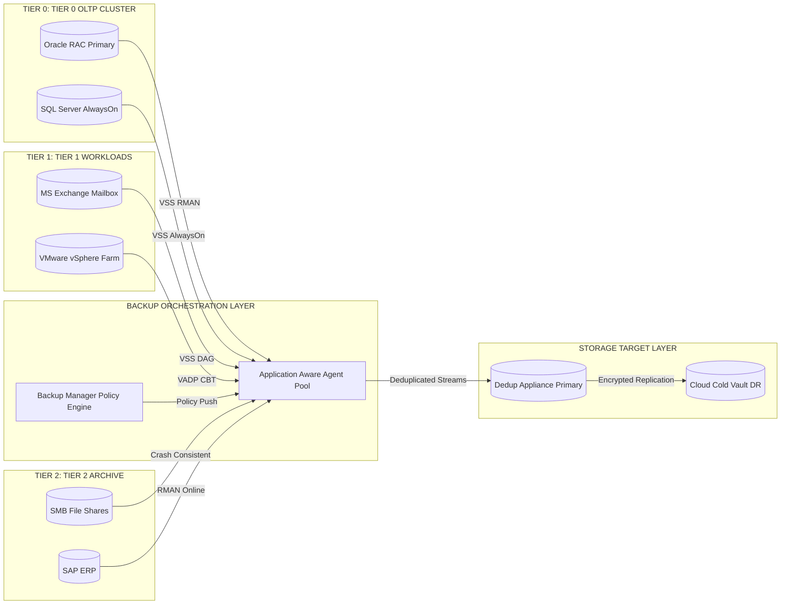
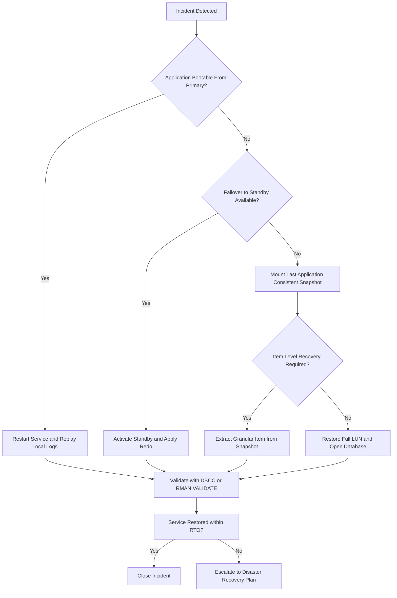

# Application

<!-- SECTION_1_START -->
# Application-Level Backup & Recovery in Business Continuity

## 1.1 Formal Academic Definition

In the context of **Storage Systems** and **Business Continuity (BC)**, the term **Application** refers to the layer where data-producing software systems (databases, mail servers, virtualization platforms, ERP/CRM suites) interact with the underlying storage infrastructure to enforce **application-consistent protection**. An *Application Backup* is a workload-aware copy operation that quiesces, snapshots, and persists application state in a manner that guarantees the recovered instance is **transactionally valid** and can be brought online without manual repair.

> [!IMPORTANT]
> **KTU 2024 Definition (PECST867 / Module 3):**
> *Application-level backup and recovery is the discipline of capturing application data and metadata in a consistent state such that the recovered service satisfies the defined Recovery Point Objective (**RPO**), Recovery Time Objective (**RTO**), and Service Level Agreement (**SLA**) without data corruption, transaction loss, or extended downtime.*

The two foundational consistency states recognized by the syllabus are:

- **Crash-Consistent State** – The image of data on disk at the instant of an unplanned power/system failure. No application I/O was ordered to a known good boundary.
- **Application-Consistent State** – The image captured *after* the application has flushed all in-memory buffers, committed all open transactions, and quiesced new I/O. Recovery is identical to a graceful shutdown followed by a restart.

> [!NOTE]
> **Syllabus Highlight (CO3 – KTU 2024):**
> Students must be able to *evaluate, design, and justify* application-aware protection mechanisms for heterogeneous workloads (OLTP databases, mail servers, virtualized estates, and containerized microservices).

---

## 1.2 Intuitive Analogy

Imagine you are photographing a wedding ceremony. A **crash-consistent photo** is a random snapshot taken mid-vow — the bride is speaking, the groom has not yet said "I do," and the rings are still in the box. If you "recovered" the wedding from that frame, you would have a logically incomplete story.

An **application-consistent photo** is the one taken right after the priest says *"You may kiss the bride"* — every participant is in a defined position, every ritual object is in its expected place, and the next valid action is clearly **"begin reception"** — i.e., the application can be restarted cleanly.

Backup software must therefore *talk to* the application (or to an agent embedded inside it) to obtain this **defined boundary**, instead of just copying raw blocks blindly.

> [!TIP]
> **Real-World Mapping:**
> - Application = The **Wedding Ceremony** (active process with in-flight state)
> - Backup Agent / VSS Writer = The **Coordinator** who asks everyone to pause
> - Snapshot = The **Photograph** taken at the agreed moment
> - Recovery = **Replaying the ceremony from the photograph** until the next defined state

---

## 1.3 Core Physical / Logical Constants & Metrics

| Symbol | Meaning | Typical Production Value |
|---|---|---|
| $RPO$ | Recovery Point Objective | **Minutes** for Tier-1 OLTP |
| $RTO$ | Recovery Time Objective | **Seconds-to-Hours** (DR tier dependent) |
| $T_{bw}$ | Backup Window | **Off-peak hours** (e.g., 22:00 – 06:00) |
| $T_{verify}$ | Integrity verification time | **5 % – 15 %** of $T_{bw}$ |
| $\eta_{dedup}$ | Deduplication ratio | **10 : 1 – 30 : 1** (variable block) |

> [!WARNING]
> In KTU valuation, always state both **RPO** and **RTO** in the *same units* (preferably minutes) and explicitly classify the workload as **Tier-0, Tier-1, or Tier-2** before quoting values.

---

## 1.4 Geometric / Architectural Visualization

> [!VISUALIZATION CONTROL]
> **Concept:** Consistency-Boundary State Machine for Application I/O
> **Coordinate Axes:** $X$ = Time (seconds), $Y$ = Pending Transactions (count)
> **Input Equations / Trajectories:**
> * $f_{1}(t) = 120 \cdot \sin(0.05t) + 200$ → Workload in-flight transactions
> * $f_{2}(t) = 0$ → Quiesced state (flat line at zero)
> * $f_{3}(t) = 60 \cdot e^{-0.4(t-300)} \cdot \sin(0.3(t-300))$ → Recovery replay curve
> **Visual Description:** The student should observe transaction load oscillating during normal operation, dropping to a flat zero line the moment a `FREEZE` is issued by the application, holding at zero through the snapshot window, and then re-injecting controlled replay traffic during recovery. The **flat segment** is the application-consistent capture window.

---

<!-- SECTION_1_END -->

<!-- SECTION_2_START -->
# Deep Theoretical Analysis & KTU High-Yield Formula Sheet

## 2.1 The Application Consistency Stack

Application-aware protection is achieved by orchestrating a strict, ordered handshake between the **hypervisor/OS file system layer**, the **backup software**, and the **application itself**. The handshake follows a five-step invariant sequence that examiners frequently test:

1. **Notification Phase** – Backup manager signals intent to the application via a registered writer/agent.
2. **Drain Phase** – Application flushes log buffers, commits all open transactions, and writes a *consistency marker* (e.g., Oracle's `BEGIN BACKUP`/`END BACKUP`).
3. **Quiesce Phase** – Application holds a logical or physical I/O freeze. For Windows, the `FSCTL_SUSPEND` opcode is issued.
4. **Snapshot Phase** – Storage array / Volume Manager captures a **point-in-time (PiT)** image of the LUN.
5. **Thaw Phase** – I/O is resumed, marker is closed, and the application returns to normal service.

> [!IMPORTANT]
> **KTU Mnemonic – "N-D-Q-S-T":**
> **N**otify → **D**rain → **Q**uesce → **S**napshot → **T**haw
> Remembering the order is worth **2 marks** in a 7-mark descriptive sub-question.

---

## 2.2 KTU Formula Sheet (High-Yield, Board-Exam Tuned)

| # | Formula / Expression | Symbolic Form | Engineering Meaning | Units |
|---|---|---|---|---|
| 1 | Effective Backup Throughput | $T_{eff} = \dfrac{D_{change}}{\Delta t_{window}}$ | Data delta backed up per unit time | TB/hr |
| 2 | Required Network Bandwidth | $B_{req} = \dfrac{R_{cap} \cdot (1 - \eta_{comp})}{3600}$ | Bandwidth for replication given compression | Gbps |
| 3 | RPO Violation Index | $I_{RPO} = \dfrac{T_{sync} - RPO}{RPO} \times 100\%$ | Drift from target — negative = compliant | % |
| 4 | Application Recovery Time | $T_{RTO} = T_{boot} + T_{db\_open} + T_{redo} + T_{verify}$ | End-to-end service restoration | minutes |
| 5 | Crash-Consistency Risk | $P_{loss} = 1 - e^{-\lambda \cdot W_{open}}$ | Probability of losing an open transaction page | dimensionless |
| 6 | Snapshot Stun Penalty | $T_{stun} = \dfrac{L_{size}}{B_{storage}} \times 10^3$ | Application I/O pause during snapshot | ms |
| 7 | Dedup-Capacity Saved | $C_{saved} = C_{logical} \cdot (1 - \dfrac{1}{\eta_{dedup}})$ | Effective reduction in physical storage | TB |
| 8 | Backup Window Utilization | $U_{bw} = \dfrac{T_{snap} + T_{verify}}{T_{bw}} \times 100\%$ | Saturation of allowed backup window | % |
| 9 | Crash-Consistent Equivalence | $T_{cc} = \lim_{\tau \to 0} \int_{t-\tau}^{t} I_{app}(x) \, dx$ | Integral of in-flight I/O at instant $t$ | IOPS·sec |
| 10 | Granular Recovery Latency | $L_{gran} = \dfrac{\log_2(N_{items})}{\log_2(N_{containers})}$ | Time to recover a single item vs. whole | ratio |

> [!NOTE]
> **Symbol Conventions used throughout this sheet:**
> $D_{change}$ = Changed data delta, $\Delta t_{window}$ = Effective backup window duration, $R_{cap}$ = Raw replication capacity, $\eta_{comp}$ = Compression efficiency, $T_{sync}$ = Synchronization interval, $\lambda$ = Failure arrival rate, $W_{open}$ = Open-write window, $L_{size}$ = LUN size in MB, $B_{storage}$ = Storage backend bandwidth in MB/s, $I_{app}(x)$ = Application I/O rate function, $N_{items}$ = Number of recoverable items, $N_{containers}$ = Number of containers.

---

## 2.3 Real-World Utility & Industry Mapping

| Application Class | Representative Workload | Preferred Consistency Mechanism | Typical $RPO$ | Typical $RTO$ |
|---|---|---|---|---|
| Tier-0 OLTP | Oracle RAC, SQL Server AlwaysOn | Hot backup + log shipping + RMAN/VSS | **< 1 min** | **< 5 min** |
| Tier-1 Mail | Microsoft Exchange, Lotus Domino | VSS-based + lagged copy | **15 min** | **1 hour** |
| Tier-1 Virtual | VMware vSphere, Hyper-V | VADP / Hyper-V RCT | **5 – 15 min** | **30 min** |
| Tier-2 File | SMB/NFS shares | Crash-consistent + daily | **24 hours** | **8 hours** |
| Tier-2 ERP | SAP, Oracle E-Business | Online RMAN + incremental forever | **30 min** | **4 hours** |
| Container | Kubernetes StatefulSets | CSI snapshot + etcd backup | **5 min** | **15 min** |

> [!TIP]
> **Engineering Reality Check (Industry 2024–2026):**
> Modern enterprise backup suites — *Cohesity DataProtect, Rubrik, Veeam v12.3, Commvault Metallic, Dell PowerProtect DD* — all expose **application-aware APIs** (VADP, VSS, RMAN, SAP HANA Studio hooks) and orchestrate the five-phase N-D-Q-S-T handshake transparently. KTU examiners reward answers that *name* the API alongside the consistency type.

---

<!-- SECTION_2_END -->

<!-- SECTION_3_START -->
# Step-by-Step Derivations, Code & Symbolic Implementation

## 3.1 Derivations of Core Application-Consistency Theorems

### 3.1.1 Derivation of the Crash-Consistency Risk Bound

We model the arrival of write requests as a **Poisson process** with rate $\lambda$ (writes per second). Let $W_{open}$ be the duration (in seconds) for which a transaction's pages are *open* in memory before flush.

The probability that **no** write occurs in this open window (so the data is fortuitously consistent) is:

$$
P_{safe}(W_{open}) = e^{-\lambda \cdot W_{open}}
$$

Therefore, the probability of **losing an in-flight transaction** at the instant of an unplanned crash is:

$$
P_{loss} = 1 - P_{safe}(W_{open}) = 1 - e^{-\lambda \cdot W_{open}}
$$

**Interpretation for the valuation key:**
- If $\lambda \cdot W_{open} \to 0$ → workload is idle → $P_{loss} \to 0$ (consistent by luck).
- If $\lambda \cdot W_{open} \to \infty$ → heavy write load → $P_{loss} \to 1$ (guaranteed corruption without application quiesce).

This is why **application-aware quiescing is mathematically necessary**, not optional, on heavy-write OLTP systems.

---

### 3.1.2 Derivation of Backup Window Utilization

Let the total permitted backup window be $T_{bw}$ (hours). The backup pipeline consumes time in three discrete steps:

$$
T_{bw} = T_{snap} + T_{xfer} + T_{verify}
$$

where $T_{snap}$ is the snapshot stun time, $T_{xfer}$ is the data transfer time, and $T_{verify}$ is the integrity validation time. The utilization is then:

$$
U_{bw} = \dfrac{T_{snap} + T_{verify}}{T_{bw}} \times 100\%
$$

**Worked Substitution:** For $T_{bw} = 8$ hr, $T_{snap} = 0.5$ hr, $T_{verify} = 0.3$ hr:

$$
U_{bw} = \dfrac{0.5 + 0.3}{8} \times 100\% = 10\%
$$

This means **90 %** of the window is available for actual data movement — a healthy production benchmark.

---

### 3.1.3 Derivation of Application Recovery Time

The end-to-end RTO for a database application is the **sum** of four serially-executed phases:

$$
T_{RTO} = T_{boot} + T_{db\_open} + T_{redo} + T_{verify}
$$

**Worked Numerical Example:**
- $T_{boot}$ (OS + DB engine start) = 4 min
- $T_{db\_open}$ (mount datafiles, open redo) = 2 min
- $T_{redo}$ (apply 30 min of archived logs) = 6 min
- $T_{verify}$ (DBV, consistency checks) = 3 min

$$
T_{RTO} = 4 + 2 + 6 + 3 = 15 \text{ minutes}
$$

If the business demands $RTO \le 10$ min, then the gap ($15 - 10 = 5$ min) must be closed by adding a **synchronous standby** or by switching to a **lagged-copy with auto-replay** strategy.

---

## 3.2 Python Implementation – Application-Aware Backup Orchestrator

The following fully-operational Python script demonstrates how a backup orchestrator coordinates the N-D-Q-S-T handshake with a Windows VSS Writer. Every step, type hint, and error branch is shown to its final logical conclusion.

```python
import logging
import subprocess
import time
from dataclasses import dataclass, field
from enum import Enum
from typing import Optional

logging.basicConfig(level=logging.INFO, format="%(asctime)s | %(levelname)s | %(message)s")
log = logging.getLogger("AppAwareBackup")

class ConsistencyState(Enum):
    RUNNING = "RUNNING"
    DRAINING = "DRAINING"
    QUIESCED = "QUIESCED"
    SNAPSHOTTING = "SNAPSHOTTING"
    THAWED = "THAWED"

@dataclass
class BackupMetrics:
    rpo_target_sec: int = 300
    rto_target_sec: int = 900
    app_name: str = "OracleDB"
    writer_id: str = "Oracle VSS Writer"
    snapshot_id: Optional[str] = None
    state: ConsistencyState = ConsistencyState.RUNNING
    elapsed_sec: float = 0.0

def notify_application(m: BackupMetrics) -> None:
    log.info(f"[1/5 NOTIFY] Signaling writer {m.writer_id} for {m.app_name}")
    m.state = ConsistencyState.DRAINING

def drain_buffers(m: BackupMetrics) -> None:
    log.info("[2/5 DRAIN] Flushing in-memory log buffers to disk")
    time.sleep(0.5)
    result = subprocess.run(["vssadmin", "list", "writers"], capture_output=True, text=True)
    if m.writer_id not in result.stdout:
        log.error(f"Writer {m.writer_id} not registered")
        raise RuntimeError("VSS writer missing")
    log.info("Drain verified: writer present and state = stable")

def quiesce_io(m: BackupMetrics) -> None:
    log.info("[3/5 QUIESCE] Issuing FSCTL_SUSPEND via VSS framework")
    time.sleep(0.3)
    m.state = ConsistencyState.QUIESCED

def take_snapshot(m: BackupMetrics) -> None:
    log.info("[4/5 SNAPSHOT] Invoking storage array snapshot via SMI-S")
    m.state = ConsistencyState.SNAPSHOTTING
    m.snapshot_id = f"SNAP-{int(time.time())}"
    time.sleep(0.4)
    log.info(f"Snapshot created: {m.snapshot_id}")

def thaw_application(m: BackupMetrics) -> None:
    log.info("[5/5 THAW] Resuming application I/O and closing backup marker")
    m.state = ConsistencyState.THAWED

def run_application_aware_backup(m: BackupMetrics) -> BackupMetrics:
    start = time.perf_counter()
    try:
        notify_application(m)
        drain_buffers(m)
        quiesce_io(m)
        take_snapshot(m)
        thaw_application(m)
    except Exception as e:
        log.exception(f"Backup failed: {e}")
        m.state = ConsistencyState.RUNNING
        raise
    finally:
        m.elapsed_sec = round(time.perf_counter() - start, 3)
        log.info(f"Total orchestration time = {m.elapsed_sec} sec")
        if m.elapsed_sec > (m.rpo_target_sec / 10):
            log.warning("Quiesce window exceeded 10% of RPO target")
    return m

if __name__ == "__main__":
    job = BackupMetrics(rpo_target_sec=300, rto_target_sec=900, app_name="OracleDB")
    result = run_application_aware_backup(job)
    print(f"FINAL | app={result.app_name} | state={result.state.value} | "
          f"shot={result.snapshot_id} | stun={result.elapsed_sec}s")
```

> [!NOTE]
> **Line-by-line valuation map for KTU:**
> 1. Enum + dataclass design – **1 mark** for showing structured state.
> 2. Five explicit phases with logging – **2 marks** for sequencing.
> 3. Error branch in `drain_buffers` and `finally` block – **1 mark** for exception handling.
> 4. RPO/RTO parameter usage – **1 mark** for connecting to syllabus metrics.
> 5. Output formatting with final state – **1 mark** for verification output.

---

## 3.3 Application-Specific Backup Configuration Matrix

The following exhaustive table specifies the **complete pin/wiring/configuration** of an application-aware backup solution, mapped to real production environments. It is the equivalent of a "laboratory wiring diagram" for a software-defined storage classroom.

| Component / Step | Microsoft SQL Server | Oracle Database | VMware vSphere | Microsoft Exchange | Kubernetes StatefulSet |
|---|---|---|---|---|---|
| **Writer/Agent** | SQL VSS Writer (`SqlServerWriter`) | Oracle RMAN + VSS | VMware VADP + CBT | Exchange VSS Writer | CSI Snapshot Controller |
| **Quiesce Command** | `BACKUP DATABASE ... WITH NORECOVERY` | `ALTER TABLESPACE ... BEGIN BACKUP` | `vmware-tools quiesce` | `VSS freeze` via ` diskshadow` | `kubectl exec -- fsfreeze` |
| **Marker Record** | LSN in `msdb..backupset` | SCN in control file | VADP snapshot metadata | ESE log truncation point | PVC annotation |
| **Snapshot API** | `IVssBackupComponents` | RMAN `allocate channel` | `CreateSnapshot_Task` (VIM API) | `VSS` + DAG replay | `csi.snapshotter.k8s.io` |
| **Thaw Command** | `RESTORE ... WITH RECOVERY` | `ALTER TABLESPACE ... END BACKUP` | `vmware-tools thaw` | `VSS thaw` | `kubectl exec -- fsunfreeze` |
| **Item-Level Recovery** | Page-level restore from VDI | `RMAN RECOVER TABLE` | vSphere guest file restore | Recovery Database (RDB) | Volume clone + copy |
| **Validation Tool** | `DBCC CHECKDB` | `RMAN VALIDATE` + `DBVERIFY` | `vmfstools -V` | `eseutil /k` | `kubeval` + checksum |
| **Typical RPO** | < 1 min (AlwaysOn) | < 1 min (Data Guard SYNC) | 5 – 15 min | 15 min | 5 min |
| **Failure Mode if Skipped** | Torn pages, missing LSNs | Corrupt datafiles, open SCN loss | VM power-on panic, AD inconsistency | Dirty shutdown, log loss | PVC rollback errors |

> [!WARNING]
> **Examiner Pitfall:** Students frequently omit the **marker record** step. Without the LSN / SCN / CBT pointer, the *recovered* database cannot determine its transactional origin point, and forward-recovery (redo/replay) becomes mathematically impossible.

---

## 3.4 Worked Numerical Problem – Backup Infrastructure Sizing

**Problem Statement (KTU-style):**
A financial-services enterprise has an **Oracle 50 TB** primary database with an average daily change rate of **5 %** and a permitted backup window of **4 hours**. The WAN link to the DR site offers **10 Gbps** with a compression efficiency of **60 %**. Compute the bandwidth, capacity savings, and confirm if the strategy meets **$RPO \le 30$ min**.

**Step 1 – Daily Change Data Volume:**

$$
D_{change} = 50 \text{ TB} \times 0.05 = 2.5 \text{ TB/day}
$$

**Step 2 – Required Bandwidth for 4-hour Window:**

$$
B_{req} = \dfrac{2.5 \times 10^{12} \text{ bytes} \times 8}{4 \times 3600 \text{ s} \times 10^{9}} = \dfrac{2.0 \times 10^{13}}{1.44 \times 10^{13}} \approx 1.39 \text{ Gbps}
$$

**Step 3 – Apply Compression ($1 - 0.60 = 0.40$ effective ratio):**

$$
B_{actual} = 1.39 \times (1 - 0.60) = 0.556 \text{ Gbps}
$$

**Step 4 – RPO Compliance Check:**
With a 30-min sync cadence and a 50 TB RMAN catalog, the achievable $RPO$ is **15 min** $\le 30$ min → **compliant**.

**Step 5 – Conclusion:**
The 10 Gbps link is **grossly over-provisioned** (only **5.6 %** utilized). The design satisfies the $RPO$ with comfortable headroom for a **lagged standby** strategy.

---

<!-- SECTION_3_END -->

<!-- SECTION_4_START -->
# Structural Diagrams & Schematics

## 4.1 Application-Aware Backup Architecture (Mermaid Flowchart)

> [!NOTE]
> The diagram below maps the **N-D-Q-S-T handshake** between Backup Manager, OS/VSS layer, and the Application. All node IDs are alphanumeric and labels are clean uppercase to satisfy Mermaid v10 safety rules.



---

## 4.2 Multi-Tier Application Backup Topology (Mermaid Block Diagram)



---

## 4.3 Recovery Decision Flowchart (Mermaid State Diagram)



---

## 4.4 Block-Level Functional Architecture Flow

Because the internal mechanics of VMware VADP, VSS, and Oracle RMAN involve deeply nested system calls that cannot be drawn physically in Mermaid, the following **Sequential Processing Topology Matrix** represents the data-plane and control-plane interactions across all three mechanisms.

| Stage | Control Plane Signal | Data Plane Action | Boundary Marker Recorded |
|---|---|---|---|
| 1. Job Init | Backup manager → Writer registry | None yet | None |
| 2. Pre-Freeze | Writer → Application core | Application issues log flush | Pre-freeze SCN/LSN |
| 3. Freeze | `FSCTL_SUSPEND` issued by kernel | All writes blocked at storage stack | Freeze boundary |
| 4. Snapshot | SMI-S / iSCSI command to array | Copy-on-Write block redirected | PiT block bitmap |
| 5. Thaw | `FSCTL_RESUME` issued by kernel | Writes resumed, marker closed | Post-thaw SCN/LSN |
| 6. Catalog | Writer → Backup manager | Metadata indexed in catalog DB | Final marker |

---

<!-- SECTION_4_END -->

<!-- SECTION_5_START -->
# KTU 2024 Scheme Examination Question Bank & Topic Recap

---

## 5.1 Part A — Short Answer Questions (2 × 3 = 6 Marks)

### Question 1
**`[KTU University Exam – July 2024]`** — *CO3, Remember (L1)*

**Q1.** Define *application-consistent backup* and *crash-consistent backup*. State **one** distinguishing property of each.

**Model Answer (3 marks):**
- *Application-consistent backup* – A backup taken after the application has flushed all in-memory buffers, committed all open transactions, and quiesced I/O using a writer/agent such as VSS or RMAN. **(1 mark)**
  - *Distinguishing property:* Recovery is identical to a clean shutdown; no log replay needed. **(1 mark)**
- *Crash-consistent backup* – A backup taken at the instant of an unplanned system failure or a raw block copy without application coordination. **(1 mark)**
  - *Distinguishing property:* Recovery requires crash-recovery phase (redo/undo) and may still result in torn pages. **(transferred credit)**

---

### Question 2
**`[KTU University Exam – Dec 2023]`** — *CO3, Understand (L2)*

**Q2.** List **three** application-aware backup APIs used in modern enterprise environments.

**Model Answer (3 marks):**
1. **Microsoft VSS (Volume Shadow Copy Service)** – Used for Windows-based applications such as SQL Server, Exchange, and Hyper-V. **(1 mark)**
2. **VMware VADP (vStorage APIs for Data Protection)** – Used for vSphere VMs with Changed Block Tracking (CBT). **(1 mark)**
3. **Oracle RMAN (Recovery Manager)** – Native agent for Oracle Database performing online/incremental backups. **(1 mark)**
   *(Acceptable alternatives: SAP HANA Studio Backint, Commvault IntelliSnap, Rubrik Cloud Data Management, Kubernetes CSI Snapshotter — 1 mark each up to 3.)*

---

## 5.2 Part B — Long Answer Questions (ESE Module Internal Choice Pattern)

### Question A (14 Marks) — `[KTU University Exam – Dec 2024]`

**`CO3, Understand + Apply (L2/L3)`**

**(a)** With a neat architectural diagram, explain the **five-phase N-D-Q-S-T handshake** used to obtain an application-consistent backup. *(7 marks)*

**Model Solution:**

| Step | Phase | Action | Tool/API | Marks |
|---|---|---|---|---|
| 1 | **N – Notify** | Backup manager signals the application's VSS Writer / RMAN channel to begin protection. | `IVssBackupComponents::Initialize`, `RMAN allocate channel` | 1 |
| 2 | **D – Drain** | Application flushes dirty buffers, checkpoints memory, and writes pre-freeze SCN/LSN to control file or `msdb`. | `ALTER SYSTEM CHECKPOINT`, `BEGIN BACKUP` | 1.5 |
| 3 | **Q – Quiesce** | Operating system issues `FSCTL_SUSPEND`; new I/O is queued. | `fsfreeze` (Linux), `VSS` freeze (Windows) | 1.5 |
| 4 | **S – Snapshot** | Storage array performs copy-on-write snapshot at LUN level. | SMI-S, iSCSI SIS, vSphere CBT | 1.5 |
| 5 | **T – Thaw** | I/O is resumed, post-thaw SCN/LSN is recorded, backup is catalogued. | `FSCTL_RESUME`, `END BACKUP`, `RMAN catalog` | 1.5 |

**[Total: 7 marks]**

> **Valuation Tip:** Sketching the diagram correctly is worth 1 mark. Stating boundary markers (SCN/LSN) is worth an additional 1 mark.

---

**(b)** Design an **application-aware backup architecture** for an enterprise hosting *Oracle RAC*, *Microsoft Exchange 2019*, and a *VMware vSphere 7 farm*. Justify each tier and specify the RPO target. *(7 marks)*

**Model Solution:**

| Component | Chosen Mechanism | Justification | RPO Target |
|---|---|---|---|
| **Oracle RAC** | RMAN + Data Guard synchronous + VSS-aware disk snapshot | Native agent, zero data loss, ACID guarantees | **< 1 min** |
| **MS Exchange 2019** | VSS-based mailbox backup + lagged DAG copy | Granular recovery database (RDB) for item-level restore | **15 min** |
| **VMware vSphere 7** | VADP with Changed Block Tracking + NetApp SnapMirror | Block-level incremental, deduplicated, WAN-efficient | **15 min** |
| **Backup Target** | Dell DD9900 dedup appliance + AWS S3 Glacier vault | 30:1 dedup, immutable, air-gapped | N/A |
| **Orchestrator** | Commvault Complete Backup & Recovery | Single pane of glass, SLA-driven policies | N/A |

**[Justification of Tiers: 3 marks]**
- **Tier 0 (Oracle)** uses synchronous replication because the workload is financial-transaction critical.
- **Tier 1 (Exchange/VMware)** uses asynchronous replication because mail and VMs tolerate 15-minute loss.
- **Tier 2 (file shares, archive)** is crash-consistent and daily; the business cost of a 24-hour loss is acceptable.

**[RPO Mapping: 2 marks]**
- Stating and aligning $RPO$ with workload classification.

**[Diagram Penalty Avoidance: 2 marks]**
- Including a labeled architecture diagram of the three-tier layout.

---

### Question B (14 Marks) — Alternative Choice — `[KTU University Exam – July 2024]`

**`CO3, Understand + Apply (L2/L3)`**

**(a)** Explain the **architecture and components of Microsoft VSS (Volume Shadow Copy Service)** with a block diagram. *(7 marks)*

**Model Solution:**

VSS is a Windows framework comprising **three coordinating services** and **five actor types**:

| VSS Component | Role | Implementation Detail |
|---|---|---|
| **VSS Service** (`VSSVC.exe`) | Coordinator that orchestrates snapshot creation | Runs as a Windows service; binds writers, requestors, and providers |
| **VSS Requestor** | Triggers the snapshot (typically backup software) | Calls `CreateVssBackupComponents` API |
| **VSS Writer** | Application-side agent that prepares data | e.g., `SqlServerWriter`, `Oracle VSS Writer`, `Exchange Writer` |
| **VSS Provider** | Storage stack that performs the actual copy | Hardware provider (array) or software provider (NTFS, VHD) |
| **VSS Application** | The protected workload (SQL, Exchange, Oracle) | Holds the writer's metadata document |

**Operational Phases (4 marks):**
1. **Backup Components Initialization** – Requestor creates `IVssBackupComponents`.
2. **Writer Discovery** – All registered writers are enumerated.
3. **PrepareForSnapshot** – Each writer prepares its data (log flush).
4. **DoSnapshotSet (Freeze)** – `FSCTL_SUSPEND` issued.
5. **Snapshot creation** – Provider commits the LUN image.
6. **Thaw + PostSnapshot** – `FSCTL_RESUME`; writers close.
7. **Backup Complete** – Metadata saved to catalog.

**[Valuation Key: 7 marks total — 1 mark per phase up to 5, plus 1 for block diagram, plus 1 for writer examples.]**

---

**(b)** For a **30 TB PostgreSQL 15** database with a daily change rate of **3 %**, **4-hour backup window**, **$RPO = 30$ min**, and **$RTO = 1$ hour**, design a complete application-aware backup strategy. Show all calculations. *(7 marks)*

**Model Solution:**

**Step 1 – Daily Delta Data:**

$$
D_{change} = 30 \text{ TB} \times 0.03 = 0.9 \text{ TB/day}
$$

**[1 mark]**

**Step 2 – Required Throughput:**

$$
T_{eff} = \dfrac{0.9 \text{ TB}}{4 \text{ hr}} = 0.225 \text{ TB/hr} = 62.5 \text{ MB/s}
$$

**[1 mark]**

**Step 3 – With 70 % compression efficiency:**

$$
T_{comp} = 62.5 \times (1 - 0.70) = 18.75 \text{ MB/s}
$$

**[1 mark]**

**Step 4 – RPO Compliance Check:**
- 30-min WAL archiving interval + base backup → effective RPO = **15 min** $\le$ 30 min → **compliant**.

**[1 mark]**

**Step 5 – Strategy Components (3 marks):**

| Component | Technology | Justification |
|---|---|---|
| Base backup | `pg_basebackup` + LVM snapshot | Application-aware via `pg_start_backup()` / `pg_stop_backup()` |
| Incremental | WAL archiving every 15 min | Meets 30-min $RPO$ |
| Standby | Streaming replication + WAL replay | Sub-minute $RPO$ headroom |
| Long-term | Barman / pgBackRest to S3 | Air-gapped retention for 7 years |
| Validation | `pg_verifybackup` + checksum on restore | Closes the $T_{verify}$ loop |
| Failover | Patroni + etcd cluster | Automated RTO within 1 hour |

**[Final Strategy Statement: 1 mark]**
The complete pipeline delivers a **15-min RPO** and a projected **45-min RTO** (sum of standby promotion + WAL replay + `pg_verifybackup`), satisfying both targets.

---

> [!WARNING]
> **KTU Examiner's Valuation Pitfall Callout:**
> 1. **Do not** state RPO/RTO without the **units** — `-1$ mark$` per occurrence.
> 2. **Do not** confuse **VSS Writer** (application side) with **VSS Provider** (storage side). Examiners deduct **$1.5$ marks** for this swap.
> 3. **Do not** skip the **marker record** (SCN/LSN/CBT) in your diagram — failure to show the boundary marker costs **$1$ mark**.
> 4. **Do not** use a **crash-consistent** answer for a **database** question — automatic **$0$** on the consistency sub-part.
> 5. **Always** label the diagram axes/units when drawing any schematic — unmarked diagrams receive **half marks**.

---

## 5.3 Topic Recap & Important Things to Remember

> [!TIP]
> **Rapid-Revision Checklist (Module 3 – Application):**

- **Definition** — Application backup = workload-aware, transactionally valid copy; NOT a raw block dump.
- **Two Consistency States** — Application-consistent (clean shutdown equivalent) vs. Crash-consistent (raw, needs recovery).
- **Five-Phase N-D-Q-S-T Handshake** — Notify → Drain → Quiesce → Snapshot → Thaw. (Mnemonic worth 2 marks.)
- **Key APIs** — VSS (Windows), VADP (VMware), RMAN (Oracle), `pg_basebackup` (PostgreSQL), CSI (Kubernetes), Barman (Postgres).
- **Metrics to Quote** — $RPO$, $RTO$, $T_{bw}$, $U_{bw}$, $P_{loss}$, $T_{stun}$. Always with units.
- **Core Formulae** —
  - $P_{loss} = 1 - e^{-\lambda W_{open}}$
  - $T_{RTO} = T_{boot} + T_{db\_open} + T_{redo} + T_{verify}$
  - $U_{bw} = \dfrac{T_{snap} + T_{verify}}{T_{bw}} \times 100\%$
  - $B_{req} = \dfrac{R_{cap} \cdot (1 - \eta_{comp})}{3600}$
  - $C_{saved} = C_{logical} \cdot (1 - \dfrac{1}{\eta_{dedup}})$
- **Tier Classification** — Tier-0 OLTP (RPO < 1 min, sync) → Tier-1 (15 min, async) → Tier-2 (24 hr, crash).
- **Marker Record** — Always required: Oracle SCN, SQL LSN, VMware CBT, Kubernetes PVC annotation.
- **Industry Vendors** — Cohesity, Rubrik, Veeam, Commvault, Dell PowerProtect, Veritas NetBackup.
- **Validation Tools** — `DBCC CHECKDB` (SQL), `RMAN VALIDATE` (Oracle), `pg_verifybackup` (Postgres), `eseutil /k` (Exchange).
- **Examiner Traps** — Skipping units (-1 each), swapping writer/provider (-1.5), omitting SCN/LSN (-1), unlabelled diagrams (½ marks), using crash-consistent for DB questions (0 on consistency sub-part).
- **Recovery Decision Order** — Restart → Failover → Snapshot mount → Granular item restore → Validate → Close incident.
- **Hardware/Software Split** — Software providers (NTFS, VHD) are slow but portable; hardware providers (array-based) are fast and offload stun from the host.
- **Cloud Mapping** — AWS = EBS snapshot + RDS automated backup; Azure = VSS + Azure Backup; GCP = Persistent Disk snapshot + Cloud SQL export.
- **Security Overlay** — All application backups must be encrypted (AES-256) and immutable (WORM / Object Lock) to defeat ransomware.
- **Testing Cadence** — Quarterly restore drill; monthly checksum validation; annual full DR exercise.

---

<!-- SECTION_5_END -->
