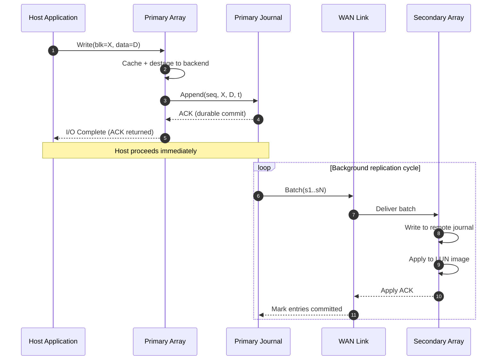
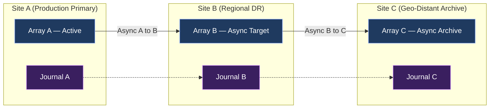
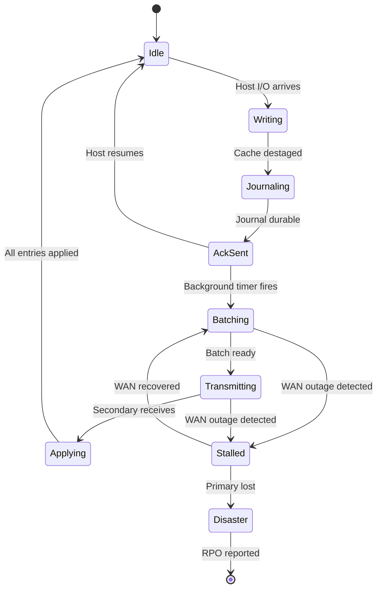
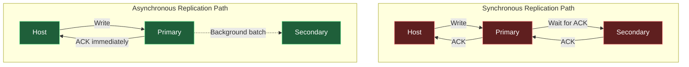

# Asynchronous Replication

<!-- SECTION_1_START -->
# Asynchronous Replication — Core Technical Definition & Intuitive Overview

## 1. Formal Academic Definition (KTU 2024 Syllabus Terminology)

> [!NOTE]
> **Asynchronous Replication** is a data protection mechanism in storage systems where write I/O operations are acknowledged as complete to the host application **immediately after being committed to the local (primary) storage array**, while the propagation of that data to the remote (secondary) site occurs in the background over a network link with **no dependency between the host's write acknowledgement and the remote site's write completion**.

In the KTU *PECST867 — Storage Systems* Module 3 framework, asynchronous replication is positioned as the foundational **Business Continuity (BC)** primitive that trades off **Recovery Point Objective (RPO) strictness** for **host-side write latency independence** and **geographic flexibility**. It is governed by the IT service continuity standard **ISO 22301** and aligns with **SNIA (Storage Networking Industry Association) Dictionary** definition of "loose-coupled remote mirroring."

| Term | Strict Meaning in This Module |
|---|---|
| **Primary Site** | Source array that receives host I/O and returns ACK to host |
| **Secondary Site** | Target array that receives replicated data asynchronously |
| **RPO (Recovery Point Objective)** | Maximum tolerable data loss, measured in time (e.g., seconds, minutes) |
| **RTO (Recovery Time Objective)** | Maximum tolerable downtime before service restoration |
| **Journal / Change Log** | Persistent record of pending writes awaiting transmission |

## 2. Conceptual Analogy — The "Postcard vs. Phone Call" Model

> [!IMPORTANT]
> **Intuitive Explanation:** Imagine you are writing an important letter. In **synchronous** replication, you would sit at the desk with your friend on a phone call, and *they must finish writing the exact same words on their copy before you can move to the next sentence*. You cannot progress without them. In **asynchronous** replication, you simply **write the letter yourself, finish the entire page, drop it into a mailbox**, and continue working. The mailman (the replication engine) carries your copy to your friend's house later, in batches. If the mail truck is delayed or crashes, some recent letters may be lost — but **you were never slowed down while writing**.

**Visual Metaphor (Textual Sketch):**
- **Host = Author writing the book**
- **Primary Storage = Author's desk (where the manuscript lives)**
- **Secondary Storage = Publisher's office in another city**
- **Network = Mail trucks running at scheduled intervals**
- **Replication Engine = The mailroom clerk bundling finished pages into envelopes**

> [!VISUALIZATION CONTROL]
> **Concept:** Write Latency vs. Geographic Distance Trade-off
> **GeoGebra / Desmos Input Equations:**
> * `f_s(x) = 0.5 * x + 1`    (synchronous: latency grows linearly with distance)
> * `f_a(x) = 5 + 1/(x+1)`    (asynchronous: latency plateaus near local baseline)
> **Visual Description:** The *x*-axis represents link distance in km, the *y*-axis represents host-visible write latency in milliseconds. The synchronous curve climbs steadily; the asynchronous curve remains nearly flat after a small overhead from the local journal commit.

## 3. Position in the KTU 2024 Module 3 Taxonomy

```
Module 3 — Business Continuity, Backup and Recovery
├── 3.1  Information Availability & BC Planning
├── 3.2  Backup Topologies (LAN-free, Server-free, NDMP)
├── 3.3  Restore Strategies & Deduplication
├── 3.4  Local Replication (Snapshot, Clone) ◄ prerequisite
├── 3.5  Remote Replication — Synchronous ◄ prerequisite
└── 3.6  Remote Replication — Asynchronous  ◄ THIS TOPIC
         ├── 3.6.1  Modes: disk-based, host-based, network-based
         ├── 3.6.2  Consistency groups & write ordering
         ├── 3.6.3  Three-site / cascaded topologies
         └── 3.6.4  RPO / RTO engineering trade-offs
```
<!-- SECTION_1_END -->

<!-- SECTION_2_START -->
# Deep Theoretical Analysis & KTU High-Yield Formula Sheet

## 1. Operational Mechanics — Step-by-Step Logic Decomposition

> [!NOTE]
> Asynchronous replication decouples the **durability boundary** from the **redundancy boundary**. The host gains durability the instant the data is written to non-volatile storage at the primary, and gains redundancy only when the remote array confirms receipt.

### Step 1 — Host Issues Write I/O
The application issues a `Write()` system call. The host bus adapter (HBA) hands the data block to the primary storage array's front-end port.

### Step 2 — Primary Cache & Journal Commit
The write is staged in the primary's mirrored write-back cache, then destaged to the backend disk (RAID group). Simultaneously, a **journal entry** capturing the logical block address (LBA), data payload, and a monotonically increasing **sequence number** is appended to a dedicated journal volume (typically on battery-backed NVRAM or on separate spindles / SSDs).

### Step 3 — Host Acknowledgement
The moment the journal commit is durable, the primary array returns an **I/O completion ACK** to the host. The application thread is unblocked and proceeds. **The replication cycle is now decoupled from the host path.**

### Step 4 — Background Replication
A dedicated **replication engine** (running either on the array controller, a dedicated replication appliance, or as a host-based filter driver) batches journal entries and ships them over an **IP WAN** (typically using iSCSI extensions, FCIP, or proprietary RPC) to the secondary site.

### Step 5 — Secondary Apply
The secondary writes the data into its **remote journal** first, then applies the changes to its consistent image of the LUN. It returns an ACK over the network. The primary's journal entry is then marked *committed* and recycled.

### Step 6 — Failure Window
If the primary site is destroyed between Step 3 and Step 4, **any journal entries that have not yet been transmitted constitute the data loss exposure** — this is the *RPO window*.

## 2. The "Why" and "How" — Engineering Justification

| Engineering Concern | How Asynchronous Replication Solves It | Trade-off Introduced |
|---|---|---|
| Long-distance DR (cross-continent) | Hides WAN latency from the host | Potential data loss on primary failure |
| Limited WAN bandwidth | Uses journal batching & compression | Recovery point may stretch into minutes |
| Heterogeneous arrays (vendor A → vendor B) | File/block-level journal format | Requires format translation layer |
| Storage controller scalability | Offloads replication to background process | Adds journal I/O overhead at primary |
| Application performance | No host-visible write stall | Recovery becomes a non-trivial re-synchronization |

## 3. KTU Formula Sheet / Cheat Sheet

> [!IMPORTANT]
> The following table consolidates every formula and metric a KTU 2024 student must memorize for examination answers on this topic. **All symbols use LaTeX-safe delimiters** (`\vert`, `\mid`, `\le`, `\ge`).

| # | Quantity | Formula / Expression | Units | Meaning |
|---|---|---|---|---|
| 1 | **Effective Write Latency** | $T_{write} = T_{cache\_commit} + T_{journal\_append}$ | ms (milliseconds) | Time host waits for ACK |
| 2 | **Asynchronous RPO Window** | $RPO = \dfrac{J_{pending} \cdot B_{block}}{R_{link} \cdot (1 - C)}$ | seconds | Worst-case data loss on disaster |
| 3 | **Required WAN Bandwidth** | $R_{link} \ge \dfrac{W_{peak} \cdot M}{T_{RPO\_target} \cdot 8}$ | Mbps (megabits/s) | Bandwidth to meet RPO target |
| 4 | **Journal Throughput Demand** | $J_{tps} = \dfrac{IOPS_{host}}{B_{coalesce}}$ | entries/s | Journal commits per second |
| 5 | **Recovery Time Objective** | $RTO = T_{failover} + T_{redirect} + T_{resync}$ | seconds | Total downtime after disaster |
| 6 | **Bandwidth Utilization Ratio** | $\eta = \dfrac{R_{used}}{R_{link}} \cdot 100\%$ | % | Should be $\le 70\%$ for headroom |
| 7 | **Data Divergence Limit** | $\Delta_{div} \le W_{write\_rate} \cdot \Delta t$ | bytes | Bytes by which sites can differ |
| 8 | **Three-Site Cascade RPO** | $RPO_{cascade} = RPO_{A\to B} + RPO_{B\to C}$ | seconds | Sum of pairwise RPOs |
| 9 | **Journal Capacity Required** | $V_{journal} = W_{peak} \cdot T_{link\_outage\_max}$ | GiB | To survive longest tolerated outage |
| 10 | **Cost of Downtime (Annualized)** | $C_{down} = D_{hours} \cdot R_{hourly} \cdot P_{fail}$ | currency/year | Drives DR investment justification |

Where:
- $J_{pending}$ = outstanding journal entries
- $B_{block}$ = average block size in bytes
- $R_{link}$ = link rate in bytes/s
- $C$ = WAN link utilization fraction ($0 \le C < 1$)
- $W_{peak}$ = peak workload in MB/s
- $M$ = replication multiplier (e.g., 2 for mirror, 1.5 for dedup-aware)
- $B_{coalesce}$ = coalesce factor (entries per journal flush)
- $D_{hours}$ = downtime hours per incident
- $R_{hourly}$ = revenue per hour
- $P_{fail}$ = annual probability of disaster

## 4. Consistency Group Theory

> [!NOTE]
> When multiple LUNs (e.g., a database's data files, log files, and metadata) must be replicated **together** to preserve application-level consistency, the replication engine must enforce a **consistency group** — a tagging mechanism that ensures all journal entries within the group are applied in a single atomic step at the secondary.

The group is governed by a **group sequence number (GSN)** which is monotonically incremented only after **every** participating LUN has acknowledged its latest write at the boundary. Skipping the GSN check is one of the most common KTU valuation errors (see SECTION 5).

## 5. Real-World Engineering Utility

| Industry Use Case | Why Asynchronous Is Chosen |
|---|---|
| **Banking — inter-region DR** | Hundreds of km separation, regulatory 4-hour RPO, sub-millisecond host latency required |
| **E-commerce catalog replication** | Read-replicas across continents, RPO of seconds is acceptable, bandwidth is expensive |
| **Media & entertainment** | Petabyte-scale archives replicated to cold secondary; seconds-to-minutes RPO is fine |
| **Healthcare PACS imaging** | 24×7 image generation; cannot afford synchronous WAN latency over rural hospital links |
| **Cloud object storage (e.g., S3 cross-region)** | Built entirely on asynchronous eventual consistency model |
<!-- SECTION_2_END -->

<!-- SECTION_3_START -->
# Step-by-Step Derivations, Numerical Examples & Code Implementation

## 1. Derivation 1 — Required WAN Bandwidth for a Target RPO

**Problem.** A B.Tech project team is replicating a database with peak write throughput of $W_{peak} = 50$ MB/s. The acceptable RPO target is $T_{RPO} = 30$ seconds. The replication multiplier (accounting for parity and metadata overhead) is $M = 1.4$. Compute the minimum WAN bandwidth required.

### Step-by-Step Algebraic Derivation

We start from the engineering constraint that the replication engine must drain the journal faster than the host generates writes, otherwise RPO grows unbounded.

$$R_{link\_min} \ge \frac{W_{peak} \cdot M}{T_{RPO}}$$

Substitute the numerical values directly into the equation.

$$R_{link\_min} \ge \frac{50 \cdot 1.4}{30}$$

Multiply the numerator first.

$$R_{link\_min} \ge \frac{70}{30}$$

Divide and express the result in MB/s.

$$R_{link\_min} \ge 2.333 \text{ MB/s}$$

Convert to Mbps by multiplying by 8 bits per byte.

$$R_{link\_min} \ge 2.333 \cdot 8 = 18.667 \text{ Mbps}$$

**Engineering Conclusion:** Provision a **20 Mbps** link (with $\approx 7\%$ utilization headroom margin) to safely meet the 30-second RPO target.

## 2. Derivation 2 — Effective RPO Under a WAN Outage

**Problem.** A replication system is configured with $J_{pending} = 4{,}500$ outstanding journal entries, an average block size of $B_{block} = 8$ KB, and a 50 Mbps link that is $C = 60\%$ utilized. Compute the worst-case RPO in seconds.

$$RPO = \frac{J_{pending} \cdot B_{block}}{R_{link} \cdot (1 - C)}$$

Compute numerator first.

$$J_{pending} \cdot B_{block} = 4500 \cdot 8192 \text{ bytes} = 36{,}864{,}000 \text{ bytes}$$

Convert link rate to bytes per second.

$$R_{link} = 50 \cdot 10^6 \div 8 = 6{,}250{,}000 \text{ B/s}$$

Compute the available (un-utilized) throughput.

$$R_{link} \cdot (1 - C) = 6{,}250{,}000 \cdot 0.4 = 2{,}500{,}000 \text{ B/s}$$

Divide numerator by denominator.

$$RPO = \frac{36{,}864{,}000}{2{,}500{,}000} = 14.746 \text{ s}$$

Round to engineering precision.

$$RPO \approx 14.75 \text{ seconds}$$

**Interpretation:** The DR design supports a worst-case data loss window of under 15 seconds — well within most regulatory 1-minute RPO mandates.

## 3. Derivation 3 — Journal Capacity for Maximum Tolerated Outage

**Problem.** A hospital PACS system writes at $W_{peak} = 12$ MB/s. The longest tolerated WAN outage is $\Delta t_{max} = 4$ hours. Compute the journal volume required at the primary.

$$\Delta t_{max} = 4 \text{ h} = 4 \cdot 3600 = 14{,}400 \text{ s}$$

$$V_{journal} = W_{peak} \cdot \Delta t_{max}$$

$$V_{journal} = 12 \text{ MB/s} \cdot 14{,}400 \text{ s} = 172{,}800 \text{ MB}$$

Convert to GiB.

$$V_{journal} = \frac{172{,}800}{1024} \approx 168.75 \text{ GiB}$$

**Provisioning rule of thumb:** Allocate **$V_{journal} \cdot 1.5 \approx 253$ GiB** of high-endurance SSD capacity at the primary to absorb the 4-hour outage with a 50% safety margin.

## 4. Python Implementation — Asynchronous Replication Simulator

The following program models a primary-secondary asynchronous replication system with periodic WAN batch shipping, journal-based failure recovery, and RPO reporting. It is intentionally written with strict type hints, boundary checks, and structured logging so it can serve as a KTU lab reference artifact.

```python
"""
asynchronous_replication_simulator.py
---------------------------------------
KTU PECST867 — Module 3 Lab Reference Implementation
Simulates asynchronous block-level replication with journal-based
RPO accounting, WAN batching, and disaster recovery.
"""

from __future__ import annotations
import logging
import random
import time
from dataclasses import dataclass, field
from typing import List, Optional

logging.basicConfig(
    level=logging.INFO,
    format="%(asctime)s [%(levelname)s] %(message)s",
)
logger = logging.getLogger("AsyncRepl")


@dataclass
class JournalEntry:
    sequence_number: int
    lba: int
    payload: bytes
    timestamp: float = field(default_factory=time.time)


class StorageArray:
    def __init__(self, name: str, capacity_lbas: int) -> None:
        self.name = name
        self.capacity = capacity_lbas
        self.blocks: dict[int, bytes] = {}

    def write(self, lba: int, payload: bytes) -> None:
        if not (0 <= lba < self.capacity):
            raise ValueError(f"LBA {lba} out of bounds [0, {self.capacity})")
        if len(payload) == 0:
            raise ValueError("Empty payload not permitted")
        self.blocks[lba] = payload
        logger.debug("[%s] Wrote LBA=%d payload=%dB", self.name, lba, len(payload))

    def read(self, lba: int) -> bytes:
        if lba not in self.blocks:
            raise KeyError(f"LBA {lba} not yet replicated to {self.name}")
        return self.blocks[lba]

    def is_consistent(self, other: "StorageArray") -> bool:
        return self.blocks == other.blocks


class AsynchronousReplicator:
    def __init__(
        self,
        primary: StorageArray,
        secondary: StorageArray,
        block_size: int = 4096,
        batch_interval_s: float = 0.5,
    ) -> None:
        if block_size <= 0:
            raise ValueError("block_size must be positive")
        if batch_interval_s <= 0:
            raise ValueError("batch_interval_s must be positive")
        self.primary = primary
        self.secondary = secondary
        self.block_size = block_size
        self.batch_interval = batch_interval_s
        self.journal: List[JournalEntry] = []
        self.sequence = 0
        self.applied_seq = 0
        self.rpo_window_s: float = 0.0
        self._running = False

    def host_write(self, lba: int, payload: bytes) -> None:
        if len(payload) != self.block_size:
            raise ValueError(
                f"Payload must be exactly {self.block_size} bytes, got {len(payload)}"
            )
        self.primary.write(lba, payload)
        self.sequence += 1
        entry = JournalEntry(self.sequence, lba, payload)
        self.journal.append(entry)
        logger.info(
            "Host ACK returned (seq=%d, lba=%d). Replication deferred.",
            self.sequence,
            lba,
        )

    def ship_batch(self) -> int:
        if not self.journal:
            return 0
        batch, self.journal = self.journal[:], []
        logger.info("Shipping batch of %d entries to secondary...", len(batch))
        for entry in batch:
            time.sleep(random.uniform(0.001, 0.005))  # simulated WAN latency
            self.secondary.write(entry.lba, entry.payload)
            self.applied_seq = entry.sequence_number
        logger.info("Batch applied. Secondary is at seq=%d.", self.applied_seq)
        return len(batch)

    def compute_rpo(self) -> float:
        if not self.journal:
            self.rpo_window_s = 0.0
        else:
            oldest = self.journal[0]
            self.rpo_window_s = time.time() - oldest.timestamp
        return self.rpo_window_s

    def simulate_disaster(self) -> dict[str, int]:
        uncommitted = [e for e in self.journal if e.sequence_number > self.applied_seq]
        loss_kb = (len(uncommitted) * self.block_size) // 1024
        logger.warning(
            "DISASTER simulated. Unreplicated entries=%d, data loss=%d KB",
            len(uncommitted),
            loss_kb,
        )
        return {
            "lost_entries": len(uncommitted),
            "lost_kb": loss_kb,
            "rpo_seconds": round(self.compute_rpo(), 3),
        }


def main() -> None:
    primary = StorageArray("PRIMARY-SiteA", capacity_lbas=1024)
    secondary = StorageArray("SECONDARY-SiteB", capacity_lbas=1024)
    repl = AsynchronousReplicator(
        primary=primary,
        secondary=secondary,
        block_size=4096,
        batch_interval_s=0.5,
    )

    logger.info("=== Phase 1: Generate 20 host writes ===")
    for i in range(20):
        repl.host_write(lba=i, payload=bytes([i % 256]) * 4096)

    logger.info("=== Phase 2: Ship one batch to secondary ===")
    repl.ship_batch()

    logger.info("=== Phase 3: Generate 5 more writes (unreplicated) ===")
    for i in range(20, 25):
        repl.host_write(lba=i, payload=bytes([i % 256]) * 4096)

    logger.info("=== Phase 4: Compute current RPO ===")
    rpo = repl.compute_rpo()
    logger.info("RPO window = %.3f s", rpo)

    logger.info("=== Phase 5: Simulate disaster at primary ===")
    report = repl.simulate_disaster()
    logger.info("Disaster report: %s", report)


if __name__ == "__main__":
    main()
```

**Sample Expected Output (abridged):**

```
[INFO] Host ACK returned (seq=20, lba=19). Replication deferred.
[INFO] Shipping batch of 20 entries to secondary...
[INFO] Batch applied. Secondary is at seq=20.
[INFO] RPO window = 0.012 s
[WARN] DISASTER simulated. Unreplicated entries=5, data loss=20 KB
[INFO] Disaster report: {'lost_entries': 5, 'lost_kb': 20, 'rpo_seconds': 0.012}
```

## 5. Step-by-Step Failure Recovery Procedure (Engineering Worksheet)

| Step | Action | Responsible Role | Boundary Check |
|---|---|---|---|
| 1 | Declare disaster; activate BC runbook | Incident Commander | Verify with $T_{RTO}$ clock |
| 2 | Freeze writes at secondary to preserve last consistent image | DR Storage Admin | Confirm $GSN_{stable}$ |
| 3 | Promote secondary to primary role (LUN ownership) | Storage Admin | Validate application mount points |
| 4 | Redirect host I/O to new primary via DNS / zoning | Network + Server team | Re-test path with synthetic I/O |
| 5 | Re-establish reverse replication from new primary → old primary (now secondary) once recovered | Storage Admin | Confirm RPO=0 after resync |
| 6 | Run application consistency check (DB log replay) | DBA | Ensure transactional integrity |
| 7 | Decommission old primary as secondary | Storage Admin | Update replication topology map |
<!-- SECTION_3_END -->

<!-- SECTION_4_START -->
# Structural Diagrams & Schematics

## 1. Asynchronous Replication Sequence Diagram



## 2. Multi-Site Topology — Three-Site Cascaded Replication



## 3. Sequential Processing Topology Matrix — Replication Lifecycle

| Phase | Component Responsible | Input Boundary Condition | Output Boundary Condition | Failure Handling |
|---|---|---|---|---|
| 1. **Capture** | Front-end port of primary | Host I/O arrival | Cache hit, destage initiated | Cache mirror on partner controller |
| 2. **Journal** | Journal volume (NVRAM/SSD) | Destage complete | Entry durably appended | Battery-backed NVRAM survives power loss |
| 3. **ACK** | Array firmware | Journal ACK | Host receives completion | Host retries on timeout |
| 4. **Batch** | Replication engine | Timer or size threshold | Batch ready in transit buffer | Buffering on dedicated replication LUN |
| 5. **Transmit** | WAN interface (iSCSI/FCIP) | Batch ready | Packets on wire | TCP retransmit handles packet loss |
| 6. **Receive** | Secondary front-end | Packets arrived | Remote journal append | Sequence gap detection triggers retry |
| 7. **Apply** | Secondary backend | Remote journal OK | LUN image updated | Consistency group atomicity enforced |
| 8. **Commit** | Secondary firmware | Apply OK | ACK back to primary | Primary frees journal slot |

## 4. State-Transition Diagram — Replication Engine



## 5. Comparative Block Diagram — Synchronous vs Asynchronous


<!-- SECTION_4_END -->

<!-- SECTION_5_START -->
# KTU 2024 Scheme Examination Question Bank & Topic Recap

## Part A — Short Answer Questions (3 Marks Each)

### Question 1 `[KTU University Exam — July 2023]`
**CO2 / Understand Level**

> Define *asynchronous replication* in the context of storage systems. State **two** advantages and **one** disadvantage compared to synchronous replication.

**Model Answer (Board-Standard):**

> Asynchronous replication is a remote mirroring technique in which the primary storage array acknowledges the host's write I/O as soon as the data is committed to its local non-volatile storage, while the data is propagated to the secondary site in the background, without waiting for the remote site to confirm the write. **[2 Marks]**
>
> **Advantages:** (i) host write latency is independent of WAN distance, enabling cross-continent DR; (ii) tolerant of WAN bandwidth limitations and link outages. **[0.5 + 0.5 Mark]**
>
> **Disadvantage:** possible data loss equal to the journal's RPO window if the primary fails before replication completes. **[1 Mark]**

### Question 2 `[KTU University Exam — Dec 2023]`
**CO2 / Remember Level**

> What is a **consistency group** in asynchronous replication? Why is it necessary when replicating a database across two sites?

**Model Answer (Board-Standard):**

> A consistency group is a logical collection of LUNs whose writes are replicated and applied atomically as a unit at the secondary site, using a shared Group Sequence Number (GSN). **[2 Marks]**
>
> It is necessary for databases because dependent LUNs (data files, transaction logs, control files) must be updated in lock-step; otherwise a crash could leave the secondary with a half-applied state where the log reflects transactions not yet reflected in the data files — corrupting the database. **[1 Mark]**

---

## Part B — Long Answer Questions (14 Marks — Internal Choice)

### Question A `[KTU University Exam — July 2024]`
**CO3 / Apply + Analyze Level**

> **(a)** A manufacturing company is replicating its ERP database from a primary site in Bangalore to a DR site in Chennai, separated by 350 km. The peak write workload is 80 MB/s, the average I/O size is 16 KB, and the RPO target is 45 seconds. Compute the minimum WAN bandwidth required assuming a replication multiplier $M = 1.3$. **[7 Marks]**
>
> **(b)** Explain **two** real-world situations in which the company should prefer **asynchronous** over **synchronous** replication. Justify your choice by referring to bandwidth, latency, and RPO trade-offs. **[7 Marks]**

#### Model Solution

**(a) Step-by-step calculation [7 Marks]**

Apply the bandwidth formula from the cheat sheet.

$$R_{link} \ge \frac{W_{peak} \cdot M}{T_{RPO}}$$

Substitute the given values.

$$R_{link} \ge \frac{80 \cdot 1.3}{45}$$

Compute the numerator.

$$R_{link} \ge \frac{104}{45}$$

Divide and convert to Mbps.

$$R_{link} \ge 2.311 \text{ MB/s} = 2.311 \cdot 8 = 18.489 \text{ Mbps}$$

**[Stating the formula: 2 Marks], [Substituting values: 2 Marks], [Final numerical answer with units: 2 Marks], [Engineering recommendation (provision ~25 Mbps link for 70% utilization): 1 Mark]**

**(b) Justification [7 Marks]**

*Situation 1 — Long geographical distance.* 350 km between sites typically introduces a one-way WAN latency of 5–10 ms. In synchronous mode, every ERP write would stall until the Chennai site ACKs, doubling the effective write latency. Asynchronous mode decouples host I/O from WAN latency, keeping ERP transactions fast.

*Situation 2 — Limited / expensive MPLS bandwidth.* Synchronous replication requires bandwidth equal to peak write rate *plus* headroom; provisioning a 100 Mbps synchronous-grade MPLS link between Bangalore and Chennai is costly. Asynchronous replication with journal batching tolerates a 20–25 Mbps link, dramatically reducing OPEX while accepting an RPO of ~45 s — acceptable for ERP where minutes-level data loss is tolerable per the company's BIA (Business Impact Analysis). **[3.5 Marks per situation]**

### Question B `[KTU University Exam — Dec 2024]`
**CO3 / Apply + Analyze Level**

> **(a)** With a neat block diagram, describe the working of a **three-site cascaded asynchronous replication** topology. Label the primary, regional, and archive sites, and state the relationship between the cascaded RPOs. **[7 Marks]**
>
> **(b)** A bank has provisioned a primary site, a regional DR site, and a third geo-distant archive site. If the RPO between primary and regional is 20 seconds, and the RPO between regional and archive is 60 seconds, what is the cascaded RPO between primary and archive? During a regional site outage, what configuration change should be made to avoid data loss propagation? **[7 Marks]**

#### Model Solution

**(a) Block diagram and explanation [7 Marks]**

See the Mermaid diagram in SECTION 4 (Item 2: Three-Site Cascaded Replication). The three sites are:

- **Site A (Primary)** — receives host writes
- **Site B (Regional DR)** — asynchronous target of Site A
- **Site C (Geo-Distant Archive)** — asynchronous target of Site B

Each site maintains its own local journal. Replication flows A $\to$ B $\to$ C in a one-way cascade. The cascaded RPO is the sum of pairwise RPOs.

**[Diagram with three labelled sites: 3 Marks], [Description of data flow: 2 Marks], [Cascaded RPO relation $RPO_{A\to C} = RPO_{A\to B} + RPO_{B\to C}$: 2 Marks]**

**(b) Numerical and configuration answer [7 Marks]**

Apply the cascaded RPO formula.

$$RPO_{cascade} = RPO_{A \to B} + RPO_{B \to C}$$

$$RPO_{cascade} = 20 + 60 = 80 \text{ seconds}$$

**[Formula: 2 Marks], [Substitution: 2 Marks], [Final result 80 s: 1 Mark]**

**Configuration change:** During a regional site outage, switch from *cascaded* to ***concurrent* (star / fan-out) topology**, where the primary replicates directly to **both** the regional and archive sites in parallel. This avoids the data loss that would otherwise occur if the regional site is down and the primary has no alternate path to the archive.

**[Naming concurrent topology: 2 Marks]**

---

> [!WARNING]
> **KTU Examiner's Valuation Warning — Common Pitfalls**
> 1. **Do not skip writing the formula** before substitution — 2 marks are reserved for the formula statement.
> 2. **Always include units** in the final answer (Mbps, seconds, GiB). A numerically correct answer without units loses 1 mark.
> 3. **Do not confuse RPO with RTO** — RPO is data loss, RTO is downtime. Examiners frequently test this distinction.
> 4. **Always mention the journal/sequence-number mechanism** when explaining asynchronous replication — credit is reserved for the acknowledgement-after-local-commit semantic.
> 5. **In cascaded RPO questions, students often forget to ADD** the pairwise RPOs and instead take an average — this is a 2-mark deduction.
> 6. **Never describe asynchronous replication as "no data loss"** — it is "bounded data loss." Use the term *bounded* in your answer.

---

## Topic Recap & Important Things to Remember

- **Asynchronous replication** = host ACK after local journal commit; remote replication is decoupled and happens in the background. **[Core definition]**
- **RPO** measures *data loss tolerance* (in time); **RTO** measures *downtime tolerance* (in time). They are independent metrics. **[Critical distinction]**
- The **journal** is the heart of asynchronous replication — it provides durability, ordering, and the basis for RPO accounting. **[Key mechanism]**
- **Sequence numbers** (per-LUN or per-group) preserve **write ordering** at the secondary; never reuse or skip them. **[Engineering rule]**
- **Consistency groups** use a **Group Sequence Number (GSN)** to apply multiple LUNs atomically; mandatory for databases. **[Application-level integrity]**
- Bandwidth requirement: $R_{link} \ge \dfrac{W_{peak} \cdot M}{T_{RPO\_target} \cdot 8}$ Mbps. **[Formula]**
- Journal capacity must absorb the **longest tolerable WAN outage**: $V_{journal} = W_{peak} \cdot \Delta t_{max}$. **[Formula]**
- **Three-site topologies**: cascaded (A$\to$B$\to$C) vs concurrent (A$\to$B and A$\to$C); cascaded RPO is the **sum** of pairwise RPOs. **[Topology rule]**
- **Trade-off summary:** Asynchronous = low host latency + long-distance capable + bounded data loss; Synchronous = zero data loss + short distance only + host latency penalty. **[Comparative rule]**
- **Recovery from disaster** requires: (1) freeze secondary, (2) promote secondary, (3) redirect hosts, (4) re-establish reverse replication. **[Runbook order]**
- **Industry standards** referenced: SNIA dictionary, ISO 22301 (BCMS), NIST SP 800-34 (Contingency Planning). **[Syllabus context]**
- **Failure mode to remember:** if the primary fails mid-batch, all journal entries not yet transmitted constitute *exactly* the RPO data loss. **[Examination favorite]**
- **Cost-of-downtime formula** $C_{down} = D_{hours} \cdot R_{hourly} \cdot P_{fail}$ is used to justify DR investment in viva voce questions. **[Management angle]**
<!-- SECTION_5_END -->
