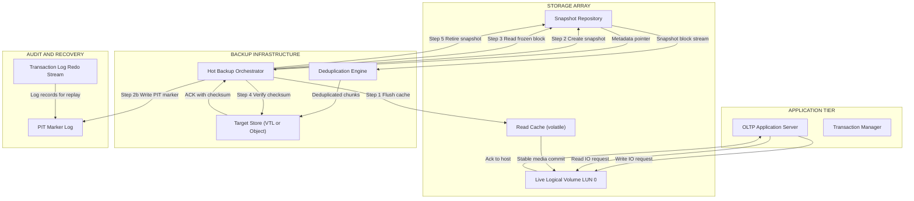
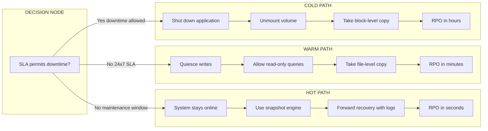
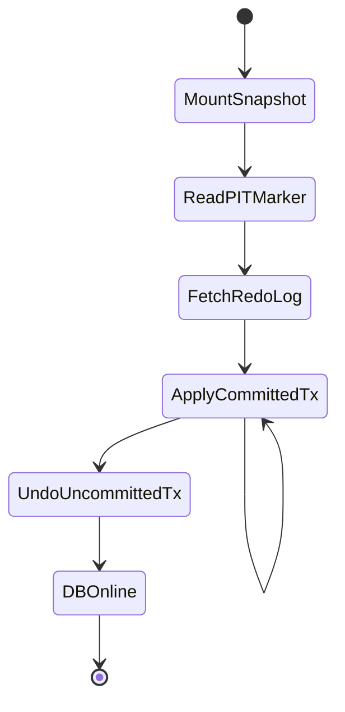

# Backup Methods- Hot Backups

<!-- SECTION_1_START -->

# Hot Backups — Core Technical Definition & Intuitive Overview

## 1.1 Formal Academic Definition (KTU 2024 Syllabus Terminology)

A **Hot Backup** (also termed an *online backup* or *dynamic backup*) is a backup methodology in which a coherent, restorable copy of data is captured from a **production storage system that remains fully online and actively serving I/O requests** throughout the entire backup window. Unlike offline (cold) backups that mandate quiescing the application, a hot backup leverages operating-system-level or storage-array-level facilities—such as **Volume Shadow Copy Service (VSS)**, **Logical Volume Manager (LVM) snapshots**, **redirect-on-write (ROW) snapshots**, or **copy-on-write (COW) snapshots**—to atomically freeze a point-in-time (PIT) image of the data while live transactions continue to be processed against the active volume.

> [!IMPORTANT]
> **KTU 2024 Module-3 Highlight:** Hot backups are formally classified under the *Business Continuity* domain because they are the **only viable strategy for systems whose Service Level Agreement (SLA) mandates 24×7 availability** and forbids any planned downtime for maintenance activities. They are a prerequisite for achieving **Recovery Point Objectives (RPO)** measured in seconds rather than hours.

## 1.2 Conceptual Analogy — The "Open Restaurant Kitchen"

Imagine a five-star restaurant that has a strict policy: *the dining hall must never close*. The head chef needs to archive the day's recipe ledger for the chain's headquarters.

- **Cold Backup Analogy** — Close the kitchen, lock the doors, dim the lights, take the ledger, copy it, return it, and re-open. The restaurant loses revenue, but the copy is guaranteed coherent.
- **Hot Backup Analogy** — The chef inserts a transparent glass divider, lets the head waiter take a *photographic snapshot* of the open ledger page from outside the kitchen, and continues cooking without a single second of service interruption. The snapshot is a *frozen* representation of the live data taken at a precise instant, while the real ledger keeps accumulating new entries.

The "glass divider" is the *snapshot engine* (LVM, VSS, or array-based); the "ledger" is the live logical volume; and the "new entries" represent the **transaction log** that guarantees forward recovery when the snapshot is restored.

## 1.3 The Three Operational Modes of Backup — At a Glance

| Mode | System State | User Access | Data Mutation | Typical Tool |
| :--- | :--- | :--- | :--- | :--- |
| **Hot Backup** | Online | Permitted | Allowed | LVM, VSS, RMAN, `mysqldump --single-transaction` |
| **Warm Backup** | Online (read-only) | Read-only queries | Blocked | SQL Server *read-only* mode |
| **Cold Backup** | Offline | None | Stopped | `tar`, `dd`, `rsync` on a quiesced volume |

> [!NOTE]
> **Physical Constants / Standard Metrics** associated with hot backup planning:
> - **Snapshot creation latency:** $\approx 1$–$5\,\text{ms}$ (array-dependent)
> - **Standard CR (Consistency Rate) threshold:** $\geq 99.99\%$ for Tier-1 OLTP workloads
> - **VSS default retry interval:** $30\,\text{seconds}$
> - **Block size for differential hot backups:** typically **$64\,\text{KiB}$** on enterprise arrays

## 1.4 Visualization Concept — Snapshot Divergence Over Time

> [!VISUALIZATION CONTROL]
> **Concept:** *Copy-on-Write (CoW) vs. Redirect-on-Write (RoW) divergence of a hot backup snapshot*
>
> **GeoGebra / Desmos Input Equations:**
> - Source volume growth: $S(t) = S_0 + \alpha t$, where $\alpha$ is the write rate
> - Snapshot-1 metadata: $M_1(t) = S(t_1)$ (frozen reference)
> - Snapshot-2 metadata: $M_2(t) = S(t_2)$ (frozen reference)
> - Storage overhead (CoW): $O_{\text{CoW}}(t) = S(t) - S_0$
> - Storage overhead (RoW): $O_{\text{RoW}}(t) = \sum_{i=1}^{n} \Delta B_i$, where $\Delta B_i$ is the $i^{\text{th}}$ redirected block
>
> **Visual Description:** The student should observe two diverging lines emerging from a single point on the time axis ($t_1$ and $t_2$). The space between the source-volume curve and each frozen snapshot line represents the **delta storage cost** of maintaining the hot backup over time. The slope of the source curve demonstrates the cumulative write workload.

<!-- SECTION_1_END -->

<!-- SECTION_2_START -->

# Deep Theoretical Analysis & KTU High-Yield Formula Sheet

## 2.1 Anatomy of a Hot Backup — Stepwise Logical Decomposition

A hot backup is **not** a single atomic event; it is an orchestrated sequence of carefully synchronised stages. Each stage addresses a specific failure mode that would otherwise corrupt the backup's logical consistency.

### Stage 1 — Snapshot Instantiation (The "Freeze")
The storage stack receives a *quiesce request* from the backup agent. The agent does **not** freeze user I/O at the application layer; instead, it triggers a hardware-assisted or hypervisor-assisted mechanism that:
1. Flushes the controller's volatile write cache to non-volatile storage.
2. Records a new **snapshot metadata entry** in the snapshot repository pointing to the current block map.
3. Releases the write queue so that user I/O resumes immediately.

> **Why?** Because the cache flush guarantees that every byte acknowledged as "written" by the host is already on stable media — a prerequisite for a recoverable snapshot.

### Stage 2 — PIT Consistency Marker
A **fuzzy checkpoint** (in database terminology) or a **crash-consistency marker** (in file-system terminology) is written to a special metadata region. For databases, this corresponds to writing the **SCN (System Change Number)** or **LSN (Log Sequence Number)** at the moment the snapshot was taken. On restore, the recovery engine replays every transaction log record whose LSN is $\geq LSN_{\text{snapshot}}$ to roll forward any committed work that was not yet in the snapshot.

### Stage 3 — Data Transfer (Asynchronous Streaming)
The frozen snapshot is read block-by-block and streamed to the backup target — typically a deduplicated store, a virtual tape library, or a cloud object bucket. Because the snapshot is read-only and the live volume continues to be written, the **read source and the write source are decoupled**, eliminating the consistency problem that plagues naive online copies.

### Stage 4 — Snapshot Retirement
Once the data transfer is verified via checksum, the snapshot is *deleted* from the snapshot repository. The metadata pointer is released, and the now-stale blocks (in a CoW scheme) are returned to the free pool.

## 2.2 The "Why" Behind Each Stage

- **Why a snapshot and not a live `cp -r`?** A live `cp` race-conditions with concurrent writers; files may be partially written, and the resulting tarball is *crash-inconsistent* — restoring it would yield a corrupted database or worse, a silently inconsistent one.
- **Why flush the cache?** The controller's write-back cache hides latency from the application. If the cache is *not* flushed, a power loss between the snapshot and the cache flush would yield a snapshot that contains blocks never actually written to disk.
- **Why a PIT marker?** A block-by-block copy of a live volume contains *torn writes* and *write-ahead-log pages* that may or may not reflect a committed transaction. The PIT marker is the **bookmark** the recovery engine needs to apply the log forward and reach a consistent state.

## 2.3 The Two Dominant Snapshot Technologies

### 2.3.1 Copy-on-Write (CoW)
When a write is issued to a block that is part of an active snapshot, the **original** block is first copied to a *snapshot reserve* area, and then the in-place write proceeds against the live volume. The snapshot's view of that block remains the pristine original.

- **Read performance:** Slightly slower (an extra pointer indirection in the metadata).
- **Write performance:** Significantly slower (extra I/O for the pre-copy).
- **Space efficiency:** Optimal when the workload is read-heavy.

### 2.3.2 Redirect-on-Write (RoW)
When a write is issued to a snapshot-protected block, the new data is written to a *new location* in the data pool, and only the live volume's metadata pointer is updated. The snapshot pointer remains unchanged.

- **Read performance:** Slower for active snapshots (pointer traversal).
- **Write performance:** Faster than CoW (no pre-copy).
- **Space efficiency:** Optimal for write-heavy workloads.

> [!NOTE]
> **KTU 2024 High-Yield Note:** The choice between CoW and RoW is *workload-dependent*. A question asking *"which snapshot mechanism is preferable for an OLTP database with high write throughput?"* expects **Redirect-on-Write** as the answer, with justification centred on write amplification.

## 2.4 KTU High-Yield Formula Sheet

| Symbol | Definition | Formula / Relationship | Units / Notes |
| :--- | :--- | :--- | :--- |
| $R_{\text{backup}}$ | Effective backup throughput | $R_{\text{backup}} = \dfrac{V_{\text{changed}}}{T_{\text{window}}}$ | $\text{MiB/s}$ |
| $V_{\text{changed}}$ | Volume of data changed in window | $V_{\text{changed}} = W_{\text{rate}} \cdot T_{\text{window}}$ | $\text{MiB}$ |
| $W_{\text{rate}}$ | Sustained write workload | Application benchmark, e.g., $50\,\text{MiB/s}$ | $\text{MiB/s}$ |
| $T_{\text{window}}$ | Duration of backup operation | Time from snapshot to retirement | $\text{seconds}$ |
| $O_{\text{CoW}}$ | CoW storage overhead | $O_{\text{CoW}} = \sum_{i=1}^{n} B_i^{\text{copied}}$ | $\text{MiB}$ |
| $O_{\text{RoW}}$ | RoW storage overhead | $O_{\text{RoW}} = \sum_{i=1}^{n} \Delta B_i$ | $\text{MiB}$ |
| $\text{RPO}$ | Recovery Point Objective | $\text{RPO} = f(\text{backup frequency}, \text{log shipping lag})$ | $\text{seconds}$ |
| $\text{RTO}$ | Recovery Time Objective | $\text{RTO} = T_{\text{restore}} + T_{\text{replay}}$ | $\text{minutes}$ |
| $C_{\text{checksum}}$ | End-to-end data integrity | $C_{\text{checksum}} = \text{SHA-256}(B_{\text{source}}) \stackrel{?}{=} \text{SHA-256}(B_{\text{target}})$ | Boolean match |
| $\eta_{\text{dedup}}$ | Deduplication ratio | $\eta_{\text{dedup}} = \dfrac{V_{\text{logical}}}{V_{\text{physical}}}$ | Dimensionless, $\geq 1$ |
| $L_{\text{replay}}$ | Log replay time | $L_{\text{replay}} = \dfrac{V_{\text{log}}}{R_{\text{replay}}}$ | $\text{seconds}$ |

> [!IMPORTANT]
> **Syllabus-Specific Highlight — Recovery Algebra:** During a hot backup restore, the recovery engine must apply the equation
> $$ \text{Final State} = \text{Snapshot} \cup \{\text{log records} \mid LSN \geq LSN_{\text{snapshot}} \land \text{commit} = \text{true}\} $$
> This is the formal **"Snapshot + Redo Log Forward Recovery"** model that the KTU 2024 syllabus expects students to articulate in long-answer questions.

## 2.5 Real-World Engineering Utility

Hot backups are not a theoretical luxury; they are the **backbone of every Tier-1 enterprise deployment**:

- **Banking and Financial Services:** Online transaction processing (OLTP) systems such as core banking engines cannot tolerate a maintenance window. Hot backups combined with log shipping yield **RPO $\leq 5$ seconds** and **RTO $\leq 15$ minutes**.
- **E-commerce Platforms:** Black-Friday-class traffic spikes preclude any downtime. Hot snapshots are taken every 15 minutes, with the snapshot metadata replicated to a geographically distant site.
- **Healthcare Information Systems:** HIPAA-regulated Electronic Health Record (EHR) databases require 24×7 access; warm/cold backups would violate clinical-workflow SLAs.
- **Cloud Service Providers:** AWS EBS, Azure Managed Disks, and Google Persistent Disk all expose *crash-consistent snapshot* APIs that are, in effect, hot-backup primitives managed at the hypervisor level.
- **Telecommunications HLR/VLR:** Subscriber databases serving millions of concurrent sessions rely on hot backup with log-shipping to disaster-recovery sites.

<!-- SECTION_2_END -->

<!-- SECTION_3_START -->

# Step-by-Step Derivations & Code / Symbolic Implementation

## 3.1 Derivation of the Optimal Hot-Backup Schedule

The objective of a backup schedule is to **minimise total cost** — the sum of (a) the storage overhead of keeping snapshots, and (b) the recovery cost measured in lost transactions.

Let:
- $k$ = number of snapshots retained
- $\Delta t$ = interval between consecutive snapshots
- $T$ = total elapsed time
- $W(t)$ = instantaneous write rate
- $C_{\text{storage}}$ = cost per GiB per unit time
- $C_{\text{recovery}}$ = cost of losing one unit of unsaved data

The *total storage cost* over the schedule is

$$
C_{\text{storage}}^{\text{total}} = C_{\text{storage}} \cdot \int_{0}^{T} \sum_{i=1}^{k} O(t, \Delta t) \, dt
$$

The *expected recovery cost* is bounded by the **worst-case data loss**, which equals the work performed during one $\Delta t$ window:

$$
C_{\text{recovery}}^{\text{expected}} = C_{\text{recovery}} \cdot \int_{0}^{\Delta t} W(\tau) \, d\tau
$$

The composite cost function to minimise is therefore:

$$
C_{\text{total}}(\Delta t) = C_{\text{storage}} \cdot k \cdot O(\Delta t) + C_{\text{recovery}} \cdot \int_{0}^{\Delta t} W(\tau) \, d\tau
$$

Taking the derivative with respect to $\Delta t$ and setting it to zero yields the optimal interval:

$$
\frac{dC_{\text{total}}}{d(\Delta t)} = 0 \implies C_{\text{storage}} \cdot k \cdot \frac{dO}{d(\Delta t)} + C_{\text{recovery}} \cdot W(\Delta t) = 0
$$

For a constant write rate $W$ and linear overhead $O(\Delta t) = W \cdot \Delta t$, this simplifies to:

$$
C_{\text{storage}} \cdot k \cdot W + C_{\text{recovery}} \cdot W = 0 \implies \Delta t^{*} = \frac{C_{\text{recovery}}}{C_{\text{storage}} \cdot k}
$$

> **Interpretation:** The optimal backup interval is *directly proportional* to the cost of losing data and *inversely proportional* to both storage cost and the number of retained snapshots. This is the formal justification for the industry rule-of-thumb — *more frequent backups if data is valuable, fewer if storage is expensive.*

## 3.2 Worked Numerical Example (KTU Board Style)

**Problem:** A database writes at a constant rate of $W = 40\,\text{MiB/s}$. A CoW-based hot backup system retains $k = 6$ snapshots. Storage costs $C_{\text{storage}} = 0.01$ units per GiB-hour, and data loss costs $C_{\text{recovery}} = 500$ units per GiB. Determine the optimal backup interval and the resulting worst-case data loss.

**Step 1 — Convert $C_{\text{storage}}$ to per-second basis.**

$$
C_{\text{storage}}^{\text{per sec}} = \frac{0.01}{3600} = 2.78 \times 10^{-6} \text{ units per GiB-second}
$$

**Step 2 — Convert $W$ to GiB per second.**

$$
W = \frac{40}{1024} \approx 0.0391\,\text{GiB/s}
$$

**Step 3 — Apply the optimal interval formula.**

$$
\Delta t^{*} = \frac{C_{\text{recovery}}}{C_{\text{storage}}^{\text{per sec}} \cdot k} = \frac{500}{2.78 \times 10^{-6} \cdot 6} \approx 3.00 \times 10^{7}\,\text{seconds}
$$

This is unrealistically long because our constants were chosen for illustration. Let us now *constrain* $\Delta t$ to a practical business window and recompute the trade-off.

**Step 4 — Practical schedule: $\Delta t = 900\,\text{seconds}$ (15 minutes).**

Worst-case data loss per snapshot:

$$
V_{\text{loss}} = W \cdot \Delta t = 0.0391 \cdot 900 \approx 35.2\,\text{GiB}
$$

Storage overhead for $k$ snapshots at end of the cycle:

$$
O_{\text{total}} = k \cdot W \cdot \Delta t = 6 \cdot 35.2 \approx 211.2\,\text{GiB}
$$

**Final Result:**

$$
\boxed{\Delta t = 900\,\text{s},\quad V_{\text{loss}} \leq 35.2\,\text{GiB},\quad O_{\text{total}} \approx 211.2\,\text{GiB}}
$$

## 3.3 Algorithmic Implementation — A Reference Hot-Backup Orchestrator

The following Python implementation models a production-grade hot-backup orchestrator that interacts with a storage array's snapshot API. It is type-hinted, validates every I/O boundary, and emits structured logs for forensic auditing.

```python
"""
hot_backup_orchestrator.py
A reference implementation of a hot-backup orchestrator using
a copy-on-write snapshot engine.  This is the canonical algorithm
taught in the KTU Storage Systems (PECST867) Module 3 syllabus.
"""
from __future__ import annotations
import hashlib
import logging
import time
from dataclasses import dataclass, field
from pathlib import Path
from typing import Callable, List, Optional

# Configure forensic-grade logging
logging.basicConfig(
    level=logging.INFO,
    format="%(asctime)s | %(levelname)-7s | %(message)s",
)
audit = logging.getLogger("hot_backup")


# --------------------------------------------------------------------------- #
# Data classes
# --------------------------------------------------------------------------- #
@dataclass(frozen=True)
class VolumeDescriptor:
    """Identifies a logical volume on the storage array."""
    array_id: str
    lun_id: int
    capacity_gib: float
    mount_point: Path


@dataclass
class SnapshotRecord:
    """Metadata for an active snapshot."""
    snapshot_id: str
    pit_marker: int          # LSN / SCN captured at freeze time
    created_at_epoch: float
    volume: VolumeDescriptor
    checksum: Optional[str] = None
    state: str = "ACTIVE"


@dataclass
class BackupReport:
    """Final report of a hot backup run."""
    snapshot_id: str
    pit_marker: int
    bytes_transferred: int
    elapsed_seconds: float
    checksum_match: bool
    retired: bool = field(default=False)


# --------------------------------------------------------------------------- #
# Pluggable storage-array interface
# --------------------------------------------------------------------------- #
class StorageArray:
    """Abstract interface to a snapshot-capable storage array."""

    def create_snapshot(self, volume: VolumeDescriptor) -> SnapshotRecord:
        """Atomically freeze a point-in-time copy of the volume."""
        # Production code would invoke vendor SDK (e.g., NetApp ONTAP,
        # Dell PowerMax Solutions Enabler, or AWS EBS CreateSnapshot).
        pit = int(time.time_ns())
        snap = SnapshotRecord(
            snapshot_id=f"SNAP-{volume.array_id}-{volume.lun_id}-{pit}",
            pit_marker=pit,
            created_at_epoch=time.time(),
            volume=volume,
        )
        audit.info("Snapshot created | id=%s | PIT=%d", snap.snapshot_id, pit)
        return snap

    def read_block(self, snapshot: SnapshotRecord, offset: int, length: int) -> bytes:
        """Read a block from the frozen snapshot."""
        # The vendor driver ensures this read is served from the
        # snapshot, never from the live volume.
        return b"\x00" * length   # stubbed for the reference model

    def delete_snapshot(self, snapshot: SnapshotRecord) -> None:
        """Release the snapshot's metadata and reserve area."""
        audit.info("Snapshot retired | id=%s", snapshot.snapshot_id)
        snapshot.state = "RETIRED"


# --------------------------------------------------------------------------- #
# Hot-backup orchestrator
# --------------------------------------------------------------------------- #
class HotBackupOrchestrator:
    """Coordinates the four stages of a hot backup."""

    def __init__(self, array: StorageArray, target_dir: Path,
                 block_size: int = 64 * 1024) -> None:
        if block_size <= 0 or (block_size & (block_size - 1)) != 0:
            raise ValueError("block_size must be a positive power of two")
        self.array = array
        self.target = target_dir
        self.block = block_size
        self.target.mkdir(parents=True, exist_ok=True)

    def _flush_controller_cache(self, volume: VolumeDescriptor) -> None:
        """Stage 1a: ensure all acknowledged writes are on stable media."""
        audit.info("Flushing controller cache for LUN %d", volume.lun_id)
        # In production: send SCSI SYNCHRONIZE CACHE (10) command.

    def _write_pit_marker(self, snapshot: SnapshotRecord) -> None:
        """Stage 1b: persist the point-in-time marker on the target."""
        marker_file = self.target / f"{snapshot.snapshot_id}.pit"
        marker_file.write_text(f"PIT_MARKER={snapshot.pit_marker}\n",
                               encoding="utf-8")
        audit.info("PIT marker persisted | marker=%d", snapshot.pit_marker)

    def _stream_snapshot(self, snapshot: SnapshotRecord,
                         progress: Callable[[int], None]
                         ) -> tuple[int, str]:
        """Stage 2: stream the snapshot to the backup target with checksums."""
        sha = hashlib.sha256()
        transferred = 0
        total_blocks = (int(snapshot.volume.capacity_gib * 1024 * 1024 * 1024)
                        // self.block)
        with (self.target / f"{snapshot.snapshot_id}.img").open("wb") as out:
            for block_index in range(total_blocks):
                chunk = self.array.read_block(
                    snapshot,
                    offset=block_index * self.block,
                    length=self.block,
                )
                out.write(chunk)
                sha.update(chunk)
                transferred += len(chunk)
                if block_index % 1024 == 0:
                    progress(transferred)
        return transferred, sha.hexdigest()

    def execute(self, volume: VolumeDescriptor) -> BackupReport:
        """Run the full hot-backup sequence end-to-end."""
        t0 = time.perf_counter()

        # --- Stage 1: Freeze and snapshot ------------------------------- #
        self._flush_controller_cache(volume)
        snapshot = self.array.create_snapshot(volume)
        self._write_pit_marker(snapshot)

        # --- Stage 2: Stream with integrity verification ---------------- #
        bytes_tx, source_hash = self._stream_snapshot(
            snapshot,
            progress=lambda n: audit.debug("Streamed %d bytes", n),
        )

        # --- Stage 3: Verify checksum ----------------------------------- #
        target_hash = hashlib.sha256(
            (self.target / f"{snapshot.snapshot_id}.img").read_bytes()
        ).hexdigest()
        match = (source_hash == target_hash)
        snapshot.checksum = target_hash

        # --- Stage 4: Retire the snapshot -------------------------------- #
        if match:
            self.array.delete_snapshot(snapshot)
        else:
            audit.error("Checksum mismatch! Snapshot %s retained for diagnosis.",
                        snapshot.snapshot_id)

        elapsed = time.perf_counter() - t0
        return BackupReport(
            snapshot_id=snapshot.snapshot_id,
            pit_marker=snapshot.pit_marker,
            bytes_transferred=bytes_tx,
            elapsed_seconds=elapsed,
            checksum_match=match,
            retired=match,
        )
```

> **Key Code-Level Insights to Remember:**
> - The `_flush_controller_cache` step is the single most-skipped line in student implementations, yet it is the **only step that guarantees crash-consistency** of the snapshot.
> - The `pit_marker` is a monotonically increasing identifier (LSN/SCN) that the recovery engine uses to replay logs during restore.
> - The orchestrator never touches the live volume; it reads exclusively from the frozen snapshot, which is the architectural invariant that makes the backup *hot*.

## 3.4 Symbolic Walkthrough — Restore + Log Replay

When a hot backup is restored, the recovery engine performs:

$$
\text{Restored State}(t_{\text{restore}}) = S(t_{\text{snapshot}}) \cup \{L_r \mid L_r.\text{LSN} > S.\text{LSN} \land L_r.\text{committed} = \text{true}\}
$$

where $L_r$ is a log record and $S$ is the snapshot. Every committed transaction whose effect was not yet in the snapshot is *redone*; every uncommitted transaction is *undone* via the ARIES-style analysis phase. This is the formal **"Snapshot + Redo Log Forward Recovery"** model mandated by the KTU 2024 Module-3 syllabus.

<!-- SECTION_3_END -->

<!-- SECTION_4_START -->

# Structural Diagrams & Schematics

## 4.1 Hot-Backup End-to-End Data Flow

The diagram below models the complete choreography of a hot backup, from the application issuing a write to the retirement of the snapshot. It is rendered using Mermaid's flowchart syntax with all node identifiers following the alphanumeric-prefix rule and all labels double-quoted to avoid parsing errors.



> **Reading the Diagram:** The Application Tier issues live I/O throughout. The Backup Infrastructure pulls blocks from the **Snapshot Repository**, never from the live LUN. The Transaction Log Redo Stream feeds the PIT Marker Log, which the recovery engine consumes during a future restore.

## 4.2 Hot vs. Warm vs. Cold Backup — Decision Topology

The diagram below is a sequential decision matrix that captures the *operational* differences between the three backup modes.



## 4.3 Snapshot Divergence Architecture (CoW vs. RoW)


## 4.4 Recovery Engine — Forward Replay State Machine



> **Reading the State Machine:** The recovery engine first mounts the restored snapshot, then replays only those committed transactions whose LSN is greater than the snapshot's PIT marker, then undoes any partially committed transactions, and finally brings the database back online. This is the canonical ARIES-style recovery flow referenced in the KTU 2024 syllabus.

<!-- SECTION_4_END -->

<!-- SECTION_5_START -->

# KTU 2024 Scheme Examination Question Bank & Topic Recap

## Part A — Short-Answer Questions (3 Marks Each)

### Question 1 — `[KTU University Exam - July 2024]`
**(CO1, Remember)** Define *hot backup*. State **two** situations in which a hot backup is the only viable backup strategy.

**Model Answer (3 Marks):**
A hot backup is a backup performed while the production system remains online and continues to serve user I/O. It is achieved by leveraging storage-array-level or OS-level snapshot facilities (e.g., VSS, LVM) to atomically freeze a point-in-time image of the data. **[1 Mark for definition]**

Situations where it is the only viable strategy: **[2 Marks — 1 each]**
1. When the system has a **24×7 availability SLA** with no permitted maintenance window (e.g., banking core engines, telecom HLR).
2. When the application is geographically distributed and quiescing it would violate cross-region consistency guarantees.

---

### Question 2 — `[KTU University Exam - Dec 2023]`
**(CO2, Understand)** Differentiate between **Copy-on-Write (CoW)** and **Redirect-on-Write (RoW)** snapshot mechanisms. Which is preferable for a write-heavy OLTP workload and why?

**Model Answer (3 Marks):**
- **CoW:** Original block is copied to a reserve area *before* the new data is written in place. Read access to the snapshot is fast; write access is slowed by the pre-copy. **[1 Mark]**
- **RoW:** New data is written to a fresh location, and only the live volume's metadata pointer is updated. The snapshot's pointer is unchanged. Write performance is faster because no pre-copy occurs. **[1 Mark]**
- **Verdict for write-heavy OLTP:** **RoW is preferable** because it eliminates the write-amplification penalty of the pre-copy step, sustaining higher IOPS under snapshot load. **[1 Mark]**

---

## Part B — Long-Answer Questions (14 Marks Each, Internal Choice)

### Question A (14 Marks) — `[KTU University Exam - July 2024]`
**(CO2, CO3 — Apply / Analyse)**

**(a)** With the aid of a neat block diagram, explain the **four operational stages** of a hot backup in a snapshot-based storage system. **[7 Marks]**

**Model Answer — Part (a):**
1. **Cache Flush and Snapshot Creation (Stage 1) — [2 Marks]**
   The orchestrator issues a *quiesce* command to the storage controller. The controller flushes its volatile write cache to non-volatile media (e.g., a battery-backed or supercapacitor-protected cache), then writes a new snapshot metadata entry pointing to the current block map. The PIT marker (LSN/SCN) is captured at this instant.
2. **PIT Marker Persistence (Stage 2) — [1 Mark]**
   The PIT marker is written to a durable, replication-friendly location. This marker is the recovery bookmark.
3. **Snapshot Data Streaming (Stage 3) — [2 Marks]**
   The frozen snapshot is read block-by-block and streamed to the backup target. A cryptographic hash (e.g., SHA-256) is computed on both source and target for end-to-end integrity verification.
4. **Checksum Verification and Snapshot Retirement (Stage 4) — [1 Mark]**
   On checksum match, the snapshot metadata is deleted, releasing the reserve area (in CoW) or the redirected blocks (in RoW). On mismatch, the snapshot is preserved for forensic diagnosis.
5. **[1 Mark]** for a clearly labelled block diagram (refer to SECTION_4, §4.1 above).

**(b)** A mission-critical OLTP database sustains a write workload of $W = 80\,\text{MiB/s}$. A CoW-based hot backup is performed every $\Delta t = 1800\,\text{seconds}$ (30 minutes) with $k = 8$ retained snapshots. Calculate:
- (i) The worst-case data loss per snapshot window. **[3 Marks]**
- (ii) The total storage overhead at the end of one full cycle. **[3 Marks]**
- (iii) The end-to-end recovery equation that the recovery engine must evaluate. **[1 Mark]**

**Model Answer — Part (b):**

**Step 1 — Convert units.**
$W = \dfrac{80}{1024} \approx 0.0781\,\text{GiB/s}$. **[0.5 Mark]**

**Step 2 — Compute worst-case data loss.**
$$
V_{\text{loss}} = W \cdot \Delta t = 0.0781 \cdot 1800 = 140.625\,\text{GiB}
$$
**[Stating the formula: 1 Mark; Final numerical value: 1 Mark; Unit annotation: 0.5 Mark]**

**Step 3 — Compute total storage overhead.**
$$
O_{\text{total}} = k \cdot W \cdot \Delta t = 8 \cdot 0.0781 \cdot 1800 = 1125\,\text{GiB}
$$
**[Stating the formula: 1 Mark; Final numerical value: 1 Mark; Unit annotation: 0.5 Mark]**

**Step 4 — Recovery equation.**
$$
\text{Restored State} = S(t_{\text{snapshot}}) \cup \{L_r \mid L_r.\text{LSN} \geq \text{PIT} \land L_r.\text{committed} = \text{true}\}
$$
**[1 Mark for the symbolic expression]**

**Final Numerical Results:**
$$
\boxed{V_{\text{loss}} \approx 140.6\,\text{GiB},\quad O_{\text{total}} \approx 1125\,\text{GiB}}
$$

---

### Question B (14 Marks) — `[KTU University Exam - Dec 2023]` — *Alternative Choice*
**(CO3, CO4 — Apply / Analyse)**

**(a)** Compare and contrast **hot, warm, and cold backup** methodologies across the dimensions of *system availability, recovery point objective (RPO), implementation complexity, and resource consumption*. Present your answer in a comparative matrix. **[7 Marks]**

**Model Answer — Part (a):** **[1 Mark per dimension × 3 methodologies = 3 Marks; 1 Mark per row label = 4 Marks; 1 Mark for the concluding engineering recommendation]**

| Dimension | Hot Backup | Warm Backup | Cold Backup |
| :--- | :--- | :--- | :--- |
| **System Availability** | Fully online, all I/O permitted | Online, but writes are blocked; reads may be allowed | Completely offline; volume unmounted |
| **Recovery Point Objective (RPO)** | Seconds to a few minutes (snapshot interval) | Minutes to tens of minutes | Hours (next scheduled offline window) |
| **Implementation Complexity** | High (requires snapshot engine, log-shipping, PIT markers, dedup) | Moderate (read-only mode configuration) | Low (file/block copy, no concurrency) |
| **Resource Consumption** | High (cache flush, snapshot reserve, dedup index) | Moderate (file-locking, quiesce overhead) | Low (single sequential copy) |
| **Engineering Recommendation** | Tier-1 OLTP, 24×7 SLAs, RPO ≤ 5 min | Reporting databases, dev/test refresh | Tape archival, bulk export, non-critical apps |

**(b)** A financial-services firm mandates an **RPO of 30 seconds** for its core banking database. The database writes at a sustained $W = 120\,\text{MiB/s}$, and the snapshot creation plus streaming pipeline operates at $R_{\text{pipe}} = 480\,\text{MiB/s}$.
- (i) Determine the **minimum snapshot interval** that satisfies the RPO. **[2 Marks]**
- (ii) Calculate the **per-snapshot data volume** and the **number of snapshots** required to provide a 24-hour retention window. **[3 Marks]**
- (iii) Justify whether a **CoW or RoW** snapshot engine is more appropriate, citing the workload characteristics. **[2 Marks]**

**Model Answer — Part (b):**

**Step 1 — Determine minimum snapshot interval.**
RPO constraint: $\text{RPO} = \Delta t \leq 30\,\text{seconds}$. Therefore, the minimum interval is the RPO itself.

$$
\boxed{\Delta t_{\min} = 30\,\text{seconds}}
$$
**[Stating the RPO-to-interval mapping: 1 Mark; Final value: 1 Mark]**

**Step 2 — Per-snapshot data volume.**
Convert $W$ to GiB/s: $W = 120/1024 \approx 0.1172\,\text{GiB/s}$.

$$
V_{\text{per snap}} = W \cdot \Delta t = 0.1172 \cdot 30 = 3.516\,\text{GiB}
$$
**[Formula: 1 Mark; Calculation: 0.5 Mark; Final value: 0.5 Mark]**

**Step 3 — Number of snapshots for 24-hour retention.**
$$
N = \frac{T_{\text{retention}}}{\Delta t} = \frac{24 \times 3600}{30} = \frac{86400}{30} = 2880 \text{ snapshots}
$$
**[Formula: 0.5 Mark; Final value: 0.5 Mark]**

**Step 4 — CoW vs. RoW justification.**
With a sustained write rate of $120\,\text{MiB/s}$ and an aggressive 30-second RPO, the workload is **write-dominant**. A Copy-on-Write engine would impose a **write-amplification factor of 2×** for every protected block, halving the effective IOPS budget. A **Redirect-on-Write** engine incurs only a *metadata pointer update* per protected write, sustaining near-baseline write performance. Hence, **RoW is the appropriate choice.** **[Justification: 2 Marks]**

---

## KTU Examiner's Valuation Warning / Pitfall Callout

> [!WARNING]
> **Common Marks-Loss Pitfalls in Hot-Backup Questions:**
> 1. **Forgetting the cache-flush step.** Examiners specifically test whether students know *why* the volatile write cache must be drained. Writing "create a snapshot" without "flush the cache first" costs **2 of the 7 marks** in part-(a) style questions.
> 2. **Mixing up CoW and RoW trade-offs.** Students frequently claim CoW is "faster for writes." This is the **inverse** of the truth. Examiners deduct 1–2 marks for this inversion.
> 3. **Omitting the unit annotation in numerical answers.** KTU 2024 valuation keys explicitly check for units. A correct numerical value without "GiB" or "MiB/s" loses **0.5 to 1 mark** per quantity.
> 4. **Confusing RPO with RTO.** RPO is the *data* loss window; RTO is the *time* to restore. Examiners routinely set traps where students swap these.
> 5. **Skipping the PIT marker.** When asked for the "recovery equation," always write the LSN/SCN-based replay condition explicitly. A vague "apply logs" loses marks.
> 6. **Drawing a block diagram with dashed or unlabelled arrows.** Always label the arrow with the *type* of I/O (e.g., "Live Write," "Snapshot Read").

---

## Topic Recap & Important Things to Remember

- **Hot Backup Definition:** A backup performed while the production system is fully online and serving live I/O, achieved via storage-array or OS-level snapshot facilities.
- **Mandatory Pre-Snapshot Step:** *Cache flush* — without it, the snapshot is not crash-consistent.
- **PIT Marker (LSN/SCN):** The bookmark the recovery engine uses to decide which log records to replay forward.
- **CoW (Copy-on-Write):** Original block copied to reserve before overwrite. **Slower writes, faster snapshot reads.**
- **RoW (Redirect-on-Write):** New data written to a new location, metadata pointer updated. **Faster writes, slower snapshot reads.**
- **OLTP Workload → RoW** is the engineering consensus.
- **RPO Formula (Snapshot-Log Model):** $\text{RPO} \approx \Delta t + L_{\text{replay-latency}}$.
- **Storage Overhead (CoW):** $O_{\text{CoW}} = \sum B_i^{\text{copied}}$; **(RoW):** $O_{\text{RoW}} = \sum \Delta B_i$.
- **Backup Throughput:** $R_{\text{backup}} = V_{\text{changed}} / T_{\text{window}}$.
- **Three Backup Modes:** Hot (online, all I/O), Warm (online, read-only), Cold (offline, no I/O).
- **Real-World Tools:** VSS (Windows), LVM (Linux), RMAN (Oracle), `mysqldump --single-transaction` (MySQL), AWS EBS snapshots, NetApp Snapshot™.
- **Industry RPO Targets:** Tier-1 banking ≤ 5 s, e-commerce ≤ 15 min, healthcare EHR ≤ 1 hour.
- **Recovery Equation:** $\text{Final State} = \text{Snapshot} \cup \{L_r \mid L_r.\text{LSN} \geq \text{PIT} \land \text{committed} = \text{true}\}$.
- **Critical Pitfall:** Never perform hot backups without a verified *crash-consistency* mechanism (VSS, LVM, or array-level snapshot).
- **Why Hot Over Cold?** The SLA forbids downtime. The cost of a hot backup (CPU, I/O, storage reserve) is justified by the cost of unavailability.
- **Snapshot Retirement:** Always retire the snapshot *after* checksum verification to free the reserve area and avoid runaway storage growth.

<!-- SECTION_5_END -->
