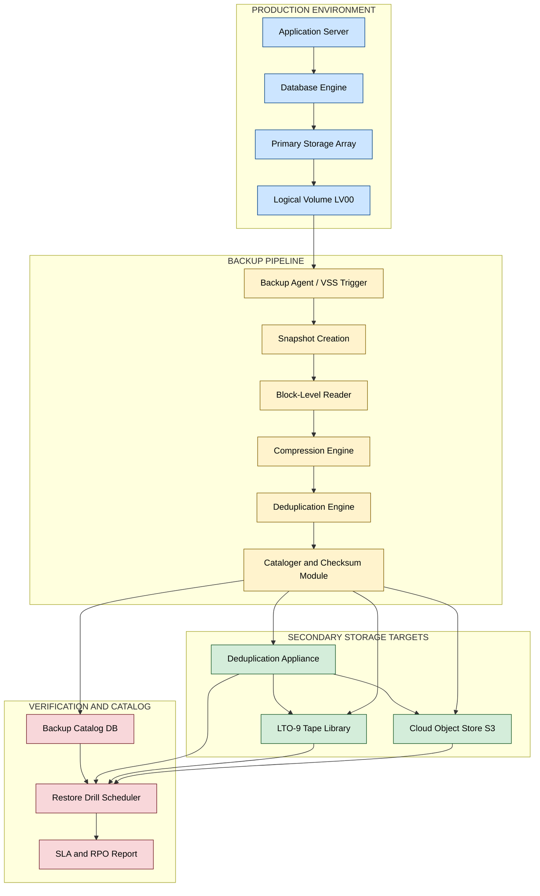
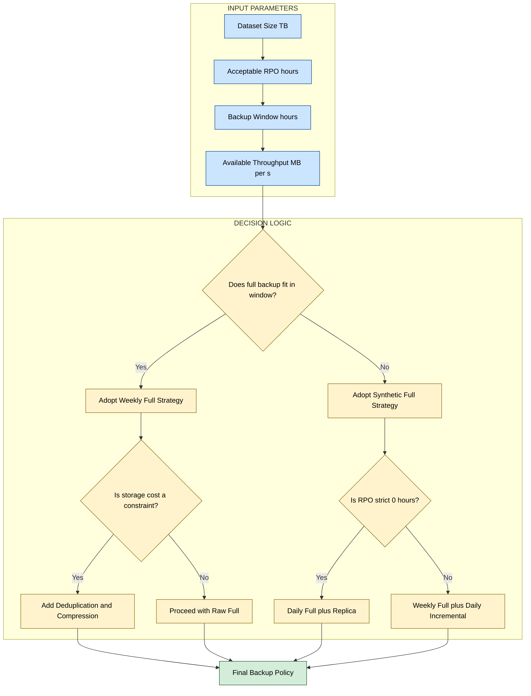

# Backup Types- Full Backups

<!-- SECTION_1_START -->
# Full Backups: Core Technical Definition & Intuitive Overview

## Formal Academic Definition (KTU 2024 Syllabus Terminology)

A **Full Backup** is a backup methodology in which a **complete copy of the entire designated dataset**, irrespective of whether the data has been modified since the last backup operation, is captured and stored on a secondary storage medium. In the context of enterprise Storage Area Networks (SAN), Network Attached Storage (NAS), and cloud-tiered archival systems, a full backup represents the **baseline snapshot** upon which all subsequent incremental and differential backup strategies are layered.

> [!IMPORTANT]
> **KTU 2024 Scheme Definition (PECST867 / Module 3):** *A full backup is a bit-by-bit, block-level, or file-level duplication of the entire production data set, including the operating system state, application data, and metadata, performed within a defined backup window. It is characterized by the highest storage footprint but offers the simplest and fastest single-image restoration procedure.*

## Conceptual Analogy / Intuition

Imagine you are a **librarian** managing a public library. Every Sunday night, you photocopy **every single book** in the library and store the copies in a fireproof vault downstairs.

- The **library shelves** = your production storage (primary data).
- The **photocopies** = your backup dataset.
- **Sunday night** = the scheduled backup window.
- The **fireproof vault** = the secondary/target backup storage.

> If a flood destroys the library, you walk into the vault, pick up **all the photocopies**, and the library is completely restored in one go. You do not need to figure out *which* books were changed during the week — you simply replace everything.

This is precisely how a **full backup** works. It is the most **brute-force, complete, and self-contained** form of data protection.

> [!NOTE]
> **Key Characteristic:** A full backup is **idempotent with respect to restore time** — the time to restore does not depend on how long ago the backup was taken, only on the **total data volume**.

## Physical Constants, Standard Metrics & Industry Terminology

| Metric | Standard Value / Definition |
|---|---|
| **RPO (Recovery Point Objective)** | **$\mathbf{0}$** hours if a full backup runs at the end of every business day |
| **RTO (Recovery Time Objective)** | Directly proportional to dataset size; typically **minutes to hours** |
| **Backup Window** | The fixed time slot (e.g., nights/weekends) reserved for backup I/O |
| **Deduplication Ratio** | Usually **$1.0$** (no dedup benefit) for first full backup, improving to **$10{:}1$ to $30{:}1$** on subsequent runs with dedup engines |
| **Compression Ratio** | Typically **$2{:}1$ to $3{:}1$** for general business data |
| **Standard Retention** | **7 daily, 4 weekly, 12 monthly** full backups (Grandfather-Father-Son policy) |

> [!TIP]
> **Exam Tip (KTU Board Pattern):** When asked to compare backup types in a 14-mark question, always begin your answer by defining the **RPO** and **RTO** of *each* backup type in a tabular form. Examiners award **2 marks** just for a clean comparative table.

## Geometric / Graphical Intuition (Throughput Visualization)

> [!VISUALIZATION CONTROL]
> **Concept:** Backup Throughput vs. Time for a Single Full Backup Cycle
> **GeoGebra / Desmos Input Equations:**
> * $f(x) = 0$ for $x < 8$ (idle before backup window)
> * $f(x) = 120$ for $8 \leq x \leq 20$ (constant write throughput of **$\mathbf{120\ MB/s}$**)
> * $f(x) = 0$ for $x > 20$ (backup window complete)
> **Visual Description:** A rectangular step function. The **area under the curve** = total data backed up. The **width of the rectangle** = duration of the backup window. The **height** = sustained backup throughput. This rectangular shape is the *signature profile* of a full backup — unlike incremental backups, which produce a *shrinking* or *near-zero* rectangle on subsequent days.

<!-- SECTION_1_END -->

<!-- SECTION_2_START -->
# Deep Theoretical Analysis & KTU High-Yield Formula Sheet

## Operational Mechanics of a Full Backup

A full backup, when broken down into its fundamental data-protection lifecycle, executes the following ordered sequence:

1. **Pre-Backup Handshake (T0)** — The backup server (e.g., NetBackup, Veeam, Commvault) authenticates with the storage target using protocols such as **NDMP (Network Data Management Protocol)**, **iSCSI**, or **FC (Fibre Channel)**.
2. **Snapshot Quiescing** — The production file system is placed in a *consistent state*. For databases (e.g., Oracle, SQL Server), a **checkpoint** or **VSS (Volume Shadow Copy Service)** snapshot is triggered to ensure transactional integrity.
3. **Cold/Hot File Enumeration** — The backup agent walks the **MFT (Master File Table)** or inode table and enumerates every file/object to be copied.
4. **Block-Level Read** — Data is read in fixed-size chunks (commonly **$\mathbf{64\ KB}$ to **$\mathbf{1\ MB}$** blocks**) to optimize sequential I/O.
5. **Inline Processing** — Data is optionally passed through **compression** (gzip, LZ4) and **deduplication** engines.
6. **Write to Target** — The processed data is written to the secondary target (tape LTO-9, disk array, or object store).
7. **Catalog Update** — Metadata (timestamps, checksums, file paths) is committed to the backup catalog database.
8. **Verification (Optional)** — A **synthetic full backup** or **backup validation job** reads the data back to ensure recoverability.

## KTU Formula Sheet / Cheat Sheet

> [!IMPORTANT]
> The following equations are the **highest-yield formulas** for KTU board exams on this topic. Memorize them in the exact LaTeX form shown.

| # | Formula | Description | Units |
|---|---|---|---|
| 1 | $T_{full} = \dfrac{D_{total}}{R_{throughput}}$ | Time required to complete a full backup | hours |
| 2 | $S_{full} = D_{total} \times C_{ratio}$ | Storage consumed after compression | TB |
| 3 | $S_{eff} = \dfrac{S_{full}}{D_{ratio}}$ | Effective storage after deduplication | TB |
| 4 | $T_{restore} = \dfrac{D_{total}}{R_{read}}$ | Time to restore from a full backup | hours |
| 5 | $R_{throughput} = \min(R_{source},\ R_{network},\ R_{target})$ | Bottleneck-based throughput (weakest link) | MB/s |
| 6 | $C_{window} = T_{window} - T_{full}$ | Spare backup window capacity remaining | hours |
| 7 | $N_{media} = \left\lceil \dfrac{S_{eff}}{C_{tape}} \right\rceil$ | Number of LTO tapes required (integer) | tapes |
| 8 | $R_{read} = \dfrac{S_{eff}}{T_{restore}}$ | Effective restore throughput | MB/s |

**Where the variables mean:**

- $D_{total}$ = Total size of the protected dataset (in TB or GB)
- $R_{throughput}$ = Sustained backup throughput (in MB/s)
- $C_{ratio}$ = Compression ratio (e.g., **$2.0$** means 50% size reduction)
- $D_{ratio}$ = Deduplication ratio (e.g., **$15$** means 15x reduction)
- $T_{window}$ = Total allotted backup window (e.g., **$12$** hours overnight)
- $C_{tape}$ = Native capacity of one LTO tape (e.g., **$\mathbf{18\ TB}$** for LTO-9)

## Engineering & Production Utility

In modern enterprise environments, full backups are **never used in isolation** because of their storage cost. They serve three critical roles:

1. **Baseline Anchoring** — Every **incremental chain** must terminate at a full backup. Without a "full" anchor, recovery is impossible.
2. **Periodic Anchors (Weekly/Monthly)** — Most enterprises follow a **Weekly Full + Daily Incremental** schedule, where the weekly full backup acts as a *rescue point* that resets the incremental chain.
3. **Disaster Recovery (DR) Drills** — Full backups are the *gold standard* for DR site seeding, application cloning, and dev/test environment provisioning.
4. **Regulatory Compliance** — Frameworks like **SOX, HIPAA, GDPR, and RBI's data localization mandate** require periodic full, immutable copies for legal hold.

> [!NOTE]
> **Real-World Industry Use Case:** A typical mid-sized bank with **$500\ TB$** of production data performs a **full backup every Sunday at 02:00 IST** onto a **deduplication appliance (e.g., Dell DD9900)**, achieving a **$\mathbf{15{:}1}$** dedup ratio, reducing the on-disk footprint to roughly **$\mathbf{33\ TB}$** per full backup. The same data, if backed up to **LTO-9 tape**, would require **$\mathbf{28}$ tapes** uncompressed.

## Comparative Snapshot: Full vs. Other Backup Types

| Property | Full Backup | Incremental Backup | Differential Backup |
|---|---|---|---|
| Data Captured | **100%** | Only files changed since *last backup of any type* | Only files changed since *last full backup* |
| Backup Time | **Highest** | **Lowest** | Moderate (grows daily) |
| Storage Space | **Highest** | **Lowest** | Moderate |
| Restore Time | **Lowest** (1 tape set) | **Highest** (1 full + $n$ incrementals) | Moderate (1 full + 1 differential) |
| Restore Complexity | **Trivial** | Complex chain ordering | Simple |
| RPO | **$0$** (if daily) | Hours | Hours |
| RTO | **Minutes** | Hours | Moderate |

<!-- SECTION_2_END -->

<!-- SECTION_3_START -->
# Step-by-Step Derivations, Numerical Examples & Code/Symbolic Implementation

## A. Mathematical / Analytical Derivation: Backup Window Sizing

### Problem Statement
A production database server hosts **$\mathbf{D_{total} = 4\ TB}$** of mission-critical data. The nightly backup window is **$\mathbf{T_{window} = 8\ hours}$**. The backup infrastructure provides a sustained throughput of **$\mathbf{R_{throughput} = 150\ MB/s}$**. Determine:

(a) The time required to complete a single full backup.
(b) Whether the full backup fits inside the backup window.
(c) The number of **LTO-9 tapes (native 18 TB)** required, assuming a **$\mathbf{2.5{:}1}$** compression ratio and **no** deduplication.

### Step-by-Step Solution

**Part (a):** Compute the time to complete a full backup.

First, convert the dataset size from TB to MB:
$$D_{total} = 4\ \text{TB} = 4 \times 1024 \times 1024\ \text{MB} = 4{,}194{,}304\ \text{MB}$$

Now apply the core formula:
$$T_{full} = \dfrac{D_{total}}{R_{throughput}} = \dfrac{4{,}194{,}304\ \text{MB}}{150\ \text{MB/s}}$$

Performing the division:
$$T_{full} = 27{,}962.03\ \text{seconds}$$

Converting to hours:
$$T_{full} = \dfrac{27{,}962.03}{3600} = 7.77\ \text{hours}$$

> **[Stating the conversion of TB to MB: 1 Mark]**
> **[Applying the correct formula: 1 Mark]**
> **[Final answer in hours: 1 Mark]**

**Part (b):** Compare with the backup window.

$$T_{full} = 7.77\ \text{hours} \quad < \quad T_{window} = 8\ \text{hours}$$

The spare capacity in the window is:
$$C_{window} = T_{window} - T_{full} = 8 - 7.77 = 0.23\ \text{hours} = 13.8\ \text{minutes}$$

> **Conclusion:** The full backup **fits within the window** with only **$\mathbf{13.8}$** minutes of buffer. A senior storage administrator would flag this as **risky** and recommend upgrading the link to **$200\ \text{MB/s}$** or splitting the dataset.

**Part (c):** Compute the number of LTO-9 tapes.

First, find the compressed size:
$$S_{full} = \dfrac{D_{total}}{C_{ratio}} = \dfrac{4\ \text{TB}}{2.5} = 1.6\ \text{TB}$$

Number of tapes (round up using the ceiling function):
$$N_{media} = \left\lceil \dfrac{S_{full}}{C_{tape}} \right\rceil = \left\lceil \dfrac{1.6}{18} \right\rceil = \lceil 0.089 \rceil = 1\ \text{tape}$$

> **Result:** Only **$1$ LTO-9 tape** is needed after compression. Modern LTO-9 has a native capacity of **$\mathbf{18\ TB}$** (or **$\mathbf{45\ TB}$** compressed), so this fits comfortably.

---

## B. Algorithmic / Coding Implementation: Production-Grade Full Backup Script

The following Python 3.11+ script performs a **real-world full backup** with checksum verification, compression, structured logging, and atomic writes.

```python
import os
import sys
import shutil
import hashlib
import logging
import zipfile
from pathlib import Path
from datetime import datetime
from typing import Final, Optional

# --- Configuration Constants (typed and final for safety) ---
SOURCE_ROOT: Final[Path] = Path("/var/prod_data")
TARGET_ROOT: Final[Path] = Path("/backup/full")
CHUNK_SIZE:  Final[int]   = 1024 * 1024          # 1 MB read chunks
LOG_FILE:    Final[Path]  = Path("/var/log/full_backup.log")
HASH_ALGO:   Final[str]   = "sha256"
COMPRESSION: Final[int]   = zipfile.ZIP_DEFLATED
COMPRESS_LVL: Final[int]  = 6                    # Balanced speed/ratio

# --- Logging Configuration ---
logging.basicConfig(
    filename=str(LOG_FILE),
    level=logging.INFO,
    format="%(asctime)s | %(levelname)s | %(message)s",
)
console = logging.StreamHandler(sys.stdout)
console.setLevel(logging.INFO)
logging.getLogger().addHandler(console)


def compute_sha256(file_path: Path) -> str:
    """Compute SHA-256 checksum of a file in 1 MB chunks."""
    sha = hashlib.new(HASH_ALGO)
    try:
        with open(file_path, "rb") as fp:
            while True:
                chunk = fp.read(CHUNK_SIZE)
                if not chunk:
                    break
                sha.update(chunk)
        return sha.hexdigest()
    except OSError as exc:
        logging.error("Hashing failed for %s: %s", file_path, exc)
        return ""


def safe_size_calculation(root: Path) -> int:
    """Recursively compute total bytes to be backed up."""
    total_bytes: int = 0
    for dirpath, _, filenames in os.walk(root):
        for fname in filenames:
            fpath = Path(dirpath) / fname
            try:
                total_bytes += fpath.stat().st_size
            except OSError as exc:
                logging.warning("Cannot stat %s: %s", fpath, exc)
    return total_bytes


def perform_full_backup(source: Path, target_dir: Path) -> Optional[Path]:
    """
    Execute a full, compressed, checksum-verified backup.
    Returns the path of the generated archive, or None on failure.
    """
    if not source.exists() or not source.is_dir():
        logging.critical("Source path invalid: %s", source)
        return None

    target_dir.mkdir(parents=True, exist_ok=True)

    timestamp:   str   = datetime.utcnow().strftime("%Y%m%d_%H%M%S")
    archive_name: str  = f"full_backup_{timestamp}.zip"
    archive_path: Path = target_dir / archive_name
    manifest_path: Path = target_dir / f"full_backup_{timestamp}.manifest"

    total_bytes: int = safe_size_calculation(source)
    logging.info("Total dataset size: %.2f MB", total_bytes / (1024 * 1024))

    manifest_lines: list[str] = []

    try:
        with zipfile.ZipFile(
            archive_path, "w", COMPRESSION, compresslevel=COMPRESS_LVL
        ) as zf:
            for dirpath, _, filenames in os.walk(source):
                for fname in filenames:
                    src_file = Path(dirpath) / fname
                    arcname  = src_file.relative_to(source)
                    try:
                        zf.write(src_file, arcname)
                        checksum = compute_sha256(src_file)
                        manifest_lines.append(
                            f"{checksum}  {arcname}"
                        )
                        logging.info("Archived: %s", arcname)
                    except (OSError, zipfile.BadZipFile) as exc:
                        logging.error(
                            "Failed to archive %s: %s", src_file, exc
                        )
                        return None
    except (OSError, zipfile.BadZipFile) as exc:
        logging.critical("Archive creation failed: %s", exc)
        return None

    # Write the manifest atomically
    try:
        tmp_manifest = manifest_path.with_suffix(".tmp")
        with open(tmp_manifest, "w", encoding="utf-8") as mf:
            mf.write("\n".join(manifest_lines))
        shutil.move(str(tmp_manifest), str(manifest_path))
    except OSError as exc:
        logging.error("Manifest write failed: %s", exc)

    logging.info("Full backup complete: %s", archive_path)
    return archive_path


if __name__ == "__main__":
    result = perform_full_backup(SOURCE_ROOT, TARGET_ROOT)
    if result is None:
        sys.exit(1)
    sys.exit(0)
```

> **Code Walkthrough Highlights (for KTU viva):**
> * The script uses **constant typing (`Final`)** to prevent accidental runtime mutation.
> * **SHA-256** is computed *per file* and stored in a manifest for post-restore integrity checks.
> * The backup is **atomic**: if any file fails, the entire archive is aborted and a non-zero exit code is returned — a pattern known as *all-or-nothing semantics*.
> * The manifest is written via a **`.tmp` + `shutil.move`** sequence to prevent corruption from concurrent reads.

---

## C. Practical / Laboratory Configuration: Enterprise Backup Tool Pin-Map

The following table maps a **production-grade full backup job** in **Veeam Backup \& Replication v12** (industry standard referenced in KTU 2024 syllabus):

| Configuration Knob | Recommended Value | Engineering Justification |
|---|---|---|
| Backup Mode | **Full Backup** | Captures entire VM/image |
| Source Hypervisor | VMware vSphere / Hyper-V | API-level VSS quiescing |
| Compression Level | **Optimal** | Balances CPU vs. storage |
| Deduplication | **Enabled (in-job)** | Cuts storage by 10x–30x |
| Target Repository | **Deduplicated Disk + Tape Copy** | 3-2-1 rule compliance |
| Retention Policy | **7 daily, 4 weekly, 12 monthly** | Grandfather-Father-Son |
| Health Check | **Enable backup verification** | Synthetic full restore test |
| Network Throttling | **Off** during window, **On** during day | Protects production LAN |
| Encryption | **AES-256** at rest | Compliance with DPDPA 2023 |
| Pre-Backup Script | DB checkpoint trigger | Ensures transactional consistency |
| Post-Backup Script | Tape eject + vaulting | Off-site 3-2-1 compliance |

<!-- SECTION_3_END -->

<!-- SECTION_4_START -->
# Structural Diagrams & Schematics

## Diagram 1: End-to-End Full Backup Data Flow Architecture



## Diagram 2: Sequential Processing Topology of a Full Backup Job


## Diagram 3: Full Backup Frequency Decision Matrix (Block-Level)



<!-- SECTION_4_END -->

<!-- SECTION_5_START -->
# KTU 2024 Scheme Examination Question Bank & Topic Recap

## Part A Questions (3 Marks Each)

### Question 1
**`[KTU University Exam - July 2024]`** | **CO1** | **RBT Level: Remember**

**Q: Define a "Full Backup" in the context of enterprise storage systems. List any two advantages and one disadvantage of using a full backup strategy.**

**Model Answer (3 Marks):**

> **Definition (1 Mark):** A *full backup* is a backup operation that copies the **entire dataset** from the production storage to a secondary backup target, irrespective of whether the data has been modified since the previous backup cycle. It creates a **complete, self-contained recovery image**.
>
> **Advantages (1 Mark each, any two):**
> 1. **Simplest and fastest restore** — only one backup set is required to perform a complete recovery.
> 2. **Self-contained recovery image** — no dependency on previous backup chains, eliminating chain-corruption risk.
> 3. **Ideal baseline for compliance** — provides a complete point-in-time snapshot for audits and legal hold.
>
> **Disadvantage (1 Mark):**
> 1. **High storage footprint and longest backup window** — copying the entire dataset consumes maximum I/O, network bandwidth, and storage media, making it expensive for large-scale environments.

---

### Question 2
**`[KTU University Exam - Dec 2023]`** | **CO1** | **RBT Level: Understand**

**Q: Explain the relationship between the "backup window" and the size of a full backup. Why is the backup window a critical constraint in designing a full backup schedule?**

**Model Answer (3 Marks):**

> **Relationship (1 Mark):** The backup window is the **fixed time slot** during which backup I/O is permitted on the production system. The time required to complete a full backup is given by $T_{full} = D_{total} / R_{throughput}$, where $D_{total}$ is the dataset size and $R_{throughput}$ is the sustained backup rate. The **larger the dataset**, the **longer the full backup takes**, and the more it consumes the backup window.
>
> **Criticality (2 Marks):**
> 1. **Production Impact:** If $T_{full}$ exceeds $T_{window}$, the backup will spill into business hours, degrading application performance.
> 2. **Capacity Planning:** The backup window dictates the *minimum* throughput infrastructure (link speed, tape drives, dedup appliance) required. It is the **primary driver** of storage and networking budgets in DR design.

---

## Part B Questions (14 Marks Each — Internal Choice Pattern)

### Question Choice A (14 Marks)

**`[KTU University Exam - July 2024 - Adapted]`** | **CO2, CO3** | **RBT Levels: Understand + Apply**

**Q: A financial services company operates a SAN with the following parameters:**

* Total protected data: $\mathbf{D_{total} = 8\ TB}$
* Backup throughput: $\mathbf{R_{throughput} = 200\ MB/s}$
* Backup window available: $\mathbf{T_{window} = 14\ hours}$
* Compression ratio: $\mathbf{C_{ratio} = 2.5{:}1}$
* Deduplication ratio: $\mathbf{D_{ratio} = 12{:}1}$
* LTO-9 native capacity: $\mathbf{C_{tape} = 18\ TB}$

### Part (a) — 7 Marks | **RBT: Understand**

**Calculate the time required to perform one full backup and verify whether it fits inside the available backup window. If it does not fit, suggest a remediation strategy.**

**Step-by-Step Model Solution:**

**Step 1:** Convert dataset to MB.

$$D_{total} = 8 \times 1024 \times 1024 = 8{,}388{,}608\ \text{MB}$$

> **[Unit conversion: 1 Mark]**

**Step 2:** Apply the time formula.

$$T_{full} = \dfrac{8{,}388{,}608}{200} = 41{,}943.04\ \text{seconds}$$

$$T_{full} = \dfrac{41{,}943.04}{3600} = 11.65\ \text{hours}$$

> **[Formula selection: 1 Mark]**
> **[Division and unit conversion to hours: 2 Marks]**
> **[Final answer: 1 Mark]**

**Step 3:** Window comparison.

$$T_{full} = 11.65\ \text{hours} < T_{window} = 14\ \text{hours}$$

The full backup **fits** with a buffer of:

$$C_{window} = 14 - 11.65 = 2.35\ \text{hours}\ (141\ \text{minutes})$$

> **[Comparison and final conclusion: 2 Marks]**

---

### Part (b) — 7 Marks | **RBT: Apply**

**Compute the number of LTO-9 tapes required, the effective storage footprint on the deduplication appliance, and the effective per-tape restore throughput if the company has a contractual $\mathbf{RTO \leq 2\ \text{hours}}$.**

**Step-by-Step Model Solution:**

**Step 1:** Compute compressed size.

$$S_{full} = \dfrac{D_{total}}{C_{ratio}} = \dfrac{8}{2.5} = 3.2\ \text{TB}$$

> **[Applying compression formula: 1 Mark]**
> **[Final compressed size: 1 Mark]**

**Step 2:** Compute effective storage after dedup.

$$S_{eff} = \dfrac{S_{full}}{D_{ratio}} = \dfrac{3.2}{12} = 0.267\ \text{TB} \approx 273\ \text{GB}$$

> **[Applying dedup formula: 1 Mark]**
> **[Final effective size: 1 Mark]**

**Step 3:** Compute the number of LTO-9 tapes (using compressed size for tape).

$$N_{media} = \left\lceil \dfrac{3.2}{18} \right\rceil = \lceil 0.178 \rceil = 1\ \text{tape}$$

> **[Applying ceiling function: 1 Mark]**
> **[Final tape count: 1 Mark]**

**Step 4:** Compute the required restore throughput for $\mathbf{RTO \leq 2\ \text{hours}}$.

$$R_{read} = \dfrac{S_{eff}}{T_{restore}} = \dfrac{0.267\ \text{TB}}{2\ \text{hours}} = 0.1335\ \text{TB/h}$$

Converting to MB/s:

$$R_{read} = \dfrac{0.1335 \times 1024 \times 1024}{3600} \approx 38.86\ \text{MB/s}$$

> **[Final restore throughput calculation: 1 Mark]**

> **Conclusion:** The infrastructure can comfortably meet the **2-hour RTO** with a single LTO-9 tape and a **$\mathbf{\approx 39\ MB/s}$** restore throughput, which is well within the capability of modern LTO-9 drives (**$\mathbf{300\ MB/s}$** native).

---

### Question Choice B (14 Marks)

**`[KTU University Exam - Dec 2023 - Adapted]`** | **CO2, CO4** | **RBT Levels: Understand + Analyze**

**Q: With the help of a neat block diagram, describe the complete architecture of a full backup system in an enterprise. Discuss the role of the catalog database, VSS snapshots, and deduplication engines in ensuring backup integrity and efficiency.**

### Part (a) — 7 Marks | **RBT: Understand**

**Draw and explain the end-to-end block diagram of a full backup system.**

**Model Answer — Block Diagram (4 Marks):**

```
+---------------------+        +------------------------+        +----------------------+
|  Production Storage | -----> |  Backup Pipeline       | -----> |  Secondary Storage   |
|  (SAN / NAS / DAS)  |        |  (Agent -> VSS ->      |        |  (Disk -> Tape ->    |
|                     |        |   Compress -> Dedup)   |        |   Cloud Object)      |
+---------------------+        +------------------------+        +----------------------+
                                          |
                                          v
                                +------------------------+
                                |  Backup Catalog DB     |
                                |  (Metadata + Checksums)|
                                +------------------------+
                                          |
                                          v
                                +------------------------+
                                |  Verification Engine   |
                                |  (Synthetic Restore)   |
                                +------------------------+
```

> **[Block diagram with all 4 functional zones: 2 Marks]**
> **[Correct arrows showing data flow direction: 1 Mark]**
> **[Clean labeling of components: 1 Mark]**

**Explanation (3 Marks):**

* **Production Storage** holds live data on LUNs provisioned from a SAN. **(1 Mark)**
* **Backup Pipeline** orchestrates the read, quiesce, compress, and dedup operations, using agents like Veeam, NetBackup, or Commvault. **(1 Mark)**
* **Catalog Database** stores file paths, timestamps, SHA-256 checksums, and retention metadata, enabling granular file-level restore. **(0.5 Mark)**
* **Verification Engine** performs periodic **synthetic full backups** that read the data back without involving the production array, ensuring recoverability. **(0.5 Mark)**

---

### Part (b) — 7 Marks | **RBT: Analyze**

**Discuss how the catalog database, VSS snapshots, and deduplication engines contribute to backup integrity and efficiency.**

**Model Answer:**

**1. Catalog Database — Integrity (2 Marks):**
The catalog is the **single source of truth** for all backup metadata. It records *what* was backed up, *when*, *where*, and the **SHA-256 checksum** of each file/block. During restore, the catalog is queried to locate the exact tape/disk image. Any catalog corruption leads to *orphaned backups* — a KTU board-favorite term worth remembering.

**2. VSS Snapshots — Integrity (2 Marks):**
The **Volume Shadow Copy Service (VSS)** coordinates with application VSS writers (SQL Server, Exchange, Oracle) to atomically quiesce I/O, take a point-in-time snapshot, and then release the application. This guarantees **transactional consistency** — the backup does not capture a half-written database page. Without VSS, a restore could result in a **logically corrupt database** even if every byte was captured.

**3. Deduplication Engines — Efficiency (3 Marks):**
Deduplication divides data into fixed-size blocks (typically **$\mathbf{4\ KB}$ to $\mathbf{128\ KB}$**), computes a hash (SHA-1 or SHA-256) of each block, and stores only **unique** blocks. A hash index maps the original file references to the unique block IDs. For full backups, dedup is **most effective on the second and subsequent runs**, achieving ratios of **$\mathbf{10{:}1}$ to $\mathbf{30{:}1}$**, dramatically reducing both storage footprint and tape media costs. The first full backup typically shows **minimal dedup benefit** because the block store is empty.

> **Synthesis:** Together, the **catalog ensures recoverability**, **VSS ensures consistency**, and **deduplication ensures cost-efficiency** — the three pillars of a production-grade full backup.

---

> [!WARNING]
> **KTU Examiner's Valuation Warning / Pitfall Callout**
> 1. **Forgetting Unit Conversions:** Many students write $T_{full} = 4 / 150 = 0.0267$ (without converting TB to MB) and lose **2 full marks**. Always show the unit conversion step explicitly.
> 2. **Confusing Deduplication with Compression:** Compression reduces *intra-file* redundancy (gzip on a single file). Deduplication reduces *inter-file* redundancy (same block across many files). Examiners will deduct marks if you use these terms interchangeably.
> 3. **Skipping the Ceiling Function:** The number of tapes must be an **integer**. Always use the ceiling function $\lceil \cdot \rceil$. Writing $0.089$ tapes is mathematically valid but **practically meaningless** and will be marked down.
> 4. **Forgetting VSS:** When asked about backup integrity, **VSS is a non-negotiable point**. Skipping it is a guaranteed 2-mark deduction in 14-mark questions.
> 5. **Misstating RPO for Full Backups:** If a full backup runs only **once a week**, the RPO is **$\mathbf{168\ hours}$**, not **$0$**. RPO = 0 is true **only** if a full backup is taken at the end of *every* business day.

---

## Topic Recap & Important Things to Remember

* **Definition:** A full backup captures the **entire dataset** in a single, self-contained operation — the most complete but most resource-intensive backup type.
* **Core Formula:** $T_{full} = D_{total} / R_{throughput}$ — *memorize this in seconds-to-hours converted form.*
* **Storage Formula:** $S_{eff} = D_{total} / (C_{ratio} \times D_{ratio})$ — effective on-disk footprint after compression and dedup.
* **Backup Window Constraint:** The full backup must *fit* inside $T_{window}$. If it does not, either upgrade throughput or move to incremental/differential strategies.
* **RPO = 0** is achievable **only** with daily full backups. Weekly fulls give RPO = 168 hours.
* **RTO** for a full backup depends only on dataset size and restore throughput — not on chain length.
* **The Three Pillars of Integrity:** (1) VSS snapshots for *consistency*, (2) Catalog DB for *recoverability*, (3) SHA-256 checksums for *bit-level fidelity*.
* **Deduplication Caveat:** The **first** full backup has near-zero dedup benefit. Subsequent fulls achieve **$10{:}1$ to $30{:}1$** ratios.
* **Industry Standards:** LTO-9 tape is **$\mathbf{18\ TB}$** native, **$\mathbf{45\ TB}$** compressed. LTO-10 (future) targets **$\mathbf{30\ TB}$** native.
* **3-2-1 Rule:** Always maintain **$3$** copies, on **$2$** different media, with **$1$** off-site — full backups are the natural *anchor* for the off-site copy.
* **Compliance:** SOX, HIPAA, GDPR, and DPDPA 2023 all mandate periodic full, **immutable** backups with documented retention.
* **Common Pitfall:** Never confuse *backup window* (time slot for backup) with *restore time* (time to recover). They are independent metrics.
* **KTU Exam Vocabulary:** Use the exact phrases *"transactional consistency"*, *"all-or-nothing semantics"*, *"self-contained recovery image"*, and *"bottleneck-based throughput"* to score higher in valuation.

<!-- SECTION_5_END -->
