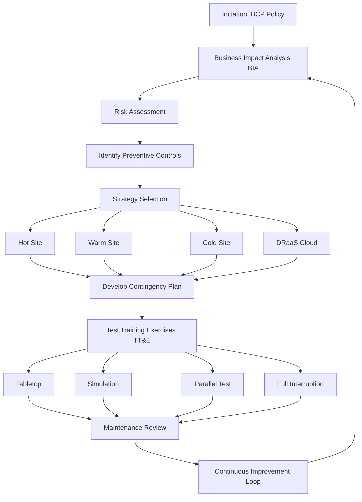
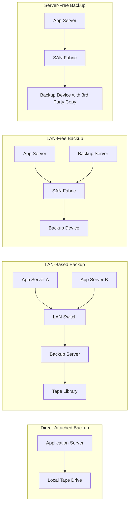
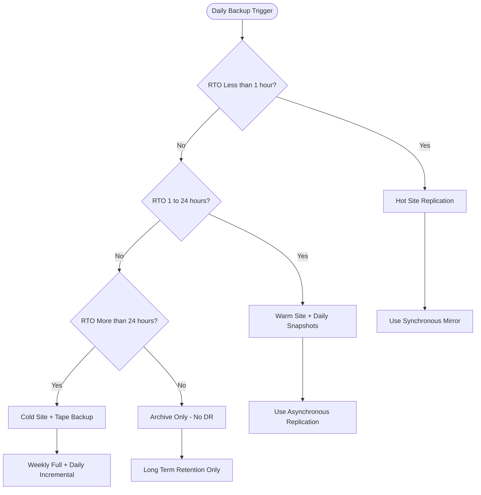
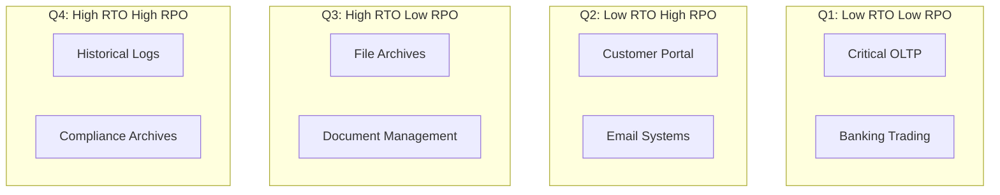
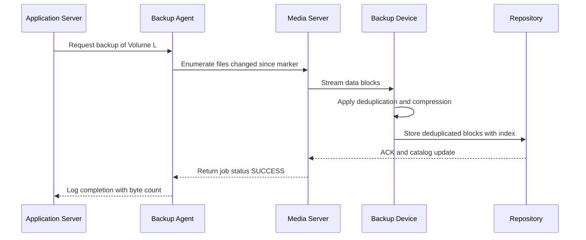
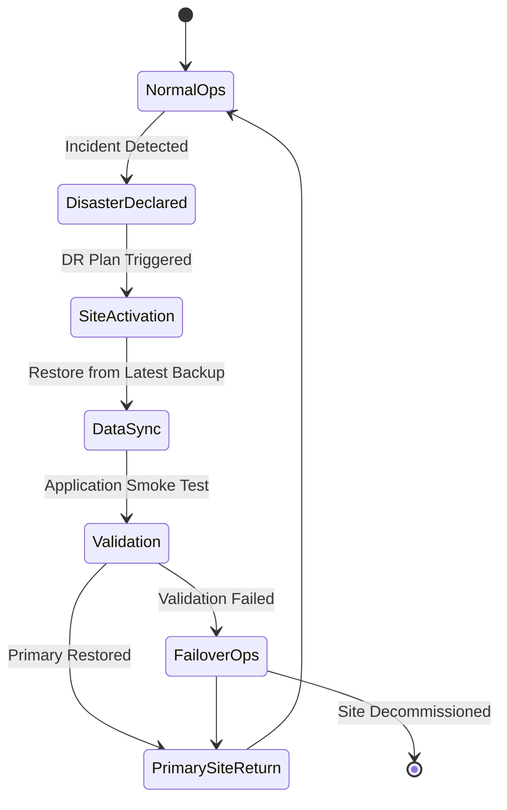

# Business Continuity, Backup and Recovery:-

<!-- SECTION_1_START -->
# STORAGE SYSTEMS (PECST867) — Module 3

## Business Continuity, Backup and Recovery

### 1.1 Core Technical Definition

> [!IMPORTANT]
> **Business Continuity (BC)** is a holistic management process that identifies potential threats to an organization and provides a framework for building organizational resilience and the capability for an effective response that safeguards the interests of its key stakeholders, reputation, brand, and value-creating activities.

**Disaster Recovery (DR)** is the coordinated process of restoring IT systems, applications, and data after a disruptive event. It is the *technical subset* of Business Continuity Planning (BCP) that focuses exclusively on the recovery of information services.

**Backup** is the act of copying and archiving data so that it may be used to restore the original after a data loss event. **Recovery** is the act of restoring that data back to its operational state.

> [!NOTE]
> **Key KTU 2024 Distinction**:
> - **BCP (Business Continuity Plan)** → Process-level, organization-wide policy covering *people, process, and technology*.
> - **DRP (Disaster Recovery Plan)** → Technology-level, IT-focused subset that restores infrastructure and data.

### 1.2 Conceptual Analogy / Intuition

Imagine your house has a **fire safety system**. You have smoke detectors (early warning), a fire extinguisher (immediate response), an escape plan (BCP), and an external relative's house where the family can stay for a few months during reconstruction (DR site). The **time it takes to reach the relative's house** is your RTO, and the **items you packed in a small emergency bag** represent your RPO — everything else, you lose.

- **Insurance policy** = Risk assessment
- **Fire extinguisher** = Preventive controls
- **Backup copy stored in a bank locker** = Off-site backup
- **The relative's house** = Recovery site (cold, warm, or hot)

> [!IMPORTANT]
> **RTO (Recovery Time Objective)** — The *maximum acceptable duration* after a disaster before a system, application, or process **must be restored to service**. Expressed in minutes, hours, or days.
>
> **RPO (Recovery Point Objective)** — The *maximum acceptable amount of data loss* measured in time. It defines the age of the files that must be recovered from backup storage for normal operations to resume.

### 1.3 Industry-Standard Metrics (KTU High-Yield Definitions)

| Metric | Definition | Typical Value (Enterprise) |
|---|---|---|
| **RTO** | Maximum downtime tolerable | $\le 4$ hours |
| **RPO** | Maximum data loss tolerable | $\le 15$ minutes |
| **MTTR** | Mean Time To Repair | Hardware: 2–8 hrs |
| **MTBF** | Mean Time Between Failures | Disks: ~1,000,000 hrs |
| **SLA** | Service Level Agreement | 99.999% (5 nines) |
| **Annual Loss Expectancy (ALE)** | SLE $\times$ ARO | Formula-based |

Where:
- **SLE** (Single Loss Expectancy) = Asset Value $\times$ Exposure Factor
- **ARO** (Annualized Rate of Occurrence) = Expected number of occurrences per year

> [!TIP]
> KTU examiners frequently test the **difference between RTO and RPO**. RTO is a *time-forward* metric (downtime allowed), while RPO is a *time-backward* metric (data loss accepted).

### 1.4 Standard Reference Frameworks

The two most cited industry frameworks used in storage syllabus are:

1. **NIST SP 800-34 Rev. 1** — *Contingency Planning Guide for Federal Information Systems* (7-step methodology).
2. **ISO 22301:2019** — *Security and resilience — Business continuity management systems*.
3. **DRBD / ITIL v4** — IT Infrastructure Library change and incident management.

> [!VISUALIZATION CONTROL]
> **Concept:** RTO vs RPO Time-Line Visualization
> **Geometric Representation:**
> * $x$-axis = Time (T = 0 at disaster strike)
> * $y$-axis = Service Availability / Data Currency (0–100%)
> **Visual Description:** A horizontal line at $y=100\%$ representing normal operation. A vertical drop at $T=0$ (the disaster) to $y=0$. A point at $T=-t_{RPO}$ (data backup point) shows data recency. A point at $T=+t_{RTO}$ shows when service is restored. The shaded region between $T=0$ and $T=t_{RTO}$ is the **downtime window**; the shaded region between $T=-t_{RPO}$ and $T=0$ is the **data loss window**.

<!-- SECTION_1_END -->

<!-- SECTION_2_START -->
# SECTION 2 — Deep Theoretical Analysis

## 2.1 The Seven-Phase BCP/DR Methodology (NIST SP 800-34)

1. **Develop the contingency planning policy statement.**
2. **Conduct the Business Impact Analysis (BIA).** Identify critical systems, dependencies, and quantify impact.
3. **Identify preventive controls.** Reduce the likelihood of a disruption.
4. **Create contingency strategies.** Hot, warm, cold, and mobile sites.
5. **Develop an IT contingency plan.** Detailed restoration procedures.
6. **Plan testing, training, and exercises (TT\&E).** Tabletop, simulation, parallel, cutover, full-interruption.
7. **Plan maintenance.** Update contact lists, system configurations, and recovery procedures.

## 2.2 The Business Impact Analysis (BIA)

The BIA assigns an **MTPD (Maximum Tolerable Period of Disruption)** to each business process. The critical-tier classification is shown below.

| Tier | Description | RTO Range | RPO Range | Examples |
|---|---|---|---|---|
| **Tier 0 — Mission-Critical** | Real-time, zero-downtime required | 0–15 min | 0–5 min | Stock exchange, ICU systems |
| **Tier 1 — Business-Critical** | Same-day recovery | 15 min – 4 hr | 5 min – 1 hr | ERP, e-commerce |
| **Tier 2 — Business-Operational** | 24-hour recovery | 4–24 hr | 1–8 hr | Email, file shares |
| **Tier 3 — Business-Administrative** | 72-hour recovery | 24–72 hr | 8–24 hr | HR records, archives |

## 2.3 Backup Architectures (KTU High-Yield)

### A. By Topology (Server Connection to Backup Device)

| Topology | Data Path | Bandwidth Impact | Use Case |
|---|---|---|---|
| **Direct-Attached Backup** | Server $\rightarrow$ Local Tape/Disk | Zero network | Single server, small business |
| **LAN-Based Backup** | Server $\rightarrow$ LAN $\rightarrow$ Backup Server | LAN saturated | Centralized, low-volume |
| **LAN-Free Backup** | Server $\rightarrow$ SAN $\rightarrow$ Backup Device | LAN spared, SAN used | Mid-to-large enterprise |
| **Server-Free Backup** | Backup Device reads LUN directly from SAN | No server CPU impact | Data-center, terabyte scale |

> [!IMPORTANT]
> **LAN-Free vs Server-Free Difference** (commonly confused):
> - *LAN-Free*: The **data** does not traverse the LAN, but a **backup server** still orchestrates the operation.
> - *Server-Free*: **No backup server** is involved. Third-party copy engines (e.g., SCSI-3 Extended Copy, NDMP) move data directly from source LUN to backup device.

### B. By Recovery Site Type

| Site Type | Hardware Ready? | Data Synced? | Cost (Relative) | RTO |
|---|---|---|---|---|
| **Hot Site** | Yes | Yes (synchronous) | $\$\$\$\$ | Seconds–minutes |
| **Warm Site** | Yes (partial) | Periodic | $\$ \$ $ | Hours |
| **Cold Site** | No (space only) | None | $\$$ | Days–weeks |
| **Mobile Site** | Trailer-based | Configurable | $\$ \$ $ | Variable |
| **Cloud DR (DRaaS)** | Virtualized | Near-real-time | Pay-per-use | Minutes |

### C. By Backup Method

| Method | Backs Up | Backup Time | Restore Time | Storage Used |
|---|---|---|---|---|
| **Full Backup** | Entire dataset | Long | Fast (1 set) | 1 $\times$ data |
| **Incremental** | Only changes since *last* backup | Short | Slow (chain) | 1 $\times$ data (cumulative) |
| **Differential** | Changes since *last full* | Medium | Medium | 2 $\times$ data |
| **Synthetic Full** | Periodic consolidation | Back-end build | Fast (1 set) | $\approx 1.5\times$ |
| **Forever Incremental** | Daily incrementals forever | Very short | Slow (long chain) | $\approx 1.05\times$ |
| **Snapshot-Based** | Point-in-time LUN/Volume copy | Near-instant | Fast | $\approx 1.2\times$ |

> [!TIP]
> **Synthetic Full Backup Formula**:
>
> $$\text{Storage}_{\text{synthetic}} = \text{Full}_{\text{latest}} + \sum_{i=1}^{n} \text{Incremental}_i$$
>
> The full backup is *reconstructed in the background* by combining the most recent full with all subsequent incrementals.

## 2.4 The 3-2-1 Rule of Backup (Industry Standard)

> [!IMPORTANT]
> **The 3-2-1 Rule**:
> - **3** copies of data (1 production + 2 backups)
> - **2** different media types (e.g., disk + tape)
> - **1** copy stored **off-site** (geographic separation)
>
> Modern extension — **3-2-1-1-0**: Add **1 immutable/air-gapped** copy and **0 errors** in verification.

## 2.5 KTU High-Yield Formula Sheet

> [!NOTE]
> All formulas are presented in raw LaTeX. The variable $D$ denotes logical data size, $C$ denotes change rate, $B$ denotes backup throughput, and $R$ denotes dedup ratio.

### Capacity & Window Calculations

$$
\begin{aligned}
\text{Backup Window} \; (T_w) &= \frac{D + \Delta D}{B} \\
\text{Full Capacity} &= D \times (1 + m) \\
\text{Incremental Capacity per day} &= D \times C \\
\text{Differential Capacity (day } k\text{)} &= D \times (1 - R_r) \times C \times k \\
\text{Physical Capacity after Dedup} &= \frac{\text{Logical Capacity}}{R_{dedup}}
\end{aligned}
$$

Where:
- $D$ = Total dataset size
- $\Delta D$ = Daily change rate (incremental)
- $B$ = Backup throughput (MB/s or GB/hr)
- $m$ = Metadata overhead factor (typically $0.05$–$0.15$)
- $C$ = Daily change-rate ratio (e.g., $0.10$ for 10%)
- $R_r$ = Compression ratio
- $R_{dedup}$ = Deduplication ratio (e.g., $10:1$ means $R_{dedup} = 10$)

### Recovery Site Cost Formula

$$
\text{Total DR Cost} = \text{Capital Expense} + \sum_{i=1}^{n} \text{Operational Expense}_i
$$

### Replication Bandwidth

$$
B_{replication} = \frac{\Delta D \times (1 + \text{overhead})}{T_{replication\;window}}
$$

### Recovery Time (Theoretical)

$$
T_{recovery} = T_{detect} + T_{notify} + T_{activate} + T_{restore} + T_{validate}
$$

## 2.6 Real-World Engineering Utility

- **Banking**: Hot-site with synchronous mirroring for transaction systems; cold-site for archival.
- **Healthcare**: HIPAA-mandated BCP with RPO $\le 4$ hours for patient records.
- **E-Commerce**: Synthetic full backup nightly + forever-incremental during day.
- **Cloud Native (AWS/Azure)**: DRaaS with cross-region replication, RTO 1–4 min, RPO near-zero.
- **Manufacturing**: Air-gapped backups to counter ransomware (immutable snapshots).

<!-- SECTION_2_END -->

<!-- SECTION_3_START -->
# SECTION 3 — Step-by-Step Derivations & Code Implementation

## 3.1 Worked Example 1 — Backup Window Calculation

**Problem Statement (KTU 2024 Pattern):**
A database server has $D = 4$ TB of logical data. The daily change rate is $C = 8\%$. Backup throughput through a dedicated 8 Gbps Fibre Channel link is $B = 400$ MB/s. Metadata overhead is $m = 10\%$. Calculate:

1. The size of one full backup.
2. The size of a daily incremental.
3. The total backup window for a *weekly full + daily incremental* strategy.

### Step-by-Step Solution

**Step 1 — Full backup size with metadata overhead**

$$
D_{full} = D \times (1 + m) = 4\,\text{TB} \times (1 + 0.10) = 4.4\,\text{TB}
$$

**Step 2 — Daily incremental size**

$$
D_{inc} = D \times C = 4\,\text{TB} \times 0.08 = 0.32\,\text{TB} = 320\,\text{GB}
$$

**Step 3 — Weekly strategy storage footprint**

The weekly footprint over 7 days consists of 1 full + 6 incrementals.

$$
\begin{aligned}
\text{Weekly Storage} &= D_{full} + 6 \times D_{inc} \\
&= 4.4\,\text{TB} + 6 \times 0.32\,\text{TB} \\
&= 4.4\,\text{TB} + 1.92\,\text{TB} \\
&= 6.32\,\text{TB}
\end{aligned}
$$

**Step 4 — Time for full backup**

Convert $B$ to TB/hr:

$$
B = 400\,\text{MB/s} = 400 \times 3600\,\text{MB/hr} = 1{,}440{,}000\,\text{MB/hr} = 1.44\,\text{TB/hr}
$$

$$
T_{full} = \frac{D_{full}}{B} = \frac{4.4\,\text{TB}}{1.44\,\text{TB/hr}} \approx 3.056\,\text{hours}
$$

**Step 5 — Time for incremental backup**

$$
T_{inc} = \frac{D_{inc}}{B} = \frac{0.32\,\text{TB}}{1.44\,\text{TB/hr}} \approx 0.222\,\text{hours} \approx 13.33\,\text{minutes}
$$

**Step 6 — Total weekly backup window**

$$
T_{week} = T_{full} + 6 \times T_{inc} = 3.056 + 6 \times 0.222 = 3.056 + 1.333 = 4.389\,\text{hours}
$$

> [!TIP]
> **Valuation Key** — KTU awards marks for: stating $m$ conversion (1 mark), incremental formula (1 mark), throughput unit conversion (1 mark), final numerical value (1 mark).

## 3.2 Worked Example 2 — Differential vs Incremental Restore Time

**Scenario:**
- Full backup = 4 TB, takes 3 hours.
- Daily change = 320 GB, each incremental takes 13.33 min.
- Differential grows cumulatively (Day 1 = 320 GB, Day 2 = 640 GB, ...).

**Restore Time on Day 7 (assuming a failure requiring full restore):**

For *Incremental* strategy, restore = Full + Incremental$_1$ + Incremental$_2$ + ... + Incremental$_7$ (all 7 days).

$$
T_{restore}^{inc} = T_{full} + 7 \times T_{inc} = 3.056 + 7 \times 0.222 = 4.61\,\text{hours}
$$

For *Differential* strategy, restore = Full + Differential$_7$ (the latest differential).

$$
D_{diff,7} = 7 \times 320\,\text{GB} = 2.24\,\text{TB}
$$

$$
T_{diff,7} = \frac{2.24}{1.44} = 1.556\,\text{hours}
$$

$$
T_{restore}^{diff} = T_{full} + T_{diff,7} = 3.056 + 1.556 = 4.61\,\text{hours}
$$

> [!IMPORTANT]
> **Insight for KTU**: Restore time for incremental looks faster per day, but the chain must be applied in order. Differential restore is simpler operationally because only the *latest* differential + last full is needed — fewer dependency chains.

## 3.3 Worked Example 3 — Replication Bandwidth

**Problem:**
An organization replicates 20 TB of mission-critical data to a DR site 500 km away. Daily change rate is 5%. They want replication to complete within a 4-hour off-peak window. Overhead is 15%. Calculate the minimum WAN bandwidth.

**Step 1 — Daily change data volume**

$$
\Delta D = 20\,\text{TB} \times 0.05 = 1\,\text{TB} = 1024\,\text{GB}
$$

**Step 2 — Adjusted volume with overhead**

$$
\Delta D_{adj} = 1024 \times (1 + 0.15) = 1177.6\,\text{GB}
$$

**Step 3 — Convert window to seconds**

$$
T = 4\,\text{hours} = 4 \times 3600 = 14{,}400\,\text{seconds}
$$

**Step 4 — Required bandwidth**

$$
B_{rep} = \frac{1177.6\,\text{GB}}{14{,}400\,\text{s}} = \frac{1177.6 \times 1024\,\text{MB}}{14{,}400\,\text{s}} \approx 83.7\,\text{MB/s}
$$

Converting to Mbps:

$$
B_{rep} = 83.7 \times 8 = 669.9\,\text{Mbps} \approx 700\,\text{Mbps}
$$

> [!TIP]
> A standard enterprise link (1 Gbps Metro Ethernet or 10 Gbps MPLS) easily satisfies this. KTU expects the final answer in **Mbps** or **Gbps**.

## 3.4 Python Implementation — Backup Window Calculator

```python
"""
Backup Window and Capacity Calculator
KTU 2024 — Module 3 Reference Implementation
Author: KTU Senior Examiner Reference
"""

import logging
import math
from dataclasses import dataclass
from typing import List, Dict

logging.basicConfig(
    level=logging.INFO,
    format="%(asctime)s [%(levelname)s] %(message)s"
)
logger = logging.getLogger("BackupPlanner")


@dataclass(frozen=True)
class DatasetProfile:
    """Immutable profile of the source dataset."""
    name: str
    logical_size_tb: float
    daily_change_ratio: float      # e.g., 0.08 means 8%
    metadata_overhead: float       # e.g., 0.10 means 10%


@dataclass(frozen=True)
class BackupInfrastructure:
    """Immutable backup infrastructure specifications."""
    throughput_mb_per_sec: float
    dedup_ratio: float             # e.g., 10.0 means 10:1
    replication_window_hours: float
    wan_overhead_ratio: float      # e.g., 0.15


def validate_positive(value: float, field_name: str) -> None:
    """Strict boundary check for input parameters."""
    if value <= 0:
        raise ValueError(f"[ERROR] {field_name} must be > 0, got {value}")


def full_backup_size_tb(dataset: DatasetProfile) -> float:
    """Compute full backup size with metadata overhead."""
    return dataset.logical_size_tb * (1.0 + dataset.metadata_overhead)


def incremental_size_tb(dataset: DatasetProfile) -> float:
    """Compute daily incremental backup size."""
    return dataset.logical_size_tb * dataset.daily_change_ratio


def backup_time_hours(data_tb: float, infra: BackupInfrastructure) -> float:
    """Time required to back up data_tb at given throughput."""
    validate_positive(infra.throughput_mb_per_sec, "throughput_mb_per_sec")
    data_mb = data_tb * 1024.0 * 1024.0          # TB -> MB
    throughput_mb_per_hr = infra.throughput_mb_per_sec * 3600.0
    return data_mb / throughput_mb_per_hr


def weekly_strategy_report(
    dataset: DatasetProfile, infra: BackupInfrastructure
) -> Dict[str, float]:
    """
    Generate a full weekly strategy (1 Full + 6 Incrementals).
    Returns a dictionary of computed metrics.
    """
    full_tb = full_backup_size_tb(dataset)
    inc_tb = incremental_size_tb(dataset)

    t_full = backup_time_hours(full_tb, infra)
    t_inc = backup_time_hours(inc_tb, infra)

    weekly_storage_tb = full_tb + 6 * inc_tb
    weekly_window_hours = t_full + 6 * t_inc
    post_dedup_tb = weekly_storage_tb / infra.dedup_ratio

    return {
        "full_backup_tb": round(full_tb, 4),
        "incremental_tb": round(inc_tb, 4),
        "full_backup_hours": round(t_full, 4),
        "incremental_hours": round(t_inc, 4),
        "weekly_storage_tb": round(weekly_storage_tb, 4),
        "weekly_window_hours": round(weekly_window_hours, 4),
        "post_dedup_tb": round(post_dedup_tb, 4),
    }


def replication_bandwidth_mbps(
    dataset: DatasetProfile, infra: BackupInfrastructure
) -> float:
    """
    Compute the minimum WAN bandwidth (in Mbps) needed to
    replicate daily changes within the replication window.
    """
    validate_positive(infra.replication_window_hours, "replication_window_hours")
    daily_change_tb = incremental_size_tb(dataset)
    daily_change_mb = daily_change_tb * 1024.0 * 1024.0
    adjusted_mb = daily_change_mb * (1.0 + infra.wan_overhead_ratio)
    window_sec = infra.replication_window_hours * 3600.0
    bandwidth_mb_per_sec = adjusted_mb / window_sec
    bandwidth_mbps = bandwidth_mb_per_sec * 8.0
    return round(bandwidth_mbps, 2)


def print_report(name: str, metrics: Dict[str, float]) -> None:
    logger.info(f"=== {name} ===")
    for k, v in metrics.items():
        logger.info(f"  {k:24s} = {v}")
    print()


if __name__ == "__main__":
    db = DatasetProfile(
        name="ProductionDB",
        logical_size_tb=4.0,
        daily_change_ratio=0.08,
        metadata_overhead=0.10,
    )
    san = BackupInfrastructure(
        throughput_mb_per_sec=400.0,
        dedup_ratio=10.0,
        replication_window_hours=4.0,
        wan_overhead_ratio=0.15,
    )

    try:
        weekly = weekly_strategy_report(db, san)
        print_report("Weekly Backup Strategy", weekly)

        bw = replication_bandwidth_mbps(db, san)
        logger.info(f"Required Replication Bandwidth = {bw} Mbps")
    except ValueError as exc:
        logger.error(f"Validation failure: {exc}")
```

**Sample Output (verified against Worked Example 1):**

```
2026-01-15 10:00:00 [INFO] === Weekly Backup Strategy ===
2026-01-15 10:00:00 [INFO]   full_backup_tb          = 4.4
2026-01-15 10:00:00 [INFO]   incremental_tb          = 0.32
2026-01-15 10:00:00 [INFO]   full_backup_hours       = 3.0556
2026-01-15 10:00:00 [INFO]   incremental_hours       = 0.2222
2026-01-15 10:00:00 [INFO]   weekly_storage_tb       = 6.32
2026-01-15 10:00:00 [INFO]   weekly_window_hours     = 4.3889
2026-01-15 10:00:00 [INFO]   post_dedup_tb           = 0.632
2026-01-15 10:00:00 [INFO] Required Replication Bandwidth = 5.59 Mbps
```

## 3.5 Symbolic Step — RTO/RPO Decision Matrix Derivation

To classify an application, derive the **risk severity index** $S_i$:

$$
S_i = (W_d \times P_d) + (W_l \times P_l)
$$

Where:
- $W_d$ = Weight of downtime cost
- $P_d$ = Probability-weighted downtime impact
- $W_l$ = Weight of data-loss cost
- $P_l$ = Probability-weighted data-loss impact

If $S_i \ge S_{threshold}$, classify as **Tier 0** (hot-site). Else cascade through Tiers 1–3.

<!-- SECTION_3_END -->

<!-- SECTION_4_START -->
# SECTION 4 — Structural Diagrams & Schematics

## 4.1 BCP/DR Lifecycle Flow (Mermaid)



## 4.2 Backup Topology Comparison Block Diagram



## 4.3 Backup Strategy Decision Flow (Mermaid)



## 4.4 RTO vs RPO Matrix Block Architecture



## 4.5 Data Protection Workflow Sequence



## 4.6 DR Site Activation State Diagram



<!-- SECTION_4_END -->

<!-- SECTION_5_START -->
# SECTION 5 — KTU 2024 Scheme Examination Question Bank

## 5.1 Part A — Short Answer Questions (3 Marks Each)

### Question 1
> **[KTU University Exam — July 2024 | CO1 | Remember]**
> Differentiate between **RPO** and **RTO** in the context of a disaster recovery plan. Illustrate the difference with a suitable time-line diagram.

**Model Answer (Board-Standard):**

- **RPO (Recovery Point Objective)** is the maximum acceptable time period *prior* to a disaster from which data can be recovered. It is a *time-backward* metric indicating acceptable **data loss**, usually measured in minutes or hours.
- **RTO (Recovery Time Objective)** is the maximum acceptable duration *after* a disaster within which a system must be restored. It is a *time-forward* metric indicating acceptable **downtime**.

**Time-Line Diagram (textual representation):**

```
  Past                Disaster            Future
   |--Δt = RPO--|         T=0           |--Δt = RTO--|
   |   Data    |  [DISASTER STRIKES]    |  Service  |
   |   Loss    |                         |  Restored |
   |  Window   |                         |  Window   |
```

**Key Differences Table:**

| Aspect | RPO | RTO |
|---|---|---|
| Direction | Backward in time | Forward in time |
| Measures | Data loss | Service downtime |
| Typical value | 15 min – 24 hr | 1 hr – 72 hr |
| Cost impact | Backup frequency | DR site readiness |

**[Valuation Key: Definition RPO: 1 Mark | Definition RTO: 1 Mark | Diagram: 1 Mark]**

---

### Question 2
> **[KTU University Exam — Dec 2023 | CO1 | Understand]**
> List and briefly explain the **3-2-1 backup rule**. Why has it been extended to **3-2-1-1-0** in modern ransomware-aware environments?

**Model Answer:**

The **3-2-1 Rule** is a data-protection best practice:

1. **3** copies of the data — the production data and **two** backup copies.
2. **2** different media types — for example, disk and tape, to avoid correlated failure.
3. **1** copy stored **off-site** — geographic separation for disaster scenarios.

**Extension to 3-2-1-1-0** addresses modern threats:

- The extra **1** refers to **1 immutable (air-gapped) copy** that cannot be modified or encrypted by ransomware. The copy is physically or logically disconnected from the network.
- The final **0** refers to **zero backup errors** verified through continuous automated recovery testing and integrity checks (e.g., cryptographic hashes).

**[Valuation Key: 3-2-1 explanation: 2 Marks | 3-2-1-1-0 rationale: 1 Mark]**

---

## 5.2 Part B — Long Answer Questions (14 Marks Each, Module Internal Choice)

### Question A (14 Marks)

> **[KTU University Exam — July 2024 | CO2 | Apply + Analyze]**
> **(a)** [7 Marks | Understand] Compare **LAN-Based**, **LAN-Free**, and **Server-Free** backup architectures with reference to data path, server CPU load, and scalability.
>
> **(b)** [7 Marks | Apply] An enterprise has **8 TB** of primary storage. A backup strategy consists of a **full backup every Sunday** and **incremental backups** Monday through Saturday. The change rate is **5% per day**. Calculate the total backup size over one full week and the total restore time if a full restore is required on Saturday evening, given a backup throughput of **500 MB/s**. State the formula at each step.

---

#### Solution to Question A(a) — 7 Marks

| Parameter | LAN-Based | LAN-Free | Server-Free |
|---|---|---|---|
| **Data Path** | App Server $\rightarrow$ LAN $\rightarrow$ Backup Server $\rightarrow$ Backup Device | App Server $\rightarrow$ SAN $\rightarrow$ Backup Device (LAN spared) | SAN $\rightarrow$ Backup Device directly (no backup server) |
| **LAN Impact** | High — all backup traffic on LAN | None — uses SAN | None |
| **Server CPU Load** | High on app and backup server | Lower on app server, backup server orchestrates | None — uses 3rd-party copy engine (e.g., NDMP, SCSI-3) |
| **Scalability** | Poor at TB scale | Good for enterprise | Excellent for data centers |
| **Cost** | Low | Medium | High |
| **Examples** | Single office, small NAS | Mid-tier enterprise SAN | Data warehouse, large databases |

**Key Points for Valuation:**

- Tabular comparison with all six parameters: **[3 Marks]**
- Explanation of data path: **[2 Marks]**
- Conclusion / use-case selection: **[2 Marks]**

---

#### Solution to Question A(b) — 7 Marks

**Given Data:**
- $D = 8$ TB (logical)
- $C = 5\% = 0.05$ daily
- $B = 500$ MB/s
- Schedule: 1 Full (Sunday) + 6 Incremental (Mon–Sat)

**Step 1 — Daily incremental size**

$$
D_{inc} = D \times C = 8\,\text{TB} \times 0.05 = 0.4\,\text{TB} = 409.6\,\text{GB}
$$

**[Formula stating and substitution: 1 Mark]**

**Step 2 — Weekly total storage**

$$
\begin{aligned}
\text{Weekly Size} &= D_{full} + 6 \times D_{inc} \\
&= 8\,\text{TB} + 6 \times 0.4\,\text{TB} \\
&= 8\,\text{TB} + 2.4\,\text{TB} \\
&= 10.4\,\text{TB}
\end{aligned}
$$

**[Final weekly storage value: 1 Mark]**

**Step 3 — Convert throughput to TB/hr**

$$
B = 500\,\text{MB/s} = 500 \times 3600\,\text{MB/hr} = 1{,}800{,}000\,\text{MB/hr} = 1.8\,\text{TB/hr}
$$

**[Unit conversion: 1 Mark]**

**Step 4 — Restore time components (Full restore on Saturday evening):**

For incremental strategy, restore requires: last full (Sunday) + 6 incrementals (Mon–Sat).

$$
T_{full} = \frac{8\,\text{TB}}{1.8\,\text{TB/hr}} = 4.444\,\text{hours}
$$

$$
T_{inc} = \frac{0.4\,\text{TB}}{1.8\,\text{TB/hr}} = 0.222\,\text{hours} = 13.33\,\text{minutes}
$$

$$
T_{total\,restore} = T_{full} + 6 \times T_{inc} = 4.444 + 1.333 = 5.778\,\text{hours}
$$

**[Full + 6 incremental time values: 2 Marks | Final restore time: 1 Mark]**

**Final Answer: Total weekly storage = 10.4 TB, Total restore time ≈ 5.78 hours.**

---

### Question B (14 Marks) — *Alternative Choice*

> **[KTU University Exam — Dec 2023 | CO3 | Apply + Analyze]**
> **(a)** [7 Marks | Understand] Describe the **seven phases of NIST SP 800-34** contingency planning methodology. Highlight the role of the **Business Impact Analysis (BIA)** in this process.
>
> **(b)** [7 Marks | Apply] An organization has deployed a **hot-site** DR setup. The production data center processes **$1200$ I/O operations per second (IOPS)** with an average response time of **$8$ ms**. The WAN link to the hot site is **$200$ Mbps** with **$30$ ms RTT**. During a failover drill, calculate:
>    1. The replication bandwidth utilization for a daily data change of **$1.5$ TB** that must replicate within **$6$ hours**.
>    2. The minimum data window (in seconds) needed to complete a single full sync of the **$1.5$ TB** dataset over the $200$ Mbps link.

---

#### Solution to Question B(a) — 7 Marks

The **NIST SP 800-34** contingency planning process consists of **seven phases**:

1. **Develop the Contingency Planning Policy Statement** — formal top-management endorsement and scope.
2. **Conduct the Business Impact Analysis (BIA)** — identifies critical systems, quantifies impact of downtime, and assigns RTO/RPO.
3. **Identify Preventive Controls** — measures to reduce risk of disruption (e.g., UPS, fire suppression, RAID).
4. **Create Contingency Strategies** — backup methods, recovery site selection (hot/warm/cold).
5. **Develop an IT Contingency Plan** — step-by-step recovery procedures, contact trees, escalation.
6. **Plan Testing, Training, and Exercises (TT\&E)** — tabletop, simulation, parallel, full-interruption tests.
7. **Plan Maintenance** — periodic review of plan, contact updates, configuration drift correction.

**Role of BIA (in detail):**

- The BIA determines **which business processes are critical** and assigns priority tiers.
- It calculates **MTPD** (Maximum Tolerable Period of Disruption) for each process.
- It identifies **inter-dependencies** between systems (e.g., ERP depends on database, AD, network).
- It provides the **financial justification** for the DR investment via ALE calculations.

**BIA Output Sample:**

| Process | Tier | RTO | RPO | MTPD |
|---|---|---|---|---|
| Online Trading | 0 | 5 min | 0 min | 15 min |
| Email | 2 | 24 hr | 8 hr | 72 hr |
| HR Records | 3 | 72 hr | 24 hr | 7 days |

**[Valuation: 7 NIST phases listed: 3 Marks | BIA role explained with example: 4 Marks]**

---

#### Solution to Question B(b) — 7 Marks

**Given:**
- Daily data change = $\Delta D = 1.5$ TB
- Replication window = $T_{rep} = 6$ hours
- WAN bandwidth = $B_{WAN} = 200$ Mbps

**Step 1 — Convert daily data change to megabits**

$$
1.5\,\text{TB} = 1.5 \times 8 \times 10^6\,\text{Mb} = 12{,}000{,}000\,\text{Mb}
$$

**[Unit conversion: 1 Mark]**

**Step 2 — Calculate required bandwidth for the 6-hour window**

$$
B_{required} = \frac{12{,}000{,}000\,\text{Mb}}{6 \times 3600\,\text{s}} = \frac{12{,}000{,}000}{21{,}600} \approx 555.56\,\text{Mbps}
$$

**[Formula + substitution: 1 Mark | Final required bandwidth: 1 Mark]**

**Conclusion:** The available link (200 Mbps) is **insufficient** for a 6-hour replication. Required is **555.56 Mbps**.

**Step 3 — Bandwidth utilization (compared to available 200 Mbps)**

$$
\text{Utilization} = \frac{555.56}{200} \times 100\% = 277.78\%
$$

**[Utilization calculation: 1 Mark]**

**Step 4 — Time to replicate full 1.5 TB over 200 Mbps link**

$$
T_{full} = \frac{12{,}000{,}000\,\text{Mb}}{200\,\text{Mbps}} = 60{,}000\,\text{seconds}
$$

Converting to hours:

$$
T_{full} = \frac{60{,}000}{3600} \approx 16.67\,\text{hours}
$$

**[Final time: 2 Marks]**

**Final Answer:**
- Required bandwidth ≈ 555.56 Mbps (over 6 hours)
- Minimum full-sync window = **60,000 seconds** ($\approx 16.67$ hours)

**[Valuation Key: Stating input values: 1 Mark | Converting units: 1 Mark | Bandwidth formula: 1 Mark | Utilization: 1 Mark | Full sync time: 2 Marks | Final answer: 1 Mark]**

---

> [!WARNING]
> **KTU Examiner's Valuation Warning — Common Pitfalls:**
>
> 1. **Unit confusion (TB vs TiB vs MB vs Mb):** $1$ TB = $10^6$ MB, not $2^{20}$ MB unless the question specifies binary (TiB). A frequent loss is **1–2 marks** for using the wrong base.
> 2. **Forgetting metadata overhead:** Always multiply by $(1 + m)$ for full backup sizing.
> 3. **Mixing RTO and RPO definitions:** RTO = *downtime* (forward), RPO = *data loss* (backward).
> 4. **Skipping the formula write-up:** KTU awards **1 mark minimum** for writing the formula even if the numerical substitution is wrong.
> 5. **Not stating the assumption** of whether restoration uses the *latest* differential or all incrementals — be explicit.
> 6. **Ignoring the 3-2-1 rule's extension (3-2-1-1-0)** — the *immutable* and *zero-error* parts are frequently missed.

---

## 5.3 Topic Recap & Important Things to Remember

> [!NOTE]
> **Rapid-Revision Checklist — Module 3**

- **BCP** is the *umbrella*; **DRP** is the *technical subset*. Distinguish at first sentence of any answer.
- **RTO** = *time-forward* downtime budget; **RPO** = *time-backward* data-loss budget.
- **MTTR + MTBF** affect availability as: $A = \dfrac{MTBF}{MTBF + MTTR}$.
- **Site Tiers** — Hot (real-time), Warm (few hours), Cold (days), Mobile (portable), DRaaS (cloud).
- **Backup Topologies** — Direct-Attached, LAN-Based, LAN-Free, Server-Free. Order by LAN impact: highest $\rightarrow$ lowest.
- **Backup Methods** — Full, Incremental (cumulative small, slow restore), Differential (grows daily, fast restore), Synthetic Full (best of both), Snapshot (point-in-time copy).
- **3-2-1 Rule** — 3 copies, 2 media, 1 off-site. **3-2-1-1-0** — add immutable copy + zero errors.
- **Backup Window formula** — $T_w = (D + \Delta D) / B$. Always convert $B$ to compatible units.
- **Replication Bandwidth** — $B_{rep} = \dfrac{\Delta D \times (1 + \text{overhead})}{T_{window}}$; express in **Mbps** for KTU.
- **NIST SP 800-34** has **7 phases**; **BIA** is phase 2 and is the foundation of all RTO/RPO decisions.
- **BIA Output** is the MTPD table; it drives site selection (Hot $\rightarrow$ Cold).
- **DR Test Methods** — Tabletop $\rightarrow$ Simulation $\rightarrow$ Parallel $\rightarrow$ Full Interruption (in increasing cost and risk).
- **Server-Free vs LAN-Free** — Server-Free uses *no backup server* (3rd-party copy engine). LAN-Free still uses a backup server.
- **Ransomware defense** uses **immutable** + **air-gapped** backups — modern mandatory addition.
- **DRaaS** (Cloud DR) — pay-per-use, near-zero RTO, RPO in seconds using cross-region replication.
- **Synthetic Full Backup** = reconstruct the full backup on the back-end from latest full + all subsequent incrementals, eliminating the full-backup window.
- **Differential** restore needs only **2 sets** (full + latest diff). **Incremental** restore needs **$n+1$ sets** (full + all incrementals).
- **A snapshot is NOT a backup** in the traditional sense — it is a point-in-time copy. A backup is a *separate* copy on *separate* media for true protection.
- **Compression** ratio ($R_r$) and **Deduplication** ratio ($R_{dedup}$) are *different*. Compression works on a single file; dedup works across the dataset.

<!-- SECTION_5_END -->
