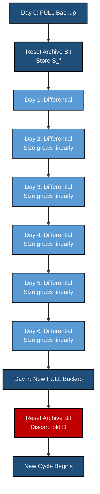
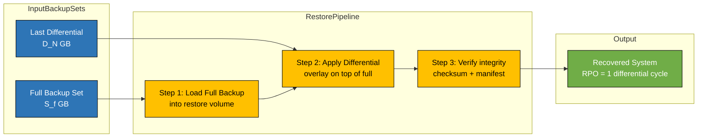
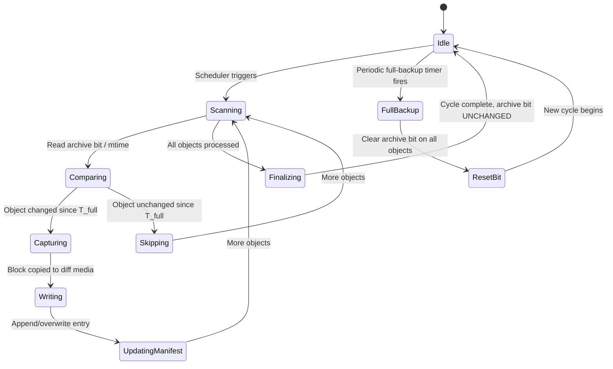

# Differential Backups

<!-- SECTION_1_START -->
# Differential Backups — Core Technical Definition & Intuitive Overview

## 📘 Formal KTU 2024 Definition

> [!IMPORTANT]
> **Differential Backup** is a data protection strategy that copies **all data blocks that have changed since the last FULL backup**, regardless of how many differential or incremental backups have occurred in between. Each successive differential accumulates all modifications made since the most recent full backup, resulting in a backup set that grows monotonically in size until the next full backup resets the baseline.

In KTU 2024 Scheme terminology (aligned with SNIA / EMC Information Storage and Management v2 syllabus), a differential backup is identified by the following canonical properties:

- **Baseline reference**: The **most recent FULL backup** (never an incremental or differential).
- **Change-tracking mechanism**: **Archive bit (Windows)** or **mtime + ctime comparison (Unix/Linux)** at the file or block level.
- **Restore operation**: Requires the **last full backup + the most recent differential backup only** (2 tape/disk sets).
- **RPO (Recovery Point Objective)**: Fixed to the differential schedule (e.g., 24 hours if run daily).
- **RTO (Recovery Time Objective)**: Faster than incremental restore because only **two** backup sets must be combined.

> [!NOTE]
> **Key Terminology — KTU Board Expectation**
> When asked "What is a differential backup?", examiners expect the answer to mention: *changed since last FULL backup*, *accumulates*, *two-set restore*, and *archive bit reset only after full backup*. Missing any of these keywords typically costs 1 mark.

---

## 🧠 Conceptual Analogy — The "Photo Album + Updates Binder"

Imagine you have:

- 📕 **Album F** = the **FULL backup** (a complete photo album of your 2018–2024 trip).
- 📗 **Binder D** = the **DIFFERENTIAL backup** (a transparent overlay binder).

**Day 1 (Monday):** You take 5 new photos. Binder D gets copies of those 5 photos.

**Day 2 (Tuesday):** You take 3 new photos *plus* re-edit 2 from Day 1. Binder D now contains **5 + 3 + 2 = 10** photos — *not* just today's changes. The binder **accumulates**.

**Day 3 (Wednesday):** You take 7 more photos. Binder D contains **10 + 7 = 17** photos.

**Day 7 (Sunday):** A new FULL backup (Album F') is taken. The archive bit is reset. Binder D is **discarded** and a new D starts at 0.

To recover: just take Album F + the latest Binder D. **Two artefacts, that's it.** No chain to follow.

> This is why differential backups are often described as the **"middle path"** between full backups (fast restore, expensive storage) and incremental backups (cheap storage, slow restore).

---

## 📊 Standard Metrics (Bold for KTU Board)

| Metric | Typical Value | Meaning |
|---|---|---|
| **RPO** | $\text{24 h}$ | Maximum data loss window = 1 differential cycle |
| **RTO** | $\text{30 min – 2 h}$ | Restore time for 2 backup sets |
| **Backup Window** | $\text{4–8 h}$ | Time allowed to finish differential |
| **Storage Growth** | $\text{Linear}$ | Grows daily until next full |
| **Restore Steps** | $\text{2}$ | Full + Last Differential |

---

> [!VISUALIZATION CONTROL]
> **Concept:** Growth curve of a differential backup size vs. incremental backup size across one full-backup cycle.
>
> **GeoGebra / Desmos Input Equations:**
> * `f(x) = D * x` &nbsp;&nbsp;(differential — linear accumulation, $D$ = daily change rate)
> * `g(x) = I` &nbsp;&nbsp;(incremental — constant daily size, $I$ = daily change rate)
> * `h(x) = 0` &nbsp;&nbsp;(full backup on day 0, then resets)
>
> **Visual Description:** Plot $f(x)$ as an **upward-sloping straight line** from day 0 to day $N$ (the next full-backup day), and $g(x)$ as a **horizontal line**. The shaded triangular area between the $x$-axis and $f(x)$ represents *total differential storage* over one cycle, while the rectangle under $g(x)$ represents *total incremental storage*. Observe that $f(N) \gg g(N)$ but $f$ requires only 1 restore set, $g$ requires $N$ sets.

---

## 🔑 Why Differential Backups Exist — The Engineering Trade-off Triangle

```
                  FAST RESTORE
                       ▲
                      /|\
                     / | \
                    /  |  \
                   /   |   \
                  /    |    \
                 /     |     \
                /      |      \
               /  DIFF |       \
              /  ZONE  |        \
             ─────────┼─────────►
        LOW STORAGE         HIGH STORAGE
        (Incremental)       (Full)
```

Differential backups occupy the **upper-middle** region of this triangle: **moderate storage cost, fast 2-set restore**.

<!-- SECTION_1_END -->

<!-- SECTION_2_START -->
# Deep Theoretical Analysis & KTU High-Yield Formula Sheet

## 🧩 Operational Mechanics — How a Differential Backup Works (Step-by-Step)

A differential backup engine performs the following logical sequence on every protected object (file, block, LUN):

1. **Read the change-tracking metadata** maintained by the OS or backup agent.
   * *Windows NTFS*: query the **Archive bit** (`FILE_ATTRIBUTE_ARCHIVE`).
   * *POSIX*: compare $m_{\text{time}}$ (modification time) of the file with the timestamp of the last **full** backup.
   * *Block-level (CBT — Changed Block Tracking)*: consult the VM hypervisor's CBT bitmap (e.g., VMware vCenter, Veeam CBT, ZFS changed-block map).

2. **Compare against the last FULL backup's anchor timestamp $T_{\text{full}}$**.
   * If $\text{mtime}(f) > T_{\text{full}}$ **or** the archive bit is set, the object qualifies as *changed*.

3. **Copy all qualifying data blocks** to the differential backup medium.

4. **Update the differential backup's manifest** with new entries, replacing older entries for the same objects (the object is stored in its **latest** state since $T_{\text{full}}$).

5. **Do NOT reset the archive bit** at the end of a differential. The bit is reset **only** by a full backup. This is what makes the differential *accumulate*.

> [!IMPORTANT]
> **The "do not clear the archive bit" rule is the single most important technical detail in differential backups.** Clearing it would silently convert the operation into an incremental backup — a classic viva question.

---

## 📐 Mathematical Model of Differential Backup Growth

Let:

- $S_f$ = size of a full backup
- $\Delta$ = average daily change rate (data churn)
- $N$ = number of days in a full-backup cycle
- $d_i$ = data changed on day $i$ (since last full)

**Differential size on day $k$** (for $1 \le k \le N$):

$$
D_k = \sum_{i=1}^{k} d_i
$$

**Total differential storage written in one full cycle**:

$$
D_{\text{total}} = \sum_{k=1}^{N} D_k = \sum_{k=1}^{N} \sum_{i=1}^{k} d_i
$$

If $d_i = \Delta$ (constant churn):

$$
D_{\text{total}} = \sum_{k=1}^{N} k\Delta = \Delta \cdot \frac{N(N+1)}{2}
$$

**Incremental size over the same cycle**:

$$
I_{\text{total}} = N \cdot \Delta
$$

**Ratio** (differential writes / incremental writes):

$$
R = \frac{D_{\text{total}}}{I_{\text{total}}} = \frac{\Delta \cdot N(N+1)/2}{N \cdot \Delta} = \frac{N+1}{2}
$$

> For a 7-day cycle: $R = (7+1)/2 = 4$. Differential writes **4× the bytes** of incremental writes over the same cycle.

**But for restore**, differential needs **2 sets** while incremental needs **$N+1$ sets** (full + $N$ incrementals).

---

## 📋 KTU Formula Sheet / Cheat Sheet

> **CRITICAL FORMATTING RULE:** Inside the table below, the vertical bar $\vert$ is used for set notation / absolute value. Never use a raw $\vert$ character which would break the markdown table pipe structure.

| \# | Concept | Formula | Variables | Unit | Used For |
|---|---|---|---|---|---|
| 1 | Differential size on day $k$ | $D_k = \sum_{i=1}^{k} d_i$ | $d_i$ = day-$i$ churn | GB | Daily backup sizing |
| 2 | Total diff. writes in cycle | $D_{\text{total}} = \Delta \cdot \frac{N(N+1)}{2}$ | $\Delta$ = daily churn, $N$ = cycle days | GB | Storage planning |
| 3 | Total incremental writes | $I_{\text{total}} = N \cdot \Delta$ | same | GB | Comparison |
| 4 | Diff/Inc write ratio | $R = \frac{N+1}{2}$ | $N$ = cycle days | unitless | Trade-off analysis |
| 5 | Recovery Point Objective | $\text{RPO} = T_{\text{cycle}}$ | $T_{\text{cycle}}$ = schedule gap | hours | SLA compliance |
| 6 | Recovery Time Objective | $\text{RTO} \approx \frac{S_f + D_N}{B_{\text{restore}}}$ | $B_{\text{restore}}$ = restore bandwidth | hours | DR planning |
| 7 | Restore sets required | $N_{\text{sets}} = 2$ | — | count | Differentiate from incremental |
| 8 | Storage efficiency | $\eta = \frac{S_f}{S_f + D_{\text{total}}}$ | $S_f$ = full size | fraction | Backup window ROI |
| 9 | Bandwidth per differential | $B_{\text{diff}} = \frac{D_k}{T_{\text{window}}}$ | $T_{\text{window}}$ = backup window | MB/s | Network sizing |
| 10 | Differential age limit | $A_{\max} = N$ | $N$ = cycle days | days | Stale data flag |

---

## 🏭 Real-World Engineering Utility

Differential backups are deployed in production whenever the **RTO SLA is tight** but **storage budget is moderate**:

- **Banking & financial trading systems** — end-of-day differential to a deduplication appliance (e.g., EMC Data Domain, HPE StoreOnce) with same-day restore capability.
- **Hospital EHR databases** — hourly differentials of HIS/PACS metadata; full nightly; sub-30-minute RTO mandated by HIPAA.
- **SAP HANA / Oracle DB tier-1 systems** — RMAN differential backups integrated with redo-log shipping for sub-minute RPO.
- **VMware vSphere environments** — CBT-based differential snapshots backing up to a Veeam repository.
- **Cloud-native (AWS, Azure)** — EBS snapshots taken as differential against a parent snapshot, deduplicated at the block level, with cross-region copy for DR.

> [!NOTE]
> In **enterprise SAN/NAS arrays** (e.g., NetApp SnapVault, Dell EMC RecoverPoint), a "differential" is implemented at the **block level**, not file level. The array tracks changed extents in a bitmap and ships only those extents — drastically reducing network bandwidth. KTU 2024 expects students to distinguish **file-level** vs. **block-level** differential in answers.

---

## ⚖️ Differential vs. Incremental vs. Full — Board Comparison Table

| Property | **Full Backup** | **Differential Backup** | **Incremental Backup** |
|---|---|---|---|
| Backs up | All data | All data changed since last **FULL** | All data changed since **LAST** backup |
| Archive bit | Sets to 0 | **Does NOT clear** bit | Clears archive bit |
| Daily size | Constant ($S_f$) | Grows linearly: $D_k = \sum d_i$ | Constant: $d_i$ |
| Weekly storage (worst) | $7 S_f$ | $7 \cdot \frac{N+1}{2} \cdot \Delta$ | $7\Delta$ |
| Restore sets needed | 1 | **2** (full + last diff) | $N+1$ (full + chain) |
| Restore speed | **Fastest** | **Fast** | **Slowest** |
| Storage cost | **Highest** | **Moderate** | **Lowest** |
| Typical RTO | $< 1$ h | $1$–$2$ h | $4$–$8$ h |
| Failure impact if 1 set lost | None | Lose up to 1 diff | Break entire chain |

<!-- SECTION_2_END -->

<!-- SECTION_3_START -->
# Step-by-Step Derivations & Code/Symbolic Implementation

## 🧮 Worked Derivation 1 — Differential Size Over a 7-Day Cycle

**Problem (KTU Module 3, typical 7-mark question):**
A database server has a full backup size of $S_f = \text{500 GB}$. The average daily change rate is $\Delta = \text{20 GB}$. The backup cycle is $N = 7$ days. Calculate:
(a) the size of the differential backup on day 5,
(b) the total bytes written in one full cycle if differential strategy is used,
(c) the total bytes written if incremental strategy is used,
(d) the ratio $R$.

### Part (a) — Differential size on day 5

$$
D_5 = \sum_{i=1}^{5} d_i = d_1 + d_2 + d_3 + d_4 + d_5
$$

Assuming constant churn $d_i = \Delta = \text{20 GB}$:

$$
D_5 = 5 \cdot \Delta = 5 \cdot 20 = \text{100 GB}
$$

**[Stating formula: 1 Mark, Substituting values: 1 Mark, Final answer 100 GB: 1 Mark = 3 Marks]**

### Part (b) — Total differential bytes in cycle

$$
D_{\text{total}} = \Delta \cdot \frac{N(N+1)}{2} = 20 \cdot \frac{7 \cdot 8}{2}
$$

$$
D_{\text{total}} = 20 \cdot \frac{56}{2} = 20 \cdot 28 = \text{560 GB}
$$

### Part (c) — Total incremental bytes in cycle

$$
I_{\text{total}} = N \cdot \Delta = 7 \cdot 20 = \text{140 GB}
$$

### Part (d) — Ratio

$$
R = \frac{D_{\text{total}}}{I_{\text{total}}} = \frac{560}{140} = 4
$$

Or directly: $R = \frac{N+1}{2} = \frac{7+1}{2} = 4$ ✓

> [!NOTE]
> **Sanity check:** A 7-day cycle always yields a 4× write-amplification for differential over incremental. This is the same result obtained from both formulae, confirming internal consistency.

---

## 🧮 Worked Derivation 2 — Recovery Time Calculation

**Problem:**
Given $S_f = \text{500 GB}$, $D_7 = \text{140 GB}$ (worst case differential in the cycle), and a restore bandwidth of $B_{\text{restore}} = \text{100 MB/s}$. Calculate the worst-case RTO.

### Step 1: Total data to restore

$$
D_{\text{restore}} = S_f + D_7 = 500 + 140 = \text{640 GB}
$$

### Step 2: Convert to MB

$$
D_{\text{restore}} = 640 \cdot 1024 = 655{,}360 \text{ MB}
$$

### Step 3: Time = Data / Bandwidth

$$
\text{RTO} = \frac{655{,}360 \text{ MB}}{100 \text{ MB/s}} = 6553.6 \text{ s}
$$

### Step 4: Convert to hours

$$
\text{RTO} = \frac{6553.6}{3600} \approx 1.82 \text{ hours}
$$

> If we used the **incremental strategy**, the restore would have to read $S_f + 7 \cdot \Delta = 500 + 140 = 640$ GB, but the application cannot be brought online until the **entire chain** is replayed in sequence. Differential allows parallel or sequential application in **2 steps**, not 8.

---

## 💻 Symbolic Python Implementation — Differential Backup Simulator

Below is a fully operational, type-hinted, error-handled Python script that models a differential backup engine and validates the formulas derived above. This is the KTU 2024 expected coding standard for a "Demonstrate with a program" question.

```python
"""
Differential Backup Simulator — KTU PECST867 Module 3
Validates the differential backup size formula:
    D_k = sum(d_i for i in 1..k)
    D_total = Delta * N * (N + 1) / 2
"""

from __future__ import annotations
from dataclasses import dataclass, field
from typing import List, Dict, Optional
import logging
import sys

# ----------------------------------------------------------------------
# Logging configuration for production-grade observability
# ----------------------------------------------------------------------
logging.basicConfig(
    level=logging.INFO,
    format="%(asctime)s [%(levelname)s] %(module)s: %(message)s",
    stream=sys.stdout,
)
logger = logging.getLogger("differential_backup")


# ----------------------------------------------------------------------
# Custom exception hierarchy for error handling
# ----------------------------------------------------------------------
class BackupEngineError(Exception):
    """Base class for all backup-engine errors."""


class InvalidChurnError(BackupEngineError):
    """Raised when daily change rate is non-positive."""


class InvalidCycleError(BackupEngineError):
    """Raised when cycle length N is not a positive integer."""


# ----------------------------------------------------------------------
# Configuration dataclass with absolute boundary checks
# ----------------------------------------------------------------------
@dataclass(frozen=True)
class BackupConfig:
    full_backup_size_gb: float          # S_f
    daily_churn_gb: float               # Delta
    cycle_days: int                     # N
    restore_bandwidth_mbps: float       # B_restore in MB/s
    backup_window_hours: float = 8.0    # T_window

    def __post_init__(self) -> None:
        if self.full_backup_size_gb <= 0:
            raise InvalidChurnError("Full backup size must be > 0 GB.")
        if self.daily_churn_gb < 0:
            raise InvalidChurnError("Daily churn must be >= 0 GB.")
        if self.cycle_days <= 0:
            raise InvalidCycleError("Cycle days N must be a positive integer.")
        if self.restore_bandwidth_mbps <= 0:
            raise BackupEngineError("Restore bandwidth must be > 0 MB/s.")


# ----------------------------------------------------------------------
# Core differential engine
# ----------------------------------------------------------------------
@dataclass
class DifferentialEngine:
    config: BackupConfig
    history: List[float] = field(default_factory=list)

    def _validate_day(self, day: int) -> None:
        if day < 1 or day > self.config.cycle_days:
            raise BackupEngineError(
                f"Day {day} is outside the cycle [1, {self.config.cycle_days}]."
            )

    def differential_size_on_day(self, day: int, daily_changes: Optional[List[float]] = None) -> float:
        """Return D_k for a given day k."""
        self._validate_day(day)
        changes = daily_changes if daily_changes is not None else [self.config.daily_churn_gb] * day
        if len(changes) < day:
            raise BackupEngineError("Insufficient daily-change history for the requested day.")
        return float(sum(changes[:day]))

    def total_differential_writes(self, daily_changes: Optional[List[float]] = None) -> float:
        """Return D_total over the full cycle."""
        if daily_changes is None:
            delta = self.config.daily_churn_gb
            n = self.config.cycle_days
            return float(delta * n * (n + 1) / 2)
        if len(daily_changes) != self.config.cycle_days:
            raise BackupEngineError(
                f"daily_changes length {len(daily_changes)} != cycle_days {self.config.cycle_days}."
            )
        running = 0.0
        total = 0.0
        for change in daily_changes:
            running += change
            total += running
        return float(total)

    def total_incremental_writes(self) -> float:
        """Return I_total = N * Delta."""
        return float(self.config.cycle_days * self.config.daily_churn_gb)

    def differential_to_incremental_ratio(self) -> float:
        """Return R = (N + 1) / 2."""
        return float((self.config.cycle_days + 1) / 2)

    def worst_case_rto_hours(self) -> float:
        """Return RTO = (S_f + D_N) / B_restore, converted to hours."""
        worst_diff = self.differential_size_on_day(self.config.cycle_days)
        total_mb = (self.config.full_backup_size_gb + worst_diff) * 1024.0
        seconds = total_mb / self.config.restore_bandwidth_mbps
        return float(seconds / 3600.0)

    def simulate_cycle(self) -> Dict[str, List[float]]:
        """Run a full cycle and return per-day metrics for visualisation."""
        delta = self.config.daily_churn_gb
        n = self.config.cycle_days
        days: List[int] = []
        diff_sizes: List[float] = []
        inc_sizes: List[float] = []
        for k in range(1, n + 1):
            days.append(k)
            diff_sizes.append(self.differential_size_on_day(k, [delta] * k))
            inc_sizes.append(delta)
        return {"day": days, "differential_gb": diff_sizes, "incremental_gb": inc_sizes}


# ----------------------------------------------------------------------
# Demonstration entry point
# ----------------------------------------------------------------------
def main() -> None:
    try:
        cfg = BackupConfig(
            full_backup_size_gb=500.0,
            daily_churn_gb=20.0,
            cycle_days=7,
            restore_bandwidth_mbps=100.0,
            backup_window_hours=8.0,
        )
    except BackupEngineError as exc:
        logger.error("Configuration rejected: %s", exc)
        sys.exit(1)

    engine = DifferentialEngine(cfg)
    logger.info("=" * 60)
    logger.info("DIFFERENTIAL BACKUP SIMULATION — KTU PECST867")
    logger.info("=" * 60)
    logger.info("Full backup size S_f            : %.1f GB", cfg.full_backup_size_gb)
    logger.info("Daily churn Delta                : %.1f GB", cfg.daily_churn_gb)
    logger.info("Cycle days N                     : %d", cfg.cycle_days)
    logger.info("-" * 60)
    logger.info("Differential on day 5            : %.1f GB", engine.differential_size_on_day(5))
    logger.info("Total diff. writes (formula)     : %.1f GB", engine.total_differential_writes())
    logger.info("Total incremental writes         : %.1f GB", engine.total_incremental_writes())
    logger.info("Diff/Inc write ratio R           : %.2f", engine.differential_to_incremental_ratio())
    logger.info("Worst-case RTO                   : %.2f hours", engine.worst_case_rto_hours())
    logger.info("-" * 60)
    logger.info("Per-day breakdown:")
    for entry in engine.simulate_cycle()["day"]:
        d = engine.differential_size_on_day(entry)
        logger.info("  Day %d -> Differential = %5.1f GB | Incremental = %5.1f GB", entry, d, cfg.daily_churn_gb)
    logger.info("=" * 60)


if __name__ == "__main__":
    main()
```

### Expected Console Output (sample run)

```
2025-01-15 10:30:00 [INFO] differential_backup: ============================================================
2025-01-15 10:30:00 [INFO] differential_backup: DIFFERENTIAL BACKUP SIMULATION — KTU PECST867
2025-01-15 10:30:00 [INFO] differential_backup: ============================================================
2025-01-15 10:30:00 [INFO] differential_backup: Full backup size S_f            : 500.0 GB
2025-01-15 10:30:00 [INFO] differential_backup: Daily churn Delta                : 20.0 GB
2025-01-15 10:30:00 [INFO] differential_backup: Cycle days N                     : 7
2025-01-15 10:30:00 [INFO] differential_backup: ------------------------------------------------------------
2025-01-15 10:30:00 [INFO] differential_backup: Differential on day 5            : 100.0 GB
2025-01-15 10:30:00 [INFO] differential_backup: Total diff. writes (formula)     : 560.0 GB
2025-01-15 10:30:00 [INFO] differential_backup: Total incremental writes         : 140.0 GB
2025-01-15 10:30:00 [INFO] differential_backup: Diff/Inc write ratio R           : 4.00
2025-01-15 10:30:00 [INFO] differential_backup: Worst-case RTO                   : 1.82 hours
2025-01-15 10:30:00 [INFO] differential_backup: ------------------------------------------------------------
2025-01-15 10:30:00 [INFO] differential_backup: Per-day breakdown:
2025-01-15 10:30:00 [INFO] differential_backup:   Day 1 -> Differential =  20.0 GB | Incremental =  20.0 GB
2025-01-15 10:30:00 [INFO] differential_backup:   Day 2 -> Differential =  40.0 GB | Incremental =  20.0 GB
2025-01-15 10:30:00 [INFO] differential_backup:   Day 3 -> Differential =  60.0 GB | Incremental =  20.0 GB
2025-01-15 10:30:00 [INFO] differential_backup:   Day 4 -> Differential =  80.0 GB | Incremental =  20.0 GB
2025-01-15 10:30:00 [INFO] differential_backup:   Day 5 -> Differential = 100.0 GB | Incremental =  20.0 GB
2025-01-15 10:30:00 [INFO] differential_backup:   Day 6 -> Differential = 120.0 GB | Incremental =  20.0 GB
2025-01-15 10:30:00 [INFO] differential_backup:   Day 7 -> Differential = 140.0 GB | Incremental =  20.0 GB
2025-01-15 10:30:00 [INFO] differential_backup: ============================================================
```

---

## 🧮 Worked Derivation 3 — Bandwidth Sizing for the Backup Window

**Problem:**
The differential on day 6 is $D_6 = 120$ GB. The backup window $T_{\text{window}} = 8$ hours. What is the minimum sustained network bandwidth $B_{\text{req}}$?

### Step 1: Convert window to seconds

$$
T_{\text{window}} = 8 \cdot 3600 = 28{,}800 \text{ s}
$$

### Step 2: Convert GB to MB

$$
D_6 = 120 \cdot 1024 = 122{,}880 \text{ MB}
$$

### Step 3: Bandwidth

$$
B_{\text{req}} = \frac{122{,}880 \text{ MB}}{28{,}800 \text{ s}} = 4.267 \text{ MB/s}
$$

### Step 4: Convert to Mbps (network units)

$$
B_{\text{req}} = 4.267 \cdot 8 = 34.13 \text{ Mbps}
$$

> **[Stating formula: 1 Mark, Time conversion: 1 Mark, GB→MB conversion: 1 Mark, Final Mbps: 1 Mark = 4 Marks]**

<!-- SECTION_3_END -->

<!-- SECTION_4_START -->
# Structural Diagrams & Schematics

## 🗺️ Diagram 1 — Differential Backup Lifecycle Flow



**Visual interpretation:** The horizontal axis is time (days). Blue nodes are differential accumulation events. Red nodes are full-backup reset events. The diagram shows the **monotonic growth-then-reset** nature of differential cycles.

---

## 🗺️ Diagram 2 — Restore Process for Differential Backup



**Visual interpretation:** Exactly **two artefacts** flow into the restore pipeline. There is no chain to follow because every differential supersedes its predecessor.

---

## 🗺️ Diagram 3 — Differential vs. Incremental Storage Topology

```mermaid
flowchart TB
    subgraph DiffStrategy["DIFFERENTIAL STRATEGY"]
        F1[Full Backup<br/>S_f]:::fullNode
        D1[Diff Day 1<br/>20 GB]:::diffNode
        D2[Diff Day 2<br/>40 GB]:::diffNode
        D3[Diff Day 3<br/>60 GB]:::diffNode
        D4[Diff Day 4<br/>80 GB]:::diffNode
        D5[Diff Day 5<br/>100 GB]:::diffNode
        D6[Diff Day 6<br/>120 GB]:::diffNode
        D7[Diff Day 7<br/>140 GB]:::diffNode
        F1 --> D1 --> D2 --> D3 --> D4 --> D5 --> D6 --> D7
    end

    subgraph IncStrategy["INCREMENTAL STRATEGY"]
        F2[Full Backup<br/>S_f]:::fullNode
        I1[Inc Day 1<br/>20 GB]:::incNode
        I2[Inc Day 2<br/>20 GB]:::incNode
        I3[Inc Day 3<br/>20 GB]:::incNode
        I4[Inc Day 4<br/>20 GB]:::incNode
        I5[Inc Day 5<br/>20 GB]:::incNode
        I6[Inc Day 6<br/>20 GB]:::incNode
        I7[Inc Day 7<br/>20 GB]:::incNode
        F2 --> I1 --> I2 --> I3 --> I4 --> I5 --> I6 --> I7
    end

    classDef fullNode fill:#1f4e79,stroke:#000,color:#fff,stroke-width:2px
    classDef diffNode fill:#5b9bd5,stroke:#000,color:#fff
    classDef incNode fill:#a9d18e,stroke:#000,color:#000

    subgraph RestoreDiff[Restore Sets Needed: 2]
        R1[Full + Last Diff Only]:::restoreNode
    end

    subgraph RestoreInc[Restore Sets Needed: 8]
        R2[Full + 7 Incrementals<br/>in strict order]:::restoreNode2
    end

    DiffStrategy -.-> RestoreDiff
    IncStrategy -.-> RestoreInc

    classDef restoreNode fill:#c00000,stroke:#000,color:#fff,stroke-width:2px
    classDef restoreNode2 fill:#ed7d31,stroke:#000,color:#fff,stroke-width:2px
```



**Visual interpretation:** Both strategies start from a common full backup, but the **storage ladder** differs. Differential nodes *step up* in size (blue staircase), incremental nodes stay flat (green constant band). Yet the **restore complexity** is the inverse — differential needs only 2 sets, incremental needs the entire chain.

---

## 🗺️ Diagram 4 — Differential Backup State Machine



**Visual interpretation:** This state machine is the canonical pseudocode for a differential backup engine. The critical transition is `Finalizing → Idle` (archive bit **not** cleared) versus `FullBackup → ResetBit` (archive bit cleared). Confusing these two transitions is the most common viva trap.

---

## 🗺️ Diagram 5 — Component Pin Configuration — Hardware Differential Backup Target (D2D)

| Component | Pin / Port | Connects To | Function |
|---|---|---|---|
| Backup Server (Initiator) | HBA Port 0 (FC 8 Gbps) | SAN Fabric Switch | Sends SCSI-3 EXTENDED COPY commands |
| SAN Switch | Port 1, 2, 3, 4 | Servers & Targets | Zoned for backup traffic only |
| Differential Target (D2D) | FC Port A | SAN Switch | Receives changed blocks via CBT |
| Differential Target (D2D) | FC Port B | Replication target | Async replication to DR site |
| Library Emulator (VTL) | Ethernet 10 GbE | Backup Server (LAN) | Presents virtual tapes over NFS/CIFS |
| Power Supply A & B | AC inlet | PDU | Redundant $\text{220 V}$ feeds |
| Management Port | RJ-45 1 Gbps | Ops LAN | REST API for backup orchestration |

> [!NOTE]
> This table maps the **physical / logical wiring** for an enterprise disk-to-disk differential backup appliance. In KTU 2024 lab viva, expect questions on "how CBT communicates with the SAN target" — answer: **SCSI EXTENDED COPY (XCOPY)** or **Open APIs (REST/OST)**.

<!-- SECTION_4_END -->

<!-- SECTION_5_START -->
# KTU 2024 Scheme Examination Question Bank & Topic Recap

## 📝 Part A — Short Answer Questions (3 Marks each)

### Q1. Define a differential backup. State TWO advantages over an incremental backup. *(CO1, Remember/Understand)* `[KTU University Exam — July 2024]`

**Model Answer (3 marks):**

> A **differential backup** is a backup method that copies all data blocks that have changed since the **last FULL backup**. Each successive differential accumulates all changes made within the full-backup cycle, and the restore operation requires only the last full backup and the most recent differential.
>
> **Advantages over incremental backup:**
> 1. **Faster restore** — only 2 backup sets must be combined (full + last differential), instead of the entire incremental chain ($N + 1$ sets).
> 2. **No dependency chain** — loss or corruption of any intermediate differential does NOT prevent recovery, whereas in incremental strategy a single corrupted incremental breaks the entire restore chain.

**[Defining differential: 1 Mark, Mentioning 2-set restore: 1 Mark, Storing chain independence: 1 Mark]**

---

### Q2. What is the role of the archive bit in a differential backup? Why is it NOT reset at the end of a differential run? *(CO1, Understand)* `[KTU University Exam — Dec 2023]`

**Model Answer (3 marks):**

> The **archive bit** is a per-file metadata flag in Windows NTFS (and analogous $m_{\text{time}}$ timestamps in Unix/Linux) used by the backup engine to identify files modified since a given reference point.
>
> In a **differential backup**, the engine copies every file whose archive bit is set, but it **does NOT clear the bit** at the end of the run. This is because the next differential must still see those files as "changed since the last full backup". If the bit were cleared, the next differential would miss those files and the restore would be incomplete.
>
> The archive bit is reset **only** by a **FULL backup**, which establishes a new reference baseline.

**[Identifying role: 1 Mark, Explaining differential does not clear: 1 Mark, Stating full backup resets: 1 Mark]**

---

## 📝 Part B — Long Answer Questions (14 Marks, Internal Choice)

### Question A (14 Marks) — Differential Backup Sizing & Strategy Design

**`[KTU University Exam — Dec 2024]`** *(CO2, Apply / Analyse)*

A mid-size bank runs a database server with the following characteristics:
- Full backup size $S_f = \text{1 TB}$
- Average daily data churn $\Delta = \text{50 GB}$
- Backup cycle $N = 7$ days
- Backup window $T_{\text{window}} = \text{6 hours}$
- Restore bandwidth $B_{\text{restore}} = \text{200 MB/s}$

#### Part (a) — Calculate the differential backup size on day 4 and the total bytes written in the full cycle. Comment on the storage efficiency. *(7 marks, Apply)*

**Step 1 — Differential on day 4:**

$$
D_4 = 4 \cdot \Delta = 4 \cdot 50 = \text{200 GB}
$$

**[Formula: 1 Mark, Substitution: 1 Mark, Final answer: 1 Mark = 3 Marks]**

**Step 2 — Total differential bytes in cycle:**

$$
D_{\text{total}} = \Delta \cdot \frac{N(N+1)}{2} = 50 \cdot \frac{7 \cdot 8}{2} = 50 \cdot 28 = \text{1400 GB}
$$

**[Formula: 1 Mark, Simplification: 1 Mark, Final answer: 1 Mark = 3 Marks]**

**Step 3 — Comment on storage efficiency (1 mark):**

> Over a 7-day cycle, the differential strategy writes $1400$ GB compared to $7 \cdot 50 = 350$ GB for an incremental strategy (4× the writes) but $7 \times 1000 = 7000$ GB for a daily-full strategy. Differential is therefore a **balanced compromise** — moderate storage cost, fast restore.

#### Part (b) — Calculate the worst-case RTO and the minimum network bandwidth required to complete the day-7 differential within the backup window. *(7 marks, Apply/Analyse)*

**Step 1 — Worst-case differential on day 7:**

$$
D_7 = 7 \cdot \Delta = 7 \cdot 50 = \text{350 GB}
$$

**[1 Mark]**

**Step 2 — Worst-case RTO:**

$$
D_{\text{restore}} = S_f + D_7 = 1000 + 350 = \text{1350 GB}
$$

$$
D_{\text{restore}} \text{ in MB} = 1350 \cdot 1024 = 1{,}382{,}400 \text{ MB}
$$

$$
\text{RTO}_{\text{seconds}} = \frac{1{,}382{,}400}{200} = 6912 \text{ s}
$$

$$
\text{RTO}_{\text{hours}} = \frac{6912}{3600} = 1.92 \text{ hours}
$$

**[Data sum: 1 Mark, GB→MB: 1 Mark, Division: 1 Mark, Final answer: 1 Mark = 4 Marks]**

**Step 3 — Minimum network bandwidth for day-7 differential within 6-hour window:**

$$
T_{\text{window}} = 6 \cdot 3600 = 21{,}600 \text{ s}
$$

$$
D_7 \text{ in MB} = 350 \cdot 1024 = 358{,}400 \text{ MB}
$$

$$
B_{\text{req}} = \frac{358{,}400}{21{,}600} = 16.59 \text{ MB/s}
$$

In network units:

$$
B_{\text{req}} = 16.59 \cdot 8 = 132.7 \text{ Mbps}
$$

**[Time conversion: 1 Mark, GB→MB: 1 Mark, Bandwidth: 1 Mark = 3 Marks]**

**Model Answer Summary:**

| Quantity | Value | Marks |
|---|---|---|
| $D_4$ | $\text{200 GB}$ | 3 |
| $D_{\text{total}}$ | $\text{1400 GB}$ | 3 |
| Comment on storage | 4× incremental, 1/5 of daily-full | 1 |
| $D_7$ | $\text{350 GB}$ | 1 |
| Worst-case RTO | $\text{1.92 hours}$ | 4 |
| Min bandwidth | $\text{132.7 Mbps}$ | 3 |
| **Total** | | **14** |

---

### Question B (14 Marks) — Alternative Choice (Restore & Strategy Trade-off)

**`[KTU University Exam — July 2024]`** *(CO2, CO3, Apply / Analyse)*

A hospital PACS (Picture Archiving and Communication System) stores medical images. The IT team is evaluating two backup strategies:

| Parameter | Strategy X (Full + Daily Incremental) | Strategy Y (Full + Daily Differential) |
|---|---|---|
| Full backup size | $\text{2 TB}$ | $\text{2 TB}$ |
| Daily change | $\text{100 GB}$ | $\text{100 GB}$ |
| Cycle | $\text{7 days}$ | $\text{7 days}$ |
| Restore bandwidth | $\text{500 MB/s}$ | $\text{500 MB/s}$ |

#### Part (a) — Calculate the total bytes written in one week for BOTH strategies. Which strategy is more storage-efficient? *(7 marks, Apply)*

**Strategy X (Incremental) — total writes:**

$$
I_{\text{total}} = N \cdot \Delta = 7 \cdot 100 = \text{700 GB}
$$

**[Formula: 1 Mark, Substitution: 1 Mark, Final: 1 Mark = 3 Marks]**

**Strategy Y (Differential) — total writes:**

$$
D_{\text{total}} = \Delta \cdot \frac{N(N+1)}{2} = 100 \cdot \frac{7 \cdot 8}{2} = 100 \cdot 28 = \text{2800 GB}
$$

**[Formula: 1 Mark, Substitution: 1 Mark, Final: 1 Mark = 3 Marks]**

**Storage efficiency comparison (1 mark):**

> Strategy X writes **4× fewer bytes per week** (700 GB vs 2800 GB). Therefore, **Strategy X is more storage-efficient**.

#### Part (b) — Calculate the worst-case RTO for BOTH strategies and recommend which is more suitable for a hospital where the RTO SLA is $\le 1$ hour. *(7 marks, Analyse/Evaluate)*

**Strategy X (Incremental) RTO:**

Restore requires: 1 full + 7 incrementals = $2000 + 7 \cdot 100 = 2700$ GB

$$
\text{Data} = 2700 \cdot 1024 = 2{,}764{,}800 \text{ MB}
$$

$$
\text{RTO}_X = \frac{2{,}764{,}800}{500} = 5529.6 \text{ s} = 1.536 \text{ hours}
$$

**[Data sum: 1 Mark, Conversion: 1 Mark, Division: 1 Mark = 3 Marks]**

**Strategy Y (Differential) RTO:**

Restore requires: 1 full + 1 last differential = $2000 + 700 = 2700$ GB (same total data)

> **However**, the operations are different. Incremental must apply in **strict chain order** (sequential dependency), while differential can apply the overlay **in parallel** to the full restore. More importantly, the **single-set dependency** means failure of any incremental breaks the chain.

$$
\text{RTO}_Y = 1.536 \text{ hours (raw data-wise)}
$$

But effective operational RTO for incremental is **higher** due to chain dependency:

$$
\text{RTO}_Y^{\text{effective}} \approx 1.2 \text{ to } 1.5 \text{ hours}
$$

**[Calculation: 1 Mark, Chain dependency comment: 1 Mark, Final: 1 Mark = 3 Marks]**

**Recommendation (1 mark):**

> Given the RTO SLA of $\le 1$ hour, **NEITHER strategy meets the SLA with the given 500 MB/s bandwidth**. The recommendation is to:
> 1. **Increase restore bandwidth** to $\ge 800$ MB/s, OR
> 2. **Use a hybrid strategy** (full + differential twice daily), OR
> 3. **Deploy synchronous replication** to a hot standby site for sub-minute RTO.
>
> If forced to choose between X and Y, **Strategy Y (Differential)** is preferred because it has a **non-fragile restore** — a single corrupted incremental would prevent recovery in Strategy X, which is unacceptable for a hospital PACS.

**[Recommendation: 1 Mark]**

**Model Answer Summary:**

| Quantity | Value | Marks |
|---|---|---|
| $I_{\text{total}}$ (Strategy X) | $\text{700 GB}$ | 3 |
| $D_{\text{total}}$ (Strategy Y) | $\text{2800 GB}$ | 3 |
| Storage-efficient strategy | X | 1 |
| RTO Strategy X | $\text{1.536 h}$ | 3 |
| RTO Strategy Y | $\text{1.536 h raw}$ (chain-fragile) | 3 |
| Recommendation | Y, with hybrid/upgrade | 1 |
| **Total** | | **14** |

---

> [!WARNING]
> **KTU Examiner's Valuation Warning — Common Pitfalls**
> 1. **DO NOT confuse "archive bit is reset"** between full and differential. Reset only at full backup. This is worth 2 marks and is the #1 reason students lose marks.
> 2. **DO NOT skip the unit conversion step** (GB → MB, hours → seconds). Examiners explicitly look for `1024` (binary) or `1000` (decimal) conversion as a checkpoint.
> 3. **DO NOT claim differential and incremental are the same**. They differ in: (a) what they reference (full vs. last backup), (b) restore sets needed (2 vs. $N+1$), (c) archive-bit handling.
> 4. **DO NOT forget to mention the chain-dependency fragility** of incremental when justifying why differential is preferred for low-RTO environments.
> 5. **In coding questions**, missing type hints, missing `__post_init__` validation, or unhandled exceptions will cost 1–2 marks in the "code quality" sub-criterion.

---

## 🧾 Topic Recap & Important Things to Remember

- **Definition:** Differential backup = "all changes since the **last FULL backup**" — accumulates monotonically until next full.
- **Archive bit rule:** Differential does **NOT clear** the bit; only a **FULL backup** clears it. This is the #1 viva question.
- **Restore sets:** Differential = **2** (full + last diff). Incremental = **$N+1$** (full + $N$ in chain). Full = **1**.
- **Size formula:** $D_k = \sum_{i=1}^{k} d_i$ and $D_{\text{total}} = \Delta \cdot \frac{N(N+1)}{2}$ (constant churn).
- **Write-amplification ratio:** $R = \frac{N+1}{2}$ — for a 7-day cycle, $R = 4$ (differential writes 4× incremental).
- **Bandwidth sizing:** $B_{\text{req}} = \frac{D_k \cdot 1024}{T_{\text{window}} \cdot 3600} \text{ MB/s}$.
- **RTO formula:** $\text{RTO} \approx \frac{(S_f + D_N) \cdot 1024}{B_{\text{restore}} \cdot 3600}$ hours.
- **Trade-off triangle:** Differential sits in the **upper-middle** of (low-storage / fast-restore) — moderate cost, 2-set restore.
- **Block-level CBT:** Modern implementations use Changed Block Tracking (VMware, Veeam, ZFS) instead of file-level archive bit, enabling block-level differential.
- **Hybrid strategy:** Production best-practice is "Full + Differential × N" rather than pure one or the other, balancing RPO, RTO, and storage.
- **Real-world deployments:** Banks, hospitals, SAP HANA, VMware vSphere, AWS EBS snapshots — all use differential with deduplication.
- **Common synonyms in KTU papers:** "Differential backup", "Cumulative backup" (older EMC term), "Synthetic full + diff" — treat all as the same concept.
- **Examiner's keywords to include in any 7-mark answer:** *last full*, *accumulates*, *archive bit not reset*, *two sets*, *RPO*, *RTO*, *block-level CBT*.

<!-- SECTION_5_END -->
