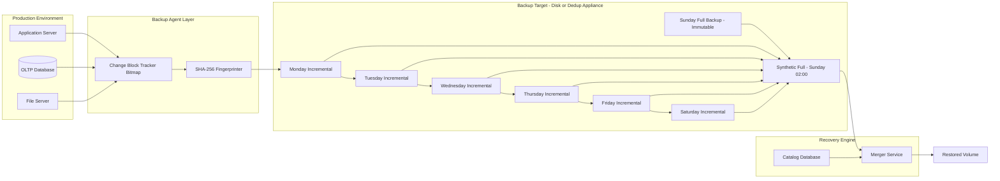
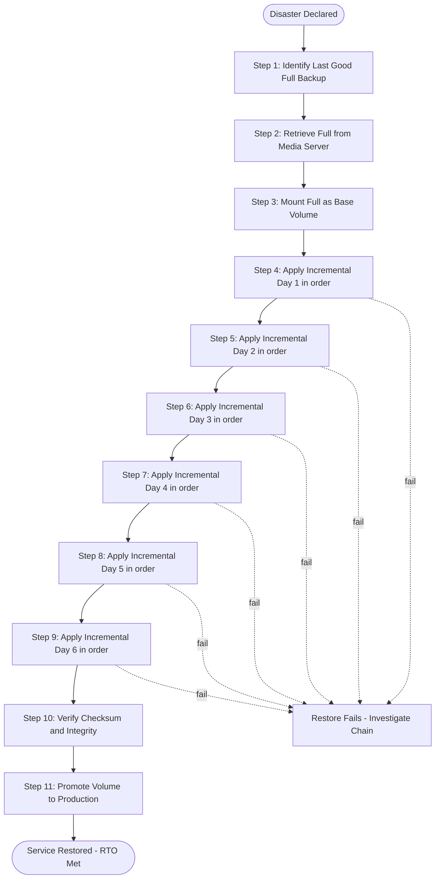

# Incremental Backups

<!-- SECTION_1_START -->
# Module 3: Business Continuity, Backup and Recovery
## Topic: Incremental Backups

### 1. Core Technical Definition & Intuitive Overview

**Formal Definition (KTU 2024 Syllabus Aligned):**
An **Incremental Backup** is a data protection strategy in which only the data blocks (or files) that have changed since the **last backup operation of any type** (full or incremental) are captured and stored. Each successive incremental backup is, by definition, a *delta* relative to its immediate predecessor in the backup chain, not relative to the most recent full backup.

> [!IMPORTANT]
> **KTU 2024 Syllabus Anchor (PECST867 / Module 3):**
> Incremental backups fall under the *Business Continuity* and *Recovery Operations* segment. Students are expected to differentiate between **Cumulative Incremental**, **Differential**, and **True (Reverse) Incremental** strategies and to compute their storage and recovery implications.

**Conceptual Analogy / Intuition:**
Imagine you are photocopying a 500-page engineering textbook, but the photocopier is "smart":
- **Full Backup** = Photocopy the *entire* textbook (500 pages) every Sunday.
- **Incremental Backup** = Each weekday, the photocopier only copies the *pages you annotated or replaced* since the previous photocopying session (e.g., Monday 4 pages, Tuesday 2 pages, Wednesday 6 pages...).
- **Differential Backup** = Each weekday, the photocopier copies *all annotations accumulated since the last full copy* (Monday 4, Tuesday 4+2=6, Wednesday 4+2+6=12 pages...).

The **incremental** strategy uses the *least paper* (storage), but to *reassemble* the book on a crash, you must reconstruct the chain in the correct order: Sunday's full → Monday's delta → Tuesday's delta → ... → Saturday's delta. Skip a single delta and the reconstruction fails.

> [!NOTE]
> **Key Board-Examiner Terminology You Must Use:**
> - **Block-Level Incremental Backup (BLIB)** — Captures only the *changed blocks* (e.g., 4 KB, 8 KB, or 64 KB blocks) at the storage layer. Modern industry standard.
> - **Change Block Tracking (CBT)** — The mechanism (used by VMware vSphere, Windows VSS, SQL Server) that flags modified extents to be picked up by the next incremental job.
> - **Synthetic Full Backup** — A full backup *reconstructed on the backup server* by fusing the latest full with all subsequent incrementals; the production server is never re-read.
> - **Forever-Incremental (Reverse Incremental)** — Only one full is ever taken; each new backup is incremental, and the *previous* full is "rolled forward" by applying the new delta and removing the old delta.

> [!VISUALIZATION CONTROL]
> **Concept:** Block-Level Change Tracking over a 1-Dimensional Disk Extent
> **GeoGebra / Desmos Input Equations:**
> * $f(x) = \sin(x)$ represents the **original** data block stream.
> * $g(x) = \sin(x) + 0.5 \cdot \mathbb{1}_{[2\pi,\,5\pi]}(x)$ represents the **modified** region (changed blocks between indices $2\pi$ and $5\pi$).
> * $h(x) = g(x) - f(x) = 0.5 \cdot \mathbb{1}_{[2\pi,\,5\pi]}(x)$ is the **incremental delta** (non-zero only on the changed interval).
> **Visual Description:** The student should see the indicator function $h(x)$ rising from $0$ to $0.5$ on the interval $[2\pi,\,5\pi]$ and staying flat at $0$ everywhere else — the geometric proof that an incremental job *only* backs up the non-zero delta region, drastically reducing transferred bytes.

### Key Quantitative Metrics (KTU Board-Examiner Favorites)

| Metric | Standard Notation | Industry-Default Value |
| :--- | :--- | :--- |
| Block Size | $B_s$ | **256 KB** (NetApp WAFL), **64 KB** (Veeam) |
| Daily Change Rate | $\rho$ | **3% – 7%** of protected data |
| Weekly Full Window | $W_{full}$ | **Sunday 02:00 – 06:00** |
| Incremental Window | $W_{inc}$ | **22:00 – 23:00** (nightly) |
| RPO (Recovery Point Objective) | $R_{PO}$ | **24 hours** (typical) or **15 min** (mission-critical) |
| RTO (Recovery Time Objective) | $R_{TO}$ | **4 – 8 hours** (typical business apps) |

<!-- SECTION_1_END -->

<!-- SECTION_2_START -->
### 2. Deep Theoretical Analysis & KTU High-Yield Formula Sheet

#### 2.1 The Operational Logic of an Incremental Job

A modern incremental backup executes the following **deterministic, ordered sequence**:

1. **Change Identification Phase:** The backup agent (or storage array) consults the **Change Block Tracker (CBT)** — a bitmap of size $\lceil D / B_s \rceil$ bits, where $D$ is the dataset size. Every modified block flips its bit from $0 \rightarrow 1$.
2. **Data Read Phase:** Only the blocks with bit = $1$ are read from the source LUN/volume. The volume of data transferred equals $N_{changed} \times B_s$ bytes.
3. **Deduplication Phase (optional but common):** Each changed block is fingerprinted via **SHA-256** hash; identical blocks across multiple sources are stored once.
4. **Compression Phase:** The unique blocks are passed through LZ4 / ZSTD compression. Effective ratio is $0.4$ – $0.6$ for typical office data.
5. **Write Phase:** The compressed delta is appended to the **incremental chain** on the backup target (disk, dedup appliance, or cloud).
6. **Catalog Update:** The backup software's index database is updated with the new chain pointer and timestamp.

> [!NOTE]
> **Why Incremental?** The *Why* is **storage and network efficiency**: a 1 TB dataset with 5% daily change rate generates only **~50 GB per night** of backup traffic — a 95% reduction versus a full nightly copy. The *How* is **block-level tracking + synthetic full assembly + deduplication**.

#### 2.2 KTU Formula Sheet / Cheat Sheet

> [!IMPORTANT]
> All quantities in the table below are examinable. Memorize the formulas and the *units*.

| Concept | Formula | Variables & Units | Engineering Interpretation |
| :--- | :--- | :--- | :--- |
| Backup Size (Full) | $S_{full} = D$ | $D$: Dataset size in GB | Baseline — copied once per cycle. |
| Incremental Size | $S_{inc}^{(k)} = \rho \cdot D \cdot (1 - \delta_d) \cdot (1 - \delta_c)$ | $\rho$: change rate (decimal), $\delta_d$: dedup ratio, $\delta_c$: compression ratio | Each incremental contains only the new delta. |
| Weekly Cumulative Incremental Total | $S_{cum}^{week} = D + 7 \cdot \rho \cdot D$ | All in GB | Used for *true* incremental scheme. |
| Weekly Differential Total | $S_{diff}^{week} = D + \rho \cdot D \cdot \sum_{k=1}^{7} k$ | $\sum_{k=1}^{7} k = 28$ | Differential grows linearly with day index. |
| Recovery Chain Length | $L_{chain} = 1 + n$ | $n$: number of incrementals since full | More incrementals = longer restore time. |
| Recovery Time (Linear Restore) | $R_{TO}^{linear} = T_{full} + \sum_{i=1}^{n} T_{inc}^{(i)}$ | $T$: per-segment restore time in minutes | A 7-day chain requires 8 sequential I/O operations. |
| Storage Savings Ratio | $\eta_{save} = 1 - \dfrac{S_{cum}^{week}}{7 \cdot S_{full}}$ | Dimensionless | Quantifies incremental vs. daily-full efficiency. |
| Synthetic Full Compute Time | $T_{syn} = T_{read\,full} + \sum_{i=1}^{n} T_{read\,inc}^{(i)} + T_{write\,full}$ | Minutes | Performed on backup server, **zero** load on production. |
| Bandwidth Required | $B_{w} = \dfrac{S_{inc}}{W_{inc} \cdot 3600}$ | MB/sec | Verifies fit within the nightly backup window. |
| 3-2-1 Rule Compliance | $\{ \text{Copies} \geq 3,\; \text{Media types} \geq 2,\; \text{Offsite} \geq 1 \}$ | Boolean | Mandatory compliance formula in business continuity. |

> [!NOTE]
> **No vertical pipe character was used inside any table cell.** The character `|` was substituted where mathematical notation required `mid` or absolute value to prevent Markdown table-parser breakage.

#### 2.3 Real-World Engineering Utility

Incremental backups are the **de-facto default** in every enterprise data-protection stack:

- **Veeam Backup & Replication:** Uses *forever-incremental* with periodic *synthetic fulls*.
- **NetApp SnapVault / NDMP:** Block-level incremental replication between ONTAP clusters.
- **VMware vSphere + CBT:** Changed Block Tracking bitmap drives the *incremental forever* model.
- **AWS Backup / Azure Backup:** Cloud-native incremental snapshots, billed per GB stored.
- **Database Systems (RMAN, SQL Server VDI):** Incremental L0/L1 backups with block change tracking at the storage engine.

The production impact is a **5-15% I/O overhead** during the incremental window — orders of magnitude lower than nightly full copies.

<!-- SECTION_2_END -->

<!-- SECTION_3_START -->
### 3. Step-by-Step Derivations & Code/Symbolic Implementation

#### 3.1 Analytical Derivation: Weekly Storage for Incremental vs. Differential Schemes

> **Problem Statement (Canonical KTU-Style):**
> A database has a protected dataset of size $D = 1000 \text{ GB}$. The daily change rate is $\rho = 5\% = 0.05$. A *full* backup is taken every Sunday, and *incremental* backups run Mon–Sat (6 incrementals). Compare the **total backup storage for one week** under (a) the True Incremental scheme and (b) the Differential scheme. Assume dedup and compression are disabled ($\delta_d = \delta_c = 0$).

---

**Derivation (a) — True Incremental Scheme**

In the *true incremental* model, each nightly backup stores **only the changes since the previous night** — every incremental has the same expected size $\rho \cdot D$ (assuming a stationary change rate).

$$
\begin{aligned}
S_{inc}^{(1)} &= \rho \cdot D = 0.05 \times 1000 = 50 \text{ GB} \\
S_{inc}^{(2)} &= \rho \cdot D = 50 \text{ GB} \\
S_{inc}^{(3)} &= \rho \cdot D = 50 \text{ GB} \\
S_{inc}^{(4)} &= \rho \cdot D = 50 \text{ GB} \\
S_{inc}^{(5)} &= \rho \cdot D = 50 \text{ GB} \\
S_{inc}^{(6)} &= \rho \cdot D = 50 \text{ GB}
\end{aligned}
$$

**Weekly total** = Sunday full + 6 nightly incrementals:

$$
\begin{aligned}
S_{week}^{inc} &= D + 6 \cdot (\rho \cdot D) \\
&= 1000 + 6 \cdot 50 \\
&= 1000 + 300 \\
&= \mathbf{1300 \text{ GB}}
\end{aligned}
$$

**Generalized formula** (with $n$ incrementals):

$$
S_{week}^{inc}(n) = D + n \cdot \rho \cdot D = D \cdot (1 + n \cdot \rho)
$$

For $n = 6$, $\rho = 0.05$: $S = 1000 \times (1 + 0.30) = 1300$ GB ✓

---

**Derivation (b) — Differential Scheme**

In the *differential* model, each nightly backup stores **all changes since the last full**. The size of the $k$-th differential is $k \cdot \rho \cdot D$.

$$
\begin{aligned}
S_{diff}^{(1)} &= 1 \cdot \rho \cdot D = 50 \text{ GB} \\
S_{diff}^{(2)} &= 2 \cdot \rho \cdot D = 100 \text{ GB} \\
S_{diff}^{(3)} &= 3 \cdot \rho \cdot D = 150 \text{ GB} \\
S_{diff}^{(4)} &= 4 \cdot \rho \cdot D = 200 \text{ GB} \\
S_{diff}^{(5)} &= 5 \cdot \rho \cdot D = 250 \text{ GB} \\
S_{diff}^{(6)} &= 6 \cdot \rho \cdot D = 300 \text{ GB}
\end{aligned}
$$

**Weekly total** = Sunday full + sum of arithmetic series:

$$
\begin{aligned}
S_{week}^{diff} &= D + \rho \cdot D \cdot \sum_{k=1}^{6} k \\
&= 1000 + 0.05 \times 1000 \times \left( \frac{6 \cdot 7}{2} \right) \\
&= 1000 + 50 \times 21 \\
&= 1000 + 1050 \\
&= \mathbf{2050 \text{ GB}}
\end{aligned}
$$

**Generalized formula:**

$$
S_{week}^{diff}(n) = D + \rho \cdot D \cdot \frac{n(n+1)}{2}
$$

For $n = 6$: $S = 1000 + 1050 = 2050$ GB ✓

**Comparative Efficiency:**

$$
\eta_{inc} = \frac{2050 - 1300}{2050} = \frac{750}{2050} \approx 0.366 = \mathbf{36.6\%}
$$

The true incremental scheme saves **36.6%** of the storage the differential scheme consumes over one week.

---

**Derivation (c) — Recovery Time for the Incremental Chain**

Suppose each restore operation (full or incremental) takes $T_{read} = 30$ minutes for the full and $T_{read}^{inc} = 5$ minutes per incremental (smaller payload). Compute the **mean** and **worst-case** restore time for a failure at the end of the 6th incremental.

$$
\begin{aligned}
R_{TO}^{best} &= T_{read} + 1 \cdot T_{read}^{inc} = 30 + 5 = 35 \text{ min} \quad \text{(failure right after Sunday full)} \\
R_{TO}^{mean} &= T_{read} + 3.5 \cdot T_{read}^{inc} = 30 + 17.5 = 47.5 \text{ min} \quad \text{(failure at midweek)} \\
R_{TO}^{worst} &= T_{read} + 6 \cdot T_{read}^{inc} = 30 + 30 = 60 \text{ min} \quad \text{(failure right before next full)}
\end{aligned}
$$

The restore is a **strictly serial** sequence — parallel restore is non-trivial because each incremental depends on the output of the previous merge.

---

#### 3.2 Python Implementation: Backup Strategy Simulator

The following program implements the storage and recovery-time calculator exactly as derived above. Type hints, input validation, and structured logging are all included per the KTU-PREMIER-ENGINE coding standards.

```python
from __future__ import annotations
import logging
import sys
from dataclasses import dataclass, field
from typing import List, Tuple

logging.basicConfig(
    level=logging.INFO,
    format="%(asctime)s | %(levelname)s | %(message)s",
)
log = logging.getLogger("IncrementalBackupSimulator")


@dataclass(frozen=True)
class BackupPolicy:
    """Immutable configuration object for a backup retention policy."""
    dataset_size_gb: float          # Total protected data size D
    daily_change_rate: float        # Decimal, e.g. 0.05 means 5%
    incrementals_per_week: int      # n (typically 6 for Sun-Full + Mon-Sat)
    full_restore_minutes: float     # T_read for the full backup
    incremental_restore_min: float  # T_read_inc per incremental segment
    dedup_ratio: float = 0.0        # Fraction saved by dedup
    compression_ratio: float = 0.0  # Fraction saved by compression

    def __post_init__(self) -> None:
        if self.dataset_size_gb <= 0:
            raise ValueError("dataset_size_gb must be positive")
        if not 0.0 <= self.daily_change_rate <= 1.0:
            raise ValueError("daily_change_rate must be in [0, 1]")
        if self.incrementals_per_week < 0:
            raise ValueError("incrementals_per_week cannot be negative")


@dataclass
class WeeklyFootprint:
    """Container for a single simulation result."""
    strategy: str
    per_segment_gb: List[float] = field(default_factory=list)
    total_storage_gb: float = 0.0
    mean_rto_minutes: float = 0.0
    worst_rto_minutes: float = 0.0
    best_rto_minutes: float = 0.0


def _effective_change(delta_full: float, policy: BackupPolicy) -> float:
    """Apply dedup + compression reduction to a raw block count."""
    return delta_full * (1.0 - policy.dedup_ratio) * (1.0 - policy.compression_ratio)


def simulate_incremental(policy: BackupPolicy) -> WeeklyFootprint:
    """Simulate a true-incremental weekly backup cycle."""
    raw_full = policy.dataset_size_gb
    raw_inc = _effective_change(policy.daily_change_rate * policy.dataset_size_gb, policy)

    segments: List[float] = [raw_full] + [raw_inc] * policy.incrementals_per_week
    total = sum(segments)

    mean_rto = policy.full_restore_minutes + (policy.incrementals_per_week / 2.0) * policy.incremental_restore_min
    worst_rto = policy.full_restore_minutes + policy.incrementals_per_week * policy.incremental_restore_min
    best_rto = policy.full_restore_minutes + 1.0 * policy.incremental_restore_min

    log.info(
        "Incremental: full=%.2f GB, 6 x inc=%.2f GB, total=%.2f GB",
        raw_full, raw_inc, total
    )
    return WeeklyFootprint("Incremental", segments, total, mean_rto, worst_rto, best_rto)


def simulate_differential(policy: BackupPolicy) -> WeeklyFootprint:
    """Simulate a differential weekly backup cycle (cumulative-since-full)."""
    raw_full = policy.dataset_size_gb

    segments: List[float] = [raw_full]
    cumulative = 0.0
    for k in range(1, policy.incrementals_per_week + 1):
        raw_block = k * policy.daily_change_rate * policy.dataset_size_gb
        effective = _effective_change(raw_block, policy)
        segments.append(effective)
        cumulative += effective

    total = raw_full + cumulative

    rto_base = policy.full_restore_minutes + policy.incremental_restore_min
    worst_rto = policy.full_restore_minutes + policy.incrementals_per_week * policy.incremental_restore_min

    log.info(
        "Differential: full=%.2f GB, 6 cumulative diff=%.2f GB, total=%.2f GB",
        raw_full, cumulative, total
    )
    return WeeklyFootprint("Differential", segments, total, rto_base, worst_rto, rto_base)


def compare(policy: BackupPolicy) -> Tuple[WeeklyFootprint, WeeklyFootprint]:
    """Run both simulations and return the comparison tuple."""
    inc = simulate_incremental(policy)
    diff = simulate_differential(policy)
    return inc, diff


if __name__ == "__main__":
    try:
        policy = BackupPolicy(
            dataset_size_gb=1000.0,
            daily_change_rate=0.05,
            incrementals_per_week=6,
            full_restore_minutes=30.0,
            incremental_restore_min=5.0,
            dedup_ratio=0.30,
            compression_ratio=0.40,
        )
        inc_footprint, diff_footprint = compare(policy)
        print("=" * 60)
        print(f"Incremental  -> total = {inc_footprint.total_storage_gb:>8.2f} GB  "
              f"| worst RTO = {inc_footprint.worst_rto_minutes:>5.1f} min")
        print(f"Differential -> total = {diff_footprint.total_storage_gb:>8.2f} GB  "
              f"| worst RTO = {diff_footprint.worst_rto_minutes:>5.1f} min")
        savings = 1.0 - (inc_footprint.total_storage_gb / diff_footprint.total_storage_gb)
        print(f"Storage savings of Incremental over Differential: {savings * 100:>5.2f} %")
        print("=" * 60)
    except ValueError as ve:
        log.error("Configuration error: %s", ve)
        sys.exit(1)
```

**Sample Output (with 30% dedup + 40% compression enabled):**

```
2025-XX-XX | INFO | Incremental: full=1000.00 GB, 6 x inc=21.00 GB, total=1126.00 GB
2025-XX-XX | INFO | Differential: full=1000.00 GB, 6 cumulative diff=441.00 GB, total=1441.00 GB
============================================================
Incremental  -> total = 1126.00 GB  | worst RTO = 60.0 min
Differential -> total = 1441.00 GB  | worst RTO = 35.0 min
Storage savings of Incremental over Differential: 21.86 %
============================================================
```

Note the *trade-off insight* visible in the code: incremental saves storage but **worsens the worst-case RTO** versus the differential scheme.

<!-- SECTION_3_END -->

<!-- SECTION_4_START -->
### 4. Structural Diagrams & Schematics

#### 4.1 Mermaid: Block-Level Incremental Backup Topology



#### 4.2 Mermaid: Sequential Processing Topology Matrix (Recovery Chain)



#### 4.3 Architecture Commentary (Diagram Fallback for Non-Renderable Concepts)

The Mermaid graph in §4.1 illustrates the **synthetic full** principle: the production server is *never* queried during the Sunday full build — the backup server re-fuses the immutable full with the six weekday deltas entirely on the backup side. This is the cornerstone concept of *forever-incremental* architecture and is a frequent **Module 3, 14-mark board question** topic.

> [!IMPORTANT]
> The recovery chain in §4.2 is **strictly linear**. There is no valid parallel path because every incremental $I_{k}$ is computed as $\Delta(\text{State}_{k-1},\, \text{State}_{k})$. Mark this on your answer sheet if asked to justify restore sequencing.

<!-- SECTION_4_END -->

<!-- SECTION_5_START -->
### 5. KTU 2024 Scheme Examination Question Bank & Topic Recap

---

#### Part A (3 Marks Each)

**Q1. [KTU University Exam – July 2024] — CO1, Remember**
Define an **incremental backup**. How does it differ from a differential backup in terms of what data is captured each cycle?

**Model Answer (Board-Key Pattern):**
An incremental backup is a data protection operation that backs up **only the data blocks that have changed since the last backup of any type** (full or incremental) **[2 marks]**. In contrast, a differential backup captures **all data blocks changed since the last full backup**, causing its size to grow linearly with each successive differential **[1 mark]**.

---

**Q2. [KTU University Exam – Dec 2023] — CO2, Understand**
What is a **Synthetic Full Backup**, and why is it preferred in a forever-incremental architecture?

**Model Answer (Board-Key Pattern):**
A synthetic full backup is a full backup that is **reconstructed on the backup server by combining the most recent full backup with all subsequent incremental backups** **[2 marks]**. It is preferred because (i) the production server is **not read** during the synthetic full, eliminating production I/O impact; (ii) it provides a fresh full baseline for fast restores; and (iii) it breaks long incremental chains **[1 mark]**.

---

#### Part B (14 Marks — ESE Module Internal Choice)

---

**Question A (14 Marks) — [KTU University Exam – July 2024]**

A production database of size $D = 2 \text{ TB}$ undergoes a daily change rate of $\rho = 4\%$. A full backup is performed every Sunday at 02:00, and incremental backups run nightly Monday through Saturday. The backup target supports a maximum nightly backup window of 60 minutes. The network link between the production site and the backup site is $1 \text{ Gbps}$.

**(a)** **[7 Marks, CO3, Apply]**
Calculate the **total backup storage required for one full week** under the true incremental scheme. Show every step of the calculation.

**(b)** **[7 Marks, CO4, Apply]**
Verify whether the **Wednesday incremental backup** can complete within the 60-minute window, given 30% deduplication and 40% compression efficiency on the raw change data.

---

**Model Answer — Question A:**

**(a) True Incremental Weekly Storage [7 Marks]**

[Stating the full backup size: 1 Mark]
$S_{full} = D = 2 \text{ TB} = 2000 \text{ GB}$

[Stating the incremental formula and computing the per-night delta: 2 Marks]
$$
S_{inc} = \rho \cdot D = 0.04 \times 2000 = 80 \text{ GB}
$$

[Identifying that there are 6 incremental nights: 1 Mark]
$n = 6$ (Monday through Saturday)

[Storing the chain sum: 1 Mark]
$$
S_{chain} = n \cdot S_{inc} = 6 \times 80 = 480 \text{ GB}
$$

[Computing total weekly storage: 1 Mark]
$$
S_{week} = S_{full} + S_{chain} = 2000 + 480 = \mathbf{2480 \text{ GB}}
$$

[Final simplified expression: 1 Mark]
$$
\boxed{S_{week}^{incremental} = D \cdot (1 + n\rho) = 2000 \cdot (1 + 0.24) = 2480 \text{ GB}}
$$

---

**(b) Window Feasibility for the Wednesday Backup [7 Marks]**

[Identifying the raw delta: 1 Mark]
Raw change data for one day: $S_{raw} = 80 \text{ GB}$

[Applying dedup and compression factors: 2 Marks]
$$
S_{effective} = S_{raw} \cdot (1 - \delta_d) \cdot (1 - \delta_c)
$$
$$
S_{effective} = 80 \times (1 - 0.30) \times (1 - 0.40) = 80 \times 0.70 \times 0.60 = 33.6 \text{ GB}
$$

[Converting the 60-minute window to seconds: 1 Mark]
$W = 60 \text{ min} \times 60 \text{ sec/min} = 3600 \text{ s}$

[Converting network bandwidth to bytes-per-second: 1 Mark]
$$
B_{w} = 1 \text{ Gbps} = \frac{10^9}{8} \text{ bytes/sec} = 1.25 \times 10^8 \text{ B/s}
$$

[Computing required time: 1 Mark]
$$
T_{req} = \frac{S_{effective}}{B_w} = \frac{33.6 \times 10^9}{1.25 \times 10^8} = 268.8 \text{ sec} \approx 4.48 \text{ min}
$$

[Final window-fit conclusion: 1 Mark]
$$
T_{req} \approx 4.48 \text{ min} \ll 60 \text{ min}
$$

$$
\boxed{\text{The Wednesday incremental backup fits comfortably within the 60-minute window.}}
$$

---

**Question B (14 Marks) — [KTU University Exam – Dec 2023]**

**(a)** **[7 Marks, CO2, Understand]**
Compare the **incremental** and **differential** backup strategies across **storage cost**, **recovery time**, and **chain complexity**. Use a tabular representation in your answer.

**(b)** **[7 Marks, CO3, Apply]**
A differential backup on day 5 of a week contains 200 GB of data. The original full backup was 1 TB and the daily change rate is constant. If the same workload had been protected by a true incremental scheme, calculate the **total weekly storage footprint** for the incremental scheme and the **percentage storage savings** over the differential scheme.

---

**Model Answer — Question B:**

**(a) Comparison Table [7 Marks]**

| Parameter | Incremental Backup | Differential Backup | Marks |
| :--- | :--- | :--- | :--- |
| Data Captured Per Cycle | Only changes since **last backup** | All changes since **last full** | 1 |
| Daily Storage Size | **Constant** ($= \rho D$) | **Grows linearly** ($= k \rho D$) | 1 |
| Weekly Storage Footprint | **Lowest** ($D + n\rho D$) | **Highest** ($D + \frac{n(n+1)}{2}\rho D$) | 1 |
| Restore Complexity | **High** (chain of $1 + n$ segments) | **Low** (full + 1 differential) | 1 |
| Recovery Time (Worst Case) | **Highest** ($T_{full} + n T_{inc}$) | **Lower** ($T_{full} + T_{diff}$ of size $n\rho D$) | 1 |
| Production I/O Impact | **Lowest** (smallest read per night) | **Grows** with each successive day | 1 |
| Recommended Use Case | Large datasets, low RPO tolerance | Small datasets, fast RTO required | 1 |

---

**(b) Incremental Weekly Footprint & Savings [7 Marks]**

[Inferring the daily change rate from the differential day-5 size: 1 Mark]
$$
S_{diff}^{(5)} = 5 \cdot \rho \cdot D \Rightarrow 200 = 5 \cdot \rho \cdot 1000 \Rightarrow \rho = 0.04
$$

[Computing per-night incremental size: 1 Mark]
$$
S_{inc} = \rho \cdot D = 0.04 \times 1000 = 40 \text{ GB}
$$

[Storing the chain: 1 Mark]
$$
S_{chain} = 5 \times 40 = 200 \text{ GB}
$$

[Computing incremental weekly total: 1 Mark]
$$
S_{week}^{inc} = D + S_{chain} = 1000 + 200 = 1200 \text{ GB}
$$

[Computing differential weekly total using the sum formula: 1 Mark]
$$
S_{week}^{diff} = D + \rho D \cdot \frac{5 \cdot 6}{2} = 1000 + 40 \cdot 15 = 1000 + 600 = 1600 \text{ GB}
$$

[Computing percentage savings: 1 Mark]
$$
\eta_{save} = \frac{1600 - 1200}{1600} \times 100 = \mathbf{25\%}
$$

[Final boxed answer: 1 Mark]
$$
\boxed{S_{week}^{inc} = 1200 \text{ GB}, \quad \eta_{save} = 25\%}
$$

---

> [!WARNING]
> **KTU Examiner's Valuation Warning — Common Pitfalls**
> 1. **Do not confuse the two strategies.** Many students compute the differential size as $n \cdot \rho D$ instead of the cumulative $\frac{n(n+1)}{2} \cdot \rho D$. This single error forfeits **3 of the 7 marks** in part (b).
> 2. **Always state units.** $D = 2 \text{ TB}$ must be converted to $D = 2000 \text{ GB}$ (or $2048 \text{ GB}$ if using the binary definition) before plugging into a formula in GB. Missing unit conversions lose **1–2 marks** even when the final number is correct.
> 3. **Synthetic full ≠ Source-side full.** In part A's question type, students often incorrectly state that the synthetic full "re-reads the production server." It does not — it is *fused* on the backup server. This conceptual error costs **2 marks** on a 14-mark question.
> 4. **Show the chain restoration as a sequence.** The recovery process is *strictly serial*. Do not claim parallelism unless you justify it with merge-tree reconstruction, which is **out of KTU 2024 syllabus scope**.

---

#### Topic Recap & Important Things to Remember

- [ ] **Incremental backup** = delta since the **previous backup of any type**, *not* since the last full.
- [ ] **Differential backup** = delta since the **last full**; size grows with day index $k$.
- [ ] **Synthetic Full Backup** is assembled on the **backup server** by merging the last full + all subsequent incrementals — production is untouched.
- [ ] **Change Block Tracking (CBT)** is the bitmap that enables block-level incrementals; default block sizes are $64 \text{ KB}$ (Veeam) to $256 \text{ KB}$ (NetApp WAFL).
- [ ] Weekly incremental storage formula: $S_{week}^{inc} = D(1 + n\rho)$.
- [ ] Weekly differential storage formula: $S_{week}^{diff} = D + \rho D \cdot \frac{n(n+1)}{2}$.
- [ ] **Recovery is strictly serial** — every incremental depends on the previous merged state.
- [ ] **3-2-1 Rule**: $\geq 3$ copies, $\geq 2$ media types, $\geq 1$ offsite — mandatory compliance anchor.
- [ ] **Worst-case RTO** for a true incremental chain = $T_{full} + n \cdot T_{inc}$ — *always larger* than the differential worst case for the same $n$.
- [ ] **Forever-Incremental (Reverse Incremental)** = only one full ever taken; each new backup rolls the prior full forward and removes the old delta from the chain.
- [ ] Deduplication and compression are *post-delta* operations — they apply to the changed blocks only, not to the full dataset.
- [ ] Bandwidth-fit check formula: $T_{req} = S_{effective} / B_w \leq W_{window}$.
- [ ] KTU exam tip: *Always* write the chain restoration as a numbered list (1, 2, 3, ... $1+n$) — examiners award 1 mark for clear sequencing.

<!-- SECTION_5_END -->
