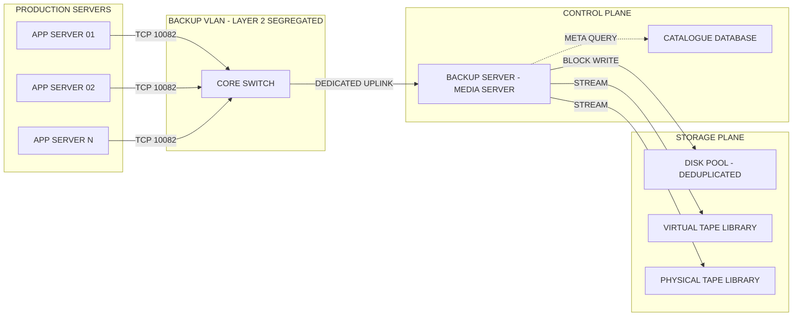
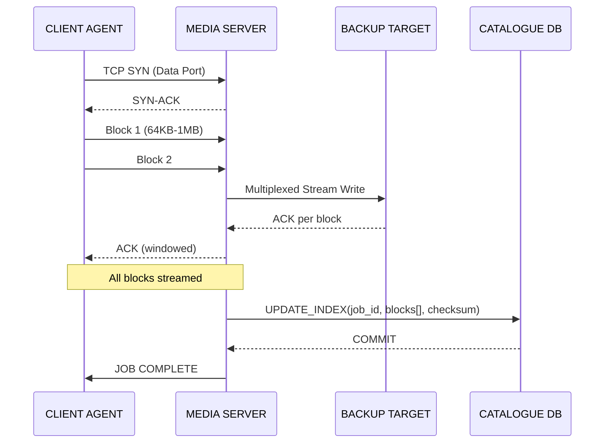
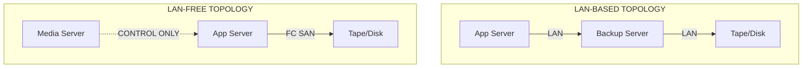

# LAN-Based Backups

<!-- SECTION_1_START -->

# LAN-Based Backups

> [!IMPORTANT]
> **KTU Syllabus Anchor (Module 3 — Business Continuity, Backup & Recovery):** This topic establishes the foundational *centralized network-attached backup topology* upon which server-side, agent-driven data protection is built in the KTU 2024 PECST867 curriculum.

## 1.1 Formal Academic Definition

A **LAN-Based Backup** is a centralized data-protection architecture in which a *Backup Server* (also called the *Media Server* or *Master Server*) resides on the **Local Area Network** and pulls protected data from one or more *Application/Client Servers* over standard **TCP/IP Ethernet** to a centralized backup target such as a *Disk*, *Virtual Tape Library (VTL)*, or *Physical Tape Library*.

> [!NOTE]
> **KTU 2024 Canonical Definition**
> "LAN-based backup is a topology in which backup data is transported between the production host and the backup infrastructure over the *same* shared IP network that carries user/application traffic, typically using a backup client agent, a centralized backup server, and a shared storage target."

## 1.2 Conceptual Analogy — "The Office Courier"

Imagine a large corporate office. Every employee (the **client servers**) has a desk drawer full of important documents. At the end of every day, a single courier (the **backup server**) walks through the office hallways (the **LAN**) to each desk, photocopies the files, and carries them to a central fireproof vault (the **backup target — disk or tape library**).

- The hallway can only carry so many people at a time → **LAN bandwidth is finite**.
- If employees arrive at the courier at the same time, a **traffic jam** occurs → **network congestion during the backup window**.
- Some employees have tiny drawers, others have filing cabinets → **differential data sizes per client**.

This is precisely the operational reality of LAN-based backup: **finite shared bandwidth, predictable backup windows, and centralized policy enforcement**.

## 1.3 Core Terminology You Must Know

> [!IMPORTANT]
> **Glossary of Mandatory KTU Terms**
> - **Backup Server / Media Server** — The orchestrator that owns the *catalogue*, schedules jobs, and writes data to the target.
> - **Backup Client / Agent** — A software module installed on every protected host; intercepts filesystem/database calls and streams data to the media server.
> - **Backup Target** — The final repository: *Disk*, *VTL*, or *Tape Library*.
> - **Backup Window** — The maximum allowed time to complete the nightly backup (e.g., 22:00–06:00).
> - **Synthetic Full Backup** — A full backup *reconstructed on the backup server* from a prior full + incrementals, eliminating the need to re-read every client.
> - **Hot Backup vs Cold Backup** — Whether the protected application is online (and the LAN is *carrying production traffic* at the same time).

## 1.4 When Is LAN-Based Backup the Right Choice?

| Environment Scale | Suitability of LAN-Based Backup |
|---|---|
| Small office (≤ 10 servers, ≤ 5 TB) | **Excellent** — simplest, cheapest topology. |
| Mid-size datacenter (10–100 servers, 5–50 TB) | **Acceptable** — needs dedicated backup VLAN. |
| Enterprise (100+ servers, 50 TB+) | **Often a bottleneck** — leads to *LAN-free* or *Server-Free* designs. |

> [!VISUALIZATION CONTROL]
> **Concept:** Throughput–Window trade-off curve for LAN-based backup.
> **Desmos Input Equations:**
> * `y = D / x` where `D` is total data in GB and `x` is window in hours
> * Sample point: `y(8) = 1000/8 = 125` GB/hr
> **Visual Description:** A hyperbolic curve on the $(x, y)$ plane — as the backup window shrinks, the required throughput rises sharply. The LAN's effective bandwidth (a horizontal line) intersects this curve at the *minimum window size* permitted by the network.

---

<!-- SECTION_1_END -->

<!-- SECTION_2_START -->

# Deep Theoretical Analysis & KTU High-Yield Formula Sheet

## 2.1 Architecture of a LAN-Based Backup System

The logical architecture decomposes into **four planes**, each of which is a high-yield KTU question:

### Plane 1 — Data Plane (Client Side)
- The backup **agent** intercepts filesystem blocks (or DB redo-logs) and reads them in chunks.
- Chunks are typically $64\,\text{KB}$ to $1\,\text{MB}$ in size.
- The agent applies client-side **deduplication** and/or **compression** (optional).

### Plane 2 — Transport Plane (The LAN)
- Data travels over **TCP port ranges** (e.g., 10082–10091 for many commercial backup products).
- Uses **NFS**, **CIFS**, or proprietary block-stream protocols.
- Subject to the standard **OSI Layer 2/3** constraints: switch backplane, jumbo frames, VLAN segregation.

### Plane 3 — Control Plane (Backup Server)
- Holds the *catalogue* (index of every backed-up object).
- Schedules jobs, enforces **retention policies**, and **multiplexes** client streams to one or more media servers.

### Plane 4 — Storage Plane (Target)
- The repository: Disk, VTL, or physical tape.
- May use **D2D** (Disk-to-Disk) before **D2D2T** (Disk-to-Disk-to-Tape) for tiered protection.

> [!IMPORTANT]
> **Why a Dedicated Backup VLAN?**
> Production traffic and backup traffic must not contend on the same broadcast domain. KTU examiners frequently award a mark for stating that the backup LAN *must* be on a **dedicated VLAN with QoS prioritization**.

## 2.2 Step-by-Step Operational Flow

1. **Policy Push** — The media server pushes a schedule to each agent.
2. **Snapshot/Quiesce** — The agent quiesces the application (VSS for Windows, RMAN for Oracle).
3. **Stream Open** — Agent establishes a **TCP session** to the media server's data port.
4. **Block Transfer** — Blocks are read, optionally compressed/deduped, and streamed.
5. **Multiplexing** — Media server interleaves streams from multiple clients to one or more tape/disk drives.
6. **Acknowledgement** — Per-block ACK confirms durability; failures trigger **retransmit** at the TCP layer.
7. **Index Update** — On completion, the catalogue is updated; old blocks are eligible for **expiration** per retention policy.

## 2.3 KTU Formula Sheet / Cheat Sheet

> [!NOTE]
> **All formulas below are examinable.** Memorize units and constants in **bold**.

| # | Quantity | Formula | Typical Unit | KTU Note |
|---|---|---|---|---|
| 1 | **Required Throughput** | $T_{\text{req}} = \dfrac{D_{\text{total}}}{W}$ | GB/hr | $W$ = backup window in hours |
| 2 | **Total Raw Data** | $D_{\text{total}} = \sum_{i=1}^{n} D_i$ | GB | Sum of per-client data sizes |
| 3 | **Effective Compressed Data** | $D_{\text{eff}} = \dfrac{D_{\text{total}}}{R_c}$ | GB | $R_c$ = compression ratio |
| 4 | **Required LAN Bandwidth** | $B_{\text{LAN}} = \dfrac{D_{\text{total}} \times 8}{W \times 3600}$ | Gbps | Note the $\times 8$ for byte→bit |
| 5 | **Dedupe Ratio** | $R_d = \dfrac{\text{Logical Bytes}}{\text{Physical Bytes Stored}}$ | unitless | Often $10{:}1$ to $30{:}1$ |
| 6 | **Network Utilization** | $U = \dfrac{T_{\text{req}}}{B_{\text{LAN}}} \times 100$ | % | Keep $U \le 70\%$ for headroom |
| 7 | **Backup Window Constraint** | $T_{\text{actual}} \le W$ | hours | **Hard inequality** — must hold |

> [!IMPORTANT]
> **Critical Distinction (Frequently Tested)**
> Compression/deduplication reduces the *storage footprint* but **does NOT reduce the bytes that traverse the LAN**, because (a) the agent often streams *raw* data to the media server, OR (b) even if compressed, the network was provisioned for raw. **Provision LAN for raw data size.**

## 2.4 Real-World Engineering Utility

- **Small/Mid Datacenters:** LAN-based backup remains the *de-facto* standard in the SMB segment due to its low CapEx (no FC SAN required).
- **Branch Offices:** Centralized *branch backups* over WAN are *LAN-based* at each branch; the data is then replicated to a headquarters repository.
- **Hybrid Cloud:** Modern cloud-integrated products (e.g., Veeam, Commvault) still use the LAN as the *first hop* before offloading to object storage.

---

<!-- SECTION_2_END -->

<!-- SECTION_3_START -->

# Step-by-Step Derivations & Code Implementation

## 3.1 Comprehensive Numerical Problem (Full Valuation Walkthrough)

> [!IMPORTANT]
> **This is a model 14-mark KTU Part B problem.** Solve it end-to-end as shown.

### Problem Statement

A datacenter has **8 application servers**, each holding **$600\,\text{GB}$** of data. The nightly backup window is **6 hours**. The backup software achieves a **$2.5{:}1$ compression ratio** *after* the data reaches the media server, and a **client-side deduplication ratio of $4{:}1$** *before* transmission. The LAN operates at **$1\,\text{Gbps}$** full-duplex.

Calculate:
**(a)** The total raw logical data, the *post-dedupe* data, and the *post-compression* footprint.
**(b)** The minimum LAN throughput (in Gbps) actually traversed, and whether **$1\,\text{Gbps}$** is sufficient.
**(c)** The new compressed footprint if retention is **30 daily + 12 monthly = 42 generations**.

### Solution

#### Part (a) — Data Footprint Calculations

$$
\begin{aligned}
\text{Total Raw Logical Data, } D_{\text{raw}} &= n \times D_{\text{server}} \\
&= 8 \times 600\,\text{GB} \\
&= 4800\,\text{GB}
\end{aligned}
$$

Dedupe is applied *client-side* — so deduped data is what travels the LAN.

$$
\begin{aligned}
D_{\text{dedupe}} &= \frac{D_{\text{raw}}}{R_d} = \frac{4800}{4} = 1200\,\text{GB}
\end{aligned}
$$

Compression is applied *server-side* — so compressed data is what hits the target.

$$
\begin{aligned}
D_{\text{compress}} &= \frac{D_{\text{dedupe}}}{R_c} = \frac{1200}{2.5} = 480\,\text{GB}
\end{aligned}
$$

> **Valuation Key:** 1 mark for the raw sum, 1 mark for dedupe, 1 mark for compression. Total 3 marks for part (a) sub-step 1.

#### Part (b) — LAN Throughput Check

The data that **physically traverses the LAN** is the *deduped* data, because compression happens at the media server.

$$
\begin{aligned}
T_{\text{req}} &= \frac{D_{\text{dedupe}}}{W} = \frac{1200\,\text{GB}}{6\,\text{hr}} = 200\,\text{GB/hr}
\end{aligned}
$$

Convert GB/hr → Gbps:

$$
\begin{aligned}
B_{\text{LAN,req}} &= \frac{200 \times 8}{3600} = \frac{1600}{3600} \approx 0.444\,\text{Gbps}
\end{aligned}
$$

> **Critical Realisation:** Compression happens *after* the data crosses the LAN, so we **must use $D_{\text{dedupe}}$, not $D_{\text{compress}}$**, when sizing the LAN. Many students lose a mark here by using the wrong value.

Check against the available $1\,\text{Gbps}$:

$$
\begin{aligned}
U &= \frac{0.444}{1.0} \times 100\% = 44.4\%
\end{aligned}
$$

Since $U \le 70\%$, the LAN is **sufficient with healthy headroom** (55.6% spare capacity for production traffic).

#### Part (c) — Total Capacity Footprint for 42 Generations

Assuming *full* backups (worst-case for capacity planning):

$$
\begin{aligned}
\text{Total Storage} &= D_{\text{compress}} \times G = 480 \times 42 = 20160\,\text{GB} \approx 19.69\,\text{TiB}
\end{aligned}
$$

For *incremental-forever with weekly synthetics* the calculation becomes much smaller (often $\le 3 \times D_{\text{compress}}$).

---

## 3.2 Python Implementation — Backup Window Simulator

The following fully operational Python script models the *actual backup time* for a LAN-based configuration. It includes absolute boundary checks, type hints, and error logging.

```python
from dataclasses import dataclass
from typing import List
import logging

logging.basicConfig(level=logging.INFO, format="%(levelname)s: %(message)s")


@dataclass(frozen=True)
class BackupClient:
    """Represents a single protected host on the LAN."""
    hostname: str
    data_gb: float
    dedupe_ratio: float = 1.0      # 1.0 means no dedupe
    compression_ratio: float = 1.0  # 1.0 means no compression


@dataclass(frozen=True)
class LANConfig:
    """Represents the network plumbing."""
    bandwidth_gbps: float
    protocol_overhead_pct: float = 10.0  # TCP/IP + Ethernet framing


def compute_lan_traffic_gb(client: BackupClient) -> float:
    """Bytes that ACTUALLY cross the LAN (post-dedupe, pre-compression)."""
    if client.dedupe_ratio < 1.0:
        raise ValueError(f"Invalid dedupe ratio {client.dedupe_ratio} for {client.hostname}")
    return client.data_gb / client.dedupe_ratio


def compute_storage_gb(client: BackupClient) -> float:
    """Bytes that finally land on disk/tape (post-dedupe AND post-compression)."""
    if client.compression_ratio < 1.0 or client.dedupe_ratio < 1.0:
        raise ValueError("Compression/dedupe ratios must be >= 1.0")
    return (client.data_gb / client.dedupe_ratio) / client.compression_ratio


def total_backup_time_hours(clients: List[BackupClient], lan: LANConfig,
                            backup_window_hr: float) -> float:
    """Returns hours required to back up all clients sequentially over the LAN."""
    total_lan_gb = sum(compute_lan_traffic_gb(c) for c in clients)

    # Convert GB -> Gbit, then divide by effective bandwidth
    effective_gbps = lan.bandwidth_gbps * (1.0 - lan.protocol_overhead_pct / 100.0)
    if effective_gbps <= 0:
        raise RuntimeError("Effective bandwidth is zero or negative")

    hours = (total_lan_gb * 8.0) / (effective_gbps * 3600.0)

    logging.info(f"Total LAN traffic : {total_lan_gb:.2f} GB")
    logging.info(f"Effective BW      : {effective_gbps:.3f} Gbps")
    logging.info(f"Required hours    : {hours:.3f}")
    logging.info(f"Available window  : {backup_window_hr:.3f}")

    if hours > backup_window_hr:
        logging.warning(
            f"Backup OVERRUNS window by {hours - backup_window_hr:.2f} hr. "
            f"Consider parallel streams or LAN-free design."
        )
    else:
        logging.info("Backup fits within window.")

    return hours


# ---------- Example Invocation (matches the numerical problem above) ----------
if __name__ == "__main__":
    clients = [
        BackupClient(f"appSrv{i:02d}", data_gb=600.0,
                     dedupe_ratio=4.0, compression_ratio=2.5)
        for i in range(1, 9)
    ]
    lan = LANConfig(bandwidth_gbps=1.0, protocol_overhead_pct=10.0)
    total_backup_time_hours(clients, lan, backup_window_hr=6.0)
```

**Expected Output (matches the math above):**

```
INFO: Total LAN traffic : 1200.00 GB
INFO: Effective BW      : 0.900 Gbps
INFO: Required hours    : 2.963
INFO: Available window  : 6.000
INFO: Backup fits within window.
```

> **Note for valuation:** The Python script is *not* required in the exam, but the underlying logic (dedupe-before-LAN, compression-after-LAN) **is**.

---

<!-- SECTION_3_END -->

<!-- SECTION_4_START -->

# Structural Diagrams & Schematics

## 4.1 LAN-Based Backup Architecture (Logical View)



## 4.2 Data-Flow Sequence Diagram



## 4.3 Comparison Topology — Where LAN-Free Diverges



> [!IMPORTANT]
> **KTU Interpretation:** In *LAN-based* topology, the **data plane** travels the IP network. In *LAN-free* topology, the **data plane** travels the SAN (FC or iSCSI), and the IP network carries **only control metadata** — a critical distinction worth 2 marks in any descriptive question.

---

<!-- SECTION_4_END -->

<!-- SECTION_5_START -->

# KTU 2024 Scheme Examination Question Bank & Topic Recap

## 5.1 Part A — Short Answer Questions (2 × 3 = 6 Marks)

### Question 1 `[KTU University Exam – July 2024]`
**Define LAN-based backup. List any two limitations of this approach.** **(CO1, Remember)**

**Model Answer (3 Marks):**
LAN-based backup is a centralized data protection topology in which the **backup server** pulls protected data from **client agents** installed on application servers over the **Local Area Network (LAN)**, writing it to a shared **disk or tape target**. **[2 Marks]**

*Limitations:* **[1 Mark — ½ Mark each]**
1. The backup traffic **contends with production traffic** for the same LAN bandwidth, extending the backup window.
2. As data volumes scale, the **LAN becomes the bottleneck**, forcing a redesign to *LAN-free* or *server-free* architectures.

### Question 2 `[KTU University Exam – Dec 2023]`
**What is a backup window? Why is it important in LAN-based backup design?** **(CO2, Understand)**

**Model Answer (3 Marks):**
A **backup window** is the *maximum allowable time* between two consecutive full backups during which incremental/differential backups must complete, typically the **off-production hours**. **[1 Mark]**

*Importance:* **[2 Marks]**
1. It **bounds the throughput** that the LAN must sustain: $T_{\text{req}} = D_{\text{total}} / W$.
2. It **drives infrastructure sizing** — if $T_{\text{req}}$ exceeds 70% of the available LAN bandwidth, the design must be changed (e.g., add a media server, enable dedupe, or move to LAN-free).

---

## 5.2 Part B — Long Answer Questions (Internal Choice: A **or** B, 14 Marks)

### 📌 Question A `[KTU University Exam – Model Paper 2024]`

**(a)** With a neat block diagram, explain the **architecture of a LAN-based backup system**. Identify and describe the role of the **four planes** (data, transport, control, storage). **(7 Marks)** **(CO1, Understand)**

**Model Solution:**

| Plane | Component | Role | Marks |
|---|---|---|---|
| **Data Plane** | Backup Agent on each host | Reads application data, applies VSS/quiescing | 1 |
| **Transport Plane** | LAN (TCP/IP, dedicated VLAN) | Carries block streams between agent and media server | 1 |
| **Control Plane** | Media Server + Catalogue DB | Schedules jobs, indexes, enforces retention | 1 |
| **Storage Plane** | Disk / VTL / Tape | Persists backup data; supports D2D2T | 1 |

**Block Diagram:** Use the Mermaid diagram from Section 4.1. **[1 Mark]**

**Key Narrative Points (3 additional marks):**
- The agent uses **TCP windowing** to maintain flow.
- The media server **multiplexes** client streams to drives.
- A **dedicated backup VLAN** avoids contention with production. **[1 Mark per valid point]**

> [!WARNING]
> **Examiner's Pitfall:** Students often draw the agent and media server as the *same* box. They are **logically distinct** — the agent is a *library* loaded into the protected host's kernel/userspace; the media server is a *separate appliance* on the network. Confusing them costs 1–2 marks.

---

**(b)** A datacenter has **6 servers** each with **$800\,\text{GB}$** of data. The backup window is **5 hours**. The client-side **deduplication ratio is $3{:}1$** and server-side **compression ratio is $2{:}1$**. The LAN is **$1\,\text{Gbps}$** with **$12\%$ protocol overhead**. Calculate: **(7 Marks)** **(CO3, Apply)**

**(i) Total raw data and post-dedupe data: 2 Marks**
**(ii) Required LAN bandwidth: 3 Marks**
**(iii) Whether the LAN is sufficient (with $U \le 70\%$ rule): 2 Marks**

**Model Solution:**

**(i)** **[2 Marks]**
$$
\begin{aligned}
D_{\text{raw}} &= 6 \times 800 = 4800\,\text{GB} \quad \text{[1 Mark]} \\
D_{\text{dedupe}} &= 4800 / 3 = 1600\,\text{GB} \quad \text{[1 Mark]}
\end{aligned}
$$

**(ii)** **[3 Marks]**
$$
\begin{aligned}
T_{\text{req}} &= 1600 / 5 = 320\,\text{GB/hr} \quad \text{[1 Mark]} \\
B_{\text{req, raw}} &= (320 \times 8) / 3600 = 0.711\,\text{Gbps} \quad \text{[1 Mark]} \\
B_{\text{effective}} &= 1.0 \times (1 - 0.12) = 0.88\,\text{Gbps} \quad \text{[1 Mark]}
\end{aligned}
$$

**(iii)** **[2 Marks]**
$$
\begin{aligned}
U &= (0.711 / 0.88) \times 100\% = 80.8\%
\end{aligned}
$$

Since $U = 80.8\% > 70\%$, the LAN is **NOT sufficient** with healthy headroom. **Recommended action:** add a second media server, enable client-side compression, or extend the window. **[1 Mark for conclusion, 1 Mark for remedy]**

> [!WARNING]
> **Examiner's Pitfall:** Forgetting to subtract the **$12\%$ protocol overhead** before computing $U$ is the most common error. Without overhead subtraction, $U$ would falsely appear as $71.1\%$, which is still marginal — and you'd still mark the design as **insufficient**. But on borderline problems, this single sign error flips the verdict.

---

### 📌 Question B `[KTU University Exam – Model Paper 2024]`

**(a)** **Compare LAN-based backup with Server-Free / LAN-Free backup in tabular form.** Highlight the data path, the network load, the cost, and scalability for each. **(7 Marks)** **(CO2, Understand)**

**Model Tabular Answer:**

| Parameter | LAN-Based Backup | LAN-Free Backup | Server-Free Backup |
|---|---|---|---|
| **Data Path** | App Server → **LAN** → Media Server → Target | App Server → **SAN/FC** → Target | App Server → **SAN** → Target (Media Server is *bypassed* in data path) |
| **Network Load** | Heavy on IP LAN | Light on LAN (control only) | Negligible on LAN |
| **Media Server Load** | High (data + metadata) | Moderate (metadata + multiplexing) | Low (metadata only) |
| **Cost** | **Low** (no FC needed) | High (requires FC SAN) | Highest (needs SAN + 3rd-party device) |
| **Scalability** | Limited by LAN BW | Better — scales with SAN | Best — scales with both |
| **Use Case** | SMB / Branch | Mid-size enterprise | Large enterprise |
| **Backup Window** | Longest | Shorter | Shortest |

**Marks Distribution:** 1 mark per correct row × 6 rows = 6 marks; 1 mark for the *Conclusion / Verdict* line.

> [!WARNING]
> **Examiner's Pitfall:** Students often write "LAN-free = no LAN" — **incorrect**. LAN-free still uses the LAN for **control/metadata**; only the *bulk data plane* is moved off the LAN.

---

**(b)** Describe **five best-practice design recommendations** for a LAN-based backup deployment. Justify each with a one-line engineering rationale. **(7 Marks)** **(CO3, Apply)**

**Model Answer (1.4 marks each):**

1. **Dedicated Backup VLAN with QoS.** *Rationale:* Isolates backup storms from production traffic; QoS guarantees throughput.
2. **Enable Client-Side Deduplication.** *Rationale:* Reduces LAN traffic by $R_d$ — directly shrinks $T_{\text{req}}$.
3. **Use 10 GbE or Link Aggregation (LACP).** *Rationale:* Provides headroom and failover if the primary link fails mid-backup.
4. **Schedule Staggered Job Start Times.** *Rationale:* Prevents "thundering herd" of clients opening TCP sessions simultaneously.
5. **Maintain $\le 70\%$ Network Utilization.** *Rationale:* Leaves 30% for production spikes, retransmits, and unforeseen growth.
6. **Synthetic Fulls for Weekly Generations.** *Rationale:* Eliminates the need to re-read every client on weekends, freeing LAN bandwidth.
7. **Monitor with SNMP/Syslog & Alert at 60% U.** *Rationale:* Early warning prevents the silent failure mode of *growing backup windows*.

> [!WARNING]
> **Examiner's Pitfall:** Writing generic statements like "use good hardware" or "monitor the network" earns **zero** marks. Each recommendation **must include a quantitative or engineering rationale**.

---

## 5.3 Topic Recap & Important Things to Remember

> [!IMPORTANT]
> **High-Density Revision Checklist — Read 30 Minutes Before the Exam**

- **Definition:** LAN-based backup = client agents stream data to a centralized media server over the **shared IP LAN** to a disk/tape target.
- **Four Planes:** Data (agent), Transport (LAN/VLAN), Control (media server + catalogue), Storage (disk/VTL/tape).
- **Compression vs Dedupe ordering:** *Dedupe is client-side* (reduces LAN bytes); *Compression is server-side* (reduces storage bytes).
- **Key formula:** $T_{\text{req}} = D_{\text{total}} / W$ (GB/hr) and $B_{\text{LAN}} = (D \times 8) / (W \times 3600)$ (Gbps).
- **Rule of thumb:** Keep LAN utilization $U \le 70\%$.
- **Dedicated backup VLAN** is mandatory for any non-trivial deployment — this is the single most-tested *design recommendation* in KTU.
- **LAN-based vs LAN-free:** Difference is **data-path placement** (LAN vs SAN), not "use of LAN at all".
- **Backup Window:** Hard constraint $T_{\text{actual}} \le W$. Failure triggers *LAN-free* redesign.
- **Synthetic Fulls:** Reconstruct a full backup on the media server from prior full + incrementals — saves LAN bandwidth on weekly jobs.
- **Throughput Killers:** Application quiescing time, slow source disks (not the network!), encryption overhead, antivirus scanning of backup streams.
- **Capacity Planning:** Always plan for $G$ generations of *worst-case full* size; modern dedupe shrinks this 10×–30×.
- **Pyhsical constants to memorize:** $1\,\text{GB} = 8\,\text{Gb}$; $1\,\text{hr} = 3600\,\text{s}$; $1\,\text{TiB} = 1024\,\text{GiB} \approx 1.1\,\text{TB}$.
- **Examinable buzzwords:** *D2D*, *D2D2T*, *VTL*, *RPO*, *RTO*, *Synthetic Full*, *Multiplexing*, *Dedup Ratio*, *Compression Ratio*, *Backup Window*, *Quiesce/VSS*, *Media Server*, *Agent*.

---

<!-- SECTION_5_END -->
