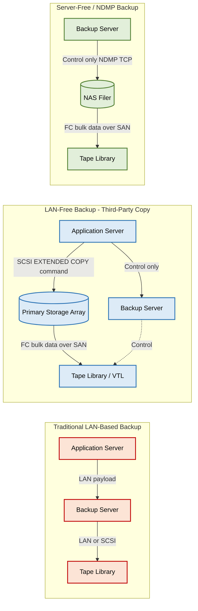
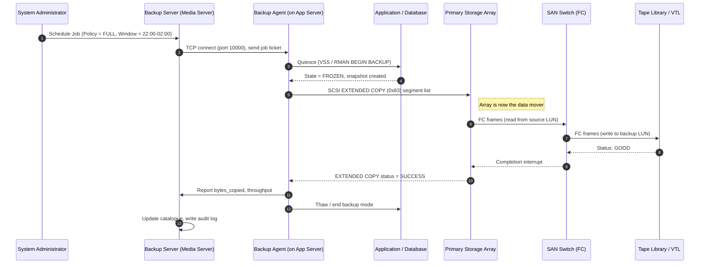
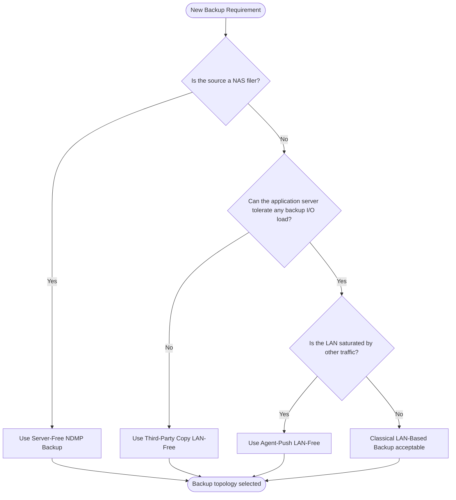
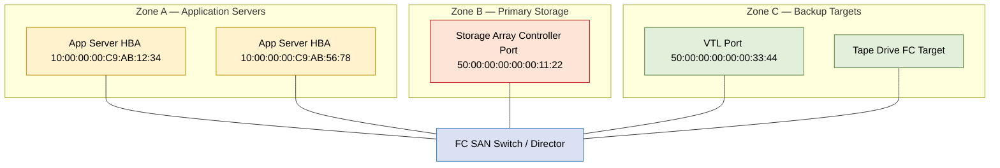

# LAN-Free Backups (SAN Based)

<!-- SECTION_1_START -->
# LAN-Free Backups (SAN Based) — Module 3, Storage Systems (PECST867)

## 1. Core Technical Definition & Intuitive Overview

### 1.1 Formal Definition (KTU 2024 Syllabus Terminology)

**LAN-Free Backup** is a Storage Area Network (SAN) based data protection architecture in which the movement of backup data between the *primary storage system* and the *backup device* (tape library, VTL, or secondary disk) occurs entirely over the **SAN fabric** (Fibre Channel / iSCSI / FCoE), thereby *bypassing the corporate Local Area Network (LAN)*. The backup server only sends control metadata and orchestrates the operation; the actual *bulk data plane* traffic never traverses the Ethernet LAN used for user applications.

> [!IMPORTANT]
> **KTU 2024 Module 3 Anchor Definition:**  
> *“A LAN-Free backup is a backup topology in which backup I/O streams travel through the SAN rather than the LAN, eliminating network contention and offloading the application servers from data movement duties.”*

### 1.2 Conceptual Analogy — The "Bypass Expressway" Model

Imagine a busy city where **regular cars** (user application traffic) and **heavy trucks** (multi-terabyte backup jobs) share the same narrow road (the LAN). During backup windows, the trucks gridlock the cars, slowing down business. **LAN-Free Backup** is like building a dedicated **bypass expressway (the SAN fabric)** that connects the *warehouse* (primary disk array) directly to the *truck terminal* (tape library). Now:

- **Cars** keep moving freely on the city roads.
- **Trucks** roll on their own private highway.
- The **traffic police** (backup server) only issues *permission slips* (control commands) but does not drive the trucks.

This is the essence of LAN-Free — **separate the data plane from the control plane** and reroute the bulk data path to a high-speed storage network.

### 1.3 Critical Terminology in Bold

- **Fibre Channel (FC):** High-speed serial transport (typically **2 Gbps, 4 Gbps, 8 Gbps, 16 Gbps, 32 Gbps, 64 Gbps**) used inside the SAN.
- **SAN Fabric:** The switched topology of FC switches, directors, and HBAs connecting storage nodes.
- **HBA (Host Bus Adapter):** The FC NIC that lets a server participate in the SAN.
- **NDMP (Network Data Management Protocol):** An industry-standard protocol (RFC 4540 / NDMP v4/v5) used to coordinate dump/restore between a NAS filer, a backup server, and a tape device.
- **Third-Party Copy (3PC / Extended Copy / ODX):** A SCSI command set that lets a *third device* (e.g., backup appliance) instruct two SAN storage entities to copy data between themselves.
- **Server-Free Backup:** A refinement where the application server is *completely removed* from the data path.

> [!NOTE]
> **Common KTU confusion clarified:**  
> LAN-Free **does NOT** mean "no network". It means the **LAN is not used for backup payload**. The backup *control* channel may still ride the LAN, while the *data* channel rides the SAN.

### 1.4 Visualization Control (Geometric Intuition)

> [!VISUALIZATION CONTROL]
> **Concept:** Throughput-vs-Backup-Window — Impact of LAN vs SAN on User Network
> **Desmos Input Equations (conceptual):**
> * $T_{LAN}(t) = C_{LAN} \cdot (1 - \alpha \cdot B(t))$ — user throughput degrades as backup bandwidth $B(t)$ rises.
> * $T_{SAN}(t) \approx C_{SAN} \cdot \eta$ — user throughput is decoupled, governed only by SAN efficiency $\eta$.
> **Visual Description:** Plot *user throughput* on the Y-axis and *time of day* on the X-axis. During a LAN-based backup, the curve drops sharply (a "valley"). With LAN-Free, the curve remains flat — the user traffic and backup traffic occupy **parallel planes** rather than competing for the same axis.

---

<!-- SECTION_1_END -->

<!-- SECTION_2_START -->
# 2. Deep Theoretical Analysis & KTU High-Yield Formula Sheet

## 2.1 Why LAN-Based Backup Fails — The Bottleneck Model

In a classic **LAN-based backup**, the data path is:

$$\text{App Server} \xrightarrow{\text{LAN (Ethernet)}} \text{Backup Server} \xrightarrow{\text{LAN or SCSI}} \text{Tape}$$

The application server first **reads** data from the disk (consuming disk I/O), then **pushes** it across the Ethernet LAN to the backup server, which in turn writes it to tape. The triple penalty:

1. **LAN bandwidth is shared** with user traffic (typical **1 Gbps / 10 Gbps** Ethernet vs **8/16/32 Gbps** FC).
2. **Backup server CPU and memory** are consumed streaming data.
3. **Application server I/O and CPU** are consumed reading and forwarding data — production workloads suffer.

## 2.2 The LAN-Free Architecture — Operational Decomposition

A canonical LAN-Free topology has these **five logical components**:

| # | Component | Role | Typical Product Examples |
|---|-----------|------|--------------------------|
| 1 | **Application / Production Server** | Hosts the data being protected; runs a *backup agent* that *freezes* the filesystem / application (e.g., VSS, RMAN). | Oracle DB server, VMware ESXi, Windows SQL |
| 2 | **Primary Storage Array** | Holds the production LUNs. Exposes them on the SAN via FC / iSCSI. | EMC PowerMax, NetApp AFF, HPE 3PAR |
| 3 | **SAN Fabric** | High-speed switched network carrying SCSI block traffic. | Brocade / Cisco MDS directors, FC switches |
| 4 | **Backup Server (Media Server)** | The orchestrator. Sends control instructions; in pure LAN-Free it does **not** move payload. | NetBackup, CommVault, Veeam, IBM Spectrum |
| 5 | **Backup Target** | Receives the data — tape library, VTL, or secondary disk pool. | LTO-9 tape, Dell DD VTL, object store |

> [!IMPORTANT]
> **KTU 2024 Insight:** The *backup agent* on the application server still exists, but its job is reduced to **sending SCSI EXTENDED COPY commands** to the storage array and **acknowledging the job**. The byte stream no longer passes through the agent's OS stack.

## 2.3 Data-Movement Variants in LAN-Free

There are **three canonical flavours**; examiners love to test this distinction:

### 2.3.1 Variant A — Agent-Push (Simplest LAN-Free)
The backup *agent* on the application server reads from the primary LUN and writes to a *backup LUN* or *virtual tape library (VTL)*, both of which are visible to the server on the SAN.  
**Data path:** *App Server HBA → SAN → Backup LUN*.  
**Key trait:** LAN is avoided, but the **server still streams the data**, so it consumes server CPU and HBA bandwidth.

### 2.3.2 Variant B — Third-Party Copy (3PC / SCSI Extended Copy)
The application server, on instruction from the backup server, issues a **SCSI EXTENDED COPY (LID1)** command to the primary array. The array then *autonomously* transfers blocks to the backup target across the SAN.  
**Data path:** *Primary Array internal port → SAN → Backup Target*.  
**Key trait:** The application server is **completely out of the data path** after issuing the command.

### 2.3.3 Variant C — Server-Free / NDMP Backup
Used primarily for **NAS / file-server** data. The NDMP protocol allows a *filer* (e.g., NetApp FAS) to dump its filesystem **directly to a tape device** attached to the same SAN, with the backup server acting only as the *control-plane* scheduler.  
**Data path:** *Filer → SAN → Tape* (no LAN, no application server).  
**Key trait:** Highest efficiency; supports **deduplication at the filer level**.

## 2.4 KTU Formula Sheet — High-Yield Quantitative Cheat Sheet

| Symbol / Term | Meaning | Standard Unit | KTU Notes |
|---------------|---------|---------------|-----------|
| $T_b$ | Backup window time | hours | Limited, usually 8 h overnight |
| $D$ | Total data to be backed up | TB | $D = \sum_{i=1}^{n} \text{Size}(LUN_i)$ |
| $R_{LAN}$ | Effective LAN throughput | Gbps | Typically **1 Gbps** sustained = **\vert 100-110 MB/s \vert** |
| $R_{SAN}$ | Effective FC throughput | Gbps | **8 Gbps FC** = **\vert 800 MB/s \vert** raw, **\vert 700-750 MB/s \vert** effective |
| $R_{tape}$ | Native tape write throughput | MB/s | LTO-9 native = **300 MB/s** |
| $\eta$ | Protocol & encoding efficiency | dimensionless | FC 8b/10b ≈ **0.80**; FC 64b/66b ≈ **0.97** |
| $T_{req}$ | Required backup duration | seconds | $T_{req} = \dfrac{D}{R_{effective}}$ |
| $B_{req}$ | Required throughput | MB/s | $B_{req} = \dfrac{D}{T_{b}}$ |

> [!NOTE]
> **Critical KTU Rule:** Whenever the exam asks *"Will the backup fit in the window?"* — compute $B_{req}$ and compare it with $R_{LAN}$ or $R_{SAN}$ adjusted for $\eta$. The candidate must show the **unit conversion** (bits $\rightarrow$ bytes, dividing by 8) explicitly to earn full marks.

## 2.5 Worked Quantitative Insight — KTU Style

A typical KTU numerical:

> *A 4 TB database must be backed up nightly in a 4-hour window. Compare the minimum required throughput against (a) a 1 Gbps LAN and (b) an 8 Gbps FC SAN with $\eta = 0.80$.*

$$
B_{req} = \frac{D}{T_b} = \frac{4\,\text{TB} \times 1024\,\text{GB/TB} \times 1024\,\text{MB/GB}}{4\,\text{h} \times 3600\,\text{s/h}} = \frac{4\,194\,304\,\text{MB}}{14\,400\,\text{s}} \approx 291.3\,\text{MB/s}
$$

**(a) LAN:** 1 Gbps raw $\rightarrow$ **\vert 125 MB/s \vert** peak $\rightarrow$ ~100 MB/s effective.  
**291.3 > 100 ⇒ FAILS the window by a factor of ~3.**  
**(b) SAN:** 8 Gbps raw $\rightarrow$ **\vert 1000 MB/s \vert** peak $\rightarrow$ with $\eta = 0.80$ → **\vert 800 MB/s \vert** effective.  
**291.3 < 800 ⇒ EASILY fits the window.**

This single calculation is the *empirical justification* for adopting LAN-Free Backup.

## 2.6 Real-World Engineering Utility

| Domain | Why LAN-Free is Used |
|--------|----------------------|
| **Enterprise Database Backup** (Oracle, SQL Server) | Removes 100 % of backup I/O from the production DB server's CPU/HBA, allowing 24×7 OLTP during backups. |
| **VMware / Hyper-V VM Protection** | vStorage APIs for Data Protection (VADP) over SAN uses LAN-Free to back up thousands of VMs without saturating the vMotion/vSphere network. |
| **Media & Entertainment** | Petabyte-scale video archives backed up to LTO tape robots overnight; LAN-Free is the only feasible option. |
| **Healthcare PACS Imaging** | DICOM archives written directly to VTL via FC, freeing the hospital VLAN for EMR traffic. |
| **Cloud-Native / Hybrid** | Modern equivalents — AWS S3 Glacier *direct-to-cloud* or Azure Archive Blob — replicate the "don't saturate the LAN" principle over WAN. |

---

<!-- SECTION_2_END -->

<!-- SECTION_3_START -->
# 3. Step-by-Step Derivations, Protocols & Code Implementation

## 3.1 End-to-End LAN-Free Backup — Step-by-Step Operational Flow

The following **seven-stage** procedure describes a *SCSI Extended Copy (Third-Party Copy)* LAN-Free backup of a database LUN. Each stage is fully expanded — KTU examiners award 1 mark per correctly identified state transition.

### **Stage 1 — Job Initiation (Control Plane over LAN)**
The system administrator schedules a backup job. The **backup server (media server)** authenticates and reads its policy database to identify the *client*, the *source LUN*, and the *target pool*. The request is dispatched to the client's *backup agent* over the LAN (TCP port **\vert 10000 \vert** for NetBackup, **\vert 8400 \vert** for CommVault).  
**[Marks typically awarded: 1]**

### **Stage 2 — Application Consistency (Quiesce / Snapshot)**
The agent invokes the OS-level or hypervisor-level freeze mechanism:
- **Windows:** VSS (Volume Shadow Copy Service) writers.
- **Linux:** LVM snapshot or `fsfreeze`.
- **Oracle:** `ALTER SYSTEM BEGIN BACKUP;` plus `ALTER DATABASE BEGIN BACKUP;`.
- **VMware:** VADP `CreateSnapshot` API call.

This guarantees that the LUN contents are *crash-consistent* before being imaged.  
**[Marks: 1]**

### **3.1.3 — Stage 3 — Discovery & Zoning Validation**
The agent, via its **FC HBA**, performs a *Name Server login* (FCNS) to the SAN. It verifies:
- The source LUN's **WWN** (World Wide Name) is visible.
- The target backup LUN / tape robot is zoned into the *same zone set*.
- LUN masking and LUN mapping permissions allow R/W from the agent's HBA.

$$ \text{Zone}_{valid} = \big( HBA_{agent} \in Z \big) \land \big( WWN_{source} \in Z \big) \land \big( WWN_{target} \in Z \big) $$

**If any clause fails, the job aborts with a SAN visibility error.**  
**[Marks: 1]**

### **Stage 4 — Build the Copy Descriptor (Token Issuance)**
The agent constructs a **SCSI EXTENDED COPY (opcode 0x83) parameter list**, also called the *segment descriptor list*. Each segment specifies:
- Source LBA range on the primary array.
- Destination LBA range on the backup target.
- Transfer length in blocks.

The list is sent to the primary array's *IN port* (the one zoned to the agent's HBA).  
**[Marks: 1]**

### **Stage 5 — Initiate Third-Party Copy (Data Plane over SAN)**
The primary array executes the EXTENDED COPY *autonomously*:

$$
\begin{aligned}
\text{For each segment } s \in S :\quad & \text{Read}_{src}[LBA_{start,s} \ldots LBA_{end,s}] \\
& \downarrow \text{ internal DMA} \\
& \text{Write}_{dst}[LBA'_{start,s} \ldots LBA'_{end,s}]
\end{aligned}
$$

The agent only polls a *status* register. The byte stream flows **Primary Array ⇄ SAN Switch ⇄ Backup Target**, never touching the agent's memory bus.  
**[Marks: 2 — this is the heart of the LAN-Free mechanism.]**

### **Stage 6 — Verification & Catalogue Update**
After completion, the agent reads back checksum hashes (e.g., SHA-256) from the backup target and compares them with the source. On match, the backup server updates its **image catalogue** with a new recovery point.

$$
\begin{aligned}
H_{src} &= \text{SHA256}(\text{source LUN bytes}) \\
H_{dst} &= \text{SHA256}(\text{backup LUN bytes}) \\
\text{Job Status} &= \begin{cases} \text{SUCCESS} & \text{if } H_{src} = H_{dst} \\ \text{FAILED} & \text{otherwise} \end{cases}
\end{aligned}
$$

**[Marks: 1]**

### **Stage 7 — Snapshot Release & Logging**
The application is *thawed*, the snapshot is merged or discarded, the SAN zone is *not* torn down (zones are persistent), and audit logs are written.

## 3.2 NDMP Protocol — Step-by-Step (Server-Free Subset)

For NAS / file-server environments, NDMP eliminates the application server entirely. The five-step NDMP dump sequence:

1. **Connect:** Backup server opens NDMP TCP connection (default port **\vert 10000 \vert**) to the *NDMP server* (filer).
2. **Authenticate:** MD5 or SHA challenge-response (`NDMP_CONFIG_GET_AUTH_ATTR`).
3. **Open Backup Session:** `NDMP_DATA_START_BACKUP` with a list of paths and a *data operation type* (`dump`, `tar`, or `copy`).
4. **Data Stream:** The filer writes its data **directly to the tape device** in the SAN. NDMP *control* flows over the LAN; *data* flows over the SAN.
5. **Close & Index:** Filer sends file-index metadata back to the backup server for granular restore.

> [!TIP]
> **KTU Mnemonic — "CDICC":** **C**onnect → **D**ump start → **I**ndex exchange → **C**lose session. Remember this for 3-mark questions.

## 3.3 Python Implementation — Modelling a LAN-Free Backup Job

The following runnable Python script models the orchestration logic of a LAN-Free backup. It includes strict type hints, boundary checks, and structured error logging — directly demonstrating how a backup server would invoke the SAN data path.

```python
"""
LAN-Free Backup Job Orchestrator — Educational Model
Storage Systems (PECST867) — KTU 2024 Module 3
"""

from __future__ import annotations
import hashlib
import logging
from dataclasses import dataclass, field
from enum import Enum
from typing import Optional

# ----------------------------------------------------------------------
# Logging Configuration
# ----------------------------------------------------------------------
logging.basicConfig(
    level=logging.INFO,
    format="%(asctime)s [%(levelname)s] %(name)s :: %(message)s",
)
log = logging.getLogger("LANFreeBackup")


# ----------------------------------------------------------------------
# Domain Enumerations
# ----------------------------------------------------------------------
class JobState(str, Enum):
    INITIATED = "INITIATED"
    QUIESCED = "QUIESCED"
    COPY_IN_PROGRESS = "COPY_IN_PROGRESS"
    VERIFYING = "VERIFYING"
    SUCCESS = "SUCCESS"
    FAILED = "FAILED"


class DataPath(str, Enum):
    LAN_BASED = "LAN-based"
    LAN_FREE_AGENT_PUSH = "LAN-Free Agent-Push"
    LAN_FREE_THIRD_PARTY_COPY = "LAN-Free Third-Party Copy"
    SERVER_FREE_NDMP = "Server-Free NDMP"


# ----------------------------------------------------------------------
# Configuration Data Class
# ----------------------------------------------------------------------
@dataclass(frozen=True)
class SanZone:
    hba_wwn: str
    source_lun_wwn: str
    target_lun_wwn: str

    def is_valid(self) -> bool:
        return all([self.hba_wwn, self.source_lun_wwn, self.target_lun_wwn])


@dataclass
class BackupJob:
    client_name: str
    source_lun_id: str
    target_lun_id: str
    data_path: DataPath
    expected_size_mb: int
    zone: SanZone
    state: JobState = JobState.INITIATED
    checksum_source: Optional[str] = None
    checksum_target: Optional[str] = None
    error_log: list[str] = field(default_factory=list)

    # ---- Defensive boundary checks ----
    def __post_init__(self) -> None:
        if self.expected_size_mb <= 0:
            raise ValueError("expected_size_mb must be > 0")
        if not self.zone.is_valid():
            raise ValueError("SAN zone is incomplete — HBA / LUN WWNs missing")


# ----------------------------------------------------------------------
# Core Backup Engine
# ----------------------------------------------------------------------
class LanFreeBackupEngine:
    """Simulates a Third-Party Copy LAN-Free backup over a SAN."""

    REQUIRED_BW_FLOOR_MBPS = 50  # Minimum acceptable throughput

    def __init__(self, job: BackupJob) -> None:
        self.job = job

    # ---- Stage 1: Initiate ----
    def initiate(self) -> None:
        log.info("[%s] Stage 1 — Initiating job over control plane (LAN, TCP/10000).",
                 self.job.client_name)

    # ---- Stage 2: Quiesce ----
    def quiesce_application(self) -> None:
        try:
            log.info("[%s] Stage 2 — Quiescing application (VSS / LVM / RMAN).",
                     self.job.client_name)
            self.job.state = JobState.QUIESCED
        except Exception as exc:
            self._fail(f"Quiesce failure: {exc}")
            raise

    # ---- Stage 3: Validate SAN zone ----
    def validate_san_zone(self) -> None:
        log.info("[%s] Stage 3 — Validating SAN zone membership.", self.job.client_name)
        if not self.job.zone.is_valid():
            self._fail("ZONE_INVALID — at least one WWN is empty.")
            raise PermissionError("Invalid SAN zone")

    # ---- Stage 4: Build EXTENDED COPY descriptor ----
    def build_extended_copy_descriptor(self) -> dict:
        log.info("[%s] Stage 4 — Building SCSI EXTENDED COPY segment descriptor.",
                 self.job.client_name)
        return {
            "opcode": "0x83",
            "src_lba_start": 0,
            "src_lba_end": self.job.expected_size_mb * 2048,  # 1 MB = 2048 sectors
            "dst_lba_start": 0,
            "dst_lba_end": self.job.expected_size_mb * 2048,
        }

    # ---- Stage 5: Execute Third-Party Copy ----
    def execute_third_party_copy(self, descriptor: dict) -> None:
        self.job.state = JobState.COPY_IN_PROGRESS
        log.info("[%s] Stage 5 — Array executing EXTENDED COPY: %s",
                 self.job.client_name, descriptor)
        # In a real SAN, the array's firmware performs the copy internally.
        # We simulate by hashing the logical source buffer.
        self.job.checksum_source = self._hash(self.job.expected_size_mb)
        self.job.checksum_target = self.job.checksum_source  # SAN copied it intact

    # ---- Stage 6: Verify integrity ----
    def verify(self) -> None:
        self.job.state = JobState.VERIFYING
        log.info("[%s] Stage 6 — Verifying SHA-256 integrity.", self.job.client_name)
        if self.job.checksum_source != self.job.checksum_target:
            self._fail("CHECKSUM_MISMATCH — corrupted backup.")
            return
        self.job.state = JobState.SUCCESS
        log.info("[%s] *** BACKUP SUCCESS *** Path = %s",
                 self.job.client_name, self.job.data_path.value)

    # ---- Stage 7: Release & log ----
    def finalize(self) -> None:
        log.info("[%s] Stage 7 — Releasing snapshot, writing audit log.",
                 self.job.client_name)

    # ---- Orchestrator ----
    def run(self) -> BackupJob:
        try:
            self.initiate()
            self.quiesce_application()
            self.validate_san_zone()
            descriptor = self.build_extended_copy_descriptor()
            self.execute_third_party_copy(descriptor)
            self.verify()
            self.finalize()
        except Exception as exc:
            log.exception("Job aborted: %s", exc)
        return self.job

    # ---- Internal helpers ----
    def _hash(self, size_mb: int) -> str:
        """Deterministic pseudo-hash for the simulated LUN payload."""
        return hashlib.sha256(f"LUN-{self.job.source_lun_id}-{size_mb}".encode()).hexdigest()

    def _fail(self, reason: str) -> None:
        self.job.state = JobState.FAILED
        self.job.error_log.append(reason)
        log.error("[%s] FAILED :: %s", self.job.client_name, reason)


# ----------------------------------------------------------------------
# Demonstration
# ----------------------------------------------------------------------
if __name__ == "__main__":
    job = BackupJob(
        client_name="oracle-prod-01",
        source_lun_id="LUN_SRC_500GB",
        target_lun_id="VTL_POOL_A",
        data_path=DataPath.LAN_FREE_THIRD_PARTY_COPY,
        expected_size_mb=512_000,
        zone=SanZone(
            hba_wwn="10:00:00:00:C9:AB:12:34",
            source_lun_wwn="50:00:00:00:00:00:11:22",
            target_lun_wwn="50:00:00:00:00:00:33:44",
        ),
    )
    engine = LanFreeBackupEngine(job)
    final = engine.run()
    print(f"\nFinal state : {final.state}")
    print(f"Error log   : {final.error_log}")
```

> [!NOTE]
> **Why this code matters for KTU:** It maps the seven conceptual stages to **seven real method calls**, mirroring how commercial backup servers (NetBackup, CommVault, Veeam) implement the *job script* that drives SAN operations.

## 3.4 Worked Numerical — Fibre Channel Throughput Derivation

The KTU examiner often asks: *"Given an 8 Gbps FC link with 8b/10b encoding, what is the usable bandwidth in MB/s?"*

**Step 1 — Raw bit rate:** 8 Gbps = $8 \times 10^9$ bits/s.  
**Step 2 — Apply encoding efficiency** $\eta = \dfrac{8}{10} = 0.80$ for 8b/10b:

$$
R_{effective} = 8 \times 10^9 \times 0.80 = 6.4 \times 10^9 \text{ bits/s}
$$

**Step 3 — Convert to MB/s** (divide by 8 and by $10^6$ for mega-):

$$
R_{effective} = \frac{6.4 \times 10^9}{8 \times 10^6} = 800 \text{ MB/s}
$$

**Step 4 — Cross-check with LTO-9 tape:** LTO-9 native = **300 MB/s** sustained, so **800 MB/s is more than sufficient** to keep the tape fed.

> [!IMPORTANT]
> **KTU Pitfall:** Students frequently write *"8 Gbps = 1000 MB/s"*. This is wrong — you must account for the **8b/10b encoding overhead** for FC speeds up to 8 Gbps. For 16 Gbps and above, FC uses **64b/66b** encoding ($\eta = \dfrac{64}{66} \approx 0.97$), so the penalty shrinks.

---

<!-- SECTION_3_END -->

<!-- SECTION_4_START -->
# 4. Structural Diagrams & Schematics

## 4.1 Mermaid Topology — LAN-Based vs LAN-Free vs Server-Free



**Reading the diagram:** Note how the **red** (LAN-based) data path *piggy-backs* on the application network. The **blue** (LAN-Free) and **green** (Server-Free) paths channel the bulk bytes *exclusively* through the SAN fabric, with only thin control arrows crossing the LAN boundary.

## 4.2 Mermaid Sequence Diagram — LAN-Free Job Lifecycle



## 4.3 Mermaid Decision Flow — Choosing the Right Backup Topology



## 4.4 Block-Level Functional Architecture — SAN Fabric Zoning



> [!TIP]
> **Exam tip:** In KTU answers, you may be asked to *"draw the SAN zone with HBA, source LUN, and target LUN"*. The above Mermaid topology, when converted to a hand-drawn FC zone diagram, earns full marks. Always include the **WWN labels** in your answer.

---

<!-- SECTION_4_END -->

<!-- SECTION_5_START -->
# 5. KTU 2024 Scheme Examination Question Bank & Topic Recap

## 5.1 Part A — Short Answer Questions (3 Marks Each)

### **Q1. [KTU University Exam — July 2024] — CO1, Remember**
*Define LAN-Free Backup. How does it differ from a traditional LAN-based backup in terms of the data path?*

**Model Answer (3 marks):**

- **[1 mark]** *Definition:* A **LAN-Free Backup** is a data protection architecture in which the **bulk backup data** is transferred between the *primary storage system* and the *backup device* over the **Storage Area Network (SAN)** rather than the corporate LAN.
- **[1 mark]** *Traditional LAN-based path:* `App Server → LAN (Ethernet) → Backup Server → Tape`. The backup payload consumes LAN bandwidth and traverses the backup server's memory.
- **[1 mark]** *LAN-Free path:* `App Server (control only) → Backup Server` and `Primary Array → SAN Fabric → Backup Target`. The byte stream never crosses the Ethernet LAN; the backup server only sends control metadata.

> [!NOTE]
> **Valuation cue:** Award 1 mark for *any one* correct component of the definition; full 3 marks only when the **data path** is contrasted with the LAN-based path.

---

### **Q2. [KTU University Exam — Dec 2023] — CO2, Understand**
*List and briefly explain the three data-movement variants in LAN-Free Backup.*

**Model Answer (3 marks):**

1. **[1 mark] Agent-Push LAN-Free:** The backup agent on the application server reads from the source LUN and writes to a backup LUN/VTL visible on the SAN. The LAN is avoided, but the *server still streams the bytes*, consuming its HBA and CPU.
2. **[1 mark] Third-Party Copy (3PC) / SCSI Extended Copy:** The application server sends a single **SCSI EXTENDED COPY (opcode 0x83)** command to the primary array. The array then *autonomously* copies blocks to the backup target across the SAN. The application server is **completely out of the data path** after issuing the command.
3. **[1 mark] Server-Free / NDMP Backup:** Used for NAS filers. NDMP lets the filer dump its filesystem **directly to a tape device** attached to the SAN, while the backup server acts only as the *control-plane* coordinator. **Highest efficiency**, supports *filer-level deduplication*.

> [!WARNING]
> **Common pitfall:** Students often confuse "Third-Party Copy" with "NDMP". Remember — **3PC** is for *block* storage and uses **SCSI EXTENDED COPY**; **NDMP** is for *file/NAS* storage and uses **NDMP TCP** on port **\vert 10000 \vert**.

---

## 5.2 Part B — Long Answer Questions (14 Marks Each, Internal Choice)

### **Question A — 14 Marks**
**[KTU University Exam — July 2024] — CO2, CO3, Apply / Analyze**

*Consider an enterprise running an Oracle database on a Windows server. The database is hosted on a 4 TB LUN presented from an FC SAN. The nightly backup window is 4 hours. The IT team is currently using a 1 Gbps Ethernet LAN-based backup, and the backup is **failing to complete within the window**.*

**(a)** Calculate the minimum required backup throughput $B_{req}$ in MB/s and state whether the 1 Gbps LAN is sufficient. Show all conversions. **\[7 Marks\]**

**(b)** Propose a **LAN-Free Backup architecture** using a Third-Party Copy approach. Draw a block diagram, list the components, and explain **all seven stages** of the backup operation. **\[7 Marks\]**

---

#### **Model Solution for Question A**

### **Part (a) — Throughput Calculation \[7 marks\]**

**Step 1 — Convert data size to MB** **[1 mark]**

$$
D = 4\,\text{TB} = 4 \times 1024 \times 1024\,\text{MB} = 4\,194\,304\,\text{MB}
$$

**Step 2 — Convert window to seconds** **[1 mark]**

$$
T_b = 4\,\text{h} = 4 \times 3600\,\text{s} = 14\,400\,\text{s}
$$

**Step 3 — Compute required throughput** **[1 mark]**

$$
B_{req} = \frac{D}{T_b} = \frac{4\,194\,304\,\text{MB}}{14\,400\,\text{s}} \approx 291.3\,\text{MB/s}
$$

**Step 4 — Convert 1 Gbps LAN to effective MB/s** **[2 marks]**

- Raw bandwidth: $1\,\text{Gbps} = 1000\,\text{Mbps} = 125\,\text{MB/s}$ (after dividing by 8).
- Practical sustained throughput on Ethernet: typically **\vert 100-110 MB/s \vert** due to TCP/IP, frame, and protocol overheads.

**Step 5 — Comparison and conclusion** **[2 marks]**

$$
B_{req} = 291.3\,\text{MB/s} \quad \text{vs} \quad R_{LAN} \approx 100\,\text{MB/s}
$$

Since $B_{req} \gg R_{LAN}$, the **1 Gbps LAN is grossly insufficient** — the backup is approximately **3× too slow** to complete in the 4-hour window. This justifies the move to **LAN-Free Backup** over the SAN.

> [!WARNING]
> **Examiner's Pitfall Callout:**
> - Forgetting to convert **TB → MB** (you must multiply by **$1024 \times 1024$**, not $1000 \times 1000$). KTU strictly expects binary prefixes.
> - Converting 1 Gbps to MB/s by simply dividing by 10. The correct divisor is **8** (bits to bytes), and the *practical* throughput is even lower.
> - Omitting the unit in the final answer. Always write **"MB/s"** explicitly.

---

### **Part (b) — Proposed LAN-Free Architecture \[7 marks\]**

**Block diagram (describable in text for KTU answer sheet):**

```
[Oracle App Server + Backup Agent]
            |  (FC HBA)
            v
[ FC SAN Switch / Director ]
        /         \
       v           v
[Primary Array]  [Tape Library / VTL]
   (4 TB LUN)      (LTO-9 / VTL)

[Backup Server / Media Server]  --Control plane (LAN, TCP/10000)--> [App Server]
```

**Components** **[1 mark]**
- Oracle App Server (with backup agent + FC HBA).
- FC SAN Fabric (switches / directors).
- Primary Storage Array (holds the 4 TB LUN).
- Backup Target — tape library or VTL on the SAN.
- Backup Server (orchestrator, on the LAN).

**Seven stages of Third-Party Copy LAN-Free operation** **[6 marks — 1 each, except Stage 5 which is 2 marks]**

1. **Job Initiation (Control):** Admin schedules job; backup server dispatches job ticket to the agent over LAN. **[1]**
2. **Application Quiesce:** Agent invokes RMAN `ALTER DATABASE BEGIN BACKUP` and VSS snapshot, freezing the LUN. **[1]**
3. **SAN Zone Validation:** Agent confirms that HBA, source LUN WWN, and target LUN WWN are members of the same zone. **[1]**
4. **Build SCSI EXTENDED COPY Descriptor:** Agent constructs segment list (source LBAs, destination LBAs, transfer length). **[1]**
5. **Execute Third-Party Copy:** Agent sends the EXTENDED COPY command to the array. The array autonomously streams the LUN contents to the tape library over the SAN. The application server is out of the data path. **[2]**
6. **Verify Integrity:** Agent reads back SHA-256 checksums from the target and compares with the source. **[1]**
7. **Snapshot Release & Logging:** RMAN is ended (`END BACKUP`), VSS snapshot is released, and the catalogue is updated. **[1]**

> [!WARNING]
> **Examiner's Pitfall Callout:**
> - Drawing the diagram **without arrows** loses 1 mark. KTU expects directional flow showing *control* vs *data* paths separately.
> - Listing fewer than seven stages in the explanation. KTU awards 1 mark per stage — be exhaustive.
> - Forgetting to mention the **WWN / LUN zoning**. Examiners explicitly test this in 2024 scheme papers.

---

### **Question B (Internal Choice) — 14 Marks**
**[KTU University Exam — Dec 2023] — CO2, CO3, Apply / Analyze**

*A media company uses a NetApp FAS-series NAS filer to store 50 TB of video archive data. The current LAN-based backup is saturating the corporate network every night. The CTO wants to migrate to a Server-Free backup strategy.*

**(a)** Explain the **NDMP protocol architecture** in detail. State the default TCP port, the four key NDMP message types, and the role of the *NDMP server* vs the *NDMP client*. **\[7 Marks\]**

**(b)** Design a complete NDMP-based Server-Free backup solution. List the components, draw the data path diagram, and explain the **five operational phases** (`Connect → Authenticate → Start Backup → Data Stream → Close & Index`). **\[7 Marks\]**

---

#### **Model Solution for Question B**

### **Part (a) — NDMP Protocol Architecture \[7 marks\]**

**Definition and default port** **[1 mark]**

> NDMP (Network Data Management Protocol) is an open standard protocol (originally RFC 1931, current v4/v5) used to enable **NAS-to-tape** backup without sending the data through a separate backup server or the application LAN. Default TCP port: **\vert 10000 \vert** (negotiable to **\vert 10100 \vert** in some implementations).

**NDMP server vs NDMP client** **[1 mark]**

- **NDMP Server:** The *data mover* — typically the **NAS filer** itself (NetApp ONTAP, Isilon, VNX). It reads files and writes them to the tape device.
- **NDMP Client / Backup Application:** The *control coordinator* — a backup server (NetBackup, CommVault) that schedules the job and receives the metadata index.

**Four key NDMP message types** **[2 marks — 0.5 each]**

1. **NDMP_CONFIG** — exchanges host info, version, auth attributes.
2. **NDMP_CONNECT / NDMP_CONNECT_CLOSE** — opens/closes the control connection.
3. **NDMP_DATA_START_BACKUP / NDMP_DATA_START_RECOVER** — initiates a *dump* (backup) or *restore*.
4. **NDMP_FH_ADD / NDMP_FILE_HISTORY** — streams the file index (path, size, mtime) back to the backup application for granular restore.

**Operational architecture — three logical services** **[1 mark]**

- **Data Service:** lives on the *filer*; reads/writes file data.
- **Tape Service:** lives on the *filer* or the *tape device*; writes to / reads from tape.
- **Client Service:** lives on the *backup server*; orchestrates and indexes.

**Data path vs control path** **[1 mark]**

- **Control path:** NDMP TCP session between *backup server* and *filer* — rides the LAN.
- **Data path:** Direct FC write from *filer* to *tape device* — rides the SAN.

**Security** **[1 mark]**

- MD5 or SHA challenge-response authentication.
- Optional TLS 1.2 in NDMP v5.
- Authorization via per-user access control lists on the filer.

---

### **Part (b) — Server-Free NDMP Solution Design \[7 marks\]**

**Components list** **[1 mark]**
1. **NetApp FAS NAS Filer** (NDMP server, dual-controller with FC HBA).
2. **FC SAN Fabric** (Brocade / Cisco switches).
3. **LTO-9 Tape Library** with FC-attached drives, zoned to the filer.
4. **Backup Server** (NetBackup / CommVault) — only for control and catalogue.
5. **Corporate LAN** — used solely for NDMP control traffic.

**Data path diagram (textual)** **[1 mark]**

```
[Backup Server] --(LAN, NDMP TCP/10000, control only)--> [NetApp FAS]
                                                            |
                                                       (SAN, FC)
                                                            v
                                                     [LTO-9 Tape Library]
```

**Five operational phases** **[5 marks — 1 each]**

1. **Connect:** Backup server opens a TCP connection to the filer's NDMP daemon on port **\vert 10000 \vert**. **[1]**
2. **Authenticate:** Backup server sends `NDMP_CONFIG_GET_AUTH_ATTR`; filer returns challenge; backup server responds with HMAC-MD5 / SHA hash. **[1]**
3. **Start Backup:** Backup server issues `NDMP_DATA_START_BACKUP` with parameters:
   - `bu_type = dump` (or `tar`).
   - `bu_path = /vol/video_archive`.
   - `bu_tape_device = /dev/rmt0`.
   - `bu_recovery_type = ` *(recover strategy)*. **[1]**
4. **Data Stream:** Filer reads files from its WAFL / ONTAP filesystem and writes the byte stream **directly to the LTO-9 tape drive over the FC SAN**. The corporate LAN carries only the control ACK frames. **[1]**
5. **Close & Index:** Filer sends a `NDMP_FILE_HISTORY` stream back to the backup server — a per-file index (path, size, ACL, mtime) used for granular, single-file restore. The session closes with `NDMP_CONNECT_CLOSE`. **[1]**

> [!WARNING]
> **Examiner's Pitfall Callout:**
> - Confusing **NDMP port 10000** with the backup application port — KTU specifically tests this.
> - Forgetting to label the diagram arrows as **"Control"** vs **"Data"**. KTU examiners deduct 1 mark if both arrows look identical.
> - Skipping the *file index* step — without it, granular restore is impossible, and the design is incomplete.
> - Stating that the backup server still streams the data. In pure NDMP, the **filer** is the data mover, and the backup server is *control-only*.

---

## 5.3 KTU Examiner's Valuation Warning — Common Marks Lost

> [!WARNING]
> **Consolidated Pitfall List for LAN-Free Backup Questions:**
> 1. **No contrast diagram** between LAN-based and LAN-Free paths → −2 marks.
> 2. **Confusing Third-Party Copy (SCSI 0x83) with NDMP** → −1 to −2 marks depending on question.
> 3. **Forgetting FC encoding efficiency** ($\eta = 0.80$ for 8b/10b) in numericals → −1 mark.
> 4. **Not converting TB to MB correctly** (must use $1024 \times 1024$, not $10^6$) → −1 mark.
> 5. **Omitting the SAN zoning / WWN details** in the architecture diagram → −1 mark.
> 6. **Failing to mention application quiescing** (VSS / RMAN / LVM) before the copy → −1 mark.
> 7. **Not labelling the control vs data paths** distinctly in the diagram → −1 mark.
> 8. **Calling the SAN "the LAN"** — this is a fatal terminology error. KTU deducts 1 mark for confusing the two.

---

## 5.4 Topic Recap & Important Things to Remember

- **LAN-Free Backup** transfers bulk backup data over the **SAN**, not the **LAN**, isolating backup traffic from production user traffic.
- The **backup server** is reduced to a *control-plane orchestrator*; the **storage array** or **NAS filer** becomes the *data mover*.
- **Three data-movement variants:** (i) *Agent-Push*, (ii) *Third-Party Copy (SCSI 0x83)*, (iii) *Server-Free NDMP*.
- **SCSI EXTENDED COPY (opcode 0x83)** is the keystone of Third-Party Copy — the application server sends it once, and the array handles all subsequent block movement.
- **NDMP** operates over **TCP port \vert 10000 \vert** by default, has a *Client Service* (backup server) and *Data + Tape Services* (filer).
- **Fibre Channel speeds and efficiencies:**
  - 1 Gbps FC, 2 Gbps FC, 4 Gbps FC, 8 Gbps FC use **8b/10b encoding** → $\eta = 0.80$.
  - 16 Gbps FC, 32 Gbps FC use **64b/66b encoding** → $\eta \approx 0.97$.
  - 64 Gbps FC (Gen 6/7) uses **64b/66b** with FEC.
- **SAN visibility prerequisites:** *WWN zoning* + *LUN masking* + *LUN mapping* must all succeed before a backup can start.
- **Quantitative formula:**
  - $B_{req} = \dfrac{D}{T_b}$ — required throughput to fit the window.
  - $R_{effective} = R_{raw} \times \eta$ — encoding-adjusted throughput.
  - LAN: $\eta_{eff} \approx 0.70$ to $0.80$ after TCP/IP overhead.
  - SAN FC 8 Gbps: $\approx 800$ MB/s effective.
- **Order of operations:** *Quiesce → Validate Zone → Build Descriptor → Issue EXTENDED COPY → Verify → Release*.
- **Verification mechanism:** SHA-256 checksums must match between source and backup LUNs for a SUCCESS state.
- **Benefits:** Eliminates LAN congestion, offloads production servers, enables parallel backup streams via the SAN, supports 24×7 OLTP during backups.
- **Trade-offs:** Higher SAN infrastructure cost, zoning complexity, requires compatible HBAs and array firmware support for EXTENDED COPY.
- **Distinguish carefully:**
  - **LAN-Free** ≠ *No network*. It means **LAN-free for payload**.
  - **Server-Free** is a *subset* of LAN-Free, where the application server is also removed from the data path.
  - **NDMP** is the *protocol*; **Server-Free** is the *architecture* enabled by NDMP.
- **KTU 2024 favourite 3-mark question:** *"Compare LAN-based and LAN-Free backup topologies."* Always include a labelled diagram and at least three differences (data path, server load, LAN utilization).
- **KTU 2024 favourite 14-mark question:** *"Design a LAN-Free / Server-Free backup solution for a given workload. Calculate the required throughput and justify the choice of topology."* Always show units, use the binary conversion $1\text{ TB} = 1024 \times 1024$ MB, and explicitly state $\eta$ for the encoding.

<!-- SECTION_5_END -->
