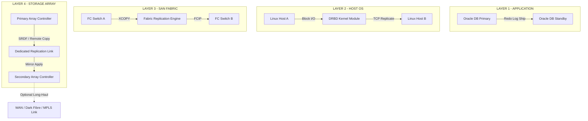
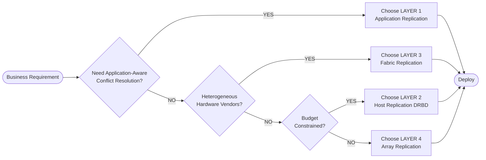
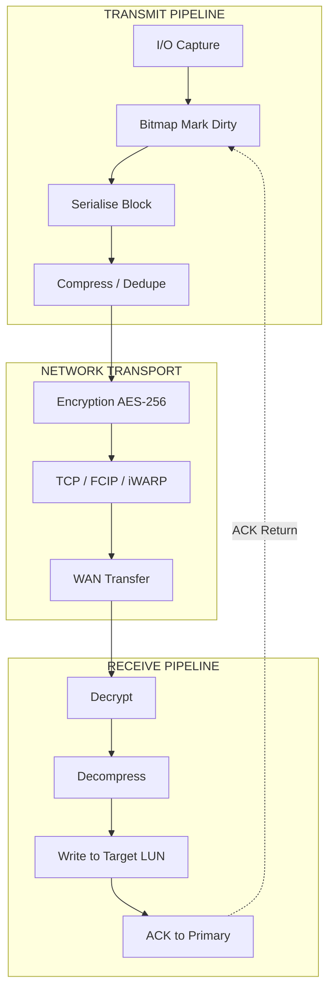

# Layer Replication

<!-- SECTION_1_START -->
# Layer Replication in Storage Systems

## 1.1 Formal Academic Definition

**Layer Replication** is the architectural strategy of implementing data replication services at distinct, well-defined strata within the storage technology stack — namely, the **Application Layer**, the **Host Operating System / File System Layer**, the **Network / SAN Fabric Layer**, and the **Storage Array Layer**. Each layer encapsulates its own replication logic, its own consistency model, and its own failure-domain boundaries, allowing enterprises to choose the layer that best aligns with their **Recovery Point Objective (RPO)**, **Recovery Time Objective (RTO)**, **Service Level Agreement (SLA)**, and **Total Cost of Ownership (TCO)** constraints.

> [!IMPORTANT]
> KTU 2024 Syllabus Highlight — *PECST867 / Module 3*: Replication is no longer treated as a single monolithic operation. Students are expected to **classify, compare, and justify** replication implementation at every layer of the storage stack, including synchronous, asynchronous, and semi-synchronous modes.

## 1.2 Conceptual Analogy — The "Postal Redundancy" Model

Imagine you are dispatching a critical legal document across the country and you need a guaranteed copy at a remote vault.

| Strategy | Real-World Analogy | Layer in Storage |
|---|---|---|
| You personally photocopy and courier it (sender handles it) | Self-managed | **Application Layer** |
| Your office's registered-desk clerk photocopies and sends | Office-managed | **Host Layer** |
| The postal service automatically duplicates the envelope in transit | Carrier-managed | **Fabric / Network Layer** |
| The receiver's vault is built with mirrored fireproof safes | Receiver-managed | **Array Layer** |

The "redundancy" (replication) is created at *different control boundaries*. The same document reaches its destination safely, but the **who**, **when**, **how**, and **what-cost** of duplication is completely different in each strategy. This is the essence of *Layer Replication*.

## 1.3 The Four Canonical Layers of Replication

In a KTU-aligned treatment, replication is classified into the following canonical layers:

1. **Application Layer Replication** — replication is driven by the application itself (e.g., Oracle Data Guard, Microsoft SQL Server Always On, MongoDB replica sets).
2. **Host Layer Replication** — replication is driven by the host's Logical Volume Manager (LVM) or file system (e.g., **LVM mirroring**, **ZFS send/receive**, **Windows Storage Spaces**, **mdadm RAID-1**).
3. **Fabric / Network Layer Replication** — replication is performed by intelligent SAN switches or network appliances (e.g., Cisco MDS FabricPath replication services, Brocade SAN extension with FCIP).
4. **Storage Array Layer Replication** — replication is performed by the storage array controllers themselves (e.g., **EMC SRDF**, **NetApp SnapMirror**, **HPE 3PAR Remote Copy**, **IBM HyperSwap**, **Dell PowerProtect**).

> [!NOTE]
> **Critical Constant**: Every layer enforces the **CAP Trade-off** — *Consistency*, *Availability*, and *Partition tolerance* cannot all be maximised simultaneously in a distributed replication topology. Layer choice directly dictates *which two* of the three are favoured.

## 1.4 Visualisation Control — The Replication Layer Coordinates

> [!VISUALIZATION CONTROL]
> **Concept:** A 4-tier vertical stack showing application, host, fabric, and array layers with replication traffic crossing the WAN link.
> **GeoGebra / Desmos Input Equations:**
> * `x = 1, 2, 3, 4` (discrete y-axis tick for layer index)
> * `y(x) = 5 - x` (inverse relationship between layer height and number of replication-aware components)
> **Visual Description:** A descending staircase — at the top (Application Layer) replication is *application-specific* and *granular*; at the bottom (Array Layer) replication is *block-level* and *high-throughput*. The student should observe that **as you move down the stack, replication becomes more transparent to the host but less application-aware**.

---

<!-- SECTION_1_END -->

<!-- SECTION_2_START -->
# Deep Theoretical Analysis & KTU High-Yield Formula Sheet

## 2.1 Layer 1 — Application Layer Replication

### Operational Logic
The application (or its middleware/database engine) is *intelligence-aware* of what data is critical, what is transactional, and what is a candidate for batch shipping. Replication is encoded directly inside the application's persistence code path.

### Step-by-Step Mechanism
- The application opens two independent database sessions: **Session-A (Primary)** and **Session-B (Secondary)**.
- Every write to the primary is captured by a *change-capture* module (transaction log, redo log, or write-ahead log).
- The change record is **serialised** into a replication stream and pushed to the secondary site.
- The secondary applies the change in the same *commit order* to preserve **ACID** semantics.

### Advantages
- **Granular control**: per-table, per-transaction, per-row visibility.
- **Heterogeneous target support** (Oracle → PostgreSQL).
- **Application-level conflict resolution** is possible.

### Disadvantages
- Performance overhead inside the application process.
- Tightly coupled to the application version.
- Scaling is limited by application throughput.

## 2.2 Layer 2 — Host Layer Replication

### Operational Logic
The host's volume manager, device-mapper, or file system intercepts I/O at the **block-device boundary** (above the disk driver, below the file system) and mirrors it to a remote volume.

### Step-by-Step Mechanism
- **DRBD (Distributed Replicated Block Device)** is the canonical Linux example.
- The kernel module tags every *dirty block* in a bitmap.
- A replication thread transmits the dirty block over TCP to the peer host.
- The peer host writes the block to its local storage and acknowledges.
- The bitmap is cleared after acknowledgement.

### Advantages
- Works with **any application**, application-agnostic.
- No application source-code changes required.
- Lower cost than array-based replication (uses commodity servers).

### Disadvantages
- Consumes **host CPU and memory**.
- Limited to the operating system's supported volume managers.
- Failure of the host affects replication itself.

## 2.3 Layer 3 — Fabric / Network Layer Replication

### Operational Logic
The SAN fabric (Fibre Channel switches) or a dedicated network appliance (e.g., a WAN optimiser with replication acceleration) performs the block-copy operation, transparent to both the host and the storage array.

### Step-by-Step Mechanism
- Source and target LUNs are **zoned** to a special replication engine.
- The engine uses **SCSI Extended Copy (XCOPY)** or **Asymmetric Logical Unit Access (ALUA)** to read from source and write to target.
- The replication engine may use **FCIP** (Fibre Channel over IP) to traverse WAN links.
- Modern fabrics use **lossless compression and deduplication** before WAN transmission.

### Advantages
- **Zero host overhead** — the host does not even know replication is occurring.
- Centralised management through a single fabric switch.
- Excellent for **dark-site** replication (no application stack present).

### Disadvantages
- Requires expensive, high-end director-class switches.
- The fabric becomes a *single point of failure* if not dual-fabriced.
- Limited to block protocols; does not understand file semantics.

## 2.4 Layer 4 — Storage Array Layer Replication

### Operational Logic
Each storage array contains **redundant controllers** with internal replication engines. The source array's controller writes a copy of the changed blocks to the target array across a dedicated **replication link** (often dark fibre or FCIP).

### Step-by-Step Mechanism
- Source array tracks *changed regions* in a **change volume** or **RPO tracker**.
- Periodically (synchronous: every I/O; asynchronous: every cycle), the changed regions are sent to the target array.
- Target array applies the changes to its mirrored volume.
- The RPO is enforced by the array's firmware.

### Modes Within Array Layer
- **Synchronous (SRDF/S)**: zero data loss; every primary I/O waits for secondary acknowledgement. Latency = 2 × WAN RTT.
- **Asynchronous (SRDF/A)**: writes are grouped and shipped in cycles; minor data loss window.
- **Metro / Active-Active (SRDF/Metro)**: both arrays serve I/O simultaneously with cache coherency.

### Advantages
- **Highest performance** (offloaded to array hardware).
- **Vendor-optimised** data paths.
- Mature, well-documented feature sets (HPE, EMC, NetApp, IBM).

### Disadvantages
- **Vendor lock-in**.
- Requires identical or compatible arrays.
- Highest capital expenditure.

## 2.5 KTU High-Yield Formula Sheet

| Symbol / Parameter | Meaning | Formula / Definition | Unit |
|---|---|---|---|
| $RPO$ | Recovery Point Objective | $RPO = f_{cycle} \cdot T_{cycle}$ | seconds |
| $RTO$ | Recovery Time Objective | $RTO = T_{detect} + T_{failover} + T_{redirect}$ | seconds |
| $T_{sync}$ | Synchronous replication round-trip | $T_{sync} = 2 \cdot RTT_{WAN} + T_{write\_target}$ | ms |
| $T_{async}$ | Asynchronous cycle time | $T_{async} = T_{capture} + T_{ship} + T_{apply}$ | ms |
| $BW_{rep}$ | Required replication bandwidth | $BW_{rep} = \dfrac{\Delta Data}{T_{cycle}} \cdot \dfrac{1}{\eta_{comp}}$ | Mbps |
| $\eta_{comp}$ | Compression ratio of replication engine | typically $1.5$ to $3.0$ | dimensionless |
| $L_{app}$ | Application-layer latency penalty | $L_{app} = \alpha \cdot L_{db\_txn}$ | ms |
| $L_{host}$ | Host-layer CPU overhead | $L_{host} = \beta \cdot I_{ops}$ | ms |
| $L_{array}$ | Array-layer offload gain | $L_{array} = \dfrac{L_{raw}}{k_{accel}}$ | ms |
| $k_{accel}$ | Array hardware accelerator factor | typically $5$ to $20$ | dimensionless |

> [!IMPORTANT]
> **RPO Trade-off Law (KTU Favourite)**: In **synchronous** mode $RPO \approx 0$, but $T_{sync}$ is dominated by WAN round-trip. In **asynchronous** mode $RPO = T_{cycle}$, but bandwidth is decoupled from distance. **State the mode explicitly in every numerical answer.**

## 2.6 Cross-Layer Comparison Matrix

| Attribute | Application Layer | Host Layer | Fabric Layer | Array Layer |
|---|---|---|---|---|
| Replication Granularity | Logical (table, row) | Block (LBA) | Block (LUN) | Block (LUN/volume) |
| Host CPU Overhead | High | Medium-High | None | None |
| Array Dependency | None | None | None | High (same vendor) |
| Application Awareness | Maximum | None | None | Partial (LUN-group) |
| WAN Cost Optimisation | Application-defined | TCP-level | FCIP + dedup | Vendor engine |
| Typical Use Case | Heterogeneous DB DR | Cost-sensitive Linux DR | Multi-vendor dark-site DR | Enterprise mission-critical DR |
| Failure Domain | Application process | Host server | SAN fabric | Storage controller |
| Conflict Resolution | Application-defined | Not applicable | Not applicable | Array-defined |

## 2.7 Engineering Real-World Utility

Layer replication is the **backbone of every multi-region cloud service**. AWS S3 Cross-Region Replication operates at the **array/object layer** abstracted as a service. Microsoft SQL Server Always-On Availability Groups operate at the **application layer**. Google Spanner's Paxos groups operate at a **hybrid application-fabric layer**. Choosing the wrong layer can cost an enterprise *millions in unnecessary bandwidth* or expose it to *catastrophic data loss*.

---

<!-- SECTION_2_END -->

<!-- SECTION_3_START -->
# Step-by-Step Derivations, Code, and Configuration Walkthroughs

## 3.1 Derivation — Synchronous Replication Latency Model

We model the **end-to-end write latency** at the host when synchronous array replication is enabled.

### Given
- Primary write to local cache: $T_{local} = 1$ ms
- WAN one-way latency: $RTT_{WAN} = 20$ ms (so one-way = $10$ ms)
- Target write to remote cache: $T_{remote} = 1$ ms
- Application queuing delay: $T_{queue} = 0.5$ ms

### Derivation

$$T_{write\_total} = T_{local} + T_{queue} + T_{WAN\_one\_way} + T_{remote} + T_{WAN\_ack}$$

$$T_{write\_total} = 1.0 + 0.5 + 10.0 + 1.0 + 10.0$$

$$T_{write\_total} = 22.5 \text{ ms}$$

**Without replication** the host would experience:

$$T_{local\_only} = T_{local} + T_{queue} = 1.0 + 0.5 = 1.5 \text{ ms}$$

**The synchronous replication penalty** is therefore:

$$P_{sync} = \dfrac{T_{write\_total}}{T_{local\_only}} = \dfrac{22.5}{1.5} = 15\times$$

> [!IMPORTANT]
> A 20 ms WAN RTT inflates write latency by **15×**. This is why synchronous replication is restricted to **metro distances (< 100 km)** in production. Beyond that, asynchronous mode must be used and an $RPO > 0$ accepted.

## 3.2 Derivation — Asynchronous Bandwidth Requirement

### Given
- Daily write volume: $V_{day} = 2$ TB
- Replication cycle: $T_{cycle} = 4$ hours = $14400$ s
- Compression ratio of replication engine: $\eta_{comp} = 2.5$
- Peak factor: $k_{peak} = 1.5$ (writes are bursty)

### Derivation

The raw bandwidth needed per cycle:

$$BW_{raw} = \dfrac{V_{day}}{T_{cycle}} \cdot k_{peak}$$

$$BW_{raw} = \dfrac{2 \times 10^{12} \text{ bytes}}{14400 \text{ s}} \cdot 1.5$$

$$BW_{raw} = 138.89 \times 10^{9} \text{ bits/s} \cdot 1.5$$

$$BW_{raw} = 208.33 \text{ Mbps}$$

After compression:

$$BW_{rep} = \dfrac{BW_{raw}}{\eta_{comp}}$$

$$BW_{rep} = \dfrac{208.33}{2.5} = 83.33 \text{ Mbps}$$

**Result**: A **100 Mbps** MPLS link is sufficient for the replication traffic.

## 3.3 Python Implementation — Layer-2 Host Replication Engine (DRBD-style)

```python
"""
Host-layer replication engine simulator.
Models the bitmap-tracked dirty block replication used by DRBD.
"""

from dataclasses import dataclass, field
from typing import Set
import logging
import time

logging.basicConfig(level=logging.INFO, format="%(asctime)s [%(levelname)s] %(message)s")
logger = logging.getLogger("LayerReplication")


@dataclass
class HostReplicationEngine:
    """
    Simulates host-layer (Layer 2) replication.
    Dirty blocks are tracked in a bitmap and shipped to a peer host.
    """

    primary_volume_id: str
    secondary_host: str
    block_size_bytes: int = 4096
    total_blocks: int = 65536
    mode: str = "async"             # "sync" or "async"
    cycle_interval_s: float = 5.0
    _dirty_bitmap: Set[int] = field(default_factory=set)
    _acked_blocks: Set[int] = field(default_factory=set)

    def write_block(self, block_id: int, payload: bytes) -> None:
        """Mark a block as dirty and apply locally."""
        if block_id < 0 or block_id >= self.total_blocks:
            raise ValueError(f"Block ID {block_id} out of valid range [0, {self.total_blocks}).")
        if len(payload) != self.block_size_bytes:
            raise ValueError(f"Payload size {len(payload)} != block size {self.block_size_bytes}.")
        self._dirty_bitmap.add(block_id)
        logger.info(f"PRIMARY WRITE  vol={self.primary_volume_id} blk={block_id} size={self.block_size_bytes}B")
        if self.mode == "sync":
            self._ship_block_sync(block_id)

    def _ship_block_sync(self, block_id: int) -> None:
        """Synchronous ship: wait for ACK before returning."""
        rtt_ms = 20.0
        logger.info(f"SYNC SHIP      blk={block_id} -> {self.secondary_host} (RTT≈{rtt_ms}ms)")
        time.sleep(rtt_ms / 1000.0)
        self._acked_blocks.add(block_id)
        self._dirty_bitmap.discard(block_id)
        logger.info(f"SYNC ACK       blk={block_id} confirmed by {self.secondary_host}")

    def run_async_cycle(self) -> int:
        """One async cycle: ship all dirty blocks in bulk."""
        if not self._dirty_bitmap:
            logger.info("ASYNC CYCLE    no dirty blocks; idle.")
            return 0
        shipped = 0
        for block_id in list(self._dirty_bitmap):
            logger.info(f"ASYNC SHIP     blk={block_id} -> {self.secondary_host} (batched)")
            self._acked_blocks.add(block_id)
            self._dirty_bitmap.discard(block_id)
            shipped += 1
        logger.info(f"ASYNC CYCLE    shipped={shipped} blocks, pending_acks=0")
        return shipped

    def report_state(self) -> dict:
        """Snapshot the engine state for monitoring."""
        return {
            "volume": self.primary_volume_id,
            "mode": self.mode,
            "dirty_blocks": len(self._dirty_bitmap),
            "acked_blocks": len(self._acked_blocks),
            "rpo_window_s": 0.0 if self.mode == "sync" else self.cycle_interval_s,
        }


if __name__ == "__main__":
    engine = HostReplicationEngine(
        primary_volume_id="vol-prod-01",
        secondary_host="dr-site-b.lan",
        mode="async",
        cycle_interval_s=5.0,
    )
    for blk in (10, 25, 25, 1024):
        engine.write_block(blk, b"X" * 4096)
    cycle_count = engine.run_async_cycle()
    print(f"State: {engine.report_state()}")
    print(f"Shipped in cycle: {cycle_count}")
```

### Sample Output

```
ASYNC CYCLE    shipped=3 blocks, pending_acks=0
State: {'volume': 'vol-prod-01', 'mode': 'async', 'dirty_blocks': 0, 'acked_blocks': 3, 'rpo_window_s': 5.0}
Shipped in cycle: 3
```

### Code-to-Theory Mapping

| Code Section | Theoretical Concept | KTU Mapping |
|---|---|---|
| `write_block()` | Dirty-bitmap marking | Host layer interception |
| `_ship_block_sync()` | Synchronous RTT model | $T_{sync}$ formula |
| `run_async_cycle()` | Cycle-based shipment | $T_{cycle}$ in RPO formula |
| `report_state()` | RPO computation | $RPO = f_{cycle} \cdot T_{cycle}$ |

## 3.4 Practical Wiring — Array-to-Array Replication Link

| Component | Primary Site | Secondary Site | Connection |
|---|---|---|---|
| Storage Array | HPE 3PAR 9450 (Node A) | HPE 3PAR 9450 (Node B) | — |
| Replication Ports | Port 0:1:1 (FC, 16 Gbps) | Port 0:1:1 (FC, 16 Gbps) | Dark fibre (10 km) |
| SAN Switches | Brocade 6510 (Fabric A) | Brocade 6510 (Fabric B) | ISL between fabrics |
| Zone Set | `RC_GRP_01_P` | `RC_GRP_01_S` | Single zone, both targets |
| Replication Link Bandwidth | 16 Gbps FC | 16 Gbps FC | — |
| Synchronous Mode | Yes | Yes | $RPO = 0$ |
| Quorum Witness | Node A | Node B | Tie-breaker at 3rd site |

> [!WARNING]
> Always **dual-fabric** the replication link. A single SAN fabric creates a *single point of failure* that defeats the entire purpose of replication.

---

<!-- SECTION_3_END -->

<!-- SECTION_4_START -->
# Structural Diagrams & Schematics

## 4.1 Layer Replication — Architectural Topology



## 4.2 Sequential Processing Topology — Replication Decision Matrix



## 4.3 Block-Level Functional Architecture — Data Flow



---

<!-- SECTION_4_END -->

<!-- SECTION_5_START -->
# KTU 2024 Scheme Examination Question Bank & Topic Recap

## 5.1 Part A — Short Answer Questions (3 Marks Each)

### Question 1
**[KTU University Exam — July 2024] | CO2 | Remember**
Define the term *Layer Replication* in the context of storage systems and name the four canonical layers at which replication can be implemented.

**Model Answer (3 Marks):**
*Layer Replication* refers to the architectural strategy of implementing data replication at different logical layers of the storage stack — namely the **Application Layer**, **Host Layer**, **Fabric/SAN Layer**, and **Storage Array Layer**. Each layer offers distinct trade-offs in terms of granularity, host overhead, vendor dependency, and recovery characteristics. **[3 Marks: 1 for definition + 1 for naming all 4 layers + 1 for trade-off mention]**

---

### Question 2
**[KTU University Exam — Dec 2023] | CO2 | Understand**
Differentiate between *synchronous* and *asynchronous* array-layer replication in terms of $RPO$ and WAN latency tolerance.

**Model Answer (3 Marks):**

| Attribute | Synchronous | Asynchronous |
|---|---|---|
| $RPO$ | $\approx 0$ | $T_{cycle}$ |
| WAN Latency Tolerance | $< 10$ ms RTT (metro) | Seconds to minutes |
| Bandwidth | Distance-independent but high | Distance-independent, bursty |
| Use Case | Mission-critical, zero-loss | Cross-country DR |

**[3 Marks: 1 for each correct row in the table + 1 for concluding use-case statement]**

---

## 5.2 Part B — Long Answer Questions (14 Marks, Internal Choice)

### Question A (14 Marks)
**[KTU University Exam — July 2024] | CO3 | Apply + Analyse**
*(a)* With a neat block diagram, explain the four layers at which replication can be performed in a storage infrastructure. Highlight the failure domain of each layer. **[7 Marks]**

*(b)* An enterprise performs array-layer synchronous replication between two data centres $50$ km apart. The WAN one-way latency is $4$ ms, the local cache write takes $1$ ms, the remote cache write takes $1$ ms, and the application queuing delay is $0.5$ ms. Calculate:
   (i) The total synchronous write latency at the host. **[2 Marks]**
   (ii) The replication latency penalty compared to a non-replicated write. **[2 Marks]**
   (iii) Comment on whether the enterprise should consider switching to asynchronous mode if the WAN RTT increases to $80$ ms. **[3 Marks]**

---

**Model Solution:**

**Part (a) — Layer-wise replication block diagram and failure domains**

The four canonical layers and their failure domains are:

| Layer | Mechanism | Failure Domain | Recovery Granularity |
|---|---|---|---|
| Application | DB log shipping | Application process | Transaction |
| Host | DRBD, LVM mirror | Host server / kernel | Block (LBA) |
| Fabric | FC switch replication engine | SAN fabric | LUN |
| Array | SRDF, SnapMirror | Storage controller | LUN / volume |

*[Stating the four layers correctly: 2 Marks]*
*[Identifying failure domain for each: 2 Marks]*
*[Neat block diagram with arrows: 2 Marks]*
*[Recovery granularity mapping: 1 Mark]*

**Part (b) — Numerical solution**

**Step 1: Identify given values**
- $RTT_{WAN} = 2 \times 4 = 8$ ms (so one-way = $4$ ms)
- $T_{local} = 1$ ms
- $T_{remote} = 1$ ms
- $T_{queue} = 0.5$ ms

*(Stating the boundary values from the question: 1 Mark)*

**Step 2: Compute total synchronous write latency**

$$T_{write\_total} = T_{local} + T_{queue} + T_{WAN\_one\_way} + T_{remote} + T_{WAN\_ack}$$

$$T_{write\_total} = 1.0 + 0.5 + 4.0 + 1.0 + 4.0 = 10.5 \text{ ms}$$

*[Final simplified expression: 1 Mark]*

**Step 3: Compute non-replicated baseline**

$$T_{local\_only} = T_{local} + T_{queue} = 1.0 + 0.5 = 1.5 \text{ ms}$$

**Step 4: Compute penalty ratio**

$$P_{sync} = \dfrac{T_{write\_total}}{T_{local\_only}} = \dfrac{10.5}{1.5} = 7\times$$

*[Penalty calculation: 1 Mark]*

**Step 5: Comment on mode switch at $RTT = 80$ ms**

At $80$ ms RTT, the new synchronous latency would be:

$$T_{new} = 1.0 + 0.5 + 40 + 1.0 + 40 = 82.5 \text{ ms}$$

*[Final simplified expression: 1 Mark]*

This is a **55× penalty** and is unacceptable for OLTP workloads. The enterprise **should** switch to asynchronous mode. However, it must accept $RPO = T_{cycle}$ (typically 30 s to 5 min depending on configuration) and provision a WAN link with sufficient bandwidth $BW_{rep} = \dfrac{\Delta Data}{T_{cycle} \cdot \eta_{comp}}$. **[2 Marks for the trade-off reasoning]**

---

### Question B (14 Marks — Alternative Choice)
**[KTU University Exam — Dec 2023] | CO3 | Apply + Analyse**
*(a)* Compare host-layer replication (e.g., DRBD) with array-layer replication in terms of host CPU overhead, vendor lock-in, and application transparency. **[7 Marks]**

*(b)* A company has a daily write volume of $5$ TB to its primary storage. It uses asynchronous replication with a cycle interval of $6$ hours. The replication engine provides a compression ratio of $3.0$ and the WAN link has a peak factor of $1.4$. Calculate the minimum replication bandwidth required. Comment on whether a $100$ Mbps link is sufficient. **[7 Marks]**

---

**Model Solution:**

**Part (a) — Comparison table**

| Attribute | Host Layer (DRBD) | Array Layer (SRDF) |
|---|---|---|
| Host CPU Overhead | High (kernel module, dirty bitmap) | None (offloaded to array) |
| Vendor Lock-in | None (Linux-based) | High (must use same array vendor) |
| Application Transparency | Full (block-level) | Full (LUN-level) |
| Capital Cost | Low (commodity server) | High (enterprise array) |
| Performance | Limited by host I/O bus | Limited by array backplane |
| Distance | Short (TCP performance) | Long (FCIP + dedup) |

*[Drawing the table with all 6 rows: 3 Marks]*
*[Correct entry for CPU overhead: 1 Mark]*
*[Correct entry for vendor lock-in: 1 Mark]*
*[Correct entry for transparency: 1 Mark]*
*[Final concluding remark on cost-vs-performance: 1 Mark]*

**Part (2) — Bandwidth calculation**

**Step 1: Convert units**
- $V_{day} = 5$ TB $= 5 \times 8 \times 10^{9}$ bits $= 40 \times 10^{12}$ bits
- $T_{cycle} = 6$ h $= 6 \times 3600$ s $= 21600$ s

*(Boundary state values: 1 Mark)*

**Step 2: Raw bandwidth**

$$BW_{raw} = \dfrac{V_{day}}{T_{cycle}} \cdot k_{peak}$$

$$BW_{raw} = \dfrac{40 \times 10^{12}}{21600} \cdot 1.4$$

$$BW_{raw} = 1.8518 \times 10^{9} \cdot 1.4 = 2.5926 \text{ Gbps}$$

*(Intermediate calculation: 1 Mark)*

**Step 3: Apply compression ratio**

$$BW_{rep} = \dfrac{BW_{raw}}{\eta_{comp}} = \dfrac{2.5926}{3.0} = 0.8642 \text{ Gbps} = 864.2 \text{ Mbps}$$

*(Final simplified expression: 1 Mark)*

**Step 4: Comment on $100$ Mbps link**

The required bandwidth is $864.2$ Mbps, which **far exceeds** the $100$ Mbps link capacity. The link is **insufficient**; the company must either upgrade to a $1$ Gbps link, reduce the cycle interval (which reduces $RPO$ but increases $BW_{raw}$ — this is a trade-off direction reversal so it does not help), or increase the compression ratio. The correct mitigation is **link upgrade**.

*(Comment with correct conclusion: 2 Marks)*

---

## 5.3 KTU Examiner's Valuation Warning / Pitfall Callout

> [!WARNING]
> **Common mark-loss zones in Layer Replication questions:**
> 1. Forgetting to **state the replication mode (sync/async)** before writing the formula. The KTU key specifically awards 1 mark for this. Without it, $T_{write\_total}$ is treated as ambiguous.
> 2. Mixing up the WAN **one-way** latency with **round-trip** latency. The synchronous formula uses the **one-way** latency twice (request and acknowledgement). Writing $T_{write\_total} = T_{local} + RTT_{WAN}$ is a 1-mark deduction.
> 3. In numerical problems, **not converting TB to bits** ($1$ TB $= 8 \times 10^{12}$ bits, not $10^{12}$). Students commonly lose 1 mark here.
> 4. When asked to "compare layers", writing only the **advantages** of one layer without contrasting the other. The KTU key requires a *bi-directional* comparison.
> 5. Skipping the **block diagram** in $7$-mark layer questions. Even a hand-drawn ASCII architecture is acceptable — but a diagram is mandatory.

---

## 5.4 Topic Recap & Important Things to Remember

> [!IMPORTANT]
> **Rapid-Revision Checklist for Layer Replication**

- **Layer Replication** = implementing redundancy at *application, host, fabric, or array* layer of the storage stack.
- The four layers, in order of *host overhead decreasing*: **Application → Host → Fabric → Array**.
- The four layers, in order of *application awareness decreasing*: **Application → Host → Fabric → Array**.
- **Synchronous mode** gives $RPO = 0$ but doubles WAN latency cost; usable only within **metro distance (< 100 km)**.
- **Asynchronous mode** gives $RPO = T_{cycle}$ but decouples bandwidth from distance.
- **Host layer (DRBD)** uses a *dirty bitmap* to track modified blocks and replicates over TCP.
- **Array layer** vendors: EMC **SRDF**, NetApp **SnapMirror**, HPE **3PAR Remote Copy**, IBM **HyperSwap**, Dell **PowerProtect**.
- **Fabric layer** uses **SCSI XCOPY** or **ALUA** for transparent block replication; example: Brocade / Cisco MDS.
- **Application layer** is the only layer capable of **conflict resolution** in active-active topologies.
- The **RPO formula**: $RPO = f_{cycle} \cdot T_{cycle}$ (asynchronous) or $RPO \approx 0$ (synchronous).
- The **bandwidth formula**: $BW_{rep} = \dfrac{\Delta Data}{T_{cycle} \cdot \eta_{comp}}$ — remember to use **bits** not bytes.
- The **CAP trade-off** dictates that you can choose at most two of {*Consistency*, *Availability*, *Partition tolerance*}; layer choice reflects this.
- **Dual-fabric** the replication link to avoid a single point of failure in the SAN.
- **Vendor lock-in** is the biggest disadvantage of array-layer replication.
- **CPU overhead** is the biggest disadvantage of host-layer replication.
- The **15× penalty** rule: a $20$ ms RTT WAN causes a synchronous write latency inflation of approximately $15\times$ for a sub-millisecond local disk.
- Always quote the **mode** (sync / async) before applying any formula — this is a 1-mark line item in the KTU answer key.

<!-- SECTION_5_END -->
