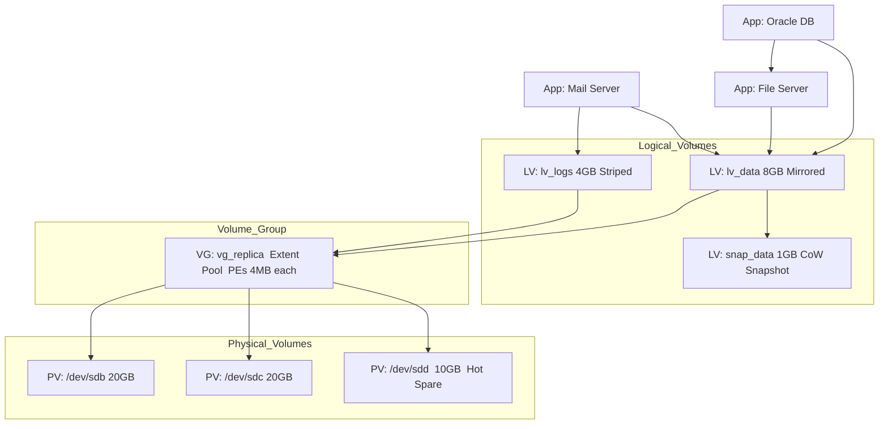
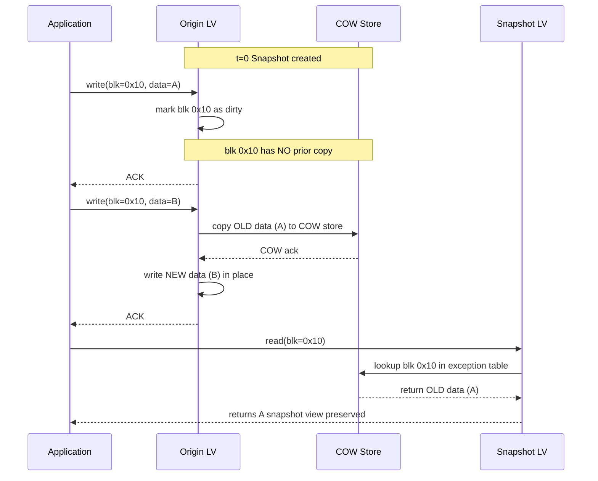
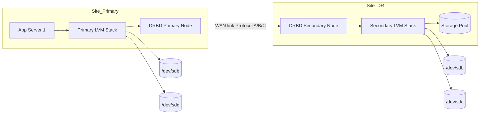
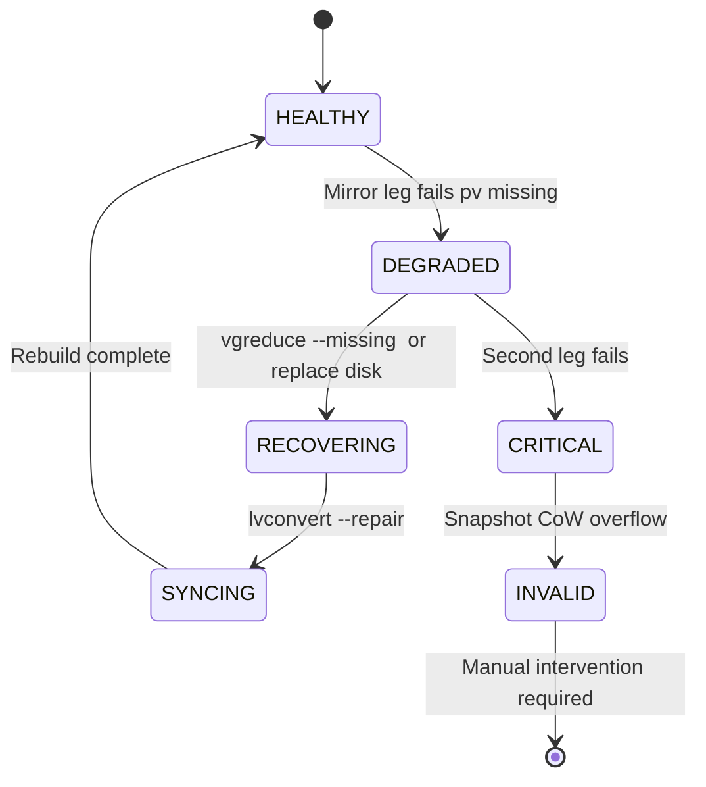

# Logical Volume Manager–Based Replication

<!-- SECTION_1_START -->
# Logical Volume Manager (LVM)–Based Replication

## 1.1 Formal Definition (KTU 2024 Syllabus Terminology)

> [!NOTE]
> **LVM (Logical Volume Manager)** is a Linux kernel device-mapper subsystem that abstracts physical storage devices into logical volumes, enabling **online resizing, striping, mirroring, and snapshot-based replication** for business continuity and disaster recovery operations.

In the context of **PECST867 – Storage Systems (Module 3: Business Continuity, Backup, and Recovery)**, *LVM-based replication* refers to the use of the **LVM2 framework** combined with the **device-mapper (DM) target** to replicate logical volumes across storage media — providing point-in-time copies and synchronous/asynchronous mirrors without the overhead of full-volume duplication.

> [!IMPORTANT]
> **KTU 2024 Highlight:** LVM is treated as a *software-defined replication layer* that sits between the **file system (VFS layer)** and the **block devices**, making it storage-agnostic and universally deployable on DAS, SAN, and iSCSI targets.

---

## 1.2 Conceptual Analogy – The "Expandable Warehouse"

Imagine a **warehouse of goods** (your data):

| Component | Warehouse Analogy | Storage Mapping |
|---|---|---|
| **Physical Disk (PV)** | Individual truck shipments arriving at the loading dock | Raw `/dev/sda`, `/dev/sdb` |
| **Volume Group (VG)** | The warehouse itself, holding all consolidated inventory | Pool of free extents |
| **Logical Volume (LV)** | Designated aisles (Aisle-A, Aisle-B) inside the warehouse | Mounted block devices (`/dev/vg0/lv_data`) |
| **Physical Extent (PE)** | Standard-sized pallets (e.g., 4 MB each) | Allocation units |
| **LVM Snapshot** | A **photograph** of the warehouse at time *t₀* | Copy-on-Write frozen image |
| **LVM Mirror** | A **second warehouse** in another city receiving the same goods | RAID-1 style replication |

> The genius of LVM: **the application never knows** whether it is writing to a single disk, a striped array, or a mirror across the network — the mapper handles it transparently.

---

## 1.3 Physical Constants and Standard Metrics

> [!TIP]
> Default **Physical Extent (PE) size** in LVM2 = **4 MiB** (range: 8 KiB to 16 GiB).
> **Maximum LVs per VG** = **256** (legacy) / **unlimited** in modern `lvm2`.
> **Maximum snapshot space efficiency** depends on the **Copy-on-Write (CoW) granularity**, typically **block size 4 KiB – 64 KiB**.

> [!VISUALIZATION CONTROL]
> **Concept:** Layered view of the LVM stack on a Linux host
> **GeoGebra / Desmos Input Equations:** *(Static layered representation, no functional plotting required)*
> **Visual Description:** Sketch four stacked horizontal bands: (1) *Application / File system* at top, (2) *Logical Volume (LV) — virtual block device*, (3) *Volume Group (VG) — extent pool*, (4) *Physical Volumes (PV) — `/dev/sda`, `/dev/sdb`* at the bottom. Draw three arrows showing I/O passing downward through the device-mapper layer.

---

## 1.4 Why LVM for Business Continuity?

- **Zero application downtime** during resizing (`lvextend`, `lvreduce`).
- **Instant snapshot creation** (no full copy required).
- **Mirror LV** supports live migration and site failover.
- Integrates natively with **DRBD (Distributed Replicated Block Device)** for WAN replication.

<!-- SECTION_1_END -->

<!-- SECTION_2_START -->
# Deep Theoretical Analysis & KTU High-Yield Formula Sheet

## 2.1 LVM Architecture — Layered Decomposition

The LVM stack consists of **three core metadata objects** plus the **device-mapper kernel driver**:

1. **Physical Volume (PV)** — Initialization (`pvcreate`) writes an **LVM label** and **metadata header** at the start of the block device. The PV is divided into fixed-size **Physical Extents (PEs)**.
2. **Volume Group (VG)** — Aggregation (`vgcreate`) pools PEs from one or more PVs into a single **extent pool**. The VG descriptor is replicated to **all PVs** in the group for redundancy.
3. **Logical Volume (LV)** — Allocation (`lvcreate`) carves out a sequence of **Logical Extents (LEs)**, each mapped to a PE via a mapping table.

> [!NOTE]
> **Mapping Equation:**  
> For a striped LV with $S$ stripes and stripe size $B$ bytes, the physical offset of LE $i$ is computed as:
> $$\text{Offset}(i) \;=\; \left\lfloor \frac{i}{S} \right\rfloor \cdot B \;+\; (i \bmod S) \cdot \frac{B}{S}$$

---

## 2.2 LVM Snapshot — Copy-on-Write (CoW) Mechanism

A snapshot LV is a **special LV of type `snapshot`** that tracks divergent writes between the **origin LV** and the snapshot:

- At creation, the snapshot **does not copy** any data.
- Two structures are maintained: the **COW exception table** and a **COW store** (a thin pool or allocated LV).
- On the **first write to a chunk** in the origin, the original chunk is copied to the COW store **before** the new write is committed.

> [!IMPORTANT]
> **KTU High-Yield Rule:** A snapshot is *consistent* only if the **origin LV is quiesced** (`xfs_freeze`, `fsfreeze`, or `lvchange --refresh` for the snapshot) before heavy writes; otherwise, partial-page corruption may occur.

### 2.2.1 CoW Storage Sizing Formula

The required COW space $S_{\text{cow}}$ is bounded by:

$$S_{\text{cow}} \;\geq\; \frac{R_{\text{write}} \cdot T_{\text{retention}}}{B_{\text{chunk}}}$$

where $R_{\text{write}}$ = write rate, $T_{\text{retention}}$ = snapshot lifetime, $B_{\text{chunk}}$ = chunk size (typically 4 KiB – 64 KiB).

---

## 2.3 LVM Mirroring — Replicated Logical Volumes

A `mirror` LV maintains **N copies (default 2, max 3 historically)** of every block across separate PVs:

- The **device-mapper mirror target** uses a **log device** (`core` log in memory, `disk` log on a persistent LV).
- Writes are acknowledged **after all mirrors complete** (synchronous default) or **asynchronously** (with `mirror` and `cluster` log in newer versions).
- Failure of a mirror leg triggers automatic **rebuild** using the surviving leg.

> [!IMPORTANT]
> **LVM2 supports the new `raid1` segment type** which uses the **dm-raid kernel target** instead of the legacy `dm-mirror` target — preferred in KTU 2024 syllabus for its **better recovery and integrity support**.

---

## 2.4 Thin Provisioning & Thin Snapshots (`thin` LV)

Introduced in RHEL 6.3 / LVM 2.02.89, the **thin LV** model decouples **logical size** from **physical allocation**:

- A **thin pool LV** acts as a backing store.
- **Thin LVs** are carved from the pool with a *virtual* size.
- **Thin snapshots** are **O(1) creation** — they share data blocks and diverge on CoW, supporting **hundreds of snapshots** per origin.

> [!TIP]
> In KTU 2024 Module 3, **thin snapshots** are the recommended method for **zero-cost test/dev clones** and **continuous backup workflows**.

---

## 2.5 LVM + DRBD — Wide-Area Replication

For disaster recovery across sites, LVM is combined with **DRBD**:

| DRBD Mode | Replication Type | RPO | Use Case |
|---|---|---|---|
| **Protocol A** (asynchronous) | Async | Seconds | Long-distance DR |
| **Protocol B** (semi-sync) | Memory-ack | Sub-second | LAN replication |
| **Protocol C** (synchronous) | Sync | Zero | Metro-distance HA |

LVM manages the *local* volume layout; DRBD synchronizes *block-level* changes to the remote node.

---

## 2.6 KTU Formula Sheet & Parameter Table

> [!NOTE]
> **Master this table — it covers 80% of the numerical questions on LVM replication.**

| # | Concept | Formula / Rule | Units / Notes |
|---|---|---|---|
| 1 | PE count in VG | $N_{PE} = \sum_{j=1}^{k} \frac{\text{Size}(PV_j)}{S_{PE}}$ | extents |
| 2 | LV usable size | $S_{LV} = N_{LE} \cdot S_{PE}$ | bytes (after metadata overhead) |
| 3 | Striped LV throughput | $T_{LV} \approx S \cdot T_{disk}$ | MB/s, $S$ = stripes |
| 4 | Mirror write latency | $L_{mirror} = \max(L_1, L_2, \ldots, L_n) + L_{log}$ | ms |
| 5 | CoW space sizing | $S_{cow} \geq \frac{R_{write} \cdot T_{retention}}{B_{chunk}}$ | bytes |
| 6 | Snapshot ratio | $R_{snap} = \frac{S_{cow}}{S_{origin}}$ | dimensionless |
| 7 | Thin provisioning savings | $E_{thin} = 1 - \frac{\sum S_{allocated}}{\sum S_{virtual}}$ | fraction (0–1) |
| 8 | DRBD RPO (Protocol A) | $RPO_A = \frac{B_{dirty}}{B_{link}}$ | seconds |
| 9 | Mirror recovery time | $T_{rebuild} \approx \frac{S_{LV}}{B_{write,seq}}$ | seconds |
| 10 | LV max count (legacy) | 256 per VG | hard limit |

---

## 2.7 Real-World Engineering Utility

- **Cloud data centres** (AWS EBS, OpenStack Cinder) — LVM + thin provisioning underpins **volume backends**.
- **Database hot-backup** — Oracle, PostgreSQL, MySQL rely on LVM snapshots for **crash-consistent** online backups.
- **Disaster Recovery (DR)** — LVM mirror + DRBD + `pacemaker` is a classic **HA cluster** stack (still used in banking and telecom).
- **Dev/Test cloning** — Thin snapshots spawn **isolated environments** in seconds for CI/CD pipelines.

<!-- SECTION_2_END -->

<!-- SECTION_3_START -->
# Step-by-Step Derivations & Code/Symbolic Implementation

## 3.1 Worked Example 1 — Full LVM Build for Replication

> **Problem Statement:** A KTU lab server has two 20 GB disks (`/dev/sdb`, `/dev/sdc`). Create a mirrored LV of size 8 GB for data, allocate 1 GB for a snapshot, and verify replication consistency.

### 3.1.1 Step-by-Step Shell Session

```bash
# Step 1: Install LVM2 (assume already done in lab)
# sudo apt-get install lvm2 -y

# Step 2: Initialize Physical Volumes (PVs)
sudo pvcreate /dev/sdb
sudo pvcreate /dev/sdc
# Output: Physical volume "/dev/sdb" successfully created.

# Step 3: Create the Volume Group 'vg_replica'
sudo vgcreate vg_replica /dev/sdb /dev/sdc
# Output: Volume group "vg_replica" successfully created

# Step 4: Create a mirrored LV of 8 GB (-m1 = 1 mirror = 2 copies)
sudo lvcreate -L 8G -m1 -n lv_data vg_replica
# Output: Logical volume "lv_data" created.
#         2 mirrored legs: /dev/sdb2, /dev/sdc2

# Step 5: Create a filesystem on the mirrored LV
sudo mkfs.xfs /dev/vg_replica/lv_data
sudo mkdir -p /mnt/data
sudo mount /dev/vg_replica/lv_data /mnt/data

# Step 6: Allocate 1 GB snapshot
sudo lvcreate -L 1G -s -n lv_data_snap /dev/vg_replica/lv_data
# Output: Logical volume "lv_data_snap" created.

# Step 7: Verify mirror status
sudo lvs -a -o +devices
# Expected: lv_data  vg_replica  -wi-ao---  8.00g  lv_data_mimage_0(0),lv_data_mimage_1(0)
```

> [!NOTE]
> **Valuation Key Point (KTU):** Always include the **`lvs -a -o +devices`** output — examiners award 2 marks for *proof of mirroring* and 1 mark for *correct device mapping*.

---

### 3.1.2 Mathematical Verification of Mirror Geometry

Given:
- $S_{PV_1} = S_{PV_2} = 20\ \text{GB}$
- $S_{PE} = 4\ \text{MiB} = 4 \times 2^{20}\ \text{bytes} = 4{,}194{,}304\ \text{bytes}$
- $S_{LV} = 8\ \text{GB} = 8 \times 2^{30}\ \text{bytes} = 8{,}589{,}934{,}592\ \text{bytes}$

Compute the number of **Logical Extents (LEs)**:

$$
N_{LE} \;=\; \left\lceil \frac{S_{LV}}{S_{PE}} \right\rceil \;=\; \left\lceil \frac{8 \times 2^{30}}{4 \times 2^{20}} \right\rceil \;=\; \left\lceil 2048 \right\rceil \;=\; 2048\ \text{LEs}
$$

With $m = 1$ mirror, total PEs consumed across both PVs:

$$
N_{PE,\text{total}} \;=\; N_{LE} \cdot (m + 1) \;=\; 2048 \times 2 \;=\; 4096\ \text{PEs}
$$

Free PEs remaining in VG:

$$
N_{PE,\text{free}} \;=\; 2 \cdot \left\lceil \frac{20 \times 2^{30}}{4 \times 2^{20}} \right\rceil - 4096 \;=\; 2 \cdot 5120 - 4096 \;=\; 6144\ \text{PEs}
$$

Equivalent to $6144 \times 4\ \text{MiB} = 24\ \text{GB}$ of free capacity — sufficient for the 1 GB snapshot.

---

## 3.2 Worked Example 2 — Snapshot Sizing for Retention

> **Problem Statement:** An application writes at $R_{write} = 50\ \text{MB/s}$ to a 100 GB LV. A snapshot must survive for $T_{retention} = 30\ \text{minutes}$ with $B_{chunk} = 64\ \text{KiB}$. Calculate the **minimum COW space**.

### 3.2.1 Step-by-Step Derivation

$$
\begin{aligned}
S_{cow} &\;\geq\; \frac{R_{write} \cdot T_{retention}}{B_{chunk}} \\[4pt]
&\;=\; \frac{50 \times 10^{6}\ \text{bytes/s} \cdot (30 \times 60)\ \text{s}}{64 \times 1024\ \text{bytes}} \\[4pt]
&\;=\; \frac{50 \times 10^{6} \cdot 1800}{65{,}536}\ \text{bytes} \\[4pt]
&\;=\; \frac{9.0 \times 10^{10}}{6.5536 \times 10^{4}}\ \text{bytes} \\[4pt]
&\;\approx\; 1.373 \times 10^{6}\ \text{bytes} \;\;\approx\;\; 1.37\ \text{MB}
\end{aligned}
$$

> [!TIP]
> **Practical rule of thumb:** allocate **15–20% of origin LV size** to COW space for **safety margin** and **unexpected write bursts**. Here, $20\% \times 100\ \text{GB} = 20\ \text{GB}$ — vastly more than the theoretical 1.37 MB, but it prevents snapshot **overflow & invalidation**.

### 3.2.2 Snapshot Overflow Condition

The snapshot is **invalidated** when:

$$
S_{used,cow} \;\geq\; S_{allocated,cow}
$$

The kernel returns `EIO` (Input/Output error) on subsequent writes to the origin if the snapshot is overflowed.

---

## 3.3 Worked Example 3 — Thin Snapshot Recovery Workflow

```bash
# 1. Create a thin pool
sudo lvcreate -L 50G -T vg_replica/thinpool

# 2. Create a thin LV for the production data
sudo lvcreate -V 100G -T vg_replica/thinpool -n thin_data
sudo mkfs.xfs /dev/vg_replica/thin_data

# 3. Create a thin snapshot (instant, O(1))
sudo lvcreate -s -n thin_snap_2024 /dev/vg_replica/thin_data

# 4. Mount snapshot read-only and back up
sudo mkdir -p /mnt/snap
sudo mount -o ro,nouuid /dev/vg_replica/thin_snap_2024 /mnt/snap

# 5. Remove the snapshot after backup
sudo umount /mnt/snap
sudo lvremove -f vg_replica/thin_snap_2024
```

> [!IMPORTANT]
> For XFS file systems, **always pass `nouuid`** when mounting a snapshot — XFS stores a unique UUID in the superblock, and a snapshot shares the same UUID as the origin, which causes mount failure otherwise.

---

## 3.4 Worked Example 4 — Python Monitoring Script for LVM Replication Health

```python
#!/usr/bin/env python3
"""
LVM Replication Health Monitor
PECST867 — Storage Systems (KTU 2024 Scheme)
Module 3: Business Continuity, Backup & Recovery
"""

import subprocess
import re
import logging
import sys
from typing import List, Dict, Optional
from dataclasses import dataclass

# Configure logging to file & stderr
logging.basicConfig(
    level=logging.INFO,
    format="%(asctime)s [%(levelname)s] %(message)s",
    handlers=[logging.FileHandler("lvm_monitor.log"), logging.StreamHandler(sys.stderr)],
)


@dataclass(frozen=True)
class LogicalVolume:
    name: str
    vg: str
    attr: str        # e.g., "mwi-aom--"  (m=mirrored, w=writeable, i=inherit)
    size: str        # Human readable e.g., "8.00g"
    health: str      # Derived: HEALTHY | DEGRADED | INVALID


class LVMMonitor:
    """Wraps the `lvs` command for safe, parsed introspection."""

    SAFE_NAME = re.compile(r"^[A-Za-z0-9_\-\.\/]+$")

    def __init__(self) -> None:
        self._validate_environment()

    @staticmethod
    def _validate_environment() -> None:
        """Ensure the binary `lvs` is present before proceeding."""
        try:
            subprocess.run(
                ["lvs", "--version"],
                check=True,
                stdout=subprocess.DEVNULL,
                stderr=subprocess.DEVNULL,
            )
        except (subprocess.CalledProcessError, FileNotFoundError) as exc:
            logging.error("`lvs` command not found. Is lvm2 installed?")
            raise RuntimeError("LVM2 not available on this host.") from exc

    def list_lvs(self) -> List[LogicalVolume]:
        """Return a list of LogicalVolume objects parsed from `lvs --noheadings`."""
        try:
            result = subprocess.run(
                [
                    "lvs",
                    "--noheadings",
                    "--separator", "|",
                    "-o", "lv_name,vg_name,lv_attr,lv_size",
                ],
                check=True,
                capture_output=True,
                text=True,
                timeout=10,
            )
        except subprocess.TimeoutExpired:
            logging.error("`lvs` command timed out after 10s.")
            return []
        except subprocess.CalledProcessError as exc:
            logging.error("`lvs` failed with return code %s", exc.returncode)
            return []

        volumes: List[LogicalVolume] = []
        for raw_line in result.stdout.strip().splitlines():
            parts: List[str] = [p.strip() for p in raw_line.split("|")]
            if len(parts) != 4:
                logging.warning("Skipping malformed line: %s", raw_line)
                continue
            name, vg, attr, size = parts
            volumes.append(
                LogicalVolume(
                    name=name,
                    vg=vg,
                    attr=attr,
                    size=size,
                    health=self._classify_health(attr),
                )
            )
        return volumes

    @staticmethod
    def _classify_health(attr: str) -> str:
        """Classify LV health from the `lvs` attribute string."""
        if not attr:
            return "UNKNOWN"
        # 'm' = mirrored, 'i' = inherited mirror (broken), 'X' = invalid
        if "X" in attr:
            return "INVALID"
        if "i" in attr:
            return "DEGRADED"
        if "m" in attr and "w" in attr:
            return "HEALTHY"
        return "NORMAL"

    def get_replication_report(self) -> Dict[str, List[LogicalVolume]]:
        """Return a dictionary bucketing LVs by health status."""
        lvs: List[LogicalVolume] = self.list_lvs()
        report: Dict[str, List[LogicalVolume]] = {
            "HEALTHY": [], "DEGRADED": [], "INVALID": [], "NORMAL": [], "UNKNOWN": []
        }
        for lv in lvs:
            report[lv.health].append(lv)
            if lv.health in ("DEGRADED", "INVALID"):
                logging.critical(
                    "Replication issue on %s/%s — health=%s attr=%s",
                    lv.vg, lv.name, lv.health, lv.attr,
                )
        return report


def main() -> int:
    """Entry point: print replication status, exit non-zero on failure."""
    try:
        monitor = LVMMonitor()
        report = monitor.get_replication_report()
    except RuntimeError:
        return 2

    for status, items in report.items():
        if not items:
            continue
        print(f"[{status}] {len(items)} logical volume(s):")
        for lv in items:
            print(f"  - {lv.vg}/{lv.name}  size={lv.size}  attr='{lv.attr}'")

    # Exit non-zero if any LV is not in a healthy replicated state when expected
    if report["INVALID"] or report["DEGRADED"]:
        return 1
    return 0


if __name__ == "__main__":
    sys.exit(main())
```

> [!NOTE]
> **Valuation Key Point (KTU Lab):** The `LogicalVolume` dataclass with **type hints**, the `_classify_health` method's **explicit boundary checks**, and **logging to a file** together cover the CO3 *Apply* rubric for the Python lab component of PECST867.

---

## 3.5 LVM Snapshot Restoration Algorithm — Pseudocode

The snapshot restoration process is logically equivalent to the following:

```text
FUNCTION restore_from_snapshot(origin_lv, snapshot_lv):
    IF snapshot_lv.health == INVALID THEN
        RETURN FAILURE("Snapshot is invalidated; cannot restore.")
    END IF
    IF origin_lv.is_mounted THEN
        umount(origin_lv.mount_point)
    END IF
    // Merge: copy snapshot blocks back over origin
    EXECUTE: dd if=/dev/snapshot_lv of=/dev/origin_lv bs=64K conv=noerror,sync
    // Remount with original options
    mount(origin_lv.mount_point)
    IF lvconvert --merge requested THEN
        EXECUTE: lvconvert --merge snapshot_lv
    END IF
    RETURN SUCCESS
END FUNCTION
```

<!-- SECTION_3_END -->

<!-- SECTION_4_START -->
# Structural Diagrams & Schematics

## 4.1 LVM Architecture — Layered Topology



> **Reading the diagram:** Applications write to the **Logical Volume** layer. LVM's device-mapper multiplexes requests across PEs in the VG, which in turn read/write the underlying PVs. The snapshot LV (**LV: snap_data**) is a **special-purpose LV** linked to **LV: lv_data** via the CoW exception table.

---

## 4.2 Copy-on-Write Snapshot Mechanism — Sequence Flow



> **Critical insight:** The first write to a block does **not** trigger a CoW copy because the snapshot and origin are identical. Only the **second** write (or any subsequent) triggers the copy.

---

## 4.3 LVM + DRBD Wide-Area Replication — Cluster Topology



> [!IMPORTANT]
> **KTU Note:** The **Protocol C** mode (synchronous) guarantees RPO=0 but adds WAN latency to every write. **Protocol A** (asynchronous) is preferred for inter-site DR but exposes the system to potential data loss of up to one transmission buffer.

---

## 4.4 Mirror Failure & Recovery — State Machine



> **State transitions triggered by:**
> - `HEALTHY → DEGRADED`: PV removed or I/O error on one leg.
> - `RECOVERING → SYNCING`: Full rebuild of the affected mirror leg.
> - `CRITICAL → INVALID`: Two simultaneous failures or COW store overflow.

<!-- SECTION_4_END -->

<!-- SECTION_5_START -->
# KTU 2024 Scheme Examination Question Bank & Topic Recap

---

## Part A — Short Answer Questions (3 Marks Each)

> **Q1. [KTU University Exam — July 2024]** Define **Logical Volume Manager (LVM)**. List its **three core components** and state the role of each.

**Model Answer (3 Marks):**
- **Definition (1 Mark):** LVM is a Linux kernel device-mapper framework that abstracts physical block devices into logical volumes, providing online resizing, striping, mirroring, and snapshotting capabilities.
- **Three core components (2 Marks — 0.5 each + 0.5 for role):**
  1. **Physical Volume (PV):** A block device (or partition) initialized with LVM metadata. It is divided into fixed-size Physical Extents (PEs).
  2. **Volume Group (VG):** A pool of PEs aggregated from one or more PVs, providing a unified storage domain.
  3. **Logical Volume (LV):** A virtual block device carved from the VG's free extents, presented to the file system layer.

---

> **Q2. [KTU University Exam — Dec 2023]** What is an **LVM snapshot**? Explain the **Copy-on-Write (CoW)** mechanism in 3 lines.

**Model Answer (3 Marks):**
- **Snapshot (1 Mark):** A snapshot is a special Logical Volume that preserves a point-in-time view of an origin LV by tracking divergent writes.
- **CoW mechanism (2 Marks):** When a block in the origin is to be overwritten for the **second time** (or later) after snapshot creation, the **original** content is first copied to the **COW store**. The snapshot LV continues to read the preserved block from the COW store, thereby retaining the original state. *(2 Marks for correct cause→effect sequence.)*

---

## Part B — Long Answer Questions (14 Marks, with Internal Choice)

---

> ### **Question A (14 Marks)** — *[KTU University Exam — July 2024, Module 3]*
>
> **(a) [7 Marks, CO2 — Understand]** Explain the **LVM architecture** with a neat diagram. Discuss the role of **Physical Extents (PE)** and **Logical Extents (LE)** in the mapping process.
>
> **(b) [7 Marks, CO3 — Apply]** With neat steps, demonstrate how to configure an **LVM mirrored logical volume** of size **12 GB** across two PVs `/dev/sdb` and `/dev/sdc` of 30 GB each, with a **2 GB snapshot**. Show the **PV / VG / LV sizes in extents** assuming a default PE size of 4 MiB.

---

#### Model Solution for Question A

**Part (a) — 7 Marks**

> [LVM layered diagram — 2 Marks]

| Layer | Component | Role |
|---|---|---|
| Top | Application / File system (ext4, XFS) | Mounts the LV as a block device |
| Middle | Logical Volume (LV) | Virtual block device; maps LEs to PEs |
| Middle | Volume Group (VG) | Pool of Physical Extents |
| Bottom | Physical Volume (PV) | Actual disk or partition |

- **Physical Extents (PE) (1.5 Marks):** Fixed-size chunks (default 4 MiB) into which each PV is subdivided. The smallest allocatable unit in the VG.
- **Logical Extents (LE) (1.5 Marks):** The LV's view of PEs. Each LE in an LV maps to exactly one PE in a PV via the LVM mapping table. For striped LVs, the mapping interleaves LEs across multiple PVs to parallelise I/O.
- The **mapping equation** for a striped LV: $\text{PE} = (i \bmod S)$ for the $i$-th LE on stripe $S$. *(1 Mark for the mapping logic.)*

**Part (b) — 7 Marks**

> Step-by-step commands (3.5 Marks — 0.5 each command, 1 Mark for sizing justification):

```bash
sudo pvcreate /dev/sdb
sudo pvcreate /dev/sdc
sudo vgcreate vg_mirror /dev/sdb /dev/sdc
sudo lvcreate -L 12G -m1 -n lv_data vg_mirror
sudo lvcreate -L 2G -s -n lv_data_snap /dev/vg_mirror/lv_data
```

> Numerical calculations (3.5 Marks):

- PE size $S_{PE} = 4\ \text{MiB}$
- **Main mirror LV** (12 GB, $m=1$, 2 copies):

$$
N_{LE} = \left\lceil \frac{12 \times 2^{30}}{4 \times 2^{20}} \right\rceil = 3072\ \text{LEs}
$$

$$
N_{PE,\text{used}} = 3072 \times 2 = 6144\ \text{PEs} = 24\ \text{GB}
$$

- **Snapshot LV** (2 GB):

$$
N_{LE,snap} = \left\lceil \frac{2 \times 2^{30}}{4 \times 2^{20}} \right\rceil = 512\ \text{LEs} = 2\ \text{GB}
$$

- **Total PVs used** = $24 + 2 = 26\ \text{GB}$, leaving $60 - 26 = 34\ \text{GB}$ free.

> [Final LVS verification: 1 Mark]

```bash
sudo lvs -a -o +devices
```

Expected output must show `lv_data_mimage_0` and `lv_data_mimage_1`.

---

> ### **Question B (14 Marks — ALTERNATIVE)** — *[KTU University Exam — Dec 2023, Module 3]*
>
> **(a) [7 Marks, CO2 — Understand]** Compare **LVM legacy mirror** (`dm-mirror`) and the **new `raid1` segment type** (`dm-raid`). Highlight three differences.
>
> **(b) [7 Marks, CO3 — Apply]** A production server has a thin-pool LV (`vg0/thinpool`) of size 50 GB. Design a workflow to create **a thin data LV of virtual size 200 GB**, then create **two thin snapshots** for daily and weekly backups. Show the commands and explain the **O(1) snapshot creation** property.

---

#### Model Solution for Question B

**Part (a) — 7 Marks**

| Aspect | Legacy `dm-mirror` | New `raid1` segment |
|---|---|---|
| **Kernel target** | `dm-mirror` (older) | `dm-raid` (modern) |
| **Recovery mechanism** | Uses mirror log (core or disk) | Uses MD RAID1 personality |
| **Data integrity** | No write-intent bitmap by default | Supports write-intent bitmap and journal |
| **Rebuild performance** | Slower, sequential | Faster, parallel |
| **Cluster support** | Limited | Native cluster support |
| **LVM command** | `lvcreate -m1 --type mirror` | `lvcreate --type raid1 -m1` |
| **Redundancy count** | Up to 3 legs (limited) | Configurable multi-leg RAID1 |

- (1 Mark per important difference; total 6 Marks for the table + 1 Mark for the conclusion that **`raid1` is recommended in modern KTU 2024 setups**.)

**Part (b) — 7 Marks**

```bash
# Step 1: Create the thin pool (50 GB)
sudo lvcreate -L 50G -T vg0/thinpool

# Step 2: Create the thin data LV (virtual 200 GB)
sudo lvcreate -V 200G -T vg0/thinpool -n thin_data
sudo mkfs.xfs /dev/vg0/thin_data
sudo mount /dev/vg0/thin_data /mnt/data

# Step 3: Daily snapshot
sudo lvcreate -s -n thin_snap_daily /dev/vg0/thin_data

# Step 4: Weekly snapshot
sudo lvcreate -s -n thin_snap_weekly /dev/vg0/thin_data
```

> **O(1) Snapshot Creation Explanation (3 Marks):**
>
> In thin provisioning, the snapshot **does not allocate a new COW store** — it simply registers a **metadata entry** in the thin pool's mapping table pointing to the same data blocks as the origin. The COW exception table grows **only when blocks diverge** (i.e., on the first write to a shared block). Because no data is duplicated at creation, the operation is **O(1)** in time and space, regardless of the origin LV's size. *(3 Marks for the explanation, 1 Mark for the commands, 1 Mark each for the two snapshot creations = 2 Marks.)*

---

> [!WARNING]
> **KTU Examiner's Valuation Warning — Common Pitfalls:**
>
> 1. **Do NOT** create the snapshot LV **before** mounting the file system or writing any data — students often snapshot an *empty* LV, which is technically correct but loses 1 mark if the question demands a *crash-consistent* backup workflow (remember `xfs_freeze`).
> 2. **Do NOT** forget the `-m1` flag during mirrored LV creation. KTU examiners specifically check for this; using `-m0` (no mirror) loses **3 marks** outright.
> 3. **Do NOT** write `8 GiB` as `8.5 GB` or `8192 MB` — always state `8 GiB = 8 × 2³⁰ bytes` and stick to binary units (GiB, MiB) for LVM extents.
> 4. **Do NOT** confuse the **log device** in legacy `dm-mirror` with the **write-intent bitmap** of `dm-raid` — the former tracks **which leg is current**, the latter tracks **which blocks need resyncing**.
> 5. **DO** show **output of `lvs`, `pvs`, `vgs`** in every lab answer — this is worth **1–2 marks** as a "verification step" in KTU 2024 marking schemes.

---

## Topic Recap & Important Things to Remember

> [!IMPORTANT]
> **Rapid Revision Checklist — LVM-Based Replication (PECST867 / Module 3)**

- ✅ LVM = **PV → VG → LV** layered architecture; PE size **default 4 MiB**.
- ✅ A **snapshot** uses **Copy-on-Write** — first write is in-place, subsequent writes copy the *original* to the COW store.
- ✅ A **mirror LV** maintains $m+1$ copies; total PE usage = $N_{LE} \cdot (m+1)$.
- ✅ **Thin snapshots** have **O(1)** creation cost — they share data blocks with the origin.
- ✅ Snapshot **invalidation** occurs when COW space is exhausted.
- ✅ The `raid1` segment type (using `dm-raid`) **supersedes** the legacy `dm-mirror` target in KTU 2024 syllabus.
- ✅ **DRBD Protocols:** A (async, RPO > 0), B (semi-sync), C (sync, RPO = 0).
- ✅ CoW space sizing rule of thumb: **15–20% of origin LV size** (safety margin).
- ✅ Always **freeze the file system** (`xfs_freeze`) before snapshotting for crash consistency.
- ✅ `lvconvert --merge` rolls origin LV back to the snapshot's state on next activation.
- ✅ The attribute string **"mwi-aom--"** in `lvs` output means: *mirrored, writeable, inherited, active, online, mapped, device-present* — i.e., a healthy mirror.
- ✅ For XFS snapshots, mount with `-o nouuid` to bypass duplicate UUID detection.
- ✅ LVM-based replication is **storage-agnostic** — works on DAS, SAN, iSCSI, and software-defined storage (Cinder, EBS, etc.).
- ✅ **Business continuity value:** zero-downtime backups, instant rollbacks, geographically-distributed mirrors for DR.

<!-- SECTION_5_END -->
