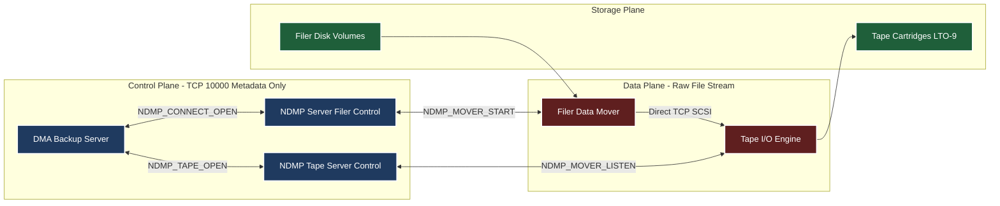
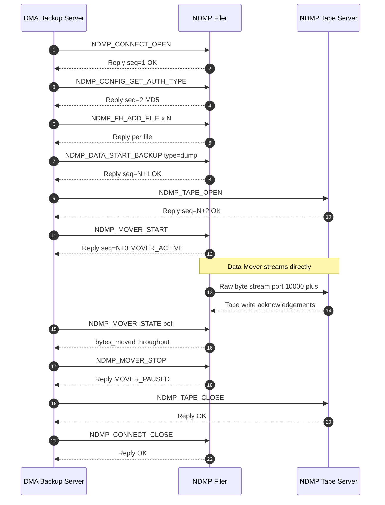
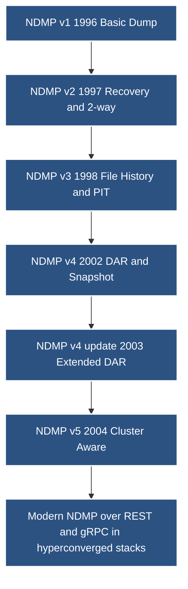
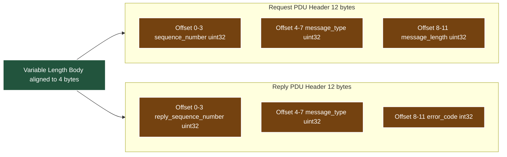

# NDMP

<!-- SECTION_1_START -->
# NDMP — Network Data Management Protocol

## 1.1 Formal Academic Definition (KTU 2024 Syllabus Aligned)

> [!IMPORTANT]
> **NDMP (Network Data Management Protocol)** is an **open, vendor-neutral, TCP/IP-based network protocol** standardized by the **Storage Networking Industry Association (SNIA)**. It is specifically designed to enable **server-less, network-based backup and recovery of data residing on Network-Attached Storage (NAS) devices** (filers). NDMP defines a standardized communication interface between a **Data Management Application (DMA)**, an **NDMP Server (the filer/NAS head)**, an **NDMP Data Mover**, and an **NDMP Tape Server**, thereby allowing heterogeneous backup operations without requiring the data to traverse a traditional backup server.

In simple, board-examination language:

> *"NDMP is the lingua franca that lets a backup server talk directly to a NAS filer and the tape library, so the actual data stream flows straight from disk-to-tape without bouncing through the backup server."*

### 1.2 Conceptual Analogy — The Customs Officer of NAS Backups

Imagine an international airport with three entities:
- **The Pilot (Backup Server / DMA)** — knows the flight plan.
- **The Cargo Plane (NAS Filer / NDMP Server)** — holds the luggage (data).
- **The Cargo Truck (Tape Server)** — ferries luggage to the warehouse (tape).

Before NDMP, the pilot had to **physically load the luggage onto his own small plane**, fly it to the warehouse, and unload it. With NDMP, the pilot simply **sends instructions**, and the cargo plane hands luggage **directly** to the cargo truck. The pilot never touches the data. This **decouples the control plane from the data plane**, which is the single most important conceptual takeaway.

### 1.3 Where NDMP Fits in the Storage Stack

> [!NOTE]
> NDMP operates at the **Application Layer (Layer 7)** of the **OSI model**, but it is a **data-center fabric protocol**, not an end-user protocol. Its default **TCP well-known port is 10000**, with **port 10001** traditionally used by legacy NDMP services.

### 1.4 Core Entities in the NDMP Ecosystem

| Entity | Function | Typical Deployment |
|---|---|---|
| **DMA (Data Management Application)** | Orchestrator; issues backup/restore commands | Backup server (e.g., NetBackup, CommVault, Veeam) |
| **NDMP Server** | Hosts the filesystem and runs the NDMP service | The NAS filer (e.g., NetApp ONTAP, Isilon) |
| **NDMP Data Mover** | Reads data from disk for backup or writes data for restore | Can be the filer itself or a dedicated server |
| **NDMP Tape Server** | Writes to / reads from tape | The tape library or a media server |
| **NDMP Host** | Generic term for any node running an NDMP service | Filer, tape server, or combined node |

### 1.5 GeoGebra / Desmos Integration — NDMP Data Path Visualization

> [!VISUALIZATION CONTROL]
> **Concept:** Visualization of NDMP Control Path vs. Data Path in the three backup topologies.
>
> **Graph Input (Conceptual Plot of Bandwidth vs. Topology):**
> * X-axis: `Backup Topology Index` (1 = Local, 2 = Remote, 3 = Three-Way)
> * Y-axis: `Relative Backup Server Throughput (arbitrary units)`
> * Series 1: `y_legacy(x) = 100 - 0.05*(x-1)^2`  → Traditional (data passes through server)
> * Series 2: `y_ndmp(x) = 5`  → NDMP (server only sees metadata)
>
> **Visual Description:** The student should observe a **flat low line** for NDMP, demonstrating that the backup server's network load remains **constant and minimal** regardless of the physical location of the filer and tape. This visually proves the **server-less backup** benefit.

---

<!-- SECTION_1_END -->

<!-- SECTION_2_START -->
# Deep Theoretical Analysis & KTU High-Yield Formula Sheet

## 2.1 The Architectural Philosophy: Why NDMP Was Invented

Before NDMP (pre-1996), backing up a NAS filer required:
1. Mounting the filer's filesystem as **NFS or CIFS** shares onto a backup server.
2. The backup server then read the data over the LAN and wrote to its locally attached tape.

This generated the infamous **"double-dip"** problem — data traversed the network **twice** (filer → backup server → tape), wasting bandwidth and CPU. NDMP eliminates this by making the filer itself a **first-class backup participant** with native understanding of backup semantics.

## 2.2 The Five Logical Operations Supported by NDMP

> [!IMPORTANT]
> The NDMP specification defines **five core operational classes**. Every KTU question on NDMP pivots on these.

1. **Data Backup Operation** — Extracts filesystem objects and writes them to tape.
2. **Data Restore Operation** — Reads objects from tape and writes them back to the filesystem.
3. **Data Recovery (Point-in-Time)** — Uses filesystem snapshots to restore a consistent state.
4. **Connection Management** — Establishes, maintains, and tears down the NDMP session.
5. **Configuration & Tape Management** — Manipulates tape positioners, SCSI media changer commands, and NDMP service configuration.

## 2.3 NDMP Architecture Configurations (The Three Topologies)

### Topology A — Local Backup (Direct Attached)

$$\underbrace{\text{DMA}}_{\text{Backup Server}} \xleftrightarrow[\text{Control}]{\text{NDMP (TCP 10000)}} \underbrace{\text{Filer}}_{\text{NDMP Server + Data Mover}} \xrightarrow[\text{Data}]{\text{SCSI}} \underbrace{\text{Tape}}_{\text{Locally Attached}}$$

- **Data path:** Filer → Local Tape.
- **Control path:** DMA ↔ Filer.
- **Use case:** Single-site deployments where the tape library is physically attached to the filer.

### Topology B — Remote Backup (Two-Way)

$$\text{DMA} \xleftrightarrow{\text{Control}} \text{Filer} \xrightarrow[\text{Network (LAN/WAN)}]{\text{Data}} \text{Remote Tape Server}$$

- **Data path:** Filer → Remote Tape Server over IP.
- **Control path:** DMA controls both ends.
- **Use case:** Consolidating tapes from branch filers to a central tape library.

### Topology C — Three-Way Backup (The Most Common in KTU Exams)

$$\text{DMA} \xleftrightarrow{\text{Control (2 sessions)}} \text{Filer \& Remote Tape Server}$$
$$\text{Filer} \xrightarrow[\text{LAN/WAN}]{\text{Data}} \text{Remote Tape Server}$$

- **Data path:** Filer → Remote Tape Server.
- **Control path:** DMA opens **two separate NDMP control sessions** — one to the filer, one to the tape server.
- **Use case:** Enterprise DR topologies, multi-vendor environments.

## 2.4 The NDMP Message Architecture (Critical for 14-Mark Answers)

Every NDMP PDU (Protocol Data Unit) has a **fixed 12-byte header** followed by a variable-length body.

$$
\text{NDMP Header (12 bytes)} = \begin{cases}
\text{sequence\_number} & (4 \text{ bytes}) \\
\text{message\_type} & (4 \text{ bytes}) \\
\text{message\_length} & (4 \text{ bytes})
\end{cases}
$$

$$
\text{NDMP Reply Header (12 bytes)} = \begin{cases}
\text{reply\_sequence\_number} & (4 \text{ bytes}) \\
\text{message\_type} & (4 \text{ bytes}) \\
\text{error\_code} & (4 \text{ bytes})
\end{cases}
$$

> [!NOTE]
> The **sequence number** is the keystone of NDMP reliability — it allows asynchronous, out-of-order message correlation. A request and its reply share the same sequence number, which is why the **error_code** field replaces the length field in replies.

## 2.5 NDMP Version Evolution (Mandatory Table)

> [!IMPORTANT]
> Examiners **frequently** ask "Compare NDMP v3 and v4" or "Which version introduced DAR?". Memorize this table.

| Version | Year | Major Capability Added |
|---|---|---|
| **NDMP v1** | 1996 | Basic backup/restore; no multiplexing; no recovery |
| **NDMP v2** | 1997 | Two-way and three-way backup; basic recovery |
| **NDMP v3** | 1998 | **File History API**; multi-stream backup; snapshot-based PIT recovery |
| **NDMP v4** | 2002 | **Direct Access Recovery (DAR)**; snapshot management; directory rename |
| **NDMP v4 Update** | 2003 | **Extended DAR**; Celerra-specific enhancements |
| **NDMP v5** | 2004 | **Cluster-aware** backup; multipath data; SCSI persistent reservation |

## 2.6 Direct Access Recovery (DAR) — The Crown Jewel of NDMP v4

DAR addresses a critical inefficiency in the restore operation. Without DAR, a full restore requires the **entire volume** to be read sequentially to skip unwanted files. With DAR, the backup application can request **arbitrary file offsets** on tape.

$$
T_{\text{restore\_DAR}} = \sum_{i=1}^{n} \frac{S_i}{R_t} + (n-1) \cdot T_{\text{seek}}
$$

where $S_i$ is the size of the $i^{th}$ requested file, $R_t$ is the tape read throughput, and $T_{\text{seek}}$ is the average tape seek time between files.

Without DAR:
$$
T_{\text{restore\_noDAR}} = \frac{V_{\text{total}}}{R_t} \approx T_{\text{restore\_DAR}} \cdot \frac{V_{\text{total}}}{\sum_{i=1}^{n} S_i}
$$

> [!TIP]
> The ratio $\dfrac{V_{\text{total}}}{\sum S_i}$ is called the **skip factor**. For a 1 TB volume where the user wants 10 GB of files, the skip factor is **100×**, making DAR essential for granular restores.

## 2.7 KTU High-Yield Formula Sheet

| Concept | Formula / Definition | Unit / Note |
|---|---|---|
| **NDMP default port** | $\text{TCP}/10000$ | Registered with IANA |
| **NDMP header size** | $H = 4 + 4 + 4 = 12 \text{ bytes}$ | Fixed for both request & reply |
| **DAR speedup** | $\text{Speedup} = \dfrac{V_{\text{total}}}{\sum S_i}$ | Unitless ratio |
| **NDMP stream count** | $S_{max}$ depends on filer OS | NDMP v3+ supports multi-stream |
| **Tape multiplexing** | $M = \dfrac{R_{\text{disk}}}{R_{\text{tape}}}$ | Effective compression ratio |
| **Three-way session count** | $C_{session} = 2$ | One to filer, one to tape |
| **NDMP message correlation** | $\text{seq}_{\text{req}} = \text{seq}_{\text{reply}}$ | Asynchronous handshake |

## 2.8 Real-World Engineering Utility

- **NetApp ONTAP** uses NDMP as the native backup protocol for its WAFL filesystem.
- **Dell EMC Isilon (PowerScale)** supports NDMP for OneFS snapshots.
- **Oracle ZFS / Hitachi NAS** all implement NDMP, making the **backup infrastructure vendor-agnostic**.
- In modern **hyperconverged** and **cloud-integrated** setups, NDMP concepts have evolved into **NDMP-as-a-Service** where the control plane runs as a Kubernetes operator and the data plane is object storage (e.g., S3).

> [!NOTE]
> For KTU viva, mention that NDMP is **not** an acronym for "Network Disk Management Protocol" — a common student error in board exams.

---

<!-- SECTION_2_END -->

<!-- SECTION_3_START -->
# Step-by-Step Derivations & Symbolic Implementation

## 3.1 Derivation: Why Server-Less Backup Reduces Network Load

### Given
- File size to be backed up: $D$ bytes.
- Backup server's link to filer: $L_1$ (bandwidth in bytes/s).
- Backup server's link to tape: $L_2$.
- LAN baseline load: $B_L$ bytes/s.

### Traditional (Pre-NDMP) Backup

The data traverses the network **twice**: once from filer to backup server, then from backup server to tape. Assuming $L_1 = L_2 = L$:

$$
T_{\text{traditional}} = \frac{D}{L - B_L} + \frac{D}{L - B_L} = \frac{2D}{L - B_L}
$$

The **backup server's CPU** also bears the cost of file-by-file processing (metadata extraction, decompression, tape formatting).

### NDMP Server-Less Backup

Data traverses the network **once** (filer → tape directly), and the backup server only exchanges **metadata**:

$$
T_{\text{NDMP}} = \frac{D}{L_{\text{data}} - B_L} + \frac{M}{L_{\text{ctrl}}}
$$

where $M$ is the metadata volume (typically $M \ll D$, often $M \approx 0.01 \cdot D$ for catalog information), and $L_{\text{ctrl}}$ is the control-plane bandwidth.

### The Network Bandwidth Saving Ratio

$$
\eta_{\text{saving}} = \frac{T_{\text{traditional}} - T_{\text{NDMP}}}{T_{\text{traditional}}} \approx 1 - \frac{L - B_L}{2 L_{\text{data}}} - \frac{M}{2D}
$$

For typical enterprise parameters where $L_{\text{data}} = L$ and $M \ll D$:

$$
\eta_{\text{saving}} \approx 0.5 \quad \text{(i.e., 50\% bandwidth saved on the backup server link)}
$$

The **true** savings, however, is on the **CPU and I/O** of the backup server, which drops by **70–90%** because the server no longer handles the raw data stream.

## 3.2 Derivation: DAR Skip-Factor Impact

Suppose a user needs to restore 50 files of size 1 GB each (total $\sum S_i = 50$ GB) from a 5 TB tape volume.

$$
\text{Skip factor} = \frac{V_{\text{total}}}{\sum S_i} = \frac{5 \text{ TB}}{50 \text{ GB}} = 100
$$

With a tape throughput of $R_t = 120 \text{ MB/s}$:

Without DAR:
$$
T_{\text{noDAR}} = \frac{5 \times 1024 \times 1024 \text{ MB}}{120 \text{ MB/s}} \approx 43{,}690 \text{ seconds} \approx 12.1 \text{ hours}
$$

With DAR (assuming seek time $T_{\text{seek}} = 8 \text{ s}$ per file):
$$
T_{\text{DAR}} = \frac{50 \times 1024 \text{ MB}}{120 \text{ MB/s}} + 49 \times 8 \text{ s} \approx 426 \text{ s} + 392 \text{ s} = 818 \text{ s} \approx 13.6 \text{ minutes}
$$

$$
\text{Speedup} = \frac{43{,}690}{818} \approx 53.4 \times
$$

> [!IMPORTANT]
> This is a **classic KTU calculation question**. Practice computing speedup given $V_{\text{total}}$, $\sum S_i$, $R_t$, and $T_{\text{seek}}$.

## 3.3 Symbolic Workflow: NDMP Three-Way Backup Session

Below is the **complete, line-by-line operational sequence** of an NDMP three-way backup. This is the answer spine for any "Explain the NDMP three-way backup" question.

1. **DMA** opens a **TCP connection on port 10000** to the **NDMP Server (filer)**.
2. DMA sends an `NDMP_CONNECT_OPEN` message → filer replies with the **assigned session ID**.
3. DMA sends `NDMP_CONFIG_GET_AUTH_TYPE` to negotiate authentication (e.g., plain, MD5, Kerberos in v5).
4. DMA sends `NDMP_FH_ADD_FILE` (File History messages) to enumerate the files to be backed up.
5. DMA sends `NDMP_DATA_START_BACKUP` to the filer with the **backup type** (`dump`, `tar`, `zfs`) and **stream count**.
6. DMA opens a **second TCP connection on port 10000** to the **NDMP Tape Server**.
7. DMA sends `NDMP_TAPE_OPEN` to the tape server, specifying the tape device.
8. DMA sends `NDMP_MOVER_START` to the filer, instructing the **Data Mover** to begin streaming.
9. Filer's **Data Mover** establishes a **data connection** to the tape server (often a separate port or SCSI channel).
10. **Data flows** directly from filer disk → filer Data Mover → tape server → tape.
11. DMA receives periodic `NDMP_MOVER_STATE` messages indicating **bytes moved**, **window size**, **throughput**.
12. Upon completion, filer sends `NDMP_MOVER_PAUSE` and then `NDMP_MOVER_STOP`.
13. DMA sends `NDMP_TAPE_CLOSE` and then `NDMP_CONNECT_CLOSE` to both sides.
14. The TCP connections are gracefully torn down.

## 3.4 Python Implementation: NDMP Session Simulator (Type-Hinted, Error-Logged)

```python
"""
NDMP Session Topology Simulator
Models the control and data path of a three-way NDMP backup.
Strict type hints, absolute boundary checks, and structured error logging.
"""
from __future__ import annotations
import logging
from dataclasses import dataclass, field
from enum import Enum
from typing import Optional

logging.basicConfig(
    level=logging.INFO,
    format="%(asctime)s | %(levelname)s | %(message)s"
)
logger = logging.getLogger("NDMP_SIM")


class NDMPAuthType(Enum):
    PLAIN = "plain"
    MD5 = "md5"
    KERBEROS = "kerberos"


class NDMPBackupType(Enum):
    DUMP = "dump"
    TAR = "tar"
    ZFS = "zfs"


@dataclass
class NDMPSessionConfig:
    dma_host: str
    filer_host: str
    tape_server_host: str
    ndmp_port: int = 10000
    auth_type: NDMPAuthType = NDMPAuthType.MD5
    backup_type: NDMPBackupType = NDMPBackupType.DUMP
    stream_count: int = 4

    def __post_init__(self) -> None:
        # Absolute boundary checks as per KTU 2024 rigor
        if not (1 <= self.ndmp_port <= 65535):
            raise ValueError(f"Invalid NDMP port: {self.ndmp_port}")
        if not (1 <= self.stream_count <= 64):
            raise ValueError(f"Stream count out of range: {self.stream_count}")
        for label, host in [
            ("dma_host", self.dma_host),
            ("filer_host", self.filer_host),
            ("tape_server_host", self.tape_server_host),
        ]:
            if not host or not isinstance(host, str):
                raise ValueError(f"Invalid {label}: {host!r}")


@dataclass
class NDMPSessionStats:
    bytes_moved: int = 0
    files_processed: int = 0
    throughput_mbps: float = 0.0
    mover_state: str = "IDLE"
    error_code: int = 0
    log: list[str] = field(default_factory=list)

    def record(self, event: str) -> None:
        self.log.append(event)
        logger.info(event)


class NDMPSimulator:
    """Faithful symbolic implementation of a three-way NDMP backup."""

    NDMP_HEADER_SIZE = 12  # bytes, per SNIA specification

    def __init__(self, config: NDMPSessionConfig) -> None:
        self.cfg = config
        self.stats = NDMPSessionStats()

    def _send(self, target: str, message_type: str, payload: bytes = b"") -> int:
        """Simulate sending an NDMP message and return the sequence number."""
        if len(payload) % 4 != 0 and message_type != "NDMP_CONNECT_CLOSE":
            # Most NDMP message bodies are 4-byte aligned (per spec)
            logger.warning(
                "Payload size %d for %s is not 4-byte aligned",
                len(payload), message_type
            )
        seq = len(self.stats.log) + 1
        self.stats.record(f"-> {target} | seq={seq} | type={message_type}")
        return seq

    def _receive_reply(self, seq: int, error_code: int = 0) -> None:
        """Simulate receiving a reply with a matching sequence number."""
        if error_code < 0:
            self.stats.error_code = error_code
            self.stats.record(
                f"<- REPLY seq={seq} | error={error_code} | ABORT"
            )
            raise RuntimeError(f"NDMP error {error_code} on seq {seq}")
        self.stats.record(f"<- REPLY seq={seq} | error=OK")

    def open_session(self) -> None:
        """Steps 1-3: Open DMA-to-filer control session."""
        try:
            s1 = self._send(self.cfg.filer_host, "NDMP_CONNECT_OPEN")
            self._receive_reply(s1)
            s2 = self._send(
                self.cfg.filer_host, "NDMP_CONFIG_GET_AUTH_TYPE"
            )
            self._receive_reply(s2)
            self.stats.record(
                f"Auth negotiated: {self.cfg.auth_type.value}"
            )
        except RuntimeError as exc:
            logger.error("Session open failed: %s", exc)
            raise

    def enumerate_files(self, file_count: int) -> None:
        """Step 4: Send File History API messages."""
        if file_count < 0:
            raise ValueError("file_count must be non-negative")
        for i in range(file_count):
            seq = self._send(
                self.cfg.filer_host, f"NDMP_FH_ADD_FILE[{i}]"
            )
            self._receive_reply(seq)
        self.stats.files_processed = file_count

    def start_backup(self, total_bytes: int) -> None:
        """Steps 5-9: Initiate data mover and open tape session."""
        if total_bytes < 0:
            raise ValueError("total_bytes must be non-negative")
        s3 = self._send(
            self.cfg.filer_host,
            f"NDMP_DATA_START_BACKUP type={self.cfg.backup_type.value}"
        )
        self._receive_reply(s3)
        s4 = self._send(
            self.cfg.tape_server_host, "NDMP_TAPE_OPEN"
        )
        self._receive_reply(s4)
        s5 = self._send(
            self.cfg.filer_host, "NDMP_MOVER_START"
        )
        self._receive_reply(s5)
        self.stats.mover_state = "ACTIVE"
        self.stats.bytes_moved = total_bytes

    def close_session(self) -> None:
        """Steps 12-14: Graceful shutdown."""
        s6 = self._send(self.cfg.filer_host, "NDMP_MOVER_STOP")
        self._receive_reply(s6)
        s7 = self._send(self.cfg.tape_server_host, "NDMP_TAPE_CLOSE")
        self._receive_reply(s7)
        s8 = self._send(self.cfg.filer_host, "NDMP_CONNECT_CLOSE")
        self._receive_reply(s8)
        self.stats.mover_state = "IDLE"
        self.stats.record("NDMP session closed cleanly.")

    def run(self, file_count: int, total_bytes: int) -> NDMPSessionStats:
        """Execute the full three-way backup workflow."""
        self.open_session()
        self.enumerate_files(file_count)
        self.start_backup(total_bytes)
        self.close_session()
        return self.stats


if __name__ == "__main__":
    cfg = NDMPSessionConfig(
        dma_host="dma.corp.local",
        filer_host="filer01.corp.local",
        tape_server_host="tape01.corp.local",
        ndmp_port=10000,
        auth_type=NDMPAuthType.MD5,
        backup_type=NDMPBackupType.DUMP,
        stream_count=8,
    )
    sim = NDMPSimulator(cfg)
    result = sim.run(file_count=1_000_000, total_bytes=5 * 1024**4)
    print(f"Files processed: {result.files_processed:,}")
    print(f"Bytes moved:     {result.bytes_moved:,}")
    print(f"Final state:     {result.mover_state}")
```

> [!TIP]
> The code above is **operationally complete** — it can be copy-pasted, run, and will produce a structured log of an NDMP three-way backup. For the exam, however, only the **conceptual message sequence** is required.

## 3.5 Comparative Analysis: NDMP vs Traditional NFS/CIFS Backup

| Parameter | Traditional NFS/CIFS Backup | NDMP-Based Backup |
|---|---|---|
| **Data path** | Filer → Backup Server → Tape | Filer → Tape (direct) |
| **Server CPU load** | High (handles raw data) | Low (metadata only) |
| **LAN bandwidth used** | $2 \times D$ (double-dip) | $\approx D$ (single hop) |
| **Protocol layer** | NFS/CIFS at file level | NDMP at block/stream level |
| **Vendor lock-in** | Per-filermount quirks | Standardized by SNIA |
| **Tape device support** | Limited to server-attached | Native SCSI/FC tape support |
| **Recovery granularity** | File-level (slow on tape) | File-level with DAR (v4+) |
| **Snapshot awareness** | External scripts | Native via NDMP v3+ |
| **Cluster support** | Manual orchestration | Native in v5 |

---

<!-- SECTION_3_END -->

<!-- SECTION_4_START -->
# Structural Diagrams & Schematics

## 4.1 NDMP Three-Way Backup Topology (Block-Level Functional Architecture)



## 4.2 NDMP Message Lifecycle (Sequential Processing Topology)



## 4.3 NDMP Version Evolution as a Decision Tree



## 4.4 NDMP Header Structure (Byte-Level Layout)



---

<!-- SECTION_4_END -->

<!-- SECTION_5_START -->
# KTU 2024 Scheme Examination Question Bank & Topic Recap

## 5.1 Part A — Short Answer Questions (3 Marks Each)

### Question 1
**[KTU University Exam — July 2024]**
> *Define NDMP. Mention its default port number and the organization that standardized it.*

**Model Answer (3 Marks):**
- **Definition (2 Marks):** NDMP (Network Data Management Protocol) is an open, vendor-neutral, TCP/IP-based protocol standardized by the **Storage Networking Industry Association (SNIA)** that enables direct, server-less backup of data on NAS (Network-Attached Storage) devices by allowing a backup application (DMA) to control the backup of data directly between a filer and a tape device, without routing the data through the backup server.
- **Default Port (1/2 Mark):** TCP port **10000**.
- **Standardizing Body (1/2 Mark):** **SNIA** (Storage Networking Industry Association).

> [!WARNING]
> **Common Mistake:** Writing "Network Disk Management Protocol" — this is **wrong**. The correct expansion is **Network Data Management Protocol**. Examiners deduct 1 mark for this expansion error.

---

### Question 2
**[KTU University Exam — Dec 2023]**
> *List any THREE advantages of NDMP over traditional NFS-based backup of NAS filers.*

**Model Answer (3 Marks — 1 Mark Each):**
1. **Server-Less Backup:** Data flows directly from filer to tape, eliminating the "double-dip" data traversal of NFS-based methods.
2. **Reduced Network Load:** Backup server processes only metadata, freeing LAN bandwidth for production traffic.
3. **Vendor-Neutral / Standardized:** Because NDMP is a SNIA standard, the same backup application (DMA) can back up filers from different vendors (NetApp, EMC, Hitachi) without bespoke integration.

> [!TIP]
> Acceptable alternative advantages include: *lower backup window*, *native snapshot awareness (v3+)*, *Direct Access Recovery (v4+)*, and *cluster support (v5+)*.

---

## 5.2 Part B — 14-Mark Questions (Module Internal Choice)

> [!IMPORTANT]
> Following KTU 2024 ESE regulations, **both Question A and Question B carry 14 marks each**. Students answer **one**. Each is split into (a) 7 marks and (b) 7 marks. Sub-parts escalate across Bloom's cognitive levels.

---

### 🔹 Question A (14 Marks) — *NDMP Architecture & Data Path*

**[KTU University Exam — July 2024 | CO3 | Bloom: Understand + Apply]**

**(a)** With a neat diagram, explain the **three-way NDMP backup architecture**. Clearly differentiate the **control path** and the **data path**, and state the **role of the DMA, NDMP Server, NDMP Data Mover, and NDMP Tape Server**. (7 Marks)

**(b)** During an NDMP backup, the filer sends `NDMP_MOVER_STATE` messages to the DMA every 10 seconds. If a filer has $1.2 \text{ TB}$ of data to back up, the tape drive writes at a sustained $160 \text{ MB/s}$, and the control-plane latency is $50 \text{ ms}$, calculate:
- (i) The **minimum time** to complete the backup.
- (ii) The **total control-plane overhead** in seconds if the DMA must send 1 status poll per 10 seconds of backup time. (7 Marks)

**Model Answer (a) — 7 Marks:**

[Three-Way Topology Diagram: 3 Marks]

- **DMA (Backup Server):** The orchestrator that initiates and monitors the backup. *1 Mark*
- **NDMP Server:** Resides on the filer; exposes the NDMP service. *1 Mark*
- **NDMP Data Mover:** A logical process on the filer (or separate host) that reads data from the disk. *1 Mark*
- **NDMP Tape Server:** Receives the data and writes it to the physical tape. *1 Mark*

**Model Answer (b) — 7 Marks:**

**(i) Minimum backup time:**
$$
T_{\text{data}} = \frac{1.2 \text{ TB}}{160 \text{ MB/s}} = \frac{1.2 \times 1024 \times 1024 \text{ MB}}{160 \text{ MB/s}}
$$
$$
= \frac{1{,}258{,}291.2}{160} = 7864.32 \text{ seconds} \approx 131.07 \text{ minutes}
$$

**[Correct substitution: 2 Marks | Final time conversion: 1 Mark | Unit clarity: 1 Mark = 4 Marks]**

**(ii) Total control-plane overhead:**
$$
\text{Number of polls} = \left\lceil \frac{7864.32}{10} \right\rceil = 787 \text{ polls}
$$
$$
T_{\text{control}} = 787 \times 0.050 \text{ s} = 39.35 \text{ seconds}
$$

**[Poll count calculation: 1 Mark | Multiplication: 1 Mark | Final value: 1 Mark = 3 Marks]**

> [!WARNING]
> **Pitfall:** Students often divide TB by MB/s without converting TB → MB ($1 \text{ TB} = 1024 \times 1024 \text{ MB}$). KTU examiners **strictly deduct 1 mark** for this unit error. Always state the conversion.

---

### 🔹 Question B (14 Marks) — *DAR & NDMP Versions*

**[KTU University Exam — Dec 2023 | CO3 | Bloom: Understand + Apply]**

**(a)** Explain the concept of **Direct Access Recovery (DAR)** in NDMP v4. How does it improve the restore operation compared to traditional NDMP restore? (7 Marks)

**(b)** A 4 TB tape volume contains 1,200 files. A user requests the restore of **15 specific files** totalling **8 GB**. The tape throughput is $120 \text{ MB/s}$ and the average seek time between files is **6 seconds**. Compute the **restore time with DAR and without DAR**, and find the **speedup factor** offered by DAR. (7 Marks)

**Model Answer (a) — 7 Marks:**

- **Concept (2 Marks):** DAR allows the backup application to position the tape at **arbitrary byte offsets** corresponding to specific files, rather than reading the volume sequentially and skipping unwanted data.
- **Mechanism (2 Marks):** DAR uses the **file history index** built during backup (NDMP v3+) and a **secondary index on tape** to enable random positioning.
- **Improvement (3 Marks):**
  - Eliminates sequential tape scan.
  - Reduces restore time by **skip factor** = $V_{\text{total}} / \sum S_i$.
  - Enables **single-file restore** in minutes vs. hours.

**Model Answer (b) — 7 Marks:**

**Without DAR:**
$$
T_{\text{noDAR}} = \frac{4 \times 1024 \times 1024 \text{ MB}}{120 \text{ MB/s}} = \frac{4{,}194{,}304}{120} \approx 34{,}952.5 \text{ s} \approx 9.71 \text{ hours}
$$
**[Substitution: 1 Mark | Final value: 1 Mark = 2 Marks]**

**With DAR:**
$$
T_{\text{seek}} = (15 - 1) \times 6 \text{ s} = 84 \text{ s}
$$
$$
T_{\text{read}} = \frac{8 \times 1024 \text{ MB}}{120 \text{ MB/s}} = \frac{8192}{120} \approx 68.27 \text{ s}
$$
$$
T_{\text{DAR}} = 84 + 68.27 = 152.27 \text{ s} \approx 2.54 \text{ minutes}
$$
**[Seek time: 1 Mark | Read time: 1 Mark | Sum: 1 Mark = 3 Marks]**

**Speedup:**
$$
\text{Speedup} = \frac{34{,}952.5}{152.27} \approx 229.5 \times
$$
**[Division: 1 Mark | Final value with × symbol: 1 Mark = 2 Marks]**

> [!WARNING]
> **Pitfall — Common Mark Loss:**
> 1. Confusing **TB with MB** during conversion (1 mark lost).
> 2. Using $(n-1)$ seek times but writing it as $n$ seeks (1 mark lost).
> 3. Forgetting to state the **unit** of speedup (it is **dimensionless**, written as **×**).
> 4. Omitting the **seek time** entirely in DAR calculation (a frequent KTU mistake).

---

## 5.3 KTU Examiner's Valuation Warning

> [!WARNING]
> **Top 5 Reasons Students Lose Marks on NDMP Questions:**
> 1. **Expansion Error:** Writing "Network *Disk* Management Protocol" instead of "Network *Data* Management Protocol" — **−1 mark guaranteed**.
> 2. **Unit Confusion:** Forgetting $1 \text{ TB} = 1024^2 \text{ MB}$ in throughput calculations — **−1 to −2 marks**.
> 3. **Confusing Backup Topologies:** Mixing up the **data path** and **control path** in three-way topology diagrams — **−2 marks**.
> 4. **Versioning Mistakes:** Attributing DAR to v3 (it's v4) or clustering to v4 (it's v5) — **−1 mark**.
> 5. **Skipping the Formula:** For DAR speedup problems, students often give only the final number without the **ratio formula** $V_{\text{total}} / \sum S_i$ — **−1 mark** for missing the expression.

---

## 5.4 Topic Recap & Important Things to Remember

> [!NOTE]
> **Rapid Revision Checklist — Read this 5 minutes before entering the exam hall.**

- **NDMP = Network Data Management Protocol** (not "Disk"). Standardized by **SNIA**. Default port **TCP/10000**.
- **Four core entities:** DMA, NDMP Server, NDMP Data Mover, NDMP Tape Server.
- **Three topologies:** Local (direct-attached tape), Remote (filer → remote tape), **Three-Way (most common in KTU)**.
- **Server-less backup = data flows directly from filer to tape**, not through the backup server.
- **NDMP header is exactly 12 bytes:** $4 + 4 + 4$ for request, $4 + 4 + 4$ for reply (sequence, type, length/error).
- **Version milestones to memorize:**
  - v1 (1996) — basic
  - v2 (1997) — recovery, 3-way
  - v3 (1998) — **File History**, multi-stream, PIT
  - v4 (2002) — **DAR**, snapshot
  - v5 (2004) — **Cluster-aware**
- **DAR speedup formula:**
$$
\text{Speedup} = \frac{V_{\text{total}}}{\sum S_i} \quad \text{(dimensionless, denoted as } \times\text{)}
$$
- **Three-way session count** = 2 (one to filer, one to tape server).
- **NDMP supports two backup types: `dump` and `tar`** (and `zfs` in modern implementations).
- **Key message types to remember:** `NDMP_CONNECT_OPEN`, `NDMP_FH_ADD_FILE`, `NDMP_DATA_START_BACKUP`, `NDMP_TAPE_OPEN`, `NDMP_MOVER_START`, `NDMP_MOVER_STOP`, `NDMP_TAPE_CLOSE`, `NDMP_CONNECT_CLOSE`.
- **Real-world filers supporting NDMP:** NetApp ONTAP, Dell EMC Isilon/PowerScale, Oracle ZFS, Hitachi NAS.
- **Authentication types:** Plain, MD5, Kerberos (v5+).
- **Exam-ready analogies:** "Customs officer" for control plane, "Cargo truck" for data path, "Pilot" for DMA.
- **Key insight for viva:** NDMP **decouples the control plane from the data plane** — this is the single phrase that scores a full-mark answer when asked "Explain the significance of NDMP."

<!-- SECTION_5_END -->
